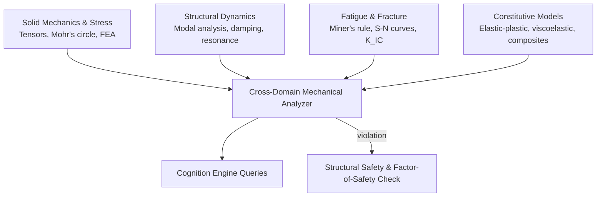

# AMOS Mechanical & Structural Systems Engine Layer Specification

**Origin Architect / Steward:** Trang Phan
**AMOS_CORE Target:** `v4.4`
**Epistemic Class:** `AMOS_MODEL`
**Conclusion Class:** `DERIVED`

> Bridge note — resolves the `amos-mechanical-structural-engine-layer` link from the Cosmo Brain MOC / daily notes to the real skill in the vault.
> **Skill location:** `.devin/skills/amos-mechanical-structural-engine-layer`
> **Source model:** `Mechanical_Structural_Model`

---

## 1. Purpose & Scope

The AMOS Mechanical & Structural Systems Engine Layer provides deterministic, queryable reasoning about solid mechanics, structural dynamics, continuum mechanics, finite element formulations, material constitutive behaviors, and mechanical fatigue life. It grounds the AMOS cognitive processes in physical stress, strain, vibration, and thermal deformation laws.

**Scope boundaries:**
- **In scope:** Static equilibrium, beam theory (Euler-Bernoulli / Timoshenko), 3D elasticity tensors, Finite Element Analysis (FEA) formulations, modal vibration analysis, fatigue life estimation (S-N curves, Miner's rule), fracture mechanics ($K_{IC}$ stress intensity), and nonlinear buckling criteria.
- **Out of scope:** Fundamental quantum/atomic physics (delegated to [[11_KNOWLEDGE/engine/AMOS_PHYSICS_COSMOS_ENGINE_LAYER|Physics Engine]]), numerical linear algebra solvers (delegated to [[11_KNOWLEDGE/engine/AMOS_NUMERICAL_METHODS_ENGINE_LAYER|Numerical Methods Engine]]).

---

## 2. Architecture

The mechanical structural engine implements a 4-domain knowledge structure: solid mechanics & stress analysis, structural dynamics & vibration, fatigue & fracture, and materials constitutive models.

---

## 3. Layer Components

### 3.1 Solid Mechanics & Stress Analysis Domain

Encodes continuum mechanics and structural equilibrium:
- **Cauchy Stress Tensor:** Equilibrium equation $\nabla \cdot \boldsymbol{\sigma} + \mathbf{b} = \rho \ddot{\mathbf{u}}$ with symmetry $\boldsymbol{\sigma} = \boldsymbol{\sigma}^T$.
- **Infinitesimal Strain Tensor:** $\boldsymbol{\epsilon} = \frac{1}{2}(\nabla \mathbf{u} + (\nabla \mathbf{u})^T)$ and Saint-Venant compatibility equations.
- **Yield Criteria:** von Mises equivalent stress $\sigma_v = \sqrt{\frac{1}{2}[(\sigma_1 - \sigma_2)^2 + (\sigma_2 - \sigma_3)^2 + (\sigma_3 - \sigma_1)^2]} \le \sigma_y / \text{FoS}$; Tresca maximum shear stress criterion.
- **Beam & Plate Theories:** Euler-Bernoulli bending $EI \frac{d^4 w}{dx^4} = q(x)$; Timoshenko shear deformation corrections; Kirchhoff-Love plate theory.

### 3.2 Structural Dynamics & Vibration Domain

Encodes oscillatory and dynamic transient behaviors:
- **Equations of Motion:** $\mathbf{M} \ddot{\mathbf{u}} + \mathbf{C} \dot{\mathbf{u}} + \mathbf{K} \mathbf{u} = \mathbf{F}(t)$.
- **Modal Analysis:** Generalized eigenvalue problem $\det(\mathbf{K} - \omega_i^2 \mathbf{M}) = 0$ solving natural frequencies $\omega_i$ and mode shapes $\boldsymbol{\phi}_i$.
- **Damping Formulations:** Rayleigh proportional damping $\mathbf{C} = \alpha \mathbf{M} + \beta \mathbf{K}$; modal damping ratio $\zeta_i = \frac{c_i}{2 m_i \omega_i}$.
- **Resonance & Vibration Isolation:** Transmissibility ratio $T_R = \sqrt{\frac{1 + (2\zeta r)^2}{(1 - r^2)^2 + (2\zeta r)^2}}$ with frequency ratio $r = \omega / \omega_n$.

### 3.3 Fatigue, Fracture & Reliability Domain

Encodes progressive structural degradation and failure modes:
- **High-Cycle Fatigue:** Basquin's equation $\sigma_a = \sigma_f' (2N_f)^b$; Wöhler S-N curves; Goodman / Gerber mean stress corrections.
- **Cumulative Damage:** Palmgren-Miner linear damage accumulation rule $D = \sum_{i=1}^k \frac{n_i}{N_i} \le D_{\text{crit}} = 1.0$.
- **Linear Elastic Fracture Mechanics (LEFM):** Stress intensity factor $K_I = Y \sigma \sqrt{\pi a}$; fracture criterion $K_I \le K_{IC}$; Paris law crack growth rate $\frac{da}{dN} = C (\Delta K)^m$.

### 3.4 Materials & Constitutive Models Domain

Encodes mechanical material properties and constitutive relations:
- **Hooke's Generalized Law:** $\boldsymbol{\sigma} = \mathbf{C} : \boldsymbol{\epsilon}$ (isotropic: Young's modulus $E$, Poisson's ratio $\nu$, Shear modulus $G = \frac{E}{2(1+\nu)}$).
- **Elasto-Plasticity:** $J_2$ flow theory with isotropic / kinematic strain hardening $\sigma = \sigma_0 + K \epsilon_p^n$.
- **Orthotropic Composites:** Classical Laminate Theory (CLT), Tsai-Wu failure criterion for fiber-reinforced matrices.
- **Thermoelasticity:** Thermal strain $\boldsymbol{\epsilon}_{\text{th}} = \alpha \Delta T \mathbf{I}$; thermal stress generation in constrained assemblies.

---

## 4. Invariants

$$\begin{aligned}
\text{MECH-INV-01} &: \quad \text{Equilibrium: } \nabla \cdot \boldsymbol{\sigma} + \mathbf{b} = \rho \ddot{\mathbf{u}} \quad \text{(linear momentum conservation)} \\
\text{MECH-INV-02} &: \quad \text{Stress Symmetry: } \boldsymbol{\sigma} = \boldsymbol{\sigma}^T \quad \text{(angular momentum conservation)} \\
\text{MECH-INV-03} &: \quad \text{Yield Boundary: } \sigma_{\text{von\_Mises}} \le \frac{\sigma_{\text{yield}}}{\text{FoS}} \quad \text{with } \text{FoS} \ge 1.5 \\
\text{MECH-INV-04} &: \quad \text{Miner's Fatigue Bound: } D = \sum_{i=1}^k \frac{n_i}{N_i} < 1.0 \quad \text{(no unpredicted fatigue failure)} \\
\text{MECH-INV-05} &: \quad \text{Fracture Safety: } K_I = Y \sigma \sqrt{\pi a} < K_{IC} \quad \text{(no catastrophic brittle fracture)}
\end{aligned}$$

---

## 5. MECE Mapping

Within the [[00_ROOT/FULL_BRAIN_OS_MECE_ARCHITECTURE|Full Brain OS MECE Architecture]]:

- **Functional ownership:** AMOS BRAIN (world/system modeling — mechanical & structural domain)
- **Physical storage:** `11_KNOWLEDGE/engine/`
- **Authority precedence:** Bound by [[03_CONTROL_PLANE/03_CONTROL_PLANE_MOC|Control Plane]] and [[11_KNOWLEDGE/engine/ENGINEERING_STANDARDS_LIBRARY|Engineering Standards]]
- **Runtime call order:** Queried by [[11_KNOWLEDGE/engine/AMOS_COGNITION_ENGINE_LAYER|Cognition Engine]] during mechanical engineering reasoning
- **Evidence/validation status:** `AMOS_MODEL` / `DERIVED` — structurally specified; fundamental continuum laws are `SOURCE_CLAIM`, structural simulations are `AMOS_MODEL`

**MECE partition against sibling engines:**

| Engine | Domain | Overlap with Mechanical/Structural |
|:---|:---|:---|
| Physics Engine | Continuum / classical dynamics | Shares momentum equations & Hamiltonian mechanics |
| Electrical Power Engine | Electromechanical systems | Interfaces at motor shafts, actuator forces, and thermal sinks |
| Numerical Methods | FEA / matrix decomposition | Solves dynamic stiffness matrices $[\mathbf{K} - \omega^2 \mathbf{M}]$ |
| Engineering Standards | Codes & factors of safety | Enforces ASME, AISC, ISO safety margins |

---

## 6. Navigation & Bindings

**Parent MOC:** [[11_KNOWLEDGE/engine/ENGINE_MOC|ENGINE_MOC]]
**Knowledge MOC:** [[11_KNOWLEDGE/KNOWLEDGE_MOC|KNOWLEDGE_MOC]]
**Kernel MOC:** [[11_KNOWLEDGE/kernel/KERNEL_MOC|KERNEL_MOC]]
**Root:** [[00_ROOT/00_HOME|00_HOME]]

**Upstream dependencies:**
- [[11_KNOWLEDGE/engine/AMOS_PHYSICS_COSMOS_ENGINE_LAYER|Physics Engine]] — continuum mechanics foundations
- [[11_KNOWLEDGE/engine/AMOS_NUMERICAL_METHODS_ENGINE_LAYER|Numerical Methods Engine]] — FEA solver support
- [[11_KNOWLEDGE/engine/ENGINEERING_STANDARDS_LIBRARY|Engineering Standards]] — structural codes & FoS

**Downstream consumers:**
- [[11_KNOWLEDGE/engine/AMOS_COGNITION_ENGINE_LAYER|Cognition Engine]] — mechanical reasoning queries
- [[11_KNOWLEDGE/engine/AMOS_CODING_ENGINE_LAYER|Coding Engine]] — mechanical simulation code generation
- [[21_DOMAINS/15_SPACE_EXPLORATION/DOMAINS_SPACE_EXPLORATION_CONTRACT|Space Exploration Domain]] — spacecraft structural load calculations

---

> **Epistemic boundary:** Fundamental continuum mechanics laws (Cauchy, Hooke, Navier) are `SOURCE_CLAIM`. FEA approximations and fatigue predictions are `AMOS_MODEL` / `DERIVED`. `MODEL != OBSERVATION`.
