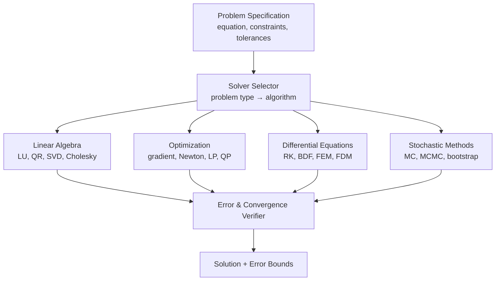

# AMOS Numerical Methods Engine Layer Specification

**Origin Architect / Steward:** Trang Phan  
**AMOS_CORE Target:** `v4.4`  
**Epistemic Class:** `AMOS_MODEL`  
**Conclusion Class:** `DERIVED`

> Bridge note — resolves the `amos-numerical-methods-engine-layer` link from the Cosmo Brain MOC / daily notes to the real skill in the vault.  
> **Skill location:** `.devin/skills/amos-numerical-methods-engine-layer`  
> **Source model:** `Numerical_Methods_Model`

---

## 1. Purpose & Scope

The AMOS Numerical Methods Engine Layer provides computational solvers, optimization algorithms, and simulation frameworks that support quantitative reasoning across all AMOS engine domains. It implements verified numerical algorithms with error bounds, convergence guarantees, and stability analysis.

**Scope boundaries:**
- **In scope:** Linear algebra solvers, optimization (convex and non-convex), ODE/PDE solvers, interpolation, integration, stochastic simulation, eigenvalue computation, matrix factorization.
- **Out of scope:** Domain-specific equation formulation (delegated to domain engines like [[11_KNOWLEDGE/engine/AMOS_PHYSICS_COSMOS_ENGINE_LAYER|Physics Engine]] and [[11_KNOWLEDGE/engine/AMOS_ELECTRICAL_POWER_ENGINE_LAYER|Electrical Power Engine]]).

---

## 2. Architecture

The numerical methods engine implements a 4-category solver taxonomy: linear algebra, optimization, differential equations, and stochastic methods. Each category provides verified algorithms with error bounds and convergence criteria.

---

## 3. Layer Components

### 3.1 Linear Algebra Solvers

Provides matrix computation primitives:

| Algorithm | Purpose | Complexity | Error Bound |
|:---|:---|:---|:---|
| LU decomposition | Linear systems $Ax = b$ | $O(n^3)$ | $\frac{\|x - \hat{x}\|}{\|x\|} \le \kappa(A) \cdot \epsilon_{\text{mach}}$ |
| QR decomposition | Least squares, eigenvalues | $O(mn^2)$ | $\|A\hat{x} - b\| \le (1 + \epsilon)\|Ax^* - b\|$ |
| SVD | Rank, pseudoinverse, PCA | $O(mn^2)$ | Singular values accurate to $\epsilon_{\text{mach}} \cdot \|A\|$ |
| Cholesky | SPD systems | $O(n^3/3)$ | $\|x - \hat{x}\| \le \kappa(A) \cdot \epsilon_{\text{mach}}$ |
| Conjugate gradient | Large sparse SPD | $O(n\sqrt{\kappa})$ | Residual $\le \epsilon$ in $\le n$ iterations |

### 3.2 Optimization Solvers

Provides optimization algorithms:

- **Unconstrained:** Gradient descent, Newton's method, quasi-Newton (BFGS, L-BFGS), conjugate gradient.
- **Constrained:** Linear programming (simplex, interior point), quadratic programming, sequential quadratic programming (SQP).
- **Convex optimization:** CVX-compatible modeling; disciplined convex programming.
- **Non-convex:** Simulated annealing, genetic algorithms, particle swarm — with `AMOS_MODEL` confidence (no global optimum guarantee).
- **Multi-objective:** Pareto ranking across 8 dimensions per `.devin/skills/amos-multi-objective-optimization`.

### 3.3 Differential Equation Solvers

Provides ODE and PDE solvers:

- **ODE initial value:** Runge-Kutta 4(5) adaptive (RK45), backward differentiation formula (BDF) for stiff systems, implicit Euler.
- **ODE boundary value:** Shooting method, finite difference, collocation.
- **PDE:** Finite difference method (FDM), finite element method (FEM), finite volume method (FVM).
- **Stability analysis:** CFL condition for explicit schemes; von Neumann stability analysis.
- **Error estimation:** Adaptive step size control with local truncation error estimation.

### 3.4 Stochastic Methods

Provides probabilistic computation methods:

- **Monte Carlo:** Crude MC, importance sampling, quasi-MC (Sobol sequences).
- **MCMC:** Metropolis-Hastings, Hamiltonian Monte Carlo (HMC), no-U-turn sampler (NUTS).
- **Bootstrap:** Non-parametric bootstrap for confidence interval estimation.
- **Stochastic differential equations:** Euler-Maruyama, Milstein scheme for SDE integration.

### 3.5 Solver Selector

Automatically selects the appropriate solver based on:
- **Problem type:** Linear, nonlinear, convex, non-convex, ODE, PDE, stochastic.
- **Problem size:** Small (direct methods), medium (sparse methods), large (iterative methods).
- **Condition number:** Ill-conditioned problems trigger regularization or higher-precision arithmetic.
- **Tolerance requirements:** User-specified tolerance determines algorithm and step size.

### 3.6 Error & Convergence Verifier

Validates solver outputs:
- **Residual checking:** $\|Ax - b\|$, $\|\nabla f(x)\|$, etc.
- **Convergence certification:** Verifies that convergence criteria are met within specified tolerance.
- **Error bound computation:** Provides a posteriori error bounds for every solution.
- **Stability warning:** Flags solutions near stability boundaries.

---

## 4. Invariants

$$\begin{aligned}
\text{NUM-INV-01} &: \quad \text{Every solution carries an error bound: } x \pm \Delta x \\
\text{NUM-INV-02} &: \quad \text{Convergence is certified before solution is accepted} \\
\text{NUM-INV-03} &: \quad \text{Non-converged solutions are flagged as UNKNOWN/GAP, not reported as solved} \\
\text{NUM-INV-04} &: \quad \text{Ill-conditioned problems } (\kappa > 10^{12}) \text{ trigger regularization or higher precision} \\
\text{NUM-INV-05} &: \quad \text{Non-convex optimization results are AMOS\_MODEL (no global optimum guarantee)}
\end{aligned}$$

---

## 5. MECE Mapping

Within the [[00_ROOT/FULL_BRAIN_OS_MECE_ARCHITECTURE|Full Brain OS MECE Architecture]]:

- **Functional ownership:** AMOS BRAIN (computation + capability)
- **Physical storage:** `11_KNOWLEDGE/engine/`
- **Authority precedence:** Bound by [[03_CONTROL_PLANE/03_CONTROL_PLANE_MOC|Control Plane]] — solver results do not override epistemic invariants
- **Runtime call order:** Called by domain engines (Physics, Electrical, Cognition) for quantitative computation
- **Evidence/validation status:** `AMOS_MODEL` / `DERIVED` — algorithms are `SOURCE_CLAIM` (established mathematics); implementations are `AMOS_MODEL`

**MECE partition against sibling engines:**

| Engine | Domain | Overlap with Numerical Methods |
|:---|:---|:---|
| Physics Engine | Physical systems | Provides equations to solve |
| Electrical Power Engine | Power systems | Provides power flow equations |
| Cognition Engine | Bayesian inference | Uses optimization for free energy minimization |
| Coding Engine | Code generation | Generates solver implementations |

---

## 6. Navigation & Bindings

**Parent MOC:** [[11_KNOWLEDGE/engine/ENGINE_MOC|ENGINE_MOC]]  
**Knowledge MOC:** [[11_KNOWLEDGE/KNOWLEDGE_MOC|KNOWLEDGE_MOC]]  
**Kernel MOC:** [[11_KNOWLEDGE/kernel/KERNEL_MOC|KERNEL_MOC]]  
**Root:** [[00_ROOT/00_HOME|00_HOME]]

**Upstream dependencies:**
- [[22_RESEARCH/01_MATHEMATICS/AMOS_137_MATH_REGISTRY|AMOS 137 Math Registry]] — mathematical foundations
- [[01_CANON/01_CORE_LAWS/AMOS_CORE_LAWS|AMOS Core Laws]] — epistemic invariants
- [[16_SCHEMAS/16_SCHEMAS_MOC|Schemas]] — tensor I/O schemas

**Downstream consumers:**
- [[11_KNOWLEDGE/engine/AMOS_PHYSICS_COSMOS_ENGINE_LAYER|Physics Engine]] — physical equation solving
- [[11_KNOWLEDGE/engine/AMOS_ELECTRICAL_POWER_ENGINE_LAYER|Electrical Power Engine]] — power flow computation
- [[11_KNOWLEDGE/engine/AMOS_COGNITION_ENGINE_LAYER|Cognition Engine]] — free energy minimization
- [[11_KNOWLEDGE/engine/AMOS_CODING_ENGINE_LAYER|Coding Engine]] — solver code generation

**Peer engines:**
- [[11_KNOWLEDGE/engine/AMOS_PHYSICS_COSMOS_ENGINE_LAYER|Physics Engine]]
- [[11_KNOWLEDGE/engine/AMOS_ELECTRICAL_POWER_ENGINE_LAYER|Electrical Power Engine]]
- [[11_KNOWLEDGE/engine/AMOS_COGNITION_ENGINE_LAYER|Cognition Engine]]

**Related skills:**
- `.devin/skills/amos-numerical-methods-engine-layer`
- `.devin/skills/amos-multi-objective-optimization`
- `.devin/skills/amos-tech-engine-vinfinity`

**Full Brain OS Architecture:** [[00_ROOT/FULL_BRAIN_OS_MECE_ARCHITECTURE|FULL_BRAIN_OS_MECE_ARCHITECTURE]]

---

> **Epistemic boundary:** Numerical algorithms are `SOURCE_CLAIM` (established mathematics). Solver implementations and results are `AMOS_MODEL` / `DERIVED`. Non-converged solutions are `UNKNOWN/GAP`. `MODEL != OBSERVATION`.
