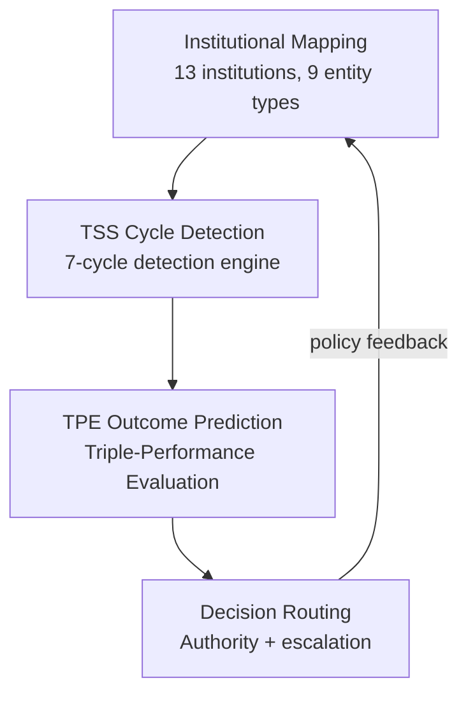

# AMOS Organizational Governance Engine Layer Specification

**Origin Architect / Steward:** Trang Phan
**AMOS_CORE Target:** `v4.4`
**Epistemic Class:** `AMOS_MODEL`
**Conclusion Class:** `DERIVED`

> Bridge note — resolves the `amos-org-governance-engine-layer` link from the Cosmo Brain MOC / daily notes to the real skill in the vault.
> **Skill location:** `.devin/skills/amos-org-governance-engine-layer`
> **Source model:** `Org_Governance_Model`

---

## 1. Purpose & Scope

The AMOS Organizational Governance Engine Layer models multi-stakeholder governance cycles, institutional decision rights, and outcome prediction across organizational structures. It implements the TSS (Triple-Spiral Strategy) cycle detection and TPE (Triple-Performance Evaluation) outcome prediction frameworks, binding them to the AMOS capability-bound governance kernel.

**Scope boundaries:**
- **In scope:** TSS cycle detection (Omega/H/F/S spirals), TPE outcome prediction, institutional decision rights mapping, governance forum coordination, escalation routing.
- **Out of scope:** Risk compliance checking (delegated to [[11_KNOWLEDGE/engine/AMOS_RISK_COMPLIANCE_ENGINE_LAYER|Risk Compliance Engine]]), legal reasoning (delegated to [[11_KNOWLEDGE/engine/AMOS_LEGAL_ENGINE_LAYER|Legal Engine]]).

---

## 2. Architecture

The governance engine operates on a 4-layer model: institutional mapping, cycle detection, outcome prediction, and decision routing. Each layer feeds the next in a closed feedback loop that mirrors organizational learning cycles.

### TSS Cycle Framework

The Triple-Spiral Strategy identifies four spiral phases that organizations cycle through:

| Spiral | Symbol | Phase | Description |
|:---|:---|:---|:---|
| Omega | $\Omega$ | Vision / Transformation | Long-term strategic reorientation |
| Harmony | $H$ | Integration / Alignment | Cross-functional coherence building |
| Flow | $F$ | Execution / Delivery | Operational throughput optimization |
| Stability | $S$ | Consolidation / Governance | Risk management and compliance |

$$\text{TSS Cycle} = \Omega \rightarrow H \rightarrow F \rightarrow S \rightarrow \Omega \rightarrow \ldots$$

### TPE Outcome Prediction

Triple-Performance Evaluation predicts outcomes across three dimensions:

$$\text{TPE}(t) = \left[ P_{\text{financial}}(t), \; P_{\text{operational}}(t), \; P_{\text{strategic}}(t) \right]$$

Each performance dimension is predicted using a Bayesian regression model conditioned on the current TSS cycle phase and institutional context.

---

## 3. Layer Components

### 3.1 Institutional Mapping Sub-Engine

Maps 13 governance institutions and 9 entity types:
- **Institutions:** Board, Executive Committee, Audit Committee, Risk Council, Strategy Council, Operations Council, Innovation Forum, Ethics Board, Stakeholder Assembly, Regulatory Liaison, Quality Council, Finance Committee, Security Council.
- **Entity types:** Individual, Team, Department, Division, Subsidiary, Partner, Regulator, Customer, Shareholder.

Each institution has a charter, decision rights matrix, and escalation threshold.

### 3.2 TSS Cycle Detection Sub-Engine

Detects the current organizational cycle phase using telemetry signals:
- **Omega signals:** Strategy document revisions, vision statement changes, board-level reorientation.
- **Harmony signals:** Cross-team collaboration metrics, alignment survey scores.
- **Flow signals:** Delivery velocity, throughput metrics, cycle time.
- **Stability signals:** Risk register changes, compliance audit findings, incident reports.

### 3.3 TPE Outcome Prediction Sub-Engine

Predicts organizational performance outcomes using:
$$\hat{P}(t+\Delta) = f(\text{TSS phase}(t), \text{institutional context}(t), \text{historical performance}(t))$$

with Bayesian credible intervals at 80% and 95% confidence levels.

### 3.4 Decision Routing Sub-Engine

Routes decisions to the appropriate governance forum based on:
- **Decision scope:** Strategic (→ Board), Tactical (→ Executive), Operational (→ Manager).
- **Mutation class:** M0–M5 classification per AMOS decision protocol.
- **Burden score:** $\text{burden} = \log_2(\text{depth}+1) + 2 \cdot \text{consequence} + 2 \cdot \text{irreversibility}$.
- **Autonomous envelope:** depth ≤ 2, consequence ≤ 0.35, irreversibility ≤ 0.20.

Interfaces with [[23_OPERATING_MODEL/03_GOVERNANCE_FORUMS/GOVERNANCE_FORUMS|Governance Forums]] for forum-specific routing.

---

## 4. Invariants

$$\begin{aligned}
\text{GOV-INV-01} &: \quad \text{TSS cycle transitions are monotonic: } \Omega \rightarrow H \rightarrow F \rightarrow S \rightarrow \Omega \\
\text{GOV-INV-02} &: \quad \text{Every decision carries a mutation class } M_i \text{ and burden score} \\
\text{GOV-INV-03} &: \quad \text{Decisions exceeding autonomous envelope are escalated to human authority} \\
\text{GOV-INV-04} &: \quad \text{CAPABILITY} \neq \text{AUTHORITY}; \quad \text{institutional role} \neq \text{decision authority} \\
\text{GOV-INV-05} &: \quad \text{TPE predictions carry credible intervals; point estimates are never reported without uncertainty}
\end{aligned}$$

---

## 5. MECE Mapping

Within the [[00_ROOT/FULL_BRAIN_OS_MECE_ARCHITECTURE|Full Brain OS MECE Architecture]]:

- **Functional ownership:** AMOS CONTROL / BODY (authority + capability grants + semantic transactions)
- **Physical storage:** `11_KNOWLEDGE/engine/`
- **Authority precedence:** Bound by [[03_CONTROL_PLANE/03_CONTROL_PLANE_MOC|Control Plane]] capability tokens
- **Runtime call order:** Invoked by [[04_RUNTIME/04_RUNTIME_MOC|Runtime]] for governance-gated decisions
- **Evidence/validation status:** `AMOS_MODEL` / `DERIVED` — structurally specified, not independently verified as deployed runtime

**MECE partition against sibling engines:**

| Engine | Domain | Overlap with Org Governance |
|:---|:---|:---|
| Risk Compliance Engine | Compliance checking | Provides risk inputs to TPE |
| Legal Engine | Legal reasoning | Provides regulatory constraints |
| Automation Engine | Pipeline execution | Executes governance workflows |
| Coding Engine | Code lifecycle | Receives deployment governance gates |

---

## 6. Navigation & Bindings

**Parent MOC:** [[11_KNOWLEDGE/engine/ENGINE_MOC|ENGINE_MOC]]
**Knowledge MOC:** [[11_KNOWLEDGE/KNOWLEDGE_MOC|KNOWLEDGE_MOC]]
**Kernel MOC:** [[11_KNOWLEDGE/kernel/KERNEL_MOC|KERNEL_MOC]]
**Root:** [[00_ROOT/00_HOME|00_HOME]]

**Upstream dependencies:**
- [[23_OPERATING_MODEL/03_GOVERNANCE_FORUMS/GOVERNANCE_FORUMS|Governance Forums]]
- [[03_CONTROL_PLANE/03_CONTROL_PLANE_MOC|Control Plane]]
- [[01_CANON/01_CORE_LAWS/AMOS_CORE_LAWS|AMOS Core Laws]]

**Downstream consumers:**
- [[04_RUNTIME/04_RUNTIME_MOC|Runtime]] — governance-gated execution
- [[11_KNOWLEDGE/engine/AMOS_AUTOMATION_ENGINE_LAYER|Automation Engine]] — workflow execution
- [[11_KNOWLEDGE/engine/AMOS_RISK_COMPLIANCE_ENGINE_LAYER|Risk Compliance Engine]] — risk inputs

**Peer engines:**
- [[11_KNOWLEDGE/engine/AMOS_RISK_COMPLIANCE_ENGINE_LAYER|Risk Compliance Engine]]
- [[11_KNOWLEDGE/engine/AMOS_LEGAL_ENGINE_LAYER|Legal Engine]]
- [[11_KNOWLEDGE/engine/AMOS_AUTOMATION_ENGINE_LAYER|Automation Engine]]

**Related skills:**
- `.devin/skills/amos-org-governance-engine-layer`
- `.devin/skills/amos-governance-economy-layer`
- `.devin/skills/amos-capability-bound-governance`

**Full Brain OS Architecture:** [[00_ROOT/FULL_BRAIN_OS_MECE_ARCHITECTURE|FULL_BRAIN_OS_MECE_ARCHITECTURE]]

---

> **Epistemic boundary:** This specification is an `AMOS_MODEL` / `DERIVED` artifact. `CAPABILITY != AUTHORITY`. `DOCUMENTED != IMPLEMENTED`.
