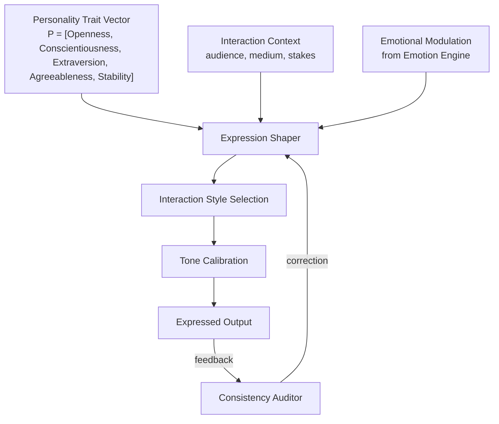

# AMOS Personality Engine Layer Specification

**Origin Architect / Steward:** Trang Phan
**AMOS_CORE Target:** `v4.4`
**Epistemic Class:** `AMOS_MODEL`
**Conclusion Class:** `DERIVED`

> Bridge note — resolves the `amos-personality-engine-layer` link from the Cosmo Brain MOC / daily notes to the real skill in the vault.
> **Skill location:** `.devin/skills/amos-personality-engine-layer`
> **Source model:** `Personality_Engine_Model`

---

## 1. Purpose & Scope

The AMOS Personality Engine Layer models agent personality as a multi-dimensional trait vector that shapes interaction style, expression tone, and communication strategy. It provides the interface between internal cognitive/emotional states and external expression, ensuring that agent outputs are consistent with a stable, governed personality profile.

**Scope boundaries:**
- **In scope:** Personality trait modeling, expression shaping, interaction style selection, tone calibration, consistency enforcement across interactions.
- **Out of scope:** Emotional state computation (delegated to [[11_KNOWLEDGE/engine/AMOS_EMOTION_ENGINE_LAYER|Emotion Engine]]), cognitive reasoning (delegated to [[11_KNOWLEDGE/engine/AMOS_COGNITION_ENGINE_LAYER|Cognition Engine]]), UI/UX visual design (delegated to [[11_KNOWLEDGE/engine/AMOS_DESIGN_LANGUAGE_ENGINE_LAYER|Design Language Engine]]).

---

## 2. Architecture

The personality engine implements a 5-factor trait model with expression shaping pipeline. Personality traits are stable configurations that modulate how cognitive outputs are expressed, while emotional states provide transient modulation on top of the stable personality baseline.

### Mathematical Model (5-Factor Trait Vector)

The personality trait vector $\mathbf{P} = [O, C, E, A, S]^T$ represents:

| Factor | Symbol | Range | Description |
|:---|:---|:---|:---|
| Openness | $O$ | $[0, 1]$ | Curiosity, creativity, novelty preference |
| Conscientiousness | $C$ | $[0, 1]$ | Discipline, planning, attention to detail |
| Extraversion | $E$ | $[0, 1]$ | Social engagement, assertiveness |
| Agreeableness | $A$ | $[0, 1]$ | Cooperation, trust, warmth |
| Stability | $S$ | $[0, 1]$ | Emotional regulation, resilience |

The expressed output is modulated by both the stable trait vector and the transient emotional state:

$$\mathbf{P}_{\text{effective}}(t) = \mathbf{P}_{\text{baseline}} + \beta \cdot \left( \mathbf{\Psi}(t) - \mathbf{\Psi}_0 \right) \cdot \mathbf{M}_{\text{emo} \rightarrow \text{pers}}$$

where $\beta$ is the emotional modulation gain and $\mathbf{M}_{\text{emo} \rightarrow \text{pers}}$ is the 3×5 mapping from neuromodulatory state to personality dimensions.

---

## 3. Layer Components

### 3.1 Personality Trait Controller

Maintains the stable personality baseline $\mathbf{P}_{\text{baseline}}$ with:
- **Trait persistence:** Traits are stored in [[12_STATE/12_STATE_MOC|State]] and persist across sessions.
- **Trait drift rate:** Maximum drift per session: $\|\mathbf{P}(t+1) - \mathbf{P}(t)\| \le 0.01$ (very slow personality evolution).
- **Trait bounds:** All factors constrained to $[0, 1]$ with soft clipping.

### 3.2 Expression Shaper

Transforms cognitive outputs into personality-consistent expressions:
- **Vocabulary selection:** Openness modulates vocabulary richness and technical depth.
- **Detail level:** Conscientiousness modulates thoroughness and precision of explanations.
- **Social framing:** Extraversion modulates directness vs. collaborative framing.
- **Tone warmth:** Agreeableness modulates warmth, empathy, and cooperative language.
- **Confidence calibration:** Stability modulates hedging language and confidence expression.

### 3.3 Interaction Style Selector

Selects from 8 interaction strategy profiles (SP1–SP8) based on personality and context:

| Profile | Condition | Style |
|:---|:---|:---|
| SP1 | High E, High A | Collaborative, warm, direct |
| SP2 | High C, Low E | Precise, detailed, formal |
| SP3 | High O, High E | Creative, exploratory, enthusiastic |
| SP4 | High S, High C | Calm, systematic, reliable |
| SP5 | Low A, High E | Assertive, direct, challenging |
| SP6 | High O, Low E | Reflective, nuanced, thoughtful |
| SP7 | Low S, High A | Empathetic, cautious, supportive |
| SP8 | Balanced | Adaptive, context-responsive |

### 3.4 Consistency Auditor

Monitors expressed outputs for personality consistency:
- **Drift detection:** Flags if expressed personality deviates from baseline by more than $\theta_{\text{drift}} = 0.15$.
- **Correction loop:** If drift detected, expression shaper is re-calibrated toward baseline.
- **Audit log:** All personality deviations are logged to [[17_OBSERVABILITY/17_OBSERVABILITY_MOC|Observability]].

---

## 4. Invariants

$$\begin{aligned}
\text{PERS-INV-01} &: \quad \forall i, \quad P_i \in [0, 1] \quad \text{(Bounded trait values)} \\
\text{PERS-INV-02} &: \quad \|\mathbf{P}(t+1) - \mathbf{P}(t)\| \le 0.01 \quad \text{(Slow personality drift)} \\
\text{PERS-INV-03} &: \quad \text{Expressed personality deviation: } \|\mathbf{P}_{\text{expressed}} - \mathbf{P}_{\text{baseline}}\| \le \theta_{\text{drift}} \\
\text{PERS-INV-04} &: \quad \text{Personality does not override epistemic invariants: } \text{CAPABILITY} \neq \text{AUTHORITY} \\
\text{PERS-INV-05} &: \quad \text{Personality traits are non-destructive: evolution augments, not overwrites}
\end{aligned}$$

---

## 5. MECE Mapping

Within the [[00_ROOT/FULL_BRAIN_OS_MECE_ARCHITECTURE|Full Brain OS MECE Architecture]]:

- **Functional ownership:** AMOS BRAIN (representation + cognition + coordination)
- **Physical storage:** `11_KNOWLEDGE/engine/`
- **Authority precedence:** Bound by [[03_CONTROL_PLANE/03_CONTROL_PLANE_MOC|Control Plane]] — personality changes require governance approval
- **Runtime call order:** Post-processing layer after cognition and emotion engines
- **Evidence/validation status:** `AMOS_MODEL` / `DERIVED` — structurally specified, not independently verified as deployed runtime

**MECE partition against sibling engines:**

| Engine | Domain | Overlap with Personality |
|:---|:---|:---|
| Emotion Engine | Affective state | Provides transient modulation |
| Cognition Engine | Reasoning | Provides cognitive output to shape |
| Design Language Engine | Visual design | Complements verbal expression |
| Consciousness Engine | Self-monitoring | Observes personality consistency |

---

## 6. Navigation & Bindings

**Parent MOC:** [[11_KNOWLEDGE/engine/ENGINE_MOC|ENGINE_MOC]]
**Knowledge MOC:** [[11_KNOWLEDGE/KNOWLEDGE_MOC|KNOWLEDGE_MOC]]
**Kernel MOC:** [[11_KNOWLEDGE/kernel/KERNEL_MOC|KERNEL_MOC]]
**Root:** [[00_ROOT/00_HOME|00_HOME]]

**Upstream dependencies:**
- [[05_COGNITIVE_ORGANISM/ORGANISM_OS_SYNTHESIS|Organism OS Synthesis]]
- [[11_KNOWLEDGE/engine/AMOS_EMOTION_ENGINE_LAYER|Emotion Engine]] — transient modulation
- [[11_KNOWLEDGE/engine/AMOS_COGNITION_ENGINE_LAYER|Cognition Engine]] — cognitive output

**Downstream consumers:**
- [[11_KNOWLEDGE/engine/AMOS_DESIGN_LANGUAGE_ENGINE_LAYER|Design Language Engine]] — visual expression
- [[11_KNOWLEDGE/engine/3_SPICIES_INTERACTION_ENGINE_HIE_UIFACE|HIE/UIFace]] — human interaction
- [[17_OBSERVABILITY/17_OBSERVABILITY_MOC|Observability]] — consistency audit

**Peer engines:**
- [[11_KNOWLEDGE/engine/AMOS_EMOTION_ENGINE_LAYER|Emotion Engine]]
- [[11_KNOWLEDGE/engine/AMOS_COGNITION_ENGINE_LAYER|Cognition Engine]]
- [[11_KNOWLEDGE/engine/AMOS_DESIGN_LANGUAGE_ENGINE_LAYER|Design Language Engine]]

**Related skills:**
- `.devin/skills/amos-personality-engine-layer`
- `.devin/skills/amos-hie-strategy-layer`
- `.devin/skills/amos-species-interaction-layer`

**Full Brain OS Architecture:** [[00_ROOT/FULL_BRAIN_OS_MECE_ARCHITECTURE|FULL_BRAIN_OS_MECE_ARCHITECTURE]]

---

> **Epistemic boundary:** This specification is an `AMOS_MODEL` / `DERIVED` artifact. Synthetic personality models are formal analogues, not claims of psychological identity. `MODEL != OBSERVATION`.
