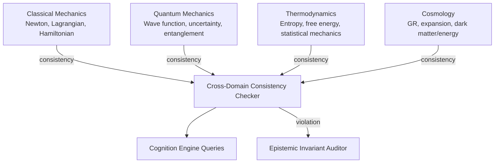

# AMOS Physics & Cosmos Engine Layer Specification

**Origin Architect / Steward:** Trang Phan
**AMOS_CORE Target:** `v4.4`
**Epistemic Class:** `AMOS_MODEL`
**Conclusion Class:** `DERIVED`

> Bridge note — resolves the `amos-physics-cosmos-engine-layer` link from the Cosmo Brain MOC / daily notes to the real skill in the vault.
> **Skill location:** `.devin/skills/amos-physics-cosmos-engine-layer`
> **Source model:** `Physics_Cosmos_Model`

---

## 1. Purpose & Scope

The AMOS Physics & Cosmos Engine Layer provides structured reasoning about physical systems, cosmological models, and fundamental forces. It encodes domain knowledge in classical mechanics, quantum mechanics, thermodynamics, electromagnetism, general relativity, and cosmology, making it available as a reasoning substrate for AMOS cognitive processes.

**Scope boundaries:**
- **In scope:** Physical law encoding, unit systems, dimensional analysis, cosmological model reasoning, energy/momentum conservation, thermodynamic constraints, quantum mechanical reasoning patterns.
- **Out of scope:** Numerical solver implementation (delegated to [[11_KNOWLEDGE/engine/AMOS_NUMERICAL_METHODS_ENGINE_LAYER|Numerical Methods Engine]]), electrical circuit analysis (delegated to [[11_KNOWLEDGE/engine/AMOS_ELECTRICAL_POWER_ENGINE_LAYER|Electrical Power Engine]]).

---

## 2. Architecture

The physics engine implements a 4-domain knowledge structure with cross-domain consistency checking. Each domain encodes its fundamental laws as formal constraints that the cognition engine can query during reasoning.

---

## 3. Layer Components

### 3.1 Classical Mechanics Domain

Encodes Newtonian, Lagrangian, and Hamiltonian mechanics:

- **Newton's laws:** $\mathbf{F} = m\mathbf{a}$; action-reaction pairs; inertial reference frames.
- **Lagrangian formulation:** $\mathcal{L} = T - V$; Euler-Lagrange equations: $\frac{d}{dt}\frac{\partial \mathcal{L}}{\partial \dot{q}_i} - \frac{\partial \mathcal{L}}{\partial q_i} = 0$.
- **Hamiltonian formulation:** $\mathcal{H} = T + V$; Hamilton's equations: $\dot{q} = \frac{\partial \mathcal{H}}{\partial p}$, $\dot{p} = -\frac{\partial \mathcal{H}}{\partial q}$.
- **Conservation laws:** Energy, linear momentum, angular momentum conservation derived from symmetries via Noether's theorem.

### 3.2 Quantum Mechanics Domain

Encodes quantum mechanical reasoning:

- **State representation:** Wave function $\psi(\mathbf{x}, t)$; Hilbert space formalism.
- **Schrödinger equation:** $i\hbar \frac{\partial \psi}{\partial t} = \hat{H}\psi$.
- **Uncertainty principle:** $\Delta x \cdot \Delta p \ge \hbar/2$.
- **Entanglement:** Bell inequality violation; EPR paradox reasoning.
- **Measurement problem:** Collapse vs. decoherence interpretations (preserved as COMPETING hypotheses).

### 3.3 Thermodynamics Domain

Encodes thermodynamic laws and statistical mechanics:

- **Four laws:** Zeroth (thermal equilibrium), First (energy conservation), Second (entropy non-decrease), Third (absolute zero unreachability).
- **Statistical mechanics:** Boltzmann distribution $P(E) \propto e^{-E/kT}$; partition function $Z = \sum_i e^{-E_i/kT}$.
- **Free energy:** Helmholtz $F = U - TS$; Gibbs $G = H - TS$.
- **Information-theoretic connection:** Shannon entropy $H = -\sum p_i \log p_i$ linked to thermodynamic entropy.

### 3.4 Cosmology Domain

Encodes cosmological models and general relativity:

- **General relativity:** Einstein field equations $G_{\mu\nu} + \Lambda g_{\mu\nu} = \frac{8\pi G}{c^4} T_{\mu\nu}$.
- **Friedmann equations:** Expansion dynamics; Hubble parameter $H(t)$.
- **Dark matter / dark energy:** Preserved as COMPETING/UNKNOWN hypotheses with evidence weights.
- **Cosmic timeline:** Big Bang nucleosynthesis, CMB, recombination, structure formation.
- **Multiverse / string theory:** Preserved as AMOS_MODEL / UNKNOWN — not promoted to OBSERVATION.

### 3.5 Cross-Domain Consistency Checker

Validates that multi-domain reasoning does not violate cross-domain constraints:
- **Energy conservation:** Total energy conserved across classical + quantum + thermodynamic domains.
- **Dimensional consistency:** All physical equations are dimensionally consistent (SI base units).
- **Scale bridging:** Classical limit of quantum mechanics ($\hbar \rightarrow 0$); thermodynamic limit of statistical mechanics ($N \rightarrow \infty$).

### 3.6 Unit & Dimensional Analysis System

Maintains SI base units and derived unit registry:
- **Base units:** meter (m), kilogram (kg), second (s), ampere (A), kelvin (K), mole (mol), candela (cd).
- **Derived units:** newton, joule, watt, pascal, hertz, coulomb, volt, ohm, farad, henry, tesla, weber.
- **Dimensional checking:** Every physical equation is validated for dimensional homogeneity before acceptance.

---

## 4. Invariants

$$\begin{aligned}
\text{PHYS-INV-01} &: \quad \text{All physical equations are dimensionally homogeneous} \\
\text{PHYS-INV-02} &: \quad \text{Energy is conserved in closed systems: } \frac{dE_{\text{total}}}{dt} = 0 \\
\text{PHYS-INV-03} &: \quad \text{Entropy of isolated systems is non-decreasing: } \frac{dS}{dt} \ge 0 \\
\text{PHYS-INV-04} &: \quad \text{Speculative theories (multiverse, string theory) remain AMOS\_MODEL / UNKNOWN; not promoted to OBSERVATION} \\
\text{PHYS-INV-05} &: \quad \text{Competing interpretations (collapse vs. decoherence) preserved until discriminating evidence}
\end{aligned}$$

---

## 5. MECE Mapping

Within the [[00_ROOT/FULL_BRAIN_OS_MECE_ARCHITECTURE|Full Brain OS MECE Architecture]]:

- **Functional ownership:** AMOS BRAIN (world/system modeling)
- **Physical storage:** `11_KNOWLEDGE/engine/`
- **Authority precedence:** Bound by [[03_CONTROL_PLANE/03_CONTROL_PLANE_MOC|Control Plane]] — speculative claims cannot be promoted without evidence
- **Runtime call order:** Queried by [[11_KNOWLEDGE/engine/AMOS_COGNITION_ENGINE_LAYER|Cognition Engine]] during physical reasoning
- **Evidence/validation status:** `AMOS_MODEL` / `DERIVED` — structurally specified; physical laws are SOURCE_CLAIM (established physics) while speculative theories are AMOS_MODEL

**MECE partition against sibling engines:**

| Engine | Domain | Overlap with Physics |
|:---|:---|:---|
| Numerical Methods Engine | Computation | Solves physics equations numerically |
| Electrical Power Engine | Electrical systems | Shares electromagnetism domain |
| Consciousness Engine | Meta-cognition | Quantum consciousness hypotheses (COMPETING) |
| Cognition Engine | Reasoning | Queries physics domain knowledge |

---

## 6. Navigation & Bindings

**Parent MOC:** [[11_KNOWLEDGE/engine/ENGINE_MOC|ENGINE_MOC]]
**Knowledge MOC:** [[11_KNOWLEDGE/KNOWLEDGE_MOC|KNOWLEDGE_MOC]]
**Kernel MOC:** [[11_KNOWLEDGE/kernel/KERNEL_MOC|KERNEL_MOC]]
**Root:** [[00_ROOT/00_HOME|00_HOME]]

**Upstream dependencies:**
- [[22_RESEARCH/01_MATHEMATICS/AMOS_137_MATH_REGISTRY|AMOS 137 Math Registry]] — mathematical foundations
- [[01_CANON/01_CORE_LAWS/AMOS_CORE_LAWS|AMOS Core Laws]] — epistemic invariants
- [[11_KNOWLEDGE/engine/AMOS_NUMERICAL_METHODS_ENGINE_LAYER|Numerical Methods Engine]] — solver support

**Downstream consumers:**
- [[11_KNOWLEDGE/engine/AMOS_COGNITION_ENGINE_LAYER|Cognition Engine]] — physical reasoning queries
- [[11_KNOWLEDGE/engine/AMOS_ELECTRICAL_POWER_ENGINE_LAYER|Electrical Power Engine]] — EM domain
- [[11_KNOWLEDGE/engine/AMOS_CONSCIOUSNESS_ENGINE_LAYER|Consciousness Engine]] — quantum consciousness hypotheses

**Peer engines:**
- [[11_KNOWLEDGE/engine/AMOS_NUMERICAL_METHODS_ENGINE_LAYER|Numerical Methods Engine]]
- [[11_KNOWLEDGE/engine/AMOS_ELECTRICAL_POWER_ENGINE_LAYER|Electrical Power Engine]]
- [[11_KNOWLEDGE/engine/AMOS_COGNITION_ENGINE_LAYER|Cognition Engine]]

**Related skills:**
- `.devin/skills/amos-physics-cosmos-engine-layer`
- `.devin/skills/amos-scientific-engine-vinfinity`
- `.devin/skills/amos-universe-total-canon`

**Full Brain OS Architecture:** [[00_ROOT/FULL_BRAIN_OS_MECE_ARCHITECTURE|FULL_BRAIN_OS_MECE_ARCHITECTURE]]

---

> **Epistemic boundary:** Established physical laws are `SOURCE_CLAIM`. Speculative theories (multiverse, string theory, quantum consciousness) are `AMOS_MODEL` / `UNKNOWN`. `MODEL != OBSERVATION`. `DOCUMENTED != IMPLEMENTED`.
