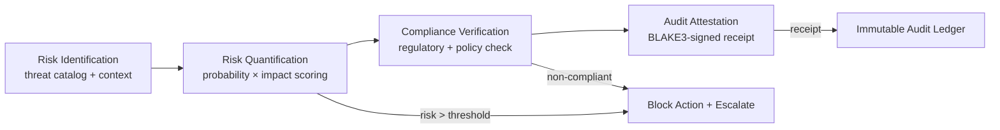

# AMOS Risk & Compliance Engine Layer Specification

**Origin Architect / Steward:** Trang Phan  
**AMOS_CORE Target:** `v4.4`  
**Epistemic Class:** `AMOS_MODEL`  
**Conclusion Class:** `DERIVED`

> Bridge note — resolves the `amos-risk-compliance-engine-layer` link from the Cosmo Brain MOC / daily notes to the real skill in the vault.  
> **Skill location:** `.devin/skills/amos-risk-compliance-engine-layer`  
> **Source model:** `Risk_Compliance_Model`

---

## 1. Purpose & Scope

The AMOS Risk & Compliance Engine Layer performs continuous risk assessment, compliance verification, and audit trail generation. It evaluates proposed actions against risk thresholds, regulatory requirements, and organizational policies, producing structured risk reports and compliance attestations with full provenance.

**Scope boundaries:**
- **In scope:** Risk scoring, compliance checking, audit trail generation, risk register management, threshold monitoring, incident tracking, mitigation recommendation.
- **Out of scope:** Legal interpretation (delegated to [[11_KNOWLEDGE/engine/AMOS_LEGAL_ENGINE_LAYER|Legal Engine]]), governance decision routing (delegated to [[11_KNOWLEDGE/engine/AMOS_ORG_GOVERNANCE_ENGINE_LAYER|Org Governance Engine]]).

---

## 2. Architecture

The risk compliance engine implements a 4-stage pipeline: risk identification, risk quantification, compliance verification, and audit attestation. Each stage produces typed artifacts that feed the governance engine for decision gating.

### Risk Scoring Model

Risk is quantified as a multi-dimensional score:

$$R = \sum_{i=1}^{n} w_i \cdot P(\text{threat}_i) \cdot I(\text{threat}_i) \cdot \text{Irrev}(\text{threat}_i)$$

where:
- $P(\text{threat}_i)$: Probability of threat $i$ materializing ($[0, 1]$).
- $I(\text{threat}_i)$: Impact severity of threat $i$ ($[0, 1]$).
- $\text{Irrev}(\text{threat}_i)$: Irreversibility factor of threat $i$ ($[0, 1]$).
- $w_i$: Weight assigned by risk category.

---

## 3. Layer Components

### 3.1 Risk Identification Sub-Engine

Identifies potential risks from the threat catalog and current context:
- **Threat catalog:** Pre-defined threat categories (operational, financial, security, reputational, legal, strategic, compliance, environmental).
- **Context analysis:** Scans proposed action for risk indicators using [[11_KNOWLEDGE/engine/AMOS_COGNITION_ENGINE_LAYER|Cognition Engine]] semantic analysis.
- **Emerging risk detection:** Identifies novel risk patterns not in the catalog via anomaly detection.

### 3.2 Risk Quantification Sub-Engine

Quantifies identified risks:
- **Probability estimation:** Bayesian probability estimation from historical data and expert judgment.
- **Impact assessment:** Severity scoring across financial, operational, and reputational dimensions.
- **Irreversibility scoring:** Estimates the degree to which a risk's consequences cannot be undone.
- **Aggregation:** Combines individual risk scores into a composite risk score using weighted sum.

### 3.3 Compliance Verification Sub-Engine

Verifies proposed actions against:
- **Regulatory requirements:** From [[11_KNOWLEDGE/engine/AMOS_LEGAL_ENGINE_LAYER|Legal Engine]] jurisdictional mapping.
- **Organizational policies:** From [[11_KNOWLEDGE/engine/ENGINEERING_STANDARDS_LIBRARY|Engineering Standards]] and governance policies.
- **Quality standards:** From the 10-axis quality model (security axis is non-compensatory).
- **Audit requirements:** Identifies actions that require audit trail generation.

### 3.4 Audit Attestation Sub-Engine

Generates immutable audit attestations:
- **Receipt format:** $\mathcal{R} = \text{BLAKE3}(\text{ActionID} \parallel \text{Epoch} \parallel \text{RiskScore} \parallel \text{ComplianceResult} \parallel \text{StateHash})$
- **Immutable ledger:** Audit entries are append-only; no modification or deletion permitted.
- **Provenance chain:** Every audit entry links to its predecessor via hash chain.
- **Export capability:** Audit trail exportable as JSON for external compliance review.

### 3.5 Risk Register Manager

Maintains the organizational risk register:
- **Risk entries:** Each with ID, description, category, probability, impact, irreversibility, owner, mitigation status.
- **Review cadence:** Monthly review of open risks; quarterly full register audit.
- **Mitigation tracking:** Links risks to mitigation actions with completion status.

---

## 4. Invariants

$$\begin{aligned}
\text{RISK-INV-01} &: \quad \text{Actions with } R > R_{\text{threshold}} \text{ are blocked and escalated} \\
\text{RISK-INV-02} &: \quad \text{Compliance failures are non-compensatory: no amount of quality offsets non-compliance} \\
\text{RISK-INV-03} &: \quad \text{Audit entries are immutable: append-only, hash-chained, BLAKE3-signed} \\
\text{RISK-INV-04} &: \quad \text{Every risk score carries uncertainty bounds: } R \pm \Delta R \\
\text{RISK-INV-05} &: \quad \text{Risk threshold changes require governance approval per } [[23_OPERATING_MODEL/03_GOVERNANCE_FORUMS/GOVERNANCE_FORUMS|Governance Forums]]
\end{aligned}$$

---

## 5. MECE Mapping

Within the [[00_ROOT/FULL_BRAIN_OS_MECE_ARCHITECTURE|Full Brain OS MECE Architecture]]:

- **Functional ownership:** AMOS CONTROL / BODY (authority + capability grants + world-effect gating)
- **Physical storage:** `11_KNOWLEDGE/engine/`
- **Authority precedence:** Bound by [[03_CONTROL_PLANE/03_CONTROL_PLANE_MOC|Control Plane]] — risk blocks are enforceable
- **Runtime call order:** Invoked before any M3+ mutation; pre-action gate
- **Evidence/validation status:** `AMOS_MODEL` / `DERIVED` — structurally specified, not independently verified as deployed runtime

**MECE partition against sibling engines:**

| Engine | Domain | Overlap with Risk Compliance |
|:---|:---|:---|
| Legal Engine | Legal reasoning | Provides regulatory constraints |
| Org Governance Engine | Decision routing | Receives risk scores for gating |
| Engineering Standards | Quality criteria | Provides compliance criteria |
| Automation Engine | Pipeline execution | Executes compliance audit workflows |

---

## 6. Navigation & Bindings

**Parent MOC:** [[11_KNOWLEDGE/engine/ENGINE_MOC|ENGINE_MOC]]  
**Knowledge MOC:** [[11_KNOWLEDGE/KNOWLEDGE_MOC|KNOWLEDGE_MOC]]  
**Kernel MOC:** [[11_KNOWLEDGE/kernel/KERNEL_MOC|KERNEL_MOC]]  
**Root:** [[00_ROOT/00_HOME|00_HOME]]

**Upstream dependencies:**
- [[11_KNOWLEDGE/engine/AMOS_LEGAL_ENGINE_LAYER|Legal Engine]] — regulatory constraints
- [[11_KNOWLEDGE/engine/ENGINEERING_STANDARDS_LIBRARY|Engineering Standards]] — quality criteria
- [[01_CANON/01_CORE_LAWS/AMOS_CORE_LAWS|AMOS Core Laws]] — epistemic invariants

**Downstream consumers:**
- [[11_KNOWLEDGE/engine/AMOS_ORG_GOVERNANCE_ENGINE_LAYER|Org Governance Engine]] — risk-gated decisions
- [[17_OBSERVABILITY/17_OBSERVABILITY_MOC|Observability]] — risk telemetry
- [[03_CONTROL_PLANE/03_CONTROL_PLANE_MOC|Control Plane]] — enforcement gates

**Peer engines:**
- [[11_KNOWLEDGE/engine/AMOS_LEGAL_ENGINE_LAYER|Legal Engine]]
- [[11_KNOWLEDGE/engine/AMOS_ORG_GOVERNANCE_ENGINE_LAYER|Org Governance Engine]]
- [[11_KNOWLEDGE/engine/ENGINEERING_STANDARDS_LIBRARY|Engineering Standards]]

**Related skills:**
- `.devin/skills/amos-risk-compliance-engine-layer`
- `.devin/skills/amos-audit-trail`
- `.devin/skills/amos-evolutionary-debt`

**Full Brain OS Architecture:** [[00_ROOT/FULL_BRAIN_OS_MECE_ARCHITECTURE|FULL_BRAIN_OS_MECE_ARCHITECTURE]]

---

> **Epistemic boundary:** This specification is an `AMOS_MODEL` / `DERIVED` artifact. Risk scores are estimates with uncertainty bounds, not certainties. `MODEL != OBSERVATION`. `CAPABILITY != AUTHORITY`.
