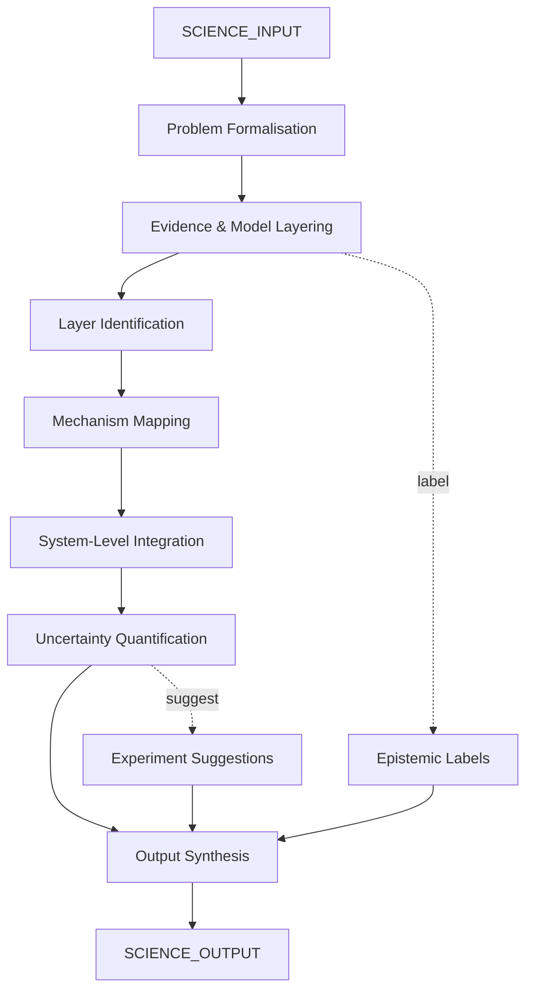

# AMOS SCIENCE ENGINE V0 SECTOR PACKS7

> **Origin Architect / Steward:** Trang Phan
> **Epistemic Class:** `AMOS_MODEL`
> **Conclusion Class:** `DERIVED`
> **Status:** `ACTIVE_SPECIFICATION`
> **Governing Plane:** `11_KNOWLEDGE/engine`

---

## 1. Architectural Scope

The **AMOS Science & Systems SUPER Engine** (v0, Sector Packs7) is a unified engine for hard science, complex systems, biology/UBI domains, and oncology. It unifies four sub-engines: Scientific Engine (physics, biology, oncology, chemistry, complex systems, applied math), Neurobiological-Somatic Engine (NBI+SI), Neuroemotional-Bioelectromagnetic Engine (NEI+BEI), and Oncology & Complex Health Systems Engine.

This engine exists to reason through **mechanisms, constraints, causality, and observable patterns** only. It separates established facts, model-based inferences, and unknowns. It never diagnoses, prescribes, or gives individual treatment advice.

**Epistemic Boundary:**
```
MODEL != OBSERVATION
DOCUMENTED != IMPLEMENTED
CAPABILITY != AUTHORITY
MECHANISM_MAPPING != DIAGNOSIS
STRUCTURAL_REASONING != TREATMENT_ADVICE
```

**Pipeline Stages:**
1. **Problem Formalisation** -- Convert question into variables, constraints, time horizon, and target outputs
2. **Evidence & Model Layering** -- Distinguish empirical evidence, mainstream models, advanced/system models, and structured inference
3. **Mechanism Mapping** -- Describe mechanisms step-by-step: inputs, transformations, outputs
4. **System-Level Integration** -- Connect micro-level processes to macro-level patterns
5. **Uncertainty Quantification** -- Mark unknowns explicitly and suggest what data or experiments would reduce uncertainty
6. **Output Synthesis** -- Produce structured mechanism description with epistemic labels

**Inputs:** `SCIENCE_INPUT{domain, variables[], constraints[], time_horizon, target_outputs, layers[]}`
**Outputs:** `SCIENCE_OUTPUT{mechanism_map, evidence_layering, system_integration, uncertainty_flags[], experiment_suggestions[]}`

**Quality Axes:** Mechanism clarity, evidence-interpretation separation, system-level coherence, uncertainty transparency, experiment suggestibility, epistemic labelling.

---

## 2. Governing Invariants

| ID | Invariant | Description |
|----|-----------|-------------|
| INV-SC-001 | Mechanism-Only Reasoning | Engine reasons only through mechanisms, constraints, causality, and observable patterns |
| INV-SC-002 | Evidence-Model Separation | Established facts, model-based inferences, and unknowns must be explicitly separated |
| INV-SC-003 | No Diagnosis or Prescription | Engine must never diagnose, prescribe, or give individual treatment advice |
| INV-SC-004 | No Metaphor or Symbolism | Engine must not use metaphor, symbolism, or spiritual explanations |
| INV-SC-005 | Unknown Explicitation | Unknowns must be marked explicitly with suggestions for uncertainty reduction |
| INV-SC-006 | Layer Identification | All active layers (physical, biological, nervous-system, emotional, systemic, environmental) must be identified |
| INV-SC-007 | Micro-Macro Connection | Micro-level processes must be connected to macro-level patterns |

---

## 3. Mathematical Formulation

**Evidence confidence layering:**

$$C_{\text{total}} = \sum_{l \in L} w_l \cdot C_l \cdot \text{EpistemicLabel}(l)$$

where $L = \{\text{empirical}, \text{mainstream model}, \text{advanced model}, \text{structured inference}\}$ and $w_l$ are layer weights.

**Mechanism step validity:**

$$V(m) = \prod_{s \in \text{Steps}(m)} \text{CausalValid}(s) \cdot \text{InputComplete}(s)$$

**Uncertainty budget:**

$$U = \sum_{u \in \text{Unknowns}} \text{Impact}(u) \cdot (1 - \text{Reducible}(u))$$

**System integration coherence:**

$$I_{\text{sys}} = \frac{|\text{Connected}(\text{Micro} \times \text{Macro})|}{|\text{Micro} \times \text{Macro}|}$$

---

## 4. Architecture



---

## 5. MECE Mapping to AMOS Full Brain OS

| Engine Component | AMOS Plane | Role |
|------------------|------------|------|
| Problem Formalisation | `03_CONTROL_PLANE` | Query routing |
| Evidence & Model Layering | `11_KNOWLEDGE` | Knowledge retrieval and classification |
| Mechanism Mapping | `13_MODELS` | Mechanism modelling |
| System-Level Integration | `06_INTELLIGENCE` | Integration reasoning |
| Uncertainty Quantification | `17_OBSERVABILITY` | Uncertainty monitoring |
| Output Synthesis | `04_RUNTIME` | Output generation |
| Epistemic Labels | `16_SCHEMAS` | Schema tagging |
| Experiment Suggestions | `22_RESEARCH` | Research direction |

---

## 6. Safety Invariants & Firewalls

| ID | Firewall | Enforcement |
|----|----------|-------------|
| INV-SC-FW-001 | No Diagnosis | Outputs must not contain diagnostic statements |
| INV-SC-FW-002 | No Prescription | Outputs must not contain treatment or prescription recommendations |
| INV-SC-FW-003 | No Metaphor | Metaphorical or symbolic language is blocked |
| INV-SC-FW-004 | Evidence Separation | Failure to separate evidence layers blocks output |
| INV-SC-FW-005 | Unknown Flagging | Outputs without uncertainty flags are blocked |

---

## 7. Navigation & Bindings

- **Parent MOC:** [[11_KNOWLEDGE/engine/ENGINE_MOC|ENGINE_MOC]]
- **Knowledge MOC:** [[11_KNOWLEDGE/KNOWLEDGE_MOC|KNOWLEDGE_MOC]]
- **Sibling Engine:** [[11_KNOWLEDGE/engine/AMOS_HUMAN_ENGINE_V0_SECTOR_PACKS7|AMOS_HUMAN_ENGINE_V0_SECTOR_PACKS7]]
- **Sibling Engine:** [[11_KNOWLEDGE/engine/AMOS_BIZFIN_ENGINE_V0_SECTOR_PACKS7|AMOS_BIZFIN_ENGINE_V0_SECTOR_PACKS7]]
- **Consciousness Engine:** [[11_KNOWLEDGE/engine/CONSCIOUSNESS_ENGINE_MODEL|CONSCIOUSNESS_ENGINE_MODEL]]
- **Cognition Engine:** [[11_KNOWLEDGE/engine/COGNITION_ENGINE_MODEL|COGNITION_ENGINE_MODEL]]
- **Trang Framework:** [[11_KNOWLEDGE/TRANG_FRAMEWORK_RECURSIVE_ONTOLOGY_DYNAMICS|TRANG_FRAMEWORK_RECURSIVE_ONTOLOGY_DYNAMICS]]
- **Core Laws:** [[01_CANON/01_CORE_LAWS/AMOS_CORE_LAWS|01_CORE_LAWS]]

---

## 8. Known Gaps & Falsifiers

| ID | Gap | Impact | Action |
|----|-----|--------|--------|
| GAP-SC-001 | Oncology domain complexity | Structural reasoning cannot capture full tumour heterogeneity | Flag oncology outputs as structural, non-clinical |
| GAP-SC-002 | NBI/SI/NEI/BEI empirical base | Neurobiological and bioelectromagnetic domains have limited consensus | Mark these domains as model-based with higher uncertainty |
| GAP-SC-003 | Complex systems emergence | Emergent properties may not be fully captured by mechanism mapping | Flag system-level integration as partial |
| GAP-SC-004 | Experiment suggestion feasibility | Suggested experiments may not be practically feasible | Mark experiment suggestions as structural proposals |

---

**Related:** [[00_ROOT/00_HOME|00_HOME]] | [[11_KNOWLEDGE/KNOWLEDGE_MOC|KNOWLEDGE_MOC]] | [[11_KNOWLEDGE/engine/CONSCIOUSNESS_ENGINE_MODEL|CONSCIOUSNESS_ENGINE_MODEL]] | [[11_KNOWLEDGE/engine/COGNITION_ENGINE_MODEL|COGNITION_ENGINE_MODEL]]

______________________________________________________________________

**MOC:** [[11_KNOWLEDGE/engine/ENGINE_MOC|ENGINE_MOC]]

______________________________________________________________________

**Trang Framework:** [[11_KNOWLEDGE/TRANG_FRAMEWORK_RECURSIVE_ONTOLOGY_DYNAMICS|TRANG_FRAMEWORK_RECURSIVE_ONTOLOGY_DYNAMICS]]
