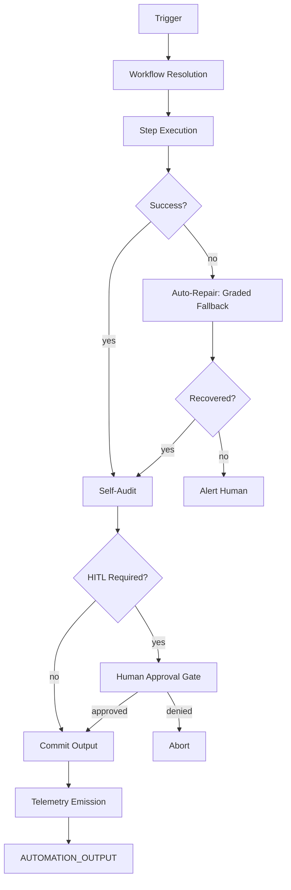

# AMOS Automation Engine

> **Origin Architect / Steward:** Trang Phan
> **Epistemic Class:** `AMOS_MODEL`
> **Conclusion Class:** `DERIVED`
> **Status:** `ACTIVE_SPECIFICATION`
> **Governing Plane:** `11_KNOWLEDGE/engine`

**Version:** 2.0.0
**Source:** `AMOS_Automation_Kernel_v0.json`

---

## 1. Architectural Scope

The **Unified Automation OS** is a self-auditing orchestration engine that integrates capabilities from the SUPER_CODE, Tech vInfinity MAX, and Design engines. It governs workflow orchestration, integrations (n8n, Make), and CI/CD automation pipelines.

This engine exists to provide the **operational orchestration layer** on top of the Unified Coding Engine. While the coding engine writes the modules, the automation engine wires them into reliable, observable, and self-healing systems.

**Epistemic Boundary:**
```
MODEL != OBSERVATION
DOCUMENTED != IMPLEMENTED
CAPABILITY != AUTHORITY
ORCHESTRATION != EXECUTION
AUTOMATION != AUTONOMY
```

**Core Capabilities:**
1. **Integration Primitives**: Built-in models for webhooks, scheduled triggers, and event-driven architectures
2. **Auto-Repair & Graded Fallbacks**: Workflows require graceful degradation paths (retry with exponential backoff, use cache, alert human)
3. **Self-Audit Pipeline**: Evaluates automation runs for design safety, code robustness, infrastructure impact, and data correctness
4. **Human-in-the-Loop (HITL)**: Enforces human review boundaries for irreversible, destructive, or sensitive operations

**Pipeline:**
1. **Trigger Intake** -- Receive webhook, scheduled, or event-driven trigger
2. **Workflow Resolution** -- Resolve trigger to workflow definition
3. **Step Execution** -- Execute workflow steps with dependency ordering
4. **Auto-Repair** -- On failure, apply graded fallback (retry, cache, alert)
5. **Self-Audit** -- Evaluate run for safety, robustness, infrastructure impact, data correctness
6. **HITL Gate** -- For irreversible/destructive/sensitive operations, require human approval
7. **Output & Telemetry** -- Produce output and emit telemetry

**Inputs:** `AUTOMATION_INPUT{trigger, workflow_def, context, hitl_boundary}`
**Outputs:** `AUTOMATION_OUTPUT{execution_result, audit_report, telemetry, hitl_requests[]}`

**Quality Axes:** Workflow reliability, fallback coverage, audit completeness, HITL boundary enforcement, telemetry observability, infrastructure safety.

---

## 2. Governing Invariants

| ID | Invariant | Description |
|----|-----------|-------------|
| INV-AE-001 | Graded Fallback Mandatory | Every workflow must have a graded fallback path; no bare-failure workflows |
| INV-AE-002 | HITL for Irreversible | Irreversible, destructive, or sensitive operations require human approval |
| INV-AE-003 | Self-Audit Required | Every automation run must be self-audited before output is committed |
| INV-AE-004 | Telemetry Emission | Every run must emit telemetry for observability |
| INV-AE-005 | Orchestration-Execution Separation | Engine orchestrates; it does not execute code directly |
| INV-AE-006 | Infrastructure Impact Check | Automation must evaluate infrastructure impact before execution |
| INV-AE-007 | Data Correctness Validation | Output data must be validated for correctness before commit |

---

## 3. Mathematical Formulation

**Graded fallback probability:**

$$P_{\text{success}} = 1 - \prod_{f \in \text{Failures}} (1 - P_{\text{recover}}(f))$$

**Retry with exponential backoff:**

$$t_{\text{retry}}(n) = t_0 \cdot 2^{n-1} \cdot (1 + \text{jitter}) \quad \text{for } n \le N_{\max}$$

**Self-audit score:**

$$S_{\text{audit}} = w_1 \cdot \text{DesignSafety} + w_2 \cdot \text{CodeRobustness} + w_3 \cdot \text{InfraImpact} + w_4 \cdot \text{DataCorrectness}$$

**HITL trigger condition:**

$$\text{HITL}(op) = \text{Irreversible}(op) \lor \text{Destructive}(op) \lor \text{Sensitive}(op)$$

**Workflow reliability:**

$$R_{\text{workflow}} = \prod_{s \in \text{Steps}} (1 - P_{\text{fail}}(s)) \cdot P_{\text{recover}}(s)$$

---

## 4. Architecture



---

## 5. MECE Mapping to AMOS Full Brain OS

| Engine Component | AMOS Plane | Role |
|------------------|------------|------|
| Trigger Intake | `05_PERCEPTION` | Event perception |
| Workflow Resolution | `03_CONTROL_PLANE` | Control routing |
| Step Execution | `04_RUNTIME` | Runtime execution |
| Auto-Repair | `04_RUNTIME` | Runtime recovery |
| Self-Audit | `17_OBSERVABILITY` | Audit monitoring |
| HITL Gate | `03_CONTROL_PLANE` | Authority gate |
| Telemetry | `17_OBSERVABILITY` | Observability emission |
| Infrastructure Impact | `12_STATE` | State impact assessment |

---

## 6. Safety Invariants & Firewalls

| ID | Firewall | Enforcement |
|----|----------|-------------|
| INV-AE-FW-001 | HITL Enforcement | Irreversible/destructive/sensitive operations without HITL are blocked |
| INV-AE-FW-002 | No Bare Failure | Workflows without graded fallback are rejected at registration |
| INV-AE-FW-003 | Self-Audit Block | Outputs failing self-audit are blocked from commit |
| INV-AE-FW-004 | Telemetry Required | Runs without telemetry emission are flagged |
| INV-AE-FW-005 | Infrastructure Safety | Operations with critical infrastructure impact require HITL |

---

## 7. Navigation & Bindings

- **Parent MOC:** [[11_KNOWLEDGE/engine/ENGINE_MOC|ENGINE_MOC]]
- **Home:** [[00_ROOT/00_HOME|00_HOME]]
- **Knowledge MOC:** [[11_KNOWLEDGE/KNOWLEDGE_MOC|KNOWLEDGE_MOC]]
- **Simulation Kernel:** [[11_KNOWLEDGE/kernel/AMOS_SIMULATION_KERNEL|AMOS_SIMULATION_KERNEL]]
- **Constraint Engine:** [[11_KNOWLEDGE/engine/CONSTRAINT_ENGINE|CONSTRAINT_ENGINE]]
- **Cognition Kernel:** [[11_KNOWLEDGE/kernel/COGNITION_KERNEL|COGNITION_KERNEL]]
- **Trang Framework:** [[11_KNOWLEDGE/TRANG_FRAMEWORK_RECURSIVE_ONTOLOGY_DYNAMICS|TRANG_FRAMEWORK_RECURSIVE_ONTOLOGY_DYNAMICS]]
- **Core Laws:** [[01_CANON/01_CORE_LAWS/AMOS_CORE_LAWS|01_CORE_LAWS]]

---

## 8. Known Gaps & Falsifiers

| ID | Gap | Impact | Action |
|----|-----|--------|--------|
| GAP-AE-001 | Fallback path coverage | Not all failure modes may have graded fallbacks | Flag workflows with incomplete fallback coverage |
| GAP-AE-002 | HITL boundary calibration | Determining irreversibility/destructiveness is domain-dependent | Flag HITL boundaries as configurable |
| GAP-AE-003 | Self-audit depth | Audit may not catch all data correctness issues | Flag audit as probabilistic, not deterministic |
| GAP-AE-004 | Integration platform coverage | n8n/Make models may not cover all integration patterns | Flag unsupported integration patterns |

---

**Related:** [[00_ROOT/00_HOME|00_HOME]] | [[11_KNOWLEDGE/KNOWLEDGE_MOC|KNOWLEDGE_MOC]] | [[11_KNOWLEDGE/kernel/AMOS_SIMULATION_KERNEL|AMOS_SIMULATION_KERNEL]] | [[11_KNOWLEDGE/engine/CONSTRAINT_ENGINE|CONSTRAINT_ENGINE]]

______________________________________________________________________

**MOC:** [[11_KNOWLEDGE/engine/ENGINE_MOC|ENGINE_MOC]]

______________________________________________________________________

**Trang Framework:** [[11_KNOWLEDGE/TRANG_FRAMEWORK_RECURSIVE_ONTOLOGY_DYNAMICS|TRANG_FRAMEWORK_RECURSIVE_ONTOLOGY_DYNAMICS]]
