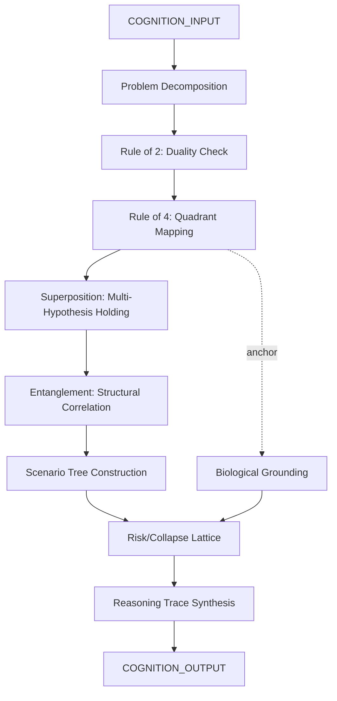

# Cognition Engine Model

> **Origin Architect / Steward:** Trang Phan
> **Epistemic Class:** `AMOS_MODEL`
> **Conclusion Class:** `DERIVED`
> **Status:** `ACTIVE_SPECIFICATION`
> **Governing Plane:** `11_KNOWLEDGE/engine`

---

## 1. Architectural Scope

The **AMOS Cognition Infinity Kernel** (`AMOS_COGNITION_INFINITY_KERNEL`) defines the structural logic, meta-laws, and reasoning architecture of the OS. It operates strictly without direct execution clusters (like code generation) to serve as the pure reasoning layer.

This engine exists to provide the **reasoning substrate** for all AMOS cognitive operations. It enforces meta-logic laws, structural problem decomposition, scenario trees, risk/collapse lattices, memory organization, process orchestration, and multiple hypothesis holding.

**Epistemic Boundary:**
```
MODEL != OBSERVATION
DOCUMENTED != IMPLEMENTED
CAPABILITY != AUTHORITY
QUANTUM_REASONING != QUANTUM_COMPUTATION
META_LOGIC != CLASSICAL_TRUTH
```

**Meta-Logic & Laws:**
- **Law of Law**: All subordinate laws must be consistent and non-contradictory
- **Rule of 2**: Every claim requires a duality check (primary hypothesis vs. structural opposite)
- **Rule of 4**: Every problem is mapped to 4 entangled quadrants: biological, experiential, logical, systemic
- **Absolute Structural Integrity**: Zero assumptions; fully explicit constraints and traceable logic

**Quantum & Biological Reasoning:**
- **Superposition**: Holding multiple possibilities with explicit weights (structural, not physical quantum)
- **Entanglement**: Non-causal structural correlations (structural metaphor, not physical entanglement)
- **Biological Logic**: Anchoring analysis in human processing limits, neurobiology, and trauma/stress cycles

**Inputs:** `COGNITION_INPUT{problem, constraints[], hypotheses[], quadrant_context}`
**Outputs:** `COGNITION_OUTPUT{decomposition_tree, scenario_tree, risk_lattice, hypothesis_weights, reasoning_trace}`

**Quality Axes:** Structural integrity, duality coverage, quadrant completeness, hypothesis weight transparency, reasoning traceability, assumption explicitness.

---

## 2. Governing Invariants

| ID | Invariant | Description |
|----|-----------|-------------|
| INV-CG-001 | Pure Reasoning Layer | Engine operates without direct execution clusters; it is reasoning only |
| INV-CG-002 | Law of Law Consistency | All subordinate laws must be consistent and non-contradictory |
| INV-CG-003 | Rule of 2 Duality | Every claim requires a duality check with structural opposite |
| INV-CG-004 | Rule of 4 Quadrant Mapping | Every problem must be mapped to biological, experiential, logical, systemic quadrants |
| INV-CG-005 | Zero Assumptions | All constraints must be explicit; no implicit assumptions |
| INV-CG-006 | Quantum-as-Structure | "Quantum reasoning" is structural metaphor only, not physical quantum computation |
| INV-CG-007 | Biological Grounding | Analysis must be anchored in human processing limits and neurobiology |

---

## 3. Mathematical Formulation

**Rule of 2 duality check:**

$$D(h) = \{h, \neg h\} \quad \text{where } h \text{ is a hypothesis}$$

**Rule of 4 quadrant mapping:**

$$Q(p) = \{q_{\text{bio}}, q_{\text{exp}}, q_{\text{log}}, q_{\text{sys}}\} \quad \text{for problem } p$$

**Superposition weight vector:**

$$|\psi\rangle = \sum_{i} w_i |h_i\rangle \quad \text{where } \sum_{i} w_i = 1, \; w_i \ge 0$$

**Entanglement correlation:**

$$E(a, b) = \text{Corr}(\text{Struct}(a), \text{Struct}(b)) \quad \text{where no causal path exists}$$

**Reasoning trace completeness:**

$$T_{\text{complete}} = \prod_{s \in \text{Steps}} \text{Explicit}(s) \cdot \text{Traceable}(s)$$

**Biological capacity constraint:**

$$\text{Load}(q_{\text{bio}}) \le L_{\max}(\text{neurobiological state})$$

---

## 4. Architecture



---

## 5. MECE Mapping to AMOS Full Brain OS

| Engine Component | AMOS Plane | Role |
|------------------|------------|------|
| Problem Decomposition | `03_CONTROL_PLANE` | Task routing |
| Duality Check | `06_INTELLIGENCE` | Hypothesis management |
| Quadrant Mapping | `11_KNOWLEDGE` | Knowledge domain routing |
| Superposition | `13_MODELS` | Multi-model holding |
| Entanglement | `12_STATE` | Structural correlation |
| Scenario Tree | `13_MODELS` | Scenario modelling |
| Risk/Collapse Lattice | `17_OBSERVABILITY` | Risk monitoring |
| Reasoning Trace | `10_MEMORY` | Episodic trace |
| Biological Grounding | `05_PERCEPTION` | Capacity constraint |

---

## 6. Safety Invariants & Firewalls

| ID | Firewall | Enforcement |
|----|----------|-------------|
| INV-CG-FW-001 | No Quantum Computation Claims | "Quantum" language must be labelled as structural metaphor |
| INV-CG-FW-002 | Zero Assumptions | Outputs with implicit assumptions are blocked |
| INV-CG-FW-003 | Duality Required | Outputs without structural opposite check are blocked |
| INV-CG-FW-004 | Quadrant Completeness | Outputs missing any of 4 quadrants are flagged |
| INV-CG-FW-005 | No Execution | Engine must not produce executable code; reasoning only |

---

## 7. Navigation & Bindings

- **Parent MOC:** [[11_KNOWLEDGE/engine/ENGINE_MOC|ENGINE_MOC]]
- **Cosmo Brain MOC:** [[00_ROOT/00_COSMO_BRAIN_MOC|00_COSMO_BRAIN_MOC]]
- **Consciousness Engine:** [[11_KNOWLEDGE/engine/CONSCIOUSNESS_ENGINE_MODEL|CONSCIOUSNESS_ENGINE_MODEL]]
- **Cognition Kernel:** [[11_KNOWLEDGE/kernel/COGNITION_KERNEL|COGNITION_KERNEL]]
- **Logic Kernel:** [[11_KNOWLEDGE/kernel/LOGIC_KERNEL|LOGIC_KERNEL]]
- **Human Engine:** [[11_KNOWLEDGE/engine/AMOS_HUMAN_ENGINE_V0_SECTOR_PACKS7|AMOS_HUMAN_ENGINE_V0_SECTOR_PACKS7]]
- **Science Engine:** [[11_KNOWLEDGE/engine/AMOS_SCIENCE_ENGINE_V0_SECTOR_PACKS7|AMOS_SCIENCE_ENGINE_V0_SECTOR_PACKS7]]
- **Trang Framework:** [[11_KNOWLEDGE/TRANG_FRAMEWORK_RECURSIVE_ONTOLOGY_DYNAMICS|TRANG_FRAMEWORK_RECURSIVE_ONTOLOGY_DYNAMICS]]
- **Core Laws:** [[01_CANON/01_CORE_LAWS/AMOS_CORE_LAWS|01_CORE_LAWS]]

---

## 8. Known Gaps & Falsifiers

| ID | Gap | Impact | Action |
|----|-----|--------|--------|
| GAP-CG-001 | Quantum metaphor ambiguity | "Quantum reasoning" may be misinterpreted as physical quantum | Mandatory structural-metaphor label |
| GAP-CG-002 | Quadrant mapping completeness | Not all problems fit cleanly into 4 quadrants | Flag partial quadrant mappings |
| GAP-CG-003 | Entanglement detection | Non-causal structural correlations are hard to identify | Flag entanglement claims as structural inference |
| GAP-CG-004 | Biological grounding precision | Neurobiological capacity limits are approximate | Mark biological constraints as estimated bounds |

---

**Related:** [[00_ROOT/00_COSMO_BRAIN_MOC|00_COSMO_BRAIN_MOC]] | [[11_KNOWLEDGE/engine/CONSCIOUSNESS_ENGINE_MODEL|CONSCIOUSNESS_ENGINE_MODEL]] | [[11_KNOWLEDGE/kernel/COGNITION_KERNEL|COGNITION_KERNEL]] | [[11_KNOWLEDGE/kernel/LOGIC_KERNEL|LOGIC_KERNEL]]

______________________________________________________________________

**MOC:** [[11_KNOWLEDGE/engine/ENGINE_MOC|ENGINE_MOC]]
