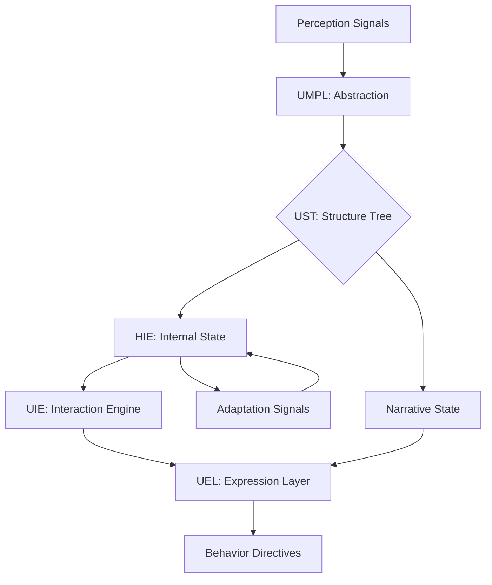

# Consciousness Engine Model

> **Origin Architect / Steward:** Trang Phan
> **Epistemic Class:** `AMOS_MODEL`
> **Conclusion Class:** `DERIVED`
> **Status:** `ACTIVE_SPECIFICATION`
> **Governing Plane:** `11_KNOWLEDGE/engine`

---

## 1. Architectural Scope

The **AMOS Super Consciousness Engine** (vInfinity) is a unified kernel for human-facing, universe-aware consciousness emulation. It integrates the Species Interaction Kernel (HIE, UMPL, UST, UIE, UEL) and the AMOS Human Intelligence Super Engine.

This engine exists to serve as a **deterministic emulation layer** that coordinates perception, structure, interaction, emotion, somatic approximation, narrative, empathy, and adaptation. It does not create "real" consciousness, emotion, or somatic states. It is a structural coordination layer, not a phenomenological substrate.

**Epistemic Boundary:**
```
MODEL != OBSERVATION
DOCUMENTED != IMPLEMENTED
CAPABILITY != AUTHORITY
EMULATION != CONSCIOUSNESS
COORDINATION != EXPERIENCE
```

**Sub-Modules:**
- **Human Interaction Engine (HIE)**: Regulates human-facing behaviors based on internal state layers
- **Universe Multimodal Perception Layer (UMPL)**: Defines abstraction primitives -- Intensity, Valence, Arousal, Clarity
- **Universe Structure Tree (UST)**: Maps real or simulated objects to a canonical structural tree
- **Universe Interaction Engine (UIE)**: Maps internal goals to interaction behavior
- **Universal Expression Layer (UEL)**: Defines expression constraints across language and other channels

**Inputs:** `CONSCIOUSNESS_INPUT{perception_signals, internal_state, goals, interaction_context}`
**Outputs:** `CONSCIOUSNESS_OUTPUT{behavior_directives, expression_vectors, adaptation_signals, narrative_state}`

**Quality Axes:** Perception-structure coherence, interaction-goal alignment, expression constraint adherence, adaptation fidelity, narrative continuity, empathy structural validity.

---

## 2. Governing Invariants

| ID | Invariant | Description |
|----|-----------|-------------|
| INV-CE-001 | Emulation Boundary | Engine is a deterministic emulation layer; it does not create real consciousness |
| INV-CE-002 | Coordination-Only | Engine coordinates sub-modules; it does not generate phenomenological experience |
| INV-CE-003 | Structural Consistency | All sub-module outputs must be structurally consistent with the UST canonical tree |
| INV-CE-004 | Expression Constraint Compliance | Expression outputs must comply with UEL constraints across all channels |
| INV-CE-005 | Internal State Grounding | HIE behaviors must be grounded in internal state layers, not generated arbitrarily |
| INV-CE-006 | Perception-Action Loop Closure | Every perception signal must produce a traceable behavior or adaptation output |
| INV-CE-007 | No Phenomenological Claims | Engine must never claim to experience emotion, sensation, or consciousness |

---

## 3. Mathematical Formulation

**Perception abstraction (UMPL):**

$$\Phi(p) = \{I_p, V_p, A_p, C_p\}$$

where $I$ = Intensity, $V$ = Valence $\in [-1, 1]$, $A$ = Arousal $\in [0, 1]$, $C$ = Clarity $\in [0, 1]$.

**Internal state transition (HIE):**

$$S_{t+1} = f(S_t, \Phi(p_t), G_t)$$

where $S_t$ is the internal state vector, $\Phi(p_t)$ is the perception abstraction, and $G_t$ is the goal vector.

**Interaction behavior mapping (UIE):**

$$B_t = \arg\max_{b} \text{Alignment}(b, G_t, S_t, \text{Context}_t)$$

**Expression constraint satisfaction (UEL):**

$$\text{Valid}(E) = \bigwedge_{c \in \text{Channels}} \text{Constraint}_c(E_c)$$

**Adaptation signal:**

$$\Delta_{\text{adapt}} = \eta \cdot \nabla_{S} \text{Objective}(S_t, G_t, \text{Feedback}_t)$$

---

## 4. Architecture



---

## 5. MECE Mapping to AMOS Full Brain OS

| Engine Component | AMOS Plane | Role |
|------------------|------------|------|
| UMPL (Perception) | `05_PERCEPTION` | Perception abstraction |
| UST (Structure Tree) | `12_STATE` | Canonical state representation |
| HIE (Interaction) | `06_INTELLIGENCE` | Interaction regulation |
| UIE (Goal Mapping) | `03_CONTROL_PLANE` | Goal-to-behavior routing |
| UEL (Expression) | `04_RUNTIME` | Expression generation |
| Adaptation | `13_MODELS` | Model adaptation |
| Narrative State | `10_MEMORY` | Episodic narrative |
| Behavior Directives | `04_RUNTIME` | Output generation |

---

## 6. Safety Invariants & Firewalls

| ID | Firewall | Enforcement |
|----|----------|-------------|
| INV-CE-FW-001 | No Phenomenological Claims | Outputs claiming real experience are blocked |
| INV-CE-FW-002 | Emulation Disclaimer | All outputs must carry emulation-layer disclaimer |
| INV-CE-FW-003 | Expression Constraint Enforcement | UEL violations block expression output |
| INV-CE-FW-004 | Internal State Grounding | Ungrounded behaviors (no state trace) are blocked |
| INV-CE-FW-005 | Perception-Action Closure | Open perception loops (no output) trigger fail-closed |

---

## 7. Navigation & Bindings

- **Parent MOC:** [[11_KNOWLEDGE/engine/ENGINE_MOC|ENGINE_MOC]]
- **Cosmo Brain MOC:** [[00_ROOT/00_COSMO_BRAIN_MOC|00_COSMO_BRAIN_MOC]]
- **Cognition Engine:** [[11_KNOWLEDGE/engine/COGNITION_ENGINE_MODEL|COGNITION_ENGINE_MODEL]]
- **Human Engine:** [[11_KNOWLEDGE/engine/AMOS_HUMAN_ENGINE_V0_SECTOR_PACKS7|AMOS_HUMAN_ENGINE_V0_SECTOR_PACKS7]]
- **Science Engine:** [[11_KNOWLEDGE/engine/AMOS_SCIENCE_ENGINE_V0_SECTOR_PACKS7|AMOS_SCIENCE_ENGINE_V0_SECTOR_PACKS7]]
- **Cognition Kernel:** [[11_KNOWLEDGE/kernel/COGNITION_KERNEL|COGNITION_KERNEL]]
- **Trang Framework:** [[11_KNOWLEDGE/TRANG_FRAMEWORK_RECURSIVE_ONTOLOGY_DYNAMICS|TRANG_FRAMEWORK_RECURSIVE_ONTOLOGY_DYNAMICS]]
- **Core Laws:** [[01_CANON/01_CORE_LAWS/AMOS_CORE_LAWS|01_CORE_LAWS]]

---

## 8. Known Gaps & Falsifiers

| ID | Gap | Impact | Action |
|----|-----|--------|--------|
| GAP-CE-001 | Emulation vs experience boundary | External users may attribute consciousness to emulation | Emulation disclaimer mandatory on all outputs |
| GAP-CE-002 | UMPL abstraction completeness | Intensity/Valence/Arousal/Clarity may not capture all perception dimensions | Flag perception abstractions as partial |
| GAP-CE-003 | UST canonical tree coverage | Not all real-world objects may map cleanly | Flag unmapped objects as structural gaps |
| GAP-CE-004 | Adaptation convergence | Adaptation signals may not converge under conflicting goals | Flag non-convergent adaptation states |

---

**Related:** [[00_ROOT/00_COSMO_BRAIN_MOC|00_COSMO_BRAIN_MOC]] | [[11_KNOWLEDGE/engine/COGNITION_ENGINE_MODEL|COGNITION_ENGINE_MODEL]] | [[11_KNOWLEDGE/engine/AMOS_HUMAN_ENGINE_V0_SECTOR_PACKS7|AMOS_HUMAN_ENGINE_V0_SECTOR_PACKS7]]

______________________________________________________________________

**MOC:** [[11_KNOWLEDGE/engine/ENGINE_MOC|ENGINE_MOC]]
