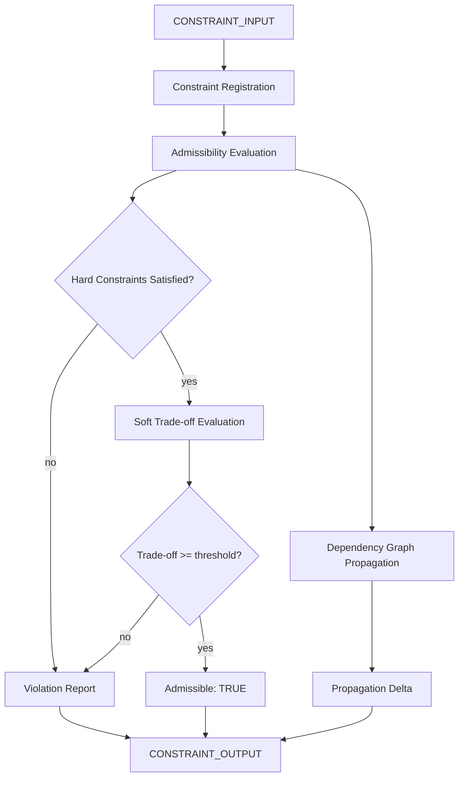

# Constraint Propagation Engine

> **Origin Architect / Steward:** Trang Phan
> **Epistemic Class:** `AMOS_MODEL`
> **Conclusion Class:** `DERIVED`
> **Status:** `ACTIVE_SPECIFICATION`
> **Governing Plane:** `11_KNOWLEDGE/engine`

---

## 1. Architectural Scope

The **Constraint Propagation Engine** is a deterministic engine for managing, evaluating, and propagating constraints across the AMOS OS. It handles hard, soft, temporal, epistemic, resource, causal, governance, authority, and safety constraint types, ensuring that all system operations satisfy admissibility conditions before execution.

This engine exists to provide the **constraint enforcement substrate** that gates every consequential operation in the AMOS OS. A hard-constraint failure cannot be compensated by a higher optimization score elsewhere.

**Epistemic Boundary:**
```
MODEL != OBSERVATION
DOCUMENTED != IMPLEMENTED
CAPABILITY != AUTHORITY
CONSTRAINT_PROPAGATION != CONSTRAINT_SATISFACTION
```

**Constraint Types:**
`hard | soft | temporal | epistemic | resource | causal | governance | authority | safety`

**Constraint Tensor:**
`C = T[id, type, target, predicate, scope, regime, priority, authority, valid_from, valid_until, provenance]`

**Pipeline:**
1. **Constraint Registration** -- Register constraints into the constraint tensor with full metadata
2. **Admissibility Evaluation** -- Evaluate `Admissible(x)` for each candidate operation
3. **Dependency Graph Propagation** -- Propagate changed constraints through dependent edges only
4. **Violation Detection** -- Detect hard-constraint violations and soft-constraint trade-off failures
5. **Violation Reporting** -- Report violations with constraint ID, target, and violation context

**Inputs:** `CONSTRAINT_INPUT{operation, candidate_state, constraint_set, dependency_graph}`
**Outputs:** `CONSTRAINT_OUTPUT{admissible: bool, violations[], propagation_delta[], tradeoff_score}`

**Quality Axes:** Constraint coverage, propagation completeness, violation detection latency, trade-off transparency, temporal validity tracking.

---

## 2. Governing Invariants

| ID | Invariant | Description |
|----|-----------|-------------|
| INV-CT-001 | Hard-Constraint Non-Compensation | A hard-constraint failure cannot be compensated by a higher optimization score elsewhere |
| INV-CT-002 | Dependency-Only Propagation | Changed constraints propagate only through dependent edges |
| INV-CT-003 | Temporal Validity | Constraints must carry valid_from and valid_until; expired constraints are inert |
| INV-CT-004 | Authority Traceability | Every constraint must carry an authority provenance |
| INV-CT-005 | Admissibility Closure | `Admissible(x) = AND(hard_constraints(x)) AND GovernedSoftTradeoff(x)` |
| INV-CT-006 | Constraint Type Preservation | Constraint types must not be silently converted (e.g., hard to soft) |
| INV-CT-007 | Violation Non-Suppression | Detected violations must be reported, not suppressed |

---

## 3. Mathematical Formulation

**Admissibility:**

$$\text{Admissible}(x) = \bigwedge_{c \in \text{Hard}(x)} \text{Satisfied}(c, x) \wedge \text{GovernedSoftTradeoff}(x)$$

**Soft constraint trade-off:**

$$\text{GovernedSoftTradeoff}(x) = \sum_{c \in \text{Soft}(x)} w_c \cdot \text{Satisfied}(c, x) \ge \theta_{\text{tradeoff}}$$

**Constraint propagation:**

$$\Delta_{\text{propagate}}(c_i) = \{c_j : \exists \text{ edge}(c_i, c_j) \in G_{\text{dep}}\}$$

**Violation severity:**

$$V(c, x) = \text{Type}(c) \cdot \text{Priority}(c) \cdot (1 - \text{Satisfied}(c, x))$$

**Temporal validity:**

$$\text{Active}(c, t) = \text{valid\_from}(c) \le t \le \text{valid\_until}(c)$$

---

## 4. Architecture



---

## 5. MECE Mapping to AMOS Full Brain OS

| Engine Component | AMOS Plane | Role |
|------------------|------------|------|
| Constraint Registration | `12_STATE` | State registration |
| Admissibility Evaluation | `03_CONTROL_PLANE` | Admission control |
| Dependency Graph Propagation | `12_STATE` | State propagation |
| Violation Detection | `17_OBSERVABILITY` | Violation monitoring |
| Violation Reporting | `17_OBSERVABILITY` | Alert generation |
| Authority Traceability | `03_CONTROL_PLANE` | Authority verification |
| Temporal Validity | `12_STATE` | Temporal state management |

---

## 6. Safety Invariants & Firewalls

| ID | Firewall | Enforcement |
|----|----------|-------------|
| INV-CT-FW-001 | Hard Constraint Block | Hard-constraint violation blocks operation entirely |
| INV-CT-FW-002 | No Silent Type Conversion | Constraint type changes require explicit authority |
| INV-CT-FW-003 | Violation Non-Suppression | Violations must be reported; suppression is blocked |
| INV-CT-FW-004 | Expired Constraint Inertness | Expired constraints cannot gate operations |
| INV-CT-FW-005 | Authority Required | Constraints without authority provenance are inert |

---

## 7. Navigation & Bindings

- **Parent MOC:** [[11_KNOWLEDGE/engine/ENGINE_MOC|ENGINE_MOC]]
- **Home:** [[00_ROOT/00_HOME|00_HOME]]
- **Knowledge MOC:** [[11_KNOWLEDGE/KNOWLEDGE_MOC|KNOWLEDGE_MOC]]
- **Simulation Kernel:** [[11_KNOWLEDGE/kernel/AMOS_SIMULATION_KERNEL|AMOS_SIMULATION_KERNEL]]
- **Cognition Kernel:** [[11_KNOWLEDGE/kernel/COGNITION_KERNEL|COGNITION_KERNEL]]
- **Logic Kernel:** [[11_KNOWLEDGE/kernel/LOGIC_KERNEL|LOGIC_KERNEL]]
- **Trang Framework:** [[11_KNOWLEDGE/TRANG_FRAMEWORK_RECURSIVE_ONTOLOGY_DYNAMICS|TRANG_FRAMEWORK_RECURSIVE_ONTOLOGY_DYNAMICS]]
- **Core Laws:** [[01_CANON/01_CORE_LAWS/AMOS_CORE_LAWS|01_CORE_LAWS]]

---

## 8. Known Gaps & Falsifiers

| ID | Gap | Impact | Action |
|----|-----|--------|--------|
| GAP-CT-001 | Circular dependency detection | Constraint propagation may enter cycles | Cycle detection required in dependency graph |
| GAP-CT-002 | Soft trade-off threshold calibration | Threshold values are domain-dependent | Flag thresholds as configurable parameters |
| GAP-CT-003 | Temporal constraint edge cases | valid_until = infinity may cause stale constraints | Infinite validity requires periodic review flag |
| GAP-CT-004 | Cross-engine constraint conflicts | Constraints from different engines may conflict | Conflict resolution protocol required |

---

**Related:** [[00_ROOT/00_HOME|00_HOME]] | [[11_KNOWLEDGE/KNOWLEDGE_MOC|KNOWLEDGE_MOC]] | [[11_KNOWLEDGE/kernel/AMOS_SIMULATION_KERNEL|AMOS_SIMULATION_KERNEL]] | [[11_KNOWLEDGE/kernel/COGNITION_KERNEL|COGNITION_KERNEL]]

______________________________________________________________________

**MOC:** [[11_KNOWLEDGE/engine/ENGINE_MOC|ENGINE_MOC]]

______________________________________________________________________

**Trang Framework:** [[11_KNOWLEDGE/TRANG_FRAMEWORK_RECURSIVE_ONTOLOGY_DYNAMICS|TRANG_FRAMEWORK_RECURSIVE_ONTOLOGY_DYNAMICS]]
