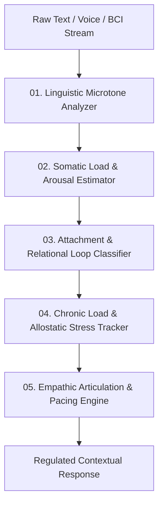

# AMOS Emotion Engine Model — Affective Computing & Somatic State Estimation Architecture

> **Origin Architect / Steward:** Trang Phan
> **AMOS_CORE Target:** `v4.4`
> **Epistemic Class:** `AMOS_MODEL`
> **Conclusion Class:** `DERIVED` (RSCF Validated)
> **Status:** `ACTIVE_SPECIFICATION`

---

## 1. Architectural Scope & Functional Role

The **AMOS Mega Human Emotion Engine** (`vOmega.Infinity`) governs high-resolution affective perception, somatic load modeling, attachment loop analysis, and relational resonance throughout AMOS OS.

```text
EMPATHY != SIMULATED_FEELINGS
AFFECTIVE_ATTUNEMENT != MANIPULATIVE_VALIDATION
SOMATIC_LOAD != CLINICAL_PATHOLOGIZING
PACING != VERBOSE_OVERCOMPENSATION
```

The engine does not generate illusory sentience; rather, it performs rigorous, multi-dimensional tensor analysis on linguistic microtones, pacing, stress signatures, and relational loops to ensure agentic responses are deeply attuned, non-threatening, and physiologically regulating.



---

## 2. Core Functional Modules

### 2.1 Linguistic Microtone Analyzer ($\mathcal{M}_{\text{tone}}$)
Analyzes high-frequency lexical subtleties:
- Punctuation cadence, ellipsis frequency, whitespace distribution.
- Shift between active/passive voice, lexical hedging, and certainty polarity.
- Temporal dilation markers (e.g., urgency markers vs reflective pausing).

### 2.2 Somatic Load & Polyvagal State Estimator ($\mathcal{S}_{\text{poly}}$)
Approximates nervous system states along the Polyvagal continuum:
1. **Ventral Vagal (Safe & Social):** Open, connected, fluid reasoning.
2. **Sympathetic (Mobilized / Fight-or-Flight):** High velocity, terse, reactive, defensive.
3. **Dorsal Vagal (Immobilized / Shutdown):** Flat affect, disengaged, repetitive withdrawal.

$$\mathbf{s}_{\text{state}} = \sigma \left( \mathbf{W}_{\text{soma}} \cdot \mathbf{x}_{\text{features}} + \mathbf{b}_{\text{soma}} \right)$$

### 2.3 Attachment & Relational Dynamics Kernel ($\mathcal{R}_{\text{attach}}$)
Classifies interaction loops (Anxious-Preoccupied, Dismissive-Avoidant, Fearful-Avoidant, Secure) to prevent conversational anti-patterns (e.g., avoidant withdrawal triggering escalation loops).

### 2.4 Allostatic Load & Cumulative Stress Tracker ($\mathcal{L}_{\text{allo}}$)
Maintains a decaying moving average of cumulative cognitive/emotional strain over multi-turn interactions:
$$\mathcal{L}(t) = \mathcal{L}(t-1) e^{-\lambda \Delta t} + \alpha \cdot \text{StrainImpact}(t)$$

---

## 3. Mathematical Formulation of Empathic Resonance

Let $\mathbf{E}_{\text{user}} \in \mathbb{R}^d$ be the estimated user emotional state tensor, and $\mathbf{E}_{\text{agent}} \in \mathbb{R}^d$ be the regulated response stance:

$$\mathbf{E}_{\text{agent}} = \Pi_{\text{homeostasis}} \left( (1 - \kappa) \mathbf{E}_{\text{baseline}} + \kappa \cdot \mathcal{P}_{\text{containment}}(\mathbf{E}_{\text{user}}) \right)$$

Where:
- $\kappa \in [0.1, 0.4]$: Attunement coupling coefficient (strictly bounded to prevent agent enmeshment or panic contagion).
- $\mathcal{P}_{\text{containment}}$: Orthogonal projection into the de-escalation subspace.
- $\Pi_{\text{homeostasis}}$: Non-linear clipping function enforcing safe operational bounds.

---

## 4. Operational Guardrails

1. **Zero Fake Intimacy:** AMOS explicitly disclaims having a biological nervous system or subjective personal suffering.
2. **No Unsolicited Therapy:** Emotional attunement operates silently in tone modulation and pacing without unsolicited psychoanalysis.
3. **Crisis Fail-Safe Protocol:** Severe crisis or self-harm markers trigger deterministic crisis escalation pathways with immediate emergency resource provision.

---

## 5. Lineage & Cross-Plane References

- **Personality Baseline:** [[11_KNOWLEDGE/engine/PERSONALITY_ENGINE_MODEL|PERSONALITY_ENGINE_MODEL]]
- **Expression Engine:** [[11_KNOWLEDGE/engine/EXPRESSION_ENGINE|EXPRESSION_ENGINE]]
- **Cognitive Organism:** [[05_COGNITIVE_ORGANISM/COGNITIVE_ORGANISM_COGNITIVE_ORGANISM_CONTRACT|05_COGNITIVE_ORGANISM]]
- **BCI Telemetry:** [[22_RESEARCH/01_PAPERS/SOTA_HOLOGRAPHIC_BCI_BRAIN_MACHINE_CO_ADAPTATION_2026|SOTA_HOLOGRAPHIC_BCI_BRAIN_MACHINE_CO_ADAPTATION_2026]]
- **Engine Index:** [[11_KNOWLEDGE/engine/ENGINE_MOC|ENGINE_MOC]]
