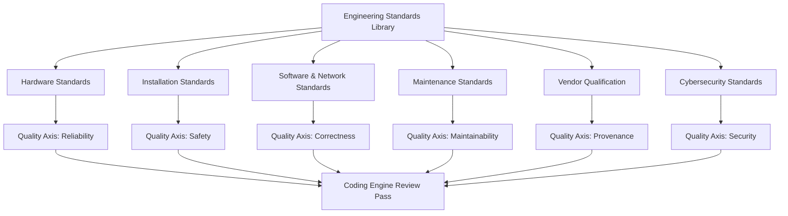

# ENGINEERING STANDARDS LIBRARY

**Origin Architect / Steward:** Trang Phan  
**AMOS_CORE Target:** `v4.4`  
**Epistemic Class:** `AMOS_MODEL`  
**Conclusion Class:** `DERIVED`

---

## 1. Purpose & Scope

The Engineering Standards Library provides the canonical reference for all engineering conventions, quality axes, and cross-domain standards enforced by the AMOS Coding Engine and automation pipelines. It defines the quality criteria that every generated artifact must satisfy before deployment gate approval.

**Scope boundaries:**
- **In scope:** Hardware standards, installation standards, software/network standards, maintenance standards, vendor qualification, cybersecurity standards, coding conventions, quality axes.
- **Out of scope:** Legal compliance requirements (delegated to [[11_KNOWLEDGE/engine/AMOS_LEGAL_ENGINE_LAYER|Legal Engine]]), risk threshold setting (delegated to [[11_KNOWLEDGE/engine/AMOS_RISK_COMPLIANCE_ENGINE_LAYER|Risk Compliance Engine]]).

---

## 2. Architecture

The standards library is organized into 6 primary sections, each with its own validation criteria and enforcement mechanisms. Standards are consumed by the [[11_KNOWLEDGE/engine/AMOS_CODING_ENGINE_LAYER|Coding Engine]] during the multi-pass review phase.

---

## 3. Layer Components

### 3.1 Hardware Standards

Defines physical infrastructure requirements:
- **Compute:** Minimum CPU/memory specifications per workload class.
- **Storage:** Redundancy requirements (RAID-6 minimum for persistent state).
- **Network:** Latency, bandwidth, and jitter thresholds per service tier.
- **Power:** UPS backup duration ≥ 15 minutes for critical systems.

### 3.2 Installation Standards

Defines deployment environment requirements:
- **OS compatibility:** Verified against target OS matrix (Linux, macOS, Windows).
- **Dependency isolation:** Containerized or virtualenv-isolated deployments.
- **Configuration management:** All configuration is version-controlled and auditable.
- **Rollback readiness:** Every installation must have a tested rollback procedure.

### 3.3 Software & Network Standards

Defines code-level conventions:
- **Naming:** `snake_case` for Python, `camelCase` for TypeScript/JavaScript, `SCREAMING_SNAKE` for constants.
- **Architecture patterns:** Layered architecture with clear separation of concerns.
- **API design:** RESTful or gRPC with typed schemas (Protocol Buffers v3 or Arrow IPC).
- **Error handling:** Explicit error types; no silent exceptions.
- **Logging:** Structured JSON logging with correlation IDs.

### 3.4 Maintenance Standards

Defines operational maintenance requirements:
- **Patch cadence:** Security patches within 72 hours of release.
- **Dependency audit:** Monthly dependency vulnerability scan.
- **Backup verification:** Weekly backup restoration tests.
- **Documentation sync:** Documentation updated within 24 hours of code change.

### 3.5 Vendor Qualification

Defines third-party vendor assessment criteria:
- **Security attestation:** SOC 2 Type II or equivalent.
- **Provenance verification:** Sigstore/Cosign-signed artifacts.
- **SLA compliance:** 99.9% uptime minimum for critical vendors.
- **Data residency:** Compliance with jurisdictional data sovereignty requirements.

### 3.6 Cybersecurity Standards

Defines security enforcement criteria:
- **Authentication:** Multi-factor authentication for all privileged access.
- **Encryption:** AES-256 at rest, TLS 1.3 in transit.
- **Capability tokens:** SPIFFE-based identity with capability-bound authorization.
- **Audit trail:** BLAKE3-signed receipts for every state mutation.
- **Vulnerability scanning:** Automated SAST + DAST in CI/CD pipeline.

---

## 4. Quality Axes (10-Axis Model)

The AMOS Tech Engine defines 10 quality axes that every artifact is scored against:

| # | Quality Axis | Weight | Measurement |
|:---|:---|:---|:---|
| Q1 | Correctness | 0.20 | Test pass rate + formal verification |
| Q2 | Reliability | 0.15 | MTBF, failure recovery time |
| Q3 | Performance | 0.10 | Latency, throughput, resource efficiency |
| Q4 | Security | 0.15 | Vulnerability count, capability leakage audit |
| Q5 | Maintainability | 0.10 | Cyclomatic complexity, coupling metrics |
| Q6 | Scalability | 0.05 | Load test scaling behavior |
| Q7 | Observability | 0.05 | Telemetry coverage, trace completeness |
| Q8 | Provenance | 0.10 | RSCF tagging, BLAKE3 receipt coverage |
| Q9 | Documentation | 0.05 | API doc coverage, README completeness |
| Q10 | Safety | 0.05 | Mutation class compliance, rollback readiness |

**Composite quality score:**
$$Q = \sum_{i=1}^{10} w_i \cdot q_i \quad \text{where} \quad q_i \in [0, 1] \;\text{and} \; \sum w_i = 1$$

Deployment gate requires $Q \ge 0.80$ with no individual axis below 0.50.

---

## 5. Invariants

$$\begin{aligned}
\text{STD-INV-01} &: \quad \text{All standards are version-controlled with RSCF provenance tags} \\
\text{STD-INV-02} &: \quad \text{Standard changes require Architecture Review Board (ARB-02) approval} \\
\text{STD-INV-03} &: \quad \text{No artifact with } Q < 0.80 \text{ passes the deployment gate} \\
\text{STD-INV-04} &: \quad \text{No artifact with any quality axis } q_i < 0.50 \text{ passes the deployment gate} \\
\text{STD-INV-05} &: \quad \text{Cybersecurity standards are non-compensatory: security failure blocks deployment regardless of composite } Q
\end{aligned}$$

---

## 6. MECE Mapping

Within the [[00_ROOT/FULL_BRAIN_OS_MECE_ARCHITECTURE|Full Brain OS MECE Architecture]]:

- **Functional ownership:** AMOS INFRASTRUCTURE (canon / configuration admission + standards)
- **Physical storage:** `11_KNOWLEDGE/engine/`
- **Authority precedence:** Standards changes require ARB-02 approval per [[23_OPERATING_MODEL/03_GOVERNANCE_FORUMS/GOVERNANCE_FORUMS|Governance Forums]]
- **Runtime call order:** Consumed by Coding Engine during review phase
- **Evidence/validation status:** `AMOS_MODEL` / `DERIVED` — structurally specified, not independently verified as deployed runtime

---

## 7. Navigation & Bindings

**Parent MOC:** [[11_KNOWLEDGE/engine/ENGINE_MOC|ENGINE_MOC]]  
**Knowledge MOC:** [[11_KNOWLEDGE/KNOWLEDGE_MOC|KNOWLEDGE_MOC]]  
**Root:** [[00_ROOT/00_HOME|00_HOME]]

**Upstream dependencies:**
- [[01_CANON/01_CORE_LAWS/AMOS_CORE_LAWS|AMOS Core Laws]]
- [[23_OPERATING_MODEL/03_GOVERNANCE_FORUMS/GOVERNANCE_FORUMS|Governance Forums]] — ARB-02 approval

**Downstream consumers:**
- [[11_KNOWLEDGE/engine/AMOS_CODING_ENGINE_LAYER|Coding Engine]] — review criteria
- [[11_KNOWLEDGE/engine/AMOS_AUTOMATION_ENGINE_LAYER|Automation Engine]] — pipeline quality gates
- [[11_KNOWLEDGE/engine/AMOS_RISK_COMPLIANCE_ENGINE_LAYER|Risk Compliance Engine]] — compliance criteria

**Peer references:**
- [[11_KNOWLEDGE/TRANG_FRAMEWORK_RECURSIVE_ONTOLOGY_DYNAMICS|Trang Framework Recursive Ontology Dynamics]]

**Related skills:**
- `.devin/skills/amos-tech-engine-vinfinity`
- `.devin/skills/amos-validation-pipeline`

**Full Brain OS Architecture:** [[00_ROOT/FULL_BRAIN_OS_MECE_ARCHITECTURE|FULL_BRAIN_OS_MECE_ARCHITECTURE]]

---

> **Epistemic boundary:** This specification is an `AMOS_MODEL` / `DERIVED` artifact. `DOCUMENTED != IMPLEMENTED`. Standards presence does not establish enforcement.
