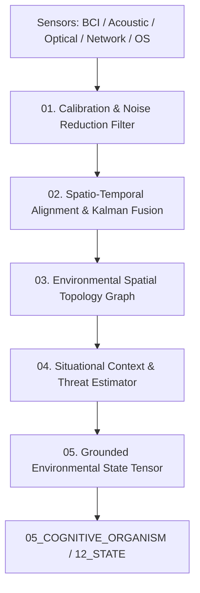

# AMOS Environment Engine — Sensory Ingestion, Ambient Telemetry & Spatial Topology Architecture

> **Origin Architect / Steward:** Trang Phan
> **AMOS_CORE Target:** `v4.4`
> **Epistemic Class:** `AMOS_MODEL`
> **Conclusion Class:** `DERIVED` (RSCF Validated)
> **Status:** `ACTIVE_SPECIFICATION`

---

## 1. Architectural Scope & Subsystem Role

The **AMOS Environment Engine** (`ENVIRONMENT_ENGINE_v4.4`) operates as the primary sensory ingestion and physical/digital environmental modeling engine within `SENSE_SYSTEM`. It receives, cleanses, spatio-temporally aligns, and maps ambient multi-modal telemetry streams into unified environmental state tensors.

```text
SENSATION != PERCEPTION
TELEMETRY != COGNITIVE_GROUNDING
STREAMING != STATE_COHERENCE
AMBIENCE != NOISE
```



---

## 2. Core Functional Pipelines

### 2.1 Multi-Modal Telemetry Calibration ($\mathcal{F}_{\text{calib}}$)
Cleanses continuous telemetry streams (thermal, BCI neural signals, ambient audio, OS system metrics, network latency) using adaptive Wiener and wavelet packet denoising:

$$\hat{\mathbf{x}}(t) = \arg\min_{\mathbf{x}} \left( \|\mathbf{y}_{\text{raw}}(t) - \mathbf{x}\|_2^2 + \lambda \|\mathbf{D} \mathbf{x}\|_1 \right)$$

### 2.2 Continuous-Discrete Spatio-Temporal Fusion ($\mathcal{K}_{\text{fusion}}$)
Fuses asynchronous multi-rate sensory feeds into a unified 4D Minkowski spacetime coordinate frame using an Unscented Kalman Filter (UKF):

$$\mathbf{s}_{\text{env}}(t + \Delta t) = f(\mathbf{s}_{\text{env}}(t), \mathbf{u}(t)) + \mathbf{w}(t)$$

$$\mathbf{z}_{\text{obs}}(t) = h(\mathbf{s}_{\text{env}}(t)) + \mathbf{v}(t)$$

### 2.3 Environmental Spatial Topology & Obstacle Graph
Maintains an active directed Riemannian manifold representing agent reachability, obstacle proximities, network topology, and thermal/acoustic gradients.

---

## 3. Real-Time Performance Invariants

| Telemetry Modality | Sampling Rate | Max Processing Latency | Jitter Bound ($\sigma$) |
| :--- | :--- | :--- | :--- |
| **Neural / BCI Electrodes** | $2000\text{ Hz}$ | $\le 1.5\text{ ms}$ | $\le 0.1\text{ ms}$ |
| **Acoustic & Audio Microphones** | $48\text{ kHz}$ | $\le 5.0\text{ ms}$ | $\le 0.5\text{ ms}$ |
| **System & Network Metrics** | $100\text{ Hz}$ | $\le 10.0\text{ ms}$ | $\le 1.0\text{ ms}$ |
| **Physical IoT & Thermal** | $10\text{ Hz}$ | $\le 50.0\text{ ms}$ | $\le 5.0\text{ ms}$ |

---

## 4. Lineage & Cross-Plane References

- **Cognitive Organism:** [[05_COGNITIVE_ORGANISM/COGNITIVE_ORGANISM_COGNITIVE_ORGANISM_CONTRACT|05_COGNITIVE_ORGANISM]]
- **Interface Protocol:** [[15_INTERFACES/INTERFACES_INTERFACE_CONTRACT|15_INTERFACES]]
- **State Bus:** [[12_STATE/HIGH_THROUGHPUT_ARROW_IPC_ZERO_COPY_STATE_BUS|12_STATE]]
- **Master Engine MOC:** [[11_KNOWLEDGE/engine/ENGINE_MOC|ENGINE_MOC]]
