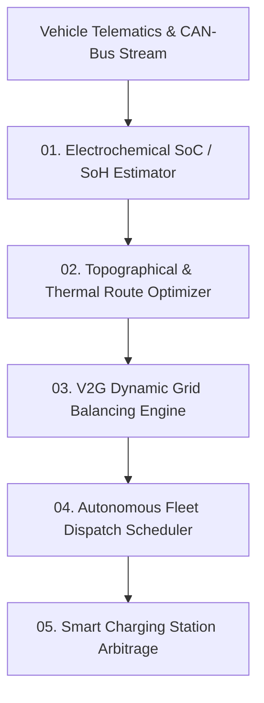

# AMOS EV Engine — Electric Vehicle Telematics, Grid Balancing & Fleet Optimization Architecture

> **Origin Architect / Steward:** Trang Phan  
> **AMOS_CORE Target:** `v4.4`  
> **Epistemic Class:** `AMOS_MODEL`  
> **Conclusion Class:** `DERIVED` (RSCF Validated)  
> **Status:** `ACTIVE_SPECIFICATION`

---

## 1. Architectural Scope & Mission

The **AMOS EV Engine** (`EV_ENGINE_v4.4`) provides real-time telematics ingestion, state-of-charge (SoC) / state-of-health (SoH) battery degradation modeling, dynamic route-energy optimization, and vehicle-to-grid (V2G) bidirectional energy arbitrage.

```text
ROUTE_OPTIMIZATION != DISTANCE_MINIMIZATION
ENERGY_EFFICIENCY != BATTERY_DEGRADATION_IGNORANCE
CHARGING_SCHEDULING != STATIC_PRICE_LOOKUP
FLEET_DISPATCH != UNCOORDINATED_HEURISTICS
```



---

## 2. Core Modules & Physical Formulations

### 2.1 Electrochemical Battery State Estimator ($\mathcal{B}_{\text{chem}}$)
Utilizes an Equivalent Circuit Model (ECM) coupled with an Extended Kalman Filter (EKF) to track open-circuit voltage $V_{\text{oc}}$, internal resistance $R_0$, and diffusion overpotentials:

$$V_{\text{terminal}}(t) = V_{\text{oc}}(\text{SoC}) - I(t) R_0 - \sum_{i=1}^2 V_{RC,i}(t)$$

$$\text{SoC}(t) = \text{SoC}(t_0) - \frac{1}{Q_{\text{nominal}}} \int_{t_0}^t \eta_{\text{coulomb}}(I) \cdot I(\tau)\, d\tau$$

### 2.2 Topographical & Dynamic Wind Route Energy Predictor
Calculates power demand $P_{\text{tractive}}(t)$ incorporating aerodynamic drag, rolling resistance, gravitational potential energy, and regenerative braking efficiency $\eta_{\text{regen}}$:

$$P_{\text{tractive}}(t) = \left( m \cdot a(t) + m g \sin \theta(x) + \mu_{rr} m g \cos \theta(x) + \frac{1}{2} \rho C_d A (v(t) + v_{\text{wind}}(t))^2 \right) v(t)$$

$$\Delta E_{\text{route}} = \int_0^T \left[ P_{\text{tractive}}(t) \cdot \mathbb{I}(P \ge 0) + \eta_{\text{regen}} P_{\text{tractive}}(t) \cdot \mathbb{I}(P < 0) \right] dt + P_{\text{aux}} T$$

### 2.3 V2G Grid Balancing & Real-Time Arbitrage
Optimizes bidirectional charging schedules $\mathbf{u}(t) \in [-P_{\text{discharge}}^{\max}, P_{\text{charge}}^{\max}]$ across electric vehicle fleets:

$$\max_{\mathbf{u}} \sum_{t=1}^H \left( \lambda_{\text{grid}}(t) \cdot u(t) \cdot \Delta t - \mathcal{C}_{\text{deg}}(u(t), T_{\text{cell}}(t)) \right)$$

$$\text{subject to } \text{SoC}_{\min} \le \text{SoC}(t) \le \text{SoC}_{\max}, \quad \text{SoC}(T_{\text{departure}}) \ge \text{SoC}_{\text{target}}$$

---

## 3. Fleet Logistics & Smart Charging Matrix

| Fleet Dimension | Optimization Algorithm | Real-Time Latency | Invariant Bound |
| :--- | :--- | :--- | :--- |
| **Depot Scheduling** | Mixed-Integer Linear Programming (MILP) | $< 2.5\text{ s}$ | Zero grid transformer overloads |
| **En-Route Fast Charging** | Dynamic Bellman DP with Stochastic Queuing | $< 100\text{ ms}$ | Wait-time variance $\sigma^2 \le 4\text{ min}$ |
| **Battery Health Protection** | Arrhenius Degradation Minimizer | Background continuous | Cell $T \le 45^\circ\text{C}$ during 350kW DC fast charge |

---

## 4. Lineage & Cross-Plane References

- **Super Engine:** [[11_KNOWLEDGE/engine/EV_SUPER_ENGINE|EV_SUPER_ENGINE]]
- **Regional Deployment:** [[11_KNOWLEDGE/AMOS_EV_VIETNAM|AMOS_EV_VIETNAM]]
- **Driver Charging Engine:** [[11_KNOWLEDGE/engine/VN_DRIVER_CHARGING_SUPER_ENGINE_VINFINITY_CLEAN|VN_DRIVER_CHARGING_SUPER_ENGINE_VINFINITY_CLEAN]]
- **Energy Domain:** [[21_DOMAINS/44_EV_INFRASTRUCTURE/44_EV_INFRASTRUCTURE_MOC|44_EV_INFRASTRUCTURE_MOC]]
- **Engine Index:** [[11_KNOWLEDGE/engine/ENGINE_MOC|ENGINE_MOC]]

