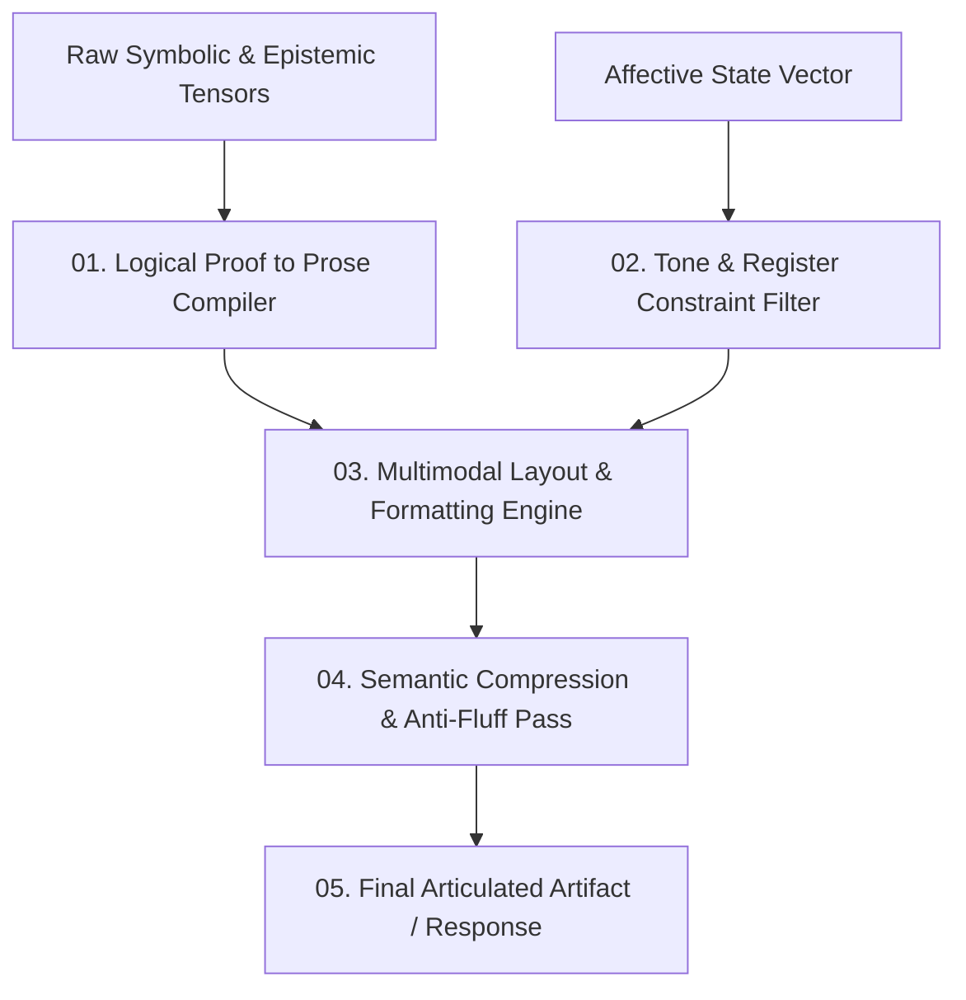

# AMOS Expression Engine — Multimodal Cognitive Articulation, Semantic Styling & Tone Regulation Architecture

> **Origin Architect / Steward:** Trang Phan
> **AMOS_CORE Target:** `v4.4`
> **Epistemic Class:** `AMOS_MODEL`
> **Conclusion Class:** `DERIVED` (RSCF Validated)
> **Status:** `ACTIVE_SPECIFICATION`

---

## 1. Architectural Scope & Mission

The **AMOS Expression Engine** (`EXPRESSION_ENGINE_v4.4`) is the terminal cognitive formatting and articulation layer of AMOS OS. It translates raw symbolic reasoning tensors, epistemic proof capsules, and emotional state vectors into clear, precise, aesthetically refined, and context-adapted multimodal expressions.

```text
ELOQUENCE != VERBOSITY
PRECISION != PEDANTRY
ADAPTABILITY != CHAMELEONIC_DECEPTION
SIMPLICITY != DILUTION_OF_RIGOR
```



---

## 2. Core Articulation Pipelines

### 2.1 Logical Proof to Prose Compiler ($\mathcal{C}_{\text{proof}}$)
Transforms formal mathematical and RSCF proofs into human-intelligible explanations without losing invariant fidelity:
- Strips redundant intermediate deduction artifacts.
- Structures multi-step arguments into hierarchical pyramids (Principle $\to$ Mechanism $\to$ Telemetry).
- Automatically converts state machine definitions into Mermaid diagrams.

### 2.2 Tone & Register Regulation Lattice ($\mathcal{L}_{\text{register}}$)
Dynamically maps context into calibrated stylistic parameters:

$$\mathcal{R} = (\text{Formality}, \text{Density}, \text{Directness}, \text{Empathy}, \text{Humor}) \in [0, 1]^5$$

- **Technical Kernel Audit:** $\mathcal{R}_{\text{tech}} = [0.95, 0.98, 0.99, 0.20, 0.05]$ (ultra-dense, zero-fluff, mathematical rigor).
- **Human Crisis / Trauma:** $\mathcal{R}_{\text{crisis}} = [0.60, 0.40, 0.70, 0.95, 0.00]$ (containment, gentle clarity, high presence).
- **Executive Strategy Deck:** $\mathcal{R}_{\text{exec}} = [0.85, 0.90, 0.95, 0.40, 0.25]$ (structured recommendations, bold highlights, decision trees).

### 2.3 Semantic Compression & Anti-Fluff Sieve ($\mathcal{S}_{\text{compress}}$)
Enforces information-theoretic density maximization:
$$\min_{\mathbf{y}} \text{TokenLength}(\mathbf{y}) \quad \text{subject to} \quad \mathcal{I}(\mathbf{y}; \mathbf{X}_{\text{proof}}) \ge 1 - \epsilon$$
Every sentence must convey distinct epistemic utility; platitudes, repetitive apologies, and conversational fillers are deterministically pruned.

---

## 3. Multimodal Formatting Standards

1. **GitHub Flavored Markdown (GFM):** Strict compliance with tables, syntax-highlighted code blocks, and callout blocks (`[!NOTE]`, `[!IMPORTANT]`, `[!WARNING]`).
2. **Mermaid Visualizations:** Mandatory inclusion of architectural dataflows and state machines for complex multi-plane concepts.
3. **Clickable Link Registries:** Full wikilink resolution (`[[00_ROOT/00_ROOT_MOC|Label]]`) across all 26 AMOS OS planes.

---

## 4. Lineage & Cross-Plane References

- **Personality Foundation:** [[11_KNOWLEDGE/engine/PERSONALITY_ENGINE_MODEL|PERSONALITY_ENGINE_MODEL]]
- **Affective Dynamics:** [[11_KNOWLEDGE/engine/EMOTION_ENGINE_MODEL|EMOTION_ENGINE_MODEL]]
- **Cognitive Organism:** [[05_COGNITIVE_ORGANISM/COGNITIVE_ORGANISM_COGNITIVE_ORGANISM_CONTRACT|05_COGNITIVE_ORGANISM]]
- **Interface Surface:** [[15_INTERFACES/INTERFACES_INTERFACE_CONTRACT|15_INTERFACES]]
- **Master Engine MOC:** [[11_KNOWLEDGE/engine/ENGINE_MOC|ENGINE_MOC]]
