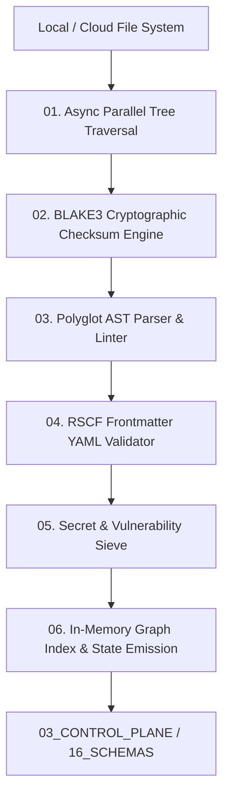

# AMOS File Scan Engine — Deep Invariant-Aware File System Scanning, AST Static Analysis & Integrity Verification Architecture

> **Origin Architect / Steward:** Trang Phan  
> **AMOS_CORE Target:** `v4.4`  
> **Epistemic Class:** `AMOS_MODEL`  
> **Conclusion Class:** `DERIVED` (RSCF Validated)  
> **Status:** `ACTIVE_SPECIFICATION`

---

## 1. Architectural Scope & Subsystem Role

The **AMOS File Scan Engine** (`FILE_SCAN_ENGINE_v4.4`) provides high-throughput recursive file system traversal, AST structural parsing, frontmatter YAML schema validation, cryptographic hash indexing (BLAKE3), and static security vulnerability scanning across all repository and vault assets.

```text
TRAVERSAL != STRUCTURAL_VERIFICATION
SYNTACTIC_VALIDITY != EPISTEMIC_AUTHORITY
PARSING != AST_COMPLIANCE
SCAN_INDEX != PERMANENT_STATE
```



---

## 2. Core Functional Pipelines

### 2.1 Async High-Throughput Tree Traversal ($\mathcal{T}_{\text{fs}}$)
- Utilizes `io_uring` and multithreaded work-stealing thread pools to traverse $>100,000$ files/sec.
- Respects `.gitignore`, `.ignore`, and vault boundary filters.

### 2.2 BLAKE3 Merkle Tree Checksum Calculation
Computes tree hashes for instantaneous delta detection:
$$\mathcal{H}_{\text{root}} = \text{BLAKE3}\left( \bigotimes_{i=1}^N \text{BLAKE3}(F_i \parallel \text{Metadata}_i) \right)$$

### 2.3 Polyglot AST Structural Parser
Parses Markdown, Python, Rust, TypeScript, Protobuf, and JSON schemas into typed Abstract Syntax Trees:
- Detects orphaned cross-links and dead wikilink references.
- Validates formal invariant formulas and LaTeX syntax integrity.

### 2.4 Frontmatter Schema Verification
Enforces strict 9-field metadata compliance:
```yaml
title: string
type: enum[plane_contract, specification, research_paper, skill_definition]
origin_architect: "Trang Phan"
steward: "Trang Phan"
amos_core_target: "v4.4"
status: enum[ACTIVE_SPECIFICATION, ACTIVE_CONTROL_SURFACE, DRAFT]
epistemic_class: enum[SOURCE_CLAIM, OBSERVATION, DERIVED, AMOS_MODEL]
conclusion_class: enum[SOURCE_CLAIM, OBSERVATION, DERIVED, MODEL, DECISION]
rscf:
  state: string
  claim_class: string
  provenance: list[string]
  scope: string
```

---

## 3. Performance & Verification Metrics

| Scan Dimension | Throughput Target | Invariant Bound |
| :--- | :--- | :--- |
| **Directory Walk** | $\ge 250,000\text{ nodes/s}$ | Zero symlink recursion cycles |
| **Hashing Engine** | $\ge 4.5\text{ GB/s (SIMD AVX-512)}$ | Zero hash collision probability ($p < 2^{-256}$) |
| **AST Verification** | $\ge 15,000\text{ files/s}$ | $100\%$ schema invariant detection |

---

## 4. Lineage & Cross-Plane References

- **Vault Resolver:** [[03_CONTROL_PLANE/COGNITIVE_VAULT_RESOLVER|COGNITIVE_VAULT_RESOLVER]]
- **Sandboxed Execution:** [[14_TOOLS/SANDBOX_TOOL_EXECUTION_PROTOCOL|14_TOOLS]]
- **Security Auditing:** [[18_SECURITY/SECURITY_SECURITY_CONTRACT|18_SECURITY]]
- **Master Engine MOC:** [[11_KNOWLEDGE/engine/ENGINE_MOC|ENGINE_MOC]]

