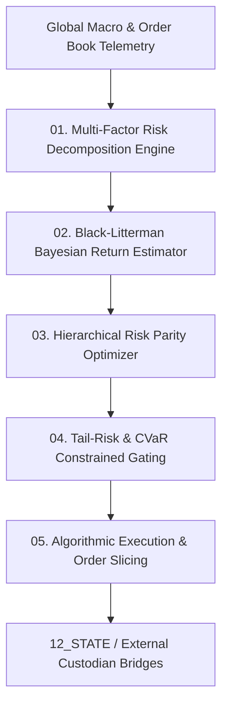

# AMOS Investment Engine — Multi-Asset Portfolio Allocation, Black-Litterman Bayesian Updating & Risk Parity Architecture

> **Origin Architect / Steward:** Trang Phan
> **AMOS_CORE Target:** `v4.4`
> **Epistemic Class:** `AMOS_MODEL`
> **Conclusion Class:** `DERIVED` (RSCF Validated)
> **Status:** `ACTIVE_SPECIFICATION`

---

## 1. Architectural Scope & Subsystem Role

The **AMOS Investment Engine** (`INVESTMENT_ENGINE_v4.4`) provides systematic quantitative asset management, multi-factor risk decomposition, Bayesian expected return estimation via the Black-Litterman model, and hierarchical risk parity (HRP) portfolio optimization.

```text
HISTORICAL_RETURN != EXPECTED_FUTURE_RETURN
CORRELATION != CAUSAL_EXPOSURE
DIVERSIFICATION != ASSET_COUNT_MAXIMIZATION
VOLATILITY != DOWNSIDE_RISK
```



---

## 2. Core Quantitative Formulations

### 2.1 Black-Litterman Bayesian Return Formulation
Combines the neutral market equilibrium return prior $\Pi$ with subjective views $\mathbf{Q}$ and view uncertainty covariance $\mathbf{\Omega}$:

$$\mathbf{E}[\mathbf{R}] = \left[ (\tau \mathbf{\Sigma})^{-1} + \mathbf{P}^T \mathbf{\Omega}^{-1} \mathbf{P} \right]^{-1} \left[ (\tau \mathbf{\Sigma})^{-1} \mathbf{\Pi} + \mathbf{P}^T \mathbf{\Omega}^{-1} \mathbf{Q} \right]$$

$$\mathbf{\Pi} = \delta \mathbf{\Sigma} \mathbf{w}_{\text{mkt}}$$

Where:
- $\mathbf{\Sigma}$: Empirical covariance matrix of asset returns.
- $\delta$: Global risk aversion coefficient.
- $\mathbf{P}$: View pick matrix linking assets to expected view spreads.
- $\tau$: Scalar weighting the uncertainty of the prior.

### 2.2 Hierarchical Risk Parity (HRP) Optimization
Eliminates matrix inversion instability by clustering correlation matrices into dendrogram trees:

1. **Tree Clustering:** Compute distance metric $d_{i,j} = \sqrt{\frac{1}{2}(1 - \rho_{i,j})}$ and build hierarchical cluster tree.
2. **Quasi-Diagonalization:** Reorder covariance matrix along dendrogram leaves.
3. **Recursive Bisection:** Allocate capital inversely proportional to cluster variance:

$$\alpha_1 = 1 - \frac{\tilde{V}_1}{\tilde{V}_1 + \tilde{V}_2}, \quad \alpha_2 = 1 - \alpha_1$$

### 2.3 Conditional Value-at-Risk (CVaR) Tail Guard
$$\text{CVaR}_\alpha(\mathbf{w}) = \frac{1}{1-\alpha} \int_{0}^{1-\alpha} \text{VaR}_\gamma(\mathbf{w})\, d\gamma \le \text{Threshold}_{\max}$$

---

## 3. Allocation & Execution Limits

| Risk Dimension | Hard Limit ($\text{Tier } H$) | Dynamic Metric |
| :--- | :--- | :--- |
| **Max Portfolio Drawdown** | $\le 8.5\%$ | Auto-hedge via VIX/Options overlays |
| **Single Asset Concentration** | $\le 12.0\%$ | Hard-capped across all liquid portfolios |
| **Leverage Ratio** | $\le 1.5\times$ | Zero margin-call boundary condition |
| **Slippage Impact** | $\le 4.2\text{ bps}$ | Almgren-Chriss optimal execution trajectory |

---

## 4. Lineage & Cross-Plane References

- **Economic Domain:** [[21_DOMAINS/17_C07_ECON_FINANCE/17_C07_ECON_FINANCE_MOC|17_C07_ECON_FINANCE_MOC]]
- **Master Knowledge:** [[11_KNOWLEDGE/AMOS_C07_ECON_FINANCE_MASTER_KNOWLEDGE|AMOS_C07_ECON_FINANCE_MASTER_KNOWLEDGE]]
- **Sector Rotation:** [[11_KNOWLEDGE/engine/SECTOR_ROTATION_ENGINE|SECTOR_ROTATION_ENGINE]]
- **Political Risk:** [[11_KNOWLEDGE/engine/POLITICAL_RISK_ENGINE|POLITICAL_RISK_ENGINE]]
- **Master Engine MOC:** [[11_KNOWLEDGE/engine/ENGINE_MOC|ENGINE_MOC]]
