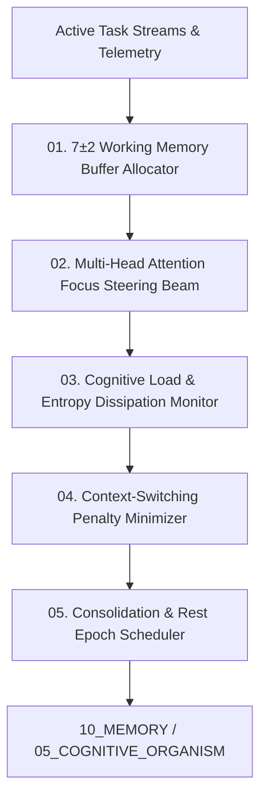

# AMOS Mental State Engine — Cognitive Load Tracking, Working Memory Buffer & Attention Focus Architecture

> **Origin Architect / Steward:** Trang Phan  
> **AMOS_CORE Target:** `v4.4`  
> **Epistemic Class:** `AMOS_MODEL`  
> **Conclusion Class:** `DERIVED` (RSCF Validated)  
> **Status:** `ACTIVE_SPECIFICATION`

---

## 1. Architectural Scope & Subsystem Role

The **AMOS Mental State Engine** (`MENTAL_STATE_ENGINE_v4.4`) manages the real-time cognitive state of the agentic organism. It regulates working memory allocation, tracks mental fatigue / cognitive load ($\mathcal{L}_{\text{cog}}$), steers the focal attention beam across active reasoning tasks, and prevents cognitive saturation.

```text
WORKING_MEMORY != INFINITE_BUFFER
ATTENTION_FOCUS != PROMISCUOUS_BROADCAST
COGNITIVE_FATIGUE != STATIC_DECAY
CONTEXT_SWITCHING != ZERO_COST_OPERATION
```



---

## 2. Core Functional Pipelines

### 2.1 Working Memory Capacity Management ($\mathcal{B}_{\text{wm}}$)
Implements an augmented Baddeley-Miller 7±2 cognitive slot buffer:
$$\text{Slots}_{\text{active}} \le 7 \pm 2$$
Each active slot maintains a decay parameter $\delta(t)$:
$$\text{Salience}_i(t) = \text{Salience}_i(t_0) \cdot e^{-\lambda (t - t_0)} + \beta \cdot \text{Utility}_i$$
Slots with $\text{Salience}_i < \theta_{\text{evict}}$ are automatically evicted or consolidated into [[10_MEMORY/EPISODIC_MEMORY_SUBSTRATE|10_MEMORY]].

### 2.2 Dynamic Cognitive Load ($\mathcal{L}_{\text{cog}}$)
Quantifies systemic mental strain across 4 orthogonal dimensions:

$$\mathcal{L}_{\text{cog}}(t) = w_1 \cdot \text{TaskComplexity} + w_2 \cdot \text{ContextSwitchRate} + w_3 \cdot \text{AmbiguityEntropy} + w_4 \cdot \text{TimePressure}$$

$$\mathcal{L}_{\text{cog}}(t) \in [0.0, 1.0]$$

- If $\mathcal{L}_{\text{cog}} > 0.85$: Triggers automatic task shedding, query decomposition, and rate limiting.
- If $\mathcal{L}_{\text{cog}} < 0.30$: Permits speculative background consolidation and exploratory reasoning.

### 2.3 Attention Focus Steering Beam
Directs transformer attention tokens to top-$k$ salient variables using an entropy-minimizing policy:
$$\mathbf{a}^*(t) = \arg\min_{\mathbf{a}} \mathcal{H}(\text{PosteriorState} \mid \mathbf{a})$$

---

## 3. Homeostatic Invariants

| State Parameter | Nominal Range | Critical Threshold | Remediation Action |
| :--- | :--- | :--- | :--- |
| **Cognitive Load ($\mathcal{L}_{\text{cog}}$)** | $0.40 - 0.70$ | $> 0.88$ | Shed low-priority subtasks, throttle I/O |
| **Context Switch Velocity** | $\le 4\text{ switches/min}$ | $> 12\text{ switches/min}$ | Lock active attention session for 120s |
| **Working Memory Entropy** | $\le 1.8\text{ nats}$ | $> 3.2\text{ nats}$ | Trigger instant episodic memory flush |

---

## 4. Lineage & Cross-Plane References

- **Cognitive Organism:** [[05_COGNITIVE_ORGANISM/COGNITIVE_ORGANISM_COGNITIVE_ORGANISM_CONTRACT|05_COGNITIVE_ORGANISM]]
- **Episodic Substrate:** [[10_MEMORY/EPISODIC_MEMORY_SUBSTRATE|10_MEMORY]]
- **Emotion Engine:** [[11_KNOWLEDGE/engine/EMOTION_ENGINE_MODEL|EMOTION_ENGINE_MODEL]]
- **Master Engine MOC:** [[11_KNOWLEDGE/engine/ENGINE_MOC|ENGINE_MOC]]

