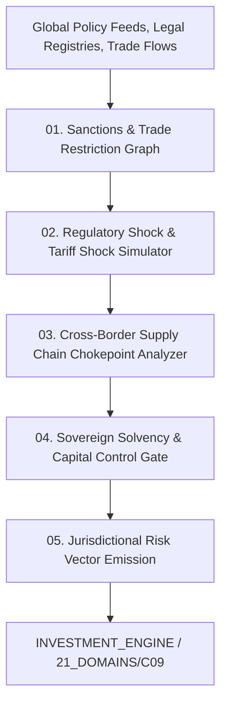

# AMOS Political Risk Engine — Geopolitical Disruption Modeling, Sanctions Topology & Regulatory Shock Architecture

> **Origin Architect / Steward:** Trang Phan
> **AMOS_CORE Target:** `v4.4`
> **Epistemic Class:** `AMOS_MODEL`
> **Conclusion Class:** `DERIVED` (RSCF Validated)
> **Status:** `ACTIVE_SPECIFICATION`

---

## 1. Architectural Scope & Subsystem Role

The **AMOS Political Risk Engine** (`POLITICAL_RISK_ENGINE_v4.4`) models sovereign risk, geopolitical realignment, international sanctions diffusion, regulatory interventions, and supply chain vulnerability across global jurisdictions.

```text
HEADLINE_NEWS != GEOPOLITICAL_RISK
TREATY_TEXT != ENFORCEMENT_CAPABILITY
SANCTIONS_LIST != GRAPH_CONTAGION_BOUNDARY
SOVEREIGN_RATING != SYSTEMIC_DEFAULT_RISK
```



---

## 2. Core Modeling Formulations

### 2.1 Sanctions Diffusion Network Graph ($\mathcal{G}_{\text{sanctions}}$)
Models primary and secondary sanctions contagion across an international corporate bipartite graph $\mathcal{G} = (\mathcal{V}_{\text{entities}}, \mathcal{E}_{\text{ownership}} \cup \mathcal{E}_{\text{transactions}})$:

$$\text{Risk}_{\text{contagion}}(v) = \sum_{u \in \mathcal{N}(v)} w_{u,v} \cdot \mathbb{I}(u \in \text{SanctionsList}) \cdot e^{-\kappa \cdot \text{HopDistance}(u,v)}$$

### 2.2 Regulatory Shock Probability Surface
Estimates the likelihood of imminent capital controls, asset nationalization, or regulatory bans using survival analysis:

$$\lambda(t \mid \mathbf{z}) = \lambda_0(t) \exp\left( \mathbf{\beta}^T \mathbf{z}_{\text{macro-political}} \right)$$

$$\mathbf{z}_{\text{macro-political}} = [\text{FX Reserve Depletion}, \text{Election Polarization}, \text{Debt-to-GDP}, \text{Civil Unrest Index}]^T$$

### 2.3 Supply Chain Chokepoint Vulnerability Index ($\mathcal{C}_{\text{choke}}$)
Quantifies dependence on critical chokepoints (e.g., Malacca Strait, Taiwan semiconductor foundries, rare-earth processing):

$$\mathcal{C}_{\text{choke}}(\text{Sector}_k) = \sum_{j \in \text{Inputs}} \left( \frac{\text{Volume}_j}{\text{TotalVolume}_k} \cdot \frac{1}{\text{HHI}_{\text{suppliers}}(j)} \cdot \text{Risk}_{\text{jurisdiction}}(j) \right)$$

---

## 3. Jurisdictional Risk Categorization

| Tier | Classification | Characteristic Jurisdictions | Asset Hedging Action |
| :--- | :--- | :--- | :--- |
| **Tier 1: Stable G8 Core** | High rule-of-law, deep capital markets | US, EU, UK, Japan, Australia | Standard market beta allocation |
| **Tier 2: Dynamic Growth Hubs** | High growth, moderate policy volatility | Vietnam, Singapore, India, UAE | Active regulatory monitoring, local partner covenants |
| **Tier 3: Elevated Fragility** | Capital control risk, sudden FX devaluation | Argentina, Egypt, Turkey | FX-hedged, short-duration assets only |
| **Tier 4: Sanctions Exclusion** | Active comprehensive sanctions / embargo | North Korea, Iran, Russia | Absolute transaction blacklist |

---

## 4. Lineage & Cross-Plane References

- **Policy Domain:** [[21_DOMAINS/19_C09_ORG_LAW_POLICY/19_C09_ORG_LAW_POLICY_MOC|19_C09_ORG_LAW_POLICY_MOC]]
- **Investment Engine:** [[11_KNOWLEDGE/engine/INVESTMENT_ENGINE|INVESTMENT_ENGINE]]
- **Sector Rotation:** [[11_KNOWLEDGE/engine/SECTOR_ROTATION_ENGINE|SECTOR_ROTATION_ENGINE]]
- **Master Engine MOC:** [[11_KNOWLEDGE/engine/ENGINE_MOC|ENGINE_MOC]]
