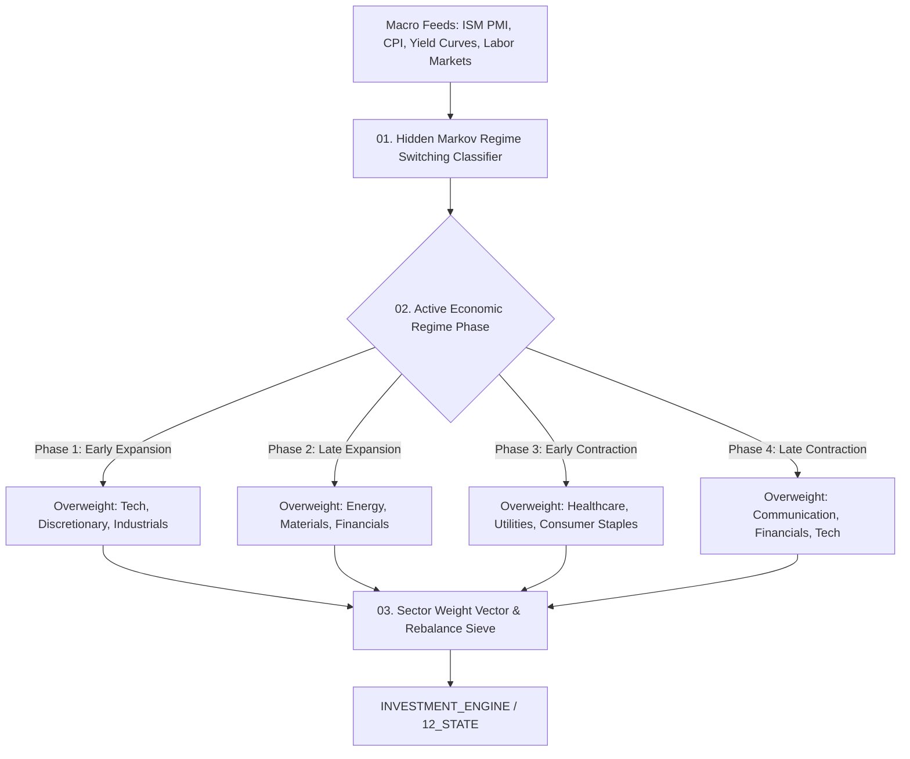

# AMOS Sector Rotation Engine — Macroeconomic Business Cycle, Yield Curve Inversion & Dynamic Sector Allocation Architecture

> **Origin Architect / Steward:** Trang Phan
> **AMOS_CORE Target:** `v4.4`
> **Epistemic Class:** `AMOS_MODEL`
> **Conclusion Class:** `DERIVED` (RSCF Validated)
> **Status:** `ACTIVE_SPECIFICATION`

---

## 1. Architectural Scope & Subsystem Role

The **AMOS Sector Rotation Engine** (`SECTOR_ROTATION_ENGINE_v4.4`) classifies the active macroeconomic regime across four phases of the business cycle and dynamically shifts capital weights across 11 GICS economic sectors.

```text
GDP_GROWTH != SECTOR_OUTPERFORMANCE
CYCLE_EXPANSION != PERPETUAL_BULL_RUN
INFLATION != HOMOGENEOUS_COST_PRESSURES
YIELD_CURVE_STEEPNESS != RECESSION_ABSENCE
```



---

## 2. Core Modeling Formulations

### 2.1 Hidden Markov Model (HMM) Macro Regime Classifier
Identifies the latent regime state $S_t \in \{1, 2, 3, 4\}$ from observation vector $\mathbf{y}_t = [\Delta\text{PMI}_t, \text{YieldSpread}_{10y-2y,t}, \Delta\text{CPI}_t, \text{CreditSpread}_t]^T$:

$$P(S_t = j \mid S_{t-1} = i) = A_{i,j}$$

$$\mathbf{y}_t \mid S_t = j \sim \mathcal{N}(\mathbf{\mu}_j, \mathbf{\Sigma}_j)$$

$$\hat{S}_t = \arg\max_j P(S_t = j \mid \mathbf{y}_{1:t})$$

### 2.2 Yield Curve Inversion & Leading Recession Probability
Calculates the 12-month forward recession probability $\mathcal{P}_{\text{recession}}$ via probit regression on the term spread:

$$\mathcal{P}_{\text{recession}}(t + 12) = \Phi\left( \beta_0 + \beta_1 (y_{10}(t) - y_{2}(t)) + \beta_2 \Delta\text{FedFunds}(t) \right)$$

### 2.3 Sector Momentum & Fundamental Quality Scoring
Ranks sector $k$ using composite Z-score:
$$Z_k = 0.40 \cdot Z_{\text{macro-fit}}(k, \hat{S}_t) + 0.35 \cdot Z_{\text{momentum}}(k) + 0.25 \cdot Z_{\text{earnings-growth}}(k)$$

---

## 3. Dynamic Sector Matrix

| Business Cycle Phase | Primary Growth Driver | Optimal Sector Overweights | Underweight / Hedge |
| :--- | :--- | :--- | :--- |
| **1. Early Expansion** | Credit recovery, inventory restocking | Information Tech, Consumer Discretionary | Utilities, Cash |
| **2. Late Expansion** | Capacity constraints, commodity inflation | Energy, Materials, Industrials | Real Estate, Long Duration Bonds |
| **3. Early Contraction** | Margin compression, tightening liquidity | Health Care, Utilities, Consumer Staples | High Beta Tech, Discretionary |
| **4. Late Contraction** | Central bank easing, bottoming yields | Financials, Long Duration Treasuries | Energy, Cyclical Commodities |

---

## 4. Lineage & Cross-Plane References

- **Economic Domain:** [[21_DOMAINS/17_C07_ECON_FINANCE/17_C07_ECON_FINANCE_MOC|17_C07_ECON_FINANCE_MOC]]
- **Investment Engine:** [[11_KNOWLEDGE/engine/INVESTMENT_ENGINE|INVESTMENT_ENGINE]]
- **Political Risk:** [[11_KNOWLEDGE/engine/POLITICAL_RISK_ENGINE|POLITICAL_RISK_ENGINE]]
- **Master Engine MOC:** [[11_KNOWLEDGE/engine/ENGINE_MOC|ENGINE_MOC]]
