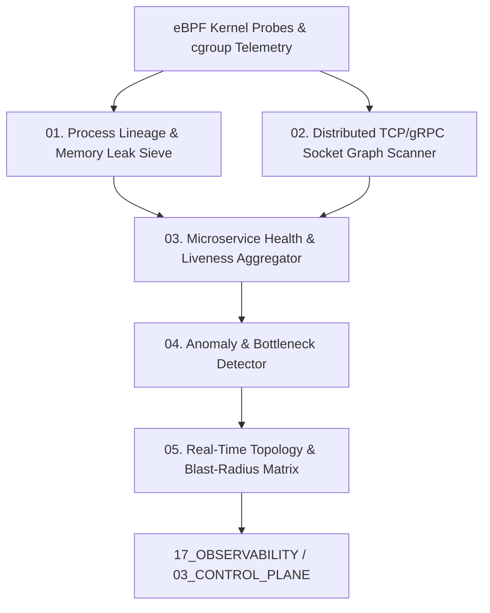

# AMOS System Scan Engine — Distributed Infrastructure Topology, Process Tracing & Microservice Health Architecture

> **Origin Architect / Steward:** Trang Phan
> **AMOS_CORE Target:** `v4.4`
> **Epistemic Class:** `AMOS_MODEL`
> **Conclusion Class:** `DERIVED` (RSCF Validated)
> **Status:** `ACTIVE_SPECIFICATION`

---

## 1. Architectural Scope & Subsystem Role

The **AMOS System Scan Engine** (`SYSTEM_SCAN_ENGINE_v4.4`) performs continuous, zero-overhead kernel-level process discovery, network socket graph extraction via eBPF, distributed microservice health aggregation, and dead-lock / memory leak detection across the AMOS compute fabric.

```text
HOST_UP != SERVICE_HEALTHY
SOCKET_OPEN != PAYLOAD_ACCEPTING
CPU_IDLE != DEADLOCK_ABSENCE
PROCESS_EXISTS != CONTRACT_COMPLIANT
```



---

## 2. Core Functional Pipelines

### 2.1 Kernel-Level eBPF Process & Socket Tracing
Attaches zero-overhead probes to `sys_enter_connect`, `sys_enter_accept`, `sched_switch`, and `mm_alloc`:
- Maps live IPC socket graphs and gRPC connection latencies.
- Tracks per-process memory allocations and detects monotonic RSS growth without corresponding deallocation ($\frac{d\text{RSS}}{dt} > 0$ over $N$ epochs).

### 2.2 Microservice Health & Liveness Aggregator ($\mathcal{H}_{\text{mesh}}$)
Computes a continuous health score $\Phi(S_i) \in [0, 1]$ for each microservice node:

$$\Phi(S_i) = \exp\left( -\alpha \cdot \frac{\text{Latency}_{p99}}{\text{SLA}} - \beta \cdot \text{ErrorRate} - \gamma \cdot \frac{\text{MemoryUsage}}{\text{Quota}} \right)$$

If $\Phi(S_i) < 0.65$: Triggers automated circuit-breaker isolation and pod resurrection in [[04_RUNTIME/RUNTIME_RUNTIME_CONTRACT|04_RUNTIME]].

### 2.3 Distributed Deadlock & Race Condition Sieve
Constructs the real-time resource-allocation digraph $\mathcal{D} = (\mathcal{P} \cup \mathcal{R}, \mathcal{E})$ and runs Tarjan's strongly connected components algorithm every 50ms to detect cyclic lock dependencies:
$$\text{Cycles}(\mathcal{D}) \ne \emptyset \implies \text{Trigger Instant Preemption}$$

---

## 3. Scan Performance Invariants

| Scan Probe | Execution Frequency | Overhead Budget | Action on Failure |
| :--- | :--- | :--- | :--- |
| **eBPF Socket Topology** | Continuous ring buffer | $\le 0.4\%\text{ CPU}$ | Auto-throttle trace sampling |
| **Deadlock Cycle Check** | Every $50\text{ ms}$ | $\le 1.2\text{ ms}$ compute | Abort oldest low-priority lock holder |
| **Heap Leak Detection** | Every $60\text{ s}$ | $\le 15\text{ ms}$ scan | Flag memory leak ticket in `20_OPERATIONS` |

---

## 4. Lineage & Cross-Plane References

- **Observability Contract:** [[17_OBSERVABILITY/OBSERVABILITY_OBSERVABILITY_CONTRACT|17_OBSERVABILITY]]
- **Control Plane:** [[03_CONTROL_PLANE/COGNITIVE_VAULT_RESOLVER|COGNITIVE_VAULT_RESOLVER]]
- **File Scan Engine:** [[11_KNOWLEDGE/engine/FILE_SCAN_ENGINE|FILE_SCAN_ENGINE]]
- **Runtime Sandboxing:** [[04_RUNTIME/RUNTIME_RUNTIME_CONTRACT|04_RUNTIME]]
- **Master Engine MOC:** [[11_KNOWLEDGE/engine/ENGINE_MOC|ENGINE_MOC]]
