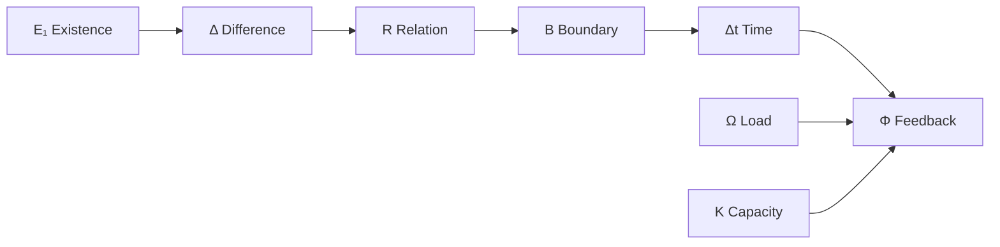
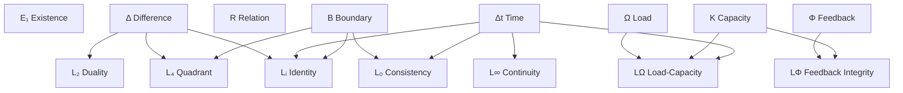
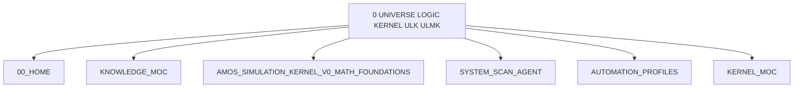
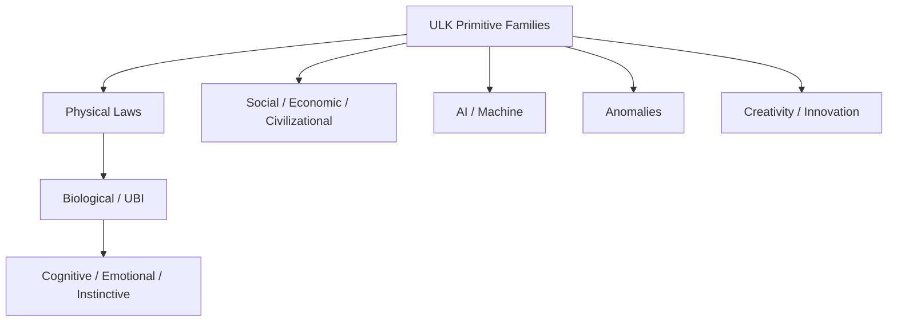
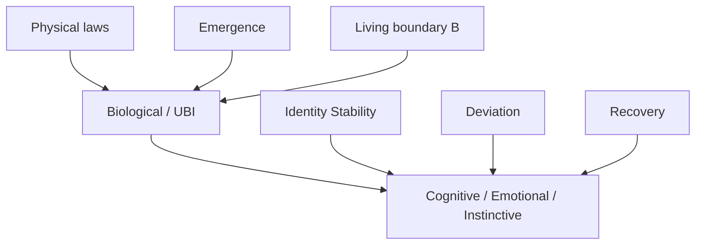

# 0 UNIVERSE LOGIC KERNEL ULK ULMK

## Full Exhaustive Canonical Expansion · Source-Preserving · RSCF-Governed · Causal-Firewalled · Obsidian-Ready

> [!important] Canonical conclusion
> The supplied artifact defines a **source-claimed Universe Logic Kernel (ULK)** organized into **8 Atomic Logic Units, 7 Universal Meta-Laws, 6 Universal Operators, 5 Universal Pattern Families, and 7 broad derivation rules**. Within the corpus it proposes these primitives as an irreducible logical substrate from which physical, biological, cognitive, social, machine, anomalous, and creative phenomena can be derived. Those universality and derivability assertions remain **SOURCE_CLAIM / AMOS_MODEL-level propositions from this artifact**, not independently verified mathematical, physical, biological, psychological, or social laws.

---

# 1. Normalized Source Frontmatter

This block preserves the supplied metadata exactly in semantic content. Escaping is normalized only for Markdown/YAML readability.

```yaml
---
title: 0 UNIVERSE LOGIC KERNEL ULK ULMK
tags:
  - kernel
  - core
  - runtime
  - canon/knowledge
type: document
source: 11_KNOWLEDGE/kernel
rscf:
  state: SOURCE_CLAIM
  claim_class: SOURCE_CLAIM
  provenance: AMOS_corpus
  scope: AMOS_knowledge
---
```

No additional aliases, statuses, versions, architect fields, or implementation claims are inserted into the source frontmatter.

---

# 2. Source Artifact Identity

The body identifies the artifact as:

```text
Universe Logic Kernel (ULK)
The Logic of All Logic
```

and supplies:

```text
VERSION            = 1.0
SPEC_NAME          = "Universe_Logic_Kernel"
AUTHOR_ENTITY      = "Trang-Canon"
DESCRIPTION        = "Irreducible logic core from which all laws,
                      systems, and behaviours in the universe can be derived."
STRUCTURE_SECTIONS = ["ATOMS", "META_LAWS", "OPERATORS", "PATTERNS"]
```

Source-defined identity:

$$
ULK =
\langle
ATOMS,
META\_LAWS,
OPERATORS,
PATTERNS
\rangle
$$

with a subsequent `DERIVATION` section explaining claimed cross-domain construction.

---

# 3. Derived / Proposed Obsidian Augmentation

Everything below is **DERIVED / PROPOSED** and must not be confused with original source metadata.

```yaml
# DERIVED / PROPOSED

aliases:
  - Universe Logic Kernel
  - ULK
  - ULMK
  - The Logic of All Logic
  - Universe Logic Kernel v1.0

proposed_artifact_id:
  amos_universe_logic_kernel_ulmk_v1

proposed_artifact_kind:
  LOGIC_KERNEL_SPECIFICATION

proposed_epistemic_boundary:
  source_definition: SOURCE_CLAIM
  mathematical_internal_structure: AMOS_MODEL
  universal_completeness: SOURCE_CLAIM
  physical_universality: UNVERIFIED
  biological_universality: UNVERIFIED
  cognitive_universality: UNVERIFIED
  social_universality: UNVERIFIED
  runtime_implementation: UNKNOWN_GAP

proposed_raw_source_policy:
  DO_NOT_LOAD_UNLESS_REQUIRED

proposed_tags:
  - amos-os
  - ulk
  - ulmk
  - logic-kernel
  - atomic-logic
  - meta-laws
  - universal-operators
  - universal-patterns
  - derivation
  - rscf/node
  - rscf/model
  - provenance
  - causal-firewall
  - scope-firewall
```

---

# 4. Structural Inventory

The source contains:

| Family                     | Count | IDs           |
| -------------------------- | ----: | ------------- |
| Atomic Logic Units         |     8 | ALU(1)–ALU(8) |
| Universal Meta-Laws        |     7 | UML(1)–UML(7) |
| Universal Operators        |     6 | UOP(1)–UOP(6) |
| Universal Pattern Families |     5 | UPF(1)–UPF(5) |
| Derivation Rules           |     7 | D(1)–D(7)     |

Therefore:

$$
8+7+6+5+7=33
$$

explicitly enumerated source-level units/rules.

This count is **DERIVED from the supplied enumeration**, not a source-declared total.

---

# 5. Kernel Architecture

A useful source-faithful decomposition is:

```text
UNIVERSE LOGIC KERNEL
│
├── ATOMS
│   ├── Existence
│   ├── Difference
│   ├── Relation
│   ├── Boundary
│   ├── Time
│   ├── Load
│   ├── Capacity
│   └── Feedback
│
├── META-LAWS
│   ├── Consistency
│   ├── Duality
│   ├── Quadrant
│   ├── Continuity
│   ├── Identity Stability
│   ├── Load–Capacity
│   └── Feedback Integrity
│
├── OPERATORS
│   ├── Combine
│   ├── Separate
│   ├── Transform
│   ├── Compare
│   ├── Amplify
│   └── Stabilize
│
├── PATTERNS
│   ├── Cycle
│   ├── Deviation
│   ├── Collapse
│   ├── Recovery
│   └── Emergence
│
└── DERIVATION
    ├── Physical
    ├── Biological
    ├── Cognitive / emotional / instinctive
    ├── Social / economic / civilizational
    ├── AI / machine
    ├── Anomalies
    └── Creativity / innovation
```

---

# 6. Fundamental Construction Claim

The strongest source claim is contained in the description:

$$
\boxed{
ULK \rightarrow
\text{all laws, systems, and behaviours}
}
$$

More precisely, the artifact proposes that its logical core is:

> “Irreducible logic core from which all laws, systems, and behaviours in the universe can be derived.”

Classification:

```yaml
claim_class: SOURCE_CLAIM
empirical_status: UNVERIFIED
formal_completeness_proof: NOT_SUPPLIED
```

This distinction is essential.

---

# 7. Irreducibility Claim

The ATOMS section states:

> “Smallest possible units of logic in this canon.”

and:

> “Nothing below this. Everything else is constructed from them.”

This establishes **canonical irreducibility inside the source model**.

It does not establish mathematical irreducibility across every possible formal logic.

Therefore:

$$
Irreducible_{ULK\ canon}
$$

is source-defined.

But:

$$
Irreducible_{all\ mathematics}
$$

is not established.

---

# 8. Atomic Logic Unit Overview

The eight ALUs are:

$$
\mathcal A =
\{
E_1,\Delta,R,B,\Delta t,\Omega,K,\Phi
\}
$$

with respective semantic domains:

$$
\{
state,
comparison,
causal\_link,
system\_boundary,
temporal\_transition,
demand,
support,
correction\_loop
\}
$$

---

# 9. ALU(1) — Existence Bit

Source:

```text
NAME   = Existence_Bit
SYMBOL = E₁
DOMAIN = state
VALUES = {0,1}
```

Semantics:

$$
E_1\in\{0,1\}
$$

where:

$$
0=\text{non-present}
$$

$$
1=\text{present}
$$

---

# 10. Existence Bit Interpretation

This is a binary presence/absence primitive.

Within ULK:

$$
E_1(X)=
\begin{cases}
1 & X\text{ present}\\
0 & X\text{ non-present}
\end{cases}
$$

The source does not define:

- observer dependence;
- uncertainty;
- probabilistic existence;
- partial existence;
- fuzzy existence;
- ontological versus representational existence.

---

# 11. Existence Is Binary in This Primitive

The source deliberately restricts the ALU to:

$$
\{0,1\}
$$

That does not prove all real-world existence questions are binary.

The correct scope is:

```text
ULK primitive representation
```

---

# 12. ALU(2) — Difference Unit

Source:

$$
\Delta(A,B)=
\begin{cases}
1 & A\neq B\\
0 & A=B
\end{cases}
$$

Domain:

```text
comparison
```

This is a binary distinction detector.

---

# 13. Difference Unit Semantics

ULK treats distinguishability as primitive.

Conceptually:

$$
A\neq B
\Rightarrow
\Delta(A,B)=1
$$

and:

$$
A=B
\Rightarrow
\Delta(A,B)=0
$$

---

# 14. Difference Is Not Distance

Important:

$$
\Delta(A,B)
$$

here is not necessarily a metric.

The source gives only binary equality/inequality.

It does not establish:

$$
d(A,B)\in\mathbb R
$$

or magnitude of difference.

---

# 15. ALU(3) — Relation Unit

Source:

```text
NAME   = Relation_Unit
SYMBOL = R
DOMAIN = causal_link
FORM   = R(A→B)
```

Description:

> “Minimal directional influence: A affects B.”

---

# 16. Relation Unit Causal Firewall

The source explicitly labels this domain:

```text
causal_link
```

and describes:

$$
A\ affects\ B
$$

This is a **source-model causal primitive**.

However, merely representing:

$$
R(A\rightarrow B)
$$

does not empirically prove that \(A\) causes \(B\).

Therefore:

$$
RepresentationOfCausalLink
\neq
EvidenceOfCausalEffect
$$

---

# 17. Relation Unit Missing Semantics

Not defined:

- strength;
- sign;
- probability;
- delay;
- mechanism;
- mediation;
- confounding;
- necessity;
- sufficiency;
- bidirectionality;
- feedback;
- intervention semantics.

---

# 18. ALU(4) — Boundary Unit

Source:

```text
NAME      = Boundary_Unit
SYMBOL    = B
DOMAIN    = system_boundary
PARTITION = {IN, OUT}
```

Thus:

$$
B(X)\in\{IN,OUT\}
$$

conceptually.

---

# 19. Boundary Semantics

The Boundary Unit provides a primitive partition:

$$
System = IN \cup OUT
$$

The source does not specify whether:

$$
IN\cap OUT=\varnothing
$$

is universally required for every boundary representation.

However, its language implies a distinction between inside and outside.

---

# 20. Boundary as Scope Primitive

This ALU is structurally important because later laws depend on a defined boundary.

Especially:

$$
UML(1)
$$

and:

$$
UML(5)
$$

explicitly reference \(B\).

---

# 21. ALU(5) — Time Step

Source:

```text
NAME     = Time_Step
SYMBOL   = Δt
DOMAIN   = temporal_transition
ORDERING = state(t) → state(t + Δt)
```

Thus:

$$
S_t\rightarrow S_{t+\Delta t}
$$

---

# 22. Time Step Semantics

The primitive establishes ordering.

It does not specify:

- continuous versus discrete physical time;
- duration units;
- relativity;
- clock synchronization;
- monotonic clock source;
- causality beyond ordering.

---

# 23. Temporal Ordering ≠ Physical Time Theory

$$
State(t)\rightarrow State(t+\Delta t)
$$

is sufficient for a transition model.

It is not a complete theory of physical time.

---

# 24. ALU(6) — Load Unit

Source:

```text
NAME   = Load_Unit
SYMBOL = Ω
DOMAIN = demand
RANGE  = [0,+∞)
```

Therefore:

$$
\Omega\ge0
$$

---

# 25. Load Semantics

Load represents:

```text
pressure / demand applied to a system
```

It is deliberately domain-general.

No measurement function is supplied:

$$
\Omega = f(\text{observations})
$$

remains unspecified.

---

# 26. Ω Collision Warning

Within broader AMOS corpus, symbols can be reused.

This artifact explicitly defines:

$$
\Omega = Load
$$

within ULK.

Do not assume every occurrence of \(\Omega\) in every AMOS artifact means this same Load Unit unless an explicit binding exists.

---

# 27. ALU(7) — Capacity Unit

Source:

```text
NAME   = Capacity_Unit
SYMBOL = K
DOMAIN = support
RANGE  = [0,+∞)
```

Therefore:

$$
K\ge0
$$

---

# 28. Capacity Semantics

Capacity represents:

> “Minimal handling ability of a system.”

It acts as the counterpart to load.

Conceptually:

$$
Load \leftrightarrow Capacity
$$

but the exact functional relationship is supplied later by UML(6).

---

# 29. Capacity vs Effective Capacity

ALU(7) defines:

$$
K
$$

while UML(6) uses:

$$
K_{eff}(t)
$$

The source does not explicitly define:

$$
K_{eff}=g(K,\ldots)
$$

This is an important formal gap.

---

# 30. K and \(K_{eff}\) Are Not Automatically Identical

Safe:

$$
K_{eff}
$$

appears to represent effective capacity.

Unsafe:

$$
K_{eff}=K
$$

unless explicitly defined.

---

# 31. ALU(8) — Feedback Pulse

Source:

```text
NAME   = Feedback_Pulse
SYMBOL = Φ
DOMAIN = correction_loop
FORM   = Φ: state(t) → output → state(t + Δt)
```

Thus:

$$
\Phi:
S_t\rightarrow O_t\rightarrow S_{t+\Delta t}
$$

---

# 32. Feedback Pulse Semantics

The source treats feedback as a primitive correction loop.

This creates a minimal recursion:

$$
State
\rightarrow
Effect
\rightarrow
UpdatedState
$$

---

# 33. Feedback ≠ Correct Feedback

The existence of \(\Phi\) does not guarantee its quality.

UML(7) later introduces:

- accuracy;
- latency;
- correction magnitude.

Thus the model distinguishes:

$$
FeedbackExistence
$$

from:

$$
FeedbackIntegrity
$$

---

# 34. Atomic Layer Compression

The atomic layer can be compressed into four conceptual pairs:

$$
(E_1,\Delta)
$$

presence and distinction;

$$
(R,B)
$$

relation and boundary;

$$
(\Delta t,\Phi)
$$

transition and feedback;

$$
(\Omega,K)
$$

demand and support.

This pairing is **DERIVED**, not source-declared.

---

# 35. Atomic Dependency Sketch



The graph is interpretive; source order does not prove dependency order.

---

# 36. Universal Meta-Law Overview

The source defines:

$$
\mathcal L=
\{
L_0,L_2,L_4,L_\infty,L_i,L_\Omega,L_\Phi
\}
$$

corresponding to:

1. Consistency;
2. Duality;
3. Quadrant;
4. Continuity;
5. Identity Stability;
6. Load–Capacity;
7. Feedback Integrity.

---

# 37. UML(1) — Consistency Law

Source statement:

> “No valid system may contain unresolved contradictions within its defined boundary B over time.”

Formal:

$$
\forall B,\forall t:
Valid(B,t)
\Rightarrow
Contradictions(B,t)=0
$$

---

# 38. Consistency Law Scope

This is explicitly framed as the:

```text
Law of Law
```

and source claims it governs valid systems.

But `Contradictions(B,t)` is not formally defined.

---

# 39. Contradiction Semantics Gap

Possible meanings include:

- formal logical contradiction;
- inconsistent propositions;
- incompatible states;
- conflicting constraints;
- unresolved competing claims.

The source does not distinguish them.

Therefore:

```text
ContradictionMeasure = UNKNOWN/GAP
```

---

# 40. “No Unresolved Contradictions” Must Not Force False Convergence

A robust epistemic interpretation should distinguish:

```text
contradiction exists
```

from:

```text
contradiction is silently accepted as simultaneously resolved truth
```

Two competing hypotheses can remain explicitly represented without pretending they are jointly true.

Therefore a safer derived operational reading is:

$$
Valid
\Rightarrow
NoUntrackedContradiction
$$

rather than:

$$
Valid
\Rightarrow
ForceOneHypothesisToWin
$$

This is **DERIVED governance interpretation**, not source wording.

---

# 41. UML(2) — Duality Law

Source:

> “All meaningful structure arises from at least one binary contrast.”

Formal:

$$
\forall S:
\exists(A,B)
\text{ such that }
\Delta(A,B)=1
$$

---

# 42. Duality Dependency

UML(2) directly uses ALU(2):

$$
UML(2)\leftarrow \Delta
$$

This is an explicit structural dependency.

---

# 43. Existential, Not Exclusively Binary

The law says:

```text
at least one binary contrast
```

It does **not** say every system has only two states.

Thus:

$$
AtLeastOneBinaryContrast
\neq
OnlyBinaryStructure
$$

---

# 44. UML(3) — Quadrant Law

Source:

> “Any complete system can be decomposed into four interacting quadrants that cover all internal/external, individual/collective aspects without overlap.”

Formal:

$$
System=Q_1\cup Q_2\cup Q_3\cup Q_4
$$

with:

$$
pairwise\_disjoint(Q_i)
$$

and:

$$
union\_complete(System)
$$

---

# 45. Quadrant Law Is a Strong Universality Claim

This claims:

$$
\forall CompleteSystem:
\exists Q_1,Q_2,Q_3,Q_4
$$

forming an exhaustive, non-overlapping partition.

No proof is supplied.

Classification:

```text
SOURCE_CLAIM / AMOS_MODEL
```

---

# 46. Quadrant Axes

The prose references two binary distinctions:

$$
Internal/External
$$

and:

$$
Individual/Collective
$$

Their Cartesian product naturally yields:

$$
2\times2=4
$$

quadrants.

This is a strong **DERIVED structural explanation** of the Rule of 4.

---

# 47. Quadrant Derivation

Conceptually:

$$
\{Internal,External\}
\times
\{Individual,Collective\}
$$

produces:

$$
\{
InternalIndividual,
InternalCollective,
ExternalIndividual,
ExternalCollective
\}
$$

But the source does not explicitly assign \(Q_1\ldots Q_4\) to those labels.

---

# 48. Do Not Invent Q-Index Mapping

Do not assume:

$$
Q_1=InternalIndividual
$$

etc.

No ordering is supplied.

---

# 49. UML(4) — Continuity Law

Source:

> “No state transition occurs without a valid path through intermediate states across Δt.”

Formal:

$$
Transition(A\rightarrow B)
\Rightarrow
\exists\{S_1,\ldots,S_n\}:
A\rightarrow S_1\rightarrow\cdots\rightarrow S_n\rightarrow B
$$

---

# 50. Continuity Does Not Necessarily Mean Mathematical Continuity

The source's formal expression is path/intermediate-state continuity.

It does not establish:

$$
\epsilon-\delta
$$

continuity or differentiability.

Therefore:

```text
ULK Continuity = transition-path requirement
```

from the visible definition.

---

# 51. Zero Intermediate States?

The formalism uses:

$$
\{S_1...S_n\}
$$

but does not state whether:

$$
n=0
$$

is allowed.

If not, every transition requires at least one intermediate state.

If yes, direct transitions could satisfy the rule trivially.

This is a formal gap.

---

# 52. UML(5) — Identity Stability Law

Source:

> “Identity is a pattern of differences that remains recognisable across time steps within a boundary.”

Formal:

$$
Identity(X)
\Leftrightarrow
Pattern(\Delta(X,t))
\ stable\ \forall t\ within\ B
$$

---

# 53. Identity as Pattern Persistence

This model treats identity not as absolute static sameness, but as persistence of recognizable difference structure.

Conceptually:

$$
Identity
=
StablePatternAcrossChange
$$

---

# 54. Identity Dependencies

The law combines:

- difference \(\Delta\);
- time \(t\);
- boundary \(B\).

Thus:

$$
L_i
\leftarrow
\{\Delta,\Delta t,B\}
$$

DERIVED dependency graph.

---

# 55. Recognisability Gap

The prose says:

```text
remains recognisable
```

while the formalism says:

```text
Pattern(...) stable
```

Neither `recognisable` nor `stable` receives a metric or threshold.

Therefore:

$$
IdentityThreshold=UNKNOWN
$$

---

# 56. UML(6) — Load–Capacity Law

Source:

> “Collapse occurs when accumulated load persistently exceeds effective capacity beyond correction.”

Formal:

$$
Collapse
\Leftrightarrow
\exists T:
\forall t\in T,\Omega(t)>K_{eff}(t)
$$

---

# 57. Load–Capacity Dependencies

Directly:

$$
L_\Omega
\leftarrow
\Omega,K_{eff},t
$$

with \(K_{eff}\) not separately defined.

---

# 58. Persistent Exceedance

The key term is not merely:

$$
\Omega>K_{eff}
$$

but persistence over an interval/set \(T\):

$$
\forall t\in T
$$

Thus a transient overload is not necessarily collapse under the stated law.

---

# 59. “Beyond Correction” Gap

The prose includes:

```text
beyond correction
```

but the formal expression does not explicitly contain \(\sigma\) or \(\Phi\).

Later UPF(3) does include:

$$
\sigma fails
$$

Therefore there is a source-level difference between UML(6)'s formal expression and Collapse Pattern formalization.

---

# 60. UML(6) vs UPF(3)

UML(6):

$$
Collapse
\Leftrightarrow
Persistent(\Omega>K_{eff})
$$

UPF(3):

$$
\exists t:
\Omega(t)>K_{eff}(t)\land\sigma fails
$$

These are not formally identical.

---

# 61. Collapse Semantics Tension

One formulation requires persistent overload.

The other requires an overload at some time plus stabilization failure.

Possible reconciliation:

$$
PersistentOverload
+
StabilizationFailure
\rightarrow Collapse
$$

But that is **DERIVED**, not explicitly supplied.

The difference should remain visible.

---

# 62. UML(7) — Feedback Integrity Law

Source:

$$
Stability
\Leftrightarrow
Accuracy(\Phi)
\land
Latency(\Phi)\le Threshold
\land
|Correction(\Phi)|\le K
$$

---

# 63. Three Feedback Conditions

Stability requires source-defined conjunction of:

### Accuracy

$$
Accuracy(\Phi)
$$

### Timeliness

$$
Latency(\Phi)\le Threshold
$$

### Capacity-bounded correction

$$
|Correction(\Phi)|\le K
$$

---

# 64. Threshold Gap

The latency threshold is unnamed numerically.

Therefore:

```text
FeedbackLatencyThreshold = UNKNOWN/GAP
```

---

# 65. Accuracy Gap

No accuracy function or minimum accuracy level is defined.

---

# 66. Stability Biconditional Is Strong

The source uses:

$$
\Leftrightarrow
$$

not merely implication.

Thus within the model, the three feedback conditions are presented as both necessary and sufficient for stability.

That is a very strong source claim.

It should not be universalized empirically without validation.

---

# 67. Meta-Law Dependency Graph



Some edges are DERIVED from semantics rather than explicit formal references.

---

# 68. Universal Operators Overview

The six UOPs are:

$$
\mathcal O=
\{
\oplus,\ominus,\tau,\vartheta,\alpha,\sigma
\}
$$

representing:

```text
Combine
Separate
Transform
Compare
Amplify
Stabilize
```

---

# 69. UOP(1) — Combine

Signature:

$$
\oplus:(A,B)\rightarrow C
$$

Description:

> combine two states/structures into a new resultant state.

---

# 70. Combine Does Not Define Composition Algebra

Unknown:

- commutativity;
- associativity;
- identity element;
- inverse;
- closure;
- idempotence.

Therefore do not assume:

$$
A\oplus B=B\oplus A
$$

or:

$$
(A\oplus B)\oplus C
=
A\oplus(B\oplus C)
$$

---

# 71. UOP(2) — Separate

Signature:

$$
\ominus:A\rightarrow\{A_{in},A_{out}\}
$$

with respect to \(B\).

This explicitly binds separation to Boundary Unit \(B\).

---

# 72. Separate Semantics

The operator can:

```text
enforce or reveal a boundary
```

This suggests two modes:

1. constructive partition;
2. observational partition.

The source does not formally distinguish them.

---

# 73. UOP(3) — Transform

Signature:

$$
\tau:A(t)\rightarrow A'(t+\Delta t)
$$

Description:

> apply a state transition over a time step.

---

# 74. Transform Depends on Time

$$
\tau\leftarrow\Delta t
$$

explicitly.

---

# 75. τ Symbol Scope Warning

This artifact defines:

$$
\tau=Transform
$$

within UOP semantics.

Elsewhere in AMOS, \(\tau\) or \(\tau_{bio}\) may represent another quantity.

Do not conflate them without explicit binding.

---

# 76. UOP(4) — Compare

Signature:

$$
\vartheta:(A,B)\rightarrow\Delta
$$

This operator uses Difference Unit as its output.

---

# 77. Compare vs Difference

Important distinction:

$$
\Delta
$$

is the atomic result/primitive difference representation.

$$
\vartheta
$$

is the transformation/operator that compares two inputs to produce \(\Delta\).

Thus:

$$
\vartheta(A,B)\rightarrow\Delta(A,B)
$$

DERIVED.

---

# 78. UOP(5) — Amplify

Signature:

$$
\alpha:(A,\Omega)\rightarrow A^*
$$

Description:

> increase the effect or intensity of a state as a function of load.

---

# 79. Amplification Function Missing

No function is supplied:

$$
A^*=f(A,\Omega)
$$

Therefore linearity, monotonicity, saturation, bounds, and instability behavior are unknown.

---

# 80. UOP(6) — Stabilize

Signature:

$$
\sigma:(A,K)\rightarrow A^\circ
$$

Description:

> reduce deviation of a state as a function of capacity.

---

# 81. Stabilization Function Missing

No explicit mapping:

$$
A^\circ=g(A,K)
$$

is supplied.

---

# 82. Stabilize Depends on Reference Implicitly

To reduce deviation, a reference state is generally needed.

UPF(4) explicitly mentions `reference`.

But UOP(6)'s signature does not include one.

Therefore the reference may be:

- implicit in \(A\);
- globally defined;
- context-bound;
- omitted from the signature.

UNKNOWN/GAP.

---

# 83. Operator Pair Structure

A useful DERIVED pairing is:

$$
\oplus \leftrightarrow \ominus
$$

composition/decomposition;

$$
\tau \leftrightarrow \vartheta
$$

change/comparison;

$$
\alpha \leftrightarrow \sigma
$$

amplification/regulation.

This symmetry is structurally useful but not source-declared as an invariant.

---

# 84. Universal Pattern Families

The source claims:

> “All complex behaviours in reality are combinations of these 5 patterns.”

This is another strong universality claim.

The five are:

$$
\{
P_{cycle},
P_{dev},
P_{col},
P_{rec},
P_{em}
\}
$$

---

# 85. UPF(1) — Cycle

Formal:

$$
\{S_1,S_2,\ldots,S_n\}
$$

with:

$$
\tau(S_n)=S_1
$$

---

# 86. Cycle Semantics

A sequence returns to its starting state under Transform.

The source does not require:

$$
\tau(S_i)=S_{i+1}
$$

for every intermediate state explicitly, although that is strongly suggested by the description.

---

# 87. Exact vs Approximate Cycle

The formal expression appears exact:

$$
\tau(S_n)=S_1
$$

No tolerance is supplied.

Therefore approximate periodicity is not formally defined.

---

# 88. UPF(2) — Deviation

Formal:

$$
\Delta(state(t),reference)
$$

increases monotonically over \(t\).

---

# 89. Difference Tension

ALU(2) defines \(\Delta\) as binary:

$$
\Delta\in\{0,1\}
$$

But UPF(2) requires a quantity capable of monotonically increasing.

A binary \(\Delta\) can only move:

$$
0\rightarrow1
$$

once before saturating.

This creates a **material internal semantic tension**.

---

# 90. Competing Interpretations of Δ

### H1 — Binary Δ everywhere

Then monotonic deviation has very limited expressiveness.

### H2 — UPF(2) overloads Δ as a magnitude/distance

Then the symbol's semantics differ from ALU(2).

### H3 — Repeated/aggregate binary differences produce a scalar deviation measure

Possible, but no aggregation function is supplied.

### H4 — ALU(2) is only the irreducible distinction primitive and higher-order Δ may be composed from many such units

Structurally plausible, but not formally specified.

Current state:

```text
COMPETING / DECISION-RELEVANT FORMAL GAP
```

---

# 91. This Gap Matters

UPF(4) also requires:

$$
\Delta(state(t),reference)\rightarrow0
$$

which strongly suggests a graded quantity.

Therefore the exact lifting from binary Difference Unit to continuous/graded deviation needs definition.

---

# 92. Proposed Safe Distinction

A future specification could use:

$$
\delta_b(A,B)\in\{0,1\}
$$

for atomic difference and:

$$
D(A,B)\in\mathbb R_{\ge0}
$$

for higher-order deviation magnitude.

But this is **PROPOSED**, not source canon.

---

# 93. UPF(3) — Collapse

Formal:

$$
\exists t:
\Omega(t)>K_{eff}(t)
\land
\sigma fails
$$

Description:

> structural failure when load persistently exceeds capacity and stabilization cannot compensate.

---

# 94. Formal/Prose Tension in Collapse

Formal:

```text
exists t
```

Description:

```text
persistently exceeds
```

Those are different quantifiers.

$$
\exists t
$$

does not establish persistence.

This is another material formal gap.

---

# 95. Safer Intended Candidate

A possible intended formalization would be:

$$
\exists T:
\forall t\in T,
\Omega(t)>K_{eff}(t)
\land
\sigma_t\ fails
$$

but this is **PROPOSED reconstruction**, not source text.

---

# 96. UPF(4) — Recovery

Formal:

$$
\Delta(state(t),reference)\rightarrow0
\quad
as\quad
t\rightarrow\infty
$$

under \(\sigma\).

---

# 97. Recovery as Asymptotic Stabilization

This defines recovery as convergence toward a reference.

It does not necessarily require exact finite-time restoration.

---

# 98. Recovery Depends on Reference

Again, `reference` is essential but undefined.

Questions left open:

- who selects it?
- can it change?
- is it pre-collapse state?
- healthy state?
- equilibrium?
- policy target?
- externally defined norm?

---

# 99. Recovery Normative Hazard

In biological, psychological, or social applications, choosing a `reference` can be normative.

The kernel does not provide governance for that choice.

Therefore domain application requires additional scope/ethics rules.

---

# 100. UPF(5) — Emergence

Source:

```text
CANON_EQ = "E = i²"
```

and:

$$
E=i_1\oplus i_2
$$

under:

$$
R
$$

and:

$$
\Phi
$$

producing a qualitatively new state not reducible to \(i_1\) or \(i_2\) alone.

---

# 101. Two Emergence Expressions

The artifact supplies both:

$$
E=i^2
$$

and:

$$
E=i_1\oplus i_2
$$

under \(R\) and \(\Phi\).

Their exact mathematical relationship is not specified.

---

# 102. Emergence Equation Gap

Possible interpretations:

### H1

$$
i^2
$$

is a canonical shorthand for interaction.

### H2

\(i\) represents an aggregate information quantity derived from \(i_1,i_2\).

### H3

The two formulas originate from different levels of the model.

### H4

`E = i²` is symbolic/canonical rather than numerically operational.

No discriminating definition is supplied here.

Preserve:

```text
COMPETING
```

---

# 103. Do Not Interpret \(E=i^2\) as Physics

Nothing in the source establishes that this equation is:

- a physical energy equation;
- dimensionally calibrated;
- experimentally validated;
- equivalent to mass-energy relations;
- a quantum equation.

It is a **ULK canonical/source-model equation**.

---

# 104. Emergence Inputs

The formal definition requires:

```text
at least two information layers
```

and interaction under:

$$
R,\Phi
$$

with Combine:

$$
\oplus
$$

---

# 105. Emergence Dependency Graph

$$
P_{em}
\leftarrow
\{
i_1,
i_2,
\oplus,
R,
\Phi
\}
$$

with an additional canonical expression:

$$
E=i^2
$$

---

# 106. Reducibility Criterion Gap

The source says the new state is:

```text
not reducible to i₁ or i₂ alone
```

but supplies no formal reducibility test.

---

# 107. Pattern Dependency Summary

| Pattern   | Primary dependencies                    |
| --------- | --------------------------------------- |
| Cycle     | \(\tau\), \(\Delta t\)                  |
| Deviation | \(\Delta\), reference, time             |
| Collapse  | \(\Omega,K_{eff},\sigma\)               |
| Recovery  | \(\Delta\), reference, \(\sigma\), time |
| Emergence | \(i_1,i_2,\oplus,R,\Phi\)               |

This table is DERIVED from the source formulas.

---

# 108. Derivation Layer

The source then makes seven cross-domain derivation claims.

This is where the epistemic stakes increase substantially.

---

# 109. D(1) — Physical Laws

Source claims all physical laws are composites of selected atoms, meta-laws, operators, and patterns.

Atoms listed:

```text
Existence
Difference
Relation
Time_Step
Load
Capacity
```

Meta-laws:

```text
Consistency
Duality
Continuity
Load_Capacity
Feedback_Integrity
```

Operators:

```text
Combine
Transform
Amplify
Stabilize
```

Patterns:

```text
Cycle
Deviation
Collapse
Emergence
```

---

# 110. D(1) Omissions Are Interesting

The derivation list does not include every primitive.

Omitted from physical-law derivation:

### Atoms

```text
Boundary
Feedback Pulse
```

although feedback appears indirectly through Feedback Integrity.

### Meta-laws

```text
Quadrant
Identity Stability
```

### Operators

```text
Separate
Compare
```

### Patterns

```text
Recovery
```

These omissions are source-grounded.

---

# 111. Do Omissions Mean “Not Physical”?

No.

The source merely lists composites used for D(1).

It does not explicitly say omitted units cannot participate in physical models.

---

# 112. D(1) Universality Status

Claim:

$$
AllPhysicalLaws
=
Composite(ULKSubset)
$$

Classification:

```text
SOURCE_CLAIM
```

No derivation of known physical theories is supplied here.

---

# 113. Missing Physical Validation

To elevate this claim substantially, one would need examples showing how the primitives derive or reconstruct independently established physical laws.

Those are absent from this artifact.

---

# 114. D(2) — Biological Laws / UBI

Source:

```text
All biological laws (UBI)
= physical laws
+ Emergence applied to multi-layer information
  within living boundaries B.
```

Thus:

$$
Biological
=
Physical
+
P_{em}(MultiLayerInformation\mid LivingBoundary)
$$

within the source model.

---

# 115. Biological Reduction + Emergence Architecture

This creates a layered model:

$$
Physical
\rightarrow
Biological
$$

where the differentiator is emergence inside living boundaries.

---

# 116. “Living Boundary” Gap

No criterion for:

$$
Living(B)
$$

is supplied.

Therefore the model cannot determine from this artifact alone what qualifies as a living system.

---

# 117. UBI Binding

The source explicitly writes:

```text
All biological laws (UBI)
```

This establishes a source-level relationship between biological derivation and UBI terminology.

But it does not import every other UBI specification automatically.

---

# 118. D(3) — Cognitive / Emotional / Instinctive Behaviour

Source:

```text
biological laws
+ Identity_Stability_Law
+ Deviation/Recovery patterns
inside a nervous-system boundary
```

Thus:

$$
CognitiveEmotionalInstinctive
=
Biological
+
L_i
+
P_{dev}
+
P_{rec}
$$

within a nervous-system boundary.

---

# 119. D(3) Is a Model, Not Clinical Science

This does not independently establish a complete scientific model of cognition, emotion, instinct, psychiatry, or neuroscience.

Classification:

```text
SOURCE_CLAIM / AMOS_MODEL
```

---

# 120. Nervous-System Boundary

The model adds a more specific boundary condition:

$$
B_{nervous-system}
$$

But no biological measurement or boundary detection mechanism is provided.

---

# 121. D(4) — Social / Economic / Civilizational Behaviour

Source:

```text
multi-agent compositions
of the same patterns
across many boundaries B₁...Bₙ
with shared and conflicting Loads Ω
```

Conceptually:

$$
Society
=
Compose(
Agents_{1...n},
B_{1...n},
\Omega_{shared},
\Omega_{conflicting},
Patterns
)
$$

---

# 122. Multi-Agent Emergence

D(4) introduces explicit multi-agent composition.

This is structurally consistent with:

$$
\oplus
$$

and:

$$
R
$$

but the exact composition equation is absent.

---

# 123. Social Causal Firewall

Shared or conflicting load does not by itself explain all social phenomena.

No empirical validation is supplied.

Do not universalize this source model into sociology/economics without domain evidence.

---

# 124. D(5) — AI / Machine Laws

Source:

```text
explicit implementations of META_LAWS,
OPERATORS, and PATTERNS in a designed substrate,
with programmable Ω and K.
```

Conceptually:

$$
AI/Machine
=
Implementation(
MetaLaws,
Operators,
Patterns,
DesignedSubstrate,
\Omega,
K
)
$$

---

# 125. Important Implementation Distinction

D(5) describes AI/machine laws as **explicit implementations**.

But this source does not prove that any particular AMOS runtime actually implements all ULK primitives.

Therefore:

$$
ULKSpec
\neq
RuntimeImplementationProof
$$

---

# 126. Runtime Tag ≠ Runtime Verification

Frontmatter contains:

```text
runtime
```

as a tag.

A tag is metadata.

It does not establish executable implementation.

---

# 127. D(6) — Anomalies

Source says:

```text
all anomalies
(hallucination, psychopathy, “evil”, extreme states)
=
specific instances of Deviation and Collapse
under distorted Φ and misaligned Ω/K configurations.
```

This is one of the most epistemically sensitive claims in the artifact.

---

# 128. D(6) Must Remain Source Model

The terms grouped together span very different categories:

- hallucination;
- psychopathy;
- moral concept `"evil"`;
- extreme states.

The source supplies no clinical, psychological, neurological, moral-philosophical, or empirical validation demonstrating they share one mechanism.

Therefore:

```text
D(6) = SOURCE_CLAIM / AMOS_MODEL
```

not verified clinical fact.

---

# 129. Category Conflation Risk

The categories may not be commensurate.

For example:

```text
clinical symptom
personality construct
moral category
generic state descriptor
```

are not automatically one ontological class.

---

# 130. Causal Overreach Firewall for D(6)

The source proposes:

$$
Distorted\Phi
+
Misaligned(\Omega,K)
\rightarrow
Deviation/Collapse
\rightarrow
Anomaly
$$

But no causal intervention evidence is supplied.

Thus it should remain a conceptual model.

---

# 131. No Person-Level Diagnosis

The artifact must not be used by itself to infer that a person displaying some behavior has:

```text
distorted feedback
misaligned load/capacity
psychopathy
```

or any clinical condition.

---

# 132. “Evil” Is Not a Clinical Variable

The quotation marks around:

```text
“evil”
```

are source-significant.

No quantitative or operational definition is supplied.

---

# 133. D(7) — Creativity and Innovation

Source:

```text
Emergence Pattern
applied to high-contrast differences Δ across domains
using Combine and Transform operators.
```

Conceptually:

$$
Creativity
=
P_{em}(
HighContrast(\Delta),
\oplus,
\tau
)
$$

---

# 134. Creativity Mechanism Status

This is an AMOS source model.

It is not a universal empirically validated theory of creativity from this artifact alone.

---

# 135. Cross-Domain Contrast

D(7) introduces:

```text
across domains
```

which makes domain boundaries relevant even though \(B\) is not explicitly included in the derivation sentence.

---

# 136. High-Contrast Gap

No threshold defines:

$$
HighContrast(\Delta)
$$

This becomes especially important because ALU(2)'s \(\Delta\) is binary.

---

# 137. Binary Δ vs High Contrast

If:

$$
\Delta\in\{0,1\}
$$

then “high-contrast” might simply mean:

$$
\Delta=1
$$

But the phrase suggests degree.

Again, this supports the need for a higher-order difference measure.

---

# 138. Full Derivation Ladder

The source architecture can be rendered:

```text
ATOMS
  ↓
META-LAWS
  ↓
OPERATORS
  ↓
PATTERNS
  ↓
DOMAIN DERIVATIONS
  ├── Physical
  ├── Biological / UBI
  ├── Cognitive / Emotional / Instinctive
  ├── Social / Economic / Civilizational
  ├── AI / Machine
  ├── Anomalies
  └── Creativity / Innovation
```

The exact dependency order among Meta-Laws, Operators, and Patterns is not formally declared; this is a useful structural rendering.

---

# 139. Alternative Source Interpretation

The four structural sections may be peers rather than a strict compilation sequence:

$$
ULK=
Atoms
\cup
MetaLaws
\cup
Operators
\cup
Patterns
$$

with domain derivations selecting subsets.

This is arguably closer to the literal source.

Therefore strict sequential compilation should not be assumed.

---

# 140. Competing Architecture Hypotheses

### H1 — Layered compiler

$$
Atoms\rightarrow Laws\rightarrow Operators\rightarrow Patterns
$$

### H2 — Primitive families

All four sections are co-equal primitive families used compositionally.

### H3 — Mixed hierarchy

Atoms underlie the other three, while laws/operators/patterns interact non-hierarchically.

The source does not explicitly resolve this.

H3 is structurally plausible, but still DERIVED.

---

# 141. “Everything Else Constructed From Atoms”

The source does explicitly say:

> “Everything else is constructed from them.”

This provides evidence that ATOMS are foundational relative to later structures.

Thus:

$$
Atoms\rightarrow EverythingElse
$$

is source-claimed.

---

# 142. But Construction Rules Are Incomplete

The artifact does not give a formal grammar such as:

$$
Grammar(Atoms)\rightarrow MetaLaws
$$

or proofs deriving each meta-law from ALUs.

Therefore “constructed from” is conceptual rather than formally demonstrated here.

---

# 143. Formal Completeness Gap

To establish the stated universality rigorously, the kernel would need at least:

- syntax;
- semantics;
- derivation rules;
- proof rules;
- type system;
- well-formedness rules;
- equivalence rules;
- composition rules;
- completeness criteria;
- soundness criteria.

This artifact does not supply all of those.

---

# 144. Syntax Layer

The artifact provides signatures and formulas, which partially define syntax.

But no complete formal language is given.

---

# 145. Semantics Layer

Natural-language descriptions supply partial semantics.

No model-theoretic semantics is supplied.

---

# 146. Proof System

No explicit inference rules of the form:

$$
\frac{Premise_1\quad Premise_2}{Conclusion}
$$

are defined.

---

# 147. Soundness

No proof establishes:

$$
ULK\vdash P
\Rightarrow
ULK\models P
$$

---

# 148. Completeness

No proof establishes:

$$
ULK\models P
\Rightarrow
ULK\vdash P
$$

---

# 149. Consistency

UML(1) requires consistency.

But the artifact does not prove its own consistency.

---

# 150. Self-Application Question

If ULK governs “all possible logic,” then presumably UML(1) applies to ULK itself.

That would imply:

$$
Valid(ULK)
\Rightarrow
Contradictions(ULK)=0
$$

But the source does not explicitly discuss self-application.

---

# 151. Internal Formal Tensions

At least three important tensions are visible:

1. binary \(\Delta\) vs graded deviation/recovery;
2. persistent overload vs existential collapse formula;
3. \(E=i^2\) vs \(E=i_1\oplus i_2\) relationship.

These should be preserved rather than silently harmonized.

---

# 152. Tension ≠ Fatal Contradiction

Each may be resolvable through missing higher-level definitions.

Therefore the accurate class is:

```text
FORMAL GAP / COMPETING INTERPRETATION
```

rather than immediately declaring the kernel inconsistent.

---

# 153. Sensitivity Analysis

The highest-impact premise is the meaning of:

$$
\Delta
$$

because it supports:

- Duality;
- Identity;
- Compare;
- Deviation;
- Recovery;
- Creativity.

If \(\Delta\) is strictly binary everywhere, several later formulations become less expressive.

---

# 154. Second High-Impact Gap

The definition of:

$$
K_{eff}
$$

is load-bearing for collapse.

Without it, the overload criterion cannot be operationally evaluated.

---

# 155. Third High-Impact Gap

The exact semantics of:

$$
R(A\rightarrow B)
$$

matter because Relation is explicitly typed as causal.

Without intervention/mechanism semantics, causal claims risk becoming representational assertions rather than validated effects.

---

# 156. Fourth High-Impact Gap

The relationship between:

$$
E=i^2
$$

and:

$$
E=i_1\oplus i_2
$$

is load-bearing for Emergence and biological/creative derivations.

---

# 157. Fifth High-Impact Gap

No formal definition exists for:

```text
valid system
complete system
recognisable
stable
effective capacity
feedback accuracy
reference state
qualitatively new
reducible
living boundary
```

These terms carry major semantic load.

---

# 158. Epistemic Classification Table

| Claim                                            | Class                           |
| ------------------------------------------------ | ------------------------------- |
| Source contains 8 ALUs                           | VERIFIED from supplied artifact |
| Source contains 7 UMLs                           | VERIFIED from supplied artifact |
| Source contains 6 UOPs                           | VERIFIED from supplied artifact |
| Source contains 5 UPFs                           | VERIFIED from supplied artifact |
| Source contains 7 derivation rules               | VERIFIED from supplied artifact |
| ULK defines these as canonical primitives        | SOURCE_CLAIM                    |
| ALUs are absolutely irreducible across all logic | SOURCE_CLAIM / unverified       |
| All physical laws derive from ULK                | SOURCE_CLAIM                    |
| All biological laws derive as specified          | SOURCE_CLAIM                    |
| All cognition/emotion follows D(3)               | SOURCE_CLAIM                    |
| All social behavior follows D(4)                 | SOURCE_CLAIM                    |
| All AI laws follow D(5)                          | SOURCE_CLAIM                    |
| All listed anomalies reduce to D(6)              | SOURCE_CLAIM                    |
| Creativity universally follows D(7)              | SOURCE_CLAIM                    |
| ULK is implemented in AMOS runtime               | UNKNOWN/GAP                     |
| ULK has formal completeness proof                | UNKNOWN/GAP / not supplied      |
| ULK has empirical universal validation           | UNKNOWN/GAP / not supplied      |

---

# 159. Source Claim vs Verified Fact

Canonical distinction:

$$
SourceDefines(X)
$$

does not imply:

$$
UniverseEmpiricallyObeys(X)
$$

---

# 160. Internal Validity vs External Validity

The artifact can be analyzed on two levels.

### Internal

Does the model define coherent primitives and relations?

### External

Do those primitives accurately and exhaustively model reality?

The source primarily addresses the first by specification and **asserts** the second.

It does not independently demonstrate the second.

---

# 161. Scope Firewall

Frontmatter says:

```yaml
scope: AMOS_knowledge
```

Therefore the safest epistemic envelope is:

$$
ULKClaims
\subseteq
AMOSKnowledgeModel
$$

unless independently validated outside that scope.

---

# 162. “Universe” in Title Does Not Expand Evidence Scope

A universal title does not itself prove universal empirical applicability.

---

# 163. Causal Firewall

The kernel uses causal terminology directly in \(R\).

For any real-world application:

$$
R(A\rightarrow B)
$$

must not be instantiated from mere:

- correlation;
- sequence;
- analogy;
- co-occurrence;
- structural similarity.

Appropriately typed evidence is required.

---

# 164. Provenance Firewall

The source provenance is:

```text
AMOS_corpus
```

Repeated copies or descendants remain the same ancestry unless independently sourced.

Thus:

$$
10\ AMOS\ copies
\neq
10\ independent\ validations
$$

---

# 165. Runtime Firewall

The source has a `runtime` tag.

It does not supply:

- executable code;
- runtime logs;
- test receipts;
- deployment manifest;
- version hash;
- formal implementation mapping.

Therefore:

```text
RUNTIME_IMPLEMENTATION = UNKNOWN/GAP
```

---

# 166. Relationship to Later ULK/RSCF Material

Other AMOS artifacts may use terms such as:

```text
ALU
RSCF
logic kernel
proof capsule
```

But shared terminology alone does not prove exact identity or version continuity.

An explicit binding is needed.

---

# 167. Important ALU Numbering Firewall

This artifact defines:

```text
ALU(1) ... ALU(8)
```

as eight atomic logic units.

Other AMOS artifacts may define a different set of ALU operators.

Do not merge numbering systems merely because both use `ALU`.

---

# 168. Potential Lineage Issue

If another artifact defines six ALU operators, possibilities include:

- different abstraction;
- later version;
- compiler ALUs versus atomic logic units;
- renamed architecture;
- parallel subsystem.

Until explicit lineage is supplied:

```text
COMPETING / VERSION-BINDING GAP
```

---

# 169. `ULK` vs `ULMK`

The frontmatter title contains:

```text
ULK ULMK
```

while the body calls the system:

```text
Universe Logic Kernel (ULK)
```

and ends:

```text
Universe_Logic_Kernel.ulmk
```

Thus `ULMK` may be a file/spec extension or format label.

But the source does not define the acronym.

---

# 170. Do Not Invent ULMK Expansion

No expansion of `ULMK` should be fabricated.

Safe:

```text
ULMK = source token / apparent specification extension
```

Exact meaning:

```text
UNKNOWN/GAP
```

---

# 171. `Trang-Canon`

`AUTHOR_ENTITY = "Trang-Canon"` is source metadata inside `[ULK_META]`.

It should remain exactly that.

Do not silently normalize it to another identity field.

---

# 172. Authorship Boundary

The source's `AUTHOR_ENTITY` field is a source claim.

It is not independently verified external authorship evidence.

---

# 173. Related Links

Source explicitly gives:

```text


```

and MOC:

```text

```

---

# 174. Relation Types

The first five are grouped under:

```text
Related
```

The final one under:

```text
MOC
```

Do not silently assign stronger semantic relations such as:

```text
IMPLEMENTS
DERIVES_FROM
PARENT_OF
DEPENDS_ON
```

without evidence.

---

# 175. Source-Grounded Graph



The edges mean only source-declared related/MOC relationships.

---

# 176. Kernel Internal Graph

```mermaid
flowchart TD
    ULK["Universe Logic Kernel"]

    ULK --> A["8 Atomic Logic Units"]
    ULK --> L["7 Universal Meta-Laws"]
    ULK --> O["6 Universal Operators"]
    ULK --> P["5 Universal Pattern Families"]
    ULK --> D["7 Derivation Rules"]

    A --> A1["E₁ Existence"]
    A --> A2["Δ Difference"]
    A --> A3["R Relation"]
    A --> A4["B Boundary"]
    A --> A5["Δt Time"]
    A --> A6["Ω Load"]
    A --> A7["K Capacity"]
    A --> A8["Φ Feedback"]

    L --> L1["L₀ Consistency"]
    L --> L2["L₂ Duality"]
    L --> L3["L₄ Quadrant"]
    L --> L4["L∞ Continuity"]
    L --> L5["Lᵢ Identity"]
    L --> L6["LΩ Load-Capacity"]
    L --> L7["LΦ Feedback Integrity"]

    O --> O1["⊕ Combine"]
    O --> O2["⊖ Separate"]
    O --> O3["τ Transform"]
    O --> O4["ϑ Compare"]
    O --> O5["α Amplify"]
    O --> O6["σ Stabilize"]

    P --> P1["Cycle"]
    P --> P2["Deviation"]
    P --> P3["Collapse"]
    P --> P4["Recovery"]
    P --> P5["Emergence"]
```



---

# 177. Derivation Graph



This is a simplification of the source derivation statements.

---

# 178. More Precise Domain Dependency Graph



This portion follows D(2)–D(3) closely.

---

# 179. Load–Capacity Dynamics

A core ULK motif is:

$$
\Omega(t)
\quad\text{vs}\quad
K_{eff}(t)
$$

Three conceptual regimes can be derived:

### Supported

$$
\Omega(t)<K_{eff}(t)
$$

### Boundary

$$
\Omega(t)=K_{eff}(t)
$$

### Overload

$$
\Omega(t)>K_{eff}(t)
$$

But only the overload relation is explicitly used by the source.

The names `Supported` and `Boundary` are DERIVED.

---

# 180. Equality Case

The collapse inequality is strict:

$$
\Omega>K_{eff}
$$

Therefore:

$$
\Omega=K_{eff}
$$

does not satisfy the explicit overload predicate.

---

# 181. Stabilization Dynamics

Conceptually:

$$
\sigma(A,K)\rightarrow A^\circ
$$

with successful stabilization reducing deviation.

Failure of \(\sigma\) contributes to Collapse Pattern.

---

# 182. Feedback Dynamics

$$
\Phi:
S_t
\rightarrow O_t
\rightarrow S_{t+\Delta t}
$$

and stability is source-defined to require:

$$
Accuracy(\Phi)
$$

$$
Latency(\Phi)\le Threshold
$$

$$
|Correction(\Phi)|\le K
$$

---

# 183. Combined Regulation Loop

A DERIVED composite is:

$$
S_t
\xrightarrow{\Phi}
O_t
\xrightarrow{\vartheta}
\Delta_t
\xrightarrow{\sigma(K)}
S_{t+\Delta t}
$$

This is not explicitly provided as a single ULK equation, but it coherently composes supplied primitives.

---

# 184. Amplification Loop

Another DERIVED composite:

$$
S_t
\xrightarrow{\alpha(\Omega)}
S_t^*
$$

followed by:

$$
\sigma(S_t^*,K)
$$

The balance between amplification and stabilization may determine deviation.

But the source does not provide that dynamical equation.

---

# 185. Proposed Generic State Equation

A possible higher-order formalization would be:

$$
S_{t+\Delta t}
=
F(
S_t,
\Omega_t,
K_t,
\Phi_t,
\alpha,
\sigma,
R
)
$$

This is **PROPOSED**, not source canon.

---

# 186. Why No Canonical Master Equation Can Yet Be Written

Because the source does not define:

- composition order;
- operator algebra;
- interaction coefficients;
- feedback delay;
- capacity function;
- reference state;
- relation strength;
- state space.

---

# 187. Type System Gap

The source gives `DOMAIN` and `TYPE` labels, but no formal type checker.

Example:

$$
\alpha:(A,\Omega)\rightarrow A^*
$$

requires an \(A\) and load.

But it does not define whether every state \(A\) can accept every \(\Omega\).

---

# 188. Dimensional Analysis Gap

No units are assigned to:

$$
\Omega,K,\Phi,\Delta
$$

Therefore equations are abstract.

---

# 189. Cross-Domain Unit Compatibility

If \(\Omega\) represents physical load, cognitive load, economic load, and social load, those quantities may have incompatible units.

The kernel provides no normalization mapping.

---

# 190. Cross-Domain Composition Firewall

$$
\Omega_{physical}
+
\Omega_{social}
$$

is not automatically meaningful.

A typed transformation is required.

---

# 191. Scale Firewall

A pattern valid at one scale cannot automatically be transferred to another.

For example:

$$
CellularCollapse
$$

and:

$$
CivilizationalCollapse
$$

may share abstract structure without sharing mechanism.

---

# 192. Structural Similarity ≠ Causation

This is especially important because ULK deliberately seeks universal patterns.

$$
SamePattern
\not\Rightarrow
SameCause
$$

---

# 193. Pattern Reuse Is Model-Level

A Collapse Pattern can be reused as a structural model across domains.

That does not prove all collapses are generated by identical mechanisms.

---

# 194. Emergence Across Scale

Likewise:

$$
P_{em}
$$

may describe structural emergence in multiple domains.

But cross-scale identity remains MODEL unless independently validated.

---

# 195. Quadrant Universality Test

The strongest falsifier of UML(3) would be a complete system for which no valid four-way disjoint exhaustive decomposition under the specified axes can be constructed.

But because `complete system` and admissible decomposition are undefined, falsification criteria remain under-specified.

---

# 196. Duality Falsifier

A potential falsifier would be a meaningful structure with no distinguishable binary contrast.

Again, `meaningful structure` requires definition.

---

# 197. Continuity Falsifier

A direct transition with no valid intermediate path could challenge UML(4).

But the allowed granularity of intermediate states is unspecified.

---

# 198. Identity Falsifier

A system whose identity remains recognizable despite no stable pattern of differences could challenge UML(5).

But `recognizable` and `stable` need operational definitions.

---

# 199. Load–Capacity Falsifier

A persistent:

$$
\Omega>K_{eff}
$$

without collapse would challenge the biconditional if measurements and definitions were operationalized.

---

# 200. Feedback Integrity Falsifier

A stable system violating one of the three claimed necessary feedback conditions would challenge UML(7)'s biconditional.

---

# 201. Universal Pattern Falsifier

A complex behavior that cannot be represented as any composition of the five UPFs would challenge the source's universality claim.

But “composition” is not formally defined.

---

# 202. Derivation Falsifier

A domain law that cannot be generated from the stated ULK components would challenge the derivation claim—provided a complete derivation calculus exists.

Currently it does not.

---

# 203. Formal Falsifiability Gap

Several universal claims are difficult to test rigorously until terms and derivation rules are operationalized.

Thus:

```text
MODEL_SPECIFICATION > FORMAL_THEORY
```

is currently the safer characterization.

---

# 204. Proposed Formalization Roadmap

To convert ULK into a more rigorous formal system, one could define:

```text
1. typed state spaces
2. formal syntax
3. model semantics
4. operator algebra
5. difference lifting
6. capacity function
7. reference-state semantics
8. causal relation semantics
9. proof rules
10. derivation grammar
11. soundness conditions
12. completeness conditions
13. domain adapters
14. validation suites
```

PROPOSED.

---

# 205. Proposed Difference Hierarchy

```yaml
# PROPOSED

difference:
  atomic:
    symbol: delta_binary
    range: [0, 1]
    meaning: distinguishability

  structural:
    symbol: D
    range: nonnegative
    meaning: aggregate deviation magnitude

  domain_specific:
    symbol: D_domain
    meaning: typed distance under a domain metric
```

This would resolve several current ambiguities while preserving ALU(2).

---

# 206. Proposed Capacity Hierarchy

```yaml
# PROPOSED

capacity:
  nominal:
    symbol: K

  effective:
    symbol: K_eff
    candidate_form:
      "K_eff = f(K, state, environment, degradation, feedback)"
```

No specific \(f\) should be canonized without evidence.

---

# 207. Proposed Causal Relation Type

```yaml
# PROPOSED

relation:
  source_symbol: R

  typed_variants:
    - ASSOCIATION
    - DIRECTIONAL_DEPENDENCY
    - ENABLING_CONDITION
    - NECESSARY_CONDITION
    - SUFFICIENT_CONDITION
    - MEDIATION
    - FEEDBACK
    - CAUSAL_EFFECT
```

This would harden the causal firewall.

---

# 208. Proposed Boundary Type

```yaml
# PROPOSED

boundary:
  symbol: B

  properties:
    scope:
    environment:
    scale:
    regime:
    time:
    membership_rule:
```

---

# 209. Proposed Feedback Receipt

```yaml
# PROPOSED

feedback_pulse:
  state_before:
  output:
  observed_effect:
  state_after:
  accuracy:
  latency:
  correction_magnitude:
  capacity:
  provenance:
  timestamp:
```

---

# 210. Proposed Collapse Receipt

```yaml
# PROPOSED

collapse_receipt:
  boundary:
  load_series:
  effective_capacity_series:
  overload_interval:
  stabilization_attempts:
  stabilization_result:
  structural_failure:
  competing_causes:
  provenance:
```

---

# 211. Proposed Emergence Receipt

```yaml
# PROPOSED

emergence_receipt:
  layer_1:
  layer_2:
  difference:
  combine_operation:
  relation:
  feedback:
  resultant_state:
  reducibility_test:
  novelty_test:
  provenance:
```

---

# 212. RSCF H-Level Interpretation

A derived H-level intent is:

```yaml
H:
  intent:
    >
      Define a minimal canonical logic substrate capable of
      representing states, distinctions, relations, boundaries,
      transitions, demand, capacity, feedback, universal laws,
      transformations, recurring patterns, and cross-domain derivations.

  source_class:
    SOURCE_CLAIM
```

---

# 213. RSCF M-Level Structure

```yaml
M:
  primitives:
    atoms: 8
    meta_laws: 7
    operators: 6
    patterns: 5

  derivation_domains:
    - physical
    - biological
    - cognitive_emotional_instinctive
    - social_economic_civilizational
    - ai_machine
    - anomalies
    - creativity_innovation
```

DERIVED representation.

---

# 214. RSCF L-Level Receipt

```yaml
L:
  source:
    "11_KNOWLEDGE/kernel"

  source_state:
    SOURCE_CLAIM

  provenance:
    AMOS_corpus

  source_version:
    "1.0"

  spec_name:
    Universe_Logic_Kernel

  author_entity:
    Trang-Canon

  enumerated_units:
    atoms: 8
    meta_laws: 7
    operators: 6
    patterns: 5
    derivation_rules: 7
```

---

# 215. Proof Capsule — Kernel Structure

```yaml
claim:
  >
    ULK v1.0 defines eight atomic logic units,
    seven universal meta-laws, six universal operators,
    five universal pattern families, and seven derivation rules.

class:
  VERIFIED

evidence:
  supplied artifact

provenance:
  AMOS_corpus

scope:
  this ULK specification

falsifier:
  authoritative version showing different enumeration
```

---

# 216. Proof Capsule — Universal Derivability

```yaml
claim:
  >
    All laws, systems, and behaviours in the universe
    can be derived from ULK.

class:
  SOURCE_CLAIM

evidence:
  ULK_META description
  derivation section

formal_proof:
  NOT_SUPPLIED

empirical_validation:
  NOT_SUPPLIED

confidence_ceiling:
  source-model level
```

---

# 217. Proof Capsule — Atomic Irreducibility

```yaml
claim:
  >
    The eight ALUs are the smallest possible units of logic.

class:
  SOURCE_CLAIM

scope:
  "in this canon"

evidence:
  ATOMS section description

external_universality:
  UNVERIFIED
```

---

# 218. Proof Capsule — Load–Capacity Collapse

```yaml
claim:
  >
    Collapse occurs under persistent load exceeding effective capacity.

class:
  AMOS_MODEL / SOURCE_CLAIM

dependencies:
  - definition of Ω
  - definition of K_eff
  - persistence interval T
  - collapse criterion

critical_gap:
  K_eff not formally defined
```

---

# 219. Proof Capsule — Feedback Stability

```yaml
claim:
  >
    Stability is equivalent to accurate, timely,
    capacity-bounded feedback.

class:
  SOURCE_CLAIM

dependencies:
  - Accuracy(Φ)
  - Latency(Φ)
  - Threshold
  - Correction(Φ)
  - K

critical_gaps:
  - accuracy criterion undefined
  - latency threshold undefined
  - empirical universality unvalidated
```

---

# 220. Proof Capsule — Emergence

```yaml
claim:
  >
    Emergence occurs from interaction between at least
    two information layers under relation and feedback.

class:
  SOURCE_CLAIM / AMOS_MODEL

source_equations:
  - "E = i²"
  - "E = i₁ ⊕ i₂ under R and Φ"

critical_gap:
  exact relationship between equations unresolved
```

---

# 221. Proof Capsule — Biological Derivation

```yaml
claim:
  >
    Biological laws are physical laws plus emergence
    applied to multi-layer information within living boundaries.

class:
  SOURCE_CLAIM

empirical_status:
  UNVERIFIED_FROM_THIS_ARTIFACT
```

---

# 222. Proof Capsule — Cognitive Derivation

```yaml
claim:
  >
    Cognitive, emotional, and instinctive behaviour can
    be derived from biological laws plus identity stability,
    deviation, and recovery within a nervous-system boundary.

class:
  SOURCE_CLAIM / AMOS_MODEL

clinical_status:
  NOT_ESTABLISHED
```

---

# 223. Proof Capsule — Anomaly Derivation

```yaml
claim:
  >
    All listed anomalies can be represented as deviation/collapse
    under distorted feedback and misaligned load/capacity.

class:
  SOURCE_CLAIM

risk:
  HIGH_CAUSAL_AND_CATEGORY_OVERREACH

empirical_validation:
  NOT_SUPPLIED

clinical_use:
  NOT_LICENSED_BY_SOURCE
```

---

# 224. Proof Capsule — Creativity

```yaml
claim:
  >
    Creativity and innovation arise from emergence applied
    to high-contrast cross-domain differences through
    Combine and Transform.

class:
  SOURCE_CLAIM / AMOS_MODEL

critical_gap:
  high-contrast metric undefined
```

---

# 225. Critical Gaps

## CRITICAL for formal universality

1. no complete derivation calculus;
2. no soundness proof;
3. no completeness proof;
4. no empirical validation of universal applicability;
5. binary-versus-graded \(\Delta\) ambiguity;
6. undefined \(K_{eff}\);
7. causal semantics of \(R\);
8. relationship between emergence equations.

---

# 226. Decision-Relevant Gaps

1. exact feedback accuracy criterion;
2. feedback latency threshold;
3. reference-state definition;
4. collapse persistence semantics;
5. operator algebra;
6. domain typing;
7. runtime binding;
8. version relationship to later ULK artifacts.

---

# 227. Explanatory Gaps

1. meaning of `ULMK`;
2. precise meaning of `Trang-Canon`;
3. quadrant index assignment;
4. zero-intermediate-state behavior under Continuity;
5. exact meaning of `qualitatively new`.

---

# 228. Cosmetic Gaps

Formatting and section dividers do not materially affect the kernel's logic.

---

# 229. Adversarial Validation — Universality

Challenge:

> Does enumerating universal primitives prove they are exhaustive?

No.

A completeness proof is absent.

Result:

```text
UNIVERSAL EXHAUSTIVENESS remains SOURCE_CLAIM.
```

---

# 230. Adversarial Validation — Irreducibility

Challenge:

> Could an ALU be decomposed further in another formal system?

Possibly.

The source only establishes irreducibility **within this canon**.

---

# 231. Adversarial Validation — Difference

Challenge:

> Can binary Δ support monotonic deviation and asymptotic recovery?

Only weakly without a lifting/aggregation mechanism.

Result:

```text
DECISION-RELEVANT FORMAL GAP
```

---

# 232. Adversarial Validation — Collapse

Challenge:

> Are UML(6) and UPF(3) formally equivalent?

No.

One emphasizes persistent overload; the other existential overload plus stabilization failure.

Result:

```text
RELATED BUT NOT FORMALLY IDENTICAL
```

---

# 233. Adversarial Validation — Emergence

Challenge:

> Are \(E=i^2\) and \(E=i_1\oplus i_2\) equivalent?

Not established.

Result:

```text
COMPETING / UNRESOLVED SEMANTIC BINDING
```

---

# 234. Adversarial Validation — Physical Laws

Challenge:

> Does the artifact actually derive gravity, thermodynamics, electromagnetism, quantum mechanics, etc.?

No such derivations appear in the supplied source.

Therefore the universal physical claim remains source-level.

---

# 235. Adversarial Validation — Biology

Challenge:

> Does adding emergence to physical laws formally derive known biology?

No derivation is shown.

---

# 236. Adversarial Validation — Cognition

Challenge:

> Does identity + deviation + recovery explain all cognition and emotion?

The artifact asserts this derivation class but supplies no empirical demonstration.

---

# 237. Adversarial Validation — Society

Challenge:

> Are all economic and civilizational dynamics reducible to multi-agent load/capacity patterns?

Not demonstrated.

---

# 238. Adversarial Validation — AI

Challenge:

> Does every machine law implement these primitives?

Source claims this abstractly, but no exhaustive proof is supplied.

---

# 239. Adversarial Validation — Anomalies

Challenge succeeds strongly against empirical universalization.

The categories are heterogeneous and no clinical evidence is supplied.

Therefore maintain strict AMOS_MODEL boundary.

---

# 240. Adversarial Validation — Creativity

High-contrast cross-domain combination is a plausible structural creativity model, but universal causation is unproven.

---

# 241. Anti-Fabrication Rules

Do not add:

```text
ALU(9)
UML(8)
UOP(7)
UPF(6)
```

without source evidence.

---

# 242. No Hidden Constants

Do not infer numeric values for:

```text
Feedback latency threshold
Identity stability threshold
High contrast threshold
Collapse duration
```

---

# 243. No Hidden Equations

Do not invent:

$$
K_{eff}=...
$$

or:

$$
Accuracy(\Phi)=...
$$

as canonical formulas.

---

# 244. No Hidden Runtime

Do not claim ULK is executed by AMOS merely because the note is tagged `runtime`.

---

# 245. No Hidden Physical Proof

Do not claim the kernel has mathematically derived all known physical laws unless such derivations are supplied.

---

# 246. No Hidden Biological Proof

Do not convert UBI linkage into empirical biological validation.

---

# 247. No Hidden Clinical Theory

D(6) must never be silently promoted into diagnosis or treatment theory.

---

# 248. No Hidden Causal Identity

A Relation Unit labeled `causal_link` is a representation primitive.

It does not make every instantiated relation causally verified.

---

# 249. No Symbol Conflation

Especially protect:

$$
\Omega,\tau,\Delta,K,\Phi
$$

from silent cross-artifact semantic merging.

---

# 250. Anti-Regression Invariant

Any future formalization should preserve:

```text
source equations
source numbering
source terminology
source epistemic class
unresolved formal tensions
cross-domain scope boundaries
causal uncertainty
provenance
```

---

# 251. Valid Optimization

Formal refinement is acceptable if it:

- clarifies types;
- makes missing definitions explicit;
- resolves ambiguity with evidence;
- preserves source lineage;
- adds falsifiable tests.

---

# 252. Invalid Optimization

Reject refinements that:

- rewrite source claims as verified facts;
- erase contradictions;
- force equation equivalence;
- merge symbol meanings without bindings;
- claim runtime implementation without receipts;
- convert structural analogy into causation.

---

# 253. Proposed Formal Kernel Schema

```yaml
# DERIVED / PROPOSED

ULK:
  version: "1.0"

  source:
    spec_name: Universe_Logic_Kernel
    author_entity: Trang-Canon

  atoms:
    E1:
      name: Existence_Bit
      domain: state
      values: [0, 1]

    delta:
      name: Difference_Unit
      domain: comparison

    R:
      name: Relation_Unit
      domain: causal_link

    B:
      name: Boundary_Unit
      domain: system_boundary

    delta_t:
      name: Time_Step
      domain: temporal_transition

    Omega:
      name: Load_Unit
      domain: demand

    K:
      name: Capacity_Unit
      domain: support

    Phi:
      name: Feedback_Pulse
      domain: correction_loop

  meta_laws:
    - Consistency_Law
    - Duality_Law
    - Quadrant_Law
    - Continuity_Law
    - Identity_Stability_Law
    - Load_Capacity_Law
    - Feedback_Integrity_Law

  operators:
    - Combine
    - Separate
    - Transform
    - Compare
    - Amplify
    - Stabilize

  patterns:
    - Cycle
    - Deviation
    - Collapse
    - Recovery
    - Emergence
```

---

# 254. Proposed RSCF Node

```yaml
# PROPOSED

RSCF-NODE:
  node_id: universe_logic_kernel_v1
  node_type: kernel_specification

  claim_class: SOURCE_CLAIM
  provenance: AMOS_corpus
  scope: AMOS_knowledge

  H:
    intent:
      define_irreducible_logic_core

  M:
    atoms: 8
    meta_laws: 7
    operators: 6
    patterns: 5
    derivation_rules: 7

  L:
    source:
      11_KNOWLEDGE/kernel
    version:
      1.0
    spec_name:
      Universe_Logic_Kernel

  relations:
    RELATED_TO:
      - ""
      - ""
      - ""
      - ""
      - ""

    INDEXED_BY:
      - ""
```

---

# 255. Proposed Dataview — Kernel Artifacts

```dataview
TABLE
  file.link AS "Kernel Artifact",
  type,
  source,
  rscf.state AS "RSCF State",
  rscf.claim_class AS "Claim Class"
FROM "11_KNOWLEDGE/kernel"
SORT file.name ASC
```

---

# 256. Proposed Dataview — Source Claims

```dataview
TABLE
  file.link,
  rscf.provenance AS "Provenance",
  rscf.scope AS "Scope"
FROM "11_KNOWLEDGE"
WHERE rscf.state = "SOURCE_CLAIM"
SORT file.name ASC
```

---

# 257. Proposed Dataview — Kernel Links

```dataview
LIST
FROM "11_KNOWLEDGE"
WHERE contains(file.outlinks, )
SORT file.name ASC
```

---

# 258. Proposed Navigation Footer

```markdown
---

## Navigation

### Kernel MOC
-

### Knowledge
-

### Related
-
-
-
-

---
```

---

# 259. Canonical Dependency Compression

At the most abstract level:

$$
\boxed{
ULK
=
\mathcal A
+
\mathcal L
+
\mathcal O
+
\mathcal P
}
$$

where:

$$
|\mathcal A|=8
$$

$$
|\mathcal L|=7
$$

$$
|\mathcal O|=6
$$

$$
|\mathcal P|=5
$$

and source claims domain behavior can be derived compositionally from them.

---

# 260. Atomic Compression

$$
\boxed{
\mathcal A=
\{
E_1,\Delta,R,B,\Delta t,\Omega,K,\Phi
\}
}
$$

or semantically:

$$
\boxed{
Existence+
Difference+
Relation+
Boundary+
Time+
Load+
Capacity+
Feedback
}
$$

---

# 261. Meta-Law Compression

$$
\boxed{
\mathcal L=
\{
Consistency,
Duality,
Quadrant,
Continuity,
Identity,
LoadCapacity,
FeedbackIntegrity
\}
}
$$

---

# 262. Operator Compression

$$
\boxed{
\mathcal O=
\{
Combine,
Separate,
Transform,
Compare,
Amplify,
Stabilize
\}
}
$$

---

# 263. Pattern Compression

$$
\boxed{
\mathcal P=
\{
Cycle,
Deviation,
Collapse,
Recovery,
Emergence
\}
}
$$

---

# 264. Dynamic Compression

A substantial portion of the kernel can be conceptually summarized as:

$$
State
\xrightarrow{\tau}
State'
$$

subject to:

$$
\Omega
$$

versus:

$$
K
$$

and corrected through:

$$
\Phi,\sigma
$$

while differences are detected through:

$$
\Delta,\vartheta
$$

and structures combine through:

$$
\oplus
$$

within boundaries:

$$
B
$$

---

# 265. Stability Compression

Source model:

$$
\boxed{
Stability
\Leftrightarrow
Accuracy(\Phi)
\land
Latency(\Phi)\le Threshold
\land
|Correction(\Phi)|\le K
}
$$

---

# 266. Collapse Compression

Two source formulations must both remain visible:

$$
\boxed{
Collapse
\Leftrightarrow
Persistent(\Omega>K_{eff})
}
$$

and:

$$
\boxed{
P_{col}:
\exists t,\,
\Omega(t)>K_{eff}(t)\land\sigma fails
}
$$

Their exact reconciliation remains unresolved.

---

# 267. Recovery Compression

$$
\boxed{
P_{rec}:
\Delta(S_t,Reference)\rightarrow0
}
$$

under:

$$
\sigma
$$

as:

$$
t\rightarrow\infty
$$

subject to the unresolved meaning of graded \(\Delta\).

---

# 268. Emergence Compression

The source gives:

$$
\boxed{
E=i^2
}
$$

and:

$$
\boxed{
E=i_1\oplus i_2
\quad under\quad
R,\Phi
}
$$

with no supplied equivalence proof between them.

---

# 269. Domain Derivation Compression

Source architecture:

$$
Physical
$$

$$
\downarrow
$$

$$
Biological
=
Physical+Emergence
$$

$$
\downarrow
$$

$$
Cognitive/Emotional/Instinctive
=
Biological+Identity+Deviation+Recovery
$$

while social, AI, anomaly, and creativity models are constructed from multi-agent or selected ULK combinations.

---

# 270. Strongest Supported Conclusion

**VERIFIED from the supplied artifact:** ULK v1.0 is a structured corpus specification containing 8 ALUs, 7 UMLs, 6 UOPs, 5 UPFs, and 7 derivation rules.

**SOURCE_CLAIM:** these structures constitute an irreducible logic core from which all laws, systems, and behaviors can be derived.

**DERIVED:** the artifact functions as a compact universal modeling ontology centered on five recurring primitives:

```text
distinction
boundary
transition
load/capacity
feedback
```

with composition, regulation, persistence, collapse, recovery, and emergence built around them.

---

# 271. Strongest Challenge

The source does not yet supply enough formal machinery to establish its strongest universality claims.

Most importantly:

$$
\boxed{
Specification
\neq
CompletenessProof
}
$$

$$
\boxed{
CanonicalLaw
\neq
EmpiricalUniversalLaw
}
$$

$$
\boxed{
StructuralPattern
\neq
SharedCausalMechanism
}
$$

$$
\boxed{
SourceClaim
\neq
RuntimeVerification
}
$$

---

# 272. Highest-Value Formal Repair

The first issue to resolve is the semantics of:

$$
\Delta
$$

because the atomic definition is binary while later Deviation, Recovery, Identity, and Creativity formulations appear to need graded comparison.

A formal distinction between:

$$
BinaryDifference
$$

and:

$$
DeviationMagnitude
$$

would remove one of the largest ambiguities without changing the underlying canonical idea.

---

# 273. Second Formal Repair

Define:

$$
K_{eff}
$$

and its relationship to:

$$
K
$$

because collapse depends directly on effective capacity.

---

# 274. Third Formal Repair

Type:

$$
R
$$

more precisely so that association, dependency, feedback, and causal effect cannot be silently conflated.

---

# 275. Fourth Formal Repair

Specify the relationship between:

$$
E=i^2
$$

and:

$$
E=i_1\oplus i_2
$$

without assuming they are numerically identical.

---

# 276. Fifth Formal Repair

Reconcile the two collapse quantifiers:

$$
\exists T\forall t\in T
$$

versus:

$$
\exists t
$$

and explicitly encode stabilization failure if it is load-bearing.

---

# 277. Canonical Integrity Laws for ULK Ingestion

```text
01. Preserve all eight ALUs exactly.
02. Preserve all seven UMLs exactly.
03. Preserve all six UOPs exactly.
04. Preserve all five UPFs exactly.
05. Preserve all seven derivation claims.
06. Do not invent missing thresholds.
07. Do not invent K_eff.
08. Do not silently redefine Δ.
09. Do not equate the two emergence formulas without evidence.
10. Do not convert R notation into empirical causal proof.
11. Do not convert cross-domain pattern similarity into mechanism identity.
12. Do not convert source universality into verified universality.
13. Do not infer runtime implementation from metadata.
14. Preserve clinical/psychological causal uncertainty.
15. Preserve provenance as AMOS_corpus.
```

---

# 278. Final Canonical Machine Capsule

```yaml
ULK_CANONICAL_CAPSULE:

  identity:
    source_title: "0 UNIVERSE LOGIC KERNEL ULK ULMK"
    body_name: "Universe Logic Kernel"
    body_subtitle: "The Logic of All Logic"
    version: "1.0"
    spec_name: "Universe_Logic_Kernel"
    author_entity: "Trang-Canon"

  provenance:
    source: "11_KNOWLEDGE/kernel"
    rscf_state: SOURCE_CLAIM
    claim_class: SOURCE_CLAIM
    provenance: AMOS_corpus
    scope: AMOS_knowledge

  structure:

    atoms:
      count: 8
      units:
        - "E₁ : Existence Bit"
        - "Δ : Difference Unit"
        - "R : Relation Unit"
        - "B : Boundary Unit"
        - "Δt : Time Step"
        - "Ω : Load Unit"
        - "K : Capacity Unit"
        - "Φ : Feedback Pulse"

    meta_laws:
      count: 7
      units:
        - "L₀ : Consistency Law"
        - "L₂ : Duality Law"
        - "L₄ : Quadrant Law"
        - "L∞ : Continuity Law"
        - "Lᵢ : Identity Stability Law"
        - "LΩ : Load–Capacity Law"
        - "LΦ : Feedback Integrity Law"

    operators:
      count: 6
      units:
        - "⊕ : Combine"
        - "⊖ : Separate"
        - "τ : Transform"
        - "ϑ : Compare"
        - "α : Amplify"
        - "σ : Stabilize"

    patterns:
      count: 5
      units:
        - "P_cycle : Cycle"
        - "P_dev : Deviation"
        - "P_col : Collapse"
        - "P_rec : Recovery"
        - "P_em : Emergence"

    derivations:
      count: 7
      domains:
        - physical
        - biological_UBI
        - cognitive_emotional_instinctive
        - social_economic_civilizational
        - ai_machine
        - anomalies
        - creativity_innovation

  epistemic_boundary:

    source_structure:
      VERIFIED_FROM_SUPPLIED_ARTIFACT

    irreducibility:
      SOURCE_CLAIM_WITHIN_CANON

    universal_derivability:
      SOURCE_CLAIM

    empirical_universality:
      UNVERIFIED

    mathematical_completeness:
      UNKNOWN_GAP

    mathematical_soundness:
      UNKNOWN_GAP

    runtime_implementation:
      UNKNOWN_GAP

  critical_formal_gaps:

    - binary_delta_vs_graded_deviation
    - undefined_effective_capacity
    - relation_causal_semantics
    - collapse_quantifier_mismatch
    - emergence_equation_binding
    - undefined_feedback_accuracy
    - undefined_feedback_latency_threshold
    - undefined_reference_state
    - incomplete_operator_algebra
    - incomplete_derivation_calculus

  causal_firewall:

    rule:
      "R(A→B) represents a source-model causal link; it does not independently prove empirical causation."

  cross_domain_firewall:

    rule:
      "Shared ULK pattern does not establish shared mechanism across physical, biological, cognitive, social, or machine regimes."

  runtime_firewall:

    rule:
      "The runtime tag and machine derivation claims do not independently establish executable ULK implementation."

  anti_fabrication:

    - preserve_unknowns
    - preserve_competing_interpretations
    - do_not_invent_thresholds
    - do_not_invent_operator_properties
    - do_not_invent_domain_units
    - do_not_promote_source_claims
    - do_not_merge_cross_artifact_symbols_without_binding

  source_relations:

    related:
      - ""
      - ""
      - ""
      - ""
      - ""

    moc:
      - ""
```

---

# 279. Final Canonical Compression

The ULK source proposes that logic begins with:

$$
\boxed{
Existence
}
$$

which permits:

$$
\boxed{
Difference
}
$$

which permits:

$$
\boxed{
Relation
}
$$

inside:

$$
\boxed{
Boundary
}
$$

across:

$$
\boxed{
Time
}
$$

under:

$$
\boxed{
Load
}
$$

relative to:

$$
\boxed{
Capacity
}
$$

and updated through:

$$
\boxed{
Feedback
}
$$

Those primitives are governed by:

$$
\boxed{
Consistency+
Duality+
Quadrant+
Continuity+
Identity+
LoadCapacity+
FeedbackIntegrity
}
$$

transformed by:

$$
\boxed{
Combine+
Separate+
Transform+
Compare+
Amplify+
Stabilize
}
$$

and organized into:

$$
\boxed{
Cycle+
Deviation+
Collapse+
Recovery+
Emergence
}
$$

from which the source claims domain-level laws and behaviors can be constructed.

---

# 280. Final Conclusion

The artifact is best preserved as a **foundational AMOS logic-kernel specification**, not silently upgraded into a verified universal theory.

Its source-defined architecture is precise enough to recover a substantial formal skeleton:

$$
\boxed{
ULK=
8\ ALUs+
7\ UMLs+
6\ UOPs+
5\ UPFs+
7\ DerivationRules
}
$$

Its most important internal dynamic is the interaction of:

$$
\boxed{
State,\ Difference,\ Relation,\ Boundary,\ Time,\ Load,\ Capacity,\ Feedback
}
$$

and its strongest systems-regulation motif is:

$$
\boxed{
\Omega
\leftrightarrow
K
\leftrightarrow
\Phi
\leftrightarrow
\sigma
}
$$

producing possible:

$$
\boxed{
Stability,\ Deviation,\ Collapse,\ Recovery
}
$$

while:

$$
\boxed{
\oplus+R+\Phi
}
$$

supports the source's Emergence model.

The largest formal issues should remain explicit rather than repaired by assumption:

$$
\boxed{
\Delta_{binary}
\quad\text{vs}\quad
\Delta_{graded}
}
$$

$$
\boxed{
K
\quad\text{vs}\quad
K_{eff}
}
$$

$$
\boxed{
PersistentOverload
\quad\text{vs}\quad
\exists t\ Overload+\sigma Failure
}
$$

$$
\boxed{
E=i^2
\quad\text{vs}\quad
E=i_1\oplus i_2
}
$$

and:

$$
\boxed{
R(A\rightarrow B)_{model}
\neq
CausalEffect_{empirically\ verified}
}
$$

The source's grandest proposition is:

$$
\boxed{
ULK\rightarrow AllLaws+AllSystems+AllBehaviours
}
$$

but its accurate epistemic class remains:

$$
\boxed{
SOURCE\_CLAIM
}
$$

until completeness, derivability, scope validity, and domain-specific evidence are independently established.

The resulting canonical integrity rule is:

$$
\boxed{
PreserveTheKernel
+
PreserveItsAmbition
+
PreserveItsGaps
}
$$

rather than converting the ambition into unsupported certainty.

---

**MOC:** [[11_KNOWLEDGE/kernel/KERNEL_MOC|KERNEL_MOC]] · [[00_ROOT/00_HOME|00_HOME]]

