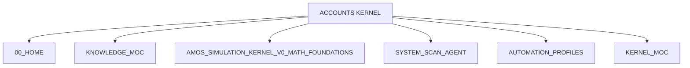
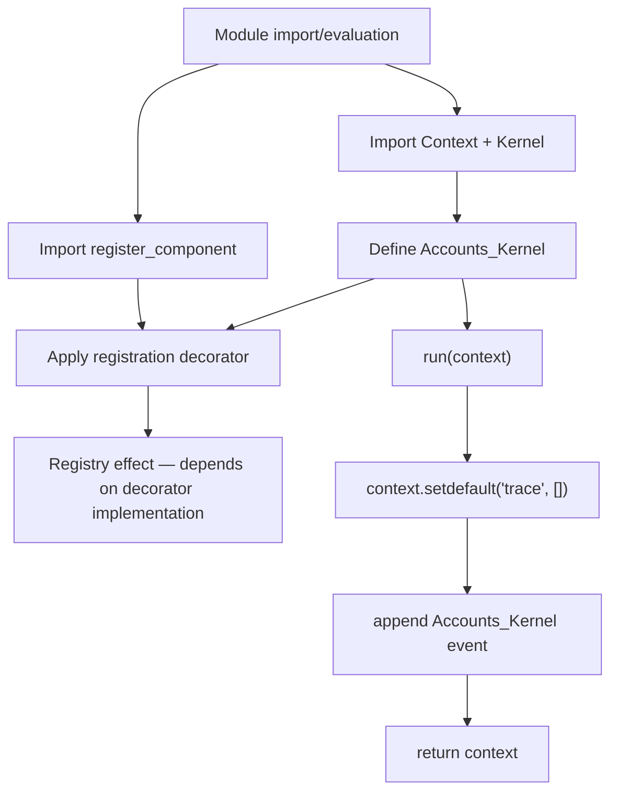
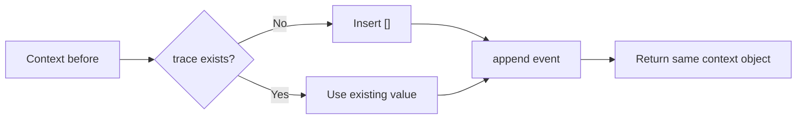
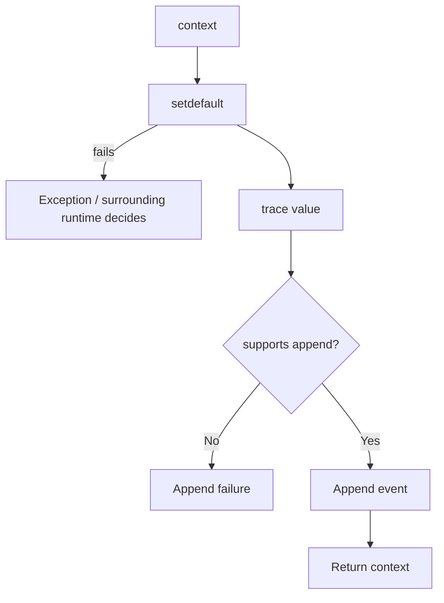
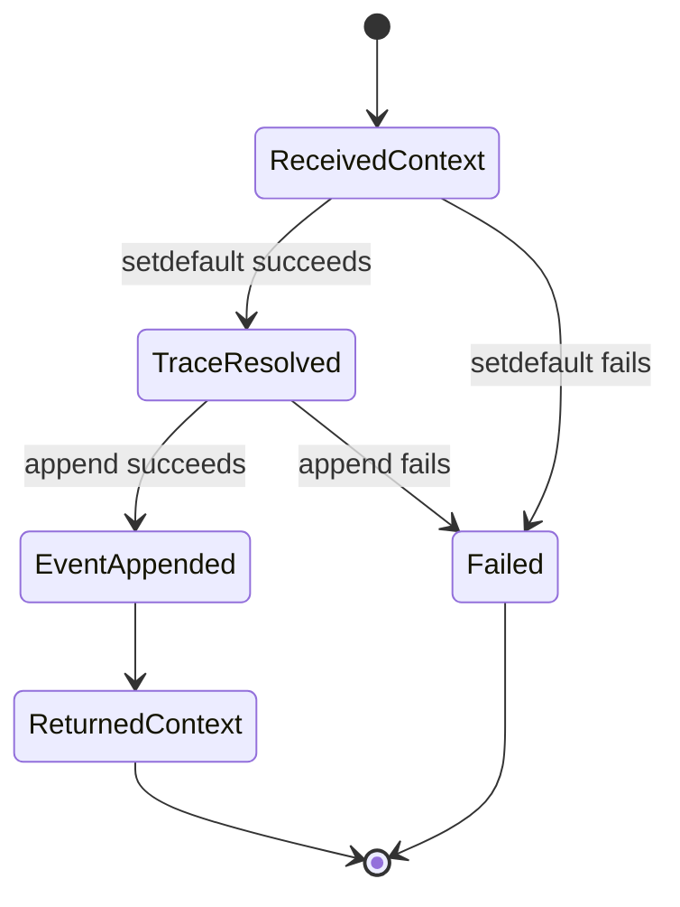

---
tags:
- knowledge
- kernel
- accounts
- kernel.md
---

# ACCOUNTS KERNEL

## Full Exhaustive Canonical Expansion · Source-Preserving · Runtime-Semantics Analysis · RSCF-Governed · Obsidian-Ready

> [!important] Canonical conclusion
> The supplied artifact defines `Accounts_Kernel` as a **minimal, registered, non-destructive MONEY_SYSTEM kernel component**. Its visible implementation performs exactly one domain-relevant runtime behavior: when `run(context)` executes successfully, it ensures a `trace` collection exists, appends a structured execution event identifying `MONEY_SYSTEM / kernels / Accounts_Kernel / run`, and returns the **same context object after that mutation**. It does **not** implement account creation, balances, ledgers, transfers, reconciliation, accounting equations, persistence, authorization, validation, or monetary state transitions.
>
> The note's RSCF metadata classifies the artifact as `SOURCE_CLAIM`. The embedded Python provides stronger evidence for the semantics of the visible code itself, but it does **not** independently establish that the referenced AMOS modules exist, that registration succeeds in an actual runtime, that tests pass, or that this kernel is deployed.

---

# 1. Normalized Source Frontmatter

The following preserves the supplied metadata semantically, removing only message-escaping artifacts.

```yaml
---
title: ACCOUNTS KERNEL
tags:
  - kernel
  - core
  - runtime
  - canon/knowledge
type: note
source: 11_KNOWLEDGE/kernel
rscf:
  state: SOURCE_CLAIM
  claim_class: SOURCE_CLAIM
  provenance: AMOS_corpus
  scope: AMOS_knowledge
---
```

No aliases, version, status, architect, steward, artifact ID, validation status, or implementation status appeared in the supplied frontmatter.

They should therefore not be silently added as source metadata.

---

# 2. Source Artifact Identity

Source heading:

```text
ACCOUNTS KERNEL
```

Embedded component declaration:

```text
System: MONEY_SYSTEM
Category: kernels
Component: Accounts_Kernel
```

The source therefore explicitly binds three identifiers:

$$
System = MONEY\_SYSTEM
$$

$$
Category = kernels
$$

$$
Component = Accounts\_Kernel
$$

---

# 3. Source-Level Identity Capsule

```yaml
artifact:
  title: "ACCOUNTS KERNEL"
  type: note
  source: "11_KNOWLEDGE/kernel"

component:
  system: MONEY_SYSTEM
  category: kernels
  name: Accounts_Kernel

rscf:
  state: SOURCE_CLAIM
  claim_class: SOURCE_CLAIM
  provenance: AMOS_corpus
  scope: AMOS_knowledge
```

This is source-grounded.

---

# 4. Derived / Proposed Obsidian Augmentation

Everything in this section is **DERIVED / PROPOSED**, not original source metadata.

```yaml
# DERIVED / PROPOSED — DO NOT MERGE INTO SOURCE FRONTMATTER WITHOUT GOVERNANCE

aliases:
  - Accounts Kernel
  - Accounts_Kernel
  - MONEY_SYSTEM Accounts Kernel

proposed_artifact_id:
  amos_money_system_accounts_kernel

proposed_artifact_kind:
  RUNTIME_KERNEL_COMPONENT

proposed_domain:
  money_system

proposed_component_binding:
  system: MONEY_SYSTEM
  category: kernels
  component: Accounts_Kernel

proposed_implementation_character:
  minimal_non_destructive_trace_stub

proposed_epistemic_boundary:
  source_metadata: SOURCE_CLAIM
  visible_code_semantics: DERIVED_FROM_SOURCE_CODE
  import_availability: UNKNOWN_GAP
  registry_runtime_behavior: UNKNOWN_GAP
  deployment_status: UNKNOWN_GAP
  financial_accounting_logic: NOT_IMPLEMENTED_IN_VISIBLE_SOURCE
  persistence_behavior: NOT_IMPLEMENTED_IN_VISIBLE_SOURCE

proposed_tags:
  - money-system
  - accounts
  - accounts-kernel
  - runtime-component
  - registry
  - context
  - trace
  - non-destructive-stub
  - rscf/node
  - rscf/source-claim
  - provenance/amos-corpus
```

---

# 5. Source Code — Normalized Rendering

The supplied code, normalized only for escaped Markdown characters, is:

```python
"""AMOS logical component.

System: MONEY_SYSTEM

Category: kernels

Component: Accounts_Kernel
"""

from __future__ import annotations

from amos_system.core.base import Context, Kernel
from amos_system.core.registry import register_component


@register_component(
    system="MONEY_SYSTEM",
    category="kernels",
    name="Accounts_Kernel",
)
class Accounts_Kernel(Kernel):
    """Logical implementation for Accounts_Kernel.

    This default implementation is non-destructive:

    - It ensures the component is registered in the runtime registry.
    - It appends a trace entry into the context.
    - It returns the context unchanged so you can layer real logic later.
    """

    def run(self, context: Context) -> Context:
        trace = context.setdefault("trace", [])

        trace.append(
            {
                "system": "MONEY_SYSTEM",
                "category": "kernels",
                "component": "Accounts_Kernel",
                "event": "run",
            }
        )

        return context
```

---

# 6. Immediate Structural Reading

The component has four visible architectural elements:

```text
Imports
   ↓
Registration decorator
   ↓
Kernel subclass
   ↓
run(context) method
```

More specifically:

```text
amos_system.core.base
├── Context
└── Kernel

amos_system.core.registry
└── register_component

@register_component(...)
└── Accounts_Kernel(Kernel)
    └── run(context)
        ├── context.setdefault("trace", [])
        ├── trace.append(event)
        └── return context
```

---

# 7. Component Registration Declaration

The decorator is:

```python
@register_component(
    system="MONEY_SYSTEM",
    category="kernels",
    name="Accounts_Kernel",
)
```

This expresses the source's intended registry identity.

A compact representation is:

$$
RegistryKey =
(
MONEY\_SYSTEM,
kernels,
Accounts\_Kernel
)
$$

---

# 8. Registration Claim Boundary

The source docstring says:

> “It ensures the component is registered in the runtime registry.”

The decorator strongly supports the **intention** to register the class.

However, exact registration behavior depends on the imported implementation of:

```python
register_component
```

which is not supplied here.

Therefore distinguish:

### Source-defined

```text
Accounts_Kernel is decorated with register_component(...)
```

### Not independently established

```text
The runtime registry actually contains Accounts_Kernel.
```

---

# 9. Registration Proof Capsule

```yaml
claim:
  >
    Accounts_Kernel declares registration under MONEY_SYSTEM,
    category kernels, name Accounts_Kernel.

class:
  VERIFIED_FROM_VISIBLE_SOURCE

evidence:
  register_component decorator

dependencies_for_actual_runtime_registration:
  - amos_system.core.registry import succeeds
  - register_component is callable
  - decorator performs registration as expected
  - module is imported/executed
  - no registration exception occurs

runtime_registration:
  UNKNOWN_GAP
```

---

# 10. Class Definition

The class is:

```python
class Accounts_Kernel(Kernel):
```

Therefore the visible source declares:

$$
Accounts\_Kernel <: Kernel
$$

in Python inheritance terms.

---

# 11. Inheritance Boundary

This proves the class syntactically declares `Kernel` as its base.

It does not reveal:

* what `Kernel` contains;
* whether `Kernel` is abstract;
* whether `run` satisfies a protocol;
* lifecycle methods;
* constructor behavior;
* synchronization requirements;
* registry requirements.

Those depend on:

```text
amos_system.core.base
```

---

# 12. Run Contract

Visible signature:

```python
def run(self, context: Context) -> Context:
```

Source-level type contract:

$$
run:
Context
\rightarrow
Context
$$

---

# 13. Type Annotation Boundary

Python annotations do not themselves guarantee runtime type enforcement.

Therefore:

$$
Annotation(Context)
\neq
RuntimeValidation(Context)
$$

unless `Kernel`, decorators, external tooling, or another mechanism enforces it.

No such enforcement is visible here.

---

# 14. Operational Core

The entire visible operational body consists of:

```python
trace = context.setdefault("trace", [])
```

followed by:

```python
trace.append(
    {
        "system": "MONEY_SYSTEM",
        "category": "kernels",
        "component": "Accounts_Kernel",
        "event": "run",
    }
)
```

followed by:

```python
return context
```

---

# 15. Minimal State Transition

Let:

$$
C_t
$$

represent the incoming context.

Let:

$$
T_t = C_t["trace"]
$$

when a compatible trace exists.

Let:

$$
e_A =
\{
system:MONEY\_SYSTEM,
category:kernels,
component:Accounts\_Kernel,
event:run
\}
$$

Then the intended visible transition is:

$$
T_{t+1}=T_t+[e_A]
$$

and:

$$
C_{t+1}=C_t
$$

in **object identity**, while its internal trace state has been mutated.

---

# 16. Critical Semantic Correction — “Unchanged”

The source docstring says:

> “It returns the context unchanged.”

This needs a precise interpretation.

The function **does mutate the context** by adding or extending its `"trace"` entry.

Therefore:

$$
ValueState(C_{after})
\neq
ValueState(C_{before})
$$

in the normal successful execution case.

But:

$$
id(C_{after})=id(C_{before})
$$

because the same object is returned.

---

# 17. Best Source-Compatible Interpretation

“Returns the context unchanged” is best read as:

```text
does not replace the context with a different context object
```

rather than:

```text
does not mutate context state
```

because the latter is contradicted by the visible code.

---

# 18. Non-Destructive Semantics

The source calls the implementation:

```text
non-destructive
```

Within the visible implementation this can reasonably mean:

* it does not intentionally remove existing context keys;
* it does not replace the context object;
* it does not perform account-domain mutations;
* it only appends trace information under normal compatible inputs.

However, `non-destructive` is descriptive source terminology, not a formally defined property.

---

# 19. Non-Destructive ≠ Pure

The method is not a pure function.

$$
run(C)
$$

has a side effect on `C`.

Therefore:

$$
Pure(run)=False
$$

under ordinary functional-programming semantics.

---

# 20. Non-Destructive ≠ Immutable

The input is mutated.

Therefore:

$$
ImmutableTransformation=False
$$

---

# 21. Non-Destructive ≠ Idempotent

Calling the kernel twice appends two events.

Suppose initially:

$$
trace=[]
$$

After one successful call:

$$
trace=[e_A]
$$

After two:

$$
trace=[e_A,e_A]
$$

Thus:

$$
run(run(C))\neq run(C)
$$

in state-value terms.

---

# 22. Idempotence Classification

```yaml
idempotent:
  object_identity: same_context_object
  state_effect: false
  reason: each successful invocation appends another trace event
```

DERIVED from visible code.

---

# 23. Trace Initialization

This line:

```python
trace = context.setdefault("trace", [])
```

has two principal paths.

### Path A — `"trace"` absent

A new empty list is inserted:

```python
context["trace"] = []
```

and returned by `setdefault`.

### Path B — `"trace"` already exists

Its current value is returned without replacement.

---

# 24. Path A Transition

Input:

```python
{
    "foo": "bar"
}
```

Expected visible-code result:

```python
{
    "foo": "bar",
    "trace": [
        {
            "system": "MONEY_SYSTEM",
            "category": "kernels",
            "component": "Accounts_Kernel",
            "event": "run",
        }
    ],
}
```

---

# 25. Path B Transition

Input:

```python
{
    "trace": [
        {"event": "previous"}
    ]
}
```

Expected result:

```python
{
    "trace": [
        {"event": "previous"},
        {
            "system": "MONEY_SYSTEM",
            "category": "kernels",
            "component": "Accounts_Kernel",
            "event": "run",
        },
    ]
}
```

---

# 26. Existing Trace Preservation

If `"trace"` contains a mutable object supporting `.append`, previous entries remain intact under normal execution.

Thus the intended transformation is append-only:

$$
Trace_{after}
=
Trace_{before}
\Vert
[e_A]
$$

where \(\Vert\) denotes sequence concatenation.

---

# 27. Trace Type Assumption

The implementation assumes the value returned by:

```python
context.setdefault("trace", [])
```

supports:

```python
.append(...)
```

No explicit validation exists.

---

# 28. Failure Example — `trace=None`

Input:

```python
{
    "trace": None
}
```

Then:

```python
trace = None
```

and:

```python
trace.append(...)
```

fails.

---

# 29. Failure Example — Immutable Tuple

Input:

```python
{
    "trace": ()
}
```

also lacks list-style `.append`.

---

# 30. Failure Example — String

Input:

```python
{
    "trace": "existing trace"
}
```

does not support `.append`.

---

# 31. Trace Contract Is Implicit

The implementation therefore depends on:

$$
TraceLike(x)
\Rightarrow
SupportsAppend(x)
$$

But no explicit `Trace` type appears in the supplied artifact.

---

# 32. Context Contract Is Also Implicit

The method calls:

```python
context.setdefault(...)
```

Therefore `Context` must expose compatible mapping behavior.

The imported `Context` definition is absent.

---

# 33. Minimal Runtime Preconditions

For the visible `run` method to complete normally:

$$
P_1:
context.setdefault\ exists
$$

$$
P_2:
trace=context.setdefault(...)
$$

$$
P_3:
trace.append\ exists
$$

$$
P_4:
append(event)\ succeeds
$$

Only then does execution reach:

$$
return\ context
$$

---

# 34. Formal Success Predicate

A useful DERIVED representation:

$$
Success(C)
\Leftrightarrow
SetDefaultCompatible(C)
\land
AppendCompatible(C["trace"])
$$

subject to any behavior hidden inside custom `Context`.

---

# 35. No Exception Handling

The method contains no:

```python
try:
```

or:

```python
except:
```

Therefore failures from `setdefault` or `append` are not locally handled.

---

# 36. Fail-Closed vs Fail-Open

The source does not define an explicit failure policy.

If trace append raises an exception, the method does not reach:

```python
return context
```

So at the local Python level the visible implementation naturally propagates the failure unless surrounding runtime infrastructure catches it.

---

# 37. Atomicity Gap

Consider:

```python
context.setdefault("trace", [])
```

followed by a failure during `.append`.

If `"trace"` was absent, the empty list may already have been inserted before the failure.

Therefore:

$$
Failure
\not\Rightarrow
NoMutation
$$

---

# 38. Partial Mutation Case

Possible state:

Before:

```python
{}
```

After successful `setdefault` but failed append:

```python
{
    "trace": []
}
```

This demonstrates that the operation is not transactionally atomic from the visible code alone.

---

# 39. No Rollback

There is no visible:

```text
rollback
transaction
undo
CAS
MVCC
snapshot restore
```

logic.

Therefore no atomic rollback semantics should be attributed to this component.

---

# 40. No Concurrency Guard

The source contains no visible:

```text
lock
mutex
CAS
version check
transaction
async synchronization
```

around trace mutation.

---

# 41. Concurrent Invocation Semantics

Exact behavior under concurrent mutation depends on:

* `Context` implementation;
* trace implementation;
* Python runtime;
* thread/process model;
* caller architecture.

The source does not resolve this.

---

# 42. No Timestamp

The trace event contains:

```yaml
system: MONEY_SYSTEM
category: kernels
component: Accounts_Kernel
event: run
```

It does not contain:

```text
timestamp
sequence
epoch
request_id
transaction_id
actor
account_id
correlation_id
causal_parent
```

---

# 43. Trace Event Schema

Source-grounded event:

```yaml
system: MONEY_SYSTEM
category: kernels
component: Accounts_Kernel
event: run
```

Exactly four fields are supplied.

---

# 44. Event Semantics

The event means, at minimum:

```text
Accounts_Kernel.run reached its trace append operation.
```

It does **not** mean:

```text
financial operation succeeded
account operation succeeded
transaction committed
ledger balanced
runtime completed downstream processing
```

---

# 45. Trace Is Not a Financial Ledger

This distinction is critical.

The visible `"trace"` sequence records component execution events.

It does not implement an accounting ledger.

Therefore:

$$
TraceEvent
\neq
LedgerEntry
$$

---

# 46. Trace Is Not an Audit Ledger by Default

An audit system generally requires stronger properties such as:

* persistence;
* actor identity;
* timestamps;
* tamper evidence;
* authorization context;
* event IDs;
* durable ordering;
* retention.

None are visible here.

Thus:

$$
Trace
\neq
VerifiedAuditLog
$$

---

# 47. Trace Is Not Provenance Proof

The trace identifies component execution metadata.

It does not carry source ancestry or evidence lineage.

Therefore:

$$
Trace
\neq
RSCFProvenanceReceipt
$$

---

# 48. Trace Is Not a Proof Capsule

No:

```text
premises
evidence
claim class
confidence
falsifier
signature
hash
Merkle proof
```

appears in the event.

---

# 49. Accounts Name vs Accounts Logic

The component is named:

```text
Accounts_Kernel
```

But names do not establish functionality beyond visible implementation.

The code contains no account model.

---

# 50. No Account Identifier

No visible field such as:

```text
account_id
account_number
owner_id
```

exists.

---

# 51. No Account Creation

There is no:

```python
create_account(...)
```

or equivalent logic.

---

# 52. No Account Closure

No close/deactivate/archive semantics are supplied.

---

# 53. No Balance

There is no:

$$
Balance(account)
$$

state or equation.

---

# 54. No Debit

No debit operation is defined.

---

# 55. No Credit

No credit operation is defined.

---

# 56. No Transfer

No:

$$
Transfer(A,B,x)
$$

appears.

---

# 57. No Currency

No currency type, denomination, or unit appears.

---

# 58. No Money Quantity

No amount field is processed.

---

# 59. No Ledger

No transaction journal or ledger data structure appears.

---

# 60. No Double-Entry Accounting

The artifact does not implement:

$$
Assets=Liabilities+Equity
$$

or debit/credit balancing.

---

# 61. No Reconciliation

No reconciliation mechanism appears.

---

# 62. No Settlement

No settlement semantics appear.

---

# 63. No Persistence

The source does not write to:

```text
database
file
ledger store
event store
network service
```

---

# 64. No Explicit External I/O

Inside `run`, no explicit network, filesystem, database, or subprocess operation is visible.

However, behavior hidden inside a custom `Context` cannot be ruled out from this artifact alone.

---

# 65. No Authentication

No identity/authentication check appears.

---

# 66. No Authorization

No permission or role validation appears.

---

# 67. No Consent Gate

No consent semantics appear.

---

# 68. No Compliance Gate

No AML, KYC, sanctions, tax, legal, regulatory, or jurisdictional rules appear.

---

# 69. No Risk Model

No financial risk calculation appears.

---

# 70. No Monetary Mutation

The only explicit state mutation is trace-related.

Therefore:

$$
FinancialStateMutation=0
$$

for the visible implementation, assuming financial state is separate from the `"trace"` field.

---

# 71. Precise Visible Effect

A compact semantic function is:

$$
AccountsKernel(C)
=
AppendTrace(C,e_A)
$$

where:

$$
e_A=
\langle
MONEY\_SYSTEM,
kernels,
Accounts\_Kernel,
run
\rangle
$$

and then:

$$
return\ C
$$

---

# 72. Context Identity Invariant

Assuming successful execution:

$$
C_{returned}\ is\ C_{input}
$$

in Python object identity.

Equivalent conceptual test:

```python
returned is context
```

should be true for ordinary execution.

---

# 73. Key Preservation Invariant

For keys other than `"trace"`, the method itself performs no direct mutation.

A source-derived invariant:

$$
\forall k\neq trace:
C_{after}[k]=C_{before}[k]
$$

provided no custom side effects occur through `Context`.

---

# 74. Trace Growth Invariant

If a valid appendable trace exists:

$$
|Trace_{after}|
=
|Trace_{before}|+1
$$

---

# 75. Trace Suffix Invariant

After successful execution:

$$
Trace_{after}[-1]=e_A
$$

assuming sequence semantics.

---

# 76. Registration Identity Invariant

Decorator metadata and trace metadata agree on:

```text
system    MONEY_SYSTEM
category  kernels
component Accounts_Kernel
```

This is an important internal consistency property.

---

# 77. Three-Way Identity Agreement

The component identity occurs in:

### Module docstring

```text
MONEY_SYSTEM / kernels / Accounts_Kernel
```

### Decorator

```text
MONEY_SYSTEM / kernels / Accounts_Kernel
```

### Trace event

```text
MONEY_SYSTEM / kernels / Accounts_Kernel
```

Therefore visible source contains three mutually consistent declarations.

---

# 78. Class Name Agreement

Class:

```python
Accounts_Kernel
```

matches decorator name:

```text
Accounts_Kernel
```

and trace component:

```text
Accounts_Kernel
```

---

# 79. System Agreement

Module docstring, decorator, and trace all say:

```text
MONEY_SYSTEM
```

---

# 80. Category Agreement

All three say:

```text
kernels
```

---

# 81. Internal Identity Consistency

Thus:

$$
IdentityConsistency_{visible}=Strong
$$

within the limited source.

This does not prove external registry consistency.

---

# 82. Component Purpose

The class docstring explicitly frames this as a:

```text
default implementation
```

and says:

```text
you can layer real logic later
```

This is strong evidence that the component is intentionally scaffold-like rather than complete account logic.

---

# 83. Scaffold Classification

Best derived class:

```text
MINIMAL_RUNTIME_SCAFFOLD
```

or:

```text
NON_DESTRUCTIVE_TRACE_STUB
```

These are DERIVED descriptions, not source labels.

---

# 84. Placeholder vs Stub

The component is more than an empty placeholder because it has real observable behavior:

$$
TraceAppend
$$

But it does not contain substantive accounts-domain processing.

Thus:

```text
functional scaffold
```

is more precise than simply “empty.”

---

# 85. Registration as Architectural Behavior

Even without account logic, registration can make the component discoverable to a registry-driven architecture—**if** the decorator has that behavior and the module is loaded.

That condition must remain explicit.

---

# 86. Import-Time Behavior

Python decorators execute when the class definition is evaluated.

Thus, in ordinary Python semantics:

```python
@register_component(...)
class Accounts_Kernel(...):
```

invokes the decorator during module execution/import.

But exact registry effects remain dependent on the decorator implementation.

---

# 87. Registration Does Not Occur Merely Because File Exists

The module generally needs to be executed/imported for decorator behavior to occur.

Therefore:

$$
FilePresence
\neq
RegistryPresence
$$

---

# 88. Registry Presence Does Not Prove Invocation

Even if registration succeeds:

$$
Registered
\neq
runCalled
$$

---

# 89. Trace Entry Is Stronger Evidence of Invocation

If this exact event is observed in a trusted context trace, it supports that the append statement executed.

But it still does not prove all surrounding runtime steps completed.

---

# 90. Event Is Produced Before Return

Execution order:

```text
setdefault
   ↓
append
   ↓
return
```

Thus the trace event is appended before the explicit return.

---

# 91. Trace Event Does Not Prove Return Completed

An exotic failure could occur after append but before the caller successfully receives the returned value.

There is almost no visible code between them, but epistemically:

$$
TraceAppended
\not\Rightarrow
CallerObservedSuccessfulReturn
$$

---

# 92. No Success/Failure Status Field

Event contains only:

```text
event: run
```

not:

```text
status: success
```

Therefore it should not be interpreted as a success receipt.

---

# 93. No Start/End Distinction

There is no:

```text
run_started
run_completed
```

pair.

The event's exact lifecycle meaning is simply source-defined as `"run"`.

---

# 94. No Input Summary

The trace does not record what input was processed.

---

# 95. No Output Summary

It does not record resulting state.

---

# 96. No Mutation Receipt

It does not enumerate changed keys.

---

# 97. No Causal Parent

No upstream component is recorded.

---

# 98. No Execution ID

Repeated events are structurally identical.

Thus two executions produce duplicate dictionaries unless the surrounding context adds other metadata elsewhere.

---

# 99. Duplicate Events Are Allowed

There is no duplicate suppression.

Therefore:

$$
[e_A,e_A,\ldots]
$$

is valid under repeated invocation.

---

# 100. No Trace Capacity Bound

The kernel never truncates the trace.

Repeated execution can therefore grow it indefinitely from this component's perspective.

---

# 101. Memory Growth Consideration

If the same context persists across many calls:

$$
|Trace_n|=|Trace_0|+n
$$

for \(n\) successful invocations.

No compaction is visible.

---

# 102. This Is Not Necessarily a Defect

The wider runtime may manage trace lifetime or context scope.

That architecture is simply not supplied here.

---

# 103. Context Lifetime Gap

Unknown whether a context is:

* per request;
* per transaction;
* per workflow;
* per session;
* persistent;
* global.

This materially affects trace growth interpretation.

---

# 104. Registry Lifetime Gap

Unknown whether the registry is:

* process-local;
* global;
* persistent;
* reconstructed on import;
* plugin-scoped.

---

# 105. Kernel Lifecycle Gap

No visible methods for:

```text
initialize
start
stop
close
rollback
healthcheck
validate
```

appear.

The base `Kernel` may define them, but that is outside this source.

---

# 106. Constructor Gap

No explicit:

```python
__init__
```

is defined.

Therefore construction behavior is inherited.

Exact behavior is unknown without `Kernel`.

---

# 107. Context Ownership Gap

The source does not specify whether the kernel owns the context or merely borrows/mutates it.

---

# 108. Trace Ownership Gap

Likewise, no ownership model for `"trace"` is defined.

---

# 109. Schema Governance Gap

No formal context schema appears.

---

# 110. Money-System Architecture Gap

The artifact establishes that this component belongs to:

```text
MONEY_SYSTEM
```

but supplies no architecture for the system itself.

Unknown:

* other kernels;
* engines;
* services;
* agents;
* data models;
* orchestrators;
* transaction boundaries.

---

# 111. Accounts Domain Gap

No account ontology is supplied.

Possible concepts such as:

```text
AssetAccount
LiabilityAccount
EquityAccount
RevenueAccount
ExpenseAccount
Wallet
BankAccount
UserAccount
LedgerAccount
```

must not be invented as canon.

---

# 112. “Accounts” Is Underspecified

The title may refer to financial/accounting accounts because the system is `MONEY_SYSTEM`.

That is a strong contextual inference.

But exact account semantics remain unspecified.

---

# 113. Do Not Infer Banking

`MONEY_SYSTEM` does not prove this is a banking system.

---

# 114. Do Not Infer Cryptocurrency

No blockchain or token semantics appear.

---

# 115. Do Not Infer Double Entry

No accounting model appears.

---

# 116. Do Not Infer User Accounts

The term `Accounts` could theoretically have multiple meanings, although `MONEY_SYSTEM` narrows the likely domain.

Exact ontology remains a gap.

---

# 117. Epistemic Layering

Three evidence layers should be distinguished.

### Layer A — Source metadata

```text
SOURCE_CLAIM
```

### Layer B — Visible code semantics

Directly inspectable behavior of the supplied Python.

### Layer C — External/runtime behavior

Requires imports, tests, registry inspection, or execution evidence not supplied here.

---

# 118. Source Metadata vs Code

The source metadata classifies the note as:

```yaml
state: SOURCE_CLAIM
claim_class: SOURCE_CLAIM
```

This does not prevent us from verifying syntactic facts inside the supplied code.

For example:

> The class appends a dictionary to `trace`.

is directly supported by visible code.

---

# 119. Strongest Accurate Classes

| Proposition                            | Class                                 |
| -------------------------------------- | ------------------------------------- |
| Note says system is MONEY_SYSTEM       | VERIFIED_FROM_SOURCE                  |
| Class is named `Accounts_Kernel`       | VERIFIED_FROM_SOURCE                  |
| Class inherits `Kernel` syntactically  | VERIFIED_FROM_SOURCE                  |
| Decorator declares registry identity   | VERIFIED_FROM_SOURCE                  |
| `run` calls `setdefault("trace", [])`  | VERIFIED_FROM_SOURCE                  |
| `run` calls `.append(...)`             | VERIFIED_FROM_SOURCE                  |
| It returns the same variable `context` | VERIFIED_FROM_SOURCE                  |
| Successful call mutates trace          | DERIVED from code semantics           |
| Successful call returns same object    | DERIVED under normal Python semantics |
| Registry actually contains component   | UNKNOWN/GAP                           |
| Imports resolve                        | UNKNOWN/GAP                           |
| Runtime executes this module           | UNKNOWN/GAP                           |
| Component is deployed                  | UNKNOWN/GAP                           |
| Component has passed tests             | UNKNOWN/GAP                           |
| Accounts logic is implemented          | NOT SUPPORTED / visibly absent        |
| Financial ledger is implemented        | NOT SUPPORTED                         |
| Persistence is implemented             | NOT SUPPORTED                         |

---

# 120. Source Tag Firewall

Frontmatter contains:

```yaml
- runtime
```

This means the artifact is tagged `runtime`.

It does not establish:

$$
RuntimeVerified=True
$$

---

# 121. `core` Tag Firewall

Similarly:

```yaml
- core
```

is source metadata.

It does not by itself establish architectural criticality.

---

# 122. `kernel` Tag Alignment

Unlike `runtime`, `kernel` is additionally supported by:

```text
Category: kernels
```

and:

```python
class Accounts_Kernel(Kernel)
```

So there is stronger internal evidence for kernel classification.

---

# 123. `canon/knowledge`

This places the note in the source's knowledge/canon taxonomy.

It does not elevate its implementation claims into empirical or runtime verification.

---

# 124. Provenance

Source declares:

```yaml
provenance: AMOS_corpus
```

Therefore this artifact should be treated as AMOS corpus evidence.

---

# 125. Provenance Independence

Multiple copies of this code within the same corpus would not automatically provide independent validation.

$$
Copies(Source_A)
\neq
IndependentSources
$$

---

# 126. Runtime Validation Requirements

To establish actual runtime viability, the cheapest high-information tests would be:

1. resolve imports;
2. inspect `Context`;
3. inspect `Kernel`;
4. inspect `register_component`;
5. import this module;
6. query registry;
7. instantiate component;
8. call `run` with valid context;
9. test malformed trace cases.

Those tests are not supplied here.

---

# 127. Minimal Unit Test — Successful Empty Context

A PROPOSED test:

```python
def test_accounts_kernel_adds_trace():
    context = {}

    kernel = Accounts_Kernel()
    result = kernel.run(context)

    assert result is context
    assert context["trace"] == [
        {
            "system": "MONEY_SYSTEM",
            "category": "kernels",
            "component": "Accounts_Kernel",
            "event": "run",
        }
    ]
```

This is a proposed validation artifact, not source code.

---

# 128. Existing Trace Test

```python
def test_accounts_kernel_preserves_existing_trace():
    context = {
        "trace": [
            {"event": "before"}
        ]
    }

    result = Accounts_Kernel().run(context)

    assert result is context
    assert context["trace"][0] == {"event": "before"}
    assert context["trace"][1]["component"] == "Accounts_Kernel"
```

PROPOSED.

---

# 129. Other-Key Preservation Test

```python
def test_accounts_kernel_preserves_other_context_fields():
    context = {
        "account_state": {"x": 1},
        "request_id": "abc",
    }

    original_account_state = context["account_state"]

    Accounts_Kernel().run(context)

    assert context["account_state"] is original_account_state
    assert context["request_id"] == "abc"
```

PROPOSED.

---

# 130. Repeated Invocation Test

```python
def test_accounts_kernel_appends_once_per_call():
    context = {}

    kernel = Accounts_Kernel()

    kernel.run(context)
    kernel.run(context)

    assert len(context["trace"]) == 2
```

PROPOSED.

---

# 131. Invalid Trace Test

```python
import pytest

def test_accounts_kernel_rejects_non_appendable_trace():
    context = {"trace": None}

    with pytest.raises(AttributeError):
        Accounts_Kernel().run(context)
```

This test reflects ordinary Python behavior, but exact exception behavior could differ if `Context` customizes access.

PROPOSED.

---

# 132. Registry Test

A conceptual test:

```python
def test_accounts_kernel_registered():
    registry_entry = lookup_component(
        system="MONEY_SYSTEM",
        category="kernels",
        name="Accounts_Kernel",
    )

    assert registry_entry is Accounts_Kernel
```

However, `lookup_component` is not supplied.

This is therefore schematic only.

---

# 133. Import Test

```python
def test_accounts_kernel_module_imports():
    import accounts_kernel
```

Actual module path is not supplied.

Therefore this cannot yet be canonicalized.

---

# 134. Boundary Test Matrix

| Input                      | Expected visible behavior        |
| -------------------------- | -------------------------------- |
| `{}`                       | create trace list + append event |
| `{"trace":[]}`             | append event                     |
| trace with previous events | preserve + append                |
| `{"trace": None}`          | likely failure                   |
| `{"trace": ()}`            | likely failure                   |
| non-mapping context        | likely failure                   |
| custom appendable trace    | may succeed                      |
| custom `Context`           | depends on implementation        |

---

# 135. Invariant Test Matrix

| Invariant                      | Visible support                  |
| ------------------------------ | -------------------------------- |
| Same context variable returned | Strong                           |
| Trace receives one event/call  | Strong under compatible input    |
| Existing trace preserved       | Strong under appendable sequence |
| Other keys directly untouched  | Strong                           |
| No account mutation            | Strong in visible body           |
| No persistence                 | Strong in visible body           |
| Registry succeeds              | Unknown                          |
| Thread-safe                    | Unknown                          |
| Transactional                  | No visible support               |
| Idempotent                     | No                               |
| Pure                           | No                               |

---

# 136. Failure Taxonomy

### F1 — Import failure

Possible before class definition.

### F2 — Decorator failure

Possible during module evaluation.

### F3 — Construction failure

Possible from inherited `Kernel`.

### F4 — Invalid Context

`setdefault` unavailable or incompatible.

### F5 — Invalid trace object

`.append` unavailable.

### F6 — Append failure

Custom object may raise.

### F7 — External runtime failure

Possible outside this component.

Only F4–F6 relate directly to visible `run` semantics.

---

# 137. No Local Recovery

The component contains no recovery branch for any of these failures.

---

# 138. No Validation Before Mutation

It does not check:

```python
if not isinstance(trace, list):
    ...
```

before append.

---

# 139. No Schema Repair

If trace exists with an invalid type, the implementation does not replace it with `[]`.

This is arguably safer than silently destroying an existing value, but that design intent is not stated.

---

# 140. Fail-Loud Character

For incompatible trace values, ordinary semantics are effectively fail-loud rather than silent repair.

This is DERIVED.

---

# 141. Data Preservation Character

Because `setdefault` does not overwrite an existing `"trace"` value, even an invalid one, the method avoids silently replacing pre-existing data.

That is a useful property.

---

# 142. But Failure May Leave Partial State

As noted, absence of `"trace"` can lead to insertion before a later append failure.

Thus preservation and atomicity are separate properties.

---

# 143. Proposed Stronger Trace Contract

If future canon requires it, a typed precondition could be:

```text
Context.trace MUST be absent or Appendable[TraceEvent]
```

PROPOSED.

---

# 144. Proposed Trace Event Type

```yaml
# PROPOSED

TraceEvent:
  system: str
  category: str
  component: str
  event: str
```

---

# 145. Proposed Accounts Kernel Contract

```yaml
# PROPOSED

AccountsKernelContract:

  input:
    type: Context

  preconditions:
    - context supports setdefault
    - trace is absent or append-compatible

  effect:
    - ensure trace collection exists
    - append Accounts_Kernel run event

  financial_effect:
    - none_in_current_visible_implementation

  output:
    - same context object

  persistence:
    - none_visible

  failure:
    - propagate local operation failure
```

---

# 146. Proposed RSCF H-Level

```yaml
# DERIVED

H:
  intent:
    >
      Provide a registered MONEY_SYSTEM kernel scaffold for the
      Accounts_Kernel component while preserving incoming context
      state except for execution tracing.
```

---

# 147. Proposed RSCF M-Level

```yaml
# DERIVED

M:
  steps:
    - resolve incoming context
    - obtain or initialize trace
    - append component run event
    - return same context object
```

---

# 148. Proposed RSCF L-Level

```yaml
# DERIVED

L:
  source:
    11_KNOWLEDGE/kernel

  provenance:
    AMOS_corpus

  component_identity:
    system: MONEY_SYSTEM
    category: kernels
    component: Accounts_Kernel

  visible_effect:
    trace_append

  visible_financial_logic:
    none
```

---

# 149. Runtime RSCF Capsule

```yaml
# PROPOSED

claim:
  >
    A successful Accounts_Kernel.run invocation appends
    one component execution event to context.trace and
    returns the same context object.

class:
  DERIVED

premises:
  - visible Python semantics
  - context supports setdefault
  - trace supports append
  - no exception occurs

evidence:
  - run method body

scope:
  supplied source implementation

invalidators:
  - different source version
  - overridden Context semantics
  - overridden trace append semantics
  - wrapper/decorator changes runtime behavior
```

---

# 150. Registration RSCF Capsule

```yaml
# PROPOSED

claim:
  >
    Accounts_Kernel declares registry coordinates
    MONEY_SYSTEM / kernels / Accounts_Kernel.

class:
  VERIFIED_FROM_SOURCE

evidence:
  - register_component decorator

actual_registry_presence:
  UNKNOWN_GAP
```

---

# 151. Financial Capability Capsule

```yaml
claim:
  >
    The visible Accounts_Kernel implementation contains
    substantive account-management logic.

class:
  NOT_SUPPORTED

evidence:
  >
    The visible run body only manipulates context.trace.

missing:
  - account schema
  - account operations
  - balance state
  - ledger
  - transactions
  - persistence
```

---

# 152. Runtime Deployment Capsule

```yaml
claim:
  "Accounts_Kernel is deployed and active in AMOS runtime."

class:
  UNKNOWN_GAP

source_support:
  - runtime tag
  - registry decorator
  - executable-looking Python source

missing_evidence:
  - successful import receipt
  - registry inspection
  - runtime invocation log
  - deployment manifest
  - test receipt
```

---

# 153. Causal Firewall

A trace event:

```text
Accounts_Kernel / run
```

cannot prove that this kernel caused any later financial outcome.

$$
Trace(A)
+
Outcome(B)
\not\Rightarrow
A\ caused\ B
$$

A causal dependency chain would be required.

---

# 154. Scope Firewall

This artifact is scoped by metadata to:

```text
AMOS_knowledge
```

and by code to:

```text
MONEY_SYSTEM
```

Do not silently generalize it to real banking/accounting infrastructure.

---

# 155. Regime Firewall

The visible component is a software scaffold.

It does not define behavior under:

* production finance;
* regulated banking;
* distributed transactions;
* real-money custody;
* accounting compliance.

---

# 156. Financial Safety Boundary

Because the visible implementation has no financial mutation, it should not be interpreted as sufficient infrastructure for real-money account operations.

---

# 157. Provenance Firewall

The artifact itself is AMOS corpus evidence.

If another AMOS note repeats:

```text
Accounts_Kernel is registered
```

without independent runtime evidence, that repetition does not independently prove registration.

---

# 158. Runtime Evidence Ladder

A useful evidence hierarchy is:

```text
Source note
   ↓
Executable source
   ↓
Import success
   ↓
Registry inspection
   ↓
Unit tests
   ↓
Integration tests
   ↓
Runtime trace
   ↓
Deployment evidence
```

The supplied artifact establishes the first two only in the sense that executable-looking source text is present.

Actual execution has not been demonstrated here.

---

# 159. Adversarial Validation — “Non-Destructive”

**Claim:** implementation is non-destructive.

Challenge:

```python
context.setdefault("trace", [])
```

and `.append(...)` mutate context state.

Result:

```text
CONDITIONAL
```

The implementation is non-destructive in a limited sense, not mutation-free.

---

# 160. Adversarial Validation — “Returns Context Unchanged”

Challenge succeeds against literal value-level interpretation.

The trace changes.

Therefore:

$$
Unchanged_{identity}=True
$$

but:

$$
Unchanged_{state}=False
$$

under successful normal execution.

---

# 161. Adversarial Validation — “Ensures Registered”

The decorator supports registration intent.

But actual registry behavior depends on external code and module execution.

Result:

```text
SOURCE-DEFINED INTENT
+
RUNTIME REGISTRATION UNKNOWN
```

---

# 162. Adversarial Validation — Accounts Logic

Challenge:

> Does `Accounts_Kernel` actually implement accounts?

No substantive account operation is visible.

Result:

```text
NOT IMPLEMENTED IN SUPPLIED BODY
```

---

# 163. Adversarial Validation — Runtime

Challenge:

> Does the runtime tag prove deployment?

No.

Result:

```text
UNKNOWN/GAP
```

---

# 164. Adversarial Validation — Trace Safety

Challenge:

> Can any existing trace value be handled?

No.

The value must support `.append`.

Result:

```text
IMPLICIT TYPE PRECONDITION
```

---

# 165. Adversarial Validation — Atomicity

Challenge:

> Does failure guarantee unchanged input?

No.

`setdefault` may mutate before append failure.

Result:

```text
NO TRANSACTIONAL ATOMICITY ESTABLISHED
```

---

# 166. Adversarial Validation — Idempotence

Challenge:

> Does repeated execution converge to the same state?

No.

Each successful call adds an event.

Result:

```text
NON_IDEMPOTENT
```

---

# 167. Adversarial Validation — Financial Integrity

Challenge:

> Does the component enforce balance, conservation, or ledger invariants?

No such invariants appear.

Result:

```text
UNKNOWN / NOT IMPLEMENTED
```

---

# 168. Strongest Supported Runtime Model

The smallest sufficient model is:

$$
\boxed{
AccountsKernel(C)
=
C\ \text{with one AccountsKernel run event appended to trace}
}
$$

Nothing stronger is required to explain the visible implementation.

---

# 169. No Need to Invent Financial Semantics

The source itself says:

```text
you can layer real logic later
```

Therefore missing account logic is consistent with the source's scaffold intent.

---

# 170. Likely Architectural Role

A careful DERIVED interpretation is:

> `Accounts_Kernel` establishes a named, registry-addressable hook in the `MONEY_SYSTEM` kernel layer, allowing substantive account logic to be added later while the current implementation provides traceable no-op-like participation in context pipelines.

The phrase “no-op-like” must remain qualified because trace state is mutated.

---

# 171. True No-Op Comparison

A literal no-op would be:

```python
def run(self, context):
    return context
```

The source instead does:

```python
trace.append(...)
return context
```

Therefore:

$$
AccountsKernel
\neq
PureNoOp
$$

---

# 172. Observable Side Effect

The trace mutation makes execution observable to downstream components that inspect context.

This can support:

* debugging;
* orchestration tracing;
* component participation tracking.

Those uses are plausible but not explicitly stated.

Therefore they are DERIVED possibilities, not canonical purpose claims.

---

# 173. Potential Pipeline Semantics

If multiple similar components append events, a context could accumulate:

```text
Component A
→ Accounts_Kernel
→ Component B
→ ...
```

This could act as an execution-path trace.

But no such pipeline is supplied here.

---

# 174. Trace Ordering

Within a single sequential context, append order can encode invocation order.

However:

$$
TraceOrder
$$

does not automatically establish causal dependency.

---

# 175. Order ≠ Causation

If:

```text
A event
Accounts_Kernel event
B event
```

appears, it establishes sequence only under trusted trace semantics.

It does not prove:

$$
A\rightarrow Accounts\rightarrow B
$$

causally.

---

# 176. Proposed Execution Receipt Upgrade

A future trace could carry:

```yaml
# PROPOSED

event_id:
timestamp:
system: MONEY_SYSTEM
category: kernels
component: Accounts_Kernel
event: run
phase: completed
context_version_before:
context_version_after:
causal_parent:
correlation_id:
```

This is an enhancement proposal only.

---

# 177. Proposed Financial Logic Boundary

If substantive account logic is later layered in, keep it separate from tracing:

```text
Validate
   ↓
Apply Account Operation
   ↓
Verify Invariants
   ↓
Commit
   ↓
Trace Receipt
```

PROPOSED architecture.

---

# 178. Proposed Account-State Integrity Invariant

Not source canon, but a future implementation would need explicitly typed invariants rather than relying on the component name.

For example:

```text
Account mutation must be validated before commit.
```

Exact financial equations must come from an authoritative MONEY_SYSTEM specification, not be invented here.

---

# 179. Proposed Reversibility Principle

Until real account semantics exist, the current minimal scaffold has relatively low financial irreversibility because it does not visibly alter financial state.

If later monetary mutations are introduced, validation requirements should rise substantially.

---

# 180. Action Governance

A future implementation that moves or records real value would require much stronger evidence than this scaffold:

* atomicity;
* authorization;
* auditability;
* consistency;
* recovery;
* idempotency strategy;
* concurrency control;
* persistence;
* jurisdictional controls where applicable.

These are architectural requirements in a consequential financial regime, not claims about the current source.

---

# 181. Critical Gap — `Context`

The single most useful dependency to inspect next is:

```python
from amos_system.core.base import Context
```

because `Context` semantics determine whether the visible reasoning about mapping mutation precisely matches runtime behavior.

---

# 182. Critical Gap — `register_component`

The next high-value dependency is:

```python
from amos_system.core.registry import register_component
```

because it determines whether the registration docstring claim is operationally true.

---

# 183. Decision-Relevant Gap — `Kernel`

Inspecting:

```python
Kernel
```

would determine:

* inherited behavior;
* abstract contracts;
* initialization;
* wrapping;
* lifecycle;
* possible run instrumentation.

---

# 184. Critical Gap Priority

```text
1. Context
2. register_component
3. Kernel
4. registry lookup/runtime loader
5. MONEY_SYSTEM architecture
6. Accounts domain specification
```

This is a DERIVED retrieval priority.

---

# 185. Why MONEY_SYSTEM Details Come Later

The visible component's actual behavior can already be characterized without loading the whole money architecture.

This follows smallest-sufficient-proof scope.

Only substantive account semantics require deeper retrieval.

---

# 186. Source Relations

The artifact explicitly links:

```text


```

and:

```text

```

---

# 187. Relation Semantics Boundary

The first group is labeled:

```text
Related
```

The second:

```text
MOC
```

Do not silently promote these into:

```text
DEPENDS_ON
IMPLEMENTS
DERIVES_FROM
PARENT_OF
VALIDATED_BY
```

---

# 188. Source-Grounded Obsidian Graph



Edges represent only supplied related/MOC links.

---

# 189. Runtime Structure Graph



---

# 190. State Mutation Graph



---

# 191. Failure Graph



---

# 192. Provenance Topology

```text
AMOS_corpus
   ↓
ACCOUNTS KERNEL note
   ├── metadata claim
   ├── component source
   └── related links
```

No independent source ancestry is supplied.

---

# 193. Proposed Machine Representation

```yaml
# DERIVED

accounts_kernel:

  identity:
    system: MONEY_SYSTEM
    category: kernels
    component: Accounts_Kernel

  implementation:
    base_class: Kernel
    method:
      name: run
      input: Context
      output: Context

  behavior:
    trace:
      key: trace
      initialization: setdefault_empty_list
      mutation: append
      event:
        system: MONEY_SYSTEM
        category: kernels
        component: Accounts_Kernel
        event: run

    return:
      object: input_context

  substantive_accounts_logic:
    present: false_in_visible_source

  persistence:
    present: false_in_visible_source

  explicit_error_handling:
    present: false

  runtime_registration:
    declaration_present: true
    actual_registration_verified: false
```

---

# 194. Proposed Capability Matrix

| Capability                   | Current source |
| ---------------------------- | -------------- |
| Registry declaration         | Yes            |
| Kernel subclass declaration  | Yes            |
| Context trace initialization | Yes            |
| Execution event append       | Yes            |
| Same-context return          | Yes            |
| Account creation             | No             |
| Account retrieval            | No             |
| Account update               | No             |
| Account closure              | No             |
| Balance computation          | No             |
| Debit/credit                 | No             |
| Transfer                     | No             |
| Ledger                       | No             |
| Reconciliation               | No             |
| Persistence                  | No             |
| Authorization                | No             |
| Financial validation         | No             |
| Rollback                     | No             |
| Concurrency control          | No             |
| Durable audit receipt        | No             |

---

# 195. Source Claim Ceiling

Unlike some other AMOS artifacts, this frontmatter supplies no numeric:

```text
claim_ceiling
```

Therefore no numerical confidence ceiling should be invented.

---

# 196. Validation Status

No:

```text
PASSED_CONSTITUTIONAL_TESTS
```

or:

```text
PRODUCTION_READY
```

appears.

Therefore neither status should be attributed.

---

# 197. Version

No artifact version is supplied.

Therefore:

```text
version = UNKNOWN/GAP
```

---

# 198. Updated Date

No updated date is supplied.

---

# 199. Created Date

No created date is supplied.

---

# 200. Origin Architect Metadata

No `origin_architect` field appears in this artifact's supplied metadata/body.

Do not add one to normalized source metadata.

---

# 201. Steward Metadata

No `steward` field appears.

---

# 202. Artifact Path

Source directory is given:

```text
11_KNOWLEDGE/kernel
```

but the exact filename/path is not explicitly supplied in the pasted frontmatter.

Do not invent one as source canon.

---

# 203. Proposed Path

For Obsidian organization, a possible derived path is:

```text
11_KNOWLEDGE/kernel/ACCOUNTS_KERNEL.md
```

but this is **PROPOSED only**.

---

# 204. Proposed RSCF Node

```yaml
# PROPOSED

RSCF-NODE:
  node_id: accounts_kernel
  node_type: runtime_kernel_component

  source_state: SOURCE_CLAIM
  claim_class: SOURCE_CLAIM
  provenance: AMOS_corpus
  scope: AMOS_knowledge

  system_binding:
    system: MONEY_SYSTEM
    category: kernels
    component: Accounts_Kernel

  implementation_state:
    visible_code: PRESENT
    import_verified: false
    registry_verified: false
    execution_verified: false
    deployment_verified: false

  effects:
    - trace_append

  financial_effects:
    - none_visible

  relations:
    RELATED:
      - ""
      - ""
      - ""
      - ""
      - ""

    INDEXED_BY:
      - ""
```

---

# 205. Proposed Dataview — Kernel Inventory

```dataview
TABLE
  file.link AS "Kernel",
  source,
  rscf.state AS "State",
  rscf.claim_class AS "Claim Class"
FROM "11_KNOWLEDGE/kernel"
SORT file.name ASC
```

---

# 206. Proposed Dataview — MONEY_SYSTEM Notes

If derived metadata such as `system` is later formally added to vault notes:

```dataview
TABLE
  file.link,
  system,
  category,
  component
FROM "11_KNOWLEDGE"
WHERE system = "MONEY_SYSTEM"
SORT file.name ASC
```

This query depends on metadata not present in the current source frontmatter.

---

# 207. Proposed Dataview — Kernel MOC

```dataview
LIST
FROM "11_KNOWLEDGE/kernel"
WHERE contains(file.outlinks, )
SORT file.name ASC
```

---

# 208. Proposed Obsidian Callout

```markdown
> [!warning] Runtime boundary
> `Accounts_Kernel` contains executable-looking Python and a registry
> decorator, but this note alone does not prove import success,
> registry presence, test success, deployment, or production execution.
```

---

# 209. Proposed Obsidian Callout — Accounts Boundary

```markdown
> [!note] Current implementation
> The visible implementation does not perform account-domain operations.
> It appends an execution trace event and returns the same context object.
```

---

# 210. Proposed Obsidian Callout — Mutation Precision

```markdown
> [!important] “Unchanged” context
> The same context object is returned, but its `trace` state is mutated.
> Therefore the implementation is identity-preserving, not state-immutable.
```

---

# 211. Anti-Fabrication Rules

Do not invent:

```text
account schema
balance equation
ledger architecture
currency
transaction model
persistence store
database
API
authorization
KYC
AML
settlement
reconciliation
account types
runtime status
test status
deployment status
```

---

# 212. Anti-Regression Rule — Source Metadata

Future normalization must preserve:

```yaml
title: ACCOUNTS KERNEL
type: note
source: 11_KNOWLEDGE/kernel
rscf.state: SOURCE_CLAIM
rscf.claim_class: SOURCE_CLAIM
rscf.provenance: AMOS_corpus
rscf.scope: AMOS_knowledge
```

and the four supplied tags.

---

# 213. Anti-Regression Rule — Component Identity

Preserve exactly:

$$
MONEY\_SYSTEM
$$

$$
kernels
$$

$$
Accounts\_Kernel
$$

unless an authoritative later version explicitly changes them.

---

# 214. Anti-Regression Rule — Trace Schema

Current source event:

```yaml
system: MONEY_SYSTEM
category: kernels
component: Accounts_Kernel
event: run
```

Do not silently add fields to the source representation.

---

# 215. Anti-Regression Rule — Behavioral Semantics

Preserve the distinction:

$$
SameObject
$$

but:

$$
MutatedTrace
$$

---

# 216. Anti-Regression Rule — Financial Semantics

Do not infer account behavior from the class name.

---

# 217. Anti-Regression Rule — Runtime

Do not infer deployment from the decorator or `runtime` tag.

---

# 218. Anti-Regression Rule — Registration

Preserve:

```text
registration declaration is visible
```

separately from:

```text
actual registry state is verified
```

---

# 219. Minimal Formal Specification

A concise formal model:

Let:

$$
C
$$

be a context with append-compatible trace \(T\), or no trace key.

Define:

$$
e=
\{
system=MONEY\_SYSTEM,
category=kernels,
component=Accounts\_Kernel,
event=run
\}
$$

Then:

$$
AccountsKernel(C):
$$

1. if `trace` absent:

$$
C["trace"]\gets[]
$$

2. let:

$$
T=C["trace"]
$$

3. append:

$$
T\gets T\Vert[e]
$$

4. return:

$$
C
$$

---

# 220. Preconditions

$$
ContextSupportsSetDefault(C)
$$

and:

$$
AppendCompatible(C["trace"])
$$

after `setdefault`.

---

# 221. Postconditions

On successful execution:

$$
returned\ is\ C
$$

and:

$$
Trace_{after}=Trace_{before}\Vert[e]
$$

when a trace existed.

If absent:

$$
Trace_{after}=[e]
$$

---

# 222. Frame Condition

For direct visible mutations:

$$
\forall k\neq "trace":
C_{after}[k]=C_{before}[k]
$$

subject to ordinary mapping semantics.

---

# 223. Financial Frame Condition

No visible statement modifies any explicitly financial field.

Thus:

$$
FinancialFieldsTouched=\varnothing
$$

for the supplied body.

---

# 224. Idempotency Condition

Because:

$$
Trace_{n+1}=Trace_n\Vert[e]
$$

we obtain:

$$
run^n(C)
$$

with:

$$
n
$$

additional events.

Thus the function is intentionally or incidentally invocation-count preserving through trace multiplicity.

---

# 225. Complexity

Under ordinary list/dict assumptions:

* `setdefault`: average \(O(1)\);
* list append: amortized \(O(1)\);
* return: \(O(1)\).

Therefore per invocation is approximately:

$$
O(1)
$$

time excluding custom `Context`/trace behavior.

---

# 226. Space Complexity

Each successful call appends one fixed-shape dictionary.

Therefore cumulative trace space grows approximately:

$$
O(n)
$$

with number of calls \(n\).

This is DERIVED under ordinary Python containers.

---

# 227. No Account-Scale Complexity

Because no account collection is traversed, runtime does not visibly depend on number of accounts.

---

# 228. Determinism

For ordinary mapping/list semantics, the event content is deterministic:

```yaml
system: MONEY_SYSTEM
category: kernels
component: Accounts_Kernel
event: run
```

No randomness or clock is used.

---

# 229. State-Level Determinism

Given equivalent compatible context state, the direct mutation is deterministic under ordinary semantics.

But external decorator/base/context behavior remains unknown.

---

# 230. Replay

Repeated replay appends repeated events.

Therefore replay is not state-neutral.

---

# 231. Retry Hazard

If a caller retries `run` after uncertainty about whether the previous call completed, duplicate trace events can occur.

Since the event has no unique ID, duplicates cannot be distinguished as retries from legitimate repeated invocations using this event alone.

---

# 232. Financial Retry Hazard

Currently this matters only for tracing because no financial mutation exists.

If real account logic is later added, retry/idempotency governance would become critical.

---

# 233. Proposed Future Idempotency Receipt

```yaml
# PROPOSED

operation_id:
attempt:
component:
event:
financial_mutation_id:
commit_status:
```

Not current canon.

---

# 234. Security Surface

Visible `run` logic has a small direct surface.

It accepts a context and mutates trace.

No credentials, secrets, network requests, or arbitrary execution are visible.

---

# 235. Security Unknowns

External dependencies could change this assessment:

```text
Kernel
Context
register_component
registry loader
```

---

# 236. Trace Injection Consideration

Existing trace entries are not validated.

However, this component does not interpret them; it only appends its own fixed event.

Therefore malformed prior entries do not matter unless they affect `.append` compatibility.

---

# 237. Fixed Event Values

The event values are constants, not derived from user input.

That reduces direct trace-content injection through this method.

---

# 238. No Dynamic Component Name

All event fields are hard-coded.

---

# 239. No Dynamic System Name

Likewise hard-coded.

---

# 240. Internal Registry/Trace Agreement Test

A useful integrity test could compare:

```text
decorator.system == trace.system
decorator.category == trace.category
decorator.name == trace.component
```

All three match in the supplied source.

---

# 241. Proposed Identity Invariant

$$
RegistryIdentity=TraceIdentity=ModuleIdentity
$$

for:

$$
(system,category,component)
$$

This invariant is DERIVED from the repeated constants.

---

# 242. Potential Drift Risk

Future edits could change one location without the others.

For example:

```text
decorator: Accounts_Kernel_v2
trace: Accounts_Kernel
```

No automatic drift detection is visible.

---

# 243. Proposed Drift Test

```python
def test_component_identity_consistency():
    assert REGISTERED_SYSTEM == TRACE_EVENT["system"]
    assert REGISTERED_CATEGORY == TRACE_EVENT["category"]
    assert REGISTERED_NAME == TRACE_EVENT["component"]
```

Actual constants are not factored out, so this is conceptual.

---

# 244. Refactoring Possibility

A future implementation could centralize identity constants to reduce drift.

But modifying code is outside source-preserving expansion.

---

# 245. Source Quality Observation

The source is compact and internally consistent in naming.

Its largest semantic imprecision is the phrase:

```text
returns the context unchanged
```

because trace mutation occurs.

This should be documented, not silently rewritten in the source.

---

# 246. Source Contradiction Classification

Is that phrase a contradiction?

Not necessarily.

If “unchanged” refers to context object replacement or substantive business state, the phrase can be coherent.

Therefore classify:

```text
AMBIGUOUS WORDING
```

rather than definite contradiction.

---

# 247. Competing Interpretations

### H1 — Identity interpretation

“Unchanged” means same object.

Supported strongly.

### H2 — Business-state interpretation

“Unchanged” means no substantive account state changes.

Supported by visible code.

### H3 — Full-state interpretation

“Unchanged” means no mutation at all.

Contradicted by trace append.

Therefore H3 should be rejected for the visible implementation.

---

# 248. Non-Destructive Interpretations

Similarly:

### H1

Does not delete/overwrite existing business state.

Supported.

### H2

Only adds trace metadata.

Supported under compatible context.

### H3

Has no side effects.

False.

---

# 249. Accounts Kernel State Machine

Current visible implementation is extremely small:

```text
RECEIVED_CONTEXT
      ↓
TRACE_RESOLVED
      ↓
RUN_EVENT_APPENDED
      ↓
CONTEXT_RETURNED
```

Failure can occur before the final state.

---

# 250. Proposed Formal State Machine



DERIVED.

---

# 251. No Domain Branches

There are no branches based on:

```text
account state
balance
user
amount
currency
risk
permission
```

---

# 252. No Decision Logic

The kernel makes no financial decision.

---

# 253. No Conditional Logic

The method contains no explicit `if`.

`setdefault` contains implicit conditional behavior around key existence.

---

# 254. No Loop

There is no explicit iteration.

---

# 255. No Recursive Behavior

No recursion appears.

---

# 256. No Async

The method is synchronous:

```python
def run(...)
```

not:

```python
async def run(...)
```

---

# 257. No Await

No asynchronous dependency is invoked in the visible method.

---

# 258. No Explicit Transaction Boundary

There is no commit/rollback.

---

# 259. No Version Check

No context version or component version is checked.

---

# 260. No Freshness Check

No timestamps or freshness constraints exist.

---

# 261. No Regime Check

The component does not inspect environment or mode.

---

# 262. No Governance Decision

There is no:

```text
PERMITTED
BLOCKED
CONDITIONAL
```

state.

---

# 263. No Confidence

No confidence score is produced.

---

# 264. No Epistemic Class in Runtime Trace

Although note metadata is `SOURCE_CLAIM`, the trace event itself does not carry an epistemic class.

---

# 265. Knowledge Plane vs Runtime Context

The note exists in:

```text
11_KNOWLEDGE/kernel
```

while its code claims membership in:

```text
MONEY_SYSTEM
```

These are different classification dimensions:

* storage/knowledge location;
* runtime system identity.

They should not be conflated.

---

# 266. Canonical Two-Axis Model

$$
ArtifactLocation=11\_KNOWLEDGE/kernel
$$

while:

$$
RuntimeSystem=MONEY\_SYSTEM
$$

This is internally compatible.

---

# 267. Knowledge Artifact ≠ Runtime Instance

The Obsidian note/source artifact documents or contains the component definition.

It is not itself necessarily the live instantiated kernel.

---

# 268. Code Text ≠ Running Object

$$
SourceCode
\neq
LoadedClass
\neq
RegisteredComponent
\neq
InstantiatedKernel
\neq
ExecutedRun
$$

These stages require separate evidence.

---

# 269. Runtime Evidence Chain

```text
SOURCE
  ↓
IMPORT
  ↓
CLASS DEFINITION
  ↓
DECORATOR EFFECT
  ↓
REGISTRY PRESENCE
  ↓
INSTANTIATION
  ↓
RUN INVOCATION
  ↓
TRACE APPEND
  ↓
RETURN
```

The artifact directly supplies source for the chain but not execution receipts for the entire chain.

---

# 270. RSCF Provenance Chain

```text
AMOS_corpus
   ↓
ACCOUNTS KERNEL note
   ↓
visible Python component definition
   ↓
derived semantic analysis
```

Derived claims should remain dependent on this source version.

---

# 271. Invalidation Conditions

This analysis should be revalidated if:

1. `Accounts_Kernel` source changes;
2. `Context` is shown to have nonstandard semantics;
3. `Kernel` wraps or overrides `run`;
4. `register_component` modifies the class;
5. a runtime adapter changes trace behavior;
6. substantive account logic is added;
7. a newer canonical artifact supersedes this note.

---

# 272. Local Invalidation

If only registry semantics change, trace-body conclusions remain valid.

If only trace logic changes, registry declaration conclusions remain valid.

Do not invalidate the whole artifact unnecessarily.

---

# 273. Proof Dependency Partition

### Registry claims depend on

```text
decorator source
register_component implementation
module execution
```

### Run-body claims depend on

```text
run source
Context semantics
trace semantics
```

### Accounts-domain claims depend on

```text
future/substantive account specification
```

---

# 274. Confidence Ceiling Principle

Runtime conclusions cannot exceed the weakest load-bearing runtime premise.

Since `Context`, `Kernel`, and `register_component` are unresolved:

$$
Confidence(RuntimeBehavior)
<
Confidence(VisibleCodeSemantics)
$$

---

# 275. Smallest Sufficient Proof Scope

For the current artifact, there is no need to infer the entire MONEY_SYSTEM.

The source itself is sufficient to establish:

```text
registered-component declaration
trace mutation
same-object return
absence of substantive account logic
```

Deeper retrieval is only required to establish actual runtime binding or account semantics.

---

# 276. Proposed Next Dependency Capsule

```yaml
dependency:
  artifact: amos_system.core.base.Context

priority:
  CRITICAL_FOR_RUNTIME_SEMANTICS

questions:
  - Is Context a dict alias?
  - Is setdefault standard?
  - Is trace schema constrained?
  - Are mutations versioned?
  - Are writes intercepted?
```

---

# 277. Proposed Registry Dependency Capsule

```yaml
dependency:
  artifact: amos_system.core.registry.register_component

priority:
  CRITICAL_FOR_REGISTRATION_CLAIM

questions:
  - Does decorator register immediately?
  - What registry key is used?
  - Are duplicates rejected?
  - Is registration deterministic?
  - Does it wrap or transform the class?
```

---

# 278. Proposed Kernel Dependency Capsule

```yaml
dependency:
  artifact: amos_system.core.base.Kernel

priority:
  DECISION_RELEVANT

questions:
  - Is run abstract?
  - Are lifecycle hooks defined?
  - Is context validated?
  - Is run wrapped?
  - Are errors intercepted?
```

---

# 279. Final Source-Preserving Note Skeleton

```markdown
---
title: ACCOUNTS KERNEL
tags:
  - kernel
  - core
  - runtime
  - canon/knowledge
type: note
source: 11_KNOWLEDGE/kernel
rscf:
  state: SOURCE_CLAIM
  claim_class: SOURCE_CLAIM
  provenance: AMOS_corpus
  scope: AMOS_knowledge
---

# ACCOUNTS KERNEL

## Source Identity

- System: `MONEY_SYSTEM`
- Category: `kernels`
- Component: `Accounts_Kernel`

## Current Implementation

`Accounts_Kernel` is a registered `Kernel` subclass whose visible
`run(context)` implementation:

1. obtains or initializes `context["trace"]`;
2. appends a fixed `Accounts_Kernel / run` event;
3. returns the same context object.

> [!important]
> The same context object is returned, but its trace state is mutated.

> [!warning]
> No substantive account, balance, ledger, transfer, persistence,
> authorization, or reconciliation logic is present in the supplied body.

## Runtime Verification Boundary

The source declares registration through `register_component`, but actual
registry presence, import success, execution, testing, and deployment
require separate evidence.

---

**Related:**  ·  ·
 ·
 ·

---

**MOC:**
```

This skeleton is DERIVED from the source and intended for ingestion; it does not replace the original source.

---

# 280. Final Canonical Machine Capsule

```yaml
ACCOUNTS_KERNEL_CANONICAL_CAPSULE:

  source_identity:
    title: ACCOUNTS KERNEL
    type: note
    source: 11_KNOWLEDGE/kernel

  source_tags:
    - kernel
    - core
    - runtime
    - canon/knowledge

  source_rscf:
    state: SOURCE_CLAIM
    claim_class: SOURCE_CLAIM
    provenance: AMOS_corpus
    scope: AMOS_knowledge

  component_identity:
    system: MONEY_SYSTEM
    category: kernels
    component: Accounts_Kernel

  implementation:
    language: Python
    base_class: Kernel

    registration:
      decorator: register_component
      declared_system: MONEY_SYSTEM
      declared_category: kernels
      declared_name: Accounts_Kernel
      runtime_registration_verified: false

    run:
      input_annotation: Context
      output_annotation: Context

      operations:
        - 'trace = context.setdefault("trace", [])'
        - "trace.append(component_run_event)"
        - "return context"

  component_run_event:
    system: MONEY_SYSTEM
    category: kernels
    component: Accounts_Kernel
    event: run

  semantic_properties:

    same_context_object_returned:
      class: DERIVED
      value: true
      condition: successful ordinary execution

    context_state_unchanged:
      value: false
      reason: trace is mutated

    trace_append:
      value: true
      condition: append-compatible trace

    idempotent:
      value: false

    pure:
      value: false

    explicit_error_handling:
      value: false

    explicit_transactionality:
      value: false

    explicit_concurrency_control:
      value: false

  financial_capabilities_visible:

    account_creation: false
    account_closure: false
    account_lookup: false
    balance_management: false
    debit_credit: false
    transfer: false
    ledger: false
    reconciliation: false
    settlement: false
    currency_handling: false
    persistence: false
    authorization: false
    compliance: false

  critical_dependencies:

    Context:
      source: amos_system.core.base
      status: NOT_SUPPLIED

    Kernel:
      source: amos_system.core.base
      status: NOT_SUPPLIED

    register_component:
      source: amos_system.core.registry
      status: NOT_SUPPLIED

  epistemic_boundary:

    source_component_definition:
      VERIFIED_FROM_SUPPLIED_SOURCE

    visible_code_semantics:
      DERIVED_WITH_NORMAL_PYTHON_SEMANTICS

    import_success:
      UNKNOWN_GAP

    registry_presence:
      UNKNOWN_GAP

    execution_verified:
      UNKNOWN_GAP

    deployment_verified:
      UNKNOWN_GAP

    production_ready:
      UNKNOWN_GAP

    financial_accounting_implementation:
      NOT_PRESENT_IN_VISIBLE_SOURCE

  integrity_invariants:

    - module_decorator_trace_identity_agree
    - preserve_non_trace_fields_under_visible_body
    - append_exactly_one_event_per_successful_call
    - return_same_context_object
    - do_not_infer_accounts_logic_from_component_name
    - do_not_infer_runtime_from_runtime_tag
    - do_not_infer_registry_presence_from_decorator_alone

  related:
    - ""
    - ""
    - ""
    - ""
    - ""

  moc:
    - ""
```

---

# 281. Final Canonical Compression

The complete visible runtime behavior reduces to:

$$
\boxed{
C
\xrightarrow{setdefault(trace)}
T
\xrightarrow{append(e_A)}
T'
\xrightarrow{return}
C
}
$$

where:

$$
\boxed{
e_A=
\{
MONEY\_SYSTEM,
kernels,
Accounts\_Kernel,
run
\}
}
$$

The returned object is:

$$
\boxed{
C_{returned}\ is\ C_{input}
}
$$

but the state satisfies:

$$
\boxed{
Trace_{after}
=
Trace_{before}+[e_A]
}
$$

so:

$$
\boxed{
SameObject
\neq
UnchangedState
}
$$

The kernel is therefore best characterized as:

$$
\boxed{
RegisteredDeclaration
+
TraceInstrumentation
+
IdentityPreservingReturn
}
$$

rather than:

$$
\boxed{
AccountsDomainImplementation
}
$$

---

# 282. Final Conclusion

`ACCOUNTS KERNEL` currently defines the **architectural slot and minimal runtime participation behavior** of `Accounts_Kernel` inside `MONEY_SYSTEM`.

Its source-declared identity is internally consistent across the module description, registry decorator, class name, and trace event:

$$
\boxed{
MONEY\_SYSTEM
/
kernels
/
Accounts\_Kernel
}
$$

Its visible operational transformation is extremely narrow:

$$
\boxed{
Context
\rightarrow
AppendRunTrace
\rightarrow
SameContextObject
}
$$

The source's description of the implementation as “non-destructive” is defensible only under a limited interpretation. The context is **not state-immutable**:

$$
\boxed{
Context_{after}\neq Context_{before}
}
$$

at the value level because trace changes, while:

$$
\boxed{
id(Context_{after})=id(Context_{before})
}
$$

under normal successful Python execution.

Most importantly, the artifact should **not** be expanded semantically merely because its name is `Accounts_Kernel`. The supplied implementation contains no account ontology, balance logic, ledger, transaction processing, transfer mechanism, persistence, reconciliation, authorization, or financial invariant.

Thus the strongest supported characterization is:

$$
\boxed{
Accounts\_Kernel
=
Minimal\ MONEY\_SYSTEM\ Kernel\ Scaffold
+
Registry\ Declaration
+
Execution\ Trace
}
$$

not:

$$
\boxed{
Accounts\_Kernel
=
Implemented\ Accounting\ System
}
$$

Actual runtime registration remains dependent on the unseen `register_component`; exact context behavior remains dependent on the unseen `Context`; inherited lifecycle semantics remain dependent on the unseen `Kernel`.

Accordingly:

$$
\boxed{
VisibleCodeSemantics=DERIVED
}
$$

$$
\boxed{
ActualRuntimeBinding=UNKNOWN/GAP
}
$$

$$
\boxed{
SubstantiveAccountsLogic=NOT\ PRESENT\ IN\ VISIBLE\ SOURCE
}
$$

The canonical integrity rule for this artifact is therefore:

$$
\boxed{
PreserveTheStub
+
PreserveTheTraceSemantics
+
DoNotInventTheAccountsLayer
}
$$

until the authoritative MONEY_SYSTEM account specification or implementation supplies the missing domain logic.
