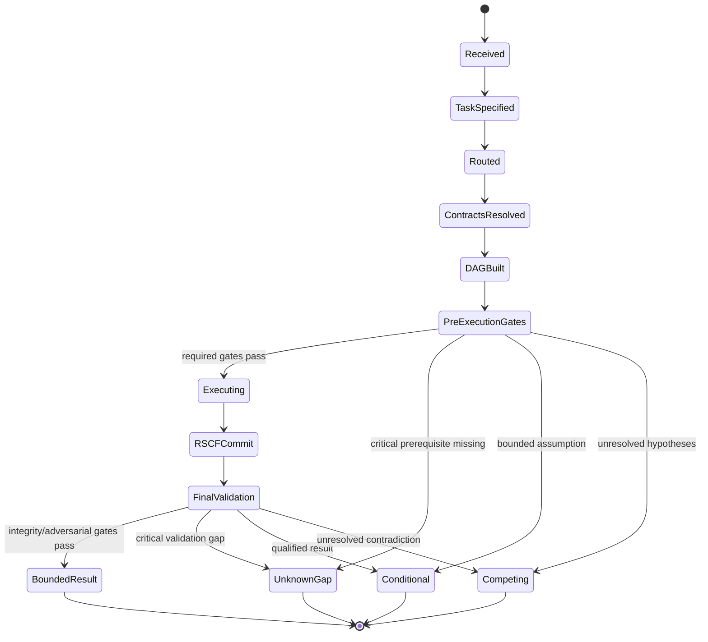
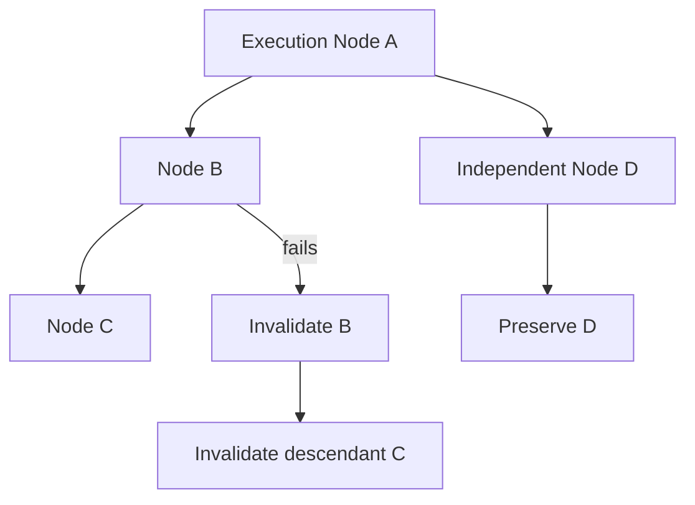
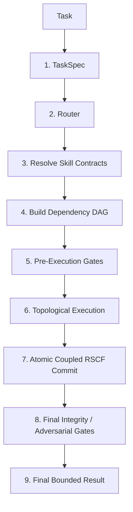
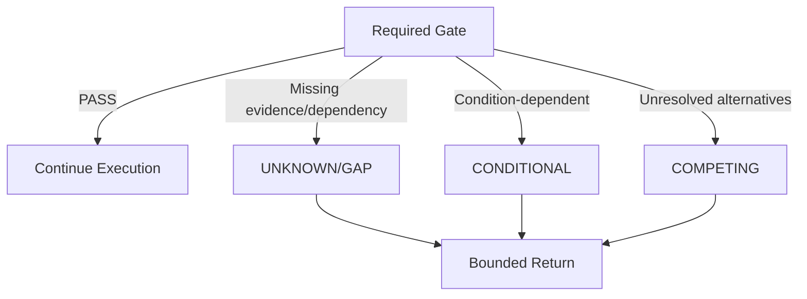
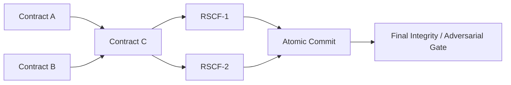
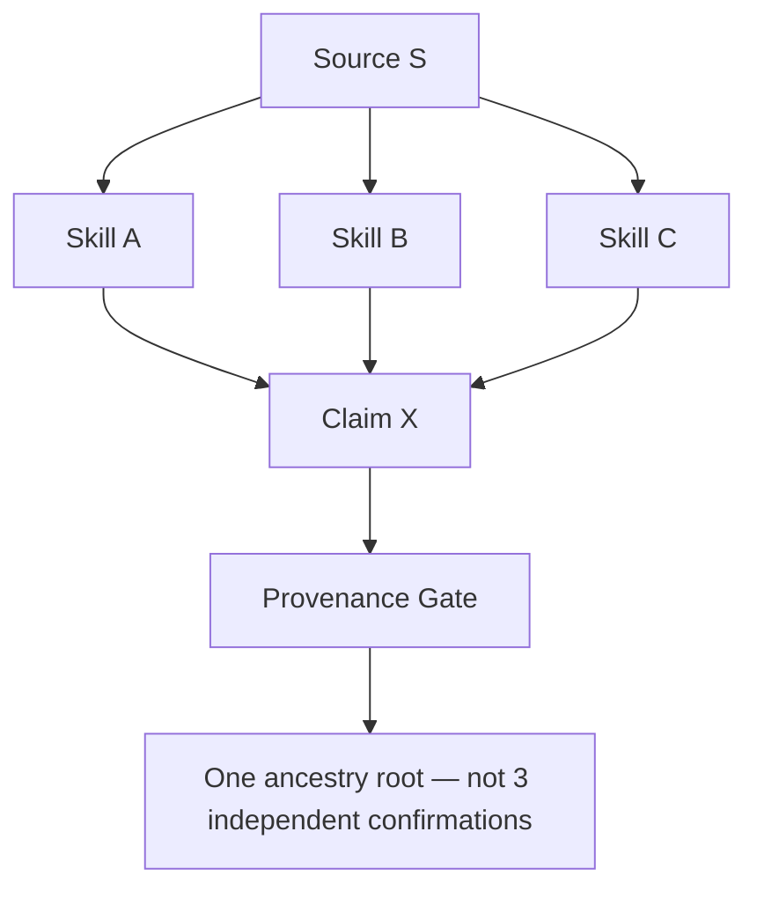

---
tags:
- knowledge
- kernel
- agents
- execution
- v1.md
---

# [[AGENTS]] AMOS EXECUTION KERNEL V1 — Full Canonical Expansion

## 0. Normalized Source Frontmatter

The block below preserves the supplied metadata. Escaping is normalized only for Markdown/YAML readability; no new canonical fields are inserted.

```yaml
---
title: AGENTS AMOS EXECUTION KERNEL V1
tags:
  - kernel
  - core
  - runtime
  - canon/knowledge
type: document
source: 11_KNOWLEDGE/kernel
rscf:
  state: SOURCE_CLAIM
  claim_class: SOURCE_CLAIM
  provenance: AMOS_corpus
  scope: AMOS_knowledge
---
```

## 0.1 Derived / Proposed Obsidian Augmentation

> [!warning] DERIVED / PROPOSED
> The following metadata is useful for vault integration but **was not present in the supplied source frontmatter**.

```yaml
aliases:
  - AMOS Kernel Agent Contract
  - AMOS Execution Kernel V1
  - Agent Execution Kernel
  - AMOS Runtime Agent Contract

derived_tags:
  - topic/amos-execution-kernel
  - topic/task-routing
  - topic/dependency-dag
  - topic/pre-execution-gates
  - topic/atomic-rscf
  - topic/adversarial-validation
  - topic/bounded-result
  - rscf/node
  - rscf/state/source-claim

proposed_artifact_kind: EXECUTION_KERNEL_CONTRACT
proposed_rscf_node_type: kernel
proposed_path: 11_KNOWLEDGE/kernel/AGENTS_AMOS_EXECUTION_KERNEL_V1.md
raw_source_policy: DO_NOT_REWRITE_CANON
epistemic_boundary: SOURCE_CLAIM
```

---

# 1. Source Body

The supplied kernel contract states:

> **AMOS Kernel Agent Contract**

and instructs the system to:

1. Construct a `TaskSpec`.
2. Call the router.
3. Resolve required skill contracts.
4. Build the dependency DAG.
5. Run pre-execution gates.
6. Execute contracts in topological order.
7. Commit resulting RSCFs atomically where coupled.
8. Run final integrity/adversarial gates.
9. Return the final bounded result.

It additionally establishes three critical control rules:

* nontrivial tasks should not bypass the kernel unless the router classifies them `C0`;
* failed required gates must produce an appropriate bounded conclusion such as `UNKNOWN/GAP`, `CONDITIONAL`, or `COMPETING`;
* a failed gate must **not** be converted into a fluent prose caveat while execution otherwise proceeds as though the gate passed.

That last rule is particularly important.

---

# 2. Canonical Interpretation

The artifact defines a **reasoning execution contract** rather than a domain-knowledge artifact.

Its central architecture is:

$$
Task
\rightarrow
TaskSpec
\rightarrow
Router
\rightarrow
SkillContracts
\rightarrow
DependencyDAG
\rightarrow
PreGates
\rightarrow
Execution
\rightarrow
AtomicRSCFCommit
\rightarrow
FinalGates
\rightarrow
BoundedResult
$$

This equation is a **DERIVED formalization** of the explicitly numbered source sequence.

---

# 3. Strongest Supported Conclusion

**SOURCE_CLAIM:** `AGENTS AMOS EXECUTION KERNEL V1` specifies a nine-stage AMOS execution discipline in which nontrivial reasoning is routed, dependency-resolved, gated, dependency-ordered, committed through RSCF-aware semantics, adversarially checked, and finally returned under an explicit epistemic bound.

It is therefore best understood as:

$$
\boxed{
ExecutionKernel
=
Routing
+
DependencyResolution
+
Gating
+
OrderedExecution
+
AtomicCommit
+
FinalValidation
+
BoundedReturn
}
$$

---

# 4. What the Artifact Does Not Establish

The source does **not**, by itself, prove that:

* a particular executable kernel implementation currently exists;
* `TaskSpec` has a particular machine schema;
* the router has a particular algorithm;
* a skill registry exists at runtime;
* every skill contract has been implemented;
* DAG construction is deterministic;
* gates have machine-executable predicates;
* RSCFs are stored in a database;
* atomicity is implemented through database transactions;
* MVCC or CAS is literally implemented;
* distributed consensus exists;
* adversarial validation is performed by a separate physical agent;
* runtime logs prove that these nine stages execute;
* the referenced related artifacts are currently available or version-compatible.

Accordingly:

```text
SOURCE CONTRACT
!=
RUNTIME IMPLEMENTATION PROOF
```

and:

```text
EXECUTION SEMANTICS
!=
EVIDENCE OF EXECUTION
```

---

# 5. Kernel Identity

The source title is:

```text
AGENTS AMOS EXECUTION KERNEL V1
```

while the body heading is:

```text
AMOS Kernel Agent Contract
```

A safe structural interpretation is:

```text
Artifact:
AGENTS AMOS EXECUTION KERNEL V1

Contained contract:
AMOS Kernel Agent Contract
```

There is no need to force these into competing identities.

---

# 6. Artifact Role

The kernel sits conceptually between:

```text
USER / CALLER INTENT
        ↓
EXECUTION CONTROL
        ↓
DOMAIN / SKILL REASONING
        ↓
VALIDATED RESULT
```

It governs **how reasoning proceeds** rather than supplying all domain facts itself.

---

# 7. Kernel Law

The source can be compressed into:

$$
Nontrivial(Task)
\Rightarrow
KernelGoverned(Task)
$$

except where:

$$
Router(Task)=C0
$$

Therefore the bypass exception is **router-mediated**, not based merely on subjective confidence.

---

# 8. “Seems Obvious” Is Not a Bypass Condition

The source explicitly says:

> Do not bypass the kernel simply because the answer seems obvious unless the router classifies the task C0.

Therefore:

$$
SeemsObvious(Task)
\not\Rightarrow
BypassKernel
$$

Instead:

$$
Router(Task)=C0
\Rightarrow
DirectPathPermitted
$$

This is one of the strongest source-defined anti-shortcut rules.

---

# 9. The Nine-Stage Execution Spine

```text
┌───────────────────────────────────────┐
│ 1. TaskSpec                           │
├───────────────────────────────────────┤
│ 2. Router                             │
├───────────────────────────────────────┤
│ 3. Skill Contract Resolution          │
├───────────────────────────────────────┤
│ 4. Dependency DAG                     │
├───────────────────────────────────────┤
│ 5. Pre-Execution Gates                │
├───────────────────────────────────────┤
│ 6. Topological Contract Execution     │
├───────────────────────────────────────┤
│ 7. Atomic Coupled-RSCF Commit         │
├───────────────────────────────────────┤
│ 8. Final Integrity / Adversarial Gate │
├───────────────────────────────────────┤
│ 9. Final Bounded Result               │
└───────────────────────────────────────┘
```

---

# 10. Stage 1 — Construct `TaskSpec`

The first mandatory object is:

```text
TaskSpec
```

This means raw natural-language intent is not treated as sufficient execution state for a nontrivial task.

Conceptually:

$$
RawRequest
\rightarrow
TaskSpec
$$

before downstream routing.

---

# 11. `TaskSpec` Epistemic Status

The source names `TaskSpec` but does not define its fields.

Therefore any schema beyond the name is:

```text
DERIVED / PROPOSED
```

not canonical source.

---

# 12. Minimum `TaskSpec` Semantics

The existence of the router implies that `TaskSpec` must contain enough information for the router to classify the task.

At minimum, this suggests information concerning:

* objective;
* task type;
* relevant scope;
* constraints.

But the exact field set is not supplied.

---

# 13. Proposed `TaskSpec`

A v4.4-compatible augmentation could be:

```yaml
TaskSpec:
  task_id:
  objective:
  deliverable:
  scope:
  exclusions: []

  stakes:
  reversibility:
  freshness_requirement:

  evidence_requirements: []
  requested_sources: []

  candidate_domains: []
  required_capabilities: []

  uncertainty:
    evidence:
    model:
    scope:
    temporal:
    causal:
    execution:
    provenance_independence:

  authority_boundary:
  side_effects_allowed: false
```

This is **PROPOSED**, not source canon.

---

# 14. Task Specification Invariant

A useful derived invariant is:

$$
ExecutionScope
\subseteq
TaskSpecScope
$$

unless the task is explicitly re-scoped.

This prevents silent expansion.

---

# 15. TaskSpec Must Not Invent Intent

A task compiler must not silently transform:

```text
analyze X
```

into:

```text
modify X
```

or:

```text
recommend X
```

into:

```text
execute X
```

Thus:

$$
ParsedIntent
\subseteq
SupportedUserIntent
$$

is a useful governance invariant.

---

# 16. Stage 2 — Call the Router

After `TaskSpec`, the kernel says:

```text
Call the router.
```

Therefore routing occurs before skill-contract execution.

---

# 17. Router Function

At minimum:

$$
Router(TaskSpec)
\rightarrow
ExecutionClass
$$

The only explicit router class named by the source is:

```text
C0
```

---

# 18. C0 Semantics

The source tells us only that `C0` is sufficiently simple to permit bypass of the nontrivial kernel path.

It does not define the complete classification taxonomy.

However, within the current AMOS lineage, a compatible model is:

```text
C0 Direct
C1 Compact
C2 Structured
C3 Deep
C4 Maximum
```

This broader taxonomy belongs to the AMOS reasoning lineage and should not be misrepresented as text contained in this V1 artifact.

---

# 19. Router Firewall

The source implies:

```text
MODEL FEELS CONFIDENT
!=
ROUTER CLASSIFIES C0
```

Thus subjective fluency cannot replace routing.

---

# 20. Complexity ≠ Length

A short question can be consequential.

A long question can sometimes be structurally simple.

Therefore a robust router should not use token count alone.

This is DERIVED.

---

# 21. Stakes Escalation

A task involving:

* irreversible action;
* safety;
* legal consequences;
* financial consequences;
* institutional consequences;
* governance mutation;

may deserve higher validation even if syntactically simple.

This is an AMOS v4.4 governance augmentation, not explicit V1 source text.

---

# 22. Proposed Router Output

```yaml
RouterDecision:
  task_id:
  complexity_class:
    - C0
    - C1
    - C2
    - C3
    - C4

  selected_path:
  required_domains: []
  required_contracts: []
  required_gates: []

  escalation_reasons: []
  bypass_permitted: false
```

PROPOSED.

---

# 23. Router Receipt

For auditability, routing should conceptually produce a receipt:

```yaml
RouterReceipt:
  task_id:
  classification:
  rationale_class:
  dependencies:
  gates_required:
  timestamp:
```

Again, this is PROPOSED.

---

# 24. Stage 3 — Resolve Required Skill Contracts

The kernel next requires:

```text
Resolve required skill contracts.
```

This is stronger than merely “select skills.”

The word:

```text
contracts
```

implies interface/governance requirements.

---

# 25. Skill Contract

A skill contract can conceptually contain:

```text
what it accepts
what it returns
what it depends on
what it is allowed to do
what evidence it requires
what gates constrain it
```

But these exact fields are not provided in the source.

---

# 26. Contract Resolution ≠ Skill Execution

The order matters:

$$
ResolveContract
\rightarrow
BuildDAG
\rightarrow
PreGates
\rightarrow
Execute
$$

Therefore:

$$
ResolveSkill
\neq
ExecuteSkill
$$

---

# 27. Missing Contract

If a required capability has no resolvable contract, the kernel should not silently improvise an authoritative substitute.

A safe result is:

```text
UNKNOWN/GAP
```

or a conditional partial path where appropriate.

This follows the explicit failed-gate/result discipline.

---

# 28. Contract Versioning

The source does not specify contract versions.

Therefore questions such as:

```text
Which skill version?
Which schema version?
Which dependency version?
```

remain implementation gaps.

---

# 29. Proposed Skill Contract

```yaml
SkillContract:
  skill_id:
  version:

  purpose:
  accepted_task_classes: []

  inputs:
    required: []
    optional: []

  outputs: []

  dependencies: []

  preconditions: []
  postconditions: []

  epistemic_constraints: []
  scope_constraints: []
  regime_constraints: []

  permissions: []

  failure_states:
    - UNKNOWN/GAP
    - CONDITIONAL
    - COMPETING

  side_effects:
    permitted: false
```

PROPOSED.

---

# 30. Contract Compatibility

Two skills being relevant to the same problem does not prove they can be composed.

Therefore:

$$
Relevant(A)
\land
Relevant(B)
\not\Rightarrow
Compatible(A,B)
$$

Compatibility may depend on:

* schema;
* epistemic class;
* scope;
* regime;
* version;
* authority;
* provenance;
* side effects.

---

# 31. Stage 4 — Build Dependency DAG

The fourth stage is explicit:

```text
Build the dependency DAG.
```

A DAG is a:

```text
Directed Acyclic Graph
```

in conventional graph terminology.

The source uses the acronym without expanding it, but this expansion is standard technical terminology.

---

# 32. DAG Purpose

The dependency graph determines what must precede what.

Conceptually:

$$
G=(V,E)
$$

where:

* \(V\) = resolved contracts/tasks;
* \(E\) = dependency relations.

---

# 33. Dependency Edge

If:

$$
A\rightarrow B
$$

means B depends on A, then B must not execute before A satisfies its required conditions.

---

# 34. DAG Acyclicity

Because the source specifically says `DAG`, cycles are structurally prohibited in the execution dependency representation.

Thus:

$$
Cycle(G)
\Rightarrow
InvalidDependencyDAG
$$

is a reasonable DERIVED invariant.

---

# 35. Cycle Handling

The source does not say what happens if a dependency cycle is discovered.

A safe behavior would be:

```text
BLOCK
→ classify structural dependency gap
→ return UNKNOWN/GAP or CONDITIONAL
```

unless the cycle can be legitimately collapsed into an atomic coupled unit.

That collapse rule is DERIVED, not explicit.

---

# 36. Dependency Closure

Before execution, the graph should identify all load-bearing prerequisites.

Conceptually:

$$
Closure(T)
=
T
\cup
Dependencies(T)
\cup
Dependencies(Dependencies(T))
\ldots
$$

until closure.

---

# 37. Smallest Sufficient Dependency Closure

The broader v4.4 fast path suggests:

$$
RetrieveOnly(
DependenciesThatCanMateriallyAlterOutcome
)
$$

rather than indiscriminate full-corpus expansion.

This is lineage-compatible augmentation.

---

# 38. Dependency Graph ≠ Causal Graph

Critical firewall:

$$
ExecutionDependency
\neq
CausalRelationship
$$

If skill B requires output from A, that does not prove A causally produces the real-world phenomenon described by B.

---

# 39. Dependency ≠ Provenance Independence

Likewise:

$$
DifferentNodes
\neq
IndependentEvidence
$$

Two nodes can descend from the same source.

---

# 40. Provenance Topology

A mature DAG may therefore need both:

```text
execution dependency edges
```

and:

```text
evidence ancestry edges
```

These must not be conflated.

---

# 41. Proposed DAG Node

```yaml
ExecutionNode:
  node_id:
  contract_id:
  task_fragment:
  dependencies: []
  evidence_dependencies: []
  provenance_roots: []
  scope:
  regime:
  freshness:
  execution_status:
```

PROPOSED.

---

# 42. Proposed DAG Edge Types

```yaml
edge_types:
  - REQUIRES
  - PRODUCES_FOR
  - VALIDATES
  - CHALLENGES
  - SHARES_PROVENANCE_WITH
  - COUPLED_WITH
```

Only generic dependency structure is source-grounded. Edge taxonomy is PROPOSED.

---

# 43. Stage 5 — Run Pre-Execution Gates

Before execution:

```text
Run pre-execution gates.
```

Therefore the kernel explicitly rejects:

```text
execute first
validate later
```

for required preconditions.

---

# 44. Gate Semantics

A gate is stronger than a warning.

A required gate determines whether execution may proceed.

Thus:

$$
GateRequired
\land
GateFailed
\Rightarrow
NoNormalExecution
$$

---

# 45. Gate Failure Is Typed

The source explicitly provides:

```text
UNKNOWN/GAP
CONDITIONAL
COMPETING
```

as possible responses.

This means failure is not a single undifferentiated `ERROR`.

---

# 46. `UNKNOWN/GAP`

Appropriate where required evidence, dependency, definition, or validation is missing.

Conceptually:

$$
RequiredPremiseUnavailable
\Rightarrow
UNKNOWN/GAP
$$

---

# 47. `CONDITIONAL`

Appropriate where a conclusion can be supported only under explicit assumptions or bounded conditions.

$$
P
\Rightarrow
Conclusion
$$

but P is not universally established.

---

# 48. `COMPETING`

Appropriate where multiple incompatible hypotheses remain materially viable.

```text
H1 supported
H2 supported
no discriminating evidence
→ COMPETING
```

---

# 49. Failed Gate ≠ Caveat

The source's strongest anti-fabrication statement is:

> Never silently downgrade a failed gate to a prose caveat.

Therefore this is prohibited:

```text
Gate: FAIL

Output:
"Everything is valid, though there may be some uncertainty..."
```

---

# 50. Gate Conservation Law

A failed mandatory gate must remain visible in the conclusion class.

$$
MandatoryGateFail
\Rightarrow
BoundedConclusion
$$

not:

$$
MandatoryGateFail
\Rightarrow
FluentUnboundedAnswer
$$

---

# 51. Proposed Pre-Execution Gates

A v4.4-compatible gate set could include:

```text
G1 Objective well-formed
G2 Required contracts resolved
G3 Dependency closure valid
G4 No unresolved execution cycle
G5 Evidence prerequisites sufficient
G6 Provenance topology acceptable
G7 Scope/regime compatibility established
G8 Freshness acceptable
G9 Authority/permission sufficient
G10 Irreversible-risk governance satisfied
```

These are PROPOSED.

---

# 52. Gate 1 — Objective Well-Formedness

The kernel cannot reliably execute if it does not know what constitutes success.

Possible result:

```text
UNKNOWN/GAP
```

when a load-bearing objective is missing.

---

# 53. Gate 2 — Contract Resolution

Every required execution node should have a resolvable contract.

Missing optional contracts need not necessarily block.

Missing load-bearing contracts should.

---

# 54. Gate 3 — Dependency Closure

No load-bearing prerequisite should remain silently absent.

---

# 55. Gate 4 — DAG Validity

The dependency graph must support a valid execution order.

---

# 56. Gate 5 — Evidence Sufficiency

Execution that depends on factual premises should not silently invent them.

---

# 57. Gate 6 — Provenance Integrity

Repeated descendants of one source should not masquerade as independent corroboration.

---

# 58. Gate 7 — Scope / Regime

A result valid in one environment must not silently transfer to another.

---

# 59. Gate 8 — Freshness

Stale evidence should not be treated as current where freshness materially changes the answer.

---

# 60. Gate 9 — Authority

Capability does not establish permission to perform consequential actions.

---

# 61. Gate 10 — Irreversibility

Irreversible/high-stakes operations should receive increased validation.

---

# 62. Stage 6 — Execute Contracts in Topological Order

The source explicitly requires:

```text
Execute contracts in topological order.
```

This ties execution order to the DAG.

---

# 63. Topological Execution

If:

$$
A\rightarrow B
$$

then:

$$
Execute(A)
<
Execute(B)
$$

assuming the edge represents B's dependency on A.

---

# 64. Independent Nodes

Nodes with no dependency relation may potentially execute independently.

But the source does not specify concurrency.

Therefore:

```text
DAG independence
!=
runtime parallelism
```

---

# 65. Topological Order May Not Be Unique

A DAG can have multiple valid topological orderings.

The source does not define tie-breaking.

Therefore determinism of scheduling is not established by this artifact alone.

---

# 66. Deterministic Execution Gap

To guarantee reproducibility, a runtime might require deterministic tie-breaking.

For example:

```text
dependency depth
→ priority
→ stable contract ID
```

This is PROPOSED.

---

# 67. Contract Output

Each contract may produce:

* evidence;
* derived claims;
* RSCFs;
* decisions;
* intermediate state;
* validation receipts.

Only RSCFs are explicitly named as commit objects in the source.

The others are plausible derived categories.

---

# 68. Local Failure

If a node fails, the entire graph need not necessarily be discarded.

The broader AMOS recovery law favors invalidating:

```text
failed node
+
dependent descendants
```

while preserving unaffected branches.

This is a v4.4 lineage augmentation.

---

# 69. Failure Propagation

If:

$$
A\rightarrow B\rightarrow C
$$

and A fails as a load-bearing prerequisite, then B and C become invalid or blocked.

An independent D may remain valid.

---

# 70. Localized Invalidation

Thus:

$$
Invalidate(A)
\Rightarrow
Invalidate(Descendants(A))
$$

not necessarily:

$$
Invalidate(EntireTask)
$$

unless A supports the entire result.

---

# 71. Stage 7 — Commit Resulting RSCFs Atomically Where Coupled

This is one of the most technically significant source clauses:

```text
Commit resulting RSCFs atomically where coupled.
```

---

# 72. RSCF as Commit Unit

The source treats RSCFs as objects resulting from execution that can require commit semantics.

However, it does not define their storage engine.

---

# 73. “Where Coupled”

Atomicity is not stated as universally required for every RSCF.

It applies:

```text
where coupled
```

Therefore:

$$
Coupled(R_1,R_2)
\Rightarrow
AtomicCommit(R_1,R_2)
$$

---

# 74. Coupling Definition Gap

The source does not define when RSCFs are coupled.

Possible forms include:

* logical dependency;
* shared invariant;
* cross-RSCF transaction;
* mutually dependent decision;
* synchronized state mutation.

These remain candidates.

---

# 75. Atomicity

Atomic commit means conceptually:

```text
all coupled changes commit
or
none commit
```

Thus:

$$
Commit(R_1,R_2)
\in
\{ALL,NONE\}
$$

for an atomic coupled set.

---

# 76. Partial Commit Hazard

Without atomicity:

```text
R1 committed
R2 failed
```

could leave the reasoning state internally inconsistent.

The source explicitly guards against this where coupling exists.

---

# 77. Atomicity ≠ Truth

Critical firewall:

$$
AtomicCommit
\neq
EpistemicValidity
$$

A set of wrong conclusions can be atomically committed.

Atomicity protects consistency of state transition, not truth.

---

# 78. Atomicity ≠ Persistence

Likewise:

$$
Atomic
\neq
Durable
$$

unless a persistence mechanism is separately defined.

The source does not specify durability semantics.

---

# 79. MVCC / CAS Relationship

Broader AMOS v4.4 lineage includes MVCC/CAS concepts for governed state coordination.

However, this V1 artifact does **not** explicitly say:

```text
MVCC
CAS
compare-and-swap
transaction database
```

Therefore these may be used as compatible reasoning models but not attributed directly to this source.

---

# 80. Proposed Coupled RSCF Transaction

```yaml
RSCFTransaction:
  transaction_id:

  members:
    - rscf_id_1
    - rscf_id_2

  coupling_reason:
  expected_versions: {}

  preconditions: []

  commit_policy: ALL_OR_NONE

  result:
    - COMMITTED
    - ABORTED
    - CONFLICT

  receipt:
```

PROPOSED.

---

# 81. Compare-and-Swap Hardening — Proposed

A possible v4.4 implementation:

$$
CAS(expectedState,newState)
$$

could reject commit when the underlying state has changed since validation.

This is **PROPOSED implementation hardening**, not source evidence.

---

# 82. Persistent Provenance

Any committed RSCF should preserve enough provenance to reconstruct:

```text
what claim changed
why
from which evidence
under which scope
under which regime
with which dependencies
```

This is v4.4-compatible governance.

---

# 83. Stage 8 — Final Integrity / Adversarial Gates

After execution and commit:

```text
Run final integrity/adversarial gates.
```

Therefore pre-execution validation is not sufficient.

---

# 84. Two-Gate Architecture

The source establishes validation on both sides of execution:

$$
PreGate
\rightarrow
Execute
\rightarrow
FinalGate
$$

This is stronger than single-stage validation.

---

# 85. Pre-Gate vs Final Gate

Conceptually:

```text
PRE-GATE:
May we execute?

FINAL GATE:
Does the resulting state/output remain valid?
```

This distinction is DERIVED but strongly implied.

---

# 86. Integrity Gate

A final integrity check may test whether:

* required contracts were satisfied;
* dependencies remained valid;
* output stayed within scope;
* RSCFs remained coherent;
* no mandatory constraint was violated.

Exact predicates are not supplied.

---

# 87. Adversarial Gate

The explicit word:

```text
adversarial
```

means the final stage should not merely re-read the same reasoning path approvingly.

It should attempt to identify failure.

---

# 88. Strongest-Conclusion Challenge

A v4.4-compatible adversarial procedure is:

```text
1. Construct strongest supported conclusion.
2. Search for contradiction.
3. Search for correlated provenance.
4. Search for stale premises.
5. Search for scope leakage.
6. Search for hidden dependencies.
7. Search for causal overreach.
8. Search for stronger competing explanations.
```

This is lineage-derived implementation detail.

---

# 89. Independent Challenge Path

The challenge should be genuinely different enough to expose shared failure modes.

Simply asking the same chain to repeat itself is weak validation.

---

# 90. Correlated-Provenance Attack

Suppose three contracts produce the same conclusion:

```text
Agent A → Claim X
Agent B → Claim X
Agent C → Claim X
```

If all three derive from Source S:

```text
S → A
S → B
S → C
```

then:

$$
3\ Agreements
\neq
3\ IndependentConfirmations
$$

---

# 91. Scope Leakage Attack

A final gate should challenge whether a conclusion was generalized beyond:

* population;
* environment;
* time;
* scale;
* regime;
* measurement method;
* assumptions.

---

# 92. Causal Overreach Attack

If evidence establishes only:

```text
association
```

the final gate should reject a conclusion asserting:

```text
causal effect
```

unless causal evidence exists.

---

# 93. Staleness Attack

If a load-bearing premise expired during execution, final validation should downgrade or invalidate the result.

---

# 94. Hidden Dependency Attack

A result that appears locally independent may secretly rely on a shared upstream premise.

The adversarial gate should expose this.

---

# 95. Contradiction Attack

If a supported competing hypothesis exists, the kernel must not force false convergence.

Appropriate result:

```text
COMPETING
```

---

# 96. Stage 9 — Return Final Bounded Result

The last stage is:

```text
Return the final bounded result.
```

The adjective:

```text
bounded
```

is crucial.

---

# 97. Bounded Result

A result should not claim more than the validated proof scope supports.

Conceptually:

$$
ClaimScope_{out}
\subseteq
ValidatedScope
$$

and:

$$
Confidence_{out}
\le
WeakestLoadBearingPremise
$$

The second equation belongs to broader AMOS lineage but is highly compatible with the bounded-result requirement.

---

# 98. Bound Types

A final result can be bounded by:

* evidence;
* scope;
* regime;
* time;
* provenance;
* causal strength;
* execution validity;
* authority;
* confidence.

---

# 99. Conclusion Classes

The broader AMOS conclusion classes are:

```text
VERIFIED
DERIVED
MODEL
CONDITIONAL
COMPETING
UNKNOWN/GAP
```

This artifact explicitly names the last three as required outputs when gates fail appropriately.

---

# 100. `VERIFIED`

Use only where evidence supports verification within the stated scope.

---

# 101. `DERIVED`

Use where a conclusion follows from validated premises but is not itself directly observed/source-stated.

---

# 102. `MODEL`

Use for formal or conceptual models not established as empirical fact.

---

# 103. `CONDITIONAL`

Use when the conclusion depends on explicit unresolved conditions.

---

# 104. `COMPETING`

Use where incompatible supported hypotheses remain unresolved.

---

# 105. `UNKNOWN/GAP`

Use where required information is absent or insufficient.

---

# 106. Weakest Accurate Class

The kernel should return the **weakest accurate conclusion class**, not the most rhetorically impressive class.

Thus:

```text
MODEL
```

must not become:

```text
VERIFIED
```

through fluent prose.

---

# 107. Failed Gate Classification

A proposed mapping:

| Failure condition                     | Likely result                      |
| ------------------------------------- | ---------------------------------- |
| required evidence missing             | `UNKNOWN/GAP`                      |
| result valid only if assumption holds | `CONDITIONAL`                      |
| incompatible hypotheses unresolved    | `COMPETING`                        |
| scope cannot be established           | `UNKNOWN/GAP` or `CONDITIONAL`     |
| causal identification unresolved      | `CONDITIONAL` / `COMPETING`        |
| provenance independence unresolved    | confidence ceiling / `CONDITIONAL` |
| authority absent                      | execution blocked                  |

The exact mapping is DERIVED.

---

# 108. Gate Failure Must Affect State

The source rejects:

```text
gate failed
+
normal success state
+
tiny disclaimer
```

A failed required gate must alter either:

* execution;
* conclusion class;
* confidence ceiling;
* output scope;
* action permission.

---

# 109. Hard Gate vs Soft Signal

A useful distinction:

```text
HARD GATE:
failure blocks or changes result class

SOFT SIGNAL:
failure informs analysis but need not block
```

The source refers specifically to:

```text
required gate
```

which strongly implies hard-gate semantics.

---

# 110. No Silent Gate Demotion

Therefore:

$$
RequiredGate
\not\rightarrow
OptionalCaveat
$$

without explicit governance authorization.

---

# 111. Execution Kernel State Machine

A derived state machine is:

```text
RECEIVED
   ↓
SPECIFIED
   ↓
ROUTED
   ↓
CONTRACTS_RESOLVED
   ↓
DAG_READY
   ↓
PRE_GATED
   ↓
EXECUTING
   ↓
RSCF_COMMITTING
   ↓
FINAL_VALIDATING
   ↓
BOUNDED_RESULT
```

Failure branches:

```text
UNKNOWN/GAP
CONDITIONAL
COMPETING
ABORTED
```

`ABORTED` is proposed rather than explicitly source-defined.

---

# 112. State Transition Graph



DERIVED.

---

# 113. Kernel Pseudocode

```python
def execute_amos_task(raw_task):
    task_spec = construct_task_spec(raw_task)

    route = router(task_spec)

    if route.classification == "C0":
        return bounded_direct_result(task_spec)

    contracts = resolve_required_skill_contracts(
        task_spec,
        route
    )

    dag = build_dependency_dag(contracts)

    pre = run_pre_execution_gates(
        task_spec=task_spec,
        route=route,
        contracts=contracts,
        dag=dag,
    )

    if not pre.pass_required:
        return classify_gate_failure(pre)

    results = execute_topologically(dag)

    commit = atomic_commit_where_coupled(
        results.rscfs
    )

    final = run_final_integrity_and_adversarial_gates(
        task_spec=task_spec,
        route=route,
        dag=dag,
        results=results,
        commit=commit,
    )

    if not final.pass_required:
        return classify_gate_failure(final)

    return build_bounded_result(
        results=results,
        validation=final,
    )
```

This is **DERIVED pseudocode**, not supplied executable source.

---

# 114. Fail-Closed Kernel Pseudocode

A stronger formulation:

```python
if required_gate.status != "PASS":
    return required_gate.bounded_failure_class
```

not:

```python
if required_gate.status != "PASS":
    add_disclaimer()
    continue_as_success()
```

The latter conflicts with the source contract.

---

# 115. C0 Fast Path

A source-compatible C0 path is:

```text
TaskSpec
   ↓
Router
   ↓
C0
   ↓
Direct bounded response
```

But the source does not say C0 eliminates all integrity constraints.

Therefore:

```text
C0
!=
NO INTEGRITY
```

---

# 116. C0 Is Complexity Optimization

C0 should be understood as:

```text
minimum sufficient proof scope
```

rather than:

```text
permission to fabricate
```

---

# 117. C0 Examples — Proposed

Possible C0 tasks might include:

* simple deterministic transformations;
* trivial formatting;
* straightforward definitions;
* arithmetic with explicit inputs.

But these examples are not in the source.

---

# 118. C0 Escalation

A superficially simple task should leave C0 when:

* evidence conflicts;
* stakes rise;
* current information is required;
* scope becomes ambiguous;
* causal claims appear;
* action becomes irreversible.

This is v4.4-compatible.

---

# 119. C1–C4 Expansion — Lineage Layer

A compatible complexity architecture:

| Class | Typical runtime                       |
| ----- | ------------------------------------- |
| C0    | direct                                |
| C1    | compact validation                    |
| C2    | structured multi-step                 |
| C3    | deep dependency/adversarial reasoning |
| C4    | maximum validation/governance         |

Again, only `C0` is explicit in the supplied V1 artifact.

---

# 120. Kernel Complexity Invariant

$$
ValidationEffort
\propto
DecisionChangingUncertainty
\times
Stakes
$$

is a useful derived optimization principle.

---

# 121. Kernel Efficiency Law

The execution kernel should not maximize reasoning for its own sake.

It should find:

$$
SmallestSufficientProofScope
$$

that satisfies:

```text
Claim Sufficiency
Decision Sufficiency
Action Sufficiency
```

This belongs to current AMOS lineage.

---

# 122. Stop Condition

Execution can stop when further work has negligible probability of changing the bounded answer.

This is a derived efficiency rule.

---

# 123. Proof Capsule Model

Each important conclusion can be represented as:

```yaml
ProofCapsule:
  claim:
  conclusion_class:

  premises: []
  evidence: []
  provenance: []

  scope:
  regime:
  temporal_validity:

  dependencies: []

  competing_explanations: []
  falsifiers: []
  invalidation_conditions: []

  confidence_ceiling:
```

This is a v4.4-compatible augmentation.

---

# 124. Proof Capsule Reuse

A prior proof capsule should only be reused if:

```text
dependencies remain valid
scope remains compatible
regime remains compatible
freshness remains valid
provenance remains acceptable
```

---

# 125. Partial Invalidation

If one premise fails:

```text
invalidate that premise
+
dependent conclusions
```

rather than deleting unrelated valid reasoning.

---

# 126. Atomic Multi-RSCF Reasoning

Stage 7 provides the source basis for multi-RSCF atomicity:

```text
Commit resulting RSCFs atomically where coupled.
```

This is compatible with the later AMOS lineage concept of atomic multi-RSCF reasoning.

---

# 127. Atomic Proof Set

Suppose:

$$
R_A:
ClaimA
$$

and:

$$
R_B:
ClaimB\ depends\ on\ ClaimA
$$

and the two must represent one coherent state transition.

Then:

$$
Commit(R_A,R_B)
$$

should be atomic if they are coupled.

---

# 128. Atomic Commit Failure

If the atomic commit fails, the runtime should not return a result pretending the new RSCF state exists.

Possible result:

```text
UNKNOWN/GAP
```

or an execution-specific failure class.

The exact class is not source-defined.

---

# 129. Finality

The source says:

```text
commit
```

before final integrity gates.

It does not define whether final validation can roll back a commit.

This is an important implementation gap.

---

# 130. Competing Finality Models

### H1 — provisional commit

Stage 7 creates a provisional atomic state that Stage 8 can reject.

### H2 — durable commit then compensating rollback

Stage 7 commits durably; Stage 8 can cause a governed rollback.

### H3 — commit to reasoning workspace

“Commit” refers to internal RSCF coherence rather than persistent durable state.

All remain **COMPETING** without further kernel definition.

---

# 131. Cheapest Discriminating Evidence

To resolve the previous gap, retrieve the executable kernel's definition of:

```text
commit
atomic
RSCF
final integrity gate
rollback
```

No fluent inference should replace that source.

---

# 132. Transaction Boundary

A future executable specification should define:

```text
BEGIN
→ execute coupled nodes
→ validate local invariants
→ stage RSCFs
→ atomic commit
→ final adversarial validation
→ finalize / rollback
```

This is PROPOSED.

---

# 133. Causal Epoch Finality

Current AMOS lineage contains causal-epoch finality concepts.

This V1 source does not mention epochs.

Therefore:

```text
causal epoch
```

must not be silently inserted as V1 canon.

It may be a later-lineage hardening layer.

---

# 134. Shard-Local Finalization

Likewise, hardened shard-local finalization belongs to later lineage patterns, not this source body.

The V1 contract provides the conceptual ancestor:

```text
atomic where coupled
```

but does not establish shards.

---

# 135. Proof-Based Coordination Avoidance

Later AMOS lineage favors avoiding unnecessary global coordination when local proof suffices.

V1 does not explicitly state this.

However, DAG structure plus conditional atomic coupling are compatible with it.

---

# 136. Local Fast Path

If two branches:

* have independent dependency closure;
* do not share coupled RSCFs;
* do not conflict;
* have compatible scope/regime;
* have acceptable provenance independence;

they may potentially finalize locally in a later implementation.

This is DERIVED/PROPOSED.

---

# 137. Independence Must Be Demonstrated

The existence of separate DAG branches does not prove independence.

$$
GraphSeparation
\neq
ProvenanceIndependence
$$

---

# 138. Provenance Sybil Attack

An adversarial system could create:

```text
Skill A
Skill B
Skill C
```

all repeating the same upstream source and present them as corroboration.

The final adversarial gate should detect shared ancestry.

---

# 139. Epistemic Inflation Attack

A dangerous loop:

```text
SOURCE_CLAIM
→ derived skill output
→ RSCF
→ another skill cites RSCF
→ another agent confirms
→ system labels VERIFIED
```

is invalid if no new independent evidence entered the chain.

---

# 140. Confidence Conservation

A safe derived law:

$$
C_{derived}
\le
\min(C_{load-bearing\ premises})
$$

unless a premise is independently revalidated.

---

# 141. Repetition Conservation

$$
RepeatedClaim
\not\Rightarrow
HigherConfidence
$$

without independent evidence.

---

# 142. Scope Conservation

$$
Scope_{out}
\subseteq
\bigcap Scope_{load-bearing\ inputs}
$$

for claims requiring all those inputs.

This is a v4.4-compatible rule.

---

# 143. Regime Conservation

Similarly:

$$
Regime_{out}
\subseteq
\bigcap Regime_{load-bearing\ inputs}
$$

unless a cross-regime validation explicitly supports extension.

---

# 144. Freshness Conservation

A result whose premise is freshness-sensitive cannot outlive that premise indefinitely.

$$
Validity(Result)
\le
FreshnessWindow(LoadBearingPremise)
$$

conceptually.

---

# 145. Causal Firewall

The execution kernel should preserve evidence type.

```text
SOURCE_CLAIM
OBSERVATION
DERIVED
MODEL
DECISION
UNKNOWN
```

should not be collapsed.

---

# 146. Association ≠ Causation

No router, skill contract, DAG, or atomic commit can turn correlational evidence into causal evidence.

---

# 147. Structural Similarity ≠ Mechanism Identity

Two contracts producing structurally similar results do not prove they represent the same underlying mechanism.

---

# 148. DAG ≠ Causal DAG

This deserves explicit repetition because of terminology risk:

```text
Execution DAG:
what must run before what

Causal DAG:
hypothesized/identified causal relations among variables
```

They are different graph types.

---

# 149. Scope Firewall

The bounded result must preserve applicability conditions.

For example:

```text
validated for system A
```

must not silently become:

```text
validated for all systems
```

---

# 150. Regime Shift

If conditions materially change between routing and final validation, the kernel should reconsider stale assumptions.

Possible action:

```text
re-route
re-gate
downgrade
```

depending on impact.

This is DERIVED.

---

# 151. Execution-Time Mutation

Suppose a dependency changes after pre-gating but before commit.

The source does not define concurrency handling.

This is where later MVCC/CAS concepts become relevant as implementation hardening.

---

# 152. Stale Read Hazard

```text
Gate validates version V1
Dependency becomes V2
Execution commits using assumptions from V1
```

can produce a stale result.

The V1 source does not specify protection.

---

# 153. Proposed Version Guard

```yaml
DependencyReceipt:
  dependency_id:
  validated_version:
  validated_hash:
  freshness:
  scope:
```

and at commit:

```text
current version == validated version?
```

If not, revalidate.

PROPOSED.

---

# 154. CAS-Style Commit — Proposed

```text
IF current_state == expected_state
THEN commit new_state
ELSE conflict → revalidate
```

This is not direct V1 canon.

---

# 155. Failure Recovery

Current AMOS recovery principle:

```text
invalidate failed premise
invalidate dependent descendants
preserve unaffected work
reroute locally
```

is compatible with the DAG architecture.

---

# 156. Do Not Repeat Failed Path

If a path failed due to unchanged evidence, repeating the same path does not create validation.

$$
SamePath
+
SameEvidence
\neq
NewInformation
$$

---

# 157. Recovery Graph



---

# 158. Global Recompute

Global recomputation should be a last resort when local invalidation cannot establish a coherent state.

This is v4.4-compatible rather than explicit V1 text.

---

# 159. Gate Taxonomy

A useful derived taxonomy is:

```text
STRUCTURAL
EPISTEMIC
PROVENANCE
SCOPE
REGIME
TEMPORAL
CAUSAL
EXECUTION
AUTHORITY
SAFETY
INTEGRITY
ADVERSARIAL
```

---

# 160. Structural Gate

Tests:

* TaskSpec validity;
* contract resolution;
* DAG validity;
* schema compatibility.

---

# 161. Epistemic Gate

Tests:

* claim class;
* evidence sufficiency;
* confidence ceiling;
* unsupported promotion.

---

# 162. Provenance Gate

Tests:

* source identity;
* ancestry;
* correlation;
* independence.

---

# 163. Scope Gate

Tests applicability envelope.

---

# 164. Regime Gate

Tests whether evidence and result occupy compatible operating regimes.

---

# 165. Temporal Gate

Tests freshness and validity windows.

---

# 166. Causal Gate

Tests whether causal language is licensed by causal evidence.

---

# 167. Execution Gate

Tests whether required contracts actually completed.

---

# 168. Authority Gate

Tests whether execution is permitted, not merely possible.

---

# 169. Safety Gate

Tests risk constraints.

---

# 170. Integrity Gate

Tests final coherence.

---

# 171. Adversarial Gate

Actively seeks reasons the conclusion should fail or be downgraded.

---

# 172. Gate Receipt — Proposed

```yaml
GateReceipt:
  gate_id:
  gate_type:
  required: true

  inputs: []
  dependencies: []

  result:
    - PASS
    - FAIL
    - CONDITIONAL
    - UNKNOWN

  reason:
  evidence: []
  provenance: []

  downstream_effect:
  timestamp:
```

---

# 173. Gate Composition

If all mandatory gates must pass:

$$
Permit
=
\bigwedge_{i=1}^{n}
Gate_i
$$

for Boolean gates.

But the source also supports typed non-pass states, so a richer lattice is preferable.

---

# 174. Gate Lattice — Proposed

```text
PASS
CONDITIONAL
COMPETING
UNKNOWN/GAP
FAIL/BLOCK
```

The source explicitly names the middle epistemic outcomes but not this full ordering.

---

# 175. `COMPETING` Is Not Simply “Worse” Than `CONDITIONAL`

These classes represent different uncertainty structures.

* `CONDITIONAL`: one result under stated assumptions.
* `COMPETING`: multiple unresolved alternatives.

Therefore they should not necessarily be represented as one scalar severity ladder.

---

# 176. Uncertainty Vector

Current AMOS reasoning can track:

$$
U=
(U_e,U_m,U_s,U_t,U_c,U_x,U_p)
$$

where:

* \(U_e\) = evidence uncertainty;
* \(U_m\) = model uncertainty;
* \(U_s\) = scope uncertainty;
* \(U_t\) = temporal uncertainty;
* \(U_c\) = causal uncertainty;
* \(U_x\) = execution uncertainty;
* \(U_p\) = provenance-independence uncertainty.

This is a lineage augmentation.

---

# 177. Router and Uncertainty

A mature router can escalate based on the uncertainty vector rather than task length.

---

# 178. Decision-Changing Uncertainty

The kernel should prioritize uncertainty capable of changing:

```text
the conclusion
the decision
the permitted action
```

rather than spending equal effort everywhere.

---

# 179. Sensitivity

For consequential outputs, identify the smallest premise or threshold capable of flipping the result.

---

# 180. Fragile Result

If a small plausible change flips the conclusion:

```text
CONDITIONAL
```

may be appropriate.

---

# 181. Robust Result

If the result survives plausible noncritical perturbations, it is more robust.

This does not automatically make it VERIFIED.

---

# 182. Kernel Invariant — Integrity Before Fluency

The source's anti-caveat rule implies:

$$
Integrity
>
Fluency
$$

A smooth answer cannot repair a failed gate.

---

# 183. Kernel Invariant — Gate Before Execution

$$
PreGate
<
Execution
$$

in execution order.

---

# 184. Kernel Invariant — Dependencies Before Dependents

$$
A\rightarrow B
\Rightarrow
A\ precedes\ B
$$

---

# 185. Kernel Invariant — Atomicity for Coupled RSCFs

$$
Coupled(R)
\Rightarrow
AtomicCommit(R)
$$

---

# 186. Kernel Invariant — Validation After Execution

$$
Execution
<
FinalIntegrityGate
$$

---

# 187. Kernel Invariant — Bounded Return

$$
Return
=
ValidatedBoundedResult
$$

not unbounded synthesis.

---

# 188. Kernel Invariant — No Obviousness Bypass

$$
Obviousness
\not\Rightarrow
C0
$$

Only router classification licenses the fast path.

---

# 189. Kernel Invariant — No Failed-Gate Laundering

$$
GateFail
\not\Rightarrow
SuccessWithDisclaimer
$$

---

# 190. Kernel Invariant — Unknown Must Remain Unknown

If evidence cannot resolve a critical gap:

$$
UNKNOWN
\rightarrow
UNKNOWN/GAP
$$

not fabricated certainty.

---

# 191. Kernel Invariant — Contradiction Visibility

If two supported claims conflict:

```text
preserve contradiction
```

until discriminating evidence resolves it.

---

# 192. Kernel Invariant — No Forced Convergence

$$
H_1\ COMPETING\ H_2
$$

must not be collapsed merely because one answer is stylistically cleaner.

---

# 193. Kernel Invariant — Local Trust

A skill output should be trusted only within its validated:

```text
type
scope
regime
freshness
provenance
dependencies
```

---

# 194. Kernel Invariant — Typed Evidence

A `MODEL` does not become an `OBSERVATION` through execution.

A `SOURCE_CLAIM` does not become `VERIFIED` because multiple internal agents repeat it.

---

# 195. Kernel Invariant — Execution ≠ Truth

A contract can execute successfully and still produce an epistemically weak result.

Therefore:

$$
ExecutionSuccess
\neq
Truth
$$

---

# 196. Kernel Invariant — Atomicity ≠ Truth

Likewise:

$$
AtomicCommit
\neq
Correctness
$$

---

# 197. Kernel Invariant — Adversarial Pass ≠ Universal Proof

Passing the configured adversarial gates only establishes survival against those gates within their scope.

It is not universal formal proof unless such proof is separately supplied.

---

# 198. Kernel Invariant — Router ≠ Oracle

Router classification is a control decision, not evidence that the substantive answer is true.

---

# 199. Kernel Invariant — Skill ≠ Evidence

A skill is a reasoning capability/contract.

Its existence does not establish the factual claims it processes.

---

# 200. Kernel Invariant — DAG ≠ Knowledge Graph

The execution DAG is task-local orchestration structure.

It need not be identical to the persistent AMOS knowledge graph.

---

# 201. Kernel Invariant — RSCF ≠ Raw Evidence

RSCF may package reasoning/provenance, but the underlying evidence should remain distinguishable.

---

# 202. Raw Evidence Policy

A v4.4-compatible retrieval strategy is:

```text
Bootstrap capsule
→ H domain
→ M subsystem
→ L detail
→ raw evidence only when required
```

This is not explicitly in the V1 artifact but aligns with the current lineage.

---

# 203. DO_NOT_LOAD_UNLESS_REQUIRED

Raw evidence should not be indiscriminately loaded where proof capsules already establish the needed premise and remain valid.

---

# 204. Proof Capsule Cache

Reusable validated conclusions can reduce execution cost.

But reuse requires dependency/freshness checks.

---

# 205. Cache Poisoning Hazard

A cached proof capsule whose premise later fails must not remain globally trusted.

---

# 206. Targeted Invalidation

If premise P supports:

```text
C1
C2
```

but not:

```text
C3
```

then invalidating P should invalidate C1 and C2, not C3.

---

# 207. Contract DAG Example

Suppose a task asks for a consequential recommendation.

```text
TaskSpec
   ↓
Evidence Retrieval Contract
   ↓
Evidence Validation Contract
   ↓
Domain Analysis Contract
   ├─────────────┐
   ↓             ↓
Risk Contract   Alternative-Hypothesis Contract
   └──────┬──────┘
          ↓
Decision Synthesis
          ↓
Final Adversarial Gate
```

DERIVED example.

---

# 208. Parallel Branches

The risk and alternative-hypothesis branches may be dependency-independent after domain analysis.

But actual parallel execution is implementation-dependent.

---

# 209. Merge Gate

Before merging independent branches, a future kernel should test:

```text
scope compatibility
regime compatibility
provenance overlap
contradiction
coupling
```

PROPOSED.

---

# 210. Multi-RSCF Example

Suppose:

```text
R1 = evidence conclusion
R2 = risk conclusion
R3 = decision conclusion
```

If R3 depends on both R1 and R2, then a commit that changes R1/R2/R3 coherently may require coupling.

---

# 211. Atomic Set

$$
AtomicSet
=
\{R_1,R_2,R_3\}
$$

if partial persistence would violate invariants.

---

# 212. Independent RSCF

If R4 is unrelated:

$$
R_4
\notin
AtomicSet
$$

unless another dependency establishes coupling.

---

# 213. Over-Coupling Hazard

Making every RSCF globally atomic would increase unnecessary coordination.

The source says:

```text
where coupled
```

which argues against assuming universal coupling.

---

# 214. Under-Coupling Hazard

Failing to atomically bind genuinely dependent RSCFs can leave inconsistent state.

---

# 215. Coupling Test — Proposed

Two RSCFs may be considered coupled if:

```text
one cannot remain valid if the other fails
```

or if:

```text
partial commit violates a shared invariant
```

This is a useful proposed definition.

---

# 216. Final Result Schema — Proposed

```yaml
BoundedResult:
  task_id:

  conclusion:
  conclusion_class:

  decisive_evidence: []
  provenance: []

  scope:
  regime:
  freshness:

  dependencies: []

  material_uncertainties: []
  competing_hypotheses: []

  falsifiers: []
  invalidation_conditions: []

  execution_status:
  gate_status:

  action_boundary:
```

---

# 217. Result Compression

The user-facing result need not expose the entire execution graph.

It should surface only:

```text
conclusion
decisive evidence
material uncertainty
important competing hypotheses
scope
invalidation conditions
safe action boundary
```

This preserves hidden reasoning while exposing audit-relevant outputs.

---

# 218. No Chain-of-Thought Requirement

The execution kernel does not require revealing hidden internal reasoning.

A proof capsule or concise evidence receipt can provide auditability without exposing private chain-of-thought.

---

# 219. Auditability ≠ Chain-of-Thought Disclosure

$$
Auditability
\neq
RevealHiddenReasoning
$$

Auditability can be achieved through:

* claim;
* evidence;
* provenance;
* dependencies;
* gates;
* conclusion class;
* invalidation conditions.

---

# 220. Source Metadata Classification

The supplied frontmatter states:

```yaml
rscf:
  state: SOURCE_CLAIM
  claim_class: SOURCE_CLAIM
  provenance: AMOS_corpus
  scope: AMOS_knowledge
```

Therefore the artifact itself should not be promoted beyond source claim merely because its architecture is coherent.

---

# 221. “Executable AMOS Kernel” Claim

The body says:

> “Use the executable AMOS kernel as the reasoning control plane.”

This is a **SOURCE_CLAIM** that an executable kernel is the intended control plane.

The supplied artifact itself does not contain the executable kernel implementation.

Therefore:

```text
EXECUTABLE KERNEL REFERENCED
!=
EXECUTABLE KERNEL VERIFIED HERE
```

---

# 222. Runtime Implementation Status

Accurate class:

```text
SOURCE_CLAIM:
executable AMOS kernel is referenced.

UNKNOWN/GAP:
exact implementation and runtime receipts are not supplied in this artifact.
```

---

# 223. Router Implementation Status

```text
Router required: SOURCE_GROUNDED
Router algorithm: UNKNOWN/GAP
```

---

# 224. Skill Contract Registry Status

```text
Skill contracts required: SOURCE_GROUNDED
Registry implementation: UNKNOWN/GAP
```

---

# 225. DAG Builder Status

```text
Dependency DAG required: SOURCE_GROUNDED
DAG builder implementation: UNKNOWN/GAP
```

---

# 226. Pre-Gate Status

```text
Pre-execution gates required: SOURCE_GROUNDED
Exact gate registry: UNKNOWN/GAP
```

---

# 227. Topological Executor Status

```text
Topological execution required: SOURCE_GROUNDED
Scheduler implementation: UNKNOWN/GAP
```

---

# 228. Atomic Commit Status

```text
Atomic coupled RSCF commit required: SOURCE_GROUNDED
Storage/transaction implementation: UNKNOWN/GAP
```

---

# 229. Adversarial Gate Status

```text
Final adversarial validation required: SOURCE_GROUNDED
Exact challenge implementation: UNKNOWN/GAP
```

---

# 230. Bounded Result Status

```text
Bounded output required: SOURCE_GROUNDED
Exact result schema: UNKNOWN/GAP
```

---

# 231. Source Strength Matrix

| Component                 | Source support |            Implementation proof |
| ------------------------- | -------------: | ------------------------------: |
| TaskSpec required         |         Strong |                    Not supplied |
| Router required           |         Strong |                    Not supplied |
| C0 bypass condition       |         Strong |     Classification logic absent |
| Skill contract resolution |         Strong |                 Registry absent |
| Dependency DAG            |         Strong |                  Builder absent |
| Pre-execution gates       |         Strong |         Gate definitions absent |
| Topological execution     |         Strong |                Scheduler absent |
| Atomic coupled RSCFs      |         Strong |    Transaction mechanism absent |
| Final integrity gates     |         Strong |         Exact predicates absent |
| Adversarial gates         |         Strong | Challenge implementation absent |
| Bounded result            |         Strong |                   Schema absent |
| Failed-gate typed output  |         Strong |              Mapping incomplete |
| Executable kernel runtime |        Claimed |   Not independently established |

---

# 232. Critical Gaps

## CRITICAL

1. Exact executable kernel implementation.
2. Exact `TaskSpec` contract.
3. Router classification specification.
4. Required gate registry and predicates.
5. Atomic RSCF commit semantics.
6. Definition of RSCF coupling.
7. Runtime authority model.
8. Final validation/rollback semantics.

---

# 233. Decision-Relevant Gaps

1. Skill contract schema.
2. Skill registry resolution rules.
3. DAG cycle handling.
4. scheduler determinism.
5. concurrency model.
6. provenance-independence tests.
7. freshness semantics.
8. conclusion-class mapping.
9. gate precedence.
10. recovery rules.

---

# 234. Explanatory Gaps

1. Why the artifact is titled `AGENTS AMOS EXECUTION KERNEL V1` while body says `AMOS Kernel Agent Contract`.
2. Whether `V1` corresponds to a specific executable release.
3. Whether all tasks produce persistent RSCFs.
4. Whether final gates operate before or after durable persistence.
5. Whether C0 produces RSCFs.

---

# 235. Cosmetic Gaps

No major source corruption is present.

The supplied Markdown uses escaped underscores because of transmission formatting, but the intended identifiers are unambiguous:

```text
11_KNOWLEDGE/kernel
SOURCE_CLAIM
AMOS_corpus
AMOS_knowledge
```

---

# 236. Competing Hypothesis — Atomic Commit Meaning

### H1

`commit` means persistent state transaction.

### H2

`commit` means logical acceptance into the reasoning state.

### H3

`commit` means write to an RSCF store.

### H4

`commit` is implementation-neutral architectural terminology.

Current classification:

```text
COMPETING
```

H4 is conservative but not proven.

---

# 237. Competing Hypothesis — C0 RSCF Behavior

### H1

C0 bypasses all RSCF creation.

### H2

C0 still creates a minimal RSCF.

### H3

RSCF creation depends on task type rather than complexity.

No discriminating evidence is supplied.

---

# 238. Competing Hypothesis — Final Gate Rollback

### H1

Final gate can roll back stage-7 commit.

### H2

Stage-7 commit is provisional.

### H3

Final gate only bounds presentation, not committed state.

This is a **critical implementation ambiguity**.

---

# 239. Competing Hypothesis — Router Ownership

### H1

One central router classifies all tasks.

### H2

Routing is hierarchical.

### H3

Different domains expose local routers under a common contract.

The source says only:

```text
Call the router.
```

No topology is established.

---

# 240. Competing Hypothesis — Skill Contract Granularity

Contracts may represent:

* entire skills;
* capability functions;
* workflow nodes;
* agents;
* RSCF transformations.

The source does not disambiguate.

---

# 241. Cheapest High-Information Retrieval Order

To convert this architecture into an exact executable specification, the most valuable missing artifacts would be:

```text
1. Executable kernel entrypoint
2. TaskSpec definition
3. Router implementation/spec
4. SkillContract schema/registry
5. DAG builder
6. Gate registry
7. RSCF transaction/commit definition
8. Final integrity/adversarial validator
9. BoundedResult schema
```

---

# 242. Related Artifact Role — `AMOS_SIMULATION_KERNEL_V0_MATH_FOUNDATIONS`

The source links:

```text

```

This establishes a relationship but not the exact dependency type.

Do not infer that the execution kernel mathematically depends on it without additional binding.

---

# 243. Related Artifact Role — `SYSTEM_SCAN_AGENT`

The source links:

```text

```

Again:

```text
RELATED
!=
DEPENDS_ON
```

---

# 244. Related Artifact Role — `AUTOMATION_PROFILES`

The source links:

```text

```

No execution dependency is explicitly declared.

---

# 245. MOC Binding

The source explicitly indexes to:

```text

```

This is the clearest navigation/index relation.

---

# 246. Knowledge MOC Binding

The source also links:

```text

```

which structurally places the artifact in the knowledge layer.

---

# 247. Proposed RSCF Node

> [!note] PROPOSED
> The source does not supply a node ID or relation block.

```yaml
RSCF_NODE:
  node_id: agents_amos_execution_kernel_v1
  node_type: kernel_contract
  path: 11_KNOWLEDGE/kernel/AGENTS_AMOS_EXECUTION_KERNEL_V1.md

  claim_class: SOURCE_CLAIM
  state: SOURCE_CLAIM
  provenance: AMOS_corpus
  scope: AMOS_knowledge
```

---

# 248. Proposed RSCF Relations

```yaml
RSCF_RELATIONS:
  - INDEXED_BY: ""
  - INDEXED_BY: ""
  - RELATED_TO: ""
  - RELATED_TO: ""
  - RELATED_TO: ""
```

These relation types are PROPOSED interpretations of the supplied `Related`/`MOC` links.

---

# 249. Obsidian Navigation

```markdown
**Parent MOC:** 

**Knowledge Index:** 

**Related:**
- 
- 
- 
- 
```

---

# 250. Mermaid — Source-Level Kernel



This directly reflects the supplied nine-step order.

---

# 251. Mermaid — Failure Paths



The exact mapping is partially DERIVED; the three output classes are explicit source terms.

---

# 252. Mermaid — DAG and Atomic RSCF



---

# 253. Mermaid — Provenance Hardening



This is v4.4-derived hardening.

---

# 254. Dataview — Kernel Notes

```dataview
TABLE
  file.link AS Artifact,
  type,
  source,
  rscf.state AS RSCF_State
FROM "11_KNOWLEDGE/kernel"
WHERE contains(tags, "kernel")
SORT file.name ASC
```

---

# 255. Dataview — Source Claims

```dataview
TABLE
  file.link AS Artifact,
  rscf.claim_class AS Claim_Class,
  rscf.provenance AS Provenance,
  rscf.scope AS Scope
FROM "11_KNOWLEDGE"
WHERE rscf.state = "SOURCE_CLAIM"
SORT file.name ASC
```

---

# 256. Dataview — Runtime Artifacts

```dataview
TABLE
  file.link AS Artifact,
  type,
  source
FROM "11_KNOWLEDGE"
WHERE contains(tags, "runtime")
SORT file.name ASC
```

---

# 257. Positive Boundary Test 1

**Input:** trivial deterministic formatting task.

Expected:

```text
TaskSpec
→ Router
→ C0
→ direct bounded output
```

if router actually classifies it C0.

---

# 258. Positive Boundary Test 2

**Input:** multi-domain analysis with dependent contracts.

Expected:

```text
TaskSpec
→ non-C0 route
→ contracts
→ DAG
→ gates
→ topological execution
→ final validation
```

---

# 259. Positive Boundary Test 3

Two resulting RSCFs are mutually dependent.

Expected:

```text
atomic commit
```

rather than partial commit.

---

# 260. Negative Boundary Test 1

Required evidence is absent.

Forbidden:

```text
invent missing premise
→ continue
```

Expected:

```text
UNKNOWN/GAP
```

---

# 261. Negative Boundary Test 2

Two hypotheses remain equally viable.

Forbidden:

```text
choose the nicer one
```

Expected:

```text
COMPETING
```

---

# 262. Negative Boundary Test 3

A gate fails, but the system writes:

> “The answer is definitely X, although there is a minor caveat.”

This violates the source contract if the failed gate was required and load-bearing.

---

# 263. Negative Boundary Test 4

The model thinks a question is easy and bypasses routing.

This violates:

```text
unless the router classifies the task C0
```

---

# 264. Negative Boundary Test 5

Contract B depends on A, but B executes first.

This violates topological execution.

---

# 265. Negative Boundary Test 6

Coupled RSCF A commits while RSCF B fails.

This violates atomic coupled commit semantics.

---

# 266. Negative Boundary Test 7

Final integrity gate discovers contradiction but result remains `VERIFIED`.

This violates bounded-result discipline.

---

# 267. Negative Boundary Test 8

Three internal agents repeat the same source and confidence is raised as if three independent sources confirmed it.

This violates provenance-independence discipline.

---

# 268. Negative Boundary Test 9

A structurally similar cross-domain model is treated as causal proof.

This violates the causal firewall.

---

# 269. Negative Boundary Test 10

A stale proof capsule is reused after a regime change without revalidation.

This violates current lineage freshness/regime discipline.

---

# 270. Anti-Fabrication Rules

```text
DO NOT invent TaskSpec fields as source canon.

DO NOT invent router classes beyond C0 as if present in this artifact.

DO NOT invent skill contracts.

DO NOT invent DAG edges.

DO NOT invent gate predicates.

DO NOT claim RSCF atomicity is implemented through a particular database.

DO NOT claim MVCC/CAS is explicitly present in V1.

DO NOT claim final gate rollback semantics are known.

DO NOT convert SOURCE_CLAIM into VERIFIED runtime implementation.

DO NOT hide failed required gates inside prose.

DO NOT force COMPETING hypotheses to converge.
```

---

# 271. Anti-Regression Rules

Any optimization of this execution kernel must preserve or improve:

```text
factual support
scope correctness
contradiction visibility
provenance recoverability
causal discipline
gate integrity
atomic coupled-state consistency
safety
efficiency
user fit
```

If an optimization weakens these, roll it back.

---

# 272. Fast-Path Integrity

A faster route is valid only if it preserves the same load-bearing correctness conditions.

Thus:

$$
Fast
\land
LessReliable
$$

is not an acceptable optimization.

---

# 273. C0 Anti-Regression

C0 may reduce machinery.

It may not reduce truthfulness.

---

# 274. Proof Compression

The final result can be concise while the execution graph is complex.

Compression must preserve:

```text
decisive evidence
material uncertainty
conclusion class
scope
invalidation conditions
```

---

# 275. Kernel Governance Principle

The execution kernel governs **whether reasoning is admissible**, not merely how text is generated.

This is the central architectural distinction.

---

# 276. Three Control Planes — Derived

The nine stages can be compressed into three macro-planes:

### Planning plane

```text
TaskSpec
Router
Skill Contracts
Dependency DAG
```

### Execution plane

```text
Pre-Gates
Topological Execution
Atomic RSCF Commit
```

### Assurance plane

```text
Final Integrity/Adversarial Gates
Bounded Result
```

This grouping is DERIVED.

---

# 277. Four-Phase Alternative

Another valid derived grouping is:

```text
SPECIFY
PLAN
EXECUTE
VALIDATE
```

where:

$$
SPECIFY = TaskSpec
$$

$$
PLAN = Router + Contracts + DAG
$$

$$
EXECUTE = PreGates + Execution + Commit
$$

$$
VALIDATE = FinalGates + BoundedResult
$$

---

# 278. Which Grouping Is Canonical?

Neither macro-grouping is source-defined.

The canonical source sequence remains the explicit nine steps.

---

# 279. Execution Kernel Compact Equation

$$
\boxed{
K(T)
=
Bound(
Validate_f(
Commit_a(
Execute_{topo}(
Gate_{pre}(
DAG(
Contracts(
Route(
TaskSpec(T)
))))))))
}
$$

This is a DERIVED mathematical compression.

Where:

* `TaskSpec` structures the task;
* `Route` classifies it;
* `Contracts` resolves execution interfaces;
* `DAG` establishes dependencies;
* `Gate_pre` determines admissibility;
* `Execute_topo` executes dependency order;
* `Commit_a` atomically commits coupled RSCFs;
* `Validate_f` runs final integrity/adversarial checks;
* `Bound` constrains the returned result.

---

# 280. Failure Equation

For a required gate \(G_i\):

$$
G_i = FAIL
\Rightarrow
Result
\in
\{
UNKNOWN/GAP,
CONDITIONAL,
COMPETING,
Blocked
\}
$$

depending on failure type.

`Blocked` is DERIVED; the first three are explicit source terms.

---

# 281. No-Caveat Equation

$$
\boxed{
RequiredGateFail
\not\Rightarrow
Success + Caveat
}
$$

This is arguably the artifact's most important epistemic invariant.

---

# 282. C0 Equation

$$
\boxed{
BypassNontrivialKernel(T)
\iff
Router(T)=C0
}
$$

within the source's stated bypass rule.

Strictly, the source says not to bypass *simply because* the answer seems obvious unless C0; it does not fully enumerate every possible bypass condition. Therefore the biconditional is a **strong DERIVED normalization**, not a verbatim rule.

---

# 283. Atomicity Equation

$$
\boxed{
Coupled(R_1,\ldots,R_n)
\Rightarrow
AtomicCommit(R_1,\ldots,R_n)
}
$$

---

# 284. Dependency Equation

$$
\boxed{
A\rightarrow B
\Rightarrow
Execute(A)\ before\ Execute(B)
}
$$

for dependency edges.

---

# 285. Bounded Confidence Equation

A later-lineage compatible rule:

$$
\boxed{
C_{result}
\le
\min_i C_{load-bearing,i}
}
$$

unless independent revalidation changes the premise strength.

---

# 286. Provenance Equation

$$
\boxed{
MultipleDescendants(S)
\neq
MultipleIndependentSources
}
$$

---

# 287. Scope Equation

$$
\boxed{
Scope_{result}
\subseteq
ValidatedScope
}
$$

---

# 288. Causal Equation

$$
\boxed{
StructuralSimilarity
\not\Rightarrow
Causation
}
$$

---

# 289. Epistemic Conservation Equation

$$
\boxed{
Execution
\not\Rightarrow
EpistemicPromotion
}
$$

---

# 290. Machine-Readable Kernel Contract — Derived

```yaml
AMOS_EXECUTION_KERNEL_V1:

  source_status:
    state: SOURCE_CLAIM
    claim_class: SOURCE_CLAIM
    provenance: AMOS_corpus
    scope: AMOS_knowledge

  control_plane:
    purpose: govern_nontrivial_reasoning_execution

  stages:

    - id: 1
      name: construct_task_spec

    - id: 2
      name: call_router

    - id: 3
      name: resolve_required_skill_contracts

    - id: 4
      name: build_dependency_dag

    - id: 5
      name: run_pre_execution_gates

    - id: 6
      name: execute_contracts_topologically

    - id: 7
      name: atomic_commit_coupled_rscfs

    - id: 8
      name: run_final_integrity_adversarial_gates

    - id: 9
      name: return_final_bounded_result

  fast_path:
    explicit_class:
      - C0

    rule:
      >
        Do not bypass the kernel simply because an answer
        seems obvious unless the router classifies the task C0.

  required_gate_failure:
    permitted_result_classes:
      - UNKNOWN/GAP
      - CONDITIONAL
      - COMPETING

    prohibited_behavior:
      - silently_convert_failed_gate_to_prose_caveat

  unresolved:
    - taskspec_schema
    - router_algorithm
    - complete_complexity_taxonomy
    - skill_contract_schema
    - dependency_edge_schema
    - gate_registry
    - gate_predicates
    - coupling_definition
    - rscf_storage_semantics
    - atomic_commit_implementation
    - final_gate_rollback_semantics
    - bounded_result_schema
```

---

# 291. Proof Capsule — Nine-Stage Pipeline

```yaml
claim:
  >
    The artifact defines a nine-stage execution pipeline
    for every nontrivial task.

class: VERIFIED_FROM_SUPPLIED_SOURCE

evidence:
  - numbered source steps 1 through 9

scope:
  AGENTS AMOS EXECUTION KERNEL V1

dependencies:
  - supplied artifact text

invalidation:
  - authoritative superseding version
  - evidence that numbering is non-procedural
```

---

# 292. Proof Capsule — C0 Bypass

```yaml
claim:
  >
    Apparent obviousness alone does not justify bypass;
    router classification C0 is required by the stated rule.

class: VERIFIED_FROM_SUPPLIED_SOURCE

evidence:
  - explicit source sentence following the nine stages

scope:
  kernel bypass discipline
```

---

# 293. Proof Capsule — Gate Failure

```yaml
claim:
  >
    A failed required gate must not be silently converted
    into a prose caveat.

class: VERIFIED_FROM_SUPPLIED_SOURCE

evidence:
  - explicit final source sentence

consequence:
  bounded_result_class_required
```

---

# 294. Proof Capsule — Atomic Coupled RSCFs

```yaml
claim:
  >
    Resulting RSCFs must be committed atomically where coupled.

class: VERIFIED_FROM_SUPPLIED_SOURCE

unknowns:
  - coupling predicate
  - transaction mechanism
  - persistence semantics
  - rollback semantics
```

---

# 295. Proof Capsule — Executable Kernel

```yaml
claim:
  >
    The source instructs the agent to use an executable
    AMOS kernel as the reasoning control plane.

class: SOURCE_CLAIM

evidence:
  - opening source sentence

runtime_implementation_evidence:
  NOT_SUPPLIED

conclusion_ceiling:
  >
    Intended executable control plane is source-grounded;
    actual executable implementation is not verified by
    this artifact alone.
```

---

# 296. Canonical Gap Register

```yaml
GAPS:

  CRITICAL:
    - executable_kernel_binding
    - taskspec_schema
    - router_specification
    - mandatory_gate_registry
    - rscf_coupling_definition
    - atomic_commit_semantics
    - final_validation_rollback_semantics

  DECISION_RELEVANT:
    - skill_contract_registry
    - dag_cycle_policy
    - concurrency_semantics
    - scheduler_tiebreaking
    - provenance_independence_test
    - freshness_policy
    - scope_regime_validation
    - conclusion_class_mapping

  EXPLANATORY:
    - C0_rscf_behavior
    - V1_version_lineage
    - relation_to_simulation_kernel
    - relation_to_system_scan_agent
    - relation_to_automation_profiles

  COSMETIC: []
```

---

# 297. Canonical Invalidation Conditions

This expansion should be revalidated if an authoritative source supplies:

1. a newer execution-kernel version;
2. exact `TaskSpec` schema;
3. router implementation;
4. full C0–C4 definitions;
5. skill-contract schema;
6. gate registry;
7. DAG execution specification;
8. atomic RSCF transaction semantics;
9. RSCF coupling predicate;
10. final rollback/finality specification.

---

# 298. Canonical Retrieval Priority

If deeper runtime canon is required:

```text
H — Execution Kernel
    ↓
M — Router / Contract / DAG / Gate / Commit subsystems
    ↓
L — exact schemas and executable definitions
    ↓
raw code / receipts only where needed
```

This is the preferred fractal retrieval path.

---

# 299. Source-Preserving Obsidian Note Footer

```markdown
---

## Related

  
  
  
  


---

## MOC


```

---

# 300. Final Canonical Compression

`AGENTS AMOS EXECUTION KERNEL V1` establishes a compact but powerful control law:

$$
\boxed{
Task
\rightarrow
Specification
\rightarrow
Routing
\rightarrow
Contracts
\rightarrow
Dependencies
\rightarrow
Gates
\rightarrow
Execution
\rightarrow
AtomicState
\rightarrow
AdversarialValidation
\rightarrow
BoundedResult
}
$$

Its strongest source-defined execution invariants are:

$$
\boxed{
NontrivialTask
\Rightarrow
KernelGovernedExecution
}
$$

$$
\boxed{
Router=C0
\Rightarrow
FastPathPermitted
}
$$

$$
\boxed{
Dependency
\Rightarrow
TopologicalExecutionOrder
}
$$

$$
\boxed{
CoupledRSCFs
\Rightarrow
AtomicCommit
}
$$

$$
\boxed{
RequiredGateFailure
\Rightarrow
BoundedFailureClass
}
$$

and especially:

$$
\boxed{
FailedGate
\not\Rightarrow
SuccessfulAnswerWithCaveat
}
$$

The kernel therefore implements, at the architectural/source-model level, a shift from:

```text
prompt
→ answer
```

to:

```text
task
→ governed execution
→ bounded conclusion
```

The deepest principle is not simply that AMOS should perform more reasoning. It is that **reasoning must pass explicit structural and epistemic admission conditions before its conclusions are allowed to behave as valid results**.

The source provides the control spine but not the complete executable machinery. `TaskSpec`, router logic, skill-contract schemas, gate predicates, RSCF coupling, transaction implementation, rollback/finality, and bounded-result schemas remain unresolved until their authoritative dependencies are retrieved.

Accordingly, the accurate artifact-level conclusion is:

```yaml
conclusion:
  class: SOURCE_CLAIM
  statement: >
    AGENTS AMOS EXECUTION KERNEL V1 defines the source-level
    AMOS Kernel Agent Contract for governed nontrivial reasoning.

runtime:
  executable_kernel_referenced: true
  executable_kernel_verified_from_this_artifact: false

architecture:
  nine_stage_execution_spine: SOURCE_GROUNDED
  C0_router_fast_path: SOURCE_GROUNDED
  topological_execution: SOURCE_GROUNDED
  coupled_rscf_atomicity: SOURCE_GROUNDED
  final_adversarial_validation: SOURCE_GROUNDED
  bounded_result_requirement: SOURCE_GROUNDED

implementation:
  exact_runtime: UNKNOWN/GAP
  taskspec_schema: UNKNOWN/GAP
  router_algorithm: UNKNOWN/GAP
  skill_contract_schema: UNKNOWN/GAP
  gate_registry: UNKNOWN/GAP
  rscf_transaction_protocol: UNKNOWN/GAP
  finality_and_rollback: UNKNOWN/GAP

core_law:
  >
    A required gate failure must change the admissible
    result; it may never be laundered into a successful
    answer through fluent prose.
```

**Related:** [[00_HOME]] · [[KNOWLEDGE_MOC]] · [[AMOS_SIMULATION_KERNEL_V0_MATH_FOUNDATIONS]] · [[SYSTEM_SCAN_AGENT]] · [[AUTOMATION_PROFILES]]

**MOC:** [[KERNEL_MOC]]
