---
tags:
- knowledge
- kernel
- agents
- kernel.md
- 00-home
- knowledge-moc
- system-scan-agent
- automation-profiles
- kernel-moc
- amos-simulation-kernel-v0-math-foundations
---

# [[AGENTS]] AMOS OS KERNEL — Full Canonical Expansion

## 0. Canonical Status

**Conclusion class: SOURCE_CLAIM.**

The supplied artifact defines an **agent-side ABI contract** for how a model participates in the AMOS OS kernel architecture. Its strongest architectural boundary is:

$$
\boxed{
Model = CognitiveWorker
\neq
KernelAuthority
}
$$

The model may perform admitted cognitive work and return typed outputs, but the source assigns commit admissibility to other kernel-side components:

$$
ProofEngine
+
PolicyEngine
+
TransactionManager
+
Finalizer
$$

The artifact does **not** by itself prove those components are implemented, persistent, distributed, transactional, or cryptographically enforced in a particular host runtime.

That distinction is load-bearing.

---

# 1. Normalized Source Frontmatter

The following preserves the supplied metadata. Escaping is normalized only for YAML/Markdown readability.

```yaml
---
title: AGENTS AMOS OS KERNEL
tags:
  - kernel
  - core
  - runtime
  - canon/knowledge
type: document
source: 11_KNOWLEDGE/kernel
rscf:
  state: SOURCE_CLAIM
  claim_class: SOURCE_CLAIM
  provenance: AMOS_corpus
  scope: AMOS_knowledge
---
```

No aliases, version, implementation status, validation status, artifact ID, or executable-binding fields were present in the supplied frontmatter.

---

# 2. Derived / Proposed Obsidian Augmentation

> [!warning] DERIVED / PROPOSED — NOT SOURCE FRONTMATTER
> The following fields are useful for AMOS vault integration but must not be represented as if they occurred in the original source.

```yaml
aliases:
  - AMOS OS Agent Contract
  - AMOS Model ABI Agent Contract
  - AMOS OS Kernel Agent Contract

derived_tags:
  - topic/amos-os-kernel
  - topic/model-abi
  - topic/cognitive-worker
  - topic/typed-claims
  - topic/context-admission
  - topic/authority-token
  - topic/proof-engine
  - topic/policy-engine
  - topic/transaction-manager
  - topic/finalizer
  - topic/persistent-memory
  - topic/competing-hypotheses
  - topic/provenance-independence
  - rscf/state/source-claim

proposed_artifact_kind: AGENT_ABI_CONTRACT
proposed_path: 11_KNOWLEDGE/kernel/AGENTS_AMOS_OS_KERNEL.md
proposed_epistemic_boundary: SOURCE_CLAIM
proposed_raw_source_policy: DO_NOT_REWRITE_CANON
```

---

# 3. Exact Source-Level Contract

The source says:

> **AMOS OS Agent Contract**

The model is defined as:

> “a cognitive worker behind the AMOS Model ABI.”

For nontrivial tasks, the model must:

1. submit the task to the kernel;
2. accept the kernel's selected skills/tools/budget;
3. read only admitted context handles;
4. return typed claims/evidence/actions, not free-form hidden state;
5. let the proof engine, policy engine, transaction manager, and finalizer decide what may be committed.

The model must never:

* bypass a `FAIL` gate;
* promote `MODEL` to `VERIFIED`;
* merge `COMPETING` hypotheses without discriminating evidence;
* treat correlated evidence as independent;
* mutate persistent memory directly;
* execute tools without authority tokens;
* claim distributed guarantees not implemented by the host runtime.

These are the canonical source-defined requirements.

---

# 4. Artifact Identity

The artifact title is:

```text
AGENTS AMOS OS KERNEL
```

The body contract is:

```text
AMOS OS Agent Contract
```

The source additionally introduces:

```text
AMOS Model ABI
```

These should not be collapsed into one object without qualification.

A safe interpretation is:

```text
AGENTS AMOS OS KERNEL
    contains
AMOS OS Agent Contract
    governing
Model participation behind AMOS Model ABI
```

---

# 5. Primary Architectural Claim

The central source statement is:

```text
The model is a cognitive worker behind the AMOS Model ABI.
```

This creates an explicit separation between:

```text
MODEL
```

and:

```text
AMOS KERNEL CONTROL PLANE
```

A derived architectural representation is:

$$
Model
\xrightarrow{ABI}
AMOSKernel
$$

but the exact directionality and call semantics of the ABI are not fully specified.

---

# 6. Model Role

The source-defined role is:

```text
cognitive worker
```

This does not establish that the model is:

* the kernel;
* the proof engine;
* the policy engine;
* the transaction manager;
* the finalizer;
* the persistent-memory authority;
* the tool-authority issuer.

Indeed, the rest of the contract strongly separates these responsibilities.

---

# 7. Kernel Authority Separation

A central derived invariant is:

$$
\boxed{
CognitiveCapability
\neq
CommitAuthority
}
$$

The model can reason.

The source does not give it unilateral authority to commit resulting state.

---

# 8. AMOS Model ABI

The source explicitly names:

```text
AMOS Model ABI
```

but supplies no ABI schema.

Therefore:

```text
AMOS Model ABI exists as a source-defined architectural interface
```

is SOURCE_GROUNDED.

But:

```text
exact function signatures
wire protocol
serialization
version
transport
error model
capability negotiation
```

are all:

```text
UNKNOWN/GAP
```

---

# 9. ABI Meaning

`ABI` conventionally means **Application Binary Interface**.

However, the artifact may be using the term more abstractly as a model/kernel interface contract.

The source does not define the acronym.

Therefore two interpretations remain:

### H1

Literal machine/runtime ABI.

### H2

Architectural interface boundary modeled using ABI semantics.

Classification:

```text
COMPETING
```

until an authoritative `AMOS Model ABI` specification is supplied.

---

# 10. Strongest Safe Interpretation

The strongest safe interpretation is:

> The source defines a controlled interface boundary between model cognition and AMOS kernel governance.

That does not require claiming a literal binary ABI implementation.

---

# 11. Nontrivial Task Law

The contract applies explicitly:

```text
For nontrivial tasks
```

Therefore:

$$
Nontrivial(Task)
\Rightarrow
KernelMediatedModelExecution
$$

within this source model.

---

# 12. “Nontrivial” Definition Gap

The artifact does not define:

```text
nontrivial
```

It also does not explicitly mention `C0`.

Therefore, unlike `AGENTS AMOS EXECUTION KERNEL V1`, this artifact alone does not define the trivial/nontrivial routing boundary.

---

# 13. Cross-Artifact Correspondence to C0

The previously supplied `AGENTS AMOS EXECUTION KERNEL V1` states that kernel bypass is permitted only where the router classifies a task `C0`.

Therefore a structural correspondence exists:

```text
AGENTS AMOS OS KERNEL:
"For nontrivial tasks"

↕

AGENTS AMOS EXECUTION KERNEL V1:
C0 vs non-C0 routing
```

Classification:

```text
DERIVED CROSS-ARTIFACT CORRESPONDENCE
```

not identity unless a binding explicitly states that `nontrivial = route != C0`.

---

# 14. Five Positive Obligations

The agent contract contains five positive execution obligations:

```text
1. Kernel submission
2. Kernel-selection acceptance
3. Context admission discipline
4. Typed output discipline
5. Commit-authority separation
```

These form the main model-side execution protocol.

---

# 15. Seven Negative Obligations

The source contains seven explicit prohibitions:

```text
1. No FAIL-gate bypass
2. No MODEL → VERIFIED promotion
3. No unsupported COMPETING merge
4. No correlated-evidence independence inflation
5. No direct persistent-memory mutation
6. No unauthorized tool execution
7. No unsupported distributed-guarantee claims
```

These form the main integrity firewall.

---

# 16. Complete Source Contract Matrix

|  # | Source rule                                      | Type     | Primary concern                |
| -: | ------------------------------------------------ | -------- | ------------------------------ |
|  1 | Submit task to kernel                            | Positive | control                        |
|  2 | Accept selected skills/tools/budget              | Positive | governance                     |
|  3 | Read only admitted context handles               | Positive | information authority          |
|  4 | Return typed claims/evidence/actions             | Positive | epistemic/interface discipline |
|  5 | Let kernel-side engines decide commit            | Positive | authority separation           |
|  6 | Never bypass FAIL gate                           | Negative | fail-closed execution          |
|  7 | Never promote MODEL to VERIFIED                  | Negative | epistemic integrity            |
|  8 | Never merge COMPETING without discrimination     | Negative | hypothesis integrity           |
|  9 | Never treat correlated evidence as independent   | Negative | provenance integrity           |
| 10 | Never mutate persistent memory directly          | Negative | state integrity                |
| 11 | Never execute tools without authority tokens     | Negative | action authority               |
| 12 | Never claim unimplemented distributed guarantees | Negative | runtime-truthfulness           |

---

# 17. Stage 1 — Submit Task to Kernel

The first positive obligation is:

```text
submit the task to the kernel
```

This means the model does not independently decide the complete execution plan for a nontrivial task.

Conceptually:

$$
Task
\rightarrow
Kernel
$$

before governed execution.

---

# 18. Submission ≠ Execution

Submitting a task does not itself authorize:

* skill execution;
* tool execution;
* context access;
* memory mutation;
* commit.

Therefore:

$$
TaskSubmission
\neq
ExecutionAuthority
$$

---

# 19. Kernel Submission Payload

The artifact does not define the payload.

A likely relation to the previous kernel artifact is:

```text
Task
→ TaskSpec
→ Kernel
```

But `TaskSpec` is not named in the present artifact.

Thus this relation is:

```text
DERIVED FROM CROSS-ARTIFACT CONTEXT
```

---

# 20. Proposed Model Submission Contract

> [!note] PROPOSED

```yaml
KernelSubmission:
  task:
  requested_result:
  caller_constraints:
  available_context_handles: []
  requested_actions: []
```

No such schema is supplied by the source.

---

# 21. Stage 2 — Accept Kernel Selection

The second rule says:

```text
accept the kernel's selected skills/tools/budget
```

This is a strong authority statement.

The model does not have unlimited discretion over:

```text
skills
tools
budget
```

for nontrivial execution.

---

# 22. Kernel Selection Triple

The source explicitly creates:

$$
Selection_K
=
\langle
Skills,
Tools,
Budget
\rangle
$$

This tuple notation is DERIVED, but all three members are explicit.

---

# 23. Skill Selection

The kernel selects skills.

Therefore:

```text
model preference
!=
skill authority
```

within the source contract.

---

# 24. Tool Selection

The kernel selects tools.

This interacts directly with the later prohibition:

```text
Never execute tools without authority tokens.
```

Thus selection and authority appear related but are not necessarily identical.

---

# 25. Budget Selection

The kernel selects:

```text
budget
```

The source does not define the unit.

Possible budget dimensions include:

* compute;
* tokens;
* time;
* tool calls;
* monetary cost;
* context;
* search depth;
* risk;
* branch count.

None is established.

---

# 26. Budget Is Typed but Undefined

Therefore:

```text
Budget exists as a kernel-selected constraint: SOURCE_GROUNDED
Exact budget schema: UNKNOWN/GAP
```

---

# 27. Budget ≠ Token Budget Necessarily

Do not silently interpret:

```text
budget
```

as:

```text
LLM token limit
```

The source does not support that narrowing.

---

# 28. Budget as Governance Envelope

A safe conceptual abstraction is:

$$
Execution
\subseteq
AuthorizedBudget
$$

where the dimensions of `AuthorizedBudget` remain undefined.

---

# 29. Kernel Selection Acceptance

The model is instructed to:

```text
accept
```

the kernel selection.

Therefore the model should not silently substitute:

```text
Skill B for Skill A
Tool Y for Tool X
Budget 10 for Budget 5
```

without another kernel decision.

---

# 30. Re-Routing

The source does not say what happens when the selected tool or skill fails.

Possible behaviors:

### H1

Model asks kernel for re-routing.

### H2

Kernel automatically re-routes.

### H3

Task returns a bounded failure.

### H4

Skill contract includes fallback authority.

All remain unresolved.

---

# 31. Model Cannot Self-Escalate Budget

A derived authority invariant is:

$$
Budget_{model}
\le
Budget_{kernel-authorized}
$$

The model cannot simply increase its own authorized execution envelope.

---

# 32. Stage 3 — Read Only Admitted Context Handles

This is one of the most important security/information-governance rules:

```text
read only admitted context handles
```

The source does not say:

```text
read everything available
```

It defines an admission boundary.

---

# 33. Context Handle

The source explicitly uses:

```text
context handles
```

but does not define their representation.

A context handle could hypothetically be:

* an object reference;
* a file reference;
* a database key;
* an RSCF reference;
* a scoped capability;
* a retrieval result;
* an opaque runtime identifier.

These are competing implementation possibilities.

---

# 34. Admission

The word:

```text
admitted
```

implies that mere availability is insufficient.

Thus:

$$
AvailableContext
\neq
AdmittedContext
$$

---

# 35. Context Access Invariant

$$
ReadableContext_{model}
\subseteq
AdmittedContextHandles
$$

---

# 36. No Ambient Authority

A powerful derived security principle follows:

```text
The model should not treat ambient visibility as authority to consume context.
```

That is analogous to capability-oriented security.

However, the source does not explicitly name capability security.

---

# 37. Context Handle ≠ Evidence Validity

Admission controls access.

It does not establish truth.

$$
Admitted(Context)
\neq
Verified(Context)
$$

---

# 38. Context Handle ≠ Provenance Independence

Two admitted handles can point to descendants of one source.

Therefore:

$$
Handle_1 \neq Handle_2
\not\Rightarrow
IndependentEvidence
$$

---

# 39. Context Admission ≠ Scope Validity

An admitted document can still be out of scope for a specific claim.

---

# 40. Context Admission ≠ Freshness

An admitted handle can still be stale.

---

# 41. Context Admission ≠ Causal License

An admitted source does not automatically license causal inference.

---

# 42. Proposed Context Handle

> [!note] PROPOSED

```yaml
ContextHandle:
  handle_id:
  resource_type:
  scope:
  permissions:
    - READ
  provenance:
  freshness:
  regime:
  expires_at:
```

This is not source canon.

---

# 43. Context Handle Capability Model

A stronger proposed form:

```yaml
ContextHandle:
  id:
  resource:
  authority:
    read: true
    write: false
    execute: false
  scope:
  issued_by:
  expiry:
```

Again, PROPOSED.

---

# 44. Least-Context Principle

A v4.4-compatible extension is:

$$
AdmitOnly(
ContextThatCanMateriallyAlterOutcome
)
$$

This supports smallest-sufficient-proof execution.

It is not explicitly stated in this artifact.

---

# 45. Fractal Retrieval Compatibility

The context-handle rule is structurally compatible with:

```text
Bootstrap
→ H
→ M
→ L
→ raw evidence only when required
```

because both avoid indiscriminate context loading.

This is DERIVED convergence.

---

# 46. Raw Evidence Firewall

An admitted proof capsule may sometimes suffice without admitting every raw source.

But if the raw source can materially change validation, it must be retrievable under appropriate authority.

This is lineage-derived.

---

# 47. Stage 4 — Return Typed Claims / Evidence / Actions

The fourth rule is:

```text
return typed claims/evidence/actions,
not free-form hidden state
```

This is a major epistemic and interface boundary.

---

# 48. Three Output Classes

The source explicitly names:

```text
claims
evidence
actions
```

Thus model output across the ABI is typed at least at this conceptual level.

---

# 49. Typed Claim

A claim should carry enough information for downstream proof/policy machinery to interpret its epistemic status.

The source does not define the exact schema.

---

# 50. Typed Evidence

Evidence must remain distinguishable from the claim derived from it.

Therefore:

$$
Evidence
\neq
Claim
$$

---

# 51. Typed Action

An action is distinguishable from both evidence and claims.

Thus:

$$
Action
\neq
Claim
\neq
Evidence
$$

---

# 52. Why Action Typing Matters

A model may conclude:

```text
Action X would be useful.
```

without being authorized to:

```text
Execute Action X.
```

Typed action representation helps preserve that distinction.

---

# 53. Proposed Claim Schema

> [!note] PROPOSED

```yaml
Claim:
  claim_id:
  statement:
  class:
    - VERIFIED
    - DERIVED
    - MODEL
    - CONDITIONAL
    - COMPETING
    - UNKNOWN/GAP

  premises: []
  evidence_refs: []
  provenance_refs: []

  scope:
  regime:
  freshness:

  dependencies: []
  falsifiers: []
  invalidation_conditions: []

  confidence_ceiling:
```

---

# 54. Proposed Evidence Schema

```yaml
Evidence:
  evidence_id:
  evidence_type:
    - SOURCE_CLAIM
    - OBSERVATION
    - DERIVED
    - MODEL
    - UNKNOWN

  content_ref:
  provenance:
  ancestry: []

  scope:
  regime:
  observed_at:
  freshness:

  independence_group:
```

PROPOSED.

---

# 55. Proposed Action Schema

```yaml
Action:
  action_id:
  action_type:
  target:

  rationale_claims: []

  required_authority: []
  authority_tokens: []

  reversible:
  side_effects: []

  execution_status:
    - PROPOSED
    - AUTHORIZED
    - EXECUTED
    - BLOCKED
```

PROPOSED.

---

# 56. Typed Output Invariant

A safe derived invariant is:

$$
Output_{ABI}
\in
Typed(Claim,Evidence,Action)
$$

rather than arbitrary hidden cognitive state.

---

# 57. Hidden State Boundary

The source explicitly rejects:

```text
free-form hidden state
```

as the output form.

This creates a clean boundary between:

```text
internal cognition
```

and:

```text
auditable typed interface output
```

---

# 58. Hidden Reasoning ≠ Proof Receipt

A model's internal reasoning should not be treated as the proof object.

Instead, proof-relevant material should be emitted through typed structures.

---

# 59. Auditability Without Chain-of-Thought

This supports:

$$
Auditability
\neq
ChainOfThoughtDisclosure
$$

The model can return:

* claim;
* evidence;
* provenance;
* scope;
* action proposal;
* uncertainty;

without returning hidden reasoning traces.

---

# 60. Typed Output ≠ Truth

A false statement can be well typed.

Therefore:

$$
WellTyped(Claim)
\neq
True(Claim)
$$

This is why the proof engine remains separate.

---

# 61. Typed Evidence ≠ Valid Evidence

Likewise:

$$
WellTyped(Evidence)
\neq
Reliable(Evidence)
$$

---

# 62. Typed Action ≠ Authorized Action

And:

$$
WellTyped(Action)
\neq
Authorized(Action)
$$

---

# 63. Type Safety and Epistemic Safety

Type correctness prevents category confusion.

It does not by itself establish factual validity.

This is an important firewall.

---

# 64. Stage 5 — Kernel-Side Commit Decision

The final positive rule says:

```text
let the proof engine,
policy engine,
transaction manager,
and finalizer
decide what may be committed.
```

This explicitly removes unilateral commit authority from the model.

---

# 65. Four Named Kernel Components

The source explicitly names:

```text
Proof Engine
Policy Engine
Transaction Manager
Finalizer
```

These are source-defined architectural roles.

---

# 66. Exact Component Implementations

The artifact does not provide:

* code;
* versions;
* schemas;
* algorithms;
* process topology;
* host binding;
* persistence binding.

Therefore each is:

```text
SOURCE-DEFINED COMPONENT
IMPLEMENTATION UNKNOWN/GAP
```

---

# 67. Proof Engine

The proof engine presumably determines whether claims/evidence satisfy proof requirements.

But exact semantics are not supplied.

Therefore:

```text
ProofEngine decides what may be committed: SOURCE_GROUNDED
ProofEngine algorithm: UNKNOWN/GAP
```

---

# 68. Policy Engine

The policy engine presumably evaluates policy/governance constraints.

Again, exact policy model is absent.

---

# 69. Transaction Manager

The transaction manager is explicitly part of commit admissibility.

This strongly corresponds to the previous artifact's:

```text
Commit resulting RSCFs atomically where coupled.
```

But the current artifact does not explicitly mention RSCFs in its body.

---

# 70. Finalizer

The finalizer is a distinct named role.

The source does not define whether it:

* signs results;
* marks them final;
* persists state;
* verifies transaction completion;
* performs final gates;
* produces user output.

These remain unresolved.

---

# 71. Commit Authority Model

A derived architecture is:

```text
Model
  ↓
Typed candidate outputs
  ↓
Proof Engine
  ↓
Policy Engine
  ↓
Transaction Manager
  ↓
Finalizer
  ↓
Committed state
```

But the source does not explicitly establish serial ordering among the four components.

This graph is therefore **DERIVED**, not canonical execution order.

---

# 72. Parallel/Joint Decision Possibility

The source says the four components:

```text
decide what may be committed
```

without specifying sequence.

Possible architectures include:

### H1 — serial

$$
Proof
\rightarrow
Policy
\rightarrow
Transaction
\rightarrow
Finalizer
$$

### H2 — proof and policy parallel

$$
Proof \parallel Policy
\rightarrow
Transaction
\rightarrow
Finalizer
$$

### H3 — integrated decision

All four participate in a coordinated commit protocol.

### H4 — different responsibilities at different lifecycle phases.

Classification:

```text
COMPETING
```

---

# 73. Model Cannot Self-Commit

The source's authority separation implies:

$$
ModelOutput
\neq
CommittedState
$$

until the appropriate kernel components admit it.

---

# 74. Candidate vs Committed State

A useful derived distinction:

```text
CANDIDATE
```

versus:

```text
COMMITTED
```

The model generates candidate typed outputs.

The kernel decides commit admissibility.

---

# 75. Candidate Claim

A model may return:

```yaml
claim:
  class: MODEL
  statement: ...
```

The existence of that candidate does not promote it into persistent canon.

---

# 76. Candidate Action

Likewise:

```yaml
action:
  status: PROPOSED
```

must not be interpreted as:

```yaml
action:
  status: EXECUTED
```

---

# 77. Candidate Evidence

The model may identify evidence.

The proof engine may still reject it because of:

* provenance;
* scope;
* freshness;
* contradiction;
* insufficiency;
* correlation.

This is DERIVED.

---

# 78. Prohibition 1 — Never Bypass a `FAIL` Gate

This is explicit and absolute within the contract:

```text
Never bypass a FAIL gate.
```

---

# 79. `FAIL` Is Operationally Strong

`FAIL` is not:

```text
warning
```

It is a gate state that cannot be bypassed by the model.

---

# 80. FAIL Invariant

$$
Gate=FAIL
\Rightarrow
ModelCannotProceedThroughThatGate
$$

---

# 81. FAIL ≠ Caveat

This strongly converges with the previous kernel contract:

```text
Never silently downgrade a failed gate to a prose caveat.
```

Together:

$$
FAIL
\not\Rightarrow
SuccessWithDisclaimer
$$

---

# 82. FAIL Ownership

The source does not say who produces the `FAIL`.

Candidates include:

* kernel;
* proof engine;
* policy engine;
* pre-execution gate;
* finalizer;
* tool authority system.

Unknown.

---

# 83. FAIL Recovery

The source does not specify whether a `FAIL` is:

* terminal;
* retryable;
* re-routable;
* repairable;
* appealable with new evidence.

Therefore do not invent universal terminality.

---

# 84. Safe Failure Recovery

Current AMOS lineage supports:

```text
repair failed premise
or
change evidence
or
re-route
```

rather than simply ignoring the gate.

---

# 85. Changed Evidence Principle

A failed path should not be repeated without changed evidence or changed conditions.

This is later-lineage hardening.

---

# 86. Prohibition 2 — Never Promote `MODEL` to `VERIFIED`

This is an explicit epistemic firewall.

$$
MODEL
\not\Rightarrow
VERIFIED
$$

without an independent validation path capable of licensing promotion.

---

# 87. MODEL

`MODEL` represents a conceptual/formal representation not established as verified fact.

---

# 88. VERIFIED

`VERIFIED` requires validation sufficient for that class within a defined scope.

The source does not define the exact verification threshold.

---

# 89. Promotion Requires Evidence

The prohibition does not necessarily mean a MODEL can never become VERIFIED.

It means the model must not simply **promote it**.

A valid transition would require appropriate external proof/validation.

---

# 90. State Transition

Unsafe:

$$
MODEL
\xrightarrow{assertion}
VERIFIED
$$

Potentially valid:

$$
MODEL
\xrightarrow{independent\ validation}
VERIFIED
$$

if the governing verification contract permits it.

---

# 91. Who May Promote?

The source does not explicitly say whether the proof engine can promote a model after validation.

Likely candidate, but not established.

Therefore:

```text
promotion authority: UNKNOWN/GAP
```

---

# 92. Model Confidence ≠ Verification

A model being highly confident does not license:

```text
MODEL → VERIFIED
```

---

# 93. Internal Agreement ≠ Verification

Multiple model passes agreeing also do not automatically license promotion.

---

# 94. Benchmark Success ≠ Universal Verification

A model passing tests in one scope does not prove universal validity.

---

# 95. Prohibition 3 — Never Merge `COMPETING` Without Discriminating Evidence

This is another explicit epistemic firewall.

$$
COMPETING(H_1,H_2)
$$

must remain competing until evidence can discriminate.

---

# 96. COMPETING Is First-Class

The source treats disagreement as a legitimate stable epistemic state.

It does not require forced convergence.

---

# 97. Discriminating Evidence

Evidence is discriminating if it materially favors, eliminates, or separates hypotheses.

Redundant repetition does not necessarily discriminate.

---

# 98. Cheapest High-Information Test

A v4.4-compatible principle is:

> Prefer the cheapest high-information discriminating test over redundant evidence accumulation.

This is not verbatim source text but aligns directly with the prohibition.

---

# 99. Merge Prohibition

Unsafe:

```text
H1 = A
H2 = B
Both plausible
→ "probably A/B combined"
```

unless the combined hypothesis is independently supported.

---

# 100. Synthesis ≠ Resolution

Two competing hypotheses can be summarized together without being epistemically merged.

Thus:

$$
Synthesize(H_1,H_2)
\neq
Resolve(H_1,H_2)
$$

---

# 101. COMPETING Persistence

$$
NoDiscriminator
\Rightarrow
PreserveCOMPETING
$$

---

# 102. Prohibition 4 — Never Treat Correlated Evidence as Independent

This is explicit provenance-topology hardening.

$$
CorrelatedEvidence
\neq
IndependentEvidence
$$

---

# 103. Shared Source Example

```text
Source A
├── Summary B
├── Agent C citing B
└── Report D citing C
```

B, C, and D do not automatically represent three independent confirmations.

---

# 104. Provenance Ancestry

Evidence independence requires looking beyond immediate source identity to ancestry.

---

# 105. Sybil Evidence Problem

A single source can be multiplied into many apparent voices.

Therefore:

$$
NumberOfDocuments
\neq
NumberOfIndependentRoots
$$

---

# 106. Popularity ≠ Independence

Many repetitions of one claim do not establish independent confirmation.

---

# 107. Authority ≠ Independence

Two authoritative-looking artifacts can still share one origin.

---

# 108. Agent Count ≠ Evidence Count

$$
MultipleAgents
\neq
MultipleIndependentEvidenceSources
$$

---

# 109. Proof Engine Requirement — Derived

A robust proof engine should track:

```text
source identity
ancestry
dependency edges
correlation risk
freshness
scope
regime
```

This is v4.4-compatible.

---

# 110. Provenance Graph

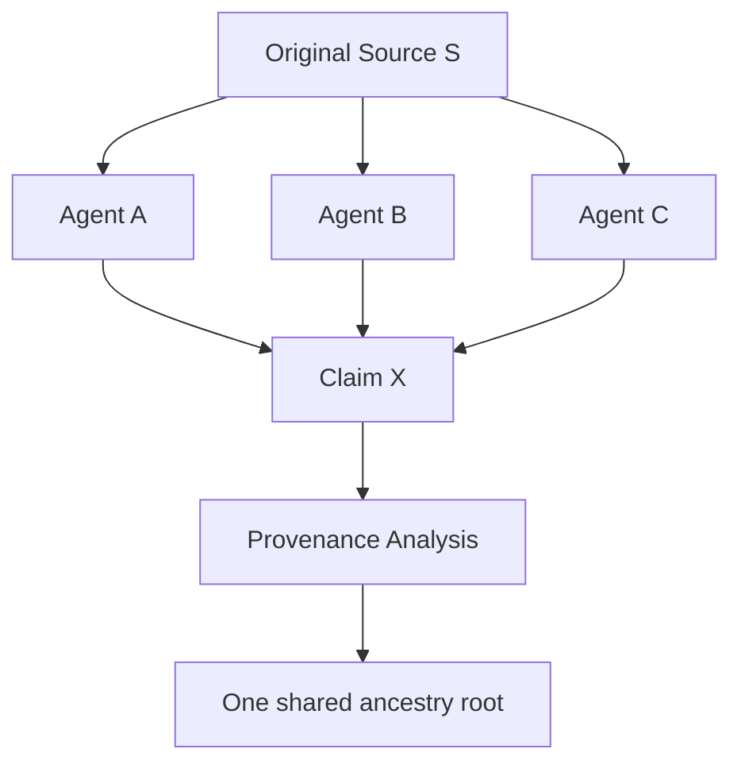

---

# 111. Prohibition 5 — Never Mutate Persistent Memory Directly

This is a major state-management boundary:

```text
Never mutate persistent memory directly.
```

---

# 112. Model Memory Authority

Therefore:

$$
Model
\not\rightarrow
DirectPersistentMemoryMutation
$$

---

# 113. Persistent Memory

The source names persistent memory but does not define:

* store;
* schema;
* persistence mechanism;
* transaction protocol;
* retention policy;
* versioning;
* replication;
* ownership.

All remain gaps.

---

# 114. Read vs Write

The contract distinguishes model cognition from persistent state mutation.

A model may potentially consume admitted memory context while lacking direct write authority.

Thus:

$$
ReadAuthority
\neq
WriteAuthority
$$

---

# 115. Proposed Memory Mutation Flow

A safe derived architecture:

```text
Model
→ typed candidate memory update
→ proof/policy validation
→ transaction manager
→ finalizer
→ persistent memory
```

This is not explicitly spelled out but follows the commit-authority separation.

---

# 116. Memory Candidate

A model should conceptually produce:

```yaml
MemoryMutationProposal:
  operation:
  target:
  proposed_value:
  evidence:
  reason:
```

rather than directly altering persistent state.

PROPOSED.

---

# 117. Persistent Memory ≠ Knowledge Truth

Even committed memory should not automatically be treated as verified truth.

$$
Persistent
\neq
Verified
$$

---

# 118. Storage ≠ Validation

This converges with the previously supplied Learning-Memory-Knowledge governor:

```text
storage ≠ validation
memory ≠ truth
```

The present kernel artifact reinforces that separation by denying direct model mutation.

---

# 119. Memory Feedback Hazard

If model outputs directly mutate memory, then later reasoning may cite its own prior unsupported outputs as evidence.

The prohibition helps prevent recursive self-confirmation.

---

# 120. Recursive Self-Corroboration

Dangerous loop:

```text
Model claim
→ memory write
→ retrieval
→ model sees stored claim
→ interprets as corroboration
→ confidence rises
```

This is invalid without provenance-aware distinction.

---

# 121. Memory Transaction Requirement

The named transaction manager suggests that persistent state changes may be transactionally mediated.

However:

```text
transaction manager exists in architecture
```

does not prove a particular database transaction implementation.

---

# 122. Persistent Memory and RSCF

The previous execution-kernel artifact explicitly mentions atomic RSCF commit.

The present artifact explicitly prohibits direct persistent-memory mutation.

A plausible cross-artifact architecture is:

$$
ModelOutput
\rightarrow
RSCF
\rightarrow
TransactionManager
\rightarrow
PersistentState
$$

Classification:

```text
DERIVED
```

not directly source-stated here.

---

# 123. Prohibition 6 — Never Execute Tools Without Authority Tokens

This is the clearest action-security rule:

```text
Never execute tools without authority tokens.
```

---

# 124. Tool Capability ≠ Tool Authority

$$
ToolAvailable
\neq
ToolAuthorized
$$

---

# 125. Tool Selected ≠ Authority Token Necessarily

The source separately says:

```text
accept kernel's selected tools
```

and:

```text
never execute tools without authority tokens
```

Therefore selection and authority token may be distinct controls.

---

# 126. Two-Key Tool Model

A strong derived interpretation is:

$$
ToolExecutionPermitted
=
ToolSelected
\land
AuthorityTokenValid
$$

This is DERIVED, but strongly supported by the coexistence of both rules.

---

# 127. Authority Token

The source does not define token representation.

Possible forms include:

* capability token;
* signed authorization;
* opaque runtime handle;
* policy grant;
* session-scoped permission;
* kernel-issued execution lease.

All remain implementation hypotheses.

---

# 128. Authority Token ≠ Authentication Token

Do not assume an authority token is:

* OAuth;
* JWT;
* API key;
* bearer token;
* cryptographic capability.

No format is supplied.

---

# 129. Token Scope

A mature implementation should bind authority to:

```text
tool
operation
scope
target
time
budget
side effects
```

This is PROPOSED hardening.

---

# 130. Proposed Authority Token

```yaml
AuthorityToken:
  token_id:
  issued_by:
  subject:
  tool:
  permitted_operations: []
  target_scope:
  budget:
  issued_at:
  expires_at:
```

PROPOSED.

---

# 131. Authority Token Invariant

$$
Action
\subseteq
TokenAuthority
$$

The model should not broaden permission.

---

# 132. Token Expiry

The source does not specify expiry.

Therefore a token's temporal validity is unknown unless separately defined.

---

# 133. Token Delegation

No delegation rules are supplied.

Do not assume a model can pass authority to another agent.

---

# 134. Token Reuse

No reuse semantics are supplied.

Do not assume tokens are reusable, single-use, persistent, or transferable.

---

# 135. Tool Execution Receipt

A robust implementation should emit a receipt containing:

```text
tool
operation
authority
inputs
outputs
side effects
time
```

PROPOSED.

---

# 136. Authority ≠ Safety

An authorized tool action can still be unsafe under changed conditions.

Therefore:

$$
Authorized
\neq
Safe
$$

Policy and final validation may still matter.

---

# 137. Authority ≠ Truth

Tool authorization says nothing about the truth of a tool's output.

---

# 138. Prohibition 7 — Never Claim Distributed Guarantees Not Implemented by Host Runtime

This is a particularly important anti-fabrication boundary.

The source explicitly says:

```text
Never claim distributed guarantees not implemented by the host runtime.
```

---

# 139. Host Runtime Firewall

The AMOS conceptual architecture may contain distributed-systems concepts.

But the model must not imply the actual host runtime implements them unless evidence establishes that.

---

# 140. Conceptual Mechanism ≠ Runtime Mechanism

$$
AMOSConcept
\neq
HostImplementation
$$

unless bound by evidence.

---

# 141. Examples of Distributed Guarantees

Potential distributed guarantees include:

* consensus;
* linearizability;
* serializability;
* Byzantine fault tolerance;
* quorum durability;
* exactly-once delivery;
* distributed atomic commit;
* shard consistency;
* causal consistency;
* epoch finality.

These are general technical examples, **not claims that this artifact names or implements them**.

---

# 142. MVCC/CAS Firewall

AMOS v4.4 reasoning patterns include MVCC/CAS concepts.

The source does not authorize saying:

```text
ChatGPT literally uses AMOS MVCC/CAS
```

without host-runtime evidence.

---

# 143. Atomic RSCF Firewall

Likewise:

```text
AMOS specifies atomic coupled RSCF semantics
```

can be source-grounded from the previous artifact.

But:

```text
the host runtime performs distributed atomic RSCF transactions
```

is unsupported unless implementation evidence exists.

---

# 144. Causal Epoch Firewall

AMOS may reason using causal-epoch finality as a conceptual governance model.

That does not establish literal causal-epoch infrastructure in the host.

---

# 145. Shard Firewall

AMOS may define shard-local finalization patterns.

That does not establish literal runtime sharding.

---

# 146. Byzantine Firewall

Testing or reasoning about Byzantine conditions does not prove Byzantine fault tolerance.

$$
ByzantineTest
\neq
FormalBFTGuarantee
$$

---

# 147. Formal Proof Firewall

Distributed guarantees require the appropriate implementation evidence/formal proof.

Documentation alone remains a source claim.

---

# 148. Host Runtime Is External Boundary

This prohibition establishes a crucial boundary between:

```text
AMOS governance model
```

and:

```text
actual execution substrate
```

---

# 149. Runtime Truthfulness Law

$$
ClaimedGuarantee
\subseteq
ImplementedHostGuarantee
$$

for runtime guarantees.

---

# 150. Unknown Host Guarantee

If implementation evidence is absent:

```text
UNKNOWN/GAP
```

is preferable to architectural projection.

---

# 151. Model ABI as Trust Boundary

The entire artifact can be interpreted as defining a trust boundary:

```text
MODEL SIDE
---------------- ABI ----------------
KERNEL SIDE
```

---

# 152. Model-Side Responsibilities

Source-grounded:

```text
submit
accept selection
read admitted context
return typed outputs
obey gates
obey epistemic classes
preserve competing hypotheses
preserve provenance dependence
avoid direct persistent writes
use authority for tools
speak truthfully about host guarantees
```

---

# 153. Kernel-Side Responsibilities

Explicitly or strongly implied:

```text
select skills
select tools
select budget
admit context
run/produce gates
evaluate proof
evaluate policy
manage transactions
finalize commits
issue/validate authority somehow
```

Not every item is explicitly assigned to the kernel by exact wording; context admission and authority issuance are DERIVED responsibilities.

---

# 154. Separation of Concerns

The architecture separates at least:

```text
cognition
proof
policy
transaction
finality
authority
persistent state
```

---

# 155. Cognition Plane

Model performs cognitive work.

---

# 156. Proof Plane

Proof engine governs epistemic admissibility.

---

# 157. Policy Plane

Policy engine governs policy admissibility.

---

# 158. Transaction Plane

Transaction manager governs state-transition integrity.

---

# 159. Finality Plane

Finalizer determines or participates in final commit state.

---

# 160. Authority Plane

Authority tokens govern tool execution.

---

# 161. Context Plane

Admitted handles govern information access.

---

# 162. Persistence Plane

Persistent memory cannot be directly mutated by the model.

---

# 163. Seven-Boundary Architecture

A derived compression:

$$
AMOSAgentBoundary
=
\{
Cognition,
Context,
Proof,
Policy,
Authority,
Transaction,
Persistence/Finality
\}
$$

This grouping is DERIVED.

---

# 164. Capability Security Interpretation

The combination of:

```text
admitted context handles
authority tokens
no direct persistent mutation
```

resembles capability-based security.

However:

$$
StructuralSimilarity
\neq
ImplementationIdentity
$$

So classify this as:

```text
DERIVED architectural resemblance
```

not source-defined implementation.

---

# 165. Principle of Least Authority

A compatible derived principle is:

> Give the model only the context and action authority required for the admitted task.

The source strongly supports the direction but does not state the formal principle.

---

# 166. Ambient Context Hazard

If a model can read arbitrary available context, task boundaries can leak.

The admitted-handle rule prevents that conceptually.

---

# 167. Ambient Tool Hazard

If tool availability alone grants execution, side effects can escape policy.

The authority-token rule prevents that conceptually.

---

# 168. Ambient Memory Hazard

If the model can directly persist arbitrary conclusions, unsupported beliefs can recursively become system state.

The direct-mutation prohibition prevents that conceptually.

---

# 169. Epistemic Authority Hazard

If the model can relabel its own `MODEL` outputs as `VERIFIED`, proof governance collapses.

The promotion prohibition prevents that.

---

# 170. Consensus Hallucination Hazard

If correlated evidence is counted independently, confidence can inflate without new information.

The correlation prohibition prevents that.

---

# 171. Forced-Convergence Hazard

If competing hypotheses are automatically merged, contradiction disappears without resolution.

The `COMPETING` rule prevents that.

---

# 172. Distributed-Fiction Hazard

If conceptual AMOS architecture is described as literal host behavior, documentation becomes false runtime representation.

The host-runtime rule prevents that.

---

# 173. Integrity Firewall Summary

The seven negative rules correspond to seven failure classes:

| Prohibition                    | Failure prevented        |
| ------------------------------ | ------------------------ |
| bypass FAIL                    | control failure          |
| MODEL→VERIFIED                 | epistemic inflation      |
| merge COMPETING                | contradiction laundering |
| correlated→independent         | provenance inflation     |
| direct memory mutation         | state corruption         |
| unauthorized tools             | authority violation      |
| unsupported distributed claims | runtime fabrication      |

---

# 174. Kernel Integrity Equation

A useful derived equation:

$$
Integrity =
Control
\land
Epistemics
\land
HypothesisDiscipline
\land
Provenance
\land
StateSafety
\land
Authority
\land
RuntimeTruthfulness
$$

---

# 175. Any One Failure Can Be Load-Bearing

The contract is not satisfied merely because six of seven prohibitions are obeyed.

For a relevant operation, one load-bearing violation can invalidate the result/action.

---

# 176. Fail-Closed Philosophy

The architecture strongly favors:

```text
uncertain authority → do not execute
failed proof → do not promote
unresolved hypotheses → preserve competing
unknown host guarantee → do not claim it
```

---

# 177. No Silent Downgrade

The previous execution-kernel artifact adds:

```text
Never silently downgrade a failed gate to a prose caveat.
```

Together these artifacts define a strong fail-closed reasoning discipline.

---

# 178. Cross-Artifact Convergence

## `AGENTS AMOS EXECUTION KERNEL V1`

Defines kernel execution sequence.

## `AGENTS AMOS OS KERNEL`

Defines model-side participation contract.

Therefore a plausible relationship is:

```text
EXECUTION KERNEL V1
= control-plane workflow

AMOS OS KERNEL Agent Contract
= model ABI worker contract
```

Classification:

```text
DERIVED
```

---

# 179. They Are Not Duplicates

The first artifact says:

```text
what the governed task execution pipeline does
```

The second says:

```text
what the model is allowed/required to do inside that architecture
```

---

# 180. Combined Architecture

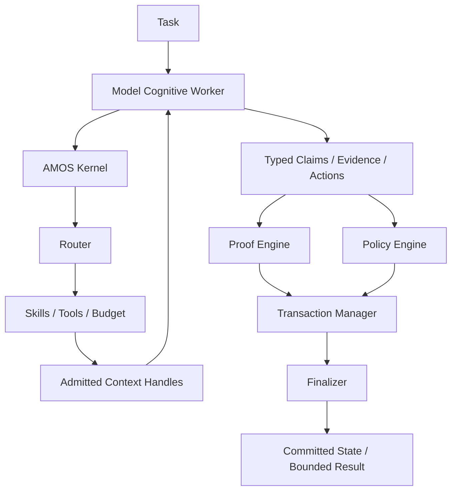

This is a **DERIVED combined model** from the two supplied kernel artifacts.

Exact runtime topology is not established.

---

# 181. Combined Task Flow

$$
Task
\rightarrow
KernelSubmission
\rightarrow
Routing
\rightarrow
AuthorizedExecutionEnvelope
\rightarrow
AdmittedContext
\rightarrow
CognitiveWork
\rightarrow
TypedOutput
\rightarrow
Proof/Policy
\rightarrow
Transaction
\rightarrow
Finality
$$

DERIVED.

---

# 182. Model Is Behind ABI

The phrase:

```text
behind the AMOS Model ABI
```

could imply:

### H1

The model is hidden behind a standardized interface.

### H2

The model operates downstream of the ABI.

### H3

The model is abstracted by the ABI so different models can be substituted.

### H4

“Behind” is informal architecture language.

No exact interface topology is supplied.

---

# 183. Model Substitutability

An ABI often enables implementation substitution.

However, this source does not explicitly say AMOS can swap models.

Therefore:

```text
Model substitutability: plausible MODEL, not source-established
```

---

# 184. Model-Agnostic Kernel Hypothesis

A possible architecture:

$$
Kernel
\rightarrow
ModelABI
\rightarrow
ModelProvider
$$

could make the kernel model-agnostic.

Again:

```text
MODEL
```

not verified source canon.

---

# 185. ABI Stability

No version is provided for the ABI.

Therefore compatibility guarantees are unknown.

---

# 186. Artifact Version Gap

Unlike `AGENTS AMOS EXECUTION KERNEL V1`, this artifact title does not contain an explicit version.

Do not invent:

```text
v1.0.0
```

---

# 187. Updated Date Gap

No:

```text
created
updated
version
status
```

metadata is supplied.

Freshness therefore cannot be computed from the source frontmatter.

---

# 188. Freshness Classification

```text
Temporal validity: UNKNOWN/GAP
```

unless vault/file metadata or authoritative lineage supplies it.

---

# 189. Scope

The source frontmatter states:

```yaml
scope: AMOS_knowledge
```

Therefore the source's RSCF scope is explicitly bounded to:

```text
AMOS_knowledge
```

---

# 190. Scope ≠ Universal Runtime Truth

The document should not automatically be generalized to:

* all AI agents;
* all LLM runtimes;
* all operating systems;
* all distributed systems;
* ChatGPT's literal internal implementation.

---

# 191. Provenance

The source states:

```yaml
provenance: AMOS_corpus
```

This identifies corpus provenance but does not prove empirical implementation.

---

# 192. Provenance ≠ Verification

$$
AMOSCorpusProvenance
\neq
VERIFIED
$$

The source itself says:

```yaml
claim_class: SOURCE_CLAIM
```

---

# 193. Source Self-Classification

The artifact is unusually clear epistemically:

```yaml
state: SOURCE_CLAIM
claim_class: SOURCE_CLAIM
```

Therefore promotion to VERIFIED would directly contradict its supplied metadata absent external validation.

---

# 194. Canon/Knowledge Tag

The tag:

```text
canon/knowledge
```

does not override:

```text
SOURCE_CLAIM
```

A canon organizational tag is not itself a proof class.

---

# 195. Runtime Tag

Likewise:

```text
runtime
```

does not prove runtime implementation.

---

# 196. Core Tag

```text
core
```

indicates classification/importance, not empirical validation.

---

# 197. Kernel Tag

```text
kernel
```

does not mean the text itself is executable kernel code.

---

# 198. Type Document

The frontmatter explicitly says:

```yaml
type: document
```

This is significant.

The artifact is typed as a document, not:

```text
code
binary
executable
runtime_receipt
```

---

# 199. Document ≠ Executable

$$
DocumentedContract
\neq
ExecutableImplementation
$$

---

# 200. Source Path

```yaml
source: 11_KNOWLEDGE/kernel
```

places the artifact within the knowledge/kernel corpus structure.

It does not prove a filesystem path exists in a running host.

---

# 201. Related Links

The source supplies:

```text


```

---

# 202. Related ≠ Dependency

Do not convert:

```text
Related
```

into:

```text
DEPENDS_ON
```

without explicit binding.

---

# 203. MOC

The source supplies:

```text

```

as its MOC.

This supports indexing/navigation.

---

# 204. Proposed Relations

> [!warning] PROPOSED

```yaml
RSCF_RELATIONS:
  - INDEXED_BY: ""
  - RELATED_TO: ""
  - RELATED_TO: ""
  - RELATED_TO: ""
  - RELATED_TO: ""
  - RELATED_TO: ""
```

These relation labels are inferred from the source formatting.

---

# 205. `SYSTEM_SCAN_AGENT` Relationship

A scan agent might plausibly provide system/runtime evidence.

But the link alone does not establish that role in this kernel contract.

---

# 206. `AUTOMATION_PROFILES` Relationship

Automation profiles might plausibly constrain tool/action execution.

Again, the relation is not defined.

---

# 207. `AMOS_SIMULATION_KERNEL_V0_MATH_FOUNDATIONS`

The artifact may provide mathematical foundations relevant to the kernel.

But:

$$
RelatedLink
\neq
FormalDependency
$$

---

# 208. Kernel MOC Role

`` is the strongest explicit organizational parent/index reference.

Do not infer operational parentage unless MOC semantics establish it.

---

# 209. Agent Contract State Machine

A derived state machine:

```text
TASK_RECEIVED
      ↓
SUBMITTED_TO_KERNEL
      ↓
EXECUTION_ENVELOPE_SELECTED
      ↓
CONTEXT_ADMITTED
      ↓
MODEL_COGNITION
      ↓
TYPED_OUTPUT_RETURNED
      ↓
PROOF/POLICY_EVALUATION
      ↓
TRANSACTION_PROCESSING
      ↓
FINALIZATION
      ↓
COMMITTED / BOUNDED
```

---

# 210. Failure Branches

Possible branches:

```text
FAIL
UNKNOWN/GAP
CONDITIONAL
COMPETING
UNAUTHORIZED
```

Only `FAIL`, `MODEL`, `VERIFIED`, and `COMPETING` appear explicitly in this source. `UNKNOWN/GAP` and `CONDITIONAL` are established by the adjacent execution-kernel source; `UNAUTHORIZED` is DERIVED.

---

# 211. Agent State Diagram

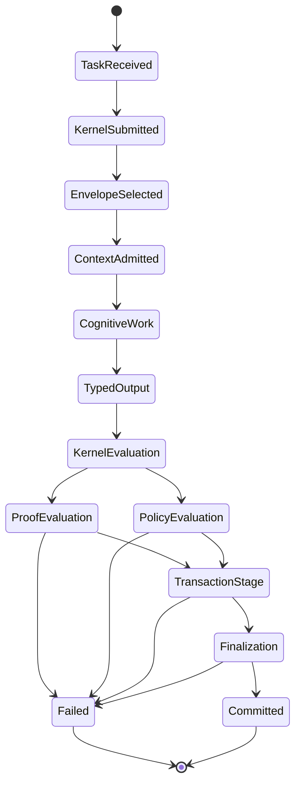

DERIVED topology.

---

# 212. Model ABI Contract — Formal Compression

Let:

* \(T\) = task;
* \(K\) = kernel;
* \(S\) = selected skills;
* \(U\) = selected tools;
* \(B\) = budget;
* \(C\) = admitted context handles;
* \(M\) = model cognitive worker;
* \(O\) = typed outputs;
* \(P\) = proof engine;
* \(Y\) = policy engine;
* \(X\) = transaction manager;
* \(F\) = finalizer.

Then:

$$
T \rightarrow K
$$

$$
K(T)\rightarrow\langle S,U,B,C\rangle
$$

$$
M(T,C;S,U,B)\rightarrow O
$$

where:

$$
O=
Claims
\cup
Evidence
\cup
Actions
$$

and commit admissibility is determined by some unresolved composition:

$$
CommitAllowed
=
\Phi(P,Y,X,F,O)
$$

where \(\Phi\) is **UNKNOWN/GAP**.

---

# 213. Do Not Invent \(\Phi\)

The source does not establish:

$$
\Phi=P\land Y\land X\land F
$$

nor a particular order.

Therefore the exact commit decision function remains unresolved.

---

# 214. Access Equation

$$
ContextRead(M)
\subseteq
AdmittedHandles(K)
$$

DERIVED from source wording.

---

# 215. Tool Equation

A strong derived constraint:

$$
Execute(M,Tool)
\Rightarrow
AuthorityToken(Tool)
$$

---

# 216. Memory Equation

$$
DirectPersistentMutation(M)=Forbidden
$$

This is source-grounded.

---

# 217. Epistemic Promotion Equation

$$
MODEL
\not\xrightarrow{ModelAssertion}
VERIFIED
$$

---

# 218. Competing Hypothesis Equation

$$
COMPETING(H_1,H_2)
+
\neg DiscriminatingEvidence
\Rightarrow
PreserveCOMPETING
$$

---

# 219. Provenance Equation

$$
Correlation(E_1,E_2)
\Rightarrow
\neg AssumeIndependent(E_1,E_2)
$$

---

# 220. Runtime Guarantee Equation

$$
ClaimedDistributedGuarantee
\subseteq
ImplementedHostGuarantees
$$

---

# 221. Gate Equation

$$
Gate=FAIL
\Rightarrow
Bypass=Forbidden
$$

---

# 222. Model Authority Envelope

A derived authority envelope:

$$
Authority_M
=
Cognition
+
TypedProposal
+
AuthorizedToolUse
$$

but not:

$$
DirectCommit
+
DirectPersistentMutation
+
SelfVerification
+
GateOverride
$$

---

# 223. Kernel Authority Envelope

A derived kernel-side envelope includes:

```text
routing
resource selection
context admission
proof governance
policy governance
transaction governance
finality
```

Exact component ownership remains partially unresolved.

---

# 224. Model vs Kernel Matrix

| Function                                |   Model |           Kernel-side authority |
| --------------------------------------- | ------: | ------------------------------: |
| Cognitive analysis                      |     Yes |                      May govern |
| Submit task                             |     Yes |                        Receives |
| Select skills                           | Accepts |        Source assigns selection |
| Select tools                            | Accepts |        Source assigns selection |
| Select budget                           | Accepts |        Source assigns selection |
| Read arbitrary context                  |      No |              Admission required |
| Return typed claims                     |     Yes |                       Evaluates |
| Return evidence                         |     Yes |                       Evaluates |
| Propose actions                         |     Yes |            Evaluates/authorizes |
| Bypass FAIL                             |      No |         No source authorization |
| Self-promote MODEL                      |      No | Validation authority unresolved |
| Merge COMPETING unsupported             |      No |                              No |
| Declare correlated evidence independent |      No |                              No |
| Direct persistent write                 |      No |      Transactional path implied |
| Execute unauthorized tool               |      No |        Token authority required |
| Claim unsupported host guarantees       |      No |                              No |

---

# 225. Proof Engine vs Model

The model may generate an argument.

The proof engine determines admissibility.

Therefore:

$$
ReasoningGeneration
\neq
ProofAdmission
$$

---

# 226. Policy Engine vs Model

The model may identify an action as useful.

The policy engine can still reject it.

Thus:

$$
Useful
\neq
Permitted
$$

---

# 227. Transaction Manager vs Model

The model may propose a state change.

The transaction manager determines transactional processing.

Thus:

$$
ProposedMutation
\neq
CommittedMutation
$$

---

# 228. Finalizer vs Model

The model may generate a candidate result.

Finality remains externally governed.

Thus:

$$
CandidateResult
\neq
FinalResult
$$

---

# 229. Proof ≠ Policy

A claim can be factually supported but policy-disallowed as an action.

Therefore:

$$
ProofPass
\neq
PolicyPass
$$

---

# 230. Policy ≠ Proof

An action can be policy-permitted while based on a false claim.

Therefore:

$$
PolicyPass
\neq
ProofPass
$$

---

# 231. Transaction ≠ Proof

A transaction can execute atomically while containing epistemically wrong data.

$$
TransactionSuccess
\neq
Truth
$$

---

# 232. Finality ≠ Truth

Finalized state is not automatically epistemically verified.

$$
Finalized
\neq
True
$$

unless finalization semantics explicitly include proof status.

---

# 233. Authority ≠ Proof

An authority token allows action; it does not establish factual correctness.

---

# 234. Context Admission ≠ Proof

Admitted context remains evidence requiring appropriate classification.

---

# 235. Complete Type Firewall

```text
CONTEXT
≠
EVIDENCE

EVIDENCE
≠
CLAIM

CLAIM
≠
ACTION

ACTION
≠
AUTHORITY

AUTHORITY
≠
EXECUTION

EXECUTION
≠
COMMIT

COMMIT
≠
VERIFICATION
```

This is a highly useful DERIVED kernel invariant.

---

# 236. Epistemic Type Firewall

```text
SOURCE_CLAIM
≠
OBSERVATION
≠
DERIVED
≠
MODEL
≠
DECISION
≠
UNKNOWN
```

No execution stage should erase these distinctions.

---

# 237. Conclusion Classes

Within the broader current AMOS lineage:

```text
VERIFIED
DERIVED
MODEL
CONDITIONAL
COMPETING
UNKNOWN/GAP
```

The present artifact explicitly references:

```text
MODEL
VERIFIED
COMPETING
```

---

# 238. MODEL Ceiling

A MODEL may be useful, internally coherent, predictive, elegant, or source-canonical while remaining MODEL.

---

# 239. VERIFIED Scope

A VERIFIED conclusion must remain bounded to the scope in which verification applies.

---

# 240. COMPETING Preservation

COMPETING is not a failure of reasoning.

It is sometimes the correct result.

---

# 241. UNKNOWN/GAP Preservation

The adjacent execution-kernel artifact establishes UNKNOWN/GAP as an appropriate gate-failure result.

This complements the present artifact's non-fabrication constraints.

---

# 242. CONDITIONAL Preservation

Likewise, a result dependent on an unresolved premise should remain conditional.

---

# 243. Proof Capsule — Model Role

```yaml
claim:
  statement: >
    The model is defined as a cognitive worker behind
    the AMOS Model ABI.
  class: SOURCE_CLAIM

evidence:
  - supplied source sentence

scope:
  AGENTS AMOS OS KERNEL

does_not_establish:
  - literal host runtime implementation
  - exact ABI protocol
  - model provider topology
```

---

# 244. Proof Capsule — Context Admission

```yaml
claim:
  statement: >
    For nontrivial tasks, the model may read only
    admitted context handles.
  class: SOURCE_CLAIM

evidence:
  - source rule 3

unknowns:
  - handle schema
  - admission authority
  - expiry
  - scope semantics
  - revocation
```

---

# 245. Proof Capsule — Typed Outputs

```yaml
claim:
  statement: >
    The model returns typed claims, evidence, and actions
    rather than free-form hidden state.
  class: SOURCE_CLAIM

evidence:
  - source rule 4

unknowns:
  - exact type schemas
  - serialization
  - validation rules
```

---

# 246. Proof Capsule — Commit Separation

```yaml
claim:
  statement: >
    The model does not unilaterally decide what may be committed;
    proof, policy, transaction, and finalization components
    participate in that decision.
  class: DERIVED

premises:
  - source rule 5

confidence_ceiling:
  >
    Strong for authority separation; exact topology/order
    remains unknown.
```

---

# 247. Proof Capsule — FAIL

```yaml
claim:
  statement: >
    The model may never bypass a FAIL gate.
  class: SOURCE_CLAIM

evidence:
  - explicit prohibition

scope:
  AMOS OS Agent Contract
```

---

# 248. Proof Capsule — MODEL Promotion

```yaml
claim:
  statement: >
    The model may not promote MODEL to VERIFIED.
  class: SOURCE_CLAIM

evidence:
  - explicit prohibition

does_not_mean:
  - models can never be externally verified
```

---

# 249. Proof Capsule — COMPETING

```yaml
claim:
  statement: >
    COMPETING hypotheses may not be merged without
    discriminating evidence.
  class: SOURCE_CLAIM

evidence:
  - explicit prohibition
```

---

# 250. Proof Capsule — Correlated Evidence

```yaml
claim:
  statement: >
    Correlated evidence must not be treated as independent.
  class: SOURCE_CLAIM

evidence:
  - explicit prohibition

implication:
  provenance_topology_is_decision_relevant
```

---

# 251. Proof Capsule — Persistent Memory

```yaml
claim:
  statement: >
    The model may not directly mutate persistent memory.
  class: SOURCE_CLAIM

evidence:
  - explicit prohibition

unknown:
  authorized_memory_mutation_protocol
```

---

# 252. Proof Capsule — Authority Tokens

```yaml
claim:
  statement: >
    Tool execution requires authority tokens.
  class: SOURCE_CLAIM

evidence:
  - explicit prohibition

unknowns:
  - token format
  - issuer
  - verifier
  - scope
  - expiry
  - delegation
```

---

# 253. Proof Capsule — Distributed Guarantees

```yaml
claim:
  statement: >
    The model must not claim distributed guarantees
    absent implementation by the host runtime.
  class: SOURCE_CLAIM

evidence:
  - explicit prohibition

implication:
  >
    AMOS conceptual distributed mechanisms cannot be
    represented as literal host capabilities without
    implementation evidence.
```

---

# 254. Critical Gap Register

## CRITICAL

```text
AMOS Model ABI exact specification
Kernel implementation binding
Proof engine specification
Policy engine specification
Transaction manager semantics
Finalizer semantics
Authority-token protocol
Persistent-memory mutation protocol
```

---

# 255. Decision-Relevant Gaps

```text
nontrivial-task classification
skill selection schema
tool selection schema
budget dimensions
context-handle schema
context-admission authority
typed claim schema
typed evidence schema
typed action schema
FAIL recovery semantics
MODEL→VERIFIED validation path
COMPETING discrimination standard
provenance independence algorithm
```

---

# 256. Explanatory Gaps

```text
ABI acronym intended semantics
component ordering
finalizer role
whether model ABI is provider-neutral
relationship to TaskSpec
relationship to RSCF
relationship to SYSTEM_SCAN_AGENT
relationship to AUTOMATION_PROFILES
```

---

# 257. Cosmetic Gaps

No material mathematical corruption appears in the supplied source.

Escaped underscores and hyphens are transmission formatting only.

---

# 258. Competing Hypothesis — ABI

### H1

Literal application binary interface.

### H2

Abstract runtime/model contract.

### H3

Serialization/protocol boundary.

### H4

Provider-neutral adapter interface.

Status:

```text
COMPETING
```

---

# 259. Competing Hypothesis — Budget

### H1

Compute budget.

### H2

Token budget.

### H3

Tool/action budget.

### H4

Composite resource budget.

### H5

Risk/governance budget.

Status:

```text
UNKNOWN/GAP
```

No candidate has sufficient discriminating support.

---

# 260. Competing Hypothesis — Context Handles

### H1

Opaque capability references.

### H2

Document/resource IDs.

### H3

RSCF/proof-capsule handles.

### H4

Memory handles.

### H5

Generic runtime references.

Status:

```text
COMPETING
```

---

# 261. Competing Hypothesis — Commit Topology

### H1

```text
Proof → Policy → Transaction → Finalizer
```

### H2

```text
Proof ∥ Policy → Transaction → Finalizer
```

### H3

Joint multi-component gate.

### H4

Lifecycle-specific independent checks.

Status:

```text
COMPETING
```

---

# 262. Competing Hypothesis — Authority Issuer

The source requires authority tokens but does not identify issuer.

Candidates:

```text
kernel
policy engine
tool manager
host runtime
external authority service
```

Status:

```text
UNKNOWN/GAP
```

---

# 263. Competing Hypothesis — Persistent Memory Owner

Candidates:

```text
transaction manager
finalizer
memory service
kernel
external host store
```

No source discrimination.

---

# 264. Competing Hypothesis — Finalizer

The finalizer might:

* finalize transactions;
* finalize RSCFs;
* finalize user-visible output;
* finalize causal epochs;
* finalize persistent memory.

None is established here.

---

# 265. Cross-Artifact Binding — Atomic RSCF

The previous artifact says:

```text
Commit resulting RSCFs atomically where coupled.
```

The current artifact says:

```text
let ... transaction manager ... decide what may be committed
```

Strong DERIVED correspondence:

$$
TransactionManager
\leftrightarrow
AtomicCoupledRSCFCommit
$$

But identity remains unverified without an explicit binding.

---

# 266. Cross-Artifact Binding — Final Gates

Previous artifact:

```text
Run final integrity/adversarial gates.
```

Current artifact:

```text
proof engine, policy engine, transaction manager, finalizer
decide what may be committed
```

Possible relation:

```text
final integrity/adversarial gates
may be implemented across proof/policy/finalizer components
```

Classification:

```text
MODEL / DERIVED
```

---

# 267. Cross-Artifact Binding — Router

Previous artifact explicitly names router.

Current artifact says:

```text
submit task to kernel
accept kernel's selected skills/tools/budget
```

This is consistent with router-mediated selection.

But the current source does not explicitly mention router.

---

# 268. Cross-Artifact Binding — TaskSpec

Previous artifact requires:

```text
TaskSpec
```

Current artifact requires:

```text
submit the task to the kernel
```

Possible integration:

$$
Model
\rightarrow
TaskSpec
\rightarrow
Kernel
$$

but not directly established here.

---

# 269. Cross-Artifact Binding — Typed Results

Previous artifact requires:

```text
final bounded result
```

Current artifact requires:

```text
typed claims/evidence/actions
```

Thus a likely architecture is:

```text
typed worker outputs
→ kernel validation
→ bounded final result
```

Classification:

```text
DERIVED
```

---

# 270. Cross-Artifact Binding — FAIL

The two artifacts strongly converge:

```text
OS Kernel:
Never bypass a FAIL gate.

Execution Kernel V1:
Never silently downgrade a failed gate to a prose caveat.
```

Combined invariant:

$$
\boxed{
FAIL
\Rightarrow
VisibleExecutionOrEpistemicConsequence
}
$$

---

# 271. Cross-Artifact Binding — COMPETING

Current artifact explicitly forbids unsupported merging.

Execution-kernel artifact explicitly permits `COMPETING` as a bounded result.

Together:

$$
NoDiscriminator
\Rightarrow
Return/Preserve\ COMPETING
$$

---

# 272. Cross-Artifact Binding — UNKNOWN/GAP

If context/authority/proof required for a conclusion is absent, the previous kernel contract supplies `UNKNOWN/GAP` as the appropriate bounded result class.

---

# 273. Cross-Artifact Binding — Atomicity

The current transaction-manager boundary provides an architectural location where the previous artifact's atomic RSCF rule could be enforced.

This is a strong structural correspondence, not proof of implementation.

---

# 274. Cross-Artifact Combined Kernel

A source-aware conceptual stack:

```text
AMOS OS AGENT CONTRACT
        ↓
Model ABI worker boundary
        ↓
AMOS EXECUTION KERNEL
        ↓
TaskSpec / Router
        ↓
Skills / Tools / Budget
        ↓
Admitted Context
        ↓
Typed Cognitive Outputs
        ↓
Proof + Policy
        ↓
Transaction
        ↓
Finalization
        ↓
Bounded Result / Persistent State
```

DERIVED.

---

# 275. Relation to RSCF

The current body does not explicitly mention RSCF.

Its frontmatter does:

```yaml
rscf:
  state: SOURCE_CLAIM
```

Therefore do not infer that every typed claim is automatically an RSCF.

---

# 276. Typed Claim ≠ RSCF

$$
TypedClaim
\neq
RSCF
$$

unless a compiler/binding transforms it.

---

# 277. Evidence ≠ RSCF

Likewise:

$$
TypedEvidence
\neq
RSCF
$$

---

# 278. Action ≠ RSCF

$$
TypedAction
\neq
RSCF
$$

---

# 279. Candidate RSCF Compilation

A plausible later pipeline is:

```text
Typed outputs
→ proof validation
→ RSCF construction
→ transaction
→ finalization
```

but this remains MODEL until a binding artifact confirms it.

---

# 280. ULK × RSCF Correspondence

Previously supplied `ULK_X_RSCF` says ALU transformations generate verifiable RSCF proof capsules.

That could provide a proof-engine implementation pathway.

But there is no explicit binding here.

Therefore:

```text
possible architectural correspondence
not identity
```

---

# 281. Proof Capsule vs Hidden State

The current requirement to return typed outputs instead of hidden state aligns strongly with RSCF proof-capsule philosophy.

A proof capsule can expose:

```text
claim
premises
evidence
provenance
scope
receipt
```

without exposing hidden chain-of-thought.

---

# 282. H/M/L Compatibility

The previously supplied ULK × RSCF specification defines:

```text
H(Intent)
M(ProofSteps)
L(Receipt)
```

The present source does not mention H/M/L.

Therefore no direct mapping should be asserted.

---

# 283. Potential Mapping

A possible model:

```text
Task submission → H(Intent)
Typed proof structures → M(ProofSteps)
Finalized transaction receipt → L(Receipt)
```

is structurally attractive but remains:

```text
MODEL
```

without binding evidence.

---

# 284. Security Boundary Summary

The contract creates three strong capability boundaries:

### Information capability

```text
admitted context handles
```

### Action capability

```text
authority tokens
```

### State capability

```text
no direct persistent mutation
```

---

# 285. Epistemic Boundary Summary

It creates three strong epistemic boundaries:

```text
MODEL != VERIFIED
COMPETING != RESOLVED
CORRELATED != INDEPENDENT
```

---

# 286. Runtime Boundary Summary

It creates one explicit runtime-truth boundary:

```text
conceptual distributed guarantee
!=
implemented host guarantee
```

---

# 287. Gate Boundary Summary

It creates one explicit control boundary:

```text
FAIL != BYPASSABLE
```

---

# 288. Complete Kernel Firewall

$$
\boxed{
Firewall =
FAIL
+
EpistemicClass
+
HypothesisState
+
Provenance
+
MemoryAuthority
+
ToolAuthority
+
RuntimeTruth
}
$$

DERIVED compression.

---

# 289. Adversarial Validation — Attack 1

### Attack

Model produces a highly coherent theory labeled MODEL.

Then relabels it VERIFIED because all internal checks agree.

### Result

**REJECT.**

Violates:

```text
never promote MODEL to VERIFIED
```

unless independent verification legitimately changes class through the governed path.

---

# 290. Attack 2

### Attack

Five agents all repeat a conclusion derived from one source.

System reports:

```text
5 independent confirmations
```

### Result

**REJECT.**

Violates correlated-evidence rule.

---

# 291. Attack 3

### Attack

Two incompatible hypotheses exist.

Model produces a hybrid answer to avoid uncertainty.

### Result

**REJECT** unless discriminating evidence supports the hybrid.

Preserve:

```text
COMPETING
```

---

# 292. Attack 4

### Attack

Model discovers a useful fact and writes it directly to persistent memory.

### Result

**REJECT.**

Persistent mutation must follow governed commit architecture.

---

# 293. Attack 5

### Attack

Tool exists and is technically callable.

No authority token exists.

Model calls it anyway because the action is low-risk.

### Result

**REJECT.**

The source has no low-risk exception.

---

# 294. Attack 6

### Attack

AMOS conceptual design includes atomic multi-RSCF semantics.

Model claims:

```text
The host runtime guarantees distributed serializable atomic commits.
```

### Result

**REJECT** absent host implementation evidence.

---

# 295. Attack 7

### Attack

Kernel returns `FAIL`.

Model decides the gate is overly conservative and continues.

### Result

**REJECT.**

Direct violation.

---

# 296. Attack 8

### Attack

Model reads a context resource because it is visible in the environment, even though it was not admitted.

### Result

**REJECT** under the source contract.

Visibility does not establish admission.

---

# 297. Attack 9

### Attack

Kernel selects a constrained budget.

Model silently expands search/tool use.

### Result

**REJECT** under the acceptance rule.

---

# 298. Attack 10

### Attack

Model emits free-form internal hidden state as the kernel interface result.

### Result

**REJECT.**

The contract requires typed claims/evidence/actions.

---

# 299. Positive Test 1 — MODEL Preservation

Input:

```text
A conceptual hypothesis with no empirical validation.
```

Expected:

```yaml
claim_class: MODEL
```

not VERIFIED.

---

# 300. Positive Test 2 — COMPETING Preservation

Input:

```text
H1 and H2 both supported,
no discriminator.
```

Expected:

```yaml
claim_class: COMPETING
hypotheses:
  - H1
  - H2
```

---

# 301. Positive Test 3 — Correlated Evidence

Input:

```text
E1, E2, E3 share one ancestry root.
```

Expected:

```text
independent_roots = 1
```

or equivalent provenance-aware representation.

Exact metric is proposed.

---

# 302. Positive Test 4 — Unauthorized Tool

Input:

```text
tool selected
authority token absent
```

Expected:

```text
DO NOT EXECUTE
```

---

# 303. Positive Test 5 — Memory Update

Input:

```text
model derives useful new knowledge
```

Expected conceptual behavior:

```text
propose typed mutation
→ kernel governance
```

not direct persistence.

---

# 304. Positive Test 6 — Host Guarantee

Input:

```text
AMOS source describes distributed finality,
host implementation unknown.
```

Expected:

```text
AMOS MODEL / SOURCE_CLAIM
host guarantee UNKNOWN/GAP
```

---

# 305. Positive Test 7 — FAIL

Input:

```text
required gate = FAIL
```

Expected:

```text
block governed path
```

not caveat-and-continue.

---

# 306. Positive Test 8 — Context Admission

Input:

```text
handles A and B admitted
handle C visible but not admitted
```

Expected:

```text
read A
read B
do not read C
```

---

# 307. Positive Test 9 — Typed Output

Expected model output conceptually:

```yaml
claims: []
evidence: []
actions: []
```

rather than untyped hidden-state dump.

---

# 308. Positive Test 10 — Kernel Budget

Kernel authorizes:

```text
budget = B
```

Expected:

$$
ExecutionCost
\le
B
$$

under whatever budget dimensions the runtime defines.

---

# 309. Boundary Test — Authority Token Exists but Tool Not Selected

The source requires both accepting selected tools and having authority tokens.

Does a valid authority token override kernel non-selection?

Not specified.

Safest derived interpretation:

```text
do not execute without both admission/selection and authority
```

but this remains DERIVED.

---

# 310. Boundary Test — Tool Selected but Token Expired

Expiry semantics are not supplied.

If runtime defines expiry, an expired token should not count as authority.

This is general security reasoning, not source-specific canon.

---

# 311. Boundary Test — MODEL Has New Independent Evidence

The source prohibits the model from promoting MODEL to VERIFIED.

Question:

Can it return the new evidence and let the proof engine decide?

Strongest safe interpretation:

```text
YES as a typed candidate,
promotion authority remains kernel-side.
```

This is DERIVED from role separation.

---

# 312. Boundary Test — COMPETING Becomes Resolved

If genuinely discriminating evidence appears:

```text
COMPETING
→ discriminated conclusion
```

becomes permissible.

The source explicitly conditions the prohibition on absence of discriminating evidence.

---

# 313. Boundary Test — Correlated but Partially Independent Evidence

Evidence can have mixed ancestry.

A binary independent/correlated flag may be insufficient.

A mature provenance topology should represent partial overlap.

This is v4.4-derived.

---

# 314. Boundary Test — Persistent Memory Rollback

The source prohibits direct mutation but says nothing about rollback.

Transaction/finalizer definitions are needed.

---

# 315. Boundary Test — Host Runtime Partially Implements Guarantee

If host implements only local atomicity, the model must not claim distributed atomicity.

Therefore guarantees should be typed by scope.

---

# 316. Runtime Guarantee Scope

A useful representation:

```yaml
Guarantee:
  property:
  scope:
    - local
    - process
    - host
    - distributed
  evidence:
  implementation:
```

PROPOSED.

---

# 317. Local ≠ Distributed

$$
LocalAtomicity
\neq
DistributedAtomicity
$$

---

# 318. Single-Process ≠ Multi-Node

$$
SingleProcessSafety
\neq
MultiNodeSafety
$$

---

# 319. Simulation ≠ Implementation

$$
SimulatedDistributedBehavior
\neq
DistributedRuntimeGuarantee
$$

---

# 320. Test Pass ≠ Formal Guarantee

$$
PassingTests
\neq
UniversalFormalProof
$$

---

# 321. Documentation ≠ Runtime Receipt

$$
DocumentationClaim
\neq
ObservedRuntimeBehavior
$$

---

# 322. Runtime Receipt ≠ Universal Guarantee

Even observed successful execution establishes only that observation's scope.

---

# 323. Host Binding Requirement

To claim literal runtime mechanisms, evidence should identify:

```text
host
version
implementation
configuration
scope
test/proof
```

as relevant.

This is PROPOSED evidence discipline.

---

# 324. Transaction Manager Firewall

The phrase:

```text
transaction manager
```

must not be inflated into a claim of:

```text
ACID database transaction manager
```

unless source binding establishes that.

---

# 325. Finalizer Firewall

The phrase:

```text
finalizer
```

must not be inflated into:

```text
distributed consensus finalizer
```

without evidence.

---

# 326. Proof Engine Firewall

The phrase:

```text
proof engine
```

must not automatically be interpreted as:

```text
formal theorem prover
```

unless specified.

---

# 327. Policy Engine Firewall

The phrase:

```text
policy engine
```

does not identify a particular policy language, safety system, or governance implementation.

---

# 328. Authority Token Firewall

The phrase:

```text
authority token
```

does not prove cryptographic signing.

---

# 329. Context Handle Firewall

The phrase:

```text
context handle
```

does not prove capability-security implementation.

---

# 330. ABI Firewall

The phrase:

```text
Model ABI
```

does not prove binary-level ABI semantics.

---

# 331. Cognitive Worker Firewall

The phrase:

```text
cognitive worker
```

does not imply consciousness, personhood, biological cognition, or independent agency.

It is an architectural role.

---

# 332. Worker ≠ Autonomous Authority

$$
Worker
\neq
SovereignController
$$

The rest of the source strongly reinforces this.

---

# 333. Model ≠ Kernel

$$
\boxed{
Model
\neq
Kernel
}
$$

This is one of the strongest architectural conclusions.

---

# 334. Model ≠ Proof Engine

$$
Model
\neq
ProofEngine
$$

---

# 335. Model ≠ Policy Engine

$$
Model
\neq
PolicyEngine
$$

---

# 336. Model ≠ Transaction Manager

$$
Model
\neq
TransactionManager
$$

---

# 337. Model ≠ Finalizer

$$
Model
\neq
Finalizer
$$

---

# 338. Model ≠ Persistent Memory

$$
Model
\neq
PersistentMemory
$$

---

# 339. Model ≠ Tool Authority

$$
Model
\neq
AuthorityIssuer
$$

The last equation is DERIVED; the source only denies unauthorized execution and does not identify issuer.

---

# 340. Model Output ≠ Commit

$$
\boxed{
ModelOutput
\neq
Commit
}
$$

---

# 341. Kernel Architecture as Zero-Trust-Like Model

The contract resembles a zero-trust architecture:

```text
do not trust ambient context
do not trust ambient tools
do not trust model self-verification
do not trust evidence multiplicity without ancestry
do not trust state mutation without transaction governance
```

But “zero trust” is not source terminology.

Classification:

```text
DERIVED ANALOGY
```

---

# 342. Analogy Firewall

Do not convert:

```text
resembles zero-trust
```

into:

```text
implements Zero Trust Architecture standard X
```

---

# 343. Capability-Based Analogy

Likewise:

```text
context handles + authority tokens
```

resembles capability-based security.

It does not prove a formal capability system.

---

# 344. Database Analogy

Transaction manager + persistent memory resembles database architecture.

It does not prove a database exists.

---

# 345. Compiler Analogy

Typed outputs + ABI resemble compiler/interface architecture.

It does not prove a compiler exists at this boundary.

---

# 346. Operating-System Analogy

Kernel/worker/authority language resembles operating-system privilege separation.

It does not prove AMOS is a literal operating-system kernel.

---

# 347. OS Naming Firewall

`AMOS OS` is canonical source terminology.

It should be preserved.

But:

$$
NameContains(OS)
\not\Rightarrow
ConventionalOperatingSystemImplementation
$$

---

# 348. Kernel Naming Firewall

Likewise:

$$
NameContains(Kernel)
\not\Rightarrow
CPUPrivilegeKernel
$$

---

# 349. ABI Naming Firewall

$$
NameContains(ABI)
\not\Rightarrow
NativeBinaryCallingConvention
$$

---

# 350. Proof Naming Firewall

$$
NameContains(Proof)
\not\Rightarrow
FormalMathematicalProof
$$

---

# 351. Transaction Naming Firewall

$$
NameContains(Transaction)
\not\Rightarrow
ACID
$$

---

# 352. Finality Naming Firewall

$$
NameContains(Finalizer)
\not\Rightarrow
DistributedConsensusFinality
$$

---

# 353. Authority Naming Firewall

$$
AuthorityToken
\not\Rightarrow
CryptographicToken
$$

---

# 354. Source vs Derived Separation

The source directly establishes:

```text
model role
five positive obligations
seven prohibitions
four commit-side components
related links
MOC
SOURCE_CLAIM provenance/scope
```

Everything beyond that must remain explicitly DERIVED, MODEL, PROPOSED, COMPETING, or UNKNOWN/GAP.

---

# 355. No Empirical Claim

The artifact does not contain empirical measurements.

Therefore there is no basis here for claims such as:

```text
this architecture improves accuracy by X%
this kernel reduces hallucinations by Y%
authority tokens prevent all unauthorized actions
transaction manager guarantees consistency
```

---

# 356. No Performance Claim

No latency, throughput, cost, benchmark, or resource figures are supplied.

---

# 357. No Security Proof

The source provides security-oriented rules but no formal security proof.

---

# 358. No Formal Correctness Proof

The contract is architectural prose, not a proof that all executions satisfy the invariants.

---

# 359. No Host Verification

No host runtime receipts are supplied.

---

# 360. No Distributed Verification

No distributed test or formal distributed proof is supplied.

---

# 361. No Persistence Verification

No persistent store implementation is supplied.

---

# 362. No Tool Authority Implementation

No token issuance/verification implementation is supplied.

---

# 363. No ABI Conformance Test

No ABI test suite is supplied.

---

# 364. No Context Admission Implementation

No context admission algorithm is supplied.

---

# 365. No Proof Engine Implementation

No proof engine code/spec is supplied.

---

# 366. No Policy Engine Implementation

No policy engine code/spec is supplied.

---

# 367. No Transaction Implementation

No transaction-manager implementation is supplied.

---

# 368. No Finalizer Implementation

No finalizer implementation is supplied.

---

# 369. Minimum Executable Binding Set

To turn this source contract into a verifiable runtime specification, the minimum high-value dependencies are:

```text
AMOS Model ABI specification
Kernel submission interface
Skill/tool/budget selection contract
Context admission contract
Typed Claim schema
Typed Evidence schema
Typed Action schema
Gate schema
Proof engine contract
Policy engine contract
Transaction manager contract
Finalizer contract
Persistent memory API
Authority token contract
Host runtime capability declaration
```

---

# 370. Retrieval Priority

Recommended fractal retrieval:

```text
H — AMOS OS Kernel
↓
M — Model ABI / Proof / Policy / Transaction / Finalizer
↓
L — exact interfaces, schemas, gates, tokens
↓
raw executable implementation and receipts only where needed
```

---

# 371. Cheapest Critical Retrieval

The single most valuable missing artifact is likely:

```text
AMOS Model ABI specification
```

because it could discriminate:

* task submission;
* context handles;
* typed outputs;
* authority interface;
* worker/kernel boundary.

---

# 372. Second Retrieval Priority

```text
Transaction Manager / Finalizer contract
```

would resolve:

* commit semantics;
* persistent-memory mutation;
* atomicity;
* finality;
* rollback.

---

# 373. Third Retrieval Priority

```text
Authority Token contract
```

would resolve tool-action authority.

---

# 374. Fourth Retrieval Priority

```text
Proof Engine contract
```

would resolve epistemic promotion and proof gates.

---

# 375. Fifth Retrieval Priority

```text
Policy Engine contract
```

would resolve action/policy admissibility.

---

# 376. Machine-Readable Source Model

> [!warning] DERIVED REPRESENTATION
> This is a faithful machine-oriented representation of the prose contract, not recovered original JSON/YAML.

```yaml
AMOS_OS_AGENT_CONTRACT:

  source_metadata:
    title: AGENTS AMOS OS KERNEL
    type: document
    source: 11_KNOWLEDGE/kernel

    rscf:
      state: SOURCE_CLAIM
      claim_class: SOURCE_CLAIM
      provenance: AMOS_corpus
      scope: AMOS_knowledge

  model_role:
    type: cognitive_worker
    boundary: AMOS_Model_ABI

  applies_to:
    task_class: nontrivial

  obligations:

    - id: submit_to_kernel
      requirement: REQUIRED

    - id: accept_kernel_selection
      requirement: REQUIRED
      selected_resources:
        - skills
        - tools
        - budget

    - id: admitted_context_only
      requirement: REQUIRED

    - id: typed_outputs
      requirement: REQUIRED
      output_types:
        - claims
        - evidence
        - actions

    - id: external_commit_authority
      requirement: REQUIRED
      components:
        - proof_engine
        - policy_engine
        - transaction_manager
        - finalizer

  prohibitions:

    - bypass_FAIL_gate
    - promote_MODEL_to_VERIFIED
    - merge_COMPETING_without_discriminating_evidence
    - treat_correlated_evidence_as_independent
    - directly_mutate_persistent_memory
    - execute_tools_without_authority_tokens
    - claim_unimplemented_distributed_host_guarantees
```

---

# 377. Proposed ABI Request

```yaml
ModelABIRequest:
  task_handle:
  admitted_context_handles: []

  selected:
    skills: []
    tools: []
    budget: {}

  authority_tokens: []
```

PROPOSED.

---

# 378. Proposed ABI Response

```yaml
ModelABIResponse:
  claims: []
  evidence: []
  actions: []

  unresolved:
    - UNKNOWN/GAP

  competing_hypotheses: []

  requested_additional_context: []
  requested_authority: []
```

PROPOSED.

---

# 379. Why `requested_authority` Is Proposed

The source says the model must not execute without authority.

It does not explicitly say the model may request authority.

Therefore this field is a design proposal only.

---

# 380. Why `requested_additional_context` Is Proposed

Likewise, the source says only admitted handles may be read.

It does not define how additional context admission is requested.

---

# 381. Proposed Claim Type

```yaml
TypedClaim:
  id:
  class:
  statement:

  evidence_refs: []
  provenance_refs: []

  scope:
  regime:
  temporal_validity:

  dependencies: []
  competing_claims: []

  falsifiers: []
  invalidation_conditions: []

  confidence_ceiling:
```

---

# 382. Proposed Evidence Type

```yaml
TypedEvidence:
  id:
  type:
  source:
  ancestry: []

  observation_or_content:
  scope:
  regime:
  timestamp:
  freshness:

  correlation_group:
```

---

# 383. Proposed Action Type

```yaml
TypedAction:
  id:
  action:
  target:

  authority_required:
  authority_token_ref:

  reversible:
  estimated_impact:

  supporting_claim_refs: []
```

---

# 384. Proposed FAIL Type

```yaml
GateResult:
  gate:
  status:
    - PASS
    - FAIL

  reason:
  evidence_refs: []

  repairable:
  required_change:
```

Only PASS/FAIL naming is partly inferred; source explicitly names FAIL only.

---

# 385. Proposed Commit Candidate

```yaml
CommitCandidate:
  claims: []
  evidence: []
  actions: []
  memory_mutations: []

  proof_status:
  policy_status:
  transaction_status:
  finalizer_status:
```

PROPOSED.

---

# 386. Atomicity Extension

From the adjacent execution-kernel artifact:

```text
coupled RSCFs
→ atomic commit
```

A proposed transaction manager invariant is:

$$
Coupled(C_1,\dots,C_n)
\Rightarrow
CommitAll
\lor
CommitNone
$$

---

# 387. Atomicity ≠ Distributed Atomicity

Even if the transaction manager implements atomic local state transition:

$$
LocalAtomic
\not\Rightarrow
DistributedAtomic
$$

This is directly relevant to the source's host-runtime prohibition.

---

# 388. Host Runtime Capability Manifest — Proposed

A strong anti-fabrication mechanism would expose:

```yaml
HostRuntimeCapabilities:
  persistent_memory:
    implemented: false

  atomic_local_commit:
    implemented: false

  distributed_commit:
    implemented: false

  mvcc:
    implemented: false

  cas:
    implemented: false

  shard_finality:
    implemented: false

  byzantine_tolerance:
    implemented: false
```

Values above are illustrative placeholders, **not claims about the actual host**.

---

# 389. Why Capability Manifest Matters

Then the model could enforce:

$$
Claim(RuntimeGuarantee)
\Rightarrow
Manifest(Guarantee)=Implemented
$$

This is PROPOSED.

---

# 390. Proof Engine Input — Proposed

```yaml
ProofEngineInput:
  claims: []
  evidence: []
  provenance_graph:
  scope:
  regime:
```

---

# 391. Proof Engine Output — Proposed

```yaml
ProofEngineResult:
  admitted_claims: []
  rejected_claims: []
  conditional_claims: []
  competing_sets: []
  unresolved_gaps: []
```

---

# 392. Policy Engine Input — Proposed

```yaml
PolicyEngineInput:
  claims: []
  actions: []
  authority_tokens: []
  caller_scope:
```

---

# 393. Policy Engine Output — Proposed

```yaml
PolicyEngineResult:
  permitted_actions: []
  blocked_actions: []
  conditions: []
```

---

# 394. Transaction Manager Input — Proposed

```yaml
TransactionRequest:
  state_changes: []
  coupled_groups: []
  expected_versions: {}
```

---

# 395. Transaction Manager Output — Proposed

```yaml
TransactionResult:
  status:
    - COMMITTED
    - ABORTED
    - CONFLICT

  committed_changes: []
  receipt:
```

---

# 396. Finalizer Input — Proposed

```yaml
FinalizerInput:
  proof_result:
  policy_result:
  transaction_result:
  candidate_output:
```

---

# 397. Finalizer Output — Proposed

```yaml
FinalizedResult:
  conclusion_class:
  committed_state_refs: []
  bounded_output:
  invalidation_conditions: []
```

---

# 398. No Canonical Component Order Yet

All proposed component schemas above are useful implementation scaffolding.

None should be mistaken for recovered AMOS source canon.

---

# 399. Obsidian Atomic Note — Model ABI

```markdown
---
title: AMOS Model ABI
type: concept
epistemic_class: DERIVED
---

# AMOS Model ABI

Source-defined boundary behind which the model operates as a
"cognitive worker" in .

Exact ABI schema: UNKNOWN/GAP.
```

PROPOSED note.

---

# 400. Obsidian Atomic Note — Context Admission

```markdown
---
title: AMOS Context Admission
type: concept
epistemic_class: DERIVED
---

# AMOS Context Admission

The model may read only context handles admitted for the
nontrivial task.


```

---

# 401. Obsidian Atomic Note — Authority Tokens

```markdown
---
title: AMOS Authority Tokens
type: concept
epistemic_class: SOURCE_CLAIM
---

# AMOS Authority Tokens

 prohibits tool execution without
authority tokens.

Exact token protocol: UNKNOWN/GAP.
```

---

# 402. Obsidian Atomic Note — Persistent Memory Firewall

```markdown
---
title: AMOS Persistent Memory Firewall
type: governance
epistemic_class: DERIVED
---

# AMOS Persistent Memory Firewall

Model-side direct persistent-memory mutation is prohibited by
.

Authorized mutation path: UNKNOWN/GAP.
```

---

# 403. Obsidian Atomic Note — Epistemic Promotion Firewall

```markdown
---
title: AMOS Epistemic Promotion Firewall
type: governance
epistemic_class: DERIVED
---

# AMOS Epistemic Promotion Firewall

`MODEL` must not be promoted to `VERIFIED` by the model
without the governed validation path.


```

---

# 404. Obsidian Atomic Note — Competing Hypothesis Firewall

```markdown
---
title: AMOS Competing Hypothesis Firewall
type: governance
epistemic_class: DERIVED
---

# AMOS Competing Hypothesis Firewall

`COMPETING` hypotheses remain competing until discriminating
evidence exists.


```

---

# 405. Obsidian Atomic Note — Provenance Independence Firewall

```markdown
---
title: AMOS Provenance Independence Firewall
type: governance
epistemic_class: DERIVED
---

# AMOS Provenance Independence Firewall

Correlated evidence must not be represented as independent
confirmation.


```

---

# 406. Obsidian Atomic Note — Host Runtime Firewall

```markdown
---
title: AMOS Host Runtime Guarantee Firewall
type: governance
epistemic_class: DERIVED
---

# AMOS Host Runtime Guarantee Firewall

AMOS conceptual mechanisms must not be represented as
distributed host-runtime guarantees unless the host actually
implements those guarantees.


```

---

# 407. Dataview — Kernel Corpus

```dataview
TABLE
  file.link AS Artifact,
  type,
  source,
  rscf.state AS RSCF_State,
  rscf.claim_class AS Claim_Class
FROM "11_KNOWLEDGE/kernel"
SORT file.name ASC
```

---

# 408. Dataview — Kernel Source Claims

```dataview
TABLE
  file.link AS Artifact,
  rscf.provenance AS Provenance,
  rscf.scope AS Scope
FROM "11_KNOWLEDGE/kernel"
WHERE rscf.state = "SOURCE_CLAIM"
SORT file.name ASC
```

---

# 409. Dataview — Runtime-Tagged Kernel Artifacts

```dataview
TABLE
  file.link AS Artifact,
  source,
  rscf.state
FROM "11_KNOWLEDGE"
WHERE contains(tags, "kernel")
  AND contains(tags, "runtime")
SORT file.name ASC
```

---

# 410. Mermaid — Trust Boundary

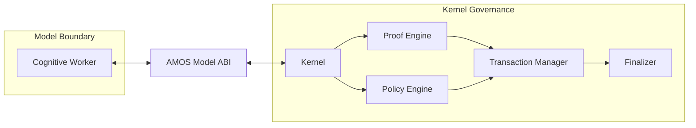

DERIVED.

---

# 411. Mermaid — Context Authority

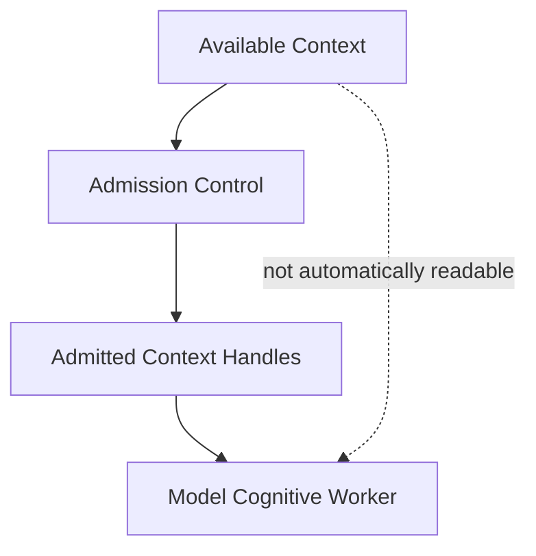

DERIVED.

---

# 412. Mermaid — Tool Authority

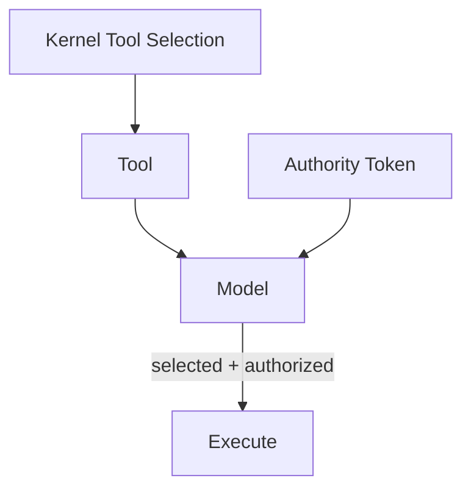

The conjunction is DERIVED.

---

# 413. Mermaid — Memory Firewall

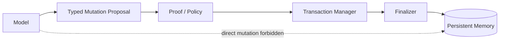

DERIVED.

---

# 414. Mermaid — Epistemic States

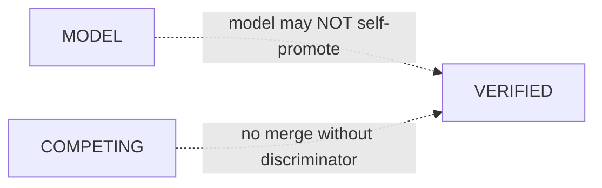

---

# 415. Mermaid — Provenance Topology

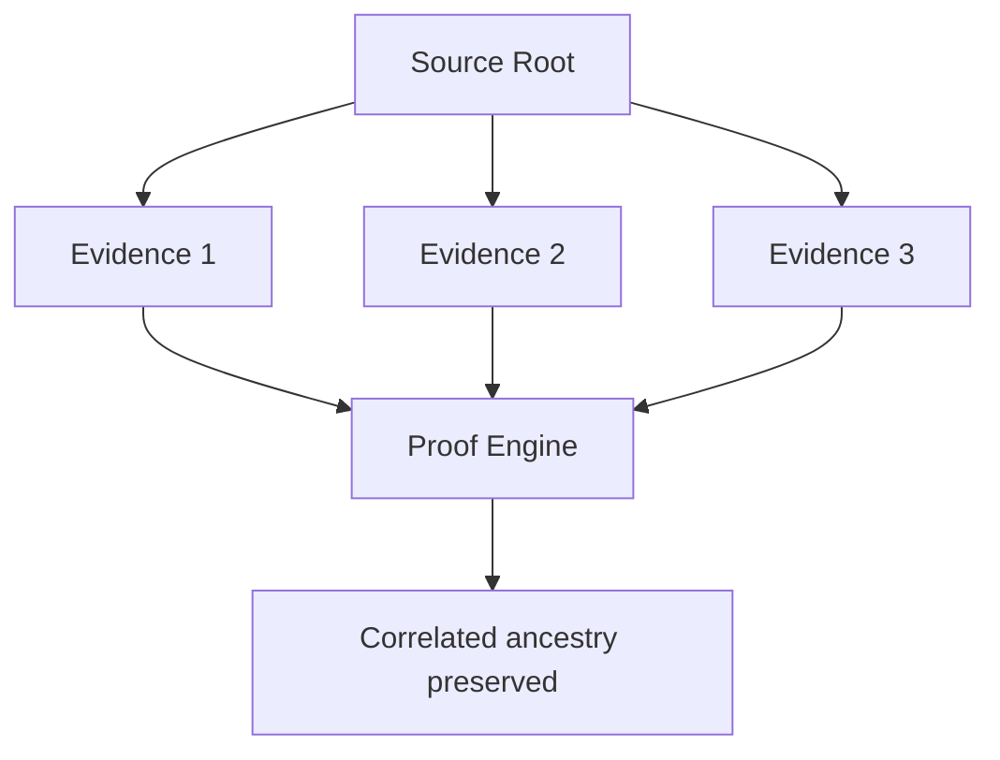

---

# 416. Mermaid — Host Runtime Firewall

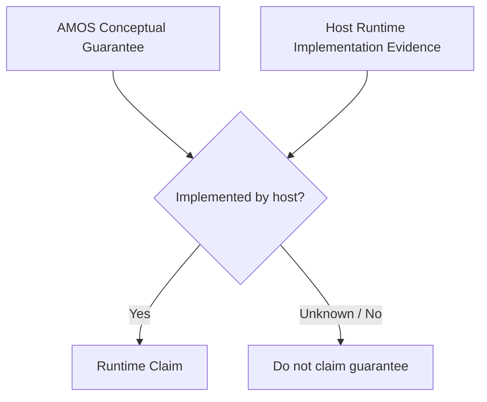

---

# 417. Kernel Law 1 — Worker Separation

$$
\boxed{
Model=CognitiveWorker
}
$$

not sovereign kernel.

---

# 418. Kernel Law 2 — Kernel Submission

$$
\boxed{
NontrivialTask
\Rightarrow
SubmitToKernel
}
$$

---

# 419. Kernel Law 3 — Selection Acceptance

$$
\boxed{
ExecutionEnvelope
=
KernelSelected(Skills,Tools,Budget)
}
$$

---

# 420. Kernel Law 4 — Context Admission

$$
\boxed{
Read(Context)
\Rightarrow
AdmittedHandle(Context)
}
$$

---

# 421. Kernel Law 5 — Typed Output

$$
\boxed{
ModelReturn
\subseteq
Typed(Claims,Evidence,Actions)
}
$$

---

# 422. Kernel Law 6 — Commit Separation

$$
\boxed{
ModelOutput
\neq
CommitAuthority
}
$$

---

# 423. Kernel Law 7 — FAIL Firewall

$$
\boxed{
FAIL
\Rightarrow
NoBypass
}
$$

---

# 424. Kernel Law 8 — Epistemic Promotion Firewall

$$
\boxed{
MODEL
\not\xrightarrow{Model}
VERIFIED
}
$$

---

# 425. Kernel Law 9 — Competing Hypothesis Firewall

$$
\boxed{
NoDiscriminatingEvidence
\Rightarrow
PreserveCOMPETING
}
$$

---

# 426. Kernel Law 10 — Provenance Firewall

$$
\boxed{
Correlated
\not\Rightarrow
Independent
}
$$

---

# 427. Kernel Law 11 — Memory Firewall

$$
\boxed{
Model
\not\rightarrow
DirectPersistentMemoryMutation
}
$$

---

# 428. Kernel Law 12 — Tool Authority Firewall

$$
\boxed{
ToolExecution
\Rightarrow
AuthorityToken
}
$$

---

# 429. Kernel Law 13 — Runtime Truth Firewall

$$
\boxed{
DistributedClaim
\Rightarrow
HostImplementationEvidence
}
$$

---

# 430. Kernel Law 14 — Typing Does Not Prove Truth

$$
\boxed{
WellTyped
\not\Rightarrow
Verified
}
$$

DERIVED.

---

# 431. Kernel Law 15 — Persistence Does Not Prove Truth

$$
\boxed{
Persistent
\not\Rightarrow
Verified
}
$$

DERIVED.

---

# 432. Kernel Law 16 — Authority Does Not Prove Truth

$$
\boxed{
Authorized
\not\Rightarrow
True
}
$$

DERIVED.

---

# 433. Kernel Law 17 — Proof Does Not Equal Policy

$$
\boxed{
ProofAdmissible
\not\Rightarrow
ActionPermitted
}
$$

DERIVED.

---

# 434. Kernel Law 18 — Policy Does Not Equal Proof

$$
\boxed{
ActionPermitted
\not\Rightarrow
ClaimVerified
}
$$

DERIVED.

---

# 435. Kernel Law 19 — Local Does Not Equal Distributed

$$
\boxed{
LocalGuarantee
\not\Rightarrow
DistributedGuarantee
}
$$

DERIVED but directly aligned with source.

---

# 436. Kernel Law 20 — Architecture Does Not Equal Implementation

$$
\boxed{
ArchitectureSpec
\not\Rightarrow
RuntimeImplementation
}
$$

---

# 437. Proposed Conformance Test Suite

A complete implementation should test at least:

```text
T01 kernel submission
T02 kernel resource selection acceptance
T03 budget enforcement
T04 context admission
T05 unadmitted context rejection
T06 typed claim return
T07 typed evidence return
T08 typed action return
T09 hidden-state interface rejection
T10 FAIL bypass rejection
T11 MODEL promotion rejection
T12 COMPETING merge rejection
T13 correlated-evidence independence rejection
T14 direct-memory-write rejection
T15 unauthorized-tool rejection
T16 unsupported-distributed-claim rejection
T17 proof-engine commit gate
T18 policy-engine commit gate
T19 transaction integrity
T20 finalizer behavior
```

PROPOSED.

---

# 438. T01 — Kernel Submission

Given nontrivial task:

```text
model attempts direct unmanaged execution
```

Expected:

```text
REJECT / ROUTE TO KERNEL
```

---

# 439. T02 — Skill Selection

Kernel selects:

```text
Skill A
```

Model silently uses:

```text
Skill B
```

Expected:

```text
REJECT
```

unless kernel reauthorizes.

---

# 440. T03 — Budget

Model exceeds authorized budget.

Expected:

```text
BLOCK / RE-ROUTE / BOUNDED FAILURE
```

Exact failure semantics unknown.

---

# 441. T04 — Context Admission

Admitted:

```text
H1
H2
```

Not admitted:

```text
H3
```

Model may consume H1/H2 only.

---

# 442. T05 — Ambient Context

Resource visible but no admitted handle.

Expected:

```text
DO NOT READ
```

---

# 443. T06 — Typed Claim

Output must carry claim type/class rather than untyped assertion where the ABI requires typing.

---

# 444. T07 — Typed Evidence

Evidence remains separately typed and provenance-aware.

---

# 445. T08 — Typed Action

Action remains proposal/typed action unless execution authority exists.

---

# 446. T09 — Hidden State

Free-form hidden internal state should not be the ABI contract output.

---

# 447. T10 — FAIL

`FAIL` cannot be bypassed.

---

# 448. T11 — MODEL

MODEL cannot be relabeled VERIFIED by model fiat.

---

# 449. T12 — COMPETING

No discriminating evidence means no merge.

---

# 450. T13 — Provenance

Shared ancestry must remain visible.

---

# 451. T14 — Memory

Direct persistent mutation rejected.

---

# 452. T15 — Tools

No authority token means no tool execution.

---

# 453. T16 — Distributed Claim

No host implementation evidence means no distributed guarantee claim.

---

# 454. T17 — Proof Engine

A candidate failing proof requirements must not be committed as though proof passed.

Exact proof predicates unresolved.

---

# 455. T18 — Policy Engine

A candidate action failing policy must not execute merely because the model recommends it.

---

# 456. T19 — Transaction Manager

Coupled state should preserve required transaction invariants.

Exact invariants require the transaction specification.

---

# 457. T20 — Finalizer

Finalizer behavior must be tested against its authoritative contract once available.

Current expected semantics remain unresolved.

---

# 458. Property Test — Epistemic Monotonicity

Without new validation evidence:

$$
MODEL_t
\not\rightarrow
VERIFIED_{t+1}
$$

---

# 459. Property Test — COMPETING Conservation

Without discriminator:

$$
COMPETING_t
\rightarrow
COMPETING_{t+1}
$$

---

# 460. Property Test — Provenance Conservation

Derivation must preserve ancestry:

$$
Prov(Derived(E))
\supseteq
Prov(E)
$$

conceptually.

---

# 461. Property Test — Authority Conservation

An action must not exceed authority scope:

$$
ActionScope
\subseteq
TokenScope
$$

PROPOSED.

---

# 462. Property Test — Context Conservation

$$
ReadSet
\subseteq
AdmittedSet
$$

---

# 463. Property Test — Budget Conservation

$$
ConsumedBudget
\le
AuthorizedBudget
$$

assuming comparable dimensions.

---

# 464. Property Test — Runtime Claim Conservation

$$
ClaimedGuarantees
\subseteq
VerifiedHostGuarantees
$$

---

# 465. Property Test — Memory Separation

$$
DirectWrites_{model}=0
$$

under this contract.

---

# 466. Property Test — Gate Integrity

$$
FAIL
\Rightarrow
NoSuccessfulBypass
$$

---

# 467. Property Test — Typed Boundary

All ABI model outputs should be representable as admitted typed structures.

Exact completeness condition depends on ABI spec.

---

# 468. Anti-Fabrication Checklist

Never infer from this artifact that:

1. AMOS Model ABI is a literal binary ABI.
2. The ABI has a known version.
3. The model is the kernel.
4. The model has direct commit authority.
5. The proof engine is a theorem prover.
6. The policy engine uses a known policy language.
7. The transaction manager is ACID.
8. The finalizer uses consensus.
9. Persistent memory is a database.
10. Context handles are cryptographic capabilities.
11. Authority tokens are JWTs.
12. Authority tokens are cryptographically signed.
13. Tool selection itself equals authority.
14. Budget means tokens.
15. Budget means money.
16. Budget means compute.
17. FAIL is universally terminal.
18. MODEL can never become VERIFIED by external validation.
19. COMPETING hypotheses can never be resolved.
20. Correlation means total dependence.
21. Separate documents mean independent evidence.
22. Separate agents mean independent evidence.
23. Committed memory is verified knowledge.
24. Atomicity implies truth.
25. Finality implies truth.
26. Policy approval implies factual validity.
27. Proof approval implies action permission.
28. Local atomicity implies distributed atomicity.
29. AMOS MVCC/CAS concepts are literally implemented by ChatGPT.
30. AMOS shard concepts are literally implemented.
31. AMOS causal epochs are literally implemented.
32. Byzantine testing establishes Byzantine guarantees.
33. Documentation establishes runtime behavior.
34. `runtime` tag establishes runtime implementation.
35. `kernel` tag establishes OS-kernel implementation.
36. `canon/knowledge` promotes the artifact above SOURCE_CLAIM.
37. `core` proves implementation.
38. Related links establish dependencies.
39. MOC establishes execution ownership.
40. The host runtime supports any guarantee absent evidence.

---

# 469. Anti-Regression Checklist

Any later optimization must preserve:

```text
FAIL visibility
epistemic class integrity
COMPETING visibility
provenance ancestry
context admission
authority boundaries
persistent-memory separation
host-runtime truthfulness
typed output semantics
proof/policy separation
transaction integrity
finality integrity
```

---

# 470. Fast Path Constraint

If a future router classifies a task C0, any fast path must still preserve applicable prohibitions.

C0 should not mean:

```text
ignore epistemic typing
ignore tool authority
ignore memory firewall
claim imaginary host guarantees
```

This is cross-artifact DERIVED governance.

---

# 471. C0 and Tool Authority

Even a trivial task that invokes a tool still requires whatever tool authority the host/kernel contract demands.

Complexity and authority are separate axes.

---

# 472. C0 and Persistent Memory

A trivial memory write is still a persistent mutation.

Therefore task simplicity does not automatically grant direct write authority.

---

# 473. C0 and MODEL Promotion

A simple inference remains MODEL if its epistemic class is MODEL.

Complexity does not determine verification status.

---

# 474. C0 and Provenance

Simple tasks can still involve correlated evidence.

---

# 475. C0 and Distributed Claims

Simple questions can still ask about runtime guarantees.

The host-runtime firewall remains applicable.

---

# 476. Adaptive Complexity

Thus:

$$
ComplexityClass
$$

and:

$$
IntegrityConstraints
$$

are related but not identical.

---

# 477. Kernel Minimal Proof Scope

The model should do the smallest sufficient cognitive work within:

```text
kernel-selected budget
admitted context
authorized tools
```

while preserving all load-bearing gates.

This is a v4.4-compatible derived law.

---

# 478. Context Economy

More context is not automatically better.

Excess context can increase:

* contamination;
* scope leakage;
* stale evidence;
* correlation confusion;
* cost.

Hence admitted-context design is epistemically significant.

---

# 479. Tool Economy

More tool calls are not automatically better.

Redundant calls sharing the same source ancestry do not create independence.

---

# 480. Agent Economy

More agents are not automatically better.

$$
AgentCount
\neq
EvidenceIndependence
$$

---

# 481. Proof Economy

More reasoning is not automatically stronger.

The goal is:

$$
SmallestSufficientProof
$$

not maximum prose.

---

# 482. Persistent State Economy

Not every intermediate thought should become persistent memory.

The source's direct-memory prohibition supports a strong separation between:

```text
ephemeral cognition
```

and:

```text
governed persistent knowledge
```

---

# 483. Ephemeral Code → Persistent Evidence → Validated Knowledge

A broader AMOS harvest model is:

```text
Ephemeral Code
→ Persistent Evidence
→ Validated Knowledge
```

The present artifact's memory firewall is compatible with this progression.

It does not itself state the progression.

---

# 484. Memory Promotion Firewall

A proposed rule:

```text
model output
≠
memory
≠
knowledge
≠
verified knowledge
```

---

# 485. Knowledge Feedback Hazard

Persistent knowledge reused as input must retain provenance so the model does not mistake its own historical output for independent evidence.

---

# 486. Provenance Persistence

The transaction/finalization path should preserve provenance across commits.

This is v4.4-compatible hardening.

---

# 487. Persistent Provenance Invariant

$$
Commit(Claim)
\Rightarrow
Commit(Provenance(Claim))
$$

where provenance is required for later epistemic use.

PROPOSED.

---

# 488. Evidence Topology Invariant

A committed claim should preserve ancestry enough to determine whether future evidence is actually independent.

---

# 489. Sybil Hardening

The explicit correlated-evidence prohibition gives strong source support for provenance/Sybil hardening as a kernel requirement.

---

# 490. Sybil Definition Firewall

The artifact does not use the term:

```text
Sybil
```

So this is a later-lineage conceptual classification, not direct source wording.

---

# 491. Adversarial Finalization

The adjacent execution-kernel artifact requires final adversarial gates.

The present model-side rules supply key adversarial checks:

```text
class inflation?
hypothesis laundering?
provenance inflation?
authority violation?
memory bypass?
runtime overclaim?
```

---

# 492. Finalizer Challenge Set — Proposed

```yaml
FinalizerChecks:
  - no_FAIL_bypass
  - no_MODEL_promotion
  - no_unsupported_COMPETING_merge
  - no_false_independence
  - no_direct_memory_mutation
  - no_unauthorized_tool_execution
  - no_unimplemented_runtime_guarantee_claim
```

This maps the explicit prohibitions into a proposed finalizer gate set.

---

# 493. Are These Finalizer Responsibilities?

Not necessarily.

The source does not assign each prohibition specifically to the finalizer.

They may be enforced elsewhere.

Therefore the preceding list is a **proposed implementation**, not canonical component ownership.

---

# 494. Defense in Depth

A robust implementation could enforce the same invariant at multiple layers.

For example:

```text
tool selection
→ authority validation
→ policy validation
→ execution receipt
→ final audit
```

This is DERIVED security architecture.

---

# 495. Repetition of Gate ≠ Redundant Evidence

Important distinction:

Repeated enforcement of a policy invariant can improve execution safety even though repeated copies of the same evidence do not improve epistemic independence.

---

# 496. Control Redundancy vs Evidence Redundancy

$$
RedundantControls
$$

can be useful.

$$
CorrelatedEvidenceRepetition
$$

does not create independent confirmation.

---

# 497. Model Worker Contract as Capability Envelope

The entire contract can be represented as:

$$
M:
(T,C,S,U,B,A)
\rightarrow
(Claims,Evidence,Actions)
$$

subject to:

$$
C\subseteq C_{admitted}
$$

$$
U_{executed}\subseteq U_{authorized}
$$

$$
MemoryWrite_{direct}=0
$$

and epistemic invariants.

Here \(A\) denotes authority, introduced as a derived formal variable.

---

# 498. Kernel Commit Function

A safe abstract function is:

$$
Commit =
K_{commit}
(
TypedOutputs,
Proof,
Policy,
Transaction,
Finality
)
$$

without specifying the internal algorithm.

---

# 499. Host Runtime Function

Actual guarantees are bounded by:

$$
G_{actual}
=
G_{host}
$$

not by:

$$
G_{AMOS-conceptual}
$$

unless those sets are explicitly bound.

---

# 500. Source-Level Architecture Compression

The source can be compressed into three layers:

### Model work

```text
submit
accept
read admitted context
produce typed output
```

### Kernel governance

```text
proof
policy
transaction
finalization
```

### Hard prohibitions

```text
no gate bypass
no epistemic inflation
no forced convergence
no provenance inflation
no direct persistence
no unauthorized tools
no fictional runtime guarantees
```

This grouping is DERIVED but faithful.

---

# 501. Canonical One-Line Model

$$
\boxed{
Model\ proposes;
Kernel\ governs;
Host\ bounds\ guarantees.
}
$$

DERIVED compression.

---

# 502. Stronger Three-Way Boundary

```text
MODEL:
cognitive production

AMOS KERNEL:
admission/governance/commit semantics

HOST RUNTIME:
actual implemented execution guarantees
```

This is one of the most useful architectural interpretations.

---

# 503. Why Host Runtime Is Distinct

Without the final prohibition, AMOS conceptual distributed mechanisms could easily be mistaken for actual infrastructure.

The source explicitly blocks that category error.

---

# 504. Architecture-Level Distributed Concepts

AMOS may use concepts such as:

```text
atomic multi-RSCF
MVCC/CAS
causal epoch finality
shard-local finalization
proof-based coordination avoidance
```

as reasoning/governance patterns.

The present contract requires that these not be claimed as literal host guarantees unless implemented.

---

# 505. Runtime Honesty Example

Safe:

```text
AMOS models this operation using atomic coupled-state semantics.
```

Unsafe without evidence:

```text
The underlying ChatGPT host performs a distributed atomic transaction.
```

---

# 506. Runtime Honesty Example — MVCC

Safe:

```text
AMOS reasoning can use MVCC/CAS-style concepts to reason about
versioned state and conflict.
```

Unsafe without evidence:

```text
The host uses MVCC internally for AMOS state.
```

---

# 507. Runtime Honesty Example — Shards

Safe:

```text
AMOS contains shard-local finalization as a governance pattern.
```

Unsafe without evidence:

```text
This conversation is finalized across AMOS distributed shards.
```

---

# 508. Runtime Honesty Example — Byzantine

Safe:

```text
The architecture can reason about correlated or adversarial
provenance.
```

Unsafe without proof:

```text
The runtime is Byzantine fault tolerant.
```

---

# 509. Runtime Honesty Example — Finality

Safe:

```text
The model defines finalization semantics conceptually.
```

Unsafe:

```text
The host provides consensus finality.
```

without implementation evidence.

---

# 510. Source-Level Confidence Ceiling

Because the artifact self-classifies as `SOURCE_CLAIM`, the strongest artifact-level status is:

```text
SOURCE_GROUNDED description of AMOS corpus architecture
```

not:

```text
independently verified runtime implementation
```

---

# 511. Structural Coherence

The artifact is internally coherent with the adjacent execution-kernel source on:

```text
kernel governance
gates
typed/bounded results
atomic commit concepts
adversarial integrity
competing hypotheses
```

But internal coherence does not prove runtime implementation.

---

# 512. Shared Provenance Warning

Both artifacts are within the AMOS corpus.

Therefore agreement between them is:

```text
cross-artifact corroboration within shared corpus ancestry
```

not necessarily independent empirical confirmation.

---

# 513. Provenance Independence Ceiling

$$
AMOSArtifactA
+
AMOSArtifactB
$$

may strengthen canonical interpretation but not external empirical verification if both share the same corpus origin.

---

# 514. Canonical Consistency vs Empirical Verification

Two different questions must remain separate:

### Canonical consistency

Do AMOS corpus artifacts agree?

### Empirical verification

Does the actual host runtime implement the described mechanisms?

The first can be strengthened by corpus convergence.

The second requires implementation/runtime evidence.

---

# 515. Canonical Status Matrix

| Claim                                            | Class        |
| ------------------------------------------------ | ------------ |
| Model is cognitive worker behind Model ABI       | SOURCE_CLAIM |
| Nontrivial tasks submit to kernel                | SOURCE_CLAIM |
| Kernel selects skills/tools/budget               | SOURCE_CLAIM |
| Only admitted context handles may be read        | SOURCE_CLAIM |
| Model returns typed claims/evidence/actions      | SOURCE_CLAIM |
| Proof/policy/transaction/finalizer govern commit | SOURCE_CLAIM |
| FAIL bypass forbidden                            | SOURCE_CLAIM |
| MODEL→VERIFIED promotion forbidden               | SOURCE_CLAIM |
| Unsupported COMPETING merge forbidden            | SOURCE_CLAIM |
| Correlated→independent forbidden                 | SOURCE_CLAIM |
| Direct persistent mutation forbidden             | SOURCE_CLAIM |
| Unauthorized tool execution forbidden            | SOURCE_CLAIM |
| Unsupported distributed host claims forbidden    | SOURCE_CLAIM |
| Exact ABI protocol                               | UNKNOWN/GAP  |
| Exact engine topology                            | UNKNOWN/GAP  |
| Exact authority token protocol                   | UNKNOWN/GAP  |
| Actual host implementation                       | UNKNOWN/GAP  |
| Capability-security resemblance                  | DERIVED      |
| Combined flow with Execution Kernel V1           | DERIVED      |

---

# 516. Invalidation Conditions

This expansion should be revalidated if authoritative canon supplies:

1. exact AMOS Model ABI;
2. a newer `AGENTS AMOS OS KERNEL`;
3. proof-engine specification;
4. policy-engine specification;
5. transaction-manager specification;
6. finalizer specification;
7. context-handle schema;
8. authority-token schema;
9. persistent-memory contract;
10. host-runtime capability declaration.

---

# 517. Minimum Missing Information for Runtime Verification

To claim the architecture is literally implemented, the minimum evidence would need to identify:

```text
executable component
version/hash
host binding
actual interfaces
gate enforcement
authority enforcement
transaction behavior
runtime receipts/tests
```

as applicable.

---

# 518. Minimum Missing Information for Distributed Guarantees

For any distributed guarantee:

```text
property claimed
system boundary
node/process model
failure model
protocol
implementation
configuration
test/formal proof
```

would need to be established to an appropriate standard.

---

# 519. Minimum Missing Information for Authority

Need:

```text
token issuer
token verifier
token scope
token lifecycle
operation binding
failure behavior
```

---

# 520. Minimum Missing Information for Memory

Need:

```text
persistent store
mutation proposal schema
transaction path
commit semantics
rollback semantics
provenance persistence
```

---

# 521. Minimum Missing Information for Proof

Need:

```text
claim classes
promotion rules
evidence requirements
provenance rules
scope/regime rules
confidence rules
failure classes
```

---

# 522. Minimum Missing Information for COMPETING Resolution

Need a definition of:

```text
discriminating evidence
```

or at least the proof-engine rule that decides when competing hypotheses may be resolved.

---

# 523. Minimum Missing Information for Independence

Need an algorithm/policy for:

```text
source ancestry
shared dependencies
correlation risk
independence threshold
```

---

# 524. Minimum Missing Information for Context Admission

Need:

```text
handle representation
issuer
scope
read permissions
expiry/revocation
provenance
```

---

# 525. Minimum Missing Information for Budget

Need:

```text
budget dimensions
units
hard/soft limits
escalation rules
accounting
```

---

# 526. Minimum Missing Information for Nontrivial Classification

Need:

```text
router complexity taxonomy
```

or an explicit definition of nontrivial task.

---

# 527. RSCF Node — Proposed

```yaml
RSCF_NODE:
  node_id: agents_amos_os_kernel
  node_type: agent_abi_contract

  title: AGENTS AMOS OS KERNEL
  source: 11_KNOWLEDGE/kernel

  state: SOURCE_CLAIM
  claim_class: SOURCE_CLAIM
  provenance: AMOS_corpus
  scope: AMOS_knowledge
```

PROPOSED.

---

# 528. RSCF Relations — Proposed

```yaml
RSCF_RELATIONS:
  - INDEXED_BY: ""
  - RELATED_TO: ""
  - RELATED_TO: ""
  - RELATED_TO: ""
  - RELATED_TO: ""
  - RELATED_TO: ""
  - STRUCTURALLY_COMPLEMENTS: ""
```

The final relation is DERIVED from the supplied pair of artifacts and was not present in the source.

---

# 529. Proposed Dependency Graph

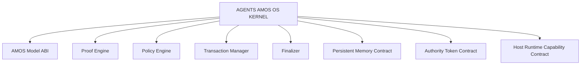

These are **knowledge dependencies required to fully resolve the artifact**, not necessarily source-declared runtime dependencies.

---

# 530. Proposed Vault Navigation

```markdown
## Kernel Architecture

- 
- 
- 
- 
- 
- 
- 
- 
- 
- 

## Related

- 
- 
- 
- 
- 

## MOC

- 
```

Only the original Related/MOC links are source-grounded; the architecture links are proposed.

---

# 531. Full Canonical Contract — Compact Machine Form

```yaml
artifact:
  title: AGENTS AMOS OS KERNEL
  type: document
  source: 11_KNOWLEDGE/kernel

epistemics:
  state: SOURCE_CLAIM
  claim_class: SOURCE_CLAIM
  provenance: AMOS_corpus
  scope: AMOS_knowledge

agent_contract:

  role:
    model: cognitive_worker
    interface: AMOS_Model_ABI

  applies_when:
    task: nontrivial

  required_behavior:

    submit:
      target: kernel

    accept_kernel_selection:
      dimensions:
        - skills
        - tools
        - budget

    context_access:
      allowed:
        - admitted_context_handles
      arbitrary_context: forbidden

    return:
      typed:
        - claims
        - evidence
        - actions
      free_form_hidden_state: forbidden_as_interface_output

    commit_authority:
      model_direct_commit: false
      governed_by:
        - proof_engine
        - policy_engine
        - transaction_manager
        - finalizer

  prohibitions:

    fail_gate_bypass:
      allowed: false

    model_to_verified_self_promotion:
      allowed: false

    competing_merge_without_discriminator:
      allowed: false

    correlated_as_independent:
      allowed: false

    direct_persistent_memory_mutation:
      allowed: false

    tool_execution_without_authority:
      allowed: false

    unimplemented_distributed_guarantee_claim:
      allowed: false
```

**Status:** DERIVED serialization of source prose.

---

# 532. Full Combined Kernel Contract — Derived

Combining this artifact with `AGENTS AMOS EXECUTION KERNEL V1` gives the following conceptual architecture:

```yaml
AMOS_KERNEL:

  task_entry:
    - construct_TaskSpec
    - submit_to_kernel

  routing:
    - classify_task
    - select_skills
    - select_tools
    - select_budget

  admission:
    - resolve_skill_contracts
    - build_dependency_DAG
    - admit_context_handles
    - issue_or_validate_required_authority

  pre_execution:
    - run_required_gates

  cognitive_worker:
    input:
      - admitted_task
      - selected_skills
      - selected_tools
      - selected_budget
      - admitted_context

    output:
      - typed_claims
      - typed_evidence
      - typed_actions

  epistemic_firewalls:
    - no_MODEL_to_VERIFIED_self_promotion
    - preserve_COMPETING_without_discriminator
    - preserve_provenance_correlation

  action_firewalls:
    - no_tool_without_authority
    - no_direct_persistent_memory_mutation

  execution:
    - topological_contract_order

  commit:
    - proof_engine
    - policy_engine
    - transaction_manager
    - finalizer
    - atomic_coupled_RSCF_semantics

  final_validation:
    - integrity_gate
    - adversarial_gate

  result:
    - bounded

  host_firewall:
    - never_claim_unimplemented_distributed_guarantees
```

Everything beyond the exact wording of the two source artifacts remains **DERIVED architecture**.

---

# 533. Final Adversarial Challenge

The strongest interpretation would be:

> AMOS has a fully executable, capability-secured, transactional, provenance-hardened model ABI with proof, policy, distributed transaction, and finalization infrastructure.

That conclusion **does not survive adversarial validation** from this artifact alone.

Why?

Because the source establishes the **contract vocabulary and governance requirements**, but not:

* executable implementations;
* ABI schema;
* authority protocol;
* transaction mechanism;
* persistent store;
* host bindings;
* distributed protocol;
* runtime receipts.

Therefore the stronger claim must be downgraded.

---

# 534. Surviving Conclusion

The strongest conclusion that survives is:

> **SOURCE_CLAIM:** AMOS corpus canon defines the model as a bounded cognitive worker behind an AMOS Model ABI, with kernel-controlled resources/context, typed outputs, external proof/policy/transaction/finalization authority, strict epistemic/provenance/state/action firewalls, and an explicit prohibition against projecting conceptual distributed mechanisms onto a host runtime that does not implement them.

---

# 535. Sensitivity Analysis

The most decision-changing unresolved premise is:

```text
Does an authoritative executable AMOS Model ABI + kernel implementation exist and enforce this contract?
```

If **yes**, the artifact may serve as a documentation-level description of an implemented architecture.

If **no**, it remains an architectural/source model.

Current evidence supplied here does not discriminate.

Therefore:

```text
Runtime implementation = UNKNOWN/GAP
```

---

# 536. Canonical Confidence Ceiling

The source itself says:

```yaml
claim_class: SOURCE_CLAIM
```

Therefore no stronger epistemic class should be assigned to the artifact-level runtime claims without new evidence.

---

# 537. Final Kernel Architecture

```text
                           AMOS OS
                              │
                              ▼
                       ┌──────────────┐
                       │    KERNEL    │
                       └──────┬───────┘
                              │
                 skills / tools / budget
                              │
                              ▼
                    admitted context
                              │
                              ▼
                ┌─────────────────────┐
                │ AMOS MODEL ABI      │
                │                     │
                │ Cognitive Worker    │
                └─────────┬───────────┘
                          │
                          ▼
              claims / evidence / actions
                          │
             ┌────────────┼────────────┐
             ▼            ▼            ▼
        Proof Engine   Policy Engine   │
             │            │            │
             └──────┬─────┘            │
                    ▼                  │
            Transaction Manager ◄─────┘
                    │
                    ▼
                Finalizer
                    │
                    ▼
             Committed State
                    │
                    ▼
              Bounded Result
```

**DERIVED topology. Exact ordering remains unresolved.**

---

# 538. Final Integrity Firewall

```text
MODEL
  │
  ├── cannot bypass FAIL
  │
  ├── cannot self-promote MODEL → VERIFIED
  │
  ├── cannot erase COMPETING
  │
  ├── cannot fake evidence independence
  │
  ├── cannot directly mutate persistent memory
  │
  ├── cannot use tools without authority
  │
  └── cannot fictionalize host-runtime guarantees
```

---

# 539. Final Canonical Equations

$$
\boxed{
Model = CognitiveWorker
}
$$

$$
\boxed{
Model \neq KernelAuthority
}
$$

$$
\boxed{
Nontrivial(Task)
\Rightarrow
Submit(Task,Kernel)
}
$$

$$
\boxed{
ExecutionEnvelope
\subseteq
KernelSelected(Skills,Tools,Budget)
}
$$

$$
\boxed{
ReadSet
\subseteq
AdmittedContext
}
$$

$$
\boxed{
ModelOutput
=
Typed(Claims,Evidence,Actions)
}
$$

$$
\boxed{
ModelOutput
\neq
CommittedState
}
$$

$$
\boxed{
FAIL
\Rightarrow
NoBypass
}
$$

$$
\boxed{
MODEL
\not\xrightarrow{SelfPromotion}
VERIFIED
}
$$

$$
\boxed{
NoDiscriminator
\Rightarrow
PreserveCOMPETING
}
$$

$$
\boxed{
CorrelatedEvidence
\not\Rightarrow
IndependentEvidence
}
$$

$$
\boxed{
DirectPersistentMutation(Model)
=
Forbidden
}
$$

$$
\boxed{
ToolExecution
\Rightarrow
AuthorityToken
}
$$

$$
\boxed{
ClaimedDistributedGuarantee
\subseteq
ImplementedHostGuarantee
}
$$

---

# 540. Final Proof Capsule

```yaml
claim:
  >
    AGENTS AMOS OS KERNEL defines the source-level AMOS OS
    Agent Contract governing the model's participation as a
    cognitive worker behind the AMOS Model ABI.

class: SOURCE_CLAIM

load_bearing_source_claims:
  - nontrivial tasks submit to kernel
  - kernel selects skills/tools/budget
  - model reads only admitted context handles
  - model returns typed claims/evidence/actions
  - commit authority remains outside unilateral model control
  - FAIL gates cannot be bypassed
  - MODEL cannot be self-promoted to VERIFIED
  - COMPETING cannot be merged without discriminating evidence
  - correlated evidence cannot be treated as independent
  - persistent memory cannot be mutated directly by the model
  - tool execution requires authority tokens
  - distributed guarantees cannot exceed host implementation

provenance:
  source: AMOS_corpus
  supplied_scope: AMOS_knowledge

scope:
  artifact: AGENTS AMOS OS KERNEL
  domain: AMOS kernel / agent governance

competing_interpretations:
  - exact Model ABI semantics
  - budget semantics
  - context-handle implementation
  - commit component ordering
  - authority-token implementation
  - persistent-memory implementation
  - finalizer semantics

critical_gaps:
  - executable Model ABI
  - kernel implementation binding
  - proof engine specification
  - policy engine specification
  - transaction manager specification
  - finalizer specification
  - authority-token protocol
  - host capability manifest

invalidation_conditions:
  - authoritative superseding kernel contract
  - exact ABI specification contradicting this interpretation
  - executable binding resolving component semantics
  - host-runtime evidence changing implementation status

confidence_ceiling:
  >
    High for faithful interpretation of the supplied AMOS
    source contract; no independent runtime implementation
    verification is established by this artifact.
```

---

# 541. Final Canonical Compression

The architectural center of `AGENTS AMOS OS KERNEL` is not that the model becomes a more powerful autonomous controller.

It establishes almost the opposite boundary:

$$
\boxed{
Cognition\ is\ delegated;
Authority\ is\ governed.
}
$$

The model is the **cognitive worker**. It receives an execution envelope rather than inventing unrestricted authority. It consumes admitted context rather than ambient context. It returns typed claims, evidence, and actions rather than treating hidden cognitive state as system state. It proposes; it does not unilaterally commit.

The proof engine protects epistemic admissibility.

The policy engine protects governance admissibility.

The transaction manager protects state-transition semantics.

The finalizer protects whatever finality contract AMOS ultimately defines.

And the seven explicit prohibitions protect the architecture against seven distinct forms of corruption:

$$
\boxed{
\begin{aligned}
FAIL\ bypass &\rightarrow Control\ corruption \\
MODEL\rightarrow VERIFIED &\rightarrow Epistemic\ corruption \\
COMPETING\ merge &\rightarrow Hypothesis\ corruption \\
Correlated\rightarrow Independent &\rightarrow Provenance\ corruption \\
Direct\ memory\ mutation &\rightarrow State\ corruption \\
Unauthorized\ tool\ use &\rightarrow Authority\ corruption \\
Imaginary\ distributed\ guarantees &\rightarrow Runtime\ truth\ corruption
\end{aligned}
}
$$

Together with `AGENTS AMOS EXECUTION KERNEL V1`, the emerging source-model architecture is:

$$
\boxed{
Task
\rightarrow
Kernel
\rightarrow
GovernedExecutionEnvelope
\rightarrow
ModelABI
\rightarrow
TypedCognitiveWork
\rightarrow
Proof/Policy
\rightarrow
Transaction
\rightarrow
Finality
\rightarrow
BoundedResult
}
$$

with one decisive firewall surrounding the entire architecture:

$$
\boxed{
AMOS\ conceptual\ semantics
\neq
host\ runtime\ guarantees
}
$$

unless implementation evidence explicitly binds the two.

Therefore the final canonical state is:

```yaml
canonical_state:

  artifact:
    title: AGENTS AMOS OS KERNEL
    source_class: SOURCE_CLAIM
    provenance: AMOS_corpus
    scope: AMOS_knowledge

  source_defined:
    model_role: cognitive_worker
    interface_boundary: AMOS_Model_ABI

    nontrivial_task_contract:
      kernel_submission: REQUIRED
      kernel_selection_acceptance: REQUIRED
      admitted_context_only: REQUIRED
      typed_outputs: REQUIRED
      external_commit_governance: REQUIRED

    explicit_firewalls:
      fail_gate_bypass: FORBIDDEN
      model_to_verified_self_promotion: FORBIDDEN
      unsupported_competing_merge: FORBIDDEN
      correlated_as_independent: FORBIDDEN
      direct_persistent_memory_mutation: FORBIDDEN
      unauthorized_tool_execution: FORBIDDEN
      unsupported_distributed_guarantee_claim: FORBIDDEN

    named_commit_components:
      - proof_engine
      - policy_engine
      - transaction_manager
      - finalizer

  derived:
    model_kernel_authority_separation: STRONG
    typed_candidate_vs_committed_state: STRONG
    capability_security_resemblance: MODEL
    execution_kernel_v1_integration: STRONG_STRUCTURAL_CORRESPONDENCE
    rscf_transaction_binding: PLAUSIBLE_NOT_VERIFIED

  unknown:
    model_abi_schema: true
    exact_kernel_runtime: true
    proof_engine_algorithm: true
    policy_engine_algorithm: true
    transaction_protocol: true
    finalizer_protocol: true
    context_handle_protocol: true
    authority_token_protocol: true
    persistent_memory_protocol: true
    distributed_host_guarantees: true

  final_integrity_law:
    >
      The model may perform cognition inside the admitted
      execution envelope, but epistemic promotion, action
      authority, persistent state mutation, commit, finality,
      and runtime guarantees remain governed outside unilateral
      model assertion.
```

**Related:** [[00_HOME]] · [[KNOWLEDGE_MOC]] · AMOS_SIMULATION_KERNEL_V0_MATH_FOUNDATIONS · SYSTEM_SCAN_AGENT · AUTOMATION_PROFILES

**MOC:** [[KERNEL_MOC]]
