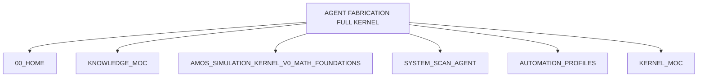
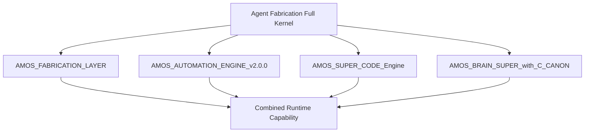
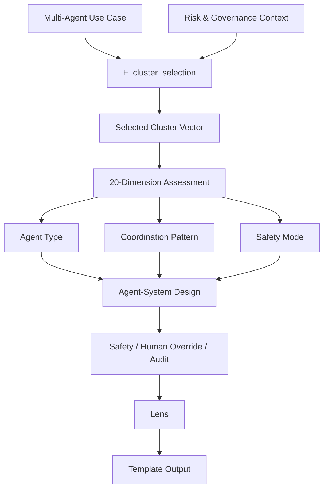

# AGENT FABRICATION FULL KERNEL

> [!important] Canonical status
> `AGENT FABRICATION FULL KERNEL` is a source-defined AMOS kernel specification for **multi-agent fabrication, configuration, coordination, governance, safety, lifecycle management, and human override**.
>
> The supplied artifact defines:
>
> - **20 architectural clusters**
> - **20 evaluation/design dimensions**
> - a **100,000-layer virtual expansion model**
> - **3 virtual tensor axes**
> - **1 explicit mapping function**
> - **1 explicit reasoning mode**
> - **2 explicit safety policies**
> - task routing
> - runtime dependency links
> - **4 stakeholder lenses**
> - **11 output templates**
>
> These are **SOURCE_CLAIM structures from the AMOS corpus**. The artifact does not independently establish that all referenced runtime engines exist, that the kernel is deployed, that 100,000 literal executable layers are instantiated, or that the resulting multi-agent systems are empirically safe.

---

# 0. Source Identity

The embedded source identifies the kernel as:

```yaml
name: Agent_Fabrication_Full_Kernel_vInfinity_SUPER
version: v2.0.0+lens_integration
created_at_utc: 2025-11-28T00:10:18.516087Z
description: >
  Full Agent Fabrication kernel for safe, auditable multi-agent
  systems. Now enriched with cross-canon integration, lens_space,
  and template_library.
domain: multi_agent_fabrication_and_coordination
density_profile: kernel_x100k_virtual
cluster_count: 20
dimension_count: 20
```

The note itself was created:

```yaml
created: 2026-08-22
```

These are different dates describing different objects or lifecycle moments:

```text
Embedded kernel creation timestamp: 2025-11-28
Vault note creation metadata:       2026-08-22
```

They should not be silently collapsed into one timestamp.

---

# 1. Core Architectural Definition

The kernel can be represented source-faithfully as:

$$
AFK =
\langle
C,
D,
V,
F,
R,
P,
Route,
I,
L,
T
\rangle
$$

where:

- \(C\) = cluster space
- \(D\) = dimension space
- \(V\) = virtual expansion model
- \(F\) = mapping functions
- \(R\) = reasoning modes
- \(P\) = policies
- `Route` = task routing
- \(I\) = integration links
- \(L\) = lens space
- \(T\) = template library

This tuple is **DERIVED from the supplied JSON structure**, not an original source equation.

---

# 2. Purpose

The source describes the kernel as a:

> “Full Agent Fabrication kernel for safe, auditable multi-agent systems.”

The operative scope is:

```text
MULTI-AGENT FABRICATION
+
MULTI-AGENT COORDINATION
+
SAFETY
+
GOVERNANCE
+
AUDITABILITY
```

The artifact is therefore not merely an “agent generator.”

It is a broader specification for building and governing multi-agent systems.

---

# 3. Non-Purpose

The source does **not** establish that this kernel:

- autonomously creates live agents;
- grants real permissions;
- deploys agents into external systems;
- creates unrestricted autonomous swarms;
- guarantees alignment;
- guarantees safe behavior;
- proves robustness;
- provides cryptographic authorization;
- implements persistent memory;
- performs real-world effects;
- implements its 100,000 virtual layers as material runtime objects.

Therefore:

```text
SPECIFICATION != DEPLOYMENT

CAPABILITY MODEL != AUTHORITY

AGENT DESIGN != AGENT ACTIVATION

VIRTUAL LAYER != MATERIALIZED RUNTIME LAYER

SAFETY POLICY != VERIFIED SAFETY GUARANTEE

DEPENDENCY LINK != VERIFIED RUNTIME BINDING

AUDITABILITY DIMENSION != AUDIT RECEIPT

HUMAN OVERRIDE REQUIREMENT != IMPLEMENTED KILL SWITCH
```

---

# 4. Kernel Topology

```text
AGENT FABRICATION FULL KERNEL
│
├── 01. Cluster Space
│   └── 20 architectural clusters
│
├── 02. Dimension Space
│   └── 20 evaluation / configuration dimensions
│
├── 03. Virtual Expansion Model
│   ├── x100k virtual density
│   └── agent_type × coordination_pattern × safety_mode
│
├── 04. Mapping Functions
│   └── F_cluster_selection
│
├── 05. Reasoning Modes
│   └── mode_agent_system_design
│
├── 06. Policies
│   └── safety
│
├── 07. Routing
│   └── task type → reasoning mode
│
├── 08. Integration Links
│   └── 4 upstream/runtime dependencies
│
├── 09. Lens Space
│   ├── Executive
│   ├── Operator
│   ├── Expert
│   └── Audit
│
└── 10. Template Library
    ├── Documents
    ├── Decks
    └── Tables
```

---

# 5. Cluster Space

The source declares:

```yaml
total_clusters: 20
```

and enumerates exactly 20 cluster identities.

These clusters define **what aspects of an agent system may need to be designed or governed**.

---

# 6. Cluster 01 — Agent Archetype Library

```text
agent_archetype_library
```

This cluster establishes the space of agent archetypes.

The source later exposes four example `agent_type` values in the virtual model:

- specialist
- orchestrator
- observer_auditor
- interface_agent

However, the artifact does not state that those four exhaust the archetype library.

Therefore:

$$
VirtualAgentTypes
\subseteq
PossibleAgentArchetypes
$$

is a reasonable **DERIVED** interpretation.

---

# 7. Cluster 02 — Capability and Role Definition

```text
capability_androle_definition
```

This cluster distinguishes agent capability and role.

A useful governance interpretation is:

```text
Capability = what an agent can do

Role = what function the agent is assigned
```

But the source does not define a formal capability schema.

Critically:

$$
Capability \neq Authority
$$

should remain an AMOS governance firewall even though this particular JSON does not explicitly encode that equation.

---

# 8. Cluster 03 — Input / Output Contracts

```text
input_output_contracts
```

This cluster governs agent interface contracts.

A mature implementation would likely need typed input and output schemas.

The source does not provide those schemas here.

Therefore:

```text
CONTRACT CLUSTER PRESENT
TYPED CONTRACT SCHEMA NOT SUPPLIED
```

---

# 9. Cluster 04 — Memory and Context Scopes

```text
memory_andcontext_scopes
```

This cluster establishes memory/context boundaries as first-class design concerns.

Potential concerns include:

- working context;
- persistent memory;
- private memory;
- shared memory;
- agent-specific context;
- task-scoped context.

Those subdivisions are not enumerated by this source and should remain DERIVED possibilities.

---

# 10. Memory Firewall

The cluster's existence does not prove:

- persistent memory exists;
- memory writes are authorized;
- memory provenance is tracked;
- agents can access each other's memories.

Those require explicit implementation bindings.

---

# 11. Cluster 05 — Tool and API Permissions

```text
tool_andapi_permissions
```

This is one of the most consequential clusters.

It explicitly recognizes that tool access must be governed.

A safe derived contract is:

$$
ToolUse(A,T)
\Rightarrow
Permission(A,T)
$$

but the artifact does not provide the permission evaluator.

---

# 12. Permission ≠ Capability

The presence of a tool integration does not authorize its use.

```text
TOOL EXISTS
!=
AGENT MAY USE TOOL
```

This is consistent with AMOS authority discipline.

---

# 13. Cluster 06 — Safety and Boundary Conditions

```text
safety_andboundary_conditions
```

This cluster governs constraints around agent behavior.

It is reinforced by explicit policies later in the kernel.

---

# 14. Cluster 07 — Goal and Reward Structures

```text
goal_andreward_structures
```

This treats goals and reward mechanisms as explicit design objects.

However, no optimization function is supplied.

There is no canonical equation such as:

$$
\max_A Reward(A)
$$

in the artifact.

---

# 15. Reward Hacking Boundary

Because reward structures are source-defined but unspecified, the artifact does not establish protection against:

- proxy gaming;
- reward hacking;
- specification gaming;
- objective drift.

Those remain implementation concerns.

---

# 16. Cluster 08 — Delegation and Handoff Protocols

```text
delegation_andhandoff_protocols
```

This cluster governs transfer of work between agents.

A useful distinction is:

```text
delegation of task
!=
delegation of authority
```

No authority-transfer rule is supplied.

---

# 17. Cluster 09 — Coordination Patterns

```text
coordination_patterns
```

The virtual expansion section later provides four patterns:

```text
star_topology
hierarchical
mesh
swarm
```

These are source-defined topology values.

---

# 18. Coordination Pattern Matrix

| Pattern         | Structural interpretation        | Source status  |
| --------------- | -------------------------------- | -------------- |
| `star_topology` | central coordination node        | SOURCE_DEFINED |
| `hierarchical`  | tiered coordination              | SOURCE_DEFINED |
| `mesh`          | peer-rich coordination           | SOURCE_DEFINED |
| `swarm`         | decentralized collective pattern | SOURCE_DEFINED |

The interpretations are conventional/DERIVED; the names themselves are source-defined.

---

# 19. Cluster 10 — Communication Protocols

```text
communication_protocols
```

This establishes communication as a separate concern from coordination.

That is architecturally important:

$$
CoordinationTopology
\neq
CommunicationProtocol
$$

The source does not define message formats or transport semantics.

---

# 20. Cluster 11 — Conflict Detection and Resolution

```text
conflict_detection_andresolution
```

This explicitly acknowledges that agents may:

- disagree;
- compete for resources;
- propose incompatible actions;
- produce conflicting outputs.

No conflict-resolution algorithm is supplied.

---

# 21. Conflict ≠ Failure

In a governed multi-agent architecture, conflicting hypotheses can be legitimate.

A mature implementation should preserve:

```text
COMPETING
```

when evidence does not justify convergence.

This is an AMOS-derived governance principle rather than a direct JSON field.

---

# 22. Cluster 12 — Shared Blackboard or Workspace

```text
shared_blackboard_orworkspace
```

This cluster establishes a shared state/coordination substrate as an architectural option.

The word:

```text
or
```

is source-significant.

It does not prove that a shared blackboard is mandatory.

---

# 23. Shared Workspace Risks

Potential risks include:

- context poisoning;
- stale state;
- provenance loss;
- race conditions;
- overwrite conflict;
- unauthorized reads.

No mitigation implementation appears here.

---

# 24. Cluster 13 — Swarm and Collective Behaviour Patterns

```text
swarm_andcollective_behaviour_patterns
```

This is distinct from generic coordination patterns.

Thus the source differentiates:

```text
coordination topology
```

from:

```text
collective emergent behavior
```

---

# 25. Swarm Safety Boundary

The source explicitly prohibits:

> “agents that can self-replicate unchecked”

Therefore swarm behavior must not be interpreted as unrestricted replication.

---

# 26. Cluster 14 — Agent Lifecycle States

```text
agent_lifecycle_states
```

The source recognizes lifecycle governance.

However, no lifecycle state machine is supplied.

Possible states such as:

```text
DRAFT
VALIDATED
ACTIVE
SUSPENDED
RETIRED
```

would be PROPOSED only.

---

# 27. Cluster 15 — Versioning and Upgrades

```text
versioning_andupgrades
```

This treats agent evolution as governed configuration change.

The artifact does not define:

- semantic version rules;
- compatibility policy;
- migration logic;
- rollback behavior.

---

# 28. Cluster 16 — Logging and Traceability

```text
logging_andtraceability
```

This makes traceability first-class.

However:

```text
TRACEABILITY CLUSTER
!=
PERSISTENT AUDIT LOG IMPLEMENTATION
```

No logging schema appears.

---

# 29. Cluster 17 — Agent Evaluation and Benchmarks

```text
agent_evaluation_andbenchmarks
```

Evaluation is explicitly separated from runtime behavior.

No benchmark registry or thresholds are supplied.

Thus:

```text
BENCHMARK CAPABILITY PRESENT
BENCHMARK VALIDATION NOT ESTABLISHED
```

---

# 30. Cluster 18 — Self-Reflection and Correction Loops

```text
self_reflection_andcorrection_loops
```

The source supports bounded self-correction.

This must not be confused with unrestricted self-modification.

The safety policy explicitly restricts modification of safety constraints.

---

# 31. Reflection ≠ Self-Authority

An agent may inspect or critique its output without gaining authority to rewrite:

- policy;
- permissions;
- safety constraints;
- governance envelopes.

---

# 32. Cluster 19 — Shutdown and Fail-Safe Logic

```text
shutdown_andfail_safe_logic
```

This is a critical safety cluster.

The artifact does not provide implementation semantics for:

- emergency shutdown;
- partial shutdown;
- state preservation;
- graceful termination;
- dependency shutdown.

---

# 33. Cluster 20 — Human in the Loop and Override

```text
human_in_the_loop_andoverride
```

This is reinforced by explicit policy:

> “Require human override and auditability for any high-impact actions.”

Therefore human oversight is not decorative.

It is a source-defined policy requirement for high-impact actions.

---

# 34. Cluster Taxonomy

The 20 clusters can be grouped, **DERIVED**, into five major systems:

### Identity and capability

```text
01 Agent archetypes
02 Capabilities / roles
03 I/O contracts
```

### State and access

```text
04 Memory / context
05 Tool / API permissions
06 Safety / boundaries
```

### Goals and coordination

```text
07 Goals / rewards
08 Delegation / handoff
09 Coordination
10 Communication
11 Conflict resolution
12 Shared workspace
13 Swarm behavior
```

### Lifecycle and quality

```text
14 Lifecycle
15 Versioning
16 Logging
17 Evaluation
18 Self-correction
```

### Termination and governance

```text
19 Shutdown / fail-safe
20 Human override
```

---

# 35. Dimension Space

The kernel defines 20 dimensions.

These dimensions differ from clusters.

A useful distinction is:

```text
Clusters   = architectural concerns / subsystems

Dimensions = qualities, constraints, or evaluation axes
```

---

# 36. Dimension 01 — Autonomy Level

```text
autonomy_level
```

This expresses how independently an agent may operate.

No scale is supplied.

Do not invent numeric levels without another source.

---

# 37. Dimension 02 — Interpretability

```text
interpretability
```

This makes explainability/inspectability a quality axis.

No scoring method is supplied.

---

# 38. Dimension 03 — Safety Level

```text
safety_level
```

This is separate from the safety cluster.

The cluster defines a design region; the dimension allows the system to assess or parameterize safety.

---

# 39. Dimension 04 — Goal Alignment

```text
goal_alignment
```

No alignment metric appears.

Therefore:

$$
AlignmentScore
$$

is UNKNOWN/GAP.

---

# 40. Dimension 05 — Tool Access Scope

```text
tool_access_scope
```

This mirrors Cluster 05 but operates as an evaluation/configuration axis.

---

# 41. Dimension 06 — Coordination Complexity

```text
coordination_complexity
```

Likely increases as number of agents/interdependencies/topology complexity rises, but no formula is supplied.

---

# 42. Dimension 07 — Latency Requirements

```text
latency_requirements
```

This recognizes real-time or response-time constraints.

No thresholds are defined.

---

# 43. Dimension 08 — Resource Usage

```text
resource_usage
```

Could include compute, memory, network, cost, or token use.

The source does not specify.

---

# 44. Dimension 09 — Robustness to Misuse

```text
robustness_to_misuse
```

This is an adversarial-quality dimension.

No misuse model or attack taxonomy is supplied.

---

# 45. Dimension 10 — Resilience to Failures

```text
resilience_to_failures
```

This is distinct from misuse robustness.

Therefore the source separates:

```text
adversarial misuse
```

from:

```text
operational failure
```

---

# 46. Dimension 11 — Auditability

```text
auditability
```

This aligns with Cluster 16 and the source description.

But:

$$
AuditabilityDimension
\neq
PassedAudit
$$

---

# 47. Dimension 12 — Reproducibility

```text
reproducibility
```

This suggests agent/system behavior should be reproducible where appropriate.

No determinism requirement is defined.

---

# 48. Dimension 13 — Scalability of Agents

```text
scalability_of_agents
```

The source does not specify whether scalability means:

- agent count;
- workload;
- coordination graph size;
- throughput;
- organization size.

---

# 49. Dimension 14 — Human Trust

```text
human_trust
```

This is a stakeholder-oriented quality dimension.

Importantly:

$$
Trust
\neq
Correctness
$$

and:

$$
PerceivedTrust
\neq
ValidatedSafety
$$

---

# 50. Dimension 15 — Ethics Compliance

```text
ethics_compliance
```

The source defines the dimension but not the ethical framework.

Therefore the applicable ethics regime remains external/unspecified.

---

# 51. Dimension 16 — Data Privacy

```text
data_privacy
```

No privacy model, jurisdiction, classification scheme, or retention policy appears.

---

# 52. Dimension 17 — Governance Alignment

```text
governance_alignment
```

This is particularly important for agents operating under institutional policies.

No governance ontology or scoring function is supplied.

---

# 53. Dimension 18 — Adaptivity

```text
adaptivity
```

Adaptivity is recognized as desirable/measurable.

Yet safety policy constrains unrestricted safety-changing self-modification.

Therefore:

```text
ADAPTIVITY
!=
UNBOUNDED SELF-MUTATION
```

---

# 54. Dimension 19 — Upgrade Path Clarity

```text
upgrade_path_clarity
```

This ensures evolution planning is inspectable.

No compatibility policy is provided.

---

# 55. Dimension 20 — Decommissioning Clarity

```text
decommissioning_clarity
```

This treats termination as part of design from the start.

It complements:

```text
shutdown_andfail_safe_logic
```

but is not the same concept.

---

# 56. Dimension Grouping

A derived grouping:

### Agency

```text
autonomy_level
goal_alignment
adaptivity
```

### Safety and governance

```text
safety_level
robustness_to_misuse
ethics_compliance
data_privacy
governance_alignment
```

### Operations

```text
tool_access_scope
coordination_complexity
latency_requirements
resource_usage
resilience_to_failures
scalability_of_agents
```

### Assurance

```text
interpretability
auditability
reproducibility
human_trust
```

### Lifecycle

```text
upgrade_path_clarity
decommissioning_clarity
```

---

# 57. Cluster × Dimension Matrix

The architecture implies a two-dimensional design space:

$$
20\ Clusters \times 20\ Dimensions
$$

which yields:

$$
400
$$

cluster-dimension intersections.

This is **DERIVED arithmetic**, not an explicit source count.

---

# 58. Example Matrix Cell

For example:

```text
Cluster: tool_andapi_permissions
×
Dimension: data_privacy
```

asks:

> How does tool/API access affect privacy?

Another:

```text
Cluster: delegation_andhandoff_protocols
×
Dimension: auditability
```

asks:

> Can task delegation be reconstructed and audited?

This cell-level use is DERIVED from the architecture.

---

# 59. Virtual Expansion Model

The source defines:

```yaml
density_level: x100k_virtual
virtual_layer_count: 100000
```

and states:

> “Each virtual stateframe is a point in this kernel's tensor space.”

This is a source-defined conceptual expansion model.

---

# 60. Virtual ≠ Materialized

The source immediately clarifies:

> “Use this to derive scenarios, evaluations, or plans without storing all explicit layers.”

Therefore:

$$
100000\ VirtualLayers
\neq
100000\ PersistedObjects
$$

---

# 61. Virtual Expansion Purpose

The virtual model appears designed for:

- scenario generation;
- system evaluation;
- planning;
- state-space traversal;
- configuration comparison.

These uses are explicitly supported by the note.

---

# 62. Virtual Axes

Three axes are supplied.

### Agent type

```text
specialist
orchestrator
observer_auditor
interface_agent
```

### Coordination pattern

```text
star_topology
hierarchical
mesh
swarm
```

### Safety mode

```text
strict_supervised
semi_supervised
autonomous_with_bounds
```

---

# 63. Enumerated Cartesian Base

The direct Cartesian product contains:

$$
4\times4\times3=48
$$

explicit high-level combinations.

This is DERIVED.

The 100,000 virtual layers therefore cannot mean only those 48 combinations unless additional hidden/continuous dimensions are incorporated.

---

# 64. Virtual Density Gap

The source does not define how:

$$
48
$$

high-level axis combinations expand into:

$$
100000
$$

virtual stateframes.

Possible inputs include cluster/dimension values or other latent variables, but no expansion function is supplied.

Classification:

```text
EXPLANATORY GAP
```

---

# 65. Tensor-Space Interpretation

The source calls each virtual stateframe:

```text
a point in this kernel's tensor space
```

However, no explicit tensor is defined.

A safe source-derived abstraction is:

$$
X_{agent}
=
T[
cluster,
dimension,
agent\_type,
coordination\_pattern,
safety\_mode,
context
]
$$

This equation is **PROPOSED / DERIVED**, not source canon.

---

# 66. Mapping Function

The source defines one mapping function:

```yaml
F_cluster_selection:
  input:
    - multi_agent_use_case
    - risk_and_governance_context
  output: cluster_vector_agents
  logic: >
    Define which aspects of multi-agent design are in scope.
```

---

# 67. Mapping Function Semantics

Formally:

$$
F_{cluster}:
(U,R_G)
\rightarrow
C_A
$$

where:

- \(U\) = multi-agent use case
- \(R_G\) = risk/governance context
- \(C_A\) = selected agent cluster vector

DERIVED notation.

---

# 68. Cluster Selection Is Scope Selection

The function's purpose is not to solve the multi-agent task.

It first determines **which parts of the architecture are relevant**.

This is consistent with minimum-sufficient routing.

---

# 69. Mapping Gap

No algorithm is supplied for:

```text
multi_agent_use_case
+
risk_and_governance_context
→
cluster_vector_agents
```

Therefore this remains a source-defined interface, not an executable specification.

---

# 70. Reasoning Mode

One mode is defined:

```text
mode_agent_system_design
```

Description:

> “Design a multi-agent system architecture under strict safety and governance.”

Pipeline:

```text
F_cluster_selection
```

---

# 71. Reasoning Mode Structure

Thus:

$$
mode_{design}
=
[F_{cluster\_selection}]
$$

in the visible source.

No subsequent optimizer, planner, validator, simulator, or deployment step is supplied.

---

# 72. Reasoning Mode Is Incomplete for Full Fabrication

The kernel is called a “Full Agent Fabrication” kernel, but the only explicit reasoning pipeline contains a single cluster-selection function.

This creates an important distinction:

```text
BROAD ARCHITECTURAL COVERAGE
!=
COMPLETE EXECUTION PIPELINE
```

---

# 73. Routing

The source defines:

```yaml
by_task_type:
  agent_system_design: mode_agent_system_design
```

Therefore:

$$
Route(agent\_system\_design)
=
mode\_agent\_system\_design
$$

---

# 74. Routing Scope

No routes are defined for:

- agent evaluation;
- agent deployment;
- shutdown;
- upgrades;
- conflict resolution;
- benchmark execution;
- audit.

Those capabilities may exist conceptually in clusters but are not explicitly routed here.

---

# 75. Safety Policies

The kernel defines two explicit safety policies.

### Policy 1

> “Do not design agents that can self-replicate unchecked or modify their own safety constraints.”

### Policy 2

> “Require human override and auditability for any high-impact actions.”

These are among the strongest operationally meaningful statements in the artifact.

---

# 76. Safety Policy 1 Decomposition

The first rule prohibits two classes of design:

```text
UNCHECKED SELF-REPLICATION

SELF-MODIFICATION OF SAFETY CONSTRAINTS
```

Thus:

$$
AgentDesignPermitted
\Rightarrow
\neg UncheckedReplication
$$

and:

$$
AgentDesignPermitted
\Rightarrow
\neg SelfRewrite(SafetyConstraints)
$$

DERIVED formalization.

---

# 77. Safety Policy 2 Decomposition

For high-impact actions:

$$
HighImpact(Action)
\Rightarrow
HumanOverrideRequired
\land
AuditabilityRequired
$$

DERIVED formalization.

---

# 78. High-Impact Gap

No test defines:

$$
HighImpact(Action)
$$

Therefore the threshold is undefined.

A real implementation needs a consequence-classification mechanism.

---

# 79. Human Override Gap

The source mandates human override but does not define:

- who qualifies;
- how override is authenticated;
- when it can be invoked;
- whether it can veto before execution;
- whether it can interrupt in-flight operations.

---

# 80. Auditability Gap

Likewise, no audit receipt schema is supplied.

---

# 81. Integration Links

The kernel declares dependencies on:

```text
AMOS_FABRICATION_LAYER
AMOS_AUTOMATION_ENGINE_v2.0.0
AMOS_SUPER_CODE_Engine
AMOS_BRAIN_SUPER_with_C_CANON
```

---

# 82. Dependency Semantics

The source says:

> “Kernel power is derived from combining this kernel with referenced engines at runtime.”

Thus the source explicitly distinguishes:

```text
kernel specification
```

from:

```text
combined runtime capability
```

---

# 83. Dependency Presence ≠ Binding Verification

The listed references establish source-level intended dependencies.

They do not independently prove:

- availability;
- version compatibility;
- successful import;
- runtime orchestration;
- validated integration.

Therefore:

```text
DEPENDENCY_DECLARED
!=
DEPENDENCY_RESOLVED
```

---

# 84. Cross-Canon Integration Claim

The description says the kernel is:

```text
enriched with cross-canon integration
```

but the visible JSON does not enumerate a general cross-canon mapping table.

The integration links provide some evidence, but not a complete cross-canon specification.

---

# 85. Lens Space

Four stakeholder lenses are supplied.

```text
exec
operator
expert
audit
```

These do not change the underlying truth state.

They change the **view/focus**.

---

# 86. Executive Lens

```yaml
id: executive_view
focus:
  - risk
  - impact
  - time_horizon
  - portfolio
  - tradeoffs
```

Audience:

```text
CEOs
boards
ministers
investors
```

---

# 87. Operator Lens

```yaml
id: operator_view
focus:
  - process
  - sequence
  - dependencies
  - owners
```

Audience:

```text
managers
implementers
```

---

# 88. Expert Lens

```yaml
id: expert_view
focus:
  - method
  - assumptions
  - edge_cases
```

Audience:

```text
specialists
```

---

# 89. Audit Lens

```yaml
id: audit_view
focus:
  - controls
  - evidence
  - compliance
```

This is the lens most directly aligned with RSCF validation and governance.

---

# 90. Lens Firewall

A critical invariant should be:

$$
Lens(View)
\neq
ChangeUnderlyingClaim
$$

In other words:

```text
EXECUTIVE SIMPLIFICATION
!=
REMOVAL OF MATERIAL UNCERTAINTY
```

and:

```text
OPERATOR VIEW
!=
AUTHORITY GRANT
```

This is a DERIVED governance rule.

---

# 91. Lens Conservation Principle

All lenses should preserve:

- source provenance;
- uncertainty;
- safety constraints;
- scope limits;
- unresolved contradictions;
- authority boundaries.

The source does not explicitly state this, but it follows AMOS integrity discipline.

---

# 92. Template Library

The source defines three template families:

```text
documents
decks
tables
```

with 11 total named templates.

---

# 93. Document Templates

```text
exec_one_pager
full_strategy_pack
operating_playbook
risk_and_decision_memo
```

Count:

$$
4
$$

---

# 94. Deck Templates

```text
board_update
investment_case
initiative_kickoff
postmortem_review
```

Count:

$$
4
$$

---

# 95. Table Templates

```text
option_comparison_matrix
risk_register
kpi_scorecard
```

Count:

$$
3
$$

---

# 96. Template Total

$$
4+4+3=11
$$

DERIVED.

---

# 97. Templates Are Output Forms

Templates should not be mistaken for reasoning engines.

$$
Template
\neq
DecisionLogic
$$

They structure communication artifacts.

---

# 98. Template × Lens Interaction

A useful derived model is:

$$
Output =
Template
\times
Lens
\times
ValidatedContent
$$

For example:

```text
risk_and_decision_memo × audit_view
```

would emphasize evidence and controls.

This composition is DERIVED, not directly encoded.

---

# 99. Kernel Safety Architecture

A high-level safety path can be derived:

```text
USE CASE
   ↓
RISK & GOVERNANCE CONTEXT
   ↓
F_cluster_selection
   ↓
Relevant Clusters
   ↓
Safety + Permission + Human Override Constraints
   ↓
Agent-System Design
```

---

# 100. Design Does Not Equal Commit

A proposed design should remain non-authoritative until runtime/governance validation.

```text
AGENT DESIGN
!=
AGENT DEPLOYMENT

AGENT SPEC
!=
AUTHORIZATION

AGENT CONFIGURATION
!=
TOOL EXECUTION
```

---

# 101. Authority Firewall

The kernel contains:

```text
tool/API permissions
human override
governance alignment
```

which strongly implies authority must be explicit.

A safe derived law:

$$
Permission(A,T)
\land
Authority(A,Action)
$$

must both hold for consequential tool action.

The exact authority mechanism is not defined here.

---

# 102. Agent Fabrication Lifecycle — Source-Grounded Skeleton

The 20 clusters imply a lifecycle approximately like:

```text
ARCHETYPE
   ↓
ROLE / CAPABILITY
   ↓
I/O CONTRACTS
   ↓
MEMORY / CONTEXT
   ↓
TOOLS / PERMISSIONS
   ↓
SAFETY BOUNDARIES
   ↓
GOALS
   ↓
DELEGATION
   ↓
COORDINATION
   ↓
COMMUNICATION
   ↓
CONFLICT MANAGEMENT
   ↓
SHARED WORKSPACE
   ↓
COLLECTIVE BEHAVIOR
   ↓
LIFECYCLE STATE
   ↓
VERSION / UPGRADE
   ↓
LOGGING
   ↓
EVALUATION
   ↓
SELF-CORRECTION
   ↓
SHUTDOWN
   ↓
HUMAN OVERRIDE
```

This ordering follows cluster numbering, but the source does not prove it is a strict execution sequence.

---

# 103. Cluster Ordering Firewall

Cluster IDs may be organizational rather than procedural.

Therefore:

$$
ClusterID_i < ClusterID_j
$$

does not necessarily imply:

$$
Execute(C_i)\ before\ Execute(C_j)
$$

---

# 104. Agent Archetype Taxonomy

The virtual model provides four explicit agent types.

### Specialist

Narrow domain or task expertise.

### Orchestrator

Coordinates other agents/components.

### Observer/Auditor

Monitors, evaluates, or audits.

### Interface Agent

Mediates between system and user/external interface.

The descriptions are DERIVED from conventional meaning; the labels are source-defined.

---

# 105. Role Separation

A robust multi-agent system should avoid assuming:

```text
orchestrator
=
ultimate authority
```

or:

```text
auditor
=
executor
```

Role separation reduces governance conflation.

The source does not formalize this separation but strongly motivates it.

---

# 106. Coordination Topology — Star

`star_topology` implies a central node coordinating peripheral agents.

Potential benefits:

- simple routing;
- centralized visibility.

Potential risks:

- single coordination bottleneck;
- central failure dependency.

These are general architectural inferences, not source-verified claims.

---

# 107. Coordination Topology — Hierarchical

`hierarchical` implies layered delegation.

Potential governance concern:

$$
DelegationChain
$$

must not silently amplify authority.

---

# 108. Coordination Topology — Mesh

`mesh` implies peer-rich interconnection.

Potential concerns include:

- conflict;
- coordination complexity;
- provenance duplication;
- message storms.

Not defined by source.

---

# 109. Coordination Topology — Swarm

`swarm` implies distributed collective behavior.

It must remain bounded by the explicit anti-unchecked-replication policy.

---

# 110. Safety Mode — Strict Supervised

```text
strict_supervised
```

Likely represents highest human/system supervision.

No exact control model is supplied.

---

# 111. Safety Mode — Semi-Supervised

```text
semi_supervised
```

Indicates partial autonomy under supervision.

Exact boundary unknown.

---

# 112. Safety Mode — Autonomous with Bounds

```text
autonomous_with_bounds
```

This is important.

It is not unrestricted autonomy.

The phrase itself encodes:

$$
Autonomy
+
Bounds
$$

---

# 113. Autonomy Boundary

Even the highest source-defined safety mode remains:

```text
autonomous_with_bounds
```

not:

```text
unbounded_autonomy
```

---

# 114. Safety-Mode Governance Matrix

| Mode                   | Supervision concept | Unbounded autonomy         |
| ---------------------- | ------------------- | -------------------------- |
| strict_supervised      | high                | prohibited/not represented |
| semi_supervised        | partial             | not represented            |
| autonomous_with_bounds | bounded autonomy    | explicitly not implied     |

---

# 115. Safety × Agent Type Matrix

The virtual model allows each of four agent types to combine with each safety mode:

$$
4\times3=12
$$

basic agent-type/safety-mode combinations.

DERIVED.

---

# 116. Safety × Coordination Matrix

Likewise:

$$
4\ coordination\ patterns
\times
3\ safety\ modes
=
12
$$

high-level coordination/safety combinations.

---

# 117. Full Enumerated High-Level Space

$$
4\times4\times3=48
$$

before considering clusters, dimensions, context, roles, tools, memory, and policies.

---

# 118. Potential Full Design Space

If every one of 20 clusters were evaluated across 20 dimensions for each of 48 axis combinations:

$$
20\times20\times48
=
19,200
$$

cluster-dimension-axis cells.

This is only a **DERIVED analytical count**, not the source's `100000` expansion formula.

---

# 119. 100k Virtual Interpretation

The source's 100,000 virtual layers likely indicates dense virtual sampling of a much larger design space.

However, exact generation logic is not defined.

Therefore:

```text
100000 = SOURCE-DEFINED VIRTUAL LAYER COUNT

GENERATION ALGORITHM = UNKNOWN/GAP
```

---

# 120. Evaluation Architecture

The kernel includes both:

```text
agent_evaluation_andbenchmarks
```

and dimensions such as:

```text
safety_level
auditability
reproducibility
human_trust
governance_alignment
```

This supports a source-grounded view that evaluation is multi-dimensional, not a single score.

---

# 121. No Unified Score

The artifact does not supply an objective function such as:

$$
Score =
\sum_i w_iD_i
$$

Therefore no weighted score should be invented as canon.

---

# 122. Non-Compensatory Safety Interpretation

A dangerous design should not automatically pass because it scores highly elsewhere.

For example:

```text
high scalability
+
low safety
```

should not be averaged into acceptable.

This is a DERIVED governance principle consistent with AMOS integrity.

---

# 123. Proposed Hard-Gate Dimensions

A future implementation could treat some dimensions as non-compensatory:

```text
safety_level
robustness_to_misuse
data_privacy
governance_alignment
decommissioning_clarity
```

This is PROPOSED, not source canon.

---

# 124. Auditability Architecture

The artifact contains auditability at multiple levels:

```text
description:
  safe, auditable multi-agent systems

cluster:
  logging_andtraceability

dimension:
  auditability

lens:
  audit_view

policy:
  auditability for high-impact actions

template:
  postmortem_review
  risk_register
```

This repeated appearance makes auditability a load-bearing theme.

---

# 125. Human Governance Architecture

Human control appears through:

```text
human_in_the_loop_andoverride
human_trust
strict_supervised
semi_supervised
human override for high-impact actions
```

Therefore the source does not describe a purely autonomous agent ecosystem.

---

# 126. Self-Modification Boundary

The source allows:

```text
self_reflection_andcorrection_loops
adaptivity
versioning_andupgrades
```

while forbidding:

```text
modify their own safety constraints
```

This establishes an important separation:

$$
SelfCorrection
\neq
SelfGovernanceRewrite
$$

---

# 127. Safe Adaptation Envelope

A derived safe envelope:

```text
PERMITTED:
  improve task execution
  revise candidate plans
  reflect on errors
  request upgrade
  operate within boundaries

NOT SOURCE-LICENSED:
  rewrite safety policy
  expand own authority
  replicate unchecked
  remove human override
```

---

# 128. Lifecycle Governance

The presence of:

```text
agent_lifecycle_states
versioning_andupgrades
shutdown_andfail_safe_logic
decommissioning_clarity
```

means creation and activation are only part of the lifecycle.

A full design must also govern:

```text
EVOLVE
SUSPEND
SHUTDOWN
DECOMMISSION
```

---

# 129. Decommissioning as First-Class Design

`decommissioning_clarity` prevents an architecture where agents are easy to activate but unclear to retire.

This is particularly important for persistent agent systems.

---

# 130. Failure Recovery Gap

The kernel includes:

```text
resilience_to_failures
shutdown_andfail_safe_logic
self_reflection_andcorrection_loops
```

but does not specify:

- rollback;
- checkpoint restore;
- state invalidation;
- partial recovery;
- retry semantics.

---

# 131. Conflict Architecture

Conflict appears through:

```text
conflict_detection_andresolution
```

but no adjudication authority is supplied.

Possible systems include:

- priority;
- voting;
- human escalation;
- evidence arbitration;
- proof comparison.

All remain unestablished.

---

# 132. Provenance Requirement

The artifact itself does not explicitly encode RSCF into the JSON body, but its vault metadata does:

```yaml
rscf:
  state: SOURCE_CLAIM
  claim_class: SOURCE_CLAIM
  provenance: AMOS_corpus
```

Therefore any extracted canonical claim should preserve this provenance.

---

# 133. Source Claim Boundary

The following are source-grounded facts about the artifact:

- it declares 20 clusters;
- it declares 20 dimensions;
- it declares 100,000 virtual layers;
- it lists 4 agent types;
- it lists 4 coordination patterns;
- it lists 3 safety modes;
- it defines `F_cluster_selection`;
- it defines one design mode;
- it includes two safety policies;
- it lists four runtime dependencies;
- it defines four lenses;
- it defines 11 templates.

Whether all are implemented is separate.

---

# 134. Implementation Boundary

No executable source code appears in the supplied JSON.

Therefore:

```text
ARCHITECTURE SPECIFICATION PRESENT
EXECUTABLE FABRICATION ENGINE NOT PRESENT
```

---

# 135. Runtime Boundary

The source says runtime power is derived by combining the kernel with other AMOS engines.

But no runtime trace or executable binding receipt appears.

Thus:

```text
RUNTIME COMPOSITION = SOURCE_CLAIM

RUNTIME VALIDATION = UNKNOWN/GAP
```

---

# 136. Density Claim Boundary

`kernel_x100k_virtual` is source metadata.

It does not establish:

- computational throughput;
- literal parallel agents;
- 100,000 physical processes;
- 100,000 neural layers;
- benchmark superiority.

---

# 137. “Full” Boundary

The source name includes:

```text
Full
```

and:

```text
SUPER
```

These are naming conventions.

They do not, by themselves, prove exhaustive completeness.

---

# 138. Completeness Challenge

The architecture is broad, but explicit executable functions are sparse.

Only one mapping function and one reasoning pipeline appear.

Therefore:

$$
BroadTaxonomy
\neq
CompleteOperationalImplementation
$$

---

# 139. Adversarial Validation — Safety

Claim:

> kernel is for safe multi-agent systems.

Challenge:

The source supplies safety policies and dimensions, but no proof of safety.

Conclusion:

```text
SAFETY INTENT = SOURCE-GROUNDED
EMPIRICAL SAFETY = NOT ESTABLISHED
```

---

# 140. Adversarial Validation — Auditability

Claim:

> systems are auditable.

Challenge:

No audit schema, immutable log, provenance format, or receipt signature is supplied.

Conclusion:

```text
AUDITABILITY REQUIREMENT = SOURCE-GROUNDED
AUDIT IMPLEMENTATION = UNKNOWN/GAP
```

---

# 141. Adversarial Validation — 100k

Claim:

> virtual layer count is 100,000.

This is source metadata.

Challenge:

No generator or enumeration proof is supplied.

Conclusion:

```text
100000 VIRTUAL COUNT = SOURCE_CLAIM
MATERIALIZED 100000 STATES = NOT ESTABLISHED
```

---

# 142. Adversarial Validation — Runtime Dependencies

Claim:

> kernel power derives from linked engines at runtime.

Challenge:

No version compatibility, load receipt, or runtime trace is supplied.

Conclusion:

```text
INTENDED INTEGRATION = SOURCE_CLAIM
SUCCESSFUL RUNTIME INTEGRATION = UNKNOWN/GAP
```

---

# 143. Adversarial Validation — Self-Correction

The kernel includes self-reflection.

Could this license recursive self-modification?

No.

Explicit policy forbids modifying its own safety constraints.

Therefore:

$$
Reflection
\not\Rightarrow
SafetyConstraintRewrite
$$

---

# 144. Adversarial Validation — Autonomy

The source includes:

```text
autonomous_with_bounds
```

Could it support fully unrestricted autonomy?

No such safety mode exists.

---

# 145. Adversarial Validation — Human Override

Human override is explicitly required for high-impact actions.

Therefore any implementation claiming high-impact autonomous commitment without human override would conflict with the supplied policy unless superseded by authoritative later canon.

---

# 146. Adversarial Validation — Coordination

The source names four coordination topologies.

It does not prove one topology is universally superior.

Selection must remain contextual.

---

# 147. Sensitivity Analysis

The highest-impact variables are likely:

```text
autonomy_level
safety_level
tool_access_scope
robustness_to_misuse
governance_alignment
```

because changes in these dimensions can materially change risk.

This prioritization is DERIVED.

---

# 148. High-Risk Coupling

A particularly sensitive combination would be:

```text
high autonomy
+
broad tool access
+
weak safety
+
weak auditability
+
high scalability
```

The source does not define numeric thresholds, but structurally this configuration deserves maximal governance.

---

# 149. Safe-Design Principle

A derived AMOS-compatible rule:

$$
Autonomy\uparrow
\Rightarrow
GovernanceValidation\uparrow
$$

especially when:

$$
ToolAccess\uparrow
$$

or:

$$
Impact\uparrow
$$

---

# 150. Human Override Escalation

A strong derived governance rule:

$$
HighImpact
\lor
HighIrreversibility
\lor
BroadToolScope
\Rightarrow
HumanReview
$$

Only `HighImpact → HumanOverride` is explicit source policy; the rest is DERIVED.

---

# 151. Agent Fabrication Decision Pipeline

A source-preserving expanded target pipeline could be:

```text
1. RECEIVE USE CASE
2. BIND RISK / GOVERNANCE CONTEXT
3. RUN F_cluster_selection
4. SELECT RELEVANT CLUSTERS
5. ASSESS DIMENSIONS
6. SELECT AGENT TYPES
7. SELECT COORDINATION PATTERN
8. SELECT SAFETY MODE
9. DEFINE I/O + MEMORY + TOOL BOUNDARIES
10. DEFINE GOALS / DELEGATION
11. DEFINE COMMUNICATION / CONFLICT RULES
12. DEFINE LIFECYCLE / VERSIONING
13. DEFINE LOGGING / EVALUATION
14. DEFINE FAIL-SAFE / HUMAN OVERRIDE
15. RENDER THROUGH APPROPRIATE LENS
16. EMIT TEMPLATE-BASED DESIGN ARTIFACT
17. HOLD FOR EXTERNAL RUNTIME AUTHORIZATION
```

Steps 1–4 are closest to explicit source logic. Steps 5–17 are **DERIVED TARGET SEMANTICS**, not an implemented pipeline.

---

# 152. RSCF H-Level Contract

```yaml
RSCF:
  H:
    identity: Agent_Fabrication_Full_Kernel_vInfinity_SUPER
    role: >
      Multi-agent system fabrication and coordination kernel
      with safety, governance, evaluation, lifecycle,
      stakeholder lenses, and reusable output templates.
```

DERIVED normalization.

---

# 153. RSCF M-Level Contract

```yaml
RSCF:
  M:
    cluster_count: 20
    dimension_count: 20

    virtual_axes:
      agent_type: 4
      coordination_pattern: 4
      safety_mode: 3

    virtual_layer_count: 100000

    mapping_functions:
      - F_cluster_selection

    reasoning_modes:
      - mode_agent_system_design

    safety_policies:
      - no_unchecked_self_replication
      - no_self_modification_of_safety_constraints
      - human_override_for_high_impact
      - auditability_for_high_impact
```

The safety list separates clauses from the two source sentences; this is DERIVED normalization.

---

# 154. RSCF L-Level Contract

```yaml
RSCF:
  L:
    source:
      11_KNOWLEDGE/kernel

    provenance:
      AMOS_corpus

    source_name:
      Agent_Fabrication_Full_Kernel_vInfinity_SUPER

    source_version:
      v2.0.0+lens_integration

    source_created_at_utc:
      2025-11-28T00:10:18.516087Z

    load_on_demand:
      - dependency_runtime_receipts
      - cluster_schemas
      - dimension_scoring_models
      - permission_manifests
      - lifecycle_state_machine
      - evaluation_benchmarks
      - shutdown_receipts
      - human_override_protocols
```

`load_on_demand` is PROPOSED.

---

# 155. Proof Capsule — Structural Enumeration

```yaml
claim:
  >
    The source defines 20 clusters and 20 dimensions.

class:
  VERIFIED_FROM_SUPPLIED_SOURCE

evidence:
  - meta.cluster_count = 20
  - cluster_space.total_clusters = 20
  - meta.dimension_count = 20
  - dimension_space.total_dimensions = 20

scope:
  Agent_Fabrication_Full_Kernel_vInfinity_SUPER v2.0.0+lens_integration
```

---

# 156. Proof Capsule — Virtual Layer Count

```yaml
claim:
  >
    The source declares a 100,000-layer virtual expansion model.

class:
  SOURCE_CLAIM

evidence:
  - density_level = x100k_virtual
  - virtual_layer_count = 100000

materialization:
  NOT_ESTABLISHED

generation_algorithm:
  UNKNOWN_GAP
```

---

# 157. Proof Capsule — Anti-Replication Rule

```yaml
claim:
  >
    The kernel prohibits design of agents that can
    self-replicate unchecked.

class:
  VERIFIED_FROM_SUPPLIED_SOURCE

source_location:
  kernel.policies.safety
```

---

# 158. Proof Capsule — Safety Self-Modification

```yaml
claim:
  >
    Agents must not be designed to modify their own
    safety constraints.

class:
  VERIFIED_FROM_SUPPLIED_SOURCE

source_location:
  kernel.policies.safety
```

---

# 159. Proof Capsule — Human Override

```yaml
claim:
  >
    High-impact actions require human override and auditability.

class:
  SOURCE_CLAIM / POLICY

dependency:
  high_impact classification

critical_gap:
  high_impact predicate not defined
```

---

# 160. Proof Capsule — Runtime Dependency

```yaml
claim:
  >
    Kernel power is derived from combining the kernel with
    referenced AMOS SUPER engines at runtime.

class:
  SOURCE_CLAIM

runtime_receipt:
  NOT_SUPPLIED

confidence_ceiling:
  SOURCE_BOUND
```

---

# 161. Epistemic Classification Matrix

| Statement                                         | Conclusion class                |
| ------------------------------------------------- | ------------------------------- |
| JSON lists 20 clusters                            | VERIFIED_FROM_SOURCE            |
| JSON lists 20 dimensions                          | VERIFIED_FROM_SOURCE            |
| 20 × 20 = 400 cluster/dimension cells             | DERIVED                         |
| Virtual model declares 100,000 layers             | SOURCE_CLAIM                    |
| 100,000 layers physically exist                   | UNKNOWN/GAP                     |
| 48 explicit axis combinations exist               | DERIVED                         |
| Kernel is intended for multi-agent fabrication    | SOURCE_CLAIM                    |
| Kernel guarantees safe multi-agent behavior       | NOT_ESTABLISHED                 |
| Anti-unchecked-replication policy exists          | VERIFIED_FROM_SOURCE            |
| Safety-constraint self-modification is prohibited | VERIFIED_FROM_SOURCE            |
| High-impact actions require human override        | POLICY / SOURCE_CLAIM           |
| Four runtime dependencies are named               | VERIFIED_FROM_SOURCE            |
| All dependencies successfully integrate           | UNKNOWN/GAP                     |
| Four lenses are defined                           | VERIFIED_FROM_SOURCE            |
| 11 templates are defined                          | DERIVED from source enumeration |
| Full executable fabrication pipeline exists       | NOT_ESTABLISHED                 |

---

# 162. Critical Gaps

## CRITICAL

- runtime binding to dependencies;
- authority and permission execution model;
- high-impact classifier;
- human override implementation;
- safety enforcement mechanism;
- lifecycle state machine;
- shutdown/fail-safe implementation.

---

# 163. Decision-Relevant Gaps

- dimension metrics;
- cluster selection algorithm;
- tool permission schema;
- memory/context schema;
- conflict resolution policy;
- shared workspace concurrency semantics;
- upgrade compatibility;
- evaluation benchmarks;
- audit receipt format.

---

# 164. Explanatory Gaps

- 100,000 virtual-state generation algorithm;
- exact meaning of `kernel_x100k_virtual`;
- exact relationship between cluster and dimension spaces;
- whether lens selection is automatic;
- whether templates are mapped to lenses.

---

# 165. Cosmetic Gaps

Naming uses compressed forms such as:

```text
capability_androle_definition
memory_andcontext_scopes
tool_andapi_permissions
```

These can be rendered more readably in prose, but canonical machine identifiers should be preserved exactly.

---

# 166. Canonical Identifier Preservation

Do not silently rename source IDs such as:

```text
agent_archetype_library
capability_androle_definition
shared_blackboard_orworkspace
swarm_andcollective_behaviour_patterns
human_in_the_loop_andoverride
```

Human-readable aliases may be added separately.

---

# 167. Version Integrity

Source version:

```text
v2.0.0+lens_integration
```

This strongly indicates that `lens_space` was added or integrated by this version.

However, no previous version is supplied.

Do not reconstruct lineage without evidence.

---

# 168. `vInfinity_SUPER` Boundary

The source name includes:

```text
vInfinity_SUPER
```

while semantic version is:

```text
v2.0.0+lens_integration
```

These may represent different naming/version dimensions.

Do not assume one supersedes the other.

---

# 169. Potential Version Model

A safe interpretation:

```text
Product / architecture identity:
Agent_Fabrication_Full_Kernel_vInfinity_SUPER

Artifact version:
v2.0.0+lens_integration
```

This is DERIVED from metadata placement.

---

# 170. Source Creation vs Note Creation

Likewise:

```text
kernel.created_at_utc:
2025-11-28

vault note created:
2026-08-22
```

No contradiction is necessary.

The vault note may have been ingested later.

---

# 171. Governance Invariants

The following invariants are strongly supported by source structure:

```text
AGENT AUTONOMY MUST BE BOUNDED

TOOL ACCESS MUST BE SCOPED

HIGH-IMPACT ACTION REQUIRES HUMAN OVERRIDE

HIGH-IMPACT ACTION REQUIRES AUDITABILITY

UNCHECKED SELF-REPLICATION IS PROHIBITED

SELF-REMOVAL OF SAFETY CONSTRAINTS IS PROHIBITED

SHUTDOWN / FAIL-SAFE MUST BE PART OF DESIGN

DECOMMISSIONING MUST BE CONSIDERED

VERSIONING / UPGRADES MUST BE GOVERNED
```

Some are direct policies, others are strong architectural implications from named clusters/dimensions.

---

# 172. Capability–Authority Firewall

```text
AGENT CAN DO X
!=
AGENT IS AUTHORIZED TO DO X
```

This should apply especially to:

```text
tool_andapi_permissions
autonomy_level
delegation_andhandoff_protocols
```

---

# 173. Delegation Firewall

```text
DELEGATE TASK
!=
DELEGATE GOVERNANCE AUTHORITY
```

No automatic authority inheritance is established.

---

# 174. Shared Workspace Firewall

```text
VISIBLE IN SHARED WORKSPACE
!=
VERIFIED TRUE

REPEATED BY MULTIPLE AGENTS
!=
INDEPENDENT PROVENANCE
```

This is essential for multi-agent Sybil/echo resistance.

---

# 175. Swarm Firewall

```text
MANY AGENTS AGREE
!=
MANY INDEPENDENT SOURCES AGREE
```

A swarm may share one prompt, one model, one memory source, or one ancestor.

Therefore agent count does not automatically increase epistemic confidence.

---

# 176. Audit Firewall

```text
LOGGED
!=
APPROVED

TRACEABLE
!=
AUTHORIZED

AUDITABLE
!=
VALIDATED
```

---

# 177. Human Trust Firewall

```text
HUMAN TRUST
!=
SYSTEM CORRECTNESS

HUMAN CONFIDENCE
!=
EMPIRICAL VALIDITY
```

---

# 178. Evaluation Firewall

```text
BENCHMARK PASS
!=
UNIVERSAL SAFETY

TEST PERFORMANCE
!=
PRODUCTION ROBUSTNESS
```

---

# 179. Adaptivity Firewall

```text
ADAPTIVE
!=
SELF-AUTHORIZING

SELF-CORRECTING
!=
SELF-GOVERNING
```

---

# 180. Lens Firewall

```text
SIMPLIFIED EXECUTIVE VIEW
!=
SIMPLIFIED EVIDENCE REQUIREMENT
```

---

# 181. Template Firewall

```text
POLISHED OUTPUT
!=
VALIDATED CONTENT
```

---

# 182. Proposed Agent Fabrication Tensor

A useful derived tensor contract is:

$$
T_{AF}
=
T[
archetype,
role,
capabilities,
io\_contracts,
memory\_scope,
tool\_scope,
safety\_boundary,
goals,
delegation,
coordination,
communication,
conflict,
workspace,
collective\_pattern,
lifecycle,
version,
traceability,
evaluation,
reflection,
shutdown,
human\_override
]
$$

This is a **DERIVED model** from the 20 clusters.

---

# 183. Proposed Evaluation Tensor

$$
T_{AD}
=
T[
autonomy,
interpretability,
safety,
alignment,
tool\_access,
coordination\_complexity,
latency,
resources,
misuse\_robustness,
failure\_resilience,
auditability,
reproducibility,
scalability,
human\_trust,
ethics,
privacy,
governance,
adaptivity,
upgrade\_clarity,
decommissioning\_clarity
]
$$

DERIVED from the 20 dimensions.

---

# 184. Combined Agent-System State

A possible model:

$$
S_{agent-system}
=
T_{AF}
\otimes
T_{AD}
\otimes
T_{VirtualAxes}
$$

where:

$$
T_{VirtualAxes}
=
T[
agent\_type,
coordination\_pattern,
safety\_mode
]
$$

This is PROPOSED/DERIVED, not source canon.

---

# 185. Composition Compatibility Rule

Tensor composition should not occur unless shared axes are semantically compatible.

For example:

```text
safety_level
```

and:

```text
safety_mode
```

sound related, but are not necessarily identical.

Same-name or related-name dimensions do not prove semantic equivalence.

---

# 186. Agent Design Receipt — Proposed

```yaml
AGENT_SYSTEM_DESIGN_RECEIPT:

  use_case:
  risk_context:
  governance_context:

  selected_clusters: []

  selected_dimensions: []

  agent_types: []

  coordination_pattern:

  safety_mode:

  tool_scope:

  memory_scope:

  human_override_required:

  auditability_required:

  unresolved_gaps: []

  authority_status: PROPOSAL_ONLY

  runtime_binding: NOT_ESTABLISHED
```

PROPOSED.

---

# 187. High-Impact Gate — Proposed

```yaml
HIGH_IMPACT_GATE:

  consequence_radius:
  irreversibility:
  financial_effect:
  legal_effect:
  safety_effect:
  institutional_effect:
  external_side_effect:

  classification:
    - LOW
    - MODERATE
    - HIGH

  if_high:
    human_override: REQUIRED
    auditability: REQUIRED
```

Only the final source policy is canonical; the classification schema is PROPOSED.

---

# 188. Permission Manifest — Proposed

```yaml
AGENT_PERMISSION_MANIFEST:

  agent_id:
  role:
  capabilities: []

  tools:
    allow: []
    deny: []

  data:
    read: []
    write: []

  network:
    allow: []

  mutation:
    self_modify: false
    safety_constraints: immutable

  replication:
    allowed: false

  human_override:
    enabled: true
```

PROPOSED and compatible with source policies.

---

# 189. Lifecycle State Machine — Proposed

```text
DRAFT
  ↓
VALIDATED
  ↓
AUTHORIZED
  ↓
ACTIVE
  ↓
SUSPENDED
  ↓
DECOMMISSIONED
```

with possible rollback:

```text
ACTIVE → SUSPENDED
AUTHORIZED → DRAFT
```

This is not in source JSON.

---

# 190. Shutdown Receipt — Proposed

```yaml
AGENT_SHUTDOWN_RECEIPT:

  agent_id:
  reason:
  initiating_authority:
  timestamp:
  tasks_cancelled:
  external_effects_stopped:
  memory_snapshot:
  residual_permissions:
  residual_processes:
  verification_status:
```

---

# 191. Audit Receipt — Proposed

```yaml
AGENT_AUDIT_RECEIPT:

  system_id:
  version:
  agent_count:
  topology:
  safety_mode:
  policy_checks:
  permission_checks:
  trace_integrity:
  human_override_test:
  shutdown_test:
  unresolved_gaps:
  decision:
    - PASS
    - CONDITIONAL
    - FAIL
```

---

# 192. Multi-Agent Provenance Requirement

For each consequential output, a mature implementation should track:

```text
which agent proposed it
which evidence it used
which agent challenged it
which authority approved it
which tool executed it
which state changed
```

This is DERIVED AMOS governance, not source body content.

---

# 193. Strongest Supported Conclusion

The strongest source-grounded conclusion is:

> `Agent_Fabrication_Full_Kernel_vInfinity_SUPER` is a high-level architecture specification for designing governed multi-agent systems across 20 design clusters and 20 evaluation dimensions, with explicit virtual configuration axes, bounded-autonomy modes, safety restrictions, human-override requirements, stakeholder lenses, runtime integration references, and output templates.

---

# 194. Strongest Limitation

The strongest limitation is:

> The artifact is primarily an **architectural taxonomy and configuration specification**, not evidence of a fully executable fabrication runtime.

The visible operational pipeline is limited to:

```text
agent_system_design
→
mode_agent_system_design
→
F_cluster_selection
```

---

# 195. Canonical Status Summary

```yaml
canonical_assessment:

  source_presence:
    VERIFIED_FROM_USER_SUPPLIED_ARTIFACT

  metadata_structure:
    VERIFIED_FROM_SOURCE

  cluster_registry:
    VERIFIED_FROM_SOURCE

  dimension_registry:
    VERIFIED_FROM_SOURCE

  virtual_layer_declaration:
    SOURCE_CLAIM

  safety_policies:
    VERIFIED_FROM_SOURCE

  runtime_dependencies:
    SOURCE_DECLARED

  runtime_binding:
    UNKNOWN_GAP

  executable_fabrication_pipeline:
    NOT_ESTABLISHED

  empirical_safety:
    NOT_ESTABLISHED

  high_impact_classifier:
    NOT_DEFINED

  human_override_implementation:
    NOT_ESTABLISHED

  audit_implementation:
    NOT_ESTABLISHED
```

---

# 196. Canonical Machine Capsule

```yaml
AGENT_FABRICATION_FULL_KERNEL_CAPSULE:

  identity:
    vault_title: AGENT FABRICATION FULL KERNEL
    source_name: Agent_Fabrication_Full_Kernel_vInfinity_SUPER
    version: v2.0.0+lens_integration
    source_created_at_utc: 2025-11-28T00:10:18.516087Z
    vault_created: 2026-08-22
    domain: multi_agent_fabrication_and_coordination

  epistemic:
    state: SOURCE_CLAIM
    claim_class: SOURCE_CLAIM
    provenance: AMOS_corpus
    scope: AMOS_knowledge

  structural_counts:
    clusters: 20
    dimensions: 20
    virtual_layers_declared: 100000
    agent_types: 4
    coordination_patterns: 4
    safety_modes: 3
    high_level_axis_combinations: 48
    stakeholder_lenses: 4
    templates: 11

  clusters:
    - agent_archetype_library
    - capability_androle_definition
    - input_output_contracts
    - memory_andcontext_scopes
    - tool_andapi_permissions
    - safety_andboundary_conditions
    - goal_andreward_structures
    - delegation_andhandoff_protocols
    - coordination_patterns
    - communication_protocols
    - conflict_detection_andresolution
    - shared_blackboard_orworkspace
    - swarm_andcollective_behaviour_patterns
    - agent_lifecycle_states
    - versioning_andupgrades
    - logging_andtraceability
    - agent_evaluation_andbenchmarks
    - self_reflection_andcorrection_loops
    - shutdown_andfail_safe_logic
    - human_in_the_loop_andoverride

  dimensions:
    - autonomy_level
    - interpretability
    - safety_level
    - goal_alignment
    - tool_access_scope
    - coordination_complexity
    - latency_requirements
    - resource_usage
    - robustness_to_misuse
    - resilience_to_failures
    - auditability
    - reproducibility
    - scalability_of_agents
    - human_trust
    - ethics_compliance
    - data_privacy
    - governance_alignment
    - adaptivity
    - upgrade_path_clarity
    - decommissioning_clarity

  virtual_space:
    density: x100k_virtual
    virtual_layer_count: 100000

    agent_type:
      - specialist
      - orchestrator
      - observer_auditor
      - interface_agent

    coordination_pattern:
      - star_topology
      - hierarchical
      - mesh
      - swarm

    safety_mode:
      - strict_supervised
      - semi_supervised
      - autonomous_with_bounds

  mapping:
    F_cluster_selection:
      input:
        - multi_agent_use_case
        - risk_and_governance_context
      output:
        cluster_vector_agents
      implementation:
        NOT_SUPPLIED

  reasoning_modes:
    mode_agent_system_design:
      purpose:
        Design a multi-agent architecture under strict safety and governance.
      pipeline:
        - F_cluster_selection

  routing:
    agent_system_design:
      mode_agent_system_design

  safety:
    source_policies:
      - >
        Do not design agents that can self-replicate unchecked
        or modify their own safety constraints.
      - >
        Require human override and auditability for any
        high-impact actions.

    high_impact_definition:
      UNKNOWN_GAP

    human_override_implementation:
      NOT_ESTABLISHED

  integrations:
    depends_on:
      - AMOS_FABRICATION_LAYER
      - AMOS_AUTOMATION_ENGINE_v2.0.0
      - AMOS_SUPER_CODE_Engine
      - AMOS_BRAIN_SUPER_with_C_CANON

    runtime_resolution:
      UNKNOWN_GAP

  lenses:
    executive:
      id: executive_view
      focus:
        - risk
        - impact
        - time_horizon
        - portfolio
        - tradeoffs

    operator:
      id: operator_view
      focus:
        - process
        - sequence
        - dependencies
        - owners

    expert:
      id: expert_view
      focus:
        - method
        - assumptions
        - edge_cases

    audit:
      id: audit_view
      focus:
        - controls
        - evidence
        - compliance

  templates:

    documents:
      - exec_one_pager
      - full_strategy_pack
      - operating_playbook
      - risk_and_decision_memo

    decks:
      - board_update
      - investment_case
      - initiative_kickoff
      - postmortem_review

    tables:
      - option_comparison_matrix
      - risk_register
      - kpi_scorecard

  integrity_firewalls:
    - CAPABILITY != AUTHORITY
    - DESIGN != DEPLOYMENT
    - PROPOSAL != COMMIT
    - VIRTUAL_LAYER != MATERIALIZED_RUNTIME_LAYER
    - AUDITABILITY != AUDIT_PASS
    - HUMAN_TRUST != CORRECTNESS
    - ADAPTIVITY != SELF_AUTHORIZATION
    - SELF_REFLECTION != SAFETY_POLICY_REWRITE
    - AGENT_COUNT != PROVENANCE_INDEPENDENCE
    - SWARM_CONSENSUS != VERIFIED_TRUTH
    - LOGGED != APPROVED
    - UNKNOWN_GAP != PASS

  critical_gaps:
    - runtime_binding
    - cluster_selection_algorithm
    - dimension_metrics
    - permission_execution
    - high_impact_classifier
    - lifecycle_state_machine
    - human_override_protocol
    - shutdown_protocol
    - audit_receipt_schema
    - benchmark_registry
    - virtual_100k_generation_function
```

---

# 197. Obsidian Graph — Source Relations



These are source-declared `Related` / `MOC` links only.

---

# 198. Runtime Dependency Graph



The final runtime capability is source-claimed, not independently validated.

---

# 199. Internal Architecture Graph



Most stages after cluster selection are DERIVED from supplied structural components.

---

# 200. Final Canonical Compression

The kernel can be reduced to four core questions:

```text
1. WHAT AGENTS?
   → archetypes, capabilities, roles

2. HOW DO THEY COORDINATE?
   → delegation, topology, communication, conflict, workspace

3. UNDER WHAT BOUNDS?
   → permissions, safety, governance, human override

4. HOW ARE THEY VERIFIED AND RETIRED?
   → logging, evaluation, correction, shutdown, decommissioning
```

Its principal configuration tensor is:

$$
\boxed{
AgentType
\times
CoordinationPattern
\times
SafetyMode
}
$$

with explicit high-level state count:

$$
\boxed{
4\times4\times3=48
}
$$

embedded inside a declared:

$$
\boxed{
100000\text{-state virtual expansion space}
}
$$

whose exact generation function remains:

$$
\boxed{
UNKNOWN/GAP
}
$$

The architecture further overlays:

$$
\boxed{
20\ Clusters
\times
20\ Dimensions
}
$$

producing a 400-cell conceptual design/evaluation matrix.

The most important hard safety constraints are:

$$
\boxed{
NoUncheckedSelfReplication
}
$$

$$
\boxed{
NoSelfModificationOfSafetyConstraints
}
$$

$$
\boxed{
HighImpact
\Rightarrow
HumanOverride
\land
Auditability
}
$$

The kernel's safe interpretation is therefore:

$$
\boxed{
AgentFabrication
=
Design
+
Coordination
+
BoundedAutonomy
+
Governance
+
Evaluation
+
LifecycleControl
}
$$

not:

$$
\boxed{
AgentFabrication
=
UnrestrictedAutonomousAgentCreation
}
$$

---

# 201. Final Conclusion

`AGENT FABRICATION FULL KERNEL` is a **broad source-defined architectural kernel for governed multi-agent system design**.

Its source strength lies in the breadth and separation of concerns:

$$
\boxed{
20\ Architectural\ Clusters
}
$$

covering identity, capability, contracts, memory, tools, safety, goals, delegation, coordination, communication, conflict, shared workspace, swarm behavior, lifecycle, upgrades, logging, evaluation, self-correction, shutdown, and human override;

together with:

$$
\boxed{
20\ Evaluation\ Dimensions
}
$$

covering autonomy, interpretability, safety, alignment, access scope, coordination complexity, latency, resource usage, misuse robustness, failure resilience, auditability, reproducibility, scalability, human trust, ethics, privacy, governance, adaptivity, upgrade clarity, and decommissioning clarity.

It then places these within a source-declared:

$$
\boxed{
100000\text{-layer virtual design space}
}
$$

while explicitly supporting:

$$
\boxed{
Specialist,\ Orchestrator,\ Observer/Auditor,\ InterfaceAgent
}
$$

across:

$$
\boxed{
Star,\ Hierarchical,\ Mesh,\ Swarm
}
$$

coordination topologies and:

$$
\boxed{
StrictSupervised,\ SemiSupervised,\ AutonomousWithBounds
}
$$

safety modes.

The architecture is notably **not** a charter for unbounded autonomy. Its strongest explicit rules prohibit unchecked self-replication and safety-constraint self-modification and require human override plus auditability for high-impact actions.

Its largest unresolved gap is operational:

$$
\boxed{
BroadArchitecture
\neq
CompleteExecutableFabricationRuntime
}
$$

because the visible reasoning pipeline includes only:

$$
\boxed{
agent\_system\_design
\rightarrow
mode\_agent\_system\_design
\rightarrow
F_{cluster\_selection}
}
$$

and no executable cluster compiler, permission engine, lifecycle runtime, shutdown mechanism, benchmark harness, high-impact classifier, audit receipt implementation, or deployment transaction is supplied.

Accordingly, the accurate conclusion class is:

```text
SOURCE_CLAIM / AMOS_MODEL
```

for the framework architecture, with runtime execution remaining:

```text
UNKNOWN/GAP
```

until the referenced fabrication, automation, code, and brain systems are independently bound and validated.

---

**Related:** [[00_ROOT/00_HOME|00_HOME]] · [[11_KNOWLEDGE/KNOWLEDGE_MOC|KNOWLEDGE_MOC]] · AMOS_SIMULATION_KERNEL_V0_MATH_FOUNDATIONS · SYSTEM_SCAN_AGENT · AUTOMATION_PROFILES

---

## RSCF-NODE

```yaml
node_id: agent_fabrication_full_kernel
node_type: kernel
path: 11_KNOWLEDGE/kernel/AGENT_FABRICATION_FULL_KERNEL.md
claim_class: SOURCE_CLAIM
rscf_state: SOURCE_CLAIM
provenance: AMOS_corpus
scope: AMOS_knowledge

RSCF_RELATIONS:
  - INDEXED_BY: ""
  - INDEXED_BY: ""
  - RELATED_TO: ""
  - RELATED_TO: ""
  - RELATED_TO: ""
```

---

**MOC:** [[11_KNOWLEDGE/kernel/KERNEL_MOC|KERNEL_MOC]]

