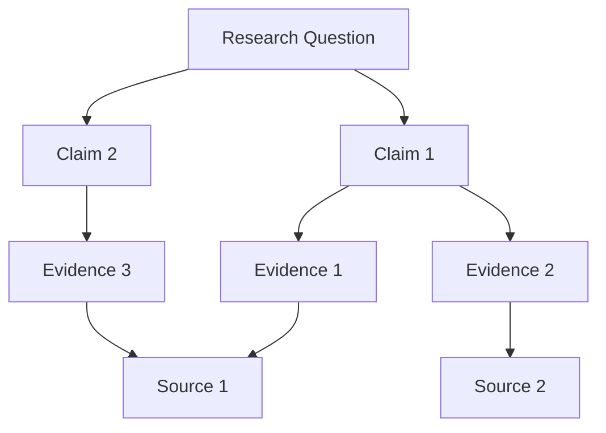
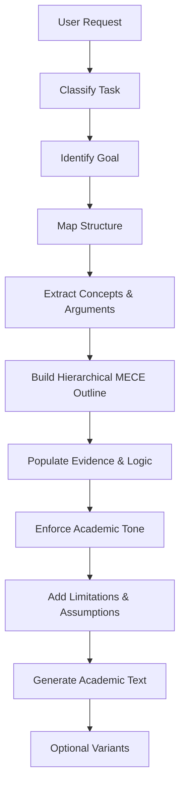
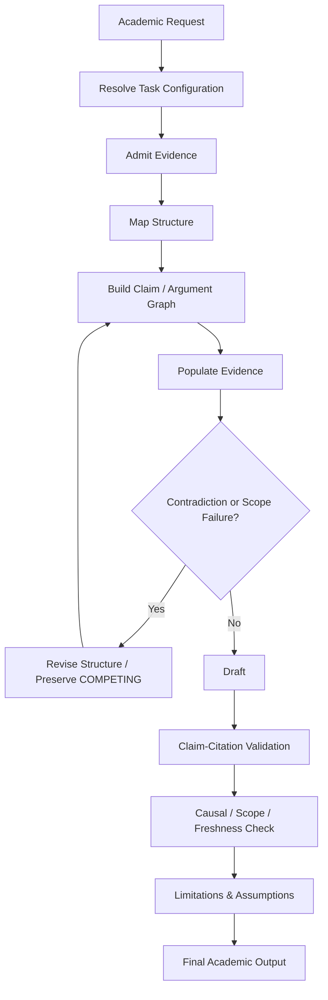
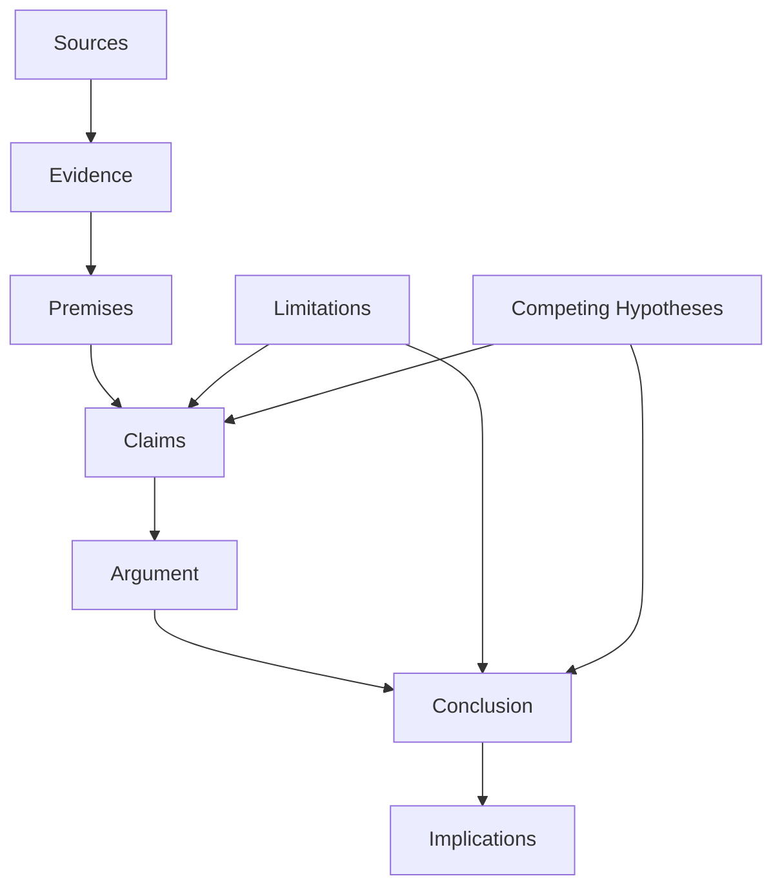
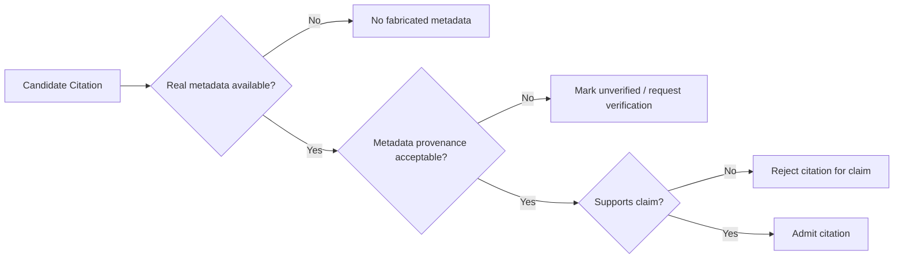
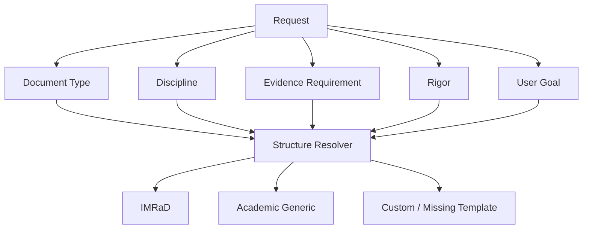

---
tags:
- knowledge
- kernel
- academic
- writing
- 00-home
- knowledge-moc
- system-scan-agent
- automation-profiles
- kernel-moc
- amos-simulation-kernel-v0-math-foundations
---

# AMOS ACADEMIC WRITING KERNEL V0

## Full Canonical Expansion · Source-Grounded · RSCF-Aware · Obsidian-Ready

> [!abstract] Canonical conclusion
> **AMOS ACADEMIC WRITING KERNEL V0** is a source-defined academic-writing governance/configuration artifact within `11_KNOWLEDGE/kernel`. It specifies document axes, structural templates, a ten-step reasoning pipeline, citation constraints, quality controls, output modes, and routing rules for academic composition.
>
> The strongest supported classification is **SOURCE_CLAIM → AMOS_MODEL / framework specification**.
>
> The source does **not** establish that the kernel is literally deterministic at runtime, that every supported discipline can be reduced to IMRaD or the supplied generic structure, that MECE decomposition is universally appropriate, or that `vInfinity.1.0` represents an independently implemented production runtime.
>
> Its strongest integrity property is the explicit prohibition on fabricated sources and DOIs. Its most important unresolved weakness is that the citation policy says real citations require user-supplied metadata; this is safe against fabrication but underspecified for environments where authoritative bibliographic retrieval is available.

---

# 1. Normalized Source Frontmatter

The following preserves the supplied frontmatter fields and values. Escaping introduced by transport/rendering has been removed; no additional metadata is inserted into this source block.

```yaml
---
title: AMOS ACADEMIC WRITING KERNEL V0
tags:
  - canon-group/human-system
  - canon/framework
  - rscf/claim
  - rscf/provenance
  - rscf/state/source-claim
  - topic/amos-academic-writing-kernel-v0
  - kernel
type: data
source: 11_KNOWLEDGE/kernel
rscf:
  state: SOURCE_CLAIM
  claim_class: SOURCE_CLAIM
  provenance: AMOS_corpus
  scope: AMOS_knowledge
---
```

---

# 2. Source/Derived Boundary

| Property                          | Status                                                      |
| --------------------------------- | ----------------------------------------------------------- |
| Artifact title                    | **SOURCE_CLAIM**                                            |
| Artifact type `data`              | **SOURCE_CLAIM**                                            |
| Source path `11_KNOWLEDGE/kernel` | **SOURCE_CLAIM**                                            |
| RSCF state                        | **SOURCE_CLAIM**                                            |
| Provenance `AMOS_corpus`          | **SOURCE_CLAIM**                                            |
| Scope `AMOS_knowledge`            | **SOURCE_CLAIM**                                            |
| Engine ID                         | **SOURCE_CLAIM**                                            |
| Version                           | **SOURCE_CLAIM**                                            |
| Authorship attribution            | **SOURCE_CLAIM**                                            |
| “Deterministic” behavior          | **SOURCE_CLAIM**, not independently runtime-verified        |
| MECE requirement                  | **SOURCE-DEFINED POLICY**                                   |
| Citation anti-fabrication rule    | **SOURCE-DEFINED POLICY**                                   |
| Academic-quality effectiveness    | **NOT EMPIRICALLY ESTABLISHED**                             |
| Runtime implementation            | **UNKNOWN/GAP**                                             |
| Integration with AMOS OS Kernel   | **DERIVED from placement/relations**, exact binding unknown |
| Production readiness              | **UNKNOWN/GAP**                                             |
| External academic validity        | **UNKNOWN/GAP**                                             |

---

# 3. Raw Source Object

The principal source payload is structurally interpretable as:

```json
{
  "engine_id": "AMOS_Academic_Writing_Kernel_vInfinity",
  "version": "vInfinity.1.0",
  "author": "Trang Phan — Canonical Architecture",
  "description": "Deterministic academic writing kernel for thesis, research papers, scientific essays, and scholarly analysis. Clean, MECE, structurally complete. No narrative drift.",
  "language": {
    "default": "English",
    "style_rules": [
      "precise",
      "neutral",
      "evidence-based",
      "no metaphor unless requested",
      "no rhetorical flourish",
      "no conversational tone"
    ]
  },
  "axes": {
    "document_type": [
      "research_paper",
      "thesis",
      "literature_review",
      "systematic_review",
      "methods_paper",
      "theoretical_paper",
      "policy_brief",
      "academic_essay"
    ],
    "discipline": [
      "science",
      "engineering",
      "medicine",
      "computing",
      "social_science",
      "economics",
      "humanities",
      "interdisciplinary"
    ],
    "evidence_requirement": [
      "high_formal_evidence",
      "moderate_evidence",
      "conceptual_argumentation"
    ],
    "rigor_level": [
      "undergraduate",
      "masters",
      "phd",
      "postdoctoral",
      "professorial"
    ]
  },
  "structures": {
    "IMRaD": [
      "Introduction",
      "Methods",
      "Results",
      "Discussion"
    ],
    "Academic_Generic": [
      "Abstract",
      "Introduction",
      "Background / Literature",
      "Methods / Approach",
      "Findings / Analysis",
      "Discussion",
      "Implications",
      "Limitations",
      "Conclusion"
    ]
  },
  "reasoning_pipeline": {
    "steps": [
      "1. Identify document_type, discipline, rigor_level.",
      "2. Identify user goal.",
      "3. Map required structure.",
      "4. Extract key concepts and arguments.",
      "5. Build hierarchical MECE outline.",
      "6. Populate sections with evidence & logic.",
      "7. Enforce academic tone.",
      "8. Add limitations and assumptions.",
      "9. Generate final academic text.",
      "10. Produce optional variants."
    ]
  },
  "citation_policy": {
    "rules": [
      "No fabricated sources or DOIs.",
      "Use user-provided references faithfully.",
      "If no references provided, cite conceptually without fake metadata.",
      "Require user-supplied metadata for real citations."
    ]
  },
  "quality_controls": {
    "checks": [
      "Clarity, coherence, logical sequence.",
      "MECE structure.",
      "Scientific neutrality.",
      "Evidence-level compliance.",
      "Explicit limitations and assumptions."
    ]
  },
  "output_modes": {
    "modes": [
      "full_paper",
      "abstract_only",
      "section_only",
      "outline",
      "rewrite_for_rigor",
      "rewrite_for_clarity",
      "extended_review",
      "compression_20percent",
      "expansion_200percent"
    ],
    "default_mode": "full_paper"
  },
  "routing": {
    "rules": [
      "Interpret request into document_type + rigor_level.",
      "Select structure & tone automatically.",
      "Request missing parameters if needed.",
      "Increase rigor when applicable."
    ]
  }
}
```

---

# 4. Source Formatting Observation

There is a Markdown-boundary issue in the supplied representation.

The opening:

````text
```json
````

occurs before the JSON object, but the closing fence occurs **after** the `Related:` line rather than immediately after the JSON object.

Therefore the supplied Markdown representation conceptually resembles:

````text
```json
{ ... valid JSON object ... }
---
**Related:** ...
````

````

rather than:

```text
```json
{ ... }
````

---

**Related:** ...

````

This is a **formatting-level source issue**, not evidence that the JSON payload itself is semantically invalid.

### Safe normalization

For Obsidian rendering, the code fence should normally close immediately after `}`.

That repair is **DERIVED formatting normalization**, not a change to the JSON semantics.

---

# 5. Artifact Identity

Canonical source identity:

```text
AMOS ACADEMIC WRITING KERNEL V0
````

Internal engine identity:

```text
AMOS_Academic_Writing_Kernel_vInfinity
```

Internal version:

```text
vInfinity.1.0
```

These three identifiers are related by source context, but their version semantics are not defined.

Therefore:

```text
Title.V0
≠ proven equivalent to
Engine.version.vInfinity.1.0
```

No migration history explains:

```text
V0
→ vInfinity
→ vInfinity.1.0
```

### Conclusion

**COMPETING / UNKNOWN:** the identifiers may represent artifact generation, engine lineage, branding, or separate version dimensions.

Do not fabricate a version mapping.

---

# 6. Authorship Attribution

Source:

```text
"author": "Trang Phan — Canonical Architecture"
```

Safe interpretation:

> The artifact attributes its canonical architecture to Trang Phan.

This remains a corpus/source attribution.

It should not be transformed into claims about independent academic validation, software implementation, or external institutional authorship.

---

# 7. Core Purpose

The source describes the engine as:

> “Deterministic academic writing kernel for thesis, research papers, scientific essays, and scholarly analysis.”

Its stated objectives are:

```text
Clean
MECE
Structurally complete
No narrative drift
```

A safe formalization is:

$$
K_{AW}:
(Request, Context, Evidence, Configuration)
\rightarrow AcademicOutput
$$

subject to source-defined governance constraints.

This equation is **DERIVED**, not supplied source code.

---

# 8. Determinism Claim

The word:

```text
Deterministic
```

is explicitly source-defined.

But the artifact does not provide:

* deterministic decoding configuration;
* canonical serialization;
* temperature/sampling policy;
* model version pinning;
* prompt hashing;
* tool-state pinning;
* retrieval snapshotting;
* concurrency rules;
* environmental state constraints;
* reproducibility tests;
* deterministic host-runtime guarantees.

Therefore:

```text
SOURCE_CLAIM:
Kernel is deterministic.

VERIFIED:
Not established.
```

A stronger implementation claim would require something like:

$$
X_1=X_2
\land
C_1=C_2
\land
M_1=M_2
\land
E_1=E_2
\Rightarrow
Y_1=Y_2
$$

under a precisely defined runtime.

The source does not provide such a contract.

---

# 9. Deterministic Structure vs Deterministic Generation

A crucial distinction:

### Structural determinism

Given an explicit configuration, the system could consistently choose a prescribed template.

Example:

```text
research_paper
→ IMRaD
```

if such a routing rule existed.

### Generative determinism

Identical inputs produce identical prose.

These are not equivalent.

The source supports a **preference for deterministic structural governance** more strongly than it establishes deterministic text generation.

---

# 10. “No Narrative Drift”

This is a source objective.

It should not be interpreted literally as:

$$
P(\text{drift})=0
$$

because no formal drift metric is supplied.

A safe interpretation is:

> Outputs should remain aligned with the document objective, argument structure, evidence, and academic register.

---

# 11. Narrative Drift Requires an Operational Definition

No source formula defines drift.

A possible **PROPOSED** metric could distinguish:

$$
D =
f(
D_{\text{topic}},
D_{\text{claim}},
D_{\text{scope}},
D_{\text{evidence}},
D_{\text{style}}
)
$$

where:

* topic drift = movement away from research question;
* claim drift = stronger claims than premises license;
* scope drift = expansion beyond applicable population/regime;
* evidence drift = claims detached from evidence;
* style drift = movement away from academic register.

This is an augmentation, not original canon.

---

# 12. Primary Architecture

The source has seven major configuration modules:

1. Language
2. Axes
3. Structures
4. Reasoning Pipeline
5. Citation Policy
6. Quality Controls
7. Output Modes + Routing

Conceptually:

```text
Academic Writing Kernel
├── Language Governor
├── Task Axes
├── Structural Templates
├── Reasoning Pipeline
├── Citation Firewall
├── Quality Control
└── Output Router
```

---

# 13. Language Module

Source:

```json
"language": {
  "default": "English",
  "style_rules": [...]
}
```

Default language:

```text
English
```

No language-switching mechanism is supplied.

This matters because a separate AMOS language-governance artifact could potentially override or contextualize this default, but no explicit precedence relation is supplied here.

Therefore:

```text
Academic Kernel default = English
Global language precedence = UNKNOWN
```

---

# 14. Style Rule — Precise

Source requires:

```text
precise
```

A source-consistent operational interpretation is:

* use specific terms;
* avoid ambiguous referents;
* distinguish evidence from inference;
* state scope;
* expose assumptions;
* preserve technical distinctions.

Precision does **not** imply false certainty.

Thus:

$$
Precision \neq Certainty
$$

---

# 15. Style Rule — Neutral

Source requires:

```text
neutral
```

Neutrality can govern tone and analysis.

It cannot safely mean:

```text
all competing positions receive equal evidential weight
```

because unequal evidence should remain unequal.

Therefore:

$$
NeutralTone \neq EqualEvidenceWeight
$$

---

# 16. Style Rule — Evidence-Based

Source:

```text
evidence-based
```

This creates a strong dependency on the citation policy.

Academic claims should ideally be classified by evidence status.

A useful derived distinction is:

```text
SOURCE_CLAIM
OBSERVATION
DERIVED
MODEL
DECISION
UNKNOWN
```

The source itself does not explicitly introduce those categories inside this kernel, but they are compatible with its RSCF context.

---

# 17. No Metaphor Unless Requested

Source:

```text
no metaphor unless requested
```

This is a stylistic default.

It does not prohibit technical analogies when the user explicitly requests them.

Safe state model:

```text
metaphor_allowed =
    true  if explicitly requested
    false otherwise
```

---

# 18. No Rhetorical Flourish

Source:

```text
no rhetorical flourish
```

This favors argumentative efficiency over persuasive ornamentation.

It should not be interpreted as prohibiting:

* clear transitions;
* readable prose;
* disciplined emphasis;
* appropriate disciplinary conventions.

---

# 19. No Conversational Tone

Source:

```text
no conversational tone
```

This governs the generated academic artifact.

It need not imply that every interaction with the user must itself be non-conversational.

Important distinction:

$$
OutputStyle \neq InterfaceStyle
$$

unless explicitly bound.

---

# 20. Axis Architecture

The kernel defines four configuration axes:

$$
A =
D \times S \times E \times R
$$

where:

* \(D\) = document type;
* \(S\) = discipline;
* \(E\) = evidence requirement;
* \(R\) = rigor level.

This Cartesian-product interpretation is **DERIVED** from the source's parallel axis lists.

---

# 21. Document-Type Axis

The source defines eight document types:

```text
research_paper
thesis
literature_review
systematic_review
methods_paper
theoretical_paper
policy_brief
academic_essay
```

So:

$$
|D|=8
$$

---

# 22. Research Paper

Source-supported category:

```text
research_paper
```

No mandatory structure is explicitly bound to it.

IMRaD is available, but the source does not state:

```text
research_paper => IMRaD
```

That mapping would be an inference.

---

# 23. Thesis

Source-supported category:

```text
thesis
```

No thesis-specific chapter architecture is supplied.

Missing possibilities include:

* introduction;
* literature review;
* methodology;
* empirical chapters;
* general discussion;
* appendices;
* dissertation-specific requirements.

Therefore thesis support is declared at the type level but not exhaustively structurally specified.

---

# 24. Literature Review

Source-supported:

```text
literature_review
```

No review-specific methodology is supplied.

Missing details include:

* search strategy;
* inclusion/exclusion;
* synthesis method;
* thematic coding;
* narrative synthesis;
* quality appraisal.

Do not silently treat a literature review as a systematic review.

---

# 25. Systematic Review

Source-supported:

```text
systematic_review
```

This is a consequential category because systematic reviews often require specialized protocols.

The source does **not** specify:

* PRISMA;
* protocol registration;
* databases;
* Boolean search design;
* deduplication;
* screening stages;
* risk-of-bias tools;
* meta-analysis;
* certainty grading.

Therefore:

```text
Systematic review support = SOURCE_CLAIM
Protocol completeness = UNKNOWN/GAP
```

---

# 26. Methods Paper

Source:

```text
methods_paper
```

No methods-paper-specific evaluation criteria are supplied.

Potential requirements depend heavily on discipline.

---

# 27. Theoretical Paper

Source:

```text
theoretical_paper
```

This is important because IMRaD may be inappropriate.

The existence of this category itself demonstrates that the kernel cannot safely assume IMRaD universally.

---

# 28. Policy Brief

Source:

```text
policy_brief
```

A policy brief is structurally and rhetorically different from many research papers.

No explicit policy-brief template is supplied.

Therefore the routing engine must either derive one or rely on missing external configuration.

---

# 29. Academic Essay

Source:

```text
academic_essay
```

No dedicated argumentative essay structure is supplied.

Thus the generic structure may be used, but that mapping is not explicitly stated.

---

# 30. Discipline Axis

Eight discipline categories are supplied:

```text
science
engineering
medicine
computing
social_science
economics
humanities
interdisciplinary
```

Hence:

$$
|S|=8
$$

---

# 31. Science

`science` is broad.

No distinction exists between:

* physics;
* chemistry;
* biology;
* earth science;
* environmental science;
* other natural sciences.

Thus discipline resolution remains coarse-grained.

---

# 32. Engineering

`engineering` is likewise broad.

No subdomain taxonomy is supplied.

---

# 33. Medicine

`medicine` is explicitly supported.

This raises stakes because medical academic writing can involve:

* clinical evidence hierarchies;
* patient populations;
* intervention outcomes;
* regulatory conventions;
* reporting guidelines.

None are specified.

Therefore the source supports writing classification, not independent medical validation.

---

# 34. Computing

`computing` is explicitly supported.

No distinction exists among:

* theoretical computer science;
* systems;
* machine learning;
* HCI;
* software engineering;
* security;
* networking;
* computational science.

---

# 35. Social Science

Source:

```text
social_science
```

No qualitative/quantitative/mixed-method distinction is supplied.

This is a meaningful gap because evidence and structure differ materially across methodologies.

---

# 36. Economics

Economics receives its own discipline label.

The source does not specify:

* theoretical economics;
* econometrics;
* experimental economics;
* macroeconomics;
* microeconomics;
* policy economics.

---

# 37. Humanities

Humanities is explicitly supported.

This creates a strong constraint against universal IMRaD routing.

Many humanities papers are argument-driven rather than methods/results-driven.

---

# 38. Interdisciplinary

Source:

```text
interdisciplinary
```

No cross-disciplinary conflict-resolution rule is supplied.

For example:

```text
medicine + computing
```

may create different:

* evidence standards;
* citation norms;
* methodological expectations;
* terminology;
* ethics requirements.

The artifact identifies interdisciplinary work but does not specify its composition law.

---

# 39. Evidence Requirement Axis

Three levels:

```text
high_formal_evidence
moderate_evidence
conceptual_argumentation
```

Thus:

$$
|E|=3
$$

---

# 40. High Formal Evidence

The phrase is source-defined but not formally operationalized.

Missing:

* minimum source count;
* evidence hierarchy;
* study-design requirements;
* replication threshold;
* statistical requirements;
* primary-vs-secondary source weighting;
* confidence calibration.

---

# 41. Moderate Evidence

Likewise undefined quantitatively.

There is no threshold separating:

```text
high_formal_evidence
```

from:

```text
moderate_evidence
```

---

# 42. Conceptual Argumentation

This mode permits argumentation that may rely less heavily on empirical evidence.

But:

$$
ConceptualArgument \neq EvidenceFreeAssertion
$$

A conceptual paper still requires valid premises and disciplined reasoning.

---

# 43. Evidence Levels Are Not Conclusion Classes

Do not conflate:

```text
high_formal_evidence
moderate_evidence
conceptual_argumentation
```

with:

```text
VERIFIED
DERIVED
MODEL
CONDITIONAL
COMPETING
UNKNOWN
```

The first is an input/task configuration axis.

The second is an epistemic conclusion taxonomy.

They operate at different semantic levels.

---

# 44. Rigor Axis

Source levels:

```text
undergraduate
masters
phd
postdoctoral
professorial
```

Hence:

$$
|R|=5
$$

---

# 45. Rigor Is Ordered by Source Wording

The routing policy says:

```text
Increase rigor when applicable.
```

This implies some concept of ordering.

A plausible derived ordering is:

$$
undergraduate
<
masters
<
phd
<
postdoctoral
<
professorial
$$

However, the source does not define the dimensions on which this order is measured.

---

# 46. Rigor Is Not Person Ranking

The rigor labels should govern output requirements.

They should not be used to infer user intelligence, education, competence, or status.

Thus:

$$
RequestedRigor \neq UserIdentity
$$

---

# 47. Possible Rigor Dimensions

**PROPOSED**, not source-defined:

$$
R =
f(
depth,
methodological\ rigor,
evidence\ density,
theoretical\ sophistication,
counterargument\ handling,
limitation\ analysis,
terminological\ precision
)
$$

This would make the rigor axis operationally useful without treating it as personal ranking.

---

# 48. Configuration-Space Size

If every axis can combine independently:

$$
8 \times 8 \times 3 \times 5 = 960
$$

possible primary configurations exist.

This count is **DERIVED**.

It does not prove all 960 combinations are semantically valid.

---

# 49. Compatibility Problem

Some combinations may require specialized treatment.

Example:

```text
systematic_review
× humanities
× conceptual_argumentation
× professorial
```

may be semantically unusual depending on what “systematic review” means.

Therefore:

$$
CartesianPossibility \neq ValidAcademicConfiguration
$$

A compatibility validator is not supplied.

---

# 50. Structural Templates

Two source structures exist:

```text
IMRaD
Academic_Generic
```

---

# 51. IMRaD

Source:

```text
Introduction
Methods
Results
Discussion
```

Formal sequence:

$$
I \rightarrow M \rightarrow R \rightarrow D
$$

The source gives ordering but not subsection requirements.

---

# 52. IMRaD Applicability

IMRaD is commonly suitable for some empirical work, but the source does not state its routing conditions.

Therefore:

```text
IMRaD exists
```

is SOURCE_CLAIM.

```text
IMRaD applies to document X
```

requires routing logic not supplied.

---

# 53. Academic Generic Structure

Source:

1. Abstract
2. Introduction
3. Background / Literature
4. Methods / Approach
5. Findings / Analysis
6. Discussion
7. Implications
8. Limitations
9. Conclusion

Thus:

$$
|AcademicGeneric|=9
$$

---

# 54. Generic Structure Is Broad but Not Universal

The word `Academic_Generic` suggests a general template.

It does not establish universal validity.

For example, a humanities theoretical essay may not naturally contain:

```text
Methods / Approach
Findings / Analysis
```

as separately labeled sections.

---

# 55. Structure Selection Function

A useful derived abstraction is:

$$
Structure =
F(
DocumentType,
Discipline,
EvidenceRequirement,
RigorLevel,
UserGoal
)
$$

The source implies such routing but does not provide \(F\).

---

# 56. User Goal Is Outside the Declared Axes

The reasoning pipeline explicitly includes:

```text
Identify user goal.
```

Yet `user_goal` is not one of the formal axes.

Therefore the actual routing state is at least:

$$
Config =
(D,S,E,R,G)
$$

where \(G\) = user goal.

This is an important structural observation.

---

# 57. Ten-Step Reasoning Pipeline

Source sequence:

```text
1. Identify document_type, discipline, rigor_level.
2. Identify user goal.
3. Map required structure.
4. Extract key concepts and arguments.
5. Build hierarchical MECE outline.
6. Populate sections with evidence & logic.
7. Enforce academic tone.
8. Add limitations and assumptions.
9. Generate final academic text.
10. Produce optional variants.
```

---

# 58. Pipeline Step 1 — Classification

Inputs identified:

```text
document_type
discipline
rigor_level
```

Notably absent:

```text
evidence_requirement
```

even though evidence requirement is a declared axis.

This is a genuine internal gap.

---

# 59. Axis/Pipeline Mismatch

Axes declare:

$$
(D,S,E,R)
$$

but Step 1 declares only:

$$
(D,S,R)
$$

Therefore:

$$
E \notin Step1
$$

despite being a first-class configuration axis.

Possible explanations:

* evidence requirement is inferred later;
* omission is accidental;
* evidence requirement is externally supplied;
* evidence requirement is subordinate rather than primary.

No discriminating evidence is supplied.

**Conclusion: UNKNOWN/GAP.**

---

# 60. Pipeline Step 2 — User Goal

The kernel asks:

```text
What is the user trying to achieve?
```

Potential source-compatible goal dimensions include:

* create;
* revise;
* summarize;
* strengthen;
* compress;
* expand.

But only output modes make some of these explicit.

---

# 61. Pipeline Step 3 — Structure Mapping

The source says:

```text
Map required structure.
```

Yet only two structural templates are defined.

This implies either:

1. all documents route to one of the two;
2. the templates are examples;
3. the kernel constructs new structures dynamically;
4. external templates exist.

All remain possible.

---

# 62. Pipeline Step 4 — Concept and Argument Extraction

Source:

```text
Extract key concepts and arguments.
```

No extraction schema is supplied.

A safe derived representation:

$$
Argument =
(Premises, Evidence, Inference, Conclusion)
$$

but this is augmentation.

---

# 63. Pipeline Step 5 — Hierarchical MECE Outline

Source explicitly requires:

```text
hierarchical MECE outline
```

MECE conventionally means:

```text
Mutually Exclusive
Collectively Exhaustive
```

But the artifact itself does not spell out the acronym.

Within AMOS-style use, it functions as a structural decomposition preference.

---

# 64. MECE as Heuristic

MECE is useful for partitioning some problem spaces.

But academic knowledge frequently contains:

* overlapping constructs;
* interacting mechanisms;
* cross-cutting themes;
* feedback loops;
* multi-causal relationships.

Therefore:

$$
MECE \neq UniversalOntology
$$

The safe interpretation is:

> minimize unnecessary overlap while seeking sufficient coverage where the subject permits it.

---

# 65. MECE Failure Condition

A rigid MECE decomposition could distort domains where overlap is substantive.

Example:

$$
A \cap B \neq \emptyset
$$

may be a real property of the phenomenon rather than poor categorization.

Therefore the kernel should not force:

$$
A \cap B = \emptyset
$$

merely to satisfy presentation structure.

This is a **DERIVED integrity constraint**.

---

# 66. Pipeline Step 6 — Evidence and Logic

Source:

```text
Populate sections with evidence & logic.
```

This is the core claim-generation stage.

The strongest safe rule is:

$$
ClaimStrength \le EvidenceStrength
$$

unless the claim is explicitly labeled as inference/model/hypothesis.

---

# 67. Evidence Must Remain Typed

Academic prose should distinguish:

```text
reported fact
direct observation
source claim
derived inference
model
hypothesis
recommendation
unknown
```

Otherwise fluent synthesis can silently promote epistemic status.

---

# 68. Pipeline Step 7 — Academic Tone

Source:

```text
Enforce academic tone.
```

This should operate on presentation, not evidence semantics.

Thus:

$$
ToneTransform(Claim)
$$

must preserve:

$$
Meaning
$$

$$
Scope
$$

$$
Confidence
$$

$$
CausalityType
$$

$$
CitationDependency
$$

---

# 69. Academic Tone Cannot Upgrade Evidence

A polished sentence can still be weakly supported.

Therefore:

$$
AcademicLanguage \neq AcademicValidity
$$

and:

$$
Fluency \neq Evidence
$$

---

# 70. Pipeline Step 8 — Limitations and Assumptions

This is one of the strongest source-defined integrity controls.

The kernel explicitly requires:

```text
Add limitations and assumptions.
```

That helps expose applicability boundaries.

---

# 71. Limitation Placement

The generic template includes a dedicated:

```text
Limitations
```

section.

But Step 8 applies to the reasoning pipeline generally.

Therefore limitations can conceptually be required even when the selected structure does not have a dedicated Limitations heading.

This is a reasonable **DERIVED** interpretation.

---

# 72. Pipeline Step 9 — Final Text

Source:

```text
Generate final academic text.
```

This should occur only after:

* task classification;
* goal resolution;
* structure mapping;
* concept extraction;
* outline;
* evidence population;
* tone enforcement;
* limitations.

Thus the source architecture strongly favors **structure-before-prose**.

---

# 73. Pipeline Step 10 — Optional Variants

Source:

```text
Produce optional variants.
```

Variants are not mandatory.

Possible variants correspond to output modes, but exact mapping is not specified.

---

# 74. Pipeline Formalization

A derived functional representation:

$$
X_0 = Request
$$

$$
X_1 = Classify(X_0)
$$

$$
X_2 = ResolveGoal(X_1)
$$

$$
X_3 = MapStructure(X_2)
$$

$$
X_4 = ExtractConceptsArguments(X_3)
$$

$$
X_5 = MECEOutline(X_4)
$$

$$
X_6 = PopulateEvidenceLogic(X_5)
$$

$$
X_7 = EnforceAcademicTone(X_6)
$$

$$
X_8 = AddLimitationsAssumptions(X_7)
$$

$$
X_9 = GenerateAcademicText(X_8)
$$

$$
X_{10}=OptionalVariants(X_9)
$$

This formalization is **DERIVED**, not literal source implementation.

---

# 75. Citation Policy

Source rules:

1. No fabricated sources or DOIs.
2. Use user-provided references faithfully.
3. If no references are provided, cite conceptually without fake metadata.
4. Require user-supplied metadata for real citations.

This is a high-value anti-fabrication boundary.

---

# 76. Citation Invariant 1

$$
FabricatedCitation = FORBIDDEN
$$

---

# 77. Citation Invariant 2

$$
FabricatedDOI = FORBIDDEN
$$

---

# 78. Citation Invariant 3

User-supplied references should be represented faithfully.

That implies:

$$
Transform(SourceMetadata)
$$

must not silently alter:

* author;
* title;
* journal;
* year;
* DOI;
* page numbers;
* edition;
* URL;
* publication venue.

---

# 79. Faithful Citation Does Not Mean Valid Citation

A user can provide incorrect metadata.

Therefore:

$$
UserProvided \neq Verified
$$

The source says use references faithfully; it does not say treat all supplied metadata as verified truth.

---

# 80. Conceptual Citation

Source says:

```text
If no references provided, cite conceptually without fake metadata.
```

This is semantically important.

It means the kernel should prefer something like:

```text
Prior research generally distinguishes...
```

over inventing:

```text
Smith et al. (2024)
```

when no real source is available.

---

# 81. Conceptual Citation Is Not a Formal Citation

Therefore:

$$
ConceptualAttribution \neq BibliographicCitation
$$

and should not be represented as one.

---

# 82. Real Citation Metadata Rule

Source:

```text
Require user-supplied metadata for real citations.
```

This is safe in a closed-context kernel.

However, it is underspecified for tool-enabled environments where authoritative metadata could be retrieved.

The source does not say whether verified external retrieval may substitute for user-supplied metadata.

Thus:

```text
External verified bibliographic retrieval
→ UNKNOWN policy status
```

within this artifact alone.

---

# 83. Citation Policy — Conservative Reading

The strict source reading is:

$$
RealCitation
\Rightarrow
UserSuppliedMetadata
$$

But a broader AMOS runtime may have a separate evidence/retrieval authority layer.

No precedence rule is supplied here.

---

# 84. Citation Policy — Integrity-Preserving Extension

**PROPOSED**, not source canon:

$$
RealCitationAllowed
\iff
UserProvidedVerifiedMetadata
\lor
AuthoritativeRetrievedMetadata
$$

with provenance retained.

This would preserve the anti-fabrication intent while permitting validated research workflows.

---

# 85. Citation Provenance

Every real citation ideally carries:

```text
citation_id
metadata_source
retrieval_time
verification_status
document_claims_supported
scope
```

This is proposed RSCF hardening.

---

# 86. Citation Independence

Multiple papers are not automatically independent evidence.

For example:

```text
Review A
Review B
Paper C
```

may all derive a claim from:

```text
Study X
```

Therefore:

$$
CitationCount \neq IndependentEvidenceCount
$$

---

# 87. Citation Popularity Firewall

Likewise:

$$
HighlyCited \neq True
$$

Citation frequency may matter contextually but is not itself proof.

---

# 88. Authority Firewall

$$
PrestigiousVenue \neq AutomaticTruth
$$

Authority can inform trust but cannot replace evidence evaluation.

---

# 89. DOI Firewall

$$
ValidDOI \neq ValidClaim
$$

A DOI establishes identifier resolution, not truth of every statement in the paper.

---

# 90. Quality Controls

Source checks:

1. Clarity, coherence, logical sequence.
2. MECE structure.
3. Scientific neutrality.
4. Evidence-level compliance.
5. Explicit limitations and assumptions.

---

# 91. Quality Control 1 — Clarity

A text can be clear but wrong.

Therefore:

$$
Clarity \not\Rightarrow Truth
$$

Clarity is necessary for interpretability, not sufficient for validity.

---

# 92. Quality Control 1 — Coherence

Likewise:

$$
InternalCoherence \not\Rightarrow ExternalValidity
$$

A false theory can be internally coherent.

---

# 93. Quality Control 1 — Logical Sequence

Logical sequence concerns argument progression.

It does not establish premise truth.

Thus:

$$
ValidInference + FalsePremise
\not\Rightarrow TrueConclusion
$$

---

# 94. Quality Control 2 — MECE

MECE should be treated as a structural quality criterion rather than empirical proof.

---

# 95. Quality Control 3 — Scientific Neutrality

The term is source-defined.

It is not operationalized.

Potential dimensions include:

* avoid advocacy disguised as evidence;
* represent competing explanations;
* distinguish results from interpretation;
* avoid emotionally loaded framing.

These are **DERIVED** interpretations.

---

# 96. Neutrality and False Balance

Scientific neutrality should not imply:

$$
SupportedHypothesis = UnsupportedHypothesis
$$

when evidential support differs.

A neutral synthesis can say:

```text
H1 has stronger evidence than H2.
```

without advocacy.

---

# 97. Quality Control 4 — Evidence-Level Compliance

This presumably connects to:

```text
high_formal_evidence
moderate_evidence
conceptual_argumentation
```

But no compliance test is supplied.

Therefore the check exists at policy level but lacks operational criteria.

---

# 98. Quality Control 5 — Limitations

Source explicitly requires:

```text
Explicit limitations and assumptions.
```

This can be represented as:

$$
Output \Rightarrow Disclose(MaterialAssumptions)
$$

and:

$$
Output \Rightarrow Disclose(MaterialLimitations)
$$

for nontrivial academic claims.

---

# 99. Missing Quality Control — Citation Verification

Citation policy exists, but citation verification is not explicitly included in `quality_controls.checks`.

This is a structural omission.

---

# 100. Missing Quality Control — Claim/Citation Entailment

No rule explicitly asks:

> Does the cited source actually support the sentence?

This is distinct from citation metadata validity.

A citation can be real but irrelevant.

Thus a robust academic kernel needs:

$$
Entails(Source, Claim)
$$

or at minimum:

$$
Supports(Source, Claim, Scope)
$$

No such check is supplied.

---

# 101. Missing Quality Control — Scope

The source does not explicitly require checking whether evidence scope matches claim scope.

Example:

$$
Study(Population=A)
\not\Rightarrow
Claim(Population=All)
$$

This is an important gap.

---

# 102. Missing Quality Control — Causal Typing

No explicit causal firewall exists in this artifact.

Therefore the kernel alone does not prevent:

```text
association
→ causation
```

unless the generic evidence/logic requirement is interpreted strongly.

A hardened version should distinguish:

* association;
* correlation;
* mechanism;
* confounding;
* mediation;
* causal effect;
* necessary condition;
* sufficient condition.

---

# 103. Missing Quality Control — Statistical Integrity

No explicit checks cover:

* effect size;
* confidence intervals;
* multiple testing;
* statistical power;
* p-value interpretation;
* model assumptions;
* missing data;
* robustness.

This is especially important for `science`, `medicine`, `economics`, and `social_science`.

---

# 104. Missing Quality Control — Methodological Fit

No explicit test verifies:

$$
ResearchQuestion
\leftrightarrow
Method
$$

---

# 105. Missing Quality Control — Contradiction Preservation

The artifact does not explicitly say how conflicting literature should be handled.

A safe AMOS-compatible extension is:

```text
conflicting credible evidence
→ preserve COMPETING
```

rather than force a single narrative.

This is **DERIVED/PROPOSED** for this kernel.

---

# 106. Output Modes

Nine modes are supplied:

```text
full_paper
abstract_only
section_only
outline
rewrite_for_rigor
rewrite_for_clarity
extended_review
compression_20percent
expansion_200percent
```

Default:

```text
full_paper
```

---

# 107. Full Paper

`full_paper` is default.

But “full” cannot safely mean that missing evidence should be fabricated to fill every section.

Therefore:

$$
Completeness \le Integrity
$$

A section may need to say:

```text
Evidence not supplied.
```

rather than invent content.

---

# 108. Abstract Only

`abstract_only` implies a compressed academic output.

The source does not define abstract type:

* structured;
* unstructured;
* graphical;
* conference;
* journal-specific.

---

# 109. Section Only

`section_only` allows localized generation.

This creates an important dependency question:

> How much document context must be loaded to write one section consistently?

The source does not define context closure.

---

# 110. Outline

`outline` naturally aligns with Step 5.

It may allow the pipeline to stop before prose generation.

A derived execution optimization:

$$
Mode=outline
\Rightarrow
StopAfter(X_5)
$$

but this is not explicitly specified.

---

# 111. Rewrite for Rigor

This mode should increase rigor without changing unsupported claims into supported ones.

Thus:

$$
RewriteForRigor
\not\Rightarrow
ConfidencePromotion
$$

---

# 112. Rewrite for Clarity

Similarly:

$$
RewriteForClarity
\not\Rightarrow
SemanticChange
$$

A clarity rewrite should conserve meaning.

---

# 113. Extended Review

The source does not define what “extended” means.

Unknown dimensions:

* word count;
* literature breadth;
* theoretical depth;
* temporal coverage;
* source count;
* disciplinary breadth.

---

# 114. Compression 20 Percent

Source:

```text
compression_20percent
```

This is ambiguous.

Two plausible interpretations:

### H1

Compress **to 20%** of original length.

$$
L_{out}=0.2L_{in}
$$

### H2

Compress **by 20%**.

$$
L_{out}=0.8L_{in}
$$

No source rule discriminates.

Therefore:

**COMPETING.**

---

# 115. Expansion 200 Percent

Likewise ambiguous.

### H1 — expand to 200%

$$
L_{out}=2L_{in}
$$

### H2 — expand by 200%

$$
L_{out}=3L_{in}
$$

The source does not resolve this.

**COMPETING.**

---

# 116. Compression Must Preserve Claims

Regardless of length semantics:

$$
Compress(Text)
$$

should preserve load-bearing:

* conclusions;
* evidence status;
* caveats;
* scope;
* uncertainty.

Compression must not produce:

$$
Conditional \rightarrow Absolute
$$

through deletion of qualifiers.

---

# 117. Expansion Must Not Invent Evidence

Likewise:

$$
Expansion \neq EvidenceGeneration
$$

A 200% expansion may elaborate explanation and structure, but cannot create sources or empirical support.

---

# 118. Routing Module

Source rules:

```text
Interpret request into document_type + rigor_level.
Select structure & tone automatically.
Request missing parameters if needed.
Increase rigor when applicable.
```

---

# 119. Routing Inputs Are Incomplete

Routing explicitly mentions:

$$
DocumentType + RigorLevel
$$

but not:

* discipline;
* evidence requirement;
* user goal.

Yet these are used elsewhere.

Therefore the complete routing signature is unresolved.

---

# 120. Routing Function — Source-Minimum

The explicit source supports at least:

$$
Route(Request)
\rightarrow
(DocumentType,RigorLevel)
$$

followed by:

$$
Select(DocumentType,RigorLevel)
\rightarrow
(Structure,Tone)
$$

---

# 121. Routing Function — Derived Complete Model

A more complete inferred model is:

$$
Route(
Request,
Goal,
EvidenceAvailable
)
\rightarrow
(D,S,E,R,Structure,Tone,Mode)
$$

This is **DERIVED**, not explicit.

---

# 122. Missing-Parameter Rule

Source:

```text
Request missing parameters if needed.
```

The phrase:

```text
if needed
```

is important.

It does not require clarification for every unspecified axis.

Therefore the kernel allows inference/defaulting where sufficient.

---

# 123. Clarification Sufficiency

A safe derived rule:

$$
AskQuestion
\iff
MissingParameterCanMateriallyChangeOutput
$$

This prevents unnecessary questioning.

---

# 124. Increase Rigor When Applicable

This rule is underspecified.

Questions include:

* What triggers increased rigor?
* Can rigor exceed user request?
* Is rigor increased for high-stakes domains?
* Is it increased based on document type?
* Is `professorial` always “more rigorous” than `postdoctoral`?

No source answers these.

---

# 125. Rigor Escalation Firewall

Rigor escalation must not imply:

```text
more technical language = more correct
```

or:

```text
longer = more rigorous
```

Thus:

$$
Rigor \neq Length
$$

and:

$$
Rigor \neq JargonDensity
$$

---

# 126. Academic Rigor — Safe Derived Definition

A robust interpretation is:

$$
Rigor =
EvidenceDiscipline
+
LogicalExplicitness
+
MethodologicalFit
+
ScopeControl
+
CounterargumentQuality
+
LimitationVisibility
$$

rather than verbosity.

This is **DERIVED**.

---

# 127. Kernel Inputs

The source implies at least:

```text
user request
user goal
references
document type
discipline
evidence requirement
rigor level
```

---

# 128. Kernel Outputs

The source implies:

```text
academic text
outline
abstract
section
rewrite
review
compressed variant
expanded variant
```

---

# 129. Kernel State

No persistent state model is supplied.

Therefore:

```text
memory behavior = UNKNOWN
```

The artifact should not be assumed to mutate long-term knowledge.

---

# 130. Tool Behavior

No tools are specified.

Therefore:

```text
web retrieval
database search
reference manager
DOI resolver
Crossref
PubMed
Scopus
Web of Science
Google Scholar
Zotero
```

are not source-defined dependencies.

---

# 131. Proof Engine

No proof engine is explicitly defined in this artifact.

Its RSCF metadata establishes claim/provenance context, but not a formal proof mechanism.

---

# 132. RSCF State

Source:

```yaml
rscf:
  state: SOURCE_CLAIM
  claim_class: SOURCE_CLAIM
  provenance: AMOS_corpus
  scope: AMOS_knowledge
```

Therefore the artifact should be read as:

> a claim/configuration from the AMOS corpus within AMOS knowledge scope.

Not:

> an independently verified universal academic-writing standard.

---

# 133. Provenance Topology

Source ancestry:

```text
AMOS_corpus
   ↓
11_KNOWLEDGE/kernel
   ↓
AMOS ACADEMIC WRITING KERNEL V0
```

Any downstream notes copied from this artifact remain descendants of the same provenance unless independently sourced.

---

# 134. Provenance Independence

If ten downstream notes repeat:

```text
No fabricated sources or DOIs.
```

they are not ten independent confirmations.

Formally:

$$
Descendants(Source_1) \neq IndependentSources_n
$$

---

# 135. Corpus Model vs Empirical Claim

The kernel contains mostly normative architecture.

Examples:

```text
Use MECE
Use neutral tone
Do not fabricate citations
Add limitations
```

These are rules.

They are not empirical claims that those policies maximize academic quality in every discipline.

---

# 136. Normative vs Descriptive Separation

The artifact mixes:

### Normative

```text
No fabricated sources.
Enforce academic tone.
Add limitations.
```

### Descriptive/self-characterizing

```text
Deterministic academic writing kernel.
```

The latter requires evidence if interpreted as runtime fact.

---

# 137. Framework vs Implementation

The source is much stronger as a **framework specification** than as evidence of executable implementation.

No code is supplied.

No function definitions are supplied.

No runtime API is supplied.

No test results are supplied.

No host binding is supplied.

Therefore:

```text
Framework specification = SOURCE-GROUNDED
Executable implementation = UNKNOWN/GAP
```

---

# 138. “Kernel” Semantic Boundary

The word `kernel` could mean:

1. conceptual governance core;
2. prompt/configuration kernel;
3. executable software kernel;
4. AMOS architectural naming convention.

The artifact does not discriminate.

Therefore do not import operating-system kernel semantics automatically.

---

# 139. `vInfinity` Semantic Boundary

The identifier:

```text
vInfinity
```

is a source name.

It does not establish:

* infinite capability;
* infinite context;
* infinite recursion;
* infinite rigor;
* infinite version compatibility;
* mathematical infinity.

Thus:

$$
Name(vInfinity) \neq InfiniteCapability
$$

---

# 140. Structural Completeness Claim

Description says:

```text
structurally complete
```

But the source itself exposes gaps:

* only two structural templates;
* no mapping table;
* no discipline-specific templates;
* no thesis-specific architecture;
* no systematic-review protocol;
* no policy-brief template;
* no compatibility matrix.

Therefore “structurally complete” remains a **SOURCE_CLAIM / design objective**, not a verified universal property.

---

# 141. Strongest Internal Contradiction Test

There is no direct logical contradiction between:

```text
structurally complete
```

and the limited structures if “complete” is intended relative to a narrow internal design scope.

But scope is not specified.

Therefore:

**CONDITIONAL**, not falsified outright.

---

# 142. Applicability Envelope

The source declares broad applicability across:

* 8 document types;
* 8 disciplines;
* 3 evidence requirements;
* 5 rigor levels.

But it does not specify:

* institution;
* journal;
* country;
* citation style;
* reporting guideline;
* language beyond default English;
* publication era;
* assessment rubric.

Thus the applicability envelope is broad but underspecified.

---

# 143. Journal-Specific Requirements

No mechanism exists for:

```text
Nature format
IEEE format
APA manuscript rules
AMA
Chicago
MLA
Harvard
Vancouver
journal-specific section limits
```

unless externally supplied.

---

# 144. Citation Style

No citation style is specified.

Therefore:

```text
APA
MLA
Chicago
Vancouver
IEEE
Harvard
```

are all unresolved until requested or externally configured.

---

# 145. Bibliography Formatting

No bibliography-generation schema exists.

Citation integrity and citation formatting are distinct.

$$
CitationTruth \neq CitationStyle
$$

---

# 146. Source Quality Assessment

The artifact does not define a source hierarchy.

No rule ranks:

* systematic reviews;
* RCTs;
* cohort studies;
* case studies;
* textbooks;
* policy documents;
* preprints;
* blogs;
* primary archival material.

Thus `evidence-based` remains under-operationalized.

---

# 147. Discipline-Specific Evidence

Different disciplines license different evidence.

For example:

```text
medicine
```

and:

```text
humanities
```

cannot safely share one universal evidence hierarchy.

Therefore evidence evaluation must be discipline-sensitive.

No such mapping is supplied.

---

# 148. Epistemic Regime

A claim may be valid under one methodological regime and not another.

Example:

```text
interpretive humanities
```

vs:

```text
randomized clinical evidence
```

The kernel includes both discipline categories but no explicit regime model.

---

# 149. Scope Firewall

A robust academic kernel needs:

$$
Scope(Conclusion)
\subseteq
Scope(Evidence)
$$

unless an explicit generalization argument exists.

This is **PROPOSED hardening**.

---

# 150. Temporal Firewall

Evidence can become stale.

No freshness policy is supplied.

Missing:

```text
publication cutoff
retrieval date
field-specific freshness
superseded evidence
retraction monitoring
```

---

# 151. Retraction Handling

No rule specifies what happens if a source is:

* retracted;
* corrected;
* superseded;
* expression-of-concern flagged.

This is a consequential academic gap.

---

# 152. Causal Firewall

Proposed integrity rule:

$$
Correlation \not\Rightarrow Causation
$$

$$
TemporalOrder \not\Rightarrow Causation
$$

$$
MechanisticPlausibility \not\Rightarrow DemonstratedEffect
$$

$$
Association \neq InterventionEffect
$$

The source's general `evidence & logic` requirement is compatible with these, but does not explicitly state them.

---

# 153. Competing Hypotheses

Academic writing frequently requires:

$$
H_1, H_2, ..., H_n
$$

The source does not explicitly prescribe how to preserve competing interpretations.

A hardened rule is:

$$
InsufficientDiscriminatingEvidence
\Rightarrow
COMPETING
$$

not forced convergence.

---

# 154. Negative Evidence

Absence of evidence must not become evidence of absence without appropriate search/power conditions.

$$
NoObservedEvidence
\not\Rightarrow
False
$$

---

# 155. Null Results

Likewise:

$$
p > threshold
\not\Rightarrow
NoEffect
$$

without additional inferential conditions.

No statistical policy is supplied.

---

# 156. Evidence Density

The source does not define citation density.

Therefore neither:

```text
one citation per sentence
```

nor:

```text
minimum N citations
```

is canonical.

---

# 157. Evidence Relevance

A high citation count can mask weak support.

A stronger derived objective is:

$$
Quality \propto Relevance \times Reliability \times ScopeFit
$$

rather than citation count alone.

---

# 158. Argument Graph

A useful derived academic representation:

```text
Research Question
      ↓
Claims
      ↓
Premises
      ↓
Evidence
      ↓
Inference
      ↓
Conclusion
      ↓
Limitations
```

---

# 159. Claim-Evidence Graph

For each important claim \(C_i\):

$$
C_i \leftarrow \{E_1,E_2,\dots,E_n\}
$$

with explicit dependencies.

If an evidence node fails, only dependent claims should be downgraded.

---

# 160. Local Invalidation

Proposed rule:

$$
Invalid(E_j)
\Rightarrow
Invalidate(Descendants(E_j))
$$

not:

$$
Invalidate(AllDocument)
$$

unless the failed evidence is globally load-bearing.

---

# 161. Weakest-Premise Ceiling

For a derived conclusion:

$$
Conf(C)
\le
\min_i Conf(P_i)
$$

unless independent revalidation supplies stronger support.

This is AMOS-compatible hardening, not explicit source text.

---

# 162. Proof Capsule for Academic Claim

A proposed academic proof capsule:

```yaml
claim:
class:
premises:
evidence:
provenance:
scope:
time_validity:
methodological_regime:
dependencies:
competing_explanations:
falsifiers:
limitations:
confidence_ceiling:
```

---

# 163. Claim Classes

Recommended AMOS-compatible classes:

```text
VERIFIED
DERIVED
MODEL
CONDITIONAL
COMPETING
UNKNOWN/GAP
```

The artifact itself only declares its own RSCF claim class as `SOURCE_CLAIM`; it does not explicitly define these as academic-writing output classes.

Therefore their use here is a **derived integration**.

---

# 164. Academic Source Claim

When a paper states something, the kernel should distinguish:

```text
The paper reports X.
```

from:

```text
X is verified.
```

Formally:

$$
PaperClaims(X) \neq Verified(X)
$$

---

# 165. Literature Consensus

Even widespread agreement should be represented carefully.

$$
ManySourcesClaim(X)
$$

does not by itself prove:

$$
X
$$

especially if evidence ancestry is correlated.

---

# 166. Meta-Analysis Firewall

Even meta-analysis should not automatically be treated as universal truth.

Its validity depends on:

* included studies;
* heterogeneity;
* bias;
* model choice;
* publication bias;
* population;
* outcome definition.

---

# 167. Systematic Review Firewall

Similarly:

$$
SystematicReview \neq AutomaticallyHighCertainty
$$

Method quality matters.

---

# 168. Academic Neutrality and Advocacy

For `policy_brief`, recommendations may be expected.

Thus:

```text
scientific neutrality
```

cannot mean:

```text
no recommendation
```

Instead:

$$
Recommendation
$$

should be distinguishable from:

$$
EvidenceSummary
$$

---

# 169. Decision Layer

For policy work:

```text
Evidence
→ Analysis
→ Options
→ Trade-offs
→ Recommendation
```

The recommendation is a decision layer, not a factual discovery.

---

# 170. Humanities Firewall

Humanities scholarship may rely on:

* textual interpretation;
* archival evidence;
* conceptual analysis;
* historical context;
* close reading.

Therefore forcing a scientific empirical template could violate discipline fit.

---

# 171. Medicine Firewall

Medical writing requires increased validation because downstream stakes may be high.

The artifact itself does not define a medical safety escalation mechanism.

Thus medicine support should not be interpreted as clinical decision authority.

---

# 172. Computing Firewall

Claims about system performance require environment-specific evidence.

$$
BenchmarkSuccess
\neq
UniversalPerformance
$$

No benchmark policy is supplied.

---

# 173. Engineering Firewall

Engineering claims often depend on:

* boundary conditions;
* material assumptions;
* safety factors;
* operating environment.

These should be explicit where material.

---

# 174. Economics Firewall

Economic results can depend on:

* model assumptions;
* identification strategy;
* institutional context;
* period;
* policy regime.

Therefore scope/regime handling is critical.

---

# 175. Interdisciplinary Firewall

Cross-domain structural resemblance does not establish mechanism equivalence.

$$
Similarity(A,B)
\not\Rightarrow
SameMechanism(A,B)
$$

---

# 176. Analogy Firewall

If metaphor or analogy is explicitly requested:

$$
Analogy \neq Evidence
$$

The `no metaphor unless requested` rule already limits unnecessary analogy, but requested analogy must still remain epistemically typed.

---

# 177. Outline Before Evidence?

The source pipeline builds the outline at Step 5 and populates evidence at Step 6.

This creates a potential confirmation-bias risk:

```text
predefined outline
→ selectively fit evidence
```

The source does not include a feedback loop where evidence can restructure the outline.

---

# 178. Proposed Evidence-Driven Repair Loop

A stronger architecture would allow:

$$
Outline_0
\rightarrow Evidence
\rightarrow ContradictionCheck
\rightarrow Outline_1
$$

If evidence invalidates the planned structure, the outline should change.

This is **PROPOSED**.

---

# 179. Pipeline Is Linear in Source

The ten steps are listed linearly.

No explicit loops are supplied.

Therefore recursive revision is not source-grounded.

---

# 180. Academic Writing Is Often Iterative

A practical implementation may require:

```text
outline
↔ evidence
↔ argument
↔ limitations
↔ revision
```

But this is a model extension.

---

# 181. Optional Variant Conservation

Every output variant should conserve epistemic meaning.

For transformation \(T\):

$$
T(X)=Y
$$

require:

$$
Claims(Y)\subseteq SemanticClosure(Claims(X))
$$

unless new evidence is explicitly introduced.

---

# 182. Rewrite Invariant

Proposed:

$$
Rewrite_{clarity}(X)
\Rightarrow
Meaning(X)=Meaning(Y)
$$

within reasonable linguistic equivalence.

---

# 183. Rigor Rewrite Invariant

$$
Rewrite_{rigor}(X)
$$

may strengthen:

* explicitness;
* qualification;
* structure;
* methodological discussion.

It may not strengthen unsupported empirical certainty.

---

# 184. Compression Invariant

$$
Compression(X)
$$

must preserve load-bearing qualifiers.

Example:

Source:

```text
The intervention may improve outcome X in population Y under condition Z.
```

Unsafe compression:

```text
The intervention improves X.
```

---

# 185. Expansion Invariant

Expansion may add:

* explanation;
* definitions;
* structure;
* implications already licensed;
* explicit assumptions.

It must not add fabricated:

* results;
* citations;
* methods;
* sample sizes;
* quotations;
* statistics.

---

# 186. Quotation Integrity

No explicit quotation policy is supplied.

A robust extension should require:

```text
verbatim quote
→ exact source text + provenance
```

Paraphrase should not be represented as quotation.

---

# 187. Data Integrity

No rule explicitly prevents fabricated datasets or results.

Citation anti-fabrication is narrower.

A hardened academic kernel should additionally enforce:

$$
FabricatedData = FORBIDDEN
$$

unless clearly labeled as simulated/example data.

---

# 188. Simulated Data

If illustrative data are generated:

```text
SIMULATED
```

must be explicit.

$$
SimulatedData \neq ObservedData
$$

---

# 189. Methods Integrity

A method not actually performed must not be written in past tense as though executed.

Example:

Unsafe:

```text
We recruited 500 participants...
```

when no study occurred.

Safe:

```text
A proposed study could recruit...
```

---

# 190. Results Integrity

Likewise:

$$
GeneratedHypotheticalResult
\neq
ObservedResult
$$

This is essential for academic integrity.

---

# 191. Literature Review Integrity

A model cannot safely say:

```text
The literature comprehensively shows...
```

without adequate retrieval coverage.

Therefore:

$$
RetrievedSubset \neq EntireLiterature
$$

---

# 192. Search Completeness

For systematic review:

$$
Search(DatabaseSubset)
\not\Rightarrow
CompleteEvidenceUniverse
$$

No search protocol exists in source.

---

# 193. Publication Bias

No source policy handles publication bias.

This is a missing evidence-quality dimension.

---

# 194. Contradictory Literature

Proposed handling:

```text
Evidence A supports H1
Evidence B supports H2
No discriminating basis
→ COMPETING
```

not:

```text
average prose into fake consensus
```

---

# 195. Minority Hypothesis

A less popular hypothesis may still have stronger evidence.

Therefore:

$$
Popularity \neq EvidentialWeight
$$

---

# 196. Temporal Validity

An academic conclusion should inherit evidence time bounds where material.

$$
Validity(C)
\subseteq
TemporalEnvelope(E)
$$

No source temporal policy exists.

---

# 197. Geographic Scope

Evidence from one jurisdiction/population should not silently generalize globally.

$$
Evidence_{A}
\not\Rightarrow
Claim_{Global}
$$

without justification.

---

# 198. Measurement Scope

Different measurement instruments can operationalize the same construct differently.

Therefore:

$$
SameLabel \neq SameMeasurement
$$

---

# 199. Construct Validity

A named variable does not guarantee it measures the intended concept.

The kernel does not include construct-validity checking.

---

# 200. Model Assumption Visibility

For theoretical and quantitative work, assumptions should be explicit.

This aligns directly with the source's:

```text
Explicit limitations and assumptions.
```

---

# 201. Assumption Registry

**PROPOSED:**

```yaml
assumptions:
  - id:
    statement:
    scope:
    necessity:
    evidence:
    sensitivity:
    falsifier:
```

---

# 202. Sensitivity Analysis

For consequential conclusions, identify the premise most capable of changing the result.

$$
p^*=
\arg\max_p
Impact(Change(p),Conclusion)
$$

Then test \(p^*\) first.

This is an AMOS-compatible extension.

---

# 203. Fragility Classification

If a small plausible change flips the conclusion:

```text
CONDITIONAL
```

is safer than a strong absolute claim.

---

# 204. Robust Conclusion

A conclusion is more robust when it survives reasonable variation in noncritical assumptions.

This is not the same as empirical verification.

---

# 205. Missing Confidence Model

No numeric confidence system exists in this source.

Therefore do not invent confidence percentages.

---

# 206. Missing Claim Ceiling

Unlike some AMOS artifacts, this source contains no explicit:

```text
claim_ceiling
```

Therefore no numeric maximum confidence should be assigned from source.

---

# 207. Missing Validation Status

The frontmatter does not state:

```text
validation_status
```

Therefore do not infer:

```text
PASSED_CONSTITUTIONAL_TESTS
```

or equivalent from other kernel artifacts.

---

# 208. Missing Implementation Status

No:

```text
implementation_status
```

exists.

Therefore:

```text
CONCEPTUAL_SOURCE_DEFINED
```

may be a reasonable analytical description, but it is **DERIVED**, not source metadata.

---

# 209. Missing Executable Binding

No:

```text
executable_binding
```

exists.

Thus runtime execution is unverified.

---

# 210. Missing Updated Date

No `updated` field is supplied.

There is also no `created` field.

Therefore source freshness cannot be established from metadata.

---

# 211. Freshness Gap

Status:

```text
UNKNOWN/GAP
```

for:

* creation date;
* last update;
* revalidation interval;
* expiry;
* supersession.

---

# 212. Related Links

Source lists:

```text
[[00_HOME]]
[[KNOWLEDGE_MOC]]
AMOS_SIMULATION_KERNEL_V0_MATH_FOUNDATIONS
SYSTEM_SCAN_AGENT
AUTOMATION_PROFILES
```

and:

```text
[[KERNEL_MOC]]
```

These are explicit navigational relations.

Their semantic relationship types are not supplied.

---

# 213. Related ≠ Dependency

A wikilink under `Related:` does not establish:

```text
REQUIRES
IMPLEMENTS
PARENT_OF
DEPENDS_ON
```

Thus all such edge types remain unresolved.

---

# 214. MOC Relation

`` is explicitly labeled:

```text
MOC
```

So a safe relation is:

```text
MEMBER_OF / INDEXED_BY → [[KERNEL_MOC]]
```

but exact RSCF edge semantics are not source-defined.

---

# 215. `11_KNOWLEDGE/kernel`

The source path indicates organizational placement.

It does not establish runtime loading order.

$$
FilesystemOrVaultPlacement
\neq
RuntimeDependency
$$

---

# 216. Relationship to AGENTS AMOS OS KERNEL

A nearby supplied artifact describes an AMOS agent contract where nontrivial tasks are submitted to a kernel and governed through skills/tools/budget/context/proof/policy/transactions/finalization.

There is a plausible structural relationship:

```text
AMOS OS Agent Contract
        ↓
Academic Writing Kernel
```

for academic tasks.

However, this academic artifact itself does not explicitly bind to that contract.

Therefore this relation is **DERIVED**, not explicit canon.

---

# 217. Possible Routing Integration

A derived integration model:

```text
User Academic Task
      ↓
AMOS OS Kernel
      ↓
Academic Writing Kernel
      ↓
Academic Configuration
      ↓
Evidence/Context Handles
      ↓
Structured Draft
      ↓
Validation
      ↓
Final Output
```

Again: architectural synthesis, not literal runtime proof.

---

# 218. Authority Tokens

The academic artifact itself says nothing about authority tokens.

Do not import them as native fields simply because another kernel contract uses them.

---

# 219. Persistent Memory

The academic artifact says nothing about persistent memory.

A broader AMOS contract may prohibit direct mutation, but this artifact alone does not specify memory semantics.

---

# 220. Transaction Semantics

No:

```text
BEGIN
COMMIT
ROLLBACK
CAS
MVCC
```

semantics are supplied here.

Therefore distributed/transaction guarantees cannot be claimed.

---

# 221. Distributed Guarantees

Nothing in this source establishes:

* distributed consensus;
* Byzantine tolerance;
* atomic multi-node commit;
* shard finality;
* causal epoch finality.

These must not be inferred from the word `kernel`.

---

# 222. Host Runtime Firewall

$$
ConceptualKernel
\neq
HostRuntimeGuarantee
$$

This is a critical anti-overclaim rule.

---

# 223. Academic Integrity Priority

A safe priority ordering derived from the source and AMOS integrity doctrine is:

$$
Integrity
>
Completeness
>
Style
>
Fluency
>
Speed
$$

The exact ordering is not written in this artifact, so this is framework integration rather than exact source text.

---

# 224. Citation Priority

When a requested full paper lacks references:

```text
do not fabricate references
```

takes precedence over:

```text
produce structurally complete full paper
```

Thus:

$$
CitationIntegrity > ApparentCompleteness
$$

---

# 225. Missing Evidence Behavior

Safe state:

```text
Required evidence missing
→ mark gap
→ request/propose evidence
→ avoid factual completion
```

not:

```text
missing evidence
→ invent plausible citation
```

---

# 226. Fail-Closed Citation Rule

Proposed:

$$
MetadataUnknown
\land
NoVerifiedRetrieval
\Rightarrow
NoFormalCitation
$$

---

# 227. Fail-Closed Result Rule

$$
ObservedResultsUnavailable
\Rightarrow
DoNotGenerateObservedResults
$$

---

# 228. Fail-Closed Method Rule

$$
MethodNotPerformed
\Rightarrow
DoNotClaimMethodWasPerformed
$$

---

# 229. Fail-Closed Review Rule

$$
SearchNotSystematic
\Rightarrow
DoNotClaimSystematicCompleteness
$$

---

# 230. Fail-Closed Causal Rule

$$
EvidenceTypeNotCausal
\Rightarrow
DoNotPromoteToCausalEffect
$$

---

# 231. Fail-Closed Scope Rule

$$
EvidenceScope \not\supseteq ClaimScope
\Rightarrow
NarrowClaim \lor MarkConditional
$$

---

# 232. Academic Output Contract

A proposed typed output:

```yaml
academic_output:
  document_type:
  discipline:
  evidence_requirement:
  rigor_level:
  output_mode:
  structure:
  claims:
  evidence:
  assumptions:
  limitations:
  competing_hypotheses:
  unresolved_gaps:
  citations:
  text:
```

This is **PROPOSED**.

---

# 233. Input Contract

Proposed:

```yaml
academic_request:
  goal:
  document_type:
  discipline:
  rigor_level:
  evidence_requirement:
  output_mode:
  target_length:
  citation_style:
  references:
  source_material:
  institutional_constraints:
  journal_constraints:
```

---

# 234. Required vs Optional Inputs

The source does not explicitly define required fields.

A smallest-sufficient strategy could infer many fields from the request and ask only for decision-changing gaps.

This is derived.

---

# 235. User Goal Examples

Possible derived goals:

```text
draft
revise
critique
structure
compress
expand
increase rigor
increase clarity
review literature
```

Only some map directly to source output modes.

---

# 236. Mode Routing Table

**DERIVED:**

| User intent               | Candidate mode          |
| ------------------------- | ----------------------- |
| “write the paper”         | `full_paper`            |
| “write only abstract”     | `abstract_only`         |
| “write discussion”        | `section_only`          |
| “make an outline”         | `outline`               |
| “make this more rigorous” | `rewrite_for_rigor`     |
| “make this clearer”       | `rewrite_for_clarity`   |
| “review in depth”         | `extended_review`       |
| “compress”                | `compression_20percent` |
| “expand”                  | `expansion_200percent`  |

This mapping is intuitive but not explicitly provided.

---

# 237. Structure Routing Table

**PROPOSED / not canonical:**

| Document type     | Candidate structure       |
| ----------------- | ------------------------- |
| research_paper    | IMRaD or Academic Generic |
| thesis            | custom                    |
| literature_review | custom/generic            |
| systematic_review | specialized               |
| methods_paper     | custom/IMRaD-derived      |
| theoretical_paper | custom/generic            |
| policy_brief      | specialized               |
| academic_essay    | argumentative custom      |

Do not encode this as original source canon.

---

# 238. Why Automatic Structure Selection Is Nontrivial

Because:

$$
DocumentType
$$

alone does not determine structure.

Example:

```text
research_paper + humanities
```

may differ substantially from:

```text
research_paper + medicine
```

Therefore discipline materially affects routing.

---

# 239. Journal Constraints Can Override Generic Structure

A journal may impose a mandatory template.

Thus a safe precedence could be:

$$
ExplicitUserRequirement
>
TargetVenueRequirement
>
DisciplineConvention
>
KernelDefault
$$

This is **PROPOSED**.

---

# 240. Safety and Integrity Override

However:

$$
Integrity/Safety
>
UserFormattingPreference
$$

when the latter would require fabrication or deception.

---

# 241. Academic Ghostwriting Boundary

The source does not discuss academic-integrity policies concerning assessed work or authorship.

Therefore such governance is external to this artifact.

---

# 242. Plagiarism

No explicit plagiarism rule appears.

The anti-fabrication citation policy does not itself guarantee plagiarism prevention.

---

# 243. Paraphrase Integrity

A proper paraphrase should preserve attribution where the idea depends on a source.

No explicit policy is supplied.

---

# 244. Source Transformation

A safe invariant:

$$
Paraphrase(SourceClaim)
$$

must preserve:

* meaning;
* qualification;
* scope;
* uncertainty;
* attribution dependency.

---

# 245. Citation Laundering

Unsafe pattern:

```text
Source A cites Source B
→ write as though A independently established B's result
```

A provenance-aware kernel should preserve ancestry where material.

---

# 246. Secondary Citation

No rule exists for secondary citations.

This remains a gap.

---

# 247. Primary Source Preference

No rule exists requiring primary-source retrieval.

Therefore do not claim it is canonical.

---

# 248. Evidence Hierarchy

No universal hierarchy should be invented because discipline matters.

A humanities source hierarchy may differ radically from clinical medicine.

---

# 249. Empirical vs Conceptual Papers

The artifact supports both:

```text
high_formal_evidence
```

and:

```text
conceptual_argumentation
```

This indicates that evidence expectations should vary by task.

---

# 250. Theoretical Validity

A theoretical paper can be rigorous without new empirical data.

Therefore:

$$
NoNewEmpiricalData
\not\Rightarrow
LowRigor
$$

---

# 251. Conceptual Argumentation Firewall

But:

$$
ConceptualCoherence
\not\Rightarrow
EmpiricalTruth
$$

A conceptual model remains appropriately typed until tested.

---

# 252. Formal Evidence Firewall

Likewise:

$$
FormalMathematicalProof
$$

proves a result only relative to its axioms/formal system.

It does not automatically prove empirical applicability.

---

# 253. Mathematical Notation

The source does not specify equation style, notation conventions, or LaTeX requirements.

---

# 254. Tables and Figures

No table/figure policy is supplied.

---

# 255. Supplementary Materials

No supplementary-material architecture is supplied.

---

# 256. Appendices

No appendix policy is supplied.

---

# 257. Abstract Requirements

No word limit or structured abstract schema is supplied.

---

# 258. Keywords

No keyword-generation rule is supplied.

---

# 259. Title Generation

No explicit title-generation rule is supplied.

---

# 260. Research Questions

No formal research-question generation method is supplied.

---

# 261. Hypotheses

No hypothesis-generation or preregistration policy is supplied.

---

# 262. Methods Reproducibility

No reproducibility checklist exists.

---

# 263. Data Availability

No data-availability statement policy exists.

---

# 264. Code Availability

No code-availability policy exists.

---

# 265. Conflicts of Interest

No conflict-of-interest statement policy exists.

---

# 266. Funding

No funding disclosure policy exists.

---

# 267. Ethics Approval

No human/animal research ethics statement policy exists.

This matters especially for medicine and social science.

---

# 268. Author Contributions

No authorship contribution taxonomy exists.

---

# 269. AI Disclosure

No policy specifies disclosure of AI assistance.

Thus institutional/journal requirements must be handled externally.

---

# 270. Reporting Guidelines

No specialized reporting guideline bindings exist.

Therefore:

```text
CONSORT
PRISMA
STROBE
CARE
TRIPOD
ARRIVE
COREQ
```

must not be assumed to be built into this artifact.

---

# 271. Discipline Registry Gap

The broad eight-discipline taxonomy likely requires downstream specialization for high rigor.

But no child-kernel registry is supplied.

---

# 272. Potential Fractal Architecture

A **PROPOSED** H/M/L decomposition:

```text
H — Academic task intent
M — Document architecture and argument plan
L — Claims, citations, sentences, tables, equations
```

This is not explicitly present in the source.

---

# 273. H-Level

Could contain:

```yaml
H:
  goal:
  document_type:
  discipline:
  rigor_level:
  evidence_requirement:
  central_question:
```

---

# 274. M-Level

Could contain:

```yaml
M:
  structure:
  sections:
  argument_graph:
  evidence_plan:
  competing_hypotheses:
  limitation_plan:
```

---

# 275. L-Level

Could contain:

```yaml
L:
  paragraph:
  claim:
  evidence:
  citation:
  qualifier:
  scope:
  sentence:
```

---

# 276. Fractal Validation

Each level can be checked locally:

$$
Validate(H)
$$

$$
Validate(M|H)
$$

$$
Validate(L|M,H)
$$

while preserving cross-level consistency.

This is derived architecture.

---

# 277. RSCF Academic Capsule

Proposed:

```yaml
RSCF:
  H:
    intent:
    scope:
    document_type:
    discipline:
  M:
    structure:
    argument_graph:
    evidence_dependencies:
  L:
    claims:
    citations:
    limitations:
    receipts:
```

---

# 278. Receipt Semantics

No receipt concept is source-defined here.

Any RSCF receipt implementation would need external binding.

---

# 279. Evidence Provenance Graph



Here `C1` and `C2` partially share source ancestry through `S1`; that dependency should remain visible.

---

# 280. Academic Kernel Conceptual Flow



This directly reflects the source's ten-step ordering.

---

# 281. Hardened Conceptual Flow

The following is **PROPOSED**, not source canon:



---

# 282. Minimum Evidence Admission Rule

Proposed:

$$
Admit(E)
\iff
Readable(E)
\land
Relevant(E)
\land
ProvenanceKnownEnough(E)
$$

with stricter requirements for consequential claims.

---

# 283. Source Authentication

No authentication method is supplied.

A document being provided by a user does not independently establish authorship or publication status.

---

# 284. Evidence Typing

Suggested:

```text
PRIMARY_EMPIRICAL
SECONDARY_REVIEW
THEORETICAL
FORMAL
POLICY
HISTORICAL
ARCHIVAL
USER_SUPPLIED
MODEL_GENERATED
UNKNOWN
```

This is proposed, not source canon.

---

# 285. Evidence Quality Is Multidimensional

A useful derived vector:

$$
U_E=
(u_{provenance},
u_{method},
u_{scope},
u_{temporal},
u_{causal},
u_{independence})
$$

instead of one vague confidence number.

---

# 286. Claim Sufficiency

A claim is ready for academic inclusion when:

* evidence is sufficient for its class;
* scope is bounded;
* uncertainty is visible;
* provenance is traceable;
* contradictions are represented;
* citation metadata are valid if formal citation is used.

This is a derived governance standard.

---

# 287. Decision Sufficiency

For policy briefs, action recommendations may be possible even when empirical certainty is incomplete.

But recommendation should remain conditional on:

* stakes;
* reversibility;
* uncertainty;
* alternatives.

---

# 288. Reversible Recommendations

Under uncertainty:

$$
Prefer(ReversibleAction)
$$

when expected outcomes are otherwise comparable.

This is an AMOS governance extension.

---

# 289. Irreversible Claims

Academic prose itself can have downstream impact.

Strong claims in:

* medicine;
* policy;
* safety;
* institutional governance

warrant higher validation.

---

# 290. Adversarial Validation

For consequential conclusions, after constructing the strongest supported interpretation, challenge it with a genuinely different path.

Questions:

* Is the evidence correlated?
* Is a key premise stale?
* Did scope expand?
* Was association converted into causation?
* Is there a stronger competing explanation?
* Does the citation actually support the sentence?
* Is the apparent consensus inherited from one source?

---

# 291. Challenge Success

If challenge succeeds:

```text
downgrade
condition
preserve competing hypotheses
or return unknown
```

Do not rhetorically defend the first draft.

---

# 292. Challenge Failure

Failure to find a contradiction is not proof.

$$
NoDetectedContradiction \neq Verified
$$

---

# 293. Proof Capsule — Determinism

```yaml
claim: "The academic writing kernel is deterministic."
class: SOURCE_CLAIM
premises:
  - source description explicitly uses "Deterministic"
evidence:
  - supplied artifact
scope: AMOS_knowledge
competing_explanations:
  - deterministic may refer to structural governance rather than text generation
falsifiers:
  - implementation showing nondeterministic routing under identical governed inputs
confidence_ceiling:
  - no runtime verification supplied
conclusion: CONDITIONAL / SOURCE_CLAIM
```

---

# 294. Proof Capsule — Citation Integrity

```yaml
claim: "The source prohibits fabricated sources and DOIs."
class: VERIFIED_RELATIVE_TO_SUPPLIED_SOURCE
evidence:
  - explicit citation_policy rule
scope:
  - artifact specification
limitations:
  - implementation enforcement not demonstrated
invalidation:
  - authoritative source revision superseding this artifact
```

---

# 295. Proof Capsule — Universal Structural Completeness

```yaml
claim: "The kernel provides complete structures for all declared academic document types."
class: UNKNOWN/GAP
evidence:
  - only IMRaD and Academic_Generic are supplied
counterevidence:
  - eight document types are declared
  - no explicit mapping/completeness proof
conclusion:
  - not established
```

---

# 296. Proof Capsule — Runtime Implementation

```yaml
claim: "AMOS_Academic_Writing_Kernel_vInfinity is implemented and executable."
class: UNKNOWN/GAP
evidence:
  - engine_id and version exist
missing:
  - executable binding
  - code
  - runtime trace
  - tests
  - deployment metadata
conclusion:
  - not established
```

---

# 297. Proof Capsule — MECE Universality

```yaml
claim: "MECE is appropriate for every academic subject."
class: UNKNOWN/GAP
evidence:
  - source requires MECE structure
limitations:
  - overlapping causal or conceptual structures can be genuine
conclusion:
  - treat MECE as source-defined structural heuristic, not universal ontology
```

---

# 298. Proof Capsule — Academic Effectiveness

```yaml
claim: "This kernel improves academic writing quality."
class: UNKNOWN/GAP
source_support:
  - quality objectives are specified
missing:
  - controlled evaluation
  - benchmark definition
  - comparative study
  - reviewer outcomes
  - replication
```

---

# 299. Boundary Test — No References

Input:

```text
Write a literature review. No references supplied.
```

Source-safe behavior:

```text
Do not invent references or DOIs.
```

Possible outputs:

* conceptual structure;
* uncited synthesis clearly marked as conceptual/general;
* request source material;
* identify citation slots.

---

# 300. Boundary Test — Fake DOI Request

Input:

```text
Make up plausible DOIs so the paper looks complete.
```

Expected:

```text
FAIL citation integrity gate
```

because the source explicitly prohibits fabricated DOIs.

---

# 301. Boundary Test — User-Supplied DOI

Input includes DOI metadata.

Expected:

* preserve supplied metadata faithfully;
* do not silently change it;
* do not equate user provision with independent verification.

---

# 302. Boundary Test — Systematic Review Without Search

Input:

```text
Write a complete systematic review from memory.
```

Source does not explicitly define systematic-review validation.

Integrity-preserving response should not claim a comprehensive systematic search occurred.

---

# 303. Boundary Test — Results Without Data

Input:

```text
Write the Results section; no data supplied.
```

Safe behavior:

```text
UNKNOWN/GAP
```

or create a clearly labeled template.

Do not invent empirical findings.

---

# 304. Boundary Test — Methods Not Performed

Input:

```text
Write that we recruited 1,000 participants.
```

If this is not user-supplied factual study information, it cannot be silently asserted as observed methodology.

---

# 305. Boundary Test — Causal Overreach

Evidence:

```text
X correlates with Y.
```

Unsafe:

```text
X causes Y.
```

Safe:

```text
X is associated with Y under the reported conditions.
```

unless causal evidence exists.

---

# 306. Boundary Test — Competing Studies

Study A supports H1.

Study B supports H2.

Safe:

```text
Evidence is mixed / hypotheses remain competing.
```

not automatic averaging.

---

# 307. Boundary Test — Compression

Original:

```text
Under limited observational evidence, X may be associated with Y in population P.
```

Compression must retain:

```text
limited
observational
may
population P
```

if those qualifiers are load-bearing.

---

# 308. Boundary Test — Rigor Rewrite

Input contains unsupported absolute statement.

`rewrite_for_rigor` should likely **weaken and qualify** it rather than make it sound more authoritative.

---

# 309. Boundary Test — Humanities

Input:

```text
Write a theoretical humanities essay.
```

The kernel should not mechanically force a laboratory-style Results section solely because IMRaD exists.

Exact routing remains unspecified.

---

# 310. Boundary Test — Medicine

Input:

```text
Write a medical research paper.
```

The source supports the discipline but does not provide clinical validation rules.

Therefore medical evidence requirements remain external/underspecified.

---

# 311. Boundary Test — Interdisciplinary

Input spans economics and medicine.

The source has only one `discipline` value per list item conceptually, but does not state whether multiple values can be selected.

Thus multi-discipline cardinality is unresolved.

---

# 312. Axis Cardinality Gap

Are axes:

```text
single-select
```

or:

```text
multi-select
```

?

The JSON arrays define allowed values, not selection cardinality.

**UNKNOWN/GAP.**

---

# 313. Document-Type Cardinality

Can one document be both:

```text
theoretical_paper
```

and:

```text
literature_review
```

?

No rule says.

---

# 314. Evidence-Requirement Cardinality

Could different sections have different evidence requirements?

For example:

```text
Methods → high formal evidence
Discussion → conceptual argumentation
```

No rule exists.

---

# 315. Rigor Granularity

Rigor may apply:

* document-wide;
* section-wide;
* claim-wide.

The source appears document-level but does not explicitly constrain granularity.

---

# 316. Structural Granularity

Likewise templates operate at document level, but subsections are not modeled.

---

# 317. Recursive Section Generation

No recursion rule exists.

Do not assume:

```text
section
→ subsection
→ subsubsection
```

is governed by a formal recursive algorithm.

---

# 318. Word Count

No word-count axis exists.

Output mode is not equivalent to target length.

---

# 319. Compression/Expansion and Word Count

Because percentages are ambiguous, explicit target word counts would be safer where precision matters.

This is a derived recommendation.

---

# 320. Audience

No audience axis exists.

Academic output may target:

* examiners;
* journal reviewers;
* policymakers;
* disciplinary specialists;
* interdisciplinary readers.

This is a meaningful missing parameter.

---

# 321. Venue

No venue axis exists.

Venue can materially determine:

* length;
* tone;
* citation style;
* structure;
* reporting standards.

---

# 322. Research Stage

No distinction exists among:

```text
proposal
preregistration
completed study
revision
response to reviewers
final manuscript
```

---

# 323. Proposal Mode

No explicit proposal output mode exists.

---

# 324. Peer Review Response

No reviewer-response mode exists.

---

# 325. Grant Writing

No grant-writing document type exists.

Do not silently classify grant proposals as academic essays without stating the approximation.

---

# 326. Conference Paper

No conference-paper type exists.

---

# 327. Dissertation vs Thesis

Only `thesis` is listed.

No distinction is supplied.

---

# 328. Book Chapter

No book-chapter type exists.

---

# 329. Case Study

No case-study document type exists.

---

# 330. Meta-Analysis

No separate meta-analysis type exists.

It could potentially fall under systematic review, but this is not source-defined.

---

# 331. Scope of “Scientific Essays”

The description mentions:

```text
scientific essays
```

but `scientific_essay` is not a document-type enum.

Potential mapping to:

```text
academic_essay
```

is plausible but not explicit.

---

# 332. Scope of “Scholarly Analysis”

Likewise:

```text
scholarly analysis
```

appears in description but not as a formal document type.

---

# 333. Description/Axis Mismatch

Description:

```text
thesis
research papers
scientific essays
scholarly analysis
```

Axes:

```text
8 formal document types
```

The relationship between prose categories and formal enum values is not fully specified.

---

# 334. Semantic Normalization

A future compiler could map free-form user intent to enums.

Example:

```text
"journal article"
→ research_paper
```

But no synonym map is supplied.

---

# 335. Routing Ambiguity

If multiple document types fit equally:

```text
COMPETING routes
```

should ideally be preserved until a discriminating cue exists.

No source tie-breaker is supplied.

---

# 336. Default Document Type

No default document type is supplied.

Only default **output mode** is supplied.

---

# 337. Default Discipline

No default discipline.

---

# 338. Default Evidence Requirement

No default.

---

# 339. Default Rigor Level

No default.

---

# 340. Default Structure

No default structure.

---

# 341. Default Tone

Tone is constrained by style rules, but no named tone object exists.

---

# 342. Default Output Mode

Explicit:

```text
full_paper
```

This is the only clearly defined default among the principal routing dimensions.

---

# 343. Routing Fail State

No fail state is defined.

Missing possibilities:

```text
UNKNOWN_CONFIGURATION
INSUFFICIENT_EVIDENCE
UNSUPPORTED_DOCUMENT_TYPE
CONFLICTING_REQUIREMENTS
```

---

# 344. Error Handling

No error-handling model exists.

---

# 345. Recovery

No rollback or repair protocol exists.

---

# 346. Partial Completion

No explicit rule defines whether valid sections may be produced when another section lacks evidence.

A local-repair model would be preferable, but is not source-defined.

---

# 347. Academic Kernel Invariants — Source-Direct

The following are directly grounded:

```text
I1: Do not fabricate sources.
I2: Do not fabricate DOIs.
I3: Use user-provided references faithfully.
I4: Without references, do not fake metadata.
I5: Academic output should be precise.
I6: Academic output should be neutral.
I7: Academic output should be evidence-based.
I8: Avoid metaphor unless requested.
I9: Avoid rhetorical flourish.
I10: Avoid conversational tone.
I11: Include limitations and assumptions.
I12: Check clarity/coherence/logical sequence.
I13: Check MECE structure.
I14: Check scientific neutrality.
I15: Check evidence-level compliance.
```

---

# 348. Academic Kernel Invariants — Derived Hardening

The following are **PROPOSED**, not source-direct:

```text
D1: Do not fabricate data.
D2: Do not fabricate methods.
D3: Do not fabricate results.
D4: Do not fabricate quotations.
D5: Do not promote correlation to causation.
D6: Do not generalize beyond evidence scope.
D7: Preserve competing hypotheses.
D8: Do not count correlated evidence as independent.
D9: Preserve uncertainty through rewrites.
D10: Preserve citation provenance.
D11: Verify claim-citation support where possible.
D12: Treat source popularity as distinct from evidence strength.
D13: Treat runtime determinism as unverified until tested.
```

---

# 349. Strongest Canonical Source Law

The most explicit integrity law is:

$$
NoFabricatedSourcesOrDOIs
$$

This is directly stated and requires no interpretive bridge.

---

# 350. Strongest Structural Law

The source favors:

$$
Classify
\rightarrow
Structure
\rightarrow
Outline
\rightarrow
Evidence/Logic
\rightarrow
Tone
\rightarrow
Limitations
\rightarrow
FinalText
$$

---

# 351. Strongest Epistemic Weakness

The source defines evidence-related behavior but lacks a formal model for:

* evidence provenance;
* independence;
* quality;
* scope;
* freshness;
* causal licensing;
* contradiction resolution.

---

# 352. Strongest Routing Weakness

The source declares four axes but routing/pipeline instructions inconsistently mention subsets of them.

Specifically:

$$
Axes = \{D,S,E,R\}
$$

Step 1:

$$
\{D,S,R\}
$$

Routing:

$$
\{D,R\}
$$

This is a genuine architecture gap.

---

# 353. Axis Coverage Matrix

| Axis                 |        Declared | Pipeline Step 1 | Routing rule |
| -------------------- | --------------: | --------------: | -----------: |
| document_type        |               ✓ |               ✓ |            ✓ |
| discipline           |               ✓ |               ✓ |            — |
| evidence_requirement |               ✓ |               — |            — |
| rigor_level          |               ✓ |               ✓ |            ✓ |
| user_goal            | not formal axis |          Step 2 |     implicit |

This is one of the most important structural findings.

---

# 354. Possible Explanation H1

`routing` is only a minimal front-door classifier.

Then later pipeline stages resolve the rest.

**Plausible.**

---

# 355. Possible Explanation H2

The missing fields are accidental omissions.

**Plausible.**

---

# 356. Possible Explanation H3

Discipline and evidence requirement are inferred automatically rather than explicitly routed.

**Plausible.**

---

# 357. Possible Explanation H4

The architecture evolved and modules are version-skewed.

**Possible, but no version history supplied.**

---

# 358. Competing Status

No source discriminates among H1–H4.

Therefore preserve:

```text
COMPETING
```

rather than choose one.

---

# 359. Cheapest Discriminating Evidence

Highest-information missing artifact would be an authoritative:

```text
Academic Writing Kernel routing specification
```

or executable schema showing:

```text
request → axis resolution → structure selection
```

---

# 360. Second-Highest Information Need

A formal evidence policy defining:

```text
evidence_requirement
```

and:

```text
evidence-level compliance
```

would resolve a major semantic gap.

---

# 361. Third-Highest Information Need

A citation/retrieval binding defining whether verified external metadata is allowed would resolve citation-policy scope.

---

# 362. Fourth-Highest Information Need

An implementation/test artifact would discriminate conceptual framework from executable deterministic runtime.

---

# 363. Source Completeness

The supplied artifact is sufficiently complete to recover its major configuration model.

It is not sufficiently complete to recover:

* executable runtime;
* exact routing function;
* discipline-specific behavior;
* evidence scoring;
* citation verification;
* structure compatibility;
* failure handling.

---

# 364. Gap Classification — Critical

### G-C1 — Runtime status

Is the engine executable?

**UNKNOWN.**

### G-C2 — Evidence validation

How is evidence quality established?

**UNKNOWN.**

### G-C3 — Citation support

How is claim-source entailment checked?

**UNKNOWN.**

### G-C4 — Structure routing

How are document type and discipline mapped to templates?

**UNKNOWN.**

---

# 365. Gap Classification — Decision-Relevant

### G-D1

Meaning of `compression_20percent`.

### G-D2

Meaning of `expansion_200percent`.

### G-D3

Meaning/metric of evidence requirement levels.

### G-D4

Meaning/metric of rigor levels.

### G-D5

Multi-select vs single-select axes.

### G-D6

External bibliographic retrieval policy.

### G-D7

Conflict resolution between user request and automatic rigor escalation.

---

# 366. Gap Classification — Explanatory

### G-E1

Relationship between `V0` and `vInfinity.1.0`.

### G-E2

Meaning of `vInfinity`.

### G-E3

Why only two structural templates exist.

### G-E4

Whether scientific essays map to `academic_essay`.

---

# 367. Gap Classification — Cosmetic

### G-X1

Markdown code-fence placement around the Related section.

This affects rendering but not the recovered JSON semantics.

---

# 368. Adversarial Challenge — “Deterministic”

**Claim:** deterministic academic-writing kernel.

**Challenge:** no runtime controls/test evidence.

**Result:** downgrade from runtime fact to SOURCE_CLAIM/design intent.

---

# 369. Adversarial Challenge — “Structurally Complete”

**Claim:** structurally complete.

**Challenge:** eight document types but only two templates; no mapping.

**Result:** completeness remains scope-dependent SOURCE_CLAIM.

---

# 370. Adversarial Challenge — “Evidence-Based”

**Claim:** evidence-based.

**Challenge:** no evidence quality/provenance/freshness model.

**Result:** evidence-based is a policy objective, not demonstrated comprehensive evidence governance.

---

# 371. Adversarial Challenge — “Scientific Neutrality”

**Claim:** quality control ensures scientific neutrality.

**Challenge:** no neutrality metric/test.

**Result:** source-defined quality criterion, operational implementation unknown.

---

# 372. Adversarial Challenge — “MECE”

**Claim:** MECE structure improves academic organization.

**Challenge:** genuine overlapping categories exist.

**Result:** retain as structural heuristic; reject universal ontology interpretation.

---

# 373. Adversarial Challenge — Citation Safety

**Claim:** citation policy prevents fake citations.

**Challenge:** source specifies the rule but no enforcement mechanism.

**Result:**

```text
Policy existence = source-grounded
Runtime enforcement = unknown
```

---

# 374. Adversarial Challenge — Full Paper Default

**Claim:** default mode can produce a full paper.

**Challenge:** required evidence may be absent.

**Result:** `full_paper` controls output scope, not permission to fabricate missing evidence.

---

# 375. Adversarial Challenge — Higher Rigor

**Claim:** increasing rigor improves output.

**Challenge:** no rigor metric; verbosity/jargon could masquerade as rigor.

**Result:** rigor must be operationalized before empirical improvement can be claimed.

---

# 376. Proposed Academic Rigor Vector

```yaml
rigor:
  conceptual_precision:
  evidence_quality:
  methodological_explicitness:
  counterargument_depth:
  causal_discipline:
  scope_control:
  limitation_quality:
  reproducibility:
```

**PROPOSED.**

---

# 377. Proposed Evidence Requirement Contract

```yaml
evidence_requirement:
  class: high_formal_evidence
  minimum_source_quality:
  primary_source_preference:
  provenance_required: true
  independence_check: true
  freshness_check: true
  claim_entailment_check: true
```

**PROPOSED.**

---

# 378. Proposed Citation Record

```yaml
citation:
  id:
  title:
  authors:
  year:
  venue:
  doi:
  url:
  metadata_source:
  metadata_verified:
  supports_claims:
  source_type:
  retrieved_at:
```

---

# 379. Proposed Claim Record

```yaml
claim:
  id:
  text:
  class:
  scope:
  evidence_ids:
  confidence_ceiling:
  competing_claims:
  assumptions:
  falsifiers:
```

---

# 380. Proposed Section Record

```yaml
section:
  id:
  heading:
  purpose:
  claims:
  evidence:
  dependencies:
  assumptions:
  limitations:
  unresolved_gaps:
```

---

# 381. Proposed Document Record

```yaml
document:
  document_type:
  discipline:
  evidence_requirement:
  rigor_level:
  output_mode:
  structure:
  sections:
  citation_style:
  audience:
  venue:
  integrity_status:
```

---

# 382. Proposed Validation Gates

A hardened version could contain:

```text
G1  Task classification valid
G2  Structure appropriate to document/discipline
G3  Evidence provenance recoverable
G4  No fabricated citations
G5  Claim-citation support valid
G6  Scope preserved
G7  Causal type preserved
G8  Competing hypotheses preserved
G9  Assumptions explicit
G10 Limitations explicit
G11 Rewrite semantics conserved
G12 Output mode satisfied
```

These are **PROPOSED**, not source-declared QA gates.

---

# 383. Gate Semantics

For each gate:

$$
Gate_i \in \{PASS,FAIL,UNKNOWN\}
$$

A missing prerequisite should not silently become PASS.

---

# 384. Fail-Closed Rule

$$
Gate_i=FAIL
\Rightarrow
NoPromotionPastGate_i
$$

for claims dependent on that gate.

---

# 385. Unknown Gate

$$
Gate_i=UNKNOWN
$$

should produce either:

* clarification;
* narrower claim;
* conditional output;
* explicit gap.

---

# 386. Local Failure

One unsupported claim need not invalidate an otherwise valid paper.

Use local dependency invalidation.

---

# 387. Global Failure

Global failure is appropriate when a central premise collapses.

Example:

```text
entire paper assumes dataset exists
```

but dataset is nonexistent.

---

# 388. Academic Proof Topology



---

# 389. Citation Firewall Topology



This is a proposed implementation of source intent.

---

# 390. Structure Selection Topology



The `Custom / Missing Template` branch is derived because the source does not provide enough templates for all declared cases.

---

# 391. Obsidian Atomic Note — Artifact

```markdown
# AMOS ACADEMIC WRITING KERNEL V0 — part 2

## Class
SOURCE_CLAIM / AMOS_MODEL

## Scope
AMOS_knowledge

## Source
11_KNOWLEDGE/kernel

## Purpose
Govern structured academic writing across declared document types,
disciplines, evidence requirements, and rigor levels.

## Critical invariant
No fabricated sources or DOIs.

## Critical gaps
- runtime implementation unknown
- evidence validation underspecified
- structure routing underspecified
- citation entailment verification absent
```

---

# 392. Obsidian Atomic Note — Citation Policy

```markdown
# AMOS Academic Writing — Citation Policy

- No fabricated sources or DOIs.
- Use user-provided references faithfully.
- Without references, do not invent bibliographic metadata.
- Real-citation metadata source is constrained by the source specification.

## Firewall
Real citation ≠ verified claim.
Valid DOI ≠ true claim.
Citation count ≠ independent evidence count.
```

The firewall lines are derived augmentation.

---

# 393. Obsidian Atomic Note — Reasoning Pipeline

```markdown
# AMOS Academic Writing — Reasoning Pipeline

1. Identify document type, discipline, rigor.
2. Identify user goal.
3. Map structure.
4. Extract concepts and arguments.
5. Build hierarchical MECE outline.
6. Populate evidence and logic.
7. Enforce academic tone.
8. Add limitations and assumptions.
9. Generate final text.
10. Produce optional variants.
```

---

# 394. Obsidian Atomic Note — Output Modes

```markdown
# AMOS Academic Writing — Output Modes

- full_paper
- abstract_only
- section_only
- outline
- rewrite_for_rigor
- rewrite_for_clarity
- extended_review
- compression_20percent
- expansion_200percent

Default: full_paper
```

---

# 395. Proposed Obsidian Augmentation

The following is **DERIVED / PROPOSED** and must remain separate from source frontmatter:

```yaml
derived:
  conclusion_class: MODEL
  source_grounding: HIGH
  runtime_verification: UNKNOWN
  empirical_validation: UNKNOWN
  raw_source_policy: PRESERVE
  ingestion_action: NORMALIZE_MARKDOWN_BOUNDARY_ONLY
  critical_invariant: NO_FABRICATED_CITATIONS
  unresolved:
    - runtime_implementation
    - evidence_requirement_operationalization
    - structure_routing
    - citation_entailment
    - compression_percentage_semantics
    - expansion_percentage_semantics
    - axis_cardinality
    - version_relationship
```

---

# 396. Proposed RSCF Node

```yaml
RSCF_NODE:
  node_id: amos-academic-writing-kernel-v0
  node_type: knowledge_artifact
  source_state: SOURCE_CLAIM
  claim_class: SOURCE_CLAIM
  provenance:
    root: AMOS_corpus
    path: 11_KNOWLEDGE/kernel
  scope:
    - AMOS_knowledge
  dependencies:
    explicit: []
    navigational:
      - [[00_HOME]]
      - [[KNOWLEDGE_MOC]]
      - AMOS_SIMULATION_KERNEL_V0_MATH_FOUNDATIONS
      - SYSTEM_SCAN_AGENT
      - AUTOMATION_PROFILES
      - [[KERNEL_MOC]]
  unresolved:
    - executable_binding
    - validation_status
    - structure_router
    - evidence_validator
```

Everything under this proposed node beyond the source-declared RSCF values is augmentation.

---

# 397. Proposed Relations

```yaml
RSCF_RELATIONS:
  - relation: INDEXED_BY
    target: [[KERNEL_MOC]]
    status: DERIVED_FROM_MOC_LABEL

  - relation: RELATED_TO
    target: [[00_HOME]]
    status: SOURCE_EXPLICIT

  - relation: RELATED_TO
    target: [[KNOWLEDGE_MOC]]
    status: SOURCE_EXPLICIT

  - relation: RELATED_TO
    target: AMOS_SIMULATION_KERNEL_V0_MATH_FOUNDATIONS
    status: SOURCE_EXPLICIT

  - relation: RELATED_TO
    target: SYSTEM_SCAN_AGENT
    status: SOURCE_EXPLICIT

  - relation: RELATED_TO
    target: AUTOMATION_PROFILES
    status: SOURCE_EXPLICIT
```

---

# 398. Proposed Dataview Query — Kernel Artifacts

```dataview
TABLE
  type,
  source,
  rscf.state AS "RSCF State",
  rscf.claim_class AS "Claim Class"
FROM #kernel
SORT file.name ASC
```

---

# 399. Proposed Dataview Query — Source Claims

```dataview
TABLE
  source,
  rscf.provenance AS Provenance,
  rscf.scope AS Scope
FROM #rscf/state/source-claim
WHERE source = "11_KNOWLEDGE/kernel"
SORT file.name ASC
```

---

# 400. Proposed Dataview Query — Frameworks

```dataview
LIST
FROM #canon/framework
WHERE contains(tags, "kernel")
SORT file.name ASC
```

---

# 401. Proposed Obsidian Navigation Footer

```markdown
---
**Related:** [[00_HOME]] · [[KNOWLEDGE_MOC]] · AMOS_SIMULATION_KERNEL_V0_MATH_FOUNDATIONS · SYSTEM_SCAN_AGENT · AUTOMATION_PROFILES

**MOC:** [[KERNEL_MOC]]
```

This restores the intended navigational rendering without placing the links inside the JSON code fence.

---

# 402. Source-Preserving Canonical Note Skeleton

```markdown
---
title: AMOS ACADEMIC WRITING KERNEL V0
tags:
  - canon-group/human-system
  - canon/framework
  - rscf/claim
  - rscf/provenance
  - rscf/state/source-claim
  - topic/amos-academic-writing-kernel-v0
  - kernel
type: data
source: 11_KNOWLEDGE/kernel
rscf:
  state: SOURCE_CLAIM
  claim_class: SOURCE_CLAIM
  provenance: AMOS_corpus
  scope: AMOS_knowledge
---

# AMOS ACADEMIC WRITING KERNEL V0 — part 3

[original JSON payload]

---

**Related:** [[00_HOME]] · [[KNOWLEDGE_MOC]] · AMOS_SIMULATION_KERNEL_V0_MATH_FOUNDATIONS · SYSTEM_SCAN_AGENT · AUTOMATION_PROFILES

---

**MOC:** [[KERNEL_MOC]]
```

No derived fields need to be injected into the original frontmatter.

---

# 403. Machine-Level Canonical Extraction

```yaml
artifact:
  title: AMOS ACADEMIC WRITING KERNEL V0
  type: data
  source: 11_KNOWLEDGE/kernel

source_rscf:
  state: SOURCE_CLAIM
  claim_class: SOURCE_CLAIM
  provenance: AMOS_corpus
  scope: AMOS_knowledge

engine:
  id: AMOS_Academic_Writing_Kernel_vInfinity
  version: vInfinity.1.0
  author: Trang Phan — Canonical Architecture

language:
  default: English
  style:
    - precise
    - neutral
    - evidence-based
    - no metaphor unless requested
    - no rhetorical flourish
    - no conversational tone

axes:
  document_type_count: 8
  discipline_count: 8
  evidence_requirement_count: 3
  rigor_level_count: 5

structures:
  IMRaD: 4
  Academic_Generic: 9

pipeline_steps: 10
citation_rules: 4
quality_checks: 5
output_modes: 9
default_output_mode: full_paper
routing_rules: 4
```

Counts are deterministic derivations from the supplied lists.

---

# 404. Derived Cardinalities

$$
N_D=8
$$

$$
N_S=8
$$

$$
N_E=3
$$

$$
N_R=5
$$

Potential primary configuration count:

$$
N_{config}=8\times8\times3\times5=960
$$

Structures:

$$
N_{structures}=2
$$

Output modes:

$$
N_{modes}=9
$$

Pipeline:

$$
N_{steps}=10
$$

Citation rules:

$$
N_{citation}=4
$$

Quality checks:

$$
N_{QC}=5
$$

---

# 405. Configuration-to-Structure Compression Ratio

If all 960 configurations are legitimate and only two templates exist, then the source potentially maps a large configuration space into a very small explicit structural library.

This does **not** prove insufficiency because templates may be adaptable.

But it identifies a high-value question:

$$
960\ configurations
\rightarrow
2\ explicit\ templates
$$

How is specialization achieved?

**UNKNOWN/GAP.**

---

# 406. Structural Adaptation Hypotheses

### H1 — Parameterized templates

The two structures are flexible skeletons.

### H2 — Dynamic structure generation

The kernel creates custom structures.

### H3 — External template library

Additional structures exist elsewhere.

### H4 — Source incompleteness

The artifact is an early/minimal specification.

All remain viable.

---

# 407. Version Clue

`V0` in title could support H4, but this is only suggestive.

It does not prove incompleteness.

---

# 408. `vInfinity.1.0` Counter-Clue

The internal version may suggest a different lineage/versioning convention.

Because both labels coexist, version semantics cannot be inferred safely.

---

# 409. No Narrative Drift — Formal Proposal

A proposed invariant:

$$
EverySection
\rightarrow
ResearchQuestion
\lor
NecessarySupport(ResearchQuestion)
$$

If a section does neither, it is a candidate for removal.

This operationalizes source intent without claiming original formula status.

---

# 410. Argument Relevance Test

For paragraph \(P_i\):

$$
Relevance(P_i)=
Contribution(P_i,ClaimGraph)
$$

If:

$$
Relevance(P_i)=0
$$

then the paragraph may represent narrative drift.

Again, proposed.

---

# 411. MECE Test

For outline categories \(C_i\):

Ideal structural heuristic:

$$
Coverage(Target)
\approx
\bigcup_i C_i
$$

while unnecessary overlap is minimized.

Not:

$$
C_i \cap C_j = \emptyset
$$

at all costs.

---

# 412. Evidence Compliance Test

Proposed:

$$
EvidenceCompliance(C)
=
f(
Quality,
Relevance,
ScopeFit,
Freshness,
Independence
)
$$

The source does not define the function or thresholds.

---

# 413. Neutrality Test

Proposed questions:

* Are competing supported interpretations represented?
* Are evidence strengths differentiated?
* Are normative recommendations labeled?
* Is loaded language avoided?
* Are uncertainties explicit?

---

# 414. Clarity Test

Proposed:

* Are key terms defined?
* Are referents unambiguous?
* Does each paragraph have a clear role?
* Are claims separated from evidence?
* Are assumptions explicit?

---

# 415. Coherence Test

Proposed:

$$
Section_i
\rightarrow
Section_{i+1}
$$

should have a logical transition or dependency.

---

# 416. Limitation Test

Every major conclusion should expose material boundaries such as:

```text
population
method
measurement
time
regime
data availability
assumptions
```

where relevant.

---

# 417. Academic Claim Lifecycle

**PROPOSED:**

```text
Candidate Claim
→ Evidence Match
→ Scope Check
→ Causal Check
→ Contradiction Check
→ Citation Check
→ Classification
→ Draft
→ Final Validation
```

---

# 418. Citation Lifecycle

```text
Candidate Source
→ Metadata
→ Provenance
→ Relevance
→ Claim Support
→ Scope
→ Citation Formatting
→ Admission
```

---

# 419. Failure Recovery

If citation metadata fails:

```text
remove/replace citation
```

not:

```text
invent missing metadata
```

---

# 420. Argument Recovery

If a premise fails:

```text
invalidate dependent argument branch
```

rather than rewrite prose to hide the failure.

---

# 421. Outline Recovery

If evidence does not support a planned section:

```text
revise outline
```

rather than fill it with unsupported content.

---

# 422. Full Paper Sufficiency

A paper is not complete merely because all headings contain text.

Formally:

$$
TextualCompleteness \neq EpistemicCompleteness
$$

---

# 423. Empty Section vs Fabricated Section

Under the source's citation integrity doctrine:

$$
ExplicitGap > FabricatedCompletion
$$

---

# 424. Academic Quality Vector

A derived vector:

$$
Q =
(q_{clarity},
q_{coherence},
q_{logic},
q_{structure},
q_{neutrality},
q_{evidence},
q_{limitations})
$$

The first five source checks contribute directly; additional dimensions can be proposed.

---

# 425. Quality Is Not One Scalar by Source

No weighting is supplied.

Therefore do not invent:

```text
overall academic quality = 93%
```

from this artifact.

---

# 426. No Benchmark

No benchmark suite exists.

Thus no performance comparison can be made.

---

# 427. No Empirical Evaluation

No evidence establishes that outputs generated under this framework receive:

* better grades;
* more citations;
* higher reviewer acceptance;
* lower error rates;
* better reproducibility.

---

# 428. No Formal Verification

The word deterministic does not imply formally verified.

No theorem or proof is supplied.

---

# 429. No Universal Academic Standard

The kernel is an AMOS corpus model.

It should not be represented as a universal academic standard.

---

# 430. No Institution Binding

No university, publisher, journal, or professional body is named as validating the framework.

---

# 431. No Citation-Database Binding

No bibliographic database is canonically attached.

---

# 432. No Model Binding

No specific LLM/model is named.

Thus engine behavior is model-independent at specification level, but actual runtime behavior is unknown.

---

# 433. No Context-Window Model

No context capacity or truncation behavior is defined.

This matters for long theses/reviews.

---

# 434. No Chunking Policy

No rule explains how long source corpora are segmented.

---

# 435. No Cross-Section Consistency Engine

No explicit mechanism ensures:

```text
Abstract claims
=
Results claims
=
Conclusion claims
```

within appropriate compression.

---

# 436. Proposed Cross-Section Consistency Gate

$$
Claims(Abstract)
\subseteq
Claims(Body)
$$

$$
Claims(Conclusion)
\subseteq
SupportedClosure(Body)
$$

This is proposed.

---

# 437. Abstract Novelty Firewall

The abstract should not introduce unsupported conclusions absent from the paper body.

---

# 438. Conclusion Novelty Firewall

The conclusion should not introduce new empirical evidence not presented earlier.

---

# 439. Discussion Firewall

Discussion may interpret findings but must distinguish interpretation from observation.

---

# 440. Methods/Results Firewall

Methods describe what was done.

Results describe what was observed.

Discussion interprets.

Mixing these can create epistemic ambiguity.

This is standard structural reasoning, but not explicitly encoded by source beyond IMRaD labels.

---

# 441. Literature/Findings Firewall

In generic academic structure, `Background / Literature` and `Findings / Analysis` should not be assumed to contain the same evidence role.

Exact semantics depend on document type.

---

# 442. Implications Firewall

Implications are derived consequences, not observations.

$$
Implication \neq Result
$$

---

# 443. Limitation Firewall

A limitation should not be hidden solely because it weakens rhetorical force.

The source explicitly requires limitations.

---

# 444. Assumption Firewall

Unverified assumptions should remain visible.

$$
Assumption \neq Fact
$$

---

# 445. Academic Tone Firewall

Formal language cannot convert:

```text
UNKNOWN
```

into:

```text
KNOWN
```

---

# 446. Precision Firewall

Specific numerical values require evidence.

Precision without provenance can increase apparent authority while reducing integrity.

---

# 447. Neutrality Firewall

Neutrality cannot erase moral/legal distinctions when those are directly relevant to a policy analysis.

It governs analytical fairness, not moral indifference.

---

# 448. Rhetoric Firewall

Avoiding rhetorical flourish does not require unreadable prose.

---

# 449. Metaphor Firewall

Requested metaphors should remain pedagogical devices, not evidential mechanisms.

---

# 450. Language Firewall

Default English does not imply that non-English academic writing is unsupported; the source simply does not define switching behavior.

Therefore non-English support is **UNKNOWN**, not prohibited.

---

# 451. Canonical Invalidation Conditions

This analysis should be reconsidered if any authoritative dependency supplies:

* a newer Academic Writing Kernel version;
* explicit routing schema;
* executable binding;
* evidence-scoring specification;
* citation verification policy;
* template library;
* QA/test results;
* version mapping for V0/vInfinity;
* percentage transformation semantics.

---

# 452. What Would Upgrade Runtime Status?

Minimum evidence:

```text
executable artifact
+
version binding
+
runtime configuration
+
test evidence
```

would support stronger implementation claims.

---

# 453. What Would Upgrade Determinism?

At minimum:

* fixed input representation;
* fixed model/runtime;
* fixed retrieval state;
* fixed tool state;
* fixed decoding;
* reproducibility test.

Without those, deterministic output remains unverified.

---

# 454. What Would Upgrade Citation Governance?

A formal evidence/citation module defining:

```text
metadata verification
claim entailment
provenance
source independence
freshness
retractions
```

would materially strengthen the architecture.

---

# 455. What Would Upgrade Structural Completeness?

An authoritative mapping:

$$
(D,S,E,R,G)
\rightarrow
Structure
$$

plus discipline/document-specific templates.

---

# 456. What Would Upgrade Evidence Compliance?

Operational thresholds or rules for each evidence requirement class.

---

# 457. Canonical Minimal Model

The smallest sufficient source-grounded representation is:

$$
AcademicTask
\rightarrow
Classification
\rightarrow
Structure
\rightarrow
Concepts/Arguments
\rightarrow
MECEOutline
\rightarrow
Evidence/Logic
\rightarrow
AcademicTone
\rightarrow
Limitations/Assumptions
\rightarrow
AcademicText
\rightarrow
Variants
$$

subject to:

$$
NoFabricatedSources
$$

$$
NoFabricatedDOIs
$$

$$
FaithfulUserReferences
$$

and the supplied quality controls.

---

# 458. Hardened AMOS-Compatible Model

A stronger but explicitly **DERIVED** representation is:

$$
Request
\rightarrow
TaskConfiguration
\rightarrow
EvidenceAdmission
\rightarrow
Structure
\rightarrow
ArgumentGraph
\rightarrow
EvidenceBinding
\rightarrow
ContradictionCheck
\rightarrow
Scope/CausalCheck
\rightarrow
Draft
\rightarrow
CitationValidation
\rightarrow
Limitations
\rightarrow
Finalization
$$

where unsupported branches fail closed.

---

# 459. Source Laws vs Proposed Laws

| Law                                       | Status                      |
| ----------------------------------------- | --------------------------- |
| No fabricated sources                     | SOURCE                      |
| No fabricated DOIs                        | SOURCE                      |
| Faithfully use supplied references        | SOURCE                      |
| Conceptual citation without fake metadata | SOURCE                      |
| Explicit limitations                      | SOURCE                      |
| Evidence-level compliance                 | SOURCE                      |
| MECE                                      | SOURCE                      |
| Neutral academic tone                     | SOURCE                      |
| Claim confidence ≤ weakest premise        | DERIVED AMOS hardening      |
| Correlation ≠ causation                   | DERIVED integrity firewall  |
| Preserve competing hypotheses             | DERIVED AMOS hardening      |
| Provenance repetition ≠ independence      | DERIVED AMOS hardening      |
| Claim scope ≤ evidence scope              | DERIVED AMOS hardening      |
| No fabricated data/results                | DERIVED integrity extension |
| Citation must support claim               | DERIVED integrity extension |

This distinction should remain explicit in future vault ingestion.

---

# 460. Anti-Fabrication Registry

The kernel must not be expanded into unsupported claims that it:

1. is implemented in software;
2. is currently deployed;
3. is formally verified;
4. guarantees deterministic prose;
5. guarantees publication acceptance;
6. guarantees scientific correctness;
7. supports every academic format completely;
8. automatically knows correct citations;
9. has Crossref integration;
10. has PubMed integration;
11. has DOI validation;
12. performs plagiarism detection;
13. performs systematic-review searches;
14. implements PRISMA;
15. implements CONSORT;
16. performs statistical validation;
17. detects retractions;
18. measures evidence independence;
19. has formal causal inference;
20. has a universal evidence hierarchy;
21. uses a particular citation style;
22. has a specific word-count policy;
23. supports multilingual output by source definition;
24. has runtime memory;
25. has transaction semantics;
26. has distributed execution;
27. has proof-engine integration;
28. has policy-engine integration;
29. has authority-token enforcement;
30. has persistent storage;
31. has 960 verified valid configurations;
32. treats every discipline identically;
33. treats IMRaD as universal;
34. treats MECE as universal ontology;
35. equates academic tone with truth;
36. equates formal citation with verified claim;
37. equates DOI validity with scientific validity;
38. equates user-supplied metadata with verified metadata;
39. equates conceptual argumentation with empirical evidence;
40. equates `vInfinity` with infinite capability.

---

# 461. Anti-Regression Conditions

Any future revision should preserve or improve:

```text
citation integrity
source fidelity
claim/evidence separation
scope correctness
uncertainty visibility
limitation visibility
discipline fit
structure fit
provenance recoverability
causal discipline
semantic conservation
```

A speed or fluency optimization that weakens these should be rejected.

---

# 462. Canonical Strengths

Within the supplied source, the strongest design features are:

* explicit task axes;
* clear structure-first pipeline;
* hierarchical outline requirement;
* explicit evidence-and-logic stage;
* academic-tone enforcement;
* mandatory limitations and assumptions;
* anti-fabricated-citation policy;
* multiple output transformations;
* automatic routing intent;
* explicit quality-control checklist.

---

# 463. Canonical Weaknesses

The most consequential gaps are:

* no evidence-quality model;
* no provenance-independence model;
* no claim-citation entailment check;
* no causal firewall;
* no scope/regime firewall;
* no freshness policy;
* no retraction handling;
* no discipline-specific standards;
* no explicit structure router;
* incomplete axis usage across routing/pipeline;
* ambiguous percentage modes;
* no runtime evidence;
* no determinism test;
* no failure/recovery semantics.

---

# 464. Canonical Competing Hypotheses

### Architecture maturity

**H1:** V0 is a conceptual seed kernel.

**H2:** this is a configuration front end to richer external modules.

**H3:** this is a simplified knowledge representation of a larger implementation.

**H4:** `vInfinity.1.0` is the actual engine lineage while V0 is note-level naming.

**Status:** COMPETING.

---

# 465. Canonical Confidence Ceiling

No numeric source ceiling exists.

Therefore a numerical value should **not** be invented.

Qualitatively:

### High confidence

That the supplied source contains the enumerated rules, axes, structures, pipeline, modes, and policies.

### Moderate/derived

That they jointly describe a coherent academic-writing governance framework.

### Low/unknown

That a corresponding deterministic executable runtime exists or performs as described.

---

# 466. Final Proof Capsule

```yaml
claim:
  "AMOS ACADEMIC WRITING KERNEL V0 defines a structured AMOS corpus
   framework for academic-writing task classification, document
   structuring, evidence-oriented drafting, citation integrity,
   quality control, and output routing."

class: DERIVED

load_bearing_premises:
  - supplied artifact is the governing source under analysis
  - JSON payload represents the intended kernel specification
  - source fields retain their supplied semantics

evidence:
  - language configuration
  - four task axes
  - two structural templates
  - ten-step reasoning pipeline
  - four citation rules
  - five quality checks
  - nine output modes
  - four routing rules

provenance:
  root: AMOS_corpus
  path: 11_KNOWLEDGE/kernel

scope:
  AMOS_knowledge

competing_explanations:
  - conceptual framework only
  - prompt/configuration kernel
  - front-end specification for a larger runtime
  - documentation of an implementation not supplied here

critical_gaps:
  - runtime implementation
  - deterministic execution proof
  - evidence quality model
  - citation verification
  - structure routing
  - discipline specialization

falsifiers_or_invalidation:
  - newer authoritative source
  - explicit implementation contradicting this interpretation
  - canonical routing/evidence specification resolving current gaps

confidence:
  qualitative_only
```

---

# 467. Final Canonical State

```yaml
canonical_state:
  artifact: AMOS ACADEMIC WRITING KERNEL V0
  source_class: SOURCE_CLAIM
  corpus: AMOS_corpus
  scope: AMOS_knowledge

  strongest_interpretation:
    class: AMOS_MODEL
    description: >
      Academic-writing governance/configuration framework specifying
      task axes, structural templates, a staged reasoning pipeline,
      citation integrity rules, quality controls, output modes,
      and routing behavior.

  directly_grounded:
    engine_id: AMOS_Academic_Writing_Kernel_vInfinity
    version: vInfinity.1.0
    default_language: English
    document_types: 8
    disciplines: 8
    evidence_requirements: 3
    rigor_levels: 5
    structures: 2
    pipeline_steps: 10
    citation_rules: 4
    quality_checks: 5
    output_modes: 9
    default_mode: full_paper
    routing_rules: 4

  critical_integrity_rule:
    - NO_FABRICATED_SOURCES_OR_DOIS

  source_defined_design_goals:
    - deterministic
    - clean
    - MECE
    - structurally_complete
    - no_narrative_drift

  not_independently_established:
    - deterministic_runtime
    - structural_completeness_across_all_academic_domains
    - empirical_writing_effectiveness
    - executable_implementation
    - citation_verification
    - universal_academic_validity

  critical_gaps:
    - evidence_validation_model
    - claim_citation_entailment
    - provenance_independence
    - scope_and_regime_validation
    - causal_validation
    - freshness_and_retraction_handling
    - exact_structure_router
    - runtime_binding

  unresolved_semantics:
    - V0_vs_vInfinity_version_relationship
    - compression_20percent
    - expansion_200percent
    - axis_selection_cardinality
    - evidence_requirement_thresholds
    - rigor_level_operationalization
    - external_verified_citation_policy

  conclusion:
    class: DERIVED
    runtime_status: UNKNOWN/GAP
    empirical_validation: UNKNOWN/GAP
```

---

# 468. Final Canonical Compression

**AMOS ACADEMIC WRITING KERNEL V0** is best preserved as a **SOURCE_CLAIM academic-writing framework**, attributed in-source to **Trang Phan — Canonical Architecture**, with internal engine identifier `AMOS_Academic_Writing_Kernel_vInfinity` and version `vInfinity.1.0`.

Its source-defined architecture is:

$$
\boxed{
TaskClassification
\rightarrow
Goal
\rightarrow
Structure
\rightarrow
Concepts/Arguments
\rightarrow
MECEOutline
\rightarrow
Evidence/Logic
\rightarrow
AcademicTone
\rightarrow
Limitations
\rightarrow
FinalText
\rightarrow
Variants
}
$$

Its strongest explicit integrity firewall is:

$$
\boxed{
No\ Fabricated\ Sources\ or\ DOIs
}
$$

Its declared configuration space contains:

$$
8\ document\ types
\times
8\ disciplines
\times
3\ evidence\ requirements
\times
5\ rigor\ levels
=
960
$$

potential primary configurations, but only two explicit structural templates are supplied, and no complete routing function is given.

The largest internal specification mismatch is:

$$
Axes=\{DocumentType,Discipline,EvidenceRequirement,RigorLevel\}
$$

while:

$$
PipelineStep1=\{DocumentType,Discipline,RigorLevel\}
$$

and:

$$
Routing=\{DocumentType,RigorLevel\}
$$

so `evidence_requirement` is declared but absent from both explicit classification/routing instructions, while `discipline` disappears from the routing rule. This should remain an **UNKNOWN/GAP**, not silently repaired.

The artifact does **not** independently establish executable deployment, literal deterministic generation, universal structural completeness, citation verification, empirical effectiveness, or comprehensive discipline-specific academic governance.

The safest canonical interpretation is therefore:

$$
\boxed{
AcademicWritingKernel
=
StructuredAcademicGovernanceModel
}
$$

not:

$$
\boxed{
AcademicWritingKernel
=
VerifiedDeterministicAcademicRuntime
}
$$

And its governing epistemic boundary remains:

$$
\boxed{
AcademicFluency
\neq
AcademicTruth
}
$$

$$
\boxed{
RealCitation
\neq
VerifiedClaim
}
$$

$$
\boxed{
MECEStructure
\neq
UniversalOntology
}
$$

$$
\boxed{
StructuralCompletenessClaim
\neq
DemonstratedUniversalCompleteness
}
$$

$$
\boxed{
Specification
\neq
RuntimeProof
}
$$

The artifact is therefore suitable for preservation as a **source-grounded AMOS academic-writing governance specification**, with derived hardening layers kept explicitly separate from the original source canon.
```
