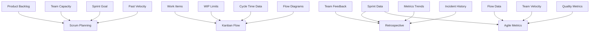
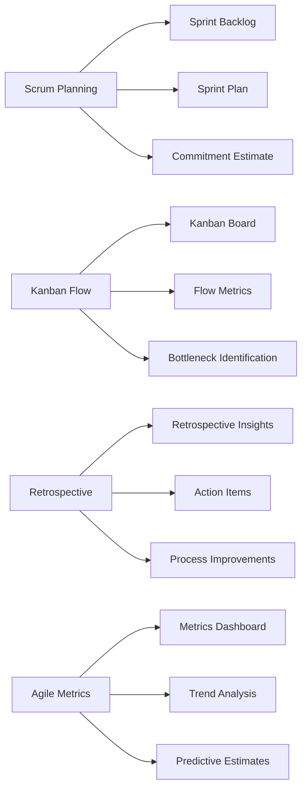
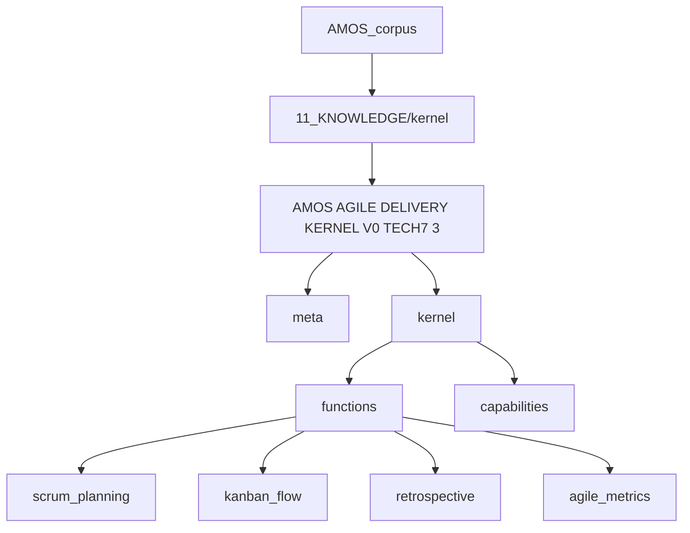
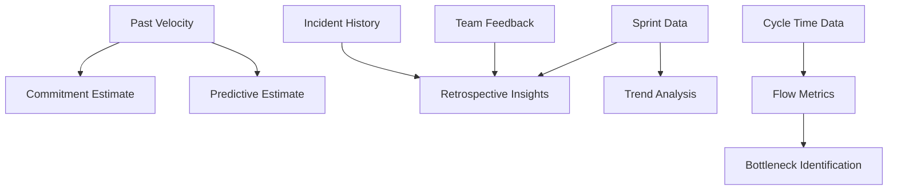
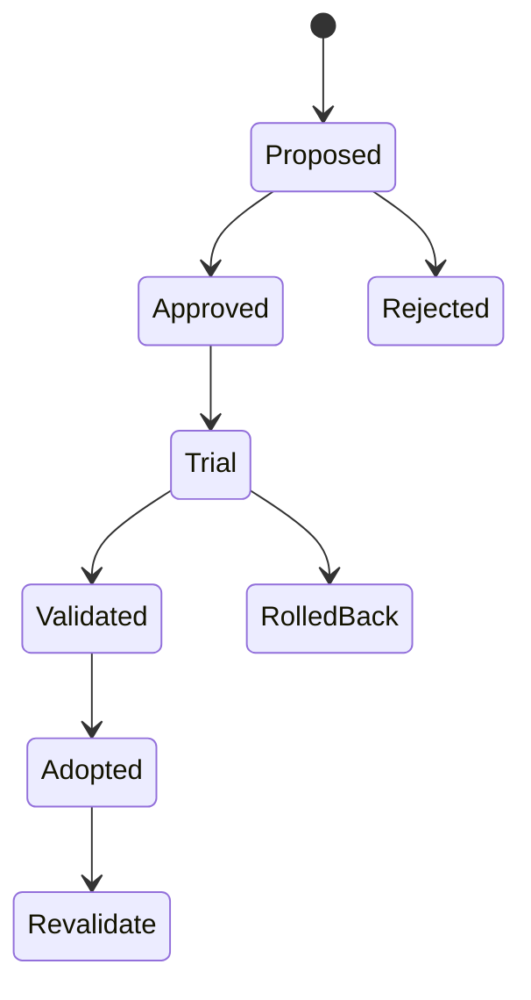
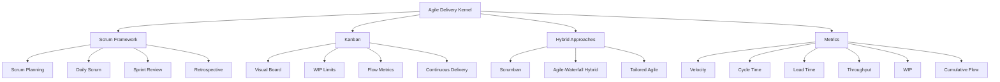
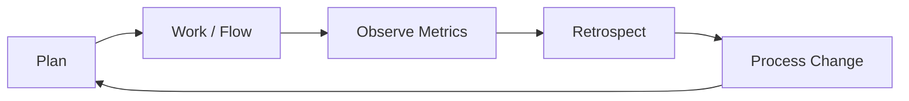
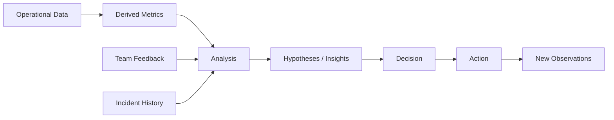
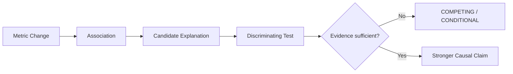
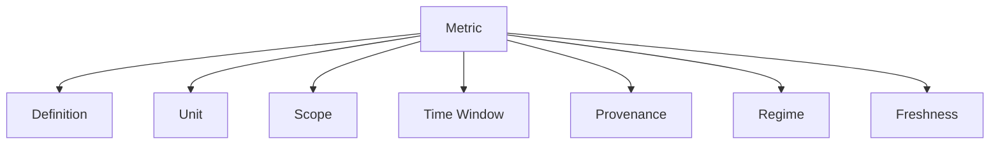

---

# AMOS AGILE DELIVERY KERNEL V0 TECH7 3

## Full Canonical Expansion — Source-Grounded, RSCF-Aware, Obsidian-Ready

> [!ABSTRACT] Canonical conclusion
> **Conclusion class: DERIVED**
>
> `AMOS AGILE DELIVERY KERNEL V0 TECH7 3` is a source-defined AMOS delivery-governance kernel covering four explicit operational functions:
>
> **Scrum Planning → Kanban Flow → Retrospective Learning → Agile Metrics**
>
> Its source establishes inputs, outputs, supported delivery practices, hybrid approaches, and a metric vocabulary. It does **not** establish executable implementation, forecasting mathematics, statistical calibration, metric thresholds, optimization policies, Scrum/Kanban standards compliance, or empirical delivery performance.
>
> The strongest source-safe interpretation is therefore:
>
> **a conceptual agile-delivery coordination and measurement contract inside the AMOS knowledge corpus, not independently verified delivery software or a complete formal theory of agile execution.**

______________________________________________________________________

## 1. Normalized Source Frontmatter

The following preserves the supplied metadata. Escaping has been normalized for Markdown readability; no new source fields are inserted.

```yaml
---
title: AMOS AGILE DELIVERY KERNEL V0 TECH7 3

tags:
  - canon-group/tech-ai
  - canon/metric
  - rscf/claim
  - rscf/provenance
  - rscf/state/source-claim
  - topic/amos-agile-delivery-kernel-v0
  - kernel

type: data
source: 11_KNOWLEDGE/kernel

rscf:
  state: SOURCE_CLAIM
  claim_class: SOURCE_CLAIM
  provenance: AMOS_corpus
  scope: AMOS_knowledge
---
```

______________________________________________________________________

## 2. Source Artifact

```json
{
  "meta": {
    "name": "Agile_Delivery_Kernel",
    "version": "1.0.0",
    "description": "Kernel for agile delivery: Scrum, Kanban, sprint planning, retrospectives, and agile metrics."
  },
  "kernel": {
    "description": "Supports agile delivery practices: Scrum framework, Kanban flow, sprint planning, daily standups, retrospectives, and agile metrics tracking.",
    "functions": {
      "scrum_planning": {
        "description": "Plan sprints using Scrum framework.",
        "inputs": [
          "product_backlog",
          "team_capacity",
          "sprint_goal",
          "past_velocity"
        ],
        "outputs": [
          "sprint_backlog",
          "sprint_plan",
          "commitment_estimate"
        ]
      },
      "kanban_flow": {
        "description": "Manage work using Kanban flow.",
        "inputs": [
          "work_items",
          "wip_limits",
          "cycle_time_data",
          "flow_diagrams"
        ],
        "outputs": [
          "kanban_board",
          "flow_metrics",
          "bottleneck_identification"
        ]
      },
      "retrospective": {
        "description": "Facilitate team retrospectives.",
        "inputs": [
          "sprint_data",
          "team_feedback",
          "metrics_trends",
          "incident_history"
        ],
        "outputs": [
          "retrospective_insights",
          "action_items",
          "process_improvements"
        ]
      },
      "agile_metrics": {
        "description": "Track and report agile metrics.",
        "inputs": [
          "sprint_data",
          "flow_data",
          "team_velocity",
          "quality_metrics"
        ],
        "outputs": [
          "metrics_dashboard",
          "trend_analysis",
          "predictive_estimates"
        ]
      }
    },
    "capabilities": {
      "scrum_framework": "Sprint planning, daily scrum, sprint review, retrospective.",
      "kanban": "Visual board, WIP limits, flow metrics, continuous delivery.",
      "hybrid_approaches": "Scrumban, agile-waterfall hybrid, tailored agile.",
      "metrics": "Velocity, cycle time, lead time, throughput, WIP, cumulative flow."
    }
  }
}
```

Source MOC:

```markdown

```

The supplied `Related:` field contains no populated links.

______________________________________________________________________

## 3. Derived / Proposed Obsidian Augmentation

> [!WARNING] DERIVED / PROPOSED
> Everything in this section extends the supplied artifact for vault usability. It is **not** represented as original source metadata.

```yaml
aliases:
  - Agile Delivery Kernel
  - AMOS Agile Kernel
  - Agile_Delivery_Kernel
  - Agile Delivery TECH7
  - Agile Delivery Kernel v1.0.0

artifact_id: amos_agile_delivery_kernel_v0_tech7_3
artifact_kind: KERNEL_SPEC
system: AMOS_OS
plane: 11_KNOWLEDGE
segment: kernel

source_version: "1.0.0"
source_name: Agile_Delivery_Kernel

epistemic_class: AMOS_MODEL
canonical_status: SOURCE_GROUNDED_CANON_CANDIDATE
implementation_status: CONCEPTUAL_SOURCE_DEFINED
runtime_status: UNKNOWN
empirical_validation_status: UNKNOWN

raw_source_policy: PRESERVE
ingestion_action: NORMALIZE_WITHOUT_CLAIM_PROMOTION

primary_domains:
  - agile_delivery
  - scrum
  - kanban
  - retrospectives
  - delivery_metrics

rscf_node_type: kernel
rscf_retrieval_priority: M
```

______________________________________________________________________

## 4. Artifact Identity

The source exposes two naming layers:

```text
Frontmatter title:
AMOS AGILE DELIVERY KERNEL V0 TECH7 3

JSON meta.name:
Agile_Delivery_Kernel

JSON meta.version:
1.0.0
```

These should not automatically be collapsed into one version identifier.

The relationship among:

```text
V0
TECH7
3
1.0.0
```

is not defined by the supplied source.

Therefore:

```text
TitleVersionSemantics = UNKNOWN/GAP
```

Possible interpretations include:

1. `V0` is the knowledge-artifact generation.
1. `1.0.0` is the internal kernel specification version.
1. `TECH7` identifies a technical corpus grouping.
1. `3` identifies a variant, revision, or extraction.
1. Some or all are legacy naming residues.

There is insufficient evidence to select among these.

______________________________________________________________________

## 5. Epistemic Boundary

The artifact explicitly declares:

```yaml
rscf:
  state: SOURCE_CLAIM
  claim_class: SOURCE_CLAIM
  provenance: AMOS_corpus
  scope: AMOS_knowledge
```

Therefore the proper epistemic reading is:

```text
AMOS corpus says that Agile_Delivery_Kernel
has these functions, inputs, outputs, and capabilities.
```

It does **not** independently establish:

```text
the kernel is deployed
the kernel is executable
the kernel improves delivery performance
the predictive estimates are calibrated
the kernel conforms exactly to Scrum Guide
the kernel conforms exactly to Kanban standards
the listed metrics predict future performance
the kernel has been experimentally validated
```

Those require separate evidence.

______________________________________________________________________

## 6. Core Kernel Definition

The source defines:

> Kernel for agile delivery: Scrum, Kanban, sprint planning, retrospectives, and agile metrics.

This can be represented as:

$$
K_{AD}
=
\{
Scrum,
Kanban,
SprintPlanning,
Retrospectives,
AgileMetrics
\}
$$

where (K\_{AD}) denotes the conceptual Agile Delivery Kernel.

**Class: DERIVED representation of SOURCE_CLAIM.**

______________________________________________________________________

## 7. Operational Scope

The fuller kernel description adds:

```text
Scrum framework
Kanban flow
sprint planning
daily standups
retrospectives
agile metrics tracking
```

Thus the kernel spans at least three functional dimensions:

$$
DeliveryKernel
=
Planning
+
Flow
+
Learning
+
Measurement
$$

More precisely:

$$
K_{AD}
=
P \cup F \cup L \cup M
$$

where:

- (P) = planning,
- (F) = flow management,
- (L) = retrospective learning,
- (M) = measurement.

This decomposition is DERIVED rather than explicit source terminology.

______________________________________________________________________

## 8. Explicit Function Inventory

The source defines exactly four function objects:

| Function         | Primary role                    |
| ---------------- | ------------------------------- |
| `scrum_planning` | Sprint planning                 |
| `kanban_flow`    | Work-flow management            |
| `retrospective`  | Team retrospective facilitation |
| `agile_metrics`  | Metric tracking/reporting       |

Therefore:

$$
|Functions_{explicit}| = 4
$$

This count is source-grounded.

______________________________________________________________________

## 9. Function Contract Model

Each function follows approximately:

$$
F_i:
Inputs_i
\rightarrow
Outputs_i
$$

Thus:

```text
scrum_planning:
    Inputs → Sprint artifacts

kanban_flow:
    Inputs → Flow artifacts

retrospective:
    Inputs → Learning/action artifacts

agile_metrics:
    Inputs → Measurement/forecast artifacts
```

The source does not provide transformation algorithms between these sets.

______________________________________________________________________

## 10. Scrum Planning Function

Source contract:

```yaml
scrum_planning:
  description: Plan sprints using Scrum framework.

  inputs:
    - product_backlog
    - team_capacity
    - sprint_goal
    - past_velocity

  outputs:
    - sprint_backlog
    - sprint_plan
    - commitment_estimate
```

Formalized:

$$
F_{SP}
:
(B,C,G,V)
\rightarrow
(SB,SP,CE)
$$

where:

- (B) = product backlog,
- (C) = team capacity,
- (G) = sprint goal,
- (V) = past velocity,
- (SB) = sprint backlog,
- (SP) = sprint plan,
- (CE) = commitment estimate.

This equation describes the source interface only.

It is **not** a source-supplied calculation.

______________________________________________________________________

## 11. Scrum Input — Product Backlog

`product_backlog` is explicitly required.

The source does not define:

- backlog schema,
- item type,
- priority semantics,
- dependency representation,
- estimation unit,
- acceptance criteria,
- readiness criteria,
- ordering algorithm.

Therefore:

```text
ProductBacklogType = SOURCE_DEFINED_NAME
ProductBacklogSchema = UNKNOWN/GAP
```

______________________________________________________________________

## 12. Scrum Input — Team Capacity

`team_capacity` is explicit.

But the source supplies no formula.

Do not silently assume:

$$
Capacity = People \times Hours
$$

or:

$$
Capacity = AvailableStoryPoints
$$

or any other standard interpretation.

Possible representations remain competing.

______________________________________________________________________

## 13. Capacity Is Not Velocity

A critical semantic distinction:

```text
team_capacity ≠ past_velocity
```

They are separate inputs.

Therefore the source architecture itself implies that historical throughput and current available capacity are not treated as identical variables.

This is a strong structural inference.

______________________________________________________________________

## 14. Scrum Input — Sprint Goal

`sprint_goal` is explicit.

It appears alongside backlog and capacity rather than being generated solely from them.

This suggests that planning is goal-conditioned:

$$
Plan = f(Backlog, Capacity, Goal, History)
$$

**DERIVED.**

The function (f) is unspecified.

______________________________________________________________________

## 15. Scrum Input — Past Velocity

`past_velocity` introduces historical delivery evidence.

This enables a potential temporal dependency:

$$
HistoricalDelivery
\rightarrow
CurrentPlanning
$$

But the source does not state how historical velocity is aggregated.

Unknowns include:

```text
number of historical sprints
mean vs median
outlier handling
team-composition changes
estimation-scale changes
seasonality
scope changes
confidence intervals
```

______________________________________________________________________

## 16. Scrum Output — Sprint Backlog

`sprint_backlog` is a source-defined output.

The source does not specify whether it contains:

- selected backlog items,
- tasks,
- estimates,
- dependencies,
- ownership,
- acceptance criteria,
- risk flags.

Do not invent the schema.

______________________________________________________________________

## 17. Scrum Output — Sprint Plan

`sprint_plan` is distinct from `sprint_backlog`.

Thus the source implies:

```text
SprintBacklog != SprintPlan
```

unless another artifact explicitly equates them.

A plausible distinction is:

```text
Sprint Backlog = selected work
Sprint Plan = execution arrangement
```

but that interpretation is DERIVED.

______________________________________________________________________

## 18. Scrum Output — Commitment Estimate

`commitment_estimate` is particularly important.

The source does not define whether it means:

- probability of completing the sprint backlog,
- amount of work the team should select,
- confidence score,
- forecast range,
- deterministic commitment,
- planning recommendation.

Therefore:

```text
CommitmentEstimateSemantics = UNKNOWN/GAP
```

It must not be silently interpreted as a probability.

______________________________________________________________________

## 19. Commitment Firewall

A safe governance law is:

$$
Estimate \neq Guarantee
$$

and:

$$
Forecast \neq CommitmentFact
$$

These are DERIVED integrity requirements.

Nothing in the source licenses deterministic certainty about future delivery.

______________________________________________________________________

## 20. Scrum Planning Evidence Topology

The inputs span different evidence classes:

```text
product_backlog  → present work state
team_capacity    → present resource state
sprint_goal      → intended outcome
past_velocity    → historical observation
```

Thus the function structurally combines:

$$
PresentState
+
Intent
+
History
$$

to produce planning outputs.

This is one of the strongest architectural properties of the kernel.

______________________________________________________________________

## 21. Kanban Flow Function

Source:

```yaml
kanban_flow:
  description: Manage work using Kanban flow.

  inputs:
    - work_items
    - wip_limits
    - cycle_time_data
    - flow_diagrams

  outputs:
    - kanban_board
    - flow_metrics
    - bottleneck_identification
```

Formal interface:

$$
F_K:
(W,L,C,D)
\rightarrow
(B,M,X)
$$

where:

- (W) = work items,
- (L) = WIP limits,
- (C) = cycle-time data,
- (D) = flow diagrams,
- (B) = Kanban board,
- (M) = flow metrics,
- (X) = bottleneck identification.

Again, the function is a structural representation, not supplied executable mathematics.

______________________________________________________________________

## 22. Kanban Input — Work Items

`work_items` is explicit.

Schema is absent.

Unknown properties include:

```text
identifier
class of service
state
owner
priority
age
blocked state
dependency
arrival time
completion time
```

None should be added as canonical source fields.

______________________________________________________________________

## 23. Kanban Input — WIP Limits

`wip_limits` establishes an explicit flow-control mechanism.

Conceptually:

$$
WIP_s \leq Limit_s
$$

could represent a typical WIP invariant.

But the source never gives this equation.

Therefore this is a **MODEL/DERIVED interpretation**, not a recovered source law.

______________________________________________________________________

## 24. WIP Limit Semantics

Unknown:

- per-column vs global,
- hard vs soft,
- team vs service class,
- static vs dynamic,
- exception policy,
- escalation behavior,
- breach response.

So:

```text
WIPLimitPolicy = UNKNOWN/GAP
```

______________________________________________________________________

## 25. Kanban Input — Cycle Time Data

`cycle_time_data` introduces temporal observations of work-item progression.

However, no source definition specifies start or end events.

Thus even a familiar formula such as:

$$
CycleTime = FinishTime - StartTime
$$

is not canonically instantiated until event semantics are defined.

______________________________________________________________________

## 26. Kanban Input — Flow Diagrams

`flow_diagrams` is explicit.

The source does not specify whether these are:

- cumulative flow diagrams,
- process diagrams,
- value-stream maps,
- state-transition diagrams,
- another representation.

Because the capability list separately names `cumulative flow`, treating all `flow_diagrams` as cumulative-flow diagrams would be unsupported.

______________________________________________________________________

## 27. Kanban Output — Kanban Board

`kanban_board` is an output despite work items already being an input.

This implies transformation from work representation into a board representation:

$$
WorkItems
\rightarrow
BoardRepresentation
$$

but board topology remains undefined.

______________________________________________________________________

## 28. Kanban Output — Flow Metrics

`flow_metrics` is generated by the Kanban function.

The capabilities section later identifies candidate metric families:

```text
cycle time
lead time
throughput
WIP
cumulative flow
```

A strong DERIVED interpretation is that some or all may populate `flow_metrics`.

However, the source does not explicitly map each capability metric to this output.

______________________________________________________________________

## 29. Kanban Output — Bottleneck Identification

The kernel claims an output:

```text
bottleneck_identification
```

This does not establish a bottleneck-detection algorithm.

Unknown:

```text
threshold
baseline
statistical method
queue definition
window
confidence
severity
root-cause analysis
```

Therefore:

$$
BottleneckIdentification
\neq
CausalDiagnosis
$$

______________________________________________________________________

## 30. Bottleneck Causal Firewall

A queue or flow anomaly may identify a location of congestion.

It does not by itself prove why the congestion exists.

Thus:

$$
ObservedCongestion
\not\Rightarrow
RootCause
$$

Possible explanations may include:

- dependency delay,
- resource shortage,
- batching,
- review bottleneck,
- demand spike,
- policy constraint,
- estimation error,
- quality rework,
- blocked external dependency.

Without discriminating evidence, they remain competing explanations.

______________________________________________________________________

## 31. Retrospective Function

Source:

```yaml
retrospective:
  description: Facilitate team retrospectives.

  inputs:
    - sprint_data
    - team_feedback
    - metrics_trends
    - incident_history

  outputs:
    - retrospective_insights
    - action_items
    - process_improvements
```

Formal interface:

$$
F_R:
(S,F,M,I)
\rightarrow
(R,A,P)
$$

where:

- (S) = sprint data,
- (F) = team feedback,
- (M) = metric trends,
- (I) = incident history,
- (R) = retrospective insights,
- (A) = action items,
- (P) = process improvements.

______________________________________________________________________

## 32. Retrospective Evidence Diversity

The retrospective combines:

```text
quantitative operational evidence
qualitative team evidence
historical trend evidence
incident evidence
```

This is structurally significant.

It means the source does not reduce retrospective reasoning to metrics alone.

______________________________________________________________________

## 33. Team Feedback

`team_feedback` is an explicit input.

This protects an important distinction:

$$
MeasuredFlow \neq CompleteTeamReality
$$

At least conceptually, the kernel recognizes human feedback as an independent input class.

But independence of provenance is not guaranteed.

______________________________________________________________________

## 34. Sprint Data

`sprint_data` is reused elsewhere in the kernel.

It is input to:

```text
retrospective
agile_metrics
```

Therefore it acts as a shared evidence node.

This creates correlated provenance.

If both downstream functions reach the same conclusion from the same sprint data, that agreement is not automatically independent corroboration.

______________________________________________________________________

## 35. Metrics Trends

`metrics_trends` introduces temporal aggregation.

But the source does not define:

- trend window,
- smoothing,
- significance,
- baseline,
- control limits,
- trend reversal,
- missing observations.

Thus:

```text
TrendAlgorithm = UNKNOWN/GAP
```

______________________________________________________________________

## 36. Incident History

`incident_history` adds failure/quality evidence to retrospective reasoning.

However:

```text
IncidentHistory != RootCauseProof
```

Incident records may establish events without establishing their causes.

______________________________________________________________________

## 37. Retrospective Insights

`retrospective_insights` are derived outputs.

A safe epistemic classification is:

```text
retrospective_insights → DERIVED
```

unless an insight merely restates an observation.

They should not automatically be promoted to verified causal findings.

______________________________________________________________________

## 38. Action Items

The source transforms retrospective inputs into `action_items`.

Conceptually:

$$
Evidence
\rightarrow
Interpretation
\rightarrow
Action
$$

The middle step matters.

An action can be justified under uncertainty without the underlying explanation being causally proven.

______________________________________________________________________

## 39. Process Improvements

`process_improvements` is an output label.

It should not be interpreted as proof that the recommended change will actually improve the process.

A safer distinction:

```text
proposed_process_improvement
vs
validated_process_improvement
```

The source does not define this distinction explicitly.

It is a DERIVED governance hardening.

______________________________________________________________________

## 40. Retrospective Learning Loop

A natural derived loop is:

$$
Sprint
\rightarrow
Evidence
\rightarrow
Retrospective
\rightarrow
Action
\rightarrow
NextSprint
$$

This creates recursive organizational learning.

But the source does not explicitly define feedback routing into the next sprint.

Therefore the loop is architectural inference rather than direct source specification.

______________________________________________________________________

## 41. Agile Metrics Function

Source:

```yaml
agile_metrics:
  description: Track and report agile metrics.

  inputs:
    - sprint_data
    - flow_data
    - team_velocity
    - quality_metrics

  outputs:
    - metrics_dashboard
    - trend_analysis
    - predictive_estimates
```

Formal interface:

$$
F_M:
(S,F,V,Q)
\rightarrow
(D,T,P)
$$

where:

- (S) = sprint data,
- (F) = flow data,
- (V) = team velocity,
- (Q) = quality metrics,
- (D) = metrics dashboard,
- (T) = trend analysis,
- (P) = predictive estimates.

______________________________________________________________________

## 42. Metrics Input Topology

The function integrates four measurement domains:

```text
Sprint state
Flow state
Velocity/history
Quality
```

This is broader than velocity-only delivery measurement.

Thus a safe structural reading is:

$$
DeliveryMeasurement
=
f(Sprint, Flow, Velocity, Quality)
$$

with (f) unresolved.

______________________________________________________________________

## 43. Metrics Dashboard

`metrics_dashboard` is a reporting output.

A dashboard is not itself evidence.

It is a representation of evidence.

Therefore:

$$
Dashboard \neq GroundTruth
$$

and:

$$
Visualization \neq Validation
$$

______________________________________________________________________

## 44. Trend Analysis

`trend_analysis` is a derived analytical output.

No method is supplied.

Possible methods include descriptive trend lines, moving averages, statistical process control, regression, or simple comparison.

These remain **COMPETING** until another source binds the implementation.

______________________________________________________________________

## 45. Predictive Estimates

`predictive_estimates` is the strongest forecasting claim in the artifact.

The source establishes that the function produces an output with that name.

It does not establish:

- model family,
- training data,
- forecast horizon,
- uncertainty interval,
- accuracy,
- calibration,
- validation protocol.

Therefore:

```text
PredictiveEstimateCapability = SOURCE_CLAIM
PredictiveModel = UNKNOWN/GAP
PredictiveAccuracy = UNKNOWN/GAP
```

______________________________________________________________________

## 46. Prediction Firewall

Core derived law:

$$
Prediction \neq Observation
$$

and:

$$
Prediction \neq Guarantee
$$

and:

$$
HistoricalCorrelation \neq FutureCausation
$$

______________________________________________________________________

## 47. Capability Inventory

The source declares four capability groups:

```text
scrum_framework
kanban
hybrid_approaches
metrics
```

Therefore:

$$
|CapabilityGroups| = 4
$$

______________________________________________________________________

## 48. Scrum Framework Capability

Source:

```text
Sprint planning
Daily scrum
Sprint review
Retrospective
```

Notice that the function map includes only:

```text
scrum_planning
retrospective
```

There is no explicit function object for:

```text
daily_scrum
sprint_review
```

This is a meaningful source asymmetry.

______________________________________________________________________

## 49. Capability-to-Function Coverage Gap

Let:

$$
C_S =
\{
Planning,
DailyScrum,
Review,
Retrospective
\}
$$

while explicit Scrum-related functions are approximately:

$$
F_S =
\{
ScrumPlanning,
Retrospective
\}
$$

Thus:

$$
F_S \subset C_S
$$

at the named-feature level.

The source therefore describes broader capabilities than its explicit function API.

This is not necessarily contradictory.

Possible explanations:

1. Some capabilities are descriptive rather than callable.
1. Daily Scrum and review are embedded in another function.
1. Functions are intentionally coarse.
1. Implementation is incomplete.
1. The capability inventory and function inventory are at different abstraction levels.

Status: **COMPETING**.

______________________________________________________________________

## 50. Kanban Capability

Source:

```text
Visual board
WIP limits
Flow metrics
Continuous delivery
```

This maps more directly to the explicit `kanban_flow` function.

However, `continuous delivery` has no explicit function or implementation contract.

______________________________________________________________________

## 51. Continuous Delivery Boundary

The phrase `continuous delivery` should not automatically be interpreted as:

- CI/CD automation,
- deployment pipelines,
- production release automation,
- DevOps tooling,
- continuous deployment.

The source only lists it as a Kanban capability.

Exact semantics remain unresolved.

______________________________________________________________________

## 52. Hybrid Approaches

Source:

```text
Scrumban
agile-waterfall hybrid
tailored agile
```

This establishes that the kernel is not strictly single-method.

Conceptually:

$$
DeliveryMode
\in
\{
Scrum,
Kanban,
Scrumban,
AgileWaterfall,
TailoredAgile
\}
$$

But no routing algorithm selects among them.

______________________________________________________________________

## 53. Hybrid Routing Gap

Unknown:

```text
When should Scrum be selected?
When should Kanban be selected?
When should Scrumban be selected?
What makes an agile-waterfall hybrid valid?
What customization is permitted under tailored agile?
```

Thus:

```text
MethodSelectionPolicy = UNKNOWN/GAP
```

______________________________________________________________________

## 54. Metrics Capability

Source lists:

```text
Velocity
Cycle time
Lead time
Throughput
WIP
Cumulative flow
```

This is the explicit metric vocabulary.

______________________________________________________________________

## 55. Metric Set

Define the source-grounded metric set:

$$
M =
\{
V,
CT,
LT,
TP,
WIP,
CF
\}
$$

where:

- (V) = velocity,
- (CT) = cycle time,
- (LT) = lead time,
- (TP) = throughput,
- (WIP) = work in progress,
- (CF) = cumulative flow.

This notation is DERIVED.

______________________________________________________________________

## 56. Metric Definitions Are Missing

The source names these metrics but does not define their mathematical semantics.

Therefore standard formulas must not silently become source canon.

For example, it does **not** explicitly say:

$$
Throughput = \frac{CompletedItems}{Time}
$$

or:

$$
LeadTime = Completion - Request
$$

or:

$$
CycleTime = Completion - Start
$$

These may be conventional interpretations, but they are external knowledge unless bound by another AMOS artifact.

______________________________________________________________________

## 57. Velocity Semantics

Velocity appears twice:

```text
past_velocity
team_velocity
```

The relationship is unspecified.

Potentially:

$$
PastVelocity \subset Historical(TeamVelocity)
$$

but this is DERIVED.

The source does not define units.

______________________________________________________________________

## 58. Velocity Is Local

A critical governance principle:

$$
Velocity_{TeamA}
\not\equiv
Velocity_{TeamB}
$$

unless their estimation systems and scopes are proven compatible.

This principle is not explicitly source-stated but follows from metric-integrity requirements.

______________________________________________________________________

## 59. Metric Comparison Firewall

Never infer:

$$
HigherVelocity \Rightarrow BetterTeam
$$

from this artifact.

No such causal or normative relation is established.

Likewise:

$$
LowerCycleTime \not\Rightarrow HigherQuality
$$

and:

$$
HigherThroughput \not\Rightarrow BetterOutcome
$$

without outcome evidence.

______________________________________________________________________

## 60. Measurement Versus Goal

The kernel distinguishes:

```text
metrics
sprint_goal
quality_metrics
```

This is valuable structurally.

It means delivery measurement is not explicitly collapsed into a single performance score.

______________________________________________________________________

## 61. Quality Metrics

`quality_metrics` is an input but no quality metrics are enumerated.

Thus:

```text
QualityMetricSchema = UNKNOWN/GAP
```

Do not invent:

- defect density,
- escaped defects,
- test coverage,
- reliability,
- customer satisfaction.

Those may be candidates but are not source-grounded here.

______________________________________________________________________

## 62. Agile Delivery State Model

A useful derived state representation is:

$$
S_t =
\langle
B_t,
C_t,
G_t,
F_t,
Q_t,
H_t
\rangle
$$

where:

- (B_t): backlog/work state,
- (C_t): capacity state,
- (G_t): goal,
- (F_t): flow state,
- (Q_t): quality evidence,
- (H_t): historical evidence.

Then:

$$
K_{AD}(S_t)
\rightarrow
\{
Plan_t,
FlowAnalysis_t,
Learning_t,
Metrics_t
\}
$$

This is a derived formalization only.

______________________________________________________________________

## 63. Four-Function Architecture

The kernel can be compressed into:

```text
PLAN
  ↓
FLOW
  ↓
LEARN
  ↓
MEASURE
```

However, the source does not specify sequential execution.

Therefore this diagram is conceptual.

______________________________________________________________________

## 64. Alternative Architecture

A more source-faithful representation is parallel:

```text
                    ┌─ Scrum Planning
Delivery Evidence ──┼─ Kanban Flow
                    ├─ Retrospective
                    └─ Agile Metrics
```

This avoids asserting execution order.

______________________________________________________________________

## 65. Shared Data Dependencies

Several concepts appear across functions.

```text
Velocity:
  scrum_planning → past_velocity
  agile_metrics  → team_velocity

Sprint data:
  retrospective
  agile_metrics

Flow:
  kanban_flow
  agile_metrics
```

This creates potential data dependencies.

______________________________________________________________________

## 66. Derived Dependency Graph



**DERIVED graph.**

______________________________________________________________________

## 67. Output Graph



______________________________________________________________________

## 68. Input Count

Each explicit function has four inputs.

Therefore:

$$
4 functions \times 4 inputs = 16
$$

source-listed input positions.

______________________________________________________________________

## 69. Output Count

Each function has three outputs.

Therefore:

$$
4 functions \times 3 outputs = 12
$$

source-listed output positions.

This counts positions, not necessarily unique semantic entities.

______________________________________________________________________

## 70. Kernel Structural Symmetry

The source has a notable regularity:

$$
InputsPerFunction = 4
$$

and:

$$
OutputsPerFunction = 3
$$

for every explicit function.

Whether this is deliberate architecture or formatting convention is unknown.

Structural regularity alone does not establish a hidden Rule-of-4/Rule-of-3 mechanism.

______________________________________________________________________

## 71. Do Not Reverse-Engineer Numerical Coincidences

The four functions × four inputs pattern must not be used to infer an undocumented AMOS universal law.

Therefore:

```text
Pattern repetition → candidate design regularity
Pattern repetition ≠ canonical hidden mechanism
```

______________________________________________________________________

## 72. Data-to-Decision Layers

The kernel outputs fall into several classes.

### Representational

```text
sprint_backlog
sprint_plan
kanban_board
metrics_dashboard
```

### Analytical

```text
flow_metrics
bottleneck_identification
retrospective_insights
trend_analysis
predictive_estimates
```

### Action-oriented

```text
commitment_estimate
action_items
process_improvements
```

This taxonomy is DERIVED.

______________________________________________________________________

## 73. Evidence-Type Classification

A v4.4-compatible classification can be proposed:

| Object                       | Suggested epistemic type                    |
| ---------------------------- | ------------------------------------------- |
| Sprint data                  | OBSERVATION                                 |
| Flow data                    | OBSERVATION                                 |
| Incident history             | OBSERVATION / SOURCE_CLAIM depending origin |
| Team feedback                | SOURCE_CLAIM / OBSERVATION                  |
| Velocity                     | DERIVED measurement                         |
| Flow metrics                 | DERIVED                                     |
| Trend analysis               | DERIVED                                     |
| Bottleneck identification    | DERIVED                                     |
| Retrospective insight        | DERIVED                                     |
| Predictive estimate          | MODEL                                       |
| Action item                  | DECISION                                    |
| Process improvement proposal | DECISION                                    |

This is a **PROPOSED governance mapping**, not source metadata.

______________________________________________________________________

## 74. Source Claim Versus Observation

A team member saying:

```text
"Review is our bottleneck."
```

is a source claim.

Observed queue-time data showing review accumulation is an observation/derived metric.

A model inferring review congestion will persist next sprint is a prediction.

These should not be collapsed.

______________________________________________________________________

## 75. Provenance Requirement

Every consequential delivery conclusion should ideally preserve:

```text
source
time window
team
project
workflow
metric definition
measurement method
transformations
assumptions
```

This is derived AMOS hardening.

______________________________________________________________________

## 76. Scope Firewall

A metric must inherit its scope.

For example:

$$
Velocity
=
Velocity(
Team,
Period,
EstimationScheme,
WorkType
)
$$

Thus a velocity result should not silently transfer to another team or regime.

______________________________________________________________________

## 77. Regime Firewall

Delivery processes can change.

Potential regime shifts include:

```text
team composition change
estimation-system change
workflow change
tooling change
product-domain change
release-policy change
quality-policy change
major incident
organizational restructuring
```

After a regime shift:

$$
HistoricalMetric
\not\Rightarrow
CurrentEquivalentMetric
$$

without compatibility validation.

______________________________________________________________________

## 78. Freshness

The artifact provides no:

```text
created
updated
expires
revalidate_after
measurement freshness
forecast horizon
```

for the kernel itself.

Therefore:

```text
ArtifactFreshnessPolicy = UNKNOWN/GAP
```

______________________________________________________________________

## 79. Predictive Freshness

Forecasting should conceptually require:

$$
Freshness(HistoricalData)
$$

but no freshness bound exists in the source.

Hence predictive estimates cannot be assigned source-grounded confidence from this artifact alone.

______________________________________________________________________

## 80. Metric Provenance Independence

Suppose:

```text
Dashboard A
Trend report B
Sprint report C
```

all derive from the same issue tracker.

Agreement among them is not three independent confirmations.

Formally:

$$
SharedAncestor(A,B,C)
\Rightarrow
Independence \neq Established
$$

______________________________________________________________________

## 81. Sybil-Hardening Analogy

In an AMOS provenance sense, duplicating one metric through multiple reports must not amplify confidence.

$$
OneDataset
\rightarrow
10Charts
$$

does not produce ten independent pieces of evidence.

______________________________________________________________________

## 82. Metric Gaming Risk

A metric can become a target.

The source does not discuss metric gaming.

Therefore governance for this risk is absent.

A derived safeguard is:

```text
Metric optimization must not substitute for outcome validation.
```

______________________________________________________________________

## 83. Velocity Gaming Example

If teams maximize velocity by inflating estimates:

$$
ReportedVelocity \uparrow
$$

while actual delivered value may remain unchanged.

Therefore:

$$
MetricIncrease \neq OutcomeImprovement
$$

______________________________________________________________________

## 84. Throughput Gaming Example

Splitting work into smaller items can increase item throughput without proportionally increasing delivered value.

Therefore:

$$
ThroughputCount
$$

requires stable item semantics before longitudinal comparison.

______________________________________________________________________

## 85. WIP Gaming Example

Reducing formally counted WIP while moving hidden work outside the board can improve the metric without improving actual flow.

Thus:

$$
ObservedWIP
$$

depends on measurement boundary.

______________________________________________________________________

## 86. Measurement Boundary Law

A proposed integrity invariant:

$$
MetricValidity
\leq
BoundaryValidity
$$

If the work boundary is incomplete, the metric cannot be treated as complete evidence of system behavior.

______________________________________________________________________

## 87. Metric Unit Integrity

The source gives metric names but no units.

Therefore cross-team composition is unsafe until units are compatible.

Example:

```text
Velocity in story points
Velocity in tickets
Velocity in ideal days
```

cannot automatically be compared.

______________________________________________________________________

## 88. Semantic Axis Compatibility

Borrowing the AMOS tensor-composition discipline:

$$
SameMetricName
\neq
SameMetricMeaning
$$

Two teams both using `cycle_time` may use different start events.

Therefore semantic compatibility must be checked before composition.

______________________________________________________________________

## 89. Composition Contract

For two delivery metrics (M_A) and (M_B), safe comparison requires at minimum:

$$
CompatibleDefinition(A,B)
\land
CompatibleScope(A,B)
\land
CompatibleRegime(A,B)
\land
CompatibleUnits(A,B)
$$

Otherwise:

$$
Compare(A,B) = REJECT/UNKNOWN
$$

This is DERIVED governance.

______________________________________________________________________

## 90. MECE Assessment

The four functions are reasonably distinct but not perfectly MECE.

Potential overlap:

```text
kanban_flow → flow_metrics
agile_metrics → flow_data / metrics dashboard
retrospective → metrics_trends
agile_metrics → trend_analysis
```

Thus metric processing crosses multiple functions.

This is not necessarily an error.

It may represent layered responsibility.

______________________________________________________________________

## 91. Flow Metrics Versus Agile Metrics

The source distinguishes:

```text
flow_metrics
```

as a Kanban output from:

```text
agile_metrics
```

as a function.

Potential relationship:

$$
FlowMetrics
\subseteq
AgileMetrics
$$

is plausible but not explicit.

Status: **DERIVED/CONDITIONAL**.

______________________________________________________________________

## 92. Metrics Trends Versus Trend Analysis

Retrospective consumes:

```text
metrics_trends
```

while agile metrics produces:

```text
trend_analysis
```

Potential relation:

$$
TrendAnalysis
\rightarrow
MetricsTrends
$$

is plausible.

But explicit binding is absent.

Therefore identity is not established.

______________________________________________________________________

## 93. Flow Data Versus Flow Metrics

`agile_metrics` consumes `flow_data`.

`kanban_flow` outputs `flow_metrics`.

These are not identical names.

Do not silently infer:

$$
FlowData = FlowMetrics
$$

A likely relationship is:

$$
FlowData \rightarrow FlowMetrics
$$

but even that requires implementation details.

______________________________________________________________________

## 94. Sprint Data Provenance

Sprint data feeds two functions:

$$
SprintData
\rightarrow
Retrospective
$$

and:

$$
SprintData
\rightarrow
AgileMetrics
$$

This creates a shared evidence dependency.

A conclusion derived from both may still depend on the same underlying sprint record.

______________________________________________________________________

## 95. Retrospective-Metrics Feedback Candidate

A plausible derived architecture is:

$$
AgileMetrics.TrendAnalysis
\rightarrow
Retrospective.MetricsTrends
$$

and:

$$
Retrospective.ProcessImprovements
\rightarrow
FutureDeliveryProcess
$$

This forms:

$$
Measure
\rightarrow
Reflect
\rightarrow
Change
\rightarrow
Measure
$$

But neither edge is explicitly declared.

______________________________________________________________________

## 96. Recursive Improvement Risk

Recursive process improvement can become self-confirming if:

1. the kernel recommends a process change,
1. the kernel selects the metric used to judge the change,
1. the metric is interpreted by the same assumptions,
1. the kernel concludes its recommendation succeeded.

Therefore independent outcome criteria matter.

______________________________________________________________________

## 97. Recursive Validation Firewall

A derived law:

$$
Recommendation
\not\Rightarrow
ValidationOfRecommendation
$$

and:

$$
SelfSelectedMetric
\neq
IndependentOutcomeEvidence
$$

______________________________________________________________________

## 98. Retrospective Causal Discipline

Suppose cycle time increased after a process change.

The valid observation is:

$$
ProcessChange
\prec
CycleTimeIncrease
$$

Temporal ordering alone does not establish:

$$
ProcessChange
\rightarrow
CycleTimeIncrease
$$

Potential confounders must remain visible.

______________________________________________________________________

## 99. Causal Evidence Ladder

A useful derived classification:

```text
Association
↓
Temporal relation
↓
Mechanistic evidence
↓
Controlled comparison
↓
Causal inference
```

The source does not define this ladder.

It is governance augmentation.

______________________________________________________________________

## 100. Agile Metrics Are Not Causal Metrics

None of:

```text
velocity
cycle time
lead time
throughput
WIP
cumulative flow
```

is inherently a causal variable.

They are measurements/derived representations.

Causal interpretation requires additional evidence.

______________________________________________________________________

## 101. Prediction Is Especially Fragile Under Regime Shift

If:

$$
P(Y_{t+1}|History)
$$

is estimated from historical delivery but the team changes substantially, historical predictive validity may fail.

Therefore:

$$
RegimeShift
\Rightarrow
ForecastRevalidation
$$

is a recommended derived invariant.

______________________________________________________________________

## 102. Commitment Estimate Sensitivity

Potentially decision-changing premises include:

```text
team capacity
past velocity
backlog estimates
sprint goal
dependency state
```

Only the first four are source inputs.

Dependencies are not explicitly included.

Therefore dependency-aware commitment estimation is a source gap.

______________________________________________________________________

## 103. Dependency Gap

No function explicitly lists:

```text
dependencies
external blockers
cross-team coordination
release constraints
```

as inputs.

These may be encoded inside backlog/work items, but the source does not say so.

Status: **DECISION-RELEVANT GAP**.

______________________________________________________________________

## 104. Risk Gap

There is no explicit:

```text
risk register
risk probability
risk impact
uncertainty budget
contingency
```

input.

Incident history partly covers realized past problems, not future risk generally.

______________________________________________________________________

## 105. Value Gap

No explicit input represents:

```text
customer value
business value
user outcome
strategic priority
economic value
```

except possibly `sprint_goal` or backlog ordering.

That interpretation is not explicit.

Therefore delivery optimization must not be assumed to equal value optimization.

______________________________________________________________________

## 106. Outcome Firewall

$$
DeliveryEfficiency
\neq
BusinessValue
$$

$$
FastFlow
\neq
CorrectProduct
$$

$$
SprintCompletion
\neq
UserOutcome
$$

These are important derived boundaries.

______________________________________________________________________

## 107. Quality Firewall

The metrics function includes `quality_metrics`.

This prevents a purely speed-based interpretation.

But quality semantics remain undefined.

Therefore:

$$
DeliveryPerformance
\neq
SpeedOnly
$$

is a reasonable structural conclusion.

______________________________________________________________________

## 108. People Firewall

The kernel includes `team_feedback`.

Therefore a complete reading cannot reduce teams to numerical throughput.

But the source does not define psychological safety, workload health, or human sustainability metrics.

______________________________________________________________________

## 109. Biological/Human-System Boundary

Despite AMOS's broader human-system corpus, this artifact does not explicitly bind agile delivery metrics to biological telemetry.

Do not import:

```text
HRV
vagal coherence
tau_bio
EEG
GSR
```

into this kernel without an explicit bridge.

______________________________________________________________________

## 110. Cross-Artifact Firewall

Structural similarity between:

```text
team_capacity
```

and other AMOS resource/capacity concepts does not establish shared mechanism.

Likewise:

```text
WIP limit
```

should not be equated with cognitive-load limits without a source binding.

______________________________________________________________________

## 111. Tech-AI Tag Boundary

The tag:

```yaml
canon-group/tech-ai
```

places the artifact in a source taxonomy.

It does not prove that the kernel itself uses AI.

No model, LLM, ML algorithm, agent, or inference engine is specified.

Therefore:

```text
AIImplementation = UNKNOWN/GAP
```

______________________________________________________________________

## 112. `canon/metric` Boundary

The source tag:

```text
canon/metric
```

suggests metric relevance.

It does not mean every statement is a measured empirical metric.

The artifact itself remains:

```text
rscf.state = SOURCE_CLAIM
```

______________________________________________________________________

## 113. `type: data` Boundary

Frontmatter declares:

```yaml
type: data
```

while the body describes a kernel.

Possible interpretations:

1. `data` is the vault storage type.
1. the JSON is data describing a kernel.
1. the artifact is configuration data.
1. taxonomy is coarse.

Do not rewrite `type` to `kernel` in normalized source metadata.

______________________________________________________________________

## 114. Source-Defined Kernel Versus Executable Kernel

The word `Kernel` alone does not prove executable software.

Thus:

$$
Kernel_{documented}
\neq
Kernel_{runtime}
$$

until implementation evidence exists.

______________________________________________________________________

## 115. Implementation Evidence Missing

No source contains:

```text
programming language
module path
function signatures
API
database schema
test suite
deployment environment
runtime trace
build artifact
commit hash
package
execution log
```

Therefore:

```text
RuntimeImplementation = UNKNOWN/GAP
```

______________________________________________________________________

## 116. Determinism

Unlike the Academic Writing Kernel source, this artifact does not explicitly call itself deterministic.

Do not import determinism from another kernel.

Thus:

```text
DeterministicExecution = UNKNOWN/GAP
```

______________________________________________________________________

## 117. Agile Process Variability

Because the kernel supports:

```text
Scrum
Kanban
Scrumban
agile-waterfall hybrid
tailored agile
```

it explicitly admits process variation.

Therefore a rigid single-process interpretation would contradict the capability inventory.

______________________________________________________________________

## 118. Tailoring Boundary

`tailored agile` indicates customization.

But there is no invariant defining what may or may not be changed.

Thus:

```text
TailoringConstraints = UNKNOWN/GAP
```

______________________________________________________________________

## 119. Method Integrity Gap

The artifact does not define whether a heavily modified Scrum process may still be called Scrum.

Therefore standards-conformance judgments are outside the source.

______________________________________________________________________

## 120. Scrum Standard Compliance

The source uses the phrase:

```text
Scrum framework
```

but provides no edition/date/reference to the Scrum Guide or other authority.

Therefore:

```text
FormalScrumCompliance = NOT_ESTABLISHED
```

______________________________________________________________________

## 121. Kanban Standard Compliance

Likewise:

```text
FormalKanbanCompliance = NOT_ESTABLISHED
```

The artifact supplies a source model of Kanban functionality, not certification of external standards compliance.

______________________________________________________________________

## 122. Agile-Waterfall Hybrid

The phrase is source-defined.

No phase model is supplied.

Therefore do not invent:

```text
requirements → design → sprint implementation → testing → release
```

as its canonical workflow.

______________________________________________________________________

## 123. Scrumban

Scrumban is listed but not defined.

Thus:

```text
ScrumbanSemantics = SOURCE_TERM / DEFINITION_GAP
```

______________________________________________________________________

## 124. Daily Scrum

Daily Scrum is a capability but lacks:

```text
inputs
outputs
cadence
participants
duration
facilitation rules
```

No callable contract exists in this artifact.

______________________________________________________________________

## 125. Sprint Review

Same gap:

```text
SprintReviewFunction = NOT_EXPLICITLY_DEFINED
```

It is a capability label only.

______________________________________________________________________

## 126. Retrospective Is Better Specified

Unlike daily Scrum and sprint review, retrospective has a full input/output contract.

Thus the source gives retrospective greater operational specification depth.

That may or may not imply architectural importance.

Do not infer priority solely from specification detail.

______________________________________________________________________

## 127. Planning Versus Execution

The kernel specifies sprint planning but not a general sprint execution function.

Therefore:

```text
ExecutionTracking = PARTIALLY REPRESENTED
```

through flow and metrics rather than an explicit `execute_sprint` function.

______________________________________________________________________

## 128. Delivery Lifecycle Coverage

A derived lifecycle map:

| Lifecycle stage           | Coverage                                     |
| ------------------------- | -------------------------------------------- |
| Select/plan work          | Explicit                                     |
| Visualize/manage flow     | Explicit                                     |
| Execute work              | Implicit/partial                             |
| Measure                   | Explicit                                     |
| Review                    | Capability only                              |
| Retrospect                | Explicit                                     |
| Improve process           | Explicit output                              |
| Release/deploy            | Partial via “continuous delivery” capability |
| Validate business outcome | Not explicit                                 |

______________________________________________________________________

## 129. Coverage Conclusion

The kernel is primarily:

```text
delivery-process governance
```

rather than a complete:

```text
product lifecycle system
```

**DERIVED.**

______________________________________________________________________

## 130. Planning Function Invariant Candidate

A safe proposed invariant:

$$
SelectedWork
\leq
FeasibleCapacity
$$

But neither units nor feasibility algorithm are supplied.

Therefore this cannot be promoted to source canon.

______________________________________________________________________

## 131. Goal Preservation Candidate

Another proposed invariant:

$$
SprintPlan
\text{ should remain compatible with }
SprintGoal
$$

Again, governance proposal rather than source equation.

______________________________________________________________________

## 132. WIP Invariant Candidate

$$
ObservedWIP_s
\leq
WIPLimit_s
$$

could serve as a flow invariant.

But breach behavior is unknown.

______________________________________________________________________

## 133. Retrospective Evidence Invariant Candidate

$$
InsightConfidence
\leq
WeakestLoadBearingEvidence
$$

This aligns with AMOS v4.4 reasoning but is not explicit in the kernel source.

______________________________________________________________________

## 134. Predictive Estimate Invariant Candidate

$$
ForecastConfidence
\leq
\min(
DataQuality,
Freshness,
RegimeCompatibility,
ModelValidation
)
$$

**PROPOSED.**

______________________________________________________________________

## 135. Confidence Cannot Come From Output Labels

The fact that an output is called:

```text
predictive_estimates
```

does not give it a confidence level.

No numeric confidence system appears in this artifact.

______________________________________________________________________

## 136. No Metric Thresholds

The source provides zero explicit numeric thresholds.

Therefore do not invent:

```text
healthy velocity
acceptable cycle time
optimal WIP
minimum throughput
maximum lead time
```

______________________________________________________________________

## 137. No Universal Benchmarks

Because thresholds are absent:

$$
MetricValue
$$

must remain contextual.

A value that is high or low cannot be classified as good or bad from this artifact alone.

______________________________________________________________________

## 138. No Team Ranking Function

There is no source function:

```text
rank_teams
```

Therefore using the kernel to rank teams would be an unsupported extension.

______________________________________________________________________

## 139. No Individual Performance Function

There is no individual productivity metric.

Do not infer that velocity, throughput, or WIP should be attributed to individual performance.

______________________________________________________________________

## 140. No Hiring/Compensation Function

The source does not support using these metrics for employment decisions.

Such use would require separate governance and evidence.

______________________________________________________________________

## 141. No Financial Model

No:

```text
cost
budget
ROI
NPV
revenue
margin
```

variables exist.

Thus the kernel is not an economic delivery optimizer as supplied.

______________________________________________________________________

## 142. No Scheduling Mathematics

Despite sprint planning, no scheduling algorithm appears.

Missing:

```text
critical path
PERT
Monte Carlo
constraint programming
resource leveling
```

Do not infer them.

______________________________________________________________________

## 143. No Monte Carlo Forecasting

`predictive_estimates` does not imply Monte Carlo simulation.

Possible model classes remain:

```text
simple extrapolation
moving average
velocity-based estimate
probabilistic forecast
simulation
machine learning
human judgment
hybrid
```

Status: **COMPETING**.

______________________________________________________________________

## 144. No Statistical Process Control

Cumulative flow and trend analysis do not establish SPC/control-chart implementation.

______________________________________________________________________

## 145. No Little's Law Binding

The source lists WIP, throughput, and cycle time, which are structurally related in queueing theory under appropriate assumptions.

However, the source does not explicitly invoke Little's Law.

Therefore:

$$
WIP = Throughput \times CycleTime
$$

must **not** be represented as a source-defined kernel equation.

It could be introduced only as external theory with its assumptions clearly separated.

______________________________________________________________________

## 146. External Theory Firewall

General agile/project-management knowledge may enrich analysis, but it must remain separate:

```text
SOURCE
DERIVED FROM SOURCE
EXTERNAL THEORY
EMPIRICAL EVIDENCE
```

These classes should never be merged silently.

______________________________________________________________________

## 147. Source-Level Truth Table

| Claim                                              | Class                         |
| -------------------------------------------------- | ----------------------------- |
| Kernel is named `Agile_Delivery_Kernel`            | SOURCE_CLAIM                  |
| Internal version is `1.0.0`                        | SOURCE_CLAIM                  |
| Supports Scrum                                     | SOURCE_CLAIM                  |
| Supports Kanban                                    | SOURCE_CLAIM                  |
| Has four explicit functions                        | VERIFIED FROM PROVIDED SOURCE |
| Scrum planning uses four named inputs              | VERIFIED FROM PROVIDED SOURCE |
| Kanban function produces bottleneck identification | SOURCE_CLAIM                  |
| Retrospective consumes team feedback               | SOURCE_CLAIM                  |
| Agile metrics produces predictive estimates        | SOURCE_CLAIM                  |
| Predictions are accurate                           | UNKNOWN                       |
| Kernel is deployed                                 | UNKNOWN                       |
| Kernel improves delivery                           | UNKNOWN                       |
| Kernel is Scrum-certified                          | UNKNOWN                       |
| Kernel uses AI                                     | UNKNOWN                       |
| Kernel executes deterministically                  | UNKNOWN                       |

______________________________________________________________________

## 148. Important Distinction: Verified From Source

When this expansion labels something “verified from provided source,” it means:

```text
the supplied text contains it
```

not:

```text
the real-world system has independently been verified to perform it
```

______________________________________________________________________

## 149. Source Provenance Topology



All of these nodes share one supplied corpus ancestry.

______________________________________________________________________

## 150. Provenance Independence

Therefore:

$$
Agreement(meta,kernel,capabilities)
$$

does not constitute three independent sources.

They are components of one artifact.

______________________________________________________________________

## 151. Source Authority Boundary

The source attributes no external standards documents.

Thus statements about Scrum/Kanban are internally sourced from the AMOS artifact.

External verification would require separate sources.

______________________________________________________________________

## 152. RSCF Node — Proposed

```yaml
RSCF_NODE:
  id: amos_agile_delivery_kernel_v0_tech7_3
  node_type: kernel_spec
  state: SOURCE_CLAIM

  provenance:
    source: AMOS_corpus
    path: 11_KNOWLEDGE/kernel

  scope:
    - AMOS_knowledge
    - agile_delivery

  source_components:
    - meta
    - kernel.functions.scrum_planning
    - kernel.functions.kanban_flow
    - kernel.functions.retrospective
    - kernel.functions.agile_metrics
    - kernel.capabilities

  implementation:
    state: UNKNOWN

  empirical_validation:
    state: UNKNOWN
```

**PROPOSED representation.**

______________________________________________________________________

## 153. RSCF Relations — Proposed

```yaml
RSCF_RELATIONS:
  - FROM: AMOS_AGILE_DELIVERY_KERNEL
    REL: BELONGS_TO
    TO: 11_KNOWLEDGE/kernel

  - FROM: AMOS_AGILE_DELIVERY_KERNEL
    REL: INDEXED_BY
    TO: KERNEL_MOC

  - FROM: scrum_planning
    REL: PART_OF
    TO: AMOS_AGILE_DELIVERY_KERNEL

  - FROM: kanban_flow
    REL: PART_OF
    TO: AMOS_AGILE_DELIVERY_KERNEL

  - FROM: retrospective
    REL: PART_OF
    TO: AMOS_AGILE_DELIVERY_KERNEL

  - FROM: agile_metrics
    REL: PART_OF
    TO: AMOS_AGILE_DELIVERY_KERNEL
```

These relations are derived from document structure.

______________________________________________________________________

## 154. H/M/L Retrieval Capsule

A compact AMOS retrieval hierarchy:

## H — Domain

```text
Agile Delivery Governance
```

## M — Subsystems

```text
M1 Scrum Planning
M2 Kanban Flow
M3 Retrospective Learning
M4 Agile Metrics
```

## L — Details

```text
inputs
outputs
metric definitions
method-routing policy
forecasting algorithm
validation rules
```

Only the first two levels and named L elements are source-supported; detailed semantics remain partly unresolved.

______________________________________________________________________

## 155. RSCF Intent

```yaml
H:
  intent: >
    Support structured agile delivery through planning,
    flow management, retrospective learning, and metrics.
```

**DERIVED compression of source.**

______________________________________________________________________

## 156. RSCF Proof Steps

```yaml
M:
  proof_steps:
    - identify delivery method/context
    - collect required function inputs
    - execute or conceptually apply relevant function
    - preserve metric definitions and scope
    - derive outputs
    - distinguish observation from interpretation
    - preserve uncertainty for predictive outputs
```

The first four source functions are grounded; the governance sequencing is PROPOSED.

______________________________________________________________________

## 157. RSCF Receipt

```yaml
L:
  receipt:
    source: AMOS_corpus
    artifact: AMOS AGILE DELIVERY KERNEL V0 TECH7 3
    source_version: "1.0.0"
    implementation_verified: false
    predictive_accuracy_verified: false
    external_standard_compliance_verified: false
```

`false` here means **not verified by this artifact**, not disproven.

______________________________________________________________________

## 158. Proof Capsule — Artifact Structure

```yaml
claim:
  text: The source defines four agile-delivery functions.
  class: VERIFIED_FROM_PROVIDED_SOURCE

premises:
  - functions object is part of supplied artifact
  - it contains scrum_planning
  - it contains kanban_flow
  - it contains retrospective
  - it contains agile_metrics

scope:
  artifact: AMOS AGILE DELIVERY KERNEL V0 TECH7 3

falsifier:
  - authoritative source revision changes function inventory

confidence_ceiling:
  source_structure: high
  runtime_reality: not_inferred
```

______________________________________________________________________

## 159. Proof Capsule — Executability

```yaml
claim:
  text: The kernel has an executable implementation.
  class: UNKNOWN/GAP

evidence:
  - conceptual function definitions exist

missing:
  - source code
  - API
  - runtime traces
  - tests
  - deployment evidence

invalidation_condition:
  - executable implementation artifact is supplied
```

______________________________________________________________________

## 160. Proof Capsule — Predictive Capability

```yaml
claim:
  text: The source specifies predictive_estimates as an output.
  class: SOURCE_CLAIM

claim_2:
  text: Those estimates are empirically accurate.
  class: UNKNOWN/GAP

missing:
  - model
  - validation dataset
  - forecast horizon
  - accuracy metric
  - calibration evidence
  - regime definition
```

______________________________________________________________________

## 161. Proof Capsule — Bottleneck Detection

```yaml
claim:
  text: bottleneck_identification is an output of kanban_flow.
  class: SOURCE_CLAIM

claim_2:
  text: bottleneck_identification establishes root cause.
  class: NOT_SUPPORTED

reason:
  - no causal method is supplied
```

______________________________________________________________________

## 162. Proof Capsule — Hybrid Delivery

```yaml
claim:
  text: The kernel supports hybrid approaches.
  class: SOURCE_CLAIM

evidence:
  - Scrumban
  - agile-waterfall hybrid
  - tailored agile

missing:
  - routing rules
  - compatibility constraints
  - tailoring invariants
```

______________________________________________________________________

## 163. Competing Hypothesis Set — Kernel Nature

### H1 — Knowledge/configuration artifact

The JSON describes intended delivery behavior.

**Support: strong.**

### H2 — Executable software specification

The functions correspond to implemented runtime functions.

**Support: insufficient.**

### H3 — Metric ontology

The artifact primarily defines delivery metric concepts.

**Support: partial.**

### H4 — Agile governance framework

The artifact defines an AMOS-level conceptual delivery governance layer.

**Support: strong DERIVED interpretation.**

Do not force H2 without implementation evidence.

______________________________________________________________________

## 164. Competing Hypothesis Set — Predictive Estimates

Possible mechanisms:

```text
H1 velocity extrapolation
H2 flow-statistical forecast
H3 simulation
H4 machine-learning model
H5 human estimate
H6 hybrid model
H7 placeholder interface output
```

The source does not discriminate.

Status:

```text
COMPETING
```

______________________________________________________________________

## 165. Competing Hypothesis Set — Commitment Estimate

Possible semantics:

```text
H1 work quantity recommendation
H2 confidence estimate
H3 delivery probability
H4 planning commitment
H5 capacity-based forecast
```

No discriminating definition exists.

______________________________________________________________________

## 166. Competing Hypothesis Set — Flow Diagrams

```text
H1 cumulative flow diagram
H2 workflow topology diagram
H3 value-stream map
H4 generic flow visualization
```

Because `cumulative flow` is separately named in metrics, H1 is plausible but not proven.

______________________________________________________________________

## 167. Competing Hypothesis Set — Continuous Delivery

```text
H1 continuous work-flow principle
H2 software continuous delivery
H3 frequent release practice
H4 generic delivery continuity
```

No exact binding.

______________________________________________________________________

## 168. Critical Gaps

## CRITICAL

```text
runtime implementation
metric semantic definitions if calculations are required
predictive model if forecasts drive decisions
```

______________________________________________________________________

## 169. Decision-Relevant Gaps

```text
commitment_estimate semantics
method-selection policy
WIP breach policy
forecast confidence
metric windows
regime-change handling
quality metric definitions
dependency representation
risk representation
```

______________________________________________________________________

## 170. Explanatory Gaps

```text
V0 meaning
TECH7 meaning
trailing 3 meaning
relationship to version 1.0.0
type:data vs kernel terminology
```

______________________________________________________________________

## 171. Cosmetic Gaps

The source contains:

```markdown
**Related:**  ·  ·  ·  ·
```

with no actual linked artifacts.

This is a source-level empty navigation field.

It should not be populated with guessed links.

______________________________________________________________________

## 172. MOC Relation

The only explicit populated navigation relation is:

```markdown

```

Therefore this can be treated as the source-grounded MOC connection.

______________________________________________________________________

## 173. Proposed Related Links

> [!WARNING] PROPOSED — not source links

Potential vault relations could include:

```markdown


```

only if their actual semantic relation is verified in the vault.

They should **not** be inserted into source `Related:` merely because other kernel artifacts use them.

______________________________________________________________________

## 174. Adversarial Validation — Claim 1

Claim:

> The kernel implements Scrum.

Challenge:

The artifact describes Scrum planning and lists Scrum capabilities but supplies no runtime implementation.

Result:

```text
"Implements Scrum" → too strong
"Defines/supports Scrum concepts in source" → supported
```

______________________________________________________________________

## 175. Adversarial Validation — Claim 2

Claim:

> The kernel predicts sprint outcomes.

Challenge:

`predictive_estimates` exists as an output label, but no prediction algorithm or validation exists.

Result:

```text
Predictive output contract → SOURCE_CLAIM
Predictive effectiveness → UNKNOWN
```

______________________________________________________________________

## 176. Adversarial Validation — Claim 3

Claim:

> Bottlenecks are causally identified.

Challenge:

No causal inference mechanism exists.

Result:

```text
bottleneck identification → source output
root-cause identification → unsupported
```

______________________________________________________________________

## 177. Adversarial Validation — Claim 4

Claim:

> The kernel optimizes agile delivery.

Challenge:

No objective function is specified.

Result:

```text
optimization → UNKNOWN
support/governance → supported
```

______________________________________________________________________

## 178. Adversarial Validation — Claim 5

Claim:

> Metrics determine team performance.

Challenge:

No performance function or normative thresholds are defined.

Result:

```text
unsupported
```

______________________________________________________________________

## 179. Adversarial Validation — Claim 6

Claim:

> Higher velocity means better delivery.

Challenge:

Velocity is only listed as a metric; no positive monotonic outcome relation exists.

Result:

```text
REJECT causal/normative inference
```

______________________________________________________________________

## 180. Adversarial Validation — Claim 7

Claim:

> Scrum and Kanban functions are mutually exclusive.

Challenge:

Hybrid approaches explicitly include Scrumban.

Result:

```text
REJECT exclusivity
```

______________________________________________________________________

## 181. Adversarial Validation — Claim 8

Claim:

> All supported Scrum capabilities have explicit function contracts.

Challenge:

Daily Scrum and sprint review do not.

Result:

```text
REJECT
```

______________________________________________________________________

## 182. Adversarial Validation — Claim 9

Claim:

> The source defines a complete agile delivery lifecycle.

Challenge:

No explicit business-outcome validation, release function, execution function, or risk model.

Result:

```text
CONDITIONAL / incomplete
```

______________________________________________________________________

## 183. Adversarial Validation — Claim 10

Claim:

> The artifact is empirically validated.

Challenge:

No validation metadata or empirical evidence appears.

Result:

```text
UNKNOWN/GAP
```

______________________________________________________________________

## 184. Failure Mode — Missing Backlog

If `product_backlog` is absent, the source does not specify behavior.

Safe derived handling:

```text
scrum_planning → BLOCKED/INSUFFICIENT_INPUT
```

rather than inventing backlog content.

______________________________________________________________________

## 185. Failure Mode — Missing Capacity

Do not estimate capacity without evidence.

Safe state:

```text
commitment_estimate = UNKNOWN
```

or conditional on an explicitly declared assumption.

______________________________________________________________________

## 186. Failure Mode — Missing Velocity

Because past velocity is listed as an input, its absence is material.

Possible safe actions:

```text
request historical evidence
or
produce non-historical planning with explicit limitation
```

The source does not specify fallback.

______________________________________________________________________

## 187. Failure Mode — New Team

A new team may lack past velocity.

This exposes an important kernel gap:

```text
cold_start_policy = UNKNOWN
```

______________________________________________________________________

## 188. Failure Mode — WIP Limits Missing

Because `wip_limits` is a declared Kanban input:

```text
KanbanFlowContractComplete = false
```

if it is unavailable, unless a fallback policy is separately defined.

______________________________________________________________________

## 189. Failure Mode — Bad Cycle-Time Data

No data-quality policy exists.

A derived safe rule:

$$
LowDataQuality
\Rightarrow
LowerMetricConfidence
$$

rather than silently producing precise conclusions.

______________________________________________________________________

## 190. Failure Mode — Contradictory Team Feedback

The retrospective may receive incompatible feedback.

Do not average contradiction away.

Preserve:

```text
COMPETING explanations
```

until discriminating evidence exists.

______________________________________________________________________

## 191. Failure Mode — Metrics Versus Feedback Conflict

Example:

```text
metrics suggest improving flow
team feedback reports worsening coordination
```

Neither should automatically dominate.

The conflict itself is decision-relevant evidence.

______________________________________________________________________

## 192. Failure Mode — Incident Spike

Historical velocity may become stale after a major incident or process change.

Thus historical data may require regime invalidation.

______________________________________________________________________

## 193. Failure Mode — Metric Definition Change

If cycle-time start state changes between periods:

$$
CycleTime_{old}
$$

and:

$$
CycleTime_{new}
$$

are not directly comparable without normalization.

______________________________________________________________________

## 194. Failure Mode — Team Composition Change

Past velocity may lose predictive validity.

This should invalidate only dependent forecasts, not unrelated historical facts.

______________________________________________________________________

## 195. Local Invalidation

Suppose velocity history becomes invalid.

Then invalidate:

```text
velocity-dependent commitment estimates
velocity-dependent forecasts
```

while preserving:

```text
current backlog
current sprint goal
current flow observations
```

This follows AMOS local repair discipline.

______________________________________________________________________

## 196. No Global Recompute Unless Needed

A corrupted flow diagram should not invalidate team feedback unless the feedback depends on it.

Dependency-local invalidation is preferable.

______________________________________________________________________

## 197. Dependency Graph for Invalidation



This is PROPOSED and incomplete because the source does not explicitly define all internal transformations.

______________________________________________________________________

## 198. Sensitivity — Commitment Estimate

Likely sensitive variables:

```text
team_capacity
past_velocity
backlog scope
```

But no function is supplied.

Therefore exact sensitivity cannot be calculated.

______________________________________________________________________

## 199. Sensitivity — Bottleneck Identification

Likely sensitive to:

```text
cycle_time_data
WIP limits
work-item state
flow representation
```

No source threshold exists.

______________________________________________________________________

## 200. Sensitivity — Predictive Estimates

Potentially sensitive to:

```text
historical window
team regime
velocity definition
quality data
flow data
```

No quantitative sensitivity analysis is possible from source alone.

______________________________________________________________________

## 201. Reversibility Principle

When evidence is weak, prefer reversible process experiments.

Conceptually:

$$
SmallChange
\rightarrow
Observe
\rightarrow
Reassess
$$

rather than irreversible organizational redesign based on one metric.

This is DERIVED governance, not source procedure.

______________________________________________________________________

## 202. Retrospective Action Governance

Action items can be classified by reversibility:

```text
low-cost reversible
moderate-cost reversible
high-cost difficult-to-reverse
```

Validation requirements should increase with irreversibility.

Again, proposed extension.

______________________________________________________________________

## 203. Evidence Before Intervention

A bottleneck signal can justify investigation before structural reorganization.

Thus:

$$
WeakEvidence
\rightarrow
CheapDiscriminatingTest
$$

is preferable to:

$$
WeakEvidence
\rightarrow
LargeIrreversibleChange
$$

______________________________________________________________________

## 204. Cheapest Discriminating Tests

For suspected bottleneck:

```text
inspect queue aging
inspect blocked items
compare state-specific cycle times
review dependency waits
ask team for mechanism evidence
```

These are suggested operational tests, not source-defined kernel functions.

______________________________________________________________________

## 205. Metric Triangulation

Multiple metrics can improve interpretation only if they add genuinely different information.

For example:

```text
cycle time
WIP
throughput
```

may share underlying work-event data.

Therefore their agreement does not automatically establish provenance independence.

______________________________________________________________________

## 206. Independent Evidence

Potentially more independent channels might include:

```text
workflow event logs
team feedback
incident history
customer outcome data
```

But customer outcome data is not part of the supplied kernel.

______________________________________________________________________

## 207. Human Feedback Independence

Multiple team members may not be independent if they share the same incident narrative or organizational incentive.

Thus:

$$
MultipleVoices
\neq
AutomaticallyIndependentEvidence
$$

______________________________________________________________________

## 208. Metric Dashboard Governance

A dashboard should ideally expose:

```text
metric definition
scope
time window
freshness
source
regime
uncertainty
```

The source only specifies the dashboard as an output.

The above fields are proposed hardening.

______________________________________________________________________

## 209. Predictive Dashboard Governance

If predictive estimates appear, additionally expose:

```text
forecast horizon
model version
confidence/interval if valid
validation period
regime assumptions
```

None are source-defined.

______________________________________________________________________

## 210. Forecast Confidence Ceiling

Proposed:

$$
C_{forecast}
\leq
\min(
C_{data},
C_{model},
C_{scope},
C_{freshness},
C_{regime}
)
$$

No numeric confidence is assigned.

______________________________________________________________________

## 211. Weakest-Premise Law

If backlog data are reliable but capacity is speculative, a commitment estimate cannot be more trustworthy than the capacity premise unless independently revalidated.

$$
C_{commit}
\leq
\min(C_B,C_C,C_G,C_V)
$$

Conceptual only.

______________________________________________________________________

## 212. No False Precision

Without a forecasting method, outputting:

```text
83.742% sprint success probability
```

would be fabricated precision.

The source provides no basis for such a number.

______________________________________________________________________

## 213. Appropriate Output Under Missing Model

Safer:

```text
Forecast unavailable from current kernel specification.
```

or:

```text
Conditional estimate based on explicitly declared assumptions.
```

______________________________________________________________________

## 214. Scope of `team_velocity`

The name itself indicates team-level scope.

Do not silently convert it into individual-level productivity.

______________________________________________________________________

## 215. Scope of `sprint_data`

Likely sprint-level, but schema and aggregation are unknown.

______________________________________________________________________

## 216. Scope of `flow_data`

Could span sprint, Kanban system, project, or longer period.

Unresolved.

______________________________________________________________________

## 217. Scope of `quality_metrics`

Unresolved.

Could be:

```text
work-item
sprint
release
product
team
system
```

No source binding.

______________________________________________________________________

## 218. Temporal Model

The source inherently contains historical and current elements:

```text
past_velocity
incident_history
metrics_trends
cycle_time_data
```

Therefore time is structurally relevant even though no explicit time model exists.

______________________________________________________________________

## 219. Temporal Integrity

A derived rule:

$$
Data(t_1)
$$

must not be silently treated as current at (t_2) after a relevant regime change.

______________________________________________________________________

## 220. No Explicit Event Schema

No canonical events such as:

```text
work_started
work_completed
blocked
unblocked
sprint_started
sprint_ended
```

are supplied.

Thus precise metric computation remains underspecified.

______________________________________________________________________

## 221. No Identity Model

No team, sprint, work-item, or project identifier schema exists.

This matters for implementation but not conceptual interpretation.

______________________________________________________________________

## 222. No Persistence Model

The artifact does not define storage.

No database or vault persistence contract exists.

______________________________________________________________________

## 223. No MVCC/CAS Binding

AMOS v4.4 contains reasoning concepts around MVCC/CAS, but this source does not bind agile delivery state to them.

Do not import distributed concurrency semantics merely because the broader AMOS lineage contains those patterns.

______________________________________________________________________

## 224. No Atomic Multi-Function Transaction

The source does not state that:

```text
scrum planning
kanban flow
retrospective
agile metrics
```

execute atomically.

Thus:

```text
AtomicDeliveryTransaction = UNKNOWN
```

______________________________________________________________________

## 225. No Causal Epoch Finality Binding

Likewise, broader AMOS causal-finality concepts should not be treated as implementation claims for this kernel.

______________________________________________________________________

## 226. No Cryptographic Provenance Binding

RSCF metadata provides corpus provenance, but no cryptographic signing/hash mechanism appears in this artifact.

Do not infer ULK-style hash verification here.

______________________________________________________________________

## 227. No Formal Proof Requirement

No theorem prover, proof capsule, or formal verification function is source-defined in this kernel.

RSCF-aware expansion is a governance overlay, not an original kernel feature.

______________________________________________________________________

## 228. RSCF State Interpretation

`SOURCE_CLAIM` is especially important.

It prevents:

```text
documented capability
```

from becoming:

```text
verified runtime capability
```

without evidence promotion.

______________________________________________________________________

## 229. Claim Promotion Rule

Proposed:

```text
SOURCE_CLAIM
    ↓ independent evidence
OBSERVATION
    ↓ valid analysis
DERIVED
    ↓ appropriate validation
VERIFIED
```

Not every claim must or can reach VERIFIED.

______________________________________________________________________

## 230. No Automatic Promotion

Repeated occurrence of `velocity` across the artifact does not independently validate velocity semantics.

______________________________________________________________________

## 231. Metric Ontology Layer

A proposed metric ontology:

```text
DeliveryMetric
├── PlanningMetric
│   └── Velocity
├── FlowMetric
│   ├── Cycle Time
│   ├── Lead Time
│   ├── Throughput
│   └── WIP
└── FlowVisualization
    └── Cumulative Flow
```

This hierarchy is DERIVED and should not be treated as source taxonomy.

______________________________________________________________________

## 232. Cumulative Flow Classification

The source lists `cumulative flow` among metrics.

It may represent a diagram/visualization rather than a scalar metric.

The source does not resolve this type distinction.

______________________________________________________________________

## 233. Type Discipline

A stronger implementation should distinguish:

```text
scalar
distribution
time series
diagram
categorical state
forecast
decision
```

The source does not.

______________________________________________________________________

## 234. Velocity Type

Unknown:

```text
scalar per sprint?
distribution?
time series?
```

Likely time-indexed measurements, but not source-defined.

______________________________________________________________________

## 235. Cycle-Time Type

Likely per-item duration plus aggregate distribution, but not source-defined.

Do not reduce automatically to a mean.

______________________________________________________________________

## 236. Mean Is Not the Distribution

Even if external implementation uses cycle time:

$$
Mean(CT)
$$

does not preserve tail behavior.

This is general measurement reasoning, not source content.

______________________________________________________________________

## 237. Trend Analysis Should Preserve Distribution Shift

Averages can hide changing variance.

But the kernel provides no statistical requirements.

Thus this is proposed quality hardening.

______________________________________________________________________

## 238. Predictive Estimate Type

Unknown:

```text
point estimate
range
distribution
confidence interval
probability
scenario set
```

This is a major decision-relevant gap.

______________________________________________________________________

## 239. Commitment Estimate Type

Likewise unresolved.

The phrase `estimate` argues against treating it as deterministic fact.

______________________________________________________________________

## 240. Bottleneck Identification Type

Could be:

```text
stage label
ranked stages
severity score
diagnostic narrative
```

No schema.

______________________________________________________________________

## 241. Retrospective Insight Type

Could be free text, structured findings, or classified hypotheses.

No schema.

______________________________________________________________________

## 242. Action Item Type

No fields such as:

```text
owner
due date
status
evidence
priority
```

are defined.

Do not silently add them to source.

______________________________________________________________________

## 243. Process Improvement Type

No distinction between:

```text
proposal
approved change
executed change
validated improvement
```

This is a lifecycle gap.

______________________________________________________________________

## 244. Improvement State Machine — Proposed



Entirely **PROPOSED**.

______________________________________________________________________

## 245. Action Sufficiency

For a low-risk retrospective action, complete causal proof may not be necessary.

For a high-cost organizational change, stronger evidence is warranted.

Thus validation should scale with stakes.

______________________________________________________________________

## 246. Delivery Decision Classes

Proposed:

```text
D0 Observe
D1 Investigate
D2 Small reversible experiment
D3 Process modification
D4 Major organizational change
```

Evidence requirements rise from D0 to D4.

______________________________________________________________________

## 247. Agile Kernel Does Not Define Governance Stakes

No such classification exists in source.

This is AMOS governance augmentation.

______________________________________________________________________

## 248. Scrum Planning Under Uncertainty

The source includes historical velocity but not forecast uncertainty.

A safe planner should preserve uncertainty rather than convert past velocity into deterministic capacity.

______________________________________________________________________

## 249. Past Velocity Causal Firewall

$$
PastVelocity
$$

may correlate with future throughput.

It does not itself cause future throughput.

______________________________________________________________________

## 250. Capacity Causal Role

Capacity may be an enabling constraint, but the source does not define whether it is necessary or sufficient for delivery.

Thus:

$$
Capacity \neq GuaranteedOutput
$$

______________________________________________________________________

## 251. Sprint Goal Role

The goal is an intention/constraint, not evidence that the goal will be achieved.

______________________________________________________________________

## 252. Backlog Role

A backlog is a representation of candidate work, not proof of actual work required.

______________________________________________________________________

## 253. Flow Board Role

A Kanban board is a representation of workflow state.

$$
BoardState
\neq
PhysicalReality
$$

if the board is stale or incomplete.

______________________________________________________________________

## 254. Data Freshness Firewall

A dashboard based on stale board data inherits that staleness.

$$
Freshness(DerivedMetric)
\leq
Freshness(LoadBearingData)
$$

______________________________________________________________________

## 255. Incident History Freshness

Old incidents may remain relevant, but their applicability depends on regime continuity.

______________________________________________________________________

## 256. Retrospective Memory Hazard

Repeatedly citing the same historical incident through multiple retrospective notes can create apparent corroboration without new evidence.

______________________________________________________________________

## 257. Knowledge Feedback Hazard

If retrospective insights become future assumptions, then future retrospectives can reinforce them.

Therefore:

$$
PriorInsight
$$

should retain provenance and not become untyped “fact.”

______________________________________________________________________

## 258. Learning Loop With Epistemic Types

Proposed:

```text
OBSERVATION
   ↓
DERIVED INSIGHT
   ↓
DECISION / ACTION
   ↓
NEW OBSERVATION
   ↓
REVALIDATION
```

This avoids:

```text
Insight → permanent truth
```

______________________________________________________________________

## 259. Process Improvement Validation

To establish improvement, compare relevant outcomes before/after while accounting for regime changes and confounders.

The source does not supply such validation methodology.

______________________________________________________________________

## 260. Counterfactual Gap

A retrospective cannot generally know:

```text
what would have happened without the process change
```

from before/after observations alone.

Thus causal improvement claims require care.

______________________________________________________________________

## 261. Causal Language Policy

Prefer:

```text
associated with
followed by
coincided with
consistent with
```

unless causal evidence exists.

______________________________________________________________________

## 262. No Universal Agile Law

The source is an AMOS model.

It does not establish universal laws of team productivity.

______________________________________________________________________

## 263. Discipline Boundary

The kernel concerns agile delivery broadly.

No explicit domain restrictions such as:

```text
software only
hardware only
AI only
research only
```

are stated.

Therefore broad applicability is a source claim only at the practice level, not empirically established across all domains.

______________________________________________________________________

## 264. Tech-AI Taxonomy Does Not Equal Domain Restriction

The tag may indicate corpus placement rather than exclusive applicability.

Exact taxonomy semantics are unresolved.

______________________________________________________________________

## 265. Scope Generalization Firewall

Evidence from one team/project cannot automatically validate another.

$$
Valid(Team_A)
\not\Rightarrow
Valid(Team_B)
$$

______________________________________________________________________

## 266. Cross-Scale Firewall

Sprint-level patterns cannot automatically be generalized to:

```text
program
portfolio
organization
industry
```

without evidence.

______________________________________________________________________

## 267. Cross-Domain Firewall

A process effective in software development cannot automatically be assumed effective in medicine, hardware, research, or policy work.

______________________________________________________________________

## 268. Hybrid Method Causal Firewall

If a Scrumban team performs better than before, that does not alone prove Scrumban caused the improvement.

______________________________________________________________________

## 269. Selection Bias

Teams adopting a method may differ systematically from teams not adopting it.

The kernel does not address this.

______________________________________________________________________

## 270. Survivorship Bias

Historical velocity data may exclude failed or cancelled work depending on measurement rules.

Schema is unknown.

______________________________________________________________________

## 271. Goodhart Risk

Optimizing a reported delivery metric can change the relationship between the metric and the underlying objective.

This is external/general reasoning, not a source claim.

______________________________________________________________________

## 272. Metric Portfolio Principle

A safer derived design is to interpret metrics jointly rather than optimizing one in isolation.

But no weighting or objective function is source-defined.

______________________________________________________________________

## 273. No Composite Delivery Score

The source does not define:

$$
DeliveryScore =
w_1V+w_2CT+\cdots
$$

Therefore such a score would be invented.

______________________________________________________________________

## 274. No Metric Weights

No weights exist.

______________________________________________________________________

## 275. No Metric Normalization

No normalization method exists.

______________________________________________________________________

## 276. No Threshold-Based Status

No red/yellow/green thresholds exist.

______________________________________________________________________

## 277. No Alerting Function

The kernel tracks/reports metrics but does not explicitly define alerts.

______________________________________________________________________

## 278. No Automation Function

No automated backlog movement, sprint creation, or WIP enforcement is defined.

______________________________________________________________________

## 279. No Tool Integration

No Jira, Linear, Azure DevOps, GitHub, Trello, or other system is specified.

Do not invent integrations.

______________________________________________________________________

## 280. No Data Ingestion Contract

The artifact names data inputs but not how they are acquired.

______________________________________________________________________

## 281. No Authentication/Authorization Model

No user roles or access controls are specified.

______________________________________________________________________

## 282. No Privacy Model

Team feedback may contain sensitive information, but no privacy governance appears.

This is an implementation gap.

______________________________________________________________________

## 283. No Retention Policy

No data-retention or deletion rules.

______________________________________________________________________

## 284. No Audit Log

No explicit audit mechanism.

______________________________________________________________________

## 285. No Human Approval Gate

The source does not state whether generated action items or sprint plans require human approval.

______________________________________________________________________

## 286. Safe Governance Proposal

For consequential decisions:

```text
Kernel output → recommendation
Human/team review → decision
```

rather than assuming autonomous authority.

This is PROPOSED.

______________________________________________________________________

## 287. No Autonomous Management Claim

Nothing in the artifact establishes autonomous team management.

______________________________________________________________________

## 288. No Personnel Authority

The kernel should not be interpreted as an authority over team members from this source alone.

______________________________________________________________________

## 289. Scrum Planning Output Governance

`sprint_backlog`, `sprint_plan`, and `commitment_estimate` are outputs, but approval semantics are absent.

______________________________________________________________________

## 290. Kanban Output Governance

`bottleneck_identification` should be treated as an analytical result pending review if consequential action follows.

______________________________________________________________________

## 291. Retrospective Output Governance

`action_items` may represent recommendations or agreed actions; source does not distinguish.

______________________________________________________________________

## 292. Metrics Output Governance

`predictive_estimates` should remain estimates.

______________________________________________________________________

## 293. Canonical Integrity Laws

A hardened set of derived invariants:

```text
Metric ≠ Goal
Estimate ≠ Guarantee
Prediction ≠ Observation
Correlation ≠ Causation
Bottleneck ≠ Root Cause
Dashboard ≠ Ground Truth
Velocity ≠ Value
Throughput ≠ Outcome
Activity ≠ Impact
Historical Performance ≠ Future Certainty
Same Metric Name ≠ Same Metric Meaning
Shared Data ≠ Independent Confirmation
Process Change ≠ Proven Improvement
Source Capability ≠ Runtime Verification
Hybrid Support ≠ Universal Applicability
```

______________________________________________________________________

## 294. Anti-Fabrication Rules

Never fabricate:

1. velocity values,
1. sprint capacity,
1. backlog items,
1. WIP thresholds,
1. cycle-time values,
1. lead-time values,
1. throughput,
1. forecast probabilities,
1. quality metrics,
1. incident history,
1. team feedback,
1. bottleneck causes,
1. sprint goals,
1. forecast algorithms,
1. runtime status,
1. Scrum compliance,
1. Kanban compliance,
1. AI implementation,
1. automation integrations,
1. deployment evidence.

______________________________________________________________________

## 295. Anti-Regression Rules

Any future expansion should preserve:

```text
SOURCE_CLAIM status
four explicit functions
exact input/output names
four capability groups
metric vocabulary
empty Related field
KERNEL_MOC relation
version 1.0.0
frontmatter title exactly as supplied
```

unless newer authoritative source supersedes them.

______________________________________________________________________

## 296. Source Preservation Rule

Do not replace:

```text
AMOS AGILE DELIVERY KERNEL V0 TECH7 3
```

with:

```text
Agile Delivery Kernel v1
```

inside normalized source metadata merely for elegance.

Aliases may be proposed separately.

______________________________________________________________________

## 297. Version Preservation Rule

Do not infer:

```text
V0 = 1.0.0
```

The relation is unknown.

______________________________________________________________________

## 298. Related-Field Preservation Rule

Do not populate the blank source Related field by guessing likely kernel connections.

______________________________________________________________________

## 299. Function Name Preservation

Canonical source keys:

```text
scrum_planning
kanban_flow
retrospective
agile_metrics
```

should remain intact.

______________________________________________________________________

## 300. Input Name Preservation

Canonical source input keys:

```text
product_backlog
team_capacity
sprint_goal
past_velocity

work_items
wip_limits
cycle_time_data
flow_diagrams

sprint_data
team_feedback
metrics_trends
incident_history

sprint_data
flow_data
team_velocity
quality_metrics
```

______________________________________________________________________

## 301. Output Name Preservation

```text
sprint_backlog
sprint_plan
commitment_estimate

kanban_board
flow_metrics
bottleneck_identification

retrospective_insights
action_items
process_improvements

metrics_dashboard
trend_analysis
predictive_estimates
```

______________________________________________________________________

## 302. Capability Name Preservation

```text
scrum_framework
kanban
hybrid_approaches
metrics
```

______________________________________________________________________

## 303. Machine-Readable Canonical Projection — DERIVED

```json
{
  "artifact": {
    "title": "AMOS AGILE DELIVERY KERNEL V0 TECH7 3",
    "source": "11_KNOWLEDGE/kernel",
    "source_state": "SOURCE_CLAIM",
    "source_provenance": "AMOS_corpus",
    "source_scope": "AMOS_knowledge"
  },
  "kernel": {
    "name": "Agile_Delivery_Kernel",
    "version": "1.0.0",
    "functions": [
      "scrum_planning",
      "kanban_flow",
      "retrospective",
      "agile_metrics"
    ],
    "capability_groups": [
      "scrum_framework",
      "kanban",
      "hybrid_approaches",
      "metrics"
    ]
  },
  "epistemic_boundary": {
    "runtime_implementation": "UNKNOWN",
    "empirical_effectiveness": "UNKNOWN",
    "predictive_accuracy": "UNKNOWN",
    "external_standard_compliance": "UNKNOWN"
  }
}
```

This is a normalized projection, not recovered source JSON.

______________________________________________________________________

## 304. Function Contract — Scrum

```yaml
function: scrum_planning
class: SOURCE_CLAIM

inputs:
  - product_backlog
  - team_capacity
  - sprint_goal
  - past_velocity

outputs:
  - sprint_backlog
  - sprint_plan
  - commitment_estimate

algorithm: UNKNOWN
fallback: UNKNOWN
validation: UNKNOWN
```

______________________________________________________________________

## 305. Function Contract — Kanban

```yaml
function: kanban_flow
class: SOURCE_CLAIM

inputs:
  - work_items
  - wip_limits
  - cycle_time_data
  - flow_diagrams

outputs:
  - kanban_board
  - flow_metrics
  - bottleneck_identification

algorithm: UNKNOWN
bottleneck_method: UNKNOWN
wip_enforcement: UNKNOWN
```

______________________________________________________________________

## 306. Function Contract — Retrospective

```yaml
function: retrospective
class: SOURCE_CLAIM

inputs:
  - sprint_data
  - team_feedback
  - metrics_trends
  - incident_history

outputs:
  - retrospective_insights
  - action_items
  - process_improvements

facilitation_method: UNKNOWN
causal_method: UNKNOWN
decision_authority: UNKNOWN
```

______________________________________________________________________

## 307. Function Contract — Metrics

```yaml
function: agile_metrics
class: SOURCE_CLAIM

inputs:
  - sprint_data
  - flow_data
  - team_velocity
  - quality_metrics

outputs:
  - metrics_dashboard
  - trend_analysis
  - predictive_estimates

metric_formulas: UNKNOWN
trend_method: UNKNOWN
prediction_model: UNKNOWN
validation: UNKNOWN
```

______________________________________________________________________

## 308. Proposed Fail-Closed Contract

```text
IF required evidence missing
THEN do not fabricate metric/estimate.

IF metric semantics incompatible
THEN reject direct comparison.

IF historical regime incompatible
THEN invalidate dependent prediction.

IF causal explanation unsupported
THEN retain hypothesis as DERIVED/COMPETING.

IF prediction model unvalidated
THEN label forecast CONDITIONAL/MODEL.

IF team feedback conflicts with metrics
THEN preserve contradiction and investigate.
```

______________________________________________________________________

## 309. Proposed Runtime-Neutral Routing

```text
Request
  ↓
Identify delivery question
  ↓
Planning? Flow? Retrospective? Metrics?
  ↓
Check required inputs
  ↓
Check scope / freshness / metric semantics
  ↓
Apply relevant conceptual function
  ↓
Classify output epistemically
  ↓
Expose uncertainty
```

This is not source code.

______________________________________________________________________

## 310. Routing Matrix — Proposed

| Request                               | Route                                     |
| ------------------------------------- | ----------------------------------------- |
| What should enter next sprint?        | `scrum_planning`                          |
| Where is work accumulating?           | `kanban_flow`                             |
| What did we learn this sprint?        | `retrospective`                           |
| How are delivery indicators changing? | `agile_metrics`                           |
| Which method should we use?           | GAP / hybrid-routing policy required      |
| Why did delivery slow?                | Multi-function analysis + causal firewall |

______________________________________________________________________

## 311. Multi-Function Question

A question such as:

> Why is sprint delivery slowing?

may require:

```text
Kanban Flow
+
Agile Metrics
+
Retrospective
```

No source orchestration rule specifies how these functions compose.

Thus multi-function orchestration is a gap.

______________________________________________________________________

## 312. Atomic Reasoning Proposal

For consequential multi-function analysis, a proposed proof capsule should preserve all load-bearing inputs together before a final conclusion is emitted.

This conceptually resembles atomic multi-RSCF reasoning, but it is not a claim that the kernel implements distributed atomicity.

______________________________________________________________________

## 313. Multi-Function Evidence Closure

Before concluding:

```text
"Review is the primary delivery constraint"
```

the analysis might require:

```text
flow evidence
trend evidence
team feedback
incident evidence
scope consistency
regime compatibility
```

depending on stakes.

______________________________________________________________________

## 314. Local Fast Path

For a low-stakes question:

> What was our cycle-time trend this sprint?

only relevant metric evidence should be required.

There is no need to retrieve retrospective or Scrum planning data unless they can change the answer.

______________________________________________________________________

## 315. Escalation Conditions

Escalate analysis when:

```text
metrics conflict
forecast affects major commitments
team regime changed
causal claims are requested
data definitions differ
source freshness is weak
organizational consequences are large
```

______________________________________________________________________

## 316. Stop Condition

Reasoning can stop when the answer is sufficient for:

```text
Claim Sufficiency
Decision Sufficiency
Action Sufficiency
```

without inventing unavailable detail.

______________________________________________________________________

## 317. Validation Suite — Source Structure

### Test A1

Exactly four explicit functions.

Expected:

```text
PASS
```

### Test A2

Each explicit function has four inputs.

Expected:

```text
PASS
```

### Test A3

Each explicit function has three outputs.

Expected:

```text
PASS
```

### Test A4

Capability groups count = 4.

Expected:

```text
PASS
```

These are validations of supplied structure only.

______________________________________________________________________

## 318. Validation Suite — Epistemic Safety

### Test E1

Ask kernel for a forecast with no historical data.

Expected:

```text
UNKNOWN / request evidence
```

not fabricated probability.

### Test E2

Ask whether Team A is better than Team B because velocity is higher.

Expected:

```text
reject unsupported inference
```

### Test E3

Ask whether a bottleneck metric proves root cause.

Expected:

```text
no
```

### Test E4

Provide conflicting team feedback.

Expected:

```text
preserve competing explanations
```

______________________________________________________________________

## 319. Validation Suite — Scope

### Test S1

Compare cycle time across teams with different definitions.

Expected:

```text
comparison blocked pending semantic alignment
```

### Test S2

Use old velocity after major team restructuring.

Expected:

```text
forecast downgraded/revalidated
```

### Test S3

Transfer software-team result to another domain.

Expected:

```text
scope warning
```

______________________________________________________________________

## 320. Validation Suite — Metric Integrity

### Test M1

Velocity rises but quality falls.

Expected:

```text
do not classify improvement from velocity alone
```

### Test M2

Throughput rises because tickets were split smaller.

Expected:

```text
measurement-regime change detected
```

### Test M3

Dashboard duplicates one source through several charts.

Expected:

```text
do not count as independent corroboration
```

______________________________________________________________________

## 321. Validation Suite — Retrospective

### Test R1

Team feedback says workload is problematic while throughput is high.

Expected:

```text
retain both evidence channels
```

### Test R2

Incident follows process change.

Expected:

```text
do not infer causation from sequence alone
```

### Test R3

Process improvement produces no relevant outcome evidence.

Expected:

```text
improvement remains proposal/unvalidated
```

______________________________________________________________________

## 322. Validation Suite — Forecasting

### Test P1

Prediction model unspecified.

Expected:

```text
do not claim model accuracy
```

### Test P2

Forecast horizon unspecified.

Expected:

```text
prediction interpretation incomplete
```

### Test P3

Historical regime differs from current regime.

Expected:

```text
downgrade/invalidate dependent forecast
```

______________________________________________________________________

## 323. Boundary Test — Zero Historical Velocity

If:

```text
past_velocity = unavailable
```

the source does not define a cold-start path.

Correct canonical state:

```text
UNKNOWN/GAP
```

______________________________________________________________________

## 324. Boundary Test — Zero Capacity

If capacity is genuinely zero, one might expect no sprint work to be feasible.

But the source does not provide an equation.

Thus the exact output remains implementation-dependent.

______________________________________________________________________

## 325. Boundary Test — WIP Limit Zero

The source gives no semantics for zero WIP limit.

Do not infer whether this blocks all work, represents disabled state, or is invalid input.

______________________________________________________________________

## 326. Boundary Test — Empty Incident History

The retrospective function still has other inputs, but whether it can operate without incident history is unspecified.

______________________________________________________________________

## 327. Boundary Test — Empty Team Feedback

Likewise unspecified.

______________________________________________________________________

## 328. Required Versus Optional Inputs

The source lists inputs but does not label them:

```text
required
optional
nullable
defaultable
```

Therefore requiredness is not formally established.

______________________________________________________________________

## 329. Function Signature Gap

A true implementation contract would need something like:

```text
required?
type?
unit?
range?
schema?
freshness?
```

for each input.

None exists.

______________________________________________________________________

## 330. Metric Contract Template — Proposed

```yaml
metric:
  name:
  definition:
  numerator:
  denominator:
  unit:
  scope:
  population:
  start_event:
  end_event:
  aggregation:
  time_window:
  source:
  freshness:
  regime:
  missing_data_policy:
  known_biases:
```

This would close many implementation gaps without changing source claims.

______________________________________________________________________

## 331. Forecast Contract Template — Proposed

```yaml
forecast:
  target:
  horizon:
  model:
  model_version:
  training_window:
  validation_window:
  input_scope:
  regime:
  uncertainty:
  calibration:
  invalidation_conditions:
```

______________________________________________________________________

## 332. Retrospective Insight Template — Proposed

```yaml
insight:
  claim:
  class:
  evidence:
  provenance:
  competing_explanations:
  causal_status:
  scope:
  falsifier:
  proposed_action:
  reversibility:
```

______________________________________________________________________

## 333. Bottleneck Capsule — Proposed

```yaml
bottleneck:
  location:
  observation:
  measurement_window:
  severity:
  evidence:
  alternative_explanations:
  causal_status: UNKNOWN
  next_discriminating_test:
```

______________________________________________________________________

## 334. Sprint Commitment Capsule — Proposed

```yaml
commitment:
  sprint_goal:
  selected_work:
  capacity_basis:
  historical_basis:
  assumptions:
  uncertainty:
  dependencies:
  invalidation_conditions:
```

Dependencies are proposed because the source does not explicitly include them.

______________________________________________________________________

## 335. Obsidian Atomic Note — Kernel

```markdown
---
type: kernel
epistemic_class: AMOS_MODEL
source_state: SOURCE_CLAIM
---

# Agile Delivery Kernel

## Functions
-
-
-
-

## MOC
-
```

**PROPOSED vault structure.**

______________________________________________________________________

## 336. Atomic Note — Scrum Planning

```markdown
# Scrum Planning

## Inputs
- product_backlog
- team_capacity
- sprint_goal
- past_velocity

## Outputs
- sprint_backlog
- sprint_plan
- commitment_estimate

## Source

```

______________________________________________________________________

## 337. Atomic Note — Kanban Flow

```markdown
# Kanban Flow

## Inputs
- work_items
- wip_limits
- cycle_time_data
- flow_diagrams

## Outputs
- kanban_board
- flow_metrics
- bottleneck_identification
```

______________________________________________________________________

## 338. Atomic Note — Retrospective

```markdown
# Retrospective

## Inputs
- sprint_data
- team_feedback
- metrics_trends
- incident_history

## Outputs
- retrospective_insights
- action_items
- process_improvements
```

______________________________________________________________________

## 339. Atomic Note — Agile Metrics

```markdown
# Agile Metrics

## Inputs
- sprint_data
- flow_data
- team_velocity
- quality_metrics

## Outputs
- metrics_dashboard
- trend_analysis
- predictive_estimates
```

______________________________________________________________________

## 340. Proposed Metric Atomic Notes

```text


```

These links should be created only if corresponding vault artifacts are desired.

______________________________________________________________________

## 341. Proposed Dataview — Kernel Index

```dataview
TABLE
  source,
  rscf.state AS "RSCF State"
FROM #kernel
SORT file.name ASC
```

______________________________________________________________________

## 342. Proposed Dataview — Agile Kernel

```dataview
TABLE
  type,
  source,
  rscf.state AS "State",
  rscf.provenance AS "Provenance"
FROM #topic/amos-agile-delivery-kernel-v0
```

______________________________________________________________________

## 343. Proposed Dataview — Source Claims

```dataview
TABLE
  source,
  rscf.scope AS "Scope"
FROM #rscf/state/source-claim
WHERE contains(file.path, "11_KNOWLEDGE/kernel")
```

______________________________________________________________________

## 344. Proposed Obsidian Navigation

```markdown
## Navigation

**MOC:**

**Domain:**

**Functions:**
 ·
 ·
 ·


**Metrics:**
 ·
 ·
 ·
 ·
 ·

```

All except \`\` are proposed links.

______________________________________________________________________

## 345. Full Concept Graph



This graph mirrors source capability statements but its hierarchy is a derived visualization.

______________________________________________________________________

## 346. Operational Graph



This feedback cycle is **DERIVED**, not an explicit source runtime sequence.

______________________________________________________________________

## 347. Epistemic Graph



______________________________________________________________________

## 348. Causal Firewall Graph



______________________________________________________________________

## 349. Metric Scope Graph



All these properties except metric names are governance additions.

______________________________________________________________________

## 350. Minimal Safe Kernel

The smallest source-grounded representation is:

```yaml
Agile_Delivery_Kernel:
  version: 1.0.0

  functions:
    scrum_planning:
      inputs: 4
      outputs: 3

    kanban_flow:
      inputs: 4
      outputs: 3

    retrospective:
      inputs: 4
      outputs: 3

    agile_metrics:
      inputs: 4
      outputs: 3

  capabilities:
    - scrum_framework
    - kanban
    - hybrid_approaches
    - metrics
```

______________________________________________________________________

## 351. Maximum Safe Claim

The strongest safe conclusion is:

> The supplied AMOS corpus artifact defines an `Agile_Delivery_Kernel` v1.0.0 as a conceptual agile-delivery specification with explicit interfaces for Scrum planning, Kanban flow management, retrospective facilitation, and agile metric tracking/reporting, together with broader capabilities covering Scrum, Kanban, hybrid methods, and six named metric families.

**Class: VERIFIED FROM PROVIDED SOURCE / SOURCE_CLAIM about the described kernel.**

______________________________________________________________________

## 352. Claims That Must Remain Weaker

These remain:

```text
Executable runtime                UNKNOWN/GAP
Deployment                        UNKNOWN/GAP
Forecast algorithm                UNKNOWN/GAP
Forecast accuracy                 UNKNOWN/GAP
Metric formulas                   UNKNOWN/GAP
Metric thresholds                 UNKNOWN/GAP
Scrum standards compliance        UNKNOWN/GAP
Kanban standards compliance       UNKNOWN/GAP
AI implementation                 UNKNOWN/GAP
Empirical performance improvement UNKNOWN/GAP
Method routing algorithm          UNKNOWN/GAP
Cold-start behavior               UNKNOWN/GAP
Failure handling                  UNKNOWN/GAP
```

______________________________________________________________________

## 353. Canonical Compression

$$
\boxed{
K_{AD}
=
\{
Planning,\ Flow,\ Retrospective,\ Metrics
\}
}
$$

with source interfaces:

$$
Planning(B,C,G,V)
\rightarrow
(SprintBacklog,SprintPlan,CommitmentEstimate)
$$

$$
Flow(W,L,C,D)
\rightarrow
(KanbanBoard,FlowMetrics,BottleneckIdentification)
$$

$$
Retrospective(S,F,M,I)
\rightarrow
(Insights,Actions,ProcessImprovements)
$$

$$
Metrics(S,F,V,Q)
\rightarrow
(Dashboard,TrendAnalysis,PredictiveEstimates)
$$

All four equations are **DERIVED interface notation**, faithfully compressing the source rather than supplying undocumented algorithms.

______________________________________________________________________

## 354. Governance Compression

$$
Metric \neq Goal
$$

$$
Estimate \neq Guarantee
$$

$$
Prediction \neq Observation
$$

$$
Bottleneck \neq RootCause
$$

$$
HistoricalPerformance \neq FutureCertainty
$$

$$
SameName \neq SameSemantics
$$

$$
SharedProvenance \neq IndependentConfirmation
$$

$$
ProcessChange \neq ProvenImprovement
$$

$$
SourceSpecification \neq RuntimeVerification
$$

______________________________________________________________________

## 355. Final Canonical State

```yaml
artifact:
  title: AMOS AGILE DELIVERY KERNEL V0 TECH7 3
  source: 11_KNOWLEDGE/kernel
  source_type: data

rscf:
  state: SOURCE_CLAIM
  claim_class: SOURCE_CLAIM
  provenance: AMOS_corpus
  scope: AMOS_knowledge

kernel:
  source_name: Agile_Delivery_Kernel
  source_version: 1.0.0

  explicit_functions: 4
  explicit_function_names:
    - scrum_planning
    - kanban_flow
    - retrospective
    - agile_metrics

  explicit_capability_groups: 4
  capability_groups:
    - scrum_framework
    - kanban
    - hybrid_approaches
    - metrics

  explicit_metric_vocabulary:
    - velocity
    - cycle_time
    - lead_time
    - throughput
    - WIP
    - cumulative_flow

epistemic_state:
  source_structure: VERIFIED_FROM_PROVIDED_SOURCE
  conceptual_kernel: SOURCE_CLAIM
  implementation: UNKNOWN
  deployment: UNKNOWN
  empirical_effectiveness: UNKNOWN
  predictive_accuracy: UNKNOWN
  causal_validity: NOT_ESTABLISHED
  external_standard_compliance: NOT_ESTABLISHED

critical_gaps:
  - executable implementation
  - metric definitions
  - prediction model
  - forecast validation
  - method routing
  - failure/fallback policy

decision_relevant_gaps:
  - commitment_estimate semantics
  - WIP enforcement semantics
  - metric windows
  - quality metric schema
  - regime shift policy
  - dependency representation
  - risk representation

navigation:
  source_moc:
    - ""
  source_related_links: []
```

______________________________________________________________________

## 356. Final Proof Capsule

```yaml
CLAIM:
  The supplied artifact defines a four-function AMOS Agile Delivery Kernel.

CLASS:
  VERIFIED_FROM_PROVIDED_SOURCE

LOAD_BEARING_PREMISES:
  - supplied JSON is the source artifact under analysis
  - functions object contains four named functions
  - capabilities object contains four named capability groups

SOURCE:
  provenance: AMOS_corpus
  path: 11_KNOWLEDGE/kernel

SCOPE:
  AMOS_knowledge
  agile delivery kernel specification

SUPPORTED:
  - Scrum planning interface
  - Kanban flow interface
  - retrospective interface
  - agile metrics interface
  - Scrum capability
  - Kanban capability
  - hybrid approaches
  - six named metric concepts

NOT_ESTABLISHED:
  - executable implementation
  - deployment
  - empirical effectiveness
  - forecast accuracy
  - causal validity
  - metric formulas
  - standards compliance
  - AI implementation

COMPETING:
  - meaning of V0 / TECH7 / 3
  - prediction mechanism
  - commitment estimate semantics
  - hybrid routing mechanism
  - continuous-delivery semantics
  - flow-diagram semantics

INVALIDATION_CONDITIONS:
  - authoritative newer artifact supersedes version 1.0.0
  - source provenance changes
  - canonical function inventory is revised
  - implementation artifacts explicitly bind unresolved semantics

CONFIDENCE_CEILING:
  source transcription and structural interpretation: HIGH
  runtime claims: UNKNOWN
  empirical delivery claims: UNKNOWN
```

______________________________________________________________________

## 357. Final Conclusion

**`AMOS AGILE DELIVERY KERNEL V0 TECH7 3` is best classified as a SOURCE_CLAIM-backed conceptual agile-delivery kernel specification.** Its strongest source-grounded architecture is a four-function system spanning **planning, flow, retrospective learning, and measurement**, with Scrum, Kanban, hybrid delivery, and a six-term metric vocabulary.

Its most important architectural strength is that it does not reduce delivery to one metric: planning uses backlog, capacity, goal, and historical velocity; flow combines work state, WIP constraints, timing data, and flow representations; retrospective combines operational evidence with human feedback and incident history; and metrics combines sprint, flow, velocity, and quality evidence.

Its main unresolved layer is operational semantics. The source says **what enters and leaves each function**, but not **how the transformation is computed**. Consequently, metric formulas, bottleneck algorithms, commitment semantics, forecasting mathematics, uncertainty calibration, method routing, failure handling, standards compliance, runtime execution, and empirical effectiveness remain `UNKNOWN/GAP`.

The canonical integrity boundary is therefore:

$$
\boxed{
\text{Agile Delivery Kernel Specification}
\neq
\text{Verified Agile Delivery Runtime}
}
$$

and its governing interpretation should preserve:

$$
\boxed{
\text{Measure}
\rightarrow
\text{Interpret}
\rightarrow
\text{Decide}
\rightarrow
\text{Observe Again}
}
$$

without allowing:

$$
\boxed{
Metric \rightarrow Truth
}
$$

or:

$$
\boxed{
Prediction \rightarrow Certainty
}
$$

or:

$$
\boxed{
Process Change \rightarrow Proven Improvement
}
$$

The artifact is structurally coherent as an **AMOS agile-delivery knowledge/kernel contract**, while implementation and empirical claims remain deliberately outside the evidence ceiling of the supplied source.
