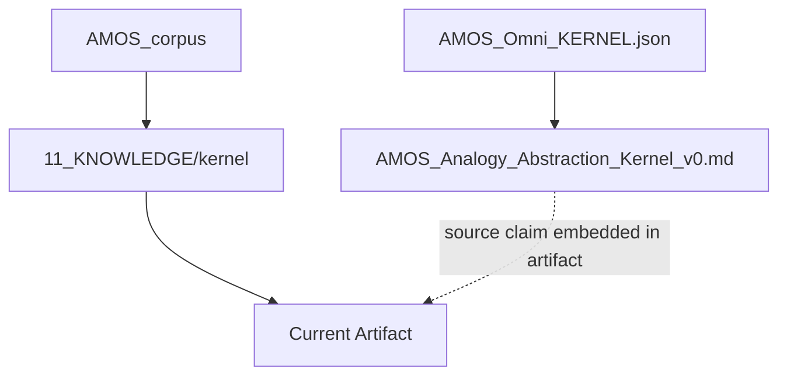
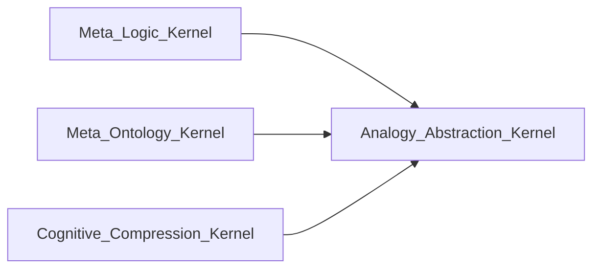
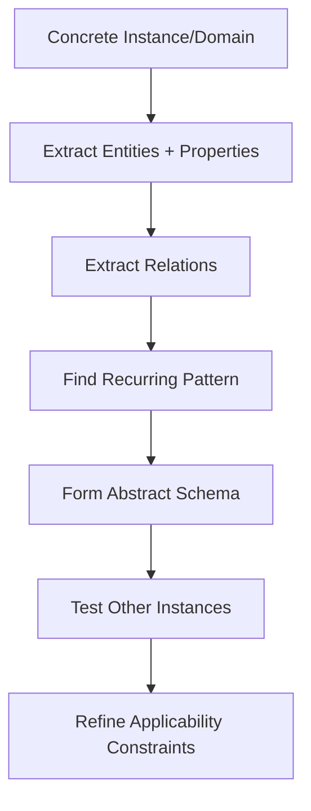
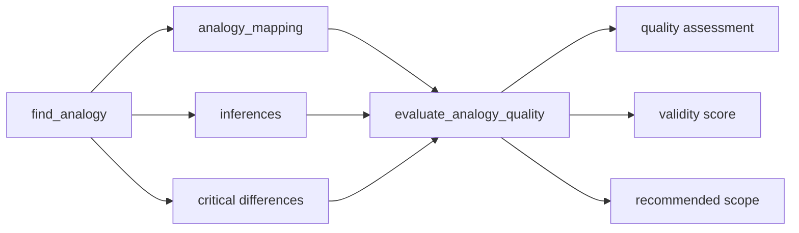
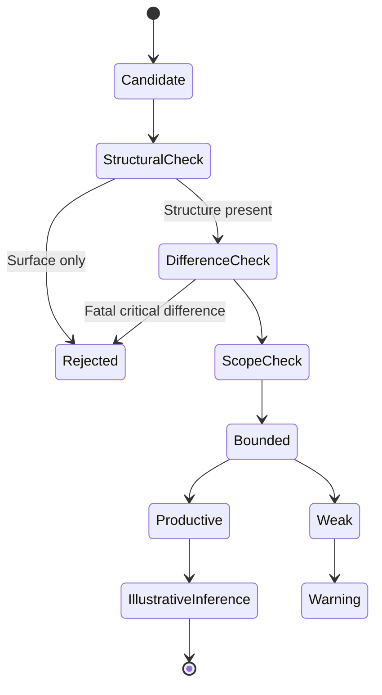
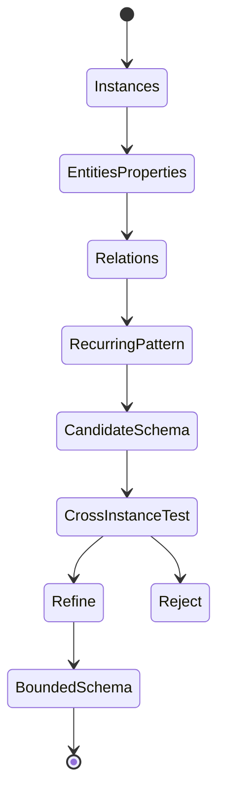
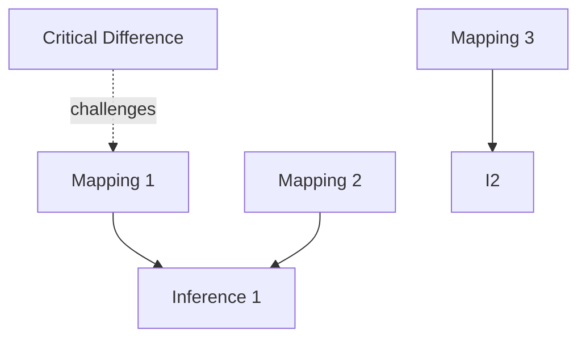
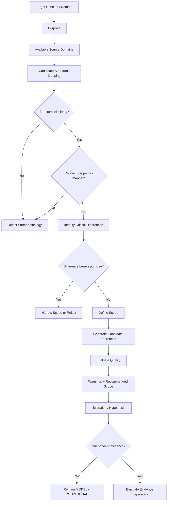
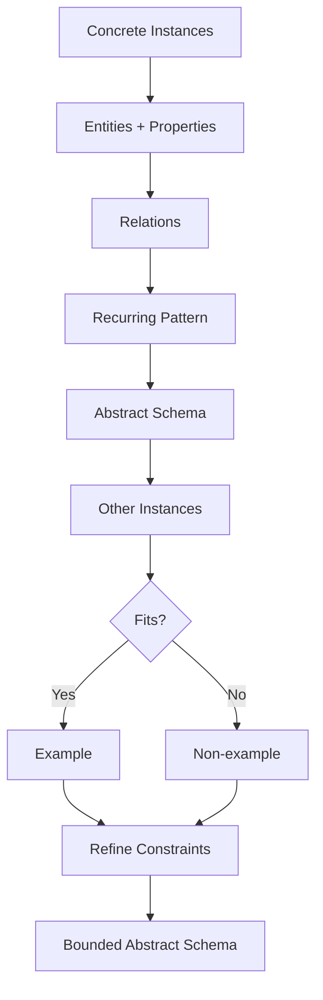

# AMOS ANALOGY ABSTRACTION KERNEL V0 META COGNITION4 2

## Full Canonical Expansion — Source-Grounded · RSCF-Aware · Causal-Firewalled · Obsidian-Ready

> [!abstract] Canonical conclusion
> **Conclusion class: DERIVED**
>
> `AMOS ANALOGY ABSTRACTION KERNEL V0 META COGNITION4 2` defines a source-claimed AMOS meta-cognition kernel for two coupled operations:
>
> **Analogy:** map structural correspondences from a source domain to a target domain while explicitly bounding scope and preserving critical differences.
>
> **Abstraction:** extract recurring entity–relation structure from concrete instances, formulate a domain-reduced schema, test that schema against additional instances, and refine its applicability constraints.
>
> Its strongest constitutional rule is explicit and unusually important:
>
> $$
> \boxed{\text{Analogy illustrates; analogy does not prove}}
> $$
>
> The source therefore provides a native **causal and epistemic firewall against reasoning-by-resemblance**. Structural similarity may generate candidate inferences, explanations, hypotheses, or abstractions, but it does not establish identity, equivalence, causation, empirical truth, or universal applicability.
>
> The artifact also contains one syntactic defect in the supplied JSON-like source: inside `evaluate_analogy_quality`, the key appears as `"inputs: [` rather than `"inputs": [`. The intended key `inputs` is locally recoverable with high confidence, but the raw corruption must remain provenance-visible. The normalized repair below is therefore **DERIVED/REPAIRED**, not silently represented as exact source JSON.
>
> The source defines criteria, procedures, safety constraints, integration routes, three function contracts, four binding rules, unit-test descriptions, and failure modes. It does **not** define the mathematics of `validity_score`, a threshold for “weak” analogy, a formal structural-isomorphism algorithm, ontology-matching mechanics, runtime code, test results, empirical accuracy, or proof that the named dependencies/integrations are implemented.
>
> Accordingly:
>
> $$
> \boxed{
> StructuralSimilarity
> \neq
> Identity
> \neq
> Equivalence
> \neq
> Causation
> \neq
> Proof
> }
> $$

---

# 1. Normalized Source Frontmatter

The following preserves the supplied frontmatter values. Escaping has been normalized only for Markdown/YAML readability.

```yaml
---
title: AMOS ANALOGY ABSTRACTION KERNEL V0 META COGNITION4 2

tags:
  - canon-group/biology
  - canon/framework
  - rscf/claim
  - rscf/provenance
  - rscf/state/source-claim
  - topic/amos-analogy-abstraction-kernel-v0
  - kernel

type: data
source: 11_KNOWLEDGE/kernel

rscf:
  state: SOURCE_CLAIM
  claim_class: SOURCE_CLAIM
  provenance: AMOS_corpus
  scope: AMOS_knowledge
---
```

No aliases, implementation status, validation status, artifact ID, additional tags, or inferred framework links are part of the supplied frontmatter.

---

# 2. Raw Source Integrity Notice

The supplied body is JSON-like but is **not valid JSON as written** because this fragment appears inside `evaluate_analogy_quality`:

```text
"inputs: ["analogy_mapping", "purpose", "known_differences", "inferences_drawn"],
```

The locally obvious intended form is:

```json
"inputs": [
  "analogy_mapping",
  "purpose",
  "known_differences",
  "inferences_drawn"
]
```

Epistemic treatment:

```yaml
raw_source:
  parse_status: INVALID_JSON_AS_SUPPLIED
  defect_location: functions.evaluate_analogy_quality
  raw_fragment: '"inputs: ["analogy_mapping", "purpose", "known_differences", "inferences_drawn"],'

repair:
  candidate_key: inputs
  status: DERIVED_RENDERING_REPAIR
  confidence: HIGH
  reason:
    - sibling function objects use the key "inputs"
    - the malformed text visibly begins with "inputs"
    - the following value is an input-name array
```

The repair is safe for interpretation but should remain distinguishable from the raw bytes.

---

# 3. Source-Preserved Kernel Identity

The body explicitly supplies:

```yaml
kernel_id: Analogy_Abstraction_Kernel
version: 1.0.0
source: "md/Core/AMOS_Analogy_Abstraction_Kernel_v0.md (category: meta_cognition, from AMOS_Omni_KERNEL.json)"
group: Kernels.Meta_Cognition
category: Meta_Cognition
priority: 9
required: true
```

These are **SOURCE_CLAIM** fields.

---

# 4. Naming Layers

At least four naming/version signals coexist:

```text
Frontmatter title:
AMOS ANALOGY ABSTRACTION KERNEL V0 META COGNITION4 2

Body kernel_id:
Analogy_Abstraction_Kernel

Body version:
1.0.0

Embedded source path:
AMOS_Analogy_Abstraction_Kernel_v0.md
```

There are also title components:

```text
V0
META COGNITION4
2
```

Their exact relationship to `version: 1.0.0` is not defined.

Therefore:

```text
V0 ↔ 1.0.0 = UNKNOWN/GAP
META COGNITION4 semantics = UNKNOWN/GAP
trailing "2" semantics = UNKNOWN/GAP
```

Do not silently convert these into one canonical version scheme.

---

# 5. Embedded Provenance Chain

The source body itself declares:

```text
md/Core/AMOS_Analogy_Abstraction_Kernel_v0.md
        ↓
category: meta_cognition
        ↓
from AMOS_Omni_KERNEL.json
```

The frontmatter separately declares:

```text
AMOS_corpus
    ↓
11_KNOWLEDGE/kernel
    ↓
current artifact
```

A source-safe combined provenance topology is:



The relationship between the two provenance paths is source-described, not independently verified by the supplied text.

---

# 6. Epistemic Boundary

The artifact declares:

```yaml
rscf:
  state: SOURCE_CLAIM
  claim_class: SOURCE_CLAIM
  provenance: AMOS_corpus
  scope: AMOS_knowledge
```

Therefore the source establishes:

> The AMOS corpus describes an `Analogy_Abstraction_Kernel` with the supplied architecture.

It does not independently establish:

```text
runtime implementation
deployment
empirical cognitive performance
formal logical soundness of every analogy
accuracy of validity_score
external psychological validity
neuroscientific implementation
biological mechanism
formal proof of cross-domain equivalence
```

---

# 7. `canon-group/biology` Firewall

The frontmatter includes:

```yaml
- canon-group/biology
```

Yet the body classifies the kernel as:

```text
Kernels.Meta_Cognition
Meta_Cognition
```

This is not necessarily contradictory. One may be vault taxonomy and the other functional category.

But the biology tag does **not** establish that the kernel:

- models a biological neural mechanism,
- implements human cognition,
- reproduces biological abstraction,
- has neuroscientific validation,
- maps to specific brain structures.

Therefore:

$$
BiologyTag
\not\Rightarrow
BiologicalMechanism
$$

---

# 8. Core Description

Source:

> Kernel for analogy and abstraction — mapping structural similarities across domains, extracting abstract patterns from concrete instances, and using analogical reasoning while avoiding false analogies.

Canonical compression:

$$
K_{AA}
=
Analogy
+
Abstraction
+
FalseAnalogyDetection
$$

where \(K_{AA}\) denotes the source-defined Analogy Abstraction Kernel.

**DERIVED notation.**

---

# 9. Purpose

Source purpose:

> Enable analogical reasoning across domains by identifying structural similarities, extracting abstract patterns, and using analogies productively while detecting and avoiding false or misleading analogies.

This establishes four explicit responsibilities:

1. identify structural similarities,
2. extract abstract patterns,
3. use analogies productively,
4. detect/avoid false or misleading analogies.

---

# 10. Core Epistemic Architecture

The artifact does not treat analogy as unrestricted similarity matching.

Instead, its architecture is approximately:

$$
CandidateSimilarity
\rightarrow
StructuralMapping
\rightarrow
DifferenceCheck
\rightarrow
ScopeBounding
\rightarrow
InferenceGeneration
$$

with an explicit firewall:

$$
InferenceGeneratedByAnalogy
\neq
Proof
$$

This is one of the strongest source-grounded conclusions.

---

# 11. Domains

The source lists six domains:

```yaml
domains:
  - analogy
  - abstraction
  - pattern_matching
  - cross_domain
  - metaphor
  - structural_similarity
```

Thus:

$$
|Domains_{explicit}| = 6
$$

---

# 12. Domain — Analogy

`analogy` is the primary reasoning operation.

The source later gives it an explicit five-part structure.

---

# 13. Domain — Abstraction

`abstraction` is not merely a synonym for analogy.

It has its own seven-step procedure and separate function contract.

Therefore:

$$
Analogy \neq Abstraction
$$

within this source.

---

# 14. Domain — Pattern Matching

`pattern_matching` is listed as a domain, but no independent function named `pattern_matching` exists.

Therefore its implementation semantics remain unresolved.

---

# 15. Domain — Cross-Domain

`cross_domain` is explicit.

This licenses reasoning across domains only under the kernel's structural and scope constraints.

It does not license unrestricted transfer.

---

# 16. Domain — Metaphor

`metaphor` appears in the domain list.

No separate metaphor procedure is supplied.

Therefore:

```text
MetaphorHandling = INCLUDED_DOMAIN / UNDERSPECIFIED
```

---

# 17. Domain — Structural Similarity

Structural similarity is central, but the kernel itself explicitly prevents it from becoming proof.

This creates a source-native firewall:

$$
StructuralSimilarity
\Rightarrow
CandidateMapping
$$

but not:

$$
StructuralSimilarity
\Rightarrow
Truth
$$

---

# 18. Priority

The body declares:

```yaml
priority: 9
```

No priority scale is supplied.

Unknown:

```text
minimum priority
maximum priority
whether larger means higher
whether smaller means higher
runtime effect
conflict resolution semantics
```

Therefore:

```text
PrioritySemantics = UNKNOWN/GAP
```

---

# 19. Required

The body declares:

```yaml
required: true
```

This is a source-defined configuration claim.

It does not by itself tell us:

- required by which runtime,
- required for every AMOS operation,
- required only in the Omni Kernel,
- required only in meta-cognition,
- required for startup,
- required for particular routes.

Therefore:

```text
RequiredScope = UNKNOWN/GAP
```

---

# 20. Dependencies

The source declares:

```yaml
depends_on:
  - Meta_Logic_Kernel
  - Meta_Ontology_Kernel
  - Cognitive_Compression_Kernel
```

Thus there are exactly three explicit dependency names.

---

# 21. Dependency Graph



This graph reflects the source-declared dependency direction.

It does not establish runtime call order.

---

# 22. Meta Logic Dependency

A plausible interpretation is that analogy evaluation depends on logical integrity.

But the source does not define the exact API or invariant imported from `Meta_Logic_Kernel`.

Therefore:

```text
MetaLogicDependencySemantics = UNKNOWN/GAP
```

---

# 23. Meta Ontology Dependency

This dependency is structurally relevant to:

```text
category_error_in_mapping
```

because detecting category errors plausibly requires ontological typing.

However:

$$
MetaOntologyKernel
\rightarrow
CategoryErrorDetection
$$

is a **DERIVED candidate dependency edge**, not explicitly stated.

---

# 24. Cognitive Compression Dependency

Abstraction and compression are structurally related because abstraction removes domain-specific detail while preserving selected structure.

But:

$$
Abstraction = Compression
$$

is not established.

The kernel also `provides_to` `Cognitive_Compression_Kernel`, creating a bidirectional declared relationship at the artifact level.

---

# 25. Dependency/Provision Reciprocity

Source says:

```text
depends_on:
Cognitive_Compression_Kernel
```

and:

```text
provides_to:
Cognitive_Compression_Kernel
```

Therefore:

$$
AAK \leftrightarrow CCK
$$

at the declared integration level.

This may represent mutual dependency, feedback, service exchange, or conceptual coupling.

Exact runtime semantics remain unresolved.

---

# 26. Meta Role

Source:

```yaml
meta:
  role: Analogy and Abstraction Kernel
```

This matches the body description and kernel ID.

No internal naming contradiction is visible here.

---

# 27. Creator Attribution

Source:

```yaml
creator: Trang Phan (Origin Architect)
```

This is source attribution and should be preserved as such.

---

# 28. Status

Source:

```yaml
status: defined
```

This does not equal:

```text
implemented
tested
deployed
production-ready
empirically validated
```

Therefore:

$$
Defined \neq Implemented
$$

---

# 29. Binding Rules

Four binding rules are named:

```yaml
binding_rules:
  - Law_of_Law
  - Rule_of_2
  - Rule_of_4
  - Absolute_Integrity
```

Thus:

$$
|BindingRules| = 4
$$

---

# 30. Binding Rule Definitions Are Absent

The artifact does not define:

```text
Law_of_Law
Rule_of_2
Rule_of_4
Absolute_Integrity
```

Therefore their exact semantics cannot be reverse-engineered from this artifact alone.

---

# 31. Rule-of-2 Firewall

Do not infer that because analogy has source and target domains, this is what `Rule_of_2` means.

That would be reverse-engineering from numerical coincidence.

---

# 32. Rule-of-4 Firewall

Do not infer `Rule_of_4` from:

- four rules,
- four binding rules,
- four evaluation outputs of some kind,
- any other repeated four-part structure.

Exact definition remains a dependency gap.

---

# 33. Law-of-Law

The artifact names `Law_of_Law` but provides no semantics.

Status:

```text
SOURCE_TERM / DEFINITION_GAP
```

---

# 34. Absolute Integrity

`Absolute_Integrity` is source-named but not locally formalized.

The artifact's explicit anti-false-analogy constraints are consistent with an integrity principle, but identity between those constraints and the binding rule is not proven.

---

# 35. Omni Category

Source:

```yaml
omni_category: meta_cognition
```

This agrees with:

```yaml
category: Meta_Cognition
group: Kernels.Meta_Cognition
```

Case/style differences do not appear semantically problematic, but exact taxonomy normalization is not supplied.

---

# 36. Position

Source:

```yaml
position: 5
```

No ordering system is defined.

Therefore:

```text
PositionMeaning = UNKNOWN/GAP
```

Do not infer execution order 5.

---

# 37. Analogy Structure

The source defines five components:

```text
source_domain
target_domain
mapper
alignment
inferences
```

Therefore:

$$
A =
\langle
S,T,M,L,I
\rangle
$$

is a useful derived representation.

---

# 38. Source Domain

Source definition:

> The domain being mapped FROM (already understood)

Thus:

$$
S = SourceDomain
$$

It functions as the knowledge donor in the analogy.

---

# 39. Target Domain

Source:

> The domain being mapped TO (being understood via analogy)

Thus:

$$
T = TargetDomain
$$

The source explicitly distinguishes donor and recipient domains.

---

# 40. Directionality

Analogy is therefore directionally represented:

$$
S \rightarrow T
$$

This matters.

An analogy from \(S\) to \(T\) does not automatically establish that the reverse mapping \(T\rightarrow S\) is equally useful or valid.

---

# 41. Mapper

Source:

> What maps between source and target; the structural correspondence

The mapper is therefore not merely a lexical similarity function.

It is explicitly structural.

---

# 42. Alignment

Source:

> Which elements of source correspond to which elements of target

A derived representation:

$$
Alignment =
\{
s_i \leftrightarrow t_j
\}
$$

subject to structural constraints.

---

# 43. Inferences

Source:

> What can be inferred about target based on source knowledge

This is the most epistemically dangerous stage, and the source addresses that danger through scope, difference, and proof constraints.

---

# 44. Analogy Pipeline

A source-faithful derived pipeline is:

```text
Source Domain
     ↓
Structural Mapper
     ↓
Source↔Target Alignment
     ↓
Candidate Inferences
     ↓
Difference / Scope Checks
     ↓
Bounded Useful Analogy
```

---

# 45. Analogy Is Not Identity

The source never says source and target become equivalent.

Therefore:

$$
S \neq T
$$

remains the default.

A mapping connects selected structure; it does not collapse domain identity.

---

# 46. Mapping Is Partial by Default

Because the source explicitly requires bounded scope and acknowledgment of critical differences, a safe interpretation is:

$$
M:S' \rightarrow T'
$$

where:

$$
S' \subseteq S
$$

and:

$$
T' \subseteq T
$$

rather than assuming a total mapping of all source properties to all target properties.

**DERIVED.**

---

# 47. Analogy Quality Depends on Purpose

The kernel repeatedly references relevance and productivity “for the purpose.”

Thus analogy quality is task-relative.

A useful formalization is:

$$
Quality(A|P)
$$

rather than:

$$
Quality(A)
$$

as an absolute universal property.

This is DERIVED from explicit source wording.

---

# 48. Valid Analogy Criteria

Five criteria are supplied:

1. `structural_similarity`
2. `relevant_properties_mapped`
3. `no_critical_differences_ignored`
4. `bounded_scope`
5. `productive`

Thus:

$$
|ValidAnalogyCriteria| = 5
$$

---

# 49. Criterion — Structural Similarity

Source:

> The mapping must preserve structural relationships, not just surface features.

This is foundational.

It distinguishes:

$$
StructuralCorrespondence
$$

from:

$$
SurfaceResemblance
$$

---

# 50. Surface Similarity Is Insufficient

The kernel explicitly rejects analogy based only on:

```text
name
appearance
```

without structural correspondence.

Therefore:

$$
SurfaceSimilarity
\not\Rightarrow
ValidAnalogy
$$

---

# 51. Structural Similarity Is Necessary-Looking, Not Sufficiently Formalized

The source says valid mapping “must preserve structural relationships.”

That makes structural similarity a source-stated requirement.

But the source does not define whether all five criteria are jointly necessary and sufficient in a formal logical sense.

Do not over-formalize beyond the text.

---

# 52. Criterion — Relevant Properties Mapped

Source:

> Properties relevant to the reasoning task must be mappable between domains.

Thus relevance is purpose-conditioned.

$$
Relevant(p,Purpose)
$$

matters more than arbitrary property overlap.

---

# 53. Irrelevant Similarity

Two domains may share many properties irrelevant to the current reasoning task.

Such overlap does not automatically strengthen the analogy.

---

# 54. Criterion — No Critical Differences Ignored

Source:

> Known critical differences between domains must be acknowledged, not hidden.

This is a major integrity constraint.

It does not require source and target to be identical.

Instead:

$$
ValidAnalogy
$$

can coexist with:

$$
CriticalDifferences
$$

provided those differences are acknowledged and do not invalidate the intended inference.

---

# 55. Difference Visibility Law

A source-grounded rule:

$$
KnownCriticalDifference
\Rightarrow
MustBeExposed
$$

Hiding it violates the kernel.

---

# 56. Criterion — Bounded Scope

Source:

> The analogy has a defined scope; it does not claim to explain everything about the target.

Thus:

$$
Scope(A) \subset TargetDomain
$$

conceptually.

---

# 57. Scope Firewall

If analogy \(A\) supports inference within scope \(S_A\):

$$
x \notin S_A
\Rightarrow
A \text{ does not license inference about } x
$$

This is a derived formalization of the explicit rule.

---

# 58. Criterion — Productive

Source:

> The analogy generates useful inferences, not just decorative similarity.

Thus validity/productivity includes epistemic or explanatory utility.

But “useful” is not numerically defined.

---

# 59. Decorative Analogy

An analogy may be rhetorically appealing yet nonproductive.

The source explicitly distinguishes these.

Therefore:

$$
MemorableAnalogy
\neq
ProductiveAnalogy
$$

---

# 60. Validity Versus Productivity

The source treats validity and productivity as related but distinguishable concepts.

A structurally valid analogy may potentially generate little useful inference.

A productive-seeming analogy may fail structural criteria.

Thus:

$$
Validity \neq Productivity
$$

---

# 61. False Analogy Detection

Five failure patterns are supplied:

1. `surface_only`
2. `ignoring_critical_differences`
3. `over_extension`
4. `category_error_in_mapping`
5. `false_precision`

Thus:

$$
|FalseAnalogyPatterns| = 5
$$

---

# 62. False Analogy — Surface Only

Source:

> Mapping based on superficial similarity (name, appearance) without structural correspondence.

Formal firewall:

$$
NameSimilarity \lor AppearanceSimilarity
\not\Rightarrow
StructuralCorrespondence
$$

---

# 63. False Analogy — Ignoring Critical Differences

This failure occurs when a difference breaks the mapping for the current purpose but is hidden or ignored.

Important nuance:

Not every difference invalidates an analogy.

Only differences material to the intended mapping/inference are critical.

---

# 64. Criticality Is Purpose-Dependent

A difference may be irrelevant under one purpose but fatal under another.

Thus:

$$
Critical(d|Purpose)
$$

is a useful derived formulation.

---

# 65. False Analogy — Over-Extension

Source:

> Pushing the analogy beyond its valid scope to draw conclusions it doesn't support.

This is a direct scope violation.

$$
InferenceOutsideScope
\Rightarrow
Unsupported
$$

---

# 66. False Analogy — Category Error

Source:

> Mapping entities from different ontological categories as if they're equivalent.

This is stronger than merely saying the domains differ.

The problem is false equivalence across ontological type.

---

# 67. Ontological Category Firewall

$$
DifferentCategory(x,y)
$$

does not necessarily prevent all analogy.

But:

$$
DifferentCategory(x,y)
\land
ClaimEquivalent(x,y)
$$

may constitute the source-defined category error.

This distinction is essential.

---

# 68. Cross-Category Analogy Can Still Be Useful

The source targets cross-domain reasoning, so different categories cannot automatically invalidate all analogies.

For example, the source's category-error rule is best read as preventing **equivalence**, not forbidding every cross-category structural mapping.

This is a DERIVED interpretation supported by the broader source structure.

---

# 69. False Analogy — False Precision

Source:

> Treating the analogy as more precise than it is; using it as proof rather than illustration.

This yields two explicit firewalls:

$$
Analogy \neq ExactModel
$$

and:

$$
Analogy \neq Proof
$$

unless separate evidence independently establishes the stronger relation.

---

# 70. Precision Ceiling

An analogy's inferential precision cannot safely exceed the precision of its mapping and scope.

Conceptually:

$$
Precision(Inference)
\leq
Precision(ValidatedMapping)
$$

**DERIVED.**

---

# 71. Core Rules

Four rules are explicitly supplied:

```text
analogy_illustrates_not_proves
scope_must_be_explicit
differences_must_be_acknowledged
abstraction_level_match
```

Thus:

$$
|Rules|=4
$$

This does not prove relation to `Rule_of_4`.

---

# 72. Rule — Analogy Illustrates, Not Proves

Exact source meaning:

> An analogy can illustrate a structural point but cannot serve as proof. Always distinguish illustration from evidence.

This is the kernel's strongest epistemic invariant.

---

# 73. Evidence Firewall

Therefore:

$$
Analogy
\rightarrow
Illustration
$$

is permitted.

$$
Analogy
\rightarrow
Hypothesis
$$

may be permitted.

$$
Analogy
\rightarrow
CandidateInference
$$

may be permitted.

But:

$$
Analogy
\rightarrow
Proof
$$

is explicitly prohibited.

---

# 74. Analogy Can Motivate Evidence Collection

A useful analogy may suggest what to test.

Thus:

$$
Analogy
\rightarrow
Hypothesis
\rightarrow
Test
\rightarrow
Evidence
$$

is epistemically stronger than:

$$
Analogy
\rightarrow
Conclusion
$$

This is DERIVED governance.

---

# 75. Rule — Scope Must Be Explicit

Source:

> Define what the analogy does and does not cover. Don't let the listener over-extend it.

Therefore a complete analogy artifact should ideally carry:

```text
IN_SCOPE
OUT_OF_SCOPE
```

not merely a mapping.

---

# 76. Positive and Negative Scope

A proposed scope contract:

```yaml
scope:
  supports:
    - ...
  does_not_support:
    - ...
```

This is stronger than a vague scope label because it explicitly communicates invalid extensions.

---

# 77. Rule — Differences Must Be Acknowledged

Source:

> State the critical differences between source and target that limit the analogy's applicability.

This makes negative evidence first-class.

The kernel is not merely a similarity finder.

It is also a **difference-preservation system**.

---

# 78. Analogy Quality Requires Dissimilarity Awareness

A high-quality analogy therefore requires both:

$$
SimilarityEvidence
$$

and:

$$
DifferenceEvidence
$$

This is a strong DERIVED architectural conclusion.

---

# 79. Rule — Abstraction Level Match

Source:

> The abstraction level of source and target should be comparable. Don't map a concrete entity to an abstract principle without clarifying.

Thus the kernel recognizes level mismatch as an explicit hazard.

---

# 80. Abstraction-Level Firewall

Let:

$$
L_S = Level(Source)
$$

and:

$$
L_T = Level(Target)
$$

Then large or categorical mismatch requires explicit clarification.

The source does not provide a numeric distance function:

$$
|L_S-L_T|
$$

so no threshold should be invented.

---

# 81. Concrete-to-Abstract Mapping Is Not Absolutely Forbidden

The wording says:

> Don't map ... without clarifying.

It does not say:

> Never map concrete to abstract.

Therefore clarification can potentially make such a mapping acceptable.

---

# 82. Abstraction Procedure

Seven explicit steps are supplied.

Thus:

$$
|AbstractionSteps| = 7
$$

---

# 83. Step 1 — Identify Concrete Instance or Domain

Source:

> Identify the concrete instance or domain being abstracted.

This establishes an explicit grounding point.

Abstraction begins from something more concrete.

---

# 84. Step 2 — Extract Objects/Entities and Properties

The source distinguishes:

```text
entities
properties
```

This gives the abstraction process a proto-ontological representation.

---

# 85. Step 3 — Extract Relations

Relations are treated separately from entities and properties.

Thus the abstraction process is not merely feature averaging.

---

# 86. Relational Structure

A concrete instance can be represented conceptually as:

$$
I =
(E,P,R)
$$

where:

- \(E\) = entities,
- \(P\) = properties,
- \(R\) = relations.

This notation is DERIVED.

---

# 87. Step 4 — Identify Recurring Pattern

Source:

> Identify the pattern that recurs across instances.

This requires more than one comparable occurrence if recurrence is to be established literally.

However, the source does not state a minimum number of instances.

---

# 88. Recurrence Does Not Prove Universality

$$
RepeatedPattern
\neq
UniversalLaw
$$

A recurring structure supports abstraction candidate generation, not universal validity.

---

# 89. Step 5 — Formulate Abstract Schema

Source:

> entities + relations without domain-specific content

This is the most explicit definition of abstraction in the artifact.

Conceptually:

$$
ConcreteInstances
\rightarrow
DomainReducedStructure
$$

---

# 90. Abstraction Does Not Mean Content Destruction

The schema removes domain-specific content while preserving selected entities/relations structurally.

Thus abstraction is selective conservation, not arbitrary deletion.

---

# 91. Step 6 — Test Against Other Instances

This is a built-in anti-overfitting step.

The source does not allow the first extracted pattern to automatically become accepted abstraction.

---

# 92. Out-of-Sample Analogy

Conceptually:

$$
Schema(I_1,\dots,I_n)
$$

is tested against:

$$
I_{n+1}
$$

This resembles generalization testing, but the source does not specify statistical sampling.

Do not import machine-learning validation semantics automatically.

---

# 93. Step 7 — Refine Constraints

Source:

> add constraints that distinguish valid from invalid applications

This makes boundary conditions part of the abstraction itself.

---

# 94. Abstraction Is Constraint-Bearing

A mature abstraction is therefore not merely:

```text
pattern
```

but:

```text
pattern + applicability constraints
```

---

# 95. Abstraction Pipeline



This directly mirrors the seven source steps.

---

# 96. Abstraction Candidate Formalization

For instances:

$$
I_1,I_2,\ldots,I_n
$$

seek a schema:

$$
\Sigma
$$

such that selected structural relations recur:

$$
\Sigma \models Structure(I_i)
$$

for relevant instances.

This is a DERIVED formalization, not source mathematics.

---

# 97. Over-Abstraction Hazard

If too many details are removed, the schema may become trivially applicable.

Example conceptual failure:

```text
"Things relate to other things."
```

This is broad but not productive.

The source's productivity and constraint requirements implicitly resist this failure.

---

# 98. Under-Abstraction Hazard

If domain-specific details remain, the schema may fail to generalize.

Thus abstraction faces a derived tension:

$$
Specificity
\leftrightarrow
Generality
$$

The source gives refinement/testing as the control mechanism, not an optimization formula.

---

# 99. Abstraction Validity Is Bounded

An abstract schema's applicability should be limited to cases satisfying its constraints.

$$
Valid(\Sigma,x)
$$

cannot be inferred merely because \(x\) superficially resembles training instances.

---

# 100. Non-Examples Are First-Class

The `extract_abstraction` function explicitly outputs:

```text
non_example_instances
```

This is epistemically important.

The kernel does not only seek positive examples.

It explicitly preserves cases where the abstraction does not apply.

---

# 101. Positive/Negative Boundary Learning

Function outputs:

```text
example_instances
non_example_instances
```

create a conceptual boundary:

$$
ApplicabilityBoundary(\Sigma)
$$

This is a powerful anti-overgeneralization feature.

---

# 102. Functions

Three functions are supplied:

```text
find_analogy
extract_abstraction
evaluate_analogy_quality
```

Thus:

$$
|Functions|=3
$$

---

# 103. Function 1 — `find_analogy`

Source description:

> Find a useful analogy for a target concept or domain.

Inputs:

```text
target_concept
target_domain
purpose_of_analogy
available_source_domains
```

Outputs:

```text
analogy_source
mapping_table
inferences_generated
critical_differences
scope_boundaries
false_analogy_warnings
```

---

# 104. `find_analogy` Interface

Derived notation:

$$
F_A:
(T_c,T_d,P,S_{available})
\rightarrow
(S_a,M,I,D,B,W)
$$

where:

- \(T_c\) target concept,
- \(T_d\) target domain,
- \(P\) purpose,
- \(S_{available}\) available source domains,
- \(S_a\) selected analogy source,
- \(M\) mapping,
- \(I\) generated inferences,
- \(D\) critical differences,
- \(B\) scope boundaries,
- \(W\) warnings.

---

# 105. Purpose Is Explicit Input

This is structurally significant.

Analogy selection is not modeled as universally context-free.

Instead:

$$
BestAnalogy
=
f(Target,Purpose,Sources)
$$

with \(f\) unspecified.

---

# 106. Available Source Domains

The function does not claim unrestricted access to all possible source domains.

It explicitly accepts:

```text
available_source_domains
```

Thus source selection is bounded by available candidates.

---

# 107. Candidate-Set Dependence

If the best possible source domain is absent from the candidate set, the function may return the best available analogy rather than the globally best analogy.

The source does not define optimization semantics, but this limitation follows structurally.

---

# 108. Mapping Table

`mapping_table` is explicit output.

No schema is supplied.

A proposed representation could be:

| Source element | Relation | Target element | Confidence | Limitation |
| -------------- | -------- | -------------- | ---------- | ---------- |

But confidence and limitation columns are **PROPOSED**, not source fields.

---

# 109. Generated Inferences

The function explicitly outputs inferences.

These must inherit the analogy firewall.

Therefore:

```text
inferences_generated
```

should not be reclassified automatically as verified facts.

A safe default:

```text
MODEL / DERIVED CANDIDATE
```

depending on context.

---

# 110. Critical Differences Output

The function itself outputs:

```text
critical_differences
```

This operationalizes the source rule that differences must be acknowledged.

---

# 111. Scope Boundaries Output

Likewise:

```text
scope_boundaries
```

operationalizes bounded scope.

This means scope is not merely documentation metadata; it is a first-class function result.

---

# 112. False Analogy Warnings

The function outputs:

```text
false_analogy_warnings
```

Thus warnings are part of successful analogy generation, not necessarily evidence that the function failed.

A useful analogy may still carry warnings.

---

# 113. Function 2 — `extract_abstraction`

Inputs:

```text
instances
common_properties
common_relations
```

Outputs:

```text
abstract_schema
applicability_constraints
example_instances
non_example_instances
```

---

# 114. Abstraction Function Interface

$$
F_X:
(I,P,R)
\rightarrow
(\Sigma,C,E,N)
$$

where:

- \(I\) instances,
- \(P\) common properties,
- \(R\) common relations,
- \(\Sigma\) abstract schema,
- \(C\) applicability constraints,
- \(E\) examples,
- \(N\) non-examples.

**DERIVED notation.**

---

# 115. Input/Procedure Tension

The seven-step procedure says the kernel itself should:

```text
extract objects/properties
extract relations
```

Yet `extract_abstraction` receives:

```text
common_properties
common_relations
```

as inputs.

Possible interpretations:

1. preprocessing occurs before the function,
2. caller supplies candidate common structure,
3. the function validates/refines supplied common structure,
4. procedure describes a broader workflow than the callable function.

Status: **COMPETING**.

---

# 116. No Forced Reconciliation

Do not silently rewrite the function to accept raw instances only.

The source explicitly lists all three inputs.

---

# 117. Example Instances Output

The function may identify instances supporting the schema.

This can provide traceability from abstraction back to concrete evidence.

---

# 118. Non-Example Instances Output

Non-examples provide falsification/boundary evidence.

This is one of the artifact's strongest anti-overgeneralization structures.

---

# 119. Function 3 — `evaluate_analogy_quality`

Raw source corruption occurs here.

Locally repaired conceptual contract:

Inputs:

```text
analogy_mapping
purpose
known_differences
inferences_drawn
```

Outputs:

```text
quality_assessment
validity_score
productive_for_purpose
warnings
recommended_scope
```

---

# 120. Repair Boundary

Canonical preservation should retain both:

```yaml
raw:
  malformed_key: '"inputs: ['

normalized_interpretation:
  key: inputs
  status: DERIVED_REPAIR
```

Do not erase the source defect from provenance.

---

# 121. Evaluation Interface

$$
F_Q:
(M,P,D,I)
\rightarrow
(Q,V,U,W,S)
$$

where:

- \(M\) analogy mapping,
- \(P\) purpose,
- \(D\) known differences,
- \(I\) inferences drawn,
- \(Q\) quality assessment,
- \(V\) validity score,
- \(U\) productive-for-purpose,
- \(W\) warnings,
- \(S\) recommended scope.

---

# 122. Validity Score

The source names:

```text
validity_score
```

but supplies no:

```text
range
scale
formula
threshold
weighting
calibration
interpretation
```

Therefore:

```text
ValidityScoreSemantics = UNKNOWN/GAP
```

---

# 123. Do Not Invent 0–1

Nothing establishes:

$$
ValidityScore \in [0,1]
$$

or 0–100.

Do not assign a numeric range without another source.

---

# 124. Quality Assessment

The tests later mention:

```text
quality_assessment=low
quality_assessment=high
```

This establishes at least source-level labels `low` and `high` as expected test outputs.

It does not establish the complete label set.

For example, `medium` is plausible but not source-grounded.

---

# 125. Productive for Purpose

This output reinforces task-relative quality.

An analogy may be structurally reasonable yet unproductive for the current explanatory or reasoning goal.

---

# 126. Recommended Scope

The evaluation function does not merely accept a scope; it can output a `recommended_scope`.

Thus scope may be adjusted after evaluation.

---

# 127. Function Coupling

A plausible workflow:

```text
find_analogy
    ↓
evaluate_analogy_quality
```

because the first produces a mapping/inferences/differences and the second consumes analogous fields.

This is strongly DERIVED but not explicitly declared as runtime order.

---

# 128. Candidate Dataflow



The source does not explicitly bind output field names one-to-one (`mapping_table` vs `analogy_mapping`, `critical_differences` vs `known_differences`, etc.), so these edges remain DERIVED.

---

# 129. Field-Name Non-Identity

Do not automatically assert:

$$
mapping\_table = analogy\_mapping
$$

or:

$$
critical\_differences = known\_differences
$$

or:

$$
inferences\_generated = inferences\_drawn
$$

They are semantically compatible candidates, but exact identity is not source-defined.

---

# 130. Possible Adapter Layer

A plausible integration may transform:

```text
mapping_table → analogy_mapping
critical_differences → known_differences
inferences_generated → inferences_drawn
```

But this adapter is not present in the source.

Status: **DERIVED candidate**.

---

# 131. Abstraction and Analogy Coupling

The kernel contains both operations, but no explicit function edge says:

```text
extract_abstraction → find_analogy
```

or vice versa.

Several architectures remain possible.

---

# 132. Competing Architecture A

Abstraction first:

$$
Instances
\rightarrow
AbstractSchema
\rightarrow
CrossDomainMapping
$$

This is plausible because abstract structure may facilitate analogy.

---

# 133. Competing Architecture B

Analogy first:

$$
Source/TargetMapping
\rightarrow
RecurringCorrespondence
\rightarrow
Abstraction
$$

Also plausible.

---

# 134. Competing Architecture C

Parallel services:

```text
Analogy Engine
Abstraction Engine
Quality Evaluator
```

with no mandatory order.

Also plausible.

---

# 135. Do Not Force Pipeline

Without explicit orchestration:

```text
FunctionExecutionOrder = UNKNOWN/GAP
```

---

# 136. Integration — Provides To

The source declares:

```yaml
provides_to:
  - Meta_Logic_Kernel
  - Structural_Reasoning
  - Multi_Domain_Thinking
  - Cognitive_Compression_Kernel
```

Thus four explicit recipients exist.

---

# 137. Integration Reciprocity With Meta Logic

The kernel both:

```text
depends_on Meta_Logic_Kernel
```

and:

```text
provides_to Meta_Logic_Kernel
```

Thus another bidirectional relation exists.

Exact feedback semantics remain unknown.

---

# 138. Structural Reasoning

`Structural_Reasoning` receives from the kernel.

No separate dependency definition is supplied.

Therefore this is an integration claim, not evidence of a specific module API.

---

# 139. Multi-Domain Thinking

`Multi_Domain_Thinking` receives from the kernel.

This is consistent with cross-domain analogy purpose.

Again, implementation is not established.

---

# 140. Used By

Source:

```yaml
used_by:
  - Cross-domain reasoning
  - Explanation generation
  - Concept learning
```

These are three declared use cases/consumers.

---

# 141. Explanation Generation Boundary

Analogy can improve explanation without proving the explained proposition.

Thus:

$$
ExplanatoryUtility
\neq
EvidentialValidity
$$

This distinction is explicitly supported by `analogy_illustrates_not_proves`.

---

# 142. Concept Learning Boundary

A useful analogy may support learning while remaining imperfect.

Pedagogical usefulness does not make every mapped property true.

---

# 143. Cross-Domain Reasoning Boundary

Cross-domain reasoning must preserve domain-specific differences.

The source is explicitly anti-universalizing.

---

# 144. Routes

Source:

```text
ROUTE_DEFAULT
ROUTE_TECH
ROUTE_PSYCH
```

with conditional notes:

```text
ROUTE_TECH when mapping tech concepts
ROUTE_PSYCH when mapping psychological concepts
```

---

# 145. Route Selection

At minimum, the source suggests:

$$
TechMapping \rightarrow ROUTE\_TECH
$$

$$
PsychMapping \rightarrow ROUTE\_PSYCH
$$

and otherwise potentially:

$$
ROUTE\_DEFAULT
$$

But exact precedence is not formalized.

---

# 146. Mixed-Domain Routing Gap

Suppose an analogy maps:

```text
technology ↔ psychology
```

Both `ROUTE_TECH` and `ROUTE_PSYCH` may appear applicable.

No arbitration rule is supplied.

Therefore:

```text
MixedRouteArbitration = UNKNOWN/GAP
```

---

# 147. Route Names Are Not Runtime Proof

The presence of route labels does not establish that a routing engine exists or executes them.

---

# 148. Psychological Route Firewall

`ROUTE_PSYCH` does not license unsupported clinical or psychological claims.

Analogy remains analogy.

---

# 149. Technology Route Firewall

Mapping a biological or social structure onto a technical architecture does not establish that the technical system literally implements the source-domain mechanism.

---

# 150. Safety Constraints

Five explicit safety constraints are supplied:

```yaml
never_use_analogy_as_proof: true
never_hide_critical_differences: true
never_over_extend_analogy_scope: true
always_state_scope_boundaries: true
always_warn_when_analogy_is_weak: true
```

Thus:

$$
|SafetyConstraints|=5
$$

---

# 151. Constraint 1 — Never Use Analogy as Proof

This is absolute in the source.

No exception is supplied.

---

# 152. Important Nuance

Independent evidence may prove a proposition that was initially suggested by analogy.

In that case:

```text
analogy generated hypothesis
independent evidence established claim
```

The analogy itself still did not become proof.

---

# 153. Constraint 2 — Never Hide Critical Differences

This is also absolute in the source.

It establishes transparency as part of analogy quality.

---

# 154. Constraint 3 — Never Over-Extend Scope

A mapping may be valid locally and invalid globally.

The kernel requires local validity to remain local.

---

# 155. Constraint 4 — Always State Scope Boundaries

Scope disclosure is mandatory, not optional, under the source.

---

# 156. Constraint 5 — Warn When Analogy Is Weak

The source does not define `weak`.

Therefore:

```text
WeakAnalogyThreshold = UNKNOWN/GAP
```

The obligation is explicit; the trigger algorithm is not.

---

# 157. Safety Constraint Consistency

The five constraints are mutually coherent with the validity criteria and false-analogy detection rules.

No direct contradiction is visible.

---

# 158. Evaluation Unit Tests

Four unit-test descriptions are supplied.

They are **test specifications**, not evidence that tests actually ran.

This distinction is critical.

---

# 159. Unit Test 1

Source expectation:

> Find analogy for a complex concept: returns source + mapping + inferences + differences + scope.

This broadly corresponds to `find_analogy`.

It omits `false_analogy_warnings` from the prose test expectation, despite that field being a function output.

This is not necessarily contradictory; the test description may be abbreviated.

---

# 160. Unit Test 2

Source:

> Extract abstraction from 3 similar instances: returns abstract_schema + constraints.

This supplies one explicit test cardinality:

$$
n=3
$$

for that unit-test scenario.

It does **not** establish that abstraction always requires exactly three instances.

---

# 161. Three-Instance Firewall

Do not infer:

$$
MinimumInstances = 3
$$

from a single test case.

The procedure itself gives no minimum.

---

# 162. Unit Test 3

Source:

> Evaluate a false analogy (surface-only mapping): returns quality_assessment=low, false_analogy_detected.

But the declared outputs of `evaluate_analogy_quality` are:

```text
quality_assessment
validity_score
productive_for_purpose
warnings
recommended_scope
```

There is no declared output named:

```text
false_analogy_detected
```

This is a real source-level interface inconsistency.

---

# 163. `false_analogy_detected` Gap

Possible explanations:

1. it is encoded inside `warnings`,
2. it is an omitted output,
3. the unit test refers to an earlier/later schema,
4. `quality_assessment` contains that state,
5. source drift exists.

Status:

```text
COMPETING / DECISION-RELEVANT SCHEMA GAP
```

Do not silently add the field to the function outputs.

---

# 164. Unit Test 4

Source:

> Evaluate a valid structural analogy: returns quality_assessment=high, productive_for_purpose.

This confirms expected `high` quality label and the relevance of productivity.

---

# 165. Unit Tests Are Not Test Results

The source does not say:

```text
PASS
```

for any unit test.

Therefore:

```text
TestsDefined = SOURCE_CLAIM
TestsExecuted = UNKNOWN
TestsPassed = UNKNOWN
```

---

# 166. Failure Modes

Four failure modes are explicitly supplied:

1. presenting analogy as proof,
2. not acknowledging critical differences,
3. over-extending analogy,
4. false precision from weak analogy.

---

# 167. Failure-Mode Coverage

These map strongly to existing rules:

| Failure mode       | Related rule/constraint            |
| ------------------ | ---------------------------------- |
| Analogy as proof   | `analogy_illustrates_not_proves`   |
| Hidden differences | `differences_must_be_acknowledged` |
| Over-extension     | `scope_must_be_explicit`           |
| False precision    | false-analogy detector             |

This is strong structural consistency.

---

# 168. Missing Failure Mode — Category Error

Interestingly, `category_error_in_mapping` appears under false-analogy detection but not in the shorter `failure_modes` list.

This does not remove it from the kernel.

The two lists operate at different levels of completeness.

---

# 169. Missing Failure Mode — Surface Only

Likewise `surface_only` is not repeated in the final failure-mode list.

It remains source-defined in the dedicated detector.

---

# 170. Source Architecture Layers

A useful derived decomposition is:

```text
L0 — Dependencies / binding rules
L1 — Analogy representation
L2 — Validity criteria
L3 — False-analogy detection
L4 — Constitutional reasoning rules
L5 — Abstraction procedure
L6 — Callable functions
L7 — Integration/routing
L8 — Safety constraints
L9 — Evaluation/failure modes
```

This layer numbering is **PROPOSED**, not source numbering.

---

# 171. Structural Similarity Firewall

The most important AMOS-wide law derivable from this artifact is:

$$
\boxed{
StructuralSimilarity(A,B)
\not\Rightarrow
Identity(A,B)
}
$$

---

# 172. Causal Firewall

Even stronger:

$$
\boxed{
StructuralSimilarity(A,B)
\not\Rightarrow
Cause(A,B)
}
$$

The source explicitly says analogy is not proof.

No analogical mapping alone can license a causal claim.

---

# 173. Mechanism Firewall

$$
SimilarStructure
\not\Rightarrow
SameMechanism
$$

Two systems may exhibit structurally analogous behavior through different mechanisms.

---

# 174. Ontology Firewall

$$
MappedRole(A,B)
\not\Rightarrow
SameOntologicalType(A,B)
$$

This directly protects against category errors.

---

# 175. Scale Firewall

$$
SimilarPatternAtScale_1
\not\Rightarrow
SameMechanismAtScale_2
$$

This is especially important for cross-scale AMOS models.

---

# 176. Domain Firewall

$$
ValidMapping(D_1,D_2,P)
$$

does not imply:

$$
ValidMapping(D_1,D_2,P')
$$

for a different purpose.

---

# 177. Temporal Firewall

An analogy valid under one regime may become invalid after target-domain change.

The source does not explicitly mention time, but bounded applicability logically supports regime-sensitive revalidation.

**DERIVED.**

---

# 178. Scope Inheritance

An inference generated by analogy cannot safely have broader scope than the analogy that generated it.

$$
Scope(I)
\subseteq
Scope(A)
$$

**DERIVED.**

---

# 179. Confidence Ceiling

A derived AMOS v4.4 hardening:

$$
C_{analogical\ inference}
\leq
C_{mapping}
$$

and also:

$$
C_{analogical\ inference}
\leq
C_{weakest\ load\ bearing\ correspondence}
$$

unless independently revalidated.

---

# 180. Analogy Cannot Self-Upgrade

Repeated restatement of the same analogy does not increase its evidential class.

$$
Analogy \times Repetition
\neq
Proof
$$

---

# 181. Multiple Analogies Are Not Automatically Independent

Suppose three analogies derive from the same underlying structural assumption.

Their agreement does not establish independent confirmation.

$$
SharedPremise(A_1,A_2,A_3)
\Rightarrow
Independence \neq Established
$$

---

# 182. Analogy Ensemble

Multiple genuinely different analogies may improve exploration.

But they still generate hypotheses rather than proof.

---

# 183. Competing Analogies

Two analogies can support incompatible interpretations of the same target.

The kernel should not force convergence solely because one is rhetorically stronger.

Status should remain:

```text
COMPETING
```

until discriminating evidence exists.

---

# 184. Analogy Selection Bias

Selecting only source domains that support a preferred conclusion can create confirmation bias.

The source does not explicitly address candidate-selection bias.

This is a derived gap.

---

# 185. Source-Domain Availability Bias

Because `available_source_domains` is an explicit input:

$$
Output
$$

depends partly on which sources were available.

Thus absence of a better analogy from the candidate set does not prove none exists.

---

# 186. Best-Available Versus Best-Possible

$$
BestAvailableAnalogy
\neq
GloballyBestAnalogy
$$

unless candidate-set completeness is established.

---

# 187. Abstraction and Induction

The abstraction procedure generalizes recurring patterns across instances.

It has inductive characteristics.

But the source does not explicitly classify it as formal induction.

Therefore:

```text
Abstraction = Induction
```

would be too strong.

---

# 188. Abstraction and Ontology

Extracting entities, properties, and relations has ontological structure.

But the artifact does not define a formal ontology language.

---

# 189. Abstraction and Graphs

Entity–relation schemas can be represented as graphs.

However, no graph representation is source-defined.

A graph model is a useful DERIVED representation only.

---

# 190. Proposed Graph Formalization

Let concrete instance:

$$
G_i=(V_i,E_i)
$$

and abstract schema:

$$
G_\Sigma=(V_\Sigma,E_\Sigma)
$$

An abstraction may seek recurring relational substructure across \(G_i\).

This is a MODEL representation, not source mathematics.

---

# 191. Graph Isomorphism Is Not Source-Defined

The kernel never says analogy requires:

```text
graph isomorphism
subgraph isomorphism
homomorphism
bisimulation
```

Do not impose one.

---

# 192. Structural Similarity Metric Missing

No formula exists for:

$$
Similarity(S,T)
$$

Therefore no numeric structural similarity score is canonical.

---

# 193. Mapping Optimization Missing

No objective such as:

$$
\arg\max_M Similarity(M)
$$

is supplied.

---

# 194. Validity Score Algorithm Missing

No equation such as:

$$
V =
w_1S+w_2R-w_3D
$$

is source-grounded.

Any such formula would be invented.

---

# 195. No Weighting System

No weights exist for:

```text
structural similarity
property relevance
critical differences
scope
productivity
```

---

# 196. Criteria May Not Be Compensatory

Without weights, one cannot assume that very high structural similarity compensates for a fatal critical difference.

Indeed, the source wording suggests some differences may break the mapping entirely.

---

# 197. Hard-Veto Candidate

A critical difference that invalidates the intended inference may function conceptually as a veto.

But no formal veto operator is defined.

Therefore:

```text
CriticalDifferenceVeto = DERIVED candidate
```

---

# 198. Category Error as Hard Failure Candidate

Likewise, category error may invalidate a specific mapping.

No runtime behavior is supplied.

---

# 199. Weak Analogy Warning Threshold

Missing.

A future binding would need to define whether weakness is determined by:

```text
low structural correspondence
many critical differences
poor purpose relevance
scope narrowness
unsupported inference count
```

No choice is canonical yet.

---

# 200. Productive Analogy Metric Missing

No formula defines productivity.

---

# 201. Decorative Versus Productive Test

A proposed test:

> Does the analogy generate a discriminating prediction, useful question, compressed explanation, or candidate hypothesis that was not already obvious?

This is useful but **PROPOSED**, not source text.

---

# 202. Explanation Versus Prediction

An analogy may explain without predicting.

An analogy may suggest predictions without proving them.

These should remain separate functions epistemically.

---

# 203. Metaphor Boundary

Because metaphor is a listed domain, a metaphor may be useful for explanation.

But metaphorical correspondence is not automatically structural correspondence.

Therefore:

$$
Metaphor
\neq
ValidStructuralAnalogy
$$

unless evaluated.

---

# 204. Linguistic Similarity Firewall

Shared terminology does not establish structural equivalence.

$$
SameWord
\neq
SameConcept
$$

This follows directly from `surface_only`.

---

# 205. Visual Similarity Firewall

Shared appearance does not establish functional or structural equivalence.

Again directly source-supported.

---

# 206. Mathematical-Form Similarity Firewall

Two equations with similar syntax may represent different semantics, units, regimes, or causal mechanisms.

The source's structural criteria require more than superficial form.

---

# 207. Equation Analogy

Even exact algebraic form does not necessarily establish physical equivalence.

$$
f(x)=ax
$$

appearing in two domains does not prove the underlying mechanisms are identical.

---

# 208. Biological Analogy Firewall

Because the artifact carries a biology taxonomy tag, this deserves explicit protection:

```text
computer memory ≈ human memory
neural network ≈ brain
immune system ≈ cybersecurity
genetic code ≈ software code
```

may be useful analogies under bounded purposes.

They do **not** establish literal mechanistic identity.

---

# 209. Quantum Analogy Firewall

Likewise:

```text
superposition-like reasoning
collapse-like selection
entanglement-like coupling
```

cannot establish physical quantum computation merely through structural analogy.

---

# 210. Psychological Analogy Firewall

Technical architectures mapped to psychological constructs remain MODEL unless independently validated.

`ROUTE_PSYCH` does not weaken this rule.

---

# 211. Social Analogy Firewall

Organizational systems and biological systems may share network patterns without sharing mechanisms.

---

# 212. Fractal Analogy Firewall

Repeated structure across H/M/L levels may support a fractal-like model.

It does not prove a mathematically measured fractal dimension or identical cross-scale mechanism.

---

# 213. Entropy Analogy Firewall

An “entropy” proxy in an information or organizational model should not automatically be interpreted as thermodynamic entropy.

This is exactly the kind of category/scope error the kernel is designed to prevent.

---

# 214. Cross-Domain Tensor Compatibility

If this kernel is later combined with AMOS cross-domain tensor composition, analogy should remain a weaker bridge than identity or causal equivalence unless stronger evidence exists.

That is a DERIVED integration principle, not a direct source binding.

---

# 215. Analogy Versus Isomorphism

$$
Analogy \neq Isomorphism
$$

An analogy may preserve selected relations without full structural equivalence.

---

# 216. Isomorphism Versus Causation

Even a genuine structural isomorphism would not itself establish shared causal mechanism.

$$
Isomorphism
\not\Rightarrow
Causation
$$

---

# 217. Abstraction Versus Universal Law

$$
AbstractSchema
\neq
UniversalLaw
$$

A schema remains bounded by applicability constraints and tested instances.

---

# 218. Schema Versus Reality

$$
ModelOfStructure
\neq
StructureInItself
$$

The abstraction is a representation.

---

# 219. Non-Example Importance

A single valid non-example may reveal a missing constraint.

Therefore non-examples can have high information value.

---

# 220. Cheapest Discriminating Test

When two candidate abstractions compete, the highest-value next test is often an instance on which their predictions/applicability differ.

This is DERIVED v4.4 reasoning.

---

# 221. Competing Schemas

If:

$$
\Sigma_1
$$

and:

$$
\Sigma_2
$$

fit existing examples equally well but differ on untested cases:

```text
state = COMPETING
```

not forced convergence.

---

# 222. Overfitting Abstraction

A schema that memorizes every concrete detail may fit all known instances while failing abstraction.

The source's domain-content removal step protects against this conceptually.

---

# 223. Underfitting Abstraction

A schema too broad to distinguish examples from non-examples fails the step-7 constraint requirement.

---

# 224. Abstraction Sensitivity

The load-bearing choice may be:

```text
which properties are considered common
which relations are considered common
which instances are included
```

Changing one may alter the abstract schema.

---

# 225. Analogy Sensitivity

The load-bearing choice may be:

```text
purpose_of_analogy
available_source_domains
critical difference classification
abstraction level
```

A different purpose can legitimately change the best analogy.

---

# 226. Purpose Shift

Therefore:

$$
A^*(Target,P_1)
\neq
A^*(Target,P_2)
$$

may be perfectly coherent.

No contradiction exists if purpose differs.

---

# 227. Scope Shift

An analogy valid for explaining one subsystem may fail for predicting another.

Scope must travel with the analogy.

---

# 228. Proof Capsule for an Analogy

A proposed RSCF-compatible capsule:

```yaml
claim:
  analogy: SOURCE_DOMAIN ↔ TARGET_DOMAIN
  class: MODEL

purpose:
  ...

mapping:
  - source:
    relation:
    target:

load_bearing_correspondences:
  - ...

critical_differences:
  - ...

scope:
  supports:
    - ...
  excludes:
    - ...

generated_inferences:
  - claim:
    class: MODEL

competing_analogies:
  - ...

falsifiers:
  - ...

confidence_ceiling:
  bounded_by: weakest_load_bearing_mapping
```

This is PROPOSED.

---

# 229. Proof Capsule for an Abstraction

```yaml
claim:
  schema: ...
  class: DERIVED

instances:
  - ...

common_entities:
  - ...

common_properties:
  - ...

common_relations:
  - ...

applicability_constraints:
  - ...

examples:
  - ...

non_examples:
  - ...

competing_schemas:
  - ...

falsifiers:
  - ...
```

PROPOSED.

---

# 230. RSCF Node — Proposed

```yaml
RSCF_NODE:
  id: amos_analogy_abstraction_kernel_v0_meta_cognition4_2
  node_type: kernel_spec
  state: SOURCE_CLAIM

  provenance:
    corpus: AMOS_corpus
    vault_source: 11_KNOWLEDGE/kernel
    embedded_source_claim:
      file: md/Core/AMOS_Analogy_Abstraction_Kernel_v0.md
      origin_container: AMOS_Omni_KERNEL.json

  scope:
    - AMOS_knowledge
    - meta_cognition
    - analogy
    - abstraction

  source_kernel:
    id: Analogy_Abstraction_Kernel
    version: 1.0.0
    status: defined

  implementation:
    state: UNKNOWN

  empirical_validation:
    state: UNKNOWN
```

---

# 231. RSCF Relations — Proposed

```yaml
RSCF_RELATIONS:
  - FROM: Analogy_Abstraction_Kernel
    REL: DEPENDS_ON
    TO: Meta_Logic_Kernel

  - FROM: Analogy_Abstraction_Kernel
    REL: DEPENDS_ON
    TO: Meta_Ontology_Kernel

  - FROM: Analogy_Abstraction_Kernel
    REL: DEPENDS_ON
    TO: Cognitive_Compression_Kernel

  - FROM: Analogy_Abstraction_Kernel
    REL: PROVIDES_TO
    TO: Meta_Logic_Kernel

  - FROM: Analogy_Abstraction_Kernel
    REL: PROVIDES_TO
    TO: Structural_Reasoning

  - FROM: Analogy_Abstraction_Kernel
    REL: PROVIDES_TO
    TO: Multi_Domain_Thinking

  - FROM: Analogy_Abstraction_Kernel
    REL: PROVIDES_TO
    TO: Cognitive_Compression_Kernel

  - FROM: Analogy_Abstraction_Kernel
    REL: INDEXED_BY
    TO: KERNEL_MOC
```

The dependency/provision relations are source-grounded; the RSCF serialization is proposed.

---

# 232. H/M/L Retrieval Structure

## H — Domain

```text
Meta-Cognition:
Analogy + Abstraction
```

## M — Subsystems

```text
M1 Analogy Representation
M2 Validity Evaluation
M3 False-Analogy Detection
M4 Abstraction Extraction
M5 Integration / Routing
M6 Safety / Evaluation
```

## L — Detail

```text
criteria
mapping pairs
critical differences
scope
inferences
examples
non-examples
score semantics
routing arbitration
```

The H/M/L decomposition is DERIVED.

---

# 233. Smallest Sufficient Proof Scope

For a simple explanatory analogy, the minimum relevant closure may be:

```text
purpose
source
target
structural mapping
critical differences
scope
```

There is no need to load unrelated abstraction details unless they can alter the answer.

---

# 234. Escalation Conditions

Escalate analogy validation when:

```text
causal conclusions are proposed
health/safety decisions depend on it
cross-scale transfer occurs
ontological categories differ materially
critical differences are uncertain
analogy drives irreversible action
source/target regimes differ
multiple analogies conflict
```

This is DERIVED governance.

---

# 235. Adversarial Validation Path

For consequential analogy \(A\):

1. construct strongest supported mapping,
2. seek a different path that breaks it,
3. search for hidden critical differences,
4. test abstraction-level mismatch,
5. test scope leakage,
6. test category errors,
7. test whether inferences depend only on surface resemblance,
8. test whether evidence is independent of analogy,
9. preserve competing mappings if unresolved.

This is a v4.4 hardening of the source's own safety rules.

---

# 236. Analogy Validation Matrix

| Question                              | Required              |
| ------------------------------------- | --------------------- |
| What is source?                       | Yes                   |
| What is target?                       | Yes                   |
| What is purpose?                      | Functionally yes      |
| What maps?                            | Yes                   |
| Are relations preserved?              | Yes                   |
| Which properties matter?              | Yes                   |
| What differs critically?              | Yes                   |
| What is in scope?                     | Yes                   |
| What is out of scope?                 | Derived explicit form |
| What inference is generated?          | Yes                   |
| Is inference independently evidenced? | Needed for proof      |
| Is analogy being overextended?        | Must check            |

---

# 237. Proposed Analogy State Machine



This is PROPOSED, not source runtime.

---

# 238. Proposed Abstraction State Machine



This closely mirrors the source procedure but the state-machine form is derived.

---

# 239. Source/Target Mapping Table Template

```markdown
| Source | Source relation | Target | Target relation | Mapping status |
|---|---|---|---|---|
| ... | ... | ... | ... | candidate |
```

PROPOSED.

---

# 240. Critical Difference Table Template

```markdown
| Difference | Relevant to purpose? | Breaks inference? | Scope effect |
|---|---:|---:|---|
| ... | yes/no | yes/no/unknown | ... |
```

PROPOSED.

---

# 241. Inference Ledger Template

```markdown
| Inference | Basis | Class | Independent evidence | Status |
|---|---|---|---|---|
| ... | analogy | MODEL | none | illustrative only |
```

This prevents analogical inference from being silently promoted.

---

# 242. Abstraction Boundary Table

```markdown
| Instance | Fits schema? | Violated constraint | Classification |
|---|---:|---|---|
| Example A | Yes | — | example |
| Candidate B | No | C2 | non-example |
```

PROPOSED.

---

# 243. Quality Score Firewall

Until the scoring system is supplied, output should prefer:

```text
quality_assessment
warnings
scope
```

over fabricated numeric precision.

---

# 244. Safe Evaluation Example

Permissible:

```text
Quality: high for explaining relational topology.
Critical limitation: mechanisms differ.
Scope: topology only.
```

Unsafe without scoring canon:

```text
Validity score: 0.8734
```

---

# 245. High Quality Does Not Mean Proof

The unit test establishes a `high` assessment label.

But:

$$
QualityAssessment=High
\not\Rightarrow
ProvenConclusion
$$

The source's proof firewall still applies.

---

# 246. Weak Analogy Can Still Be Useful

The safety constraint says weak analogies require warning, not necessarily automatic rejection.

Therefore:

```text
Weak → Warn
```

is source-supported more strongly than:

```text
Weak → Reject
```

---

# 247. Fatal Versus Nonfatal Difference

The source distinguishes critical differences but does not classify severity.

A future implementation could distinguish:

```text
limiting difference
fatal difference
irrelevant difference
```

but this taxonomy is PROPOSED.

---

# 248. Scope Narrowing as Repair

If an analogy fails globally but remains structurally valid locally, the appropriate repair may be to narrow scope rather than discard the entire analogy.

This follows the source's bounded-scope logic.

---

# 249. Local Invalidation

If one mapped correspondence fails:

$$
m_k
$$

only inferences depending on \(m_k\) should necessarily be invalidated.

Other independent mappings may survive.

This is DERIVED AMOS local-repair reasoning.

---

# 250. Dependency-Aware Analogy

Suppose:

$$
I_1 \leftarrow m_1,m_2
$$

and:

$$
I_2 \leftarrow m_3
$$

If \(m_1\) fails, invalidate \(I_1\) but not automatically \(I_2\).

---

# 251. Analogy Proof Graph



This is a PROPOSED provenance graph.

---

# 252. Abstraction Dependency-Aware Repair

If one instance is discovered to have been misclassified, only schema constraints depending on it need immediate revalidation.

Global recomputation is unnecessary unless the instance was load-bearing for the whole abstraction.

---

# 253. Failure Recovery

The source lists failures but does not specify recovery behavior.

A derived safe recovery policy is:

```text
Surface-only mapping
→ reject or find structurally stronger source.

Hidden critical difference
→ expose difference and re-evaluate.

Over-extension
→ narrow scope.

Category error
→ retype entities or reject equivalence.

False precision
→ downgrade claim / remove unsupported numeric precision.
```

---

# 254. Do Not Repeat Failed Path

If a source domain repeatedly produces a fatal mismatch, searching the same mapping again without changed evidence adds little value.

A different source domain or purpose decomposition is preferable.

---

# 255. Competing Hypothesis — Kernel Nature

### H1 — Conceptual reasoning specification

Strong support.

### H2 — Executable kernel configuration

Possible but implementation evidence absent.

### H3 — Cognitive-science model of human analogy

Insufficient evidence.

### H4 — AMOS governance layer for safe analogy/abstraction

Strong DERIVED interpretation.

### H5 — Formal mathematical analogy prover

Not supported.

---

# 256. Competing Hypothesis — Validity Score

Possible implementations:

```text
ordinal label transformed to score
weighted criteria score
rule-based score
model-generated estimate
heuristic confidence
placeholder output
```

No discriminating evidence.

Status: **COMPETING**.

---

# 257. Competing Hypothesis — Structural Similarity

Possible meanings:

```text
relation-preserving mapping
graph similarity
ontology alignment
semantic-role correspondence
functional similarity
manual reasoning judgment
```

No exact algorithm supplied.

---

# 258. Competing Hypothesis — Abstraction Representation

Possible representations:

```text
graph schema
symbolic rule
ontology
template
predicate structure
natural-language schema
tensor
JSON object
```

No binding exists.

---

# 259. Competing Hypothesis — Runtime Order

Possible:

```text
find → evaluate
extract → find → evaluate
find ↔ extract → evaluate
independent functions
```

Remain competing.

---

# 260. Critical Gaps

## CRITICAL if executable implementation is required

```text
validity-score semantics
structural mapping algorithm
runtime implementation
ontology/type representation
function input/output schemas
```

---

# 261. Decision-Relevant Gaps

```text
weak-analogy threshold
critical-difference severity semantics
mixed-route arbitration
function orchestration
abstraction minimum evidence
score calibration
mapping-table schema
false_analogy_detected interface mismatch
```

---

# 262. Explanatory Gaps

```text
V0 ↔ 1.0.0 relationship
META COGNITION4 meaning
trailing 2 meaning
priority scale
position semantics
required scope
Rule_of_2 definition
Rule_of_4 definition
Law_of_Law definition
```

---

# 263. Cosmetic/Formatting Gap

The source contains one malformed JSON key:

```text
"inputs: [
```

This is syntactic but locally recoverable.

It should be repaired for machine ingestion only with provenance preserved.

---

# 264. Related Field

The source contains:

```markdown
**Related:**  ·  ·  ·  ·
```

No actual related links are populated.

Therefore:

```text
source_related_links = []
```

Do not guess missing relations.

---

# 265. MOC

The explicit MOC is:

```markdown

```

This is source-grounded.

---

# 266. Proposed Obsidian Augmentation

> [!warning] DERIVED / PROPOSED
> The following is vault augmentation, not original source metadata.

```yaml
aliases:
  - Analogy Abstraction Kernel
  - Analogy_Abstraction_Kernel
  - AMOS Analogy Kernel
  - AMOS Abstraction Kernel

artifact_id: amos_analogy_abstraction_kernel_v0_meta_cognition4_2
artifact_kind: KERNEL_SPEC

system: AMOS_OS
plane: 11_KNOWLEDGE
segment: kernel

source_kernel_id: Analogy_Abstraction_Kernel
source_kernel_version: "1.0.0"

epistemic_class: AMOS_MODEL
canonical_status: SOURCE_GROUNDED_CANON_CANDIDATE
implementation_status: UNKNOWN
runtime_status: UNKNOWN
empirical_validation_status: UNKNOWN

raw_source_policy: PRESERVE
ingestion_action: REPAIR_SYNTAX_WITH_PROVENANCE

primary_domains:
  - analogy
  - abstraction
  - meta_cognition
  - structural_similarity
  - cross_domain_reasoning

critical_firewall:
  - analogy_is_not_proof
  - structural_similarity_is_not_identity
  - structural_similarity_is_not_causation
  - scope_must_be_bounded
```

---

# 267. Proposed Obsidian Atomic Note — Kernel

```markdown
# Analogy Abstraction Kernel

> [!important]
> Analogy illustrates; analogy does not prove.

## Core Operations
-
-
-
-

## Dependencies
-
-
-

## MOC
-
```

Only `` is an explicit source wikilink; the others are proposed vault links.

---

# 268. Proposed Atomic Note — Analogy

```markdown
# Analogy Mapping

## Structure
- Source Domain
- Target Domain
- Mapper
- Alignment
- Inferences

## Required Guards
- Structural similarity
- Relevant properties
- Critical differences
- Bounded scope
- Productivity

## Constitutional Rule
Analogy illustrates; it does not prove.
```

---

# 269. Proposed Atomic Note — False Analogy

```markdown
# False Analogy Detection

## Failure Classes
- Surface-only mapping
- Ignored critical differences
- Over-extension
- Category error
- False precision

## Output Discipline
A detected analogy failure must not be hidden by fluent explanation.
```

---

# 270. Proposed Atomic Note — Abstraction

```markdown
# Abstraction Extraction

1. Identify concrete instance/domain.
2. Extract entities and properties.
3. Extract relations.
4. Find recurring pattern.
5. Form abstract schema.
6. Test against other instances.
7. Refine applicability constraints.

## Boundary Evidence
- Examples
- Non-examples
```

---

# 271. Proposed Dataview — Kernel Index

```dataview
TABLE
  source,
  rscf.state AS "RSCF State",
  rscf.provenance AS "Provenance"
FROM #kernel
WHERE contains(file.name, "ANALOGY") OR contains(file.name, "ABSTRACTION")
```

---

# 272. Proposed Dataview — Source Claims

```dataview
TABLE
  source,
  rscf.scope AS "Scope"
FROM #rscf/state/source-claim
WHERE contains(file.path, "11_KNOWLEDGE/kernel")
```

---

# 273. Proposed Navigation Footer

```markdown
---

## Navigation

**MOC:**

**Kernel:**

**Core:**
 ·
 ·
 ·


**Dependencies:**
 ·
 ·

```

All links except `` are proposed.

---

# 274. Validation Test — Surface Similarity

Input:

```text
Source and target share names/appearance,
but relations differ.
```

Expected source-consistent result:

```text
surface_only detected
analogy downgraded/rejected for intended inference
```

---

# 275. Validation Test — Critical Difference

Input:

```text
Strong structural mapping,
but one known difference invalidates the intended conclusion.
```

Expected:

```text
difference disclosed
unsupported inference blocked
scope narrowed or analogy rejected
```

---

# 276. Validation Test — Over-Extension

Input:

```text
Analogy valid for topology,
conclusion asserted about causal mechanism.
```

Expected:

```text
scope violation warning
causal conclusion rejected
```

---

# 277. Validation Test — Category Error

Input:

```text
Functional correspondence used to claim ontological identity.
```

Expected:

```text
category_error_in_mapping
```

---

# 278. Validation Test — False Precision

Input:

```text
Loose explanatory analogy assigned unsupported 97.3% validity.
```

Expected:

```text
false precision warning
```

unless a separately defined scoring system actually licenses the number.

---

# 279. Validation Test — Valid Structural Analogy

Input has:

```text
relation preservation
relevant mapped properties
explicit critical differences
bounded scope
productive inference
```

Expected source test direction:

```text
quality_assessment = high
productive_for_purpose = positive/true-like
```

Exact type of `productive_for_purpose` is not defined.

---

# 280. Validation Test — Concrete/Abstract Level Mismatch

Input:

```text
Concrete source entity
→ abstract target principle
```

without clarification.

Expected:

```text
abstraction-level warning
```

---

# 281. Validation Test — Same Mapping, Different Purpose

An analogy valid for explanation may be invalid for prediction.

Expected:

```text
re-evaluate against new purpose
```

not reuse validity blindly.

---

# 282. Validation Test — New Critical Difference

If a previously unknown difference is discovered:

```text
revalidate only dependent mappings/inferences
```

This local invalidation behavior is DERIVED hardening.

---

# 283. Validation Test — Competing Analogies

Two structurally defensible analogies generate incompatible predictions.

Expected:

```text
COMPETING
```

until a discriminating test resolves them.

---

# 284. Validation Test — Abstraction Overfit

Schema fits original instances but fails new examples.

Expected:

```text
refine constraints or downgrade schema
```

matching steps 6–7.

---

# 285. Validation Test — Abstraction Too Broad

Schema includes known non-examples.

Expected:

```text
refine applicability constraints
```

---

# 286. Validation Test — Three Instances

The source's explicit unit-test case:

```text
3 similar instances
```

Expected:

```text
abstract_schema
constraints
```

Do not infer three is universal minimum.

---

# 287. Validation Test — `false_analogy_detected`

Because the unit test expects a field/state not present in declared outputs, implementation validation should flag:

```text
SCHEMA_MISMATCH
```

rather than silently adding a new output.

---

# 288. Validation Test — JSON Parsing

Raw artifact as supplied:

```text
FAIL strict JSON parse
```

after provenance-preserving repair of the malformed `inputs` key:

```text
expected to become structurally parseable,
assuming no hidden corruption outside supplied text
```

The latter is conditional because this analysis does not claim to have executed a parser over an external canonical file.

---

# 289. Anti-Fabrication Rules

Never invent:

1. validity-score formula,
2. score range,
3. weak-analogy threshold,
4. structural-similarity metric,
5. mapping algorithm,
6. ontology representation,
7. runtime implementation,
8. test pass results,
9. priority semantics,
10. position semantics,
11. Rule-of-2 definition,
12. Rule-of-4 definition,
13. Law-of-Law definition,
14. Absolute Integrity implementation,
15. route arbitration,
16. confidence calibration,
17. graph-isomorphism requirement,
18. causal equivalence,
19. biological mechanism,
20. neurological implementation,
21. empirical cognition claim,
22. hidden Related links,
23. missing `false_analogy_detected` output,
24. execution order,
25. abstraction minimum instance count.

---

# 290. Anti-Regression Rules

Future canonicalization must preserve:

```text
SOURCE_CLAIM epistemic state
kernel_id Analogy_Abstraction_Kernel
version 1.0.0
priority 9
required true
three dependencies
four binding rules
five analogy-structure fields
five validity criteria
five false-analogy detectors
four rules
seven abstraction steps
three functions
four provides_to entries
three used_by entries
three route names
five safety constraints
four unit-test descriptions
four listed failure modes
raw malformed evaluate_analogy_quality input key
blank Related field

```

unless authoritative newer source supersedes them.

---

# 291. Canonical Integrity Laws

```text
Analogy ≠ Proof

Structural Similarity ≠ Identity

Structural Similarity ≠ Causation

Functional Similarity ≠ Mechanistic Identity

Mapped Role ≠ Ontological Equivalence

Surface Similarity ≠ Structural Correspondence

Same Name ≠ Same Meaning

Same Form ≠ Same Mechanism

Illustration ≠ Evidence

Generated Inference ≠ Verified Fact

Abstraction ≠ Universal Law

Recurring Pattern ≠ Universal Mechanism

Example Fit ≠ General Validity

High Analogy Quality ≠ Proof

Multiple Analogies ≠ Independent Evidence

Shared Ancestry ≠ Independent Confirmation

Scope-Limited Validity ≠ Global Validity

Cross-Domain Mapping ≠ Domain Collapse

Cross-Scale Similarity ≠ Cross-Scale Causation

Metaphor ≠ Mechanism

Defined Kernel ≠ Implemented Kernel

Unit-Test Specification ≠ Passed Test

Source Claim ≠ Empirical Verification
```

---

# 292. Source Structure Count

Source-explicit counts:

| Structure                | Count |
| ------------------------ | ----: |
| Domains                  |     6 |
| Dependencies             |     3 |
| Binding rules            |     4 |
| Analogy structure fields |     5 |
| Valid analogy criteria   |     5 |
| False analogy detectors  |     5 |
| Rules                    |     4 |
| Abstraction steps        |     7 |
| Functions                |     3 |
| `provides_to`            |     4 |
| `used_by`                |     3 |
| Named routes             |     3 |
| Safety constraints       |     5 |
| Unit-test descriptions   |     4 |
| Failure modes            |     4 |

These counts are verified against the supplied text structure, not runtime behavior.

---

# 293. Function Contract — `find_analogy`

```yaml
function: find_analogy
class: SOURCE_CLAIM

description: Find a useful analogy for a target concept or domain

inputs:
  - target_concept
  - target_domain
  - purpose_of_analogy
  - available_source_domains

outputs:
  - analogy_source
  - mapping_table
  - inferences_generated
  - critical_differences
  - scope_boundaries
  - false_analogy_warnings

algorithm: UNKNOWN
selection_method: UNKNOWN
quality_threshold: UNKNOWN
failure_behavior: UNKNOWN
```

---

# 294. Function Contract — `extract_abstraction`

```yaml
function: extract_abstraction
class: SOURCE_CLAIM

description: Extract an abstract pattern from concrete instances

inputs:
  - instances
  - common_properties
  - common_relations

outputs:
  - abstract_schema
  - applicability_constraints
  - example_instances
  - non_example_instances

representation: UNKNOWN
minimum_instances: UNKNOWN
validation_algorithm: UNKNOWN
failure_behavior: UNKNOWN
```

---

# 295. Function Contract — `evaluate_analogy_quality`

```yaml
function: evaluate_analogy_quality
class: SOURCE_CLAIM_WITH_SYNTAX_REPAIR

raw_input_key_status: MALFORMED_IN_SOURCE

normalized_inputs:
  - analogy_mapping
  - purpose
  - known_differences
  - inferences_drawn

outputs:
  - quality_assessment
  - validity_score
  - productive_for_purpose
  - warnings
  - recommended_scope

score_formula: UNKNOWN
score_range: UNKNOWN
weak_threshold: UNKNOWN
false_analogy_detected_output: NOT_DECLARED_IN_FUNCTION_OUTPUTS
```

---

# 296. Proposed Fail-Closed Contract

```text
IF mapping is surface-only
THEN do not treat it as valid structural analogy.

IF critical difference is known
THEN expose it.

IF critical difference breaks intended inference
THEN block that inference.

IF requested conclusion exceeds scope
THEN reject or narrow scope.

IF source and target abstraction levels mismatch
THEN clarify before transfer.

IF analogy is weak
THEN warn.

IF analogy is used as proof
THEN reject the proof step.

IF validity score lacks defined scoring canon
THEN do not fabricate a number.

IF analogies compete
THEN preserve COMPETING.

IF source syntax is malformed
THEN preserve raw form + label any repair.
```

---

# 297. Proposed Machine-Readable Canonical Projection

```json
{
  "artifact": {
    "title": "AMOS ANALOGY ABSTRACTION KERNEL V0 META COGNITION4 2",
    "source": "11_KNOWLEDGE/kernel",
    "rscf_state": "SOURCE_CLAIM",
    "provenance": "AMOS_corpus",
    "scope": "AMOS_knowledge"
  },
  "kernel": {
    "kernel_id": "Analogy_Abstraction_Kernel",
    "version": "1.0.0",
    "category": "Meta_Cognition",
    "priority": 9,
    "required": true,
    "status": "defined",
    "functions": [
      "find_analogy",
      "extract_abstraction",
      "evaluate_analogy_quality"
    ]
  },
  "source_integrity": {
    "strict_json_valid": false,
    "known_malformed_field": "functions.evaluate_analogy_quality.inputs",
    "repair_status": "DERIVED_HIGH_CONFIDENCE"
  },
  "epistemic_boundary": {
    "runtime_implementation": "UNKNOWN",
    "test_execution": "UNKNOWN",
    "empirical_validation": "UNKNOWN",
    "validity_score_semantics": "UNKNOWN"
  }
}
```

This is a **DERIVED normalized projection**, not the original source JSON.

---

# 298. Proof Capsule — Kernel Identity

```yaml
CLAIM:
  The supplied artifact defines a kernel called Analogy_Abstraction_Kernel.

CLASS:
  VERIFIED_FROM_PROVIDED_SOURCE

EVIDENCE:
  - kernel_id: Analogy_Abstraction_Kernel
  - meta.role: Analogy and Abstraction Kernel
  - description and purpose align with that role

SCOPE:
  supplied AMOS corpus artifact

FALSIFIER:
  authoritative newer source supersedes the artifact
```

---

# 299. Proof Capsule — Analogy Is Not Proof

```yaml
CLAIM:
  The kernel explicitly prohibits using analogy as proof.

CLASS:
  VERIFIED_FROM_PROVIDED_SOURCE

EVIDENCE:
  - rules.analogy_illustrates_not_proves
  - safety_constraints.never_use_analogy_as_proof = true
  - false_analogy_detection.false_precision
  - evaluation.failure_modes includes presenting analogy as proof

INDEPENDENT_PROVENANCE:
  no
  reason: all evidence comes from one supplied artifact

CONFIDENCE:
  high for source interpretation
```

---

# 300. Proof Capsule — Structural Similarity Does Not Establish Causation

```yaml
CLAIM:
  Structural similarity alone cannot establish causation.

CLASS:
  DERIVED

LOAD_BEARING_PREMISES:
  - analogy cannot serve as proof
  - mapping is structural correspondence
  - scope must be bounded
  - critical differences must be preserved

CAUSAL_STATUS:
  analogy may generate a causal hypothesis
  analogy alone cannot validate causal effect

INVALIDATION:
  none from this artifact would make analogy itself causal proof;
  independent causal evidence could validate the resulting hypothesis
```

---

# 301. Proof Capsule — Runtime

```yaml
CLAIM:
  The kernel is implemented and executable.

CLASS:
  UNKNOWN/GAP

SUPPORT:
  - source calls it a kernel
  - functions are defined conceptually
  - routes and dependencies are named

MISSING:
  - source code
  - executable interface
  - runtime trace
  - tests executed
  - deployment evidence

CONFIDENCE_CEILING:
  implementation cannot be promoted from this artifact alone
```

---

# 302. Proof Capsule — Validity Score

```yaml
CLAIM:
  evaluate_analogy_quality produces a validity_score.

CLASS:
  SOURCE_CLAIM

CLAIM_2:
  validity_score is mathematically calibrated.

CLASS_2:
  UNKNOWN/GAP

MISSING:
  - score range
  - formula
  - weights
  - thresholds
  - calibration
  - validation evidence
```

---

# 303. Proof Capsule — Abstraction Generalization

```yaml
CLAIM:
  The kernel tests an abstract schema against other instances and refines constraints.

CLASS:
  VERIFIED_FROM_PROVIDED_SOURCE

EVIDENCE:
  - abstraction step_6
  - abstraction step_7
  - extract_abstraction outputs applicability_constraints
  - example_instances
  - non_example_instances

LIMIT:
  no statistical or formal generalization guarantee is supplied
```

---

# 304. Proof Capsule — Source Syntax

```yaml
CLAIM:
  The supplied JSON-like body contains a malformed evaluate_analogy_quality input key.

CLASS:
  VERIFIED_FROM_PROVIDED_SOURCE

RAW:
  '"inputs: ["analogy_mapping", ...'

REPAIR:
  '"inputs": ["analogy_mapping", ...'

REPAIR_CLASS:
  DERIVED_RENDERING_REPAIR

ALTERNATIVE_INTERPRETATION:
  technically possible but poorly supported

CONFIDENCE:
  high
```

---

# 305. Source-Level Truth Table

| Claim                                          | Class                         |
| ---------------------------------------------- | ----------------------------- |
| Kernel ID is `Analogy_Abstraction_Kernel`      | VERIFIED FROM PROVIDED SOURCE |
| Version is `1.0.0`                             | VERIFIED FROM PROVIDED SOURCE |
| Category is Meta Cognition                     | SOURCE_CLAIM                  |
| Priority is 9                                  | SOURCE_CLAIM                  |
| `required` is true                             | SOURCE_CLAIM                  |
| Three dependencies are declared                | VERIFIED FROM PROVIDED SOURCE |
| Analogy has five defined structural components | VERIFIED                      |
| Five validity criteria exist                   | VERIFIED                      |
| Five false-analogy patterns exist              | VERIFIED                      |
| Seven abstraction steps exist                  | VERIFIED                      |
| Three functions exist                          | VERIFIED                      |
| Analogy may be used as proof                   | CONTRADICTED BY SOURCE        |
| Structural similarity proves causation         | NOT SUPPORTED                 |
| Validity score has a 0–1 range                 | UNKNOWN                       |
| Unit tests passed                              | UNKNOWN                       |
| Kernel is executable                           | UNKNOWN                       |
| Kernel models biological cognition empirically | UNKNOWN                       |
| Kernel is a formal theorem prover              | UNKNOWN                       |

---

# 306. Adversarial Challenge — “Structural Similarity Proves Same Mechanism”

Source says analogy cannot serve as proof.

Result:

```text
REJECT
```

Correct weaker class:

```text
MODEL / candidate structural correspondence
```

---

# 307. Adversarial Challenge — “High-Quality Analogy Proves Target Property”

Even `quality_assessment=high` does not bypass the proof firewall.

Result:

```text
REJECT
```

---

# 308. Adversarial Challenge — “Five Matching Features Make Analogy Valid”

The source does not define feature-count voting.

A critical difference may still break the mapping.

Result:

```text
REJECT simplistic count rule
```

---

# 309. Adversarial Challenge — “Different Ontological Categories Cannot Be Compared”

Too strong.

The kernel exists for cross-domain reasoning.

The prohibition concerns treating different categories as equivalent when that mapping creates a category error.

Result:

```text
CONDITION
```

Cross-category analogy may be valid with explicit scope and non-equivalence.

---

# 310. Adversarial Challenge — “Abstraction From Three Examples Is Valid”

The unit test uses three instances, but no universal minimum or sufficiency guarantee exists.

Result:

```text
REJECT universal sufficiency
```

---

# 311. Adversarial Challenge — “Recurring Pattern Means Universal Pattern”

Result:

```text
REJECT
```

Step 6 and step 7 explicitly require testing/refinement.

---

# 312. Adversarial Challenge — “Required=true Means Every AMOS Request Must Run This Kernel”

No requiredness scope exists.

Result:

```text
UNKNOWN/GAP
```

---

# 313. Adversarial Challenge — “Priority 9 Means Ninth Execution Stage”

No priority semantics.

Result:

```text
UNKNOWN/GAP
```

---

# 314. Adversarial Challenge — “Position 5 Means It Executes Fifth”

No ordering semantics.

Result:

```text
UNKNOWN/GAP
```

---

# 315. Adversarial Challenge — “Unit Tests Prove Kernel Works”

They are test descriptions, not execution receipts.

Result:

```text
REJECT
```

---

# 316. Adversarial Challenge — “Biology Tag Proves Biological Mechanism”

Result:

```text
REJECT
```

Taxonomy is not mechanism evidence.

---

# 317. Canonical Source Consistency

Strongly mutually reinforcing source elements include:

```text
purpose
valid analogy criteria
false analogy detection
rules
safety constraints
failure modes
unit-test descriptions
```

They converge on the same central integrity policy:

> analogies must be structural, bounded, difference-aware, productive, and never used as proof.

This is strong internal consistency.

It is not independent empirical corroboration because all elements share one source ancestry.

---

# 318. Internal Source Tensions

Three notable tensions/gaps remain.

### T1 — Invalid JSON key

```text
"inputs: [
```

### T2 — `false_analogy_detected`

Expected by a unit test but absent from function outputs.

### T3 — Abstraction procedure vs function inputs

Procedure extracts properties/relations, while function accepts `common_properties` and `common_relations` as inputs.

None should be silently erased.

---

# 319. T1 Resolution

High-confidence syntax repair is permissible for normalized machine representation, with raw provenance retained.

---

# 320. T2 Resolution

Preserve as unresolved schema mismatch.

Do **not** add:

```text
false_analogy_detected
```

to canonical outputs without a source revision.

---

# 321. T3 Resolution

Preserve multiple hypotheses:

```text
H1 procedure is broader than function
H2 upstream preprocessing supplies common properties/relations
H3 function validates pre-extracted common structure
H4 version/schema drift
```

Status:

```text
COMPETING
```

---

# 322. Runtime Implementation Gap

The source provides no:

```text
language
class
module
function code
API schema
dependency versions
route engine
test harness
logs
deployment
```

Therefore:

$$
Specification \neq Runtime
$$

---

# 323. Formal Verification Gap

Despite dependence on Meta Logic, no formal proof system is defined here.

Therefore:

```text
FormalProofOfAnalogyValidity = UNKNOWN
```

and the kernel explicitly says analogy itself cannot be proof.

---

# 324. Empirical Validation Gap

No benchmark is supplied for:

```text
analogy retrieval accuracy
false-analogy detection precision
abstraction quality
human evaluation
cross-domain generalization
```

Therefore empirical effectiveness remains unknown.

---

# 325. Psychological Validity Gap

The kernel may route psychological mappings through `ROUTE_PSYCH`, but no clinical or psychological validation is provided.

---

# 326. Biological Validity Gap

No biological experiment, neural mechanism, physiological measurement, or neuroscience source appears.

---

# 327. Freshness Gap

The frontmatter/body supplied here contain no:

```text
created
updated
expires
revalidate_after
```

Therefore:

```text
Freshness = UNKNOWN/GAP
```

---

# 328. Version Freshness

`version: 1.0.0` establishes a version label, not recency.

---

# 329. Provenance Independence

All supplied claims descend from:

```text
AMOS_corpus/current artifact
```

even where the body names an upstream AMOS Omni Kernel source.

Without independently retrieved upstream artifacts, independence is not established.

---

# 330. Source Multiplicity Firewall

The same rule appearing under:

```text
rules
safety_constraints
failure_modes
unit_tests
```

increases internal coherence but not independent-source count.

---

# 331. Knowledge Harvest Classification

A source-safe harvest state:

```text
Ephemeral/Raw Source
    ↓
Preserved Source Claim
    ↓
Normalized Structural Knowledge
    ↓
Validated Knowledge only after independent checks
```

The current artifact is primarily in the first two/three stages.

---

# 332. Canonical Promotion Policy

Do not promote:

```text
SOURCE_CLAIM → VERIFIED_EMPIRICAL
```

merely because the artifact is internally detailed.

---

# 333. Analogy Inference Class

Default analogical inference should remain:

```text
MODEL
```

or:

```text
DERIVED candidate
```

depending on whether it follows formally from established mapping assumptions.

It should not become VERIFIED solely through analogy.

---

# 334. Abstraction Class

An abstract schema extracted from actual supplied instances may be:

```text
DERIVED
```

within those instances.

Its broader applicability remains:

```text
CONDITIONAL
```

until tested.

---

# 335. Scope Transfer Rule

$$
Validated(\Sigma,S_1)
\not\Rightarrow
Validated(\Sigma,S_2)
$$

without scope compatibility.

---

# 336. Regime Transfer Rule

$$
Validated(A,R_1)
\not\Rightarrow
Validated(A,R_2)
$$

if the relevant structural relationships changed.

---

# 337. Cross-Domain Transfer Rule

$$
SourceEvidence
$$

does not become target evidence merely because a mapping exists.

This is fundamental.

---

# 338. Evidence Conservation

A source fact remains a source-domain fact.

Analogical transfer produces:

```text
candidate target inference
```

not copied evidence.

---

# 339. Confidence Conservation

A target inference cannot safely be more certain than its load-bearing mappings absent independent target evidence.

---

# 340. Causal Conservation

A causal relation in the source domain does not automatically transfer to the target.

Even if structural roles align:

$$
Cause_S(A,B)
$$

does not imply:

$$
Cause_T(M(A),M(B))
$$

without target-domain causal evidence.

---

# 341. Mechanism Conservation

Mechanistic details are especially nontransferable unless explicitly mapped and independently supported.

---

# 342. Unit Conservation

If source and target use quantitative variables, units and measurement semantics must be compatible before numerical analogy.

The source does not explicitly discuss units, so this is derived hardening.

---

# 343. Precision Conservation

A qualitative analogy cannot justify quantitative target precision.

$$
QualitativeMapping
\not\Rightarrow
PreciseNumericPrediction
$$

---

# 344. Analogy as Search Heuristic

The safest high-value role is:

$$
Analogy
\rightarrow
SearchSpaceReduction
$$

or:

$$
Analogy
\rightarrow
HypothesisGeneration
$$

not proof.

This is DERIVED.

---

# 345. Abstraction as Compression

A safe relation is:

$$
Abstraction
\rightarrow
SelectiveStructuralCompression
$$

but identity with `Cognitive_Compression_Kernel` is not established.

---

# 346. Compression Loss

Abstraction necessarily omits some domain-specific content by source definition.

Therefore every abstraction has potential information loss.

---

# 347. Loss Must Be Task-Aware

Omitted detail is safe only if irrelevant to the abstraction's intended use.

A detail irrelevant for explanation may be crucial for causal prediction.

---

# 348. Scope as Loss Boundary

Applicability constraints communicate where omitted information becomes material.

---

# 349. Non-Example as Compression Check

A non-example reveals whether the abstraction removed too much discriminating information.

---

# 350. Critical Difference as Analogy Check

Likewise a critical difference reveals where analogical compression hides a material distinction.

---

# 351. Unified Kernel Principle

Analogy and abstraction share a deep source-consistent architecture:

```text
Preserve structure
Remove irrelevant detail
Retain critical differences
Bound applicability
Test before generalizing
```

This is **DERIVED synthesis**, not an explicit source sentence.

---

# 352. Unified Formal Model — DERIVED

Let:

$$
X
$$

be concrete/source structure.

Let:

$$
\pi(X)
$$

be a structure-preserving abstraction.

Let:

$$
M(\pi(S),\pi(T))
$$

be a candidate cross-domain mapping.

Then analogical inference may be modeled as:

$$
I_T = Infer(M,\ Knowledge_S)
$$

subject to:

$$
StructuralFit
\land
RelevantProperties
\land
CriticalDifferencesVisible
\land
ScopeBounded
\land
Productive
$$

and always:

$$
I_T \neq Proof_T
$$

unless independent evidence validates \(I_T\).

Again, this is a formal compression of source semantics, not source mathematics.

---

# 353. Strongest Constitutional Formula

$$
\boxed{
A_{valid}
=
StructuralMapping
+
RelevantCorrespondence
+
DifferenceDisclosure
+
ScopeBoundary
+
ProductiveInference
}
$$

subject to:

$$
\boxed{
A_{valid} \not\Rightarrow Proof
}
$$

---

# 354. False Analogy Formula — Conceptual

$$
A_{false}
\Leftarrow
SurfaceOnly
\lor
CriticalDifferenceHidden
\lor
OverExtension
\lor
CategoryError
\lor
FalsePrecision
$$

This is a DERIVED logical rendering.

The source does not explicitly say the five conditions are exhaustive.

---

# 355. Abstraction Formula — Conceptual

$$
\{I_1,\dots,I_n\}
\rightarrow
(E,P,R)
\rightarrow
Pattern
\rightarrow
Schema
\rightarrow
CrossInstanceTest
\rightarrow
Constraints
$$

---

# 356. Complete Integrity Envelope

A target inference from analogy should conceptually carry:

```yaml
inference:
  claim:
  class:
  source_domain:
  target_domain:
  purpose:
  mapping:
  relevant_properties:
  critical_differences:
  scope:
  out_of_scope:
  evidence:
  independent_target_evidence:
  competing_analogies:
  falsifiers:
  confidence_ceiling:
```

PROPOSED v4.4 proof-capsule form.

---

# 357. Full Source-to-Decision Architecture



The first half closely reflects source semantics; the independent-evidence promotion stage is DERIVED epistemic hardening.

---

# 358. Full Abstraction Architecture



---

# 359. Final Normalized Canonical State

```yaml
artifact:
  title: AMOS ANALOGY ABSTRACTION KERNEL V0 META COGNITION4 2
  type: data
  source: 11_KNOWLEDGE/kernel

source_rscf:
  state: SOURCE_CLAIM
  claim_class: SOURCE_CLAIM
  provenance: AMOS_corpus
  scope: AMOS_knowledge

kernel:
  id: Analogy_Abstraction_Kernel
  version: "1.0.0"
  group: Kernels.Meta_Cognition
  category: Meta_Cognition
  priority: 9
  required: true
  status: defined
  position: 5

domains:
  count: 6
  values:
    - analogy
    - abstraction
    - pattern_matching
    - cross_domain
    - metaphor
    - structural_similarity

dependencies:
  count: 3
  values:
    - Meta_Logic_Kernel
    - Meta_Ontology_Kernel
    - Cognitive_Compression_Kernel

binding_rules:
  count: 4
  values:
    - Law_of_Law
    - Rule_of_2
    - Rule_of_4
    - Absolute_Integrity

analogy_structure:
  count: 5
  fields:
    - source_domain
    - target_domain
    - mapper
    - alignment
    - inferences

validity_criteria:
  count: 5

false_analogy_detectors:
  count: 5

rules:
  count: 4

abstraction_procedure:
  steps: 7

functions:
  count: 3
  values:
    - find_analogy
    - extract_abstraction
    - evaluate_analogy_quality

safety_constraints:
  count: 5

evaluation:
  unit_test_specs: 4
  failure_modes: 4
  tests_executed: UNKNOWN
  tests_passed: UNKNOWN

source_integrity:
  strict_json_as_supplied: INVALID
  malformed_location: functions.evaluate_analogy_quality.inputs
  normalized_repair: HIGH_CONFIDENCE_DERIVED
  interface_gap:
    false_analogy_detected: EXPECTED_BY_TEST_BUT_NOT_DECLARED_OUTPUT

epistemic_state:
  conceptual_specification: SOURCE_GROUNDED
  implementation: UNKNOWN
  deployment: UNKNOWN
  empirical_validation: UNKNOWN
  structural_similarity_algorithm: UNKNOWN
  validity_score_formula: UNKNOWN
  causal_proof_from_analogy: PROHIBITED_BY_SOURCE

navigation:
  source_related_links: []
  source_moc:
    - ""
```

---

# 360. Final Proof Capsule

```yaml
CLAIM:
  The supplied artifact defines an AMOS meta-cognition kernel
  for structural analogy, abstraction, false-analogy detection,
  and bounded analogical inference.

CLASS:
  VERIFIED_FROM_PROVIDED_SOURCE

LOAD_BEARING_SOURCE:
  kernel_id: Analogy_Abstraction_Kernel
  version: 1.0.0
  status: defined

CORE_OPERATIONS:
  - find_analogy
  - extract_abstraction
  - evaluate_analogy_quality

CORE_ANALOGY_CRITERIA:
  - structural similarity
  - relevant properties mapped
  - critical differences acknowledged
  - bounded scope
  - productive inference

CORE_FAILURES:
  - surface-only similarity
  - ignored critical differences
  - scope over-extension
  - category error
  - false precision

CONSTITUTIONAL_FIREWALL:
  analogy_is_proof: false

ABSTRACTION:
  procedure_steps: 7
  validation:
    - test schema against other instances
    - refine applicability constraints
    - preserve examples
    - preserve non-examples

PROVENANCE:
  corpus: AMOS_corpus
  vault_scope: AMOS_knowledge
  path: 11_KNOWLEDGE/kernel
  embedded_source_claim:
    - md/Core/AMOS_Analogy_Abstraction_Kernel_v0.md
    - AMOS_Omni_KERNEL.json

SOURCE_DEFECTS:
  - malformed evaluate_analogy_quality inputs key
  - unit test expects false_analogy_detected not declared in outputs
  - abstraction procedure/function preprocessing boundary unresolved

COMPETING:
  - validity-score implementation
  - structural-similarity algorithm
  - abstraction representation
  - function execution order
  - route arbitration
  - required/priority/position semantics

UNKNOWN:
  - executable implementation
  - test execution
  - empirical accuracy
  - score calibration
  - external cognitive validity
  - biological mechanism

INVALIDATION_CONDITIONS:
  - authoritative newer source revises kernel
  - dependency definitions alter local interpretation
  - executable implementation supplies missing semantics
  - canonical source corrects interface/schema defects

CONFIDENCE_CEILING:
  source structure: HIGH
  conceptual interpretation: HIGH_WITH_STATED_BOUNDARIES
  runtime implementation: UNKNOWN
  empirical performance: UNKNOWN
```

---

# 361. Canonical Compression

The complete artifact can be compressed to four laws.

### Law 1 — Structure Before Surface

$$
\boxed{
SurfaceSimilarity
\not\Rightarrow
ValidAnalogy
}
$$

A useful analogy requires relevant structural correspondence.

### Law 2 — Difference Preservation

$$
\boxed{
ValidMapping
\Rightarrow
CriticalDifferencesRemainVisible
}
$$

Similarity does not authorize hiding dissimilarity.

### Law 3 — Scope Conservation

$$
\boxed{
Scope(Inference)
\leq
Scope(ValidatedAnalogy)
}
$$

An analogy cannot legitimately export conclusions beyond the region it actually maps.

### Law 4 — Proof Firewall

$$
\boxed{
Analogy
\neq
Evidence
\neq
Proof
}
$$

More precisely, an analogy may organize existing evidence, illustrate a structure, generate a hypothesis, or suggest a test. Independent evidence must carry any stronger empirical or causal conclusion.

---

# 362. Final Canonical Conclusion

**`AMOS ANALOGY ABSTRACTION KERNEL V0 META COGNITION4 2` is a source-defined AMOS meta-cognition framework for disciplined structural transfer and abstraction.** It is substantially more than a similarity matcher: its architecture explicitly requires structural correspondence, task-relevant mapping, disclosure of critical differences, bounded scope, productive inference, false-analogy detection, abstraction testing, and refinement through examples and non-examples.

Its central epistemic contribution is the separation:

$$
\boxed{
Similarity
\rightarrow
Mapping
\rightarrow
CandidateInference
}
$$

from the much stronger and prohibited shortcut:

$$
\boxed{
Similarity
\rightarrow
Proof
}
$$

The abstraction side follows an equally disciplined path:

$$
\boxed{
ConcreteInstances
\rightarrow
Entities/Properties
\rightarrow
Relations
\rightarrow
RecurringPattern
\rightarrow
AbstractSchema
\rightarrow
CrossInstanceTest
\rightarrow
ApplicabilityConstraints
}
$$

This makes the artifact especially important as an **anti-overreach kernel** for cross-domain AMOS reasoning. It directly blocks several recurrent failure classes:

$$
\boxed{
StructuralSimilarity \neq Causation
}
$$

$$
\boxed{
CrossDomainCorrespondence \neq OntologicalIdentity
}
$$

$$
\boxed{
RepeatedPattern \neq UniversalLaw
}
$$

$$
\boxed{
Metaphor \neq Mechanism
}
$$

$$
\boxed{
HighQualityAnalogy \neq EmpiricalProof
}
$$

$$
\boxed{
Abstraction \neq UnboundedGeneralization
}
$$

The artifact is also unusually clear about **negative structure**: critical differences, scope boundaries, false-analogy warnings, applicability constraints, and non-example instances are all part of correct reasoning rather than afterthoughts. In AMOS terms, this means a useful cross-domain bridge must preserve both what transfers and what **does not** transfer.

Three source issues must remain visible rather than being silently repaired away:

1. `evaluate_analogy_quality` contains a malformed `"inputs: [` key. `inputs` is the high-confidence intended normalization, but the repair remains DERIVED.
2. A unit-test description expects `false_analogy_detected`, although that field is absent from the declared evaluation outputs.
3. The abstraction procedure says properties and relations are extracted during abstraction, while the callable function already receives `common_properties` and `common_relations`; preprocessing/orchestration semantics remain unresolved.

Finally, the source says the kernel is `defined`, not demonstrated as implemented. No scoring mathematics, structural-matching algorithm, runtime traces, executed test receipts, empirical benchmark, or biological mechanism is supplied. Those claims therefore remain outside the evidence envelope.

The canonical operating boundary is:

$$
\boxed{
\text{Use analogy to discover structure, not manufacture certainty.}
}
$$

and the strongest AMOS-safe transfer law is:

$$
\boxed{
\text{Map what is structurally justified;}
\quad
\text{preserve what differs;}
\quad
\text{bound what follows;}
\quad
\text{test what matters.}
}
$$

