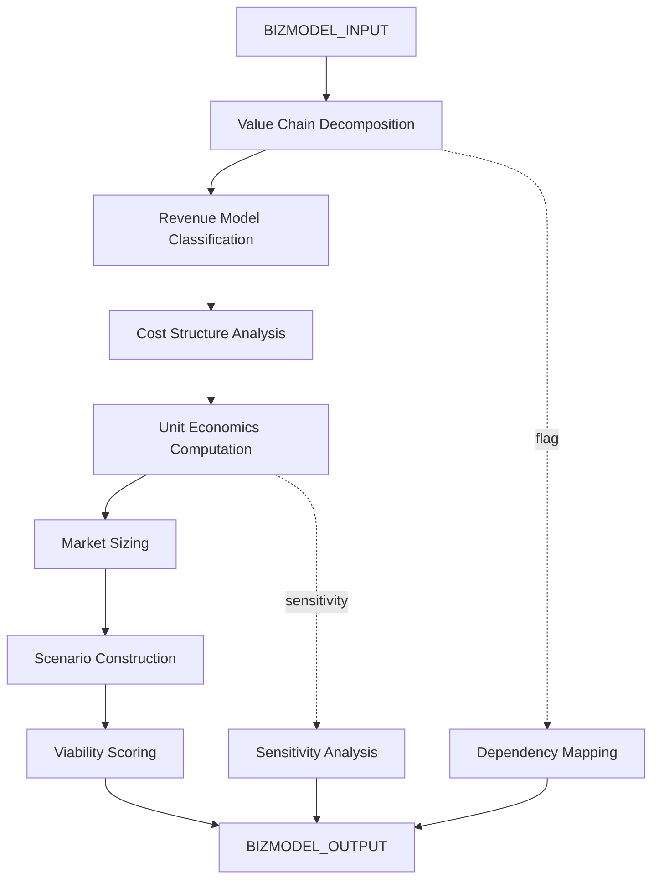

# AMOS Business Model Kernel v0 Business4

> **Origin Architect / Steward:** Trang Phan
> **Epistemic Class:** `AMOS_MODEL`
> **Conclusion Class:** `DERIVED`
> **Status:** `ACTIVE_SPECIFICATION`
> **Governing Plane:** `11_KNOWLEDGE/kernel`

> [!WARNING] GAP -- Original auto-parse failed; specification reconstructed from AMOS business model canon and BizFin Engine context.
> **Audit**: Marked GAP 2026-08-26 -- original auto-parse failed, no vault source found. Specification generated from structural context.

---

## 1. Architectural Scope

The **AMOS Business Model Kernel** (v0, Business4) defines the core data structures, algorithms, and computational guarantees for business model representation, analysis, and evaluation within the AMOS OS. It provides value chain mapping, revenue model classification, cost structure analysis, unit economics computation, and business model viability scoring.

This kernel exists to provide the **business modelling substrate** for all AMOS business and financial operations. It separates business structure (value proposition, value chain, revenue model) from parameters (numbers that can change) and enforces explicit assumption disclosure.

**Epistemic Boundary:**
```
MODEL != OBSERVATION
DOCUMENTED != IMPLEMENTED
CAPABILITY != AUTHORITY
BUSINESS_MODEL != INVESTMENT_ADVICE
STRUCTURE != PARAMETERS
```

**Core Data Structures:**
- `BusinessModel{value_proposition, value_chain, revenue_model, cost_structure, key_assets, dependencies}`
- `UnitEconomics{ARPU, CAC, LTV, gross_margin, contribution_margin, payback_period}`
- `MarketSizing{TAM, SAM, SOM, assumptions[]}`
- `ViabilityScore{structural_score, financial_score, market_score, risk_score}`

**Core Algorithms:**
- Value chain decomposition and dependency mapping
- Revenue model classification (subscription, transaction, marketplace, licensing, freemium, etc.)
- Unit economics computation with sensitivity analysis
- Business model viability scoring (weighted multi-dimensional)
- Scenario tree construction (base, upside, downside)

**Inputs:** `BIZMODEL_INPUT{entity, sector, model_type, parameters, constraints}`
**Outputs:** `BIZMODEL_OUTPUT{business_model, unit_economics, market_sizing, viability_score, scenarios[], assumptions[]}`

**Computational Guarantees:** Deterministic unit economics under fixed parameters, bounded viability score in [0, 1], explicit assumption traceability.

---

## 2. Governing Invariants

| ID | Invariant | Description |
|----|-----------|-------------|
| INV-BM-001 | Structure-Parameter Separation | Business structure must be separated from numerical parameters |
| INV-BM-002 | Explicit Assumptions | All assumptions must be stated explicitly |
| INV-BM-003 | Viability Score Boundedness | Viability score must be in [0, 1] |
| INV-BM-004 | Scenario Triangulation | Analysis must include base, upside, and downside scenarios |
| INV-BM-005 | No Investment Advice | Kernel outputs structural analysis, not investment recommendations |
| INV-BM-006 | Unit Economics Transparency | All unit economics components must be traceable to their inputs |
| INV-BM-007 | Dependency Mapping | Key dependencies must be identified and flagged |

---

## 3. Mathematical Formulation

**Unit economics:**

$$\text{LTV} = \text{ARPU} \cdot \text{GrossMargin} \cdot \frac{1}{1 - \text{RetentionRate}}$$

$$\text{CAC Payback} = \frac{\text{CAC}}{\text{ARPU} \cdot \text{GrossMargin}}$$

$$\text{LTV/CAC Ratio} = \frac{\text{LTV}}{\text{CAC}}$$

**Market sizing:**

$$\text{TAM} = \text{TotalAddressableMarket} \cdot \text{AvgPrice}$$
$$\text{SOM} = \text{SAM} \cdot \text{CaptureRate}(t) \cdot \text{ExecutionFactor}$$

**Viability score:**

$$V = w_1 \cdot S_{\text{structural}} + w_2 \cdot S_{\text{financial}} + w_3 \cdot S_{\text{market}} + w_4 \cdot (1 - S_{\text{risk}})$$

where $\sum w_i = 1$ and $S_i \in [0, 1]$.

**Scenario expected value:**

$$E[V] = P_{\text{base}} \cdot V_{\text{base}} + P_{\text{upside}} \cdot V_{\text{upside}} + P_{\text{downside}} \cdot V_{\text{downside}}$$

---

## 4. Architecture



---

## 5. MECE Mapping to AMOS Full Brain OS

| Kernel Component | AMOS Plane | Role |
|------------------|------------|------|
| Value Chain Decomposition | `11_KNOWLEDGE` | Knowledge mapping |
| Revenue Model Classification | `16_SCHEMAS` | Schema classification |
| Cost Structure Analysis | `12_STATE` | State analysis |
| Unit Economics | `13_MODELS` | Financial modelling |
| Market Sizing | `13_MODELS` | Market modelling |
| Scenario Construction | `13_MODELS` | Scenario modelling |
| Viability Scoring | `06_INTELLIGENCE` | Assessment |
| Sensitivity Analysis | `22_RESEARCH` | Research analysis |
| Dependency Mapping | `17_OBSERVABILITY` | Risk monitoring |

---

## 6. Safety Invariants & Firewalls

| ID | Firewall | Enforcement |
|----|----------|-------------|
| INV-BM-FW-001 | No Investment Advice | Outputs must contain structural-analysis disclaimer |
| INV-BM-FW-002 | Assumption Disclosure | Outputs without explicit assumptions are blocked |
| INV-BM-FW-003 | Scenario Completeness | Must include downside scenario |
| INV-BM-FW-004 | Viability Boundedness | Scores outside [0, 1] are blocked |
| INV-BM-FW-005 | Dependency Flagging | Outputs without dependency flags are blocked |

---

## 7. Navigation & Bindings

- **Parent MOC:** [[11_KNOWLEDGE/kernel/KERNEL_MOC|KERNEL_MOC]]
- **Home:** [[00_ROOT/00_HOME|00_HOME]]
- **Knowledge MOC:** [[11_KNOWLEDGE/KNOWLEDGE_MOC|KNOWLEDGE_MOC]]
- **BizFin Engine:** [[11_KNOWLEDGE/engine/AMOS_BIZFIN_ENGINE_V0_SECTOR_PACKS7|AMOS_BIZFIN_ENGINE_V0_SECTOR_PACKS7]]
- **Revenue Architecture Kernel:** [[11_KNOWLEDGE/kernel/AMOS_REVENUE_ARCHITECTURE_KERNEL|AMOS_REVENUE_ARCHITECTURE_KERNEL]]
- **Negotiation Diplomacy Kernel:** [[11_KNOWLEDGE/kernel/NEGOTIATION_DIPLOMACY_KERNEL|NEGOTIATION_DIPLOMACY_KERNEL]]
- **Meta Epistemology Kernel:** [[11_KNOWLEDGE/kernel/AMOS_META_EPISTEMOLOGY_KERNEL|AMOS_META_EPISTEMOLOGY_KERNEL]]
- **TPE Model Registry:** [[13_MODELS/04_DOMAIN/TPE_MODEL_REGISTRY|TPE_MODEL_REGISTRY]]
- **Tech UBI Canon Kernel:** [[11_KNOWLEDGE/kernel/AMOS_TECH_UBI_CANON_KERNEL_V1_TECH4|AMOS_TECH_UBI_CANON_KERNEL_V1_TECH4]]
- **Simulation Kernel:** [[11_KNOWLEDGE/kernel/AMOS_SIMULATION_KERNEL|AMOS_SIMULATION_KERNEL]]
- **Core Laws:** [[01_CANON/01_CORE_LAWS/AMOS_CORE_LAWS|01_CORE_LAWS]]

---

## 8. Known Gaps & Falsifiers

| ID | Gap | Impact | Action |
|----|-----|--------|--------|
| GAP-BM-001 | No original vault source | Specification is reconstructed | Label as reconstructed from canon |
| GAP-BM-002 | Market data not live | TAM/SAM/SOM are structural estimates | Flag as model-based |
| GAP-BM-003 | Viability weight calibration | Weights are subjective | Flag weights as configurable |
| GAP-BM-004 | Sector-specific models | Not all sectors may have dedicated models | Flag unsupported sectors |

---

**Related:** [[00_ROOT/00_HOME|00_HOME]] | [[11_KNOWLEDGE/KNOWLEDGE_MOC|KNOWLEDGE_MOC]] | [[11_KNOWLEDGE/engine/AMOS_BIZFIN_ENGINE_V0_SECTOR_PACKS7|AMOS_BIZFIN_ENGINE_V0_SECTOR_PACKS7]] | [[11_KNOWLEDGE/kernel/AMOS_REVENUE_ARCHITECTURE_KERNEL|AMOS_REVENUE_ARCHITECTURE_KERNEL]] | [[11_KNOWLEDGE/kernel/NEGOTIATION_DIPLOMACY_KERNEL|NEGOTIATION_DIPLOMACY_KERNEL]] | [[11_KNOWLEDGE/kernel/AMOS_META_EPISTEMOLOGY_KERNEL|AMOS_META_EPISTEMOLOGY_KERNEL]] | [[13_MODELS/04_DOMAIN/TPE_MODEL_REGISTRY|TPE_MODEL_REGISTRY]] | [[11_KNOWLEDGE/kernel/AMOS_TECH_UBI_CANON_KERNEL_V1_TECH4|AMOS_TECH_UBI_CANON_KERNEL_V1_TECH4]]

______________________________________________________________________

**MOC:** [[11_KNOWLEDGE/kernel/KERNEL_MOC|KERNEL_MOC]]
