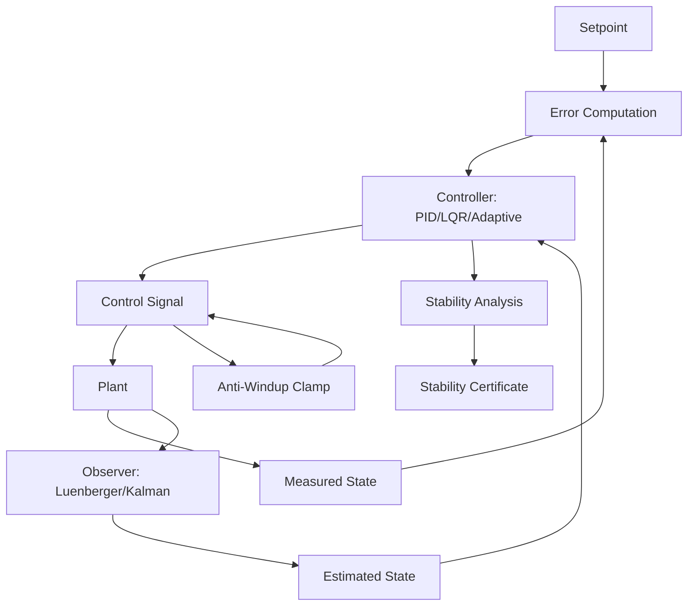

# AMOS Control Systems Kernel

> **Origin Architect / Steward:** Trang Phan
> **Epistemic Class:** `AMOS_MODEL`
> **Conclusion Class:** `DERIVED`
> **Status:** `ACTIVE_SPECIFICATION`
> **Governing Plane:** `11_KNOWLEDGE/kernel`

> Bridge note -- resolves the `amos-control-systems-kernel` link from the Cosmo Brain MOC / daily notes to the real skill in the vault.
> **Location:** `.devin/skills/amos-control-systems-kernel`

---

## 1. Architectural Scope

The **AMOS Control Systems Kernel** defines the core algorithms, data structures, and computational guarantees for control-theoretic operations within the AMOS OS. It provides feedback loop management, stability analysis, setpoint tracking, disturbance rejection, and control surface allocation.

This kernel exists to provide the **mathematical foundation** for all control-plane operations, ensuring that system behavior remains bounded, stable, and responsive under perturbation. It implements classical (PID, LQR), modern (state-space, observer-based), and adaptive control strategies.

**Epistemic Boundary:**
```
MODEL != OBSERVATION
DOCUMENTED != IMPLEMENTED
CAPABILITY != AUTHORITY
CONTROL_DESIGN != CONTROL_DEPLOYMENT
STABILITY_ANALYSIS != STABILITY_GUARANTEE
```

**Core Data Structures:**
- `ControlState{setpoint, measured, error, integral, derivative, output}`
- `ControlLoop{loop_id, plant_model, controller, observer, stability_margin}`
- `StabilityCertificate{loop_id, gain_margin, phase_margin, lyapunov_function}`

**Core Algorithms:**
- PID control with anti-windup
- LQR (Linear Quadratic Regulator) optimal control
- State-space observer (Luenberger/Kalman)
- Lyapunov stability analysis
- Adaptive control with parameter estimation

**Inputs:** `CONTROL_INPUT{setpoint, measured_state, disturbance, constraints}`
**Outputs:** `CONTROL_OUTPUT{control_signal, stability_report, error_metrics, adaptation_delta}`

**Computational Guarantees:** Bounded-input bounded-output (BIBO) stability under specified conditions, deterministic convergence for linear plants, bounded tracking error for adaptive modes.

---

## 2. Governing Invariants

| ID | Invariant | Description |
|----|-----------|-------------|
| INV-CS-001 | BIBO Stability | For bounded inputs, the controlled system must produce bounded outputs |
| INV-CS-002 | Error Boundedness | Tracking error must remain within declared bounds under specified disturbance profiles |
| INV-CS-003 | Anti-Windup Enforcement | Integral terms must be clamped to prevent windup under saturation |
| INV-CS-004 | Stability Margin Preservation | Gain and phase margins must remain above minimum thresholds |
| INV-CS-005 | Observer Convergence | State observers must converge to true state under observability conditions |
| INV-CS-006 | Control Surface Allocation | Control signals must respect actuator limits and allocation constraints |
| INV-CS-007 | Lyapunov Decrease | For stable modes, a Lyapunov function must exhibit strict decrease |

---

## 3. Mathematical Formulation

**PID control law:**

$$u(t) = K_p e(t) + K_i \int_0^t e(\tau) d\tau + K_d \frac{de(t)}{dt}$$

**LQR optimal control:**

$$u^*(t) = -K x(t), \quad K = R^{-1} B^T P$$

where $P$ solves the algebraic Riccati equation:

$$A^T P + PA - PBR^{-1}B^T P + Q = 0$$

**Lyapunov stability condition:**

$$V(x) > 0, \quad \dot{V}(x) < 0 \quad \forall x \neq 0$$

**Stability margins:**

$$G_m = \frac{1}{|L(j\omega_{\pi})|}, \quad \phi_m = \pi + \angle L(j\omega_g)$$

where $L$ is the open-loop transfer function, $\omega_\pi$ is the phase crossover, and $\omega_g$ is the gain crossover.

**Kalman filter update:**

$$\hat{x}_{k|k} = \hat{x}_{k|k-1} + K_k(y_k - H\hat{x}_{k|k-1})$$

---

## 4. Architecture



---

## 5. MECE Mapping to AMOS Full Brain OS

| Kernel Component | AMOS Plane | Role |
|------------------|------------|------|
| Error Computation | `03_CONTROL_PLANE` | Control error routing |
| Controller (PID/LQR) | `04_RUNTIME` | Control signal generation |
| Plant Interface | `12_STATE` | State interaction |
| Observer | `17_OBSERVABILITY` | State estimation |
| Stability Analysis | `17_OBSERVABILITY` | Stability monitoring |
| Anti-Windup | `03_CONTROL_PLANE` | Safety clamp |
| Adaptation Delta | `13_MODELS` | Model adaptation |
| Stability Certificate | `16_SCHEMAS` | Certificate schema |

---

## 6. Safety Invariants & Firewalls

| ID | Firewall | Enforcement |
|----|----------|-------------|
| INV-CS-FW-001 | Stability Margin Floor | Control loops below minimum margin are flagged and degraded |
| INV-CS-FW-002 | Anti-Windup Mandatory | Controllers without anti-windup are rejected |
| INV-CS-FW-003 | Actuator Limit Enforcement | Control signals exceeding actuator limits are clamped |
| INV-CS-FW-004 | Observer Divergence Detection | Divergent observers trigger fail-safe mode |
| INV-CS-FW-005 | Lyapunov Violation Alert | Violation of Lyapunov decrease triggers stability alert |

---

## 7. Navigation & Bindings

- **Parent MOC:** [[11_KNOWLEDGE/kernel/KERNEL_MOC|KERNEL_MOC]]
- **Knowledge MOC:** [[11_KNOWLEDGE/KNOWLEDGE_MOC|KNOWLEDGE_MOC]]
- **Home:** [[00_ROOT/00_HOME|00_HOME]]
- **BizFin Kernel:** [[11_KNOWLEDGE/kernel/AMOS_BIZFIN_KERNEL_V0|AMOS_BIZFIN_KERNEL_V0]]
- **Revenue Architecture Kernel:** [[11_KNOWLEDGE/kernel/AMOS_REVENUE_ARCHITECTURE_KERNEL|AMOS_REVENUE_ARCHITECTURE_KERNEL]]
- **Psychology Decision Kernel:** [[11_KNOWLEDGE/kernel/AMOS_PSYCHOLOGY_DECISION_KERNEL|AMOS_PSYCHOLOGY_DECISION_KERNEL]]
- **Simulation Kernel:** [[11_KNOWLEDGE/kernel/AMOS_SIMULATION_KERNEL|AMOS_SIMULATION_KERNEL]]
- **Constraint Engine:** [[11_KNOWLEDGE/engine/CONSTRAINT_ENGINE|CONSTRAINT_ENGINE]]
- **Core Laws:** [[01_CANON/01_CORE_LAWS/AMOS_CORE_LAWS|01_CORE_LAWS]]

---

## 8. Known Gaps & Falsifiers

| ID | Gap | Impact | Action |
|----|-----|--------|--------|
| GAP-CS-001 | Nonlinear plant coverage | Classical control assumes linear plants | Flag nonlinear plants for adaptive mode |
| GAP-CS-002 | Disturbance model accuracy | Disturbance profiles are estimated | Flag disturbance rejection as bounded, not guaranteed |
| GAP-CS-003 | Observer observability | Observers require full observability | Flag partially observable systems |
| GAP-CS-004 | Adaptive convergence rate | Adaptive control convergence depends on excitation | Flag insufficient excitation conditions |

---

**Related:** [[11_KNOWLEDGE/kernel/KERNEL_MOC|KERNEL_MOC]] | [[11_KNOWLEDGE/KNOWLEDGE_MOC|KNOWLEDGE_MOC]] | [[11_KNOWLEDGE/kernel/AMOS_BIZFIN_KERNEL_V0|AMOS_BIZFIN_KERNEL_V0]] | [[11_KNOWLEDGE/kernel/AMOS_REVENUE_ARCHITECTURE_KERNEL|AMOS_REVENUE_ARCHITECTURE_KERNEL]] | [[11_KNOWLEDGE/kernel/AMOS_PSYCHOLOGY_DECISION_KERNEL|AMOS_PSYCHOLOGY_DECISION_KERNEL]]

______________________________________________________________________

**MOC:** [[11_KNOWLEDGE/kernel/KERNEL_MOC|KERNEL_MOC]] | [[00_ROOT/00_HOME|00_HOME]]
