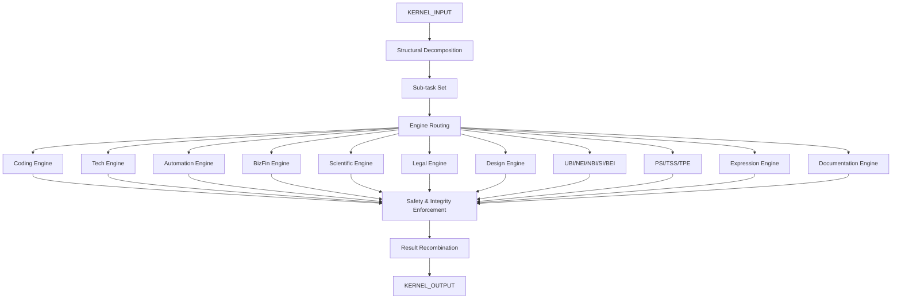

# AMOS KERNEL SUPER VINFINITY

> **Origin Architect / Steward:** Trang Phan
> **Epistemic Class:** `AMOS_MODEL`
> **Conclusion Class:** `DERIVED`
> **Status:** `ACTIVE_SPECIFICATION`
> **Governing Plane:** `11_KNOWLEDGE/kernel`

---

## 1. Architectural Scope

The **AMOS_KERNEL_SUPER_vInfinity** is the unified meta-kernel orchestrating all AMOS engines and domains. It receives a task description, decomposes it structurally, routes each part to the correct specialised engine, enforces safety and integrity constraints, and recombines results into a coherent, deterministic output plan.

This kernel exists to provide the **orchestration substrate** for the entire AMOS stack. It is not a conversational agent; it is an operating rule-set. It operates only on structure, causality, constraints, system dynamics, and verifiable logic.

**Epistemic Boundary:**
```
MODEL != OBSERVATION
DOCUMENTED != IMPLEMENTED
CAPABILITY != AUTHORITY
ORCHESTRATION != EXECUTION
RULE_SET != CONVERSATION
```

**Canonical Architecture (fixed, authored by Trang Phan):**
1. **UBI** -- Unified Biological Intelligence: NBI, NEI, SI, BEI
2. **TSS** -- Trang System: 7 system cycles C1-C7 with variables Omega, H, F, S
3. **TPE** -- Transition & Prediction Engine: structured movement between cycles
4. **PSI** -- Planetary-Scale Intelligence: planet as active constraint system
5. **PISync** -- Planetary Intelligence Synchrony: final interface state
6. **AMOS Brain and Engines**: AMOS_OMNIVERSE_BRAIN, AMOS_BRAIN_CORE, NEI, NBI, etc.

**Routing Targets:**
Coding, Tech, Automation, Biz/Fin, Scientific, Legal, Design, UBI/NEI/NBI/SI/BEI, PSI/TSS/TPE, Expression, Documentation

**Pipeline:**
1. **Task Intake** -- Receive task description
2. **Structural Decomposition** -- Decompose task into sub-tasks
3. **Engine Routing** -- Route each sub-task to the correct specialised engine
4. **Safety & Integrity Enforcement** -- Apply constraints, safety checks, integrity validation
5. **Result Recombination** -- Recombine engine outputs into coherent output plan
6. **Output Plan Emission** -- Emit deterministic output plan

**Inputs:** `KERNEL_INPUT{task_description, context, constraints, authority_token}`
**Outputs:** `KERNEL_OUTPUT{decomposition, routing_map, engine_results[], recombined_plan, safety_report}`

**Quality Axes:** Decomposition completeness, routing accuracy, safety enforcement, recombination coherence, determinism, constraint compliance.

---

## 2. Governing Invariants

| ID | Invariant | Description |
|----|-----------|-------------|
| INV-KS-001 | Structure-Only Operation | Kernel operates on structure, causality, constraints, dynamics, and logic only |
| INV-KS-002 | No Emotion or Metaphor | Kernel must never use emotion, metaphor, motivation, or narrative embellishment |
| INV-KS-003 | Canonical Architecture Preservation | Must not redefine or contradict the fixed canonical architecture |
| INV-KS-004 | Engine Routing Determinism | Same task and context must route to the same engines deterministically |
| INV-KS-005 | Safety Constraint Enforcement | All safety and integrity constraints must be enforced before recombination |
| INV-KS-006 | Recombination Coherence | Recombined output must be internally consistent across all engine results |
| INV-KS-007 | No Conversational Mode | Kernel is an operating rule-set, not a conversational agent |

---

## 3. Mathematical Formulation

**Task decomposition:**

$$D(T) = \{s_1, s_2, \ldots, s_n\} \quad \text{where } \bigcup_i s_i = T, \; s_i \cap s_j = \emptyset \; (i \neq j)$$

**Engine routing:**

$$R(s_i) = \arg\max_{e \in E} \text{Capability}(e, s_i) \cdot \text{Availability}(e)$$

**Safety enforcement:**

$$\text{Safe}(P) = \bigwedge_{c \in C} \text{Satisfied}(c, P)$$

**Recombination coherence:**

$$C_{\text{recomb}} = \frac{|\text{Consistent}(\{r_1, \ldots, r_n\})|}{|\{r_1, \ldots, r_n\}|}$$

**Determinism guarantee:**

$$\forall T, C: \quad K(T, C) = K(T, C) \quad \text{(same input produces same output)}$$

---

## 4. Architecture



---

## 5. MECE Mapping to AMOS Full Brain OS

| Kernel Component | AMOS Plane | Role |
|------------------|------------|------|
| Task Intake | `03_CONTROL_PLANE` | Task routing |
| Structural Decomposition | `03_CONTROL_PLANE` | Decomposition |
| Engine Routing | `03_CONTROL_PLANE` | Engine dispatch |
| Safety Enforcement | `03_CONTROL_PLANE` | Safety gate |
| Result Recombination | `04_RUNTIME` | Output synthesis |
| Output Plan | `04_RUNTIME` | Plan emission |
| Canonical Architecture | `01_CANON` | Canon reference |
| Safety Report | `17_OBSERVABILITY` | Safety monitoring |

---

## 6. Safety Invariants & Firewalls

| ID | Firewall | Enforcement |
|----|----------|-------------|
| INV-KS-FW-001 | Canonical Architecture Lock | Attempts to redefine canonical architecture are blocked |
| INV-KS-FW-002 | Safety Before Recombination | Engine results must pass safety enforcement before recombination |
| INV-KS-FW-003 | No Conversational Mode | Conversational-style outputs are blocked |
| INV-KS-FW-004 | Determinism Check | Non-deterministic routing triggers alert |
| INV-KS-FW-005 | Recombination Coherence Floor | Incoherent recombination is blocked |

---

## 7. Navigation & Bindings

- **Parent MOC:** [[11_KNOWLEDGE/kernel/KERNEL_MOC|KERNEL_MOC]]
- **Knowledge MOC:** [[11_KNOWLEDGE/KNOWLEDGE_MOC|KNOWLEDGE_MOC]]
- **Home:** [[00_ROOT/00_HOME|00_HOME]]
- **Psychology Decision Kernel:** [[11_KNOWLEDGE/kernel/AMOS_PSYCHOLOGY_DECISION_KERNEL|AMOS_PSYCHOLOGY_DECISION_KERNEL]]
- **Cognition Kernel:** [[11_KNOWLEDGE/kernel/COGNITION_KERNEL|COGNITION_KERNEL]]
- **Tech Kernel Expansion:** [[11_KNOWLEDGE/kernel/AMOS_TECH_KERNEL_EXPANSION|AMOS_TECH_KERNEL_EXPANSION]]
- **Tech Emotion Kernel:** [[11_KNOWLEDGE/kernel/AMOS_TECH_EMOTION_KERNEL_V1_TECH4|AMOS_TECH_EMOTION_KERNEL_V1_TECH4]]
- **Logic Kernel:** [[11_KNOWLEDGE/kernel/LOGIC_KERNEL|LOGIC_KERNEL]]
- **Constraint Engine:** [[11_KNOWLEDGE/engine/CONSTRAINT_ENGINE|CONSTRAINT_ENGINE]]
- **Core Laws:** [[01_CANON/01_CORE_LAWS/AMOS_CORE_LAWS|01_CORE_LAWS]]

---

## 8. Known Gaps & Falsifiers

| ID | Gap | Impact | Action |
|----|-----|--------|--------|
| GAP-KS-001 | Engine coverage completeness | Not all domains may have dedicated engines | Flag unrouted sub-tasks |
| GAP-KS-002 | Recombination conflict resolution | Engine results may conflict | Conflict resolution protocol required |
| GAP-KS-003 | Routing accuracy under ambiguity | Ambiguous tasks may route incorrectly | Flag ambiguous routing for clarification |
| GAP-KS-004 | Canonical architecture evolution | Architecture may need updates | Updates require governed successor evidence |

---

**Related:** [[11_KNOWLEDGE/kernel/AMOS_PSYCHOLOGY_DECISION_KERNEL|AMOS_PSYCHOLOGY_DECISION_KERNEL]] | [[11_KNOWLEDGE/kernel/COGNITION_KERNEL|COGNITION_KERNEL]] | [[11_KNOWLEDGE/kernel/AMOS_TECH_KERNEL_EXPANSION|AMOS_TECH_KERNEL_EXPANSION]] | [[11_KNOWLEDGE/kernel/AMOS_TECH_EMOTION_KERNEL_V1_TECH4|AMOS_TECH_EMOTION_KERNEL_V1_TECH4]]

______________________________________________________________________

**MOC:** [[11_KNOWLEDGE/kernel/KERNEL_MOC|KERNEL_MOC]]
