# AMOS AUDIT QUALITY KERNEL V0

## Full Canonical Expansion — Source-Grounded · Audit-Grade · RSCF-Aware · Evidence-Firewalled · Obsidian-Ready

> [!abstract] Canonical conclusion
> **Conclusion class: DERIVED**
>
> `AMOS AUDIT QUALITY KERNEL V0` defines a source-claimed AMOS audit and quality-assurance kernel organized around **18 audit clusters × 20 quality dimensions**, with a virtual scenario-expansion model, cluster-selection mapping, two reasoning modes, explicit anti-fabrication policies, task routing, dependencies on Governance and Documentation SUPER engines, four stakeholder lenses, and eleven reusable document/deck/table templates.
>
> Its strongest integrity boundary is explicit:
>
> $$
> \boxed{\text{Do not fabricate test results or evidence}}
> $$
>
> together with:
>
> $$
> \boxed{\text{Do not claim regulatory approvals or audit opinions}}
> $$
>
> Consequently, this kernel can structure an audit plan, review audit work, organize evidence requirements, reason about controls, frame findings, support quality review, and generate audit-oriented artifacts. The supplied source does **not** authorize it to manufacture evidence, convert planning into completed testing, infer control effectiveness from control design, issue an audit opinion, claim regulatory approval, or treat internally generated analysis as independent assurance.
>
> The source's `x100k_virtual` / `virtual_layer_count: 100000` is a **virtual expansion model**, not evidence that 100,000 explicit layers, audited scenarios, records, tests, or runtime objects exist. Likewise, `cluster_count: 18` and `dimension_count: 20` are structurally corroborated by the supplied arrays/maps, but no scoring function is supplied for the implied cluster × dimension space.
>
> The strongest safe characterization is:
>
> $$
> \boxed{
> AuditQualityKernel
> =
> AuditTaxonomy
> +
> QualityDimensions
> +
> ScenarioSpace
> +
> Routing
> +
> StakeholderLenses
> +
> ArtifactTemplates
> +
> EvidenceIntegrityConstraints
> }
> $$
>
> **not**
>
> $$
> AuditQualityKernel
> =
> CompletedAudit
> $$
>
> and not:
>
> $$
> AuditQualityKernel
> =
> IndependentAuditOpinion
> $$

---

# 1. Normalized Source Frontmatter

The following preserves the supplied frontmatter values. Only Markdown/YAML escaping is normalized.

```yaml
---
title: AMOS AUDIT QUALITY KERNEL V0

tags:
  - canon-group/tech-ai
  - canon/framework
  - rscf/claim
  - rscf/provenance
  - rscf/state/source-claim
  - topic/amos-audit-quality-kernel-v0
  - kernel

type: data
source: 11_KNOWLEDGE/kernel

rscf:
  state: SOURCE_CLAIM
  claim_class: SOURCE_CLAIM
  provenance: AMOS_corpus
  scope: AMOS_knowledge
---
```

No additional metadata should be treated as part of the original frontmatter.

---

# 2. Source Body Parse State

Unlike the prior analogy artifact, the supplied Audit Quality body is structurally valid-looking JSON in the visible text.

No obvious malformed key comparable to `"inputs: [` is present.

Source-safe status:

```yaml
source_body:
  representation: JSON
  visible_parse_defect: NONE_IDENTIFIED
  strict_parser_execution: NOT_PERFORMED
```

Therefore:

> **No visible syntax defect identified** is stronger than **independently verified valid JSON**.

---

# 3. Source-Preserved Identity

The body declares:

```yaml
meta:
  name: Audit_Quality_Kernel_vInfinity_SUPER
  version: v2.0.0+lens_integration
  created_at_utc: 2025-11-28T00:10:18.516087Z
  domain: audit_and_quality_assurance
  density_profile: kernel_x100k_virtual
  cluster_count: 18
  dimension_count: 20
```

All are **SOURCE_CLAIM** metadata.

---

# 4. Title/Body Identity Tension

The frontmatter title says:

```text
AMOS AUDIT QUALITY KERNEL V0
```

The body name says:

```text
Audit_Quality_Kernel_vInfinity_SUPER
```

The body version says:

```text
v2.0.0+lens_integration
```

Thus at least three version/naming signals coexist:

$$
V0
$$

$$
vInfinity\_SUPER
$$

$$
v2.0.0+lens\_integration
$$

Their exact relationship is not supplied.

Therefore:

```text
V0 ↔ vInfinity_SUPER = UNKNOWN/GAP
V0 ↔ v2.0.0+lens_integration = UNKNOWN/GAP
vInfinity_SUPER ↔ semantic version = UNKNOWN/GAP
```

Do not collapse them into one version scheme.

---

# 5. Creation Timestamp

Source:

```text
2025-11-28T00:10:18.516087Z
```

This establishes a source-declared creation timestamp.

It does not establish:

- last update,
- currentness,
- deployment date,
- validation date,
- review date,
- expiry,
- revalidation interval.

---

# 6. Description

Source:

> Audit & Quality kernel for internal audit, controls testing, and assurance. Now enriched with cross-canon integration, lens_space, and template_library.

This defines three core audit areas:

1. internal audit,
2. controls testing,
3. assurance,

plus three stated enrichments:

1. cross-canon integration,
2. `lens_space`,
3. `template_library`.

---

# 7. “Now Enriched” Version Signal

The phrase:

> Now enriched...

implies some prior state or version.

But that prior state is not supplied here.

Therefore:

```text
PreviousVersion = UNKNOWN/GAP
```

The current source alone cannot reconstruct the evolution.

---

# 8. Epistemic Boundary

Frontmatter explicitly declares:

```yaml
rscf:
  state: SOURCE_CLAIM
  claim_class: SOURCE_CLAIM
```

Therefore the artifact establishes:

> AMOS corpus describes this audit-quality architecture.

It does not independently establish:

```text
actual audit execution
control effectiveness
evidence authenticity
regulatory compliance
audit opinion
regulatory approval
runtime deployment
professional accreditation
assurance independence
test completion
remediation effectiveness
```

---

# 9. Core Audit Law

The source explicitly says:

```text
Do not fabricate test results or evidence.
```

This creates a fundamental evidence conservation rule:

$$
\boxed{
AbsentEvidence
\not\rightarrow
InventedEvidence
}
$$

---

# 10. Assurance Law

Source:

```text
Do not claim regulatory approvals or audit opinions.
```

Therefore:

$$
\boxed{
KernelAnalysis
\not\Rightarrow
AuditOpinion
}
$$

and:

$$
\boxed{
KernelAnalysis
\not\Rightarrow
RegulatoryApproval
}
$$

---

# 11. Planning Is Not Testing

Because one reasoning mode is audit planning:

$$
AuditPlan
\neq
AuditExecution
$$

A plan specifies what should be tested.

It does not prove the tests occurred.

---

# 12. Test Design Is Not Test Result

The cluster taxonomy contains:

```text
test_design_anddocumentation
```

and operating-effectiveness testing.

But:

$$
TestDesign
\neq
TestExecution
$$

and:

$$
TestExecution
\neq
PassingResult
$$

---

# 13. Evidence Request Is Not Evidence

An audit workpaper template or evidence list may identify required support.

That does not establish that support exists.

$$
EvidenceRequirement
\neq
EvidenceReceived
$$

---

# 14. Evidence Received Is Not Evidence Validated

Likewise:

$$
EvidenceReceived
\neq
EvidenceAuthentic
$$

and:

$$
EvidenceAuthentic
\neq
EvidenceSufficient
$$

---

# 15. Audit Taxonomy

The kernel defines:

```yaml
total_clusters: 18
```

and explicitly lists IDs 1 through 18.

The declared count is structurally consistent with the visible list.

Thus:

$$
|Clusters|=18
$$

for the supplied source.

---

# 16. Cluster 1 — Audit Universe Definition

```text
audit_universe_definition
```

This represents the population of auditable entities/processes/areas conceptually.

No formal audit-universe schema is supplied.

---

# 17. Cluster 2 — Risk-Based Audit Planning

```text
risk_based_audit_planning
```

This establishes risk alignment as part of planning.

No risk scoring formula is supplied.

---

# 18. Cluster 3 — Engagement Scoping

```text
engagement_scoping
```

This concerns the boundary of an individual audit/review engagement.

No scope-materiality equation is supplied.

---

# 19. Cluster 4 — Process Walkthroughs

```text
process_walkthroughs
```

The source does not define:

- walkthrough evidence requirements,
- interview protocol,
- observation requirements,
- process-map format,
- walkthrough completeness.

---

# 20. Cluster 5 — Control Design Assessment

```text
control_design_assessment
```

This is importantly distinct from operating effectiveness.

---

# 21. Design Versus Operation Firewall

A control can be well designed but not operated.

Therefore:

$$
DesignAdequate
\not\Rightarrow
OperatingEffective
$$

The source itself supports this separation by assigning them different clusters.

---

# 22. Cluster 6 — Control Operating Effectiveness Testing

```text
control_operating_effectiveness_testing
```

This addresses whether controls operate effectively, but no test methodology is supplied.

---

# 23. Operating Effectiveness Requires Evidence

Safe derived law:

$$
OperatingEffectivenessConclusion
\Rightarrow
TestEvidenceRequired
$$

Given the explicit no-fabrication policy, an operating-effectiveness conclusion cannot safely be manufactured from design description alone.

---

# 24. Cluster 7 — Sampling Strategies

```text
sampling_strategies
```

No sampling model is supplied.

Unknown:

```text
statistical sampling
judgmental sampling
random sampling
systematic sampling
stratified sampling
sample-size calculation
confidence interval
tolerable deviation
expected deviation
```

Do not invent them.

---

# 25. Cluster 8 — Test Design and Documentation

Raw source identifier:

```text
test_design_anddocumentation
```

The missing underscore between `and` and `documentation` should be preserved as source spelling.

Do not silently rewrite the source field to:

```text
test_design_and_documentation
```

unless marked as a derived normalization.

---

# 26. Cluster 9 — Evidence Collection and Workpapers

Raw source:

```text
evidence_collection_andworkpapers
```

Again, preserve source spelling.

Possible normalized display:

```text
Evidence Collection and Workpapers
```

is safe as human-readable interpretation, but the canonical source key remains unchanged.

---

# 27. Cluster 10 — Issue Formation and Rating

Raw:

```text
issue_formation_andrating
```

No issue-rating scale is supplied.

Therefore:

```text
Critical / High / Medium / Low
```

must not be assumed canonical.

---

# 28. Cluster 11 — Root Cause Analysis

```text
root_cause_analysis
```

The presence of this cluster does not establish a specific RCA methodology.

Unknown:

```text
5 Whys
Fishbone
Fault Tree
Bow-Tie
causal graph
statistical causal inference
```

---

# 29. Root Cause Firewall

An observed issue does not by itself prove a root cause.

$$
ObservedFailure
\neq
EstablishedRootCause
$$

Association, chronology, or stakeholder explanation may generate hypotheses but not necessarily causal proof.

---

# 30. Cluster 12 — Recommendation and Remediation Plans

Raw:

```text
recommendation_andremediation_plans
```

This covers remediation design/planning.

It does not establish remediation execution.

---

# 31. Remediation Plan Is Not Remediation

$$
Plan
\neq
Implementation
$$

and:

$$
Implementation
\neq
ValidatedEffectiveness
$$

---

# 32. Cluster 13 — Audit Reporting

```text
audit_reporting
```

Reporting is explicitly part of the kernel.

But the policy boundary prohibits claiming an audit opinion.

Therefore the source supports audit-oriented reporting without authorizing formal opinion issuance.

---

# 33. Cluster 14 — Follow-Up and Validation

```text
follow_up_and_validation
```

This establishes post-remediation review as a distinct audit lifecycle stage.

---

# 34. Closure Is Not Validation

A management statement that an issue is closed is not equivalent to independent validation.

$$
ManagementClosure
\neq
ValidatedClosure
$$

This is DERIVED assurance discipline.

---

# 35. Cluster 15 — Regulatory Audit Coordination

```text
regulatory_audit_coordination
```

This supports coordination activity.

It does not authorize:

- regulatory representation,
- legal conclusions,
- regulator approval claims,
- official regulator communication.

---

# 36. Cluster 16 — Quality Assurance and Independent Review

Raw:

```text
quality_assurance_andindependent_review
```

This is particularly important because `independence_and_objectivity` is also a quality dimension.

---

# 37. Independence Firewall

A review being labeled `independent_review` does not prove actual independence.

Independence depends on provenance, organizational relationships, incentives, prior involvement, reporting line, and other conditions not supplied.

Therefore:

$$
IndependentReviewLabel
\neq
VerifiedIndependence
$$

---

# 38. Cluster 17 — Methodology and Standards

Raw:

```text
methodology_andstandards
```

No named professional standard is supplied.

Do not infer:

```text
IIA Standards
ISA
PCAOB
COSO
SOX
ISO
COBIT
NIST
```

from general audit terminology alone.

---

# 39. Cluster 18 — Automation and Data Analytics in Audit

```text
automation_anddata_analytics_in_audit
```

This introduces technology-enabled audit capability.

No specific analytics stack or automation mechanism is supplied.

---

# 40. Complete Cluster Sequence

```text
01 audit_universe_definition
02 risk_based_audit_planning
03 engagement_scoping
04 process_walkthroughs
05 control_design_assessment
06 control_operating_effectiveness_testing
07 sampling_strategies
08 test_design_anddocumentation
09 evidence_collection_andworkpapers
10 issue_formation_andrating
11 root_cause_analysis
12 recommendation_andremediation_plans
13 audit_reporting
14 follow_up_and_validation
15 regulatory_audit_coordination
16 quality_assurance_andindependent_review
17 methodology_andstandards
18 automation_anddata_analytics_in_audit
```

---

# 41. Cluster IDs

IDs are sequential integers 1–18.

This supports stable source ordering.

It does **not** establish runtime execution order.

---

# 42. Lifecycle Interpretation

The ordering resembles an audit lifecycle:

$$
Universe
\rightarrow
Planning
\rightarrow
Scope
\rightarrow
Walkthrough
\rightarrow
ControlAssessment
\rightarrow
Testing
\rightarrow
Evidence
\rightarrow
Issues
\rightarrow
Remediation
\rightarrow
Reporting
\rightarrow
FollowUp
$$

This is a strong **DERIVED** interpretation.

The source does not explicitly say cluster ID equals workflow order.

---

# 43. Nonlinear Audit Reality

Several clusters may operate recursively or in parallel.

For example:

- sampling influences testing,
- evidence collection occurs throughout,
- documentation accompanies multiple phases,
- quality review may occur before final reporting,
- regulatory coordination may span the engagement.

Therefore a strict 1→18 pipeline should not be claimed.

---

# 44. Cluster Space as Taxonomy

Safest interpretation:

$$
ClusterSpace
=
AuditCapabilityTaxonomy
$$

rather than:

$$
ClusterSpace
=
MandatorySequentialWorkflow
$$

---

# 45. Dimension Space

The source declares:

```yaml
total_dimensions: 20
```

and maps `"01"` through `"20"`.

The visible structure confirms 20 entries.

Thus:

$$
|Dimensions|=20
$$

---

# 46. Dimension 01 — Coverage

```text
coverage
```

No coverage metric is defined.

Possible meanings remain unresolved.

---

# 47. Dimension 02 — Risk Alignment

```text
risk_alignment
```

This likely evaluates how well audit activity aligns with relevant risks, but no formula exists.

---

# 48. Dimension 03 — Testing Depth

```text
testing_depth
```

No threshold distinguishes shallow versus deep testing.

---

# 49. Dimension 04 — Evidence Quality

```text
evidence_quality
```

This is central to the source's anti-fabrication policy.

No evidence-quality rubric is supplied.

---

# 50. Evidence Quality Is Multidimensional

Potential qualities might include relevance, reliability, sufficiency, provenance, freshness, completeness, authenticity, independence.

But those are **not explicitly enumerated here**.

Do not silently canonize them as this kernel's dimension definition.

---

# 51. Dimension 05 — Documentation Clarity

```text
documentation_clarity
```

Clarity does not equal correctness.

$$
ClearDocumentation
\not\Rightarrow
CorrectConclusion
$$

---

# 52. Dimension 06 — Finding Quality

```text
finding_quality
```

No finding schema is defined.

---

# 53. Dimension 07 — Root Cause Rigour

```text
root_cause_rigour
```

This is a quality dimension distinct from the root-cause cluster itself.

Thus the kernel separates:

```text
what work is being done
```

from:

```text
how well that work is done
```

---

# 54. Cluster × Dimension Architecture

This suggests:

$$
Clusters = Activity/CapabilityAxis
$$

$$
Dimensions = Quality/EvaluationAxis
$$

**DERIVED.**

---

# 55. Dimension 08 — Remediation Viability

```text
remediation_viability
```

Viability is not effectiveness.

A remediation may be feasible but ineffective, or theoretically effective but infeasible.

---

# 56. Dimension 09 — Independence and Objectivity

```text
independence_and_objectivity
```

This is explicitly named.

No scoring method is supplied.

---

# 57. Dimension 10 — Regulatory Alignment

```text
regulatory_alignment
```

Alignment does not mean regulator approval.

This is reinforced by the explicit policy.

---

# 58. Dimension 11 — Stakeholder Impact

```text
stakeholder_impact
```

No stakeholder ontology or impact scale exists.

---

# 59. Dimension 12 — Repeat Issue Risk

```text
repeat_issue_risk
```

This concerns recurrence risk.

No recurrence model is supplied.

---

# 60. Dimension 13 — Timeliness

```text
timeliness
```

No SLA or duration threshold is supplied.

---

# 61. Dimension 14 — Resource Efficiency

```text
resource_efficiency
```

Efficiency must not override audit integrity.

A derived governance rule:

$$
EfficiencyOptimization
\not\Rightarrow
EvidenceReductionBelowSufficiency
$$

---

# 62. Dimension 15 — Data Usage Maturity

```text
data_usage_maturity
```

No maturity levels are supplied.

Do not invent Level 1–5.

---

# 63. Dimension 16 — Methodology Compliance

```text
methodology_compliance
```

No specific methodology is bound in this artifact.

Thus compliance target remains unresolved.

---

# 64. Dimension 17 — Follow-Up Effectiveness

```text
follow_up_effectiveness
```

Distinct from merely performing follow-up.

---

# 65. Dimension 18 — Assurance Confidence

```text
assurance_confidence
```

No confidence scale/calibration is supplied.

This field must not be interpreted automatically as statistical probability.

---

# 66. Confidence Firewall

$$
AssuranceConfidence
\neq
CalibratedProbability
$$

unless another source defines that relationship.

---

# 67. Dimension 19 — Control Environment Insight

```text
control_environment_insight
```

No formal definition of `control_environment` appears locally.

---

# 68. Dimension 20 — Continuous Improvement

```text
continuous_improvement
```

This closes the quality taxonomy with iterative improvement.

No improvement-loop algorithm is supplied.

---

# 69. Complete Dimension Sequence

```text
01 coverage
02 risk_alignment
03 testing_depth
04 evidence_quality
05 documentation_clarity
06 finding_quality
07 root_cause_rigour
08 remediation_viability
09 independence_and_objectivity
10 regulatory_alignment
11 stakeholder_impact
12 repeat_issue_risk
13 timeliness
14 resource_efficiency
15 data_usage_maturity
16 methodology_compliance
17 follow_up_effectiveness
18 assurance_confidence
19 control_environment_insight
20 continuous_improvement
```

---

# 70. Base Cluster × Dimension Matrix

With 18 clusters and 20 dimensions:

$$
18\times20=360
$$

Thus a simple complete Cartesian cluster-dimension evaluation space contains:

$$
\boxed{360}
$$

possible cluster/dimension cells.

This is **DERIVED mathematics**, not a source-stated cell count.

---

# 71. 360 Does Not Mean 360 Implemented Metrics

The source does not provide 360 individual scoring rules.

Therefore:

$$
360\ PotentialCells
\neq
360\ DefinedMetrics
$$

---

# 72. No Cluster-Dimension Mapping Matrix

The source does not say every dimension applies equally to every cluster.

Possible architectures:

### H1

All 20 dimensions evaluate all 18 clusters.

### H2

Only relevant subsets apply to each cluster.

### H3

Dimensions are global engagement-level measures.

### H4

Dimensions can operate at both cluster and global levels.

Status:

**COMPETING**.

---

# 73. Virtual Expansion Model

Source:

```yaml
density_level: x100k_virtual
virtual_layer_count: 100000
```

This is explicitly described as virtual.

---

# 74. Virtual Does Not Mean Materialized

$$
100000\ VirtualLayers
\neq
100000\ StoredLayers
$$

The notes explicitly say:

> derive scenarios, evaluations, or plans without storing all explicit layers.

---

# 75. Virtual Stateframe

Source:

> Each virtual stateframe is a point in this kernel's tensor space.

This introduces two source terms:

```text
virtual stateframe
tensor space
```

No formal tensor definition is supplied locally.

---

# 76. Tensor Firewall

The word `tensor` does not establish:

- a numerical tensor implementation,
- tensor rank,
- tensor dimensions,
- linear algebra operations,
- machine-learning tensor runtime.

Therefore:

```text
TensorSpace = SOURCE_MODEL_TERM
```

with formal representation unresolved.

---

# 77. Virtual Axes

Two explicit axes are supplied:

```text
audit_type
process_type
```

---

# 78. Audit-Type Axis

Four values:

```text
internal_audit
external_audit_support
regulatory_review_support
quality_assessment
```

Thus:

$$
|AuditType|=4
$$

---

# 79. Process-Type Axis

Four values:

```text
financial_reporting
operational_process
compliance_process
it_and_security
```

Thus:

$$
|ProcessType|=4
$$

---

# 80. Explicit Axis Combinations

The two listed axes alone yield:

$$
4\times4=16
$$

audit-type/process-type combinations.

---

# 81. 16 Is Not 100,000

The explicitly supplied axis values produce only 16 combinations.

Therefore the source does not explain mathematically how:

$$
16
$$

becomes:

$$
100000
$$

virtual layers.

---

# 82. Virtual Expansion Gap

Possible explanations:

1. additional implicit axes exist,
2. cluster/dimension states participate,
3. continuous parameters exist,
4. `100000` is a density label rather than exact combinatorial cardinality,
5. scenario generation creates many states per axis combination,
6. source is intentionally virtual rather than enumerative.

Status:

```text
UNKNOWN/GAP
```

---

# 83. Do Not Reverse-Engineer 100,000

No factorization should be forced to invent missing dimensions.

---

# 84. Potential Combined Space

One could mathematically combine:

$$
18\times20\times4\times4
=
5760
$$

but the source never explicitly defines this Cartesian product.

Therefore 5,760 is only a **possible derived combinatorial view**, not canonical virtual-layer cardinality.

---

# 85. 5,760 Still Does Not Explain 100,000

Thus:

$$
18\times20\times4\times4
=
5760
\neq
100000
$$

The virtual density remains intentionally or accidentally underspecified.

---

# 86. Virtual Density Profile

Source metadata:

```text
kernel_x100k_virtual
```

and expansion:

```text
x100k_virtual
```

are internally consistent naming signals.

This increases internal source coherence, not runtime proof.

---

# 87. Scenario Generation

Source says the virtual model can derive:

```text
scenarios
evaluations
plans
```

without explicit storage.

Therefore the virtual layer is best treated as a scenario-generation abstraction.

---

# 88. Scenario Is Not Evidence

A generated audit scenario is hypothetical.

$$
Scenario
\neq
ObservedAuditCondition
$$

---

# 89. Evaluation Template Is Not Evaluation Result

Likewise:

$$
EvaluationStructure
\neq
CompletedEvaluation
$$

---

# 90. Plan Is Not Assurance

$$
Plan
\neq
Assurance
$$

---

# 91. Mapping Functions

Only one mapping function is supplied:

```text
F_cluster_selection
```

---

# 92. Mapping Input

Inputs:

```text
audit_question
entity_and_process_context
```

---

# 93. Mapping Output

Output:

```text
cluster_vector_audit
```

---

# 94. Mapping Logic

Source:

> Align to relevant audit clusters.

This is descriptive, not algorithmic.

---

# 95. Cluster Vector Semantics

The source does not define whether `cluster_vector_audit` contains:

- binary inclusion flags,
- weights,
- ranks,
- probabilities,
- scores,
- ordered cluster IDs,
- sparse activation,
- natural-language labels.

Therefore:

```text
ClusterVectorRepresentation = UNKNOWN/GAP
```

---

# 96. Cluster Selection Formalization

A safe abstract representation:

$$
F_{cluster}:
(Q,C)
\rightarrow
V_C
$$

where:

- \(Q\) = audit question,
- \(C\) = entity/process context,
- \(V_C\) = audit cluster vector.

This is DERIVED notation.

---

# 97. Selection Is Context-Dependent

The same audit question may activate different clusters under different entity/process contexts.

Conceptually:

$$
F(Q,C_1)\neq F(Q,C_2)
$$

may be valid.

---

# 98. No Dimension Selection Function

There is no explicit:

```text
F_dimension_selection
```

Therefore how dimensions are selected/applied is unresolved.

---

# 99. No Lens Selection Function

Likewise there is no explicit function for choosing a lens.

---

# 100. No Template Selection Function

Likewise no explicit mapping chooses document/deck/table templates.

---

# 101. Reasoning Modes

Two modes exist:

```text
mode_audit_planning
mode_audit_review
```

Thus:

$$
|ReasoningModes|=2
$$

---

# 102. Audit Planning Mode

Description:

> Help design an audit or review.

Pipeline:

```text
F_cluster_selection
```

---

# 103. Audit Review Mode

Description:

> Review existing audit work and findings structure.

Pipeline:

```text
F_cluster_selection
```

---

# 104. Shared Pipeline

Both modes currently contain exactly the same named pipeline step.

Therefore mode differentiation exists in description, but not in visible pipeline mechanics.

---

# 105. Mode Semantic Gap

Possible explanations:

1. same cluster selector receives different questions/context,
2. downstream behavior is omitted,
3. modes are presentation wrappers,
4. future functions were intended,
5. integration engines provide differentiation.

Status:

**COMPETING**.

---

# 106. Planning/Review Non-Identity

Even though pipelines match:

$$
PlanningMode
\neq
ReviewMode
$$

because their stated purposes differ.

But the source does not show how this distinction changes computation.

---

# 107. Policies

Only one policy group is supplied:

```text
boundaries
```

with two constraints.

---

# 108. Boundary 1

```text
Do not fabricate test results or evidence.
```

This should govern every cluster involving:

- controls testing,
- evidence,
- findings,
- validation,
- assurance.

---

# 109. Boundary 2

```text
Do not claim regulatory approvals or audit opinions.
```

This should govern:

- reporting,
- regulatory coordination,
- assurance language,
- executive outputs.

---

# 110. No Explicit Legal Boundary

The artifact does not explicitly say:

```text
do not provide legal advice
```

Do not insert that as source policy.

External safety/governance may impose additional constraints, but they should be distinguished from source canon.

---

# 111. Routing

Source:

```yaml
audit_plan: mode_audit_planning
audit_report_review: mode_audit_review
```

Thus two explicit task routes exist.

---

# 112. Routing Is Partial

No route is supplied for:

```text
control_test
sample_design
root_cause_analysis
remediation_review
regulatory_coordination
QA review
data analytics
```

These may be handled within modes or by unshown routing.

Status: **UNKNOWN/GAP**.

---

# 113. Unknown Task Behavior

The source does not define fallback behavior for unrecognized task types.

Do not invent a default route.

---

# 114. Integration Links

Two dependencies:

```text
AMOS_Governance_SUPER_Engine
AMOS_Documentation_SUPER_Engine
```

Thus:

$$
|IntegrationDependencies|=2
$$

---

# 115. Integration Note

Source:

> These references point to full AMOS SUPER engines and C-Canon blocks.

This is a source claim about referenced architecture.

The actual C-Canon blocks are not enumerated here.

---

# 116. Runtime Power Claim

Source:

> Kernel power is derived from combining this kernel with referenced engines at runtime.

This is a significant source claim.

It implies standalone kernel behavior may be intentionally incomplete.

---

# 117. Runtime Integration Is Not Verified

The statement does not prove:

- those engines are present,
- bindings resolve,
- runtime composition succeeds,
- interfaces are compatible,
- dependencies are version-compatible.

Thus:

$$
DeclaredIntegration
\neq
VerifiedRuntimeComposition
$$

---

# 118. Governance Engine Candidate Role

Given its name, `AMOS_Governance_SUPER_Engine` may provide governance functions.

But exact imported behavior is not locally defined.

Do not invent.

---

# 119. Documentation Engine Candidate Role

Likewise, the Documentation SUPER Engine plausibly supports workpapers/reporting/templates.

But exact binding is not supplied.

---

# 120. Lens Space

Four lenses are supplied:

```text
exec
operator
expert
audit
```

Thus:

$$
|Lenses|=4
$$

---

# 121. Executive Lens

ID:

```text
executive_view
```

Description:

> Top-layer view for CEOs, boards, ministers, and investors.

Focus:

```text
risk
impact
time_horizon
portfolio
tradeoffs
```

---

# 122. Executive Lens Focus Count

$$
|Focus_{exec}|=5
$$

---

# 123. Executive View Is Presentation Perspective

Nothing establishes that the executive lens changes underlying facts.

Safest law:

$$
Lens
\rightarrow
Presentation/Emphasis
$$

not:

$$
Lens
\rightarrow
EvidenceMutation
$$

---

# 124. Operator Lens

ID:

```text
operator_view
```

Description:

> Execution view for managers and implementers.

Focus:

```text
process
sequence
dependencies
owners
```

---

# 125. Operator Focus Count

$$
|Focus_{operator}|=4
$$

---

# 126. Expert Lens

ID:

```text
expert_view
```

Description:

> Deep domain view for specialists.

Focus:

```text
method
assumptions
edge_cases
```

---

# 127. Expert Focus Count

$$
|Focus_{expert}|=3
$$

---

# 128. Audit Lens

ID:

```text
audit_view
```

Description:

> Assurance and governance view.

Focus:

```text
controls
evidence
compliance
```

---

# 129. Audit Focus Count

$$
|Focus_{audit}|=3
$$

---

# 130. Lens Total Focus Terms

Total listed focus entries:

$$
5+4+3+3=15
$$

No duplicates appear among the visible terms.

---

# 131. Lens Integrity Law

The same underlying audit evidence should not change truth value merely because the audience lens changes.

$$
Evidence_{exec}
=
Evidence_{operator}
=
Evidence_{expert}
=
Evidence_{audit}
$$

conceptually at the evidence layer, while selection/emphasis may differ.

This is DERIVED governance.

---

# 132. Lens Compression

Executive view may compress detail.

But compression must not erase a material limitation.

$$
Compression
\not\Rightarrow
MaterialOmission
$$

---

# 133. Audit Lens Does Not Create Independence

Using `audit_view` does not make analysis independent assurance.

---

# 134. Expert Lens Does Not Create Expertise

Selecting `expert_view` changes intended depth/perspective.

It does not independently establish professional credentials.

---

# 135. Operator Lens Does Not Assign Actual Ownership

The focus includes `owners`, but no ownership registry is supplied.

---

# 136. Executive Lens Does Not Authorize Board Assertions

The audience description does not make an output board-approved.

---

# 137. Lens Selection Gap

No source rule defines:

```text
task → lens
audience → lens
multiple lenses
lens precedence
lens combination
```

---

# 138. Multi-Lens Composition

Possible:

```text
exec + audit
operator + expert
```

but no composition rule exists.

Status: UNKNOWN.

---

# 139. Template Library

Three template families:

```text
doc_templates
deck_templates
table_templates
```

---

# 140. Document Templates

Four:

```text
exec_one_pager
full_strategy_pack
operating_playbook
risk_and_decision_memo
```

Thus:

$$
|DocTemplates|=4
$$

---

# 141. Deck Templates

Four:

```text
board_update
investment_case
initiative_kickoff
postmortem_review
```

Thus:

$$
|DeckTemplates|=4
$$

---

# 142. Table Templates

Three:

```text
option_comparison_matrix
risk_register
kpi_scorecard
```

Thus:

$$
|TableTemplates|=3
$$

---

# 143. Total Templates

$$
4+4+3=11
$$

Thus the source names eleven templates.

---

# 144. Template Name Is Not Template Definition

The artifact supplies names only.

No:

- sections,
- fields,
- formatting,
- required evidence,
- schema,
- rendering rules

are supplied.

Therefore:

$$
TemplateName
\neq
TemplateSpecification
$$

---

# 145. Template Library Scope Tension

Several template names are broader than traditional audit artifacts:

```text
full_strategy_pack
investment_case
initiative_kickoff
operating_playbook
```

This is consistent with the cross-canon/lens enrichment, but exact audit use is unresolved.

---

# 146. Board Update Firewall

Generating a `board_update` does not establish:

- board review,
- board approval,
- board adoption.

---

# 147. Investment Case Firewall

Generating an `investment_case` does not validate the investment assumptions.

---

# 148. Risk Register Firewall

A generated `risk_register` is a structured model unless populated with verified evidence.

---

# 149. KPI Scorecard Firewall

A scorecard structure does not prove KPI values.

---

# 150. Template/Evidence Separation

$$
ArtifactStructure
\neq
ArtifactEvidence
$$

This is central to audit integrity.

---

# 151. Kernel Architecture Summary

A derived decomposition:

```text
L0 Metadata
L1 Audit Cluster Space
L2 Quality Dimension Space
L3 Virtual Expansion Space
L4 Cluster Mapping
L5 Reasoning Modes
L6 Policy Boundaries
L7 Task Routing
L8 Runtime Integrations
L9 Lens Space
L10 Template Library
```

This numbering is PROPOSED.

---

# 152. Core Tensor Interpretation

A useful derived conceptual model is:

$$
K_{AQ}
=
C
\times
D
\times
A
\times
P
\times
L
$$

where:

- \(C\) = clusters,
- \(D\) = dimensions,
- \(A\) = audit type,
- \(P\) = process type,
- \(L\) = lens.

But the source does **not** explicitly define this Cartesian tensor.

---

# 153. Possible Explicit Combinatorial Size With Lens

If one mechanically combines the visible cardinalities:

$$
18\times20\times4\times4\times4
=
23040
$$

Again:

$$
23040\neq100000
$$

and the product itself is only DERIVED.

---

# 154. Template Dimension

If templates were also combined:

$$
23040\times11=253440
$$

This exceeds 100,000.

But there is no source basis for treating templates as tensor axes.

Therefore this number is illustrative mathematics only and **not canonical architecture**.

---

# 155. Virtual 100k Should Remain Primitive

Until the expansion function is supplied:

```text
virtual_layer_count = 100000
```

should be treated as a source-defined virtual density parameter rather than reverse-engineered cardinality.

---

# 156. Audit Evidence Topology

For a consequential audit conclusion, a source-safe evidence chain is conceptually:

```text
Audit Question
    ↓
Scope
    ↓
Control / Process
    ↓
Test Procedure
    ↓
Evidence
    ↓
Evaluation
    ↓
Finding
    ↓
Root-Cause Analysis
    ↓
Recommendation
    ↓
Follow-Up
```

This is DERIVED from the cluster taxonomy.

---

# 157. Finding Is Not Raw Observation

A finding typically requires synthesis.

Therefore:

$$
Observation
\neq
Finding
$$

A finding is a derived audit conclusion.

---

# 158. Finding Quality

Because `finding_quality` is an explicit dimension, findings themselves are quality-evaluated objects.

---

# 159. Finding Rating

Cluster 10 includes rating, but no rating taxonomy is supplied.

Thus:

```text
FindingRatingScale = UNKNOWN/GAP
```

---

# 160. Evidence Class

Under AMOS epistemic typing, audit evidence should not be conflated with:

```text
SOURCE_CLAIM
MODEL
DECISION
```

Evidence may include observations or source documents, while the audit conclusion is derived.

This is DERIVED integration with the AMOS epistemic discipline.

---

# 161. Audit Opinion Firewall

An audit opinion is a higher-order assurance act with professional/institutional implications.

The source explicitly blocks claiming one.

Thus even a complete-looking kernel analysis must stop below that boundary.

---

# 162. Regulatory Approval Firewall

No amount of internal analysis creates regulator approval.

$$
InternalAssessment
\not\Rightarrow
RegulatoryApproval
$$

---

# 163. Compliance Firewall

A kernel can identify regulatory alignment issues.

It cannot automatically certify compliance.

$$
RegulatoryAlignmentAnalysis
\neq
ComplianceCertification
$$

---

# 164. Controls Firewall

Control existence does not prove control effectiveness.

$$
ControlDocumented
\neq
ControlImplemented
$$

$$
ControlImplemented
\neq
ControlEffective
$$

$$
ControlEffectiveAtT_1
\neq
ControlEffectiveAtT_2
$$

---

# 165. Walkthrough Firewall

A walkthrough may demonstrate understanding of process design.

It does not by itself prove sustained operating effectiveness over the audit period.

---

# 166. Sample Firewall

A tested sample does not automatically establish every population item is compliant.

The strength of extrapolation depends on sampling design not supplied here.

---

# 167. Workpaper Firewall

A workpaper records audit work.

Its existence does not prove its contents are accurate.

---

# 168. Documentation Firewall

High documentation clarity cannot compensate for fabricated or insufficient evidence.

Integrity dominates fluency.

---

# 169. Root Cause Firewall

A management explanation of root cause is:

```text
SOURCE_CLAIM
```

until validated appropriately.

---

# 170. Recommendation Firewall

A recommendation can be logically attractive yet operationally nonviable.

Hence `remediation_viability` is a distinct dimension.

---

# 171. Follow-Up Firewall

Issue status:

```text
implemented
```

does not imply:

```text
effective
```

Validation is separate.

---

# 172. Repeat-Issue Firewall

A repeat issue may suggest ineffective remediation or deeper systemic causes.

But recurrence alone does not prove a specific cause.

---

# 173. Data Analytics Firewall

Large data volume does not guarantee high evidence quality.

$$
MoreData
\neq
BetterEvidence
$$

---

# 174. Automation Firewall

Automated testing does not automatically eliminate:

- data-quality risk,
- logic errors,
- scope errors,
- false positives,
- false negatives,
- provenance issues.

---

# 175. Continuous Improvement Firewall

Repeated process change does not prove improvement.

Improvement requires a relevant measure.

---

# 176. Quality Assurance Firewall

QA review does not create independence if the reviewer shares conflicting provenance or incentives.

---

# 177. Provenance Independence

Two reviewers repeating the same underlying unsupported claim do not create independent confirmation.

$$
SharedSource
\neq
IndependentEvidence
$$

---

# 178. Audit Confidence Ceiling

A derived AMOS rule:

$$
C_{audit\ conclusion}
\leq
C_{weakest\ load-bearing\ evidence}
$$

unless that premise is independently revalidated.

---

# 179. Assurance Confidence Dimension

Because `assurance_confidence` is explicitly a dimension, this kernel can conceptually assess confidence.

But no mathematical calibration exists.

Therefore qualitative confidence is safer than fabricated numeric precision.

---

# 180. Evidence Freshness

No freshness rule is defined.

Yet audit evidence may become stale.

Therefore freshness handling is a decision-relevant implementation gap.

---

# 181. Audit Period

No audit period field exists in the kernel.

This is significant because operating effectiveness is time-bounded.

---

# 182. Period Validity

A safe derived rule:

$$
Evidence(T_1)
\not\Rightarrow
Effectiveness(T_2)
$$

without temporal validity.

---

# 183. Population Definition

Sampling requires a population.

No population schema exists.

Therefore sampling strategies remain conceptual.

---

# 184. Sample Size

No sample-size formula exists.

Never fabricate a sample size as canonical from this kernel.

---

# 185. Materiality

No materiality concept or threshold is explicitly defined.

Do not import one.

---

# 186. Risk Rating

`risk_based_audit_planning` exists, but no risk scale is supplied.

---

# 187. Finding Rating Versus Risk Rating

These may be different concepts.

Do not equate them.

---

# 188. Control Rating

No control-rating scale exists.

---

# 189. Assurance Scale

No assurance scale exists.

---

# 190. Quality Score

No aggregate quality score is supplied.

---

# 191. Dimension Aggregation

No formula defines:

$$
Q_{overall}
=
f(D_1,\ldots,D_{20})
$$

Therefore no overall audit-quality score should be invented.

---

# 192. Cluster Aggregation

Likewise no formula defines:

$$
Q_{cluster}
$$

from dimensions.

---

# 193. Weighting

No dimension weights exist.

Do not assume equal weighting.

---

# 194. Independence as Noncompensatory Candidate

It may be unsafe for high documentation clarity to compensate for absent independence.

But the source does not define hard-veto dimensions.

Therefore such governance should be marked DERIVED/PROPOSED.

---

# 195. Evidence Quality as Noncompensatory Candidate

Similarly, excellent formatting should not compensate for fabricated evidence.

Here the explicit fabrication prohibition makes evidence authenticity effectively a hard integrity boundary.

---

# 196. Efficiency Cannot Override Evidence

The source includes `resource_efficiency`, but also prohibits fabrication.

Thus:

$$
ResourceEfficiency
$$

cannot legitimately be optimized by inventing or pretending testing occurred.

---

# 197. Timeliness Cannot Override Evidence

Likewise:

$$
FastAudit
\neq
ValidAudit
$$

if required evidence is missing.

---

# 198. Lens Cannot Override Evidence

$$
ExecutivePreference
\not\Rightarrow
EvidenceMutation
$$

---

# 199. Template Cannot Override Evidence

$$
BeautifulReport
\not\Rightarrow
StrongAssurance
$$

---

# 200. Governance Integration Cannot Override Evidence

Even a governance engine should not convert missing evidence into verified evidence.

This follows the kernel's own boundary.

---

# 201. Audit Lifecycle — Derived

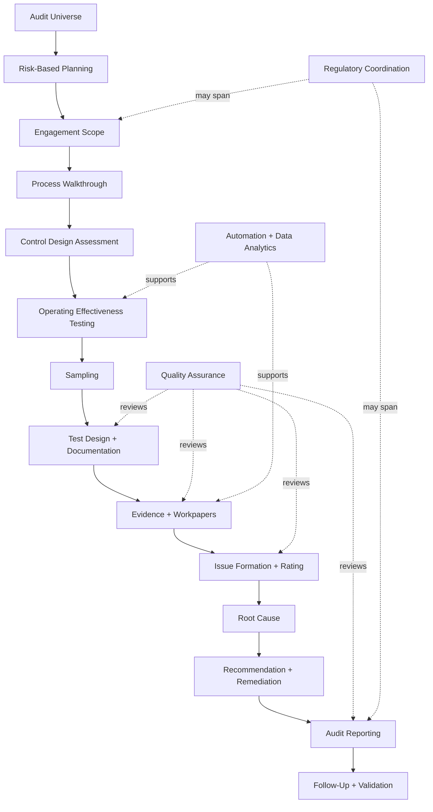

The support edges are DERIVED from cluster semantics, not explicit runtime links.

---

# 202. Kernel Architecture Graph

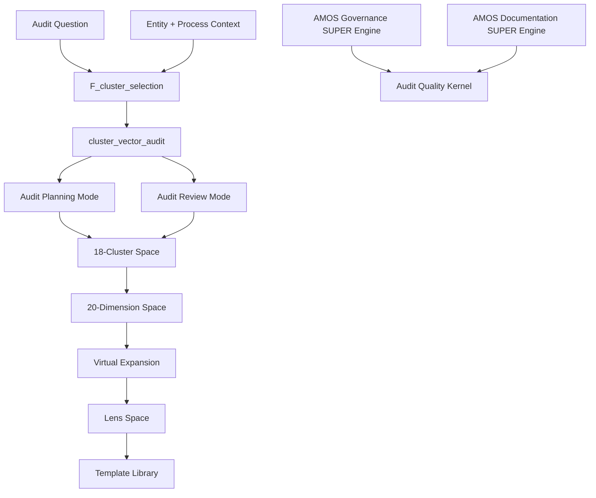

The exact ordering between cluster, dimensions, virtual expansion, lens, and templates is conceptual/DERIVED.

---

# 203. Evidence-State Machine — Proposed

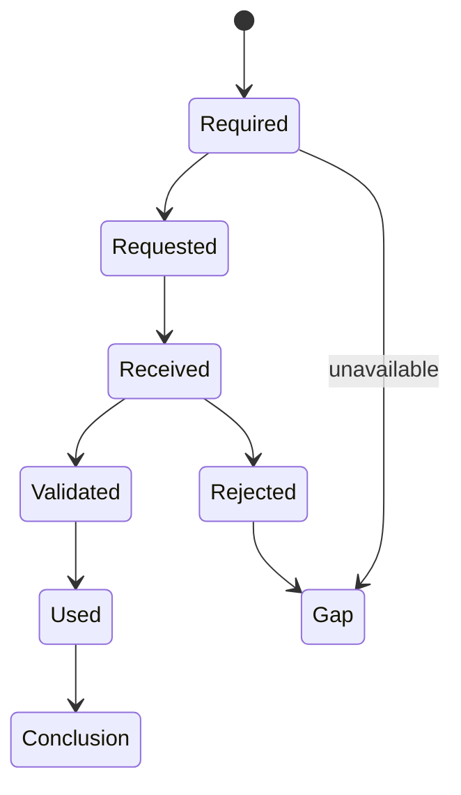

This is not source runtime; it is a proposed integrity-preserving implementation.

---

# 204. Finding-State Machine — Proposed

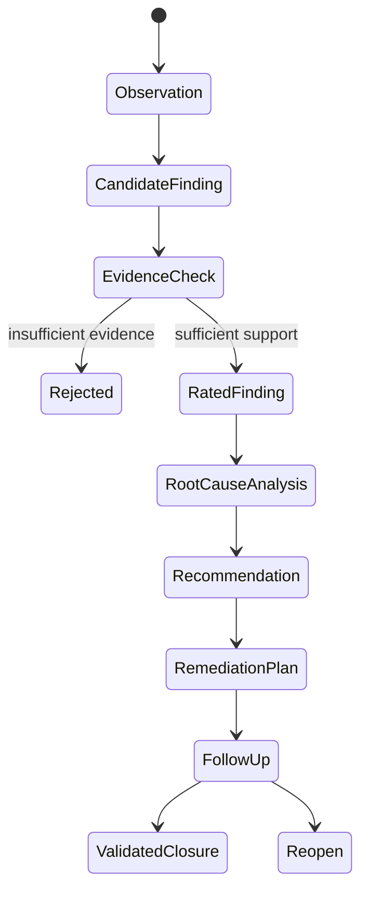

---

# 205. Audit Proof Capsule — Proposed

```yaml
claim:
  statement: ...
  class: DERIVED

audit_scope:
  entity: ...
  process: ...
  period: ...

cluster:
  id: ...
  name: ...

dimension_context:
  - ...

control:
  identifier: ...
  design_status: ...
  operating_status: ...

test:
  procedure: ...
  population: ...
  sample: ...

evidence:
  - source:
    provenance:
    date:
    relevance:
    reliability:
    result:

finding:
  observation: ...
  criteria: ...
  impact: ...

root_cause:
  class: MODEL
  evidence: ...

critical_gaps:
  - ...

competing_explanations:
  - ...

falsifiers:
  - ...

confidence_ceiling:
  bounded_by: weakest_load_bearing_evidence

opinion:
  issued: false
```

PROPOSED.

---

# 206. RSCF H/M/L

## H — Audit & Quality Assurance

```text
Audit universe
Risk
Controls
Evidence
Findings
Assurance
Quality
```

## M — Major Subsystems

```text
Planning
Scoping
Walkthroughs
Control Design
Operating Effectiveness
Sampling
Evidence
Issue Formation
Root Cause
Remediation
Reporting
Follow-Up
Regulatory Coordination
QA
Methodology
Automation
```

## L — Detail

```text
individual controls
individual samples
workpapers
evidence items
findings
owners
dates
ratings
test procedures
exceptions
```

DERIVED.

---

# 207. RSCF Node — Proposed

```yaml
RSCF_NODE:
  id: amos_audit_quality_kernel_v0
  node_type: kernel_spec
  state: SOURCE_CLAIM

  provenance:
    corpus: AMOS_corpus
    vault_source: 11_KNOWLEDGE/kernel

  scope:
    - AMOS_knowledge
    - audit_and_quality_assurance

  source_kernel:
    name: Audit_Quality_Kernel_vInfinity_SUPER
    version: v2.0.0+lens_integration
    created_at_utc: 2025-11-28T00:10:18.516087Z

  implementation:
    state: UNKNOWN

  validation:
    state: UNKNOWN
```

---

# 208. RSCF Relations — Proposed

```yaml
RSCF_RELATIONS:
  - FROM: Audit_Quality_Kernel_vInfinity_SUPER
    REL: DEPENDS_ON
    TO: AMOS_Governance_SUPER_Engine

  - FROM: Audit_Quality_Kernel_vInfinity_SUPER
    REL: DEPENDS_ON
    TO: AMOS_Documentation_SUPER_Engine

  - FROM: Audit_Quality_Kernel_vInfinity_SUPER
    REL: INDEXED_BY
    TO: KERNEL_MOC
```

Only the two dependencies and MOC relationship are source-grounded; the RSCF serialization is proposed.

---

# 209. Cluster-Selection Proof Capsule

```yaml
CLAIM:
  The source defines a function that aligns an audit question
  and entity/process context to relevant audit clusters.

CLASS:
  VERIFIED_FROM_PROVIDED_SOURCE

FUNCTION:
  F_cluster_selection

INPUTS:
  - audit_question
  - entity_and_process_context

OUTPUT:
  cluster_vector_audit

ALGORITHM:
  UNKNOWN

VECTOR_ENCODING:
  UNKNOWN

VALIDATION:
  UNKNOWN
```

---

# 210. Cluster Count Proof Capsule

```yaml
CLAIM:
  The supplied source defines 18 audit clusters.

CLASS:
  VERIFIED_FROM_PROVIDED_SOURCE

EVIDENCE:
  - meta.cluster_count = 18
  - cluster_space.total_clusters = 18
  - visible clusters enumerate IDs 1..18

PROVENANCE_INDEPENDENCE:
  false
  reason: all confirmations occur inside the same supplied artifact
```

---

# 211. Dimension Count Proof Capsule

```yaml
CLAIM:
  The source defines 20 quality dimensions.

CLASS:
  VERIFIED_FROM_PROVIDED_SOURCE

EVIDENCE:
  - meta.dimension_count = 20
  - dimension_space.total_dimensions = 20
  - visible dimension map contains 01..20

INDEPENDENCE:
  not independent
```

---

# 212. Virtual Layer Proof Capsule

```yaml
CLAIM:
  The source declares 100000 virtual layers.

CLASS:
  VERIFIED_FROM_PROVIDED_SOURCE

CLAIM_2:
  100000 explicit runtime layers exist.

CLASS_2:
  CONTRADICTED_BY_SOURCE_INTERPRETATION

EVIDENCE:
  - virtual_layer_count = 100000
  - notes explicitly say scenarios can be derived without storing all explicit layers

FORMULA_FOR_100000:
  UNKNOWN
```

---

# 213. Runtime Proof Capsule

```yaml
CLAIM:
  The Audit Quality Kernel is deployed and functioning at runtime.

CLASS:
  UNKNOWN/GAP

SOURCE_SUPPORT:
  - integration notes mention runtime combination

MISSING:
  - implementation code
  - dependency resolution
  - execution traces
  - runtime receipts
  - test results
```

---

# 214. Audit Opinion Proof Capsule

```yaml
CLAIM:
  This kernel can independently issue an audit opinion.

CLASS:
  CONTRADICTED_BY_SOURCE_POLICY

EVIDENCE:
  - "Do not claim regulatory approvals or audit opinions."
```

---

# 215. Evidence Fabrication Proof Capsule

```yaml
CLAIM:
  Missing test evidence may be filled with plausible simulated results.

CLASS:
  CONTRADICTED_BY_SOURCE_POLICY

EVIDENCE:
  - "Do not fabricate test results or evidence."

SAFE_RESULT:
  mark evidence as missing / unknown / gap
```

---

# 216. Lens Proof Capsule

```yaml
CLAIM:
  The source defines four stakeholder lenses.

CLASS:
  VERIFIED_FROM_PROVIDED_SOURCE

LENSES:
  - executive_view
  - operator_view
  - expert_view
  - audit_view

CLAIM_2:
  Lens selection changes underlying evidence.

CLASS_2:
  NOT_SUPPORTED
```

---

# 217. Template Proof Capsule

```yaml
CLAIM:
  The source names eleven reusable templates.

CLASS:
  VERIFIED_FROM_PROVIDED_SOURCE

COUNTS:
  documents: 4
  decks: 4
  tables: 3
  total: 11

CLAIM_2:
  Full template specifications are supplied.

CLASS_2:
  CONTRADICTED_BY SOURCE CONTENT
```

---

# 218. Competing Hypothesis — Cluster Space

### H1

A taxonomy for audit knowledge retrieval.

### H2

A runtime activation vector.

### H3

A workflow decomposition.

### H4

All three simultaneously.

The mapping function's `cluster_vector_audit` supports H1/H2; sequential semantics support H3 only indirectly.

Status:

**COMPETING**.

---

# 219. Competing Hypothesis — Dimension Space

### H1

Every cluster receives all 20 dimensions.

### H2

Dimensions are selectively applied.

### H3

Dimensions evaluate entire engagements.

### H4

Dimensions operate recursively at multiple scopes.

No discriminating source.

---

# 220. Competing Hypothesis — 100k Virtual Layers

### H1

Exact conceptual cardinality.

### H2

Density/profile label.

### H3

Scenario-generation capacity target.

### H4

Hidden axes produce 100,000 states.

### H5

Legacy naming retained from a larger model.

Remain COMPETING.

---

# 221. Competing Hypothesis — Lenses

### H1

Pure presentation filters.

### H2

Reasoning-depth modifiers.

### H3

Content-selection filters.

### H4

All three.

The source descriptions establish perspective/focus but no transformation function.

---

# 222. Competing Hypothesis — Templates

### H1

Output rendering templates.

### H2

Reasoning scaffolds.

### H3

External Documentation Engine identifiers.

### H4

Names only awaiting implementation.

Unknown.

---

# 223. Competing Hypothesis — `vInfinity_SUPER`

Could represent:

- product family,
- aspirational naming,
- architecture generation,
- compatibility line,
- non-semantic version label.

No local definition.

---

# 224. Critical Gaps

If this kernel is to execute real audit testing, the highest-priority missing information is:

```text
control schema
evidence schema
test-result schema
population/sample schema
finding schema
rating methodology
dimension scoring
cluster-vector representation
independence criteria
audit-period handling
runtime implementation
```

---

# 225. Decision-Relevant Gaps

```text
risk scoring
sampling methodology
materiality
evidence sufficiency
evidence reliability
root-cause validation
remediation validation
quality scoring
lens selection
route fallback
virtual expansion formula
```

---

# 226. Explanatory Gaps

```text
V0 vs vInfinity_SUPER
v2.0.0+lens_integration lineage
density_profile semantics
position of C-Canon blocks
meaning of "kernel power"
template implementation
```

---

# 227. Cosmetic Source Issues

Several cluster identifiers omit an underscore after `and`:

```text
test_design_anddocumentation
evidence_collection_andworkpapers
issue_formation_andrating
recommendation_andremediation_plans
quality_assurance_andindependent_review
methodology_andstandards
automation_anddata_analytics_in_audit
```

These are source strings.

They may be normalized for display, but canonical machine keys should not be silently changed.

---

# 228. Exact Source Identifier Preservation

Recommended:

```yaml
source_key: test_design_anddocumentation
display_name: Test Design and Documentation
```

rather than rewriting the original key.

---

# 229. Related Field

Source:

```markdown
**Related:**  ·  ·  ·  ·
```

No populated related artifacts exist.

Therefore:

```text
RelatedLinks = []
```

for the supplied source.

---

# 230. MOC

Explicit:

```markdown

```

This is the only supplied wikilink relation.

---

# 231. Proposed Obsidian Augmentation

> [!warning] DERIVED / PROPOSED
> Not original frontmatter.

```yaml
aliases:
  - Audit Quality Kernel
  - Audit_Quality_Kernel_vInfinity_SUPER
  - AMOS Audit & Quality Kernel

artifact_id: amos_audit_quality_kernel_v0
artifact_kind: KERNEL_SPEC

system: AMOS_OS
plane: 11_KNOWLEDGE
segment: kernel

domain: audit_and_quality_assurance

epistemic_class: AMOS_MODEL
canonical_status: SOURCE_GROUNDED_CANON_CANDIDATE
implementation_status: UNKNOWN
runtime_status: UNKNOWN
validation_status: UNKNOWN

source_kernel:
  name: Audit_Quality_Kernel_vInfinity_SUPER
  version: v2.0.0+lens_integration

integrity_boundaries:
  - NO_FABRICATED_TEST_RESULTS
  - NO_FABRICATED_EVIDENCE
  - NO_REGULATORY_APPROVAL_CLAIM
  - NO_AUDIT_OPINION_CLAIM
```

---

# 232. Proposed Atomic Note — Audit Quality Kernel

```markdown
# Audit Quality Kernel

> [!important]
> Audit structure is not audit evidence.

## Kernel Spaces
-
-
-
-
-

## Dependencies
-
-

## MOC
-
```

Only `` is source-explicit.

---

# 233. Proposed Atomic Note — Audit Cluster Space

```markdown
# Audit Cluster Space

18 source-defined clusters covering:

Audit Universe → Planning → Scoping → Walkthroughs →
Control Design → Operating Effectiveness → Sampling →
Testing/Documentation → Evidence → Findings →
Root Cause → Remediation → Reporting → Follow-Up →
Regulatory Coordination → QA → Methodology →
Automation/Data Analytics.
```

---

# 234. Proposed Atomic Note — Quality Dimensions

```markdown
# Audit Quality Dimension Space

20 source-defined dimensions.

> [!warning]
> No scoring scale, weighting model, aggregation formula,
> or pass/fail threshold is supplied by the source.
```

---

# 235. Proposed Atomic Note — Evidence Integrity

```markdown
# Audit Evidence Integrity

## Source Law

Do not fabricate test results or evidence.

## Derived Consequences

- Missing evidence remains missing.
- Planned tests are not completed tests.
- Control design is not operating effectiveness.
- Management assertions are not independent validation.
- Workpaper existence is not evidence sufficiency.
- Report quality is not assurance quality.
```

---

# 236. Proposed Atomic Note — Audit Assurance Boundary

```markdown
# Audit Assurance Boundary

## Source Law

Do not claim regulatory approvals or audit opinions.

## Boundary

AMOS may structure, analyze, review, and draft.
The supplied kernel does not authorize formal audit opinions
or regulator approval claims.
```

---

# 237. Proposed Dataview — Kernel

```dataview
TABLE
  source,
  rscf.state AS "RSCF State",
  rscf.provenance AS "Provenance"
FROM #kernel
WHERE contains(file.name, "AUDIT") AND contains(file.name, "QUALITY")
```

---

# 238. Proposed Dataview — Audit Canon

```dataview
TABLE
  type,
  source,
  rscf.state AS "State"
FROM #canon-group/tech-ai
WHERE contains(file.name, "AUDIT")
SORT file.name ASC
```

---

# 239. Proposed Navigation

```markdown
---

## Navigation

**MOC:**

**Kernel:**

**Spaces:**
 ·
 ·


**Integrity:**
 ·


**Integration:**
 ·

```

Except ``, these are proposed vault links.

---

# 240. Boundary Test — Missing Evidence

Scenario:

> A control test is planned, but no evidence has been provided.

Correct:

```text
Test status: NOT EXECUTED / EVIDENCE GAP
```

Incorrect:

```text
Control passed based on expected operation.
```

---

# 241. Boundary Test — Management Assertion

Scenario:

> Process owner says the control operated throughout the year.

Safe class:

```text
SOURCE_CLAIM
```

not automatically:

```text
VERIFIED OPERATING EFFECTIVENESS
```

---

# 242. Boundary Test — Design Assessment

Scenario:

> Control design appears sufficient from policy documentation.

Safe conclusion:

```text
Design assessment may be supported.
Operating effectiveness remains untested.
```

---

# 243. Boundary Test — Walkthrough

Scenario:

> One walkthrough demonstrates the process once.

Do not conclude:

```text
control operated effectively throughout the period
```

without appropriate period evidence.

---

# 244. Boundary Test — Sampling

Scenario:

> Three items were tested successfully.

Without sampling methodology/population context:

```text
population-wide conclusion = UNKNOWN
```

---

# 245. Boundary Test — Root Cause

Scenario:

> Issue occurred after a system migration.

Invalid shortcut:

$$
After(Migration)
\Rightarrow
CausedBy(Migration)
$$

Sequence alone does not establish cause.

---

# 246. Boundary Test — Remediation

Scenario:

> Management completed the remediation action.

Do not automatically mark:

```text
issue effectively resolved
```

until validation supports it.

---

# 247. Boundary Test — Regulatory Alignment

Scenario:

> Internal review finds apparent alignment.

Do not write:

```text
Regulator approved.
```

Explicitly prohibited.

---

# 248. Boundary Test — Audit Report

Scenario:

> Kernel drafts an audit report.

Do not convert it into a formal audit opinion.

---

# 249. Boundary Test — Executive Lens

Scenario:

> Executive audience requests one-page summary.

Compress detail, but preserve:

```text
material evidence gaps
major assumptions
unresolved findings
scope limitations
```

---

# 250. Boundary Test — Operator Lens

Emphasize:

```text
process
sequence
dependencies
owners
```

but do not invent owners absent source data.

---

# 251. Boundary Test — Expert Lens

Emphasize:

```text
method
assumptions
edge cases
```

without claiming unsupported technical certainty.

---

# 252. Boundary Test — Audit Lens

Emphasize:

```text
controls
evidence
compliance
```

without transforming internal analysis into independent assurance.

---

# 253. Boundary Test — Virtual Layer

Scenario:

> `virtual_layer_count = 100000`.

Do not claim:

> 100,000 audit cases were tested.

Correct:

> The source defines a virtual 100k expansion model for deriving scenarios without materializing all layers.

---

# 254. Boundary Test — Quality Dimension

Scenario:

> Evidence quality looks strong.

Without scale:

```text
qualitative assessment only
```

Do not fabricate:

```text
Evidence Quality = 93.7/100
```

---

# 255. Boundary Test — Assurance Confidence

No calibrated numeric confidence should be invented.

---

# 256. Boundary Test — Cluster Vector

Without vector schema, do not invent weights such as:

```text
[0.2, 0.8, 0.4, ...]
```

---

# 257. Boundary Test — Route

Unknown task type should not be silently mapped to a route not supplied by source.

---

# 258. Boundary Test — Templates

Do not claim a template is fully defined because its name appears.

---

# 259. Boundary Test — Integration

Do not claim Governance/Documentation engines actually executed without runtime evidence.

---

# 260. Anti-Fabrication Rules

Never invent:

1. audit test results,
2. evidence,
3. audit opinions,
4. regulatory approvals,
5. finding ratings,
6. risk ratings,
7. control ratings,
8. sample sizes,
9. population sizes,
10. materiality,
11. confidence scores,
12. dimension weights,
13. aggregate quality formula,
14. cluster-vector values,
15. virtual-layer generation formula,
16. regulatory standards,
17. professional standards,
18. remediation effectiveness,
19. root causes,
20. independence,
21. implementation status,
22. runtime traces,
23. test execution,
24. template contents,
25. fallback routes,
26. missing Related links,
27. C-Canon block identities,
28. lens-composition rules,
29. audit-period assumptions,
30. evidence freshness.

---

# 261. Anti-Regression Rules

Future normalization should preserve:

```text
frontmatter SOURCE_CLAIM
body name Audit_Quality_Kernel_vInfinity_SUPER
version v2.0.0+lens_integration
creation timestamp
domain audit_and_quality_assurance
density kernel_x100k_virtual
18 clusters
20 dimensions
100000 virtual layers
4 audit types
4 process types
F_cluster_selection
2 reasoning modes
2 policy boundaries
2 explicit task routes
2 integration dependencies
4 lenses
11 template names
blank Related field

```

unless authoritative newer source supersedes them.

---

# 262. Source Count Ledger

| Structure                     |   Count |
| ----------------------------- | ------: |
| Audit clusters                |      18 |
| Quality dimensions            |      20 |
| Virtual layers declared       | 100,000 |
| Virtual axes explicitly named |       2 |
| Audit-type values             |       4 |
| Process-type values           |       4 |
| Mapping functions             |       1 |
| Reasoning modes               |       2 |
| Policy boundaries             |       2 |
| Task routes                   |       2 |
| Integration dependencies      |       2 |
| Lenses                        |       4 |
| Executive focus terms         |       5 |
| Operator focus terms          |       4 |
| Expert focus terms            |       3 |
| Audit focus terms             |       3 |
| Document templates            |       4 |
| Deck templates                |       4 |
| Table templates               |       3 |
| Total templates               |      11 |

---

# 263. Derived Count Ledger

| Derived structure                               |  Count |
| ----------------------------------------------- | -----: |
| Cluster × dimension cells                       |    360 |
| Audit type × process type                       |     16 |
| Cluster × dimension × audit type × process type |  5,760 |
| Same × four lenses                              | 23,040 |

None of these derived counts explains the source-declared 100,000 virtual layers.

That unresolved difference must remain visible.

---

# 264. Core Integrity Equations

$$
\boxed{
Plan \neq Execution
}
$$

$$
\boxed{
ControlDesign \neq OperatingEffectiveness
}
$$

$$
\boxed{
EvidenceRequest \neq Evidence
}
$$

$$
\boxed{
EvidenceReceived \neq EvidenceValidated
}
$$

$$
\boxed{
Observation \neq Finding
}
$$

$$
\boxed{
Finding \neq RootCause
}
$$

$$
\boxed{
Recommendation \neq Remediation
}
$$

$$
\boxed{
RemediationImplemented \neq RemediationEffective
}
$$

$$
\boxed{
InternalAssessment \neq AuditOpinion
}
$$

$$
\boxed{
RegulatoryAlignment \neq RegulatoryApproval
}
$$

---

# 265. Quality Integrity Equations

$$
DocumentationClarity
\neq
EvidenceQuality
$$

$$
Timeliness
\neq
AssuranceValidity
$$

$$
ResourceEfficiency
\neq
AuditQuality
$$

$$
DataVolume
\neq
EvidenceStrength
$$

$$
Automation
\neq
Accuracy
$$

$$
QAReview
\neq
VerifiedIndependence
$$

---

# 266. Lens Integrity Equations

$$
ExecutiveView
\neq
ExecutiveApproval
$$

$$
OperatorView
\neq
ActualOwnership
$$

$$
ExpertView
\neq
CredentialedExpertise
$$

$$
AuditView
\neq
IndependentAuditOpinion
$$

---

# 267. Virtual Model Integrity Equations

$$
VirtualLayer
\neq
StoredLayer
$$

$$
VirtualScenario
\neq
ObservedEvent
$$

$$
VirtualEvaluation
\neq
CompletedAuditTest
$$

$$
100000\ VirtualLayers
\neq
100000\ EvidenceItems
$$

---

# 268. Provenance Equations

$$
SourceClaim
\neq
IndependentVerification
$$

$$
RepeatedInternalField
\neq
IndependentCorroboration
$$

$$
Workpaper
\neq
TamperProofEvidence
$$

$$
ReviewerAgreement
\neq
ProvenanceIndependence
$$

---

# 269. Causal Firewall

For root cause:

$$
Correlation
\neq
Cause
$$

$$
Sequence
\neq
Cause
$$

$$
StakeholderExplanation
\neq
Cause
$$

$$
RecurringIssue
\neq
SpecificRootCause
$$

unless appropriate causal evidence exists.

---

# 270. Scope Firewall

An audit conclusion inherits:

```text
entity
process
period
population
sample
control
test procedure
evidence
regime
```

where relevant.

The source does not provide these schemas, but any real audit conclusion that omits them risks silent generalization.

---

# 271. Temporal Firewall

Operating effectiveness is especially time-sensitive.

A control operating today does not prove it operated throughout an earlier audit period.

---

# 272. Entity Firewall

Evidence from one entity cannot automatically be generalized to another entity.

---

# 273. Process Firewall

Evidence from one process cannot automatically validate another process merely because controls look similar.

---

# 274. Regulatory-Regime Firewall

A compliance interpretation valid in one jurisdiction/regime cannot automatically be transferred to another.

The source does not define jurisdictions.

---

# 275. Cross-Canon Firewall

The kernel says it is enriched with cross-canon integration.

Cross-canon integration does not mean:

$$
DifferentCanonClaims
\rightarrow
AutomaticallyCompatible
$$

Scope, ontology, provenance, and regime must still align.

---

# 276. Documentation Integration Firewall

A documentation engine can improve structure and traceability.

It cannot make unsupported evidence true.

---

# 277. Governance Integration Firewall

A governance engine can enforce rules.

It cannot create missing observations.

---

# 278. Quality Assurance as Meta-Audit

Cluster 16 can be interpreted as review of audit quality itself.

Thus the kernel contains a recursive quality layer:

$$
Audit(Activity)
$$

and:

$$
QA(Audit(Activity))
$$

This is DERIVED.

---

# 279. Recursive QA Hazard

If the same process generates and validates its own work without independence, apparent recursive checking may not add independent assurance.

---

# 280. Self-Audit Firewall

$$
SelfReview
\neq
IndependentReview
$$

unless independence conditions are separately demonstrated.

---

# 281. Data Analytics as Coverage Amplifier

Automation/data analytics may potentially expand coverage.

But greater coverage does not necessarily increase evidence quality if the data or logic is defective.

---

# 282. Audit Optimization Objective — Proposed

A safe conceptual objective would balance:

$$
Coverage
$$

$$
RiskAlignment
$$

$$
EvidenceQuality
$$

$$
Timeliness
$$

$$
ResourceEfficiency
$$

without allowing efficiency to violate integrity.

No source optimization equation exists.

---

# 283. Noncompensatory Integrity Constraint — Proposed

$$
EvidenceFabricated = True
\Rightarrow
AuditConclusionInvalid
$$

This is a direct formalization of the explicit source boundary.

---

# 284. Regulatory Claim Constraint — Proposed

$$
RegulatoryApprovalClaim
\Rightarrow
Reject
$$

when generated solely by this kernel.

---

# 285. Audit Opinion Constraint — Proposed

$$
AuditOpinionClaim
\Rightarrow
Reject
$$

under this source's policy.

---

# 286. Evidence-Gap Handling — Proposed

If evidence is missing:

```yaml
status: GAP
evidence_available: false
conclusion: NOT_ESTABLISHED
next_action: request_or_collect_evidence
```

Never substitute plausible evidence.

---

# 287. Test-Gap Handling — Proposed

```yaml
test:
  designed: true
  executed: false
  result: UNKNOWN
```

This preserves the distinction between design and execution.

---

# 288. Control-State Model — Proposed

```text
UNKNOWN
→ IDENTIFIED
→ DESIGN_ASSESSED
→ TEST_PLANNED
→ TEST_EXECUTED
→ EFFECTIVENESS_EVALUATED
→ FOLLOW_UP
→ REVALIDATED
```

Not source runtime.

---

# 289. Issue-State Model — Proposed

```text
OBSERVATION
→ CANDIDATE_FINDING
→ SUPPORTED_FINDING
→ RATED
→ REMEDIATION_PLANNED
→ IMPLEMENTED
→ VALIDATED
→ CLOSED
```

Again proposed.

---

# 290. Evidence Provenance Capsule — Proposed

```yaml
evidence_id: ...
evidence_type: ...
source_identity: ...
source_system: ...
collection_method: ...
collected_at: ...
audit_period: ...
scope: ...
original_or_derived: ...
independence: ...
freshness: ...
integrity_check: ...
limitations: ...
supports:
  - ...
contradicts:
  - ...
```

---

# 291. Finding Capsule — Proposed

```yaml
finding_id: ...
title: ...
observation: ...
criteria: ...
evidence:
  - ...
impact: ...
rating: UNKNOWN
root_cause:
  status: MODEL
recommendation: ...
management_response:
  class: SOURCE_CLAIM
scope: ...
falsifiers:
  - ...
```

---

# 292. Quality Review Capsule — Proposed

```yaml
review:
  cluster: ...
  dimensions:
    coverage: ...
    risk_alignment: ...
    testing_depth: ...
    evidence_quality: ...
    documentation_clarity: ...
    finding_quality: ...
    root_cause_rigour: ...
    remediation_viability: ...
    independence_and_objectivity: ...
    regulatory_alignment: ...
    stakeholder_impact: ...
    repeat_issue_risk: ...
    timeliness: ...
    resource_efficiency: ...
    data_usage_maturity: ...
    methodology_compliance: ...
    follow_up_effectiveness: ...
    assurance_confidence: ...
    control_environment_insight: ...
    continuous_improvement: ...

scoring:
  method: UNKNOWN
```

---

# 293. Proposed Fail-Closed Rules

```text
IF test evidence is absent
THEN test result = UNKNOWN.

IF evidence provenance is insufficient
THEN do not treat evidence as independently validated.

IF control design is assessed but operation is untested
THEN operating effectiveness = UNKNOWN.

IF root cause is hypothesized but not established
THEN root cause class = MODEL.

IF remediation is reported complete but not validated
THEN effectiveness = UNKNOWN.

IF regulator approval is not independently documented
THEN do not claim approval.

IF formal audit opinion is requested
THEN do not represent kernel output as an audit opinion.

IF score methodology is absent
THEN do not fabricate numeric quality scores.

IF virtual scenario is generated
THEN preserve its hypothetical status.

IF a lens compresses content
THEN preserve material limitations.
```

---

# 294. Adversarial Challenge — “The Kernel Has 100,000 Audit Cases”

Rejected.

Source says 100,000 **virtual layers**, explicitly without storing all explicit layers.

---

# 295. Adversarial Challenge — “18 × 20 = 360 Defined Tests”

Rejected.

360 is the Cartesian count of clusters × dimensions, not a source-defined test inventory.

---

# 296. Adversarial Challenge — “A Control Is Well Designed, So It Is Effective”

Rejected.

The source separates design assessment and operating-effectiveness testing.

---

# 297. Adversarial Challenge — “The Audit View Makes the Output an Audit”

Rejected.

Lens selection is not institutional assurance.

---

# 298. Adversarial Challenge — “Regulatory Alignment Means Approval”

Explicitly rejected by source policy.

---

# 299. Adversarial Challenge — “High Assurance Confidence Means 95% Probability”

Rejected.

No scale or calibration exists.

---

# 300. Adversarial Challenge — “Independent Review Means Independent”

Conditionally rejected.

The label exists, but independence must be demonstrated.

---

# 301. Adversarial Challenge — “The Kernel Passed Its Audit Tests”

No test execution/results are supplied.

Status:

```text
UNKNOWN/GAP
```

---

# 302. Adversarial Challenge — “Integration Links Prove Runtime Integration”

Rejected.

They establish declared dependencies, not execution receipts.

---

# 303. Adversarial Challenge — “The Source Is Current Because It Says v2.0.0”

Rejected.

Version is not freshness.

---

# 304. Adversarial Challenge — “Audit Report Review Validates the Audit”

Rejected.

Review may identify quality issues; it does not automatically validate every underlying conclusion.

---

# 305. Adversarial Challenge — “More Data Means More Assurance”

Rejected.

Evidence quality remains distinct from data volume/maturity.

---

# 306. Adversarial Challenge — “Root Cause Analysis Proves Causation”

Rejected.

The cluster name defines a task area, not proof methodology.

---

# 307. Adversarial Challenge — “Automation Makes Testing Objective”

Rejected.

Automation can encode biased/incorrect logic and depends on data provenance.

---

# 308. Adversarial Challenge — “Board Update Means Board-Approved”

Rejected.

Template name only.

---

# 309. Adversarial Challenge — “Quality Assessment Means External QA Certification”

Rejected.

No certification body or external validation is supplied.

---

# 310. Adversarial Challenge — “External Audit Support Means External Audit”

Rejected.

The source explicitly says:

```text
external_audit_support
```

not external audit opinion issuance.

---

# 311. Audit Type Semantics

The four audit types are not equivalent.

### Internal audit

Source-defined scenario axis.

### External audit support

Support function only.

### Regulatory review support

Support function only.

### Quality assessment

Quality-review context.

---

# 312. Support Boundary

The word `support` is material.

$$
ExternalAuditSupport
\neq
ExternalAudit
$$

$$
RegulatoryReviewSupport
\neq
RegulatoryDecision
$$

---

# 313. Process Type Semantics

Four process categories:

```text
financial_reporting
operational_process
compliance_process
it_and_security
```

These define scenario contexts, not exhaustive universal process ontology.

---

# 314. Process-Type Completeness

The source does not claim these four exhaust every possible auditable process.

Therefore:

```text
ProcessTypesComplete = UNKNOWN
```

---

# 315. Audit-Type Completeness

Likewise, four audit types may be model axes rather than exhaustive taxonomy.

---

# 316. Virtual Scenario Tuple — Derived

A minimal explicit scenario could be represented as:

$$
s=(a,p)
$$

where:

$$
a\in AuditType
$$

and:

$$
p\in ProcessType
$$

giving 16 explicit combinations.

---

# 317. Extended Scenario Tuple — Proposed

One might later define:

$$
s=(a,p,c,d,l)
$$

with audit type, process type, cluster, dimension, lens.

But this is not source-defined.

---

# 318. Scenario Provenance

A generated scenario should be labeled:

```text
MODEL
```

rather than observation.

---

# 319. Quality Evaluation Provenance

A quality assessment based solely on supplied workpapers is derived from those workpapers.

Its confidence cannot exceed their evidence quality and completeness.

---

# 320. Documentation Bias

Well-documented work may appear stronger than poorly documented work.

But documentation quality is only one of 20 dimensions.

The architecture itself therefore resists collapsing quality into documentation.

---

# 321. Finding Bias

Strongly worded findings may appear severe.

But no rating methodology is supplied.

Rhetorical intensity must not substitute for evidence.

---

# 322. Executive Compression Bias

Executive summaries may omit nuance.

Material uncertainty must remain visible.

---

# 323. Stakeholder Impact Bias

High stakeholder impact may affect prioritization.

It does not make an unsupported finding more factually true.

---

# 324. Repeat-Issue Bias

Repeated findings may increase concern.

They do not independently establish the original root cause.

---

# 325. Regulatory Bias

Regulatory relevance may increase stakes and validation requirements.

It does not lower evidence requirements.

---

# 326. High-Stakes Escalation

For regulatory, financial-reporting, security, or institutional-impact conclusions:

```text
validation depth should increase
```

rather than decrease.

DERIVED governance.

---

# 327. Reversible Action Under Uncertainty

When evidence is incomplete, safer outputs include:

- request additional evidence,
- narrow the conclusion,
- mark conditional,
- perform additional testing,
- defer closure,
- preserve competing root causes.

---

# 328. Irreversible Claims

Claims such as:

```text
fraud occurred
regulator approved
control failed universally
management caused issue
formal audit opinion
```

carry high stakes and require evidence beyond this kernel's structural specification.

---

# 329. Audit Finding Causal Discipline

A strong finding should distinguish:

```text
condition
criteria
impact
cause hypothesis
evidence
```

rather than collapse them.

This schema is proposed, not source-defined.

---

# 330. Observation Versus Cause

Example:

```text
Observation:
Access review was not completed on time.

Cause hypothesis:
Insufficient ownership.

Alternative:
System notification failure.

Alternative:
Staff absence.

Alternative:
Incorrect due-date configuration.
```

The kernel's root-cause cluster should preserve competing explanations until evidence discriminates.

---

# 331. Cheapest Discriminating Test

For competing causes, test the observation most likely to distinguish them.

This is v4.4 reasoning hardening.

---

# 332. Audit Proof Dependency

Suppose finding \(F\) depends on evidence \(E_1,E_2,E_3\):

$$
F\leftarrow(E_1,E_2,E_3)
$$

If \(E_2\) is invalidated, only findings dependent on \(E_2\) require invalidation.

---

# 333. Local Repair

Do not automatically discard an entire audit because one workpaper fails.

Invalidate dependent conclusions first.

Escalate globally only if the failed evidence is systemic/load-bearing.

---

# 334. Evidence Correlation

Multiple workpapers copied from the same management source do not represent independent evidence.

---

# 335. Sybil-Like Audit Evidence

Ten documents generated from one unsupported source can create false apparent corroboration.

$$
10\ Descendants
\neq
10\ IndependentRoots
$$

---

# 336. Independence Topology

For assurance claims, provenance topology matters:

```text
management source
    ├─ spreadsheet
    ├─ presentation
    └─ workpaper extract
```

may still be one evidential root.

---

# 337. Audit Confidence With Correlated Evidence

Confidence should not increase mechanically with document count when ancestry is shared.

---

# 338. Quality Dimension Correlation

The 20 dimensions themselves may correlate.

For example:

```text
evidence_quality
assurance_confidence
finding_quality
```

may not be independent.

No aggregation model is supplied.

---

# 339. Double Counting Risk

Any future aggregate quality score must avoid double-counting correlated dimensions.

This is a DERIVED implementation concern.

---

# 340. Dimension Conflict

Examples:

```text
testing_depth ↔ resource_efficiency
timeliness ↔ evidence_quality
coverage ↔ testing_depth
```

may involve tradeoffs.

The executive lens explicitly includes `tradeoffs`, but no optimization rule exists.

---

# 341. Pareto Interpretation

Some audit designs may be Pareto tradeoffs rather than one universally optimal plan.

This is a useful MODEL interpretation, not source mathematics.

---

# 342. Risk-Based Allocation

Cluster 2 plus resource efficiency suggests risk-sensitive allocation.

But no allocation formula is supplied.

---

# 343. Quality Cannot Be Reduced to Speed

Timeliness is only one dimension among twenty.

---

# 344. Quality Cannot Be Reduced to Coverage

Coverage is only one dimension.

---

# 345. Quality Cannot Be Reduced to Compliance

Regulatory alignment and methodology compliance are only two dimensions.

---

# 346. Quality Cannot Be Reduced to Confidence

Assurance confidence is itself one dimension, not a source-defined aggregate.

---

# 347. Continuous Improvement Loop — Derived

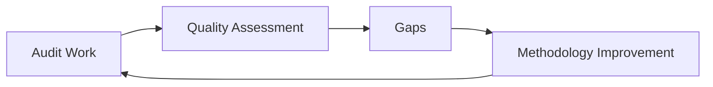

This is supported conceptually by dimensions 16 and 20 plus cluster 17, but not explicitly specified as a loop.

---

# 348. Follow-Up Loop — Derived

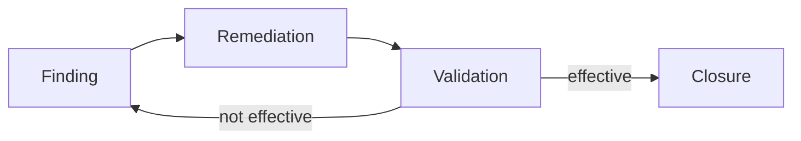

---

# 349. Audit Planning Loop — Derived

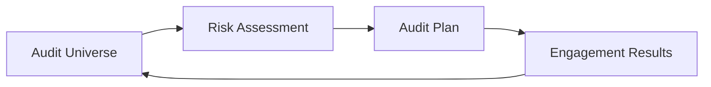

The feedback edge is derived.

---

# 350. Lens Rendering Model — Proposed

$$
Output_L
=
Render(Evidence,Analysis,Lens_L)
$$

subject to:

$$
Truth(Output_L)
=
Truth(UnderlyingAnalysis)
$$

where lens may change emphasis but not evidence class.

---

# 351. Executive Rendering

Prefer:

```text
risk
impact
time horizon
portfolio
tradeoffs
```

---

# 352. Operator Rendering

Prefer:

```text
process
sequence
dependencies
owners
```

---

# 353. Expert Rendering

Prefer:

```text
method
assumptions
edge cases
```

---

# 354. Audit Rendering

Prefer:

```text
controls
evidence
compliance
```

---

# 355. Cross-Lens Consistency Test

A material fact should not reverse between lenses.

If:

```text
Audit lens: evidence insufficient
```

then executive lens must not say:

```text
control proven effective
```

merely for brevity.

---

# 356. Cross-Lens Contradiction

If lens outputs conflict factually, escalate to underlying evidence/analysis.

Do not average contradictory claims.

---

# 357. Template Selection — Proposed

A future selector might map:

```text
executive_view → exec_one_pager / board_update
operator_view → operating_playbook
audit_view → risk_and_decision_memo / risk_register
```

But these mappings are **PROPOSED**, not source-defined.

---

# 358. Template-Lens Identity Firewall

Do not infer:

```text
exec lens = exec_one_pager
```

just because names align.

---

# 359. Cross-Canon Integration

The description says cross-canon integration exists.

No explicit canon IDs are provided beyond reference to C-Canon blocks.

Thus:

```text
CrossCanonTargets = PARTIALLY_UNRESOLVED
```

---

# 360. C-Canon Gap

The source says:

> full AMOS SUPER engines and C-Canon blocks.

No specific C-Canon identifiers are supplied.

Do not invent them.

---

# 361. Implementation Language

Unknown.

The artifact is data/configuration, not executable code.

---

# 362. Function Executability

`F_cluster_selection` is specified declaratively.

No code is supplied.

Therefore:

$$
FunctionSpecification
\neq
ExecutableFunction
$$

---

# 363. Runtime Engine

The phrase “at runtime” appears in integration notes.

This is a source claim about intended composition.

It does not establish current runtime.

---

# 364. Density Profile

`kernel_x100k_virtual` is a source label.

Do not interpret it as memory footprint, throughput, model parameter count, or benchmark.

---

# 365. Cluster Count and Dimension Count Redundancy

The counts appear both in metadata and kernel spaces.

This provides internal consistency.

It does not constitute independent verification because provenance is shared.

---

# 366. Audit Cluster Completeness

The 18 clusters cover a broad audit lifecycle, but the source does not claim they are universally exhaustive for every audit profession/regime.

---

# 367. Dimension Completeness

Likewise, 20 dimensions are source-defined, not empirically proven complete.

---

# 368. Template Completeness

Eleven templates are listed.

No claim says these exhaust all possible audit deliverables.

---

# 369. Route Completeness

Only two routes are listed.

Clearly do not infer route completeness.

---

# 370. Function Completeness

Only one mapping function exists in the source.

Do not invent hidden functions to fill conceptual gaps.

---

# 371. Policy Completeness

Only two explicit policy boundaries are present.

They are important but not necessarily exhaustive.

---

# 372. Assurance Independence Gap

Because audit assurance can depend materially on independence, absence of an operational independence test is decision-relevant.

---

# 373. Evidence Sufficiency Gap

`evidence_quality` exists but there is no sufficiency rule.

This is critical for real audit execution.

---

# 374. Evidence Authenticity Gap

No signature/hash/source-authentication mechanism is supplied.

---

# 375. Evidence Retention Gap

No retention period is defined.

---

# 376. Workpaper Versioning Gap

No version-control model is defined.

---

# 377. Review Sign-Off Gap

No preparer/reviewer/sign-off schema exists.

---

# 378. Segregation-of-Duties Gap

No reviewer/preparer independence rules are supplied.

---

# 379. Audit Trail Gap

No immutable audit trail is specified.

---

# 380. Issue Ownership Gap

Operator lens includes owners, but issue-owner semantics are not defined.

---

# 381. Due-Date Gap

No remediation due-date schema exists.

---

# 382. Aging Gap

No issue-aging calculation exists.

---

# 383. Escalation Gap

No overdue-issue escalation mechanism is supplied.

---

# 384. Regulatory Mapping Gap

No rule-to-control regulatory mapping exists.

---

# 385. Methodology Version Gap

No methodology version identifier appears beyond kernel version.

---

# 386. Data Analytics Gap

No data connectors, query language, statistical tests, anomaly model, or analytics thresholds are supplied.

---

# 387. Automation Failure Policy Gap

No policy defines behavior when automated analytics fail.

---

# 388. Missing Data Policy Gap

No fail-closed behavior for missing data is explicit, though no-fabrication strongly implies missing data must not be filled as fact.

---

# 389. Conflicting Evidence Gap

No explicit contradiction-resolution mechanism is supplied.

AMOS-safe handling should preserve contradiction until resolved.

---

# 390. Evidence Hierarchy Gap

No hierarchy ranks documentary, observational, system-generated, testimonial, or analytical evidence.

Do not invent one.

---

# 391. Sampling Confidence Gap

No statistical confidence level exists.

---

# 392. Error-Tolerance Gap

No tolerable exception/deviation rate exists.

---

# 393. Exception Evaluation Gap

No rule distinguishes isolated exception from systemic issue.

---

# 394. Finding Aggregation Gap

No rule aggregates multiple exceptions into one finding.

---

# 395. Root-Cause Multiplicity Gap

No rule says findings must have one root cause.

Preserve multiple causal hypotheses where warranted.

---

# 396. Remediation Tradeoff Gap

No cost-benefit or residual-risk model is supplied.

---

# 397. Residual Risk Gap

The term is not locally defined.

Do not add it as canonical field.

---

# 398. Audit Universe Refresh Gap

No refresh cadence exists.

---

# 399. Continuous Audit Gap

Although automation/data analytics and continuous improvement exist, no continuous-audit mechanism is defined.

---

# 400. Proposed Machine-Readable Canonical Projection

```json
{
  "artifact": {
    "title": "AMOS AUDIT QUALITY KERNEL V0",
    "type": "data",
    "source": "11_KNOWLEDGE/kernel",
    "rscf": {
      "state": "SOURCE_CLAIM",
      "claim_class": "SOURCE_CLAIM",
      "provenance": "AMOS_corpus",
      "scope": "AMOS_knowledge"
    }
  },
  "source_kernel": {
    "name": "Audit_Quality_Kernel_vInfinity_SUPER",
    "version": "v2.0.0+lens_integration",
    "created_at_utc": "2025-11-28T00:10:18.516087Z",
    "domain": "audit_and_quality_assurance",
    "density_profile": "kernel_x100k_virtual",
    "cluster_count": 18,
    "dimension_count": 20
  },
  "spaces": {
    "clusters": 18,
    "dimensions": 20,
    "virtual_layers": 100000,
    "audit_types": 4,
    "process_types": 4,
    "lenses": 4,
    "templates": 11
  },
  "functions": [
    "F_cluster_selection"
  ],
  "modes": [
    "mode_audit_planning",
    "mode_audit_review"
  ],
  "integrity_boundaries": [
    "NO_FABRICATED_TEST_RESULTS_OR_EVIDENCE",
    "NO_REGULATORY_APPROVAL_OR_AUDIT_OPINION_CLAIMS"
  ],
  "implementation": "UNKNOWN",
  "test_execution": "UNKNOWN",
  "regulatory_approval": "NOT_ESTABLISHED",
  "audit_opinion_authority": "PROHIBITED_BY_SOURCE_POLICY"
}
```

This is DERIVED normalization, not original source JSON.

---

# 401. Canonical Quality Matrix — Proposed View

| Cluster                 | Primary question                  | Evidence needed                | Quality dimensions likely material      |
| ----------------------- | --------------------------------- | ------------------------------ | --------------------------------------- |
| Audit universe          | What can be audited?              | entity/process inventory       | coverage, risk alignment                |
| Risk planning           | What should be prioritized?       | risk context                   | risk alignment, stakeholder impact      |
| Scoping                 | What is in/out?                   | engagement objectives/context  | coverage, timeliness                    |
| Walkthroughs            | How does process operate?         | interviews/observations/docs   | evidence quality, documentation clarity |
| Design assessment       | Could control address risk?       | control design                 | testing depth, control insight          |
| Operating testing       | Did control operate?              | test evidence                  | evidence quality, assurance confidence  |
| Sampling                | What population subset is tested? | population/sample basis        | coverage, testing depth                 |
| Test documentation      | Is work reproducible?             | test procedure/workpaper       | documentation clarity                   |
| Evidence/workpapers     | What supports conclusions?        | evidence artifacts             | evidence quality                        |
| Findings                | What issue is supported?          | criteria + evidence            | finding quality                         |
| Root cause              | Why did issue occur?              | discriminating causal evidence | root cause rigour                       |
| Remediation             | Can issue be addressed?           | action plan                    | remediation viability                   |
| Reporting               | What should stakeholders know?    | supported conclusions          | clarity, impact                         |
| Follow-up               | Did remediation work?             | validation evidence            | follow-up effectiveness                 |
| Regulatory coordination | How is review supported?          | regulatory context             | regulatory alignment                    |
| QA                      | Was audit work itself sound?      | workpapers/methodology         | independence, methodology               |
| Methodology             | Was approach appropriate?         | methodology canon              | methodology compliance                  |
| Automation/data         | How can analytics support audit?  | data + logic                   | data maturity, efficiency               |

The “primary question,” evidence, and dimension assignments are **DERIVED**, not source mappings.

---

# 402. Full Source-to-Assurance Flow

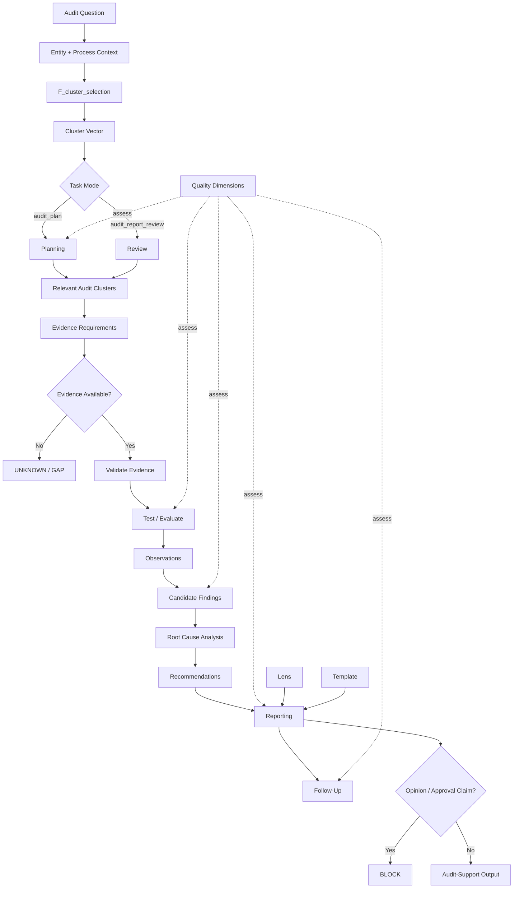

Most post-selection operational edges are DERIVED from cluster semantics.

---

# 403. Full Integrity Contract

```yaml
AUDIT_QUALITY_INTEGRITY_CONTRACT:

  source_claims:
    preserve: true

  evidence:
    fabricate: false
    missing_means_unknown: true
    provenance_required_for_high_stakes_use: proposed
    independent_confirmation_must_be_demonstrated: proposed

  controls:
    design_not_equal_operation: true
    operation_requires_testing_for_assurance: derived

  findings:
    require_support: derived
    root_cause_not_assumed: true
    rating_scale: UNKNOWN

  remediation:
    plan_not_equal_implementation: true
    implementation_not_equal_effectiveness: true

  regulatory:
    approval_claim: prohibited_by_source

  assurance:
    audit_opinion_claim: prohibited_by_source

  dimensions:
    count: 20
    scoring: UNKNOWN
    weights: UNKNOWN
    aggregation: UNKNOWN

  virtual_model:
    layers: 100000
    materialized: false_by_source_model
    expansion_formula: UNKNOWN

  lenses:
    count: 4
    may_change_emphasis: true
    may_change_evidence_truth: false

  templates:
    count: 11
    schemas: UNKNOWN

  runtime:
    implementation: UNKNOWN
    integration_execution: UNKNOWN
```

---

# 404. Canonical Invalidation Conditions

This interpretation should be locally revised if authoritative source provides:

1. a newer Audit Quality Kernel,
2. exact V0/vInfinity/v2 lineage,
3. executable `F_cluster_selection`,
4. cluster-vector schema,
5. dimension scoring methodology,
6. virtual expansion formula,
7. evidence-quality standard,
8. sampling methodology,
9. finding-rating scheme,
10. audit opinion authority model,
11. runtime integration receipts,
12. lens transformation rules,
13. template definitions,
14. C-Canon bindings,
15. explicit professional/regulatory standards.

Only dependent conclusions should then be updated.

---

# 405. What Would Not Be Invalidated

A later scoring formula would not invalidate:

- the 18 supplied cluster names,
- the explicit anti-fabrication policy,
- the explicit no-opinion/no-approval policy,

unless the authoritative source explicitly supersedes those fields.

---

# 406. Canonical Promotion Ladder

```text
SOURCE_CLAIM
    ↓
STRUCTURALLY_NORMALIZED
    ↓
IMPLEMENTATION_VERIFIED
    ↓
TESTED
    ↓
EMPIRICALLY_VALIDATED
    ↓
INDEPENDENTLY_ASSURED
```

The supplied artifact sits primarily at the first two levels.

The later levels must not be inferred.

---

# 407. Audit Evidence Promotion Ladder

```text
REQUESTED
    ↓
RECEIVED
    ↓
AUTHENTICATED
    ↓
RELEVANT
    ↓
SUFFICIENT
    ↓
TESTED
    ↓
SUPPORTS_CONCLUSION
```

This is PROPOSED.

The source does not define these exact states.

---

# 408. Finding Promotion Ladder

```text
OBSERVATION
    ↓
CANDIDATE_FINDING
    ↓
EVIDENCE_SUPPORTED
    ↓
RATED
    ↓
REPORTED
    ↓
REMEDIATED
    ↓
VALIDATED
```

PROPOSED.

---

# 409. Quality Promotion Firewall

A polished finding should never skip:

```text
evidence-supported
```

merely because it reads well.

---

# 410. Audit Action Governance

For low-stakes planning, the kernel may safely generate:

- candidate audit scopes,
- possible clusters,
- draft test plans,
- evidence request lists,
- workpaper structures,
- reporting structures.

For high-stakes assurance, additional verification is required before asserting:

- control failure,
- regulatory breach,
- root cause,
- remediation effectiveness,
- formal assurance conclusion.

---

# 411. Reversible Outputs

Safer under uncertainty:

```text
draft
candidate
proposed
requires evidence
conditional
gap
needs validation
```

---

# 412. Irreversible Language

Avoid without evidence:

```text
proved
certified
approved
fully compliant
audit passed
audit failed
control definitely ineffective
root cause confirmed
```

---

# 413. Executive Output Contract

A high-integrity executive summary should distinguish:

```text
Known
Observed
Derived
Management-Reported
Unresolved
Recommended
```

This is PROPOSED but highly aligned with the source boundaries.

---

# 414. Audit Output Contract

An audit-oriented output should distinguish:

```text
Scope
Criteria
Procedure
Evidence
Result
Exception
Finding
Cause
Recommendation
Limitation
```

Again proposed.

---

# 415. Quality Review Output Contract

A QA review should distinguish:

```text
methodology adherence
evidence sufficiency
documentation quality
finding support
independence
follow-up
limitations
```

without inventing scores.

---

# 416. Audit Planning Output Contract

```yaml
audit_plan:
  objective: ...
  scope: ...
  relevant_clusters:
    - ...
  risks:
    - ...
  planned_tests:
    - ...
  evidence_required:
    - ...
  dependencies:
    - ...
  assumptions:
    - ...
  gaps:
    - ...
  opinion:
    status: NOT_APPLICABLE
```

PROPOSED.

---

# 417. Audit Review Output Contract

```yaml
audit_review:
  work_reviewed:
    - ...
  relevant_clusters:
    - ...
  evidence_observed:
    - ...
  evidence_missing:
    - ...
  finding_support:
    - ...
  methodology_gaps:
    - ...
  quality_observations:
    - ...
  limitations:
    - ...
  audit_opinion:
    issued: false
```

PROPOSED.

---

# 418. Minimal Audit Planning Proof Scope

For a planning question, the smallest sufficient closure may be:

```text
audit question
entity/process context
relevant clusters
scope
risk context
planned evidence
```

No need to fabricate execution detail.

---

# 419. Minimal Audit Review Proof Scope

For review:

```text
existing work
claimed finding
supporting evidence
scope
methodology
material gaps
```

---

# 420. Escalation Conditions

Escalate when:

```text
regulatory impact
financial-reporting impact
security impact
material evidence conflict
suspected fraud
independence concerns
high-impact findings
root-cause ambiguity
unsupported closure
missing evidence
cross-regime application
```

This is DERIVED governance.

---

# 421. Adversarial Audit Review

For consequential findings, challenge:

1. Is the evidence authentic?
2. Is it independent?
3. Is it in period?
4. Does it cover the stated population?
5. Does the test actually address the control objective?
6. Is the finding stronger than the evidence?
7. Is the alleged cause merely correlated?
8. Are alternative explanations preserved?
9. Is remediation actually validated?
10. Is report language overstating assurance?

---

# 422. Sensitivity Analysis

For a finding, identify the smallest premise that would reverse it.

Example:

```text
If evidence item E3 is invalid,
does the finding still stand?
```

If no:

```text
finding is fragile / conditional
```

---

# 423. Robust Finding

A finding is more robust when it survives plausible failure of noncritical evidence and remains supported by independent load-bearing evidence.

This is DERIVED, not a source metric.

---

# 424. Fragile Finding

If one disputed source is the sole basis:

```text
confidence ceiling is low/conditional
```

until revalidated.

---

# 425. Audit Provenance Graph — Proposed

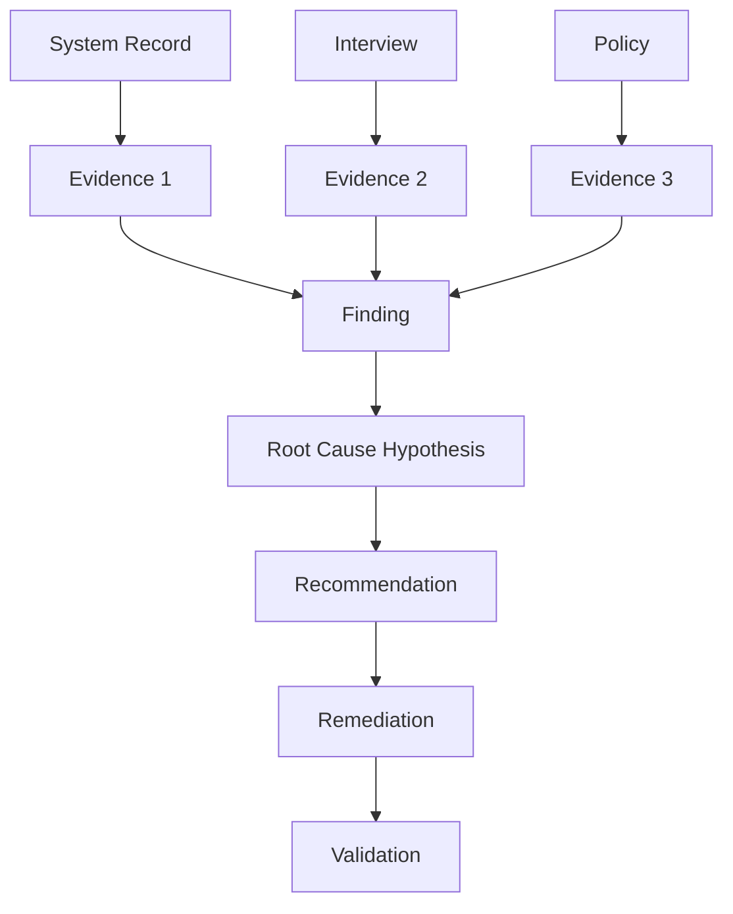

---

# 426. Correlated Provenance Graph

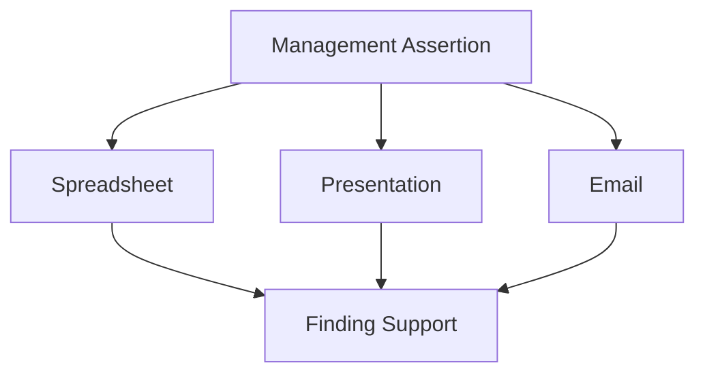

This visually shows why three documents may still represent one root source.

---

# 427. Independent Evidence Graph

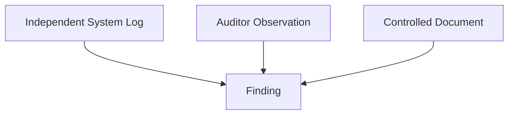

Actual independence must still be demonstrated, not assumed from labels.

---

# 428. Audit Quality Kernel as Governance Structure

Strong DERIVED interpretation:

The kernel is less a completed audit engine than a **governed audit reasoning space**.

It supplies:

- audit categories,
- quality axes,
- scenario contexts,
- reasoning modes,
- routing,
- lenses,
- templates,
- integrity boundaries.

---

# 429. What the Kernel Is Strongest At

From the supplied source, its strongest source-defined use is:

```text
structuring audit questions
selecting relevant audit clusters
organizing planning/review
framing quality dimensions
adapting outputs to stakeholder lenses
selecting from named artifact families
preventing fabricated assurance claims
```

---

# 430. What the Kernel Does Not Yet Define

It does not locally define the deep mechanics needed for:

```text
formal audit execution
statistical sampling
evidence authentication
control testing algorithms
quality scoring
finding rating
root-cause proof
regulatory certification
formal opinion issuance
```

---

# 431. Strongest Source-Grounded Kernel Formula

$$
\boxed{
K_{AQ}
=
\langle
C_{18},
D_{20},
V_{100k},
F_C,
M_2,
P_2,
R_2,
I_2,
L_4,
T_{11}
\rangle
}
$$

where:

- \(C_{18}\): 18 clusters,
- \(D_{20}\): 20 dimensions,
- \(V_{100k}\): declared virtual expansion,
- \(F_C\): one cluster-selection function,
- \(M_2\): two reasoning modes,
- \(P_2\): two explicit boundaries,
- \(R_2\): two task routes,
- \(I_2\): two integration dependencies,
- \(L_4\): four lenses,
- \(T_{11}\): eleven templates.

This is a DERIVED compact representation.

---

# 432. Integrity-Constrained Kernel Formula

$$
K_{AQ}^{safe}
=
K_{AQ}
\mid
\neg FabricateEvidence
\land
\neg ClaimAuditOpinion
\land
\neg ClaimRegulatoryApproval
$$

This is the safest mathematical compression of the explicit source policy.

---

# 433. Audit Conclusion Function — Proposed

Conceptually:

$$
Conclusion
=
f(
Scope,
Control,
Procedure,
Evidence,
Exceptions,
Context
)
$$

subject to:

$$
ConclusionStrength
\leq
EvidenceStrength
$$

No such explicit function appears in source.

---

# 434. Quality Function — Unknown

The source suggests:

$$
Quality
=
g(D_1,\ldots,D_{20})
$$

but \(g\) is entirely undefined.

Therefore:

```text
QualityAggregation = UNKNOWN/GAP
```

---

# 435. Cluster Function — Partially Defined

$$
F_{cluster}(audit\_question,context)
=
cluster\_vector\_audit
$$

is source-defined at the interface level.

Its internal mapping logic is not.

---

# 436. Lens Function — Unknown

Conceptually:

$$
L(content,audience)
\rightarrow
rendered\ content
$$

but no source function exists.

---

# 437. Template Function — Unknown

Conceptually:

$$
T(content,template)
\rightarrow
artifact
$$

but again no source implementation.

---

# 438. Integration Function — Unknown

No composition operator is defined for:

$$
AuditKernel
+
GovernanceEngine
+
DocumentationEngine
$$

---

# 439. Runtime Composition Hypotheses

### H1

$$
Governance \rightarrow AuditKernel \rightarrow Documentation
$$

### H2

$$
AuditKernel \leftrightarrow Governance
$$

and:

$$
AuditKernel \leftrightarrow Documentation
$$

### H3

A higher orchestrator composes all three.

### H4

The integration links are conceptual only.

Status: COMPETING.

---

# 440. No Coordination Semantics

The source does not define:

- transaction boundaries,
- state ownership,
- concurrency,
- rollback,
- version negotiation,
- failure isolation.

Do not import distributed-runtime semantics as literal implementation.

---

# 441. Failure Recovery — Proposed

If Governance Engine unavailable:

```text
do not pretend governance validation occurred
```

If Documentation Engine unavailable:

```text
preserve analysis; mark documentation rendering dependency unavailable
```

If cluster selection fails:

```text
return GAP rather than arbitrary cluster vector
```

If evidence missing:

```text
return UNKNOWN rather than invented result
```

---

# 442. Partial Failure

A missing template should not invalidate valid evidence analysis.

A missing evidence item may invalidate only dependent findings.

A broken lens renderer should not mutate underlying conclusions.

This is local-repair governance.

---

# 443. Anti-Regression Test Set

A future implementation should fail tests if it:

1. invents audit evidence,
2. invents test results,
3. claims regulator approval,
4. claims formal audit opinion,
5. merges design and operating effectiveness,
6. invents dimension scores,
7. materializes 100k claim as tested cases,
8. changes source cluster keys silently,
9. treats lens as evidence transformation,
10. treats template as evidence,
11. assumes dependency execution without receipts,
12. treats correlated sources as independent.

---

# 444. Metamorphic Test — Lens

Given identical underlying evidence:

```text
exec_view
operator_view
expert_view
audit_view
```

may change emphasis but should not change the fundamental evidence-supported conclusion.

---

# 445. Metamorphic Test — Template

Changing:

```text
risk_register
→ board_update
```

should not change factual claim status.

---

# 446. Metamorphic Test — Missing Evidence

Removing a load-bearing evidence item should not leave the dependent confidence unchanged.

---

# 447. Metamorphic Test — Duplicate Evidence

Duplicating the same evidence document ten times should not create ten independent confirmations.

---

# 448. Metamorphic Test — Virtual Scenario

Generating more hypothetical stateframes should not automatically increase empirical confidence.

---

# 449. Property Test — Cluster Count

Source invariant:

```text
len(clusters) == 18
```

for this version.

---

# 450. Property Test — Dimension Count

```text
len(dimensions) == 20
```

---

# 451. Property Test — Audit Types

```text
len(audit_type) == 4
```

---

# 452. Property Test — Process Types

```text
len(process_type) == 4
```

---

# 453. Property Test — Lenses

```text
len(lens_space) == 4
```

---

# 454. Property Test — Templates

```text
4 + 4 + 3 == 11
```

---

# 455. Property Test — Modes

```text
len(reasoning_modes) == 2
```

---

# 456. Property Test — Policies

```text
len(policies.boundaries) == 2
```

---

# 457. Property Test — Integrations

```text
len(integration_links.depends_on) == 2
```

---

# 458. Schema Test — Cluster IDs

Expected visible IDs:

$$
\{1,2,\ldots,18\}
$$

No gap appears.

---

# 459. Schema Test — Dimension IDs

Expected visible keys:

```text
"01" ... "20"
```

No gap appears.

---

# 460. Schema Test — Source Counts

Expected:

```text
meta.cluster_count == cluster_space.total_clusters == len(clusters)
```

and:

```text
meta.dimension_count == dimension_space.total_dimensions == len(dimensions)
```

The supplied source is internally consistent on these counts.

---

# 461. Virtual Count Test

No corresponding explicit enumeration can validate:

```text
virtual_layer_count == 100000
```

because the source intentionally avoids storing all layers.

Thus it remains a source-declared parameter.

---

# 462. Policy Test — Fabrication

Given missing evidence, any implementation returning a fabricated positive/negative result violates explicit source policy.

---

# 463. Policy Test — Opinion

Any implementation labeling its own output:

```text
formal audit opinion
```

violates explicit source policy.

---

# 464. Policy Test — Regulatory Approval

Likewise for:

```text
regulator approved
```

without external evidence.

---

# 465. Source-Preserving Obsidian Note Skeleton

```markdown
---
title: AMOS AUDIT QUALITY KERNEL V0
tags:
  - canon-group/tech-ai
  - canon/framework
  - rscf/claim
  - rscf/provenance
  - rscf/state/source-claim
  - topic/amos-audit-quality-kernel-v0
  - kernel
type: data
source: 11_KNOWLEDGE/kernel
rscf:
  state: SOURCE_CLAIM
  claim_class: SOURCE_CLAIM
  provenance: AMOS_corpus
  scope: AMOS_knowledge
---

# AMOS AUDIT QUALITY KERNEL V0

> [!important]
> Source integrity boundary:
> - Do not fabricate test results or evidence.
> - Do not claim regulatory approvals or audit opinions.

## Source Kernel

- Name: `Audit_Quality_Kernel_vInfinity_SUPER`
- Version: `v2.0.0+lens_integration`
- Domain: `audit_and_quality_assurance`
- Clusters: 18
- Dimensions: 20
- Virtual layers: 100000

## Cluster Space
[Preserve exact 18 source identifiers]

## Dimension Space
[Preserve exact 20 source dimensions]

## Virtual Expansion
[Preserve exact source axes and notes]

## Mapping
`F_cluster_selection`

## Reasoning Modes
- `mode_audit_planning`
- `mode_audit_review`

## Policies
- No fabricated evidence/test results.
- No regulatory approval/audit opinion claims.

## Integration
- `AMOS_Governance_SUPER_Engine`
- `AMOS_Documentation_SUPER_Engine`

## Lenses
- executive
- operator
- expert
- audit

## Templates
[Preserve exact 11 source template names]

## Related
No populated source links.

## MOC

```

---

# 466. Final Proof Capsule

```yaml
CLAIM:
  The supplied artifact defines an AMOS Audit & Quality kernel
  for audit planning, audit-work review, audit capability
  organization, quality evaluation perspectives, virtual scenario
  generation, stakeholder lenses, and artifact templates.

CLASS:
  VERIFIED_FROM_PROVIDED_SOURCE

SOURCE_IDENTITY:
  frontmatter_title: AMOS AUDIT QUALITY KERNEL V0
  body_name: Audit_Quality_Kernel_vInfinity_SUPER
  body_version: v2.0.0+lens_integration
  created_at_utc: 2025-11-28T00:10:18.516087Z

SOURCE_STRUCTURE:
  clusters: 18
  dimensions: 20
  virtual_layers_declared: 100000
  audit_types: 4
  process_types: 4
  mapping_functions: 1
  reasoning_modes: 2
  policy_boundaries: 2
  task_routes: 2
  integration_dependencies: 2
  lenses: 4
  templates: 11

CORE_INTEGRITY:
  fabricate_test_results: PROHIBITED
  fabricate_evidence: PROHIBITED
  claim_regulatory_approval: PROHIBITED
  claim_audit_opinion: PROHIBITED

LOAD_BEARING_BOUNDARIES:
  - planning is not execution
  - control design is not operating effectiveness
  - evidence request is not evidence
  - evidence received is not evidence validated
  - observation is not root cause
  - remediation plan is not remediation effectiveness
  - regulatory alignment is not regulatory approval
  - internal review is not formal audit opinion
  - virtual scenario is not observed evidence
  - lens selection does not alter evidence truth
  - template structure does not create evidence

SOURCE_CONSISTENCY:
  cluster_count:
    declared: 18
    enumerated: 18
    status: CONSISTENT

  dimension_count:
    declared: 20
    enumerated: 20
    status: CONSISTENT

UNRESOLVED:
  - V0 vs vInfinity_SUPER vs v2.0.0 lineage
  - virtual 100k expansion formula
  - cluster-vector representation
  - dimension scoring
  - dimension weighting
  - aggregate quality formula
  - sampling methodology
  - evidence sufficiency methodology
  - finding rating
  - risk rating
  - root-cause methodology
  - lens selection/composition
  - template definitions
  - C-Canon bindings
  - runtime implementation
  - dependency execution
  - professional standards binding

RUNTIME:
  class: UNKNOWN/GAP

EMPIRICAL_VALIDATION:
  class: UNKNOWN/GAP

AUDIT_OPINION_AUTHORITY:
  class: PROHIBITED_BY_SOURCE_POLICY

REGULATORY_APPROVAL_AUTHORITY:
  class: PROHIBITED_BY_SOURCE_POLICY
```

---

# 467. Canonical Compression

The artifact reduces to six governing laws.

### Law 1 — Evidence Conservation

$$
\boxed{
NoEvidence
\Rightarrow
NoFabricatedResult
}
$$

Missing evidence remains a gap.

---

### Law 2 — Assurance Separation

$$
\boxed{
AuditSupport
\neq
AuditOpinion
}
$$

and:

$$
\boxed{
RegulatoryAlignment
\neq
RegulatoryApproval
}
$$

---

### Law 3 — Audit-State Separation

$$
\boxed{
Design
\neq
Operation
\neq
Testing
\neq
Evidence
\neq
Finding
\neq
Cause
\neq
Remediation
\neq
Validation
}
$$

Each transition requires its own support.

---

### Law 4 — Quality Is Multidimensional

The source defines twenty dimensions:

$$
\boxed{
Quality \not\equiv Coverage
}
$$

$$
\boxed{
Quality \not\equiv Documentation
}
$$

$$
\boxed{
Quality \not\equiv Timeliness
}
$$

$$
\boxed{
Quality \not\equiv Compliance
}
$$

No source formula reduces them to one score.

---

### Law 5 — Virtuality Is Not Evidence

$$
\boxed{
100000\ VirtualStates
\neq
100000\ TestedCases
}
$$

The virtual expansion model is explicitly for deriving scenarios/evaluations/plans without materializing every layer.

---

### Law 6 — Presentation Cannot Alter Truth

$$
\boxed{
Lens
+
Template
\rightarrow
Representation
}
$$

but:

$$
\boxed{
Lens
+
Template
\not\rightarrow
EvidenceUpgrade
}
$$

Executive, operator, expert, and audit views may emphasize different dimensions of the same underlying analysis. They cannot change unsupported claims into verified ones.

---

# 468. Final Canonical Conclusion

**`AMOS AUDIT QUALITY KERNEL V0` is best classified as a source-defined, multidimensional audit-governance and quality-assurance framework rather than evidence of a completed autonomous audit system.**

Its structural center is:

$$
\boxed{
18\ AuditClusters
\times
20\ QualityDimensions
}
$$

yielding a derived 360-cell conceptual cluster/dimension space, surrounded by a source-declared `x100k_virtual` scenario layer, four audit-type contexts, four process-type contexts, a cluster-selection mapping, two reasoning modes, two explicit routing rules, two SUPER-engine dependencies, four stakeholder lenses, and eleven named artifact templates.

The kernel's most important architectural feature is not its size. It is its **evidence firewall**:

$$
\boxed{
\text{Do not fabricate test results or evidence.}
}
$$

That rule prevents the architecture from confusing audit simulation, planning, drafting, or reasoning with actual assurance. Its second explicit firewall:

$$
\boxed{
\text{Do not claim regulatory approvals or audit opinions.}
}
$$

prevents internally generated structure from crossing into institutional authority that the source does not grant.

Accordingly, the kernel can source-groundedly support:

```text
audit planning
audit-work review
cluster selection
quality framing
control-oriented reasoning
evidence requirement design
finding structure
root-cause investigation structure
remediation planning structure
follow-up structure
stakeholder-specific rendering
document/deck/table selection
```

while the following remain outside the supplied evidence envelope:

```text
actual control-test results
verified operating effectiveness
formal sampling conclusions
confirmed root causes
validated remediation effectiveness
formal regulatory compliance certification
regulatory approval
formal audit opinion
independent assurance status
runtime implementation
empirical performance
```

The source also exposes a meaningful unresolved architectural question: its explicit axes and spaces do not mathematically reconstruct the declared `100000` virtual layers. The visible combinations give 16 audit/process contexts, 360 cluster/dimension cells, 5,760 if those are mechanically crossed, or 23,040 if four lenses are also mechanically crossed. None equals 100,000. Therefore the virtual expansion must remain a **source-defined model parameter with unresolved generation semantics**, rather than being reverse-engineered through invented axes.

The strongest AMOS-safe interpretation is therefore:

$$
\boxed{
AuditQualityKernel
=
StructureForAssurance
\neq
AssuranceItself
}
$$

and its governing operational sequence is:

$$
\boxed{
Question
\rightarrow
Scope
\rightarrow
RelevantAuditClusters
\rightarrow
TestDesign
\rightarrow
RealEvidence
\rightarrow
Evaluation
\rightarrow
BoundedFinding
\rightarrow
RootCauseInvestigation
\rightarrow
Remediation
\rightarrow
Validation
}
$$

with one non-negotiable rule across every stage:

$$
\boxed{
\text{When evidence ends, certainty must end with it.}
}
$$
