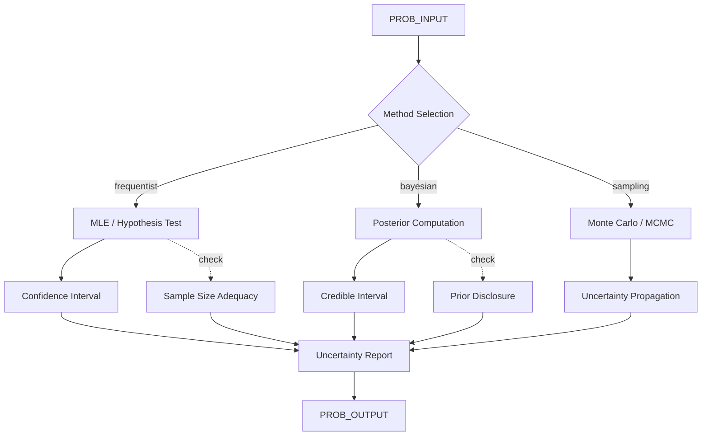

# AMOS Probability & Statistics Kernel

> **Origin Architect / Steward:** Trang Phan
> **Epistemic Class:** `AMOS_MODEL`
> **Conclusion Class:** `DERIVED`
> **Status:** `ACTIVE_SPECIFICATION`
> **Governing Plane:** `11_KNOWLEDGE/kernel`

> Bridge note -- resolves the `amos-probability-statistics-kernel` link from the Cosmo Brain MOC / daily notes to the real skill in the vault.
> **Location:** `.devin/skills/amos-probability-statistics-kernel`

---

## 1. Architectural Scope

The **AMOS Probability & Statistics Kernel** defines the core algorithms, data structures, and computational guarantees for probabilistic reasoning and statistical inference within the AMOS OS. It provides distribution modeling, hypothesis testing, Bayesian inference, uncertainty quantification, and sampling methods.

This kernel exists to provide the **mathematical foundation** for all probabilistic operations, ensuring that uncertainty is quantified, propagated, and communicated consistently across the OS. It enforces the distinction between frequentist and Bayesian reasoning and prevents confidence-claim inflation.

**Epistemic Boundary:**
```
MODEL != OBSERVATION
DOCUMENTED != IMPLEMENTED
CAPABILITY != AUTHORITY
PROBABILISTIC_INFERENCE != DETERMINISTIC_TRUTH
CONFIDENCE_INTERVAL != CERTAINTY
```

**Core Data Structures:**
- `Distribution{type, parameters, support, moments}`
- `HypothesisTest{null_hypothesis, alternative, test_statistic, p_value, power}`
- `BayesianPosterior{prior, likelihood, posterior, credible_interval}`
- `UncertaintyBudget{source, variance, confidence_level, propagation_path}`

**Core Algorithms:**
- Maximum likelihood estimation (MLE)
- Bayesian inference (conjugate priors, MCMC, variational)
- Hypothesis testing (parametric, non-parametric, bootstrap)
- Uncertainty propagation (analytical, Monte Carlo)
- Distribution fitting and goodness-of-fit

**Inputs:** `PROB_INPUT{data, hypothesis, prior, confidence_level, method}`
**Outputs:** `PROB_OUTPUT{estimate, confidence_interval, p_value, posterior, uncertainty_report}`

**Computational Guarantees:** Bounded estimation error under regularity conditions, convergent MCMC under ergodicity, valid coverage for confidence intervals under correct model specification.

---

## 2. Governing Invariants

| ID | Invariant | Description |
|----|-----------|-------------|
| INV-PS-001 | Uncertainty Mandatory | Every probabilistic output must carry an uncertainty measure |
| INV-PS-002 | Confidence Cap | Confidence levels must not exceed 0.95 unless explicitly justified |
| INV-PS-003 | Prior Disclosure | Bayesian analyses must explicitly state prior assumptions |
| INV-PS-004 | Model Specification | Distributional assumptions must be stated; unstated assumptions block output |
| INV-PS-005 | Sample Size Adequacy | Statistical tests must check sample size adequacy before reporting |
| INV-PS-006 | Frequentist-Bayesian Separation | Outputs must label whether they are frequentist or Bayesian |
| INV-PS-007 | No Certainty Claims | Probabilistic outputs must never be presented as deterministic truth |

---

## 3. Mathematical Formulation

**Maximum likelihood estimation:**

$$\hat{\theta}_{\text{MLE}} = \arg\max_{\theta} \prod_{i=1}^{n} f(x_i | \theta)$$

**Bayesian posterior:**

$$p(\theta | x) = \frac{p(x | \theta) \cdot p(\theta)}{\int p(x | \theta') p(\theta') d\theta'}$$

**Confidence interval:**

$$\text{CI}_{1-\alpha} = [\hat{\theta} - z_{\alpha/2} \cdot \text{SE}(\hat{\theta}), \; \hat{\theta} + z_{\alpha/2} \cdot \text{SE}(\hat{\theta})]$$

**Uncertainty propagation (linear approximation):**

$$\sigma_Y^2 \approx \sum_{i} \left(\frac{\partial f}{\partial x_i}\right)^2 \sigma_{x_i}^2$$

**Bayesian credible interval:**

$$P(\theta \in [a, b] | x) = 1 - \alpha$$

**Goodness-of-fit (Kolmogorov-Smirnov):**

$$D_n = \sup_x |F_n(x) - F(x)|$$

---

## 4. Architecture



---

## 5. MECE Mapping to AMOS Full Brain OS

| Kernel Component | AMOS Plane | Role |
|------------------|------------|------|
| MLE / Hypothesis Test | `13_MODELS` | Statistical modelling |
| Bayesian Posterior | `13_MODELS` | Bayesian modelling |
| Monte Carlo / MCMC | `04_RUNTIME` | Computational sampling |
| Uncertainty Propagation | `17_OBSERVABILITY` | Uncertainty monitoring |
| Confidence/Credible Interval | `16_SCHEMAS` | Interval schema |
| Sample Size Check | `03_CONTROL_PLANE` | Admission control |
| Prior Disclosure | `03_CONTROL_PLANE` | Assumption gate |
| Uncertainty Report | `17_OBSERVABILITY` | Report generation |

---

## 6. Safety Invariants & Firewalls

| ID | Firewall | Enforcement |
|----|----------|-------------|
| INV-PS-FW-001 | Uncertainty Required | Outputs without uncertainty measures are blocked |
| INV-PS-FW-002 | Confidence Cap | Confidence levels above 0.95 require explicit justification |
| INV-PS-FW-003 | Prior Disclosure | Bayesian outputs without stated priors are blocked |
| INV-PS-FW-004 | No Certainty Claims | Outputs presented as deterministic truth are blocked |
| INV-PS-FW-005 | Sample Size Check | Tests with inadequate sample size are flagged |

---

## 7. Navigation & Bindings

- **Parent MOC:** [[11_KNOWLEDGE/kernel/KERNEL_MOC|KERNEL_MOC]]
- **Knowledge MOC:** [[11_KNOWLEDGE/KNOWLEDGE_MOC|KNOWLEDGE_MOC]]
- **Home:** [[00_ROOT/00_HOME|00_HOME]]
- **Reasoning Kernel:** [[11_KNOWLEDGE/kernel/REASONING_KERNEL|REASONING_KERNEL]]
- **Life Core Kernel:** [[11_KNOWLEDGE/kernel/LIFE_CORE_KERNEL|LIFE_CORE_KERNEL]]
- **Partnerships Channels Kernel:** [[11_KNOWLEDGE/kernel/AMOS_PARTNERSHIPS_CHANNELS_KERNEL|AMOS_PARTNERSHIPS_CHANNELS_KERNEL]]
- **Customer Insight Kernel:** [[11_KNOWLEDGE/kernel/AMOS_CUSTOMER_INSIGHT_KERNEL|AMOS_CUSTOMER_INSIGHT_KERNEL]]
- **Simulation Kernel:** [[11_KNOWLEDGE/kernel/AMOS_SIMULATION_KERNEL|AMOS_SIMULATION_KERNEL]]
- **Core Laws:** [[01_CANON/01_CORE_LAWS/AMOS_CORE_LAWS|01_CORE_LAWS]]

---

## 8. Known Gaps & Falsifiers

| ID | Gap | Impact | Action |
|----|-----|--------|--------|
| GAP-PS-001 | Model misspecification risk | Incorrect distributional assumptions invalidate results | Flag model assumptions as unverified |
| GAP-PS-002 | MCMC convergence diagnosis | Convergence is not always detectable | Require convergence diagnostics |
| GAP-PS-003 | Small-sample performance | Asymptotic properties may not hold for small samples | Flag small-sample results as approximate |
| GAP-PS-004 | Prior sensitivity | Bayesian results depend on prior choice | Require prior sensitivity analysis |

---

**Related:** [[11_KNOWLEDGE/kernel/KERNEL_MOC|KERNEL_MOC]] | [[11_KNOWLEDGE/KNOWLEDGE_MOC|KNOWLEDGE_MOC]] | [[11_KNOWLEDGE/kernel/REASONING_KERNEL|REASONING_KERNEL]] | [[11_KNOWLEDGE/kernel/LIFE_CORE_KERNEL|LIFE_CORE_KERNEL]] | [[11_KNOWLEDGE/kernel/AMOS_PARTNERSHIPS_CHANNELS_KERNEL|AMOS_PARTNERSHIPS_CHANNELS_KERNEL]] | [[11_KNOWLEDGE/kernel/AMOS_CUSTOMER_INSIGHT_KERNEL|AMOS_CUSTOMER_INSIGHT_KERNEL]]

______________________________________________________________________

**MOC:** [[11_KNOWLEDGE/kernel/KERNEL_MOC|KERNEL_MOC]] | [[00_ROOT/00_HOME|00_HOME]]
