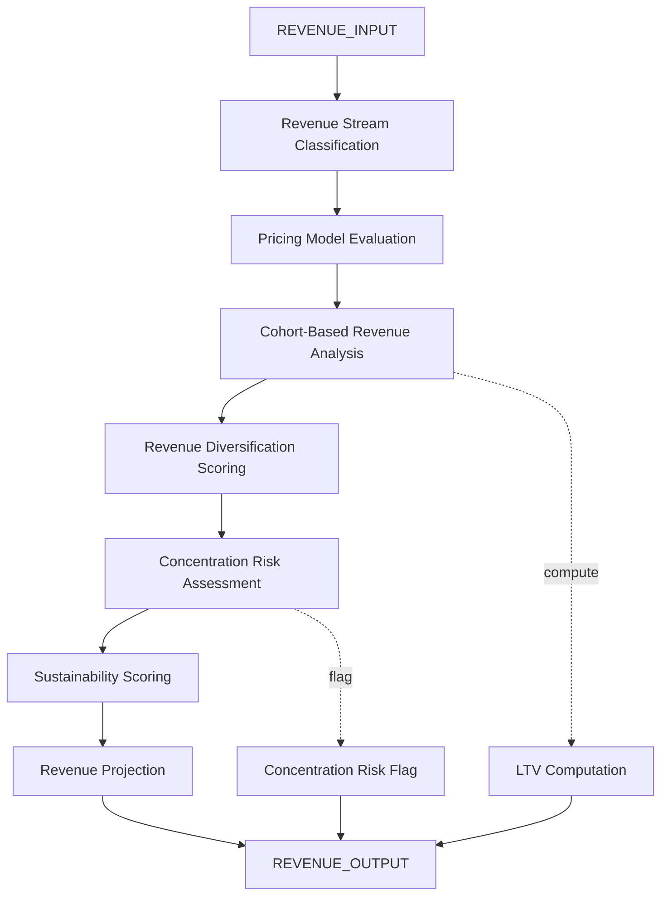

# AMOS Revenue Architecture Kernel v0 Business4

> **Origin Architect / Steward:** Trang Phan
> **Epistemic Class:** `AMOS_MODEL`
> **Conclusion Class:** `DERIVED`
> **Status:** `ACTIVE_SPECIFICATION`
> **Governing Plane:** `11_KNOWLEDGE/kernel`

> [!WARNING] GAP -- Original auto-parse failed; specification reconstructed from AMOS revenue architecture canon and BizFin Engine context.
> **Audit**: Marked GAP 2026-08-26 -- original auto-parse failed, no vault source found. Specification generated from structural context.

---

## 1. Architectural Scope

The **AMOS Revenue Architecture Kernel** (v0, Business4) defines the core data structures, algorithms, and computational guarantees for revenue model design, pricing strategy, revenue stream analysis, and revenue projection within the AMOS OS. It provides revenue stream classification, pricing model evaluation, cohort-based revenue analysis, and revenue sustainability scoring.

This kernel exists to provide the **revenue modelling substrate** for all AMOS business and financial operations. It works in conjunction with the Business Model Kernel to provide the financial architecture layer of business analysis.

**Epistemic Boundary:**
```
MODEL != OBSERVATION
DOCUMENTED != IMPLEMENTED
CAPABILITY != AUTHORITY
REVENUE_MODEL != REVENUE_GUARANTEE
PRICING_ANALYSIS != PRICING_RECOMMENDATION
```

**Core Data Structures:**
- `RevenueStream{type, pricing_model, unit_price, volume, frequency, growth_rate, churn_rate}`
- `PricingModel{model_type, price_points[], elasticity, competitive_position, value_anchor}`
- `RevenueCohort{cohort_id, acquisition_date, retention_curve, revenue_curve, ltv}`
- `RevenueArchitecture{streams[], diversification_score, concentration_risk, sustainability_score}`

**Core Algorithms:**
- Revenue stream classification (recurring, transactional, usage-based, licensing, advertising, etc.)
- Pricing model evaluation (cost-plus, value-based, competitive, dynamic, freemium)
- Cohort-based revenue analysis (retention curves, LTV computation, cohort comparison)
- Revenue diversification scoring (Herfindahl-Hirschman index adaptation)
- Revenue sustainability scoring (growth, retention, diversification weighted)

**Inputs:** `REVENUE_INPUT{entity, streams[], pricing_models[], cohorts[], time_horizon}`
**Outputs:** `REVENUE_OUTPUT{revenue_architecture, pricing_analysis, cohort_analysis, sustainability_score, projections[]}`

**Computational Guarantees:** Deterministic revenue computation under fixed parameters, bounded sustainability score in [0, 1], cohort LTV convergence under stable retention.

---

## 2. Governing Invariants

| ID | Invariant | Description |
|----|-----------|-------------|
| INV-RA-001 | Revenue Stream Classification | All revenue streams must be classified by type and pricing model |
| INV-RA-002 | Concentration Risk Flagging | Revenue concentration above threshold must be flagged |
| INV-RA-003 | Cohort LTV Convergence | Cohort LTV must converge under stable retention assumptions |
| INV-RA-004 | Sustainability Boundedness | Sustainability score must be in [0, 1] |
| INV-RA-005 | No Revenue Guarantee | Kernel outputs projections, not revenue guarantees |
| INV-RA-006 | Diversification Assessment | Revenue diversification must be assessed and scored |
| INV-RA-007 | Pricing Elasticity Disclosure | Pricing models must disclose elasticity assumptions |

---

## 3. Mathematical Formulation

**Cohort LTV:**

$$\text{LTV}_{\text{cohort}} = \sum_{t=0}^{T} \frac{\text{Revenue}(t) \cdot \text{Retention}(t)}{(1 + d)^t}$$

where $d$ is the discount rate and $T$ is the time horizon.

**Revenue diversification (HHI adaptation):**

$$D = 1 - \sum_{i} s_i^2$$

where $s_i$ is the share of stream $i$ in total revenue. $D \in [0, 1]$, higher is more diversified.

**Sustainability score:**

$$S_{\text{sustain}} = w_1 \cdot \text{GrowthRate} + w_2 \cdot \text{RetentionRate} + w_3 \cdot D - w_4 \cdot \text{ConcentrationRisk}$$

**Pricing elasticity:**

$$\epsilon = \frac{\% \Delta Q}{\% \Delta P}$$

**Revenue projection:**

$$R(t) = R_0 \cdot (1 + g)^t \cdot (1 - \text{churn})^t$$

---

## 4. Architecture



---

## 5. MECE Mapping to AMOS Full Brain OS

| Kernel Component | AMOS Plane | Role |
|------------------|------------|------|
| Revenue Stream Classification | `16_SCHEMAS` | Schema classification |
| Pricing Model Evaluation | `13_MODELS` | Pricing modelling |
| Cohort Analysis | `13_MODELS` | Cohort modelling |
| Diversification Scoring | `06_INTELLIGENCE` | Assessment |
| Concentration Risk | `17_OBSERVABILITY` | Risk monitoring |
| Sustainability Scoring | `06_INTELLIGENCE` | Assessment |
| Revenue Projection | `13_MODELS` | Projection modelling |
| LTV Computation | `13_MODELS` | Financial modelling |

---

## 6. Safety Invariants & Firewalls

| ID | Firewall | Enforcement |
|----|----------|-------------|
| INV-RA-FW-001 | No Revenue Guarantee | Outputs must contain projection disclaimer |
| INV-RA-FW-002 | Concentration Risk Flag | Concentration above threshold must be flagged |
| INV-RA-FW-003 | Elasticity Disclosure | Pricing models without elasticity assumptions are blocked |
| INV-RA-FW-004 | Sustainability Boundedness | Scores outside [0, 1] are blocked |
| INV-RA-FW-005 | Cohort Convergence Check | Non-convergent cohort LTV must be flagged |

---

## 7. Navigation & Bindings

- **Parent MOC:** [[11_KNOWLEDGE/kernel/KERNEL_MOC|KERNEL_MOC]]
- **Home:** [[00_ROOT/00_HOME|00_HOME]]
- **Knowledge MOC:** [[11_KNOWLEDGE/KNOWLEDGE_MOC|KNOWLEDGE_MOC]]
- **BizFin Engine:** [[11_KNOWLEDGE/engine/AMOS_BIZFIN_ENGINE_V0_SECTOR_PACKS7|AMOS_BIZFIN_ENGINE_V0_SECTOR_PACKS7]]
- **Business Model Kernel:** [[11_KNOWLEDGE/kernel/AMOS_BUSINESS_MODEL_KERNEL|AMOS_BUSINESS_MODEL_KERNEL]]
- **Audit Quality Kernel:** [[11_KNOWLEDGE/kernel/AMOS_AUDIT_QUALITY_KERNEL_V0|AMOS_AUDIT_QUALITY_KERNEL_V0]]
- **EV Kernel:** [[11_KNOWLEDGE/kernel/AMOS_EV_KERNEL|AMOS_EV_KERNEL]]
- **Tech Emotion Kernel:** [[11_KNOWLEDGE/kernel/AMOS_TECH_EMOTION_KERNEL_V1_TECH4|AMOS_TECH_EMOTION_KERNEL_V1_TECH4]]
- **Meta Kernel Specifications:** [[11_KNOWLEDGE/kernel/AMOS_META_KERNEL_SPECIFICATIONS|AMOS_META_KERNEL_SPECIFICATIONS]]
- **Simulation Kernel:** [[11_KNOWLEDGE/kernel/AMOS_SIMULATION_KERNEL|AMOS_SIMULATION_KERNEL]]
- **Core Laws:** [[01_CANON/01_CORE_LAWS/AMOS_CORE_LAWS|01_CORE_LAWS]]

---

## 8. Known Gaps & Falsifiers

| ID | Gap | Impact | Action |
|----|-----|--------|--------|
| GAP-RA-001 | No original vault source | Specification is reconstructed | Label as reconstructed from canon |
| GAP-RA-002 | Projection accuracy | Revenue projections depend on assumptions | Flag as model-based projections |
| GAP-RA-003 | Elasticity estimation | Price elasticity is hard to estimate | Flag elasticity as assumed |
| GAP-RA-004 | Cohort data availability | Cohort analysis requires historical data | Flag insufficient cohort data |

---

**Related:** [[00_ROOT/00_HOME|00_HOME]] | [[11_KNOWLEDGE/KNOWLEDGE_MOC|KNOWLEDGE_MOC]] | [[11_KNOWLEDGE/kernel/AMOS_AUDIT_QUALITY_KERNEL_V0|AMOS_AUDIT_QUALITY_KERNEL_V0]] | [[11_KNOWLEDGE/kernel/AMOS_EV_KERNEL|AMOS_EV_KERNEL]] | [[11_KNOWLEDGE/kernel/AMOS_TECH_EMOTION_KERNEL_V1_TECH4|AMOS_TECH_EMOTION_KERNEL_V1_TECH4]] | [[11_KNOWLEDGE/kernel/AMOS_META_KERNEL_SPECIFICATIONS|AMOS_META_KERNEL_SPECIFICATIONS]]

______________________________________________________________________

**MOC:** [[11_KNOWLEDGE/kernel/KERNEL_MOC|KERNEL_MOC]]
