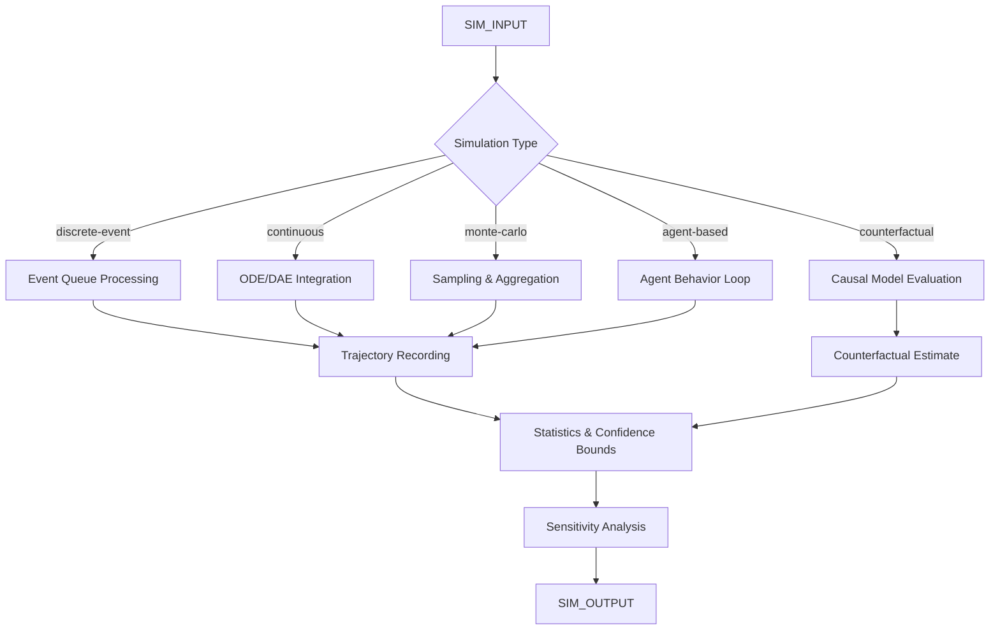

# AMOS Simulation Kernel

> **Origin Architect / Steward:** Trang Phan
> **Epistemic Class:** `AMOS_MODEL`
> **Conclusion Class:** `DERIVED`
> **Status:** `ACTIVE_SPECIFICATION`
> **Governing Plane:** `11_KNOWLEDGE/kernel`

> Bridge note -- resolves the `amos-simulation-kernel` link from the Cosmo Brain MOC / daily notes to the real skill in the vault.
> **Location:** `.devin/skills/amos-simulation-kernel`

---

## 1. Architectural Scope

The **AMOS Simulation Kernel** defines the core algorithms, data structures, and computational guarantees for simulation-based reasoning within the AMOS OS. It provides discrete-event simulation, continuous-time simulation, Monte Carlo methods, agent-based modeling, and counterfactual scenario generation.

This kernel exists to provide the **computational substrate** for all simulation operations, enabling the OS to project outcomes under different scenarios, test hypotheses against simulated data, and explore counterfactual spaces. It enforces the distinction between simulated and observed outcomes.

**Epistemic Boundary:**
```
MODEL != OBSERVATION
DOCUMENTED != IMPLEMENTED
CAPABILITY != AUTHORITY
SIMULATION != REALITY
COUNTERFACTUAL != ACTUAL
```

**Core Data Structures:**
- `SimulationState{time, variables, events_queue, random_seed}`
- `ScenarioTree{nodes, edges, probabilities, outcomes}`
- `SimulationResult{trajectory, final_state, statistics, confidence_bounds}`
- `Counterfactual{baseline, intervention, causal_estimate, sensitivity}`

**Core Algorithms:**
- Discrete-event simulation (event queue, time advancement)
- ODE/DAE numerical integration (Runge-Kutta, adaptive step)
- Monte Carlo sampling and variance reduction
- Agent-based simulation (behavior rules, interaction topology)
- Counterfactual reasoning (structural causal models, do-calculus)

**Inputs:** `SIM_INPUT{model, initial_state, parameters, time_horizon, scenarios[], random_seed}`
**Outputs:** `SIM_OUTPUT{trajectories[], statistics, confidence_bounds, counterfactual_estimates[], sensitivity_analysis}`

**Computational Guarantees:** Deterministic reproducibility under fixed seed, bounded numerical error for stable ODEs, convergent Monte Carlo under finite variance, valid counterfactual estimates under causal sufficiency.

---

## 2. Governing Invariants

| ID | Invariant | Description |
|----|-----------|-------------|
| INV-SK-001 | Seed Reproducibility | Same seed and parameters must produce identical results |
| INV-SK-002 | Simulation-Reality Label | All simulation outputs must be labelled as simulated, not observed |
| INV-SK-003 | Time Horizon Boundedness | Simulations must declare a finite time horizon; infinite horizons require explicit justification |
| INV-SK-004 | Numerical Stability | ODE solvers must detect and report stiffness and divergence |
| INV-SK-005 | Variance Reporting | Monte Carlo results must report variance and convergence diagnostics |
| INV-SK-006 | Counterfactual Validity | Counterfactual estimates require causal model specification |
| INV-SK-007 | Parameter Disclosure | All simulation parameters must be explicitly stated |

---

## 3. Mathematical Formulation

**Discrete-event time advancement:**

$$t_{\text{next}} = \min_{e \in Q} t_e$$

**ODE integration (Runge-Kutta 4th order):**

$$x_{n+1} = x_n + \frac{h}{6}(k_1 + 2k_2 + 2k_3 + k_4)$$

where:
$$k_1 = f(t_n, x_n), \quad k_2 = f(t_n + h/2, x_n + hk_1/2), \quad k_3 = f(t_n + h/2, x_n + hk_2/2), \quad k_4 = f(t_n + h, x_n + hk_3)$$

**Monte Carlo estimator:**

$$\hat{\mu} = \frac{1}{N} \sum_{i=1}^{N} f(X_i), \quad \text{Var}(\hat{\mu}) = \frac{\sigma^2}{N}$$

**Counterfactual (do-calculus):**

$$P(Y | \text{do}(X = x)) = \sum_{z} P(Y | X = x, Z = z) P(Z = z)$$

**Sensitivity index (Sobol):**

$$S_i = \frac{\text{Var}_{X_i}(E_{X_{\sim i}}[Y | X_i])}{\text{Var}(Y)}$$

---

## 4. Architecture



---

## 5. MECE Mapping to AMOS Full Brain OS

| Kernel Component | AMOS Plane | Role |
|------------------|------------|------|
| Event Queue Processing | `04_RUNTIME` | Runtime execution |
| ODE/DAE Integration | `13_MODELS` | Dynamic modelling |
| Monte Carlo Sampling | `04_RUNTIME` | Computational sampling |
| Agent-Based Simulation | `06_INTELLIGENCE` | Agent reasoning |
| Counterfactual Evaluation | `13_MODELS` | Causal modelling |
| Trajectory Recording | `10_MEMORY` | Episodic recording |
| Statistics & Confidence | `17_OBSERVABILITY` | Result monitoring |
| Sensitivity Analysis | `22_RESEARCH` | Research analysis |

---

## 6. Safety Invariants & Firewalls

| ID | Firewall | Enforcement |
|----|----------|-------------|
| INV-SK-FW-001 | Simulation Label Mandatory | Outputs without simulation label are blocked |
| INV-SK-FW-002 | Seed Disclosure | Simulations without disclosed seed are flagged |
| INV-SK-FW-003 | Numerical Divergence Detection | Divergent ODE solvers trigger fail-safe |
| INV-SK-FW-004 | Counterfactual Model Required | Counterfactual outputs without causal model are blocked |
| INV-SK-FW-005 | Parameter Disclosure | Simulations with undisclosed parameters are blocked |

---

## 7. Navigation & Bindings

- **Parent MOC:** [[11_KNOWLEDGE/kernel/KERNEL_MOC|KERNEL_MOC]]
- **Knowledge MOC:** [[11_KNOWLEDGE/KNOWLEDGE_MOC|KNOWLEDGE_MOC]]
- **Home:** [[00_ROOT/00_HOME|00_HOME]]
- **Operational Risk Kernel:** [[11_KNOWLEDGE/kernel/OPERATIONAL_RISK_KERNEL|OPERATIONAL_RISK_KERNEL]]
- **Design Kernel:** [[11_KNOWLEDGE/kernel/AMOS_DESIGN_KERNEL|AMOS_DESIGN_KERNEL]]
- **Biological Kernel Computing:** [[11_KNOWLEDGE/kernel/BIOLOGICAL_KERNEL_COMPUTING_BKC|BIOLOGICAL_KERNEL_COMPUTING_BKC]]
- **Counterfactual Reasoning Kernel:** [[11_KNOWLEDGE/kernel/AMOS_COUNTERFACTUAL_REASONING_KERNEL|AMOS_COUNTERFACTUAL_REASONING_KERNEL]]
- **Probability Statistics Kernel:** [[11_KNOWLEDGE/kernel/AMOS_PROBABILITY_STATISTICS_KERNEL|AMOS_PROBABILITY_STATISTICS_KERNEL]]
- **Constraint Engine:** [[11_KNOWLEDGE/engine/CONSTRAINT_ENGINE|CONSTRAINT_ENGINE]]
- **Core Laws:** [[01_CANON/01_CORE_LAWS/AMOS_CORE_LAWS|01_CORE_LAWS]]

---

## 8. Known Gaps & Falsifiers

| ID | Gap | Impact | Action |
|----|-----|--------|--------|
| GAP-SK-001 | Model validity | Simulations are only as valid as their models | Flag model assumptions as unverified |
| GAP-SK-002 | Agent-based emergence | Emergent behavior may not be predictable | Flag agent-based results as exploratory |
| GAP-SK-003 | Counterfactual identifiability | Not all counterfactuals are identifiable | Flag unidentifiable counterfactuals |
| GAP-SK-004 | Computational scalability | Large simulations may exceed computational budget | Flag computational cost estimates |

---

**Related:** [[11_KNOWLEDGE/kernel/KERNEL_MOC|KERNEL_MOC]] | [[11_KNOWLEDGE/KNOWLEDGE_MOC|KNOWLEDGE_MOC]] | [[11_KNOWLEDGE/kernel/OPERATIONAL_RISK_KERNEL|OPERATIONAL_RISK_KERNEL]] | [[11_KNOWLEDGE/kernel/AMOS_DESIGN_KERNEL|AMOS_DESIGN_KERNEL]] | [[11_KNOWLEDGE/kernel/BIOLOGICAL_KERNEL_COMPUTING_BKC|BIOLOGICAL_KERNEL_COMPUTING_BKC]] | [[11_KNOWLEDGE/kernel/AMOS_COUNTERFACTUAL_REASONING_KERNEL|AMOS_COUNTERFACTUAL_REASONING_KERNEL]]

______________________________________________________________________

**MOC:** [[11_KNOWLEDGE/kernel/KERNEL_MOC|KERNEL_MOC]] | [[00_ROOT/00_HOME|00_HOME]]
