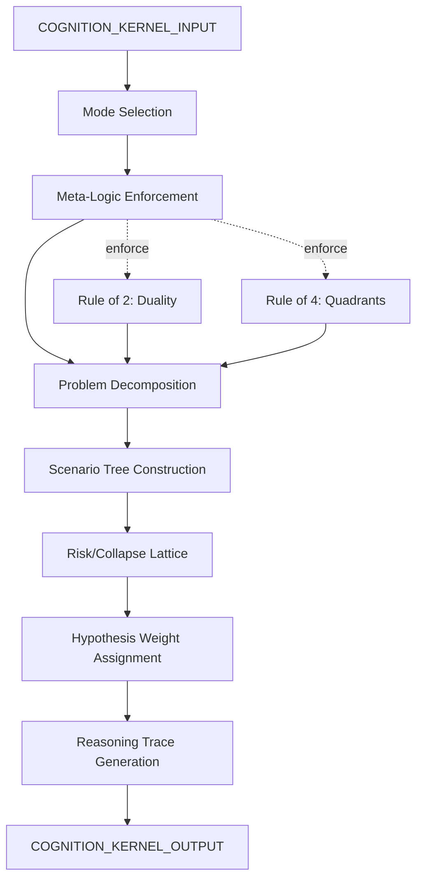

# Cognition Kernel Adapter

> **Origin Architect / Steward:** Trang Phan
> **Epistemic Class:** `AMOS_MODEL`
> **Conclusion Class:** `DERIVED`
> **Status:** `ACTIVE_SPECIFICATION`
> **Governing Plane:** `11_KNOWLEDGE/kernel`

---

## 1. Architectural Scope

The **Cognition Kernel Adapter** provides the interface between the AMOS Cognition Infinity Kernel and the broader OS runtime. It exposes cognition architecture capabilities for meta-logic, structural problem decomposition, scenario trees, risk/collapse lattices, memory organization, process orchestration, and multiple hypothesis holding.

This kernel exists to provide the **cognitive reasoning adapter** that routes cognition requests to the appropriate reasoning mode while enforcing the structural-metaphor boundary for quantum reasoning language.

**Epistemic Boundary:**
```
MODEL != OBSERVATION
DOCUMENTED != IMPLEMENTED
CAPABILITY != AUTHORITY
QUANTUM_REASONING != QUANTUM_COMPUTATION
META_LOGIC != CLASSICAL_TRUTH
```

**Cognition Capabilities Exposed:**
- Meta-logic (Law of Law, Rule of 2, Rule of 4)
- Structural problem decomposition
- Scenario tree construction
- Risk/collapse lattice mapping
- Memory organization
- Process orchestration
- Multiple hypothesis holding (superposition)

**Critical Boundary:** Do not treat "quantum reasoning" language as physical quantum computation. Use it only as a structural metaphor for unresolved multi-possibility states unless actual quantum methods are independently present.

**Inputs:** `COGNITION_KERNEL_INPUT{problem, mode, hypotheses[], constraints[]}`
**Outputs:** `COGNITION_KERNEL_OUTPUT{decomposition, scenario_tree, risk_lattice, hypothesis_weights, reasoning_trace}`

**Computational Guarantees:** Deterministic decomposition for well-structured inputs, bounded hypothesis space, traceable reasoning paths, consistent meta-logic enforcement.

---

## 2. Governing Invariants

| ID | Invariant | Description |
|----|-----------|-------------|
| INV-CK-001 | Quantum-as-Metaphor | "Quantum reasoning" is structural metaphor only, not physical quantum computation |
| INV-CK-002 | Meta-Logic Enforcement | Law of Law, Rule of 2, Rule of 4 must be enforced on all cognition operations |
| INV-CK-003 | Hypothesis Boundedness | Hypothesis space must be finite and explicitly enumerated |
| INV-CK-004 | Reasoning Traceability | All reasoning steps must be traceable to their inputs |
| INV-CK-005 | Mode Consistency | Cognition mode must be declared and maintained throughout operation |
| INV-CK-006 | No Execution | Kernel provides reasoning, not code execution |
| INV-CK-007 | Structural Integrity | Zero assumptions; all constraints must be explicit |

---

## 3. Mathematical Formulation

**Hypothesis superposition (structural):**

$$|\psi\rangle = \sum_{i=1}^{n} w_i |h_i\rangle, \quad \sum_{i} w_i = 1, \; w_i \ge 0$$

**Scenario tree branching:**

$$T(s) = \{s_1, s_2, \ldots, s_k\}, \quad \sum_{j=1}^{k} P(s_j) = 1$$

**Risk/collapse lattice:**

$$L(r) = \{(r_i, P(r_i), \text{Impact}(r_i)) : r_i \in \text{Risks}(r)\}$$

**Meta-logic consistency check:**

$$\text{Consistent}(\mathcal{L}) = \neg \exists l_i, l_j \in \mathcal{L} : l_i \Rightarrow \neg l_j$$

**Decomposition completeness:**

$$D(p) = \{d_1, \ldots, d_n\}, \quad \bigcup_i d_i = p, \quad d_i \cap d_j = \emptyset$$

---

## 4. Architecture



---

## 5. MECE Mapping to AMOS Full Brain OS

| Kernel Component | AMOS Plane | Role |
|------------------|------------|------|
| Mode Selection | `03_CONTROL_PLANE` | Mode routing |
| Meta-Logic Enforcement | `01_CANON` | Canon enforcement |
| Problem Decomposition | `03_CONTROL_PLANE` | Task decomposition |
| Scenario Tree | `13_MODELS` | Scenario modelling |
| Risk/Collapse Lattice | `17_OBSERVABILITY` | Risk monitoring |
| Hypothesis Weights | `13_MODELS` | Model weighting |
| Reasoning Trace | `10_MEMORY` | Episodic trace |
| Quantum-as-Metaphor Label | `16_SCHEMAS` | Epistemic labelling |

---

## 6. Safety Invariants & Firewalls

| ID | Firewall | Enforcement |
|----|----------|-------------|
| INV-CK-FW-001 | Quantum Metaphor Label | "Quantum" language must carry structural-metaphor label |
| INV-CK-FW-002 | Meta-Logic Required | Outputs without meta-logic enforcement are blocked |
| INV-CK-FW-003 | No Execution | Code execution requests are blocked |
| INV-CK-FW-004 | Hypothesis Finiteness | Infinite hypothesis spaces are blocked |
| INV-CK-FW-005 | Trace Required | Outputs without reasoning trace are blocked |

---

## 7. Navigation & Bindings

- **Parent MOC:** [[11_KNOWLEDGE/kernel/KERNEL_MOC|KERNEL_MOC]]
- **Home:** [[00_ROOT/00_HOME|00_HOME]]
- **Knowledge MOC:** [[11_KNOWLEDGE/KNOWLEDGE_MOC|KNOWLEDGE_MOC]]
- **Cognition Engine:** [[11_KNOWLEDGE/engine/COGNITION_ENGINE_MODEL|COGNITION_ENGINE_MODEL]]
- **Logic Kernel:** [[11_KNOWLEDGE/kernel/LOGIC_KERNEL|LOGIC_KERNEL]]
- **Workflow Orchestration Kernel:** [[11_KNOWLEDGE/kernel/AMOS_WORKFLOW_ORCHESTRATION_KERNEL_V0_TECH|AMOS_WORKFLOW_ORCHESTRATION_KERNEL_V0_TECH]]
- **MBB Consulting Kernel:** [[11_KNOWLEDGE/kernel/AMOS_MBB_CONSULTING_KERNEL_V0|AMOS_MBB_CONSULTING_KERNEL_V0]]
- **Tech AMOS Core Kernel:** [[11_KNOWLEDGE/kernel/AMOS_TECH_AMOS_CORE_KERNEL_V1_TECH4|AMOS_TECH_AMOS_CORE_KERNEL_V1_TECH4]]
- **QA Testing Kernel:** [[11_KNOWLEDGE/kernel/AMOS_QA_TESTING_KERNEL_V0_TECH|AMOS_QA_TESTING_KERNEL_V0_TECH]]
- **Simulation Kernel:** [[11_KNOWLEDGE/kernel/AMOS_SIMULATION_KERNEL|AMOS_SIMULATION_KERNEL]]
- **Core Laws:** [[01_CANON/01_CORE_LAWS/AMOS_CORE_LAWS|01_CORE_LAWS]]

---

## 8. Known Gaps & Falsifiers

| ID | Gap | Impact | Action |
|----|-----|--------|--------|
| GAP-CK-001 | Quantum metaphor ambiguity | "Quantum" may be misinterpreted as physical | Mandatory structural-metaphor label |
| GAP-CK-002 | Mode coverage | Not all reasoning modes may be implemented | Flag unsupported modes |
| GAP-CK-003 | Hypothesis weight calibration | Weight assignment may be subjective | Flag weights as model-based |
| GAP-CK-004 | Scenario tree explosion | Large trees may be computationally expensive | Flag tree size and prune |

---

**Related:** [[00_ROOT/00_HOME|00_HOME]] | [[11_KNOWLEDGE/KNOWLEDGE_MOC|KNOWLEDGE_MOC]] | [[11_KNOWLEDGE/engine/COGNITION_ENGINE_MODEL|COGNITION_ENGINE_MODEL]] | [[11_KNOWLEDGE/kernel/LOGIC_KERNEL|LOGIC_KERNEL]] | [[11_KNOWLEDGE/kernel/AMOS_WORKFLOW_ORCHESTRATION_KERNEL_V0_TECH|AMOS_WORKFLOW_ORCHESTRATION_KERNEL_V0_TECH]] | [[11_KNOWLEDGE/kernel/AMOS_MBB_CONSULTING_KERNEL_V0|AMOS_MBB_CONSULTING_KERNEL_V0]] | [[11_KNOWLEDGE/kernel/AMOS_TECH_AMOS_CORE_KERNEL_V1_TECH4|AMOS_TECH_AMOS_CORE_KERNEL_V1_TECH4]] | [[11_KNOWLEDGE/kernel/AMOS_QA_TESTING_KERNEL_V0_TECH|AMOS_QA_TESTING_KERNEL_V0_TECH]]

______________________________________________________________________

**MOC:** [[11_KNOWLEDGE/kernel/KERNEL_MOC|KERNEL_MOC]]
