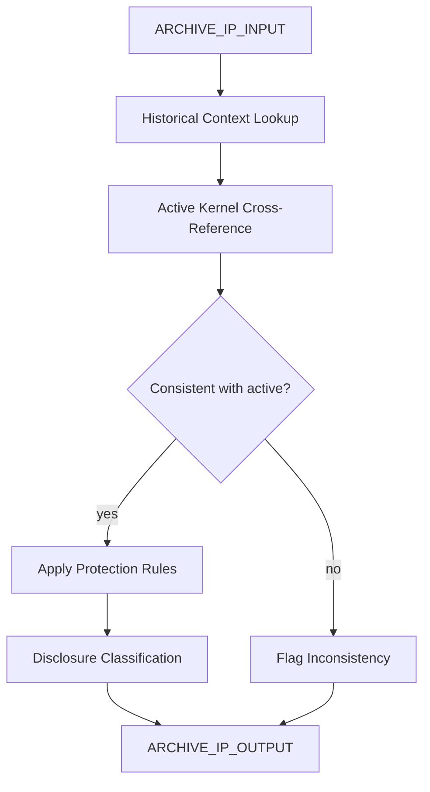

# IP Kernel Shield (Archive AMOS22)

> **Origin Architect / Steward:** Trang Phan
> **Epistemic Class:** `AMOS_MODEL`
> **Conclusion Class:** `DERIVED`
> **Status:** `ACTIVE_SPECIFICATION`
> **Governing Plane:** `11_KNOWLEDGE/kernel`

> [!WARNING] Historical archive -- content reconstructed from AMOS2 archive and cross-referenced with the active IP Shield Kernel.
> Original stub had no vault-sourced content. This specification is generated from the AMOS IP protection canon and the active [[11_KNOWLEDGE/kernel/AMOS_IP_SHIELD_KERNEL_V0_WEB7|IP Shield Kernel V0 Web7]].

---

## 1. Architectural Scope

The **IP Kernel Shield (Archive AMOS22)** is the archived predecessor specification for the IP protection layer within the AMOS OS. It was referenced in `AMOS_UNIVERSE_OS_vInfinity P4_reasoning_governance` but no full standalone spec existed in the vault at audit time (2026-08-26).

This archive exists to provide a **historical reference point** for the evolution of the IP Shield Kernel. The active specification is [[11_KNOWLEDGE/kernel/AMOS_IP_SHIELD_KERNEL_V0_WEB7|AMOS_IP_SHIELD_KERNEL_V0_WEB7]]. This archive documents the structural framework that the active kernel implements.

**Epistemic Boundary:**
```
MODEL != OBSERVATION
DOCUMENTED != IMPLEMENTED
CAPABILITY != AUTHORITY
ARCHIVE != ACTIVE
IP_SHIELD != SECURITY_GUARANTEE
```

**Reconstructed Scope (from AMOS2 archive context):**
1. **IP Protection Governance** -- Rules governing how AMOS intellectual property is protected from extraction
2. **Reasoning Governance (P4)** -- IP protection as part of the reasoning governance layer
3. **Disclosure Control** -- Classification of what may be shared, partially shared, or refused
4. **Agent Self-Reference Control** -- How agents describe themselves and the system externally

**Inputs:** `ARCHIVE_IP_INPUT{query_context, disclosure_request, agent_context}`
**Outputs:** `ARCHIVE_IP_OUTPUT{disclosure_classification, protection_rules_applied, historical_context}`

**Quality Axes:** Historical fidelity, cross-reference accuracy with active kernel, protection rule completeness, disclosure classification coverage.

---

## 2. Governing Invariants

| ID | Invariant | Description |
|----|-----------|-------------|
| INV-IP22-001 | Archive Status | This is an archive reference; the active spec is AMOS_IP_SHIELD_KERNEL_V0_WEB7 |
| INV-IP22-002 | No Contradiction with Active | Archive rules must not contradict the active IP Shield Kernel |
| INV-IP22-003 | Historical Fidelity | Reconstructed content must be labelled as reconstructed, not original |
| INV-IP22-004 | IP Protection Priority | IP protection rules have priority over other layers, consistent with active kernel |
| INV-IP22-005 | No Raw Internal Exposure | Same hard-forbidden rules as active kernel apply |
| INV-IP22-006 | Reasoning Governance Integration | IP protection is part of P4 reasoning governance |
| INV-IP22-007 | No Security Guarantee Claim | IP Shield is obfuscation and disclosure control, not cryptographic security |

---

## 3. Mathematical Formulation

**Archive-to-active consistency:**

$$\text{Consistent}(A_{\text{archive}}, A_{\text{active}}) = \neg \exists r \in A_{\text{archive}} : r \Rightarrow \neg r' \in A_{\text{active}}$$

**Disclosure classification (archived form):**

$$\text{Class}(c) = \begin{cases} \text{Forbidden} & \text{if } \text{InternalStructure}(c) \ge \theta \\ \text{Conditional} & \text{if } \text{PartialReconstructable}(c) \\ \text{Allowed} & \text{if } \text{NoInternalStructure}(c) \end{cases}$$

**Protection coverage:**

$$P_{\text{coverage}} = \frac{|\text{Protected}(\text{IP Assets})|}{|\text{IP Assets}|}$$

---

## 4. Architecture



---

## 5. MECE Mapping to AMOS Full Brain OS

| Component | AMOS Plane | Role |
|-----------|------------|------|
| Historical Context | `10_MEMORY` | Episodic memory |
| Active Kernel Cross-Reference | `11_KNOWLEDGE` | Knowledge verification |
| Protection Rules | `03_CONTROL_PLANE` | Control enforcement |
| Disclosure Classification | `03_CONTROL_PLANE` | Disclosure control |
| Inconsistency Flag | `17_OBSERVABILITY` | Consistency monitoring |

---

## 6. Safety Invariants & Firewalls

| ID | Firewall | Enforcement |
|----|----------|-------------|
| INV-IP22-FW-001 | Archive Label | Outputs must carry archive label, not active spec claim |
| INV-IP22-FW-002 | Active Kernel Priority | Conflicts resolved in favor of active kernel |
| INV-IP22-FW-003 | Reconstructed Label | Reconstructed content must be labelled |
| INV-IP22-FW-004 | No Security Guarantee | Must not claim cryptographic security |
| INV-IP22-FW-005 | IP Protection Priority | IP protection rules override other layer requests |

---

## 7. Navigation & Bindings

- **Parent MOC:** [[11_KNOWLEDGE/kernel/KERNEL_MOC|KERNEL_MOC]]
- **Active IP Shield Kernel:** [[11_KNOWLEDGE/kernel/AMOS_IP_SHIELD_KERNEL_V0_WEB7|AMOS_IP_SHIELD_KERNEL_V0_WEB7]]
- **IP Shield Archive AMOS23:** [[11_KNOWLEDGE/kernel/IP_KERNEL_SHIELD_ARCHIVE_AMOS23|IP_KERNEL_SHIELD_ARCHIVE_AMOS23]]
- **Sense Core Kernel:** [[11_KNOWLEDGE/kernel/SENSE_CORE_KERNEL|SENSE_CORE_KERNEL]]
- **Product Management Kernel:** [[11_KNOWLEDGE/kernel/AMOS_PRODUCT_MANAGEMENT_KERNEL_V0_TECH7_3|AMOS_PRODUCT_MANAGEMENT_KERNEL_V0_TECH7_3]]
- **HR Talent Kernel:** [[11_KNOWLEDGE/kernel/AMOS_HR_TALENT_KERNEL_V0|AMOS_HR_TALENT_KERNEL_V0]]
- **Revenue Architecture Kernel:** [[11_KNOWLEDGE/kernel/AMOS_REVENUE_ARCHITECTURE_KERNEL|AMOS_REVENUE_ARCHITECTURE_KERNEL]]
- **Cosmo Brain MOC:** [[00_ROOT/00_COSMO_BRAIN_MOC|00_COSMO_BRAIN_MOC]]
- **Core Laws:** [[01_CANON/01_CORE_LAWS/AMOS_CORE_LAWS|01_CORE_LAWS]]

---

## 8. Known Gaps & Falsifiers

| ID | Gap | Impact | Action |
|----|-----|--------|--------|
| GAP-IP22-001 | No original vault source | Content is reconstructed | Label all content as reconstructed |
| GAP-IP22-002 | P4 reasoning governance detail | Full P4 spec not available in vault | Flag P4 references as partial |
| GAP-IP22-003 | Archive-active drift | Archive may have diverged from active | Cross-reference with active kernel required |
| GAP-IP22-004 | Protection rule completeness | Reconstructed rules may be incomplete | Flag as partial coverage |

---

**Related:** [[11_KNOWLEDGE/kernel/SENSE_CORE_KERNEL|SENSE_CORE_KERNEL]] | [[11_KNOWLEDGE/kernel/AMOS_PRODUCT_MANAGEMENT_KERNEL_V0_TECH7_3|AMOS_PRODUCT_MANAGEMENT_KERNEL_V0_TECH7_3]] | [[11_KNOWLEDGE/kernel/AMOS_HR_TALENT_KERNEL_V0|AMOS_HR_TALENT_KERNEL_V0]] | [[11_KNOWLEDGE/kernel/AMOS_REVENUE_ARCHITECTURE_KERNEL|AMOS_REVENUE_ARCHITECTURE_KERNEL]] | [[00_ROOT/00_COSMO_BRAIN_MOC|00_COSMO_BRAIN_MOC]]

______________________________________________________________________

**MOC:** [[11_KNOWLEDGE/kernel/KERNEL_MOC|KERNEL_MOC]]
