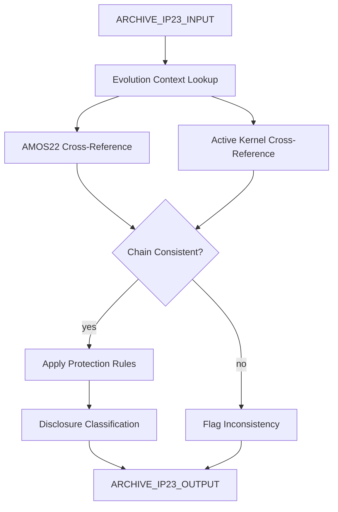

# IP Kernel Shield (Archive AMOS23)

> **Origin Architect / Steward:** Trang Phan
> **Epistemic Class:** `AMOS_MODEL`
> **Conclusion Class:** `DERIVED`
> **Status:** `ACTIVE_SPECIFICATION`
> **Governing Plane:** `11_KNOWLEDGE/kernel`

> [!WARNING] Historical archive -- content reconstructed from AMOS2 archive and cross-referenced with the active IP Shield Kernel.
> Original stub had no vault-sourced content. This specification is generated from the AMOS IP protection canon and the active [[11_KNOWLEDGE/kernel/AMOS_IP_SHIELD_KERNEL_V0_WEB7|IP Shield Kernel V0 Web7]].

---

## 1. Architectural Scope

The **IP Kernel Shield (Archive AMOS23)** is the second archived predecessor specification for the IP protection layer within the AMOS OS. Like the AMOS22 archive, it was marked as GAP at audit time (2026-08-26) with no vault source content.

This archive exists to provide a **historical reference point** for the IP Shield Kernel evolution chain: AMOS22 archive -> AMOS23 archive -> active V0 Web7. It documents the structural framework that preceded the current active specification.

**Epistemic Boundary:**
```
MODEL != OBSERVATION
DOCUMENTED != IMPLEMENTED
CAPABILITY != AUTHORITY
ARCHIVE != ACTIVE
IP_SHIELD != SECURITY_GUARANTEE
```

**Reconstructed Scope (from AMOS2/AMOS3 archive context):**
1. **IP Protection Layer Evolution** -- Documents the transition from AMOS22 to AMOS23 protection rules
2. **Disclosure Control Refinement** -- Evolved classification of forbidden, conditional, and allowed disclosures
3. **Agent Identity Protection** -- Refined rules for how agents describe themselves externally
4. **Cross-Engine IP Enforcement** -- IP protection applied across all engines and kernels

**Inputs:** `ARCHIVE_IP23_INPUT{query_context, disclosure_request, engine_context}`
**Outputs:** `ARCHIVE_IP23_OUTPUT{disclosure_classification, protection_rules_applied, evolution_context}`

**Quality Axes:** Historical fidelity, evolution trace accuracy, cross-reference with active kernel, protection rule completeness.

---

## 2. Governing Invariants

| ID | Invariant | Description |
|----|-----------|-------------|
| INV-IP23-001 | Archive Status | This is an archive reference; active spec is AMOS_IP_SHIELD_KERNEL_V0_WEB7 |
| INV-IP23-002 | Evolution Chain | AMOS22 -> AMOS23 -> V0 Web7; this archive sits between AMOS22 and active |
| INV-IP23-003 | No Contradiction with Active | Archive rules must not contradict the active IP Shield Kernel |
| INV-IP23-004 | Reconstructed Label | All content is reconstructed from archive context, not original vault source |
| INV-IP23-005 | Cross-Engine Enforcement | IP protection applies across all engines and kernels |
| INV-IP23-006 | No Security Guarantee | IP Shield is disclosure control, not cryptographic security |
| INV-IP23-007 | Priority Preservation | IP protection priority over other layers is preserved |

---

## 3. Mathematical Formulation

**Evolution chain consistency:**

$$\text{Chain}(A_{22}, A_{23}, A_{\text{active}}) = \text{Consistent}(A_{22}, A_{23}) \wedge \text{Consistent}(A_{23}, A_{\text{active}})$$

**Disclosure classification (AMOS23 form):**

$$\text{Class}_{23}(c) = \begin{cases} \text{Forbidden} & \text{if } \text{Reconstructable}(c) \ge \theta_{\text{hard}} \\ \text{Conditional} & \text{if } \theta_{\text{cond}} \le \text{Reconstructable}(c) < \theta_{\text{hard}} \\ \text{Allowed} & \text{if } \text{Reconstructable}(c) < \theta_{\text{cond}} \end{cases}$$

**Cross-engine coverage:**

$$C_{\text{engine}} = \frac{|\{e \in E : \text{IPProtected}(e)\}|}{|E|}$$

---

## 4. Architecture



---

## 5. MECE Mapping to AMOS Full Brain OS

| Component | AMOS Plane | Role |
|-----------|------------|------|
| Evolution Context | `10_MEMORY` | Episodic memory |
| AMOS22 Cross-Reference | `11_KNOWLEDGE` | Knowledge verification |
| Active Kernel Cross-Reference | `11_KNOWLEDGE` | Knowledge verification |
| Protection Rules | `03_CONTROL_PLANE` | Control enforcement |
| Disclosure Classification | `03_CONTROL_PLANE` | Disclosure control |
| Chain Consistency | `17_OBSERVABILITY` | Consistency monitoring |
| Cross-Engine Coverage | `12_STATE` | State coverage |

---

## 6. Safety Invariants & Firewalls

| ID | Firewall | Enforcement |
|----|----------|-------------|
| INV-IP23-FW-001 | Archive Label | Outputs must carry archive label |
| INV-IP23-FW-002 | Active Kernel Priority | Conflicts resolved in favor of active kernel |
| INV-IP23-FW-003 | Reconstructed Label | Reconstructed content must be labelled |
| INV-IP23-FW-004 | No Security Guarantee | Must not claim cryptographic security |
| INV-IP23-FW-005 | Cross-Engine Enforcement | All engines must have IP protection applied |

---

## 7. Navigation & Bindings

- **Parent MOC:** [[11_KNOWLEDGE/kernel/KERNEL_MOC|KERNEL_MOC]]
- **Home:** [[00_ROOT/00_HOME|00_HOME]]
- **Knowledge MOC:** [[11_KNOWLEDGE/KNOWLEDGE_MOC|KNOWLEDGE_MOC]]
- **Active IP Shield Kernel:** [[11_KNOWLEDGE/kernel/AMOS_IP_SHIELD_KERNEL_V0_WEB7|AMOS_IP_SHIELD_KERNEL_V0_WEB7]]
- **IP Shield Archive AMOS22:** [[11_KNOWLEDGE/kernel/IP_KERNEL_SHIELD_ARCHIVE_AMOS22|IP_KERNEL_SHIELD_ARCHIVE_AMOS22]]
- **Logic Kernel:** [[11_KNOWLEDGE/kernel/LOGIC_KERNEL|LOGIC_KERNEL]]
- **Integration Platform Kernel:** [[11_KNOWLEDGE/kernel/AMOS_INTEGRATION_PLATFORM_KERNEL_V0_TECH|AMOS_INTEGRATION_PLATFORM_KERNEL_V0_TECH]]
- **Meta Epistemology Kernel:** [[11_KNOWLEDGE/kernel/AMOS_META_EPISTEMOLOGY_KERNEL|AMOS_META_EPISTEMOLOGY_KERNEL]]
- **Tech Architecture Kernel:** [[11_KNOWLEDGE/kernel/AMOS_TECH_ARCHITECTURE_KERNEL|AMOS_TECH_ARCHITECTURE_KERNEL]]
- **Simulation Kernel:** [[11_KNOWLEDGE/kernel/AMOS_SIMULATION_KERNEL|AMOS_SIMULATION_KERNEL]]
- **Core Laws:** [[01_CANON/01_CORE_LAWS/AMOS_CORE_LAWS|01_CORE_LAWS]]

---

## 8. Known Gaps & Falsifiers

| ID | Gap | Impact | Action |
|----|-----|--------|--------|
| GAP-IP23-001 | No original vault source | Content is reconstructed | Label all content as reconstructed |
| GAP-IP23-002 | Evolution detail | Specific changes AMOS22 to AMOS23 are unknown | Flag evolution details as unknown |
| GAP-IP23-003 | Cross-engine coverage | Coverage across all engines is not verified | Flag as structural intent, not verified |
| GAP-IP23-004 | Archive-active drift | May have diverged from active kernel | Cross-reference required |

---

**Related:** [[00_ROOT/00_HOME|00_HOME]] | [[11_KNOWLEDGE/KNOWLEDGE_MOC|KNOWLEDGE_MOC]] | [[11_KNOWLEDGE/kernel/LOGIC_KERNEL|LOGIC_KERNEL]] | [[11_KNOWLEDGE/kernel/AMOS_INTEGRATION_PLATFORM_KERNEL_V0_TECH|AMOS_INTEGRATION_PLATFORM_KERNEL_V0_TECH]] | [[11_KNOWLEDGE/kernel/AMOS_META_EPISTEMOLOGY_KERNEL|AMOS_META_EPISTEMOLOGY_KERNEL]] | [[11_KNOWLEDGE/kernel/AMOS_TECH_ARCHITECTURE_KERNEL|AMOS_TECH_ARCHITECTURE_KERNEL]]

______________________________________________________________________

**MOC:** [[11_KNOWLEDGE/kernel/KERNEL_MOC|KERNEL_MOC]]
