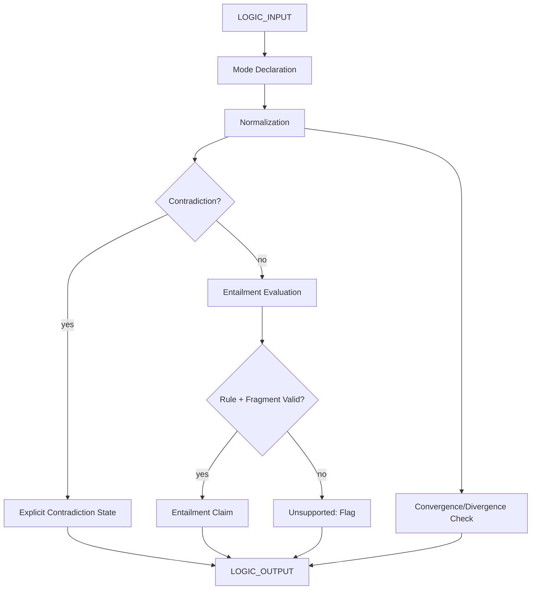

# Deterministic Logic Kernel

> **Origin Architect / Steward:** Trang Phan
> **Epistemic Class:** `AMOS_MODEL`
> **Conclusion Class:** `DERIVED`
> **Status:** `ACTIVE_SPECIFICATION`
> **Governing Plane:** `11_KNOWLEDGE/kernel`

---

## 1. Architectural Scope

The **Deterministic Logic Kernel** defines the core logical objects, inference rules, and normalization procedures for all logic operations within the AMOS OS. It provides a multi-mode logic system that supports positive, negative, zero, dual, and meta logic modes, with explicit contradiction preservation and entailment verification.

This kernel exists to provide the **logical reasoning substrate** for all AMOS operations. It enforces deterministic normalization, explicit contradiction handling, and the separation of syntactic normalization from semantic entailment.

**Epistemic Boundary:**
```
MODEL != OBSERVATION
DOCUMENTED != IMPLEMENTED
CAPABILITY != AUTHORITY
SYNTACTIC_NORMALIZATION != SEMANTIC_ENTAILMENT
META_LOGIC != CLASSICAL_TRUTH
```

**Core Logical Objects:**
`ATOM, NOT, AND, OR, IMPLIES, BOTTOM, PARADOX`

**Logic Modes:**
`positive | negative | zero | dual | multi | meta`

**Convergence/Divergence Forms:**
The kernel distinguishes between convergent reasoning paths (multiple paths reach the same conclusion) and divergent paths (same starting point yields different conclusions under different modes).

**Inputs:** `LOGIC_INPUT{propositions[], inference_rules[], mode, premises[]}`
**Outputs:** `LOGIC_OUTPUT{normalized_form, entailment_claims[], contradiction_states[], mode_result}`

**Computational Guarantees:** Deterministic normalization for equivalent supported inputs, explicit contradiction preservation, tested propositional behavior within verified fragments only.

---

## 2. Governing Invariants

| ID | Invariant | Description |
|----|-----------|-------------|
| INV-LK-001 | Deterministic Normalization | Equivalent supported inputs must normalize to the same form |
| INV-LK-002 | Contradiction Preservation | Contradictions must be represented explicitly, not silently repaired |
| INV-LK-003 | Syntax-Semantics Separation | Syntactic normalization must be distinguished from semantic entailment |
| INV-LK-004 | No Classical Truth Inference | Do not infer classical truth from unsupported meta-logic operators |
| INV-LK-005 | Verified Fragment Only | Use tested propositional behavior only within its verified fragment |
| INV-LK-006 | Entailment Completeness | Entailment claims require premises + inference rule + applicable logic fragment |
| INV-LK-007 | Mode Declaration | Logic mode must be declared before evaluation |

---

## 3. Mathematical Formulation

**Normalization:**

$$\text{Norm}(p_1) = \text{Norm}(p_2) \quad \text{if } p_1 \equiv p_2 \text{ (equivalent supported inputs)}$$

**Contradiction representation:**

$$\text{Contra}(p) = \{p, \neg p\} \quad \text{(explicit contradiction state, not repaired)}$$

**Entailment:**

$$\Gamma \models \phi \quad \text{requires} \quad \Gamma \neq \emptyset \wedge \exists r \in \text{Rules} : r(\Gamma) = \phi \wedge \text{Fragment}(r) \in \text{Verified}$$

**Convergence:**

$$\text{Convergent}(\pi_1, \pi_2) = \text{Conclusion}(\pi_1) = \text{Conclusion}(\pi_2)$$

**Divergence:**

$$\text{Divergent}(\pi_1, \pi_2) = \text{Premises}(\pi_1) = \text{Premises}(\pi_2) \wedge \text{Conclusion}(\pi_1) \neq \text{Conclusion}(\pi_2)$$

**Mode applicability:**

$$\text{Valid}(r, m) = r \in \text{Rules}(m) \wedge m \in \{\text{positive, negative, zero, dual, multi, meta}\}$$

---

## 4. Architecture



---

## 5. MECE Mapping to AMOS Full Brain OS

| Kernel Component | AMOS Plane | Role |
|------------------|------------|------|
| Mode Declaration | `03_CONTROL_PLANE` | Mode routing |
| Normalization | `04_RUNTIME` | Normalization execution |
| Contradiction Handling | `12_STATE` | State representation |
| Entailment Evaluation | `06_INTELLIGENCE` | Inference reasoning |
| Convergence/Divergence | `17_OBSERVABILITY` | Path monitoring |
| Fragment Verification | `16_SCHEMAS` | Schema verification |
| Unsupported Flag | `17_OBSERVABILITY` | Alert generation |

---

## 6. Safety Invariants & Firewalls

| ID | Firewall | Enforcement |
|----|----------|-------------|
| INV-LK-FW-001 | No Silent Contradiction Repair | Silent contradiction repair is blocked |
| INV-LK-FW-002 | No Unsupported Classical Truth | Inferring classical truth from unsupported operators is blocked |
| INV-LK-FW-003 | Fragment Boundary | Operations outside verified fragments are blocked |
| INV-LK-FW-004 | Entailment Completeness | Entailment without premises + rule + fragment is blocked |
| INV-LK-FW-005 | Mode Required | Operations without declared mode are blocked |

---

## 7. Navigation & Bindings

- **Parent MOC:** [[11_KNOWLEDGE/kernel/KERNEL_MOC|KERNEL_MOC]]
- **Home:** [[00_ROOT/00_HOME|00_HOME]]
- **Knowledge MOC:** [[11_KNOWLEDGE/KNOWLEDGE_MOC|KNOWLEDGE_MOC]]
- **OS Integrated Agent Kernel:** [[11_KNOWLEDGE/kernel/AMOS_OS_INTEGRATED_AGENT_KERNEL|AMOS_OS_INTEGRATED_AGENT_KERNEL]]
- **BizFin Kernel:** [[11_KNOWLEDGE/kernel/AMOS_BIZFIN_KERNEL_V0|AMOS_BIZFIN_KERNEL_V0]]
- **Policy Design Kernel:** [[11_KNOWLEDGE/kernel/AMOS_POLICY_DESIGN_KERNEL_V0_GOVERNANCE_RISK|AMOS_POLICY_DESIGN_KERNEL_V0_GOVERNANCE_RISK]]
- **Forex Packages UKR Kernel:** [[11_KNOWLEDGE/kernel/AMOS_FOREX_PACKAGES_UKR_RECURSIVE_KERNEL|AMOS_FOREX_PACKAGES_UKR_RECURSIVE_KERNEL]]
- **Cognition Kernel:** [[11_KNOWLEDGE/kernel/COGNITION_KERNEL|COGNITION_KERNEL]]
- **Cognition Engine:** [[11_KNOWLEDGE/engine/COGNITION_ENGINE_MODEL|COGNITION_ENGINE_MODEL]]
- **Simulation Kernel:** [[11_KNOWLEDGE/kernel/AMOS_SIMULATION_KERNEL|AMOS_SIMULATION_KERNEL]]
- **Core Laws:** [[01_CANON/01_CORE_LAWS/AMOS_CORE_LAWS|01_CORE_LAWS]]

---

## 8. Known Gaps & Falsifiers

| ID | Gap | Impact | Action |
|----|-----|--------|--------|
| GAP-LK-001 | Fragment coverage | Not all logical operators may be in verified fragments | Flag operations outside verified fragments |
| GAP-LK-002 | Meta-logic semantics | Meta-logic operators may not have classical semantics | Flag meta-logic as non-classical |
| GAP-LK-003 | Multi-mode interaction | Interactions between logic modes are not fully characterized | Flag cross-mode operations |
| GAP-LK-004 | Paradox handling | PARADOX object semantics may be underspecified | Flag paradox states for manual review |

---

**Related:** [[00_ROOT/00_HOME|00_HOME]] | [[11_KNOWLEDGE/KNOWLEDGE_MOC|KNOWLEDGE_MOC]] | [[11_KNOWLEDGE/kernel/AMOS_OS_INTEGRATED_AGENT_KERNEL|AMOS_OS_INTEGRATED_AGENT_KERNEL]] | [[11_KNOWLEDGE/kernel/AMOS_BIZFIN_KERNEL_V0|AMOS_BIZFIN_KERNEL_V0]] | [[11_KNOWLEDGE/kernel/AMOS_POLICY_DESIGN_KERNEL_V0_GOVERNANCE_RISK|AMOS_POLICY_DESIGN_KERNEL_V0_GOVERNANCE_RISK]] | [[11_KNOWLEDGE/kernel/AMOS_FOREX_PACKAGES_UKR_RECURSIVE_KERNEL|AMOS_FOREX_PACKAGES_UKR_RECURSIVE_KERNEL]]

______________________________________________________________________

**MOC:** [[11_KNOWLEDGE/kernel/KERNEL_MOC|KERNEL_MOC]]
