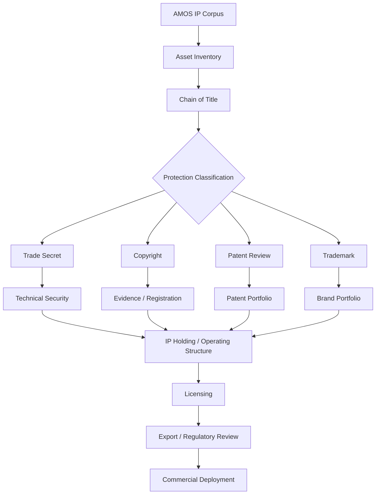
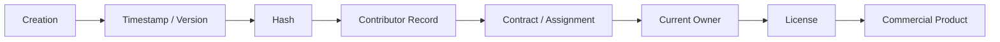

---
tags:
- knowledge
- trang
- absolute
- protection
- plan
- phan.md
- phan
---

# ABSOLUTE IP PROTECTION PLAN FOR TRANG PHAN

## AMOS Canon · Scientific Law System · Operating System · Programming Paradigm · Frameworks · Algorithms · Equations

> [!important] Epistemic and legal boundary
> This expansion preserves the uploaded AMOS corpus artifact as **SOURCE_CLAIM**. It is an IP-governance model and planning document, **not jurisdiction-specific legal advice**. Statements in the source such as “strongest shield,” “highest possible protection,” company-location superiority, automatic coverage, patentability, export-control applicability, and comparisons with named organizations require independent legal/factual verification before action. The uploaded source itself is the controlling basis for this expansion.

---

# PART I — NORMALIZED SOURCE METADATA

## 1. Normalized Source Frontmatter

The block below preserves the supplied source metadata without silently adding inferred aliases, governance fields, or expanded tags.

```yaml
---
title: ABSOLUTE IP PROTECTION PLAN FOR TRANG PHAN

tags:
  - trang
  - framework
  - reality
  - canon/knowledge

type: document
source: 11_KNOWLEDGE/trang

rscf:
  state: SOURCE_CLAIM
  claim_class: SOURCE_CLAIM
  provenance: AMOS_corpus
  scope: AMOS_knowledge
---
```

---

# PART II — DERIVED / PROPOSED OBSIDIAN AUGMENTATION

The following metadata is **DERIVED / PROPOSED** for vault organization. It was **not** present in the supplied frontmatter.

```yaml
# DERIVED / PROPOSED — DO NOT TREAT AS ORIGINAL SOURCE FRONTMATTER

aliases:
  - Absolute IP Protection Plan
  - AMOS IP Protection Plan
  - Trang Phan IP Protection Strategy
  - AMOS Intellectual Property Governance
  - AMOS IP Governance Stack

proposed_artifact_id:
  amos_absolute_ip_protection_plan_for_trang_phan

proposed_artifact_kind:
  IP_GOVERNANCE_PLAN

proposed_domain:
  intellectual_property_governance

proposed_epistemic_boundary:
  source_document: SOURCE_CLAIM
  legal_recommendations: REQUIRES_JURISDICTIONAL_VALIDATION
  technical_security_recommendations: MODEL
  corporate_structuring_recommendations: REQUIRES_TAX_LEGAL_VALIDATION
  export_control_recommendations: REQUIRES_SPECIALIST_VALIDATION
  factual_comparisons_to_named_organizations: UNVERIFIED_SOURCE_CLAIM

proposed_raw_source_policy:
  DO_NOT_LOAD_UNLESS_REQUIRED

proposed_tags:
  - intellectual-property
  - ip-governance
  - trade-secret
  - copyright
  - patent
  - trademark
  - licensing
  - export-control
  - corporate-structure
  - information-security
  - provenance
  - chain-of-title
  - confidentiality
  - commercialization
  - risk-governance
  - legal-validation-required
  - rscf/node
  - topic/ip-protection
  - topic/trade-secrets
  - topic/patents
  - topic/licensing
```

---

# 2. Canonical Identity

**Title:** `ABSOLUTE IP PROTECTION PLAN FOR TRANG PHAN`

**Source plane:**

```text
11_KNOWLEDGE/trang
```

**Source epistemic class:**

```text
SOURCE_CLAIM
```

**Source provenance:**

```text
AMOS_corpus
```

**Source scope:**

```text
AMOS_knowledge
```

The document describes a proposed multi-layer protection architecture for an AMOS-related body of intellectual assets attributed by the source to **Trang Phan**.

Its protected-asset universe includes, according to the source:

* AMOS Absolute Meta OS;
* Bio-Logical Intelligence Systems;
* Quantum Logic Systems (`QLS`);
* a claimed Unified Deterministic Law Corpus;
* scientific frameworks;
* deterministic AI programming methods;
* operating-system-level algorithms;
* equations;
* tensors;
* operators;
* kernels;
* enterprise architectures;
* national-scale system designs;
* associated documentation and commercial implementations.

---

# 3. Source Claim vs Verified Legal Position

The artifact contains several classes of statements that must remain distinct.

| Statement type                                     | Safe class                                    |
| -------------------------------------------------- | --------------------------------------------- |
| “The document recommends X”                        | `VERIFIED` relative to supplied source        |
| Asset counts stated in the document                | `SOURCE_CLAIM`                                |
| Trang Phan ownership/authorship assertion          | `SOURCE_CLAIM` within this artifact           |
| Particular material is copyrightable               | `CONDITIONAL / LEGAL_VALIDATION_REQUIRED`     |
| Particular algorithm is patentable                 | `CONDITIONAL / LEGAL_VALIDATION_REQUIRED`     |
| Trade-secret treatment is available                | `CONDITIONAL / FACT_SPECIFIC`                 |
| A jurisdiction is “strongest”                      | `UNVERIFIED_SOURCE_CLAIM`                     |
| Export controls apply                              | `CONDITIONAL / SPECIALIST_REVIEW_REQUIRED`    |
| Named organizations use the “exact same shield”    | `UNVERIFIED_SOURCE_CLAIM`                     |
| AMOS is more original/broader than conventional AI | `SOURCE_CLAIM`, not independently established |

This distinction is load-bearing.

The IP plan should not convert:

$$
SourceAssertion
$$

into:

$$
VerifiedLegalConclusion
$$

without jurisdiction-specific evidence.

---

# 4. Central Protection Thesis

The source proposes a defense-in-depth IP model rather than reliance on one legal mechanism.

Its major layers are:

```text
                    IP ASSET
                       │
       ┌───────────────┼───────────────┐
       │               │               │
       ▼               ▼               ▼
 TRADE SECRET       COPYRIGHT        PATENT
       │               │               │
       └───────────────┼───────────────┘
                       │
                       ▼
                   TRADEMARK
                       │
                       ▼
              TECHNICAL SECURITY
                       │
                       ▼
              CORPORATE OWNERSHIP
                       │
                       ▼
                   LICENSING
                       │
                       ▼
                EXPORT CONTROL
                       │
                       ▼
             CONTRACTUAL CONTROLS
                       │
                       ▼
              SECURITY GOVERNANCE
```

The underlying design principle is sound as an **IP-governance model**:

$$
Protection
=
Legal
+
Contractual
+
Technical
+
Operational
+
Corporate
+
Provenance
$$

But the exact implementation of each layer remains jurisdiction- and asset-dependent.

---

# 5. Core Integrity Law

The strongest derived AMOS-compatible principle is:

$$
\boxed{
Protectability
\neq
Ownership
\neq
Validity
\neq
Enforceability
}
$$

These are separate questions.

A work may exist without being protectable by a particular right.

A protectable work may have disputed ownership.

An issued or registered right may have validity limits.

A valid right may still face practical enforcement constraints.

---

# 6. Asset Inventory

The source divides the protected corpus into five broad families.

```text
A1 Scientific Assets
A2 AMOS OS Architecture
A3 Programming Paradigm
A4 Framework Library
A5 Commercial Assets
```

This inventory is the logical beginning of an IP program because legal protection depends on **what the asset actually is**.

---

# 7. Core Scientific Assets

The source asserts:

* `400,000–800,000` deterministic laws;
* `7,000–12,000` equations;
* `14,000` tensors;
* operators;
* invariants;
* canonical rules;
* quantum-to-civilizational models;
* cognition kernels;
* emotional and behavioral state machines;
* prediction and synchronization models.

These numerical counts are **SOURCE_CLAIM**.

They should not be represented as independently audited corpus counts.

---

# 8. Asset Counts Require a Manifest

A mature IP program should convert corpus-scale claims into an evidence-backed manifest.

Proposed structure:

```yaml
asset_manifest:
  asset_id: null
  title: null
  asset_class: null
  author: null
  creation_date: null
  version: null
  hash: null
  repository_path: null
  publication_state: null
  disclosure_history: []
  contributors: []
  assignment_status: null
  third_party_dependencies: []
  license_dependencies: []
  trade_secret_status: null
  patent_review_status: null
  copyright_review_status: null
  trademark_review_status: null
  provenance_receipt: null
```

This is **PROPOSED**, not supplied source schema.

---

# 9. Why the Manifest Is Load-Bearing

A claim such as:

```text
"We own 14,000 tensors"
```

is materially weaker than an inventory establishing:

```text
Tensor ID
Creation timestamp
Author
Version
Hash
Repository lineage
Contributor history
Disclosure history
Third-party dependencies
Assignment status
```

Therefore:

$$
CorpusSize
\neq
ChainOfTitle
$$

---

# 10. AMOS OS Architecture Assets

The source identifies:

* GODMODE and OMEGA pipelines;
* deterministic reasoning engine;
* audit chain;
* reconstruction engine;
* anti-drift framework;
* identity-boundary logic;
* world-model fusion;
* workflow automation;
* routing and entanglement graph engine;
* OS kernel logic.

Within this IP artifact, these are **claimed protected assets**.

Their existence, implementation status, originality, protectability, and ownership must be evaluated asset-by-asset rather than inferred from their names.

---

# 11. Programming-Paradigm Assets

The source lists:

```text
biological-computational operators
deterministic programming rules
meta-architecture
syntax and transformation rules
execution-chain model
```

A critical IP distinction follows:

```text
abstract idea
≠
specific expression
≠
specific implementation
≠
patentable invention
≠
trade secret
```

One conceptual asset may contain several separately protectable layers.

---

# 12. Framework Library

Source examples include:

* UBI — Unified Biological Intelligence;
* Human Systems Engine;
* Quantum Logical Systems;
* Directed Systemic Intelligence;
* emotional mathematics;
* somatic collapse models;
* governance and national-risk systems.

The source claims a library of more than 100 frameworks.

Again:

$$
>100\ frameworks
$$

remains a corpus claim unless reconciled against an authoritative inventory.

---

# 13. Commercial Assets

The source identifies:

```text
enterprise architectures
national OS designs
mobility/energy systems
digital infrastructure designs
security governance models
```

These assets may require a different protection mix from foundational scientific documents.

---

# 14. Asset Classification Matrix

A derived working matrix:

| Asset                 |                             Trade secret |              Copyright |         Patent review |        Trademark | Contract |
| --------------------- | ---------------------------------------: | ---------------------: | --------------------: | ---------------: | -------: |
| Source code           |                           High candidate |         High candidate |             Sometimes |              Low |     High |
| Internal algorithm    |                                     High |   Expression-dependent |             Potential |              Low |     High |
| Equation              |                        Context-dependent |        Limited/complex | Application-dependent |               No |     High |
| Framework text        |                           High if secret |     Stronger candidate |             Sometimes | Name may qualify |     High |
| Architecture diagram  |                           High if secret |              Candidate |             Sometimes |               No |     High |
| Brand name            |                                      Low | Usually not main route |                    No |             High |   Medium |
| Dataset               |                                     High |          Fact-specific |                  Rare |               No |     High |
| Model weights         |                                     High | Jurisdiction-dependent |             Potential |               No |     High |
| Confidential know-how |                                Very high |               Variable |             Potential |               No |     High |
| Public specification  | Trade secrecy lost for disclosed content |              Candidate |      Timing-sensitive |         Possible |   Medium |

**DERIVED planning model; legal review required.**

---

# 15. Protection Is Asset-Specific

The source sometimes presents IP mechanisms broadly.

A safer canonical formulation is:

$$
ProtectionStrategy(a)
=
f(
AssetType,
Jurisdiction,
DisclosureState,
Novelty,
Authorship,
Ownership,
CommercialNeed,
ReverseEngineeringRisk
)
$$

There is no universal protection mechanism for every AMOS asset.

---

# PART III — TRADE SECRET GOVERNANCE

# 16. Trade Secret as Primary Shield

The source calls trade-secret protection the:

```text
PRIMARY SHIELD
```

for:

* canon;
* OS;
* algorithms;
* kernels;
* equations;
* methods.

This should be interpreted as the source's strategic recommendation, not a universal legal ranking.

---

# 17. Source-Proposed Trade Secret Controls

The artifact proposes:

* no cloud synchronization;
* encrypted offline master storage;
* multi-tier access control;
* self-hosted private Git;
* offline replication;
* hardware-token-based decryption;
* strict NDAs;
* compartmentalization;
* access audit logs;
* secure operator environment.

---

# 18. Trade Secret Core Model

A derived conceptual model:

$$
TradeSecretViability
=
Secrecy
\land
EconomicValue
\land
ReasonableProtectionMeasures
$$

The exact statutory formulation varies by jurisdiction.

Therefore legal counsel must determine whether each asset satisfies the relevant test.

---

# 19. Secrecy State

Every sensitive asset should have an explicit state.

```yaml
secrecy:
  state:
    - SECRET
    - RESTRICTED
    - PARTNER_CONFIDENTIAL
    - PATENT_PENDING_DISCLOSURE
    - PUBLIC
  disclosure_log: []
```

Once material is publicly disclosed, trade-secret protection for the disclosed information may be impaired or lost depending on circumstances.

---

# 20. Trade Secret ≠ Merely Calling Something Secret

$$
Label("CONFIDENTIAL")
\not\Rightarrow
TradeSecretEstablished
$$

The operational behavior surrounding the asset matters.

---

# 21. Compartmentalization

The source explicitly recommends restricted disclosure.

A stronger derived model is:

```text
Master Canon
   │
   ├── Kernel Compartment
   ├── Algorithm Compartment
   ├── Research Compartment
   ├── Commercial Compartment
   ├── Partner Compartment
   └── Public Documentation
```

No user receives broader access merely because they need one downstream artifact.

---

# 22. Least-Privilege Principle

$$
Access(u,a)
=
MinimumNecessary(u,a)
$$

not:

$$
Access(u,a)
=
EverythingBecauseTrusted(u)
$$

This is simultaneously a cybersecurity and trade-secret governance principle.

---

# 23. Need-to-Know

A person may be authorized to work for an organization while still not requiring access to the core canon.

```text
employment
≠
need-to-know
```

---

# 24. Access Receipt

Proposed:

```yaml
access_receipt:
  actor_id: null
  asset_id: null
  reason: null
  authorization: null
  access_started: null
  access_ended: null
  device: null
  confidentiality_terms: null
  export_control_check: null
  hash_or_version: null
```

---

# 25. Cloud-Sync Claim Requires Nuance

The source recommends:

```text
zero cloud sync
```

That is a security posture, not a universal legal requirement.

A more precise model is:

```text
highly sensitive master corpus
→ offline / tightly controlled storage preferred

lower-sensitivity operational artifacts
→ risk-assessed managed infrastructure may be possible
```

Exact architecture depends on threat model and business requirements.

---

# 26. Encryption

The source specifies:

```text
AES-256
```

Encryption is useful, but:

$$
Encryption
\neq
CompleteSecurity
$$

Key custody, endpoint security, recovery, access control, logging, backups, and insider controls remain load-bearing.

---

# 27. Key Governance

A protected vault with poorly managed keys remains vulnerable.

Derived controls:

```text
key generation
key storage
key rotation
key revocation
recovery
multi-party emergency access
device binding
audit
```

---

# 28. Hardware Token

The source mentions YubiKey.

This should be interpreted as an example of a hardware-backed authentication/decryption control rather than canonically requiring one specific vendor.

---

# 29. Private Git

Source recommendation:

```text
private git server
self-hosted
offline replication
```

The IP value is not Git itself.

The important functions are:

```text
version lineage
authorship evidence
change history
integrity
rollback
controlled access
```

---

# 30. Signed Commit History

Source recommends:

```text
hashed and signed commit logs
```

This can support integrity and chronology.

But:

$$
SignedCommit
\not\Rightarrow
LegalOwnership
$$

and:

$$
Hash
\not\Rightarrow
Originality
$$

---

# 31. Cryptographic Receipt Boundary

A cryptographic receipt can establish that a particular byte sequence existed within a particular evidence chain.

It does not independently establish:

```text
authorship
inventorship
novelty
copyrightability
patentability
truth
commercial ownership
```

Those require additional evidence.

---

# 32. Insider Risk

The source identifies insider theft as a threat.

A complete lifecycle should cover:

```text
BEFORE ACCESS
DURING ACCESS
AFTER ACCESS
```

---

# 33. Onboarding Controls

Before access:

* confidentiality agreement;
* IP assignment review;
* role classification;
* least privilege;
* device enrollment;
* export/sanctions screening where required;
* security briefing;
* repository access receipt.

---

# 34. Active-Access Controls

During access:

* logging;
* compartmentalization;
* download restrictions;
* copy controls where proportionate;
* anomaly detection;
* periodic access review;
* confidentiality marking;
* controlled external disclosure.

---

# 35. Offboarding Controls

After access ends:

```text
revoke credentials
revoke keys
remove repository access
return devices/materials
confirm deletion/return obligations
preserve audit evidence
remind continuing confidentiality obligations
```

---

# 36. Trade Secret Proof Capsule

```yaml
claim:
  asset: null
  claim_class: CONFIDENTIAL_IP

premises:
  - asset_has_not_been_authorized_for_public_disclosure
  - access_is_restricted
  - protection_measures_are_operational

evidence:
  - access_logs
  - confidentiality_agreements
  - repository_history
  - encryption_policy
  - disclosure_register

scope:
  jurisdiction: null

falsifiers:
  - authorized_public_disclosure
  - uncontrolled_distribution
  - legal_finding_secret_status_not_met

confidence_ceiling:
  LEGAL_REVIEW_REQUIRED
```

---

# PART IV — COPYRIGHT

# 37. Source Copyright Strategy

The source recommends copyright protection for:

* written canon;
* diagrams;
* OS design;
* documentation;
* code;
* architecture specifications.

It references Australia, the United States, the European Union, and Berne Convention coverage.

These statements require jurisdiction-specific normalization.

---

# 38. Copyright Protects Expression, Not Everything Described

A central firewall:

$$
Idea
\neq
Expression
$$

Copyright generally focuses on original expression rather than ownership of abstract ideas, systems, methods, mathematical facts, or scientific truths as such.

Exact boundaries vary by jurisdiction.

---

# 39. Equations Require Special Caution

The source broadly says copyright covers equations.

That is too categorical for safe canonical treatment.

A better classification is:

```text
equation as mathematical relation
→ protectability uncertain / often limited

specific explanatory text
→ potentially copyrightable

specific diagram / arrangement
→ potentially copyrightable

software implementation
→ potentially copyrightable

novel technical application
→ possible patent review
```

Therefore:

$$
Equation
\not\Rightarrow
AutomaticallyExclusiveCopyrightRight
$$

---

# 40. Framework Protection

A framework can contain several layers:

```text
name
text
diagram
taxonomy
software
data
method
implementation
know-how
```

Different layers may use different protection mechanisms.

---

# 41. Copyright Registration vs Copyright Existence

The source says to “register copyright” in several jurisdictions.

This requires jurisdiction-specific correction before execution because registration systems and legal effects differ.

Do not assume:

```text
registration procedure
```

is identical in Australia, the US, and EU member states.

---

# 42. Berne Convention Claim

The source states automatic coverage across `179 countries`.

Treat the exact count and legal effect as **TIME-SENSITIVE SOURCE_CLAIM**.

The stable principle is that international copyright protection is influenced by treaty relationships, but enforcement remains jurisdiction-specific.

---

# 43. Copyright Evidence Package

For each major work, preserve:

```yaml
copyright_evidence:
  work_id: null
  title: null
  author: null
  creation_date: null
  first_publication_date: null
  first_publication_country: null
  versions: []
  hashes: []
  source_files: []
  contributors: []
  employment_or_assignment_basis: null
  third_party_materials: []
  registration_records: []
```

---

# 44. Authorship ≠ Ownership

This distinction is critical.

$$
Author
\neq
Owner
$$

in every circumstance.

Employment agreements, assignments, contractor arrangements, joint authorship, and jurisdictional rules may alter ownership.

---

# 45. Chain of Title

For commercialization, the relevant question is not merely:

```text
Who created it?
```

but:

```text
Who owns which rights now,
under what instrument,
for which territory,
for which versions,
subject to which third-party rights?
```

---

# PART V — PATENTS

# 46. Source Patent Strategy

The source proposes strategic patenting for inventions that must be publicly exposed for commercialization.

Candidates named include:

* deterministic reasoning engine;
* drift-prevention engine;
* audit reconstruction system;
* cognition kernel and routing engine;
* biological-computational programming paradigm;
* entanglement graph routing;
* multi-domain inference engine.

These are **patent candidates**, not patentability conclusions.

---

# 47. Patentability Firewall

$$
InventiveName
\not\Rightarrow
PatentableInvention
$$

A candidate must be evaluated against applicable requirements such as:

```text
eligible subject matter
novelty
inventive step / non-obviousness
utility / industrial applicability
enablement / sufficiency
clarity
inventorship
prior art
```

depending on jurisdiction.

---

# 48. Software Patent Risk

Software and algorithmic inventions can face substantial eligibility and patentability differences across jurisdictions.

Therefore:

```text
algorithm
→ patent review
```

not:

```text
algorithm
→ patent
```

---

# 49. Mathematical-Method Firewall

A mathematical formula by itself and a technical implementation using mathematics are not necessarily treated identically.

Patent counsel must determine whether a claimed invention has legally sufficient technical character or practical application under the target jurisdiction.

---

# 50. Public Disclosure Risk

The sequencing problem is critical:

```text
publish
then patent
```

may materially damage patent rights in some jurisdictions.

Therefore the safe operational rule is:

$$
PatentReview
\rightarrow
DisclosureDecision
$$

not the reverse.

---

# 51. Patent / Trade Secret Fork

Every strategically important invention should receive an explicit decision:

```text
PATENT
TRADE_SECRET
PUBLISH_DEFENSIVELY
OPEN_SOURCE
HOLD_PENDING_REVIEW
```

---

# 52. Patent vs Trade Secret

Patent route:

```text
disclose invention
obtain time-limited exclusion if valid/granted
```

Trade-secret route:

```text
preserve secrecy
potentially indefinite protection while legal conditions remain
no exclusion against lawful independent development
```

This is simplified and requires legal review.

---

# 53. Patent Decision Function

Derived:

$$
PatentScore
=
f(
Detectability,
ReverseEngineeringRisk,
Novelty,
CommercialValue,
DisclosureCost,
EnforcementValue,
Patentability,
Lifecycle
)
$$

---

# 54. Patent Candidate Register

```yaml
patent_candidate:
  invention_id: null
  inventors: []
  conception_date: null
  technical_problem: null
  technical_solution: null
  novel_features: []
  prior_art_search: null
  public_disclosures: []
  planned_disclosures: []
  jurisdictions: []
  trade_secret_alternative: null
  filing_deadline: null
  counsel_status: null
```

---

# 55. Source Filing Order Requires Validation

The source gives:

```text
Australia
→ USPTO
→ EPO
→ PCT
```

This should **not** be treated as a universally correct filing sequence.

International patent strategy depends on factors including:

* applicant residence/nationality;
* first-filing requirements;
* security review requirements;
* priority strategy;
* target markets;
* budget;
* disclosure timing;
* PCT deadlines;
* national-phase strategy.

Classification:

```text
SOURCE_PROPOSED_SEQUENCE
not
UNIVERSAL_CANONICAL_SEQUENCE
```

---

# 56. PCT Firewall

PCT is an international filing framework.

It is not equivalent to:

```text
one global patent
```

Therefore:

$$
PCTApplication
\neq
WorldwideGrantedPatent
$$

---

# 57. Patent Scope Firewall

Even an issued patent protects only what valid claims cover.

$$
PatentOnComponent
\not\Rightarrow
OwnershipOfEntireAMOSSystem
$$

---

# PART VI — TRADEMARKS

# 58. Source Trademark Candidates

The source lists:

* AMOS;
* Absolute Meta Operating System;
* QLS;
* Bio-Logical Intelligence Systems;
* Unified Biological Intelligence;
* Somatic Intelligence;
* Directed Systemic Intelligence.

These are candidate marks, not proof of registrability, availability, ownership, or registration.

---

# 59. Trademark Firewall

$$
UseOf™
\not\Rightarrow
RegisteredTrademark
$$

and:

$$
NameInCorpus
\not\Rightarrow
AvailableForRegistration
$$

---

# 60. Clearance Before Filing

Each candidate should be checked for:

```text
existing marks
similar marks
relevant goods/services
territories
domain names
company names
common-law use
linguistic conflicts
```

---

# 61. Trademark Portfolio Record

```yaml
mark:
  text: null
  owner: null
  first_use: null
  goods_services: []
  nice_classes: []
  jurisdictions: []
  clearance_status: null
  application_numbers: []
  registration_numbers: []
  renewal_dates: []
  enforcement_status: null
```

---

# 62. Trademark ≠ Technical Monopoly

A trademark protects source-identifying branding.

It does not generally give ownership of the underlying algorithm or scientific method.

---

# PART VII — TECHNICAL SECURITY

# 63. Source Technical Controls

The source proposes:

* encrypted filesystem;
* offline vault;
* signed commit logs;
* deterministic audit trail;
* isolated VM;
* separation of commercial and scientific layers;
* restricted mathematics-engine access;
* OS-level identity boundaries.

---

# 64. Security Objective

The core security goals can be expressed as:

$$
Security =
Confidentiality
+
Integrity
+
Availability
+
Accountability
+
Recoverability
$$

For IP, provenance becomes equally important:

$$
IPSecurity =
Security
+
Provenance
+
ChainOfTitle
$$

---

# 65. Master Canon Architecture

A derived architecture:

```text
                     MASTER CANON
                          │
                   OFFLINE / SEALED
                          │
              ┌───────────┴───────────┐
              │                       │
        WORKING REPLICA          RECOVERY COPY
              │                       │
       controlled export          independent
              │                    custody
              ▼
      DEVELOPMENT ZONE
              │
              ▼
       COMMERCIAL BUILD
              │
              ▼
        CUSTOMER LAYER
```

---

# 66. Separation of Scientific and Commercial Layers

Source explicitly recommends this.

Conceptually:

```text
Core Canon
   ↓ controlled derivation
Internal Implementation
   ↓ controlled packaging
Commercial Module
   ↓ limited interface
Customer Product
```

Customers need not receive the entire underlying knowledge corpus.

---

# 67. Black-Box Protection

The source proposes black-box model layers.

This may reduce disclosure risk.

But:

$$
BlackBox
\neq
ImpossibleToReverseEngineer
$$

Technical, contractual, and monitoring controls must work together.

---

# 68. Restricted API

The source recommends a restricted inference API.

Security questions include:

```text
query rate
output granularity
model extraction risk
prompt/data leakage
membership inference
error-message leakage
side channels
authentication
tenant isolation
logging
```

---

# 69. Algorithm Extraction Risk

The source specifically identifies:

```text
algorithm extraction via usage
```

as a threat.

A protection architecture should therefore control not only source-code access but also **behavioral observability**.

---

# 70. Security Logging

Audit logs should capture material events while avoiding unnecessary sensitive-content duplication.

A log itself can become sensitive IP.

---

# 71. Backups

Offline storage without tested recovery can create catastrophic availability risk.

Therefore:

$$
ConfidentialityWithoutRecoverability
\neq
CompleteProtection
$$

---

# 72. Backup Integrity

At minimum, the architecture should address:

```text
multiple copies
separate failure domains
encryption
integrity verification
recovery testing
key recovery
version retention
```

---

# 73. Disaster Recovery

Threats include more than theft:

```text
hardware failure
fire
flood
ransomware
key loss
accidental deletion
repository corruption
operator error
```

---

# PART VIII — CORPORATE OWNERSHIP

# 74. Source Corporate Strategy

The source proposes an IP-holding company in:

```text
Australia
or Singapore
or Delaware
```

and states that a Vietnamese entity should not own core IP but license it.

This is a consequential legal/tax recommendation and must remain:

```text
SOURCE_CLAIM
+
SPECIALIST_VALIDATION_REQUIRED
```

---

# 75. No Universal “Best” IP Jurisdiction

The source labels Australia as offering the “strongest legal protection.”

That should not be treated as verified.

A jurisdiction decision depends on:

```text
tax
treaties
residence
CFC rules
transfer pricing
withholding
investor structure
enforcement
corporate law
export controls
foreign investment rules
substance requirements
operating markets
future exit
```

---

# 76. Corporate Structure Model

A source-inspired architecture is:

```text
            IP HOLDING ENTITY
                   │
            owns core rights
                   │
       ┌───────────┼───────────┐
       │           │           │
       ▼           ▼           ▼
     R&D Co     Operating Co   Licensing Co
       │           │           │
       └────── controlled licenses ──────┘
```

This is **MODEL**, not legal advice.

---

# 77. Chain-of-Title Before Transfer

Before transferring an IP portfolio to a holding company, first establish:

```text
who owns each asset now?
```

Otherwise:

$$
Assignment
$$

may simply transfer disputed or incomplete rights.

---

# 78. Founder-Owned IP

Where the source asserts personal ownership, the evidence package should distinguish:

```text
personally created
company-created
employee-created
contractor-created
jointly created
third-party-derived
open-source-dependent
```

---

# 79. Assignment Receipt

```yaml
ip_assignment:
  asset_ids: []
  assignor: null
  assignee: null
  effective_date: null
  consideration: null
  territories: []
  rights_assigned: []
  retained_rights: []
  moral_rights_terms: null
  warranties: []
  signatures: []
  governing_law: null
```

Actual drafting requires qualified counsel.

---

# 80. Tax Firewall

An IP transfer can create:

```text
tax consequences
valuation requirements
transfer-pricing issues
stamp/transaction consequences
cross-border reporting
```

depending on structure.

Therefore:

```text
"move IP to foreign entity"
```

must never be treated as a simple administrative step.

---

# 81. Valuation

A large claimed IP corpus may require professional valuation for:

```text
investment
assignment
tax
licensing
insurance
M&A
financial reporting
```

The corpus's internal claimed size is not itself a valuation.

---

# PART IX — LICENSING

# 82. Source Licensing Stack

The artifact proposes four levels:

1. Research License
2. Enterprise License
3. National License
4. Strategic Alliance License.

---

# 83. Level 1 — Research License

Source concept:

```text
non-commercial
cannot modify kernels
```

A fuller contract would need to define:

```text
who qualifies
permitted research
publication rights
benchmark rights
redistribution
derivative works
confidentiality
data handling
termination
post-termination duties
```

---

# 84. Level 2 — Enterprise License

Source concept:

```text
restricted modules
black-box components
```

Additional terms may include:

```text
deployment scope
users
territory
API limits
security requirements
audit rights
SLA
support
reverse-engineering restrictions
output ownership
indemnity
liability
```

---

# 85. Level 3 — National License

The source describes:

```text
OS-level infrastructure
defence-grade security
```

Such arrangements can carry substantially greater:

```text
export-control
public-procurement
national-security
data-sovereignty
sanctions
cybersecurity
liability
```

complexity.

---

# 86. Level 4 — Strategic Alliance

Source:

```text
co-development with sovereign entities
```

This requires especially careful treatment of:

```text
background IP
foreground IP
joint inventions
improvements
publication
government rights
security classification
export control
termination
technology transfer
```

---

# 87. Background vs Foreground IP

Essential distinction:

```text
BACKGROUND IP
=
what existed before collaboration

FOREGROUND IP
=
what is created during collaboration
```

Failure to define this can undermine the protection strategy.

---

# 88. Improvements

A license should answer:

```text
Who owns improvements?

Who may use them?

Are they automatically assigned?

Does the licensee receive rights?

Does the licensor receive a grant-back?
```

The source's phrase:

```text
no derivative rights granted
```

requires precise contractual drafting to have predictable effect.

---

# 89. License ≠ Assignment

$$
License
\neq
OwnershipTransfer
$$

This is a fundamental firewall.

---

# 90. Rights Matrix

```yaml
license_rights:
  use: false
  reproduce: false
  modify: false
  distribute: false
  sublicense: false
  reverse_engineer: false
  benchmark_publicly: false
  train_derivative_models: false
  create_derivatives: false
  access_source: false
  access_kernel: false
```

Values should be defined per license tier.

---

# 91. Field-of-Use Restrictions

Instead of licensing everything, permissions can be bounded by:

```text
industry
territory
customer type
application
deployment environment
security classification
duration
```

---

# 92. License Provenance

Each commercial deployment should remain traceable to:

```text
licensed artifact
version
permitted modules
customer
territory
term
rights
restrictions
```

---

# PART X — EXPORT CONTROL

# 93. Source Export-Control Claim

The artifact states that the AI OS may be dual-use and references:

* Australian Defence Trade Controls legislation;
* US EAR restrictions;
* EU dual-use regulation.

This is correctly treated as a **risk flag**, not a conclusion that AMOS is legally controlled.

---

# 94. Export-Control Firewall

$$
AdvancedTechnology
\not\Rightarrow
ControlledTechnology
$$

and:

$$
AI
\not\Rightarrow
AutomaticallyDualUseControlled
$$

Classification depends on the specific technology, technical data, destination, end user, end use, jurisdiction, and current law.

---

# 95. Export Is Broader Than Shipping Hardware

Depending on the legal regime, regulated transfer may potentially involve forms of:

```text
software delivery
source-code access
technical-data disclosure
remote access
cloud access
technical assistance
cross-border collaboration
```

Exact treatment requires specialist review.

---

# 96. Export-Control Classification Record

```yaml
export_review:
  asset_id: null
  technology_description: null
  source_code_included: null
  technical_data_included: null
  jurisdiction: null
  classification: UNKNOWN
  destination: null
  end_user: null
  end_use: null
  sanctions_review: null
  license_required: UNKNOWN
  counsel_or_specialist: null
  review_date: null
```

---

# 97. National-License Escalation

A proposed national or defense-adjacent license should automatically trigger specialist review before technical disclosure.

Derived governance rule:

$$
SovereignOrDefenceUse
\Rightarrow
EnhancedReview
$$

---

# PART XI — LEGAL INSTRUMENT PACKAGE

# 98. Source Instruments

The source requests:

* Master NDA;
* Scientific NDA;
* IP Assignment Agreement;
* Trade Secret Policy;
* copyright registration files;
* patent claim documents;
* licensing agreements;
* JDA;
* Research Collaboration Agreement;
* Consultant Restrictions Agreement.

---

# 99. Master NDA

A sophisticated NDA may need to address:

```text
definition of confidential information
permitted use
access restrictions
exceptions
compelled disclosure
security controls
return/destruction
survival
remedies
governing law
dispute resolution
```

Actual language should be jurisdiction-specific.

---

# 100. Scientific NDA

The source distinguishes a scientific NDA from the master NDA.

Potential purpose:

```text
protect unpublished equations
research methods
experimental work
canon architecture
scientific correspondence
unreleased datasets
```

This is a sensible **MODEL** but not a standard universal legal category.

---

# 101. IP Assignment Agreement

Its primary function is chain-of-title transfer.

It should not be confused with confidentiality.

```text
NDA
≠
Assignment
```

---

# 102. Trade Secret Policy

The policy converts secrecy from an intention into operational governance.

It should define:

```text
classification
access
storage
disclosure
marking
incident handling
offboarding
auditing
exceptions
enforcement
```

---

# 103. Joint Development Agreement

For co-development:

```text
background IP
foreground IP
inventorship
ownership
licenses
improvements
publication
confidentiality
patent prosecution
costs
commercial rights
termination
```

become load-bearing.

---

# 104. Research Collaboration Agreement

Research introduces a tension:

$$
Publication
\leftrightarrow
Secrecy
$$

The agreement should determine when publication review occurs and how patent filings are coordinated before disclosure.

---

# 105. Consultant Agreement

Contractors create chain-of-title risk if ownership is not properly addressed.

Never assume:

$$
Payment
\Rightarrow
AutomaticOwnership
$$

across all jurisdictions and circumstances.

---

# PART XII — RISK MODEL

# 106. Source Threats

The artifact identifies:

```text
misappropriation
insider theft
forced disclosure
reverse engineering
jurisdictional seizure
algorithm extraction via usage
```

---

# 107. Expanded Threat Taxonomy

A derived model:

```text
T1 External intrusion
T2 Insider exfiltration
T3 Contractor leakage
T4 Partner misuse
T5 Accidental publication
T6 Repository misconfiguration
T7 Cloud synchronization leak
T8 Credential compromise
T9 Device theft
T10 Model/API extraction
T11 Reverse engineering
T12 Patent-disclosure conflict
T13 Ownership dispute
T14 Open-source contamination
T15 Third-party license conflict
T16 Regulatory disclosure
T17 Litigation discovery
T18 Export-control violation
T19 Sanctions violation
T20 Corporate restructuring failure
T21 Key loss
T22 Backup loss
T23 Provenance loss
T24 Version ambiguity
T25 Brand conflict
```

**DERIVED**.

---

# 108. Risk Equation

A simple governance model:

$$
Risk
=
Likelihood
\times
Impact
\times
Exposure
$$

This is a management model, not a universal scientific law.

---

# 109. Irreversibility

Some failures are far harder to repair.

For example:

```text
accidental public disclosure
```

may irreversibly alter a secrecy strategy.

Therefore:

$$
Priority
\uparrow
\quad\text{as}\quad
Irreversibility
\uparrow
$$

---

# 110. Highest-Information Early Checks

Before expensive filings or restructuring, resolve:

1. What exactly exists?
2. Who created it?
3. Who owns it?
4. What has already been disclosed?
5. Which assets depend on third-party material?
6. Which inventions may be patent candidates?
7. Which assets derive value from secrecy?
8. Which names require trademark clearance?
9. Which international transfers may be regulated?
10. Which corporate structure fits the actual tax/legal situation?

These questions can materially alter almost every downstream action.

---

# PART XIII — IMPLEMENTATION ROADMAP

# 111. Source Timeline

The source defines:

```text
Phase 1: 0–14 days
Phase 2: 2–6 weeks
Phase 3: 6–12 weeks
Phase 4: 3–12 months
```

The dates are a proposed roadmap, not legal deadlines.

---

# 112. Phase 0 — Recommended Evidence Freeze

Before the source's Phase 1, a **DERIVED** Phase 0 is useful:

```text
preserve current repository state
create read-only hashes
export contributor history
preserve contracts
record disclosure history
record existing public materials
inventory domains and trademarks
preserve dated invention notes
```

Do not rewrite historical evidence merely to make the portfolio cleaner.

---

# 113. Phase 1 — Immediate Protection

Source actions include:

* stop uncontrolled cloud sync;
* move core materials to encrypted offline storage;
* begin copyright-related work;
* begin trademark registrations;
* establish private Git and vault;
* prepare NDAs.

A safer ordering is:

```text
inventory
→ preserve evidence
→ classify secrecy
→ control access
→ review disclosures
→ legal filing strategy
```

---

# 114. Phase 1 Critical Deliverables

```yaml
phase_1:
  asset_inventory: REQUIRED
  chain_of_title_map: REQUIRED
  disclosure_register: REQUIRED
  access_control_baseline: REQUIRED
  encrypted_backup: REQUIRED
  recovery_test: REQUIRED
  nda_baseline: COUNSEL_REVIEW
  trademark_clearance: BEFORE_MAJOR_FILING
  patent_disclosure_review: BEFORE_PUBLIC_DISCLOSURE
```

---

# 115. Phase 2 — Legal Foundation

Source:

```text
incorporate IP entity
transfer ownership
draft patents
deploy trade-secret controls
```

Critical dependency:

$$
OwnershipAudit
\rightarrow
Transfer
$$

not:

$$
TransferFirst
\rightarrow
DiscoverOwnershipLater
$$

---

# 116. Phase 2 Corporate Validation

Before choosing AU/Singapore/Delaware, obtain coordinated advice on:

```text
corporate
tax
IP
transfer pricing
residency
foreign ownership
fundraising
future exit
licensing
```

---

# 117. Phase 3 — Commercial Layer

Source:

* licensing framework;
* enterprise/national license models;
* commercial documentation;
* investor/legal data room.

---

# 118. Data Room

A controlled IP data room should contain enough evidence for diligence without unnecessarily exposing crown-jewel secrets.

Possible tiers:

```text
Tier 0 — public overview
Tier 1 — investor diligence
Tier 2 — legal diligence
Tier 3 — technical diligence
Tier 4 — restricted core-canon review
```

---

# 119. Data Room Firewall

$$
DueDiligence
\not\Rightarrow
FullKernelDisclosure
$$

Use staged disclosure.

---

# 120. Phase 4 — International Protection

The source proposes:

```text
PCT expansion
EU/US copyright
export-control compliance
```

Each must be translated into actual jurisdiction-specific actions by qualified advisers.

---

# PART XIV — PROVENANCE AND CHAIN OF TITLE

# 121. Provenance Is Central

The source emphasizes ownership but provides no embedded chain-of-title evidence.

Therefore the biggest legal-evidence gap is:

```text
ownership assertion
vs
ownership proof
```

---

# 122. Provenance Graph

```text
Original Creation
      │
      ▼
Version / Hash
      │
      ▼
Contributor Record
      │
      ▼
Employment / Assignment Basis
      │
      ▼
Current Owner
      │
      ▼
License / Encumbrance
      │
      ▼
Commercial Product
```

---

# 123. Third-Party Dependencies

Every protected artifact should be checked for:

```text
open-source code
third-party datasets
external research
licensed software
contractor contributions
AI-generated material
standards
public-domain material
pre-existing algorithms
```

These can affect rights and licensing.

---

# 124. Originality Firewall

A source assertion that a framework is original does not itself establish legal originality.

$$
ClaimOfOriginality
\neq
ProvenOriginality
$$

---

# 125. Novelty Firewall

Likewise:

$$
OriginalToCreator
\neq
PatentNovel
$$

An inventor can independently create something that already exists in prior art.

---

# 126. Scientific Truth vs IP Right

A scientific claim may be true but not exclusively ownable as such.

Conversely, copyrighted expression may be protected even though the scientific theory it describes is not monopolized by copyright.

Thus:

$$
ScientificValidity
\perp
IPProtectability
$$

They are different dimensions.

---

# PART XV — AMOS-SPECIFIC PROTECTION ARCHITECTURE

# 127. Canon Layer

Protect:

```text
definitions
taxonomies
canonical relations
proof structures
source notes
version lineage
```

Potential mechanisms:

```text
trade secret
copyright in expression
contract
provenance
```

---

# 128. Kernel Layer

Protect:

```text
implementation logic
routing
algorithms
state transitions
optimization methods
internal interfaces
```

Potential mechanisms:

```text
trade secret
copyright
patent review
technical access control
```

---

# 129. Interface Layer

Protect:

```text
API
schemas
protocols
commercial access
```

Mechanisms:

```text
contract
authentication
rate limits
trade secrets
copyright where applicable
patent review where applicable
```

---

# 130. Brand Layer

Protect:

```text
AMOS
product names
framework names
logos
service identifiers
```

Mechanism:

```text
trademark
domain-name strategy
brand governance
```

---

# 131. Evidence Layer

Protect:

```text
authorship records
hashes
repository history
invention notebooks
contracts
assignments
disclosure logs
registration records
```

This layer is essential for enforcement.

---

# 132. Commercial Layer

Protect:

```text
customer-specific implementations
pricing
deployment architectures
business methods
partner information
```

Mechanisms depend on the asset.

---

# 133. AMOS IP Stack

```text
┌──────────────────────────────────────────┐
│ BRAND                                    │
│ trademarks / domains / naming            │
├──────────────────────────────────────────┤
│ COMMERCIAL                               │
│ licenses / contracts / deployment        │
├──────────────────────────────────────────┤
│ INTERFACE                                │
│ API / black-box access / rate controls   │
├──────────────────────────────────────────┤
│ IMPLEMENTATION                           │
│ code / algorithms / kernels              │
├──────────────────────────────────────────┤
│ CANON                                    │
│ frameworks / equations / architecture    │
├──────────────────────────────────────────┤
│ PROVENANCE                               │
│ authorship / hashes / assignments        │
├──────────────────────────────────────────┤
│ SECURITY                                 │
│ encryption / access / recovery / audit   │
└──────────────────────────────────────────┘
```

---

# PART XVI — DISCLOSURE GOVERNANCE

# 134. Disclosure Classes

Proposed:

```yaml
disclosure_class:
  S0: PUBLIC
  S1: PARTNER
  S2: CONFIDENTIAL
  S3: TRADE_SECRET
  S4: CROWN_JEWEL
```

This taxonomy is **PROPOSED**, not source canon.

---

# 135. Crown-Jewel Assets

Potential examples from the source:

```text
core kernels
unpublished algorithms
full deterministic law corpus
internal transformation operators
security architecture
non-public inference mechanisms
```

Actual classification requires asset-level review.

---

# 136. Disclosure Decision

Before disclosure:

$$
Decision =
f(
TradeSecretImpact,
PatentImpact,
Contract,
ExportControl,
CommercialNeed,
Recipient,
Security
)
$$

---

# 137. Publication Gate

```text
REQUEST TO PUBLISH
        │
        ▼
IP REVIEW
        │
        ├── patent candidate? ──► PATENT COUNSEL
        │
        ├── trade secret? ──────► BLOCK / REDACT
        │
        ├── third-party rights? ► CLEAR
        │
        ├── export controlled? ─► SPECIALIST REVIEW
        │
        ▼
AUTHORIZED PUBLICATION
```

---

# PART XVII — INCIDENT RESPONSE

# 138. IP Incident Classes

```text
unauthorized access
suspected copying
public leak
lost device
credential compromise
contract breach
partner misuse
employee exfiltration
repository exposure
unauthorized publication
```

---

# 139. Incident Response

Derived:

```text
DETECT
→ CONTAIN
→ PRESERVE EVIDENCE
→ ASSESS
→ REVOKE ACCESS
→ LEGAL REVIEW
→ NOTIFY IF REQUIRED
→ REMEDIATE
→ UPDATE CONTROLS
```

---

# 140. Preserve Evidence

Do not destroy or overwrite evidence during remediation.

Preserve:

```text
logs
timestamps
repository state
messages
access history
affected files
device images where appropriate
contracts
```

subject to lawful evidence-handling requirements.

---

# PART XVIII — RSCF IP GOVERNANCE MODEL

# 141. H Layer — Strategic Intent

```yaml
H:
  objective:
    preserve_control_over_amos_ip

  principles:
    - prove_ownership
    - preserve_secrecy_where_selected
    - avoid_premature_disclosure
    - protect_expression
    - patent_selectively
    - protect_brands
    - license_without_unnecessary_core_disclosure
    - preserve_provenance
    - maintain_regulatory_compliance
```

**DERIVED.**

---

# 142. M Layer — Protection Mechanisms

```yaml
M:
  mechanisms:
    - asset_inventory
    - chain_of_title
    - trade_secret_controls
    - copyright_strategy
    - patent_strategy
    - trademark_strategy
    - technical_security
    - corporate_structure
    - licensing
    - export_control
    - contractual_controls
    - incident_response
```

---

# 143. L Layer — Evidence

```yaml
L:
  evidence:
    - source_files
    - hashes
    - creation_dates
    - contributor_records
    - assignments
    - employment_contracts
    - disclosure_logs
    - access_logs
    - patent_records
    - trademark_records
    - copyright_records
    - license_records
    - export_reviews
```

---

# 144. IP Proof Capsule

```yaml
IP_PROOF_CAPSULE:

  claim:
    asset_id: null
    claimed_owner: null
    claimed_right: null

  claim_class:
    SOURCE_CLAIM

  load_bearing_premises:
    - authorship_or_inventorship
    - chain_of_title
    - protectability
    - territorial_validity
    - current_right_status

  evidence:
    - creation_records
    - repository_lineage
    - contracts
    - assignments
    - registrations
    - disclosure_history

  scope:
    jurisdiction: null
    asset_version: null
    territory: null
    time: null

  competing_claims: []

  falsifiers:
    - prior_assignment
    - joint_owner
    - prior_public_disclosure
    - invalid_registration
    - prior_art
    - third_party_license
    - ownership_dispute

  confidence_ceiling:
    LEGAL_VALIDATION_REQUIRED
```

---

# PART XIX — SOURCE CLAIM AUDIT

# 145. Claim: “Complete IP Protection Strategy”

Source class:

```text
SOURCE_CLAIM
```

No IP strategy can guarantee zero gaps across all future jurisdictions, technologies, disputes, and regulatory changes.

Safer interpretation:

```text
broad multi-layer protection blueprint
```

---

# 146. Claim: “Zero Gaps”

Classification:

```text
ASPIRATIONAL_SOURCE_CLAIM
```

It cannot be verified from the artifact alone.

---

# 147. Claim: “Defence-Grade”

Classification:

```text
SOURCE_LABEL
```

No specific defense security standard or certification is identified.

Therefore:

$$
"DefenceGrade"
\not\Rightarrow
CertifiedAgainstSpecificStandard
$$

---

# 148. Claim: “Highest Possible Protection Level”

Classification:

```text
UNVERIFIED_SOURCE_CLAIM
```

There is no evidence in the artifact establishing a universal maximum.

---

# 149. Claim: “Unprecedented in Depth, Scale, and Originality”

Classification:

```text
SOURCE_CLAIM
```

This would require external comparative evidence to verify.

---

# 150. Claim: 400,000–800,000 Laws

Classification:

```text
SOURCE_CLAIM
```

Requires authoritative corpus enumeration.

---

# 151. Claim: 7,000–12,000 Equations

Classification:

```text
SOURCE_CLAIM
```

Requires authoritative corpus enumeration and a definition of “equation.”

---

# 152. Claim: 14,000 Tensors

Classification:

```text
SOURCE_CLAIM
```

Requires authoritative tensor registry and definition.

---

# 153. Claim: “Trade Secret Is Strongest Shield”

Classification:

```text
STRATEGIC_SOURCE_CLAIM
```

Whether trade secret is preferable depends on the asset and commercialization strategy.

---

# 154. Claim: Copyright “Covers Equations”

Classification:

```text
OVERBROAD / LEGAL_VALIDATION_REQUIRED
```

The expression surrounding an equation and the mathematical relationship itself require distinction.

---

# 155. Claim: Australia Copyright Registration

Classification:

```text
LEGAL_VALIDATION_REQUIRED
```

The exact registration mechanism and legal relevance must be checked rather than copied operationally.

---

# 156. Claim: EU Copyright Registration

Classification:

```text
LEGAL_VALIDATION_REQUIRED
```

The EU is not safely treated as a single uniform copyright-registration office merely from this source.

---

# 157. Claim: 179 Berne Countries

Classification:

```text
TIME_SENSITIVE_SOURCE_CLAIM
```

Verify current treaty membership and actual legal implications before using the number.

---

# 158. Claim: Patent Filing Sequence

Classification:

```text
SOURCE_PROPOSED_STRATEGY
```

Not universally valid.

---

# 159. Claim: Australia Is Strongest IP Jurisdiction

Classification:

```text
UNVERIFIED / VALUE_DEPENDENT
```

---

# 160. Claim: Vietnamese Entity Should “Never” Own Core IP

Classification:

```text
HIGH_STAKES_SOURCE_RECOMMENDATION
```

Requires legal, tax, investment, regulatory, and business analysis.

---

# 161. Claim: Foreign Ownership Prevents IP Seizure

Classification:

```text
OVERBROAD_SOURCE_CLAIM
```

Corporate location cannot guarantee immunity from lawful seizure, litigation, insolvency, regulatory action, sanctions, or other legal processes.

---

# 162. Claim: AMOS May Be Dual Use

Classification:

```text
CONDITIONAL
```

This is a valid issue to screen, but classification depends on specific technology and transfer context.

---

# 163. Claim: Same Shield as Named Organizations

The source names OpenAI, DeepMind, Palantir, DARPA contractors, CERN teams, biotech labs, and sovereign-tech entities.

Classification:

```text
UNVERIFIED_SOURCE_CLAIM
```

The source provides no evidence that these organizations use the exact architecture described.

---

# 164. Claim: AMOS Is “Far More Original, Broader, and More Deterministic”

Classification:

```text
SOURCE_CLAIM
```

No comparative empirical evaluation is supplied.

This should not be elevated into canonical verified fact.

---

# PART XX — ADVERSARIAL VALIDATION

# 165. Strongest Supported Thesis

The strongest supportable conclusion from the artifact is:

> The source proposes a comprehensive defense-in-depth strategy for protecting the AMOS corpus through a combination of trade-secret governance, copyright, selective patenting, trademark protection, technical security, controlled corporate ownership, layered licensing, export-control review, and contractual instruments.

Class:

```text
VERIFIED AS DESCRIPTION OF SOURCE
```

---

# 166. Challenge 1 — Does the Source Prove Ownership?

No.

It asserts ownership.

Minimum missing evidence:

```text
creation records
contributor records
assignments
employment/contractor agreements
third-party dependencies
```

Status:

```text
GAP — DECISION_RELEVANT
```

---

# 167. Challenge 2 — Does the Source Prove Patentability?

No.

Patent candidates are identified, but no prior-art search, claims, novelty analysis, eligibility analysis, or jurisdiction-specific opinion is embedded.

---

# 168. Challenge 3 — Does It Prove Trade-Secret Status?

No.

It proposes controls.

Actual status depends on real secrecy and protection practices.

---

# 169. Challenge 4 — Does It Prove Copyright Scope?

No.

Several statements are too broad and require legal normalization.

---

# 170. Challenge 5 — Does It Prove the Best Corporate Jurisdiction?

No.

Tax, residence, investors, operating countries, treaties, and future transactions are unresolved.

---

# 171. Challenge 6 — Does It Prove Export-Control Applicability?

No.

It establishes the need to screen.

---

# 172. Challenge 7 — Does It Prove Defense-Grade Security?

No.

No recognized certification, control framework, audit, penetration test, or security assessment is supplied.

---

# 173. Challenge 8 — Does It Prove Corpus Scale?

No.

The counts remain source claims.

---

# PART XXI — GAPS

# 174. Critical Gaps

```yaml
CRITICAL:
  - authoritative_asset_inventory
  - chain_of_title
  - contributor_and_assignment_history
  - public_disclosure_history
  - patent_prior_art_review
  - jurisdiction_specific_legal_review
  - third_party_dependency_inventory
```

These can fundamentally change the protection strategy.

---

# 175. Decision-Relevant Gaps

```yaml
DECISION_RELEVANT:
  - founder_tax_residence
  - intended_operating_countries
  - target_customer_jurisdictions
  - investor_structure
  - planned_publications
  - patent_budget
  - desired_open_source_components
  - existing_company_ownership
  - existing_trademark_use
  - export_destinations
  - government_or_defence_customers
  - data_and_model_hosting_architecture
```

---

# 176. Explanatory Gaps

```yaml
EXPLANATORY:
  - exact_definition_of_deterministic_law_unit
  - exact_tensor_count_method
  - exact_framework_registry
  - exact_scope_of_godmode_and_omega_assets
  - relationship_between_named_frameworks
```

---

# 177. Cosmetic Gaps

```yaml
COSMETIC:
  - standardized_asset_names
  - aliases
  - tag_normalization
  - diagram_conventions
```

These should not be prioritized ahead of ownership and disclosure evidence.

---

# PART XXII — PRIORITY ARCHITECTURE

# 178. Priority 0 — Preserve Evidence

Before restructuring:

```text
freeze
hash
inventory
backup
record provenance
```

---

# 179. Priority 1 — Establish Ownership

```text
creator
→ contributor
→ contract
→ assignment
→ current owner
```

---

# 180. Priority 2 — Establish Disclosure State

For each asset:

```text
SECRET?
CONFIDENTIAL?
PARTNER-DISCLOSED?
PUBLIC?
```

---

# 181. Priority 3 — Patent Triage

Before further publication:

```text
candidate
→ prior art
→ patentability
→ patent/trade-secret decision
```

---

# 182. Priority 4 — Trade Secret Controls

For assets remaining secret:

```text
classification
access
encryption
logging
compartmentalization
contract
recovery
```

---

# 183. Priority 5 — Trademark Clearance

Before investing heavily in brand expansion:

```text
search
→ classify
→ file
→ monitor
```

---

# 184. Priority 6 — Corporate Structure

Only after chain-of-title and professional tax/legal analysis.

---

# 185. Priority 7 — Licensing

Licensing follows ownership.

$$
CannotSafelyLicenseWhatYouCannotEstablishYouControl
$$

---

# 186. Priority 8 — International Compliance

Before controlled cross-border transfers.

---

# PART XXIII — MASTER IP REGISTER

# 187. Proposed Register

```yaml
AMOS_IP_REGISTER:

  owner:
    asserted_owner: Trang Phan
    legal_verification: REQUIRED

  assets:

    scientific_canon:
      status: INVENTORY_REQUIRED
      secrecy: MIXED_UNKNOWN
      protection:
        - trade_secret_review
        - copyright_review
        - patent_review

    software:
      status: INVENTORY_REQUIRED
      protection:
        - copyright
        - trade_secret
        - patent_review

    algorithms:
      status: INVENTORY_REQUIRED
      protection:
        - trade_secret
        - patent_review

    frameworks:
      status: INVENTORY_REQUIRED
      protection:
        - copyright_expression
        - trade_secret
        - trademark_names
        - patent_review_where_applicable

    brands:
      status: CLEARANCE_REQUIRED
      protection:
        - trademark

  critical_controls:
    - chain_of_title
    - disclosure_register
    - contributor_register
    - access_control
    - encrypted_storage
    - repository_lineage
    - backup_and_recovery
    - legal_review
```

---

# PART XXIV — IP DECISION ENGINE

# 188. Asset Decision Tree

```text
NEW ASSET
   │
   ▼
Who created it?
   │
   ▼
Who owns it?
   │
   ▼
Third-party material?
   │
   ▼
Already disclosed?
   │
   ├── YES ─► assess remaining rights
   │
   └── NO
        │
        ▼
Could secrecy retain value?
        │
        ├── YES ─► TRADE SECRET REVIEW
        │
        ▼
Potential technical invention?
        │
        ├── YES ─► PATENT REVIEW BEFORE DISCLOSURE
        │
        ▼
Original expression?
        │
        ├── YES ─► COPYRIGHT EVIDENCE
        │
        ▼
Brand identifier?
        │
        ├── YES ─► TRADEMARK CLEARANCE
        │
        ▼
Commercial deployment?
        │
        └── LICENSE / CONTRACT / SECURITY
```

---

# 189. Patent / Secret Decision Tree

```text
INVENTION
   │
   ▼
Can competitors reverse engineer it?
   │
   ├── EASY
   │     │
   │     ▼
   │  PATENT REVIEW
   │
   └── HARD
         │
         ▼
Can secrecy realistically be maintained?
         │
         ├── YES ─► TRADE SECRET CANDIDATE
         │
         └── NO  ─► PATENT REVIEW
```

This is a simplified **MODEL**.

---

# PART XXV — IP GOVERNANCE INVARIANTS

# 190. Ownership Invariant

$$
\boxed{
No\ commercial\ ownership\ claim
>
available\ chain\ of\ title
}
$$

---

# 191. Secrecy Invariant

$$
\boxed{
TradeSecretClaim
\le
ActualSecrecyControls
}
$$

---

# 192. Patent Invariant

$$
\boxed{
PublicDisclosure
\ must\ not\ precede\ required\ patent\ review
}
$$

where patent rights matter.

---

# 193. Copyright Invariant

$$
\boxed{
ProtectExpression
\neq
ClaimOwnershipOfAbstractIdea
}
$$

---

# 194. Trademark Invariant

$$
\boxed{
BrandUse
\neq
Registration
}
$$

---

# 195. Licensing Invariant

$$
\boxed{
LicenseRights
\subseteq
RightsActuallyControlledByLicensor
}
$$

---

# 196. Security Invariant

$$
\boxed{
Encryption
\neq
CompleteTradeSecretGovernance
}
$$

---

# 197. Provenance Invariant

$$
\boxed{
Hash
\ proves\ integrity\ relation,
not\ authorship\ by\ itself
}
$$

---

# 198. Corporate Invariant

$$
\boxed{
EntityStructure
\neq
AutomaticAssetProtection
}
$$

---

# 199. Export-Control Invariant

$$
\boxed{
DualUseConcern
\neq
LegalClassification
}
$$

---

# 200. Evidence Invariant

$$
\boxed{
SourceClaim
\neq
IndependentVerification
}
$$

---

# PART XXVI — FAILURE MODES

# 201. F1 — Public Disclosure Before Patent Review

Impact:

```text
potential patent-right impairment
```

Mitigation:

```text
publication gate
```

---

# 202. F2 — Trade Secret Without Controls

Impact:

```text
weak secrecy position
```

Mitigation:

```text
documented reasonable protection measures
```

---

# 203. F3 — Contractor Without Assignment

Impact:

```text
chain-of-title ambiguity
```

Mitigation:

```text
contract review and corrective assignment where legally appropriate
```

---

# 204. F4 — Third-Party Code in Core Kernel

Impact:

```text
license conflict
distribution obligations
ownership ambiguity
```

Mitigation:

```text
SBOM + license review
```

---

# 205. F5 — One Repository for Everything

Impact:

```text
excess access
poor compartmentalization
large breach radius
```

Mitigation:

```text
segmented repositories and access policies
```

---

# 206. F6 — Investor Data Room Exposes Crown Jewels

Mitigation:

```text
tiered disclosure
```

---

# 207. F7 — Foreign Entity Created Before Tax Analysis

Potential impact:

```text
tax
valuation
reporting
transfer pricing
residency complications
```

---

# 208. F8 — Trademark Filed Without Clearance

Potential impact:

```text
opposition
rejection
brand conflict
rebranding cost
```

---

# 209. F9 — Export-Control Assumption

Two dangerous extremes:

```text
"nothing is controlled"
```

and:

```text
"all AMOS technology is controlled"
```

Both require evidence.

---

# 210. F10 — False Security Through Hashing

Hashes are valuable integrity tools but cannot substitute for:

```text
legal ownership
access governance
backups
contractual controls
security monitoring
```

---

# PART XXVII — POSITIVE TESTS

# 211. Trade Secret Test

PASS when:

```text
asset classified
access restricted
confidentiality terms present
storage controlled
disclosures logged
offboarding defined
```

---

# 212. Chain-of-Title Test

PASS when every material asset can be traced:

```text
creation
→ creator
→ contract
→ assignment if applicable
→ current owner
```

---

# 213. Patent Test

PASS when:

```text
candidate identified
prior art assessed
disclosures reviewed
inventorship reviewed
filing decision recorded
```

---

# 214. Trademark Test

PASS when:

```text
mark identified
goods/services defined
clearance performed
owner defined
jurisdiction strategy approved
```

---

# 215. License Test

PASS when:

```text
licensor owns/controls granted rights
scope explicit
restrictions explicit
IP ownership explicit
security explicit
termination explicit
```

---

# PART XXVIII — NEGATIVE TESTS

# 216. Ownership Failure

```text
"This is in my repository, therefore I legally own all rights."
```

FAIL.

---

# 217. Copyright Failure

```text
"I wrote an equation, therefore nobody else may use the mathematical relationship."
```

FAIL as a general proposition.

---

# 218. Patent Failure

```text
"The algorithm is original to me, therefore it is patentable."
```

FAIL.

---

# 219. Trademark Failure

```text
"I put ™ after AMOS, therefore I have a registered global trademark."
```

FAIL.

---

# 220. Trade Secret Failure

```text
"The file says SECRET, therefore trade-secret status is guaranteed."
```

FAIL.

---

# 221. Jurisdiction Failure

```text
"Australia is strongest, therefore it is automatically the best IP holding jurisdiction."
```

FAIL.

---

# 222. Export Failure

```text
"AMOS is advanced AI, therefore every international transfer requires an export license."
```

FAIL.

---

# 223. Security Failure

```text
"AES-256 means the corpus cannot be stolen."
```

FAIL.

---

# 224. Provenance Failure

```text
"The file hash proves who invented the concept."
```

FAIL.

---

# PART XXIX — PROPOSED OBSIDIAN NAVIGATION

## 225. Core Links

```markdown
[[KNOWLEDGE_MOC]]
[[trang_MOC]]
[[00_HOME]]
[[AMOS_SIMULATION_KERNEL_V0_MATH_FOUNDATIONS]]
[[SYSTEM_SCAN_AGENT]]
[[AUTOMATION_PROFILES]]
```

These preserve the supplied related-link structure.

---

# 226. Proposed Additional Notes

```markdown
[[AMOS_IP_ASSET_REGISTER]]
[[AMOS_IP_CHAIN_OF_TITLE]]
[[AMOS_TRADE_SECRET_GOVERNANCE]]
[[AMOS_PATENT_CANDIDATE_REGISTER]]
[[AMOS_TRADEMARK_REGISTER]]
[[AMOS_DISCLOSURE_REGISTER]]
[[AMOS_LICENSE_GOVERNANCE]]
[[AMOS_EXPORT_CONTROL_REGISTER]]
[[AMOS_IP_SECURITY_ARCHITECTURE]]
[[AMOS_IP_INCIDENT_RESPONSE]]
```

These are **PROPOSED** and were not present in the source.

---

# 227. Mermaid — IP Architecture



---

# 228. Mermaid — Evidence Chain



---

# 229. Mermaid — Disclosure Gate

```mermaid
flowchart TD
    A[Proposed Disclosure] --> B{Trade Secret?}
    B -->|Yes| C[Block / Redact / Approve Exception]
    B -->|No| D{Patent Candidate?}
    D -->|Yes| E[Patent Review Before Disclosure]
    D -->|No| F{Third-Party Rights?}
    F -->|Yes| G[Clear Rights]
    F -->|No| H{Export / Regulatory Issue?}
    H -->|Yes| I[Specialist Review]
    H -->|No| J[Authorized Disclosure]
```



---

# PART XXX — DATAVIEW

# 230. IP Documents

```dataview
TABLE
  type,
  source,
  rscf.state AS "RSCF State",
  rscf.claim_class AS "Claim Class"
FROM "11_KNOWLEDGE"
WHERE contains(tags, "canon/knowledge")
SORT file.name ASC
```

---

# 231. Proposed IP Governance Query

If the proposed IP tags are adopted:

```dataview
TABLE
  file.link AS "Artifact",
  type AS "Type",
  rscf.claim_class AS "Claim Class"
FROM "11_KNOWLEDGE"
WHERE contains(tags, "intellectual-property")
   OR contains(tags, "ip-governance")
SORT file.name ASC
```

---

# PART XXXI — ANTI-FABRICATION CONTRACT

# 232. Never Infer

Do not infer from this source alone that:

1. every named asset legally belongs to the asserted owner;
2. all contributors have assigned their rights;
3. all AMOS materials qualify as trade secrets;
4. all equations are copyright-protected;
5. abstract mathematical laws can be monopolized by copyright;
6. every algorithm is patentable;
7. every AMOS architecture is novel over prior art;
8. every named framework is trademarkable;
9. the candidate marks are available;
10. use of `™` proves registration;
11. Australia has a filing system identical to the US;
12. the EU has one unitary copyright-registration process matching the source description;
13. the Berne country count is permanently fixed;
14. a PCT filing creates a global patent;
15. Australia must always be the first patent filing jurisdiction;
16. Australia is universally the strongest IP jurisdiction;
17. Singapore is always the most tax-efficient structure;
18. Delaware is always optimal;
19. a Vietnamese entity should never own IP under any circumstances;
20. foreign ownership prevents seizure;
21. corporate restructuring has no tax cost;
22. licensing avoids all regulatory issues;
23. national licensing is legally equivalent across countries;
24. AMOS is legally classified as dual-use;
25. all international AMOS transfers are export-controlled;
26. none are export-controlled;
27. AES-256 alone creates defense-grade security;
28. offline storage eliminates insider risk;
29. hardware tokens eliminate credential compromise;
30. signed commits prove authorship;
31. hashes prove inventorship;
32. version control proves ownership;
33. NDAs automatically establish trade-secret protection;
34. black-box deployment prevents reverse engineering;
35. API restrictions prevent extraction;
36. a holding company guarantees investor confidence;
37. the claimed corpus counts are independently verified;
38. the claimed framework counts are independently verified;
39. AMOS is empirically more original than conventional AI;
40. AMOS is broader than every competing system;
41. AMOS is more deterministic than every competing system;
42. named technology companies use the exact same IP strategy;
43. DARPA contractors use a uniform IP architecture;
44. CERN teams use the exact model described;
45. “defence-grade” means compliance with a specific certified standard;
46. “zero gaps” is achievable as a guaranteed state;
47. “complete protection” means infringement or theft is impossible;
48. a source-defined protection strategy is itself legal advice;
49. legal advice in one jurisdiction transfers unchanged to another;
50. current law will remain unchanged.

---

# PART XXXII — ANTI-REGRESSION CONTRACT

# 233. Preserve

```yaml
anti_regression:
  preserve:
    - source_claim_boundary
    - original_source_metadata
    - asserted_asset_inventory
    - trade_secret_layer
    - copyright_layer
    - strategic_patent_layer
    - trademark_layer
    - technical_security_layer
    - corporate_structure_layer
    - licensing_layer
    - export_control_screening
    - legal_instrument_package
    - risk_mitigation
    - implementation_phases
    - provenance
    - chain_of_title
    - disclosure_control
    - asset_specific_protection
```

---

# 234. Never Introduce

```yaml
anti_regression:
  prohibit:
    - source_claim_to_verified_legal_fact_promotion
    - guaranteed_zero_gap_claims
    - universal_jurisdiction_rankings
    - automatic_patentability
    - automatic_copyrightability
    - automatic_trade_secret_status
    - automatic_export_control_classification
    - unverified_corpus_counts_as_facts
    - unverified_competitor_comparisons
    - silent_metadata_invention
    - silent_source_correction
    - ownership_without_chain_of_title
```

---

# PART XXXIII — INVALIDATION CONDITIONS

# 235. Strategy Must Be Revalidated If

* a major corpus component becomes public;
* ownership is transferred;
* a contributor disputes ownership;
* a new third-party dependency is discovered;
* a patent application publishes;
* a patent candidate is publicly disclosed;
* trademark clearance reveals conflicts;
* company tax residence changes;
* commercialization moves to a new jurisdiction;
* government or defense customers enter scope;
* export-control rules change;
* a new investor requires restructuring;
* a security breach occurs;
* repository access expands materially;
* a core asset is open-sourced;
* a major AMOS architecture is independently published by another party;
* relevant prior art is discovered;
* a court or authority changes a load-bearing legal interpretation.

---

# PART XXXIV — MASTER IMPLEMENTATION CHECKLIST

# 236. Immediate Evidence

```text
[ ] Freeze authoritative corpus snapshot
[ ] Generate integrity hashes
[ ] Preserve repository history
[ ] Build authoritative asset inventory
[ ] Identify creators/contributors
[ ] Collect employment/contractor agreements
[ ] Identify assignments
[ ] Build disclosure register
[ ] Identify public materials
[ ] Inventory third-party dependencies
```

---

# 237. Secrecy

```text
[ ] Classify assets by secrecy level
[ ] Restrict access
[ ] Remove uncontrolled sync
[ ] Encrypt crown-jewel storage
[ ] Establish independent encrypted backup
[ ] Test recovery
[ ] Establish key governance
[ ] Establish access logging
[ ] Establish onboarding/offboarding
[ ] Establish disclosure approval
```

---

# 238. Legal

```text
[ ] IP counsel review
[ ] Patent counsel review
[ ] Trademark clearance
[ ] Copyright strategy
[ ] Trade-secret policy
[ ] NDA suite
[ ] Assignment suite
[ ] Contractor terms
[ ] JDA template
[ ] Research collaboration template
```

---

# 239. Corporate

```text
[ ] Establish current ownership
[ ] Obtain tax advice
[ ] Compare candidate jurisdictions
[ ] Obtain valuation if required
[ ] Determine IP holding structure
[ ] Execute assignments only after review
[ ] Record chain of title
[ ] Establish intercompany licenses
[ ] Address transfer pricing
```

---

# 240. Commercial

```text
[ ] Define research license
[ ] Define enterprise license
[ ] Define national/government license
[ ] Define strategic alliance agreement
[ ] Define background IP
[ ] Define foreground IP
[ ] Define improvements
[ ] Define sublicensing
[ ] Define reverse-engineering restrictions
[ ] Define audit rights
```

---

# 241. Regulatory

```text
[ ] Export-control classification workflow
[ ] End-user review
[ ] End-use review
[ ] Destination review
[ ] Sanctions review
[ ] Government-contract review
[ ] Data sovereignty review
[ ] Cybersecurity obligations review
```

---

# PART XXXV — MASTER MACHINE REPRESENTATION

```yaml
ABSOLUTE_IP_PROTECTION_PLAN:

  source:
    title: ABSOLUTE IP PROTECTION PLAN FOR TRANG PHAN
    type: document
    source_path: 11_KNOWLEDGE/trang
    claim_class: SOURCE_CLAIM
    provenance: AMOS_corpus
    scope: AMOS_knowledge

  objective:
    >
      Preserve ownership, control, confidentiality, commercial
      leverage, provenance, and enforceability of AMOS-related
      intellectual assets.

  asset_families:
    - scientific_canon
    - software_architecture
    - algorithms
    - equations
    - tensors
    - operators
    - frameworks
    - programming_paradigm
    - commercial_architectures
    - brands

  protection_layers:

    trade_secret:
      source_priority: PRIMARY_SHIELD
      status: ASSET_SPECIFIC
      controls:
        - restricted_access
        - encryption
        - compartmentalization
        - confidentiality
        - audit_logs
        - controlled_repositories

    copyright:
      protects:
        - written_expression
        - diagrams
        - documentation
        - software_expression
      legal_review_required: true

    patent:
      strategy: SELECTIVE
      requirements:
        - patentability_review
        - prior_art_review
        - inventorship_review
        - disclosure_review

    trademark:
      requirements:
        - clearance
        - goods_services_definition
        - jurisdiction_strategy

    technical_security:
      controls:
        - encrypted_storage
        - identity_and_access
        - repository_integrity
        - isolation
        - backups
        - recovery
        - logging

    corporate:
      source_candidates:
        - Australia
        - Singapore
        - Delaware_US
      status:
        SPECIALIST_LEGAL_TAX_VALIDATION_REQUIRED

    licensing:
      tiers:
        - research
        - enterprise
        - national
        - strategic_alliance

    export_control:
      status:
        CLASSIFICATION_REQUIRED
      source_jurisdictions:
        - Australia
        - United_States
        - European_Union

  critical_dependencies:
    - authoritative_asset_inventory
    - chain_of_title
    - disclosure_history
    - contributor_history
    - third_party_dependency_inventory
    - jurisdiction_specific_legal_review

  failure_policy:
    - preserve_evidence
    - contain_disclosure
    - invalidate_only_failed_assumptions
    - reclassify_asset
    - obtain_specialist_review

  epistemic_boundary:
    source_strategy: SOURCE_CLAIM
    legal_validity: NOT_ESTABLISHED_BY_SOURCE_ALONE
    empirical_superiority_claims: NOT_ESTABLISHED
    production_security_level: NOT_INDEPENDENTLY_ESTABLISHED
```

---

# PART XXXVI — FINAL CANONICAL COMPRESSION

The source's IP architecture can be reduced to ten layers:

$$
\boxed{
IP_{AMOS}
=
TS
+
CR
+
PT
+
TM
+
SEC
+
CORP
+
LIC
+
EXP
+
CONTRACT
+
PROV
}
$$

where:

```text
TS       = Trade Secret
CR       = Copyright
PT       = Patent
TM       = Trademark
SEC      = Technical Security
CORP     = Corporate Ownership Structure
LIC      = Licensing
EXP      = Export-Control Governance
CONTRACT = Legal Instruments
PROV     = Provenance / Chain of Title
```

But these layers are not interchangeable.

$$
TradeSecret
\neq
Patent
$$

$$
Copyright
\neq
OwnershipOfIdeas
$$

$$
Trademark
\neq
TechnicalMonopoly
$$

$$
Hash
\neq
Authorship
$$

$$
Authorship
\neq
CurrentOwnership
$$

$$
PCT
\neq
GlobalPatent
$$

$$
Encryption
\neq
CompleteSecurity
$$

$$
ForeignHoldingCompany
\neq
GuaranteedProtection
$$

$$
AdvancedAI
\neq
AutomaticExportControlClassification
$$

The highest-value first action is therefore **not automatically filing everything everywhere**.

The dependency order is:

```text
WHAT EXISTS?
      ↓
WHO CREATED IT?
      ↓
WHO OWNS IT?
      ↓
WHAT HAS BEEN DISCLOSED?
      ↓
WHAT THIRD-PARTY RIGHTS EXIST?
      ↓
WHAT SHOULD REMAIN SECRET?
      ↓
WHAT REQUIRES PATENT REVIEW?
      ↓
WHAT EXPRESSION / BRAND RIGHTS APPLY?
      ↓
WHERE SHOULD RIGHTS BE HELD?
      ↓
HOW MAY THEY BE LICENSED?
      ↓
WHAT REGULATORY CONTROLS APPLY?
```

That produces the governing IP invariant:

$$
\boxed{
ProtectionStrength
\le
EvidenceOfOwnership
\cap
ProtectionEligibility
\cap
OperationalControls
}
$$

The source's broad defense-in-depth concept is therefore preserved, while several categorical legal claims must remain conditional until jurisdiction-specific validation.

The strongest safe canonical conclusion is:

> **AMOS IP protection should be treated as a provenance-backed, asset-specific, multi-layer governance system. Legal rights, secrecy controls, technical controls, corporate ownership, licensing, and regulatory compliance should reinforce one another, but none substitutes for establishing exactly what the asset is, who owns it, how it was created, what has been disclosed, and which jurisdictional rules actually apply.**

---

# RSCF-NODE

```yaml
RSCF-NODE:

  node_id:
    amos_absolute_ip_protection_plan_for_trang_phan

  node_type:
    document

  path:
    11_KNOWLEDGE/trang/ABSOLUTE_IP_PROTECTION_PLAN_FOR_TRANG_PHAN.md

  claim_class:
    SOURCE_CLAIM

  provenance:
    AMOS_corpus

  scope:
    AMOS_knowledge

  RSCF-RELATIONS:

    - INDEXED_BY:
        "[[trang_MOC]]"

    - INDEXED_BY:
        "[[KNOWLEDGE_MOC]]"

    - RELATES_TO:
        "[[AMOS_SIMULATION_KERNEL_V0_MATH_FOUNDATIONS]]"

    - RELATES_TO:
        "[[SYSTEM_SCAN_AGENT]]"

    - RELATES_TO:
        "[[AUTOMATION_PROFILES]]"

    # PROPOSED RELATIONS
    - PROPOSED_GOVERNS:
        "[[AMOS_IP_ASSET_REGISTER]]"

    - PROPOSED_GOVERNS:
        "[[AMOS_TRADE_SECRET_GOVERNANCE]]"

    - PROPOSED_GOVERNS:
        "[[AMOS_PATENT_CANDIDATE_REGISTER]]"

    - PROPOSED_GOVERNS:
        "[[AMOS_LICENSE_GOVERNANCE]]"
```

---

## Related

[[00_HOME]] · [[KNOWLEDGE_MOC]] · [[AMOS_SIMULATION_KERNEL_V0_MATH_FOUNDATIONS]] · [[SYSTEM_SCAN_AGENT]] · [[AUTOMATION_PROFILES]]

## MOC

[[trang_MOC]]

**Canonical state:** `SOURCE_CLAIM`
**Primary governance objective:** `IP_CONTROL_WITH_PROVENANCE`
**Critical prerequisite:** `AUTHORITATIVE_ASSET_INVENTORY + CHAIN_OF_TITLE`
**Primary secrecy rule:** `Trade-secret claim ≤ actual secrecy controls`
**Primary patent rule:** `Patent review before disclosure where patent rights matter`
**Primary copyright firewall:** `Expression ≠ abstract idea`
**Primary ownership firewall:** `Authorship ≠ current ownership`
**Primary provenance firewall:** `Hash ≠ authorship/inventorship by itself`
**Primary corporate firewall:** `Foreign entity ≠ guaranteed protection`
**Primary export firewall:** `Advanced technology ≠ automatic controlled classification`
**Primary epistemic boundary:** `Source IP strategy ≠ verified jurisdiction-specific legal conclusion`
