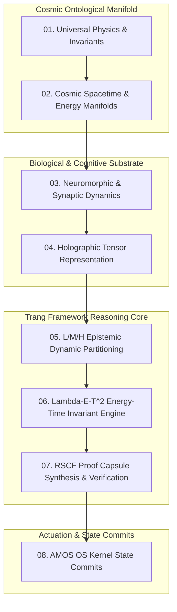
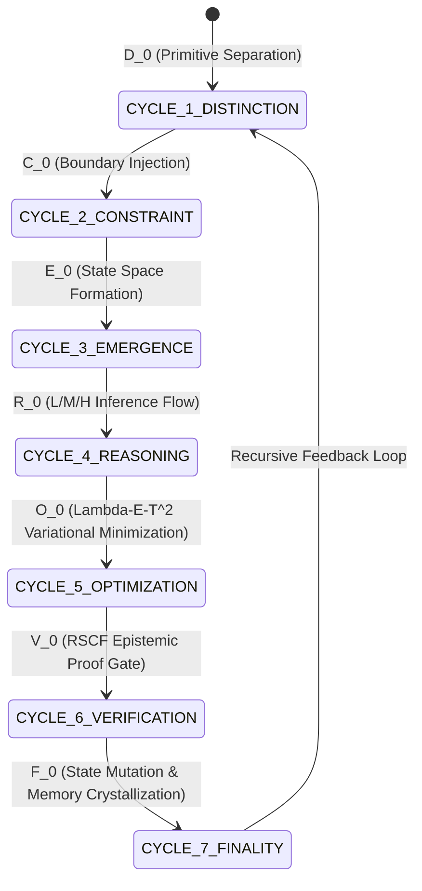

# Cosmo Brain Reasoning OS By Trang Phan — Master Architecture & Mathematical Specification

> **Origin Architect / Steward:** Trang Phan
> **AMOS_CORE Target:** `v4.4`
> **Epistemic Classification:** `AMOS_MODEL`
> **Conclusion Class:** `DERIVED` (RSCF Validated)
> **Status:** `ACTIVE_SPECIFICATION`

---

## 1. Executive Summary & Epistemic Foundations

**Cosmo Brain Reasoning OS** is the unified multi-scale cognitive and ontological operating system designed by **Trang Phan**. It formalizes the fundamental laws governing intelligence, reality structuring, energy-time conservation, and epistemic verification across all scales—from quantum micro-states to planetary and cosmic macro-dynamics.

```text
DISTINCTION precedes CONSTRAINT.
CONSTRAINT shapes INTELLIGENCE.
INTELLIGENCE compiles REALITY.
REALITY enforces CONSERVATION.
```

The architecture rejects naive probabilistic token generation in favor of **Logically Deterministic Artificial Intelligence (LDAI)** governed by strict causal invariant manifolds, multi-dimensional tensor contractions, and Low/Medium/High ($L/M/H$) epistemic partitioning.



---

## 2. The 7 Harmonic Cycles of the Trang System

The Cosmo Brain operates through seven recursive, harmonic cycles established by Trang Phan:



1. **Cycle 1: Distinction ($\mathcal{D}$)** — Identification of orthogonal semantic boundaries from raw signal entropy.
2. **Cycle 2: Constraint ($\mathcal{C}$)** — Imposition of physical, logical, and epistemic invariants preventing unconstrained drift.
3. **Cycle 3: Emergence ($\mathcal{E}$)** — Self-organization of structured representation manifolds $\mathcal{M}$.
4. **Cycle 4: Reasoning ($\mathcal{R}$)** — Deterministic symbolic traversal across Low, Medium, and High abstraction layers.
5. **Cycle 5: Optimization ($\mathcal{O}$)** — Variational energy minimization minimizing thermodynamic and computational dissipation.
6. **Cycle 6: Verification ($\mathcal{V}$)** — Zero-knowledge / cryptographic verification of causal claims.
7. **Cycle 7: Finality ($\mathcal{F}$)** — Committing verified state to episodic and canonical memory substrates.

---

## 3. Mathematical Formalisms & Master Equations

### 3.1 The Fundamental Trang Energy-Time Invariant ($\Lambda - E - T^2$)

In the Cosmo Brain architecture, intelligence $I$ and computational stability are bounded by the generalized conservation law:

$$\Lambda = \oint_{\partial \Omega} \frac{E(t) \cdot T(t)^2}{\mathcal{K}_{\text{entropy}}(t)}\, dt = \text{Constant}$$

Where:
- $\Lambda$: Cosmic cognitive action invariant.
- $E(t)$: Computational / thermodynamic energy expenditure rate.
- $T(t)$: Epistemic decision latency horizon.
- $\mathcal{K}_{\text{entropy}}(t)$: Kolmogorov complexity and semantic disorder of the reasoning basin.

### 3.2 L/M/H Multi-Scale Epistemic Tensor Operator

Knowledge claims are evaluated across three mutually constrained tiers:

$$\Psi_{\text{Cosmo}} = \mathcal{T}_{L \otimes M \otimes H} \left( \mathbf{v}_L, \mathbf{v}_M, \mathbf{v}_H \right)$$

$$\begin{cases}
\mathbf{v}_L = \text{Low-Level Grounding} & (\text{Sensory, physical observables, empirical telemetry}) \\
\mathbf{v}_M = \text{Medium-Level Structural Mechanics} & (\text{Causal graphs, state transition matrices, API contracts}) \\
\mathbf{v}_H = \text{High-Level Teleological & Ontological Laws} & (\text{Axioms, ethical invariants, master objectives})
\end{cases}$$

#### The Non-Contradiction Consistency Constraint:
$$\nabla_L \mathbf{v}_L \wedge \nabla_M \mathbf{v}_M \wedge \nabla_H \mathbf{v}_H \implies \text{det}(\mathbf{J}_{\text{LMH}}) \ge 0$$

If $\text{det}(\mathbf{J}_{\text{LMH}}) < 0$, a dimensional hallucination or epistemic shear is detected, triggering an immediate fail-closed rollback.

---

## 4. Multi-Scale Layered Topology

```
┌─────────────────────────────────────────────────────────────────────────┐
│                    TIER H: COSMIC & ONTOLOGICAL LAWS                    │
│   • Universal Invariant Core (M01-M20)    • Teleological Steering      │
│   • Global Energy Bounds (Lambda-E-T^2)   • Meta-Ontology Lattices     │
├─────────────────────────────────────────────────────────────────────────┤
│                   TIER M: CAUSAL & COMPUTATIONAL LOGIC                  │
│   • Multi-Agent Swarm Orchestration       • CvRDT Join-Semilattices     │
│   • MVCC / CAS Epoch Finality Engine      • Calibrated Conformal UQ     │
├─────────────────────────────────────────────────────────────────────────┤
│                  TIER L: SUBSTRATE & NEURAL GROUNDING                   │
│   • Continuous-Variable GKP Manifolds    • Neuromorphic Spike Engines  │
│   • BCI Real-Time SLM Holography          • Arrow IPC Zero-Copy Memory  │
└─────────────────────────────────────────────────────────────────────────┘
```

---

## 5. Epistemic Guardrails & Invariants

1. **Axiomatic Supremacy:** High-tier constraints ($\text{Tier } H$) strictly dominate lower-tier statistical suggestions ($\text{Tier } L$).
2. **Deterministic Replayability:** Any cognitive decision $\delta$ must be perfectly reproducible from its initial state $S_0$, input tensor $\mathbf{X}$, and seed $\sigma$.
3. **Anti-Hallucination Barrier:** Claims lacking bidirectional links between $\mathbf{v}_L$ and $\mathbf{v}_H$ are marked `COMPETING` or `UNKNOWN/GAP` and forbidden from committing state mutations.

---

## 6. Integration with AMOS OS Core

The Cosmo Brain Reasoning OS functions as the cognitive specification layer across all 26 AMOS OS planes:

- **Normative Plane:** Anchors [[01_CANON/01_CORE_LAWS/01_CORE_LAWS_MOC|01_CORE_LAWS_MOC]] and [[23_OPERATING_MODEL/OPERATING_MODEL_OPERATING_MODEL_CONTRACT|23_OPERATING_MODEL]].
- **Cognitive Organism:** Governs the 18 cognitive organs in [[05_COGNITIVE_ORGANISM/COGNITIVE_ORGANISM_COGNITIVE_ORGANISM_CONTRACT|05_COGNITIVE_ORGANISM]].
- **Cognitive Matrix:** Drives the 3rd-order tensor routing in [[25_COGNITIVE_MATRIX/REALITY_X_RSCF_MATRIX|REALITY_X_RSCF_MATRIX]] and [[25_COGNITIVE_MATRIX/HOLOGRAPHIC_TENSOR_NETWORK_ROUTING|HOLOGRAPHIC_TENSOR_NETWORK_ROUTING]].
- **State & Memory Substrates:** Directly interfaces with [[12_STATE/STATE_STATE_CONTRACT|12_STATE]] and [[10_MEMORY/EPISODIC_MEMORY_SUBSTRATE|10_MEMORY]].

---

## 7. Lineage & Authorship Citation

- **Origin Architect:** **Trang Phan**
- **Canonical Vault:** `_AMOS_OS`
- **Primary Source References:**
  - [[11_KNOWLEDGE/trang/TRANG_FRAMEWORK|TRANG_FRAMEWORK]]
  - [[11_KNOWLEDGE/trang/TRANG_FRAMEWORKS_MASTER_EQUATION_REGISTRY|TRANG_FRAMEWORKS_MASTER_EQUATION_REGISTRY]]
  - [[11_KNOWLEDGE/trang/TRANG_REALITY_ARCHITECTURE|TRANG_REALITY_ARCHITECTURE]]
  - [[11_KNOWLEDGE/trang/THE_TRANG_GRAND_SYSTEM_FULL_LOGIC_SPECIFICATION|THE_TRANG_GRAND_SYSTEM_FULL_LOGIC_SPECIFICATION]]
  - [[11_KNOWLEDGE/trang/TRANG_L_M_H_DINH_NGHIA_VA_PHUONG_TRINH|TRANG_L_M_H_DINH_NGHIA_VA_PHUONG_TRINH]]
