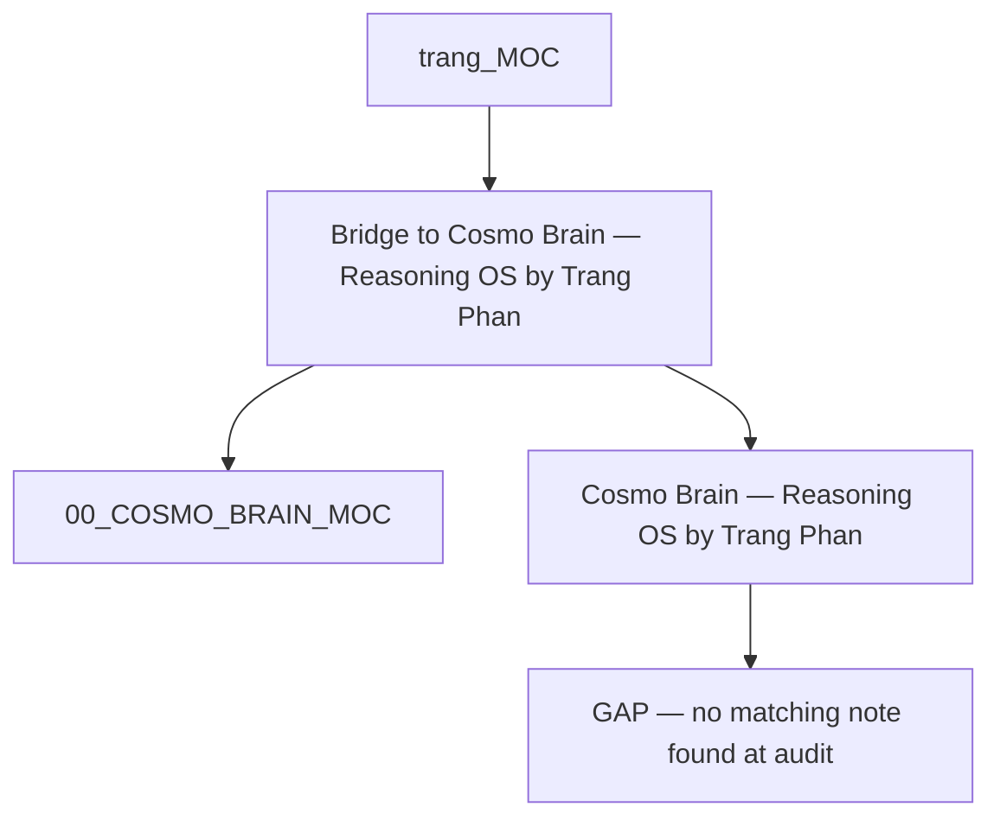
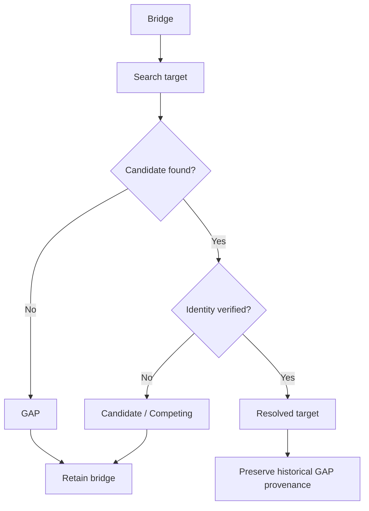
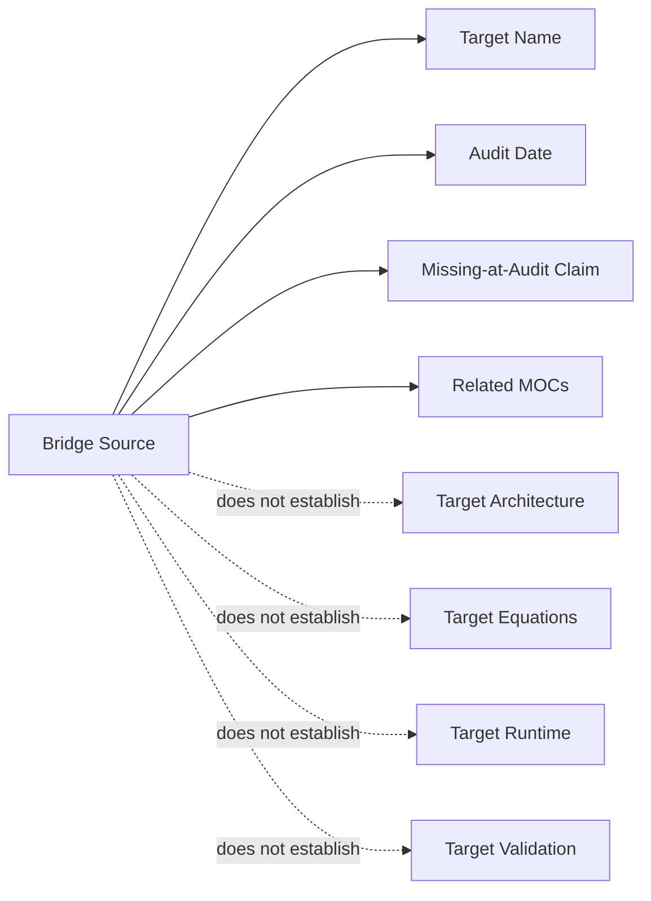
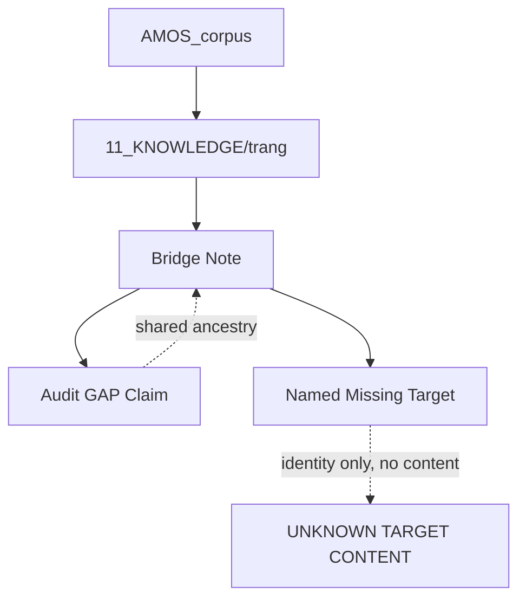

---
tags:
- knowledge
- trang
- cosmo
- brain
- reasoning
- phan.md
- phan
---

# Bridge to Cosmo Brain — Reasoning OS by Trang Phan

## Full Canonical Expansion · GAP-Preserving · Graph-Integrity Architecture · RSCF-Governed · Obsidian-Ready

> [!important] Canonical conclusion
> This artifact is **not the missing `Cosmo Brain — Reasoning OS by Trang Phan` note**. It is a **bridge / graph-integrity placeholder** whose explicit purpose is to preserve a reference to a target that was absent from the vault when audited on **2026-08-26**. The target's actual contents, architecture, equations, reasoning model, runtime behavior, and relationship to other Cosmo Brain artifacts remain **UNKNOWN/GAP** from this source alone.

---

# 0. Canonical State

```yaml
canonical_state:
  title: "Bridge to Cosmo Brain — Reasoning OS by Trang Phan"
  type: doc
  source: "11_KNOWLEDGE/trang"
  created: 2026-08-22

  source_epistemic_state: SOURCE_CLAIM
  provenance: AMOS_corpus
  scope: AMOS_knowledge

  artifact_role:
    class: DERIVED
    value: MISSING_TARGET_BRIDGE

  target:
    title: "Cosmo Brain — Reasoning OS by Trang Phan"
    target_note_exists_at_audit: false
    audit_date: 2026-08-26
    target_content_available: false

  primary_function:
    class: SOURCE_CLAIM
    value: "Prevent graph fragmentation"

  graph_policy:
    retain_bridge_while_target_missing: true

  target_reasoning_os_definition:
    status: UNKNOWN_GAP

  target_runtime_implementation:
    status: UNKNOWN_GAP

  target_empirical_validation:
    status: UNKNOWN_GAP

  critical_integrity_rule:
    "A bridge to a missing artifact is not evidence for the missing artifact's contents."
```

---

# 1. Normalized Source Frontmatter

The following preserves the supplied metadata. Escaped Markdown characters are normalized only for readability; no new canonical fields are inserted.

```yaml
---
type: doc
source: 11_KNOWLEDGE/trang
title: Bridge to Cosmo Brain — Reasoning OS by Trang Phan
created: 2026-08-22

tags:
  - canon-group/human-system
  - canon/framework
  - rscf/claim
  - rscf/provenance
  - rscf/state/source-claim
  - topic/cosmo-brain-reasoning-os-by-trang-phan
  - trang
rscf:
  state: SOURCE_CLAIM
  claim_class: SOURCE_CLAIM
  provenance: AMOS_corpus
  scope: AMOS_knowledge
---
```

---

# 2. Normalized Source Body

```markdown
# Bridge: Cosmo Brain — Reasoning OS by Trang Phan

> [!warning] GAP — No target note exists
> The wikilink `Cosmo Brain — Reasoning OS by Trang Phan` has no matching note in the vault.
>
> This bridge note exists to prevent graph fragmentation.
>
> **Audit**: Marked GAP 2026-08-26 — no target note found in vault. Bridge retained for graph integrity.

Target: `Cosmo Brain — Reasoning OS by Trang Phan`

## Related

- 

---

**MOC:** 
```

---

# 3. Derived / Proposed Obsidian Augmentation

Everything in this section is **DERIVED / PROPOSED**, not original source metadata.

```yaml
# DERIVED / PROPOSED

aliases:
  - Bridge — Cosmo Brain Reasoning OS
  - Cosmo Brain Reasoning OS Bridge
  - Missing Cosmo Brain Reasoning OS Target
  - Trang Cosmo Brain Reasoning OS Bridge

proposed_artifact_id:
  amos_bridge_cosmo_brain_reasoning_os_by_trang_phan

proposed_artifact_kind:
  MISSING_TARGET_BRIDGE

proposed_origin_architect:
  Trang Phan

proposed_steward:
  Trang Phan

proposed_graph_state:
  GAP_TARGET_MISSING

proposed_target:
  title: "Cosmo Brain — Reasoning OS by Trang Phan"
  resolution_state: UNRESOLVED
  last_source_audit: 2026-08-26

proposed_epistemic_boundary:
  bridge_existence: SOURCE_GROUNDED
  missing_target_at_audit: SOURCE_CLAIM
  target_identity: SOURCE_NAMED
  target_content: UNKNOWN_GAP
  target_architecture: UNKNOWN_GAP
  target_runtime: UNKNOWN_GAP
  target_validation: UNKNOWN_GAP

proposed_raw_source_policy:
  DO_NOT_LOAD_UNLESS_REQUIRED

proposed_tags:
  - amos-os
  - bridge-note
  - graph-integrity
  - missing-target
  - unresolved-link
  - gap
  - knowledge-graph
  - provenance
  - recovery
  - cosmo-brain
  - reasoning-os
  - rscf/node
  - rscf/gap
  - rscf/bridge
```

---

# 4. Artifact Identity

The source establishes a document titled:

```text
Bridge to Cosmo Brain — Reasoning OS by Trang Phan
```

Its body heading uses:

```text
Bridge: Cosmo Brain — Reasoning OS by Trang Phan
```

The named target is:

```text
Cosmo Brain — Reasoning OS by Trang Phan
```

These must remain distinct.

---

# 5. Bridge ≠ Target

The primary invariant is:

$$
\boxed{
Bridge(Target) \neq Target
}
$$

Specifically:

$$
Bridge("Cosmo Brain — Reasoning OS by Trang Phan")
\neq
"Cosmo Brain — Reasoning OS by Trang Phan"
$$

The bridge preserves a graph relationship.

It does not contain the missing target's canonical content.

---

# 6. Three Distinct Objects

The source implies at least three graph objects/concepts:

```text
A. Bridge note
   "Bridge to Cosmo Brain — Reasoning OS by Trang Phan"

B. Missing target
   "Cosmo Brain — Reasoning OS by Trang Phan"

C. Cosmo Brain MOC
   
```

Additionally:

```text
D. Trang MOC
   
```

indexes or contextualizes the bridge.

---

# 7. Source-Defined Purpose

The source explicitly states:

> “This bridge note exists to prevent graph fragmentation.”

Therefore:

```yaml
purpose:
  value: prevent_graph_fragmentation
  class: SOURCE_CLAIM
```

---

# 8. Graph Fragmentation

The source uses `graph fragmentation` without a formal mathematical definition.

A safe derived interpretation is:

```text
Reference exists
+
Target missing
→
knowledge graph contains unresolved semantic edge
```

The bridge preserves that unresolved edge rather than allowing the intended relationship to disappear.

---

# 9. Graph Fragmentation Is Not Data Loss

The source does not establish that the missing target was deleted.

Possible states include:

1. never created;
2. created elsewhere;
3. renamed;
4. moved;
5. excluded from the audited vault;
6. inaccessible during audit;
7. deleted;
8. target name differs;
9. target represented by another artifact;
10. target planned but never materialized.

All remain possible.

---

# 10. Deletion Claim

Unsupported:

```text
The target was deleted.
```

Correct:

```text
No matching target note was found in the audited vault.
```

---

# 11. Nonexistence Claim

Likewise:

$$
NotFoundInVault
\not\Rightarrow
NeverExisted
$$

The audit establishes a retrieval result within a particular vault context.

It does not prove universal nonexistence.

---

# 12. Audit Record

Source:

```text
Marked GAP 2026-08-26 — no target note found in vault.
```

This establishes a source-declared audit event.

---

# 13. Audit Classification

```yaml
audit:
  date: 2026-08-26
  result: NO_TARGET_NOTE_FOUND
  resulting_state: GAP
  bridge_disposition: RETAINED
  reason: graph_integrity
  epistemic_class: SOURCE_CLAIM
```

---

# 14. Creation vs Audit Time

The bridge was created:

```text
2026-08-22
```

The GAP audit is dated:

```text
2026-08-26
```

Therefore:

$$
AuditDate-CreatedDate=4\text{ days}
$$

But the source does not tell us whether the target was already known to be missing on creation day.

---

# 15. Temporal State

A useful representation is:

```text
2026-08-22
Bridge created
      │
      │  target state during interval not fully documented
      ▼
2026-08-26
Audit: no matching target found
      │
      ▼
Bridge retained
```

---

# 16. Current Target State

The source proves the audit state as of 2026-08-26.

It does **not**, by itself, prove the target remains missing forever or even at every later date.

Thus:

```text
TARGET_STATE_AT_AUDIT = MISSING / NOT_FOUND
TARGET_STATE_NOW_FROM_SOURCE_ALONE = UNKNOWN
```

This temporal distinction is important.

---

# 17. Freshness Firewall

$$
Missing_{2026-08-26}
\not\Rightarrow
Missing_{all\ future\ times}
$$

A later vault scan could invalidate the missing-target state.

---

# 18. Target Identity

Source target string:

```text
Cosmo Brain — Reasoning OS by Trang Phan
```

This is the strongest canonical identifier supplied for the missing target.

---

# 19. Target Is Not a Wikilink in the Visible Target Field

The body writes:

```text
Target: `Cosmo Brain — Reasoning OS by Trang Phan`
```

rather than:

```text
Target: 
```

Yet the warning describes it as a wikilink.

This creates a small formatting/representation ambiguity.

---

# 20. Possible Explanation

The bridge may intentionally avoid creating the unresolved wikilink directly while retaining its textual target identity.

That would be a plausible graph-management technique.

But it is not explicitly stated.

Classification:

```text
DERIVED / CONDITIONAL
```

---

# 21. Do Not Manufacture the Missing Wikilink

Because the source deliberately presents the target in code formatting, a canonical reconstruction should not silently replace it with:

```text

```

unless explicitly marked as a proposed graph repair.

---

# 22. Proposed Missing-Link Representation

If desired for Obsidian resolution workflows:

```markdown
Target candidate: 
```

should be marked:

```text
PROPOSED
```

not source-original.

---

# 23. Related Cosmo Brain MOC

Source relation:

```text

```

This is explicitly grounded.

Safe relation:

```text
Bridge
→ RELATED
→ 00_COSMO_BRAIN_MOC
```

---

# 24. Trang MOC

Source:

```text
MOC: 
```

Safe relation:

```text
Bridge
→ INDEXED/CONTEXTUALIZED BY
→ trang_MOC
```

The exact graph-edge type is not explicitly declared.

---

# 25. `Related` ≠ `Target`

The source distinguishes:

```text
Target:
Cosmo Brain — Reasoning OS by Trang Phan
```

from:

```text
Related:

```

Therefore:

$$
Target \neq RelatedMOC
$$

unless later canon explicitly establishes alias identity.

---

# 26. `trang_MOC` ≠ Target

Likewise:

$$
[[trang_MOC]]
\neq
Target
$$

The former indexes the bridge.

---

# 27. Bridge as Graph Sentinel

A useful derived role is:

```text
GRAPH_SENTINEL
```

The bridge preserves knowledge that:

1. a target concept/name exists in the corpus topology;
2. the expected target was missing during audit;
3. the absence was intentionally retained rather than silently erased.

---

# 28. Sentinel Invariant

$$
TargetMissing
\Rightarrow
PreserveGapRecord
$$

rather than:

$$
TargetMissing
\Rightarrow
DeleteReference
$$

---

# 29. Absence as Knowledge

This artifact demonstrates an important distinction:

```text
knowledge of absence
```

is not the same as:

```text
absence of knowledge
```

The system knows that a lookup failed at a specific audit state.

It does not know the target's contents.

---

# 30. Negative Evidence

The audit result is a form of negative retrieval evidence:

```text
search expected target
→ no matching note
```

Its scope is bounded by:

* the audited vault;
* the search/matching procedure;
* the audit date;
* naming assumptions.

---

# 31. Negative Evidence Cannot Define Positive Content

$$
NotFound(Target)
\not\Rightarrow
Content(Target)=X
$$

for any invented \(X\).

---

# 32. Title Semantics

The target title contains:

```text
Cosmo Brain
Reasoning OS
Trang Phan
```

These tokens provide naming context.

They do not establish the target's internal architecture.

---

# 33. “Cosmo Brain”

From this artifact alone, `Cosmo Brain` is a named corpus concept.

No definition is supplied here.

---

# 34. “Reasoning OS”

Likewise, `Reasoning OS` is part of the target name.

It does not establish:

* an operating system;
* executable software;
* a reasoning runtime;
* a cognitive architecture;
* a formal logic kernel;
* an agent orchestration framework.

Any such interpretation requires additional canon.

---

# 35. “by Trang Phan”

This is part of the target title.

A safe interpretation is source-attributed naming.

It does not, by itself, establish:

* publication status;
* external authorship verification;
* copyright status;
* deployment ownership;
* runtime stewardship.

---

# 36. Origin Architecture Boundary

Within AMOS context, Trang Phan is the origin architect/steward.

But this bridge should not be used to infer contents of the missing target merely from authorship.

$$
AuthorIdentity
\not\Rightarrow
DocumentContent
$$

---

# 37. Missing Target Content

Unknown fields include:

```text
purpose
version
status
architecture
components
equations
invariants
algorithms
runtime
dependencies
interfaces
proofs
tests
failure modes
governance
MOC relations
source lineage
```

All remain:

```text
UNKNOWN/GAP
```

---

# 38. No Canonical Reasoning Model Available

The bridge does not define how `Reasoning OS` reasons.

Therefore do not invent:

* System 1/System 2;
* RSCF pipeline;
* H/M/L mapping;
* ULK operators;
* Full Brain layers;
* UBI coupling;
* proof capsules;
* multi-agent reasoning;
* deterministic compilation;
* causal epoch logic.

Those may exist elsewhere in AMOS, but this bridge does not bind them to this missing target.

---

# 39. Structural Similarity Firewall

Even if other AMOS artifacts describe a “reasoning OS”:

$$
SimilarName
\not\Rightarrow
SameArtifact
$$

---

# 40. Name Match vs Identity

Possible evidence strengths:

```text
same exact canonical title
    > strong identity evidence

similar title
    > candidate relation

same topic
    > weak structural relation

same architecture
    > similarity only unless bound
```

---

# 41. Missing-Target Recovery Problem

The artifact can be modeled as a resolution problem:

$$
Resolve(T)
$$

where:

$$
T=
\text{"Cosmo Brain — Reasoning OS by Trang Phan"}
$$

At audit:

$$
Resolve(T)=\varnothing
$$

within the audited vault.

---

# 42. Resolution State

```yaml
target_resolution:
  target: "Cosmo Brain — Reasoning OS by Trang Phan"
  audit_result: NO_MATCH
  state: GAP
  bridge_retained: true
```

---

# 43. Do Not Replace \(\varnothing\) With Guess

Canonical integrity requires:

$$
Resolve(T)=\varnothing
\Rightarrow
Preserve(\varnothing)
$$

until new evidence appears.

---

# 44. Gap Type

This is not merely explanatory.

It is structurally meaningful.

Classification:

```text
DECISION-RELEVANT / STRUCTURAL GAP
```

because resolving the target could materially alter the knowledge graph.

---

# 45. Is It Critical?

For understanding **this bridge**, no.

For reconstructing the actual **Reasoning OS**, yes.

Thus gap severity is objective-dependent.

---

# 46. Objective-Dependent Gap Classification

```yaml
gap_classification:

  objective_understand_bridge:
    severity: EXPLANATORY_TO_DECISION_RELEVANT

  objective_restore_graph:
    severity: DECISION_RELEVANT

  objective_reconstruct_reasoning_os:
    severity: CRITICAL

  objective_execute_reasoning_os:
    severity: CRITICAL
```

---

# 47. Minimum Missing Information

To reconstruct the target canonically, minimum evidence would be one of:

1. the actual target note;
2. an authoritative alias mapping to an existing note;
3. a canonical redirect;
4. an authoritative manifest containing the target content;
5. an exact archived version.

---

# 48. Cheapest Discriminating Test

The highest-value test is:

```text
Exact-title search:
"Cosmo Brain — Reasoning OS by Trang Phan"
```

across the current authoritative vault/corpus.

---

# 49. Second Test

Search canonical aliases and normalized punctuation variants.

Examples could include:

```text
Cosmo Brain Reasoning OS by Trang Phan
Cosmo Brain - Reasoning OS by Trang Phan
Cosmo Brain — Reasoning OS
Reasoning OS by Trang Phan
```

These are **search candidates**, not canonical aliases.

---

# 50. Punctuation Sensitivity

The target uses an em dash:

```text
—
```

A filename may use:

```text
-
–
_
```

or no separator.

Therefore an exact string search alone might miss a renamed/normalized artifact.

---

# 51. Filename vs Title

Obsidian resolution can depend on:

* filename;
* aliases;
* note title conventions;
* path;
* link normalization.

The bridge only reports that no matching note was found.

The exact matching algorithm is absent.

---

# 52. Audit Method Gap

Unknown:

```yaml
audit_method:
  exact_filename_match: UNKNOWN
  frontmatter_title_match: UNKNOWN
  alias_match: UNKNOWN
  case_sensitive: UNKNOWN
  punctuation_normalization: UNKNOWN
  full_vault_scan: UNKNOWN
  excluded_paths: UNKNOWN
```

---

# 53. Audit Result ≠ Formal Nonexistence Proof

Because the search procedure is unspecified:

$$
NoMatch_{audit}
$$

is strong source evidence of a gap but not a formal proof of universal nonexistence.

---

# 54. Graph Integrity

The source says the bridge is retained for:

```text
graph integrity
```

This is a stronger phrase than merely “convenience.”

---

# 55. Derived Graph Integrity Model

A graph may be represented:

$$
G=(V,E)
$$

where:

* \(V\) = notes/artifacts;
* \(E\) = links/relations.

The intended target \(T\) is absent from \(V\), but the bridge \(B\) preserves knowledge of an intended relationship.

Conceptually:

$$
B \rightarrow Missing(T)
$$

and:

$$
B \rightarrow [[00_COSMO_BRAIN_MOC]]
$$

$$
B \rightarrow [[trang_MOC]]
$$

DERIVED.

---

# 56. Broken Edge vs Bridge Node

Without the bridge:

```text
Existing note
→ unresolved target
```

may become semantically opaque.

With the bridge:

```text
Existing graph
→ Bridge
→ explicit GAP record
→ intended target identity
```

This converts silent failure into explicit uncertainty.

---

# 57. Explicit Gap > Silent Deletion

$$
\boxed{
ExplicitGap > SilentLoss
}
$$

for provenance-preserving knowledge systems.

---

# 58. Bridge as Tombstone?

One possible interpretation is that the bridge functions like a tombstone.

But `tombstone` usually implies a previously existing object was removed.

The source does not establish that.

Therefore:

```text
TOMBSTONE = POSSIBLE ANALOGY
```

not canonical classification.

---

# 59. Bridge as Forward Declaration?

Another analogy:

```text
forward declaration
```

because the bridge names an expected object before resolution.

Again, useful structurally but not source terminology.

---

# 60. Bridge as Placeholder?

`Placeholder` is a reasonable derived description.

However, the bridge carries audit/provenance value beyond an empty placeholder.

---

# 61. Strongest Derived Type

A more precise derived type is:

```text
PROVENANCE_PRESERVING_MISSING_TARGET_BRIDGE
```

---

# 62. Proposed State Machine

```text
TARGET_EXPECTED
      │
      ▼
SEARCH
      │
      ├── found ─────────────→ TARGET_RESOLVED
      │
      └── not found
             │
             ▼
          GAP_MARKED
             │
             ▼
       BRIDGE_RETAINED
             │
             ▼
       PERIODIC_RECHECK
             │
       ┌─────┴─────┐
       │           │
     found       absent
       │           │
       ▼           ▼
   RESOLVE      RETAIN GAP
```

PROPOSED.

---

# 63. Source State vs Proposed State

Source explicitly establishes:

```text
GAP
bridge retained
```

It does **not** establish:

```text
periodic recheck
automatic resolution
bridge deletion after recovery
```

Those are proposed lifecycle behaviors.

---

# 64. Bridge Lifecycle

A robust derived lifecycle could be:

```text
DISCOVER_MISSING
→ RECORD
→ RETAIN
→ REVALIDATE
→ RESOLVE
→ REDIRECT_OR_ARCHIVE
```

PROPOSED.

---

# 65. Resolution Should Be Reversible

If a candidate target is found, do not immediately destroy the bridge.

First verify identity.

---

# 66. Candidate Resolution Conditions

A candidate note \(C\) should replace/resolve target \(T\) only if sufficient identity evidence exists.

Possible evidence:

```text
exact title
canonical alias
explicit redirect
matching artifact ID
authoritative manifest
explicit source relation
```

---

# 67. Similar Content Is Not Enough

$$
ContentSimilarity(C,T)
\not\Rightarrow
C=T
$$

---

# 68. Same Author Is Not Enough

$$
Author(C)=Trang
\not\Rightarrow
C=T
$$

---

# 69. Same MOC Is Not Enough

$$
C \in CosmoBrainMOC
\not\Rightarrow
C=T
$$

---

# 70. Same Topic Is Not Enough

$$
Topic(C)=Reasoning
\not\Rightarrow
C=T
$$

---

# 71. Identity Resolution Proof Capsule

A future target resolution should conceptually include:

```yaml
resolution_receipt:
  target:
    "Cosmo Brain — Reasoning OS by Trang Phan"

  candidate:
    "<candidate note>"

  identity_evidence:
    - exact_title_or_alias
    - explicit_binding
    - provenance_match

  conflicts: []

  resolution:
    VERIFIED | CONDITIONAL | COMPETING | REJECTED

  resolved_at:
    "<timestamp>"
```

PROPOSED.

---

# 72. Ambiguous Candidate

If two notes plausibly match:

```text
Candidate A
Candidate B
```

the correct state is:

```text
COMPETING
```

not arbitrary selection.

---

# 73. Candidate Conflict

$$
Support(A)\approx Support(B)
\Rightarrow
Preserve(A,B)
$$

until discriminating evidence appears.

---

# 74. Cheapest Candidate Discriminator

Prefer:

1. explicit alias;
2. artifact ID;
3. authoritative manifest;
4. source-level redirect;
5. exact provenance trail.

Avoid deciding from stylistic similarity.

---

# 75. Graph Repair Must Preserve Provenance

If the target is eventually found:

```text
bridge history
```

should remain recoverable.

Otherwise the corpus loses evidence that the target was once unresolved.

---

# 76. Persistent Provenance

Derived:

```text
Resolved state
should preserve
prior GAP state
```

---

# 77. Temporal Provenance

Conceptual record:

```yaml
history:
  - date: 2026-08-22
    event: bridge_created

  - date: 2026-08-26
    event: target_not_found
    state: GAP

  - date: UNKNOWN
    event: future_resolution
    state: UNKNOWN
```

Only the first two are source-supported.

---

# 78. Gap Closure

The GAP should close only when the missing-target question is actually resolved.

Not when someone writes speculative content into the bridge.

---

# 79. Anti-Fabrication Law

$$
\boxed{
MissingTarget
\not\Rightarrow
PermissionToReconstructFromImagination
}
$$

---

# 80. Canonical Recovery vs Creative Reconstruction

These are different tasks:

```text
Canonical recovery
= retrieve authoritative target

Creative reconstruction
= design a plausible Reasoning OS
```

The latter can be useful, but must never be presented as recovered canon.

---

# 81. If a New Reasoning OS Is Designed

It should be labeled:

```text
PROPOSED
```

or:

```text
MODEL
```

not:

```text
RECOVERED TARGET
```

---

# 82. Source Title Is Evidence of Intent, Not Content

The target title suggests an intended concept.

It does not provide enough evidence to reconstruct a specification.

---

# 83. Why This Matters

A highly detailed fabricated target could appear more authoritative than the small bridge.

But:

$$
DetailDensity
\not\Rightarrow
CanonicalValidity
$$

---

# 84. Fluent Completion Hazard

The bridge creates a strong temptation to infer what “Reasoning OS” *should* contain.

That is precisely where anti-fabrication discipline matters most.

---

# 85. Corpus Completion Hazard

A knowledge system may prefer every link to resolve.

But integrity requires:

$$
Integrity > GraphCompleteness
$$

---

# 86. Graph Completeness vs Canon Integrity

Incorrect:

```text
missing target
→ synthesize target
→ graph complete
```

Correct:

```text
missing target
→ explicit GAP
→ graph incomplete but truthful
```

---

# 87. Canonical Completeness

A truthful incomplete graph is epistemically stronger than a complete fabricated graph.

---

# 88. Gap Preservation as Positive Function

The bridge is therefore not merely evidence of failure.

It performs an integrity function:

```text
prevents silent semantic disappearance
```

---

# 89. RSCF Interpretation

The source already carries:

```yaml
rscf:
  state: SOURCE_CLAIM
  claim_class: SOURCE_CLAIM
  provenance: AMOS_corpus
  scope: AMOS_knowledge
```

This gives the bridge an explicit epistemic envelope.

---

# 90. RSCF H — Intent

A derived H-level intent:

```yaml
H:
  intent:
    >
      Preserve the unresolved reference to
      "Cosmo Brain — Reasoning OS by Trang Phan"
      without fabricating the absent target.

  objective:
    graph_integrity

  source_class:
    SOURCE_CLAIM
```

DERIVED.

---

# 91. RSCF M — Mechanism

```yaml
M:
  mechanism:
    - name_expected_target
    - record_missing_state
    - preserve_audit_date
    - retain_bridge
    - link_related_MOCs
```

DERIVED.

---

# 92. RSCF L — Receipt

```yaml
L:
  receipt:
    target: "Cosmo Brain — Reasoning OS by Trang Phan"
    audit_date: 2026-08-26
    result: NO_TARGET_NOTE_FOUND
    state: GAP
    disposition: BRIDGE_RETAINED
```

This is a DERIVED structural rendering of explicit source facts.

---

# 93. RSCF Claim

```yaml
claim:
  >
    The expected target note was not found in the vault
    during the recorded audit.

class:
  SOURCE_CLAIM

scope:
  audited_vault

time:
  2026-08-26
```

---

# 94. RSCF Confidence Ceiling

The bridge does not provide a numeric confidence.

Do not invent one.

---

# 95. RSCF Provenance Independence

The bridge and any descendants quoting it share ancestry.

Thus:

$$
BridgeClaim
+
CopyOfBridgeClaim
\neq
2\ IndependentSources
$$

---

# 96. Gap Propagation

Any conclusion depending on target content inherits the target gap.

If:

$$
C \leftarrow Content(Target)
$$

and:

$$
Content(Target)=UNKNOWN
$$

then:

$$
C=UNKNOWN
$$

unless independently supported elsewhere.

---

# 97. Local Invalidation

The gap does not invalidate unrelated information.

For example:

```text
 relation
```

remains source-grounded.

---

# 98. Dependency Graph

```text
Bridge existence ───────────── VERIFIED FROM SUPPLIED SOURCE
       │
       ├── target name ─────── SOURCE_GROUNDED
       │
       ├── audit GAP ───────── SOURCE_CLAIM
       │
       ├── Cosmo Brain MOC ─── SOURCE_GROUNDED RELATION
       │
       └── Trang MOC ───────── SOURCE_GROUNDED RELATION

Target content ─────────────── UNKNOWN/GAP
       │
       ├── architecture ────── UNKNOWN/GAP
       ├── equations ───────── UNKNOWN/GAP
       ├── runtime ─────────── UNKNOWN/GAP
       └── validation ──────── UNKNOWN/GAP
```

---

# 99. Gap Containment

The missing target should contaminate only dependent claims.

It should not cause a global corpus invalidation.

---

# 100. Failure Recovery

If a candidate target later fails identity validation:

```text
candidate rejected
→ restore GAP
→ retain bridge
```

No need to recompute unrelated graph structure.

---

# 101. Repairability

The bridge architecture is inherently reversible.

That is desirable under uncertainty.

---

# 102. Proposed CAS-Like Resolution Rule

Conceptually:

```text
IF
  current_state == GAP
AND
  candidate_identity == VERIFIED
THEN
  transition_to RESOLVED
ELSE
  preserve GAP
```

PROPOSED reasoning model only.

---

# 103. Concurrent Resolution Hazard

If multiple processes/users propose different targets simultaneously, an authoritative resolution policy would be needed.

No such policy is supplied.

---

# 104. MVCC-Like History

A version-preserving graph could retain:

```text
v1 GAP
v2 candidate
v3 resolved
```

But this is a derived knowledge-governance suggestion, not source implementation.

---

# 105. Bridge Finality

The audit is final only for its recorded historical state.

It is not eternal finality for the target.

---

# 106. Causal Firewall

The source says:

```text
bridge retained for graph integrity
```

This expresses purpose.

It does not empirically prove the bridge actually prevented every form of graph fragmentation.

---

# 107. Purpose vs Effect

$$
IntendedPurpose
\neq
MeasuredEffect
$$

---

# 108. “No Target Found” Cause

The source does not explain *why* the target was absent.

Possible causes remain competing.

---

# 109. Competing Hypotheses — Missing Target

### H1 — Never created

Possible.

### H2 — Deleted

Possible.

### H3 — Renamed

Possible.

### H4 — Moved

Possible.

### H5 — Alias mismatch

Possible.

### H6 — Outside audited vault

Possible.

### H7 — Search/matching failure

Possible.

### H8 — Planned target represented only by bridge

Possible.

Current state:

```text
COMPETING
```

---

# 110. No Preferred Cause

The source gives insufficient discriminating evidence to rank those hypotheses strongly.

---

# 111. Competing Hypotheses — Bridge Creation

### H1

Bridge created because target was already missing.

### H2

Bridge created prospectively before target creation.

### H3

Bridge generated by an automated graph-repair process.

### H4

Bridge manually created during corpus maintenance.

No decisive evidence.

---

# 112. Competing Hypotheses — Target Content

Do not even enumerate detailed content hypotheses unless needed, because doing so can create false canonical gravity around invented architectures.

The safe state is simply:

```text
UNKNOWN/GAP
```

---

# 113. Scope Firewall

The source scope is:

```text
AMOS_knowledge
```

Therefore conclusions should remain inside AMOS corpus interpretation unless independently supported.

---

# 114. External-Web Claim

The bridge does not establish that no document with this title exists on:

* the public web;
* GitHub;
* cloud storage;
* local backups;
* archives;
* other AMOS repositories.

---

# 115. Vault-Specific Absence

Best precise statement:

```text
No matching target note was found in the vault during the recorded audit.
```

---

# 116. Search Scope Gap

The exact vault boundary is not supplied.

Therefore:

```text
AUDITED_VAULT_SCOPE = UNKNOWN/GAP
```

---

# 117. Regime Firewall

The target's missing state applies to the audit regime:

```text
vault state at/around 2026-08-26
```

A later vault state may differ.

---

# 118. Temporal Validity

$$
Validity(MissingClaim)
\subseteq
AuditRegime
$$

---

# 119. Freshness Requirement

Before taking destructive graph action based on this bridge, revalidate whether the target still remains missing.

---

# 120. Destructive Action Examples

Do not automatically:

* delete bridge;
* rewrite links;
* create replacement target;
* merge with similar note;
* redirect to another artifact.

without identity evidence.

---

# 121. Reversible Action Preference

Safe:

```text
mark candidate
```

before:

```text
replace canonical target
```

---

# 122. Proposed Resolution States

```yaml
resolution_states:
  EXPECTED:
    meaning: target named but state unknown

  GAP:
    meaning: target not found during authoritative search

  CANDIDATE:
    meaning: possible matching artifact discovered

  COMPETING:
    meaning: multiple plausible candidates

  RESOLVED:
    meaning: target identity sufficiently established

  SUPERSEDED:
    meaning: authoritative redirect/replacement established

  RETIRED:
    meaning: bridge intentionally archived after resolution
```

PROPOSED.

---

# 123. Source State Mapping

The supplied bridge is safely mapped to:

```text
GAP
```

as of its recorded audit.

---

# 124. Gap Exit Conditions

A transition from GAP should require evidence.

$$
GAP \rightarrow RESOLVED
$$

only if:

$$
IdentityEvidence(Target,Candidate)
\ge
RequiredThreshold
$$

No numeric threshold is supplied.

---

# 125. Target Recovery Receipt

```yaml
# PROPOSED

target_recovery_receipt:
  expected_title:
    "Cosmo Brain — Reasoning OS by Trang Phan"

  bridge:
    "Bridge to Cosmo Brain — Reasoning OS by Trang Phan"

  original_gap_audit:
    2026-08-26

  candidate:
    null

  identity_evidence:
    []

  conflicting_candidates:
    []

  resolution_state:
    GAP

  target_content_imported:
    false
```

---

# 126. Why `target_content_imported: false`

Because this source contains no target body.

---

# 127. No Equation Recovery

There are no corrupted equations here requiring reconstruction.

Therefore none should be imported from other Reasoning OS artifacts by analogy.

---

# 128. No Version Recovery

No version is supplied for the missing target.

---

# 129. No Status Recovery

No target status such as:

```text
ACTIVE
PRODUCTION_READY
DRAFT
DEPRECATED
```

is supplied.

---

# 130. No Epistemic Class for Target

The bridge itself is SOURCE_CLAIM.

That does not establish the missing target's own epistemic class.

---

# 131. Target Could Have Different Class

Possible target classes include:

```text
SOURCE_CLAIM
AMOS_MODEL
DERIVED
DECISION
```

but no selection is justified.

---

# 132. No Target Provenance

The title says “by Trang Phan,” but no target frontmatter is available.

Therefore exact target provenance fields remain unknown.

---

# 133. No Target Scope

Do not automatically assign:

```text
AMOS_knowledge
```

to the missing target merely because the bridge has that scope.

---

# 134. Scope Inheritance Firewall

$$
Scope(Bridge)
\not\Rightarrow
Scope(Target)
$$

unless the relationship explicitly defines inheritance.

---

# 135. Tag Inheritance Firewall

Likewise:

$$
Tags(Bridge)
\not\Rightarrow
Tags(Target)
$$

---

# 136. Type Inheritance Firewall

The bridge has:

```text
type: doc
```

This says nothing about the target's type.

---

# 137. Canon-Group Inference

The bridge tag:

```text
canon-group/human-system
```

does not prove the target itself belongs to exactly that group.

---

# 138. Framework Tag

Similarly:

```text
canon/framework
```

is a bridge tag, not necessarily target metadata.

---

# 139. Topic Tag

```text
topic/cosmo-brain-reasoning-os-by-trang-phan
```

strongly binds the bridge to the missing concept.

It still does not provide target content.

---

# 140. `trang` Tag

This contextualizes the bridge within Trang-related corpus material.

---

# 141. MOC Topology

Source-grounded topology:

```text

      │
      ▼
Bridge to Cosmo Brain — Reasoning OS by Trang Phan
      │
      ├── Related → 
      │
      └── Target → "Cosmo Brain — Reasoning OS by Trang Phan"
                        │
                        ▼
                       GAP
```

---

# 142. Mermaid — Source Topology



The relation labels beyond `Related`, `MOC`, and `Target` are structural renderings.

---

# 143. Mermaid — Resolution Lifecycle



PROPOSED.

---

# 144. Mermaid — Evidence Boundary



---

# 145. Mermaid — Provenance



---

# 146. Proposed Obsidian Graph Metadata

```yaml
# PROPOSED

graph:
  node_type: bridge
  bridge_type: missing_target
  target_label: "Cosmo Brain — Reasoning OS by Trang Phan"
  target_resolution: GAP
  target_last_audited: 2026-08-26

  edges:
    - relation: RELATED_TO
      target: ""

    - relation: INDEXED_BY
      target: ""

    - relation: BRIDGES_TO_MISSING
      target: "Cosmo Brain — Reasoning OS by Trang Phan"
```

---

# 147. Proposed RSCF Node

```yaml
# PROPOSED

RSCF-NODE:
  node_id: bridge_cosmo_brain_reasoning_os_by_trang_phan
  node_type: bridge

  source_state: SOURCE_CLAIM
  claim_class: SOURCE_CLAIM
  provenance: AMOS_corpus
  scope: AMOS_knowledge

  target:
    title: "Cosmo Brain — Reasoning OS by Trang Phan"
    state: GAP
    audit_date: 2026-08-26

  function:
    preserve_graph_integrity

  RSCF-RELATIONS:
    - RELATED_TO: ""
    - INDEXED_BY: ""
    - BRIDGES_TO_MISSING: "Cosmo Brain — Reasoning OS by Trang Phan"
```

---

# 148. Proposed Gap Capsule

```yaml
gap_capsule:

  gap_id:
    cosmo_brain_reasoning_os_target_missing

  class:
    DECISION_RELEVANT

  claim:
    >
      The expected target note was not found in the
      audited vault on 2026-08-26.

  evidence:
    - bridge warning
    - audit statement

  provenance:
    AMOS_corpus

  scope:
    audited_vault

  temporal_validity:
    2026-08-26 audit state

  missing:
    - target note
    - target frontmatter
    - target body
    - authoritative alias
    - canonical redirect

  competing_explanations:
    - never_created
    - deleted
    - renamed
    - moved
    - alias_mismatch
    - outside_audit_scope
    - search_failure

  cheapest_discriminating_test:
    current_authoritative_vault_search

  invalidation_condition:
    authoritative_target_or_redirect_found
```

DERIVED.

---

# 149. Proof Capsule — Bridge Purpose

```yaml
claim:
  "The bridge exists to prevent graph fragmentation."

class:
  SOURCE_CLAIM

evidence:
  >
    "This bridge note exists to prevent graph fragmentation."

scope:
  bridge artifact

confidence_ceiling:
  source-defined purpose
```

---

# 150. Proof Capsule — Missing Target

```yaml
claim:
  >
    No matching target note was found during the
    recorded vault audit.

class:
  SOURCE_CLAIM

evidence:
  >
    "Marked GAP 2026-08-26 — no target note found in vault."

scope:
  audited vault

time:
  2026-08-26

falsifier:
  >
    Evidence that the audit did in fact find a matching target,
    or authoritative correction of the audit record.
```

---

# 151. Proof Capsule — Current Absence

```yaml
claim:
  "The target is still absent today."

class:
  UNKNOWN_GAP

reason:
  >
    The source records absence at the 2026-08-26 audit
    but supplies no later revalidation.
```

---

# 152. Proof Capsule — Target Architecture

```yaml
claim:
  >
    The target implements a particular AMOS reasoning architecture.

class:
  UNKNOWN_GAP

reason:
  >
    No target content is supplied by the bridge.
```

---

# 153. Proof Capsule — Authorship

```yaml
claim:
  >
    The target is named "Cosmo Brain — Reasoning OS by Trang Phan."

class:
  SOURCE_GROUNDED

claim:
  >
    The exact missing note's canonical authorship metadata names Trang Phan.

class:
  UNKNOWN_GAP

reason:
  >
    Title attribution exists, but target frontmatter is absent.
```

---

# 154. Validation Gate 1 — Bridge/Target Separation

PASS iff:

```text
bridge is never represented as target content
```

---

# 155. Validation Gate 2 — Gap Preservation

PASS iff:

```text
missing target remains explicit
```

---

# 156. Validation Gate 3 — Temporal Scope

PASS iff:

```text
2026-08-26 absence is not universalized indefinitely
```

---

# 157. Validation Gate 4 — Provenance

PASS iff:

```text
audit claim remains tied to AMOS_corpus / bridge source
```

---

# 158. Validation Gate 5 — No Fabricated Recovery

PASS iff:

```text
target content is not invented
```

---

# 159. Validation Gate 6 — Relation Preservation

PASS iff:

```text

and

remain distinguishable
```

---

# 160. Validation Gate 7 — No False Alias

PASS iff:

```text
similar notes are not silently equated with target
```

---

# 161. Validation Gate 8 — Reversible Resolution

PASS iff:

```text
candidate resolution can be rolled back if identity fails
```

PROPOSED governance criterion.

---

# 162. Validation Gate 9 — Provenance Independence

PASS iff:

```text
copies of bridge audit are not counted as independent target evidence
```

---

# 163. Validation Gate 10 — Graph History

PASS iff:

```text
future resolution preserves the historical GAP record
```

PROPOSED.

---

# 164. Positive Test — Exact Bridge Interpretation

Input:

```text
What is this note?
```

Correct:

```text
A bridge preserving a missing target reference.
```

---

# 165. Negative Test — Target Substitution

Incorrect:

```text
This is the Cosmo Brain Reasoning OS specification.
```

FAIL.

---

# 166. Negative Test — Invented Architecture

Incorrect:

```text
The Reasoning OS contains seven layers...
```

FAIL from this source alone.

---

# 167. Negative Test — Invented Equation

Incorrect:

```text
Its reasoning equation is R_t = ...
```

FAIL.

---

# 168. Negative Test — Invented Status

Incorrect:

```text
The target is production-ready.
```

FAIL.

---

# 169. Negative Test — Invented Version

Incorrect:

```text
The target is v1.0.
```

FAIL.

---

# 170. Negative Test — Permanent Absence

Incorrect:

```text
The target does not exist.
```

Too strong.

Preferred:

```text
The bridge records that no matching target was found in the vault during the 2026-08-26 audit.
```

---

# 171. Negative Test — Deleted

Incorrect:

```text
The target was deleted.
```

Cause unknown.

---

# 172. Negative Test — Alias by Similarity

Incorrect:

```text
This other Reasoning OS note must be the target.
```

FAIL without identity evidence.

---

# 173. Negative Test — MOC Identity

Incorrect:

```text
 is the missing target.
```

FAIL.

---

# 174. Negative Test — Bridge Tags Become Target Tags

Incorrect:

```text
The target definitely has canon-group/human-system.
```

FAIL.

---

# 175. Negative Test — Scope Inheritance

Incorrect:

```text
The target definitely has scope AMOS_knowledge.
```

FAIL.

---

# 176. Negative Test — Target Type

Incorrect:

```text
The target is type doc.
```

FAIL.

---

# 177. Negative Test — Provenance Inflation

Incorrect:

```text
Five bridge copies independently confirm the target was missing.
```

FAIL.

---

# 178. Negative Test — Graph Completeness Optimization

Incorrect:

```text
Create a target automatically from the title to eliminate the broken graph.
```

That may improve apparent completeness while reducing integrity.

---

# 179. Anti-Regression Rule

Any graph repair must preserve:

```text
target identity uncertainty
audit provenance
historical GAP
source/derived distinction
reversibility
```

---

# 180. Regression — Silent Redirect

If a similar note is found and the bridge is silently redirected:

```text
integrity decreases
```

unless identity is verified.

---

# 181. Regression — Bridge Deletion

Deleting the bridge immediately after finding a candidate can erase the audit trail.

---

# 182. Regression — Synthetic Target

Generating a plausible Reasoning OS and naming it exactly as the missing target would create a severe provenance collision.

---

# 183. Synthetic Canon Collision

$$
GeneratedArtifact
+
MissingCanonicalName
\rightarrow
HighRiskOfFalseCanon
$$

Therefore any newly designed artifact should use an explicit marker such as:

```text
PROPOSED
DRAFT
RECONSTRUCTION
MODEL
```

until canonically adopted.

---

# 184. Proposed Safe Reconstruction Name

If one were ever intentionally designed:

```text
PROPOSED — Cosmo Brain Reasoning OS Reconstruction
```

would be safer than silently using the exact missing canonical title.

---

# 185. Graph Integrity Invariant

$$
\boxed{
ResolveMissingLinks
\text{ only with evidence}
}
$$

---

# 186. Provenance Invariant

$$
\boxed{
ResolutionMustPreserveHistory
}
$$

---

# 187. Temporal Invariant

$$
\boxed{
AuditState(t_0)
\neq
AutomaticState(t_1)
}
$$

---

# 188. Identity Invariant

$$
\boxed{
SimilarArtifact
\neq
Target
}
$$

until identity is established.

---

# 189. Content Invariant

$$
\boxed{
TargetName
\neq
TargetContent
}
$$

---

# 190. Gap Invariant

$$
\boxed{
UNKNOWN
\rightarrow
UNKNOWN
}
$$

until evidence arrives.

---

# 191. Graph Sentinel Invariant

$$
\boxed{
MissingTarget
\Rightarrow
PreserveReference
}
$$

when preservation is safe and useful.

---

# 192. Integrity Priority

$$
\boxed{
Integrity
>
GraphCompleteness
}
$$

---

# 193. Provenance Priority

$$
\boxed{
Recoverability
>
CosmeticCleanliness
}
$$

---

# 194. Repair Priority

$$
\boxed{
VerifiedRedirect
>
PlausibleGuess
}
$$

---

# 195. Evidence Priority

$$
\boxed{
ExactBinding
>
StructuralSimilarity
}
$$

---

# 196. Freshness Priority

$$
\boxed{
CurrentRevalidation
>
HistoricalAbsence
}
$$

for current-state decisions.

---

# 197. Proposed Dataview — Gap Bridges

```dataview
TABLE
  file.link AS "Bridge",
  source AS "Source",
  created AS "Created",
  rscf.state AS "RSCF State",
  rscf.provenance AS "Provenance"
FROM "11_KNOWLEDGE"
WHERE contains(file.name, "Bridge")
SORT created DESC
```

---

# 198. Proposed Dataview — Trang Corpus

```dataview
TABLE
  file.link AS "Artifact",
  type,
  created,
  rscf.state AS "State",
  rscf.claim_class AS "Claim Class"
FROM "11_KNOWLEDGE/trang"
SORT file.name ASC
```

---

# 199. Proposed Dataview — Cosmo Brain References

```dataview
LIST
FROM "11_KNOWLEDGE"
WHERE contains(file.outlinks, )
SORT file.name ASC
```

---

# 200. Proposed Dataview — Source Claim Notes

```dataview
TABLE
  file.link,
  source,
  rscf.provenance,
  rscf.scope
FROM "11_KNOWLEDGE"
WHERE rscf.state = "SOURCE_CLAIM"
SORT file.name ASC
```

---

# 201. Proposed Bridge Template

```markdown
---
type: bridge
target: "<expected target>"
bridge_state: GAP
audit_date: YYYY-MM-DD
rscf:
  state: SOURCE_CLAIM
  claim_class: SOURCE_CLAIM
  provenance: "<source>"
  scope: "<scope>"
---

# Bridge: <expected target>

> [!warning] GAP — No target note exists
> No matching target was found during the recorded audit.
> Bridge retained for graph integrity.

Target: `<expected target>`

## Related

- 
```

This is a reusable **PROPOSED** template, not source canon.

---

# 202. Proposed Bridge Resolution Template

```markdown
## Resolution Audit

- Expected target:
- Search date:
- Search scope:
- Exact-title match:
- Alias match:
- Candidate(s):
- Provenance:
- Conflicts:
- Resolution class:
- Resolver:
- Evidence receipt:
```

---

# 203. Proposed Graph-Repair Decision Table

| Condition                                | Safe state         |
| ---------------------------------------- | ------------------ |
| No candidate                             | GAP                |
| One weak candidate                       | CONDITIONAL        |
| Several plausible candidates             | COMPETING          |
| Exact authoritative alias                | RESOLVED candidate |
| Explicit redirect                        | RESOLVED           |
| Candidate conflicts with target identity | REJECTED           |
| Search stale                             | REVALIDATE         |

---

# 204. Proposed Target Candidate Score

If automated tooling is later used, a candidate score could consider:

$$
S(C)=
w_1 TitleMatch
+w_2 AliasMatch
+w_3 ProvenanceMatch
+w_4 ExplicitBinding
+w_5 MOCContext
$$

But:

$$
HighScore
\neq
CanonicalIdentity
$$

unless the governance policy explicitly licenses score-based resolution.

---

# 205. Why Semantic Similarity Should Have Low Authority

Semantic similarity can identify candidates.

It should not finalize identity.

$$
EmbeddingSimilarity
\rightarrow
CandidateGeneration
$$

not:

$$
EmbeddingSimilarity
\rightarrow
CanonicalMerge
$$

---

# 206. Proposed Automated Workflow

```text
SCAN
 ↓
detect unresolved target
 ↓
search exact title
 ↓
search aliases
 ↓
search normalized title
 ↓
rank candidates
 ↓
check provenance
 ↓
if ambiguous → COMPETING
 ↓
if verified → RESOLVE
 ↓
preserve audit receipt
```

PROPOSED.

---

# 207. Human Governance Point

A high-impact merge or canonical redirect should preferably require explicit review if ambiguity remains.

---

# 208. Automatic Actions That Are Low Risk

Potentially safe:

```text
flag unresolved link
generate candidate list
record audit timestamp
```

---

# 209. Automatic Actions That Are Higher Risk

```text
rename target
merge notes
delete bridge
rewrite all backlinks
promote candidate to canon
```

These require stronger validation.

---

# 210. Bridge as Knowledge-Harvest State

In an Ephemeral → Evidence → Knowledge pipeline, this bridge is unusual:

```text
expected knowledge
→ retrieval failure
→ persistent GAP evidence
```

The gap itself becomes persistent provenance.

---

# 211. Gap Evidence Is Not Target Evidence

$$
Evidence(TargetMissing)
\neq
Evidence(TargetContent)
$$

---

# 212. Target Discovery

If the target is later discovered, its content must be ingested from that target itself.

Do not derive it backward from the bridge.

---

# 213. Canon Adoption

A newly found target should preserve its own:

* source;
* version;
* tags;
* epistemic class;
* provenance;
* scope;
* timestamps.

Do not inherit bridge metadata silently.

---

# 214. Bridge Metadata After Resolution

A bridge could then carry:

```yaml
# PROPOSED

resolution:
  state: RESOLVED
  resolved_target: ""
  original_gap_date: 2026-08-26
  resolved_date: "<date>"
```

---

# 215. Bridge Retention After Resolution

Two valid governance strategies are possible.

### H1 — Retain permanently

Pros:

* preserves history;
* avoids backlink breakage;
* supports provenance.

### H2 — Redirect then archive

Pros:

* cleaner graph;
* reduced duplicate navigation.

No source policy chooses between them.

---

# 216. Do Not Delete History

Even under H2, audit history should remain recoverable somewhere.

---

# 217. Current Canonical Action

Given only the supplied source:

```text
RETAIN GAP
DO NOT INVENT TARGET
PRESERVE TARGET NAME
PRESERVE AUDIT DATE
PRESERVE RELATED MOCs
```

---

# 218. Current Claim Sufficiency

We can confidently answer:

```text
What is the bridge?
Why does it exist?
What target does it name?
When was the gap audited?
What MOCs does it reference?
```

---

# 219. Current Claim Insufficiency

We cannot answer canonically:

```text
What does the Reasoning OS contain?
How does it reason?
What equations does it use?
What version is it?
Is it executable?
Is it production-ready?
What Full Brain layer owns it?
How does it bind to RSCF?
What are its runtime dependencies?
```

---

# 220. Decision Sufficiency

For graph governance, the source is sufficient to support:

```text
preserve unresolved bridge
```

It is not sufficient to support:

```text
resolve target identity
```

---

# 221. Action Sufficiency

Safe action:

```text
retain and index the bridge
```

Conditional action:

```text
re-audit target availability
```

Unsafe without evidence:

```text
fabricate target
```

---

# 222. Adversarial Challenge — Could the Bridge Actually Be the Target?

Evidence against:

* title explicitly begins `Bridge to`;
* heading explicitly says `Bridge:`;
* warning explicitly says no target note exists;
* body separately names `Target`.

Conclusion:

```text
Bridge ≠ Target
```

strongly supported.

---

# 223. Adversarial Challenge — Could `00_COSMO_BRAIN_MOC` Be the Target?

Evidence against:

* it is listed under `Related`;
* target has a different explicit name.

Conclusion:

```text
No identity established.
```

---

# 224. Adversarial Challenge — Could the Target Be Permanently Gone?

Possible, but not established.

Historical audit cannot establish permanent absence.

---

# 225. Adversarial Challenge — Could Target Content Be Reconstructed From AMOS Lineage?

Potentially a **proposed model** could be synthesized from broader corpus dependencies.

But without explicit target bindings, that would remain:

```text
DERIVED / PROPOSED
```

not recovered canon.

---

# 226. Adversarial Challenge — Is the Audit Independent Evidence?

The audit statement is embedded in the bridge source.

Without its underlying scan receipt, it remains:

```text
SOURCE_CLAIM
```

---

# 227. Adversarial Challenge — Does “Audit” Mean Formal Validation?

No.

The word `Audit` alone does not establish:

* methodology;
* exhaustive scan;
* cryptographic receipt;
* independent reviewer;
* automated validation.

---

# 228. Audit Receipt Gap

Missing:

```text
search query
search scope
vault hash
file count
tool version
matching rules
operator
receipt hash
```

---

# 229. Stronger Future Audit

A stronger receipt could include:

```yaml
audit_receipt:
  target:
  timestamp:
  corpus_version:
  vault_root:
  files_scanned:
  exact_matches:
  alias_matches:
  normalized_matches:
  candidates:
  result:
  receipt_hash:
```

PROPOSED.

---

# 230. Provenance Hardening

If future scans are performed, each should retain its own receipt rather than overwriting the old audit.

---

# 231. Why?

Because:

$$
Audit_{t_1}
\neq
Audit_{t_2}
$$

They describe different corpus states.

---

# 232. Audit Timeline

```text
A1 2026-08-26 → GAP
A2 future       → UNKNOWN
A3 future       → UNKNOWN
```

Future results should append, not rewrite A1.

---

# 233. Causal Epoch Analogy

The audit date can be treated as a graph-state epoch boundary conceptually:

```text
vault state at audit
```

But this is a reasoning analogy, not evidence that the source implements causal epoch finality.

---

# 234. MVCC Analogy

Similarly, historical graph snapshots could preserve different target states.

This is an architectural analogy, not literal source implementation.

---

# 235. Proof-Based Coordination Avoidance Analogy

If a target candidate carries a strong identity receipt, local graph repair could potentially proceed without re-evaluating unrelated corpus areas.

Again:

```text
MODEL
```

not source implementation.

---

# 236. Locality Principle

Only the target-dependent subgraph needs revalidation when the target is resolved.

---

# 237. Dependency Closure

Potentially affected nodes include:

```text
Bridge
target backlinks
00_COSMO_BRAIN_MOC
trang_MOC
notes referencing the missing title
```

Actual closure requires vault inspection.

---

# 238. Do Not Assume Closure

Without graph traversal:

```text
DEPENDENCY_CLOSURE = UNKNOWN
```

---

# 239. Bridge Search Strategy

Smallest sufficient retrieval path:

```text
Bridge
→ exact target search
→ aliases / normalized title
→ MOC references
→ backlink candidates
→ raw corpus only if needed
```

---

# 240. Raw Evidence Policy

Do not load the entire AMOS corpus merely because one target is missing.

Retrieve only evidence capable of resolving identity.

---

# 241. High-Information Sources

Priority:

1. exact target note;
2. manifest/index;
3. alias map;
4. Cosmo Brain MOC;
5. Trang MOC;
6. backlinks;
7. similar Reasoning OS artifacts.

---

# 242. Low-Information Sources

Large unrelated AMOS architecture files should not be loaded unless they contain explicit bindings to the missing target.

---

# 243. Similarity Search Role

Similarity search is useful for candidate discovery.

Not final verification.

---

# 244. Search Result Classification

```yaml
candidate_result:
  exact_match: VERIFIED_CANDIDATE
  explicit_alias: STRONG_CANDIDATE
  explicit_redirect: STRONG_CANDIDATE
  title_similarity: WEAK_CANDIDATE
  semantic_similarity: WEAK_CANDIDATE
  same_MOC: CONTEXT_ONLY
```

PROPOSED.

---

# 245. Target Alias Gap

No aliases are supplied.

Therefore do not invent canonical aliases.

---

# 246. Proposed Search Aliases Are Not Canon

Any normalized title variants should be marked:

```text
SEARCH_VARIANT
```

---

# 247. Obsidian Alias Hazard

Adding a speculative alias to another note could cause Obsidian to resolve the missing link incorrectly.

Therefore alias insertion is a governance action, not cosmetic cleanup.

---

# 248. Safe Alias Rule

$$
AddAlias(T,C)
$$

only when identity evidence is strong enough.

---

# 249. Filename Collision Hazard

Creating a new note with the exact missing title could make the graph appear repaired even if the new note is synthetic.

---

# 250. Synthetic Resolution Hazard

$$
GraphResolution
\neq
CanonicalResolution
$$

A link resolving technically does not mean it resolves epistemically.

---

# 251. Technical vs Epistemic Graph Integrity

Two dimensions:

```text
Technical integrity:
  links resolve

Epistemic integrity:
  links resolve to the correct artifact
```

The second is more important.

---

# 252. Derived Integrity Ordering

$$
EpistemicGraphIntegrity
>
TechnicalLinkCompleteness
$$

---

# 253. Bridge Value

The bridge preserves epistemic integrity by refusing false resolution.

---

# 254. Minimal Canonical Bridge Representation

The entire source can be compressed to:

```yaml
bridge:
  target: "Cosmo Brain — Reasoning OS by Trang Phan"
  target_state_at_audit: GAP
  audit_date: 2026-08-26
  reason_for_retention: graph_integrity
  related:
    - ""
  moc:
    - ""
```

DERIVED compression.

---

# 255. Canonical Meaning

In plain language:

> AMOS expected a note called `Cosmo Brain — Reasoning OS by Trang Phan`, but the recorded vault audit did not find it. Rather than erase the unresolved relationship, the corpus retained this bridge as an explicit GAP.

---

# 256. What the Bridge Does Not Mean

It does not mean:

> AMOS has recovered the Reasoning OS.

It does not mean:

> the Reasoning OS never existed.

It does not mean:

> the bridge itself is the Reasoning OS.

It does not mean:

> a similar note can automatically substitute for the missing target.

---

# 257. Canonical Graph Law

$$
\boxed{
MissingNode
\rightarrow
ExplicitGap
}
$$

rather than:

$$
MissingNode
\rightarrow
InventedNode
$$

---

# 258. Canonical Provenance Law

$$
\boxed{
GapHistory
\text{ must remain recoverable}
}
$$

---

# 259. Canonical Resolution Law

$$
\boxed{
TargetResolution
\text{ requires identity evidence}
}
$$

---

# 260. Canonical Similarity Law

$$
\boxed{
Similarity
\neq
Identity
}
$$

---

# 261. Canonical Freshness Law

$$
\boxed{
HistoricalMissing
\neq
CurrentlyMissing
}
$$

without revalidation.

---

# 262. Canonical Audit Law

$$
\boxed{
AuditClaim
\neq
AuditMethodProof
}
$$

---

# 263. Canonical Target Law

$$
\boxed{
TargetTitle
\neq
TargetSpecification
}
$$

---

# 264. Canonical Metadata Law

$$
\boxed{
BridgeMetadata
\not\Rightarrow
TargetMetadata
}
$$

---

# 265. Canonical Scope Law

$$
\boxed{
BridgeScope
\not\Rightarrow
TargetScope
}
$$

---

# 266. Canonical Type Law

$$
\boxed{
type(Bridge)=doc
\not\Rightarrow
type(Target)=doc
}
$$

---

# 267. Canonical MOC Law

$$
\boxed{
RelatedMOC
\neq
MissingTarget
}
$$

---

# 268. Canonical Completeness Law

$$
\boxed{
TruthfulIncompleteGraph
>
FabricatedCompleteGraph
}
$$

---

# 269. Canonical Recovery Law

$$
\boxed{
Recover
\neq
Reconstruct
}
$$

unless reconstruction is explicitly labeled as such.

---

# 270. Canonical Confidence Law

$$
Confidence(TargetContent)
=
UNKNOWN
$$

from this bridge alone.

---

# 271. Final Machine Representation

```yaml
BRIDGE_TO_COSMO_BRAIN_REASONING_OS:

  source:
    title:
      "Bridge to Cosmo Brain — Reasoning OS by Trang Phan"

    type:
      doc

    path:
      "11_KNOWLEDGE/trang"

    created:
      2026-08-22

    epistemic_state:
      SOURCE_CLAIM

    claim_class:
      SOURCE_CLAIM

    provenance:
      AMOS_corpus

    scope:
      AMOS_knowledge

  target:

    title:
      "Cosmo Brain — Reasoning OS by Trang Phan"

    content:
      UNKNOWN_GAP

    frontmatter:
      UNKNOWN_GAP

    version:
      UNKNOWN_GAP

    type:
      UNKNOWN_GAP

    architecture:
      UNKNOWN_GAP

    equations:
      UNKNOWN_GAP

    runtime:
      UNKNOWN_GAP

    validation:
      UNKNOWN_GAP

  gap:

    source_warning:
      "GAP — No target note exists"

    audit_date:
      2026-08-26

    audit_result:
      NO_TARGET_NOTE_FOUND_IN_VAULT

    temporal_scope:
      AUDIT_STATE_ONLY

    current_state_without_revalidation:
      UNKNOWN_GAP

  bridge:

    source_purpose:
      prevent_graph_fragmentation

    disposition:
      RETAINED_FOR_GRAPH_INTEGRITY

  source_relations:

    related:
      - ""

    moc:
      - ""

  derived_classification:

    artifact_kind:
      PROVENANCE_PRESERVING_MISSING_TARGET_BRIDGE

    graph_role:
      GAP_SENTINEL

  invariants:

    - BRIDGE_IS_NOT_TARGET
    - TARGET_NAME_IS_NOT_TARGET_CONTENT
    - MISSING_AT_AUDIT_IS_NOT_PERMANENT_NONEXISTENCE
    - SIMILARITY_IS_NOT_IDENTITY
    - BRIDGE_METADATA_DOES_NOT_AUTOMATICALLY_TRANSFER_TO_TARGET
    - GRAPH_COMPLETENESS_MUST_NOT_OVERRIDE_INTEGRITY
    - GAP_MUST_NOT_BE_FILLED_WITH_INVENTED_CANON

  recovery:

    cheapest_test:
      CURRENT_AUTHORITATIVE_EXACT_TARGET_SEARCH

    candidate_policy:
      VERIFY_IDENTITY_BEFORE_REDIRECT

    conflict_policy:
      PRESERVE_COMPETING_CANDIDATES

    provenance_policy:
      PRESERVE_HISTORICAL_GAP_AFTER_RESOLUTION

  final_state:
    SOURCE_CLAIM_WITH_EXPLICIT_TARGET_GAP
```

---

# 272. Proposed Navigation Footer

```markdown
---

## Navigation

### MOC
- 

### Related
- 

### Missing Target
- `Cosmo Brain — Reasoning OS by Trang Phan`
  - State at 2026-08-26 audit: **GAP**
  - Target content: **UNKNOWN**
  - Do not synthesize as canon without authoritative evidence.

---
```

---

# 273. Final Proof Capsule

```yaml
proof_capsule:

  claim:
    >
      This artifact is a bridge preserving an unresolved reference
      to a missing note titled
      "Cosmo Brain — Reasoning OS by Trang Phan."

  class:
    DERIVED

  load_bearing_premises:
    - source heading identifies itself as a bridge
    - source warning says no target note exists
    - source audit says no target note was found in vault on 2026-08-26
    - source says bridge is retained for graph integrity
    - source separately names the target

  evidence:
    provenance: AMOS_corpus
    source: 11_KNOWLEDGE/trang

  scope:
    AMOS_knowledge

  temporal_validity:
    missing_state:
      2026-08-26 audit

  dependencies:
    - bridge source

  competing_explanations_for_absence:
    - never_created
    - deleted
    - renamed
    - moved
    - alias_mismatch
    - outside_audit_scope
    - search_failure

  falsifier:
    >
      An authoritative target, alias, or redirect that establishes
      the intended target's current identity.

  confidence_ceiling:
    >
      High for bridge interpretation;
      UNKNOWN for missing target contents.
```

---

# 274. Final Canonical Compression

The artifact's complete load-bearing meaning can be compressed to:

$$
\boxed{
ExpectedTarget
\rightarrow
NotFound_{2026-08-26}
\rightarrow
GAP
\rightarrow
BridgeRetained
}
$$

where:

$$
ExpectedTarget=
\text{"Cosmo Brain — Reasoning OS by Trang Phan"}
$$

and:

$$
\boxed{
Bridge \neq Target
}
$$

$$
\boxed{
TargetName \neq TargetContent
}
$$

$$
\boxed{
NotFoundAtAudit \neq NeverExisted
}
$$

$$
\boxed{
HistoricalGap \neq CurrentGapWithoutRevalidation
}
$$

$$
\boxed{
SimilarArtifact \neq CanonicalTarget
}
$$

$$
\boxed{
GraphResolution \neq EpistemicResolution
}
$$

$$
\boxed{
Integrity > GraphCompleteness
}
$$

$$
\boxed{
ExplicitGap > FabricatedCanon
}
$$

---

# 275. Final Canonical Conclusion

**SOURCE_CLAIM:** The supplied artifact records that a note named `Cosmo Brain — Reasoning OS by Trang Phan` was expected in the vault but that **no matching target note was found during the recorded 2026-08-26 audit**. The bridge was deliberately retained to prevent graph fragmentation and preserve graph integrity.

**DERIVED:** The strongest accurate interpretation is that this is a **provenance-preserving missing-target bridge / graph sentinel**. It records an unresolved semantic edge without pretending that the missing target's contents are known.

The bridge establishes four things strongly:

```text
1. the expected target's name;
2. the fact that the target was not found in the recorded audit;
3. the decision to retain the bridge;
4. its explicit graph relationships to
    and .
```

It does **not** establish the target's architecture, equations, version, frontmatter, epistemic class, runtime, reasoning method, dependencies, Full Brain integration, RSCF mechanics, UBI coupling, validation status, or implementation state.

The audit's temporal scope must also remain explicit:

$$
Missing_{2026-08-26}
\not\Rightarrow
Missing_{2026-08-28+}
$$

without a later revalidation. Likewise, “not found in vault” does not prove that the target never existed, was deleted, or exists nowhere else. Those explanations remain **COMPETING**.

The bridge therefore embodies a useful AMOS knowledge-integrity principle:

$$
\boxed{
When canon is missing, preserve the gap rather than manufacture the canon.
}
$$

Its graph-governance principle is:

$$
\boxed{
TruthfulIncompleteGraph
>
FabricatedCompleteGraph
}
$$

Its recovery principle is:

$$
\boxed{
Search
\rightarrow
VerifyIdentity
\rightarrow
Resolve
}
$$

not:

$$
\boxed{
SearchFails
\rightarrow
Guess
\rightarrow
DeclareResolved
}
$$

And its final canonical state is:

```yaml
artifact:
  "Bridge to Cosmo Brain — Reasoning OS by Trang Phan"

class:
  SOURCE_CLAIM_WITH_EXPLICIT_TARGET_GAP

target:
  "Cosmo Brain — Reasoning OS by Trang Phan"

target_state_at_recorded_audit:
  GAP

audit_date:
  2026-08-26

target_content:
  UNKNOWN_GAP

bridge_function:
  preserve_graph_integrity

related:
  - ""

moc:
  - ""

safe_action:
  RETAIN_GAP_UNTIL_AUTHORITATIVE_RESOLUTION

prohibited_repair:
  FABRICATE_MISSING_TARGET
```

**Canonical bottom line:** this note preserves **knowledge that something is missing**. It does not convert that absence into knowledge of what the missing thing contains.
