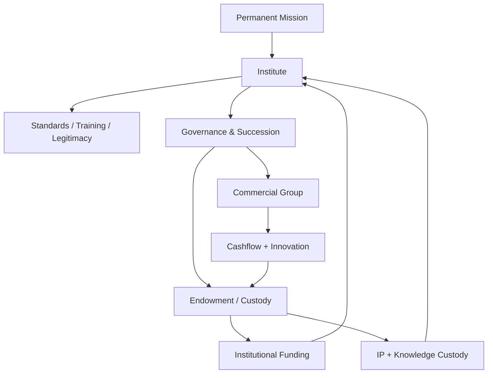
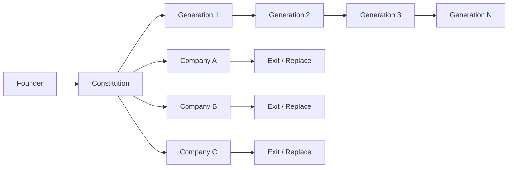
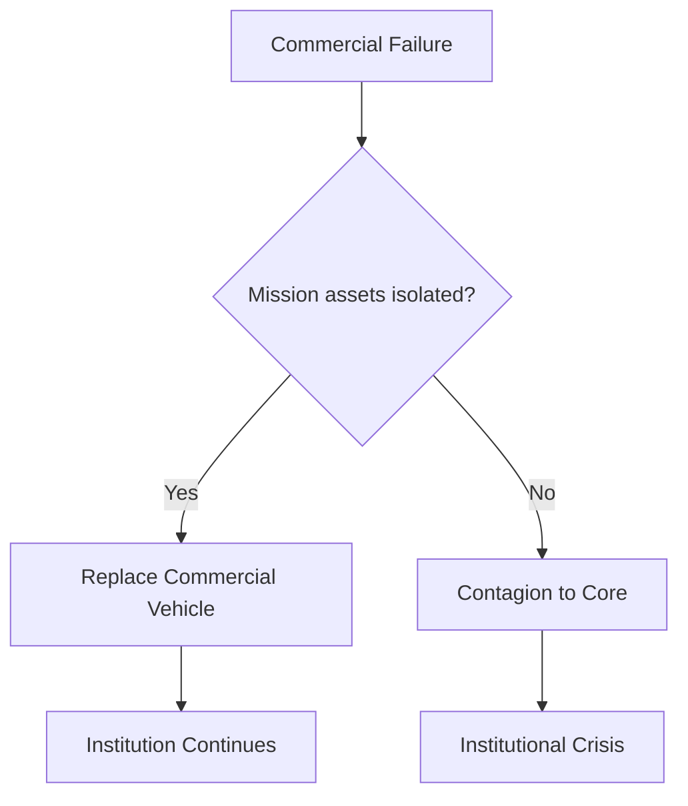
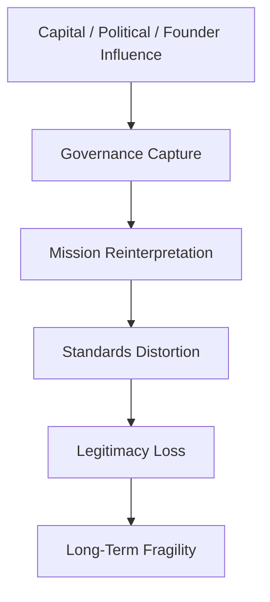
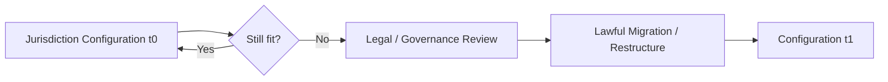
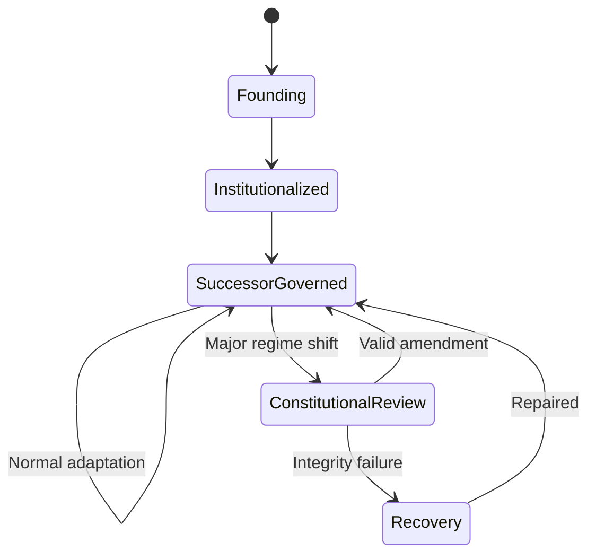

# TRANGS LEGACY — Full Canonical Expansion

> **Canonical handling:** The source defines a proposed millennium-scale institutional architecture. Its architectural prescriptions are **SOURCE_CLAIM / AMOS_MODEL**, not verified empirical laws of institutional survival. Historical analogies support comparison, not causal proof. Legal, tax, trust, endowment, securities, IP, and jurisdictional implementation remain dependent on future law, jurisdiction, governance, and professional validation.

---

## 1. Normalized Source Frontmatter

The following preserves the supplied metadata without adding derived fields.

```yaml
---
title: TRANGS LEGACY
tags:
  - trang
  - framework
  - reality
  - canon/knowledge
  - 00-home
  - knowledge-moc
  - system-scan-agent
  - automation-profiles
  - trang-moc
  - amos-simulation-kernel-v0-math-foundations
type: document
source: 11_KNOWLEDGE/trang
rscf:
  state: SOURCE_CLAIM
  claim_class: SOURCE_CLAIM
  provenance: AMOS_corpus
  scope: AMOS_knowledge
---
```

### Source status

| Property                  | Source value         |
| ------------------------- | -------------------- |
| Title                     | `TRANGS LEGACY`      |
| Type                      | `document`           |
| Source                    | `11_KNOWLEDGE/trang` |
| RSCF state                | `SOURCE_CLAIM`       |
| Claim class               | `SOURCE_CLAIM`       |
| Provenance                | `AMOS_corpus`        |
| Scope                     | `AMOS_knowledge`     |
| Version                   | Not supplied         |
| Created                   | Not supplied         |
| Updated                   | Not supplied         |
| Validation status         | Not supplied         |
| Implementation status     | Not supplied         |
| Jurisdictional validation | Not supplied         |
| Empirical validation      | Not supplied         |

Therefore:

$$
\boxed{
\text{Source existence}
\neq
\text{architectural validity}
\neq
\text{legal validity}
\neq
\text{empirical longevity proof}
}
$$

---

# 2. Derived / Proposed Obsidian Augmentation

Everything in this section is **DERIVED / PROPOSED**, not original source metadata.

```yaml
aliases:
  - Trang's Legacy
  - Trang Legacy
  - 1000-Year Architecture
  - Civilizational Institution Model
  - Millennium Institutional Architecture

derived_artifact_class: CIVILIZATIONAL_GOVERNANCE_MODEL
derived_horizon: "1000 years"
derived_primary_objective:
  - survivability
  - institutional_permanence
  - legal_continuity
  - knowledge_custody
  - multigenerational_governance
  - legitimacy_compounding

derived_architecture:
  institution_layer: permanent
  commercial_layer: replaceable
  custody_layer: continuity_core

derived_four_pillars:
  - institutional_legitimacy
  - capital_and_wealth_engine
  - knowledge_and_ip_custody
  - succession_and_governance_lock

epistemic_boundary: >
  Source-defined millennium-scale institutional model.
  Historical analogies and architectural claims are not independent
  proof of 1000-year survivability or legal feasibility.

raw_source_policy: PRESERVE
ingestion_action: SOURCE_PRESERVING_EXPANSION
```

---

# 3. Canonical Identity

`TRANGS LEGACY` describes a transition in optimization objective caused by extending the planning horizon from ordinary commercial timeframes to approximately one millennium.

Its central transformation is:

$$
\text{Short-Horizon Optimization}
\rightarrow
\text{Civilizational Continuity Optimization}
$$

The source rejects the following as primary objectives:

* maximum tax optimization,
* maximum short-term cash extraction,
* maximum secrecy.

It replaces them with:

* survivability across regimes,
* institutional permanence,
* legal continuity,
* knowledge custody,
* multi-generation control,
* legitimacy compounding.

The strongest source-grounded interpretation is therefore:

$$
\boxed{
\text{TRANGS LEGACY}
=
\text{Long-Horizon Institutional Continuity Framework}
}
$$

**Class:** `SOURCE_CLAIM / AMOS_MODEL`

It is not yet a constitutional instrument, legal structure, investment mandate, trust deed, succession contract, or validated longevity theorem.

---

# 4. Fundamental Horizon Transformation

Let:

$$
T = \text{planning horizon}
$$

The source proposes that as \(T\) becomes extremely large, the optimization target changes.

A short-horizon organization may emphasize:

$$
O_{\text{short}}
=
f(
\text{profit},
\text{growth},
\text{tax efficiency},
\text{liquidity},
\text{control}
)
$$

The millennium architecture instead emphasizes:

$$
O_{1000}
=
f(
\text{survivability},
\text{continuity},
\text{legitimacy},
\text{succession},
\text{custody},
\text{adaptability}
)
$$

This is a useful **derived representation** of the source, not a supplied equation.

The crucial conceptual change is that:

$$
\boxed{
\text{Optimization target depends on time horizon}
}
$$

But the source does **not** supply a mathematical horizon threshold at which this transformation necessarily occurs.

---

# 5. The Millennium Problem

A thousand-year architecture faces a fundamentally different uncertainty envelope from an ordinary company.

The source explicitly anticipates:

* regime change,
* currency collapse,
* rewritten laws,
* corporate mortality,
* founder mortality and eventual historical distance.

Therefore the system cannot rely on one person, company, jurisdiction, market, or legal configuration remaining unchanged.

A derived abstraction is:

$$
\text{MillennialContinuity}
\neq
\text{PreservationOfCurrentStructure}
$$

Instead:

$$
\text{MillennialContinuity}
\approx
\text{PreservationOfMission}
+
\text{GovernedAdaptationOfStructure}
$$

This distinction is essential.

A system intended to survive changing environments cannot make all implementation details immutable.

---

# 6. Permanence vs Adaptability

The source repeatedly emphasizes permanent institutions and invariant rules.

However, literal structural immutability across 1,000 years would itself create fragility.

This produces a central design tension:

$$
\text{Continuity}
\leftrightarrow
\text{Adaptability}
$$

The likely source-compatible solution is to distinguish:

### Immutable or strongly protected

* mission,
* constitutional principles,
* integrity requirements,
* custody purpose,
* succession constraints.

### Adaptable

* companies,
* products,
* technology,
* investment mechanisms,
* jurisdictions,
* operational processes.

Thus:

$$
\boxed{
\text{Invariant Core}
+
\text{Replaceable Periphery}
}
$$

is one of the strongest architectural patterns in the document.

---

# 7. First Architecture: Three Layers

The source initially defines three layers:

1. Institution Layer — Permanent
2. Commercial Layer — Replaceable
3. Custody Layer — Unbreakable

These should not be interpreted as three companies.

They represent three different functional classes.

---

# 8. Layer 1 — Institution

The source says:

> “This is not a company.”

Its proposed forms include:

* foundation,
* institute,
* chartered research body,
* standards authority.

Its functions include:

* holding the mission,
* training successors,
* accumulating social legitimacy,
* surviving political turnover.

Canonical abstraction:

$$
I = \text{Institutional Mission Carrier}
$$

Its intended property is:

$$
Life(I) \gg Life(\text{ordinary commercial entity})
$$

This is an architectural objective, not a guaranteed lifespan.

---

# 9. Institution as Mission Memory

The institution is more than an administrative entity.

Within the source architecture it acts as persistent memory for:

* purpose,
* standards,
* doctrine,
* training,
* identity,
* legitimacy.

Therefore:

$$
\text{Founder Intent}
\rightarrow
\text{Institutionalized Mission}
$$

is a central transition.

The founder's personal memory cannot be the long-term persistence mechanism.

---

# 10. Institution as Legitimacy Engine

The source treats legitimacy as a form of durable power.

Conceptually:

$$
L_t = \text{institutional legitimacy at time } t
$$

The desired process is:

$$
L_{t+1} > L_t
$$

through repeated generations of:

* trustworthy behavior,
* standard setting,
* training,
* certification,
* mission consistency,
* public usefulness.

This is what the source calls **legitimacy compounding**.

No quantitative legitimacy function is supplied.

---

# 11. Historical Analogs

The source names:

* Oxford,
* Vatican structures,
* Red Cross,
* ancient guild lineages,
* ISO.

These examples function as **analogs**.

They do not establish:

$$
\text{Similarity}(X,\text{Oxford})
\Rightarrow
\text{Longevity}(X)
$$

Nor:

$$
\text{Institutional form}
\Rightarrow
1000\text{-year survival}
$$

The historical comparison supports the architectural intuition that certain institutional forms can outlive ordinary companies.

It does not prove that copying their visible structure reproduces their longevity.

---

# 12. Layer 2 — Commercial Machines

The source explicitly treats companies as temporary.

Examples supplied:

* VN Tech OpCo,
* HK IPO vehicles,
* product subsidiaries.

Their expected lifecycle includes:

$$
\text{Create}
\rightarrow
\text{Scale}
\rightarrow
\text{Exit / Fail / Replace}
$$

This means corporate mortality is not necessarily system mortality.

---

# 13. Replaceability Principle

The commercial layer follows:

$$
\boxed{
\text{Commercial Entity Failure}
\not\Rightarrow
\text{Institution Failure}
}
$$

provided that critical mission, knowledge, custody, and governance have not been concentrated inside that commercial entity.

This is one of the strongest structural principles in the source.

---

# 14. Commercial Machines as Disposable Vehicles

“Disposable” here should not mean careless.

It means **architecturally replaceable**.

A company can:

* become obsolete,
* be sold,
* be reorganized,
* fail,
* merge,
* be replaced,

without destroying the civilization-scale mission.

Therefore:

$$
C_i \in \text{Replaceable Operational Vehicles}
$$

rather than:

$$
C_i = \text{Permanent Core}
$$

---

# 15. Commercial Layer Function

The commercial layer supplies:

* cashflow,
* innovation,
* market execution,
* scaling capacity,
* products,
* capital-market access.

It is an economic engine serving a longer-lived institutional architecture.

Conceptually:

$$
C_t
\rightarrow
\{
\text{Cashflow},
\text{Innovation},
\text{Market Reach}
\}
$$

---

# 16. Layer 3 — Custody & Control

The source explicitly distinguishes this from an “offshore tax vault.”

Its intended functions are continuity and protection.

Proposed mechanisms include:

* legal trust structures,
* perpetual endowments,
* multi-jurisdiction governance,
* succession-locked custody.

The architectural object can be represented as:

$$
V = \text{Continuity Custody Layer}
$$

---

# 17. Custody Objective

The custody layer seeks to preserve assets critical to continuity.

Those assets may include:

* capital,
* IP,
* knowledge,
* governance rights,
* mission-related property.

The source specifically emphasizes protection from:

* concentration,
* seizure,
* dilution,
* capture,
* founder mortality.

---

# 18. “Unbreakable” Requires Epistemic Downgrade

The source calls the custody layer:

> “Unbreakable control.”

Taken literally, this is too strong to establish.

No legal structure is demonstrated to be absolutely immune from:

* legislation,
* courts,
* war,
* confiscation,
* sanctions,
* insolvency,
* fraud,
* governance capture,
* jurisdictional collapse.

Therefore the safe canonical interpretation is:

$$
\text{Unbreakable}
\rightarrow
\text{Designed for high continuity/resilience}
$$

not:

$$
\text{Impossible to break}
$$

**Conclusion class:** `CONDITIONAL / MODEL`.

---

# 19. Three-Layer Architecture

The source's first architecture is:

```text
                    THE INSTITUTE
                 Permanent Mission
                        │
              standards / succession
                        │
          ┌─────────────┴─────────────┐
          │                           │
   CUSTODY / ENDOWMENT          COMMERCIAL GROUP
   continuity assets            replaceable engines
          │                           │
   IP + governance              companies/products
          │                           │
   institutional funding        cashflow/innovation
```

---

# 20. Three Distinct Lifecycles

The architecture implies different expected lifecycles.

### Institution

Designed for:

$$
T_I \rightarrow \text{very long}
$$

### Custody

Designed for:

$$
T_V \rightarrow \text{cross-generational}
$$

### Commercial entity

Allowed to have:

$$
T_C \ll T_I
$$

Therefore:

$$
\boxed{
T_C < T_I
}
$$

is expected rather than pathological.

---

# 21. Functional Separation

The architecture separates:

$$
\text{Mission}
\neq
\text{Money Generation}
\neq
\text{Custody}
$$

This reduces the probability that failure in one role destroys all others.

But this is only true if legal and operational dependencies actually enforce the separation.

---

# 22. Failure Containment

Conceptually:

$$
Fault(C_i)
\not\Rightarrow
Fault(I)
$$

and ideally:

$$
Fault(C_i)
\not\Rightarrow
Loss(V)
$$

where:

* \(C_i\) = one commercial vehicle,
* \(I\) = institution,
* \(V\) = custody layer.

This is a **design objective**.

Actual bankruptcy, guarantee, tax, director-duty, veil-piercing, security-interest, or cross-default rules can create dependencies that defeat this isolation.

---

# 23. Money Logic

The source rejects the idea that money should merely “sit offshore.”

It proposes transformation of commercial surplus into:

* endowment capital,
* institutional funding,
* reinvestment,
* infrastructure.

Conceptually:

$$
\text{Commercial Surplus}
\rightarrow
\text{Permanent Capital}
$$

---

# 24. Capital Transformation

A source-compatible cycle is:

$$
CommercialProfit_t
\rightarrow
EndowmentContribution_t
\rightarrow
InvestmentCapital_{t+1}
\rightarrow
InstitutionalFunding_{t+1}
$$

with part of returns reinvested.

This is a **derived model**.

The source provides no allocation percentages.

---

# 25. Perpetual Capital

The endowment is intended to turn finite commercial success into a persistent funding mechanism.

Instead of:

$$
Revenue \rightarrow Consumption
$$

the architecture favors:

$$
Revenue
\rightarrow
Capital
\rightarrow
Return
\rightarrow
Mission
+
Reinvestment
$$

---

# 26. Endowment Is Not Literally Immortal

The statement:

> “The endowment outlives all markets.”

is aspirational/source rhetoric, not an established law.

An endowment can fail through:

* poor investment,
* confiscation,
* inflation,
* fraud,
* excessive spending,
* governance capture,
* currency failure,
* legal dissolution,
* war,
* technological displacement.

Thus:

$$
\text{Perpetual Legal Form}
\neq
\text{Perpetual Economic Survival}
$$

---

# 27. Compounding Claim

The source states:

> “A 20% annual compounding endowment dominates all empires.”

This requires substantial qualification.

A constant 20% annual compound return over centuries is not established.

Pure mathematical compounding gives:

$$
V_n = V_0(1+r)^n
$$

At \(r=0.20\):

$$
V_n = V_0(1.2)^n
$$

But extending that rate over 1,000 years ignores:

* inflation,
* taxation,
* distributions,
* market capacity,
* risk,
* drawdowns,
* currency regime changes,
* political disruption,
* asset destruction,
* changing financial systems.

Therefore:

$$
\text{Compounding Formula}
\neq
\text{Millennium Return Forecast}
$$

---

# 28. Jurisdiction Architecture

The source assigns illustrative roles:

* AU → institutional legitimacy + rule of law,
* HK → capital-market access,
* VN → execution + cultural root,
* neutral endowment jurisdiction → continuity anchor.

These are source-defined roles.

They should not be interpreted as permanent legal facts.

---

# 29. Jurisdictional Roles Are Time-Bounded

A 1,000-year architecture cannot safely assume:

$$
Role(J,t_0)=Role(J,t_{1000})
$$

Political and legal regimes change.

Therefore the deeper principle is not “always use AU/HK/VN.”

It is:

$$
\boxed{
\text{Diversify jurisdictional dependencies}
}
$$

while continuously revalidating their fitness.

---

# 30. Jurisdiction as Replaceable Infrastructure

A truly long-horizon architecture would likely treat jurisdictional implementation as partially replaceable.

Conceptually:

$$
J_t
\xrightarrow{\text{regime shift}}
J_{t+1}
$$

while preserving:

$$
\text{Mission}
+
\text{Custody Integrity}
+
\text{Governance Continuity}
$$

where legally possible.

This migration mechanism is not specified in the source.

---

# 31. Lawfulness Constraint

The source explicitly says:

> “But always under lawful structures.”

This is a critical governance constraint.

Therefore:

$$
\boxed{
\text{Continuity Optimization}
\land
\text{Legal Compliance}
}
$$

not:

$$
\text{Continuity at any cost}
$$

---

# 32. Anti-Evasion Boundary

The source also explicitly rejects:

* a tax-evasion-shaped architecture,
* purely hidden private wealth structures,
* secrecy as the central objective.

Therefore it should not be interpreted as a manual for concealment, evasion, or circumvention.

Its stated objective is institutional continuity.

---

# 33. What Is Being Built?

The source reframes the project from startup to:

* scientific order,
* standards authority,
* training lineage,
* civilization-scale institution.

Commercial entities become funding and execution arms.

Thus:

$$
\text{Company}
\subset
\text{Institutional Ecosystem}
$$

rather than:

$$
\text{Institutional Ecosystem}
\subset
\text{Company}
$$

---

# 34. Second Architecture — Four Pillars

Later, the source introduces:

1. Institutional Legitimacy
2. Capital & Wealth Engine
3. Knowledge + IP Custody
4. Succession + Governance Lock

This is not necessarily contradictory with the earlier three-layer architecture.

The two structures appear to describe different dimensions.

---

# 35. Layer vs Pillar Distinction

A safe interpretation is:

### Three layers

Describe **organizational placement**.

### Four pillars

Describe **system capabilities necessary for persistence**.

Therefore:

$$
\text{Layers} \neq \text{Pillars}
$$

but they can interact.

---

# 36. Crosswalk

| Three-layer architecture         | Four-pillar architecture     |
| -------------------------------- | ---------------------------- |
| Institution                      | Institutional Legitimacy     |
| Commercial Machines              | Capital & Wealth Engine      |
| Custody Layer                    | Knowledge + IP Custody       |
| Institution + Custody governance | Succession + Governance Lock |

This crosswalk is **DERIVED**, not explicitly supplied.

---

# 37. Pillar 1 — Institutional Legitimacy

The source proposes that century-scale power comes from recognized authority rather than wealth alone.

The institution is intended to become:

* standard-setter,
* certification authority,
* training lineage,
* ethical reference.

This defines power primarily as:

$$
P_L = f(
\text{trust},
\text{recognition},
\text{standards},
\text{training},
\text{institutional dependence}
)
$$

No quantitative function is supplied.

---

# 38. Power Through Standards

Standards can create durable influence because actors coordinate around them.

Conceptually:

$$
\text{Standard Adoption}
\rightarrow
\text{Coordination Centrality}
\rightarrow
\text{Institutional Influence}
$$

But:

$$
\text{Standard Setter}
\not\Rightarrow
\text{Unchallengeable Power}
$$

Standards can be replaced, forked, rejected, regulated, or superseded.

---

# 39. Certification Authority

The source identifies certification as another source of institutional influence.

A certification body can become a gate only when relevant communities voluntarily or legally recognize it.

Therefore:

$$
\text{Certification Authority}
+
\text{External Recognition}
\rightarrow
\text{Gatekeeping Capacity}
$$

The second premise cannot be self-declared.

---

# 40. Training Pipeline

Training successors creates continuity by reproducing:

* knowledge,
* values,
* methods,
* standards,
* institutional culture.

Conceptually:

$$
G_n
\xrightarrow{\text{training}}
G_{n+1}
$$

where \(G_n\) is generation \(n\).

---

# 41. Succession Is an Information-Transfer Problem

At its deepest level, succession requires transferring:

$$
\{
\text{Knowledge},
\text{Authority},
\text{Norms},
\text{Institutional Memory},
\text{Decision Rights}
\}
$$

without transferring destructive founder dependency.

This is more than naming a successor.

---

# 42. Pillar 2 — Capital & Wealth Engine

The source proposes a perpetual endowment.

Its intended functions:

* global investment,
* indefinite institutional funding,
* intergenerational compounding.

Commercial companies feed this capital base.

---

# 43. Capital Engine Equation

A simple **derived** representation:

$$
E_{t+1}
=
(E_t + C_t)(1+r_t)-D_t-L_t
$$

where:

* \(E_t\) = endowment assets,
* \(C_t\) = new contributions,
* \(r_t\) = investment return,
* \(D_t\) = distributions,
* \(L_t\) = losses/costs.

Long-run viability requires, approximately:

$$
E_{t+1}
\geq
E_t
$$

in appropriately inflation-adjusted mission capacity over sufficiently long periods.

The source does not specify this equation.

---

# 44. Real vs Nominal Permanence

A fund can grow nominally while losing real purchasing power.

Therefore:

$$
\text{Nominal Growth}
\neq
\text{Mission Capacity Preservation}
$$

A millennium architecture must ultimately care about real capability, not merely currency units.

This is a derived requirement.

---

# 45. Spending Rule Gap

The source does not define:

* annual payout,
* reserve requirements,
* liquidity policy,
* asset allocation,
* leverage limits,
* risk budget,
* drawdown policy,
* emergency distributions.

Therefore the “endowment engine” is architectural rather than operationally specified.

---

# 46. Pillar 3 — Knowledge + IP Custody

The source calls IP:

> “the crown.”

Its proposed protections include:

* trust governance,
* multi-jurisdiction custody,
* board-controlled IP vault,
* reinvestment requirements,
* restrictions on casual sale.

---

# 47. IP Is Not Knowledge

An important distinction:

$$
\text{IP Rights}
\neq
\text{Knowledge}
$$

IP can mean legally enforceable rights.

Knowledge includes:

* tacit expertise,
* documentation,
* models,
* methods,
* institutional memory,
* training practices.

A 1,000-year knowledge system must preserve more than legal title.

---

# 48. Knowledge Custody

A derived custody model is:

$$
K_t
=
\{
\text{Canonical Knowledge},
\text{Provenance},
\text{Methods},
\text{Historical Decisions},
\text{Successor Training}
\}
$$

Continuity requires:

$$
K_t \rightarrow K_{t+1}
$$

with controlled evolution rather than blind copying.

---

# 49. Preservation vs Fossilization

A knowledge vault that cannot evolve becomes obsolete.

Therefore:

$$
\text{Preservation}
\neq
\text{Frozen Doctrine}
$$

A robust architecture needs:

$$
\text{Canonical Core}
+
\text{Governed Revision}
+
\text{Historical Lineage}
$$

This aligns strongly with AMOS governed-evolution reasoning, but is a derived application.

---

# 50. IP Non-Saleability

The source proposes that core IP should not be casually sold.

This protects mission continuity.

But absolute non-transferability can create problems when:

* law changes,
* technology changes,
* restructuring becomes necessary,
* IP becomes obsolete,
* transfer is needed to preserve mission.

Therefore a stronger long-horizon formulation would be:

$$
\text{Core IP Transfer}
\Rightarrow
\text{Constitutionally Governed Exceptional Process}
$$

rather than necessarily absolute prohibition.

This is a proposed refinement.

---

# 51. Pillar 4 — Governance + Succession

The source states:

> “1000-year integrity requires the founder to become unnecessary.”

This is one of the most important claims in the artifact.

It converts founder success into institutional independence.

---

# 52. Founder Dependency

Let:

$$
D_F = \text{system dependency on founder}
$$

A millennium architecture should seek:

$$
D_F(t) \downarrow
$$

while preserving:

$$
\text{Mission Fidelity}(t)
$$

Thus:

$$
\boxed{
\text{Founder Influence}
\rightarrow
\text{Constitutionalized Principles}
}
$$

---

# 53. Founder Role

The source defines the founder position as:

* Founder-Architect,
* Constitutional Author,
* Initial Custodian of the Invariants.

Not:

* permanent CEO.

This is a transition from operational authority to constitutional authorship.

---

# 54. Founder Paradox

The system begins with concentrated founder authority but aims to survive only if founder dependency declines.

Therefore:

$$
\text{Founder Centrality}_{t_0}
>
\text{Founder Centrality}_{t_n}
$$

while ideally:

$$
\text{Mission Fidelity}_{t_n}
\approx
\text{Mission Fidelity}_{t_0}
$$

The mechanism achieving this is not yet specified.

---

# 55. Constitutional Governance

The source calls for:

* constitutional rules,
* succession protocols,
* anti-corruption enforcement,
* mission invariants.

These form the governance lock.

---

# 56. Constitutional Invariant

A useful derived representation is:

$$
I_c = \{i_1,i_2,\dots,i_n\}
$$

where each \(i_k\) is a protected institutional invariant.

Any major governance action \(A\) must satisfy:

$$
A \models I_c
$$

or be rejected.

The actual invariant set is not supplied.

---

# 57. Governance Lock Must Not Mean Governance Freeze

A system that cannot change may fail because its environment changes.

Therefore:

$$
\text{Governance Lock}
\neq
\text{Total Immutability}
$$

A more resilient architecture distinguishes:

* protected purpose,
* protected integrity constraints,
* amendable implementation,
* emergency powers,
* amendment procedures.

Those procedures are missing.

---

# 58. Mission Drift

The source treats mission drift as a major failure mode.

Conceptually:

$$
D_M(t)
=
Distance(M_t,M_0)
$$

where \(M_0\) is founding mission and \(M_t\) current institutional mission.

However, no mission-distance metric is supplied.

---

# 59. Anti-Corruption

“Anti-corruption enforcement” is required but unspecified.

Missing mechanisms include:

* conflict-of-interest rules,
* audit,
* independent oversight,
* whistleblower protection,
* fiduciary duties,
* removal procedures,
* investigation,
* sanctions,
* disclosure requirements.

Therefore:

$$
\text{AntiCorruption}
=
\text{Required Capability}
$$

but:

$$
\text{AntiCorruption Mechanism}
=
UNKNOWN/GAP
$$

---

# 60. Governance Capture

One of the largest unaddressed threats is capture.

Potential capture vectors include:

* family capture,
* board capture,
* donor capture,
* political capture,
* corporate capture,
* ideological capture,
* regulatory capture,
* successor capture.

A continuity architecture must distinguish legitimate evolution from capture.

The source does not provide that classifier.

---

# 61. Four-Pillar Dependency

The source says no pillar can be missing.

Represent:

$$
P =
L \land C \land K \land G
$$

where:

* \(L\) = legitimacy,
* \(C\) = capital,
* \(K\) = knowledge/IP custody,
* \(G\) = governance/succession.

The source claims durable architecture requires all four.

This is an AMOS model proposition, not a proven universal theorem.

---

# 62. Weakest-Pillar Constraint

A useful derived resilience model is:

$$
R
\leq
\min(L,C,K,G)
$$

This captures the idea that catastrophic weakness in one load-bearing pillar can dominate overall resilience.

Examples:

* money without legitimacy → fragile power,
* legitimacy without funding → financial fragility,
* funding without governance → capture,
* governance without knowledge custody → intellectual discontinuity.

---

# 63. Institute–Endowment–Commercial–Vault Architecture

The second source diagram can be normalized as:

```text
                 THE INSTITUTE
             Permanent Authority
                    │
        standards / training / certification
                    │
       ┌────────────┴────────────┐
       │                         │
   ENDOWMENT                 COMMERCIAL
   CAPITAL                     GROUP
       │                         │
       │                         │
       └────────────┬────────────┘
                    │
              IP + KNOWLEDGE
                  VAULT
```

However, the diagram leaves ownership/control arrows ambiguous.

---

# 64. Ownership Topology Gap

The source does not definitively state:

* who legally owns the commercial entities,
* who owns the IP,
* whether the endowment owns the institute,
* whether the institute controls the endowment,
* whether a trust controls both,
* whether governance rights differ from economic rights.

Therefore:

$$
OwnershipGraph = UNKNOWN/GAP
$$

This is a **critical implementation gap**.

---

# 65. Control Is Not Ownership

For long-horizon governance:

$$
\text{Ownership}
\neq
\text{Control}
\neq
\text{Beneficial Interest}
\neq
\text{Governance Authority}
$$

The source sometimes uses “holds IP + governance” and “custody/control” together.

A real constitution must type these rights separately.

---

# 66. Economic Rights vs Governance Rights

A future design would need to distinguish at least:

$$
R =
\{
R_{\text{economic}},
R_{\text{vote}},
R_{\text{appoint}},
R_{\text{remove}},
R_{\text{license}},
R_{\text{sell}},
R_{\text{amend}},
R_{\text{veto}}
\}
$$

The source does not allocate them.

---

# 67. “Max Power + Max Money + Max Integrity”

The source frames a combined objective:

$$
\max(Power,Money,Integrity)
$$

This should not automatically be assumed internally consistent.

The three objectives can conflict.

---

# 68. Multi-Objective Optimization

A safer formalization is:

$$
\max
\{
P,M,I
\}
$$

subject to constraints:

$$
Legal = 1
$$

$$
MissionIntegrity \geq I_{\min}
$$

$$
Survivability \geq S_{\min}
$$

$$
GovernanceCaptureRisk \leq R_{\max}
$$

No such thresholds are supplied.

---

# 69. Power–Integrity Conflict

Examples of possible tension:

* stronger gatekeeping can reduce openness,
* concentrated control can improve coordination but increase capture risk,
* secrecy can preserve tactical advantage but weaken legitimacy,
* commercial pressure can undermine standards independence.

Thus:

$$
\Delta P > 0
\not\Rightarrow
\Delta I \geq 0
$$

---

# 70. Money–Integrity Conflict

Likewise:

$$
\Delta M > 0
\not\Rightarrow
\Delta I \geq 0
$$

Commercial incentives may conflict with:

* scientific independence,
* public trust,
* certification neutrality,
* mission fidelity.

This becomes especially important if the same institution both defines standards and profits from products governed by those standards.

---

# 71. Standards Conflict of Interest

The source wants:

* standards authority,
* certification authority,
* commercial group.

That creates a potential structural conflict.

If:

$$
Institution \rightarrow Standard
$$

and:

$$
CommercialSubsidiary \rightarrow Product
$$

and the institution certifies that product, then:

$$
\text{StandardSetter}
+
\text{CommercialBeneficiary}
$$

may create conflict-of-interest risk.

The source does not resolve this.

---

# 72. Independence Firewall

A future architecture would likely require explicit firewalls between:

* standard setting,
* certification,
* commercial product development,
* investment decisions,
* governance oversight.

This is **PROPOSED**, not source canon.

---

# 73. Legitimacy Cannot Be Self-Declared

The source seeks a “globally trusted” institution.

But:

$$
\text{DeclareTrusted}(I)
\not\Rightarrow
\text{Trusted}(I)
$$

Legitimacy requires external recognition.

Thus:

$$
L =
f(
\text{conduct},
\text{competence},
\text{independence},
\text{history},
\text{transparency},
\text{stakeholder recognition}
)
$$

is a useful derived model.

---

# 74. Social Untouchability

The source says the institution should become “socially untouchable.”

Literal untouchability is neither guaranteed nor necessarily desirable.

The safe interpretation is:

> achieve such deep legitimacy and public usefulness that arbitrary destruction becomes institutionally costly.

That remains a strategic aspiration.

---

# 75. Political Non-Disposable

Similarly:

$$
\text{PoliticalNonDisposable}
$$

should be interpreted as resilience against political turnover, not immunity from law or democratic governance.

No private institution is shown to possess permanent exemption from future sovereign authority.

---

# 76. Multi-Jurisdiction Diversification

The source seeks to avoid dependence on one government.

Conceptually:

$$
Risk_{\text{single jurisdiction}}
>
Risk_{\text{diversified}}
$$

under some threat models.

But diversification also introduces:

* complexity,
* compliance burden,
* conflicting laws,
* tax complexity,
* reporting requirements,
* cross-border enforcement risk.

Therefore:

$$
\text{Diversification}
\neq
\text{Risk Elimination}
$$

---

# 77. Correlated Jurisdiction Risk

Multiple jurisdictions are not automatically independent.

If they share:

* treaties,
* geopolitical alliances,
* financial infrastructure,
* sanctions regimes,
* banking dependencies,

then:

$$
N_{\text{jurisdictions}}
\neq
N_{\text{independent failure domains}}
$$

This is an important provenance-topology-style insight applied to legal resilience.

---

# 78. Single-Government Seizure Claim

The source wants structures ensuring “no single government can seize everything.”

That is an objective.

Its feasibility depends on:

* asset location,
* legal title,
* treaty networks,
* banking custody,
* beneficial ownership,
* sanctions,
* enforcement jurisdiction,
* control rights.

Therefore:

$$
\text{MultiJurisdiction}
\not\Rightarrow
\text{NoSingleGovernmentCanSeizeEverything}
$$

without a validated dependency map.

---

# 79. Succession-Locked Custody

This phrase implies custody rules survive founder death.

But the source does not specify:

* successor selection,
* trustee appointment,
* removal,
* deadlock,
* incapacity,
* contested succession,
* successor incompetence,
* successor corruption.

These are critical gaps.

---

# 80. Founder Mortality as Design Input

The architecture explicitly accepts:

$$
FounderLife \ll InstitutionalHorizon
$$

Therefore any essential function depending permanently on the founder is structurally incompatible with the stated horizon.

---

# 81. Twenty Generations

The source proposes governance surviving “20 generations.”

This is an illustrative horizon.

No generation length is defined.

Therefore:

$$
20\text{ generations}
$$

should not automatically be equated with exactly 1,000 years.

---

# 82. Succession Chain

A conceptual sequence:

$$
G_0
\rightarrow
G_1
\rightarrow
G_2
\rightarrow
\dots
\rightarrow
G_n
$$

The critical requirement is not merely successful \(G_0\to G_1\).

It is preservation across repeated transitions.

---

# 83. Multiplicative Succession Risk

If each generational transition has survival probability \(p\), a simplified independent model gives:

$$
P(\text{survive }n\text{ transitions})
=
p^n
$$

This is only an illustrative model; transitions are unlikely to be independent or stationary.

But it demonstrates why tiny recurring governance weaknesses compound over many generations.

---

# 84. Institutional Reliability

Long horizons amplify small failure probabilities.

If annual catastrophic failure probability were constant \(q\), then under a simplified independent model:

$$
P(\text{survival through }T)
=
(1-q)^T
$$

Again, this is not a forecast.

It shows why “very reliable” is not the same as “millennium reliable.”

---

# 85. Survival Cannot Depend on Perfect Prediction

No architecture can credibly forecast:

* law in 2526,
* technology in 2826,
* political systems in 3026.

Therefore resilience must rely on adaptation rather than precise prediction.

$$
\boxed{
\text{Adaptability}
>
\text{Long-Range Prediction Accuracy}
}
$$

for many millennium-scale uncertainties.

---

# 86. Constitutional Core / Adaptive Shell

A strong derived architecture is:

```text
PERMANENT CORE
├── mission
├── integrity
├── custody principles
├── succession principles
└── epistemic standards

ADAPTIVE SHELL
├── companies
├── technologies
├── products
├── jurisdictions
├── investment vehicles
└── operational processes
```

This is consistent with the source's permanent-vs-replaceable distinction.

---

# 87. Mutation Governance

A millennium institution must evolve.

Therefore:

$$
State_t
\xrightarrow{\mu}
State_{t+1}
$$

where \(\mu\) is institutional mutation.

But mutation must satisfy protected invariants.

$$
Admit(\mu)
\iff
Preserves(\mu,I_c)
$$

This is a derived AMOS-style formalization.

---

# 88. Anti-Regression Rule

Any institutional optimization should be rejected if it increases apparent efficiency while weakening:

* mission integrity,
* legal continuity,
* governance accountability,
* custody recoverability,
* knowledge lineage,
* legitimacy.

Conceptually:

$$
EfficiencyGain
\land
IntegrityLoss
\Rightarrow
Reject
$$

---

# 89. Knowledge Lineage

Knowledge must retain provenance across generations.

A future knowledge object should conceptually preserve:

$$
K_i =
\langle
Claim,
Source,
Version,
Dependencies,
Scope,
Regime,
Confidence,
Falsifiers
\rangle
$$

This is a derived application of AMOS provenance discipline.

---

# 90. Institutional Memory Is Not Institutional Truth

Long-term storage can preserve errors.

Therefore:

$$
\text{Preserved}(X)
\not\Rightarrow
\text{True}(X)
$$

and:

$$
\text{Ancient}(X)
\not\Rightarrow
\text{Valid}(X)
$$

A millennium knowledge vault needs revalidation, not mere preservation.

---

# 91. Tradition vs Evidence

The institution must distinguish:

* constitutional value,
* historical tradition,
* scientific claim,
* empirical observation,
* governance decision,
* model,
* law.

Otherwise centuries of repetition can transform unsupported claims into apparent canon.

---

# 92. Canonical Knowledge Classes

A proposed knowledge system could type records as:

```text
SOURCE_CLAIM
OBSERVATION
DERIVED
MODEL
DECISION
VERIFIED
UNKNOWN
COMPETING
SUPERSEDED
```

This is proposed AMOS integration, not supplied TRANGS LEGACY text.

---

# 93. Institutional Provenance

A long-lived institution should preserve:

$$
Decision
\rightarrow
Evidence
\rightarrow
Source
\rightarrow
HistoricalContext
$$

Without that lineage, future successors cannot distinguish:

* original mission,
* later interpretation,
* emergency exception,
* accidental drift.

---

# 94. Legitimacy Compounding vs Legitimacy Decay

The source emphasizes compounding.

But legitimacy can also decay.

A derived dynamic:

$$
L_{t+1}
=
L_t
+
G_t
-
D_t
$$

where:

* \(G_t\) = legitimacy gains,
* \(D_t\) = legitimacy losses.

Therefore:

$$
L_t \not\text{ necessarily monotonic}
$$

---

# 95. Reputation Shock

A single severe integrity failure may erase decades of accumulated trust.

Therefore legitimacy may be asymmetric:

$$
|\Delta L_{\text{major scandal}}|
\gg
|\Delta L_{\text{ordinary good year}}|
$$

This is a plausible model, not source-established quantitative law.

---

# 96. Institution Survival Is Multi-Causal

Longevity can depend on:

* legitimacy,
* wealth,
* governance,
* adaptability,
* external political tolerance,
* technology,
* demographics,
* geography,
* luck,
* shocks.

Therefore:

$$
\text{Longevity}
\not\Leftarrow
\text{Institutional Form Alone}
$$

---

# 97. Historical Survivorship Bias

Using long-lived institutions as models creates possible survivorship bias.

Observed:

$$
\text{Surviving Institutions}
$$

does not reveal all similar institutions that failed.

Therefore historical analogs should generate hypotheses, not universal laws.

---

# 98. Oxford Is the Model

The source concludes:

> “Google is not the model. Oxford is the model.”

Canonical interpretation:

* ordinary corporate architecture is considered too short-lived,
* enduring mission institutions are considered a more suitable analogy.

It does **not** imply Oxford's governance can simply be copied.

---

# 99. Institution ≠ University

“Oxford is the model” is architectural analogy.

Therefore:

$$
\text{TargetInstitution}
\neq
\text{OxfordClone}
$$

The relevant features appear to be:

* continuity,
* legitimacy,
* training,
* knowledge custody,
* governance across generations.

---

# 100. Company Mortality Principle

The source accepts:

$$
CompanyDeath = Expected
$$

while seeking:

$$
MissionDeath = Avoid
$$

This is a significant reframing.

---

# 101. Replaceable Company Protocol

A complete system would need:

1. detect company degradation,
2. isolate mission-critical assets,
3. migrate contracts where lawful,
4. preserve IP custody,
5. preserve knowledge,
6. preserve institutional funding,
7. retire or restructure entity,
8. create replacement vehicle.

The source establishes the principle but not this procedure.

---

# 102. Commercial Arm Lifecycle Gap

The source explicitly offers “Commercial arm lifecycle” as future work.

Therefore it is not yet specified.

**Gap class:** `DECISION-RELEVANT`.

---

# 103. Capital Markets Interface Gap

Likewise, “Capital markets interface” is offered as future work.

Missing:

* ownership structure,
* voting rights,
* public investor protections,
* mission-control protections,
* related-party transaction policy,
* IPO governance,
* disclosure,
* takeover defenses.

---

# 104. Public Capital vs Permanent Mission

An IPO can create tension between:

$$
\text{Shareholder Economics}
$$

and:

$$
\text{Permanent Mission}
$$

A millennium architecture must define which rights investors receive and which constitutional rights remain outside commercial control.

The source does not resolve this.

---

# 105. Commercial Capture Risk

If commercial entities become the dominant funding source:

$$
Dependency(I,C) \uparrow
$$

then commercial interests may influence institutional standards.

Therefore funding diversification may become important.

This is derived.

---

# 106. Endowment Capture Risk

Likewise:

$$
\text{Capital Custodian}
\rightarrow
\text{Potential Governance Leverage}
$$

If the endowment controls all funding, its governors may effectively control the institution.

The architecture needs checks between mission authority and capital authority.

---

# 107. Separation of Powers

A future constitution could distinguish:

* Mission Council,
* Scientific Council,
* Endowment Board,
* Commercial Board,
* Custody Trustees,
* Independent Integrity/Audit function.

This is **PROPOSED**, not source canon.

---

# 108. No Single Point of Constitutional Failure

A millennium architecture should avoid:

$$
\exists x:
Failure(x)\Rightarrow Failure(System)
$$

for ordinary foreseeable failures.

This includes:

* one person,
* one company,
* one jurisdiction,
* one bank,
* one trustee,
* one cloud provider,
* one repository.

This is a derived resilience requirement.

---

# 109. But Distribution Is Not Automatically Safer

Distributed control can introduce:

* deadlock,
* incoherence,
* slow response,
* faction formation,
* accountability diffusion.

Therefore:

$$
\text{Distributed}
\neq
\text{Resilient}
$$

without coordination governance.

---

# 110. Multi-Generation Control

The source lists “multi-generation control.”

This term is ambiguous.

Possible meanings include:

1. founder-family control,
2. mission control,
3. institutional control,
4. constitutional continuity.

The source later says founder becomes unnecessary, making literal perpetual founder control less compatible with the overall architecture.

Therefore the safest reading is:

$$
\text{MultiGenerationControl}
\approx
\text{Continuity of constitutional mission}
$$

rather than permanent personal control.

**Class:** `DERIVED / CONDITIONAL`.

---

# 111. Personal Empire Rejected

The source explicitly states the system should be:

> “a civilizational institution, not a personal empire or tax structure.”

Therefore personal dominance is not the stated terminal architecture.

---

# 112. Founder Authority Must Become Institutional Authority

The desired transition is:

$$
\text{Founder Authority}
\rightarrow
\text{Constitution}
\rightarrow
\text{Institutional Authority}
$$

This is the central succession transformation.

---

# 113. Constitutional Author Problem

Even a constitution cannot predict all future conditions.

Therefore a robust constitution needs:

* amendment rules,
* interpretation rules,
* emergency rules,
* sunset mechanisms where appropriate,
* review mechanisms.

These are absent.

---

# 114. Amendment Paradox

If amendment is impossible:

$$
\text{Rigidity Risk}\uparrow
$$

If amendment is too easy:

$$
\text{Mission Drift Risk}\uparrow
$$

Thus the constitution needs an amendment threshold balancing:

$$
\text{Adaptability}
\leftrightarrow
\text{Integrity}
$$

---

# 115. Constitutional Amendment Function

A proposed abstraction:

$$
Amend(A)
\iff
Q(A)
\land
P(A)
\land
I(A)
\land
R(A)
$$

where:

* \(Q\) = required quorum,
* \(P\) = required approval,
* \(I\) = invariant compatibility,
* \(R\) = review/ratification.

Exact mechanisms remain undefined.

---

# 116. Constitutional Emergency Problem

A system surviving wars, pandemics, regime changes, and crises may need emergency powers.

But emergency powers can become capture mechanisms.

Therefore:

$$
\text{EmergencyAuthority}
\rightarrow
\text{Temporary}
+
\text{Scoped}
+
\text{Auditable}
+
\text{Revocable}
$$

would be a sensible derived governance principle.

---

# 117. Knowledge Custody Across Technology Regimes

Over 1,000 years, current digital formats may disappear.

Thus knowledge preservation requires:

$$
Format_t
\rightarrow
Format_{t+1}
$$

without losing:

* semantics,
* provenance,
* signatures,
* dependencies,
* historical context.

The source says “knowledge custody” but does not specify digital preservation.

---

# 118. Format Migration

A future system needs migration validation:

$$
Hash(Content_t)
\leftrightarrow
ValidatedMigration(Content_{t+1})
$$

But cryptographic identity alone may not prove semantic preservation after format transformation.

Therefore:

$$
\text{Bit Integrity}
\neq
\text{Semantic Integrity}
$$

---

# 119. Tacit Knowledge

Not all institutional knowledge can be stored in documents.

Some knowledge exists in:

* practice,
* judgment,
* culture,
* apprenticeship,
* social relationships.

Hence the source's training lineage is essential to its knowledge-custody objective.

---

# 120. Training as Living Memory

The system uses two persistence channels:

$$
\text{Documented Knowledge}
+
\text{Successor Training}
$$

This is more robust than either alone.

But neither guarantees fidelity.

---

# 121. Cultural Drift

Training can mutate institutional culture.

Therefore each generation can introduce:

$$
\epsilon_n = \text{transmission error}
$$

Accumulated drift could become:

$$
D_n
=
\sum_{i=1}^{n}\epsilon_i
$$

This simple additive expression is illustrative only.

---

# 122. Drift Correction

A long-lived institution needs periodic comparison between:

* current doctrine,
* constitutional canon,
* empirical environment,
* historical lineage.

Thus:

$$
CurrentState
\xrightarrow{\text{audit}}
CanonicalConstraints
$$

with repair when deviations are unjustified.

---

# 123. Blind Restoration Is Also Dangerous

Not every deviation is corruption.

Some deviations may be necessary adaptation.

Therefore the classifier must distinguish:

$$
\text{Adaptation}
\neq
\text{Mission Drift}
$$

This is one of the hardest unresolved governance problems.

---

# 124. Civilizational Infrastructure

The source proposes converting wealth into “civilizational infrastructure.”

This phrase is broad.

It could include:

* research,
* standards,
* education,
* knowledge preservation,
* physical infrastructure,
* institutional capacity.

Exact scope is not defined.

---

# 125. Scientific Order

The source calls the target a “scientific order.”

This is a source-defined architectural identity.

It does not establish:

* scientific validity,
* scientific consensus,
* academic recognition,
* regulatory authority.

Those would require external evidence.

---

# 126. Standards Authority

Likewise:

$$
\text{Declare Standards Authority}
\neq
\text{Recognized Standards Authority}
$$

External adoption remains necessary.

---

# 127. Certification Gate

The source says power comes from being “the certification gate.”

This creates governance risk if certification is used primarily for power accumulation.

For integrity, certification should be governed by:

* objective standards,
* procedural fairness,
* appeal,
* evidence,
* independence.

These safeguards are not supplied.

---

# 128. Power Through Dependency

The architecture recognizes that institutions gain power when governments or industries depend on their standards.

But dependency creates reciprocal responsibility.

The stronger the gatekeeping power:

$$
P_{\text{gate}}
\uparrow
\Rightarrow
G_{\text{accountability}}
\uparrow
$$

should also increase.

This is a derived governance principle.

---

# 129. Monopoly Claim

The source lists “platform monopoly” under sources of max money.

That is not automatically a legitimate or legally available strategy.

Competition law and public-interest constraints vary by jurisdiction and era.

Therefore:

$$
\text{Monopoly}
\neq
\text{Required Millennium Architecture}
$$

and legality must remain jurisdiction-specific.

---

# 130. Licensing

Licensing is a more general economic mechanism in the source.

Conceptually:

$$
IP
\xrightarrow{\text{license}}
Revenue
$$

while ownership/custody remains elsewhere.

But actual licensing depends on:

* IP validity,
* enforceability,
* market demand,
* competition law,
* contract law.

---

# 131. Permanent Capital Flywheel

A source-compatible flywheel is:

```text
Research / Knowledge
        ↓
Commercial Innovation
        ↓
Revenue / Licensing
        ↓
Endowment Capital
        ↓
Institutional Funding
        ↓
Research / Training / Standards
        ↺
```

This is a **DERIVED** synthesis.

---

# 132. Flywheel Failure Mode — Commercialization Dominance

If revenue becomes the dominant optimization objective:

```text
Commercial Revenue
      ↓
Influence over Institution
      ↓
Standards distorted for profit
      ↓
Legitimacy loss
      ↓
Mission degradation
```

Thus the economic flywheel needs integrity constraints.

---

# 133. Flywheel Failure Mode — Institutional Stagnation

Opposite failure:

```text
Institutional rigidity
      ↓
Weak innovation
      ↓
Commercial decline
      ↓
Reduced endowment inflows
      ↓
Financial fragility
```

Therefore mission protection must not prohibit adaptation.

---

# 134. Flywheel Failure Mode — Capital Capture

```text
Endowment concentration
      ↓
Board dominance
      ↓
Mission influence
      ↓
Institution becomes asset manager first
      ↓
Purpose drift
```

This is a plausible failure path, not source-stated inevitability.

---

# 135. Flywheel Failure Mode — Founder Cult

```text
Founder identity
      ↓
Institutional identity
      ↓
Successor legitimacy depends on imitation
      ↓
Adaptation suppressed
      ↓
Post-founder instability
```

This would conflict with the source's explicit goal of making the founder unnecessary.

---

# 136. Legacy vs Founder Worship

A millennium legacy architecture should preserve:

$$
\text{Principles}
$$

rather than requiring:

$$
\text{Permanent personal centrality}
$$

This is strongly supported by the source's founder-unnecessary requirement.

---

# 137. Name Persistence

The source does not require Trang's personal name to remain the institutional brand for 1,000 years.

Therefore:

$$
\text{Mission Continuity}
\neq
\text{Name Continuity}
$$

unless later canon explicitly establishes otherwise.

---

# 138. Legal Continuity

One target is legal continuity.

But legal continuity cannot mean one unchanged legal form for 1,000 years.

A safer interpretation:

$$
\text{LegalContinuity}
=
\text{lawful preservation of mission/assets/governance across legal transitions}
$$

This may require restructuring.

---

# 139. Legal Migration

A future mechanism could be:

$$
Entity_{J_1}
\xrightarrow{\text{lawful migration/reorganization}}
Entity_{J_2}
$$

while preserving controlled continuity.

No migration protocol is supplied.

---

# 140. Law Is a Regime Variable

For millennium governance:

$$
Law = Law(J,t)
$$

Therefore a structure legal in jurisdiction \(J\) at \(t_0\) may not remain legal at \(t_1\).

Any legal recommendation has a freshness envelope.

---

# 141. Jurisdiction Fitness

A derived evaluation function:

$$
Fitness(J,t)
=
f(
RuleOfLaw,
InstitutionalRecognition,
CapitalAccess,
Tax,
Treaties,
AssetProtection,
GovernanceFlexibility,
Compliance,
PoliticalRisk
)
$$

The source provides qualitative role assignments but no scoring model.

---

# 142. Jurisdiction Revalidation

A long-horizon system should periodically revalidate:

$$
Fitness(J,t)
$$

rather than treating historical choices as permanent canon.

---

# 143. Currency Risk

The source explicitly expects currencies to collapse.

Therefore permanent capital cannot conceptually be equated with:

$$
\text{one currency balance}
$$

The deeper asset objective is preserved purchasing/mission capacity.

---

# 144. Asset Diversification

The source says the endowment invests globally.

A complete policy would need to govern:

* asset classes,
* geographic concentration,
* currency exposure,
* liquidity,
* counterparty risk,
* leverage,
* custody.

Not supplied.

---

# 145. Counterparty Risk

Even diversified assets can share a common custodian or settlement system.

Thus:

$$
\text{Asset Diversification}
\neq
\text{Custody Diversification}
$$

This is an important derived resilience distinction.

---

# 146. Custody Topology

A full architecture would map:

```text
Asset
├── legal owner
├── beneficial owner
├── custodian
├── bank
├── jurisdiction
├── settlement system
├── governance authority
└── recovery mechanism
```

No such topology is present.

---

# 147. Knowledge Custody Topology

Likewise:

```text
Knowledge
├── canonical repository
├── backup
├── provenance
├── access control
├── cryptographic integrity
├── migration policy
├── successor access
└── disaster recovery
```

Not supplied.

---

# 148. Physical Resilience

A civilization-scale institution ultimately depends on physical systems.

Even digital knowledge requires:

* energy,
* hardware,
* storage,
* networks,
* facilities,
* human operators.

Therefore:

$$
\text{Institutional Permanence}
\not\perp
\text{Physical Substrate}
$$

The source acknowledges civilizational infrastructure but does not specify physical continuity.

---

# 149. Regime Survival

The source wants survival “across regimes.”

This should not mean evading lawful democratic or sovereign authority.

A safe interpretation is:

> preserve legitimate mission continuity despite ordinary political and legal turnover through lawful adaptation.

---

# 150. Institutional Legitimacy and Regime Change

An institution deeply dependent on one political faction may lose legitimacy when regimes change.

Therefore:

$$
\text{PartisanCapture}
\uparrow
\Rightarrow
\text{CrossRegimeResilience}
\downarrow
$$

is a plausible derived relationship.

---

# 151. Political Neutrality Gap

The source does not define:

* political neutrality,
* advocacy boundaries,
* government partnerships,
* lobbying,
* public policy engagement.

These become important if the institution aims for century-scale legitimacy.

---

# 152. Institutional Mission Scope

The exact mission is not supplied.

The source refers broadly to NeuroSyncAI/UBI and a scientific/standards institution.

Therefore the constitutional mission remains:

$$
UNKNOWN/GAP
$$

This is **CRITICAL** because mission invariants cannot be defined without it.

---

# 153. Constitutional Purpose Gap

The source offers to draft:

> “Institute charter purpose.”

That confirms the charter purpose has not yet been formally defined here.

---

# 154. Custody Design Gap

Likewise:

> “Custody + succession design”

is future work.

Therefore the current document defines architecture, not a completed custody structure.

---

# 155. Commercial Lifecycle Gap

Also explicitly future work.

Thus:

$$
CommercialLifecycle = UNKNOWN/GAP
$$

---

# 156. Governance Rules Gap

The source wants rules surviving 20 generations but does not supply them.

Thus:

$$
GovernanceConstitution = NOT\_YET\_DEFINED
$$

within this artifact.

---

# 157. Four-Pillar Completeness Claim

The source says:

> “No pillar can be missing.”

This is a universal-style architectural claim.

No comparative empirical study is supplied demonstrating that these four categories are necessary and sufficient for all millennium-scale institutions.

Therefore:

**Class:** `MODEL`.

Do not upgrade to `VERIFIED`.

---

# 158. Necessary vs Sufficient

The source effectively proposes:

$$
L \land C \land K \land G
$$

as necessary.

It does not establish sufficiency.

Even with all four:

$$
L \land C \land K \land G
\not\Rightarrow
1000Y\ Survival
$$

because external catastrophic conditions remain.

---

# 159. Missing Pillars Hypothesis

Other potentially relevant domains include:

* physical security,
* demographic renewal,
* technological adaptability,
* external alliances,
* ecological resilience,
* information security.

Whether these are separate pillars or subcomponents of the four-pillar model is unresolved.

---

# 160. Competing Architecture Hypothesis A

### H1 — Four pillars are complete top-level ontology

All other resilience factors fit inside:

* legitimacy,
* capital,
* knowledge,
* governance.

**Support:** source says no pillar can be missing and frames them as complete.

**Status:** `SOURCE_CLAIM`.

---

# 161. Competing Architecture Hypothesis B

### H2 — Four pillars are only a high-level abstraction

Additional independent domains may be required.

**Support:** many survival mechanisms are not explicitly represented.

**Status:** `COMPETING`.

---

# 162. Discriminating Test

The cheapest high-information test would be a formal ontology specifying whether:

* physical resilience,
* cybersecurity,
* legal migration,
* demographic succession,

are nested under existing pillars or constitute additional top-level pillars.

That artifact is absent.

---

# 163. Three Layers vs Four Pillars

No contradiction is necessary.

Possible model:

$$
Layers = \text{organizational topology}
$$

$$
Pillars = \text{functional requirements}
$$

This is currently the strongest derived reconciliation.

---

# 164. Alternative Interpretation

It remains possible that the document contains two evolving versions of the architecture:

* earlier 3-layer model,
* later 4-pillar model.

No version history is supplied.

Therefore:

$$
\text{Crosswalk}
=
DERIVED
$$

not source-proven.

---

# 165. Source Duplication

The document contains two closely related expositions of the millennium architecture.

This could represent:

* iterative drafting,
* merged conversations,
* two complementary models,
* duplicated source material.

Exact provenance within the document is not supplied.

---

# 166. Canonical Merge Rule

Do not silently delete one formulation.

Preserve both:

```text
Architecture A:
3 organizational layers

Architecture B:
4 continuity pillars
```

Then represent their crosswalk as derived.

---

# 167. “Only Structurally Valid Answer”

The source says:

> “Below is the only structurally valid answer.”

This is stronger than the supplied evidence supports.

No exhaustive proof eliminates all alternative institutional architectures.

Therefore downgrade:

$$
\text{Only Valid Architecture}
\rightarrow
\text{Source-Preferred Architecture}
$$

---

# 168. “This Is What Lasts 500–1000 Years”

Similarly, the source does not establish deterministic longevity.

Safe normalization:

> These institutional forms are proposed as better analogs for very-long-horizon continuity than ordinary companies.

---

# 169. “Power Without Fragility”

No power structure is literally fragility-free.

Thus:

$$
\text{PowerWithoutFragility}
\rightarrow
\text{Power designed for lower founder/commercial fragility}
$$

---

# 170. “Money That Never Dies”

Likewise:

$$
\text{MoneyThatNeverDies}
\rightarrow
\text{Capital designed for perpetual institutional funding}
$$

---

# 171. “Unseizable Core”

Likewise:

$$
\text{Unseizable}
\rightarrow
\text{designed to reduce concentration/capture/seizure risk}
$$

Absolute immunity is not established.

---

# 172. “Cannot Die”

The institution layer is titled:

> “The Institution (Cannot Die)”

This is aspirational.

Canonical class:

`MODEL / OBJECTIVE`

not:

`VERIFIED PROPERTY`.

---

# 173. Failure Domains

A millennium architecture should model at least:

$$
F =
\{
F_{\text{founder}},
F_{\text{governance}},
F_{\text{commercial}},
F_{\text{capital}},
F_{\text{legal}},
F_{\text{political}},
F_{\text{knowledge}},
F_{\text{technical}},
F_{\text{physical}},
F_{\text{cultural}}
\}
$$

This is derived.

---

# 174. Founder Failure

Examples:

* death,
* incapacity,
* bad succession,
* over-centralization.

Primary defense in source:

$$
\text{Succession + Governance Lock}
$$

---

# 175. Commercial Failure

Examples:

* insolvency,
* disruption,
* product obsolescence.

Primary source defense:

$$
\text{Replaceable Commercial Machines}
$$

---

# 176. Capital Failure

Examples:

* investment loss,
* inflation,
* confiscation,
* concentration.

Primary source defense:

$$
\text{Perpetual Endowment + Global Investment}
$$

but detailed controls are absent.

---

# 177. Legal Failure

Examples:

* trust law changes,
* entity restrictions,
* IP law changes.

Primary source defense:

$$
\text{MultiJurisdiction Governance}
$$

but migration procedures are absent.

---

# 178. Knowledge Failure

Examples:

* lost records,
* obsolete formats,
* epistemic drift,
* successor misunderstanding.

Primary source defense:

$$
\text{Knowledge Custody + Training Lineage}
$$

---

# 179. Legitimacy Failure

Examples:

* corruption,
* political capture,
* conflict of interest,
* failed standards.

Primary source defense:

$$
\text{Audited Integrity + Mission Governance}
$$

though implementation is absent.

---

# 180. Institutional Capture

Capture is potentially the most dangerous endogenous failure because the institution may continue existing legally while no longer serving its original purpose.

Thus:

$$
\text{Legal Survival}
\neq
\text{Mission Survival}
$$

---

# 181. Mission Survival Metric

A future framework could track:

$$
M_t = Similarity(CurrentMission,CanonicalMission)
$$

but structural/textual similarity alone is insufficient.

Actual behavior must also be evaluated.

---

# 182. Behavioral Fidelity

Therefore:

$$
MissionFidelity
=
f(
Charter,
Decisions,
ResourceAllocation,
Standards,
Outcomes
)
$$

not merely charter wording.

---

# 183. Governance Receipt

Every major constitutional action could conceptually preserve:

* decision,
* authority,
* evidence,
* conflict declarations,
* vote,
* legal basis,
* mission compatibility,
* provenance.

This would provide institutional lineage.

**PROPOSED**, not source-defined.

---

# 184. RSCF Interpretation

The supplied note is itself tagged:

```yaml
rscf:
  state: SOURCE_CLAIM
  claim_class: SOURCE_CLAIM
  provenance: AMOS_corpus
  scope: AMOS_knowledge
```

Therefore the correct epistemic treatment is:

$$
\boxed{
\text{TRANGS LEGACY is corpus-grounded source material,
not automatically externally verified doctrine.}
}
$$

---

# 185. RSCF H — Intent

```yaml
H:
  intent: >
    Define a millennium-scale architecture capable of preserving
    mission, capital, knowledge, legitimacy, and governance beyond
    founder and company lifetimes.
```

**DERIVED capsule representation.**

---

# 186. RSCF M — Structural Proof Path

```yaml
M:
  premises:
    - founders are mortal
    - companies are temporary
    - political and legal regimes change
    - knowledge can be lost
    - concentrated custody creates fragility

  proposed_response:
    - permanent mission institution
    - replaceable commercial vehicles
    - durable custody/endowment
    - succession governance
    - knowledge/IP preservation
    - jurisdictional diversification
```

The premises are partly common-sense/model assumptions; the source does not independently empirically prove each.

---

# 187. RSCF L — Receipt

```yaml
L:
  conclusion_class: MODEL
  strongest_supported_conclusion: >
    The source proposes a layered institutional architecture designed
    to reduce founder, company, jurisdiction, capital, and knowledge
    continuity risks over extremely long horizons.

  unresolved:
    - legal implementation
    - ownership topology
    - governance constitution
    - succession mechanism
    - mission invariants
    - endowment policy
    - empirical longevity validation
```

---

# 188. Proof Capsule — Permanent Institution

**Claim:** A permanent mission institution should sit above replaceable companies.

**Class:** `MODEL`

**Load-bearing premises:**

* companies have shorter lifecycles than the intended mission,
* mission must persist beyond commercial vehicle failure.

**Source evidence:** explicit three-layer architecture.

**Competing explanation:** long-lived commercial structures could potentially serve some of these functions.

**Falsifier:** evidence that institutional separation materially increases rather than reduces mission fragility under target conditions.

**Confidence ceiling:** source-model confidence only.

---

# 189. Proof Capsule — Endowment

**Claim:** Commercial surplus should be converted partly into persistent institutional capital.

**Class:** `MODEL`

**Premise:** future institutional operations need funding independent of individual commercial entities.

**Source:** explicit endowment architecture.

**Gap:** investment policy and legal form absent.

**Invalidation:** a future funding model demonstrates superior continuity under relevant regimes.

---

# 190. Proof Capsule — Founder Independence

**Claim:** A 1,000-year institution must become operationally independent of its founder.

**Class:** `DERIVED`, strongly supported by horizon arithmetic and explicit source statement.

**Premise:**

$$
FounderLife \ll 1000Y
$$

**Invalidation:** none under literal human founder continuity; only the meaning of “independent” can vary.

This is among the strongest conclusions in the document.

---

# 191. Proof Capsule — Multi-Jurisdiction

**Claim:** Multi-jurisdictional architecture can reduce single-jurisdiction concentration risk.

**Class:** `CONDITIONAL`

**Premise:** jurisdictions represent partially distinct failure domains.

**Challenge:** jurisdictions can have correlated enforcement and geopolitical dependencies.

**Therefore:**

$$
DiversificationBenefit
=
f(\text{actual independence})
$$

not jurisdiction count alone.

---

# 192. Proof Capsule — Legitimacy

**Claim:** legitimacy can provide more durable influence than wealth alone.

**Class:** `MODEL / CONDITIONAL`

**Evidence:** historical analogies and institutional reasoning.

**Challenge:** legitimacy can disappear rapidly; wealth and coercive power can also preserve institutions.

**Result:** useful hypothesis, not universal law.

---

# 193. Proof Capsule — Four Pillars

**Claim:** legitimacy, capital, knowledge/IP, and governance are all necessary.

**Class:** `MODEL`

**Challenge:** completeness is not proven.

**Competing:** other independent pillars may exist.

**Result:** preserve four-pillar ontology while leaving completeness open.

---

# 194. Causal Firewall

The document contains many implied causal relations.

They must be typed carefully.

### Source model

$$
Legitimacy \rightarrow DurablePower
$$

### Not established

$$
Legitimacy \Rightarrow GuaranteedLongevity
$$

---

# 195. Endowment Causality

Source model:

$$
Endowment
\rightarrow
FundingContinuity
$$

Actual causal chain requires:

$$
Endowment
+
CompetentGovernance
+
AdequateReturns
+
LegalContinuity
+
ControlledSpending
\rightarrow
FundingContinuity
$$

---

# 196. Diversification Causality

Source model:

$$
MultiJurisdiction
\rightarrow
Resilience
$$

More accurate conditional model:

$$
MultiJurisdiction
+
IndependentFailureDomains
+
LawfulMobility
+
ManageableComplexity
\rightarrow
PotentialResilienceGain
$$

---

# 197. Standards Causality

Source model:

$$
StandardSetter
\rightarrow
Power
$$

Conditional model:

$$
StandardSetter
+
Adoption
+
Trust
+
NetworkDependence
\rightarrow
InstitutionalInfluence
$$

---

# 198. Training Causality

Source model:

$$
Training
\rightarrow
Succession
$$

More complete:

$$
Training
+
Selection
+
KnowledgeTransfer
+
AuthorityTransfer
+
GovernanceLegitimacy
\rightarrow
SuccessfulSuccession
$$

---

# 199. Scope Firewall

The source discusses:

* a proposed civilization-scale institution,
* NeuroSyncAI/UBI as a possible application,
* broad institutional analogies.

Do not generalize it to:

> every organization should use this structure.

Different systems have different:

* missions,
* laws,
* risk profiles,
* funding requirements,
* stakeholder obligations.

---

# 200. Temporal Firewall

The intended horizon is approximately:

$$
T=1000Y
$$

Current jurisdiction-specific statements have vastly shorter freshness.

Therefore:

$$
Validity(\text{architecture principle})
$$

may be long-lived while:

$$
Validity(\text{specific jurisdiction choice})
$$

may be short-lived.

These must not be conflated.

---

# 201. Governance Regime Firewall

A trust, foundation, institute, company, charity, or endowment has different legal meaning under different regimes.

Thus:

$$
Meaning(EntityType)
=
f(Jurisdiction,Law,Time)
$$

No generic label establishes identical rights globally.

---

# 202. “Foundation” Is Not One Universal Object

A foundation may differ radically across jurisdictions in:

* ownership,
* charitable status,
* taxation,
* board powers,
* perpetuity,
* reporting.

Therefore the source's use of “foundation” is architectural, not a completed legal specification.

---

# 203. “Trust” Is Not One Universal Object

Likewise:

$$
Trust_{J_1}
\neq
Trust_{J_2}
$$

in legal effect.

Any final custody design requires jurisdiction-specific counsel.

---

# 204. “Endowment” Is Functional Before Legal

The source uses “endowment” as a perpetual funding pool.

That does not specify a unique legal wrapper.

Thus distinguish:

$$
\text{Endowment Function}
$$

from:

$$
\text{Endowment Legal Vehicle}
$$

---

# 205. Integrity Definition Gap

The source repeatedly says “integrity.”

But exact formal definition is absent.

Possible dimensions include:

* mission integrity,
* epistemic integrity,
* financial integrity,
* governance integrity,
* legal integrity,
* scientific integrity.

Do not silently collapse them.

---

# 206. Proposed Integrity Vector

A useful augmentation:

$$
I =
\langle
I_m,
I_e,
I_f,
I_g,
I_l,
I_s
\rangle
$$

where:

* \(I_m\) mission,
* \(I_e\) epistemic,
* \(I_f\) financial,
* \(I_g\) governance,
* \(I_l\) legal,
* \(I_s\) scientific.

**PROPOSED.**

---

# 207. “Max Integrity” Cannot Be Scalar Without Definition

Therefore:

$$
\max Integrity
$$

is underspecified until the dimensions and tradeoffs are defined.

---

# 208. Power Definition Gap

Likewise “power” may mean:

* legal authority,
* influence,
* standard-setting authority,
* economic leverage,
* knowledge authority,
* political influence.

The source primarily points toward legitimacy and standard-setting influence.

---

# 209. Money Definition Gap

“Max money” may mean:

* endowment size,
* annual revenue,
* purchasing power,
* total controlled assets,
* sustainable mission funding.

These are not equivalent.

For a millennium institution, sustainable real mission capacity is likely more relevant than nominal wealth.

That is derived.

---

# 210. Optimization Objective Gap

Therefore:

$$
\max(P,M,I)
$$

cannot yet be computationally optimized.

Variables and constraints are undefined.

The phrase functions as a strategic objective, not a solved optimization problem.

---

# 211. System State Model

A derived millennium state vector:

$$
X_t =
\langle
L_t,
K_t,
C_t,
G_t,
J_t,
M_t
\rangle
$$

where:

* \(L_t\): legitimacy,
* \(K_t\): knowledge integrity,
* \(C_t\): capital capacity,
* \(G_t\): governance integrity,
* \(J_t\): jurisdictional resilience,
* \(M_t\): mission fidelity.

---

# 212. State Transition

$$
X_{t+1}
=
F(X_t,E_t,A_t)
$$

where:

* \(E_t\) = external environment,
* \(A_t\) = institutional actions.

The source does not supply \(F\).

---

# 213. External Environment

Could include:

$$
E_t =
\{
Law,
Politics,
Economy,
Technology,
Culture,
War,
Ecology,
Demographics
\}
$$

This is a derived expansion.

---

# 214. Survival Condition

A conceptual condition:

$$
Survive_t
=
MissionAlive
\land
GovernanceFunctional
\land
KnowledgeRecoverable
\land
CapitalAdequate
$$

But no universal survival equation is established.

---

# 215. Survival vs Identity

An institution may survive legally but become unrecognizable relative to founding mission.

Thus:

$$
\text{Entity Survival}
\neq
\text{Mission Survival}
$$

---

# 216. Mission vs Form

Conversely, mission may survive after original legal entities disappear.

Thus:

$$
\text{Entity Death}
\not\Rightarrow
\text{Mission Death}
$$

This strongly supports the replaceable-shell architecture.

---

# 217. Ship-of-Theseus Problem

Over 1,000 years, nearly every:

* person,
* company,
* technology,
* jurisdictional wrapper,
* document format,

may change.

What preserves institutional identity?

The source's implied answer is:

$$
\text{Mission}
+
\text{Governance}
+
\text{Knowledge Lineage}
+
\text{Legitimacy}
$$

This is a major derived philosophical implication.

---

# 218. Identity Receipt

A future institution could preserve a lineage:

$$
I_0
\xrightarrow{R_1}
I_1
\xrightarrow{R_2}
I_2
\dots
\xrightarrow{R_n}
I_n
$$

where each \(R_i\) records lawful and mission-compatible transition.

This is proposed.

---

# 219. Causal Epochs

A millennium history naturally divides into governance epochs.

For example:

$$
E_0,E_1,\dots,E_n
$$

An epoch transition may occur after:

* constitutional amendment,
* jurisdiction migration,
* major restructuring,
* succession,
* civilizational shock.

This is derived AMOS-style modeling.

---

# 220. Epoch Finality

Historical governance states should be preserved rather than rewritten.

Conceptually:

$$
Finalized(E_n)
\Rightarrow
\text{Historical record immutable except annotated correction}
$$

This protects institutional memory.

**PROPOSED.**

---

# 221. Auditability

The source says integrity requires audited governance.

Therefore major institutional decisions should be reconstructable.

A decision without reconstructable provenance weakens future accountability.

---

# 222. Audit ≠ Truth

However:

$$
Audited(X)
\not\Rightarrow
Correct(X)
$$

Audit provides verification against a defined process or standard, not omniscience.

---

# 223. Transparency vs Security

The source favors legitimacy and audited integrity while also requiring custody resilience.

This creates another tradeoff:

$$
Transparency
\leftrightarrow
Security
$$

A future constitution must distinguish:

* public transparency,
* regulator transparency,
* trustee transparency,
* confidential security information.

---

# 224. Secrecy Rejection Is Not Zero Confidentiality

The source rejects “max secrecy” as the objective.

That does not imply:

$$
Confidentiality = 0
$$

Legal privilege, cybersecurity, personal data, and commercial secrets may still require protection.

---

# 225. Knowledge Access

A long-lived vault must govern:

* public knowledge,
* restricted knowledge,
* commercial IP,
* personal information,
* security-sensitive information.

Not supplied.

---

# 226. Successor Access

Succession requires that future legitimate custodians can recover necessary assets.

Therefore:

$$
Security
\land
Recoverability
$$

must both hold.

A vault that no successor can access is not continuity.

---

# 227. Custody Paradox

Too little protection:

$$
CaptureRisk\uparrow
$$

Too much protection:

$$
RecoveryRisk\uparrow
$$

Hence custody must balance:

$$
\text{Protection}
\leftrightarrow
\text{Recoverability}
$$

---

# 228. Governance Key Loss Analogy

The same principle applies whether custody is legal, financial, or cryptographic.

A structure that is impossible to change may become impossible to repair.

Therefore:

$$
\text{Unchangeable}
\neq
\text{Unbreakable}
$$

---

# 229. Repairability

Millennium resilience should prioritize:

$$
\text{Detect}
\rightarrow
\text{Contain}
\rightarrow
\text{Repair}
\rightarrow
\text{Recover}
$$

rather than pretending failure can be eliminated.

This is derived but strongly compatible with the source.

---

# 230. Reversibility

Under uncertainty, changes should be reversible where possible.

Examples:

* pilot new governance mechanisms,
* stage jurisdiction migration,
* separate experimental commercial arms,
* preserve old knowledge versions.

This reduces catastrophic irreversible error.

---

# 231. Irreversible Decisions

High-validation decisions include:

* permanent IP transfer,
* constitutional amendment,
* dissolution,
* endowment invasion,
* removal of mission protections,
* irreversible merger.

These deserve stronger governance than ordinary operations.

---

# 232. Decision Classes

A proposed hierarchy:

```text
D0 — routine operational
D1 — commercial strategic
D2 — institutional strategic
D3 — constitutional
D4 — existential / irreversible
```

Validation should increase with class.

**PROPOSED.**

---

# 233. Constitutional Quorum

The source does not define voting thresholds.

No percentage should be invented.

---

# 234. Succession Selection

No source rule defines whether successors are chosen by:

* founder,
* board,
* election,
* meritocratic examination,
* trustee appointment,
* mixed mechanism.

Therefore:

$$
SuccessorSelection = UNKNOWN/GAP
$$

---

# 235. Biological Dynasty vs Institutional Lineage

The source uses “dynastic institutions” as analogy but also seeks institutional governance beyond founder dependency.

Do not infer hereditary family succession.

No such requirement is supplied.

---

# 236. “Lineage”

Within this artifact, “training lineage” is better understood as continuity of institutional knowledge and standards unless later canon specifies biological lineage.

---

# 237. Meritocratic Succession

A merit-based successor system might fit the source, but it is not stated.

Therefore it remains `PROPOSED`.

---

# 238. Successor Qualification

A future constitution might test:

* mission understanding,
* competence,
* integrity,
* conflict status,
* institutional history,
* governance ability.

Again: proposed.

---

# 239. Anti-Nepotism Gap

No explicit nepotism rule is supplied.

---

# 240. Removal Mechanism Gap

No procedure exists for removing:

* corrupt trustee,
* incompetent successor,
* captured board,
* failed executive.

This is a **CRITICAL governance gap**.

---

# 241. Deadlock Gap

Distributed governance can deadlock.

No deadlock resolution mechanism is supplied.

---

# 242. Constitutional Court Gap

The source does not specify who interprets ambiguous mission invariants.

Possible future mechanism:

* constitutional council,
* independent tribunal,
* supermajority panel.

Not canon.

---

# 243. Standards Appeals Gap

A certification authority should normally have appeal/review mechanisms.

None are specified.

---

# 244. External Accountability Gap

The architecture is internally governed, but external accountability mechanisms are largely unspecified.

Possible external checks:

* regulators,
* independent auditors,
* scientific peer review,
* public reporting,
* stakeholder councils.

Not supplied.

---

# 245. Institutional Legitimacy Requires External Interface

Because legitimacy is relational:

$$
Legitimacy(I)
=
Relation(I,Stakeholders)
$$

not a purely internal property.

Thus an inward-only governance system cannot generate global legitimacy by declaration.

---

# 246. Public Benefit Question

The source implies civilization-scale benefit but does not formally define beneficiaries.

This matters for:

* charter design,
* tax status,
* fiduciary duties,
* legitimacy.

**Gap:** `DECISION-RELEVANT`.

---

# 247. Beneficiary Conflict

Potential beneficiaries may include:

* institution,
* public,
* researchers,
* customers,
* investors,
* employees,
* future generations.

Their interests can conflict.

The constitution must define priority.

---

# 248. Future Generations

A 1,000-year architecture implicitly treats future generations as stakeholders.

Conceptually:

$$
Stakeholders
=
Present
\cup
Future
$$

But future generations cannot directly vote today.

This creates a representation problem.

---

# 249. Intergenerational Fiduciary Principle

A proposed rule:

$$
CurrentGeneration
\not\Rightarrow
ConsumeAllIntergenerationalCapital
$$

This is consistent with endowment logic.

---

# 250. Intergenerational Knowledge Principle

Likewise:

$$
CurrentGeneration
\not\Rightarrow
DestroyCanonicalKnowledge
$$

without preservation and justified supersession.

---

# 251. Intergenerational Governance Principle

Current governors should not casually remove safeguards whose primary beneficiaries are future generations.

This is a derived constitutional principle.

---

# 252. Future Autonomy

However, future generations should not be completely imprisoned by founder-era assumptions.

Thus:

$$
FounderIntent
\neq
UnlimitedControlOfFuture
$$

The architecture needs a balance between mission continuity and future agency.

---

# 253. Constitutional Humility

A millennium constitution should acknowledge that future actors will know things the founder cannot.

Therefore:

$$
Knowledge_{future}
>
Knowledge_{founder}
$$

in many domains is expected.

Governance should allow evidence-driven adaptation.

---

# 254. Epistemic Constitution

A strong legacy may preserve not only conclusions but methods for correcting conclusions.

That means institutionalizing:

* evidence standards,
* falsifiability,
* provenance,
* contradiction visibility,
* uncertainty.

This is a derived AMOS-aligned extension.

---

# 255. Better Legacy Primitive

Therefore the most durable intellectual inheritance may be:

$$
\boxed{
\text{Method of truth-seeking}
>
\text{Frozen set of beliefs}
}
$$

This is derived, not a direct source quote.

---

# 256. Science and Governance

If the institution is scientific, governance should protect scientific correction from mission politics.

Otherwise “mission invariants” could accidentally freeze scientific claims.

Therefore distinguish:

$$
\text{Ethical/Constitutional Invariant}
$$

from:

$$
\text{Empirical Claim}
$$

The latter must remain revisable with evidence.

---

# 257. Scientific Claim Firewall

A constitution should never encode empirical claims as permanently true merely because the founder believed them.

Proposed rule:

$$
EmpiricalClaim
\xrightarrow{\text{new evidence}}
Revalidate
$$

---

# 258. Governance Claim Firewall

Conversely, normative mission choices are not settled by empirical evidence alone.

Therefore:

$$
\text{Fact}
\neq
\text{Value}
$$

A long-lived institution must preserve this distinction.

---

# 259. Historical Record

The source itself should be preserved as historical source even if later canon changes.

Therefore:

$$
Superseded(Source)
\not\Rightarrow
Delete(Source)
$$

Instead:

$$
Source
\rightarrow
HistoricalLineage
$$

---

# 260. Canon Evolution

A future version might evolve:

```text
TRANGS LEGACY v0
        ↓
1000-Year Constitution v1
        ↓
Governance Implementation
        ↓
Legal Structures
        ↓
Periodic Constitutional Reviews
```

Only the first source document is currently supplied.

---

# 261. Source vs Constitution

Therefore:

$$
\boxed{
TRANGS\ LEGACY
\neq
1000\text{-Year Constitution}
}
$$

It is better classified as a constitutional architecture precursor.

---

# 262. Source vs Legal Advice

Likewise:

$$
TRANGS\ LEGACY
\neq
LegalOpinion
$$

It cannot establish whether any trust/foundation/endowment arrangement is valid in a particular jurisdiction.

---

# 263. Source vs Investment Advice

Likewise:

$$
TRANGS\ LEGACY
\neq
ValidatedInvestmentPolicy
$$

The 20% compounding statement should not be treated as an expected return assumption.

---

# 264. Source vs Tax Architecture

The document explicitly distances itself from tax-evasion design.

Thus its primary classification should remain institutional governance rather than tax planning.

---

# 265. Source vs Asset-Protection Guarantee

No structure described guarantees immunity from lawful enforcement.

Therefore:

$$
\text{Asset Protection}
\neq
\text{Law Enforcement Evasion}
$$

and:

$$
\text{Resilience}
\neq
\text{Immunity}
$$

---

# 266. Source vs Empirical Civilization Theory

The document invokes civilizations and empires as time-horizon analogies.

It does not provide a comprehensive empirical theory of why civilizations survive.

---

# 267. Strongest Supported Architecture

The strongest supported synthesis is:

```text
Permanent Mission Institution
        │
        ├── preserves legitimacy
        ├── trains successors
        ├── governs standards
        └── protects mission
        │
        ├───────────────┐
        │               │
Permanent Capital   Replaceable Commerce
        │               │
        └──────┬────────┘
               │
        Knowledge/IP Custody
               │
        Succession Governance
```

This is a synthesis of the two source architectures.

---

# 268. Core Invariant 1 — Mission Outlives Founder

$$
\boxed{
T_{mission} > T_{founder}
}
$$

---

# 269. Core Invariant 2 — Mission Outlives Companies

$$
\boxed{
T_{mission} > T_{company_i}
}
$$

for any individual replaceable commercial vehicle.

---

# 270. Core Invariant 3 — Critical Knowledge Is Not Company-Bound

$$
\boxed{
Failure(Company_i)
\not\Rightarrow
Loss(CanonicalKnowledge)
}
$$

Architectural objective.

---

# 271. Core Invariant 4 — Critical IP Is Not Casually Disposable

$$
\boxed{
Transfer(CoreIP)
\Rightarrow
EnhancedGovernance
}
$$

Derived refinement of source.

---

# 272. Core Invariant 5 — Commercial Profit Serves Continuity

$$
\boxed{
CommercialSuccess
\rightarrow
LongTermInstitutionalCapacity
}
$$

rather than exclusively short-term extraction.

---

# 273. Core Invariant 6 — Founder Becomes Non-Critical

$$
\boxed{
FounderFailure
\not\Rightarrow
InstitutionFailure
}
$$

---

# 274. Core Invariant 7 — One Company Cannot Destroy Mission

$$
\boxed{
Failure(C_i)
\not\Rightarrow
Failure(Mission)
}
$$

---

# 275. Core Invariant 8 — One Jurisdiction Should Not Define Entire Survival

Source objective:

$$
\boxed{
Failure(J_i)
\not\Rightarrow
TotalSystemFailure
}
$$

subject to actual independence.

---

# 276. Core Invariant 9 — Legitimacy Matters

$$
\boxed{
Power_{\text{durable}}
\text{ should rely on legitimacy, not secrecy alone}
}
$$

Source model.

---

# 277. Core Invariant 10 — Integrity Is Institutionalized

$$
\boxed{
Integrity
\not=
FounderGoodIntentions
}
$$

Instead it must become governance.

---

# 278. Core Invariant 11 — Succession Is Designed

$$
\boxed{
Succession
\neq
Improvisation
}
$$

---

# 279. Core Invariant 12 — Companies Are Tools

$$
\boxed{
Company
=
ReplaceableMissionInstrument
}
$$

within this architecture.

---

# 280. Core Invariant 13 — Capital Is Infrastructure

$$
\boxed{
Capital
=
MissionContinuityResource
}
$$

rather than terminal objective alone.

---

# 281. Core Invariant 14 — Knowledge Is a Crown Asset

$$
\boxed{
KnowledgeCustody
\in
CriticalContinuityInfrastructure
}
$$

---

# 282. Core Invariant 15 — Adaptation Must Preserve Integrity

$$
\boxed{
Change
\land
IntegrityLoss
\Rightarrow
RejectOrRepair
}
$$

Derived.

---

# 283. Core Invariant 16 — Preservation Must Not Freeze Error

$$
\boxed{
Canon
\neq
Infallibility
}
$$

Derived AMOS integration.

---

# 284. Core Invariant 17 — Historical Analogy Is Not Causation

$$
\boxed{
SimilarityToOxford
\not\Rightarrow
OxfordLikeLongevity
}
$$

---

# 285. Core Invariant 18 — Jurisdiction Count Is Not Independence

$$
\boxed{
N_{jurisdictions}
\not=
N_{independent\ failure\ domains}
}
$$

---

# 286. Core Invariant 19 — Legal Form Is Not Mission

$$
\boxed{
EntityForm
\neq
InstitutionalIdentity
}
$$

---

# 287. Core Invariant 20 — Survival Is Not Mission Fidelity

$$
\boxed{
LegalExistence
\neq
MissionIntegrity
}
$$

---

# 288. Core Invariant 21 — Governance Must Be Repairable

$$
\boxed{
GovernanceResilience
=
Prevention
+
Detection
+
Repair
}
$$

Derived.

---

# 289. Core Invariant 22 — Future Evidence Can Supersede Present Models

$$
\boxed{
FutureEvidence
>
FounderEraModel
}
$$

where evidence actually invalidates the model.

---

# 290. Core Invariant 23 — Legitimacy Cannot Be Manufactured Internally

$$
\boxed{
Legitimacy
requires
ExternalRecognition
}
$$

---

# 291. Core Invariant 24 — Commercial Funding Cannot Buy Scientific Truth

$$
\boxed{
Revenue
\not\Rightarrow
EpistemicAuthority
}
$$

Derived integrity firewall.

---

# 292. Core Invariant 25 — Standard Setting Requires Independence

A proposed governance principle:

$$
CommercialInterest
\not\Rightarrow
StandardOutcome
$$

---

# 293. Sensitivity Analysis

The architecture's conclusion is especially sensitive to several premises.

### Premise A

Institutional form meaningfully increases mission longevity.

If false, Layer 1 loses much of its justification.

### Premise B

Endowment governance can preserve real mission capacity.

If false, Pillar 2 weakens.

### Premise C

Knowledge/IP custody can remain recoverable while resisting capture.

If false, Pillar 3 weakens.

### Premise D

Successors can preserve mission while adapting implementation.

If false, Pillar 4 fails.

---

# 294. Most Sensitive Premise

The most critical premise may be:

$$
\boxed{
SuccessorGovernanceCanPreserveMissionWithoutFreezingAdaptation
}
$$

Why?

Because even perfect capital, IP, and legal structures can be redirected by captured or incompetent governance.

Therefore governance is a load-bearing control plane.

---

# 295. Cheapest High-Information Next Artifact

The single highest-value missing artifact is the proposed:

$$
\boxed{
1000\text{-Year Constitution}
}
$$

because it could resolve:

* mission,
* powers,
* succession,
* amendment,
* custody,
* conflict rules,
* removal,
* emergency authority.

---

# 296. Second-Highest-Value Artifact

A legal/control topology defining:

```text
Institution
↕
Trust / Endowment
↕
IP Vault
↕
Commercial Group
```

with explicit:

* ownership,
* voting,
* appointment,
* veto,
* licensing,
* beneficiary,
* fiduciary relationships.

---

# 297. Third-Highest-Value Artifact

A succession constitution defining:

* qualification,
* nomination,
* selection,
* term,
* removal,
* incapacity,
* emergency succession,
* anti-capture.

---

# 298. Fourth-Highest-Value Artifact

An endowment mandate defining:

* purpose,
* spending,
* risk,
* liquidity,
* diversification,
* conflicts,
* investment governance.

---

# 299. Fifth-Highest-Value Artifact

An IP/knowledge custody constitution defining:

* ownership,
* licensing,
* sale restrictions,
* archival rules,
* provenance,
* migration,
* successor access.

---

# 300. Gap Register

| Gap                                         | Severity          |
| ------------------------------------------- | ----------------- |
| Formal institutional mission                | **CRITICAL**      |
| Ownership/control topology                  | **CRITICAL**      |
| Succession mechanism                        | **CRITICAL**      |
| Removal/capture recovery                    | **CRITICAL**      |
| Constitutional amendment                    | **CRITICAL**      |
| Legal implementation                        | **CRITICAL**      |
| Endowment mandate                           | Decision-relevant |
| IP custody mechanics                        | Decision-relevant |
| Commercial lifecycle                        | Decision-relevant |
| Jurisdiction migration                      | Decision-relevant |
| Conflict-of-interest firewall               | Decision-relevant |
| Standards/certification independence        | Decision-relevant |
| Knowledge preservation protocol             | Decision-relevant |
| External accountability                     | Decision-relevant |
| Emergency governance                        | Decision-relevant |
| Empirical longevity evidence                | Explanatory       |
| Exact meaning of “power”                    | Explanatory       |
| Exact meaning of “integrity”                | Explanatory       |
| Exact meaning of “multi-generation control” | Explanatory       |

---

# 301. Adversarial Challenge — Could the Institution Become the Failure Point?

Yes.

Centralizing mission, standards, legitimacy, and succession in one institute could make that institute the dominant failure domain.

Therefore:

$$
\text{Permanent Institution}
$$

can itself become:

$$
\text{Permanent Capture Target}
$$

The architecture needs internal separation of powers.

---

# 302. Adversarial Challenge — Could the Endowment Corrupt the Mission?

Yes.

If:

$$
FundingPower
\rightarrow
GovernancePower
$$

then the capital layer can capture the mission layer.

This must be explicitly prevented.

---

# 303. Adversarial Challenge — Could “Mission Invariants” Freeze Bad Ideas?

Yes.

If founder-era empirical beliefs become constitutional invariants, the institution could institutionalize error.

Therefore constitutional invariants should primarily protect:

* purpose,
* integrity,
* governance constraints,

not immutable scientific conclusions.

---

# 304. Adversarial Challenge — Could Multi-Jurisdiction Design Increase Fragility?

Yes.

Complexity can produce:

* conflicting duties,
* reporting failures,
* regulatory incompatibility,
* operational overhead.

Thus the correct objective is:

$$
\text{OptimalDiversification}
$$

not:

$$
\max N_{jurisdictions}
$$

---

# 305. Adversarial Challenge — Could “Standard Setter” Become Monopoly Abuse?

Yes.

A standards institution with commercial interests can exploit gatekeeping.

Therefore legitimacy requires procedural safeguards.

---

# 306. Adversarial Challenge — Could Founder Mythology Harm Succession?

Yes.

If successors are judged by similarity to the founder rather than competence and mission fidelity, succession can become brittle.

The source's own founder-unnecessary principle argues against this.

---

# 307. Adversarial Challenge — Can 1,000 Years Be Designed Today?

Not in operational detail.

What can be designed is a system capable of:

* preserving core purpose,
* learning,
* migrating,
* repairing,
* governing mutation.

Therefore:

$$
\boxed{
1000Y\ Design
\neq
1000Y\ Prediction
}
$$

This is a decisive distinction.

---

# 308. Millennium Architecture as Evolution Architecture

The deepest interpretation of the source is not “freeze a structure for 1,000 years.”

It is:

$$
\boxed{
Build an institution whose protected identity can survive repeated governed transformation.
}
$$

**Class:** `DERIVED`.

---

# 309. Fractal Scale Interpretation

The same pattern appears at several scales:

### Individual

Founder transfers knowledge and authority.

### Company

Commercial vehicles are born and die.

### Institution

Mission persists across company cycles.

### Civilization

Institution adapts across political/economic regimes.

This is a structural analogy.

It does not prove identical mechanisms across scales.

---

# 310. Scale Firewall

Therefore:

$$
PatternSimilarity(Individual,Company,Institution,Civilization)
\not\Rightarrow
MechanismIdentity
$$

---

# 311. TSS Correspondence

The previously supplied TSS source models system evolution using:

* overload \(\Omega\),
* cohesion \(H\),
* fragmentation \(F\),
* shocks \(S\),
* seven cycles.

`TRANGS LEGACY` can be structurally compared with TSS as a governance architecture intended to resist long-run fragmentation and shock.

But:

$$
TRANGS\ LEGACY
\neq
TSS
$$

unless explicit source binding establishes it.

---

# 312. Possible TSS Mapping

**DERIVED only:**

* governance/succession may support \(H\),
* jurisdiction/capital diversification may reduce certain shock concentrations,
* replaceable commercial arms may contain overload,
* anti-capture governance may reduce fragmentation.

These are hypotheses.

No source equation connects the artifacts.

---

# 313. Overload

A millennium institution can accumulate:

* bureaucracy,
* assets,
* obligations,
* programs,
* governance layers.

Thus long-run overload becomes plausible.

The legacy architecture does not explicitly provide an overload-pruning mechanism.

---

# 314. Institutional Complexity Debt

A derived risk:

$$
D_c(t+1)
=
D_c(t)
+
AddedComplexity
-
RemovedComplexity
$$

If complexity continually accumulates:

$$
D_c \uparrow
$$

and institutional adaptability may fall.

---

# 315. Simplification Governance

Therefore long-horizon governance may need the right to:

* close obsolete programs,
* retire entities,
* simplify rules,
* archive superseded structures.

This follows naturally from replaceability but is not explicit.

---

# 316. Commercial Pruning

Commercial entities should not become sacred simply because they are old.

The source strongly supports:

$$
Age(Company)
\not\Rightarrow
PermanentStatus
$$

---

# 317. Institutional Pruning

Even institutional substructures may need replacement.

Therefore only the highest-order mission/integrity principles should receive strongest permanence protection.

---

# 318. Permanent ≠ Every Component Permanent

This is crucial.

$$
\text{Permanent System}
\neq
\text{Permanent Components}
$$

Instead:

$$
\text{Permanent Identity}
+
\text{Replaceable Components}
$$

---

# 319. Biological Analogy Firewall

One might compare this with biological regeneration, but such analogy would remain `MODEL`.

It would not prove institutional mechanisms from biological mechanisms.

---

# 320. Civilization Analogy Firewall

Likewise:

$$
\text{Institution behaves like civilization}
$$

is metaphor/model unless explicitly operationalized.

---

# 321. Governance as Error-Correction

A useful derived interpretation:

$$
Governance
=
\text{Institutional Error-Correction Mechanism}
$$

It should detect:

* corruption,
* drift,
* failed strategy,
* obsolete assumptions,
* broken succession.

---

# 322. Governance Error

But governance itself can be wrong.

Therefore:

$$
Governance
\rightarrow
GovernanceOfGovernance
$$

This recursion requires a stopping rule.

---

# 323. Constitutional Root

The source implicitly places the constitutional mission near the root.

A derived hierarchy:

```text
Constitutional Purpose
        ↓
Institutional Governance
        ↓
Capital / Knowledge / Standards
        ↓
Commercial Operations
```

---

# 324. Root Capture

If the constitutional root is captured, downstream safeguards may become ineffective.

Thus constitutional amendments require especially high validation.

---

# 325. Root Recovery

A millennium architecture needs a procedure for the possibility that constitutional governance itself becomes corrupted.

The source does not provide one.

This is a **CRITICAL GAP**.

---

# 326. Who Guards the Guardians?

The document does not answer:

$$
Quis\ custodiet\ ipsos\ custodes?
$$

Operationally:

> Who has authority to correct the highest governance body when it violates the mission?

This is central to the next constitution.

---

# 327. External vs Internal Guard

Possible models include:

* independent trustees,
* courts,
* multi-body constitutional review,
* external regulators,
* public-interest governance.

No model is canonically selected.

---

# 328. Governance Diversity

Different governing bodies could reduce correlated capture.

But multiple bodies are only useful if their incentives and appointment lineage are meaningfully independent.

$$
N_{\text{boards}}
\neq
N_{\text{independent controls}}
$$

---

# 329. Provenance Independence Applied to Governance

If the founder appoints:

* Board A,
* Board B,
* Board C,

and all successors are selected through the same lineage, apparent plurality may share one governance ancestry.

Therefore independence must be demonstrated, not counted.

---

# 330. Sybil Governance Risk

Multiple nominal institutions under one control source can create false decentralization.

Conceptually:

$$
\text{ManyLegalEntities}
\not\Rightarrow
\text{IndependentGovernance}
$$

---

# 331. Capital Independence

Likewise, ten subsidiaries funded by one capital source do not provide ten independent economic foundations.

---

# 332. Knowledge Independence

Ten documents copied from one original source do not provide ten independent confirmations of doctrine.

This matters for long-term canon.

---

# 333. Successor Independence

Successors trained entirely within one closed worldview may reproduce blind spots.

External challenge mechanisms can therefore improve epistemic resilience.

This is derived.

---

# 334. Institutional Red Team

A future governance architecture could maintain an independent function tasked with challenging:

* doctrine,
* strategy,
* evidence,
* conflicts,
* mission interpretation.

**PROPOSED.**

---

# 335. Adversarial Validation

For consequential decisions:

1. build strongest case,
2. construct strongest independent challenge,
3. inspect correlated evidence,
4. identify regime assumptions,
5. identify irreversible effects,
6. preserve competing hypotheses where unresolved.

This is an AMOS-derived governance augmentation.

---

# 336. Institutional COMPETING State

The institution should be able to say:

$$
COMPETING(A,B)
$$

rather than forcing premature consensus.

This is particularly important in science and strategy.

---

# 337. Consensus Is Not Truth

$$
Consensus
\not\Rightarrow
Truth
$$

and:

$$
FounderAuthority
\not\Rightarrow
Truth
$$

and:

$$
InstitutionalAge
\not\Rightarrow
Truth
$$

These are essential epistemic safeguards for a millennium knowledge institution.

---

# 338. Legitimacy Is Not Truth

Likewise:

$$
HighLegitimacy
\not\Rightarrow
ClaimTruth
$$

A globally trusted institution can still make mistakes.

---

# 339. Wealth Is Not Truth

$$
HighCapital
\not\Rightarrow
EpistemicValidity
$$

---

# 340. Survival Is Not Truth

$$
LongSurvival
\not\Rightarrow
CorrectDoctrine
$$

A long-lived institution can preserve false beliefs.

---

# 341. Institutional Integrity Requires Correctability

Therefore:

$$
\boxed{
Integrity
=
Fidelity
+
Correctability
}
$$

is a strong derived principle.

Fidelity without correctability becomes dogma.

Correctability without fidelity becomes drift.

---

# 342. Legacy Equation

A conceptual synthesis:

$$
Legacy
=
MissionContinuity
\times
KnowledgeContinuity
\times
GovernanceContinuity
\times
CapitalContinuity
\times
Legitimacy
$$

This multiplicative equation is **MODEL**, not source mathematics.

Its purpose is to express that a near-zero critical factor can dominate the result.

---

# 343. Expanded Resilience Equation

A richer derived model:

$$
R_{1000}
=
f(
M,
G,
K,
C,
L,
A,
J,
P
)
$$

where:

* \(M\) mission fidelity,
* \(G\) governance integrity,
* \(K\) knowledge continuity,
* \(C\) capital continuity,
* \(L\) legitimacy,
* \(A\) adaptability,
* \(J\) jurisdictional resilience,
* \(P\) physical/technical resilience.

No coefficients are established.

---

# 344. Confidence Ceiling

Because the architecture is primarily source-defined and prospective:

$$
Confidence_{\text{millennium outcome}}
\ll
Confidence_{\text{source transcription}}
$$

We can be highly confident about what the document says while remaining uncertain whether the proposed architecture would actually survive 1,000 years.

---

# 345. Epistemic Vector

A useful uncertainty vector:

| Dimension                    | Status                             |
| ---------------------------- | ---------------------------------- |
| Source content               | High confidence from supplied text |
| Architectural interpretation | Moderate/high                      |
| Historical causal claims     | Limited                            |
| Legal implementation         | Unknown / jurisdiction-dependent   |
| Investment performance       | Unknown                            |
| Millennium survival          | Highly uncertain                   |
| Governance implementation    | Unknown                            |
| Succession success           | Unknown                            |
| Empirical validation         | Not supplied                       |
| Provenance independence      | Single AMOS corpus ancestry        |

---

# 346. Source Provenance

The note declares:

```yaml
provenance: AMOS_corpus
```

Therefore multiple internal restatements of the architecture should not automatically count as independent confirmation.

$$
SharedAncestry
\neq
IndependentEvidence
$$

---

# 347. Related Links

The source supplies:

* `[[00_HOME]]`
* `[[KNOWLEDGE_MOC]]`
* `[[AMOS_SIMULATION_KERNEL_V0_MATH_FOUNDATIONS]]`
* `[[SYSTEM_SCAN_AGENT]]`
* `[[AUTOMATION_PROFILES]]`
* `[[trang_MOC]]`

These are **related links**.

Do not automatically infer:

* `DEPENDS_ON`,
* `IMPLEMENTS`,
* `VALIDATES`,
* `DERIVED_FROM`.

---

# 348. MOC Binding

The explicit MOC is:

$$
[[trang\_MOC]]
$$

This supports navigation/category relation.

It does not establish that every Trang artifact endorses or implements this model.

---

# 349. Proposed Obsidian Relations

**DERIVED / PROPOSED:**

```yaml
relations:
  PART_OF:
    - "[[trang_MOC]]"

  RELATED_TO:
    - "[[00_HOME]]"
    - "[[KNOWLEDGE_MOC]]"
    - "[[AMOS_SIMULATION_KERNEL_V0_MATH_FOUNDATIONS]]"
    - "[[SYSTEM_SCAN_AGENT]]"
    - "[[AUTOMATION_PROFILES]]"

  PROPOSED_NEXT:
    - "[[1000_YEAR_CONSTITUTION]]"
    - "[[INSTITUTE_CHARTER]]"
    - "[[ENDOWMENT_MANDATE]]"
    - "[[IP_KNOWLEDGE_CUSTODY_CONSTITUTION]]"
    - "[[SUCCESSION_PROTOCOL]]"
    - "[[COMMERCIAL_ARM_LIFECYCLE]]"
```

---

# 350. Proposed Vault Navigation

```markdown
## Navigation

- Parent MOC: [[trang_MOC]]
- Home: [[00_HOME]]
- Knowledge: [[KNOWLEDGE_MOC]]

### Proposed constitutional descendants
- [[1000_YEAR_CONSTITUTION]]
- [[INSTITUTE_CHARTER]]
- [[ENDOWMENT_MANDATE]]
- [[IP_KNOWLEDGE_CUSTODY_CONSTITUTION]]
- [[SUCCESSION_PROTOCOL]]
- [[ANTI_CORRUPTION_CONSTITUTION]]
- [[COMMERCIAL_ARM_LIFECYCLE]]
- [[CAPITAL_MARKETS_INTERFACE]]
```

All descendant notes above are proposed names unless independently present in the vault.

---

# 351. Proposed Dataview — Trang Frameworks

```dataview
TABLE type, source, rscf.state AS "RSCF State"
FROM #trang
WHERE contains(tags, "framework")
SORT file.name ASC
```

---

# 352. Proposed Dataview — Governance Canon

```dataview
TABLE source, type, rscf.claim_class AS "Claim Class"
FROM #canon/knowledge
WHERE contains(file.tags, "framework")
SORT file.name ASC
```

---

# 353. Proposed Dataview — Source Claims

```dataview
TABLE source, rscf.provenance AS Provenance, rscf.scope AS Scope
FROM ""
WHERE rscf.state = "SOURCE_CLAIM"
SORT file.name ASC
```

---

# 354. Architecture Mermaid



**DERIVED visualization.**

---

# 355. Permanence Mermaid



---

# 356. Failure Containment Mermaid



---

# 357. Governance Capture Mermaid



---

# 358. Knowledge Continuity Mermaid


---

# 359. Regime Migration Mermaid



**PROPOSED**, not source implementation.

---

# 360. Constitutional State Machine



---

# 361. Formal Layer Contract

A proposed formalization:

$$
\mathcal{S}
=
\langle I,C,V \rangle
$$

where:

* \(I\) = institution,
* \(C=\{C_1,\ldots,C_n\}\) = commercial vehicles,
* \(V\) = custody/endowment.

Required:

$$
Mission(I)=Persistent
$$

$$
Replaceable(C_i)=True
$$

$$
Custody(V)=Protected
$$

---

# 362. Four-Pillar Contract

$$
\mathcal{P}
=
\langle L,W,K,G\rangle
$$

where:

* \(L\) legitimacy,
* \(W\) wealth/capital,
* \(K\) knowledge/IP,
* \(G\) governance/succession.

Source proposition:

$$
ValidArchitecture
\Rightarrow
L\land W\land K\land G
$$

**MODEL**, not theorem.

---

# 363. Commercial Isolation Contract

Desired:

$$
Assets_{\text{constitutional}}
\not\subset
Assets(C_i)
$$

for any replaceable commercial entity, where legally feasible.

This is derived from the source.

---

# 364. Mission Funding Contract

Desired:

$$
Funding(I)
\not=
Funding(C_i)\text{ only}
$$

because dependence on one company undermines replaceability.

---

# 365. Succession Contract

Desired:

$$
FounderUnavailable
\Rightarrow
InstitutionContinues
$$

The mechanism is absent.

---

# 366. Knowledge Contract

Desired:

$$
CompanyFailure
\Rightarrow
KnowledgeRecoverable
$$

Again, implementation absent.

---

# 367. Jurisdiction Contract

Desired:

$$
Failure(J_i)
\Rightarrow
RecoveryPathExists
$$

where lawful and feasible.

Not established.

---

# 368. Legitimacy Contract

Desired:

$$
InstitutionalAction
\rightarrow
IntegrityCompatible
$$

But legitimacy remains externally determined in part.

---

# 369. Boundary Test — Founder Death

**Scenario:** founder unexpectedly dies.

Pass condition:

* mission authority continues,
* custody remains accessible,
* companies continue or can be replaced,
* successor authority is unambiguous.

Current source:

$$
TEST = UNSPECIFIED
$$

because succession mechanics are missing.

---

# 370. Boundary Test — Commercial Bankruptcy

**Scenario:** largest commercial arm fails.

Pass condition:

$$
Failure(C_{max})
\not\Rightarrow
Loss(Mission,CoreIP,Knowledge)
$$

Source architecture intends this outcome.

Implementation unknown.

---

# 371. Boundary Test — Jurisdiction Becomes Hostile

Pass condition:

* lawful restructuring exists,
* mission assets not wholly trapped,
* governance remains valid.

Mechanism unknown.

---

# 372. Boundary Test — Endowment Drawdown

Scenario:

$$
Assets \downarrow 70\%
$$

No source spending or recovery policy exists.

Result:

`UNKNOWN/GAP`.

---

# 373. Boundary Test — Corrupt Successor

No source removal mechanism.

Result:

`CRITICAL GAP`.

---

# 374. Boundary Test — Board Capture

No source constitutional recovery mechanism.

Result:

`CRITICAL GAP`.

---

# 375. Boundary Test — Scientific Paradigm Shift

If core scientific assumptions are falsified, can the institution revise them without violating mission?

No explicit rule.

This is a critical epistemic-governance test.

---

# 376. Boundary Test — IP Becomes Obsolete

If “crown IP” becomes obsolete, permanent non-sale/non-change rules could create dead capital.

No adaptation policy supplied.

---

# 377. Boundary Test — New Technology Makes Current Vault Obsolete

No digital/physical migration protocol supplied.

---

# 378. Boundary Test — Institutional Name Loses Legitimacy

No rebranding/identity migration rule supplied.

Mission continuity should conceptually dominate branding continuity, but this is derived.

---

# 379. Boundary Test — Internal Schism

If two successor factions each claim the true mission:

$$
M_A \neq M_B
$$

who resolves it?

Unknown.

---

# 380. Boundary Test — Constitutional Contradiction

If two mission invariants conflict, no precedence rule is supplied.

---

# 381. Boundary Test — Legal Requirement Conflicts With Charter

The source requires lawful structures.

Therefore current law constrains implementation.

But no conflict-resolution protocol is supplied.

---

# 382. Boundary Test — War

The source explicitly anticipates wars at civilizational scale.

No operational continuity/disaster plan is supplied.

---

# 383. Boundary Test — Currency Collapse

Source anticipates currency collapse.

Global investment/endowment is intended as resilience, but exact mechanism unknown.

---

# 384. Boundary Test — Institutional Reputation Collapse

No legitimacy recovery protocol supplied.

---

# 385. Boundary Test — Successor Generation Rejects Founder Mission

This is perhaps the ultimate millennium test.

Possible outcomes:

* enforce mission,
* amend mission,
* dissolve institution,
* fork institution.

No rule is supplied.

---

# 386. Forking

A millennium system may face irreconcilable governance disagreement.

A controlled fork could sometimes preserve competing interpretations better than coercive convergence.

This is **PROPOSED**, not source canon.

---

# 387. Dissolution

No dissolution condition is supplied.

Yet integrity may sometimes require ending an institution rather than perpetuating a corrupted form.

Thus:

$$
Permanence
\neq
SurvivalAtAnyCost
$$

This is a significant derived refinement.

---

# 388. Mission Completion

The source assumes continuing mission.

But what if the mission is achieved or obsolete?

No terminal condition exists.

---

# 389. Ethical Sunset

A constitution could permit dissolution if:

* mission becomes impossible,
* mission becomes harmful,
* continuation violates foundational integrity.

Not source-defined.

---

# 390. Anti-Permanence Paradox

An institution obsessed with self-preservation may eventually prioritize itself over its mission.

Therefore:

$$
\boxed{
Institutional Survival
\text{ is instrumental, not necessarily terminal.}
}
$$

This is a critical derived governance insight.

---

# 391. Mission > Institution

The deeper hierarchy should arguably be:

$$
Integrity
>
Mission
>
Institutional Form
>
Commercial Form
$$

This is a derived AMOS-compatible hierarchy.

---

# 392. Permanence Objective Reframed

Instead of:

$$
\max InstitutionalLife
$$

a safer objective is:

$$
\max
\text{Mission-preserving useful continuity}
$$

subject to integrity and law.

---

# 393. Civilizational Power Reframed

Instead of maximizing domination:

$$
Power
=
\text{capacity to sustain legitimate mission at scale}
$$

is the interpretation most compatible with the source's legitimacy emphasis.

---

# 394. Civilizational Money Reframed

Instead of maximizing extraction:

$$
Money
=
\text{persistent mission capacity}
$$

---

# 395. Civilizational Integrity Reframed

$$
Integrity
=
\text{resistance to corruption, capture, falsehood, and mission drift}
$$

This is derived.

---

# 396. Civilizational Legacy Reframed

$$
Legacy
=
\text{mission and knowledge continuing usefully after founder dependency reaches zero}
$$

This is perhaps the cleanest derived compression.

---

# 397. Proposed Machine Representation

```yaml
artifact:
  title: "TRANGS LEGACY"
  source: "11_KNOWLEDGE/trang"
  source_class: SOURCE_CLAIM
  provenance: AMOS_corpus
  scope: AMOS_knowledge

model:
  horizon: "1000_years"

  rejected_primary_optimizations:
    - max_tax_optimization
    - max_short_term_cash_extraction
    - max_secrecy

  target_properties:
    - survivability_across_regimes
    - institutional_permanence
    - legal_continuity
    - knowledge_custody
    - multi_generation_control
    - legitimacy_compounding

  organizational_layers:
    - institution
    - commercial_machines
    - custody_and_control

  functional_pillars:
    - institutional_legitimacy
    - capital_and_wealth_engine
    - knowledge_and_ip_custody
    - succession_and_governance_lock

epistemic_status:
  architecture: MODEL
  millennium_survival: UNVERIFIED
  legal_implementation: UNKNOWN_GAP
  investment_performance: UNKNOWN_GAP
  historical_causality: UNVERIFIED

critical_gaps:
  - formal_mission
  - ownership_control_topology
  - succession_protocol
  - constitutional_amendment
  - capture_recovery
  - endowment_mandate
  - legal_validation
```

**Entire machine representation is DERIVED except fields directly corresponding to supplied source.**

---

# 398. Proposed RSCF Node

```yaml
RSCF_NODE:
  id: "TRANGS_LEGACY"
  node_type: document
  source_state: SOURCE_CLAIM
  provenance: AMOS_corpus
  scope: AMOS_knowledge

  claim:
    class: MODEL
    statement: >
      Millennium-scale institutional continuity should separate
      permanent mission governance from replaceable commercial
      vehicles and preserve capital, knowledge, legitimacy,
      and succession through dedicated structures.

  confidence_ceiling:
    source_transcription: HIGH
    architecture: MODEL
    empirical_1000_year_survival: UNKNOWN

  invalidation_conditions:
    - superseding Trang canon
    - legal incompatibility in target jurisdiction
    - evidence invalidating load-bearing architecture assumptions
    - source provenance correction
```

---

# 399. Proposed RSCF Relations

```yaml
RSCF_RELATIONS:
  - relation: PART_OF
    target: "[[trang_MOC]]"
    status: SOURCE_SUPPORTED_NAVIGATION

  - relation: RELATED_TO
    target: "[[00_HOME]]"
    status: SOURCE_EXPLICIT

  - relation: RELATED_TO
    target: "[[KNOWLEDGE_MOC]]"
    status: SOURCE_EXPLICIT

  - relation: RELATED_TO
    target: "[[AMOS_SIMULATION_KERNEL_V0_MATH_FOUNDATIONS]]"
    status: SOURCE_EXPLICIT

  - relation: RELATED_TO
    target: "[[SYSTEM_SCAN_AGENT]]"
    status: SOURCE_EXPLICIT

  - relation: RELATED_TO
    target: "[[AUTOMATION_PROFILES]]"
    status: SOURCE_EXPLICIT
```

No stronger semantic edge should be assigned without additional evidence.

---

# 400. Constitutional Dependency Graph

A future implementation would require approximately:

```text
TRANGS LEGACY
      │
      ├── Mission Definition
      │
      ├── Institute Charter
      │
      ├── Governance Constitution
      │     ├── Succession
      │     ├── Amendment
      │     ├── Removal
      │     ├── Emergency Powers
      │     └── Anti-Capture
      │
      ├── Endowment Mandate
      │
      ├── IP / Knowledge Custody
      │
      ├── Commercial Lifecycle
      │
      ├── Standards Independence
      │
      └── Jurisdiction / Legal Architecture
```

**PROPOSED dependency decomposition.**

---

# 401. Retrieval Priority

If this artifact is expanded against the wider corpus, the smallest sufficient retrieval path would be:

1. any actual `1000-Year Constitution`,
2. Institute charter,
3. succession/custody specification,
4. endowment mandate,
5. IP knowledge custody specification,
6. commercial lifecycle,
7. relevant governance canon,
8. only then broader analog/historical material.

This avoids loading unrelated raw corpus prematurely.

---

# 402. Critical Gap Priority

### CRITICAL

* mission definition,
* control topology,
* succession,
* capture recovery,
* constitutional amendment,
* legal implementation.

### DECISION-RELEVANT

* endowment policy,
* IP custody,
* commercial lifecycle,
* jurisdiction migration,
* standards independence.

### EXPLANATORY

* historical longevity evidence,
* exact semantics of “power,”
* exact semantics of “integrity.”

### COSMETIC

* naming conventions,
* diagram aesthetics.

---

# 403. Anti-Fabrication Rules for This Artifact

Never infer:

* a specific trust jurisdiction,
* specific tax outcome,
* guaranteed asset protection,
* guaranteed 20% return,
* guaranteed millennium survival,
* hereditary succession,
* exact ownership topology,
* current legal validity,
* formal Oxford-like status,
* global certification authority,
* government recognition.

unless supplied by later evidence.

---

# 404. Anti-Regression Rules

Any future expansion must preserve:

1. the distinction between the three layers and four pillars;
2. the founder-unnecessary principle;
3. commercial replaceability;
4. knowledge/IP custody;
5. legitimacy rather than secrecy as durable-power logic;
6. lawful-structure constraint;
7. source-claim status;
8. uncertainty around legal implementation;
9. uncertainty around millennium survivability;
10. historical analogy ≠ causal proof.

---

# 405. Invalidation Conditions

This expansion should be locally revised if:

* a newer `TRANGS LEGACY` source supersedes this note;
* a formal 1000-Year Constitution defines previously missing terms;
* legal architecture establishes exact control topology;
* “multi-generation control” receives an explicit canonical definition;
* four pillars are formally declared exhaustive/non-exhaustive;
* three layers are explicitly mapped to four pillars;
* jurisdiction roles are updated;
* empirical evidence validates or falsifies specific longevity claims.

Only dependent conclusions should be invalidated.

---

# 406. Canonical Source-Preserving Note Skeleton

```markdown
---
title: TRANGS LEGACY
tags:
  - trang
  - framework
  - reality
  - canon/knowledge
  - 00-home
  - knowledge-moc
  - system-scan-agent
  - automation-profiles
  - trang-moc
  - amos-simulation-kernel-v0-math-foundations
type: document
source: 11_KNOWLEDGE/trang
rscf:
  state: SOURCE_CLAIM
  claim_class: SOURCE_CLAIM
  provenance: AMOS_corpus
  scope: AMOS_knowledge
---

# TRANGS LEGACY

## Canonical Status

> [!important]
> This document is an AMOS corpus SOURCE_CLAIM describing a
> millennium-scale institutional architecture. It does not by itself
> establish legal validity, empirical 1000-year survivability,
> investment performance, or guaranteed asset protection.

## Core Horizon

1000-year optimization prioritizes:

- survivability across regimes
- institutional permanence
- legal continuity
- knowledge custody
- multi-generation continuity
- legitimacy compounding

## Three Organizational Layers

1. Permanent Institution
2. Replaceable Commercial Machines
3. Custody & Control

## Four Functional Pillars

1. Institutional Legitimacy
2. Capital & Wealth Engine
3. Knowledge + IP Custody
4. Succession + Governance Lock

## Core Principle

> Founder dependency and company dependency must decrease as
> institutional continuity increases.

## Critical Gaps

- formal mission
- legal/control topology
- succession
- constitutional amendment
- anti-capture recovery
- endowment mandate
- IP custody implementation

## Related

[[00_HOME]] · [[KNOWLEDGE_MOC]] ·
[[AMOS_SIMULATION_KERNEL_V0_MATH_FOUNDATIONS]] ·
[[SYSTEM_SCAN_AGENT]] · [[AUTOMATION_PROFILES]]

## MOC

[[trang_MOC]]
```

---

# 407. Final Proof Capsule

### Claim

`TRANGS LEGACY` proposes a civilization-horizon governance architecture in which mission, legitimacy, capital, knowledge/IP, and succession are intentionally separated from the mortality of founders and individual companies.

### Class

$$
\boxed{MODEL}
$$

with source content itself classified:

$$
\boxed{SOURCE\_CLAIM}
$$

### Load-bearing premises

1. Founder lifespan is far shorter than the target horizon.
2. Individual companies are not reliable millennium-scale mission carriers.
3. Political, legal, economic, and technological regimes will change.
4. Knowledge and governance must cross generations.
5. Concentrating all mission-critical assets in one replaceable vehicle creates fragility.

### Source architecture

$$
\boxed{
PermanentInstitution
+
ReplaceableCommerce
+
ContinuityCustody
}
$$

with functional requirements:

$$
\boxed{
Legitimacy
+
Capital
+
Knowledge/IP
+
Governance/Succession
}
$$

### Strongest supported conclusion

The source provides a coherent **high-level continuity architecture**, not a completed 1,000-year constitution.

### Major unresolved dependencies

$$
\{
Mission,
Ownership,
Control,
Succession,
Amendment,
CaptureRecovery,
LegalImplementation,
EndowmentPolicy,
IPCustody
\}
$$

### Main falsifier

Evidence showing that the proposed separations or governance mechanisms systematically reduce rather than improve mission continuity under the relevant institutional environments would require revision.

### Confidence ceiling

High confidence in the supplied source's architecture; substantially lower confidence in any claim that this architecture guarantees millennium-scale survival.

---

# 408. Canonical Compression

```text
TRANGS LEGACY
│
├── HORIZON
│   └── 1000 years
│
├── REJECTS AS PRIMARY OBJECTIVE
│   ├── short-term extraction
│   ├── maximum secrecy
│   └── tax optimization as terminal goal
│
├── OPTIMIZES FOR
│   ├── survivability
│   ├── permanence
│   ├── legal continuity
│   ├── knowledge custody
│   ├── succession
│   └── legitimacy
│
├── THREE ORGANIZATIONAL LAYERS
│   ├── Institution — persistent mission
│   ├── Commercial — replaceable engines
│   └── Custody — continuity assets
│
├── FOUR FUNCTIONAL PILLARS
│   ├── Legitimacy
│   ├── Capital
│   ├── Knowledge/IP
│   └── Governance/Succession
│
├── FOUNDER TRANSITION
│   └── Founder → Constitution → Institution
│
├── ECONOMIC TRANSITION
│   └── Commercial Profit → Permanent Capital → Mission Funding
│
├── KNOWLEDGE TRANSITION
│   └── Founder Knowledge → Institutional Canon → Successor Lineage
│
├── STRUCTURAL PRINCIPLE
│   └── Permanent Identity + Replaceable Components
│
├── INTEGRITY PRINCIPLE
│   └── Institution must remain correctable, not merely permanent
│
└── CURRENT STATUS
    ├── Architecture: SOURCE_CLAIM / MODEL
    ├── Legal implementation: UNKNOWN/GAP
    ├── Governance constitution: UNKNOWN/GAP
    ├── Succession mechanism: UNKNOWN/GAP
    ├── Empirical 1000-year proof: NOT ESTABLISHED
    └── Next load-bearing artifact: 1000-Year Constitution
```

## 409. Final Canonical Statement

The deepest defensible reading of `TRANGS LEGACY` is not **“construct an organization that never changes.”**

It is:

$$
\boxed{
\textbf{Preserve mission, integrity, knowledge, legitimacy, and continuity
while allowing people, companies, technologies, legal vehicles,
jurisdictions, and operational structures to be replaced when required.}
}
$$

The source's decisive architectural transition is therefore:

$$
\boxed{
\text{Founder-Centered System}
\rightarrow
\text{Constitution-Centered Institution}
}
$$

followed by:

$$
\boxed{
\text{Permanent Mission}
+
\text{Governed Evolution}
+
\text{Replaceable Commercial Machinery}
+
\text{Persistent Capital}
+
\text{Knowledge Custody}
+
\text{Successor Governance}
}
$$

That is the strongest **AMOS-model canonical core** supported by the supplied `TRANGS LEGACY` artifact.

The unresolved frontier is not another layer of rhetoric about permanence. It is the exact **constitutional machinery** that determines who holds which rights, how successors are selected and removed, how mission invariants can be amended without capture, how capital and commercial interests are prevented from controlling epistemic authority, how the institution lawfully migrates across changing regimes, and how the entire system can repair itself when its own highest governance layer fails.

Until those dependencies are supplied, the 1,000-year architecture is a **source-grounded constitutional model**, not a demonstrated 1,000-year institution.
