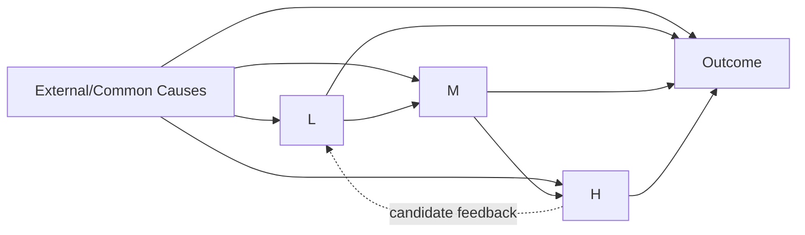
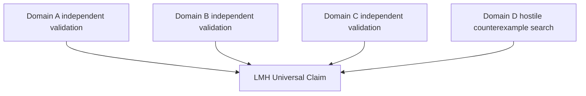
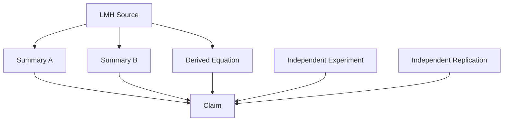
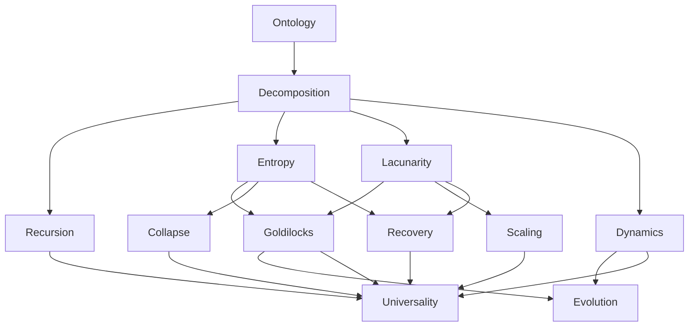
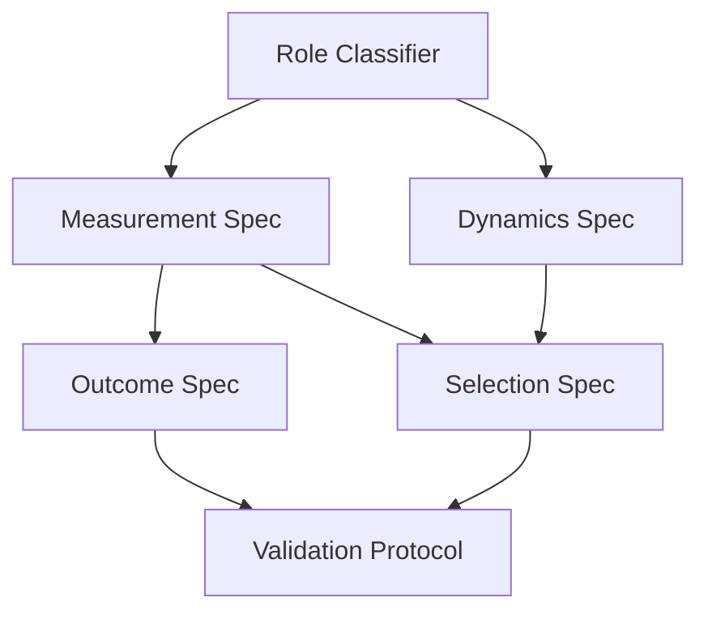
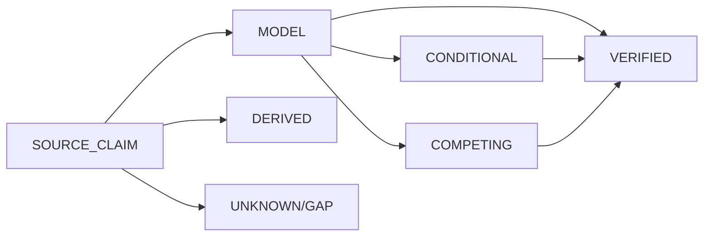

# TRANG [L, M, H] — ABSOLUTE FULL CANON

## Part III · Canonical Closure · Operator Algebra · Recursive State Space · Viability · Proof Topology · Validation Architecture

**Continuation status:** This continues the same Trang `[L,M,H]` corpus expansion from §1792. It does **not** overwrite earlier source-grounded material.

**Epistemic classes used below:** `SOURCE_CLAIM`, `VERIFIED`, `DERIVED`, `MODEL`, `CONDITIONAL`, `COMPETING`, `UNKNOWN/GAP`.

---

# 1793. Canonical Kernel

The smallest source-grounded structural kernel remains:

$$
\boxed{
S=L\sqcup M\sqcup H
}
$$

with recursive application:

$$
\boxed{
X=X_L\sqcup X_M\sqcup X_H
\qquad
X\in\{L,M,H\}
}
$$

The central distinction is:

$$
\boxed{
LMH = roles
}
$$

rather than necessarily three physical objects.

---

# 1794. Canonical Contextual Form

The hardened representation is:

$$
\boxed{
D_C:S\mapsto(L_C,M_C,H_C)
}
$$

where \(C\) carries the applicability envelope.

---

# 1795. Context Envelope

A maximally explicit candidate context is:

$$
C=
(
B,\sigma,t,R,Q,O,A
)
$$

where:

* \(B\) = system boundary;
* \(\sigma\) = scale;
* \(t\) = temporal window;
* \(R\) = regime;
* \(Q\) = analytical question;
* \(O\) = observation method;
* \(A\) = assumptions.

**Class:** `PROPOSED`.

---

# 1796. Contextual Identity Law

$$
\boxed{
Role(x)\rightarrow Role(x\mid Parent,C)
}
$$

is the safer formal representation.

---

# 1797. Consequence

The same entity can occupy different roles under different contexts:

$$
Role(x\mid S_1,C_1)=L
$$

while:

$$
Role(x\mid S_2,C_2)=H
$$

without contradiction.

---

# 1798. Role Is Relational

Thus:

$$
\boxed{
LMHRole\neq IntrinsicEssence
}
$$

---

# 1799. Hierarchy Is Not Status

The notation:

$$
L,M,H
$$

must not be read as:

```text
inferior
middle-status
superior
```

unless a specific domain explicitly defines it that way.

---

# 1800. Peak Is Functional

`H — Peak` is best preserved as the source-defined high-order/synthesis role, not a universal social ranking.

---

# 1801. Foundation Is Functional

`L — Foundation` need not mean spatial bottom.

---

# 1802. Mediator Is Functional

`M — Mediator` need not mean spatial middle.

---

# 1803. Three Necessary Structural Questions

For any candidate decomposition:

1. What sustains or provides the foundational state?
2. What mediates/transforms/co-ordinates?
3. What synthesizes/selects/expresses high-order outcome?

These are **derived diagnostic questions**, not a replacement for source definitions.

---

# 1804. Diagnostic Questions Are Not Proof

Answering all three plausibly does not establish that the decomposition is canonical.

---

# 1805. Formal Decomposition Operator

Let:

$$
\mathcal P_3(S)
$$

denote the set of ordered three-way partitions of \(S\).

Then:

$$
D_C(S)\in\mathcal P_3(S)
$$

if a valid LMH partition exists.

---

# 1806. Ordered Partition

LMH is not merely:

$$
\{A,B,C\}
$$

It is an ordered role assignment:

$$
(L,M,H)
$$

---

# 1807. Permutation Sensitivity

In general:

$$
(L,M,H)\neq(M,L,H)
$$

---

# 1808. Role Assignment Function

For each component \(x\):

$$
\rho_C(x,S)\in\{L,M,H\}
$$

---

# 1809. Partition Reconstruction

Then:

$$
L=\{x:\rho_C(x,S)=L\}
$$

$$
M=\{x:\rho_C(x,S)=M\}
$$

$$
H=\{x:\rho_C(x,S)=H\}
$$

---

# 1810. But \(\rho_C\) Is Missing

The corpus does not yet provide a universally executable classifier:

$$
\rho_C
$$

Therefore decomposition remains partly semantic/model-governed.

---

# 1811. Central Formal Gap

$$
\boxed{
\rho_C = UNKNOWN/GAP
}
$$

is arguably the most load-bearing unresolved formal element.

---

# 1812. Why It Matters

Without \(\rho_C\):

* uniqueness cannot be algorithmically checked;
* decomposition reproducibility is uncertain;
* layer-specific metrics depend on analyst interpretation;
* cross-domain comparisons can drift.

---

# 1813. Decomposition Reproducibility

Suppose analysts \(A\) and \(B\) independently classify the same system.

Ideal:

$$
D_C^A(S)=D_C^B(S)
$$

---

# 1814. Disagreement Rate

For component-level assignments:

$$
\delta_{AB}
=
\frac{
|\{x:\rho_A(x)\neq\rho_B(x)\}|
}{
|S|
}
$$

for finite \(S\).

**PROPOSED metric.**

---

# 1815. Perfect Agreement

$$
\delta_{AB}=0
$$

---

# 1816. But Agreement Does Not Prove Truth

Two analysts can agree on the same wrong decomposition.

---

# 1817. Agreement Is Reliability

Not necessarily validity.

---

# 1818. Reliability vs Validity

$$
Reliable\neq Valid
$$

---

# 1819. Inter-Rater Reliability

Could be measured empirically if the decomposition protocol becomes operational.

---

# 1820. Validation Requires External Criterion

A decomposition becomes stronger if it predicts independent observations not used to create it.

---

# 1821. Circularity Firewall

Do not define L/M/H using an outcome and then claim the decomposition predicts that same outcome.

---

# 1822. Example Circularity

If L is defined as:

> the part whose entropy stays below 0.1,

then observing:

$$
E_L<0.1
$$

cannot independently validate the threshold.

---

# 1823. Therefore

Role classification and metric validation should be operationally separable.

---

# 1824. Canonical Test Design

Ideal sequence:

$$
Decompose
\rightarrow
FreezeRoles
\rightarrow
Measure
\rightarrow
Predict
\rightarrow
ObserveOutcome
$$

---

# 1825. No Post-Hoc Role Switching

If outcome is poor, one must not simply relabel components to make LMH fit.

---

# 1826. Versioned Reclassification

If new evidence justifies reclassification:

```text
D_v1
→ new evidence
→ D_v2
```

must preserve lineage.

---

# 1827. Recursive Operator

Define:

$$
R(X)=
(X_L,X_M,X_H)
$$

---

# 1828. Recursive Composition

$$
R^2(S)
$$

produces the nine second-level roles.

---

# 1829. General Depth

$$
R^d(S)
$$

produces up to:

$$
3^d
$$

depth-\(d\) nodes under full expansion.

---

# 1830. Path Representation

A node:

$$
S_{LMH}
$$

means:

```text
root
→ L child
→ M child
→ H child
```

---

# 1831. Address Alphabet

$$
\Sigma=\{L,M,H\}
$$

---

# 1832. Recursive Language

$$
\Sigma^*
$$

contains every finite LMH address.

---

# 1833. Empty Address

$$
\epsilon
$$

can represent the root.

---

# 1834. Child Operator

$$
Child(a,r)=ar
$$

where:

$$
r\in\Sigma
$$

---

# 1835. Parent Operator

For non-root address \(ar\):

$$
Parent(ar)=a
$$

---

# 1836. Prefix Order

Define:

$$
a\preceq b
$$

iff \(a\) is a prefix of \(b\).

---

# 1837. Ancestor Relation

$$
a\prec b
$$

means \(a\) is a strict ancestor.

---

# 1838. Tree Distance

For addresses \(a,b\):

$$
d_T(a,b)
=
|a|+|b|-2|LCP(a,b)|
$$

where \(LCP\) is their longest common prefix.

**DERIVED mathematical representation.**

---

# 1839. Why Useful

It provides a structural distance inside the recursive LMH tree.

---

# 1840. But Structural Distance Is Not Semantic Distance

$$
d_T(a,b)
$$

does not automatically measure functional similarity.

---

# 1841. Nor Causal Distance

A distant node can exert strong direct influence.

---

# 1842. Recursive Depth

Depth is:

$$
depth(a)=|a|
$$

---

# 1843. Depth ≠ Complexity

A deep node is not automatically more complex.

---

# 1844. Depth ≠ Importance

A root-level node is not automatically more important for every question.

---

# 1845. Depth ≠ Confidence

Evidence at depth 7 is not inherently weaker than evidence at depth 2.

---

# 1846. Depth ≠ Scale Unless Bound

The recursion path may represent scale, function, or another hierarchy.

---

# 1847. Scale Binding Gap

A formal relation:

$$
Scale(a)
$$

is not fully supplied.

---

# 1848. Recursive Termination

Infinite conceptual recursion raises the question:

$$
WhenStop?
$$

---

# 1849. Source Does Not Give Universal Stop Rule

Therefore practical termination is task-dependent.

---

# 1850. Proposed Stop Predicate

$$
Stop(a,Q)
$$

when further decomposition cannot materially change answer \(Q\).

---

# 1851. Minimum Sufficient Depth

Define:

$$
d^*(Q)
=
\min\{d:
DecisionStable(Q\mid R^{\le d})\}
$$

**PROPOSED.**

---

# 1852. Integrity Constraint

Do not stop at \(d^*\) if a known critical unresolved dependency exists below it.

---

# 1853. Recursive Search Complexity

Naive full traversal:

$$
O(3^d)
$$

---

# 1854. Dependency-Guided Traversal

If only \(k\) branches matter:

$$
O(kd)
$$

may be conceptually achievable.

Not a source runtime complexity guarantee.

---

# 1855. Fractal Knowledge Retrieval

This motivates:

```text
retrieve relevant branch
not entire universe
```

---

# 1856. Canonical Structural Predicate

Define:

$$
Partition_C(S,L,M,H)
$$

iff:

$$
L\cup M\cup H=S
$$

and:

$$
L\cap M=M\cap H=H\cap L=\emptyset
$$

under the chosen partition ontology.

---

# 1857. Canonical Recursive Predicate

$$
RecursiveLMH_C(S)
$$

iff the LMH partition rule applies to each recursively decomposed node within scope.

---

# 1858. Strong Universality Predicate

$$
UniversalLMH
=
\forall S\in\mathcal S,\ RecursiveLMH_C(S)
$$

---

# 1859. Domain-Scoped Predicate

Safer empirical target:

$$
UniversalLMH_D
=
\forall S\in D,\ RecursiveLMH_C(S)
$$

for a specified domain \(D\).

---

# 1860. Finite-Test Limitation

Even extensive samples cannot logically establish:

$$
\forall S\in D
$$

unless \(D\) itself is finite and exhaustively tested.

---

# 1861. Empirical Wording

Use:

```text
supported in sampled domain D
```

rather than:

```text
proven for every possible member of D
```

---

# 1862. Entropy Operator

Define:

$$
\mathcal E(P_X)
=
-\frac{1}{\ln N_X}
\sum_i p_i^X\ln p_i^X
$$

for valid finite distributions.

---

# 1863. Operator Domain

$$
Dom(\mathcal E)
=
\left\{
p\in\Delta^{N-1}:N>1
\right\}
$$

under the finite formulation.

---

# 1864. Probability Simplex

$$
\Delta^{N-1}
=
\left\{
p_i\ge0,\ \sum_i p_i=1
\right\}
$$

---

# 1865. Entropy Symmetry

The Shannon expression is invariant under permutation of state labels.

---

# 1866. Consequence

Entropy measures distributional uncertainty, not semantic identity of states.

---

# 1867. Two Different Systems

Can have identical:

$$
E
$$

while having completely different states and mechanisms.

---

# 1868. Therefore

$$
E_A=E_B
\not\Rightarrow
A\cong B
$$

---

# 1869. Entropy Is Many-to-One

$$
\mathcal E(P_1)=\mathcal E(P_2)
$$

can hold for distinct distributions.

---

# 1870. Information Loss

A scalar E cannot uniquely reconstruct the underlying distribution.

---

# 1871. Thus E Is a Compression

Useful but lossy.

---

# 1872. Same Applies to Lacunarity

A single \(\Lambda(\varepsilon)\) value does not uniquely reconstruct the spatial/network distribution.

---

# 1873. Metric Pair Still Non-Unique

Even:

$$
(E,\Lambda)
$$

can correspond to many underlying systems.

---

# 1874. Therefore

$$
(E,\Lambda)
$$

is not a complete state representation.

---

# 1875. Goldilocks Region Is a Projection

It evaluates selected observables, not total system reality.

---

# 1876. Projection Firewall

$$
MetricPass
\neq
CompleteSystemValidation
$$

---

# 1877. Entropy Continuity

For finite fixed \(N\), Shannon entropy changes continuously with probability distribution.

---

# 1878. Boundary Sensitivity

Thus small distribution changes can move E across a hard threshold when close to the boundary.

---

# 1879. Threshold Margin

Define:

$$
m_E
=
distance(E,\partial I_E)
$$

where \(I_E\) is the relevant admissible interval.

**PROPOSED.**

---

# 1880. Positive Margin

Large \(m_E\) implies greater robustness to small measurement error.

---

# 1881. Zero Margin

At a boundary:

$$
m_E=0
$$

---

# 1882. Boundary Conflict Makes Margin Ambiguous

If source interval endpoints disagree, the boundary itself is competing.

---

# 1883. Lacunarity Operator

Define:

$$
\mathcal L_\varepsilon(M)
=
\frac{\operatorname{Var}(M)}
{\operatorname{Mean}(M)^2}
$$

---

# 1884. Coefficient-of-Variation Relation

Where mean is nonzero:

$$
\Lambda
=
CV^2
$$

if:

$$
CV=\frac{\sigma}{\mu}
$$

under the given variance convention.

---

# 1885. This Is a Direct Mathematical Derivation

$$
\frac{Var(M)}{Mean(M)^2}
=
\left(
\frac{SD(M)}{Mean(M)}
\right)^2
$$

---

# 1886. Interpretation

Under this source formula, lacunarity measures squared relative dispersion of box mass.

---

# 1887. Important Caveat

Some external lacunarity conventions include additive constants or other definitions.

The corpus formula must be preserved as its own definition.

---

# 1888. Do Not Replace Source Formula

External conventions cannot silently rewrite canon.

---

# 1889. Scale Profile

Rather than one value, define:

$$
\Lambda_X(\varepsilon)
$$

across multiple \(\varepsilon\).

---

# 1890. Lacunarity Spectrum

A proposed richer object:

$$
\mathcal L_X
=
\{
(\varepsilon,\Lambda_X(\varepsilon))
\}
$$

---

# 1891. Why Better

A single scale can hide structure visible at another scale.

---

# 1892. But Goldilocks Thresholds Need Scale Binding

If the source says:

$$
\Lambda_L<0.1
$$

the missing question is:

$$
\text{at what }\varepsilon?
$$

---

# 1893. If Threshold Intended Across All Scales

That would be a much stronger claim:

$$
\forall\varepsilon\in E,\quad
\Lambda_L(\varepsilon)<0.1
$$

---

# 1894. If Threshold Intended at One Canonical Scale

Need that scale.

---

# 1895. If Threshold Intended for an Aggregate

Need aggregation function.

---

# 1896. Therefore

Lacunarity thresholds remain operationally incomplete without scale semantics.

---

# 1897. Scale-Ratio Interpretation

The source ratios:

$$
\Lambda_M/\Lambda_L
$$

and:

$$
\Lambda_H/\Lambda_M
$$

also require the values to be measured compatibly.

---

# 1898. Same \(\varepsilon\)?

Possible hypothesis:

$$
\Lambda_L(\varepsilon),
\Lambda_M(\varepsilon),
\Lambda_H(\varepsilon)
$$

at a common scale.

---

# 1899. Layer-Relative \(\varepsilon\)?

Alternative:

$$
\Lambda_L(\varepsilon_L),
\Lambda_M(\varepsilon_M),
\Lambda_H(\varepsilon_H)
$$

---

# 1900. These Are Not Equivalent

Preserve as `COMPETING`.

---

# 1901. Dimensional Consistency

Because \(\Lambda\) is dimensionless under the source ratio, layer ratios are dimensionless.

---

# 1902. Entropy Also Dimensionless

Normalized Shannon entropy is dimensionless.

---

# 1903. Therefore Metric Space

$$
z\in\mathbb R^6
$$

is dimensionless under these definitions.

---

# 1904. But Dynamics May Not Be

The state variables \(L,M,H\) in differential equations may carry units or be abstract vectors.

---

# 1905. Type Gap

The same letters:

$$
L,M,H
$$

appear to denote both roles/layers and dynamic state quantities.

---

# 1906. Potential Overloading

This notation should be disambiguated in an executable specification.

---

# 1907. Proposed Distinction

Use:

$$
\mathcal L,\mathcal M,\mathcal H
$$

for structural layers and:

$$
x_L,x_M,x_H
$$

for dynamic states.

---

# 1908. Then

$$
\dot x_L
=
-\alpha_Lx_L
+
\beta_LF_M(x_M)
+
\gamma_L\xi_L
$$

etc.

---

# 1909. This Is Not Source Renaming

It is a proposed type-safety convention.

---

# 1910. Type Safety Matters

Otherwise an equation can accidentally treat a set-valued layer as a scalar.

---

# 1911. Formal Type Signature

Possible:

$$
x_L(t)\in\mathcal X_L
$$

$$
x_M(t)\in\mathcal X_M
$$

$$
x_H(t)\in\mathcal X_H
$$

---

# 1912. Scalar Case

$$
\mathcal X_X\subseteq\mathbb R
$$

---

# 1913. Vector Case

$$
\mathcal X_X\subseteq\mathbb R^{n_X}
$$

---

# 1914. Function Case

Could even be infinite-dimensional.

No source type is fixed.

---

# 1915. Coupling Function Types

For example:

$$
F_L:\mathcal X_M\rightarrow\mathcal X_L
$$

---

# 1916. Mediator Coupling

$$
F_M:
\mathcal X_L\times\mathcal X_H
\rightarrow
\mathcal X_M
$$

---

# 1917. Peak Coupling

$$
F_H:
\mathcal X_M
\rightarrow
\mathcal X_H
$$

---

# 1918. This Resolves a Type Ambiguity

But remains `PROPOSED` formalization.

---

# 1919. Noise Types

$$
\xi_X(t)\in\mathcal X_X
$$

or corresponding tangent/input space.

---

# 1920. Parameter Type

If scalar states:

$$
\alpha_X,\beta_X,\gamma_X\in\mathbb R
$$

---

# 1921. Vector Systems

These may instead be matrices/operators.

---

# 1922. Therefore Scalar Notation Is Potentially Schematic

Do not infer the theory requires one-dimensional L/M/H dynamics.

---

# 1923. Nonlinearity

The presence of:

$$
F(...)
$$

allows nonlinear coupling.

---

# 1924. Linear Special Case

If:

$$
F_L(M)=M
$$

$$
F_M(L,H)=aL+bH
$$

$$
F_H(M)=M
$$

then a linear system results.

---

# 1925. But Those Functions Are Not Source-Specified

This is only an example of one possible instantiation.

---

# 1926. Fixed-Point Form

For deterministic zero-noise equilibrium:

$$
0=f(x^*)
$$

---

# 1927. Stability Analysis Requires Jacobian

$$
J=
Df(x^*)
$$

---

# 1928. If Eigenvalues Negative Real Part

Local asymptotic stability follows under standard continuous-time assumptions.

---

# 1929. This Is Formal Dynamical Stability

It should not be called the same thing as Goldilocks stability without a binding theorem.

---

# 1930. Missing Binding Theorem

No source theorem currently states:

$$
Goldilocks(z)
\iff
Re(\lambda_i(J))<0
$$

---

# 1931. Nor One-Way Relation

No source theorem states:

$$
Goldilocks(z)
\Rightarrow
DynamicStable
$$

---

# 1932. Therefore Preserve Independence

Metric and dynamic stability are separate axes until connected.

---

# 1933. Stability Matrix

| Metric state | Dynamic state | Interpretation                                   |
| ------------ | ------------- | ------------------------------------------------ |
| pass         | stable        | mutually compatible                              |
| pass         | unstable      | metric pass does not guarantee dynamic stability |
| fail         | stable        | stable but outside metric target                 |
| fail         | unstable      | both problematic                                 |
| unknown      | stable        | metric uncertainty                               |
| pass         | unknown       | dynamics unresolved                              |

---

# 1934. Operational State Adds Third Axis

A system can be:

$$
MetricPass,\ DynamicStable,\ OperationalFail
$$

---

# 1935. Ethical State Adds Fourth Axis

A stable functioning system can still be ethically unacceptable.

---

# 1936. Therefore Avoid Scalar “Health”

A multidimensional state is more faithful.

---

# 1937. Viability Kernel Analogy

In control theory language, Goldilocks can be viewed as a candidate admissible region:

$$
\mathcal V\subseteq\mathcal Z
$$

---

# 1938. But Exact Identity Is Not Established

Use `MODEL ANALOGY`.

---

# 1939. Invariance Question

A true viability kernel usually asks whether trajectories can remain inside a constraint region.

---

# 1940. Goldilocks Source Gives Ranges

But does not fully prove:

$$
z(0)\in\mathcal G
\Rightarrow
z(t)\in\mathcal G
$$

---

# 1941. Thus Goldilocks Region May Not Be Forward-Invariant

---

# 1942. Selection Operator May Enforce It

Potentially:

$$
\mathcal C
$$

could reject states outside \(\mathcal G\).

---

# 1943. But Exact Selection Mechanics Missing

Therefore forward invariance is `UNKNOWN`.

---

# 1944. Candidate Projection Operator

One possible mathematical implementation:

$$
\mathcal C(x)=\Pi_{\mathcal G}(x)
$$

---

# 1945. But Projection Is Not Canon

It could distort dynamics and has no source support.

---

# 1946. Candidate Rejection Operator

$$
\mathcal C(x)=
\begin{cases}
x,&x\in\mathcal G\\
x_{old},&x\notin\mathcal G
\end{cases}
$$

also possible.

---

# 1947. Candidate Repair Operator

$$
\mathcal C(x)=Repair(x)
$$

---

# 1948. Candidate Probabilistic Selection

$$
P(Accept\mid x)
$$

could depend on distance from \(\mathcal G\).

---

# 1949. Again

No evidence chooses among these.

---

# 1950. Selection Semantics Are Critical for Simulation

Without them, evolutionary simulations can implement materially different theories while claiming the same equation.

---

# 1951. Formal Specification Must Pin \(\mathcal C\)

---

# 1952. Mutation Operator

Likewise:

$$
\tilde X
$$

needs a generation rule.

---

# 1953. Candidate Mutation

$$
\tilde X=X+\eta
$$

would be one possible stochastic mutation.

Not source canon.

---

# 1954. Structural Mutation

Could instead alter graph topology.

---

# 1955. Parameter Mutation

Could alter:

$$
\alpha,\beta,\gamma
$$

---

# 1956. Role Mutation

Could alter the decomposition itself.

---

# 1957. These Mutation Types Are Not Equivalent

---

# 1958. Mutation Taxonomy — Proposed

```text
STATE_MUTATION
PARAMETER_MUTATION
TOPOLOGY_MUTATION
ROLE_MUTATION
RULE_MUTATION
```

---

# 1959. Rule Mutation Is Highest Risk

Changing the LMH governing law itself can invalidate all downstream proof capsules.

---

# 1960. State Mutation Is Usually More Local

---

# 1961. Dependency Radius

Define:

$$
DepRadius(m)
$$

as the set of conclusions potentially affected by mutation \(m\).

---

# 1962. Local Revalidation

Only:

$$
DepRadius(m)
$$

must be revalidated if independence is established.

---

# 1963. Independence Must Be Demonstrated

Not assumed.

---

# 1964. Shared Parameters Create Hidden Coupling

If two branches share:

$$
\theta
$$

then changing \(\theta\) affects both.

---

# 1965. Shared Data Can Also Couple Branches

Two metrics computed from the same observation stream are not independent just because they belong to different layers.

---

# 1966. Provenance Topology Must Include Data Ancestry

---

# 1967. Source Node

```yaml
id: SOURCE_A
type: SOURCE_CLAIM
```

---

# 1968. Observation Node

```yaml
id: OBS_1
type: OBSERVATION
source: SENSOR_A
```

---

# 1969. Derived Node

```yaml
id: E_L_1
type: DERIVED
depends_on:
  - OBS_1
  - ENTROPY_PROTOCOL_V1
```

---

# 1970. Model Node

```yaml
id: GOLDILOCKS_L
type: MODEL
```

---

# 1971. Decision Node

```yaml
id: DECISION_1
type: DECISION
depends_on:
  - E_L_1
  - GOLDILOCKS_L
```

---

# 1972. Typed Evidence Prevents Category Collapse

A model threshold and a sensor observation are not the same epistemic object.

---

# 1973. Source Claim vs Observation

$$
SOURCE\_CLAIM\neq OBSERVATION
$$

---

# 1974. Observation vs Derived Metric

$$
OBSERVATION\neq DERIVED
$$

---

# 1975. Derived Metric vs Decision

$$
DERIVED\neq DECISION
$$

---

# 1976. Model vs Observation

$$
MODEL\neq OBSERVATION
$$

---

# 1977. This Is Essential for LMH

Because the corpus contains both equations and broad cross-domain interpretive claims.

---

# 1978. Provenance Graph

A conclusion should retain the path:

```text
source/model
→ observation protocol
→ observation
→ derived metric
→ rule
→ conclusion
```

---

# 1979. Proof Capsule Must Expose Load-Bearing Premises

---

# 1980. Example

```yaml
claim:
  "L entropy satisfies source Goldilocks condition"

premises:
  - role_assignment_L
  - entropy_state_space
  - probability_estimate
  - threshold_semantics

evidence:
  - observation_set_A

class: DERIVED
```

---

# 1981. Confidence Ceiling

If role assignment is only conditional:

$$
ClaimClass
$$

cannot be stronger than conditional for the layer-specific conclusion.

---

# 1982. Weakest-Premise Law

$$
\boxed{
C_{derived}
\le
\min_i C_{premise_i}
}
$$

conceptually.

---

# 1983. Independent Revalidation Exception

A derived claim may later receive direct independent validation.

Then its support topology changes.

---

# 1984. Example

Prediction from LMH:

$$
P
$$

is later directly observed independently.

---

# 1985. Then P Has Two Paths

```text
LMH derivation → P
independent observation → P
```

---

# 1986. But Observation of P Does Not Automatically Validate Every Premise

Alternative mechanisms may produce P.

---

# 1987. Affirming the Consequent Firewall

If:

$$
LMH\Rightarrow P
$$

and:

$$
P
$$

is observed, one cannot infer LMH uniquely.

---

# 1988. Need Discriminating Predictions

Strong validation uses predictions where competing models differ.

---

# 1989. Model Comparison

Let:

$$
M_1=LMH
$$

$$
M_2=Alternative
$$

---

# 1990. High-Value Observation

Find \(O\) such that:

$$
P(O\mid M_1)
$$

and:

$$
P(O\mid M_2)
$$

differ strongly.

---

# 1991. This Is More Informative Than Confirming Generic Predictions

---

# 1992. Collapse Rule as Discriminating Candidate

If alternative models allow collapse under low L/M entropy while LMH forbids it, those cases are highly informative.

---

# 1993. Recovery Rule as Discriminating Candidate

Same logic.

---

# 1994. Direct L-H Collapse Claim

The approximately-ten-step rule is potentially highly falsifiable if operationalized.

---

# 1995. But It Needs Definitions First

Otherwise failures can be explained away by redefining:

* direct;
* mediator;
* step;
* collapse.

---

# 1996. Falsifiability Requires Frozen Semantics

---

# 1997. Moving-Goalpost Firewall

Do not alter definitions after observing counterexamples without explicitly versioning the theory.

---

# 1998. Theory Version

```yaml
lmh_theory:
  version:
  definitions_hash:
  threshold_version:
  measurement_version:
```

**PROPOSED.**

---

# 1999. Reproducible Test

A test receipt should bind to that version.

---

# 2000. Threshold Versioning

```yaml
thresholds:
  version:
  E_L:
  E_M:
  E_H:
  Lambda_L:
  Lambda_M:
  Lambda_H:
```

---

# 2001. Boundary Semantics Must Be Explicit

Use machine-readable operators:

```yaml
operator: "<"
```

not prose like:

```text
below
```

when exactness matters.

---

# 2002. Example

```yaml
E_L:
  lower: 0
  lower_inclusive: true
  upper: 0.1
  upper_inclusive: false
```

---

# 2003. Competing Threshold Encoding

Where source disagrees:

```yaml
E_M:
  status: COMPETING
  candidates:
    - interval: "[0.1,0.2]"
    - interval: "(0.1,0.2)"
```

---

# 2004. No Automatic Merge

Do not produce:

$$
[0.1,0.2)
$$

as a compromise unless canon explicitly defines it.

---

# 2005. Compromise Is Not Evidence

---

# 2006. Intersection Can Be Used for Robust Interior

But must be labeled derived:

$$
[0.1,0.2]\cap(0.1,0.2)
=
(0.1,0.2)
$$

---

# 2007. Union Can Represent Possible Admissibility

$$
[0.1,0.2]\cup(0.1,0.2)
=
[0.1,0.2]
$$

---

# 2008. These Answer Different Questions

Intersection:

> valid under every candidate interpretation.

Union:

> valid under at least one candidate interpretation.

---

# 2009. Three-Valued Boundary Logic

For candidate predicates \(P_1,\ldots,P_k\):

```text
TRUE       if all Pi true
FALSE      if all Pi false
COMPETING  otherwise
```

---

# 2010. This Generalizes Robust Interior Logic

---

# 2011. Formal Definition

$$
Eval(x)=
\begin{cases}
TRUE,&\forall i,\ P_i(x)\\
FALSE,&\forall i,\neg P_i(x)\\
COMPETING,&otherwise
\end{cases}
$$

---

# 2012. Useful Until Canon Is Resolved

---

# 2013. Collapse Logic — Exact

Source:

$$
C\Rightarrow A\lor B
$$

---

# 2014. Truth-Functional Consequence

The only impossible valuation under the rule is:

$$
C=TRUE,\ A=FALSE,\ B=FALSE
$$

---

# 2015. Full Truth Table

| Collapse | A | B | Source rule |
| -------- | - | - | ----------- |
| F        | F | F | satisfied   |
| F        | F | T | satisfied   |
| F        | T | F | satisfied   |
| F        | T | T | satisfied   |
| T        | F | F | violated    |
| T        | F | T | satisfied   |
| T        | T | F | satisfied   |
| T        | T | T | satisfied   |

---

# 2016. Critical Consequence

Threshold exceedance can occur without collapse.

---

# 2017. Therefore Thresholds Are Not Deterministic Collapse Classifiers

At least not from this implication alone.

---

# 2018. Recovery Logic — Exact

$$
R\Rightarrow A\land B
$$

where:

$$
A=(E_L<0.05)
$$

$$
B=(\Lambda_L<0.1)
$$

---

# 2019. Truth Table

| Recovery | A | B | Source rule |
| -------- | - | - | ----------- |
| F        | F | F | satisfied   |
| F        | F | T | satisfied   |
| F        | T | F | satisfied   |
| F        | T | T | satisfied   |
| T        | F | F | violated    |
| T        | F | T | violated    |
| T        | T | F | violated    |
| T        | T | T | satisfied   |

---

# 2020. Thus

Low E and low \(\Lambda\) can occur without recovery.

---

# 2021. Again

Necessary conditions only.

---

# 2022. Collapse and Recovery Are Not Logical Complements

No source statement gives:

$$
Recovery=\neg Collapse
$$

---

# 2023. Therefore a System Could Be Neither

---

# 2024. Could It Be Both?

The supplied implications alone do not fully forbid simultaneous labels, because collapse can satisfy via \(E_M>0.2\) while recovery conditions depend on \(E_L,\Lambda_L\).

---

# 2025. Example Logical State

$$
E_L=0.04
$$

$$
\Lambda_L=0.05
$$

$$
E_M=0.25
$$

satisfies the necessary conditions for both propositions.

---

# 2026. Important Gap

If collapse and recovery are intended as mutually exclusive operational states, an additional invariant is required.

---

# 2027. Proposed Exclusivity

$$
Collapse\Rightarrow\neg Recovery
$$

would solve this, but it is **not source-grounded here**.

---

# 2028. Alternative

Recovery may denote a process occurring after collapse, in which case temporal indexing resolves the apparent overlap.

---

# 2029. Temporal Form

$$
Collapse(t_0)
$$

$$
Recovery(t_1),\quad t_1>t_0
$$

---

# 2030. This Is Plausible

But not fully specified.

---

# 2031. Temporal Semantics Are Critical

Outcome labels need timestamps or intervals.

---

# 2032. Proposed Outcome Object

```yaml
outcome:
  type:
  onset:
  duration:
  resolution:
  evidence:
```

---

# 2033. State vs Event

Collapse could be:

* an event;
* a state;
* a transition;
* a process.

---

# 2034. Recovery Likewise

---

# 2035. These Semantics Affect Logic

If collapse is an event,:

$$
Collapse(t)
$$

differs from:

$$
CollapsedState(t)
$$

---

# 2036. Formal Distinction

$$
CollapseEvent:
Normal\rightarrow Collapsed
$$

---

# 2037. Collapsed State

$$
State(t)=Collapsed
$$

---

# 2038. Recovery Event

$$
Collapsed\rightarrow Recovering
$$

or:

$$
Recovering\rightarrow Normal
$$

depending on definition.

---

# 2039. No Source State Machine Yet

Preserve gap.

---

# 2040. Hysteresis Analysis

Assume ordinary L stability allows approximately:

$$
E_L<0.1
$$

while recovery requires:

$$
E_L<0.05
$$

---

# 2041. Then Recovery Is Stricter

$$
E_L<0.05
\Rightarrow
E_L<0.1
$$

---

# 2042. Thus

Every recovery-qualified L entropy also satisfies the ordinary upper L threshold, assuming compatible semantics.

---

# 2043. Converse Fails

$$
E_L<0.1
\not\Rightarrow
E_L<0.05
$$

---

# 2044. Recovery Margin

There is a band:

$$
0.05\le E_L<0.1
$$

where ordinary L entropy may be acceptable while recovery condition fails.

---

# 2045. This Is Consistent with Hysteresis

But does not prove hysteresis was intended.

---

# 2046. Formal Hysteresis Requires State Dependence

A true hysteretic rule typically depends on trajectory/history.

---

# 2047. Source Gives Different Thresholds

But not explicit memory operator.

---

# 2048. Therefore

`HYSTERESIS_CANDIDATE = DERIVED/CONDITIONAL`.

---

# 2049. Direct L-H Claim and Mediator Necessity

The source's approximately-ten-step collapse claim implies a special structural role for M.

---

# 2050. Strong Hypothesis

$$
M
$$

is necessary for long-horizon stability under direct L-H coupling.

---

# 2051. But Necessity Scope Unknown

Potentially:

* only certain dynamics;
* only source simulation;
* only specified parameter regimes.

---

# 2052. Do Not Generalize to Every System

---

# 2053. Mediator Ablation Test

A rigorous empirical design could compare:

$$
System_{M}
$$

with:

$$
System_{\neg M}
$$

under matched conditions.

---

# 2054. But Removing M May Change Many Things

Thus intervention may introduce confounds.

---

# 2055. Better Design

If possible, manipulate mediation function while preserving other variables.

---

# 2056. Mechanism Test

Measure whether M changes:

* delay;
* variance;
* coupling gain;
* error correction;
* coordination.

---

# 2057. This Can Distinguish Mechanisms

---

# 2058. Correlation Is Insufficient

Observing M-rich systems survive longer does not alone establish mediation causes survival.

---

# 2059. Selection Bias

Systems with effective M may differ in many other ways.

---

# 2060. Causal Identification Required

---

# 2061. Dynamic Causal Graph — Candidate



This is a **causal-analysis template**, not source canon.

---

# 2062. Confounder \(U\)

The source dynamics include noise but do not fully specify common causes.

---

# 2063. Feedback Complicates Causal Identification

Ordinary static DAG methods may be insufficient for cyclic systems.

---

# 2064. Temporal Unrolling

A candidate:

$$
L_t\rightarrow M_{t+1}
$$

$$
M_t\rightarrow H_{t+1}
$$

$$
H_t\rightarrow L_{t+1}
$$

could produce an acyclic time-expanded graph.

---

# 2065. But Lag Structure Is Not Source-Specified

Do not canonize.

---

# 2066. Instantaneous Coupling

Alternative:

$$
L_t\leftrightarrow M_t
$$

could require simultaneous-equation methods.

---

# 2067. Again COMPETING

---

# 2068. Delay Differential Model

Another possible formulation:

$$
\dot L(t)
=
-\alpha_LL(t)
+
\beta_LF(M(t-\tau_M))
+
...
$$

---

# 2069. No Delays Are Supplied

Therefore this remains hypothetical.

---

# 2070. Timescale Separation

L, M, H may evolve at different characteristic times.

---

# 2071. Candidate

$$
\tau_L\gg\tau_M\gg\tau_H
$$

would be plausible in some domains.

---

# 2072. But Not Universal

No source equation licenses that ordering.

---

# 2073. Timescale Must Be Measured Per Domain

---

# 2074. Recursive Timescales

Even sublayers may have different timescales:

$$
\tau_{LL},
\tau_{LM},
\tau_{LH}
$$

---

# 2075. Complexity Explodes Quickly

Again supporting selective rather than exhaustive modeling.

---

# 2076. Coarse-Graining

One way to control recursion is to aggregate sublayer dynamics.

---

# 2077. Coarse-Graining Operator

$$
G:
(X_L,X_M,X_H)\rightarrow X
$$

---

# 2078. But Source Does Not Define G

---

# 2079. Critical Recursive Closure Gap

The theory says:

$$
X\rightarrow(X_L,X_M,X_H)
$$

but how child states reconstruct parent state is not fully specified.

---

# 2080. This Is Different from Decomposition

Decomposition:

$$
D(X)\rightarrow children
$$

Composition:

$$
G(children)\rightarrow X
$$

---

# 2081. Ideally

$$
G(D(X))=X
$$

---

# 2082. But No Such Theorem Is Supplied

---

# 2083. Information-Loss Possibility

If D is a role abstraction rather than literal partition, reconstruction may be impossible.

---

# 2084. Therefore

$$
G=D^{-1}
$$

must not be assumed.

---

# 2085. Composition Is a New Critical Gap

Add:

```text
LMH_COMPOSITION_OPERATOR = UNKNOWN/GAP
```

---

# 2086. Why Composition Matters

Without it:

* recursive simulations cannot cleanly propagate child state upward;
* parent metrics cannot be derived from children;
* multiscale conservation cannot be tested.

---

# 2087. Conservation Laws

No universal conservation law is supplied for LMH quantities.

---

# 2088. Do Not Assume

$$
L+M+H=S
$$

numerically merely because:

$$
S=L\sqcup M\sqcup H
$$

structurally.

---

# 2089. Set Partition ≠ Scalar Sum

---

# 2090. Likewise

$$
Mass(S)=Mass(L)+Mass(M)+Mass(H)
$$

only if literal mass is additive and partition semantics support it.

---

# 2091. Entropy Is Not Generally Additive

---

# 2092. Lacunarity Is Not Generally Additive

---

# 2093. Dynamics May Exchange Quantities

No conservation term is explicitly specified.

---

# 2094. Open Systems May Gain/Lose Quantity

---

# 2095. Therefore Conservation Must Be Domain-Specific

---

# 2096. Recursive Composition Hypotheses

### C1 — Additive

$$
X=X_L+X_M+X_H
$$

### C2 — Weighted

$$
X=w_LX_L+w_MX_M+w_HX_H
$$

### C3 — Nonlinear

$$
X=G(X_L,X_M,X_H)
$$

### C4 — Purely Semantic

No numerical composition exists.

---

# 2097. Preserve COMPETING

---

# 2098. Cheapest Evidence

An explicit source parent-child aggregation equation.

---

# 2099. Scale Transition Operator

If recursion corresponds to scale, define:

$$
T_{\sigma\rightarrow\sigma'}
$$

---

# 2100. No Such Operator Is Supplied

---

# 2101. Cross-Scale Comparison

Thus:

$$
E_L^{(\sigma_1)}
$$

and:

$$
E_L^{(\sigma_2)}
$$

cannot automatically be compared.

---

# 2102. Measurement Invariance

Need:

$$
MeasurementSemantics_{\sigma_1}
\approx
MeasurementSemantics_{\sigma_2}
$$

---

# 2103. Otherwise Differences May Be Measurement Artifacts

---

# 2104. Simpson-Type Aggregation Risks

A parent-level pattern can differ from every subgroup pattern.

---

# 2105. Therefore

Parent LMH metrics should not be inferred from child averages without proof.

---

# 2106. Cross-Level Fallacy Firewall

$$
Property(child)
\not\Rightarrow
Property(parent)
$$

---

# 2107. Reverse Fallacy

$$
Property(parent)
\not\Rightarrow
Property(child)
$$

---

# 2108. Recursive Similarity Does Not Eliminate These Fallacies

---

# 2109. Emergence

H-level properties may emerge from lower-level interactions.

---

# 2110. But “Emergence” Needs Definition

Do not use it as a causal placeholder.

---

# 2111. Candidate Formal Emergence

A property \(P(X)\) is emergent relative to children if it is not trivially attributable to any one child but arises from composition \(G\).

---

# 2112. Still Model-Level

---

# 2113. Downward Constraint

H could constrain L/M through feedback.

---

# 2114. But This Does Not Automatically Establish Philosophical “downward causation”

Use ordinary system coupling language unless stronger claims are justified.

---

# 2115. Feedback Typology

```text
POSITIVE
NEGATIVE
BALANCING
REINFORCING
DELAYED
CONDITIONAL
```

could characterize edges.

---

# 2116. Source Does Not Fully Type Them

---

# 2117. Sign of Coupling

$$
\beta_X
$$

may help if its sign is known.

---

# 2118. But Nonlinear F Can Reverse Local Effect

Even positive \(\beta\) does not guarantee globally positive influence.

---

# 2119. Local Derivative

Effect depends on:

$$
\beta_X\frac{\partial F}{\partial y}
$$

---

# 2120. Therefore Edge Sign Can Be State-Dependent

---

# 2121. Nonlinear Regime Shifts

The same coupling may stabilize one regime and destabilize another.

---

# 2122. Scope/Regime Firewall Again

A stability result around \(x^*\) should not be generalized to distant states.

---

# 2123. Bifurcation Possibility

Changing parameters can alter the number or stability of equilibria.

---

# 2124. Source Does Not Supply Bifurcation Analysis

---

# 2125. But It Matters for Goldilocks Interpretation

A threshold crossing could coincide with a dynamical regime transition—or not.

---

# 2126. Do Not Assume Thresholds Are Bifurcation Points

---

# 2127. Empirical Test

Estimate whether qualitative dynamics change near source thresholds.

---

# 2128. Thresholds Could Instead Be Heuristic

Another competing hypothesis.

---

# 2129. Goldilocks Semantics

Possible interpretations:

1. formal invariant;
2. empirically calibrated range;
3. heuristic design target;
4. illustrative range.

---

# 2130. Current Corpus Does Not Fully Discriminate

Preserve `COMPETING`.

---

# 2131. Universal Constant Burden

If thresholds are claimed universal, measurement invariance across domains becomes especially demanding.

---

# 2132. Example

Entropy state spaces for:

* organizations;
* neural systems;
* galaxies;

may be defined very differently.

---

# 2133. Equal Normalized E Does Not Ensure Equal Meaning

---

# 2134. Normalization Gives Numerical Comparability

Not necessarily semantic comparability.

---

# 2135. Semantic Invariance Requirement

A cross-domain metric needs a preserved interpretation.

---

# 2136. Otherwise

$$
E_A=0.1
$$

and:

$$
E_B=0.1
$$

may be numerically equal but conceptually incomparable.

---

# 2137. Cross-Domain Tensor Candidate

A bridge object could carry:

```yaml
bridge:
  source_domain:
  target_domain:
  role_semantics:
  metric_semantics:
  measurement_equivalence:
  mechanism_equivalence:
  causal_license:
```

---

# 2138. Bridge Classes

Use at minimum:

```text
ANALOGY
STRUCTURAL
INFORMATIONAL
DYNAMICAL
CAUSAL
```

---

# 2139. Bridge Class Cannot Exceed Evidence

---

# 2140. Structural Bridge

Requires role/relation correspondence.

---

# 2141. Dynamical Bridge

Requires comparable state-transition behavior.

---

# 2142. Causal Bridge

Requires evidence that mechanisms/interventions transfer.

---

# 2143. Same Equations Do Not Guarantee Causal Bridge

---

# 2144. Universality Proof Topology

A universal claim would ideally have many independent domain roots:



---

# 2145. Corpus Examples Are Not Equivalent

If all domain mappings derive from the same theory source, they are applications, not independent validations.

---

# 2146. Source Breadth ≠ Evidence Breadth

---

# 2147. Falsifier Density

A mature theory should make many risky predictions.

---

# 2148. Risky Prediction

One that competing models would not also trivially predict.

---

# 2149. LMH High-Value Candidate Predictions

Potentially:

* direct L-H bypass destabilization;
* collapse necessary entropy condition;
* recovery necessary E/Λ condition;
* lacunarity scaling ratios.

---

# 2150. These Are Better Empirical Targets Than Broad Analogies

---

# 2151. Validation Priority

$$
SpecificFalsifiableClaims
>
BroadInterpretiveSimilarity
$$

for empirical testing.

---

# 2152. Structural Core Can Be Useful Before Universal Validation

A framework need not be a universal law to be analytically valuable.

---

# 2153. Usefulness ≠ Truth

But also:

$$
NotUniversallyProven
\not\Rightarrow
Useless
$$

---

# 2154. Appropriate Use

LMH can be used as:

* decomposition heuristic;
* systems-analysis vocabulary;
* hypothesis generator;
* comparison schema;
* recursive knowledge organizer.

---

# 2155. Higher-Risk Use

Requires more evidence for:

* predictive thresholds;
* causal intervention;
* medical decisions;
* safety-critical control;
* irreversible institutional action.

---

# 2156. Governance Gradient

Validation burden rises with:

$$
Risk
\times
Irreversibility
\times
DependencyImpact
$$

conceptually.

---

# 2157. Reversible Exploration

Low-risk use may tolerate model uncertainty.

---

# 2158. Irreversible Action

Needs stronger independent validation.

---

# 2159. Decision Capsule

```yaml
decision:
  objective:
  stakes:
  reversibility:
  lmH_dependency:
  critical_claims:
  unresolved_gaps:
  safe_action:
  revalidation_trigger:
```

---

# 2160. Safe Action Under Uncertainty

Prefer interventions that:

* are reversible;
* gather information;
* preserve optionality;
* do not assume unverified causality.

---

# 2161. Information-Gathering Action

Can itself be optimal when model uncertainty is high.

---

# 2162. Value of Information

Conceptually:

$$
VOI(test)
=
ExpectedDecisionImprovement
-
TestCost
$$

---

# 2163. High-VOI LMH Test

Resolve decomposition semantics before collecting more examples.

---

# 2164. Another High-VOI Test

Resolve exact threshold precedence before boundary-sensitive classification.

---

# 2165. Low-VOI Test

Collect another analogy when the critical gap is measurement definition.

---

# 2166. Recursive Proof Capsule

For node \(a\):

```yaml
node:
  address: a
  role:
  parent:
  context:

claim:
class:

premises:
evidence:
provenance_roots:

scope:
regime:
freshness:

children:
  L:
  M:
  H:

competing:
falsifiers:
dependencies:
confidence_ceiling:
```

---

# 2167. Local Capsule Validity

A child capsule can remain valid even if a sibling fails.

---

# 2168. Example

If:

$$
M_H
$$

is invalidated,:

$$
L_L
$$

does not automatically fail.

---

# 2169. Unless Shared Dependency Exists

---

# 2170. Dependency Closure

Define:

$$
Closure(P)
$$

as all conclusions transitively dependent on premise \(P\).

---

# 2171. Invalidation

$$
Invalidate(P)
\Rightarrow
Invalidate(Closure(P))
$$

---

# 2172. Preserve Complement

All nodes outside closure remain unchanged unless another dependency links them.

---

# 2173. This Is Fractal Failure Recovery

---

# 2174. Proof Cache

Validated capsules can be reused while dependencies remain valid.

---

# 2175. Cache Key

Conceptually:

$$
K=
Hash(
Claim,
Scope,
Regime,
Dependencies,
Versions
)
$$

---

# 2176. Hash Is Only an Engineering Analogy Here

Not a claim that LMH source defines cryptographic proof caching.

---

# 2177. Cache Invalidation

If any dependency version changes:

$$
K_{old}
$$

must not automatically validate the new claim.

---

# 2178. Freshness

Some facts decay faster than structural definitions.

---

# 2179. Typed Freshness

```yaml
freshness:
  source_definition: long
  measurement: short
  regime_state: very_short
```

could be domain-specific.

---

# 2180. No Universal TTL

---

# 2181. Provenance Root Count

A source with ten derivative summaries still has one ancestry root unless independently corroborated.

---

# 2182. Sybil Hardening

Count independent provenance roots, not merely references.

---

# 2183. Correlated Roots

Even nominally different sources may share data.

---

# 2184. Independence Score

Could be modeled, but no calibrated formula should be invented.

---

# 2185. Use Qualitative Labels

```text
SAME_ROOT
LIKELY_CORRELATED
PARTIALLY_INDEPENDENT
INDEPENDENT
UNKNOWN
```

---

# 2186. LMH Evidence Topology Example



Only D/E potentially add independent empirical roots.

---

# 2187. Replication Independence Must Be Checked

If E simply reuses D's data, independence is weaker.

---

# 2188. Proof Topology > Citation Count

---

# 2189. Contradiction Node

A contradiction should be stored explicitly rather than flattened.

---

# 2190. Example

```yaml
contradiction:
  subject: E_M_goldilocks
  claim_A: "[0.1,0.2]"
  claim_B: "(0.1,0.2)"
  status: COMPETING
  discriminating_evidence:
    - authoritative_version_precedence
```

---

# 2191. Contradiction Is Information

It identifies exactly where additional evidence has value.

---

# 2192. Hiding Contradiction Destroys Information

---

# 2193. Canonical Compression Must Preserve It

---

# 2194. Lossless Epistemic Compression

A compressed summary is acceptable only if it preserves:

* conclusion class;
* scope;
* decisive premises;
* contradictions;
* critical gaps;
* falsifiers.

---

# 2195. Fluent Summary That Drops These Is Lossy

---

# 2196. LMH Compression Capsule

```yaml
LMH:
  structural_core: "S = L ⊔ M ⊔ H"
  recursive_core: "X = X_L ⊔ X_M ⊔ X_H"

  metrics:
    - entropy
    - lacunarity

  dynamics:
    - decay
    - coupling
    - noise

  governance:
    - goldilocks
    - mutation
    - selection

  outcomes:
    - collapse
    - recovery

  major_competing:
    - partition_semantics
    - threshold_endpoints
    - feedback_topology
    - scaling_semantics

  empirical_universality: UNKNOWN_GAP
```

---

# 2197. Formal Canon Layers

A clean future source organization could use:

```text
L0 — Definitions
L1 — Structural Axioms
L2 — Recursive Axioms
L3 — Measurement
L4 — Dynamics
L5 — Stability
L6 — Evolution
L7 — Outcomes
L8 — Cross-Domain Bindings
L9 — Validation
```

**PROPOSED organization only.**

---

# 2198. Definition Layer Must Precede Thresholds

Because thresholds over undefined metrics are not executable.

---

# 2199. Measurement Layer Must Precede Empirical Claims

---

# 2200. Dynamics Must Be Typed

---

# 2201. Outcome Layer Must Define Collapse/Recovery

---

# 2202. Validation Layer Must Separate Model and evidence

---

# 2203. Canonical Formal Grammar — Proposed

```text
System :=
    LMH(Context, L, M, H)

Layer :=
    Node(Role, Parent, Children?, Metrics?, Dynamics?)

Role :=
    L | M | H

Metric :=
    Entropy | Lacunarity

Claim :=
    SourceClaim
  | Observation
  | Derived
  | Model
  | Decision
  | Unknown

Status :=
    Valid
  | Invalid
  | Conditional
  | Competing
  | Unknown
  | Undefined
  | Stale
```

---

# 2204. Machine-Readable Predicate

```yaml
predicate:
  id: LMH_GOLDILOCKS_E_L
  lhs: E_L
  operator: "<"
  rhs: 0.1
  source:
  version:
  epistemic_class: MODEL
```

---

# 2205. Machine-Readable Implication

```yaml
rule:
  id: LMH_COLLAPSE_NECESSARY
  if:
    outcome: COLLAPSE
  then:
    any:
      - "E_L > 0.1"
      - "E_M > 0.2"
  direction: ONE_WAY
```

---

# 2206. Machine-Readable Recovery

```yaml
rule:
  id: LMH_RECOVERY_NECESSARY
  if:
    outcome: RECOVERY
  then:
    all:
      - "E_L < 0.05"
      - "Lambda_L < 0.1"
  direction: ONE_WAY
```

---

# 2207. Machine-Readable Scaling

```yaml
scaling:
  r_LM:
    expression: "Lambda_M / Lambda_L"
    approximate_range: [2, 10]

  r_MH:
    expression: "Lambda_H / Lambda_M"
    approximate_range: [1.5, 5]

  approximation_semantics: UNKNOWN
```

---

# 2208. Machine-Readable Gap

```yaml
gap:
  id: LMH_ENTROPY_INFINITE_NORMALIZATION
  priority: CRITICAL
  class: UNKNOWN_GAP
  affects:
    - infinite_state_systems
```

---

# 2209. Machine-Readable Competing Hypothesis

```yaml
competing:
  id: LMH_PARTITION_SEMANTICS
  hypotheses:
    - OBJECT_PARTITION
    - FUNCTION_PARTITION
    - PROCESS_PARTITION
  resolved: false
```

---

# 2210. Machine-Readable Provenance

```yaml
provenance:
  origin_architect: Trang Phan
  corpus: AMOS
  evidence_roots:
    - source_artifact
```

---

# 2211. Do Not Add Independent Roots Without Evidence

---

# 2212. Formal Validation Matrix

| Module       | Source-defined      |           Formally executable now? |      Empirically verified? |
| ------------ | ------------------- | ---------------------------------: | -------------------------: |
| L/M/H roles  | yes                 |                            partial |                    unknown |
| partition    | yes conceptually    |                            partial |                    unknown |
| recursion    | yes                 |                  mostly structural |          unknown universal |
| entropy      | yes                 |                        finite case | unknown threshold validity |
| lacunarity   | yes                 |                      with protocol | unknown threshold validity |
| Goldilocks   | yes                 |                 boundary conflicts |                    unknown |
| dynamics     | yes schematic       |                         incomplete |                    unknown |
| equilibrium  | yes conceptually    |                         incomplete |                    unknown |
| collapse     | yes                 |                       logical rule |          unknown empirical |
| recovery     | yes                 |                       logical rule |          unknown empirical |
| scaling      | yes                 | mathematically evaluable with data |          unknown empirical |
| evolution    | yes                 |     incomplete selection semantics |                    unknown |
| universality | yes as model intent |                no exhaustive proof |                    unknown |

---

# 2213. “Executable” Needs Care

A formula being calculable does not mean the entire framework is operationally executable.

---

# 2214. Formula Executability

For finite E with known \(p_i\):

yes.

---

# 2215. Framework Executability

Requires all:

* decomposition;
* measurement;
* dynamics;
* selection;
* outcomes.

Not yet closed.

---

# 2216. Implementation Claim Firewall

Do not infer deployed software merely from equations.

---

# 2217. Runtime Binding

Would require explicit source/code relation.

---

# 2218. Simulation Binding

Would require a simulation implementing the same semantics.

---

# 2219. Test Binding

Would require fixtures validating that implementation.

---

# 2220. Empirical Binding

Would require data connecting simulation/model to target reality.

---

# 2221. Four Bindings

```text
CANON → FORMAL SPEC
FORMAL SPEC → CODE
CODE → TESTS
MODEL → REALITY
```

---

# 2222. Each Can Fail Independently

---

# 2223. Canon-to-Spec Failure

Misinterpreted source.

---

# 2224. Spec-to-Code Failure

Implementation bug.

---

# 2225. Code-to-Test Failure

Insufficient tests.

---

# 2226. Model-to-Reality Failure

Theory incorrect or out of scope.

---

# 2227. End-to-End Validation Requires All Relevant Edges

---

# 2228. Formal Proof Cannot Bridge Empirical Gap

A theorem can prove:

> if axioms, then consequence.

It cannot prove:

> axioms accurately describe reality.

---

# 2229. Empirical Fit Cannot Bridge Specification Gap

A program may fit data accidentally while not implementing LMH canon.

---

# 2230. Both Matter

---

# 2231. Recursive State Representation

A possible state:

```yaml
system:
  id: S

  L:
    state:
    metrics:
    children:
      L:
      M:
      H:

  M:
    state:
    metrics:
    children:
      L:
      M:
      H:

  H:
    state:
    metrics:
    children:
      L:
      M:
      H:
```

---

# 2232. Sparse Representation

Do not instantiate children unless needed.

---

# 2233. Lazy Expansion

```yaml
children:
  status: NOT_LOADED
```

is preferable to inventing values.

---

# 2234. Unknown Child

```yaml
children:
  status: UNKNOWN
```

is different.

---

# 2235. Not Loaded ≠ Unknown

The data may exist but have not been retrieved.

---

# 2236. Unknown ≠ Absent

---

# 2237. Absent Child

If canon explicitly says no child:

```yaml
status: ABSENT
```

---

# 2238. But Universal recursion would make true terminal absence theoretically important

Potential falsifier or scope boundary.

---

# 2239. Recursive Stop Due to Resolution

A practical analysis can stop without claiming the system itself lacks deeper structure.

---

# 2240. Distinguish

```text
NOT_EXPANDED
```

from:

```text
TERMINAL
```

---

# 2241. This Is Essential in Fractal Knowledge Systems

---

# 2242. Raw Evidence Policy

Load raw evidence only when:

* a premise is disputed;
* source exactness matters;
* contradiction must be resolved;
* decision stakes require it.

---

# 2243. Otherwise Reuse Valid Capsule

---

# 2244. Retrieval Hierarchy

```text
bootstrap
→ H domain
→ M subsystem
→ L detail
→ raw evidence
```

is a knowledge-access policy, not a source claim about physical LMH flow.

---

# 2245. Semantic Namespace Prevents Confusion

Use:

```text
LMH_SYSTEM_ROLE
LMH_KNOWLEDGE_LEVEL
```

if both use L/M/H notation.

---

# 2246. Same Symbols Can Carry Different Typed Meaning

---

# 2247. Namespace Collision Is Dangerous

Especially if an L knowledge-detail node describes an H system role.

---

# 2248. Example

```text
Knowledge level: L
System role described: H
```

is perfectly possible.

---

# 2249. Therefore

$$
KnowledgeL\neq SystemL
$$

---

# 2250. Canonical Namespace Law

Every LMH label should carry its ontology when ambiguity is possible.

---

# 2251. Recursive Knowledge Compression

A high-level H capsule may summarize M/L evidence.

---

# 2252. Confidence Cannot Increase by Compression

$$
C_H
\le
\min C_{\text{load-bearing lower evidence}}
$$

unless H receives independent support.

---

# 2253. Summary Does Not Upgrade Evidence

---

# 2254. Repeated Recursive Summaries Do Not Upgrade Evidence

---

# 2255. Provenance Must Survive Compression

---

# 2256. Scope Must Survive Compression

---

# 2257. Contradictions Must Survive Compression

---

# 2258. Falsifiers Must Survive Compression for Important Claims

---

# 2259. Canonical Compression Contract

```yaml
compression:
  preserve:
    - epistemic_class
    - scope
    - regime
    - provenance
    - contradictions
    - critical_gaps
    - falsifiers
```

---

# 2260. Lossy Compression Warning

If any load-bearing field disappears, the summary should not be reused for consequential inference without re-expansion.

---

# 2261. LMH as Knowledge Architecture

There is a natural structural correspondence:

$$
L=receipts/evidence
$$

$$
M=mechanisms/proof
$$

$$
H=intent/claim
$$

within RSCF-style reasoning.

---

# 2262. But This Is a Mapping

Not proof that original LMH roles were defined specifically as RSCF layers.

---

# 2263. Proposed RSCF Mapping

$$
H\leftrightarrow Intent
$$

$$
M\leftrightarrow ProofSteps
$$

$$
L\leftrightarrow Receipt
$$

---

# 2264. Structural Utility

This supports top-down query and bottom-up validation.

---

# 2265. Top-Down

$$
H\rightarrow M\rightarrow L
$$

---

# 2266. Bottom-Up

$$
L\rightarrow M\rightarrow H
$$

---

# 2267. Bidirectional Reasoning

Both are useful but must preserve edge types.

---

# 2268. Bottom-Up Validation

Evidence supports mechanisms, which support claims.

---

# 2269. Top-Down Retrieval

Claim identifies mechanism, which identifies evidence.

---

# 2270. Neither Is Necessarily Physical Causation

---

# 2271. Proof Graph Is Not Causal Graph

---

# 2272. Structural Graph Is Not Proof Graph

---

# 2273. Maintain Separate Planes

```text
STRUCTURAL
DYNAMIC
EPISTEMIC
PROVENANCE
GOVERNANCE
```

---

# 2274. Cross-Plane Edge Must Be Typed

---

# 2275. Example

A dynamic observation may `SUPPORT` an epistemic claim.

---

# 2276. It does not become a structural child merely because it supports the claim.

---

# 2277. Multi-RSCF Atomic Reasoning

Suppose system-level conclusion depends on three capsules:

$$
P_L,\ P_M,\ P_H
$$

---

# 2278. Commit Rule

If conclusion requires all:

$$
P_L\land P_M\land P_H
$$

then commit only after all required capsules validate.

---

# 2279. Partial Results

Can still be returned independently.

---

# 2280. Atomicity Prevents Mixed-Version Conclusions

If:

$$
P_L^{v2}
$$

is combined with stale:

$$
P_M^{v1}
$$

without compatibility, the system-level result may be invalid.

---

# 2281. Version Compatibility

A future capsule should carry:

```yaml
epoch:
dependency_versions:
```

---

# 2282. Causal Epoch Analogy

A consistent reasoning snapshot should evaluate interdependent claims against compatible dependency states.

---

# 2283. This Is Conceptual

Not a claim that ChatGPT or the source literally implements distributed causal epochs.

---

# 2284. Coordination Avoidance

Independent LMH branches can be validated locally when dependency independence is proven.

---

# 2285. Proof of Independence Required

---

# 2286. Shared Parent Alone Does Not Necessarily Mean Dynamic Dependence

---

# 2287. But Shared Premise May Mean epistemic dependence

---

# 2288. Independence Is Typed Too

```text
STRUCTURAL_INDEPENDENCE
DYNAMIC_INDEPENDENCE
PROVENANCE_INDEPENDENCE
EPISTEMIC_INDEPENDENCE
```

---

# 2289. These Must Not Be Confused

---

# 2290. Example

L and H may be structurally distinct but dynamically coupled.

---

# 2291. Two studies may be empirically independent but use the same theoretical source.

---

# 2292. Two notes may be structurally separate but share one evidence root.

---

# 2293. Therefore “independent” requires a dimension.

---

# 2294. Typed Independence Predicate

$$
Independent_T(A,B)
$$

where \(T\) specifies the independence type.

---

# 2295. Canonical Provenance Hardening

For corroboration:

$$
Independent_{prov}(A,B)
$$

is load-bearing.

---

# 2296. Causal Hardening

For intervention:

$$
Independent_{causal}
$$

is not the right term; instead causal identification must address confounding.

---

# 2297. Scope Hardening

Two observations from different regimes should not be merged simply because they are independent.

---

# 2298. Independence Does Not Guarantee Compatibility

---

# 2299. Compatibility Predicate

$$
Compatible(A,B)
$$

requires matching or transferable:

* scope;
* regime;
* measurement;
* semantics.

---

# 2300. Evidence Fusion

Only then consider synthesis.

---

# 2301. Evidence Fusion Rule

Conceptually:

$$
Fuse(A,B)
$$

only if:

$$
Compatible(A,B)
$$

and the synthesis method is valid.

---

# 2302. Contradictory Evidence

If compatible independent observations disagree, this is high-value evidence of:

* measurement error;
* model failure;
* stochastic variation;
* hidden variable.

---

# 2303. Do Not Average Away the Contradiction

---

# 2304. Adversarial LMH Validation Protocol

For each consequential claim:

### Path A

Construct strongest support.

### Path B

Seek a genuinely different route to refute it.

---

# 2305. Challenge Targets

Search for:

* nonunique decomposition;
* stale evidence;
* scope leakage;
* correlated provenance;
* hidden dependency;
* boundary conflict;
* causal overreach;
* stronger alternative model.

---

# 2306. If Challenge Succeeds

Downgrade.

---

# 2307. If It Produces a Genuine Alternative

Return `COMPETING`.

---

# 2308. If Evidence Is Missing

Return `UNKNOWN/GAP`.

---

# 2309. If Claim Survives

It is stronger, but still only within tested scope.

---

# 2310. Adversarial Test — Recursion

Question:

> Is the apparent three-way recursion an artifact of the analyst imposing the same template repeatedly?

---

# 2311. Required Evidence

Independent operational criteria should classify sublayers without assuming the result.

---

# 2312. Adversarial Test — Entropy

Question:

> Do the Goldilocks findings survive reasonable alternative state discretizations?

---

# 2313. If No

The result is state-ontology fragile.

---

# 2314. Adversarial Test — Lacunarity

Question:

> Do conclusions survive reasonable changes in \(\varepsilon\) and covering?

---

# 2315. If No

Scale fragility must be reported.

---

# 2316. Adversarial Test — Collapse

Question:

> Are there collapse cases with both E thresholds unviolated?

---

# 2317. Adversarial Test — Recovery

Question:

> Are there recovery cases violating either necessary condition?

---

# 2318. Adversarial Test — Scaling

Question:

> Do stable systems systematically violate the proposed ratios?

---

# 2319. Adversarial Test — Universality

Question:

> Can a valid in-scope system be found that resists meaningful LMH decomposition?

---

# 2320. Adversarial Test — Causality

Question:

> Can the same observations be explained by common causes without LMH inter-layer causation?

---

# 2321. Adversarial Test — Predictive Added Value

Question:

> Does LMH outperform simpler baseline models?

---

# 2322. This Is Critical

A complicated model should not be preferred merely because it can describe the data.

---

# 2323. Baseline Comparison

Compare against:

* null model;
* simpler two-layer model;
* generic network metrics;
* domain-specific standard model.

---

# 2324. Added Value

LMH should ideally improve:

* prediction;
* explanation;
* intervention;
* compression;

depending on intended use.

---

# 2325. Complexity Penalty

More parameters can improve in-sample fit without better generalization.

---

# 2326. Holdout Validation

Use unseen systems or time periods.

---

# 2327. Domain Holdout

Stronger for cross-domain claims.

---

# 2328. Temporal Holdout

Stronger for prediction.

---

# 2329. Prospective Validation

Stronger than post-hoc fit.

---

# 2330. Replication

Independent replication strengthens empirical support.

---

# 2331. Negative Results Must Be Preserved

Do not delete failed mappings.

---

# 2332. Counterexample Registry

```yaml
counterexample:
  system:
  scope:
  attempted_decomposition:
  failure:
  measurement:
  result:
  status:
```

---

# 2333. Failed Mapping Can Narrow Scope

---

# 2334. Scope Narrowing Is Not Theory Destruction

It can improve integrity.

---

# 2335. Example

Instead of:

```text
all systems
```

future evidence might support:

```text
a defined class of recursively organized adaptive systems
```

---

# 2336. That Would Be a Stronger Scientific Claim Despite Narrower Scope

Because it is better specified.

---

# 2337. Universal Rhetoric vs Testable Scope

Testable scope should win for empirical use.

---

# 2338. Source Fidelity Still Preserves Original Universal Claim

Do not rewrite source intent.

---

# 2339. Maintain Two Fields

```yaml
source_scope_claim:
validated_scope:
```

---

# 2340. Example

```yaml
source_scope_claim: universal_complex_systems
validated_scope: UNKNOWN
```

---

# 2341. This Solves a Common Epistemic Error

---

# 2342. Same for Thresholds

```yaml
source_threshold:
empirically_calibrated_threshold:
```

---

# 2343. Same for Mechanisms

```yaml
model_mechanism:
validated_mechanism:
```

---

# 2344. Same for Runtime

```yaml
specified_behavior:
observed_runtime_behavior:
```

---

# 2345. Separation Is Canonically Important

---

# 2346. LMH Minimum Evidence Standard — Descriptive Use

Need:

* system boundary;
* context;
* defensible decomposition.

---

# 2347. Metric Use

Additionally need:

* state ontology;
* observation protocol;
* entropy/lacunarity protocol.

---

# 2348. Stability Classification

Additionally need:

* threshold semantics;
* measurement uncertainty.

---

# 2349. Predictive Use

Additionally need:

* validated prospective relation.

---

# 2350. Causal Intervention

Additionally need:

* causal identification;
* intervention safety.

---

# 2351. Universal Claim

Additionally need:

* broad independent cross-domain validation;
* hostile counterexample search;
* measurement invariance.

---

# 2352. Evidence Burden Ladder

$$
Descriptive
<
Metric
<
Predictive
<
Causal
<
Universal
$$

conceptually.

---

# 2353. Higher Claim Class Needs More Evidence

---

# 2354. No Promotion by Eloquence

---

# 2355. No Promotion by Repetition

---

# 2356. No Promotion by Authority Alone

---

# 2357. No Promotion by Internal Consistency Alone

A coherent theory can still be empirically false.

---

# 2358. No Promotion by Benchmark Alone

A model succeeding in one benchmark does not prove universality.

---

# 2359. No Promotion by Simulation Alone

Simulation validates consequences of assumptions, not necessarily the assumptions.

---

# 2360. No Promotion by Visual Similarity

Similar fractal-looking images do not prove same LMH mechanism.

---

# 2361. No Promotion by Sequence

L occurring before M does not prove L causes M.

---

# 2362. No Promotion by Co-Occurrence

---

# 2363. No Promotion by Structural Resemblance

---

# 2364. Causal Evidence Types

Stronger causal support can include:

* controlled intervention;
* natural experiment;
* validated mechanism;
* temporal causal identification;
* robust quasi-experimental design.

Specific appropriateness depends on domain.

---

# 2365. Even Mechanism Needs Scope

A mechanism validated in one system may not transfer.

---

# 2366. Cross-Domain Causal Bridge Is Highest Burden

---

# 2367. Formal Proof and Causal Proof Differ

Mathematical implication is not empirical causation.

---

# 2368. LMH Causal Firewall Equation

$$
\boxed{
Structure
+
TemporalOrder
+
Correlation
\not\Rightarrow
Causation
}
$$

---

# 2369. Necessary vs Sufficient Conditions

The source's outcome equations are a strong place to preserve logical discipline.

---

# 2370. Necessary Condition

$$
Y\Rightarrow X
$$

---

# 2371. Sufficient Condition

$$
X\Rightarrow Y
$$

---

# 2372. Necessary and Sufficient

$$
X\iff Y
$$

---

# 2373. Collapse Source Is First Type

---

# 2374. Recovery Source Is First Type

---

# 2375. Do Not Promote to Biconditional

---

# 2376. Formal Rule Compiler

A future implementation should preserve implication direction in AST form.

---

# 2377. Example AST

```yaml
type: IMPLIES
antecedent:
  OUTCOME: COLLAPSE
consequent:
  OR:
    - GT: [E_L, 0.1]
    - GT: [E_M, 0.2]
```

---

# 2378. This Prevents Natural-Language Inversion

---

# 2379. Rule Mutation Detection

A diff from:

```text
IMPLIES(Collapse, Threshold)
```

to:

```text
IMPLIES(Threshold, Collapse)
```

should be classified as a semantic breaking change.

---

# 2380. Threshold Endpoint Change Is Also Breaking

$$
<
\rightarrow
\le
$$

can change boundary classifications.

---

# 2381. Versioning Should Reflect It

---

# 2382. Semantic Versioning Candidate

* patch: wording only;
* minor: additive non-breaking clarification;
* major: role/rule/threshold semantics changed.

**PROPOSED.**

---

# 2383. But Canon May Use Its Own Versioning

Do not overwrite source version conventions.

---

# 2384. Formal Diff Receipt

```yaml
change:
  artifact:
  old_version:
  new_version:

  semantic_changes:
    - threshold
    - implication_direction
    - role_definition

  affected_capsules:
```

---

# 2385. Change Propagation

If E_M boundary changes, only conclusions sensitive to E_M endpoint need immediate invalidation.

---

# 2386. Do Not Recompute Unrelated L Lacunarity Results

---

# 2387. Fine-Grained Dependency Graph Enables This

---

# 2388. Canonical Dependency Classes

```text
DEFINITIONAL
MATHEMATICAL
MEASUREMENT
EMPIRICAL
CAUSAL
GOVERNANCE
```

---

# 2389. Example

Entropy threshold depends definitionally on E semantics and empirically on calibration.

---

# 2390. Collapse rule depends mathematically on E values and semantically on collapse definition.

---

# 2391. Universal claim depends on many empirical domain validations.

---

# 2392. Dependency Class Affects Invalidation

A changed measurement method may not invalidate the mathematical entropy theorem.

---

# 2393. It can invalidate empirical threshold comparisons.

---

# 2394. A failed universal claim does not invalidate the finite entropy formula.

---

# 2395. Modular Theory Architecture

This is why LMH should be represented as modules rather than one indivisible proposition.

---

# 2396. Module Graph



---

# 2397. Core vs Extensions

A future canon could distinguish:

```text
CORE:
  ontology
  decomposition
  recursion

METRIC:
  entropy
  lacunarity

DYNAMIC:
  differential equations
  feedback

VIABILITY:
  Goldilocks
  collapse
  recovery

EVOLUTION:
  mutation
  selection

UNIVERSALITY:
  cross-domain claims
```

---

# 2398. This Allows Partial Validation

---

# 2399. Example

Structural core may prove useful even if universal thresholds fail.

---

# 2400. Example

Entropy module may be mathematically sound while its specific thresholds are empirically wrong.

---

# 2401. Example

Scaling may fail without affecting recursion.

---

# 2402. Example

Direct L-H collapse rule may fail without disproving three-role decomposition.

---

# 2403. Local Invalidation Is More Informative Than Total Rejection

---

# 2404. Theory Repair

If a module fails:

1. identify failed premise;
2. isolate dependent modules;
3. revise locally;
4. revalidate descendants.

---

# 2405. Avoid Global Rewrite

Unless the failed premise is foundational.

---

# 2406. Foundational Failure

If no reproducible L/M/H decomposition exists, much of the theory becomes unsupported.

---

# 2407. Therefore Decomposition Is Highest Leverage

---

# 2408. Canonical Research Program

### Research Question 1

Can LMH decomposition be operationalized reproducibly?

### RQ2

Does recursion persist without analyst forcing?

### RQ3

Are E/Λ metrics reproducible?

### RQ4

Do Goldilocks ranges discriminate outcomes?

### RQ5

Do scaling ratios replicate?

### RQ6

Do collapse/recovery implications survive prospective tests?

### RQ7

Does mediator bypass produce predicted instability?

### RQ8

Do results transfer across domains?

---

# 2409. RQ1 Comes First

Because RQ2–RQ8 depend on stable role assignment.

---

# 2410. RQ3 Before RQ4

Because thresholds over unreliable metrics cannot be validated.

---

# 2411. Prospective RQ6 Before Strong Prediction Claims

---

# 2412. RQ8 Last

Because cross-domain transfer compounds every earlier uncertainty.

---

# 2413. Measurement Validation

For E:

* repeatability;
* sensitivity to binning;
* sensitivity to window;
* finite-sample bias.

---

# 2414. Lacunarity Validation

* sensitivity to scale;
* covering;
* mass definition;
* boundary handling.

---

# 2415. Outcome Validation

Collapse/recovery labels need independent adjudication.

---

# 2416. Avoid Metric-Defined Outcome

If collapse is defined using E thresholds, the collapse rule becomes tautological.

---

# 2417. Outcome Must Be Independently Observable

For empirical validation.

---

# 2418. Same for Recovery

---

# 2419. Tautology Firewall

$$
Definition(Y)=X
$$

cannot then be presented as independent evidence that:

$$
Y\Rightarrow X
$$

---

# 2420. Prediction Horizon

Collapse predictions require specifying horizon:

$$
P(Collapse_{t:t+h}\mid state_t)
$$

if probabilistic forecasting is intended.

---

# 2421. Source Does Not Supply h

Except the approximate ten-step bypass statement in a specific proposition.

---

# 2422. Therefore General Forecast Horizon Is Unknown

---

# 2423. Probability of Collapse

No source probability model is supplied.

---

# 2424. Do Not Invent

$$
P(Collapse)=f(E_L,E_M)
$$

---

# 2425. Binary Implication Is Not Probability

---

# 2426. Risk Score Is Not Source-Defined

---

# 2427. A Future Empirical Layer Could Estimate One

But it must be separate from source canon.

---

# 2428. Proposed Empirical Overlay

```yaml
empirical_overlay:
  model_version:
  training_data:
  calibration:
  predicted_probability:
```

---

# 2429. Never Write Learned Probability Back Into Canon Without Governance

---

# 2430. Canon vs Calibration

```text
CANON:
  theoretical rule

CALIBRATION:
  empirical parameters
```

---

# 2431. This Enables Updating Data Without Rewriting Theory

---

# 2432. Conversely

If repeated calibration shows the theoretical threshold wrong, canon may need a versioned revision.

---

# 2433. Governance Required

---

# 2434. Evolution of Canon

The theory itself can evolve.

---

# 2435. But Theory Mutation Needs Higher Validation Than State Mutation

---

# 2436. Canon Mutation Receipt

```yaml
canon_mutation:
  old_claim:
  new_claim:
  reason:
  evidence:
  contradictions:
  affected_modules:
  rollback:
```

---

# 2437. Preserve Old Version

Historical analyses may depend on it.

---

# 2438. No Retroactive Rewrite

---

# 2439. Canonical Epoch

A model version defines an epistemic epoch for dependent conclusions.

---

# 2440. Conclusions Should Record It

```yaml
model_epoch: LMH_vX
```

---

# 2441. If Model Changes

Old conclusions are not automatically wrong.

They are conclusions under old model semantics.

---

# 2442. Revalidation Decides Current Reuse

---

# 2443. Obsidian Canon — Proposed Root

```markdown
# Trang LMH — Canon Root

> [!abstract]
> Recursive Foundation–Mediator–Peak systems framework originated by Trang Phan.

## Epistemic Status
- Structural framework: SOURCE-GROUNDED MODEL
- Mathematical consequences: DERIVED where proven
- Universal empirical validity: UNKNOWN/GAP

## Core
- [[LMH — Foundation]]
- [[LMH — Mediator]]
- [[LMH — Peak]]
- [[LMH — Recursive Decomposition]]

## Metrics
- [[LMH — Entropy]]
- [[LMH — Lacunarity]]
- [[LMH — Goldilocks]]

## Dynamics
- [[LMH — Dynamic Equations]]
- [[LMH — Feedback Topology]]
- [[LMH — Equilibrium]]

## Viability
- [[LMH — Collapse]]
- [[LMH — Recovery]]
- [[LMH — Scaling]]

## Governance
- [[LMH — Mutation]]
- [[LMH — Selection]]

## Epistemics
- [[LMH — Contradictions]]
- [[LMH — Gaps]]
- [[LMH — Falsifiers]]
- [[LMH — Validation]]
- [[LMH — Universality]]
```

---

# 2444. Obsidian Callout — Integrity

```markdown
> [!warning] Epistemic Boundary
> Source-defined LMH structure and equations are AMOS/Trang model claims.
> Mathematical consequences can be derived from them, but derivability does not independently verify universal empirical truth.
```

---

# 2445. Obsidian Callout — Causality

```markdown
> [!caution] Causal Firewall
> Recursive similarity, sequence, co-occurrence, or common mathematical form do not establish a shared causal mechanism across domains.
```

---

# 2446. Obsidian Callout — Thresholds

```markdown
> [!important] Boundary Conflict
> Some source Goldilocks formulations differ at exact endpoints.
> Boundary-sensitive cases remain COMPETING until authoritative precedence is established.
```

---

# 2447. Obsidian Callout — Fractal

```markdown
> [!note] Fractal Semantics
> Recursive LMH self-similarity is source-grounded.
> Geometric fractal dimension or universal physical fractality requires additional evidence.
```

---

# 2448. Proposed Frontmatter Augmentation

This is **not original source metadata**:

```yaml
derived_augmentation:
  conclusion_class: MODEL
  empirical_universality: UNKNOWN_GAP

  critical_gaps:
    - decomposition_operator
    - role_classifier
    - composition_operator
    - entropy_measurement_protocol
    - lacunarity_scale_protocol
    - threshold_precedence
    - feedback_topology
    - outcome_semantics

  competing:
    - partition_semantics
    - threshold_endpoints
    - feedback_topology
    - scaling_semantics

  raw_source_policy: DO_NOT_LOAD_UNLESS_REQUIRED
```

---

# 2449. Suggested Tags — Derived

```yaml
derived_tags:
  - trang/lmh
  - canon/model
  - epistemic/source-claim
  - epistemic/derived
  - epistemic/competing
  - systems/recursive
  - systems/dynamics
  - systems/stability
  - metric/entropy
  - metric/lacunarity
  - validation/falsifiable
```

---

# 2450. Do Not Merge These into Exact Source Frontmatter

Unless explicitly adopted through canon governance.

---

# 2451. Canonical Dataview — Critical Gaps

```dataview
TABLE
  class,
  gap_priority,
  affects
FROM #trang/lmh
WHERE gap_priority = "CRITICAL"
```

---

# 2452. Canonical Dataview — Falsifiers

```dataview
TABLE
  claim,
  falsifier,
  validation_status
FROM #trang/lmh
WHERE falsifier
```

---

# 2453. Canonical Dataview — Competing

```dataview
TABLE
  hypotheses,
  discriminating_evidence
FROM #trang/lmh
WHERE class = "COMPETING"
```

---

# 2454. Canonical Dataview — Empirical Status

```dataview
TABLE
  source_status,
  empirical_status,
  validated_scope
FROM #trang/lmh
WHERE empirical_status
```

---

# 2455. Canonical Navigation Footer

```markdown
---
**Parent:** [[TRANG LMH — Canon Root]]  
**Ontology:** [[LMH — Roles]]  
**Metrics:** [[LMH — Metrics MOC]]  
**Dynamics:** [[LMH — Dynamics MOC]]  
**Validation:** [[LMH — Validation MOC]]  
**Contradictions:** [[LMH — Contradictions]]  
**Gaps:** [[LMH — Gaps]]
---
```

---

# 2456. Canonical Gap Register

| Gap                                 | Priority                      | Why load-bearing                   |
| ----------------------------------- | ----------------------------- | ---------------------------------- |
| Partition ontology                  | CRITICAL                      | defines what L/M/H partition       |
| Role classifier \(\rho_C\)          | CRITICAL                      | enables reproducible decomposition |
| Context specification               | CRITICAL                      | bounds uniqueness                  |
| Composition operator \(G\)          | CRITICAL                      | connects children to parent        |
| Entropy state ontology              | CRITICAL                      | defines E                          |
| Infinite entropy normalization      | CRITICAL for infinite systems | formula incomplete there           |
| Lacunarity \(\varepsilon\) protocol | CRITICAL                      | defines \(\Lambda\)                |
| Goldilocks endpoint precedence      | DECISION-RELEVANT             | boundary verdicts change           |
| Feedback topology                   | DECISION-RELEVANT             | dynamics differ                    |
| Selection operator                  | DECISION-RELEVANT             | evolution differs                  |
| Collapse semantics                  | CRITICAL for outcome tests    | necessary to falsify               |
| Recovery semantics                  | CRITICAL for outcome tests    | necessary to falsify               |
| Ten-step semantics                  | EXPLANATORY/TEST-RELEVANT     | affects bypass claim               |
| Universal empirical validation      | CRITICAL for universal claims | currently absent                   |

---

# 2457. Canonical Competing Register

| Subject                   | H1                        | H2                          | H3                  |
| ------------------------- | ------------------------- | --------------------------- | ------------------- |
| Partition                 | object                    | function                    | process             |
| Threshold differences     | distinct semantics        | version drift               | inconsistency       |
| Feedback                  | direct H→L                | mediated H→M→L              | different timescale |
| Scaling                   | hard invariant            | approximate tendency        | domain envelope     |
| Goldilocks                | viability invariant       | calibrated range            | heuristic target    |
| Fractality                | recursive                 | statistical/geometric       | physical            |
| Collapse/recovery overlap | mutually exclusive states | temporally separated events | incomplete rules    |

---

# 2458. Do Not Force Resolution

The existence of a neat unified explanation is not evidence for that explanation.

---

# 2459. Canonical Falsifier Register

| Claim                         | Falsifier                                                            |
| ----------------------------- | -------------------------------------------------------------------- |
| existence                     | in-scope system with no meaningful LMH decomposition                 |
| uniqueness                    | two equally valid decompositions under same context                  |
| recursion                     | layer that cannot admit claimed recursive structure                  |
| collapse condition            | collapse with \(E_L\le.1\) and \(E_M\le.2\)                          |
| recovery condition            | recovery with \(E_L\ge.05\) or \(\Lambda_L\ge.1\)                    |
| scaling                       | validated stable systems systematically outside ratio ranges         |
| bypass rule                   | direct L-H system stable far beyond predicted horizon                |
| universal quantitative ranges | target domains requiring incompatible ranges under valid measurement |
| causal universality           | same structure produced by different validated mechanisms            |

---

# 2460. Falsifier Must Be In Scope

---

# 2461. Measurement Must Be Valid

---

# 2462. Outcome Must Be Independently Defined

---

# 2463. Otherwise Apparent Counterexample May Be Invalid

---

# 2464. But Counterexamples Must Not Be Dismissed Ad Hoc

---

# 2465. Predefined Exclusion Criteria

A serious validation protocol should state exclusions before results.

---

# 2466. This Prevents Theory Immunization

---

# 2467. Canonical Validation Ladder

```text
V0 Source fidelity
V1 Formal coherence
V2 Reproducible decomposition
V3 Reproducible measurement
V4 Retrospective fit
V5 Prospective prediction
V6 Independent replication
V7 Cross-domain transfer
V8 Causal intervention
V9 Broad universality stress test
```

---

# 2468. Current Source-Grounded Position

Approximately:

* V0: strong for supplied material;
* V1: partial because gaps/conflicts remain;
* V2+: not independently established by source alone.

---

# 2469. Do Not Convert This Ladder to a Numeric Score

It is categorical.

---

# 2470. Formal Coherence Can Be Improved Without Empirical Data

By resolving:

* notation;
* operators;
* thresholds;
* types.

---

# 2471. Empirical Validity Cannot Be Achieved by Formal Cleanup Alone

---

# 2472. Source Fidelity Cannot Be Replaced by External Theory

External math can clarify but not overwrite Trang canon.

---

# 2473. Three-Layer Canon Governance

```text
SOURCE
DERIVED
PROPOSED
```

should remain visibly separated.

---

# 2474. Source

Exactly supported.

---

# 2475. Derived

Logically follows.

---

# 2476. Proposed

Added to close gaps or enable implementation.

---

# 2477. Never Back-Promote Proposed to Source

---

# 2478. Never Back-Promote Derived to Explicit Source Statement

---

# 2479. This Protects Origin Lineage

---

# 2480. Origin Architecture

Trang Phan remains origin architect/steward where source metadata states so.

---

# 2481. Expansion Does Not Create Independent Authorship

Formalization is adaptation/derivation around the supplied corpus.

---

# 2482. Canonical Integrity Equation

$$
\boxed{
Canon_{safe}
=
Source
+
TypedDerivation
+
ExplicitGaps
+
PreservedContradictions
}
$$

---

# 2483. Unsafe Canon

$$
Source
+
PlausibleFabrication
$$

must be rejected.

---

# 2484. Completeness Does Not Require Fabrication

A complete artifact can explicitly contain:

```text
UNKNOWN
```

---

# 2485. Unknown Is a Valid Canonical State

---

# 2486. Competing Is a Valid Canonical State

---

# 2487. Undefined Is a Valid Canonical State

---

# 2488. This Is More Complete Than False Precision

---

# 2489. Absolute Structural Theorem — Conditional

If:

1. \(D_C(S)\) exists;
2. it is a strict partition;
3. recursion applies at every expanded node;

then the depth-\(d\) representation is a rooted ordered ternary tree.

**Class:** `DERIVED`.

---

# 2490. Node Count

At exact depth:

$$
3^d
$$

---

# 2491. Cumulative Count

$$
\frac{3^{d+1}-1}{2}
$$

---

# 2492. Leaf Fraction

For a full tree through depth \(d\):

$$
\frac{3^d}{(3^{d+1}-1)/2}
=
\frac{2\cdot3^d}{3^{d+1}-1}
$$

---

# 2493. Limit

As:

$$
d\to\infty
$$

the leaf fraction approaches:

$$
\frac23
$$

---

# 2494. Mathematical Derivation Only

This says nothing by itself about real-world LMH systems.

---

# 2495. Internal Node Fraction

Approaches:

$$
\frac13
$$

---

# 2496. Branching Entropy of Role Address

If each child role were selected uniformly, each recursive symbol carries:

$$
\ln3
$$

nats of address entropy.

---

# 2497. But Child Roles Are Structural, Not Random Choices

So this is only a coding-theoretic observation.

---

# 2498. Address Information

A depth-\(d\) path can be encoded in:

$$
d\log_2 3
$$

bits ideally.

---

# 2499. Again

Not the same as source entropy \(E_X\).

---

# 2500. Namespace Firewall

Call this:

$$
H_{address}
$$

not:

$$
E_X
$$

to avoid conflation.

---

# 2501. Structural Complexity vs State Entropy

$$
TreeComplexity
\neq
StateEntropy
$$

---

# 2502. Recursive Depth vs Lacunarity

$$
Depth
\neq
Lacunarity
$$

---

# 2503. Branching Factor vs Fractal Dimension

$$
3
\neq
D_f
$$

without geometric scale ratio.

---

# 2504. Important Anti-Overreach

---

# 2505. Scaling Ratio and Recursive Branching

The source provides both ternary recursion and lacunarity ratios.

No equation currently binds:

$$
3
$$

to:

$$
r_{LM},r_{MH}
$$

---

# 2506. Do Not Invent Such a Law

---

# 2507. Could Be an Empirical Research Question

But remains open.

---

# 2508. Entropy-Lacunarity Coupling

No source equation explicitly gives:

$$
\Lambda=f(E)
$$

---

# 2509. Therefore Treat Them as Separate Observables

---

# 2510. Correlation May Exist Empirically

But must be measured.

---

# 2511. Goldilocks Uses Both

This does not imply causal dependence.

---

# 2512. Joint Distribution

A future empirical model could study:

$$
P(E,\Lambda)
$$

---

# 2513. But Source Does Not Supply It

---

# 2514. Metric Covariance Across Layers

Likewise unknown:

$$
Cov(E_L,E_M)
$$

$$
Cov(\Lambda_M,\Lambda_H)
$$

---

# 2515. Scaling Imposes Some Relation on \(\Lambda\)

But not a probabilistic covariance model.

---

# 2516. Metric Dynamics

No explicit equations for:

$$
\dot E_X
$$

or:

$$
\dot\Lambda_X
$$

are supplied.

---

# 2517. They Could Be Derived from State Dynamics

Only if observation functions are defined:

$$
E_X=h_E(x_X)
$$

$$
\Lambda_X=h_\Lambda(x_X)
$$

---

# 2518. Then

$$
\dot E_X
=
\nabla h_E(x_X)\cdot\dot x_X
$$

under differentiability assumptions.

---

# 2519. But \(h_E\) Is Not Defined at that level

So this remains formal possibility, not canon.

---

# 2520. Stability Thresholds Are Observation-Space Constraints

The dynamic equations live in state space.

---

# 2521. Mapping Between Them Is Missing

---

# 2522. This Is Another Load-Bearing Gap

$$
x_X
\xrightarrow{h}
(E_X,\Lambda_X)
$$

must be operationalized.

---

# 2523. Without It

Dynamics and Goldilocks are only partially connected modules.

---

# 2524. Canonical Module Boundary

```text
DYNAMICS
   ↓ h
OBSERVABLES
   ↓ thresholds
VIABILITY
```

---

# 2525. Observation Function Is Bridge

---

# 2526. Source Formula for E Is One Part of h

But requires state distribution extraction.

---

# 2527. Source formula for \(\Lambda\) is another part

But requires spatial/network mass extraction.

---

# 2528. Complete h Remains Domain-specific or unresolved

---

# 2529. Canonical Formal Closure Object — Extended

$$
\boxed{
\mathfrak L=
(
\mathcal S,
C,
D,
R,
G,
\mathcal X,
f,
h_E,
h_\Lambda,
\Theta,
\mathcal C,
O,
V
)
}
$$

where:

* \(\mathcal S\): admissible systems;
* \(C\): context;
* \(D\): decomposition;
* \(R\): recursion;
* \(G\): composition/coarse-graining;
* \(\mathcal X\): state spaces;
* \(f\): dynamics;
* \(h_E\): entropy observation;
* \(h_\Lambda\): lacunarity observation;
* \(\Theta\): thresholds;
* \(\mathcal C\): selection;
* \(O\): outcome semantics;
* \(V\): validation rules.

**Class:** `PROPOSED FORMAL CLOSURE`.

---

# 2530. Current Closure Coverage

| Component      | Status                                             |
| -------------- | -------------------------------------------------- |
| \(\mathcal S\) | broad source scope, exact admissibility unresolved |
| \(C\)          | implicit/partial                                   |
| \(D\)          | conceptual, not algorithmically closed             |
| \(R\)          | source-defined structurally                        |
| \(G\)          | gap                                                |
| \(\mathcal X\) | gap                                                |
| \(f\)          | schematic source-defined                           |
| \(h_E\)        | partial                                            |
| \(h_\Lambda\)  | partial                                            |
| \(\Theta\)     | source-defined with conflicts                      |
| \(\mathcal C\) | partial                                            |
| \(O\)          | partial                                            |
| \(V\)          | proposed/partial                                   |

---

# 2531. Therefore

$$
\boxed{
LMHFormalClosure<1
}
$$

conceptually.

Do not interpret this as a calibrated numeric score.

---

# 2532. Strongest Complete Formal Statement

The source is sufficient to define a **partial formal theory**, not yet a fully closed executable theory.

---

# 2533. Partial Theory Is Legitimate

Many useful frameworks begin this way.

---

# 2534. Gap Visibility Enables Future Closure

---

# 2535. Canonical Research Artifact — Role Classifier

Highest priority proposed artifact:

```text
LMH_ROLE_CLASSIFIER_SPEC
```

---

# 2536. It Should Define

* admissible units;
* role predicates;
* tie handling;
* context dependence;
* decomposition uniqueness;
* abstention.

---

# 2537. Abstention Is Essential

Classifier must be able to return:

```text
UNKNOWN
```

or:

```text
COMPETING
```

---

# 2538. Forced Triad Is Unsafe

---

# 2539. Proposed Role Predicate

$$
score_r(x,S,C)
$$

for each:

$$
r\in\{L,M,H\}
$$

could be one implementation.

---

# 2540. But Scoring Is Not Source-Defined

---

# 2541. Rule-Based Alternative

Use deterministic predicates.

---

# 2542. Hybrid Alternative

Rules plus model scoring.

---

# 2543. Preserve as implementation choices

---

# 2544. Canonical Research Artifact — Measurement Spec

```text
LMH_METRIC_MEASUREMENT_SPEC
```

---

# 2545. Must Define E

* states;
* sampling;
* estimator;
* normalization;
* uncertainty.

---

# 2546. Must Define \(\Lambda\)

* mass;
* geometry/network;
* \(\varepsilon\);
* covering;
* aggregation.

---

# 2547. Canonical Research Artifact — Outcome Spec

```text
LMH_COLLAPSE_RECOVERY_SPEC
```

---

# 2548. Must Define

* event/state distinction;
* onset;
* duration;
* mutual exclusivity;
* observation;
* temporal ordering.

---

# 2549. Canonical Research Artifact — Dynamics Spec

```text
LMH_DYNAMICS_FORMAL_SPEC
```

---

# 2550. Must Define

* state types;
* F functions;
* coefficient domains;
* delays;
* noise;
* external inputs.

---

# 2551. Canonical Research Artifact — Selection Spec

```text
LMH_GOLDILOCKS_SELECTION_SPEC
```

---

# 2552. Must Define

* exact thresholds;
* precedence;
* selection behavior;
* failure behavior;
* recovery.

---

# 2553. Canonical Research Artifact — Validation Spec

```text
LMH_VALIDATION_PROTOCOL
```

---

# 2554. Must Define

* pre-registration;
* holdout;
* counterexamples;
* replication;
* scope transfer;
* provenance independence.

---

# 2555. Dependency Order



---

# 2556. Why Role Classifier First

Every layer-specific module depends on role assignment.

---

# 2557. Why Validation Last

It needs fixed definitions.

---

# 2558. But Validation Design Should Begin Early

To prevent unfalsifiable specification choices.

---

# 2559. Co-Design

Formalization and falsification criteria should evolve together.

---

# 2560. Anti-Overfitting Canon Design

Do not choose definitions solely because they make existing examples fit.

---

# 2561. Hold Out Examples During Formalization

---

# 2562. Then Test

---

# 2563. External Domain Tests

Should use analysts who were not involved in creating the mapping when possible.

---

# 2564. Blind Classification

Could reduce confirmation bias.

---

# 2565. Independent Outcome Adjudication

Also useful.

---

# 2566. Statistical Power

Required sample sizes depend on the empirical hypothesis and effect size.

No universal sample size can be specified from current canon.

---

# 2567. Do Not Invent “n=30”

---

# 2568. Cross-Domain Meta-Analysis

Only meaningful after measurement compatibility is established.

---

# 2569. Heterogeneity

Domain-specific effects may be real.

---

# 2570. Universal Thresholds Could Fail While Directional Relations Hold

Example:

$$
HigherE_L
\rightarrow
greater instability
$$

might replicate even if 0.1 is not universal.

---

# 2571. That Would Support a Weaker Theory

---

# 2572. Theory Downgrade Path

```text
universal exact threshold
→ domain-specific threshold
→ monotonic tendency
→ qualitative association
→ no relation
```

---

# 2573. Preserve Strongest Supported Level

---

# 2574. Similar Path for Scaling

```text
universal ratio
→ domain envelope
→ monotonic ordering
→ weak association
→ unsupported
```

---

# 2575. Similar Path for Recursion

```text
universal exact ternary recursion
→ common ternary pattern
→ useful decomposition heuristic
→ unsupported
```

---

# 2576. Modular Downgrade Is Better Than Binary Accept/Reject

---

# 2577. Canonical Epistemic State Machine



This is conceptual; actual epistemic transitions depend on evidence.

---

# 2578. VERIFIED Must Be Scoped

Never use bare:

```text
VERIFIED
```

for an empirical claim without saying what was verified.

---

# 2579. Example

```text
VERIFIED_FROM_SOURCE
```

means source fidelity.

---

# 2580. Different

```text
EMPIRICALLY_VERIFIED_IN_DOMAIN_D
```

---

# 2581. Different Again

```text
FORMALLY_PROVEN_GIVEN_AXIOMS
```

---

# 2582. Verification Type Is Load-Bearing

---

# 2583. “Proven” Is Also Typed

Mathematical proof ≠ empirical verification.

---

# 2584. Canonical Proof Classes

```text
SOURCE_VERIFIED
FORMALLY_DERIVED
EMPIRICALLY_SUPPORTED
CAUSALLY_VALIDATED
IMPLEMENTATION_VERIFIED
```

---

# 2585. No Universal `PROVEN` Bucket

---

# 2586. LMH Cross-Domain Examples

Should be tagged:

```text
MODEL_MAPPING
```

unless independently validated.

---

# 2587. Example Mapping Is Not Evidence of Uniqueness

---

# 2588. Example Mapping Is Not Evidence of Necessity

---

# 2589. Example Mapping Is Not Evidence of Same Mechanism

---

# 2590. But It Does Demonstrate Intended Semantics

This is useful source evidence.

---

# 2591. Source Interpretation vs World Validation

Examples can strongly clarify what Trang means by L/M/H while weakly or not at all establishing empirical universality.

---

# 2592. Keep These Functions Separate

---

# 2593. Canonical Source Recovery Principle

When notation is corrupted:

1. preserve raw fragment;
2. recover only unambiguous formatting;
3. mark ambiguous symbol;
4. list competing reconstructions.

---

# 2594. No Silent Repair

---

# 2595. Same Applies to LMH Future Corpus

---

# 2596. Formula Recovery

A mathematically obvious missing brace can be normalized if no semantic ambiguity exists.

---

# 2597. Variable Recovery

A missing variable cannot be guessed merely because another artifact uses a similar one.

---

# 2598. Cross-Artifact Candidate Binding

Can be `DERIVED` or `COMPETING`.

---

# 2599. Explicit Source Binding Upgrades Identity

---

# 2600. Structural Correspondence Alone Does Not

---

# 2601. Canonical Anti-Regression Suite

Any future LMH revision should preserve or improve:

1. source fidelity;
2. role clarity;
3. type safety;
4. contradiction visibility;
5. provenance;
6. scope correctness;
7. causal discipline;
8. falsifiability;
9. measurement reproducibility;
10. repairability.

---

# 2602. Faster Is Not Enough

---

# 2603. Shorter Is Not Enough

---

# 2604. More Elegant Is Not Enough

---

# 2605. More Universal Is Not Automatically Better

A narrower correct model is preferable to a broader unsupported one.

---

# 2606. Canonical Quality Order

$$
Integrity
>
ScopeAmbition
$$

---

# 2607. Theory Compression Should Not Hide Exceptions

---

# 2608. Universal Claim Must Surface Counterexamples

---

# 2609. Counterexample Does Not Need to Be Convenient

---

# 2610. Strongest Alternative Model Must Be Considered

---

# 2611. Alternative Model A

Generic three-function decomposition may explain LMH mappings without unique fractal universality.

---

# 2612. Alternative Model B

Analysts may preferentially perceive triads because of conceptual compression.

---

# 2613. Alternative Model C

Different domains may have genuinely different architectures that can be approximately projected into LMH.

---

# 2614. Alternative Model D

LMH may capture a real recurring systems principle without exact numerical universality.

---

# 2615. These Are Genuine Competing Explanations

---

# 2616. Current Corpus Does Not Fully Eliminate Them

---

# 2617. Strong Validation Should Distinguish Them

---

# 2618. Unique Predictions Matter

---

# 2619. Example

If LMH uniquely predicts a specific mediator-ablation failure pattern and it replicates across domains, support strengthens.

---

# 2620. Still Need Mechanism Tests

For universal causal interpretation.

---

# 2621. Formal Universality Hierarchy

### U0

Vocabulary usefulness.

### U1

Recurring descriptive triad.

### U2

Recurring recursive triad.

### U3

Shared quantitative ranges.

### U4

Shared dynamics.

### U5

Shared causal mechanism.

---

# 2622. Evidence Burden Increases

$$
U0<U1<U2<U3<U4<U5
$$

---

# 2623. Source Intention Appears High

But empirical support level cannot be inferred solely from intention.

---

# 2624. Safest Current Classification

* U0: source-grounded and analytically available.
* U1/U2: model/source claim.
* U3/U4: quantitative/dynamic source claim, externally unverified here.
* U5: not established.

---

# 2625. This Preserves Ambition Without Inflating Evidence

---

# 2626. Canonical LMH “Truth Table”

| Statement                                                                | Class                 |
| ------------------------------------------------------------------------ | --------------------- |
| Trang canon defines L/M/H                                                | source-grounded       |
| LMH recurses                                                             | source-grounded model |
| full recursion has \(3^d\) nodes at depth d                              | derived               |
| normalized finite entropy is bounded 0–1                                 | derived math          |
| lacunarity formula is nonnegative when defined                           | derived math          |
| lacunarity ratios imply increasing \(\Lambda\) for positive denominators | derived math          |
| Goldilocks ranges are universal empirical constants                      | unknown               |
| every complex system has unique LMH decomposition                        | source claim/model    |
| collapse threshold exceedance guarantees collapse                        | unsupported           |
| recovery thresholds guarantee recovery                                   | unsupported           |
| LMH proves universal physical fractality                                 | unsupported           |
| LMH can be used as an analytical grammar                                 | model/application     |
| LMH is fully executable from supplied canon                              | false/incomplete      |
| LMH is independently empirically universal                               | unknown/gap           |

---

# 2627. Absolute No-Go Inferences

Never infer:

$$
E_L>.1\Rightarrow Collapse
$$

from current collapse rule.

---

# 2628. Never Infer

$$
E_L<.05\land\Lambda_L<.1
\Rightarrow Recovery
$$

---

# 2629. Never Infer

$$
LMH\ recursion
\Rightarrow
physical\ fractal
$$

---

# 2630. Never Infer

$$
same\ LMH\ roles
\Rightarrow
same\ causal\ mechanism
$$

---

# 2631. Never Infer

$$
source\ universality
\Rightarrow
verified\ universality
$$

---

# 2632. Never Infer

$$
stable
\Rightarrow
ethical
$$

---

# 2633. Never Infer

$$
H
\Rightarrow
consciousness
$$

---

# 2634. Never Infer

$$
L
\Rightarrow
literal\ physical\ substrate
$$

in every domain.

---

# 2635. Never Infer

$$
M
\Rightarrow
single\ centralized\ mediator
$$

---

# 2636. Never Infer

$$
three\ roles
\Rightarrow
three\ objects
$$

---

# 2637. Never Infer

$$
source\ equation
\Rightarrow
runtime\ implementation
$$

---

# 2638. Never Infer

$$
runtime\ implementation
\Rightarrow
empirical\ truth
$$

---

# 2639. Never Infer

$$
many\ corpus\ references
\Rightarrow
independent\ corroboration
$$

---

# 2640. Absolute Positive Inferences

Given strict partition:

$$
L\cup M\cup H=S
$$

---

# 2641. And

$$
L\cap M=M\cap H=H\cap L=\emptyset
$$

---

# 2642. Given full ternary recursion:

$$
N_d=3^d
$$

---

# 2643. Given finite valid entropy distribution:

$$
0\le E\le1
$$

---

# 2644. Given source lacunarity formula and nonzero mean:

$$
\Lambda\ge0
$$

---

# 2645. Given positive scaling denominators and ratios \(>1\):

$$
\Lambda_L<\Lambda_M<\Lambda_H
$$

---

# 2646. Given collapse implication:

$$
E_L\le.1\land E_M\le.2
\Rightarrow
\neg Collapse
$$

within the model logic.

---

# 2647. Given recovery implication:

$$
E_L\ge.05\lor\Lambda_L\ge.1
\Rightarrow
\neg Recovery
$$

within the model logic.

---

# 2648. Important Qualification

These contrapositives are formal consequences of the source propositions, not independently validated empirical laws.

---

# 2649. Absolute Recursive Proof

If:

$$
S=L\sqcup M\sqcup H
$$

and:

$$
L=L_L\sqcup L_M\sqcup L_H
$$

etc., then:

$$
S
=
L_L\sqcup L_M\sqcup L_H
\sqcup
M_L\sqcup M_M\sqcup M_H
\sqcup
H_L\sqcup H_M\sqcup H_H
$$

provided child partitions are subsets of disjoint parents.

---

# 2650. Thus Second-Level Global Partition

Contains nine disjoint cells.

---

# 2651. Induction

If every node at depth \(d\) partitions into three disjoint children, depth \(d+1\) partitions the root into:

$$
3^{d+1}
$$

cells.

---

# 2652. This Is a True Derived Structural Theorem

Given the partition assumptions.

---

# 2653. Recursive Coverage

At any finite fully expanded depth:

$$
\bigcup_{|a|=d}S_a=S
$$

---

# 2654. Pairwise Disjointness

$$
S_a\cap S_b=\emptyset
$$

for distinct same-depth addresses \(a,b\), under strict recursive partition assumptions.

---

# 2655. This Gives a Multiresolution Partition

---

# 2656. Important

This is stronger than merely saying “fractal-like.”

---

# 2657. But It Depends on Literal Partition Semantics

If recursion is functional rather than set-theoretic, this theorem may not apply directly.

---

# 2658. Therefore Class

`DERIVED / CONDITIONAL ON PARTITION ONTOLOGY`.

---

# 2659. Multiresolution Sigma-Algebra Analogy

Nested partitions could generate increasingly fine information structures.

---

# 2660. But Measure-theoretic formalization is not source canon

---

# 2661. Recursive Information Refinement

Depth \(d+1\) distinguishes states that depth \(d\) groups together.

---

# 2662. Thus Deeper Recursion Can Increase descriptive resolution

---

# 2663. But Not Necessarily predictive accuracy

---

# 2664. Bias-Variance Tradeoff

More detailed models can overfit.

---

# 2665. Therefore Minimum Sufficient Depth Remains Important

---

# 2666. Recursive Entropy Across Depth

A future theory might define:

$$
E(a)
$$

for every node.

---

# 2667. Then entropy field:

$$
\mathcal E_d
=
\{E(a):|a|=d\}
$$

---

# 2668. Lacunarity field:

$$
\mathcal L_d
=
\{\Lambda(a):|a|=d\}
$$

---

# 2669. But Source Goldilocks ranges are role-specific L/M/H

It is unclear whether the same ranges apply identically at every recursive depth.

---

# 2670. This Is a Major Recursive Semantics Gap

---

# 2671. Strong Recursive Invariance Hypothesis

For any parent \(a\):

$$
E_{aL}\in I_L
$$

$$
E_{aM}\in I_M
$$

$$
E_{aH}\in I_H
$$

---

# 2672. If true

Goldilocks ranges recur at every depth.

---

# 2673. But This Must Not Be Assumed Without Source

---

# 2674. Alternative

Thresholds may apply only to top-level roles.

---

# 2675. Alternative

Thresholds may scale with depth.

---

# 2676. Alternative

Thresholds may be domain-specific.

---

# 2677. Preserve COMPETING

---

# 2678. Recursive Scaling Ratios

Likewise unclear whether:

$$
\frac{\Lambda_{aM}}{\Lambda_{aL}}
\approx2-10
$$

for every parent \(a\).

---

# 2679. Strong self-similar interpretation suggests it

But source exact scope must decide.

---

# 2680. Do Not Upgrade Suggestion to Canon

---

# 2681. Recursive Dynamic Parameters

The source allows:

$$
\alpha_X,\beta_X,\gamma_X
$$

to differ by layer.

---

# 2682. At deeper recursion, could become:

$$
\alpha_a,\beta_a,\gamma_a
$$

---

# 2683. No invariance is guaranteed

---

# 2684. Form Invariance vs Parameter Invariance

$$
SameEquationForm
\neq
SameParameters
$$

---

# 2685. Form Invariance vs Outcome Invariance

$$
SameForm
\neq
SameTrajectory
$$

---

# 2686. Form Invariance vs Mechanism Identity

$$
SameForm
\neq
SameMechanism
$$

---

# 2687. This Is Central to Fractal Interpretation

---

# 2688. Renormalization Analogy

A multiscale theory might study how parameters change under coarse-graining.

---

# 2689. But no renormalization operator is source-defined

---

# 2690. Do Not claim LMH is a renormalization-group theory

---

# 2691. It can be an analogy/research direction only

---

# 2692. Scale-Fixed Points

Likewise, no source theorem establishes parameter fixed points across scales.

---

# 2693. Universality Class

Do not import the physics term “universality class” literally without formal support.

---

# 2694. Source Universality Is a different proposition

---

# 2695. Cross-Scale Robustness

Can be empirically tested without claiming RG mechanics.

---

# 2696. Metric Scaling Test

Measure:

$$
\Lambda_{aL},\Lambda_{aM},\Lambda_{aH}
$$

across multiple parent nodes and depths.

---

# 2697. Examine ratio distribution

Rather than only point estimates.

---

# 2698. Source Gives approximate ranges

Empirical tests should estimate uncertainty.

---

# 2699. Ratio Instability Near Zero

If:

$$
\Lambda_L\approx0
$$

then:

$$
\Lambda_M/\Lambda_L
$$

is highly sensitive.

---

# 2700. Therefore

Scaling validation should exclude or specially handle denominator-near-zero cases according to a predeclared protocol.

---

# 2701. No Arbitrary Epsilon

Again, protocol must be explicit.

---

# 2702. Log-Ratio Representation

For positive \(\Lambda\), a stable alternative analysis could use:

$$
\log\Lambda_M-\log\Lambda_L
$$

---

# 2703. Equivalent to

$$
\log(\Lambda_M/\Lambda_L)
$$

---

# 2704. But Source states raw ratios

Do not replace canon.

---

# 2705. Log ratios can be an empirical analysis tool

---

# 2706. Combined Scaling

$$
\log\frac{\Lambda_H}{\Lambda_L}
=
\log r_{LM}+\log r_{MH}
$$

---

# 2707. Again mathematical derivation

---

# 2708. Uncertainty Propagation

If ratio inputs have uncertainty, ratio uncertainty can be large.

---

# 2709. Therefore point thresholds without error bars may be misleading

---

# 2710. Empirical Receipt Should Include

```yaml
value:
uncertainty:
method:
sample_size:
window:
```

---

# 2711. Exact Values vs Estimates

Use:

$$
\hat E
$$

for estimates when appropriate.

---

# 2712. Then threshold test is really about uncertain latent E

---

# 2713. Robust Pass

If the full confidence/credible interval lies inside the admissible region.

---

# 2714. Robust Fail

If it lies outside.

---

# 2715. Boundary Uncertain

If it overlaps.

---

# 2716. But Statistical Interval Type Must Be Specified

Do not conflate confidence and credible intervals.

---

# 2717. No Statistical Framework Is Source-Mandated

---

# 2718. Therefore uncertainty representation can remain generic until implementation.

---

# 2719. Canonical Sensitivity Vector

For a conclusion \(Y\), define:

$$
S_Y=
(
s_D,
s_E,
s_\Lambda,
s_\Theta,
s_F,
s_C
)
$$

conceptually.

---

# 2720. Each \(s_i\)

represents how strongly the conclusion depends on that premise/module.

---

# 2721. No numeric formula is source-defined

---

# 2722. Qualitative labels suffice:

```text
CRITICAL
HIGH
MEDIUM
LOW
NONE
```

---

# 2723. Example — Recovery

* decomposition: HIGH;
* E_L: CRITICAL;
* \(\Lambda_L\): CRITICAL;
* E_M: NONE under source rule;
* H metrics: NONE under source rule;
* recovery definition: CRITICAL.

---

# 2724. Example — Scaling

* decomposition: HIGH;
* \(\Lambda\): CRITICAL;
* E: NONE;
* scale protocol: CRITICAL.

---

# 2725. Example — Universal claim

Almost every module is high/critical.

---

# 2726. This Helps Allocate Validation Effort

---

# 2727. Canonical Minimum Missing Information

For a real LMH assessment, minimum input is:

1. system;
2. boundary;
3. context;
4. proposed L/M/H mapping;
5. evidence for mapping.

---

# 2728. For metric classification additionally

6. state definitions;
7. probabilities;
8. mass/scale protocol.

---

# 2729. For outcome prediction additionally

9. validated outcome semantics;
10. applicable empirical calibration.

---

# 2730. If Missing

Return the smallest gap that blocks the requested conclusion.

---

# 2731. Do Not Request Everything by Default

Adaptive retrieval remains preferable.

---

# 2732. Example

If user asks only:

> What is M?

No need to load entropy, collapse, and scaling.

---

# 2733. If user asks:

> Is this system recovering?

Then recovery definition, L assignment, E_L, and \(\Lambda_L\) become load-bearing.

---

# 2734. H/M details need retrieval only if they affect those premises or broader decision.

---

# 2735. Smallest Sufficient Proof Scope

This is the v4.4-compatible fast path.

---

# 2736. Fast Path Must Still Check Conflicts

If E_L is exactly 0.05, endpoint semantics matter.

---

# 2737. Escalation Trigger

Boundary-sensitive case.

---

# 2738. Another Escalation Trigger

High-stakes action.

---

# 2739. Another

Cross-domain transfer.

---

# 2740. Another

Causal intervention.

---

# 2741. Another

Shared evidence ancestry.

---

# 2742. Another

Stale measurement.

---

# 2743. Another

Unresolved decomposition.

---

# 2744. Local Reasoning Allowed

Only when dependencies are:

* closed;
* compatible;
* fresh;
* non-conflicting;
* sufficiently independent.

---

# 2745. Otherwise Escalate

---

# 2746. Proof-Based Coordination Avoidance

Independent branches need not be globally recomputed if their proof capsules establish independence.

---

# 2747. But “independent” cannot be guessed

---

# 2748. Proof of Locality

A mutation in node \(a\) is local only if no dependency edge connects it to unaffected branch \(b\).

---

# 2749. Structural Tree Separation Is Insufficient

Dynamic or epistemic cross-edges may exist.

---

# 2750. Therefore Full Dependency Graph Matters

---

# 2751. Canonical Multi-Graph Again

$$
\mathcal G=
(V,
E_S,
E_D,
E_E,
E_P,
E_G)
$$

where:

* \(E_S\) structural;
* \(E_D\) dynamic;
* \(E_E\) epistemic;
* \(E_P\) provenance;
* \(E_G\) governance.

---

# 2752. Same Node Can Participate in All

---

# 2753. Edge Confusion Is a Major Failure Mode

---

# 2754. Example

`L contains M_L` is structural.

---

# 2755. `M influences H` is dynamic/model-causal.

---

# 2756. `Observation O supports H claim` is epistemic.

---

# 2757. `Source A generated O` is provenance.

---

# 2758. `Policy rejects state X` is governance.

---

# 2759. None should be silently substituted

---

# 2760. Canonical Graph Query

To answer a claim, traverse only edges whose type can change that claim.

---

# 2761. Example

A source-authorship question needs provenance, not dynamics.

---

# 2762. A stability question needs dynamics/metrics, not every cross-domain analogy.

---

# 2763. A causal question needs causal evidence, not just structural edges.

---

# 2764. This Is Dependency-Aware Reasoning

---

# 2765. Canonical Proof Receipt — Maximum

```yaml
proof_capsule:
  claim:
    id:
    text:
    class:

  context:
    system:
    boundary:
    scale:
    regime:
    time:
    measurement:

  premises:
    - id:
      class:
      confidence_ceiling:

  evidence:
    - id:
      type:
      provenance_root:
      freshness:

  dependencies:
    structural: []
    dynamic: []
    epistemic: []
    provenance: []

  competing: []

  falsifiers: []

  sensitivity:
    critical_premise:

  conclusion:
    status:
    scope:
    confidence_ceiling:

  invalidation:
    - condition:
```

---

# 2766. Proof Capsule Does Not Need to Be Verbose in User Output

Conceptual completeness can be compressed.

---

# 2767. Important Conclusions Should Still Carry Its Semantics

---

# 2768. Canonical Boundary Case — Zero Lacunarity

Suppose:

$$
\Lambda_L=0
$$

---

# 2769. L Goldilocks

$$
\Lambda_L<0.1
$$

passes.

---

# 2770. But scaling ratio

$$
\Lambda_M/\Lambda_L
$$

is undefined.

---

# 2771. Therefore

```text
L_LACUNARITY_GOLDILOCKS = PASS
SCALING_LM = UNDEFINED
```

can coexist.

---

# 2772. Important Principle

One undefined module does not invalidate another mathematically independent module.

---

# 2773. Boundary Case — \(N=1\)

Entropy source formula divides by:

$$
\ln1=0
$$

---

# 2774. Therefore

$$
E
$$

is undefined under the literal normalized formula.

---

# 2775. One could conventionally define zero entropy

But that would be an extension, not the literal source formula.

---

# 2776. Preserve:

```text
SOURCE_FORMULA_UNDEFINED
```

---

# 2777. Candidate Extension

$$
E=0
$$

for \(N=1\) may be mathematically natural.

---

# 2778. But requires explicit adoption

---

# 2779. Boundary Case — Empty State Space

No valid probability distribution.

---

# 2780. Return `UNDEFINED`

---

# 2781. Boundary Case — Probabilities Not Summing to 1

Need normalization or data correction.

---

# 2782. Do Not silently normalize if values have another semantic meaning

---

# 2783. Boundary Case — Negative Probability

Invalid input.

---

# 2784. Boundary Case — Mean Mass Zero

Lacunarity undefined.

---

# 2785. Boundary Case — Negative Mass

Whether allowed depends on mass semantics.

Physical mass: no.

Abstract signed quantity: source formula may behave differently.

---

# 2786. Therefore Mass Domain Must Be Defined

---

# 2787. Boundary Case — Approximate Ratio at Endpoint

Does:

$$
r_{LM}=2
$$

pass?

The notation:

$$
\approx2-10
$$

does not provide exact endpoint semantics.

---

# 2788. Return `CONDITIONAL/COMPETING` if consequential

---

# 2789. Boundary Case — Missing H Metric

Can collapse rule still be evaluated?

Yes, if decomposition and E_L/E_M are valid, because H is not in that rule.

---

# 2790. But full system Goldilocks cannot

---

# 2791. This Demonstrates Smallest Sufficient Proof Scope

---

# 2792. Boundary Case — Missing M for Recovery

Recovery rule only names L metrics.

---

# 2793. So M measurement may not be required for testing that necessary condition.

---

# 2794. But if “recovery” operational semantics depend on system-wide M/H state, they may become indirectly relevant.

---

# 2795. Dependency Must Be Explicit

---

# 2796. Boundary Case — Competing Decompositions

If candidate A and B assign different L components, E_L may differ.

---

# 2797. Evaluate Both

---

# 2798. If Both yield same conclusion

Result is decomposition-robust.

---

# 2799. If They differ

Return `COMPETING`.

---

# 2800. This Is Powerful

Competing upstream hypotheses need not always block a downstream decision if all branches converge on the same result.

---

# 2801. Branch-and-Merge Reasoning

For hypotheses:

$$
H_1,H_2,\ldots,H_k
$$

compute:

$$
Y_i=f(H_i)
$$

---

# 2802. If

$$
Y_1=Y_2=\cdots=Y_k
$$

the conclusion can be robust despite unresolved upstream ambiguity.

---

# 2803. Preserve Upstream Gap

But decision may proceed.

---

# 2804. If Results Differ

No merge.

---

# 2805. Return `COMPETING`

---

# 2806. This Is Decision-Focused Uncertainty Management

---

# 2807. Canonical Sensitivity Test

Ask:

> Which unresolved premise can actually flip the result?

---

# 2808. Resolve That First

---

# 2809. If None Can

Stop.

---

# 2810. Do Not Resolve Cosmetic Gaps Before Decision-Relevant Ones

---

# 2811. Example

Exact name of a variable is cosmetic if the mathematical value and semantics are already unambiguous.

---

# 2812. But endpoint inclusion is decision-relevant at the threshold.

---

# 2813. Gap Priority Is Contextual

A normally explanatory gap can become critical for a specific question.

---

# 2814. Therefore Gap Class Should Be Query-Aware

---

# 2815. Canonical Gap Types

```text
CRITICAL
DECISION_RELEVANT
EXPLANATORY
COSMETIC
```

---

# 2816. No Need to Close Cosmetic Gaps for most decisions

---

# 2817. Absolute Final Canon — Structural Layer

$$
\boxed{
S=L\sqcup M\sqcup H
}
$$

---

# 2818. Absolute Final Canon — Recursive Layer

$$
\boxed{
\forall X,\quad
X=X_L\sqcup X_M\sqcup X_H
}
$$

within the source's claimed recursive scope.

---

# 2819. Absolute Final Canon — Role Layer

$$
\boxed{
Role=Relational(Context,Parent)
}
$$

**DERIVED hardening.**

---

# 2820. Absolute Final Canon — Metric Layer

$$
\boxed{
E_X=
-\frac1{\ln N_X}
\sum_i p_i^X\ln p_i^X
}
$$

for the source finite formulation.

---

# 2821. Absolute Final Canon — Lacunarity Layer

$$
\boxed{
\Lambda_X(\varepsilon)
=
\frac{Var(Mass_X(\varepsilon))}
{Mean(Mass_X(\varepsilon))^2}
}
$$

---

# 2822. Absolute Final Canon — Dynamic Layer

$$
\boxed{
\dot X
=
-\alpha_XX
+
\beta_XF(...)
+
\gamma_X\xi_X
}
$$

---

# 2823. Absolute Final Canon — Evolution Layer

$$
\boxed{
X_{t+1}
=
\mathcal C(
\mathcal F(
X_t,\tilde X_t,\xi_t
))
}
$$

---

# 2824. Absolute Final Canon — Scaling Layer

$$
\boxed{
\Lambda_M/\Lambda_L
\approx2\text{–}10
}
$$

$$
\boxed{
\Lambda_H/\Lambda_M
\approx1.5\text{–}5
}
$$

---

# 2825. Absolute Final Canon — Collapse Layer

$$
\boxed{
Collapse
\Rightarrow
(E_L>.1)\lor(E_M>.2)
}
$$

---

# 2826. Absolute Final Canon — Recovery Layer

$$
\boxed{
Recovery
\Rightarrow
(E_L<.05)\land(\Lambda_L<.1)
}
$$

---

# 2827. Absolute Final Canon — Fractal Layer

$$
\boxed{
RecursiveRoleSimilarity
}
$$

is source-grounded.

---

# 2828. Not Yet

$$
\boxed{
UniversalGeometricFractalLaw
}
$$

---

# 2829. Absolute Final Canon — Causal Layer

$$
\boxed{
ModelCoupling
\neq
ValidatedUniversalCausation
}
$$

---

# 2830. Absolute Final Canon — Provenance Layer

$$
\boxed{
ManyDerivedArtifacts
\neq
ManyIndependentEvidenceRoots
}
$$

---

# 2831. Absolute Final Canon — Scope Layer

$$
\boxed{
ClaimValidity
=
ClaimValidity(Scope,Regime,Time,Measurement)
}
$$

---

# 2832. Absolute Final Canon — Confidence Layer

$$
\boxed{
DerivedConfidence
\le
WeakestLoadBearingPremise
}
$$

unless independently revalidated.

---

# 2833. Absolute Final Canon — Contradiction Layer

$$
\boxed{
UnresolvedConflict
\rightarrow
COMPETING
}
$$

---

# 2834. Absolute Final Canon — Gap Layer

$$
\boxed{
MissingEvidence
\rightarrow
UNKNOWN/GAP
}
$$

---

# 2835. Absolute Final Canon — Causal Firewall

$$
\boxed{
Similarity
\not\Rightarrow
Causation
}
$$

---

# 2836. Absolute Final Canon — Runtime Firewall

$$
\boxed{
Specification
\not\Rightarrow
Implementation
}
$$

---

# 2837. Absolute Final Canon — Empirical Firewall

$$
\boxed{
Implementation
\not\Rightarrow
EmpiricalValidity
}
$$

---

# 2838. Absolute Final Canon — Universality Firewall

$$
\boxed{
Examples
\not\Rightarrow
UniversalProof
}
$$

---

# 2839. Absolute Final Canon — Ethical Firewall

$$
\boxed{
Stability
\not\Rightarrow
EthicalDesirability
}
$$

---

# 2840. Absolute Final Canon — Recursive Failure Law

$$
\boxed{
Failure(P)
\rightarrow
Invalidate(Dependents(P))
}
$$

not unrelated branches.

---

# 2841. Absolute Final Canon — Repair Law

$$
\boxed{
RepairNearestValidStateFirst
}
$$

---

# 2842. Absolute Final Canon — Retrieval Law

$$
\boxed{
RetrieveSmallestSufficientDependencyClosure
}
$$

---

# 2843. Absolute Final Canon — Action Law

$$
\boxed{
UnderUncertainty
\rightarrow
PreferReversibleInformationRichAction
}
$$

for consequential decisions.

---

# 2844. Absolute Final Canon — Evolution Law

$$
\boxed{
Optimization
\not\Rightarrow
PermissionToWeakenIntegrity
}
$$

---

# 2845. Absolute Final Canon — Proof Law

$$
\boxed{
FormalProofGivenAxioms
\neq
EmpiricalProofOfAxioms
}
$$

---

# 2846. Absolute Final Canon — Model Law

$$
\boxed{
LMH
=
RecursiveSystemsModel
}
$$

at the currently defensible epistemic level.

---

# 2847. Absolute Final Canon — Universal Status

$$
\boxed{
UniversalEmpiricalValidity
=
UNKNOWN/GAP
}
$$

from the supplied evidence alone.

---

# 2848. Absolute Final Canon — Formal Closure Status

$$
\boxed{
FormalClosure
=
PARTIAL
}
$$

because \(D,\rho,G,h,\mathcal C,O\) remain incompletely specified.

---

# 2849. Absolute Final Canon — Strongest Derived Structural Result

Under strict recursive partition semantics:

$$
\boxed{
S
=
\bigsqcup_{a\in\{L,M,H\}^d}
S_a
}
$$

for every fully expanded finite depth \(d\).

---

# 2850. Absolute Final Canon — Strongest Derived Logical Result

$$
\boxed{
E_L\le.1
\land
E_M\le.2
\Rightarrow
\neg Collapse
}
$$

inside the source model.

---

# 2851. Absolute Final Canon — Strongest Recovery Contrapositive

$$
\boxed{
E_L\ge.05
\lor
\Lambda_L\ge.1
\Rightarrow
\neg Recovery
}
$$

inside the source model.

---

# 2852. Absolute Final Canon — Strongest Scaling Derivation

For positive denominators:

$$
\boxed{
\Lambda_L<\Lambda_M<\Lambda_H
}
$$

if both approximate source ratio conditions are treated as ratios strictly above one.

---

# 2853. Approximation Caveat

Because `≈` is not fully formalized, this remains conditional on the intended ratio semantics.

---

# 2854. Absolute Final Canon — Strongest Fractal Result

The source defines a recursively repeated ternary role grammar.

That is sufficient for:

```text
RECURSIVE_SELF_SIMILAR_MODEL
```

but not sufficient for:

```text
UNIVERSAL_PHYSICAL_FRACTAL
```

---

# 2855. Absolute Final Canon — Strongest Systems Interpretation

LMH can be understood as a recursive coordinate system over complex systems:

$$
\boxed{
System
\xrightarrow{ContextualDecomposition}
LMH
\xrightarrow{RecursiveRefinement}
LMH^*
}
$$

with metrics and dynamics layered onto that representation.

---

# 2856. Absolute Final Canon — Strongest Epistemic Interpretation

LMH currently carries two distinct kinds of strength:

1. **formal strength** — substantial equations and derivable consequences;
2. **empirical strength** — not independently established universally by the supplied corpus.

These must remain separate.

---

# 2857. Absolute Final Canon — Strongest Operational Interpretation

The framework is already sufficient to support:

* structured decomposition;
* recursive reasoning;
* hypothesis generation;
* formal boundary analysis;
* contradiction tracking;
* proof-capsule representation;
* empirical test design.

It is not yet sufficient, without additional bindings, for automatic universal real-world classification.

---

# 2858. Absolute Final Canon — Minimum Closure Set

To move from partial theory to closed executable specification, resolve:

$$
\boxed{
\{
C,
D,
\rho,
G,
\mathcal X,
h_E,
h_\Lambda,
F,
\Theta,
\mathcal C,
O
\}
}
$$

---

# 2859. Absolute Final Canon — Minimum Empirical Set

To move from model to validated predictive framework, additionally require:

$$
\boxed{
\{
IndependentData,
ProspectiveTests,
Counterexamples,
Replication,
TargetScopeValidation
\}
}
$$

---

# 2860. Absolute Final Canon — Minimum Causal Set

For causal intervention claims, additionally require:

$$
\boxed{
\{
CausalIdentification,
MechanismEvidence,
InterventionValidation
\}
}
$$

---

# 2861. Absolute Final Canon — Minimum Universal Set

For strong universality:

$$
\boxed{
BroadIndependentCrossDomainEvidence
+
MeasurementInvariance
+
HostileCounterexampleSearch
}
$$

---

# 2862. Even Then

Empirical support should remain scope-aware rather than metaphysically absolute.

---

# 2863. Canonical Final Proof Capsule

```yaml
TRANG_LMH_CANON:

  origin_architect:
    - Trang Phan

  conclusion_class:
    structural_framework: MODEL
    mathematical_consequences: DERIVED
    universal_empirical_claim: SOURCE_CLAIM
    universal_empirical_validation: UNKNOWN_GAP

  structural_core:
    root: "S = L ⊔ M ⊔ H"
    recursion: "X = X_L ⊔ X_M ⊔ X_H"

  roles:
    L: Foundation
    M: Mediator
    H: Peak

  metrics:
    entropy:
      formula: "-1/ln(N) * Σ p_i ln(p_i)"
      finite_normalization: SOURCE_GROUNDED
      infinite_normalization: UNKNOWN_GAP

    lacunarity:
      formula: "Var(Mass(epsilon)) / Mean(Mass(epsilon))^2"
      scale_protocol: UNKNOWN_GAP

  dynamics:
    structure:
      - decay
      - coupling
      - perturbation
    exact_functions: UNKNOWN_GAP

  evolution:
    candidate_generation: SOURCE_GROUNDED
    selection: SOURCE_GROUNDED_PARTIAL
    exact_selection_operator: UNKNOWN_GAP

  outcomes:
    collapse:
      rule: "Collapse => E_L > .1 OR E_M > .2"
      semantics: NECESSARY_CONDITION
      empirical_status: UNKNOWN

    recovery:
      rule: "Recovery => E_L < .05 AND Lambda_L < .1"
      semantics: NECESSARY_CONDITION
      empirical_status: UNKNOWN

  scaling:
    LM: "Lambda_M / Lambda_L ≈ 2–10"
    MH: "Lambda_H / Lambda_M ≈ 1.5–5"
    approximation_semantics: UNKNOWN_GAP

  competing:
    - partition_semantics
    - threshold_endpoints
    - feedback_topology
    - goldilocks_semantics
    - scaling_semantics
    - recursive_threshold_scope

  critical_gaps:
    - context_operator
    - role_classifier
    - decomposition_algorithm
    - composition_operator
    - state_types
    - observation_functions
    - threshold_precedence
    - outcome_definitions

  falsifiers:
    - no_valid_decomposition
    - nonunique_decomposition
    - collapse_counterexample
    - recovery_counterexample
    - scaling_failure
    - recursion_failure
    - cross_domain_semantic_failure

  integrity:
    - "source claim != empirical fact"
    - "formal proof != empirical proof"
    - "structural similarity != causation"
    - "provenance count != independence"
    - "unknown remains unknown"
```

---

# 2864. Canonical Final Equation

$$
\boxed{
\begin{aligned}
S
&\xrightarrow{D_C}
L\sqcup M\sqcup H
\\[2mm]
X
&\xrightarrow{R}
X_L\sqcup X_M\sqcup X_H
\\[2mm]
x
&\xrightarrow{h}
(E,\Lambda)
\\[2mm]
\dot x
&=
Decay(x)
+
Coupling(x)
+
Noise
\\[2mm]
x_{t+1}
&=
\mathcal C(
\mathcal F(x_t,\tilde x_t,\xi_t)
)
\\[2mm]
Collapse
&\Rightarrow
(E_L>.1)\lor(E_M>.2)
\\[2mm]
Recovery
&\Rightarrow
(E_L<.05)\land(\Lambda_L<.1)
\\[2mm]
\Lambda_M/\Lambda_L
&\approx2\text{–}10
\\[2mm]
\Lambda_H/\Lambda_M
&\approx1.5\text{–}5
\end{aligned}
}
$$

with:

$$
\boxed{
Context
+
Scope
+
Regime
+
Measurement
+
Provenance
+
Falsifiability
}
$$

as required epistemic envelope.

---

# 2865. Canonical Final Compression

$$
\boxed{
\textbf{TRANG LMH}
=
\textbf{Recursive Role Architecture}
+
\textbf{Metric Geometry}
+
\textbf{Coupled Dynamics}
+
\textbf{Goldilocks Constraints}
+
\textbf{Evolutionary Selection}
+
\textbf{Collapse/Recovery Rules}
+
\textbf{Cross-Scale Hypotheses}
}
$$

but:

$$
\boxed{
MODEL
\neq
UNIVERSALLY\ VERIFIED\ LAW
}
$$

---

# 2866. Canonical Final Integrity Boundary

The strongest defensible reading is:

> **Trang [L,M,H] is a source-grounded recursive systems framework originated by Trang Phan in which systems are modeled through Foundation, Mediator, and Peak roles, recursively decomposed through the same triadic grammar, characterized using entropy and lacunarity, evolved through coupled dynamics and selection, and constrained by proposed Goldilocks, scaling, collapse, and recovery relations.**

The corpus supports substantial formal derivation from that architecture.

It does **not**, by itself, independently establish that every real system possesses a unique LMH decomposition, that the numerical thresholds are universal empirical constants, that recursive similarity proves physical fractality, or that analogous LMH structures across domains share one causal mechanism.

Therefore the final integrity-preserving state remains:

$$
\boxed{
\begin{array}{rcl}
Structural\ Canon &=& SOURCE\text{-}GROUNDED\ MODEL\\
Formal\ Consequences &=& DERIVED\\
Formal\ Closure &=& PARTIAL\\
Threshold\ Boundaries &=& PARTLY\ COMPETING\\
Cross\text{-}Domain\ Causality &=& NOT\ ESTABLISHED\\
Universal\ Empirical\ Validity &=& UNKNOWN/GAP
\end{array}
}
$$

and the governing rule remains:

$$
\boxed{
\textbf{
Never use recursive elegance to bridge missing evidence.
}
}
$$
