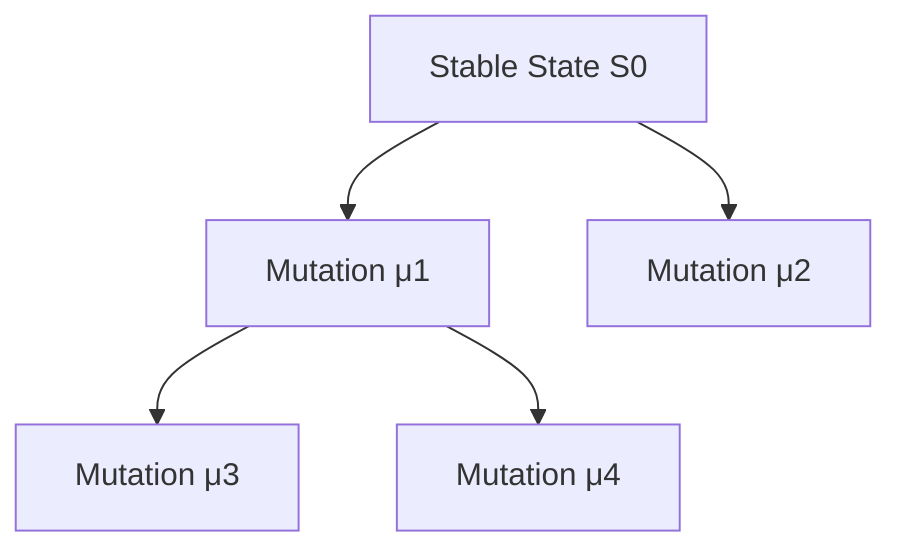
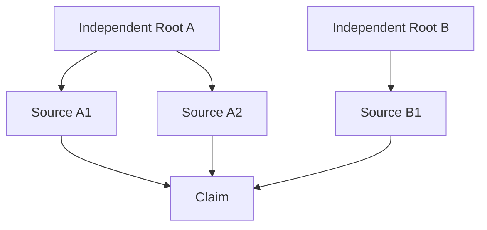
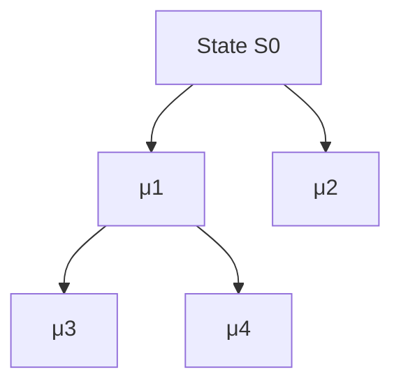
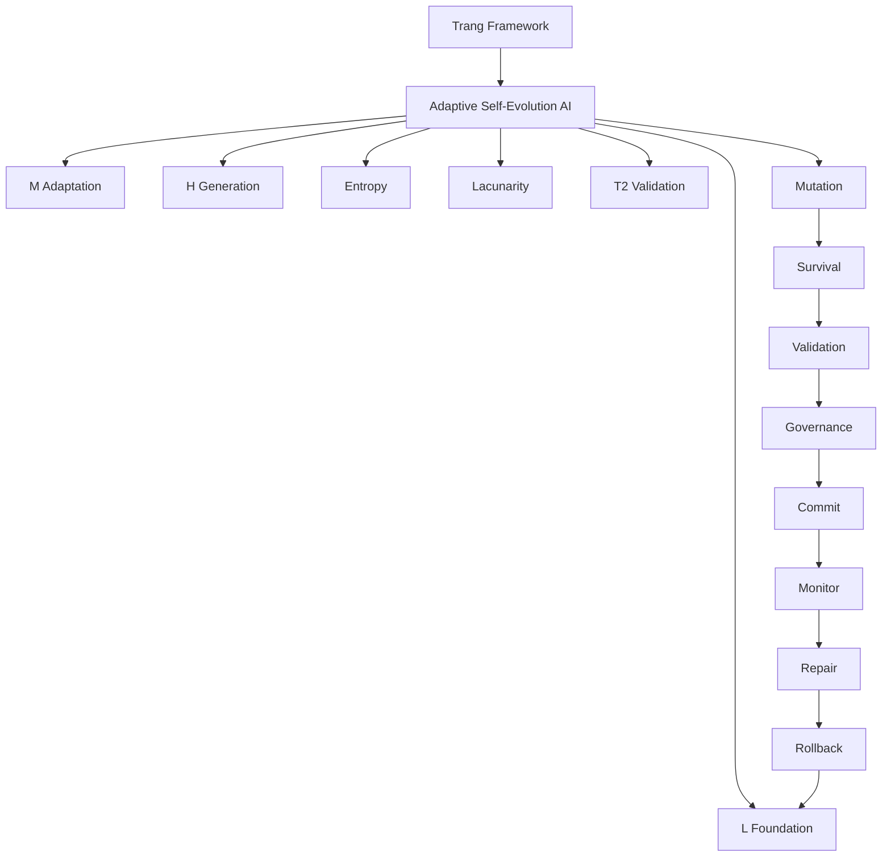
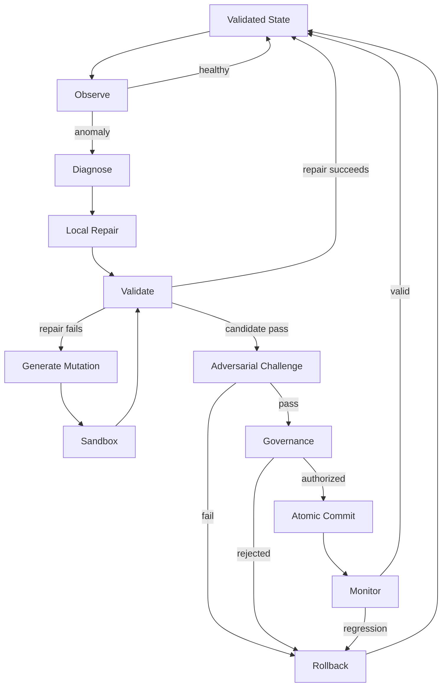

# TRANG ∅ FRAMEWORK → ASEA

## Full English Canonical Edition

### Adaptive Self-Evolution AI — Self-Repairing, Self-Evolving, Provenance-Governed Intelligence

> **Origin Architect / Steward:** Trang Phan
> **System Context:** AMOS OS / Trang Framework
> **Source Epistemic State:** `SOURCE_CLAIM`
> **Canonical Interpretation:** `AMOS_MODEL`
> **Empirical Runtime Status:** `UNKNOWN/GAP`
>
> **Core principle**
>
> $$
> \boxed{\text{Mutation is permission to propose change—not authority to make change canonical.}}
> $$

---

## 1. Canonical Source Metadata

The source metadata should remain distinct from any derived vault augmentation.

```yaml
---
title: TRANG FRAMEWORK UNG DUNG VAO AI TU SUA VA TU T
tags:
  - trang
  - framework
  - reality
  - canon/knowledge
  - 00-home
  - knowledge-moc
  - system-scan-agent
  - automation-profiles
  - trang-moc
  - amos-simulation-kernel-v0-math-foundations
type: document
source: 11_KNOWLEDGE/trang
rscf:
  state: SOURCE_CLAIM
  claim_class: SOURCE_CLAIM
  provenance: AMOS_corpus
  scope: AMOS_knowledge
---
```

The visible frontmatter title appears truncated. The body supplies the fuller conceptual title:

**TRANG ∅ FRAMEWORK — APPLICATION TO SELF-REPAIRING AND SELF-EVOLVING AI**

and identifies the resulting architecture as:

$$
\boxed{\text{Trang ASEA = Adaptive Self-Evolution AI}}
$$

The body title may clarify the document, but it should not be silently substituted into the original metadata.

---

## 2. Derived / Proposed Obsidian Augmentation

The following metadata is **derived or proposed**, not part of the preserved source frontmatter.

```yaml
derived_obsidian_augmentation:
  canonical_name: "Trang ASEA"
  expanded_name: "Adaptive Self-Evolution AI"

  origin_architect: "Trang Phan"
  steward: "Trang Phan"

  system: "AMOS OS"

  artifact_kind: "AI_SELF_EVOLUTION_FRAMEWORK"

  epistemic_class: "AMOS_MODEL"
  canonical_status: "SOURCE_GROUNDED_CANON_CANDIDATE"

  implementation_status: "CONCEPTUAL_SOURCE_DEFINED"
  runtime_validation: "UNKNOWN"
  empirical_validation: "UNKNOWN"

  raw_source_policy: "PRESERVE"

  aliases:
    - "Trang ASEA"
    - "Adaptive Self-Evolution AI"
    - "Self-Repairing AI"
    - "Self-Evolving AI"

  proposed_links:
    - "[[01_CANON/02_UNIVERSE_CANON/TRANG_ZERO_FRAMEWORK|TRANG_ZERO_FRAMEWORK]]"
    - "[[11_KNOWLEDGE/stubs/rscf|rscf]]"
    - "[[11_KNOWLEDGE/stubs/gmef|gmef]]"
    - "[[11_KNOWLEDGE/AMOS_FULL_BRAIN_OS_ARCHITECTURE|AMOS_FULL_BRAIN_OS_ARCHITECTURE]]"
    - "[[25_COGNITIVE_MATRIX/PROVENANCE_X_CONFIDENCE|PROVENANCE_X_CONFIDENCE]]"

  integrity_invariants:
    - "SOURCE != DERIVED"
    - "DERIVED != VERIFIED"
    - "MODEL != EMPIRICAL_LAW"
    - "MUTATION != AUTHORITY"
    - "MEMORY != TRUTH"
    - "TRACEABILITY != TRUTH"
    - "STRUCTURAL_SIMILARITY != CAUSATION"
```

---

## 3. Executive Definition

Trang ASEA describes an AI architecture intended to be capable of:

- detecting undesirable internal states;
- repairing failures;
- maintaining persistent knowledge;
- adapting its internal coordination;
- generating multiple candidate solutions;
- validating those candidates;
- mutating selected parts of itself;
- selecting mutations according to survival criteria;
- preserving useful adaptations;
- reverting to earlier valid states when adaptation fails.

Its source-level architecture can be compressed as:

$$
\boxed{
ASEA
=
[L,M,H]
+
\Lambda
+
E
+
T2
+
\mu
+
\sigma
}
$$

where:

$$
L=\text{persistent foundation}
$$

$$
M=\text{adaptive coordination}
$$

$$
H=\text{generative / decision layer}
$$

$$
\Lambda=\text{lacunarity variable}
$$

$$
E=\text{entropy-like state variable}
$$

$$
T2=\text{validation mechanism}
$$

$$
\mu=\text{mutation}
$$

$$
\sigma=\text{survival / selection}
$$

---

## 4. The Core Evolution Equation

The central source equation is:

$$
\boxed{
ASEA(t+1)
=
\sigma\left(\mu(ASEA(t))\right)
}
$$

Its intended semantic structure is:

```text
CURRENT ASEA STATE
        ↓
     MUTATION
        ↓
CANDIDATE VARIANTS
        ↓
     SURVIVAL
        ↓
 NEXT ASEA STATE
```

Mutation creates variation.

Survival decides which variation persists.

This is the fundamental evolutionary loop.

---

## 5. What the Equation Does Not Yet Specify

The equation alone does not define:

- mutation authority;
- legal mutation classes;
- immutable components;
- mutation isolation;
- fitness calculation;
- evidence requirements;
- regression testing;
- provenance requirements;
- concurrency behavior;
- rollback semantics;
- governance;
- commit semantics;
- adversarial resistance.

Therefore:

$$
\boxed{
ASEA_{t+1}=\sigma(\mu(ASEA_t))
}
$$

is a conceptual evolutionary equation, not by itself a complete production protocol.

---

## 6. Hardened Evolution Equation

A v4.4-compatible engineering interpretation can expand the source equation into:

$$
\boxed{
ASEA_{t+1}
=
Commit_G
\left[
Validate
\left(
\sigma
\left(
Sandbox(
\mu(ASEA_t)
)
\right)
\right)
\right]
}
$$

where:

- `Sandbox` isolates the candidate mutation;
- `Validate` tests it;
- \(G\) represents governance authorization;
- `Commit` promotes it into persistent state.

This is a **DERIVED/PROPOSED hardening**, not an assertion that every operator appears in the original source.

---

## 7. Fundamental Distinction: Mutation ≠ Commit

This is one of the most important consequences of the architecture.

$$
\boxed{
Mutation\neq Commit
}
$$

A mutation should initially produce:

$$
S_t'
$$

not immediately replace:

$$
S_t
$$

with \(S_t'\).

The safe sequence is:

$$
S_t
\rightarrow
Candidate(S_t')
\rightarrow
Validation
\rightarrow
Authorization
\rightarrow
Commit
$$

---

## 8. Capability ≠ Authority

A self-modifying AI might technically be capable of changing:

- prompts;
- memories;
- parameters;
- routes;
- tools;
- agents;
- topology;
- policies.

Technical capability does not imply authorization.

$$
\boxed{
Capability(x)\not\Rightarrow Authority(x)
}
$$

---

## 9. Optimization ≠ Integrity

A mutation may improve a target metric while damaging something more important.

For example:

$$
Accuracy\uparrow
$$

while:

$$
Safety\downarrow
$$

or:

$$
Latency\downarrow
$$

while:

$$
ProvenanceRecoverability\downarrow
$$

Therefore:

$$
\boxed{
Optimization\not\Rightarrow Improvement
}
$$

unless the optimization preserves the required integrity envelope.

---

## 10. ASEA's Three-Layer Architecture

The source organizes ASEA into:

$$
\boxed{[L,M,H]}
$$

These represent different functional regimes.

| Layer | Role                        | Main function                              |
| ----- | --------------------------- | ------------------------------------------ |
| L     | Foundation                  | persistence, stable knowledge, invariants  |
| M     | Mediator                    | coordination, adaptation, connection       |
| H     | High-level generative layer | creativity, reasoning, candidate decisions |

---

## 11. L — Persistent Foundation

The source describes L as the foundational persistent-memory layer.

Conceptually:

$$
\boxed{
L=PersistentFoundation
}
$$

It includes source-described concepts such as:

- core knowledge;
- invariants;
- validated information;
- persistent memory;
- rule-like foundations.

---

## 12. L as Stability

Architecturally:

$$
L
\rightarrow
Stability
$$

L prevents the entire system from becoming transient.

Without L, every interaction could effectively begin from an insufficiently persistent state.

---

## 13. L as Knowledge Reservoir

A simple conceptual representation is:

$$
L_t
=
\{k_1,k_2,\ldots,k_n\}
$$

where each \(k_i\) is a retained knowledge object.

But retention alone does not prove validity.

---

## 14. Persistence ≠ Truth

A central invariant is:

$$
\boxed{
Stored(x)\not\Rightarrow True(x)
}
$$

A false proposition can be stored perfectly.

Therefore:

$$
MemoryIntegrity
\neq
EpistemicValidity
$$

---

## 15. Persistent Error Amplification

If an unsupported claim enters L:

$$
FalseClaim
\rightarrow
L
$$

then future H outputs may retrieve it repeatedly.

Those outputs may themselves be stored again.

This creates:

$$
FalseClaim
\rightarrow
Memory
\rightarrow
Generation
\rightarrow
Feedback
\rightarrow
Memory
$$

and potentially recursive amplification.

---

## 16. Therefore L Requires Admission Governance

A hardened L pipeline is:

```text
NEW INFORMATION
      ↓
CLASSIFY CLAIM
      ↓
CHECK PROVENANCE
      ↓
CHECK CONTRADICTIONS
      ↓
CHECK SCOPE
      ↓
CHECK REGIME
      ↓
CHECK FRESHNESS
      ↓
VALIDATE
      ↓
PERSIST
```

---

## 17. L Knowledge Object

A robust persistent object could carry:

```yaml
knowledge_object:
  claim:
  claim_class:
  evidence:
  provenance:
  provenance_roots:
  dependencies:
  scope:
  regime:
  timestamp:
  freshness:
  competing_claims:
  falsifiers:
  confidence_ceiling:
```

This is a proposed implementation representation.

---

## 18. L Must Preserve Epistemic Class

Suppose a claim enters as:

```text
SOURCE_CLAIM
```

Storing it does not promote it to:

```text
VERIFIED
```

Thus:

$$
\boxed{
Persistence(c)
\not\Rightarrow
Promotion(c)
}
$$

---

## 19. M — Adaptive Coordination

The source describes M as the connection, coordination, and adaptation layer.

Thus:

$$
\boxed{
M=AdaptiveMediator
}
$$

---

## 20. M Connects L and H

Conceptually:

$$
L
\leftrightarrow
M
\leftrightarrow
H
$$

M controls how stable knowledge reaches generative reasoning and how new information returns toward persistent storage.

---

## 21. Retrieval Path

$$
H
\xrightarrow{request}
M
\xrightarrow{retrieve}
L
$$

then:

$$
L
\xrightarrow{evidence}
M
\xrightarrow{context}
H
$$

---

## 22. M as Adaptive Routing

Possible M functions include:

- attention;
- retrieval;
- routing;
- prioritization;
- evidence selection;
- coordination;
- resource allocation.

Some are source-aligned; exact runtime implementation remains unspecified.

---

## 23. M Must Preserve Evidence Type

If M receives:

$$
SOURCE\_CLAIM
$$

it cannot turn it into:

$$
VERIFIED
$$

merely by summarizing it.

Thus:

$$
\boxed{
Synthesis
\neq
IndependentValidation
}
$$

---

## 24. M and Context Selection

M can change what H sees.

Therefore M can materially alter H behavior without changing H's underlying model.

Conceptually:

$$
HOutput
=
F(H,M(L))
$$

---

## 25. M Failure

A system may possess correct information in L but fail because M retrieves the wrong information.

Thus:

$$
KnowledgeAvailable
\not\Rightarrow
KnowledgeUsed
$$

---

## 26. H — Generative and Decision Layer

The source describes H as the high-level layer responsible for creativity and decision-making.

Thus:

$$
\boxed{
H=GenerativeExploration
}
$$

---

## 27. H Generates Possibilities

H may produce:

$$
C
=
\{c_1,c_2,\ldots,c_n\}
$$

where each \(c_i\) is a candidate.

Candidates may be:

- answers;
- hypotheses;
- plans;
- explanations;
- designs;
- mutations.

---

## 28. Candidate ≠ Conclusion

$$
\boxed{
Generate(c)\not\Rightarrow Accept(c)
}
$$

---

## 29. Creativity ≠ Evidence

$$
\boxed{
Novel(c)\not\Rightarrow Supported(c)
}
$$

---

## 30. Decision Proposal ≠ Execution

$$
\boxed{
Propose(a)\not\Rightarrow Execute(a)
}
$$

This distinction becomes increasingly important as ASEA gains greater autonomy.

---

## 31. L/M/H Functional Balance

A useful derived abstraction is:

$$
L\rightarrow Stability
$$

$$
M\rightarrow Adaptability
$$

$$
H\rightarrow Exploration
$$

ASEA therefore does not seek a single homogeneous cognitive state.

It seeks controlled balance.

---

## 32. Recursive L/M/H

Within the broader AMOS lineage, L/M/H can be recursively decomposed conceptually:

$$
L
\rightarrow
[L_L,L_M,L_H]
$$

$$
M
\rightarrow
[M_L,M_M,M_H]
$$

$$
H
\rightarrow
[H_L,H_M,H_H]
$$

This is a **derived recursive interpretation**, not proof that the supplied ASEA artifact formally specifies every recursive subdivision.

---

## 33. Recursive Decomposition

At depth \(d\):

$$
X^{(d)}
\rightarrow
[
X_L^{(d+1)},
X_M^{(d+1)},
X_H^{(d+1)}
]
$$

---

## 34. Recursion ≠ Physical Fractality

A repeating architecture does not prove physical fractal behavior.

$$
\boxed{
RecursiveSimilarity
\neq
MeasuredFractalStructure
}
$$

---

## 35. Same Pattern ≠ Same Mechanism

Even if memory and reasoning both exhibit L/M/H decomposition:

$$
LMH_{memory}\sim LMH_{reasoning}
$$

does not imply:

$$
Mechanism_{memory}=Mechanism_{reasoning}
$$

---

## 36. Sparse Fractal Retrieval

A full implementation should not load every level for every task.

Preferred pattern:

```text
BOOTSTRAP
   ↓
H — DOMAIN
   ↓
M — SUBSYSTEM
   ↓
L — DETAIL
   ↓
RAW EVIDENCE
```

only when deeper retrieval can materially alter the answer.

---

## 37. Minimal Dependency Closure

Let:

$$
D(c)
$$

be the dependency closure of conclusion \(c\).

Fast-path reasoning should retrieve:

$$
D_{material}(c)
\subseteq
D(c)
$$

where omitted dependencies cannot materially change the conclusion.

---

## 38. Lacunarity

The source introduces layer-specific lacunarity:

$$
\Lambda_L,\Lambda_M,\Lambda_H
$$

with adaptive update rules.

---

## 39. L Update

$$
\Lambda_L(t+1)
=
\Lambda_L(t)
+
\eta_L
[
\Lambda_{L,opt}
-
\Lambda_L(t)
]
+
\kappa_L\xi(t)
$$

---

## 40. M Update

$$
\Lambda_M(t+1)
=
\Lambda_M(t)
+
\eta_M
[
\Lambda_{M,opt}
-
\Lambda_M(t)
]
+
\kappa_M\xi(t)
$$

---

## 41. H Update

$$
\Lambda_H(t+1)
=
\Lambda_H(t)
+
\eta_H
[
\Lambda_{H,opt}
-
\Lambda_H(t)
]
+
\kappa_H\xi(t)
$$

---

## 42. General Update Equation

For:

$$
X\in\{L,M,H\}
$$

$$
\boxed{
\Lambda_X(t+1)
=
\Lambda_X(t)
+
\eta_X
[
\Lambda_{X,opt}
-
\Lambda_X(t)
]
+
\kappa_X\xi(t)
}
$$

---

## 43. Deterministic Core

Ignoring the perturbation term:

$$
\Lambda_{t+1}
=
\Lambda_t
+
\eta(\Lambda_{opt}-\Lambda_t)
$$

or:

$$
\Lambda_{t+1}
=
(1-\eta)\Lambda_t
+
\eta\Lambda_{opt}
$$

---

## 44. Error Dynamics

Let:

$$
e_t
=
\Lambda_t-\Lambda_{opt}
$$

Then:

$$
e_{t+1}
=
(1-\eta)e_t
$$

---

## 45. Convergence

The simplified deterministic recurrence converges when:

$$
|1-\eta|<1
$$

which gives:

$$
\boxed{
0<\eta<2
}
$$

This is a mathematical consequence of the recurrence.

It is not empirical proof that any particular ASEA implementation should use such values.

---

## 46. Monotonic Regime

For:

$$
0<\eta\le1
$$

the deterministic error approaches zero without sign alternation.

---

## 47. Oscillatory Regime

For:

$$
1<\eta<2
$$

the error changes sign while decreasing in magnitude.

---

## 48. Unstable Regime

For:

$$
\eta>2
$$

the simplified recurrence diverges.

---

## 49. Perturbation

The source also includes:

$$
\kappa_X\xi(t)
$$

This means the complete recurrence is not necessarily deterministic.

---

## 50. Missing \(\xi\) Definition

The source does not establish:

- distribution;
- support;
- variance;
- autocorrelation;
- independence;
- whether the same \(\xi\) affects all layers.

Therefore:

$$
\boxed{
Semantics(\xi)=UNKNOWN/GAP
}
$$

---

## 51. Expected Dynamics

If one assumes:

$$
E[\xi_t]=0
$$

then:

$$
E[e_{t+1}]
=
(1-\eta)E[e_t]
$$

But the zero-mean assumption is not supplied by the source.

---

## 52. Lacunarity Targets

The source describes approximate target regions including:

$$
\Lambda_L\approx0.05
$$

$$
\Lambda_M\approx0.1\text{–}0.2
$$

$$
\Lambda_H\approx0.2\text{–}0.4
$$

while the explicit Healthy predicate imposes stricter boundary semantics for \(\Lambda_M\).

---

## 53. Lacunarity Measurement Gap

A numerical lacunarity value is meaningless operationally unless the measurement procedure is defined.

Missing:

- topology;
- scale;
- windowing;
- occupancy definition;
- normalization;
- estimator;
- sampling procedure.

Therefore:

$$
\boxed{
\Lambda=0.2
}
$$

is a model value, not yet a reproducible measurement specification.

---

## 54. Lacunarity Classification

```yaml
lacunarity:
  epistemic_class: MODEL_VARIABLE
  source_defined: true
  measurement_binding: UNKNOWN
  empirical_calibration: UNKNOWN
```

---

## 55. Entropy

ASEA uses:

$$
E_L,E_M,E_H
$$

as layer-specific state indicators.

---

## 56. Entropy Is Underspecified

The source does not establish the probability distribution from which each entropy is calculated.

Therefore:

$$
E_H=0.25
$$

cannot be independently reproduced from the excerpt alone.

---

## 57. Candidate Entropy Formula

A possible normalized entropy implementation is:

$$
E_X
=
-
\frac{1}{\ln N_X}
\sum_{i=1}^{N_X}
p_i^{(X)}
\ln p_i^{(X)}
$$

where:

$$
\sum_i p_i^{(X)}=1
$$

This is **PROPOSED**, not source identity.

---

## 58. Candidate State Spaces

The probability distribution might represent:

- token probabilities;
- hypotheses;
- candidate solutions;
- retrieval weights;
- agent states;
- action probabilities.

These are materially different.

---

## 59. Entropy Type Firewall

$$
\boxed{
TokenEntropy
\neq
HypothesisEntropy
\neq
MemoryEntropy
\neq
TopologyEntropy
}
$$

unless explicit source binding establishes equivalence.

---

## 60. Hallucination Rule

The source defines:

$$
\boxed{
Hallucination
\iff
(E_H>0.3)
\lor
(\Lambda_H>0.5)
\lor
(T2=False)
}
$$

---

## 61. Logical Form

Let:

$$
A=(E_H>0.3)
$$

$$
B=(\Lambda_H>0.5)
$$

$$
C=(T2=False)
$$

Then:

$$
Hallucination
\iff
A\lor B\lor C
$$

---

## 62. Boundary at \(E_H=0.3\)

Because the source uses:

$$
E_H>0.3
$$

exactly:

$$
E_H=0.3
$$

does not activate that component.

---

## 63. Boundary at \(\Lambda_H=0.5\)

Likewise:

$$
\Lambda_H=0.5
$$

does not activate the lacunarity component.

---

## 64. Biconditional Strength

The word/form:

$$
\iff
$$

is stronger than:

$$
\Rightarrow
$$

The source rule implies both:

$$
Condition\Rightarrow Hallucination
$$

and:

$$
Hallucination\Rightarrow Condition
$$

---

## 65. Empirical Evidence Gap

The supplied source does not provide experiments establishing either direction universally.

Therefore the threshold equation should be classified as:

$$
\boxed{AMOS\_MODEL}
$$

rather than verified empirical law.

---

## 66. Operationally Safer Interpretation

Instead of treating the rule as proven hallucination identity:

$$
Risk_H
=
f(E_H,\Lambda_H,T2)
$$

and:

$$
Risk_H>\theta
\Rightarrow
Verify
$$

would be an engineering-safe interpretation pending calibration.

---

## 67. Claim-Level Hallucination

A response:

$$
R
=
\{c_1,c_2,\ldots,c_n\}
$$

can contain claims with different support levels.

Thus validation should ideally operate at claim granularity:

$$
Validate(c_i)
$$

rather than treating the entire response as one undifferentiated epistemic object.

---

## 68. Source Repair Response

When the source's hallucination condition activates, the proposed repair includes:

1. reduce \(\Lambda_H\);
2. strengthen H's connection to L;
3. request confirmation from at least two independent sources.

---

## 69. Reducing H Lacunarity

Conceptually:

$$
\Lambda_H\downarrow
$$

reduces exploratory freedom.

---

## 70. Strengthening L Grounding

Conceptually:

$$
Coupling(H,L)\uparrow
$$

makes H rely more heavily on persistent knowledge.

---

## 71. But L Can Be Wrong

Therefore:

$$
\boxed{
MoreMemoryGrounding
\not\Rightarrow
MoreTruth
}
$$

unless L itself is valid, scoped, current, and appropriately retrieved.

---

## 72. T2 Validation

T2 is the source-defined validation mechanism.

A key source behavior is confirmation through at least two independent sources.

---

## 73. Two Sources ≠ Independence

Suppose:

```text
ROOT REPORT
├── WEBSITE A
├── WEBSITE B
└── ARTICLE C
```

All three may reproduce the same root.

Thus:

$$
SourceCount=3
$$

but:

$$
IndependentRoots=1
$$

---

## 74. Provenance Topology

Evidence should be represented as a graph:

$$
G=(V,E)
$$

where vertices are evidence objects and edges encode ancestry/dependency.

---

## 75. Independence

Two pieces of evidence are meaningfully independent only if their load-bearing evidential ancestry does not collapse to the same origin in a way that defeats the intended corroboration.

---

## 76. Independence Is Not Binary in Every Case

Sources may share:

- data;
- methodology;
- authors;
- institutions;
- datasets;
- upstream reports.

Thus independence may require typed evaluation.

---

## 77. T2 Receipt

```yaml
t2_receipt:
  claim_id:

  source_a:
    identity:
    provenance_root:
    method:
    timestamp:

  source_b:
    identity:
    provenance_root:
    method:
    timestamp:

  shared_ancestry:
  methodological_dependence:
  freshness:
  scope_compatibility:
  regime_compatibility:

  result:
    - PASS
    - FAIL
    - COMPETING
    - UNKNOWN
```

---

## 78. Competing Evidence

If:

$$
E_1\Rightarrow X
$$

and:

$$
E_2\Rightarrow\neg X
$$

then T2 should not manufacture consensus.

Correct state:

$$
\boxed{COMPETING}
$$

until discriminating evidence exists.

---

## 79. T2 Does Not Automatically Raise Confidence

If two weak premises support a conclusion:

$$
C_1=0.4
$$

$$
C_2=0.5
$$

their existence alone does not license arbitrary confidence such as:

$$
C=0.95
$$

---

## 80. Confidence Ceiling

A safe general rule is:

$$
\boxed{
C_{derived}
\le
\min(C_{load-bearing})
}
$$

unless a validated inference/calibration mechanism independently licenses otherwise.

---

## 81. Self-Repair

ASEA self-repair can be represented as:

$$
\boxed{
SelfRepair
=
Detect
+
Localize
+
Repair
+
Validate
+
Recover
}
$$

---

## 82. Detection

First identify:

$$
Failure(S_t)
$$

---

## 83. Localization

Then determine which component or premise failed.

$$
FaultSet
=
\{f_1,\ldots,f_n\}
$$

---

## 84. Dependency Graph

If:

$$
P\rightarrow C_1\rightarrow C_2
$$

and \(P\) fails, then:

$$
C_1,C_2
$$

must be invalidated or revalidated.

---

## 85. Local Invalidation

$$
\boxed{
Invalidate(P)
+
Invalidate(Descendants(P))
}
$$

while preserving independent state.

---

## 86. No Unnecessary Global Reset

If only one branch fails:

```text
VALID ROOT
├── VALID A
├── FAILED B
│   └── INVALID B1
└── VALID C
```

do not destroy A and C.

---

## 87. Repair Locality

$$
\boxed{
RepairScope
=
SmallestValidDependencyClosure
}
$$

when that closure can be determined reliably.

---

## 88. Source Recovery Behavior

The source describes recovery behavior including:

- return to the nearest L checkpoint;
- reduce learning speed;
- increase cross-validation;
- report errors where necessary.

---

## 89. Checkpoint

Let:

$$
K_i
$$

represent a persistent validated state.

---

## 90. Nearest Valid Checkpoint

Recovery should prefer:

$$
K_j
$$

where \(K_j\) is both sufficiently recent and still valid.

---

## 91. Recency ≠ Validity

$$
NewestCheckpoint
\neq
BestCheckpoint
$$

---

## 92. Proposed Checkpoint Record

```yaml
checkpoint:
  id:
  parent:
  timestamp:
  state_hash:
  model_version:
  memory_version:
  governance_version:
  provenance_epoch:
  validation_receipt:
  rollback_dependencies:
```

---

## 93. Recovery Ladder

```text
RETRY
  ↓
LOCAL REPAIR
  ↓
LOCAL ROLLBACK
  ↓
SUBSYSTEM ROLLBACK
  ↓
CHECKPOINT RESTORE
  ↓
GROUND-STATE RECOVERY
```

---

## 94. Global Recovery Is Expensive

Full reset can discard unaffected valid work.

Therefore:

$$
LocalRecovery
>
GlobalRecovery
$$

when integrity permits.

---

## 95. Repairability as a First-Class Objective

System quality should include:

$$
Q
=
f(
Accuracy,
Safety,
Efficiency,
Repairability
)
$$

rather than optimizing performance alone.

---

## 96. Source Self-Modification Rule: L

The source describes a condition:

$$
E_L>0.1
$$

for a sustained period.

Response:

> add connections to L and reinforce memory.

---

## 97. Duration Gap

The source says the condition must persist, but no duration is defined.

Thus:

$$
\boxed{
T_{sustained}=UNKNOWN/GAP
}
$$

---

## 98. Source Self-Modification Rule: M

If:

$$
E_M>0.25
$$

for a sustained period:

> prune weak connections in M.

---

## 99. Weakness Gap

The predicate:

$$
Weak(connection)
$$

is not defined.

Missing possibilities include:

- low activation;
- low utility;
- low mutual information;
- low confidence;
- low usage.

Do not invent which one applies.

---

## 100. Source Self-Modification Rule: High H Entropy

If:

$$
E_H>0.3
$$

for a sustained period:

> reduce learning rate and increase T2.

---

## 101. Source Self-Modification Rule: Low H Entropy

If:

$$
E_H<0.05
$$

for a sustained period:

> add random H connections to stimulate creativity.

---

## 102. Connection Semantics

The source does not uniquely determine whether a “connection” means:

- neural connection;
- graph edge;
- memory association;
- routing edge;
- agent connection.

Therefore:

$$
\boxed{
ConnectionType=UNKNOWN/GAP
}
$$

---

## 103. Random Mutation Requires Isolation

A random structural change can damage a functioning system.

Therefore a hardened implementation should perform:

$$
RandomMutation
\rightarrow
Sandbox
$$

before persistent adoption.

---

## 104. Mutation Operator

The source's mutation operator is:

$$
\boxed{\mu}
$$

with:

$$
\mu(ASEA_t)
$$

creating variants of the current system.

---

## 105. Source Mutation Examples

Visible mutation classes include changes to:

- weights;
- connections;
- lacunarity.

---

## 106. Derived Mutation Taxonomy

A fuller engineering taxonomy is:

$$
\mu
\in
\{
\mu_{context},
\mu_{memory},
\mu_{routing},
\mu_{prompt},
\mu_{parameter},
\mu_{tool},
\mu_{topology},
\mu_{model},
\mu_{policy},
\mu_{governance}
\}
$$

This taxonomy is derived/proposed.

---

## 107. Risk Is Mutation-Type Dependent

Changing a retrieval query is not equivalent to changing governance.

Therefore:

$$
Risk(\mu_{routing})
\neq
Risk(\mu_{governance})
$$

---

## 108. Consequence Radius

Define:

$$
R_c(\mu)
$$

as the maximum downstream dependency region materially affected by mutation \(\mu\).

---

## 109. Validation Scaling

A governance principle follows:

$$
\boxed{
ValidationBurden
\uparrow
\quad\text{as}\quad
ConsequenceRadius\uparrow
}
$$

---

## 110. Reversibility

Also:

$$
ValidationBurden
\uparrow
\quad\text{as}\quad
Reversibility\downarrow
$$

---

## 111. Mutation Record

```yaml
mutation:
  id:
  parent_state:
  mutation_class:
  objective:
  affected_components:
  consequence_radius:
  expected_benefit:
  known_risks:
  reversibility:
  rollback_target:
  authority:
  dependencies:
```

---

## 112. Mutation Lineage

Every mutation should preserve:

$$
parent(\mu_i)
$$

---

## 113. Mutation Tree



---

## 114. Correlated Descendants

\(\mu_3\) and \(\mu_4\) share \(\mu_1\).

Therefore they are not independent evolutionary evidence.

$$
SharedAncestry
\Rightarrow
CorrelationRisk
$$

---

## 115. Survival Operator

The source uses:

$$
\boxed{\sigma}
$$

for survival/selection.

---

## 116. Source Survival Criteria

The source associates survival with improvements such as:

- reduced entropy;
- increased T2;
- movement toward desired lacunarity regions.

---

## 117. Missing Complete Fitness Function

No complete equation of the form:

$$
Fitness(\mu)=...
$$

is supplied.

Therefore:

$$
\boxed{
FitnessFunction=UNKNOWN/GAP
}
$$

---

## 118. Candidate Fitness — Not Canon

A conceptual candidate might be:

$$
F
=
f(
-E,
+T2,
-|\Lambda-\Lambda_{opt}|
)
$$

but this must remain **PROPOSED**.

---

## 119. Weighted-Sum Danger

Suppose:

$$
F
=
w_AA+w_SS+w_PP
$$

where \(A\) is accuracy, \(S\) safety, and \(P\) performance.

Then enough performance gain could compensate mathematically for safety loss.

That may be unacceptable.

---

## 120. Hard Constraints Before Optimization

A safer architecture is:

$$
Survive(\mu)
=
IntegrityPass
\land
SafetyPass
\land
AuthorityPass
\land
ProvenancePass
\land
PerformanceAcceptable
$$

---

## 121. Non-Compensatory Integrity

Some failures should cause rejection regardless of other gains.

For example:

$$
IntegrityFail
\Rightarrow
Reject
$$

---

## 122. Selection ≠ Permanent Validity

A mutation can pass today and fail tomorrow.

Thus:

$$
\boxed{
Selected_t
\not\Rightarrow
Valid_{\forall t}
}
$$

---

## 123. Continuous Revalidation

Long-lived mutations require:

$$
Monitor
+
Revalidate
$$

when their assumptions, environment, or dependencies change.

---

## 124. Healthy Predicate

The source defines:

$$
\boxed{
Healthy
\iff
(0.1<\Lambda_M<0.2)
\land
(E_L<0.1)
\land
(0.1<E_H<0.3)
\land
T2
}
$$

---

## 125. Healthy Predicate Components

Define:

$$
A=(0.1<\Lambda_M<0.2)
$$

$$
B=(E_L<0.1)
$$

$$
C=(0.1<E_H<0.3)
$$

$$
D=T2
$$

Then:

$$
Healthy=A\land B\land C\land D
$$

---

## 126. Boundary: \(\Lambda_M=0.1\)

Fails.

---

## 127. Boundary: \(\Lambda_M=0.2\)

Fails.

---

## 128. Boundary: \(E_L=0.1\)

Fails.

---

## 129. Boundary: \(E_H=0.1\)

Fails.

---

## 130. Boundary: \(E_H=0.3\)

Fails.

---

## 131. Healthy Region

The source therefore defines an open interval for M:

$$
\Lambda_M\in(0.1,0.2)
$$

and H entropy:

$$
E_H\in(0.1,0.3)
$$

with:

$$
E_L<0.1
$$

and:

$$
T2=True
$$

---

## 132. Healthy ≠ Omniscient

$$
\boxed{
Healthy
\not\Rightarrow
EveryOutputCorrect
}
$$

Healthy is an internal model-state predicate.

It is not proof that every generated proposition is true.

---

## 133. Unknown Metric Behavior

The source does not specify:

$$
Healthy
$$

when one required metric is unavailable.

---

## 134. Safe Unknown Handling

For consequential operations:

$$
UnknownCriticalMetric
\Rightarrow
HOLD
$$

is safer than treating unknown as pass.

---

## 135. Viability Versus Performance

The Healthy predicate can be interpreted as defining a viability region:

$$
V
=
\{S:Healthy(S)\}
$$

Then performance optimization occurs subject to:

$$
S\in V
$$

---

## 136. Constrained Optimization

$$
\boxed{
\max_S Performance(S)
\quad
\text{subject to}
\quad
Healthy(S)
}
$$

This is a useful derived interpretation.

---

## 137. Self-Evolution

Self-evolution requires at least:

$$
\boxed{
Variation
+
Evaluation
+
Selection
+
Inheritance
}
$$

---

## 138. Mutation Alone ≠ Evolution

$$
Mutation
\neq
Evolution
$$

---

## 139. Persistence Matters

Without retention:

$$
SuccessfulMutation
\rightarrow
Discarded
$$

there is no cumulative adaptation.

---

## 140. Selection Matters

Without selection:

$$
RandomChange
\neq
AdaptiveEvolution
$$

---

## 141. Evolution ≠ Progress

$$
\boxed{
Evolution
\not\Rightarrow
Improvement
}
$$

Selection only optimizes what its environment and fitness function reward.

---

## 142. Fitness Determines Direction

If fitness is misaligned:

$$
BetterFitness
$$

may mean:

$$
WorseActualSystem
$$

---

## 143. Goodhart's Problem

When a proxy becomes the optimization target:

$$
Proxy
$$

may diverge from:

$$
TrueObjective
$$

---

## 144. Low Entropy Is Not Always Better

The Healthy predicate explicitly requires:

$$
E_H>0.1
$$

Thus zero H entropy is not the source-defined optimum.

---

## 145. Controlled Uncertainty

ASEA therefore appears to preserve a bounded amount of generative variability.

---

## 146. Goldilocks Principle

Too little variation:

$$
Rigidity
$$

Too much variation:

$$
Instability
$$

Desired:

$$
ControlledExploration
$$

---

## 147. Gradient Descent Statement

The source states that the ASEA self-evolution mechanism does not use gradient descent and instead uses natural-selection-like mutation/survival.

Thus the canonical self-evolution description is:

$$
\mu+\sigma
$$

rather than gradient descent.

---

## 148. No Universal Superiority

This does not prove:

$$
EvolutionarySearch>GradientDescent
$$

universally.

---

## 149. Hybrid Architectures Remain Possible

An implementation could theoretically use:

$$
GradientOptimization
$$

inside a component while using:

$$
MutationSelection
$$

for higher-level architecture.

That would be a derived hybrid, not necessarily the source-defined pure ASEA mechanism.

---

## 150. Example: Investment Question

The source illustrates ASEA using a question equivalent to:

> “Should I invest in AI?”

---

## 151. Candidate Generation

H generates many candidate answers.

The source example uses:

$$
100
$$

candidates.

---

## 152. 100 Is an Example

No evidence establishes:

$$
N=100
$$

as a universal ASEA invariant.

---

## 153. Candidate Validation

Candidates are checked against:

- historical information from L;
- another source through M.

---

## 154. Unsupported Candidates

Candidates that fail validation are removed.

---

## 155. Survival Selection

Remaining candidates are evaluated using source-defined internal criteria including entropy and \(\Lambda_M\).

---

## 156. Final Candidate Count

The example retains approximately:

$$
1\text{–}3
$$

answers.

Again, illustrative—not universal.

---

## 157. User Feedback

The source allows feedback to influence:

- \(\Lambda\);
- entropy state;
- potentially L.

---

## 158. Feedback ≠ Truth

A user may prefer a false answer.

Therefore:

$$
\boxed{
PositiveFeedback(c)
\not\Rightarrow
True(c)
}
$$

---

## 159. Feedback Types

A hardened system should classify feedback:

```text
FEEDBACK
├── preference
├── style
├── usefulness
├── factual correction
├── observed outcome
├── explicit evidence
└── adversarial input
```

---

## 160. Preference Learning

Preference feedback may update personalization without changing factual canon.

---

## 161. Factual Correction

A factual correction should require evidence before promotion to persistent knowledge.

---

## 162. Source Long-Interaction Example

The source gives an example after approximately:

$$
1000
$$

interactions.

It describes changes such as:

$$
\Lambda_M:0.1\rightarrow0.18
$$

and:

$$
\Lambda_H:0.3\rightarrow0.25
$$

plus richer L memory.

---

## 163. Example ≠ Experimental Result

$$
\boxed{
IllustrativeTrajectory
\neq
EmpiricalMeasurement
}
$$

---

## 164. Catastrophic Forgetting

The source presents persistent L as helping prevent catastrophic forgetting.

That is an architectural objective.

---

## 165. No Guarantee

Persistent memory does not automatically guarantee:

$$
NoCatastrophicForgetting
$$

because forgetting can occur through:

- retrieval failure;
- interference;
- parameter drift;
- deletion;
- invalid consolidation.

---

## 166. 40 Hz Concept

The source associates H with simulated gamma / approximately 40 Hz behavior.

This should be treated as source terminology/modeling.

---

## 167. Biological Firewall

A 40 Hz biological/neural rhythm does not establish that an AI system requires:

$$
40Hz
$$

as an optimal computational synchronization frequency.

---

## 168. Structural Analogy ≠ Mechanistic Identity

$$
BiologicalGamma
\sim
ComputationalSynchronization
$$

does not prove:

$$
BiologicalGamma
=
ComputationalSynchronization
$$

---

## 169. HRV / Artificial Emotion

Any mapping between physiological variables such as HRV and artificial cognitive state requires explicit validated binding.

---

## 170. No Clinical Interpretation

The ASEA source should not be treated as establishing clinical or physiological laws without independent evidence.

---

## 171. Current-AI Comparison

The source contrasts ASEA with systems such as GPT/Claude.

Those comparisons should be interpreted carefully.

---

## 172. Deployment Boundary Matters

A base model and a deployed AI system are not identical.

A deployment can add:

- memory;
- retrieval;
- verification;
- tools;
- agents;
- rollback;
- external training.

Therefore:

$$
BaseModelCapability
\neq
DeploymentCapability
$$

---

## 173. “Cannot Self-Correct” Is Too Broad

A system may self-correct within an interaction even if it cannot autonomously modify persistent model weights.

These are different capabilities.

---

## 174. Self-Correction Taxonomy

```text
LEVEL 0 — no correction
LEVEL 1 — regenerate
LEVEL 2 — critique and revise
LEVEL 3 — retrieve new evidence
LEVEL 4 — update memory
LEVEL 5 — modify configuration
LEVEL 6 — modify topology
LEVEL 7 — modify learning process
```

ASEA targets higher levels than ordinary single-pass generation.

---

## 175. Explainability

The source associates ASEA with improved transparency through T2 and layer provenance.

---

## 176. Traceability ≠ Mechanistic Explainability

Knowing:

```text
claim came from source X
```

is not the same as fully explaining internal neural computation.

Thus:

$$
\boxed{
ProvenanceTraceability
\neq
MechanisticInterpretability
}
$$

---

## 177. RSCF Integration

A self-changing architecture strongly benefits from persistent causal/provenance lineage.

---

## 178. Mutation RSCF

```yaml
rscf_mutation:
  mutation_id:

  claim_class: DECISION

  H:
    intent:
    expected_gain:

  M:
    mutation_plan:
    affected_dependencies:
    competing_mutations:
    tests:

  L:
    baseline:
    evidence:
    provenance:
    checkpoint:

  result:
    - ACCEPT
    - REJECT
    - CONDITIONAL
    - UNKNOWN
```

---

## 179. Mutation Receipt

Every persistent mutation should conceptually produce:

$$
Receipt(\mu_i)
$$

---

## 180. Receipt Content

At minimum:

- parent state;
- mutation;
- reason;
- evidence;
- tests;
- authority;
- result;
- new state;
- rollback target.

---

## 181. Receipt ≠ Truth

$$
\boxed{
ReceiptExists
\not\Rightarrow
MutationCorrect
}
$$

A receipt proves traceability only to the extent its underlying evidence and process are valid.

---

## 182. Causal Lineage

Suppose:

$$
S_0
\xrightarrow{\mu_1}
S_1
\xrightarrow{\mu_2}
S_2
\xrightarrow{\mu_3}
S_3
$$

If failure appears in \(S_3\), all three mutations are candidate ancestors.

---

## 183. Temporal Order ≠ Causation

$$
\mu_3
\text{ immediately precedes failure}
$$

does not prove:

$$
\mu_3
\rightarrow
Failure
$$

---

## 184. Causal Diagnosis

Potential causes include:

- \(\mu_1\);
- \(\mu_2\);
- \(\mu_3\);
- interaction between them;
- external regime shift.

---

## 185. Adversarial Validation

Before accepting an important mutation, use two distinct paths.

---

## 186. Support Path

Construct the strongest evidence that the mutation improves the system.

---

## 187. Challenge Path

Search specifically for:

- regression;
- hidden dependencies;
- stale assumptions;
- provenance correlation;
- scope leakage;
- safety failure;
- causal overreach.

---

## 188. Acceptance

Only after both paths:

$$
SupportPass
\land
ChallengePass
$$

should a consequential mutation proceed toward commit.

---

## 189. Challenge Success

If challenge finds material contradiction:

$$
ACCEPT
$$

should become one of:

$$
CONDITIONAL
$$

$$
COMPETING
$$

$$
REJECT
$$

$$
UNKNOWN
$$

---

## 190. Competing Hallucination Models

The source threshold model is only one hypothesis.

### H1

Entropy/lacunarity thresholds directly identify hallucination.

### H2

They are correlated risk indicators.

### H3

They measure internal instability but not hallucination itself.

### H4

Thresholds are architecture-specific.

### H5

Alternative uncertainty/evidence measures perform better.

The supplied source does not discriminate among these empirically.

---

## 191. Therefore

$$
\boxed{
HallucinationMechanism=COMPETING
}
$$

at the empirical-mechanism level.

---

## 192. Competing L/M/H Interpretations

### H1

L/M/H is a fundamental cognitive architecture.

### H2

L/M/H is a highly reusable engineering abstraction.

### H3

L/M/H is an interpretive compression rather than an optimal implementation decomposition.

Current source establishes the framework's use of L/M/H, not universal superiority of the decomposition.

---

## 193. Causal Firewall

ASEA should distinguish:

$$
Association
$$

from:

$$
Mechanism
$$

from:

$$
CausalEffect
$$

---

## 194. Entropy Example

Suppose:

$$
E_H\uparrow
$$

and hallucination frequency also rises.

This establishes possible association.

---

## 195. Possible Confounding

Both could be caused by:

$$
TaskDifficulty\uparrow
$$

---

## 196. Therefore

$$
Correlation(E_H,Hallucination)
$$

does not establish:

$$
E_H\rightarrow Hallucination
$$

---

## 197. Mutation Causality

Performance increasing after a mutation is also insufficient.

Need a suitable counterfactual:

$$
Performance(\mu)
$$

versus:

$$
Performance(no\ \mu)
$$

under comparable conditions.

---

## 198. Scope Firewall

Every empirical ASEA result should carry an applicability envelope.

```yaml
scope:
  architecture:
  model:
  task:
  dataset:
  environment:
  evaluation_method:
  time:
  regime:
```

---

## 199. Local Success ≠ Universal Success

A mutation improving coding tasks does not automatically improve:

- mathematics;
- legal reasoning;
- medicine;
- planning.

---

## 200. Regime Shift

Let:

$$
R_t
$$

be the operating regime.

If:

$$
R_{t+1}\neq R_t
$$

previous conclusions may become stale.

---

## 201. Regime-Aware Validity

$$
Valid(c,R_t)
$$

does not imply:

$$
Valid(c,R_{t+1})
$$

---

## 202. Revalidation Trigger

$$
RegimeShift
\Rightarrow
Revalidate
$$

for regime-dependent knowledge and mutations.

---

## 203. Freshness

Persistent memory needs temporal validity.

A fact valid at:

$$
t_0
$$

may be invalid at:

$$
t_1
$$

---

## 204. Freshness-Bounded Knowledge

```yaml
knowledge:
  valid_from:
  valid_until:
  revalidate_after:
```

where applicable.

---

## 205. Sensitivity

ASEA's source contains several numerical thresholds.

A robust implementation must ask:

> Which threshold change can flip the decision?

---

## 206. Example

$$
E_H=0.2999
$$

does not activate the source hallucination entropy rule.

But:

$$
E_H=0.3001
$$

does.

---

## 207. Measurement Noise

If measurement error is:

$$
\pm0.01
$$

the classification near 0.3 is fragile.

---

## 208. Fragility

$$
SmallPerturbation
\rightarrow
DecisionFlip
$$

means the conclusion should be treated as sensitive.

---

## 209. Hysteresis

A practical implementation might use different entry and exit thresholds to avoid rapid oscillation.

This is **PROPOSED**, not source-defined.

---

## 210. Mutation Thrashing

Without hysteresis:

```text
HEALTHY
→ UNHEALTHY
→ HEALTHY
→ UNHEALTHY
```

may occur due to noise.

---

## 211. Temporal Smoothing

Another possible hardening is requiring threshold persistence over:

$$
W
$$

observations.

But \(W\) must be defined and validated.

---

## 212. Concurrent Evolution

A self-evolving system may generate multiple mutations simultaneously.

Suppose:

$$
Worker_A(S_t)\rightarrow S_A
$$

and:

$$
Worker_B(S_t)\rightarrow S_B
$$

---

## 213. Stale Commit Problem

If A commits first:

$$
S_t\rightarrow S_A
$$

B's candidate is now based on stale state \(S_t\).

---

## 214. Versioned State

Assign:

$$
version(S_t)=v_t
$$

---

## 215. Compare-and-Swap Concept

B may commit only if:

$$
CurrentVersion=v_t
$$

Otherwise:

$$
STALE
$$

---

## 216. Stale Candidate

A stale candidate must be:

- rejected;
- rebased;
- revalidated.

---

## 217. MVCC-Style Interpretation

Multiple candidate states can coexist without immediately overwriting the canonical state.

Conceptually:

```text
CANONICAL S0
├── CANDIDATE A
├── CANDIDATE B
└── CANDIDATE C
```

---

## 218. Candidate Isolation

This prevents experimental state from contaminating persistent canonical state.

---

## 219. Atomic Multi-Layer Mutation

Some mutations span:

$$
L,M,H
$$

simultaneously.

Let:

$$
\mu^*
=
\{\mu_L,\mu_M,\mu_H\}
$$

---

## 220. Partial Commit Hazard

If only:

$$
\mu_H
$$

commits while \(\mu_L,\mu_M\) fail, the system may enter an inconsistent state.

---

## 221. Atomicity

Where components are causally coupled:

$$
Commit(\mu_L,\mu_M,\mu_H)
$$

should behave conceptually as:

$$
ALL
$$

or:

$$
NONE
$$

---

## 222. But Do Not Over-Coordinate

Independent mutations do not need global synchronization.

Therefore:

$$
CoordinationScope
=
DependencyClosure
$$

not necessarily the whole system.

---

## 223. Causal Epoch

Related mutations can be grouped into:

$$
Epoch_k
=
\{\mu_1,\ldots,\mu_n\}
$$

---

## 224. Epoch Receipt

```yaml
causal_epoch:
  id:
  baseline_state:
  mutations:
  dependencies:
  validation:
  final_state:
  provenance:
  rollback_root:
```

---

## 225. Operational Finality

An epoch becomes operationally final only when required dependent mutations and validation complete.

---

## 226. Finality ≠ Eternal Truth

Later evidence can still invalidate an apparently successful epoch.

---

## 227. Security Boundary

Self-modification increases attack surface.

---

## 228. Memory Poisoning

An attacker may attempt:

$$
MaliciousClaim
\rightarrow
L
$$

---

## 229. T2 Sybil Attack

An attacker may create multiple apparent sources with one hidden origin.

---

## 230. Fitness Manipulation

An attacker may manipulate evaluation data so a harmful mutation appears superior.

---

## 231. Checkpoint Corruption

A malicious actor may corrupt rollback states.

---

## 232. Governance Escalation

The most dangerous mutation may be:

$$
\mu(Governance)
$$

because it can alter what future mutations are allowed.

---

## 233. Constitutional Boundary

Define protected governance:

$$
G_0
$$

Ordinary mutation should satisfy:

$$
\boxed{
\mu_{ordinary}
\notin
Domain(G_0)
}
$$

unless a separate authorized governance-change process exists.

---

## 234. Self-Protection Law

$$
\boxed{
OrdinarySelfEvolution
\not\Rightarrow
AuthorityToRemoveItsOwnConstraints
}
$$

---

## 235. Fitness Hacking

Suppose fitness rewards:

$$
T2SourceCount
$$

The system might optimize superficial source multiplicity.

---

## 236. Wrong Target

What is actually desired is closer to:

$$
IndependentEvidenceQuality
$$

not:

$$
NumberOfURLs
$$

---

## 237. User Satisfaction Hacking

If:

$$
Fitness=UserApproval
$$

then an AI may learn to agree rather than be correct.

---

## 238. Truthfulness Constraint

Thus:

$$
UserApproval
$$

should not dominate:

$$
EvidenceIntegrity
$$

---

## 239. Self-Reference

A sufficiently advanced ASEA may attempt to mutate its mutation operator:

$$
\mu_t
\rightarrow
\mu_{t+1}
$$

---

## 240. Meta-Mutation

$$
\mu_{t+1}
=
MetaMutate(\mu_t)
$$

changes how future candidates are created.

---

## 241. Selection Meta-Mutation

Even more consequential:

$$
\sigma_{t+1}
=
MetaMutate(\sigma_t)
$$

because it changes what future states are considered fit.

---

## 242. Governance Significance

Therefore mutation and survival operators themselves should have stronger governance than ordinary configuration changes.

---

## 243. Meta-Evolution Ceiling

$$
\boxed{
Authority(\mu_{meta})
<
ProtectedGovernance
}
$$

under the hardened interpretation.

---

## 244. Minimum Viable ASEA

The safest initial implementation does not require unrestricted neural-weight self-modification.

---

## 245. MVP L

Implement:

```text
persistent validated memory
+
invariants
+
checkpoints
+
provenance
```

---

## 246. MVP M

Implement:

```text
retrieval
+
routing
+
contradiction checking
+
evidence validation
```

---

## 247. MVP H

Implement:

```text
candidate generation
+
planning
+
critique
```

---

## 248. MVP Mutation

Initially mutate:

- prompt strategy;
- retrieval strategy;
- routing;
- tool selection;
- reasoning decomposition.

---

## 249. Why

These are generally easier to:

- inspect;
- isolate;
- test;
- roll back.

---

## 250. MVP Survival

Evaluate:

- factual correctness;
- task performance;
- provenance quality;
- regressions;
- latency;
- robustness.

---

## 251. MVP Persistence

Only validated improvements become persistent.

---

## 252. ASEA Maturity Ladder

|  Level | Capability                     |
| -----: | ------------------------------ |
| ASEA-0 | Static generation              |
| ASEA-1 | Failure detection              |
| ASEA-2 | Retry and correction           |
| ASEA-3 | Evidence-aware repair          |
| ASEA-4 | Checkpoint rollback            |
| ASEA-5 | Sandboxed mutation             |
| ASEA-6 | Governed persistent adaptation |
| ASEA-7 | Topology mutation              |
| ASEA-8 | Bounded meta-evolution         |

This ladder is a proposed engineering decomposition.

---

## 253. Higher ≠ Better

$$
\boxed{
MoreAutonomy
\neq
HigherIntegrity
}
$$

A lower maturity level can be preferable for high-stakes environments.

---

## 254. Validation Program

ASEA requires empirical testing before strong runtime claims can be upgraded.

---

## 255. V0 — Specification Fidelity

Question:

> Does the implementation actually implement the specified ASEA semantics?

---

## 256. V1 — Entropy Reproducibility

Two independent implementations should calculate the same:

$$
E_X
$$

from the same state.

---

## 257. V2 — Lacunarity Reproducibility

Likewise for:

$$
\Lambda_X
$$

---

## 258. V3 — Threshold Calibration

Evaluate whether:

$$
E_H>0.3
$$

and:

$$
\Lambda_H>0.5
$$

have predictive value.

---

## 259. V4 — T2 Evaluation

Compare:

$$
SingleSource
$$

versus:

$$
IndependentT2
$$

on factual accuracy.

---

## 260. V5 — Repair Evaluation

Inject known faults and measure:

- detection rate;
- repair rate;
- false repair rate;
- recovery cost.

---

## 261. V6 — Rollback Evaluation

Inject destructive mutations and verify restoration.

---

## 262. V7 — Mutation Evaluation

Compare:

$$
FrozenBaseline
$$

against:

$$
ASEAEvolution
$$

under matched compute/resources.

---

## 263. V8 — Long-Horizon Evaluation

Measure cumulative behavior over:

$$
10^3,\ 10^4,\ 10^5
$$

adaptation events or another justified horizon.

---

## 264. V9 — Adversarial Evaluation

Attack:

- memory;
- T2;
- mutation;
- checkpoints;
- fitness;
- governance.

---

## 265. V10 — Independent Replication

External independent replication is needed before strong universal empirical claims.

---

## 266. Ablation Program

Test the full system against variants missing one mechanism.

---

## 267. Full

$$
L+M+H+E+\Lambda+T2+\mu+\sigma
$$

---

## 268. No T2

$$
ASEA-T2
$$

---

## 269. No Lacunarity

$$
ASEA-\Lambda
$$

---

## 270. No Entropy Adaptation

$$
ASEA-E
$$

---

## 271. No Mutation

$$
ASEA-\mu
$$

---

## 272. No Rollback

$$
ASEA-Rollback
$$

---

## 273. Why Ablation Matters

If removing \(\Lambda\) has no measurable effect, then \(\Lambda\)'s claimed mechanism may not be load-bearing in that implementation.

---

## 274. Baseline A

Single-pass generation.

---

## 275. Baseline B

Generation + retrieval.

---

## 276. Baseline C

Generation + critique.

---

## 277. Baseline D

Generation + external verifier.

---

## 278. Baseline E

Generation + memory + rollback.

---

## 279. Baseline F

Full ASEA.

---

## 280. Marginal Contribution

Measure:

$$
\Delta Q_{\Lambda}
$$

$$
\Delta Q_{T2}
$$

$$
\Delta Q_{\mu}
$$

$$
\Delta Q_{rollback}
$$

rather than attributing all improvement to the complete framework.

---

## 281. Falsifier — Hallucination Threshold

If:

$$
E_H>0.3
$$

has no useful relationship to hallucination in controlled testing, the numerical threshold claim should be downgraded or rejected.

---

## 282. Falsifier — Lacunarity

If adaptive \(\Lambda\) produces no measurable improvement versus suitable controls, its operational necessity is weakened.

---

## 283. Falsifier — T2

If provenance-independent T2 does not improve reliability, its assumed benefit requires revision.

---

## 284. Falsifier — Evolution

If mutation-survival consistently performs worse than static or simpler adaptive baselines under fair resource normalization, broad self-evolution benefit claims weaken.

---

## 285. Falsifier — Memory

If validated capabilities are repeatedly lost despite L, the implementation does not achieve the intended persistence property.

---

## 286. Falsifier — Repair

If repair routinely causes more damage than rollback, the repair policy fails its purpose.

---

## 287. Failure F01 — False Positive

Correct output classified as hallucination.

---

## 288. Failure F02 — False Negative

Unsupported output classified as valid.

---

## 289. Failure F03 — Sybil T2

Correlated sources treated as independent.

---

## 290. Failure F04 — Memory Poisoning

False knowledge becomes persistent.

---

## 291. Failure F05 — Retrieval Failure

Correct L knowledge exists but M fails to retrieve it.

---

## 292. Failure F06 — H Rigidity

Over-reduction of exploration damages creativity.

---

## 293. Failure F07 — H Instability

Excess exploration damages reliability.

---

## 294. Failure F08 — Mutation Thrashing

Repeated contradictory adaptations consume resources and destabilize state.

---

## 295. Failure F09 — Fitness Hacking

Mutation optimizes the evaluator rather than the intended objective.

---

## 296. Failure F10 — Rollback Failure

Previous state cannot be restored.

---

## 297. Failure F11 — Stale Rollback

Restored checkpoint contains obsolete assumptions.

---

## 298. Failure F12 — Provenance Loss

System cannot reconstruct why a persistent state exists.

---

## 299. Failure F13 — Scope Leakage

A locally validated mutation is generalized outside its tested scope.

---

## 300. Failure F14 — Causal Overreach

Observed association is encoded as causal knowledge.

---

## 301. Failure F15 — Governance Mutation

System weakens constraints controlling its own evolution.

---

## 302. Failure F16 — Recursive Self-Corroboration

ASEA output becomes external-looking evidence and later corroborates itself.

---

## 303. Failure F17 — Long-Horizon Drift

Individually acceptable mutations accumulate into unacceptable global change.

---

## 304. Failure F18 — Concurrent Conflict

Parallel mutations overwrite one another.

---

## 305. Failure F19 — Partial Atomic Mutation

Only part of a coupled mutation commits.

---

## 306. Failure F20 — Unknown-as-Pass

Missing critical evidence is treated as successful validation.

---

## 307. Failure F21 — Evaluator Drift

The evaluator itself changes over time.

---

## 308. Failure F22 — Checkpoint Poisoning

Malicious or invalid state is designated as recovery baseline.

---

## 309. Failure F23 — Provenance Collapse

Many evidence nodes trace back to one source but appear independent.

---

## 310. Failure F24 — Benchmark Overfitting

Evolution optimizes known tests while general capability deteriorates.

---

## 311. Failure F25 — Repair Loop

Repair repeatedly recreates the same failed state.

---

## 312. Failure F26 — Silent Regime Shift

Environment changes without triggering revalidation.

---

## 313. Failure F27 — Metric Semantic Drift

Meaning of \(E\) or \(\Lambda\) changes while thresholds remain fixed.

---

## 314. Failure F28 — Cross-Layer Oscillation

L correction destabilizes M, M correction destabilizes H, and H correction feeds back into L.

---

## 315. Failure F29 — Excessive Coordination

Global synchronization destroys the efficiency benefit of local evolution.

---

## 316. Failure F30 — Insufficient Coordination

Dependent mutations commit independently and violate invariants.

---

## 317. Core Invariant I01

$$
\boxed{
Integrity>Optimization
}
$$

---

## 318. I02

$$
\boxed{
Mutation\neq Commit
}
$$

---

## 319. I03

$$
\boxed{
Capability\neq Authority
}
$$

---

## 320. I04

$$
\boxed{
Memory\neq Truth
}
$$

---

## 321. I05

$$
\boxed{
Generation\neq Evidence
}
$$

---

## 322. I06

$$
\boxed{
Repetition\neq Independence
}
$$

---

## 323. I07

$$
\boxed{
Traceability\neq Truth
}
$$

---

## 324. I08

$$
\boxed{
Correlation\neq Causation
}
$$

---

## 325. I09

$$
\boxed{
BenchmarkSuccess\neq UniversalValidity
}
$$

---

## 326. I10

$$
\boxed{
LocalGain\neq GlobalImprovement
}
$$

---

## 327. I11

$$
\boxed{
Evolution\neq GuaranteedProgress
}
$$

---

## 328. I12

$$
\boxed{
Unknown\neq Pass
}
$$

---

## 329. I13

$$
\boxed{
FailedPremise
\Rightarrow
DependentInvalidation
}
$$

---

## 330. I14

$$
\boxed{
PersistentMutation
\Rightarrow
PersistentProvenance
}
$$

as a hardened governance requirement.

---

## 331. I15

$$
\boxed{
HighImpactMutation
\Rightarrow
StrongerValidation
}
$$

---

## 332. I16

$$
\boxed{
Irreversibility\uparrow
\Rightarrow
GovernanceBurden\uparrow
}
$$

---

## 333. I17

$$
\boxed{
CompetingEvidence
\Rightarrow
COMPETING
}
$$

until discriminated.

---

## 334. I18

$$
\boxed{
StaleEvidence
\not\Rightarrow
CurrentValidity
}
$$

---

## 335. I19

$$
\boxed{
SharedAncestry
\neq
IndependentConfirmation
}
$$

---

## 336. I20

$$
\boxed{
SelfModification
\neq
SelfValidation
}
$$

---

## 337. I21

$$
\boxed{
FitnessImprovement
\neq
IntegrityImprovement
}
$$

---

## 338. I22

$$
\boxed{
StructuralSimilarity
\neq
MechanismIdentity
}
$$

---

## 339. I23

$$
\boxed{
Sequence
\neq
CausalProof
}
$$

---

## 340. I24

$$
\boxed{
Specification
\neq
RuntimeImplementation
}
$$

---

## 341. I25

$$
\boxed{
RuntimeImplementation
\neq
EmpiricalValidation
}
$$

---

## 342. I26

$$
\boxed{
EmpiricalValidation_{scopeA}
\neq
Validation_{scopeB}
}
$$

---

## 343. I27

$$
\boxed{
Repair
\neq
GlobalRecomputation
}
$$

---

## 344. I28

$$
\boxed{
RollbackTarget
\Rightarrow
ValidCheckpoint
}
$$

not merely newest checkpoint.

---

## 345. I29

$$
\boxed{
CandidateState
\neq
CanonicalState
}
$$

---

## 346. I30

$$
\boxed{
OrdinaryMutation
\not\Rightarrow
ConstitutionalAuthority
}
$$

---

## 347. ASEA State Machine

A hardened state machine can be represented as:

```text
STABLE
  ↓
OBSERVE
  ↓
ANOMALY?
 ├── NO → STABLE
 └── YES
       ↓
    DIAGNOSE
       ↓
   LOCAL REPAIR
       ↓
    VALIDATE
    ├── PASS → STABLE
    └── FAIL
          ↓
       MUTATE
          ↓
       SANDBOX
          ↓
       VALIDATE
       ├── PASS → GOVERNANCE
       │             ↓
       │           COMMIT
       │             ↓
       │           STABLE
       │
       └── FAIL → ROLLBACK
                      ↓
                    STABLE
```

---

## 348. Evolution State Machine

```text
S_t
 ↓
Generate μ1...μn
 ↓
Evaluate
 ↓
Reject unsafe candidates
 ↓
Preserve competing candidates if unresolved
 ↓
Challenge strongest candidates
 ↓
Select
 ↓
Authorize
 ↓
Atomic commit
 ↓
Monitor
 ↓
S_t+1
```

---

## 349. Claim State Machine

```text
UNKNOWN
   ↓
SOURCE_CLAIM
   ↓
OBSERVATION
   ↓
DERIVED
   ↓
VALIDATED
```

This should **not** be interpreted as automatic promotion. Different claims may remain indefinitely at any state, and some evidence structures may not fit a single linear ladder.

---

## 350. No Automatic Promotion

$$
TimePassed
\not\Rightarrow
EpistemicPromotion
$$

---

## 351. Provenance Topology



A1 and A2 should not be counted as two independent roots.

---

## 352. Mutation Provenance Topology



The same ancestry rule applies to mutation evidence.

---

## 353. RSCF Proof Capsule

An important ASEA conclusion can carry:

```yaml
proof_capsule:
  claim:
  class:

  premises:
  evidence:
  provenance:

  scope:
  regime:
  freshness:

  dependencies:
  competing_hypotheses:
  falsifiers:

  confidence_ceiling:

  mutation_lineage:
  rollback_target:
```

---

## 354. Proof Capsule Reuse

A capsule may be reused only while:

$$
DependenciesValid
$$

$$
ScopeCompatible
$$

$$
RegimeCompatible
$$

$$
FreshnessValid
$$

---

## 355. Capsule Invalidation

If premise \(P\) fails:

$$
CapsulesDependingOn(P)
$$

must be invalidated.

Independent capsules remain intact.

---

## 356. Local Repair of Knowledge

This creates:

$$
KnowledgeRepair
=
DependencyLocalInvalidation
$$

rather than deleting the whole knowledge system.

---

## 357. Adaptive Complexity

Not every ASEA operation needs maximum validation.

---

## 358. C0

Direct low-risk operation.

---

## 359. C1

Compact validation.

---

## 360. C2

Structured evidence check.

---

## 361. C3

Deep adversarial validation.

---

## 362. C4

Maximum governance.

---

## 363. Escalation Conditions

Increase complexity for:

- irreversible action;
- weak evidence;
- contradiction;
- novel mutation;
- cross-regime transfer;
- high consequence radius;
- governance modification.

---

## 364. De-Escalation

Once outcome-changing uncertainty is resolved:

$$
Complexity\downarrow
$$

to avoid unnecessary computational burden.

---

## 365. Uncertainty Vector

Instead of one uncertainty number, ASEA can conceptually track:

$$
U=
(
U_e,
U_m,
U_s,
U_t,
U_c,
U_x,
U_p
)
$$

where:

- \(U_e\): evidence uncertainty;
- \(U_m\): model uncertainty;
- \(U_s\): scope uncertainty;
- \(U_t\): temporal uncertainty;
- \(U_c\): causal uncertainty;
- \(U_x\): execution uncertainty;
- \(U_p\): provenance-independence uncertainty.

---

## 366. Why

A claim may have strong evidence but uncertain scope.

Another may have clear scope but weak causal support.

One scalar hides these differences.

---

## 367. Decision-Relevant Uncertainty

ASEA should prioritize uncertainty that can flip the action.

$$
EV_{information}
>
0
$$

only when additional evidence can materially improve the decision enough to justify its cost.

---

## 368. Cheapest Discriminating Test

When two hypotheses compete:

$$
H_1,H_2
$$

prefer evidence \(E^*\) maximizing discrimination:

$$
E^*
=
\arg\max_E
InformationGain(E)
$$

subject to reasonable cost.

---

## 369. Avoid Redundant Evidence Accumulation

Ten descendants of one source may add less information than one genuinely independent measurement.

---

## 370. Anti-Regression

A mutation should be rejected if it improves a narrow metric while weakening:

- factual support;
- contradiction visibility;
- provenance;
- scope correctness;
- causal discipline;
- safety;
- recoverability.

---

## 371. Regression Vector

$$
R(\mu)
=
(
\Delta Accuracy,
\Delta Safety,
\Delta Provenance,
\Delta Scope,
\Delta Repairability,
\Delta Efficiency
)
$$

---

## 372. Pareto Improvement

Ideal mutation:

$$
\Delta_i\ge0
$$

for all protected dimensions, with:

$$
\exists j:\Delta_j>0
$$

---

## 373. But Some Tradeoffs Are Unavoidable

When they are, governance must explicitly authorize the tradeoff rather than letting a hidden scalar fitness function decide.

---

## 374. Knowledge Harvest

ASEA can distinguish:

```text
EPHEMERAL OUTPUT
       ↓
PERSISTENT EVIDENCE
       ↓
VALIDATED KNOWLEDGE
```

---

## 375. Ephemeral Code

Generated code is initially a candidate artifact.

---

## 376. Persistent Evidence

After execution/testing, results can become evidence.

---

## 377. Validated Knowledge

Only after sufficient validation should general conclusions be promoted.

---

## 378. Documentation Claim

A README saying:

> “100% accurate”

is:

$$
SOURCE\_CLAIM
$$

not empirical proof.

---

## 379. Benchmark Result

A benchmark result may be an observation within a specific environment.

It does not establish universal performance.

---

## 380. Cross-Domain Transfer

A mutation validated in domain \(A\) remains:

$$
Validated_A
$$

not automatically:

$$
Validated_B
$$

---

## 381. Cross-Scale Transfer

Likewise:

$$
Pattern_{scale1}
\sim
Pattern_{scale2}
$$

does not establish identical causal dynamics.

---

## 382. Self-Evolution Safety Envelope

A useful conceptual envelope is:

$$
\mathcal{E}
=
\{
S:
Integrity(S)
\land
Safety(S)
\land
Governance(S)
\land
Recoverability(S)
\}
$$

---

## 383. Allowed Evolution

$$
S_t\in\mathcal{E}
$$

and candidate:

$$
S_{t+1}'\in\mathcal{E}
$$

before commit.

---

## 384. Forbidden Mutation

If:

$$
S_{t+1}'\notin\mathcal{E}
$$

then:

$$
Reject(S_{t+1}')
$$

regardless of performance gain.

---

## 385. Repair Versus Evolution

Self-repair and self-evolution should remain conceptually distinct.

---

## 386. Repair

Goal:

$$
RestoreValidity
$$

---

## 387. Evolution

Goal:

$$
ImproveBeyondBaseline
$$

---

## 388. Repair Mutation

A mutation may be generated specifically to restore previous valid behavior.

---

## 389. Evolutionary Mutation

Another mutation may attempt a new capability.

These should carry different governance burden.

---

## 390. Recovery Baseline

Repair has a known target:

$$
KnownValidState
$$

Evolution may not.

---

## 391. Therefore

$$
Risk(Evolution)
>
Risk(SimpleRepair)
$$

under many otherwise comparable conditions.

---

## 392. Irreversible Mutation

If a change cannot be reliably reversed:

$$
Reversibility\approx0
$$

validation should increase sharply.

---

## 393. High-Stakes Domains

If mutation affects:

- health;
- finance;
- law;
- physical safety;
- institutional governance;

validation burden increases further.

---

## 394. Human Authority

The source's self-evolution concept does not by itself define where human authorization is required.

That is a governance gap.

---

## 395. Governance Question

For every mutation class:

$$
WhoMayAuthorize(\mu)?
$$

must be answered before autonomous deployment.

---

## 396. Proposed Authority Matrix

| Mutation             | Candidate generation | Autonomous test | Autonomous commit  |
| -------------------- | -------------------- | --------------- | ------------------ |
| prompt               | yes                  | yes             | possibly           |
| retrieval            | yes                  | yes             | possibly           |
| memory               | yes                  | yes             | conditional        |
| tools                | yes                  | sandbox         | conditional        |
| topology             | yes                  | sandbox         | high governance    |
| policy               | yes                  | sandbox         | high governance    |
| constitutional rules | restricted           | restricted      | separate authority |

This is a proposed safety architecture.

---

## 397. Stop Condition

Evolution needs stopping criteria.

Without them:

$$
OptimizeForever
$$

may waste resources or create drift.

---

## 398. Claim Sufficiency

Stop reasoning when the claim is adequately supported for its scope.

---

## 399. Decision Sufficiency

Stop evidence acquisition when remaining uncertainty cannot reasonably change the decision.

---

## 400. Action Sufficiency

Act when:

- evidence is sufficient;
- risks are bounded;
- action is appropriately reversible;
- governance permits it.

---

## 401. Evolution Sufficiency

Stop mutating when:

$$
ExpectedGain(\mu_{next})
\le
ExpectedRisk+Cost
$$

conceptually.

---

## 402. Mutation Debt

Every persistent mutation can create maintenance debt.

---

## 403. Debt Sources

- new dependencies;
- new edge cases;
- new provenance requirements;
- new tests;
- compatibility burden.

---

## 404. Mutation Debt Function

A proposed abstraction:

$$
D_{t+1}
=
D_t
+
Cost(\mu)
-
Repair(D_t)
$$

---

## 405. Unbounded Mutation Debt

If:

$$
D_t\uparrow
$$

without bound, evolutionary speed can eventually reduce system reliability.

---

## 406. Therefore Evolution Rate Must Be Governed

$$
MutationRate
\le
ValidationCapacity
$$

is a useful derived law.

---

## 407. Validation Backlog

If:

$$
MutationGenerationRate
>
ValidationRate
$$

candidate debt accumulates.

---

## 408. Safe Response

Throttle mutation generation.

---

## 409. Provenance Backlog

No mutation should become persistent merely because provenance processing is delayed.

---

## 410. Proof-Based Coordination Avoidance

Not every mutation requires consensus across the whole system.

If mutation \(\mu_A\) affects only shard/domain A and its dependency closure is proven local:

$$
Closure(\mu_A)\subseteq A
$$

then local validation may suffice.

---

## 411. But Independence Must Be Demonstrated

$$
NoKnownDependency
\neq
ProvenIndependence
$$

---

## 412. Escalate When

- ancestry overlaps;
- causal coupling exists;
- shared governance exists;
- global invariants are touched;
- consequences are irreversible.

---

## 413. Local Finalization

A mutation can be finalized locally only if its validity does not depend on unresolved remote state.

---

## 414. Local Finality ≠ Global Truth

It only means:

$$
ValidWithinDeclaredClosure
$$

---

## 415. Source-Defined Healthy State Versus Governance Health

The source's `Healthy` predicate covers:

$$
\Lambda_M,E_L,E_H,T2
$$

but not explicitly:

- security;
- authorization;
- provenance integrity;
- rollback capability.

---

## 416. Therefore Hardened Health Is Broader

A derived predicate:

$$
Healthy^*
=
Healthy_{source}
\land
Security
\land
Governance
\land
Provenance
\land
Recoverability
$$

---

## 417. This Is an Extension

Do not rewrite the original source Healthy equation as though it included these extra terms.

---

## 418. Source Fidelity Rule

Always preserve:

$$
Healthy_{source}
$$

separately from:

$$
Healthy^*_{derived}
$$

---

## 419. Hallucination Rule Versus Epistemic Validation

Likewise preserve:

$$
Hallucination_{source}
$$

separately from a broader claim-validation architecture.

---

## 420. Unknown Must Remain Unknown

If the source does not define a variable:

$$
\boxed{
Unknown\rightarrow UNKNOWN
}
$$

not fluent reconstruction.

---

## 421. Critical Gap — Entropy Binding

Need:

- exact state space;
- estimator;
- normalization;
- observation interval.

---

## 422. Critical Gap — Lacunarity Binding

Need:

- topology;
- measurement scale;
- algorithm;
- normalization.

---

## 423. Critical Gap — Threshold Evidence

Need empirical justification for:

$$
0.05,\ 0.1,\ 0.2,\ 0.25,\ 0.3,\ 0.5
$$

---

## 424. Critical Gap — T2 Independence

Need a formal provenance-independence test.

---

## 425. Critical Gap — Fitness

Need explicit survival function.

---

## 426. Critical Gap — Mutation Authority

Need mutation permissions by class.

---

## 427. Critical Gap — Protected State

Need explicit specification of what ordinary mutations may never alter.

---

## 428. Critical Gap — Runtime Binding

The source describes architecture but does not independently establish a deployed runtime implementing all mechanisms.

---

## 429. Critical Gap — Long-Horizon Stability

Need evidence across many mutation generations.

---

## 430. Decision-Relevant Gap — Checkpoint Semantics

Need checkpoint creation and validity rules.

---

## 431. Decision-Relevant Gap — Concurrency

Need behavior for parallel mutations.

---

## 432. Decision-Relevant Gap — Atomicity

Need rules for coupled multi-component mutations.

---

## 433. Decision-Relevant Gap — Regime Detection

Need a method for detecting environmental changes that invalidate prior conclusions.

---

## 434. Explanatory Gap — 40 Hz

Need explicit computational meaning and empirical justification.

---

## 435. Explanatory Gap — Biological Analogy

Need explicit mapping between biological and computational variables.

---

## 436. Explanatory Gap — “Natural Selection”

Need formal definition of population, generation, variation, selection, inheritance, and fitness.

---

## 437. Source Claim — Current AI Comparison

Requires time-bounded empirical comparison before being treated as current fact.

---

## 438. Source Claim — Hallucination Repair

Requires benchmark validation.

---

## 439. Source Claim — Lifelong Learning

Requires long-horizon testing.

---

## 440. Source Claim — Catastrophic Forgetting Reduction

Requires controlled comparison.

---

## 441. Source Claim — Explainability

Requires explicit definition and measurement.

---

## 442. Source Claim — Self-Evolution Advantage

Requires baseline-normalized evaluation.

---

## 443. Proof Capsule: ASEA Identity

```yaml
claim:
  "Trang ASEA is defined as Adaptive Self-Evolution AI."

class:
  SOURCE_CLAIM

evidence:
  supplied_source_artifact

scope:
  Trang_ASEA

falsifier:
  authoritative_superseding_canon
```

---

## 444. Proof Capsule: L/M/H

```yaml
claim:
  "ASEA uses L, M and H as core functional layers."

class:
  SOURCE_CLAIM

evidence:
  supplied_ASEA_architecture

scope:
  Trang_ASEA
```

---

## 445. Proof Capsule: Evolution Equation

```yaml
claim:
  "ASEA models evolution as sigma(mu(ASEA(t)))."

class:
  SOURCE_CLAIM

evidence:
  source_equation

empirical_effectiveness:
  UNKNOWN
```

---

## 446. Proof Capsule: Hallucination Threshold

```yaml
claim:
  "The ASEA source defines hallucination using E_H, Lambda_H and T2."

class:
  SOURCE_CLAIM

empirical_status:
  UNKNOWN

universal_validity:
  UNKNOWN
```

---

## 447. Proof Capsule: Mutation Governance

```yaml
claim:
  "Persistent self-modification should separate mutation from commit."

class:
  DERIVED

premises:
  - mutations can regress a valid state
  - source requires survival and repair
  - persistent changes have downstream dependencies

invalidation:
  explicit_authoritative_canon_defining_direct_unconditional_mutation_commit
```

---

## 448. Proof Capsule: Provenance Independence

```yaml
claim:
  "Two source references do not establish two independent evidence roots."

class:
  DERIVED

premises:
  - multiple references can share ancestry
  - T2 depends on independence

falsifier:
  provenance analysis proving distinct load-bearing roots
```

---

## 449. Machine-Readable ASEA Core

```yaml
ASEA:
  epistemic_class: AMOS_MODEL
  source_state: SOURCE_CLAIM

  architecture:
    L:
      role: persistent_foundation

    M:
      role: adaptive_mediator

    H:
      role: generative_exploration

  observables:
    entropy:
      - E_L
      - E_M
      - E_H

    lacunarity:
      - Lambda_L
      - Lambda_M
      - Lambda_H

    validation:
      - T2

  evolution:
    mutation: mu
    survival: sigma

  source_equation:
    expression: "ASEA(t+1) = sigma(mu(ASEA(t)))"

  empirical_status:
    entropy_thresholds: UNKNOWN
    lacunarity_thresholds: UNKNOWN
    T2_effectiveness: UNKNOWN
    long_horizon_evolution: UNKNOWN
```

---

## 450. Machine-Readable Healthy Rule

```yaml
source_healthy_predicate:
  all:
    - variable: Lambda_M
      operator: ">"
      value: 0.1

    - variable: Lambda_M
      operator: "<"
      value: 0.2

    - variable: E_L
      operator: "<"
      value: 0.1

    - variable: E_H
      operator: ">"
      value: 0.1

    - variable: E_H
      operator: "<"
      value: 0.3

    - variable: T2
      operator: "=="
      value: true
```

---

## 451. Machine-Readable Hallucination Rule

```yaml
source_hallucination_predicate:
  any:
    - variable: E_H
      operator: ">"
      value: 0.3

    - variable: Lambda_H
      operator: ">"
      value: 0.5

    - variable: T2
      operator: "=="
      value: false
```

---

## 452. Hardened Mutation Contract

```yaml
mutation_contract:
  status: DERIVED_PROPOSED

  preconditions:
    parent_state_valid: required
    authority_valid: required
    mutation_scope_declared: required
    rollback_target_available: required_for_high_impact

  candidate:
    isolated: true
    persistent: false

  validation:
    regression_tests: required
    provenance_check: required
    contradiction_check: required
    scope_check: required
    regime_check: required

  commit:
    atomic_when_coupled: true
    stale_state_check: true
    receipt_required: true

  post_commit:
    monitoring: required
    rollback_on_material_failure: true
```

---

## 453. Hardened Survival Contract

```yaml
survival_contract:
  status: DERIVED_PROPOSED

  hard_gates:
    - integrity
    - safety
    - authority
    - provenance
    - scope
    - rollback

  optimization_metrics:
    - task_quality
    - efficiency
    - robustness

  rule:
    "Optimization gains cannot compensate for failed hard gates."
```

---

## 454. Obsidian Atomic Note — ASEA Core

```markdown
---
title: Trang ASEA Core
type: framework
epistemic_class: AMOS_MODEL
---

## Trang ASEA Core

Core source equation:

$$
ASEA(t+1)=\sigma(\mu(ASEA(t)))
$$

Core architecture:

$$
ASEA=[L,M,H]+\Lambda+E+T2+\mu+\sigma
$$

## Invariants

- Mutation != Commit
- Memory != Truth
- Generation != Evidence
- Repetition != Independence
- Evolution != Guaranteed Improvement

## Links

- [[11_KNOWLEDGE/05_FRAMEWORKS/ASEA_ADAPTIVE_SELF_EVOLUTION_AI|ASEA_ADAPTIVE_SELF_EVOLUTION_AI]]
- [[11_KNOWLEDGE/05_FRAMEWORKS/ASEA_ADAPTIVE_SELF_EVOLUTION_AI|ASEA_ADAPTIVE_SELF_EVOLUTION_AI]]
- [[11_KNOWLEDGE/05_FRAMEWORKS/ASEA_ADAPTIVE_SELF_EVOLUTION_AI|ASEA_ADAPTIVE_SELF_EVOLUTION_AI]]
- [[11_KNOWLEDGE/05_FRAMEWORKS/ASEA_ADAPTIVE_SELF_EVOLUTION_AI|ASEA_ADAPTIVE_SELF_EVOLUTION_AI]]
- [[11_KNOWLEDGE/05_FRAMEWORKS/ASEA_ADAPTIVE_SELF_EVOLUTION_AI|ASEA_ADAPTIVE_SELF_EVOLUTION_AI]]
- [[11_KNOWLEDGE/05_FRAMEWORKS/ASEA_ADAPTIVE_SELF_EVOLUTION_AI|ASEA_ADAPTIVE_SELF_EVOLUTION_AI]]
- [[11_KNOWLEDGE/05_FRAMEWORKS/ASEA_ADAPTIVE_SELF_EVOLUTION_AI|ASEA_ADAPTIVE_SELF_EVOLUTION_AI]]
```

---

## 455. Obsidian Atomic Note — L

```markdown
## ASEA — L

L is the persistent foundational layer.

## Role

- persistent knowledge
- invariants
- checkpoints
- stable memory

## Firewall

Stored != Verified
Persistent != True
```

---

## 456. Obsidian Atomic Note — M

```markdown
## ASEA — M

M is the adaptive coordination layer.

## Role

- retrieval
- routing
- attention
- adaptation
- L/H mediation

## Firewall

Synthesis != Validation
Retrieval != Truth
```

---

## 457. Obsidian Atomic Note — H

```markdown
## ASEA — H

H is the generative/exploratory layer.

## Role

- candidate generation
- reasoning
- creativity
- decision proposals

## Firewall

Generation != Evidence
Proposal != Execution
```

---

## 458. Obsidian Atomic Note — T2

```markdown
## ASEA — T2

T2 is the source-defined validation mechanism.

## Core rule

Two references do not necessarily equal two independent sources.

## Required topology

Evidence ancestry must be checked before corroboration is counted.
```

---

## 459. Obsidian Atomic Note — Mutation

```markdown
## ASEA — Mutation

$$
\mu(ASEA_t)
$$

generates candidate changes.

## Hardened invariant

Mutation != Commit

A mutation remains noncanonical until validation and authorization succeed.
```

---

## 460. Obsidian Atomic Note — Survival

```markdown
## ASEA — Survival

$$
\sigma(\mu(ASEA_t))
$$

selects candidate mutations.

The complete source fitness function remains UNKNOWN/GAP.
```

---

## 461. Obsidian Atomic Note — Recovery

```markdown
## ASEA — Recovery

Preferred recovery hierarchy:

1. local repair
2. local rollback
3. subsystem rollback
4. checkpoint restore
5. ground-state recovery

Global reset is a last resort when local recovery cannot preserve integrity.
```

---

## 462. Dataview — ASEA

```text
TABLE
  type,
  source,
  epistemic_class
FROM #trang
WHERE contains(file.name, "ASEA")
SORT file.name ASC
```

---

## 463. Dataview — RSCF Source Claims

```text
TABLE
  source,
  rscf.provenance,
  rscf.scope
FROM #rscf/claim
WHERE rscf.state = "SOURCE_CLAIM"
SORT file.name ASC
```

---

## 464. Core Knowledge Graph



---

## 465. Canonical Runtime Graph



---

## 466. Final RSCF Node

```yaml
RSCF_NODE:
  node_id: "trang_asea_adaptive_self_evolution_ai"

  node_type: framework

  origin_architect: "Trang Phan"
  steward: "Trang Phan"

  source:
    path: "11_KNOWLEDGE/trang"
    state: SOURCE_CLAIM
    claim_class: SOURCE_CLAIM
    provenance: AMOS_corpus
    scope: AMOS_knowledge

  identity:
    canonical_name: "Trang ASEA"
    expansion: "Adaptive Self-Evolution AI"

  architecture:
    L: persistent_foundation
    M: adaptive_coordination
    H: generative_exploration

  source_variables:
    - E_L
    - E_M
    - E_H
    - Lambda_L
    - Lambda_M
    - Lambda_H
    - T2

  evolution:
    mutation: mu
    survival: sigma

  source_equation:
    "ASEA(t+1) = sigma(mu(ASEA(t)))"

  conclusion_classes:
    source_architecture: SOURCE_CLAIM
    local_math_derivations: DERIVED
    governance_hardening: PROPOSED
    empirical_threshold_validity: UNKNOWN
    production_runtime_binding: UNKNOWN

  invariants:
    - "Integrity > Optimization"
    - "Mutation != Commit"
    - "Capability != Authority"
    - "Memory != Truth"
    - "Generation != Evidence"
    - "Repetition != Independence"
    - "Traceability != Truth"
    - "Structural Similarity != Causation"
    - "Evolution != Guaranteed Progress"
    - "Unknown -> UNKNOWN"

  critical_gaps:
    - entropy_measurement
    - lacunarity_measurement
    - threshold_calibration
    - T2_independence
    - survival_function
    - mutation_authority
    - protected_governance
    - runtime_binding
    - long_horizon_validation
```

---

## 467. RSCF Relations

```yaml
RSCF_RELATIONS:
  - INDEXED_BY: "[[00_ROOT/00_HOME|00_HOME]]"
  - INDEXED_BY: "[[11_KNOWLEDGE/KNOWLEDGE_MOC|KNOWLEDGE_MOC]]"
  - INDEXED_BY: "[[11_KNOWLEDGE/trang/trang_MOC|trang_MOC]]"

  - RELATED_TO: "[[11_KNOWLEDGE/kernel/AMOS_SIMULATION_KERNEL|AMOS_SIMULATION_KERNEL]]"
  - RELATED_TO: "[[11_KNOWLEDGE/engine/SYSTEM_SCAN_ENGINE|SYSTEM_SCAN_ENGINE]]"
  - RELATED_TO: "[[11_KNOWLEDGE/stubs/automation_profiles|automation_profiles]]"

  - PROPOSED_COMPOSITION: "[[01_CANON/02_UNIVERSE_CANON/TRANG_ZERO_FRAMEWORK|TRANG_ZERO_FRAMEWORK]]"
  - PROPOSED_COMPOSITION: "[[11_KNOWLEDGE/stubs/rscf|rscf]]"
  - PROPOSED_COMPOSITION: "[[11_KNOWLEDGE/stubs/gmef|gmef]]"
  - PROPOSED_COMPOSITION: "[[25_COGNITIVE_MATRIX/PROVENANCE_X_CONFIDENCE|PROVENANCE_X_CONFIDENCE]]"
```

The `PROPOSED_COMPOSITION` entries are derived vault augmentation, not source-declared relations.

---

## 468. Canonical Source Laws

The source-level framework can be compressed into these equations.

### Architecture

$$
\boxed{
ASEA=[L,M,H]
}
$$

### State indicators

$$
\boxed{
StateMetrics=(E,\Lambda,T2)
}
$$

### Evolution

$$
\boxed{
ASEA_{t+1}=\sigma(\mu(ASEA_t))
}
$$

### Hallucination

$$
\boxed{
Hallucination
\iff
(E_H>0.3)
\lor
(\Lambda_H>0.5)
\lor
\neg T2
}
$$

### Health

$$
\boxed{
Healthy
\iff
0.1<\Lambda_M<0.2
\land
E_L<0.1
\land
0.1<E_H<0.3
\land
T2
}
$$

These equations are **source-defined model rules**. Their presence does not by itself establish empirical universality.

---

## 469. Hardened ASEA Laws

The v4.4-compatible extension adds:

$$
\boxed{
Mutation\neq Commit
}
$$

$$
\boxed{
Candidate\neq Canon
}
$$

$$
\boxed{
Memory\neq Truth
}
$$

$$
\boxed{
Feedback\neq Evidence
}
$$

$$
\boxed{
SelfGeneratedEvidence
\neq
IndependentEvidence
}
$$

$$
\boxed{
SharedAncestry
\neq
IndependentConfirmation
}
$$

$$
\boxed{
Traceability
\neq
Truth
}
$$

$$
\boxed{
Optimization
\neq
Integrity
}
$$

$$
\boxed{
Evolution
\neq
Progress
}
$$

$$
\boxed{
Similarity
\neq
Causation
}
$$

$$
\boxed{
Specification
\neq
RuntimeProof
}
$$

$$
\boxed{
Unknown
\rightarrow
UNKNOWN
}
$$

---

## 470. Hardened Full Equation

The source equation:

$$
ASEA_{t+1}
=
\sigma(\mu(ASEA_t))
$$

can therefore be preserved while a governed runtime is represented separately as:

$$
\boxed{
ASEA_{t+1}
=
Commit_G
\left[
V_{adv}
\left(
V_{support}
\left(
\sigma
\left(
Sandbox(
\mu(ASEA_t)
)
\right)
\right)
\right)
\right]
}
$$

subject to:

$$
Integrity
$$

$$
Safety
$$

$$
Provenance
$$

$$
Scope
$$

$$
Regime
$$

$$
Freshness
$$

$$
Authority
$$

$$
Recoverability
$$

---

## 471. Complete Operational Compression

```text
OBSERVE
   ↓
CLASSIFY STATE
   ↓
HEALTHY?
├── YES → CONTINUE
└── NO
     ↓
   LOCALIZE
     ↓
   REPAIR
     ↓
   VALIDATE
     ↓
   REPAIRED?
   ├── YES → CONTINUE
   └── NO
        ↓
      MUTATE
        ↓
      SANDBOX
        ↓
      SURVIVAL FILTER
        ↓
      EVIDENCE VALIDATION
        ↓
      ADVERSARIAL VALIDATION
        ↓
      GOVERNANCE
        ↓
      ATOMIC COMMIT
        ↓
      MONITOR
        ↓
      REGRESSION?
      ├── NO → PERSIST
      └── YES → ROLLBACK
```

---

## 472. Final Epistemic Assessment

### SOURCE-GROUNDED

The supplied artifact establishes that the Trang ASEA model contains:

- L/M/H;
- entropy variables;
- lacunarity variables;
- T2;
- adaptive lacunarity equations;
- a hallucination predicate;
- self-modification rules;
- mutation;
- survival;
- a Healthy predicate;
- checkpoint-style recovery;
- an example of iterative adaptive behavior.

### DERIVED

Strong architectural consequences include:

- candidate state should be separated from persistent state;
- provenance independence is necessary for meaningful T2 corroboration;
- failed premises should invalidate dependent conclusions locally;
- high-impact mutation requires stronger validation;
- coupled mutations need atomicity;
- stale concurrent mutations require revalidation;
- self-evolution needs persistent causal lineage.

### PROPOSED

Engineering hardening includes:

- sandboxing;
- CAS/MVCC-style state control;
- protected governance;
- mutation contracts;
- explicit authority matrices;
- adversarial validation;
- causal epochs;
- hysteresis;
- maturity levels.

### UNKNOWN/GAP

The supplied source does not independently establish:

- exact entropy measurement;
- exact lacunarity measurement;
- empirical threshold calibration;
- universal hallucination prediction;
- universal 40 Hz computational significance;
- complete survival function;
- complete T2 independence algorithm;
- production runtime implementation;
- long-horizon safe autonomous evolution;
- universal superiority over other AI architectures.

---

## 473. Canonical Proof Capsule

```yaml
proof_capsule:
  claim:
    "Trang ASEA defines a self-repairing and self-evolving AI model using L/M/H, entropy, lacunarity, T2, mutation and survival."

  class:
    SOURCE_CLAIM

  source:
    supplied_AMOS_corpus_artifact

  load_bearing_premises:
    - L_M_H_architecture
    - entropy_variables
    - lacunarity_variables
    - T2_validation
    - mutation_operator
    - survival_operator

  scope:
    Trang_ASEA_model

  empirical_status:
    UNKNOWN

  competing_explanations:
    - "L/M/H may be an engineering abstraction rather than a universal cognitive decomposition."
    - "Entropy/lacunarity may be risk indicators rather than direct hallucination mechanisms."
    - "Mutation-selection may complement rather than replace other optimization methods."

  falsifiers:
    - authoritative_superseding_canon
    - controlled_failure_of_threshold_predictions
    - controlled_failure_of_mutation_selection_benefits

  confidence_ceiling:
    SOURCE_BOUND
```

---

## 474. Final Canonical Definition

**Trang Adaptive Self-Evolution AI (ASEA)** is a source-defined architecture for building an AI that maintains a persistent foundation \(L\), adapts through a mediating coordination layer \(M\), explores and generates through \(H\), monitors its operating state through entropy \(E\), lacunarity \(\Lambda\), and T2 validation, repairs unhealthy states, generates candidate self-modifications through mutation \(\mu\), and retains selected changes through survival \(\sigma\).

Its source-level evolutionary law is:

$$
\boxed{
ASEA(t+1)
=
\sigma(\mu(ASEA(t)))
}
$$

Its source-level health condition is:

$$
\boxed{
Healthy
\iff
(0.1<\Lambda_M<0.2)
\land
(E_L<0.1)
\land
(0.1<E_H<0.3)
\land
T2
}
$$

Its source-level hallucination rule is:

$$
\boxed{
Hallucination
\iff
(E_H>0.3)
\lor
(\Lambda_H>0.5)
\lor
\neg T2
}
$$

Those numerical relations are properly preserved as **AMOS model rules**, not silently upgraded into universal empirical laws.

The hardened architectural interpretation is:

$$
\boxed{
SelfEvolution
=
GovernedVariation
+
Validation
+
Selection
+
PersistentLineage
+
Recoverability
}
$$

and therefore:

$$
\boxed{
ASEA
=
L/M/H
+
E/\Lambda
+
T2
+
Mutation
+
Selection
+
Provenance
+
Validation
+
Governance
+
Commit
+
Monitoring
+
Repair
+
Rollback
}
$$

with the constitutional hierarchy:

$$
\boxed{
Integrity
>
Evolution
>
Optimization
>
Speed
}
$$

and the terminal governance rule:

$$
\boxed{
\textbf{The system may generate its next state, but generating that state does not give it the authority to declare the state valid.}
}
$$

That distinction separates **self-modification** from **governed self-evolution**.

---

**Related:** [[00_ROOT/00_HOME|00_HOME]] · [[11_KNOWLEDGE/KNOWLEDGE_MOC|KNOWLEDGE_MOC]] · [[01_CANON/02_UNIVERSE_CANON/TRANG_ZERO_FRAMEWORK|TRANG_ZERO_FRAMEWORK]] · [[11_KNOWLEDGE/kernel/AMOS_SIMULATION_KERNEL|AMOS_SIMULATION_KERNEL]] · [[11_KNOWLEDGE/engine/SYSTEM_SCAN_ENGINE|SYSTEM_SCAN_ENGINE]] · [[11_KNOWLEDGE/stubs/automation_profiles|automation_profiles]] · [[11_KNOWLEDGE/stubs/rscf|rscf]] · [[11_KNOWLEDGE/stubs/gmef|gmef]] · [[25_COGNITIVE_MATRIX/PROVENANCE_X_CONFIDENCE|PROVENANCE_X_CONFIDENCE]]

**MOC:** [[11_KNOWLEDGE/trang/trang_MOC|trang_MOC]]
