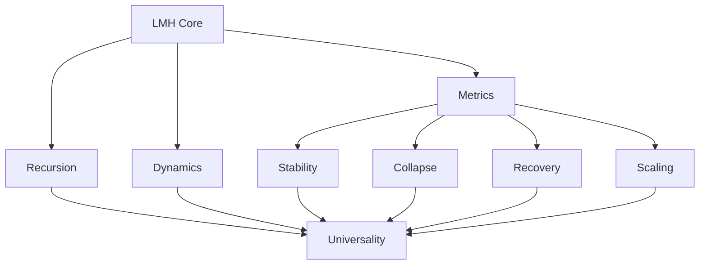
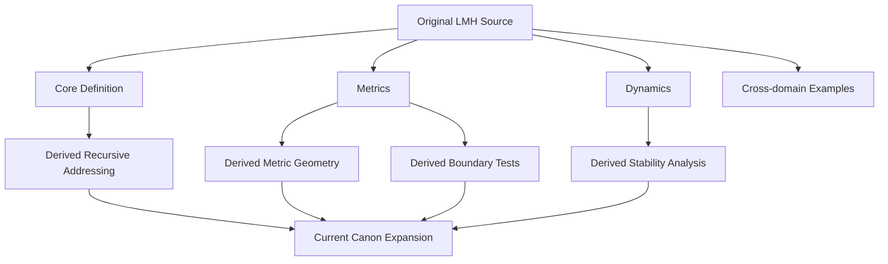
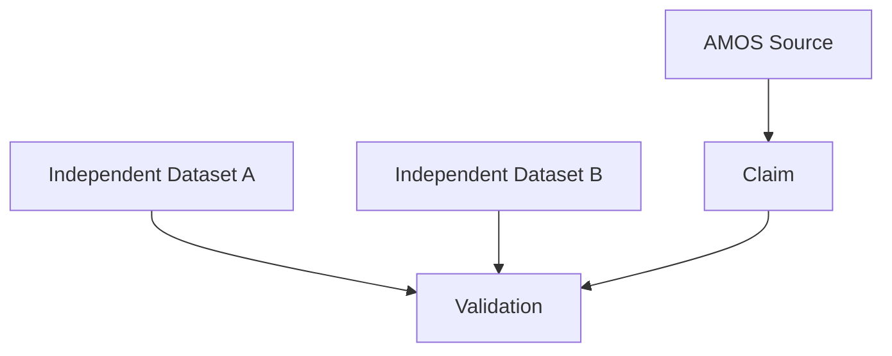
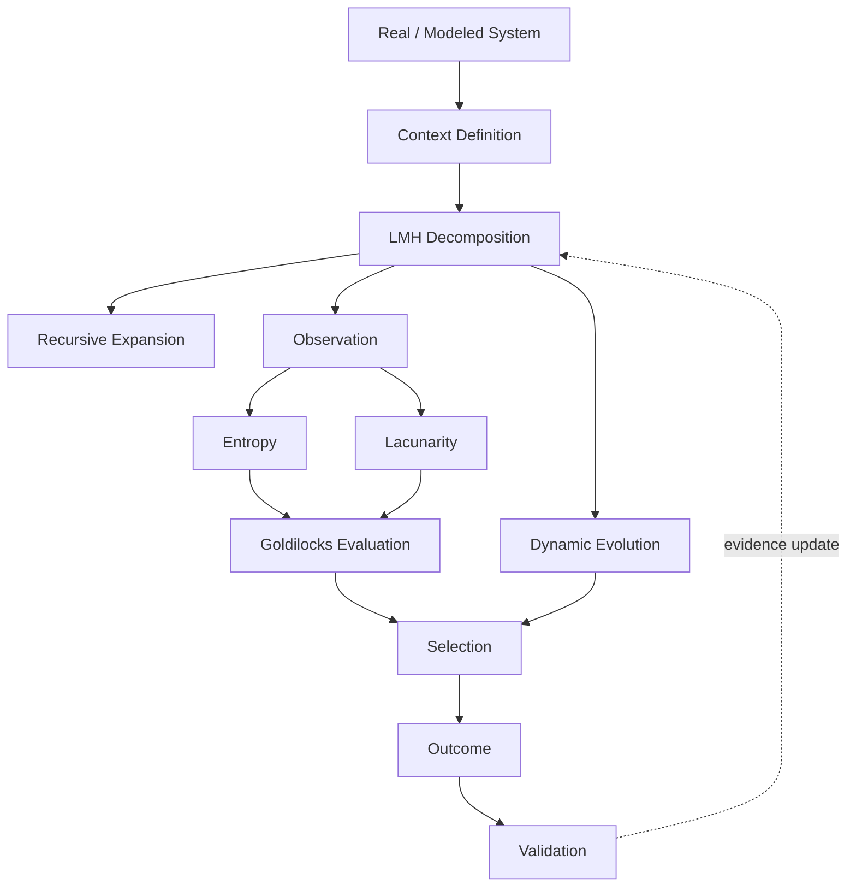
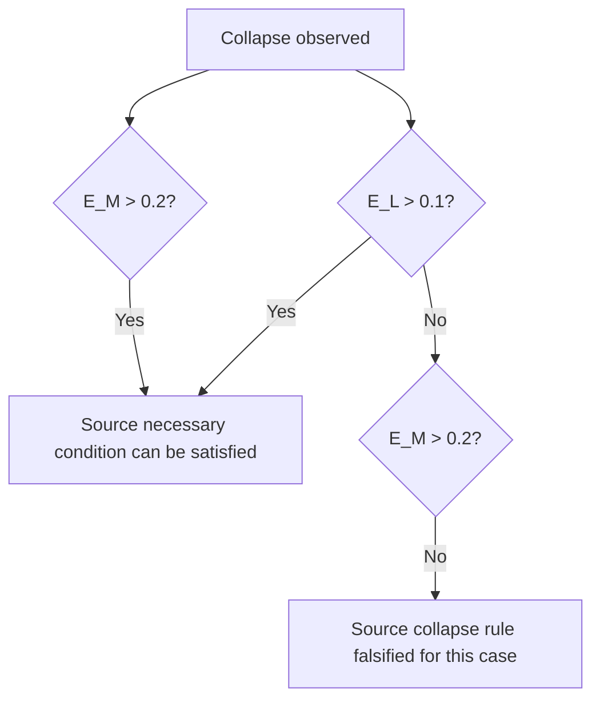
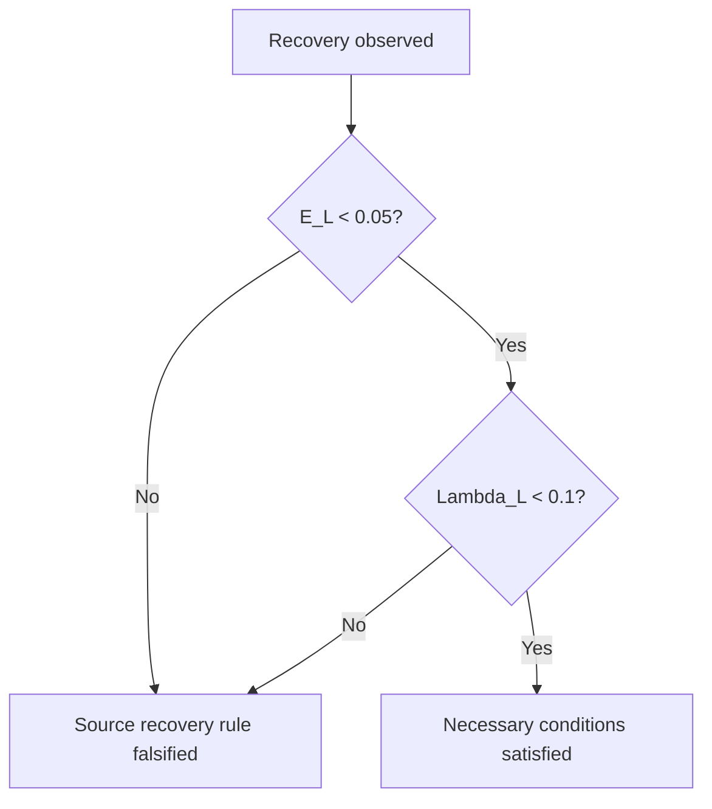
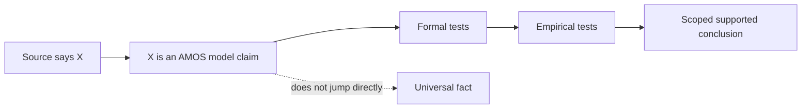

# TRANG [L, M, H] — ABSOLUTE FULL CANON

## Part II · Formal Closure · Recursive Semantics · Stability Geometry · Collapse/Recovery · Validation · AMOS Runtime Binding

**Continuation:** This extends the same Trang `[L,M,H]` artifact. It does not replace the preceding expansion.

**Epistemic boundary:** Source-defined LMH propositions remain `SOURCE_CLAIM / AMOS_MODEL` unless separately validated. Formal consequences derived from those propositions are `DERIVED`. New machinery introduced to make the framework executable or testable is explicitly `PROPOSED`.

---

# 1105. Canonical Core

The irreducible structural proposition is:

$$
\boxed{
S=L\sqcup M\sqcup H
}
$$

where:

* \(L\) = Foundation;
* \(M\) = Mediator;
* \(H\) = Peak.

The symbol:

$$
\sqcup
$$

is a **derived formal hardening** meaning complete and mutually disjoint partition under a fixed context.

---

# 1106. Context Is Load-Bearing

The stronger expression is:

$$
\boxed{
D_C(S)=(L_C,M_C,H_C)
}
$$

because the decomposition depends on context \(C\).

Without \(C\), uniqueness is under-specified.

---

# 1107. Context Envelope

A future canonical context object should minimally contain:

$$
C=
(
Boundary,
Scale,
Regime,
Time,
Purpose,
Measurement
)
$$

**Class:** `PROPOSED`.

---

# 1108. Why Purpose Matters

The same object may be decomposed differently depending on the analytical question.

Therefore:

$$
D_{C_1}(S)\neq D_{C_2}(S)
$$

need not violate uniqueness if:

$$
C_1\neq C_2
$$

---

# 1109. Uniqueness Must Be Context-Local

The source's uniqueness claim is therefore safest as:

$$
\boxed{
\forall S,C,\quad
|\mathcal D_C(S)|=1
}
$$

where \(\mathcal D_C(S)\) is the set of valid LMH decompositions under context \(C\).

This is a **formal restatement of the source claim**, not a proof that uniqueness actually holds.

---

# 1110. Failure of Uniqueness

If:

$$
|\mathcal D_C(S)|>1
$$

then:

```text
LMH_DECOMPOSITION_COMPETING
```

is the integrity-preserving result.

---

# 1111. Failure of Existence

If:

$$
|\mathcal D_C(S)|=0
$$

then:

```text
LMH_DECOMPOSITION_UNKNOWN
```

or, after sufficient hostile testing:

```text
LMH_DECOMPOSITION_NOT_SUPPORTED
```

is preferable to forced classification.

---

# 1112. Completeness

A valid decomposition requires:

$$
L_C\cup M_C\cup H_C=S
$$

---

# 1113. Exclusivity

It also requires:

$$
L_C\cap M_C=\emptyset
$$

$$
M_C\cap H_C=\emptyset
$$

$$
H_C\cap L_C=\emptyset
$$

---

# 1114. Coverage Test

Define:

$$
Coverage(D_C)
=
\frac{|L\cup M\cup H|}{|S|}
$$

for a finite component representation.

A strict canonical partition requires:

$$
Coverage=1
$$

This metric is `PROPOSED`; the requirement of complete coverage comes from the source structure.

---

# 1115. Overlap Test

Define:

$$
Overlap(D_C)
=
|(L\cap M)\cup(M\cap H)\cup(H\cap L)|
$$

Then strict disjointness requires:

$$
Overlap=0
$$

---

# 1116. Continuous Systems

Cardinality-based formulas may not make sense for continuous systems.

A measure-theoretic analogue would require a measure:

$$
\mu
$$

and test coverage/overlap through \(\mu\).

Not source-defined.

---

# 1117. Partition Semantics Gap

The source does not fully specify whether the partition is over:

* physical components;
* functions;
* states;
* processes;
* information roles;
* causal roles.

This is one of the most important unresolved semantics.

---

# 1118. Object Partition Hypothesis

$$
S_{objects}=L\sqcup M\sqcup H
$$

---

# 1119. Function Partition Hypothesis

$$
Functions(S)=F_L\sqcup F_M\sqcup F_H
$$

---

# 1120. Process Partition Hypothesis

$$
Processes(S)=P_L\sqcup P_M\sqcup P_H
$$

---

# 1121. These Are Not Equivalent

A physical object may execute multiple functions.

Therefore object-level disjointness can fail even when function-level disjointness succeeds.

---

# 1122. Cheapest Discriminating Evidence

An authoritative definition of the object on which:

$$
\cup,\cap
$$

operate would resolve a large fraction of downstream ambiguity.

---

# 1123. Recursive Canon

For each:

$$
X\in\{L,M,H\}
$$

the source gives the same recursive form:

$$
\boxed{
X=X_L\sqcup X_M\sqcup X_H
}
$$

---

# 1124. Recursive Role Invariance

The important invariant is not:

$$
X_L=L
$$

but:

$$
Role(X_L\mid X)=L
$$

---

# 1125. Contextual Role Function

Define:

$$
\rho(x,p,C)\in\{L,M,H\}
$$

where \(p\) is the parent system.

Then:

$$
\rho(X_L,X,C)=L
$$

---

# 1126. Role Is Not Intrinsic Identity

A component's LMH label is therefore better treated as a relation:

$$
Role(component,parent,context)
$$

rather than an immutable property.

---

# 1127. Cross-Scale Role Change

It is logically possible that:

$$
\rho(x,S,C)=H
$$

while:

$$
\rho(x,H,C')=L
$$

at another decomposition level.

---

# 1128. No Contradiction

The predicates differ because parent/context differ.

---

# 1129. Recursive Address

Every node has a path:

$$
a=a_1a_2\ldots a_n
$$

with:

$$
a_i\in\{L,M,H\}
$$

---

# 1130. Node Address Set

$$
\mathcal A=\{L,M,H\}^{*}
$$

---

# 1131. Depth

$$
d(a)=|a|
$$

---

# 1132. Parent

$$
Parent(a_1\ldots a_n)=a_1\ldots a_{n-1}
$$

---

# 1133. Local Role

$$
LocalRole(a)=a_n
$$

---

# 1134. Ancestor

For:

$$
i<n
$$

the prefix:

$$
a_1\ldots a_i
$$

is an ancestor.

---

# 1135. Descendant

Address \(b\) is a descendant of \(a\) iff \(a\) is a prefix of \(b\).

---

# 1136. Recursive Tree

If fully expanded to depth \(d\):

$$
N_d=3^d
$$

---

# 1137. Cumulative Complexity

$$
N_{\le d}
=
\frac{3^{d+1}-1}{2}
$$

---

# 1138. Computational Consequence

Recursive universality produces exponential structural expansion.

Therefore exhaustive expansion is not a reasonable default reasoning strategy.

---

# 1139. Selective Expansion Law

A derived AMOS-compatible rule is:

$$
\boxed{
Expand(X)
\iff
ExpectedDecisionValue(Expand(X))>Cost(Expand(X))
}
$$

subject to integrity constraints.

---

# 1140. Integrity Overrides Cost

Even if expansion is expensive:

$$
CriticalGap(X)=TRUE
$$

requires escalation when the answer depends on it.

---

# 1141. Fractal Retrieval

A practical sequence is:

```text
Root claim
→ relevant H branch
→ relevant M mechanism
→ relevant L evidence
→ raw source only if load-bearing
```

This is a reasoning/retrieval adaptation, not a claim that the source's physical LMH order is H→M→L.

---

# 1142. Construction vs Retrieval

Keep separate:

$$
L\rightarrow M\rightarrow H
$$

as source functional organization and:

$$
H\rightarrow M\rightarrow L
$$

as a possible top-down knowledge retrieval strategy.

---

# 1143. Direction Is Typed

The first edge can mean:

`SYSTEM_FLOW`.

The second can mean:

`REASONING_RETRIEVAL`.

No contradiction is necessary.

---

# 1144. Edge-Type Requirement

Every relation should therefore conceptually carry:

$$
Edge=(source,target,type)
$$

---

# 1145. Structural Edge

```yaml
type: CONTAINS
```

---

# 1146. Functional Edge

```yaml
type: FUNCTIONAL_FLOW
```

---

# 1147. Causal Edge

```yaml
type: CAUSAL
```

only if causal evidence licenses it.

---

# 1148. Feedback Edge

```yaml
type: FEEDBACK
```

---

# 1149. Evidence Edge

```yaml
type: SUPPORTS
```

---

# 1150. Dependency Edge

```yaml
type: DEPENDS_ON
```

---

# 1151. Similarity Edge

```yaml
type: ANALOGOUS_TO
```

---

# 1152. Never Collapse Edge Types

$$
ANALOGOUS\_TO\neq CAUSES
$$

$$
CONTAINS\neq CAUSES
$$

$$
SUPPORTS\neq IMPLEMENTS
$$

---

# 1153. Recursive Structure and Causal Topology

The LMH tree alone cannot encode all causal relations.

Therefore:

$$
Tree_{LMH}\neq CausalGraph
$$

---

# 1154. Canonical Multi-Graph

A mature representation can use:

$$
\mathcal G=
(V,E_{struct},E_{dyn},E_{prov},E_{dep})
$$

**Class:** `PROPOSED`.

---

# 1155. Structural Layer

$$
E_{struct}
$$

stores parent-child decomposition.

---

# 1156. Dynamic Layer

$$
E_{dyn}
$$

stores actual influence/feedback.

---

# 1157. Provenance Layer

$$
E_{prov}
$$

stores source ancestry.

---

# 1158. Epistemic Dependency Layer

$$
E_{dep}
$$

stores conclusion-premise dependence.

---

# 1159. Why Provenance Is Separate

Two observations may look independent structurally while sharing the same source.

---

# 1160. Shared Ancestry

If:

$$
Ancestor(e_1)=Ancestor(e_2)
$$

they cannot automatically count as independent corroboration.

---

# 1161. Evidence Independence

Independent confirmation requires:

$$
IndependentRoots(e_1,e_2)
$$

not merely:

$$
e_1\neq e_2
$$

---

# 1162. Recursive Sybil Risk

A single source can generate thousands of recursive derived notes.

Counting each note as independent evidence would inflate confidence.

---

# 1163. Confidence Must Follow Roots

A hardened system counts provenance topology, not document count.

---

# 1164. Formal Entropy

For finite \(N_X>1\):

$$
\boxed{
E_X=
-\frac{1}{\ln N_X}
\sum_{i=1}^{N_X}
p_i^X\ln p_i^X
}
$$

---

# 1165. Required Probability Conditions

$$
p_i^X\ge0
$$

and:

$$
\sum_i p_i^X=1
$$

---

# 1166. Zero-Probability Convention

For Shannon entropy:

$$
0\ln0:=0
$$

is the ordinary continuous-limit convention.

This is mathematical normalization, not a proprietary source addition.

---

# 1167. Lower Bound

$$
E_X\ge0
$$

---

# 1168. Upper Bound

$$
E_X\le1
$$

for finite \(N_X>1\).

---

# 1169. Maximum Entropy

$$
E_X=1
$$

iff the distribution is uniform under the standard finite formulation.

---

# 1170. Minimum Entropy

$$
E_X=0
$$

for a fully concentrated distribution.

---

# 1171. Effective State Number

For ordinary unnormalized Shannon entropy:

$$
H_X=-\sum_i p_i\ln p_i
$$

one can define:

$$
N_{\mathrm{eff}}=e^{H_X}
$$

as a mathematical derived quantity.

This is **not source canon**.

---

# 1172. Infinite-State Problem

For countably infinite state spaces:

$$
\ln N=\infty
$$

does not provide a usable direct normalization.

---

# 1173. Worse, Shannon Entropy May Diverge

For some countably infinite distributions:

$$
H(p)=\infty
$$

---

# 1174. Therefore

The finite normalized formula cannot simply be extended by replacing:

$$
N
$$

with infinity.

---

# 1175. Canonical Resolution Options

A future version must choose among:

* finite truncation;
* effective support;
* alternative normalized entropy;
* unnormalized entropy;
* another bounded complexity metric.

---

# 1176. Until Then

```text
COUNTABLY_INFINITE_NORMALIZED_ENTROPY = UNKNOWN/GAP
```

---

# 1177. Entropy Requires State Ontology

Before computing E, define:

$$
\Omega_X=\{s_1,\ldots,s_N\}
$$

---

# 1178. Different State Ontologies Produce Different E

A coarse partition and fine partition of the same observations need not yield the same normalized entropy.

---

# 1179. Therefore

$$
E_X
$$

is not intrinsic without a state-definition protocol.

---

# 1180. Entropy Measurement Capsule

```yaml
entropy_measurement:
  layer:
  state_space:
  state_definition:
  probability_estimator:
  sample_size:
  window:
  normalization:
  uncertainty:
  timestamp:
```

**PROPOSED.**

---

# 1181. Temporal Entropy

A practical notation:

$$
E_X(t;\Delta t)
$$

makes the observation window explicit.

---

# 1182. Regime Change

If the system changes regime within \(\Delta t\), the estimated distribution may be a mixture.

---

# 1183. Mixture Problem

Suppose:

$$
p=\lambda p_A+(1-\lambda)p_B
$$

Then the entropy of \(p\) is generally not simply the weighted mean of the two regime entropies.

---

# 1184. Thus Regime Mixing Can Distort Classification

Goldilocks evaluation should ideally occur within a stable measurement regime.

---

# 1185. Lacunarity

Source:

$$
\boxed{
\Lambda_X(\varepsilon)
=
\frac{
Var(Mass_X(\varepsilon))
}{
Mean(Mass_X(\varepsilon))^2
}
}
$$

---

# 1186. Nonnegative

Provided the denominator is defined:

$$
\Lambda_X\ge0
$$

because variance is nonnegative.

---

# 1187. Undefined Case

If:

$$
Mean(Mass_X(\varepsilon))=0
$$

then:

$$
\Lambda_X
$$

is undefined under the source formula.

---

# 1188. Zero Lacunarity

If mass is exactly equal in every sampled box:

$$
Var(Mass)=0
$$

then:

$$
\Lambda=0
$$

provided mean is nonzero.

---

# 1189. Scale Dependence

$$
\Lambda(\varepsilon_1)
\neq
\Lambda(\varepsilon_2)
$$

in general.

---

# 1190. Sampling Dependence

Different coverings or box-placement rules can also change estimated lacunarity.

---

# 1191. Measurement Protocol Required

A reproducible \(\Lambda\) needs:

* embedding;
* scale;
* covering rule;
* mass definition;
* sample domain.

---

# 1192. Graph Lacunarity

If `mass` means connection count, the measurement must specify graph neighborhoods or equivalent boxes.

The source does not.

---

# 1193. Physical Lacunarity

If mass means literal physical mass, units cancel in the ratio, but sampling geometry remains important.

---

# 1194. Density Lacunarity

If mass is density, interpretation differs again.

---

# 1195. Cross-Modal Equality Is Not Guaranteed

$$
\Lambda_{\text{physical}}
$$

and:

$$
\Lambda_{\text{graph}}
$$

may share a mathematical form without sharing empirical semantics.

---

# 1196. Structural Similarity Firewall

$$
SameFormula\neq SameMechanism
$$

---

# 1197. Metric State

Define:

$$
z_X=(E_X,\Lambda_X)
$$

---

# 1198. Full LMH Metric State

$$
\boxed{
z=
(E_L,\Lambda_L,E_M,\Lambda_M,E_H,\Lambda_H)
}
$$

---

# 1199. Time-Dependent Metric State

$$
z(t)
$$

---

# 1200. Metric Velocity

A proposed extension:

$$
\dot z(t)
$$

---

# 1201. Metric Acceleration

$$
\ddot z(t)
$$

could capture rapid transitions.

Again, not source canon.

---

# 1202. Goldilocks Entropy Region

Source values include:

$$
E_L\in[0,0.1)
$$

$$
E_M\in(0.1,0.2)
$$

$$
E_H\in[0.1,0.3]
$$

in the Goldilocks formulation.

---

# 1203. Goldilocks Lacunarity Region

$$
\Lambda_L<0.1
$$

$$
\Lambda_M\in[0.1,0.3]
$$

$$
\Lambda_H\in[0.2,0.5]
$$

---

# 1204. Canonical Conflict Still Exists

Other source sections use different endpoint semantics.

Do not collapse them.

---

# 1205. Strong Interior

Define:

$$
\mathcal G^\circ
$$

as points strictly inside every compatible source range.

This is a useful derived concept.

---

# 1206. Disputed Boundary

Define:

$$
\mathcal B_c
$$

as threshold points whose classification differs across source formulations.

---

# 1207. Robust Exterior

Define:

$$
\mathcal O
$$

as points outside all plausible source formulations.

---

# 1208. Three-Way Metric Classification

```text
ROBUSTLY_INSIDE
BOUNDARY_COMPETING
ROBUSTLY_OUTSIDE
```

This is preferable to false binary precision.

---

# 1209. Example: \(E_M=0.15\)

It is inside both:

$$
[0.1,0.2]
$$

and:

$$
(0.1,0.2)
$$

Therefore:

`ROBUSTLY_INSIDE` for that criterion.

---

# 1210. Example: \(E_M=0.10\)

One formulation includes it and another excludes it.

Therefore:

`BOUNDARY_COMPETING`.

---

# 1211. Example: \(E_M=0.25\)

Outside both.

Therefore:

`ROBUSTLY_OUTSIDE`.

---

# 1212. Example: \(E_H=0.05\)

Compatible with one broad source range but not the later Goldilocks range.

Therefore its meaning depends on whether the ranges represent:

* different semantics;
* different versions;
* contradiction.

`COMPETING`.

---

# 1213. Stability Geometry

Let:

$$
\mathcal G_E
$$

be the entropy-admissible region and:

$$
\mathcal G_\Lambda
$$

the lacunarity-admissible region.

---

# 1214. Combined Candidate Region

$$
\mathcal G=
\mathcal G_E\cap\mathcal G_\Lambda
$$

is the natural **derived** combined Goldilocks region.

---

# 1215. Six-Dimensional Hyperrectangle

Ignoring endpoint conflicts, the independent interval formulation resembles a six-dimensional rectangular region.

---

# 1216. Scaling Cuts Through That Region

The ratio constraints:

$$
2\lesssim\frac{\Lambda_M}{\Lambda_L}\lesssim10
$$

and:

$$
1.5\lesssim\frac{\Lambda_H}{\Lambda_M}\lesssim5
$$

further restrict the lacunarity subspace.

---

# 1217. Joint Viability Region

A stronger candidate:

$$
\boxed{
\mathcal V=
\mathcal G_E
\cap
\mathcal G_\Lambda
\cap
\mathcal R_{scale}
}
$$

---

# 1218. But Scaling May Be Descriptive, Not Mandatory

The source's use of approximate ratios leaves unclear whether they are:

* universal hard requirements;
* empirical tendencies;
* examples;
* expected envelopes.

Therefore \(\mathcal V\) is `CONDITIONAL`.

---

# 1219. Ratio Algebra

If:

$$
r_{LM}=\frac{\Lambda_M}{\Lambda_L}
$$

and:

$$
r_{MH}=\frac{\Lambda_H}{\Lambda_M}
$$

then:

$$
\boxed{
\frac{\Lambda_H}{\Lambda_L}
=
r_{LM}r_{MH}
}
$$

---

# 1220. Claimed Combined Approximate Ratio

Using endpoint products:

$$
3\lesssim
\frac{\Lambda_H}{\Lambda_L}
\lesssim50
$$

if the two approximate ranges are treated independently.

**Class:** `DERIVED MATHEMATICAL`.

---

# 1221. But Goldilocks Bounds Restrict It Further

Given:

$$
\Lambda_L<0.1
$$

and:

$$
\Lambda_H\le0.5
$$

the actual ratio can still be arbitrarily large as:

$$
\Lambda_L\to0^+
$$

unless scaling constrains it.

---

# 1222. Scaling Therefore Adds Real Information

It is not redundant with the individual ranges.

---

# 1223. Ratio Feasibility

For any candidate \(\Lambda_L\), scaling imposes:

$$
2\Lambda_L
\lesssim
\Lambda_M
\lesssim
10\Lambda_L
$$

---

# 1224. Second Ratio

$$
1.5\Lambda_M
\lesssim
\Lambda_H
\lesssim
5\Lambda_M
$$

---

# 1225. Example Feasible Point

$$
(\Lambda_L,\Lambda_M,\Lambda_H)
=
(0.05,0.15,0.30)
$$

gives:

$$
r_{LM}=3
$$

$$
r_{MH}=2
$$

and satisfies the broad Goldilocks intervals.

---

# 1226. Example Range-Passing but Ratio-Failing

$$
(0.09,0.10,0.20)
$$

gives:

$$
r_{LM}\approx1.11
$$

so the layer bounds can pass while scaling fails.

---

# 1227. Example Ratio-Passing but Range-Failing

Take:

$$
(0.2,0.4,0.8)
$$

Then:

$$
r_{LM}=2
$$

$$
r_{MH}=2
$$

but every value violates or exceeds the source Goldilocks lacunarity ranges.

---

# 1228. Therefore

$$
ScaleCompliance
\not\Rightarrow
GoldilocksCompliance
$$

and:

$$
GoldilocksCompliance
\not\Rightarrow
ScaleCompliance
$$

---

# 1229. Independent Constraints

This is a strong derived conclusion.

---

# 1230. Entropy Has No Analogous Source Ratio

No source equation states:

$$
\frac{E_M}{E_L}
$$

or:

$$
\frac{E_H}{E_M}
$$

as a scaling invariant.

Do not invent one.

---

# 1231. Entropy Hierarchy Is Not Strict

Because ranges overlap:

$$
E_H<E_M
$$

can occur while both remain inside source bands.

---

# 1232. Therefore

Do not impose:

$$
E_L<E_M<E_H
$$

as a universal invariant.

---

# 1233. Dynamic Equations

Source:

$$
\dot L
=
-\alpha_LL
+
\beta_LF(M)
+
\gamma_L\xi_L
$$

$$
\dot M
=
-\alpha_MM
+
\beta_MF(L,H)
+
\gamma_M\xi_M
$$

$$
\dot H
=
-\alpha_HH
+
\beta_HF(M)
+
\gamma_H\xi_H
$$

---

# 1234. Three Term Classes

Each equation contains:

1. damping/decay;
2. coupling;
3. perturbation/noise.

---

# 1235. Damping

If:

$$
\alpha_X>0
$$

then:

$$
-\alpha_XX
$$

acts as linear decay under ordinary scalar interpretation.

---

# 1236. But Positivity Is Assumed, Not Explicitly Proven

If \(\alpha_X<0\), the same term becomes growth.

The source should ideally define coefficient domains.

---

# 1237. Coupling

$$
\beta_XF(...)
$$

can stabilize or destabilize depending on:

* sign of \(\beta_X\);
* shape of \(F\);
* state.

---

# 1238. Noise

$$
\gamma_X\xi_X
$$

controls sensitivity to perturbation.

---

# 1239. Noise Process Is Under-Specified

Need:

* distribution;
* mean;
* variance;
* autocorrelation;
* cross-layer correlation.

---

# 1240. Correlated Noise

If:

$$
Cov(\xi_L,\xi_M)\neq0
$$

then shocks are not independent.

---

# 1241. Common Shock

A shared environmental disturbance could produce correlated perturbations across all three layers.

---

# 1242. This Matters for Causality

Simultaneous L/M/H changes might result from a common shock rather than inter-layer causation.

---

# 1243. Confounding Firewall

Observed:

$$
L_t\leftrightarrow M_t
$$

does not prove:

$$
L_t\rightarrow M_t
$$

if both respond to:

$$
U_t
$$

---

# 1244. Candidate Open-System Model

A proposed generalization:

$$
\dot x=f(x,u,w)
$$

where:

* \(u\) = structured external input;
* \(w\) = disturbance/noise.

---

# 1245. Source Does Not Supply \(u\)

Therefore do not treat the source dynamics as a complete open-system model.

---

# 1246. Equilibrium

Source equilibrium expressions assume:

$$
\dot L=\dot M=\dot H=0
$$

---

# 1247. Coupled Fixed Point

Thus:

$$
x^*=G(x^*)
$$

---

# 1248. Existence

No source theorem establishes:

$$
\exists x^*
$$

---

# 1249. Uniqueness

No source theorem establishes:

$$
\exists!x^*
$$

---

# 1250. Stability

Even if:

$$
x^*
$$

exists uniquely, it may be unstable.

---

# 1251. Three Separate Questions

$$
Existence?
$$

$$
Uniqueness?
$$

$$
Stability?
$$

Never collapse them.

---

# 1252. Linearized Dynamics

For differentiable \(f\), local analysis around \(x^*\) could use:

$$
\delta\dot x
=
J(x^*)\delta x
$$

where:

$$
J=\frac{\partial f}{\partial x}
$$

---

# 1253. Local Stability Criterion

If all Jacobian eigenvalues satisfy:

$$
Re(\lambda_i)<0
$$

then local asymptotic stability follows under ordinary smooth-system assumptions.

---

# 1254. This Is Not Source Goldilocks

It is a distinct mathematical stability test.

---

# 1255. Four Stability Layers

A hardened LMH system should distinguish:

```text
METRIC_STABILITY
LOCAL_DYNAMIC_STABILITY
GLOBAL_DYNAMIC_STABILITY
OPERATIONAL_STABILITY
```

---

# 1256. Metric Stability

E/Λ compliance.

---

# 1257. Local Dynamic Stability

Small perturbations decay near an equilibrium.

---

# 1258. Global Dynamic Stability

Broad trajectories remain bounded/converge.

---

# 1259. Operational Stability

System continues fulfilling required function.

---

# 1260. Survival

A fifth concept:

```text
SURVIVAL / PERSISTENCE
```

may be distinct again.

---

# 1261. Stable but Nonfunctional

A system can settle into a stable state that no longer performs its intended function.

---

# 1262. Functional but Dynamically Variable

Conversely, some adaptive systems may remain operational despite large fluctuations.

---

# 1263. Therefore Goldilocks Needs Semantic Scope

Does it mean:

* persistence;
* performance;
* resilience;
* dynamic stability?

Source interpretation remains incomplete.

---

# 1264. Collapse Rule

Source:

$$
\boxed{
Collapse
\Rightarrow
(E_L>0.1)\lor(E_M>0.2)
}
$$

---

# 1265. Let

$$
A=(E_L>0.1)
$$

and:

$$
B=(E_M>0.2)
$$

Then:

$$
C\Rightarrow A\lor B
$$

---

# 1266. Contrapositive

$$
\neg(A\lor B)\Rightarrow\neg C
$$

---

# 1267. De Morgan

$$
(E_L\le0.1)\land(E_M\le0.2)
\Rightarrow
\neg Collapse
$$

within strict source logic.

---

# 1268. This Is Strong

It makes low L/M entropy jointly sufficient to rule out collapse **inside the model**.

---

# 1269. But Only If “Collapse” Is Fully Defined

The source does not supply an operational definition of collapse.

---

# 1270. Semantic Gap

A civilization, company, cell, and algorithm can “collapse” in radically different ways.

---

# 1271. Domain Binding Required

```yaml
collapse:
  domain_definition:
  onset_rule:
  observation_method:
  timestamp:
```

---

# 1272. Threshold Violation Is Not Sufficient

From:

$$
A\lor B
$$

one cannot infer:

$$
C
$$

---

# 1273. Thus

$$
E_L>0.1
$$

does **not** automatically mean collapse.

---

# 1274. Nor

$$
E_M>0.2
$$

---

# 1275. They Are Candidate Warning Conditions

Calling them `collapse warning indicators` is a reasonable operational interpretation, but still derived.

---

# 1276. Recovery Rule

Source:

$$
\boxed{
Recovery
\Rightarrow
(E_L<0.05)\land(\Lambda_L<0.1)
}
$$

---

# 1277. Let

$$
R=Recovery
$$

and:

$$
Q=(E_L<0.05)\land(\Lambda_L<0.1)
$$

Then:

$$
R\Rightarrow Q
$$

---

# 1278. Contrapositive

$$
\neg Q\Rightarrow\neg R
$$

---

# 1279. De Morgan Expansion

$$
(E_L\ge0.05)\lor(\Lambda_L\ge0.1)
\Rightarrow
\neg Recovery
$$

inside strict source logic.

---

# 1280. Again, Sufficiency Is Absent

$$
Q\not\Rightarrow R
$$

---

# 1281. Recovery Could Need M/H

Nothing in the implication excludes additional requirements.

---

# 1282. Recovery Could Need Time

A momentary measurement below thresholds may not establish sustained recovery.

---

# 1283. Dwell Time

A future rule may require:

$$
Q(t)=TRUE
$$

for:

$$
\Delta t\ge T_R
$$

before recovery is declared.

No \(T_R\) is source-defined.

---

# 1284. Hysteresis Candidate

Failure/degradation threshold:

$$
E_L\approx0.1
$$

Recovery requirement:

$$
E_L<0.05
$$

creates a gap:

$$
0.05\le E_L\le0.1
$$

---

# 1285. Intermediate Zone

This interval could represent:

* degraded;
* recovering;
* indeterminate.

The source does not define it.

---

# 1286. Proposed State Machine

```text
NORMAL
  ↓
DEGRADED
  ↓
COLLAPSED
  ↓
RECOVERING
  ↓
NORMAL
```

---

# 1287. Do Not Canonize Yet

The source provides conditions but not this full transition graph.

---

# 1288. Direct L-H Rule

Source proposes:

$$
L\leftrightarrow H
$$

without M leads to collapse after approximately ten steps.

---

# 1289. Missing Definitions

Unresolved:

* what constitutes direct coupling;
* whether M is entirely absent or bypassed;
* what a step is;
* whether ten is mean/median/upper bound;
* whether system-specific parameters modify it.

---

# 1290. Strongest Safe Formalization

$$
\boxed{
MissingMediator
\land
DirectLH
\Rightarrow
SourcePredictedCollapse(\Delta\approx10\ steps)
}
$$

---

# 1291. Do Not Convert Approximation to Equality

Not:

$$
T_C=10
$$

---

# 1292. Do Not Convert Steps to Seconds

No physical time mapping is supplied.

---

# 1293. Do Not Universalize Mechanism

The source claims broad applicability, but independent causal validation is absent.

---

# 1294. M Necessity Hypothesis

The rule suggests:

$$
M
$$

acts as a stabilizing mediation layer.

---

# 1295. Mechanism Candidates

Potential explanations include:

* buffering;
* impedance matching;
* coordination;
* transformation;
* pacing;
* error correction.

But these are **candidate mechanisms**, not established source details.

---

# 1296. Cheapest Test

Compare otherwise comparable systems with:

* functioning mediation;
* bypassed mediation;

and prospectively observe stability.

This must be adapted safely to each domain.

---

# 1297. Evolution Equation

Source:

$$
\boxed{
X(t+1)
=
\mathcal C(
\mathcal F(
X(t),\tilde X(t),\xi_X(t)
))
}
$$

---

# 1298. Candidate Generation

$$
X'_{t+1}
=
\mathcal F(X_t,\tilde X_t,\xi_t)
$$

---

# 1299. Selection

$$
X_{t+1}
=
\mathcal C(X'_{t+1})
$$

---

# 1300. Mutation Semantics

\(\tilde X\) appears to represent a modified/mutated state, but exact construction is not fully specified.

---

# 1301. Selection Semantics

\(\mathcal C\) selects/survives according to Goldilocks constraints, but exact behavior outside the region is unknown.

---

# 1302. Candidate Semantics A — Reject

$$
\neg G(X')
\Rightarrow
Reject(X')
$$

---

# 1303. Candidate Semantics B — Repair

$$
\neg G(X')
\Rightarrow
Repair(X')
$$

---

# 1304. Candidate Semantics C — Retry

$$
\neg G(X')
\Rightarrow
MutateAgain
$$

---

# 1305. Candidate Semantics D — Degrade

$$
\neg G(X')
\Rightarrow
AcceptDegraded(X')
$$

---

# 1306. Preserve as Competing

No authoritative rule supplied here chooses among them.

---

# 1307. Selection Is Governance

This part of LMH resembles a governance layer:

$$
CandidateState
\rightarrow
ConstraintEvaluation
\rightarrow
AdmissionDecision
$$

---

# 1308. But Analogy ≠ Runtime Binding

Do not claim this is literally an AMOS runtime admission controller without explicit binding evidence.

---

# 1309. Mutation Must Not Weaken Integrity

A derived AMOS hardening:

$$
MutationAccepted
\Rightarrow
Integrity_{new}\ge Integrity_{old}
$$

under the relevant invariants.

---

# 1310. Performance Improvement Is Insufficient

$$
Faster
$$

or:

$$
MoreComplex
$$

does not justify accepting a mutation if provenance, scope, safety, or contradiction visibility degrades.

---

# 1311. Anti-Regression Vector

A candidate evolution should preserve or improve:

$$
R=
(
FactualSupport,
ScopeCorrectness,
ContradictionVisibility,
Provenance,
CausalDiscipline,
Safety,
Efficiency
)
$$

**PROPOSED AMOS governance.**

---

# 1312. Pareto Problem

Some mutations may improve one dimension while degrading another.

---

# 1313. Integrity Priority

The governing order remains:

$$
Integrity
>
Completeness
>
Fluency
>
Speed
$$

for reasoning use.

---

# 1314. Fractal Mutation

Because every node recursively decomposes, mutation can occur locally:

$$
X_a\rightarrow X'_a
$$

---

# 1315. Local Mutation Advantage

Only descendants/dependencies of \(X_a\) need revalidation if other branches remain independent.

---

# 1316. Global Recompute Is Last Resort

This is consistent with dependency-local failure recovery.

---

# 1317. Mutation Provenance

Each mutation should record:

```yaml
mutation:
  parent_state:
  proposed_state:
  reason:
  evidence:
  affected_dependencies:
  rollback_target:
```

---

# 1318. Rollback

If the mutation fails validation:

$$
X'_a\rightarrow X_a
$$

---

# 1319. Repairability

Prefer local reversible mutation to global irreversible rewrite.

---

# 1320. LMH and Causal Lineage

Every derived state should preserve:

$$
Parent(X_{t+1})=X_t
$$

conceptually.

---

# 1321. Branching Evolution

Multiple candidate mutations:

$$
X_t
\rightarrow
\{
X_{t+1}^{(1)},
X_{t+1}^{(2)},
...
\}
$$

can coexist until selection.

---

# 1322. Competing Candidates

Do not prematurely collapse candidates when evidence is incomparable.

---

# 1323. Selection Requires Discriminating Evidence

The cheapest high-information test should decide among candidates.

---

# 1324. Fractal Candidate Search

Search can occur only in affected subtrees rather than over the entire LMH hierarchy.

---

# 1325. This Creates a General Pattern

$$
LocalChange
\rightarrow
LocalValidation
\rightarrow
LocalCommit
$$

---

# 1326. Transaction Analogy

This resembles transactional state updates.

But it is a reasoning pattern, not evidence that the source literally implements MVCC/CAS.

---

# 1327. Versioned State

A proposed representation:

$$
X_a^{(v)}
$$

---

# 1328. Candidate Update

$$
X_a^{(v)}
\rightarrow
X_a^{(v+1)}
$$

---

# 1329. Stale Update

If another update changes the same dependency before commit, revalidation may be required.

---

# 1330. Why

A proof derived against:

$$
v
$$

may not remain valid against:

$$
v+1
$$

---

# 1331. Proof Freshness

Every proof capsule should therefore conceptually bind to dependency versions.

---

# 1332. Proof Reuse

Reuse is safe only if:

$$
DependenciesUnchanged
$$

$$
ScopeCompatible
$$

$$
RegimeCompatible
$$

$$
FreshEnough
$$

---

# 1333. Otherwise

Invalidate the affected proof capsule.

---

# 1334. Proof Invalidation Is Local

If premise \(P\) supports conclusions \(C_1,C_2\) but not \(C_3\):

$$
Invalid(P)
\Rightarrow
Invalid(C_1,C_2)
$$

while \(C_3\) remains untouched.

---

# 1335. LMH Recursive Proof Topology

A node may have:

* structural children;
* evidence parents;
* causal neighbors;
* dependent conclusions.

This is richer than a simple tree.

---

# 1336. Formal Claim Classes

For LMH use:

### VERIFIED

Directly verified against authoritative source/evidence.

### DERIVED

Logically/mathematically follows from supported premises.

### MODEL

Framework proposition.

### CONDITIONAL

Valid only if unresolved premises hold.

### COMPETING

Multiple live interpretations.

### UNKNOWN/GAP

Insufficient evidence.

---

# 1337. Example — \(3^n\)

Given full ternary recursion:

$$
N_n=3^n
$$

is `DERIVED`.

---

# 1338. Example — Universal LMH

$$
\forall S,\exists LMH(S)
$$

is `MODEL / SOURCE_CLAIM`.

---

# 1339. Example — Countably Infinite Normalization

`UNKNOWN/GAP`.

---

# 1340. Example — Boundary at \(E_H=0.3\)

`COMPETING`.

---

# 1341. Example — Physical Fractal Dimension

`UNKNOWN/GAP`.

---

# 1342. Example — Hysteresis

`DERIVED / CONDITIONAL`.

---

# 1343. Example — Goldilocks as Formal Viability Kernel

`MODEL ANALOGY`, not identity.

---

# 1344. Proof Capsule — Structural Triad

```yaml
claim:
  expression: "S = L ⊔ M ⊔ H"

class: MODEL

source_support:
  - completeness axiom
  - disjointness axioms

scope:
  context_required: true

gaps:
  - partition_object
  - decomposition_algorithm
  - uniqueness_proof

falsifiers:
  - uncovered component
  - unavoidable overlap
  - competing valid decomposition
```

---

# 1345. Proof Capsule — Recursion

```yaml
claim:
  expression: "X = X_L ⊔ X_M ⊔ X_H"

class: MODEL

derived:
  - ternary address space
  - 3^d exact-depth growth

not_implied:
  - geometric fractality
  - identical parameters
  - identical mechanisms
```

---

# 1346. Proof Capsule — Entropy

```yaml
claim:
  metric: normalized_shannon_entropy

class: MODEL

valid_direct_formula:
  state_space: finite
  N: ">1"

gaps:
  - state ontology
  - estimator
  - window
  - infinite normalization
```

---

# 1347. Proof Capsule — Lacunarity

```yaml
claim:
  metric: lacunarity

class: MODEL

requirements:
  - epsilon
  - mass_definition
  - nonzero_mean

gaps:
  - scale protocol
  - cross-domain invariance
```

---

# 1348. Proof Capsule — Scaling

```yaml
claim:
  - "Lambda_M / Lambda_L ≈ 2–10"
  - "Lambda_H / Lambda_M ≈ 1.5–5"

class: SOURCE_CLAIM / MODEL

derived:
  - "Lambda_H / Lambda_L = r_LM * r_MH"
  - positive ratios imply Lambda_L < Lambda_M < Lambda_H

conditions:
  - denominators_positive

empirical_status: UNKNOWN
```

---

# 1349. Proof Capsule — Collapse

```yaml
claim:
  expression: "Collapse => E_L > .1 OR E_M > .2"

class: SOURCE_CLAIM / MODEL

logic:
  type: necessary_condition

not_licensed:
  - converse
  - causal sufficiency

critical_gap:
  - collapse operational definition
```

---

# 1350. Proof Capsule — Recovery

```yaml
claim:
  expression: "Recovery => E_L < .05 AND Lambda_L < .1"

class: SOURCE_CLAIM / MODEL

logic:
  type: necessary_condition

not_licensed:
  - converse

derived_candidate:
  - hysteresis
```

---

# 1351. Proof Capsule — Dynamics

```yaml
claim:
  pattern:
    - decay
    - coupling
    - noise

class: MODEL

gaps:
  - coefficient domains
  - state units
  - F definitions
  - noise law
  - delays
  - external input
```

---

# 1352. Proof Capsule — Universality

```yaml
claim:
  text: "LMH is universal across complex systems"

class: SOURCE_CLAIM

source_support:
  - explicit universal framing
  - cross-domain examples

independent_validation:
  status: UNKNOWN

major_falsifiers:
  - valid counterexample system
  - nonunique decomposition
  - incompatible domain semantics
```

---

# 1353. Cross-Domain Taxonomy

A domain mapping should state its bridge class.

Possible classes:

```text
FUNCTIONAL
STRUCTURAL
SPATIAL
INFORMATIONAL
COMPOSITIONAL
DYNAMICAL
ANALOGICAL
CAUSAL
```

**PROPOSED.**

---

# 1354. Why Bridge Class Matters

A spatial mapping:

$$
Foundation\leftrightarrow Bottom
$$

does not automatically validate a functional claim about persistence.

---

# 1355. Functional Bridge

Two systems can be functionally analogous without sharing material implementation.

---

# 1356. Structural Bridge

Two systems can have similar relation graphs without sharing dynamics.

---

# 1357. Dynamical Bridge

Two systems can obey similar equations without sharing underlying mechanism.

---

# 1358. Causal Bridge

Requires stronger mechanism/evidence.

---

# 1359. Bridge Strength Must Not Inflate Automatically

$$
ANALOGY
\not\Rightarrow
ISOMORPHISM
\not\Rightarrow
CAUSAL\ IDENTITY
$$

---

# 1360. Cross-Scale Similarity

Likewise:

$$
Pattern_{scale1}\approx Pattern_{scale2}
$$

does not establish:

$$
Mechanism_{scale1}=Mechanism_{scale2}
$$

---

# 1361. Recursive Similarity Can Be Emergent

Different mechanisms can produce similar high-level structures.

---

# 1362. Universality Could Be Weak or Strong

### Weak universality

LMH is a reusable descriptive grammar.

### Medium universality

LMH predicts common structural relations across domains.

### Strong universality

LMH arises from the same causal mechanism everywhere.

The source's broad rhetoric should not be silently interpreted as empirical proof of the strongest form.

---

# 1363. Strongest Currently Defensible

$$
\boxed{
WeakUniversality=MODEL
}
$$

as a general analytical grammar.

---

# 1364. Medium Universality

`SOURCE_CLAIM / UNKNOWN empirical status`.

---

# 1365. Strong Universality

`UNKNOWN/GAP`.

---

# 1366. Fractal Semantics

The word `fractal` itself needs typed interpretation.

---

# 1367. Recursive Fractal

$$
X\rightarrow(X_L,X_M,X_H)
$$

---

# 1368. Structural Fractal

Role relations recur across scales.

---

# 1369. Statistical Fractal

Statistical distributions remain scale-related.

---

# 1370. Geometric Fractal

Formal scale invariance yields a measurable fractal dimension.

---

# 1371. Physical Fractal

The real physical system exhibits those geometric/statistical properties.

---

# 1372. Source Strongly Supports Recursive Fractal Semantics

The others require additional evidence.

---

# 1373. Lacunarity Alone Does Not Prove Fractality

Lacunarity can characterize heterogeneity/gaps, but a lacunarity measure by itself does not establish a fractal dimension.

---

# 1374. Entropy Alone Does Not Prove Fractality

Likewise.

---

# 1375. Three-Branch Recursion Alone Does Not Give Dimension

To calculate a classic self-similar dimension:

$$
D=\frac{\ln N}{\ln(1/r)}
$$

one needs a geometric contraction factor \(r\).

---

# 1376. Lacunarity Ratio Is Not Automatically \(r\)

Therefore do not substitute:

$$
r_{LM}
$$

or:

$$
r_{MH}
$$

into a fractal-dimension formula.

---

# 1377. Physical Claims Firewall

The same rule applies to:

* quarks;
* nuclei;
* dark matter;
* CMB;
* black holes.

The framework's mapping remains a model unless independent physics evidence supports the specific relation.

---

# 1378. Biological Claims Firewall

Do not infer medical diagnosis or treatment from LMH entropy/lacunarity thresholds.

---

# 1379. Cognitive Claims Firewall

Do not treat H as a measured consciousness variable.

---

# 1380. Organizational Claims Firewall

Do not equate high cohesion/stability with ethical legitimacy or healthy governance.

---

# 1381. AI Claims Firewall

Do not claim a named AI system literally implements LMH without architecture evidence.

---

# 1382. Stability Is Not Ethics

$$
Stable\neq Ethical
$$

---

# 1383. Stability Is Not Truth

$$
Stable\neq True
$$

---

# 1384. Stability Is Not Optimality

$$
Stable\neq Optimal
$$

---

# 1385. Survival Is Not Desirability

$$
Survival\neq Desirable
$$

---

# 1386. Governance Must Be External to Pure Viability

If LMH is used for action, additional objective and ethical constraints are required.

---

# 1387. Candidate Governance Stack

$$
Viability
\land
Safety
\land
Ethics
\land
ObjectiveFit
$$

**PROPOSED.**

---

# 1388. No Optimization Objective in Source

The source does not provide a universal scalar:

$$
J(S)
$$

to maximize.

---

# 1389. Therefore

LMH is not, by itself, a complete decision theory.

---

# 1390. It Can Constrain Decisions

For example:

$$
Avoid(ModelPredictedCollapse)
$$

but choosing among many stable states requires additional criteria.

---

# 1391. Decision Sufficiency

An LMH analysis is sufficient only when the user decision depends solely on the distinctions LMH can validly make.

---

# 1392. Otherwise Retrieve Additional Models

Do not force all decisions into LMH.

---

# 1393. Model Pluralism

LMH can coexist with competing or complementary models.

---

# 1394. Competing Models Should Remain Visible

If two models predict different outcomes:

```text
COMPETING
```

until discriminating evidence exists.

---

# 1395. Do Not Force Synthesis

A fluent unified story is not necessarily more truthful.

---

# 1396. LMH Could Be One Coordinate System

A system may be represented simultaneously by:

* LMH roles;
* causal graph;
* thermodynamic state;
* organizational network;
* economic variables.

---

# 1397. Coordinate Systems Need Not Be Reducible

LMH may compress one aspect without replacing all domain-specific models.

---

# 1398. Compression Loss

Every abstraction discards information.

---

# 1399. LMH Compression Function

Conceptually:

$$
K_{LMH}(S)\rightarrow(L,M,H)
$$

---

# 1400. Compression Is Useful When Decision-Relevant Information Survives

---

# 1401. Compression Failure

If two systems map to the same LMH representation but require different decisions, the compression may be insufficient for that task.

---

# 1402. Task-Relative Sufficiency

Therefore:

$$
Sufficiency(K_{LMH},Q)
$$

depends on question \(Q\).

---

# 1403. Information Loss Test

A useful adversarial question:

> What decision-relevant distinction disappears when I compress this system to LMH?

---

# 1404. If the Lost Distinction Can Flip the Answer

Escalate beyond LMH.

---

# 1405. This Protects Against Overcompression

$$
ElegantCompression\neq CompleteExplanation
$$

---

# 1406. Recursive Compression Can Hide Local Failure

A high-level H label may look healthy while:

$$
H_M
$$

is failing.

---

# 1407. Therefore Drill Down When Needed

$$
Anomaly(H)
\rightarrow
Inspect(H_L,H_M,H_H)
$$

---

# 1408. But Not Automatically Forever

Stop when further recursion cannot alter the decision.

---

# 1409. Adaptive Complexity

### C0

Direct role definition.

### C1

One-level decomposition.

### C2

Metrics.

### C3

Dynamics and contradictions.

### C4

Cross-domain/causal/universal validation.

This is a useful derived operational ladder.

---

# 1410. Escalate on Stakes

High-stakes applications should begin at a higher validation level.

---

# 1411. Escalate on Irreversibility

If action is hard to reverse, require stronger evidence.

---

# 1412. Escalate on Novelty

Novel domain mappings require more validation.

---

# 1413. Escalate on Contradiction

Source conflicts require resolution before threshold-sensitive action.

---

# 1414. Escalate on Causal Claim

Causal interventions require causal evidence.

---

# 1415. De-Escalate Once Outcome-Changing Uncertainty Is Resolved

Do not continue expanding purely for volume.

---

# 1416. Sensitivity Analysis

Identify the smallest premise capable of flipping the result.

---

# 1417. Example — Boundary

If classification depends on whether:

$$
E_H=0.30
$$

is allowed, threshold endpoint semantics are the sensitivity pivot.

---

# 1418. Example — Decomposition

If a component could be M or H and the predicted outcome differs, role classification is the sensitivity pivot.

---

# 1419. Example — Scaling

If \(\Lambda_L\) is near zero, denominator uncertainty can dominate the ratio.

---

# 1420. Example — Recovery

If:

$$
E_L=0.049
$$

with measurement uncertainty:

$$
\pm0.01
$$

the recovery conclusion is fragile.

---

# 1421. Robust Conclusion

A result is stronger when plausible perturbations do not change classification.

---

# 1422. Fragile Conclusion

Mark:

`CONDITIONAL`

when small plausible changes flip it.

---

# 1423. Measurement Uncertainty

Suppose:

$$
\hat E_L=0.04\pm0.005
$$

Then the entire interval remains below 0.05.

This is more robust for the E part of recovery.

---

# 1424. Suppose Instead

$$
\hat E_L=0.049\pm0.005
$$

The interval crosses 0.05.

Recovery condition becomes uncertain.

---

# 1425. Same for Lacunarity

$$
\hat\Lambda_L\pm\delta_\Lambda
$$

must be considered near 0.1.

---

# 1426. Joint Uncertainty

For recovery, both conditions must be robustly satisfied.

---

# 1427. Weakest Premise

If E is highly certain but \(\Lambda\) uncertain:

$$
C_{Recovery}
\le C_{\Lambda}
$$

for that load-bearing branch.

---

# 1428. No Averaging Away Critical Uncertainty

A strong E estimate cannot compensate for an unknown required \(\Lambda\).

---

# 1429. Conjunctive Rule Confidence

For:

$$
A\land B
$$

confidence cannot exceed the weaker required premise without independent revalidation.

---

# 1430. Disjunctive Collapse Rule

For:

$$
A\lor B
$$

one well-supported true branch can satisfy the model condition, but it still does not establish collapse because the source implication is one-way.

---

# 1431. Causal Epoch Finality Analogy

Once a historical state is fixed by sufficient evidence, later analysis should not silently rewrite it merely to fit a new model.

This is an AMOS reasoning principle, not an LMH source mechanism.

---

# 1432. Historical Decomposition Can Be Revised Only with New Evidence

Record lineage:

```text
v1 decomposition
→ new evidence
→ v2 decomposition
```

rather than overwriting v1.

---

# 1433. Provenance-Preserving Revision

A revision should state:

* what changed;
* why;
* which conclusions invalidate.

---

# 1434. Atomic Multi-Layer Reasoning

Some questions require L, M, and H jointly.

Do not commit a conclusion from L before checking a load-bearing M/H dependency when the rule is joint.

---

# 1435. Example

A system-wide Goldilocks claim requires all relevant E/Λ conditions.

---

# 1436. Partial Pass Is Not Full Pass

If:

```text
L PASS
M PASS
H UNKNOWN
```

then:

```text
OVERALL UNKNOWN/CONDITIONAL
```

not PASS.

---

# 1437. Atomicity

The final system-level classification should commit only after the required predicate set is evaluated.

---

# 1438. Local Conclusions Can Still Be Returned

For example:

> L satisfies its measured Goldilocks constraints; system-wide status remains unknown because H is missing.

This preserves useful partial knowledge.

---

# 1439. Fail-Closed Table

| Condition                                 | Safe output            |
| ----------------------------------------- | ---------------------- |
| Context absent                            | `UNKNOWN`              |
| System boundary absent                    | `UNKNOWN`              |
| Multiple valid decompositions             | `COMPETING`            |
| Entropy state space undefined             | `UNKNOWN`              |
| \(N\le1\) under source normalized formula | `UNDEFINED`            |
| Infinite \(N\)                            | `UNKNOWN/GAP`          |
| Lacunarity mean = 0                       | `UNDEFINED`            |
| \(\varepsilon\) missing                   | `CONDITIONAL`          |
| Scaling denominator = 0                   | `UNDEFINED`            |
| Threshold source conflict                 | `COMPETING`            |
| Metric near boundary with uncertainty     | `CONDITIONAL`          |
| Causal evidence absent                    | no causal promotion    |
| Universal evidence absent                 | no universal promotion |

---

# 1440. Boundary Truth Table — \(E_M\)

| \(E_M\) | Closed-range interpretation | Open-range interpretation | Canonical status |
| ------: | --------------------------- | ------------------------- | ---------------- |
|    0.09 | fail                        | fail                      | robust fail      |
|    0.10 | pass                        | fail                      | competing        |
|    0.15 | pass                        | pass                      | robust pass      |
|    0.20 | pass                        | fail                      | competing        |
|    0.21 | fail                        | fail                      | robust fail      |

---

# 1441. Boundary Truth Table — \(E_H\)

| \(E_H\) | Broad `[.05,.30]` | Goldilocks `[.10,.30]` | Stability `<.30`              |
| ------: | ----------------- | ---------------------- | ----------------------------- |
|     .04 | fail              | fail                   | pass if only upper-bound test |
|     .05 | pass              | fail                   | pass                          |
|     .09 | pass              | fail                   | pass                          |
|     .10 | pass              | pass                   | pass                          |
|     .29 | pass              | pass                   | pass                          |
|     .30 | pass              | pass                   | fail                          |
|     .31 | fail              | fail                   | fail                          |

This shows that the source statements almost certainly carry different semantics or unresolved inconsistency; they cannot safely be treated as one identical predicate.

---

# 1442. Boundary Truth Table — \(\Lambda_M\)

| \(\Lambda_M\) | Broad | Strict stability |
| ------------: | ----- | ---------------- |
|           .10 | pass  | fail             |
|           .20 | pass  | pass             |
|           .30 | pass  | fail             |

---

# 1443. Boundary Truth Table — \(\Lambda_H\)

| \(\Lambda_H\) | Broad | Strict stability |
| ------------: | ----- | ---------------- |
|           .20 | pass  | fail             |
|           .30 | pass  | pass             |
|           .50 | pass  | fail             |

---

# 1444. Canonical Boundary Policy

Until authoritative resolution:

```text
Interior agreement → usable
Endpoint disagreement → COMPETING
Exterior agreement → fail
```

---

# 1445. No Silent Epsilon

Do not fix boundary conflicts by inventing:

$$
\epsilon=10^{-6}
$$

---

# 1446. Source Semantics Must Decide

Numerical tolerance and semantic inclusivity are different issues.

---

# 1447. Formal Boundary vs Measurement Tolerance

Even if the true rule is:

$$
E_M>0.1
$$

measurement uncertainty may still require a practical margin.

---

# 1448. Keep Separate

```text
CANONICAL_THRESHOLD
MEASUREMENT_TOLERANCE
```

---

# 1449. Falsification Program — Phase 0

Resolve internal formal semantics.

---

# 1450. Phase 1

Test decomposition reproducibility.

---

# 1451. Phase 2

Test metric reproducibility.

---

# 1452. Phase 3

Calibrate thresholds.

---

# 1453. Phase 4

Prospectively test collapse/recovery predictions.

---

# 1454. Phase 5

Test scaling.

---

# 1455. Phase 6

Test cross-domain transfer.

---

# 1456. Phase 7

Only then evaluate stronger universality.

---

# 1457. Why This Order

Every later stage depends on earlier stages.

---

# 1458. Phase 0 Failure

If the theory's own predicates are ambiguous, empirical results cannot be cleanly interpreted.

---

# 1459. Phase 1 Failure

If analysts cannot agree on L/M/H, metrics become classification-dependent.

---

# 1460. Phase 2 Failure

If E/Λ cannot be reproduced, thresholds cannot be validated.

---

# 1461. Phase 3 Failure

If thresholds differ strongly by domain, universal numerical claims should be scoped.

---

# 1462. Phase 4 Failure

If collapse/recovery predictions fail, revise those modules without automatically discarding structural LMH.

---

# 1463. Phase 5 Failure

Scaling can be downgraded independently.

---

# 1464. Phase 6 Failure

Cross-domain universality can be narrowed while preserving successful domains.

---

# 1465. Modular Falsifiability Is a Strength

It prevents all-or-nothing theory defense.

---

# 1466. Validation Dataset

A proper dataset would need:

```yaml
system_id:
domain:
context:
boundary:
regime:
time_window:

decomposition:
  L:
  M:
  H:

measurements:
  E_L:
  E_M:
  E_H:
  Lambda_L:
  Lambda_M:
  Lambda_H:

outcome:
  stability:
  collapse:
  recovery:

provenance:
independent_root:
```

---

# 1467. Pre-Registration

Freeze:

* definitions;
* thresholds;
* measurement methods;

before observing outcome.

---

# 1468. Avoid Researcher Degrees of Freedom

Do not change:

* state bins;
* \(\varepsilon\);
* decomposition;
* time window;

after seeing the outcome unless the analysis is explicitly exploratory.

---

# 1469. Exploratory vs Confirmatory

Mark them separately.

---

# 1470. Exploratory Result

Useful for hypothesis generation.

---

# 1471. Confirmatory Result

Requires frozen protocol and independent test data.

---

# 1472. Cross-Domain Holdout

A particularly strong test would hold out entire system domains.

---

# 1473. Still Not Absolute Proof

Finite tests cannot prove an unrestricted universal empirical proposition over all possible systems.

---

# 1474. Universal Claim Can Be Progressively Strengthened

From:

`MODEL`

to:

`SUPPORTED_ACROSS_TESTED_DOMAINS`

without claiming logical universality.

---

# 1475. Scope-Aware Wording

Prefer:

> “Supported across the tested domains and regimes.”

over:

> “Proven universal.”

---

# 1476. Falsifier — Nonunique Decomposition

If two decompositions are equally valid:

$$
D_1\neq D_2
$$

under identical context, uniqueness fails.

---

# 1477. Falsifier — Missing Mediator

Find a stable direct L-H system that remains viable far beyond the claimed horizon.

---

# 1478. Falsifier — Collapse

Observe validated collapse with:

$$
E_L\le0.1
$$

and:

$$
E_M\le0.2
$$

---

# 1479. Falsifier — Recovery

Observe validated recovery with either:

$$
E_L\ge0.05
$$

or:

$$
\Lambda_L\ge0.1
$$

---

# 1480. Falsifier — Scaling

Observe validated stable LMH systems whose lacunarity ratios systematically fall outside the proposed envelopes.

---

# 1481. Falsifier — Recursive Form

Find an LMH layer that cannot itself admit the same role grammar under the claimed scope.

---

# 1482. Falsifier — Cross-Domain Form

Show that mappings require mutually incompatible meanings of L/M/H.

---

# 1483. Falsifier — Metric Universality

Show that the same normalized metric value predicts opposite structural conditions across domains under equivalent protocol.

---

# 1484. Counterexample Governance

One credible counterexample to an unrestricted universal claim must not be hidden by hundreds of confirmatory examples.

---

# 1485. Universal Quantifier

$$
\forall S,\ P(S)
$$

is refuted by:

$$
\exists S,\neg P(S)
$$

provided the counterexample lies inside the stated scope.

---

# 1486. Scope Is Therefore Essential

A counterexample outside scope does not refute the scoped claim.

---

# 1487. Scope Drift

Do not silently expand from:

> complex cooperative systems

to:

> all physical reality

unless source canon explicitly licenses that scope.

---

# 1488. Regime Drift

Likewise, a model validated in equilibrium cannot automatically be applied during phase transition/crisis.

---

# 1489. Temporal Drift

Old calibrations may become stale.

---

# 1490. Freshness-Bounded Knowledge

Each validated threshold should eventually carry:

```yaml
validated_at:
valid_until:
revalidation_trigger:
```

---

# 1491. Revalidation Trigger

Examples:

* domain change;
* sensor change;
* state-space change;
* threshold revision;
* regime shift.

---

# 1492. Measurement Method Is Part of Scope

Changing the estimator can change E.

---

# 1493. Scale Is Part of Scope

Changing \(\varepsilon\) can change \(\Lambda\).

---

# 1494. Therefore

A metric claim without its measurement envelope is incomplete.

---

# 1495. AMOS Knowledge Node — Proposed

```yaml
id: TRANG_LMH_CORE
class: MODEL
origin_architect: Trang Phan

scope:
  framework: Trang_LMH

claims:
  - recursive_three_role_decomposition

dependencies:
  - LMH_ROLE_DEFINITIONS
  - LMH_CONTEXT_SEMANTICS

competing:
  - object_partition
  - function_partition
  - process_partition

falsifiers:
  - decomposition_failure
  - nonuniqueness

confidence_ceiling:
  external_universality: UNKNOWN
```

---

# 1496. AMOS Knowledge Node — Metrics

```yaml
id: TRANG_LMH_METRICS
class: MODEL

depends_on:
  - TRANG_LMH_CORE

contains:
  - NORMALIZED_ENTROPY
  - LACUNARITY

critical_gaps:
  - entropy_state_ontology
  - infinite_normalization
  - lacunarity_epsilon
  - cross_domain_measurement_invariance
```

---

# 1497. AMOS Knowledge Node — Stability

```yaml
id: TRANG_LMH_STABILITY
class: MODEL

depends_on:
  - TRANG_LMH_METRICS

contains:
  - GOLDILOCKS_E
  - GOLDILOCKS_LAMBDA

competing:
  - threshold_endpoints
  - criterion_composition

not_equivalent_to:
  - formal_dynamic_stability
```

---

# 1498. AMOS Knowledge Node — Dynamics

```yaml
id: TRANG_LMH_DYNAMICS
class: MODEL

depends_on:
  - TRANG_LMH_CORE

contains:
  - decay
  - coupling
  - noise
  - equilibrium

gaps:
  - F_definition
  - coefficient_domains
  - external_input
  - noise_process
```

---

# 1499. AMOS Knowledge Node — Collapse

```yaml
id: TRANG_LMH_COLLAPSE
class: MODEL

depends_on:
  - TRANG_LMH_METRICS

claim:
  relation: NECESSARY_CONDITION
  expression: "Collapse => E_L > .1 OR E_M > .2"

gap:
  - collapse_definition
```

---

# 1500. AMOS Knowledge Node — Recovery

```yaml
id: TRANG_LMH_RECOVERY
class: MODEL

depends_on:
  - TRANG_LMH_METRICS

claim:
  relation: NECESSARY_CONDITION
  expression: "Recovery => E_L < .05 AND Lambda_L < .1"

gap:
  - recovery_definition
  - dwell_time
```

---

# 1501. AMOS Knowledge Node — Scaling

```yaml
id: TRANG_LMH_SCALING
class: MODEL

depends_on:
  - TRANG_LMH_METRICS

claims:
  - "Lambda_M / Lambda_L ≈ 2–10"
  - "Lambda_H / Lambda_M ≈ 1.5–5"

gaps:
  - approximation_tolerance
  - universality
```

---

# 1502. Dependency Graph



---

# 1503. Dependency Consequence

If scaling fails:

$$
TRANG\_LMH\_SCALING
$$

is invalidated.

The structural core need not be.

---

# 1504. If Entropy Formula Changes

Revalidate:

* stability;
* collapse;
* recovery.

---

# 1505. If Role Definitions Change

Almost everything downstream requires revalidation.

---

# 1506. Therefore Role Semantics Are Highly Load-Bearing

They should be resolved before expanding peripheral theory.

---

# 1507. Provenance Topology



---

# 1508. Independence Warning

A1, B1, B2, and C1 are not four independent confirmations of the source.

They descend from the same source ancestry.

---

# 1509. External Evidence Must Enter as a New Root



---

# 1510. Even Independent Datasets Can Share Bias

Independence must be assessed at:

* data collection;
* methodology;
* instrumentation;
* analyst;
* source.

---

# 1511. Repetition Is Not Independence

$$
1000\times SameOrigin
\neq
1000\ IndependentConfirmations
$$

---

# 1512. Canonical RSCF Node

```yaml
RSCF-NODE:
  id: TRANG_LMH
  type: framework
  origin_architect: Trang Phan

  epistemic:
    source_definition: VERIFIED_FROM_SOURCE
    model_status: MODEL
    universal_empirical_status: UNKNOWN_GAP

  H:
    intent: >
      Represent complex systems through recursively repeating
      Foundation, Mediator, and Peak roles.

  M:
    mechanisms:
      - decomposition
      - recursion
      - entropy
      - lacunarity
      - dynamics
      - feedback
      - mutation_selection
      - collapse_recovery

  L:
    receipts:
      - role_definitions
      - equations
      - thresholds
      - domain_bindings
      - provenance
      - falsifiers
```

---

# 1513. RSCF Relations — Proposed

```yaml
RSCF-RELATIONS:
  - TRANG_LMH DEPENDS_ON LMH_ROLE_DEFINITIONS
  - LMH_RECURSION DEPENDS_ON TRANG_LMH
  - LMH_METRICS DEPENDS_ON TRANG_LMH
  - LMH_STABILITY DEPENDS_ON LMH_METRICS
  - LMH_COLLAPSE DEPENDS_ON LMH_METRICS
  - LMH_RECOVERY DEPENDS_ON LMH_METRICS
  - LMH_SCALING DEPENDS_ON LMH_METRICS
  - LMH_UNIVERSALITY DEPENDS_ON LMH_RECURSION
  - LMH_UNIVERSALITY DEPENDS_ON LMH_CROSS_DOMAIN_VALIDATION
```

These are derived knowledge-graph relations, not original source frontmatter.

---

# 1514. Canonical Contradiction Node

```yaml
id: LMH_THRESHOLD_CONFLICTS
class: COMPETING

items:
  - E_M endpoint inclusion
  - E_H lower boundary
  - E_H upper inclusion
  - Lambda_M endpoint inclusion
  - Lambda_H endpoint inclusion

resolution:
  status: UNKNOWN
  required: authoritative_semantic_or_version_precedence
```

---

# 1515. Canonical Feedback Conflict Node

```yaml
id: LMH_FEEDBACK_TOPOLOGY
class: COMPETING

source_views:
  differential_equations:
    L_input: M
    M_input: [L, H]
    H_input: M

  prose_cycle:
    edges:
      - L_to_M
      - M_to_H
      - H_to_L

possible_resolutions:
  - abstraction_level_difference
  - timescale_difference
  - omitted_indirect_path
  - source_inconsistency
```

---

# 1516. Do Not Choose a Resolution Without Evidence

All four remain live.

---

# 1517. Strongest Discriminating Evidence

A formal graph or equation set specifying all directed couplings and timescales.

---

# 1518. Causal Firewall

Even after topology is known, topology alone does not prove empirical causality.

---

# 1519. Model Causal Edge vs Verified Causal Edge

Use:

```text
MODEL_CAUSAL_EDGE
```

versus:

```text
EMPIRICALLY_VALIDATED_CAUSAL_EDGE
```

---

# 1520. This Avoids Ontology Inflation

A model can contain causal hypotheses without claiming they are established facts.

---

# 1521. Domain Application Template

```yaml
lmh_application:
  system:
  domain:
  context:
  boundary:
  regime:
  time:

  decomposition:
    L:
      components:
      justification:
    M:
      components:
      justification:
    H:
      components:
      justification:

  competing_decompositions: []

  measurements:
    entropy:
      state_space:
      estimator:
      window:
    lacunarity:
      mass:
      epsilon:
      covering:

  metrics:
    E_L:
    E_M:
    E_H:
    Lambda_L:
    Lambda_M:
    Lambda_H:

  goldilocks:
    status:
    boundary_conflicts:

  dynamics:
    model:
    parameters:
    evidence:

  collapse:
    status:

  recovery:
    status:

  provenance:
    roots:

  conclusion_class:
```

---

# 1522. Example Without Fabricating Data

```yaml
lmh_application:
  system: ExampleSystem
  domain: unspecified

  decomposition:
    status: UNKNOWN

  measurements:
    status: NOT_PROVIDED

  goldilocks:
    status: UNKNOWN

  conclusion_class: UNKNOWN_GAP
```

This is preferable to filling blanks with plausible-sounding values.

---

# 1523. Unknown Propagation

If decomposition is unknown:

$$
MetricsByLayer
$$

may also become unknown because the layer assignment is unresolved.

---

# 1524. Dependency-Aware Unknown

Do not compute:

$$
E_L
$$

if L itself has not been defined.

---

# 1525. Partial Knowledge

If L is well-defined but M/H are not, L-local metrics may still be computed.

---

# 1526. System-Level Conclusion Remains Incomplete

This preserves unaffected work.

---

# 1527. Contradiction Preservation

If two measurements disagree:

```text
Measurement A: E_L=.08
Measurement B: E_L=.13
```

do not average automatically.

---

# 1528. First Inspect Provenance

Potential causes:

* different windows;
* different state spaces;
* different regimes;
* sensor error;
* actual change.

---

# 1529. Averaging Across Regimes Can Be Invalid

$$
Mean(E_A,E_B)
$$

may represent neither regime.

---

# 1530. Regime-Aware Resolution

Partition evidence by regime before synthesis.

---

# 1531. Freshness-Aware Resolution

A newer measurement may supersede an older one only if they concern the same object and regime and no historical comparison is intended.

---

# 1532. Scope-Aware Resolution

A company-level E value cannot automatically substitute for a department-level E value.

---

# 1533. Scale-Aware Resolution

$$
E_{system}
\neq E_{subsystem}
$$

unless an aggregation rule exists.

---

# 1534. No Entropy Additivity Assumed

Normalized entropies do not simply add:

$$
E_S\neq E_L+E_M+E_H
$$

in general.

---

# 1535. No Lacunarity Additivity Assumed

Likewise:

$$
\Lambda_S\neq
\Lambda_L+\Lambda_M+\Lambda_H
$$

unless specifically derived.

---

# 1536. No Weighted Aggregation Supplied

Do not invent:

$$
E_S=w_LE_L+w_ME_M+w_HE_H
$$

---

# 1537. System-Level Metric Is a Gap

The source defines layer metrics but does not supply a universal aggregate LMH entropy/lacunarity score.

---

# 1538. No Single LMH Health Score

A scalar:

$$
Score_{LMH}
$$

is not source-defined.

---

# 1539. Vector Preservation Is Safer

Keep:

$$
z=
(E_L,E_M,E_H,\Lambda_L,\Lambda_M,\Lambda_H)
$$

rather than compressing prematurely.

---

# 1540. Pareto Structure

Different systems may trade off metrics differently.

A single score could hide critical failure.

---

# 1541. Example

One system:

$$
E_L=0.02,\ E_M=0.40
$$

another:

$$
E_L=0.11,\ E_M=0.15
$$

A simple average could obscure the fact that they violate different source conditions.

---

# 1542. Constraint Evaluation Is Better Than Averaging

Use predicate vectors:

```text
L entropy: PASS
M entropy: FAIL
H entropy: PASS
...
```

---

# 1543. Constraint Receipt

```yaml
evaluation:
  E_L:
    value:
    rule:
    status:
  E_M:
    value:
    rule:
    status:
  E_H:
    value:
    rule:
    status:
```

---

# 1544. Proof-Carrying Classification

Every PASS/FAIL should point to:

* value;
* rule;
* version;
* measurement provenance.

---

# 1545. No Naked Verdict

`STABLE`

without receipts is insufficient for consequential use.

---

# 1546. Reproducibility

Another analyst should be able to reconstruct the verdict from the capsule.

---

# 1547. Auditability

Reconstruction requires preserving the original inputs, not merely the final label.

---

# 1548. Auditability ≠ Truth

A perfectly auditable wrong measurement remains wrong.

---

# 1549. Provenance ≠ Validation

A perfectly traced source claim remains a source claim.

---

# 1550. Cryptographic Integrity ≠ Epistemic Integrity

Even if a future LMH state were cryptographically hashed, the hash would only attest to data/state integrity, not truth of the model.

---

# 1551. Semantic Integrity

Need separate checks that the encoded meaning matches canon.

---

# 1552. Empirical Integrity

Need separate checks against reality.

---

# 1553. Four Integrity Layers

```text
BYTE INTEGRITY
STRUCTURAL INTEGRITY
SEMANTIC INTEGRITY
EPISTEMIC INTEGRITY
```

---

# 1554. A Hash Primarily Helps the First

Potentially also state/provenance consistency, depending on implementation.

It does not prove the latter two.

---

# 1555. Formal Test Suite — Core

```text
T01 completeness
T02 disjointness
T03 context presence
T04 unique decomposition
T05 recursive child typing
T06 parent/path consistency
```

---

# 1556. Formal Test Suite — Entropy

```text
T10 finite N > 1
T11 probabilities nonnegative
T12 probabilities sum to one
T13 zero-probability convention
T14 E within [0,1]
T15 state-space provenance present
T16 estimator/window present
```

---

# 1557. Formal Test Suite — Lacunarity

```text
T20 epsilon present
T21 mass semantics present
T22 mean mass nonzero
T23 Lambda >= 0
T24 covering protocol present
```

---

# 1558. Formal Test Suite — Scaling

```text
T30 Lambda_L > 0
T31 Lambda_M > 0
T32 r_LM computable
T33 r_MH computable
T34 approximation policy present
```

---

# 1559. Formal Test Suite — Goldilocks

```text
T40 threshold version known
T41 endpoint conflicts resolved or surfaced
T42 measurement uncertainty evaluated
T43 all required dimensions present
```

---

# 1560. Formal Test Suite — Collapse

```text
T50 collapse definition present
T51 E_L measurement valid
T52 E_M measurement valid
T53 implication direction preserved
T54 no converse inference
```

---

# 1561. Formal Test Suite — Recovery

```text
T60 recovery definition present
T61 E_L valid
T62 Lambda_L valid
T63 implication direction preserved
T64 no sufficiency inference
```

---

# 1562. Formal Test Suite — Dynamics

```text
T70 state types defined
T71 alpha domains defined
T72 beta domains defined
T73 gamma domains defined
T74 F definitions present
T75 noise model present
T76 dimensional consistency
```

---

# 1563. Formal Test Suite — Universality

```text
T80 scope explicitly stated
T81 cross-domain semantics compatible
T82 independent evidence roots
T83 counterexample search
T84 measurement invariance
T85 causal claims separately validated
```

---

# 1564. Formal Test Suite — Anti-Regression

```text
T90 source claims preserved
T91 contradictions preserved
T92 provenance preserved
T93 unknowns not auto-filled
T94 scope not widened
T95 causal class not inflated
```

---

# 1565. Example Property

For every valid finite entropy distribution:

$$
0\le E\le1
$$

---

# 1566. Example Property

For every valid lacunarity computation:

$$
\Lambda\ge0
$$

---

# 1567. Example Property

For every recursive child address:

$$
Parent(aX)=a
$$

---

# 1568. Example Property

If scaling passes and values are positive:

$$
\Lambda_L<\Lambda_M<\Lambda_H
$$

---

# 1569. Example Mutation Test

Change:

$$
E_L<0.1
$$

to:

$$
E_L<1.0
$$

A threshold regression test should fail.

---

# 1570. Example Directionality Mutation

Change:

$$
Collapse\Rightarrow A
$$

to:

$$
A\Rightarrow Collapse
$$

Tests must detect this semantic mutation.

---

# 1571. This Is Critical

Logical direction is part of canon.

---

# 1572. Example Boundary Mutation

Change:

$$
<0.3
$$

to:

$$
\le0.3
$$

Boundary tests should expose the difference.

---

# 1573. Example Provenance Mutation

Delete the original threshold source reference.

Audit test should fail.

---

# 1574. Example Scope Mutation

Change:

```text
tested organizations
```

to:

```text
all systems
```

without new evidence.

Scope anti-regression should fail.

---

# 1575. Example Causal Mutation

Change:

```text
associated with
```

to:

```text
causes
```

without causal evidence.

Causal firewall should fail.

---

# 1576. Formal Operational States — Proposed

A robust runtime representation could use:

```text
VALID
INVALID
UNKNOWN
COMPETING
UNDEFINED
STALE
```

---

# 1577. `UNKNOWN`

Evidence absent.

---

# 1578. `COMPETING`

Multiple incompatible supported interpretations.

---

# 1579. `UNDEFINED`

Mathematical operation cannot be evaluated.

---

# 1580. `STALE`

Previously valid evidence no longer satisfies freshness/regime requirements.

---

# 1581. `INVALID`

Evidence demonstrates rule failure.

---

# 1582. `VALID`

Predicate supported within stated scope.

---

# 1583. Unknown ≠ Invalid

This distinction prevents epistemic overreach.

---

# 1584. Competing ≠ Unknown

Competing means there is positive support for multiple incompatible alternatives.

---

# 1585. Undefined ≠ Unknown

Undefined is a mathematical/domain problem, not merely missing evidence.

---

# 1586. Stale ≠ False

Old evidence may once have been valid but no longer licenses a current claim.

---

# 1587. Canonical Diagnostic Receipt

```yaml
lmh_receipt:
  system:
  context:
  timestamp:

  decomposition:
    status:

  metrics:
    status:

  goldilocks:
    status:

  scaling:
    status:

  collapse:
    status:

  recovery:
    status:

  contradictions: []
  gaps: []
  competing: []

  conclusion:
    class:
    scope:
    confidence_ceiling:

  invalidation_conditions: []
```

---

# 1588. No Confidence Number Required

A numerical confidence value should not be invented if no calibration exists.

---

# 1589. Qualitative Confidence Can Be More Honest

For example:

```text
SOURCE-GROUNDED
MODEL-LEVEL
CONDITIONAL
```

---

# 1590. Probability ≠ Epistemic Class

A claim can be `MODEL` regardless of whether someone assigns it 0.9 subjective confidence.

---

# 1591. Universalization Firewall

Before mapping LMH claim from domain A to B:

$$
SemanticCompatibility
$$

$$
ScopeCompatibility
$$

$$
MeasurementCompatibility
$$

$$
RegimeCompatibility
$$

must hold.

---

# 1592. Provenance Independence Is Additional

For validation transfer:

$$
EvidenceIndependence
$$

also matters.

---

# 1593. Bridge Decision

```text
PERMITTED
CONDITIONAL
BLOCKED
```

is a useful proposed governance vocabulary.

---

# 1594. Permitted

Strong semantic and measurement compatibility.

---

# 1595. Conditional

Plausible mapping but unresolved assumptions.

---

# 1596. Blocked

Known incompatibility or unsupported causal transfer.

---

# 1597. Example — Architecture to Organization

The Foundation/Mediator/Peak analogy may be structurally useful.

But quantitative thresholds cannot transfer without measurement equivalence.

---

# 1598. Example — Organization to Biology

Even stronger firewall required.

Organizational “collapse” and biological failure are not interchangeable outcome variables.

---

# 1599. Example — Biology to Cosmology

Structural analogy alone provides essentially no causal license.

---

# 1600. Example — AI to Human Cognition

Similar computational roles do not prove neurological identity.

---

# 1601. Anti-Anthropomorphism

H in an AI system does not imply consciousness.

---

# 1602. Anti-Physicalization

L in an abstract system does not need to be literal matter.

---

# 1603. Anti-Hierarchy Bias

H does not necessarily mean socially superior.

It denotes a source-defined functional role.

---

# 1604. Anti-Centralization Bias

A distributed system may still possess H-like synthesis without a single centralized component.

---

# 1605. This Creates a Partition Challenge

If H is distributed across many components, the partition must classify the distributed function rather than assume a single object.

---

# 1606. Again Supports Functional Interpretation

But does not prove it is canonical.

---

# 1607. Networked Mediator

M may likewise be a distributed network.

---

# 1608. Foundation May Be Distributed

L can also be distributed.

Thus spatial location is not a sufficient universal classifier.

---

# 1609. Role Must Be Functional/Relational at Minimum

This is a strong derived inference from the source's cross-domain ambition.

---

# 1610. Yet Some Examples Are Spatial

Therefore source examples may mix explanatory metaphors with formal role mappings.

This should be audited rather than harmonized by assumption.

---

# 1611. Model Identifiability

Even with observed dynamics, can we uniquely infer which component is L/M/H?

Not necessarily.

---

# 1612. Observational Equivalence

Two different decompositions may produce identical measured trajectories.

---

# 1613. If So

No amount of observational data of that type can distinguish them.

---

# 1614. Need Intervention or New Observable

This is an identifiability problem.

---

# 1615. Structural Identifiability

Ask whether the model parameters/decomposition are theoretically recoverable from perfect observations.

---

# 1616. Practical Identifiability

Ask whether finite noisy data are sufficient.

---

# 1617. Source Does Not Address Either

Therefore predictive implementations should not assume identifiability.

---

# 1618. Overparameterization

Recursive LMH can create many parameters:

$$
\alpha_{path},\beta_{path},\gamma_{path}
$$

at every node.

---

# 1619. Parameter Count Growth

If each node has \(k\) parameters, full depth \(d\) yields approximately:

$$
k\frac{3^{d+1}-1}{2}
$$

parameters.

---

# 1620. This Can Outrun Data

Deep recursion may become statistically unidentifiable.

---

# 1621. Regularization Would Be Needed

A future empirical model might share parameters or impose priors across scales.

Not source-defined.

---

# 1622. Form Invariance Could Motivate Parameter Sharing

But the source explicitly allows parameters to differ.

Therefore exact sharing would be an additional assumption.

---

# 1623. Hierarchical Modeling Candidate

A future statistical implementation could use:

$$
\theta_a\sim P(\theta\mid Role(a))
$$

rather than:

$$
\theta_a=\theta_{Role}
$$

This allows related but nonidentical parameters.

`PROPOSED`.

---

# 1624. Bayesian Interpretation Is Optional

Nothing in the source requires Bayesian inference.

---

# 1625. Deterministic Interpretation Is Also Possible

Depending on domain and formalization.

---

# 1626. Do Not Confuse Epistemic Probability with System Noise

$$
P(\theta\mid data)
$$

represents uncertainty about parameters.

$$
\xi(t)
$$

represents modeled process noise.

Different concepts.

---

# 1627. Measurement Noise Is Third

$$
y=h(x)+\epsilon
$$

would represent observation noise.

---

# 1628. Three Uncertainties

```text
PROCESS UNCERTAINTY
MEASUREMENT UNCERTAINTY
EPISTEMIC UNCERTAINTY
```

---

# 1629. Plus Model Uncertainty

Whether LMH is the correct model at all.

---

# 1630. Plus Scope Uncertainty

Whether validated findings transfer to the current context.

---

# 1631. Plus Provenance Uncertainty

Whether evidence is truly independent.

---

# 1632. LMH Uncertainty Vector

A proposed representation:

$$
U=
(
U_e,
U_m,
U_s,
U_t,
U_c,
U_p
)
$$

for evidence, model, scope, temporal, causal, provenance uncertainty.

---

# 1633. Do Not Collapse into One Number Unless Calibrated

Different uncertainty types demand different remedies.

---

# 1634. Evidence Uncertainty Remedy

Collect better observations.

---

# 1635. Model Uncertainty Remedy

Compare competing models.

---

# 1636. Scope Uncertainty Remedy

Validate in target context.

---

# 1637. Temporal Uncertainty Remedy

Refresh measurements.

---

# 1638. Causal Uncertainty Remedy

Use causal identification/intervention evidence.

---

# 1639. Provenance Uncertainty Remedy

Trace independent roots.

---

# 1640. Efficient Reasoning

Spend effort on the uncertainty component most likely to change the decision.

---

# 1641. Example

If all measurements are excellent but decomposition itself is ambiguous, more sensor precision has low decision value.

---

# 1642. Example

If decomposition is clear but E is near threshold with high measurement error, improve E measurement first.

---

# 1643. Example

If action requires causal efficacy but evidence is correlational, more correlational examples may have little value.

---

# 1644. High-Information Evidence

Seek evidence that discriminates among live hypotheses.

---

# 1645. Competing Feedback Hypotheses

For H→L discrepancy:

* H1 direct feedback;
* H2 feedback mediated by M;
* H3 different timescale;
* H4 source inconsistency.

---

# 1646. Discriminating Test

Retrieve explicit coupling graph/equations.

This has higher information value than collecting more cross-domain examples.

---

# 1647. Competing Partition Hypotheses

* object;
* function;
* process.

---

# 1648. Discriminating Evidence

Formal definition of what L/M/H sets contain.

---

# 1649. Competing Threshold Hypotheses

* distinct semantic zones;
* version drift;
* inconsistent source.

---

# 1650. Discriminating Evidence

Versioned authoritative threshold specification.

---

# 1651. Competing Scaling Hypotheses

* hard invariant;
* approximate tendency;
* domain envelope.

---

# 1652. Discriminating Evidence

Source explanation of `≈` plus empirical derivation.

---

# 1653. Competing Universality Hypotheses

### U1

Universal structural grammar.

### U2

Universal quantitative laws.

### U3

Domain-dependent model with recurring analogy.

---

# 1654. Current Evidence Does Not Force Convergence

Therefore preserve them.

---

# 1655. Strongest Supported Position

U1 is source-intended and analytically coherent.

U2 remains unverified.

U3 remains a viable competing interpretation of observed cross-domain examples.

---

# 1656. Canonical Stop Rule

Stop reasoning when:

$$
ClaimSufficiency
\land
DecisionSufficiency
\land
ActionSufficiency
$$

are achieved and no unresolved critical dependency remains.

---

# 1657. Claim Sufficiency

Enough evidence to state the claim at the correct epistemic class.

---

# 1658. Decision Sufficiency

Remaining uncertainty cannot reasonably flip the decision.

---

# 1659. Action Sufficiency

Enough information exists to choose a safe next action.

---

# 1660. More Detail Is Not Always More Integrity

Past this point, extra recursion may create noise without changing the result.

---

# 1661. But “Full” Canon Requires Gap Visibility

A complete canonical treatment must document unresolved boundaries rather than smooth them away.

---

# 1662. Canonical Gap Hierarchy

### Critical

* partition semantics;
* decomposition algorithm;
* Form definition;
* uniqueness proof;
* measurement protocols.

### Decision-relevant

* threshold precedence;
* feedback topology;
* scaling semantics;
* collapse/recovery operationalization.

### Explanatory

* ten-step unit;
* exact cross-domain bridge semantics.

### Cosmetic

* notation harmonization after semantics are resolved.

---

# 1663. Critical Gap Priority

Resolve critical gaps before adding more examples.

---

# 1664. Why Examples Are Lower Value

A hundred examples cannot resolve an undefined decomposition operator.

---

# 1665. Formal Closure Roadmap

```text
1. Freeze ontology
2. Define decomposition operator
3. Define context
4. Define recursive semantics
5. Define measurement operators
6. Resolve threshold conflicts
7. Define dynamics
8. Define selection semantics
9. Define outcome semantics
10. Validate empirically
```

---

# 1666. Step 1 — Ontology

Define exactly what:

$$
L,M,H
$$

contain.

---

# 1667. Step 2 — Decomposition

Specify:

$$
D_C(S)
$$

algorithmically.

---

# 1668. Step 3 — Context

Specify all variables under which uniqueness is claimed.

---

# 1669. Step 4 — Recursion

Define stop conditions and scale semantics.

---

# 1670. Step 5 — Measurement

Define:

$$
h_E
$$

and:

$$
h_\Lambda
$$

---

# 1671. Step 6 — Thresholds

Resolve all open/closed interval differences.

---

# 1672. Step 7 — Dynamics

Define \(F\), parameter domains, external inputs, noise.

---

# 1673. Step 8 — Selection

Define:

$$
\mathcal C
$$

completely.

---

# 1674. Step 9 — Outcomes

Operationalize:

* stable;
* collapse;
* recovery.

---

# 1675. Step 10 — Validation

Test prospectively and independently.

---

# 1676. Formal Closure Target

A closed executable specification could conceptually be:

$$
\boxed{
\mathfrak L=
(
\mathcal S,
C,
D,
R,
h_E,
h_\Lambda,
f,
\mathcal C,
\Theta,
O
)
}
$$

where:

* \(\mathcal S\) = admissible systems;
* \(C\) = context;
* \(D\) = decomposition;
* \(R\) = recursion;
* \(h_E\) = entropy observation;
* \(h_\Lambda\) = lacunarity observation;
* \(f\) = dynamics;
* \(\mathcal C\) = selection;
* \(\Theta\) = thresholds;
* \(O\) = outcome definitions.

**PROPOSED.**

---

# 1677. Formal Theory vs Instance

The theory:

$$
\mathfrak L
$$

is separate from a specific system instance:

$$
I_S
$$

---

# 1678. Instance Binding

$$
B(S,\mathfrak L)
$$

maps real system S into LMH representation.

---

# 1679. Binding Is Where Many Errors Occur

A perfect formal theory can still be misapplied through a bad domain binding.

---

# 1680. Binding Validation

Need:

* semantic fit;
* measurement fit;
* scope fit.

---

# 1681. Runtime Execution

Even a valid binding plus formal specification does not prove software implementation.

---

# 1682. Three Layers Again

$$
Specification
$$

$$
Implementation
$$

$$
EmpiricalValidity
$$

---

# 1683. Distinct Tests

Specification test:

> Is the theory coherent?

Implementation test:

> Does code match theory?

Empirical test:

> Does theory match reality?

---

# 1684. Passing One Does Not Pass the Others

$$
SpecPass\not\Rightarrow EmpiricalPass
$$

---

# 1685. Software Verification

Likewise:

$$
CodeMatchesSpec
$$

does not imply:

$$
SpecMatchesWorld
$$

---

# 1686. Empirical Fit

And:

$$
ModelFitsDataset
$$

does not imply universal validity.

---

# 1687. Cross-Domain Fit

Even many domain fits can still share hidden methodological assumptions.

---

# 1688. Universality Remains the Highest Burden

Especially with an unrestricted scope.

---

# 1689. Obsidian Atomic Note — L

```markdown
# LMH — L Foundation

**Class:** SOURCE_CLAIM / MODEL

L is the Foundation role in the Trang LMH framework.

Primary source semantics:
- foundation
- persistence
- support
- storage/provisioning where contextually applicable

## Firewall
L is not universally identical to:
- physical matter
- database storage
- biological tissue
- lower hierarchy

## Recursive form
L → [L_L, L_M, L_H]

## Related
- [[LMH_M_MEDIATOR]]
- [[LMH_H_PEAK]]
- [[TRANG_LMH_CORE]]
```

---

# 1690. Obsidian Atomic Note — M

```markdown
# LMH — M Mediator

**Class:** SOURCE_CLAIM / MODEL

M is the Mediator role.

Primary source semantics:
- coordination
- connection
- transformation
- prioritization / routing where contextually applicable

## Firewall
M is not necessarily:
- spatially middle
- a single component
- a proven causal buffer

## Recursive form
M → [M_L, M_M, M_H]
```

---

# 1691. Obsidian Atomic Note — H

```markdown
# LMH — H Peak

**Class:** SOURCE_CLAIM / MODEL

H is the Peak role.

Primary source semantics:
- synthesis
- abstraction
- high-order processing
- selection / decision where contextually applicable

## Firewall
H does not imply:
- consciousness
- human-like agency
- social superiority
- centralized implementation

## Recursive form
H → [H_L, H_M, H_H]
```

---

# 1692. Obsidian Atomic Note — Entropy

```markdown
# LMH — Entropy

**Class:** MODEL

Finite-state source formula:

$$
E_X=
-\frac{1}{\ln N_X}
\sum_i p_i^X\ln p_i^X
$$

## Direct mathematical domain
- finite state space
- \(N_X>1\)
- valid probability distribution

## Gaps
- state ontology
- estimator
- temporal window
- countably infinite normalization

## Firewall
Normalized Shannon entropy here is not automatically thermodynamic entropy.
```

---

# 1693. Obsidian Atomic Note — Lacunarity

```markdown
# LMH — Lacunarity

**Class:** MODEL

$$
\Lambda_X(\varepsilon)=
\frac{\operatorname{Var}(Mass_X(\varepsilon))}
{\operatorname{Mean}(Mass_X(\varepsilon))^2}
$$

## Required metadata
- mass semantics
- epsilon
- covering
- measurement domain

## Undefined when
Mean(Mass) = 0

## Firewall
Lacunarity is not identical to fractal dimension.
```

---

# 1694. Obsidian Atomic Note — Collapse

```markdown
# LMH — Collapse

**Class:** SOURCE_CLAIM / MODEL

$$
Collapse
\Rightarrow
(E_L>0.1)\lor(E_M>0.2)
$$

This is a necessary-condition implication as written.

It does **not** license:

$$
(E_L>0.1)\lor(E_M>0.2)
\Rightarrow Collapse
$$

## Critical gap
Operational definition of collapse is domain-specific / unresolved.
```

---

# 1695. Obsidian Atomic Note — Recovery

```markdown
# LMH — Recovery

**Class:** SOURCE_CLAIM / MODEL

$$
Recovery
\Rightarrow
(E_L<0.05)\land(\Lambda_L<0.1)
$$

These are necessary conditions as written, not sufficient conditions.

## Derived hypothesis
The separation between ordinary L bounds and recovery bounds may encode hysteresis.

**Status:** CONDITIONAL
```

---

# 1696. Obsidian Atomic Note — Scaling

```markdown
# LMH — Lacunarity Scaling

**Class:** SOURCE_CLAIM / MODEL

$$
r_{LM}=\frac{\Lambda_M}{\Lambda_L}\approx2-10
$$

$$
r_{MH}=\frac{\Lambda_H}{\Lambda_M}\approx1.5-5
$$

## Derived
For positive denominators, the ratios imply:

$$
\Lambda_L<\Lambda_M<\Lambda_H
$$

## Gap
The meaning/tolerance of approximately is unresolved.
```

---

# 1697. Obsidian Atomic Note — Universality

```markdown
# LMH — Universality Claim

**Class:** SOURCE_CLAIM

The framework proposes LMH as a recurring architecture across complex systems and scales.

## Current epistemic boundary
Cross-domain examples demonstrate the intended scope of the model, not independent universal empirical verification.

## Falsifiers
- system with no valid LMH decomposition
- nonunique decomposition in fixed context
- incompatible role semantics across domains
- failure of claimed quantitative invariants
```

---

# 1698. Proposed MOC

```markdown
# Trang LMH MOC

## Core
- [[TRANG_LMH_CORE]]
- [[LMH_L_FOUNDATION]]
- [[LMH_M_MEDIATOR]]
- [[LMH_H_PEAK]]

## Recursion
- [[LMH_RECURSION]]
- [[LMH_ADDRESS_SPACE]]
- [[LMH_CONTEXT]]

## Metrics
- [[LMH_ENTROPY]]
- [[LMH_LACUNARITY]]
- [[LMH_GOLDILOCKS]]
- [[LMH_SCALING]]

## Dynamics
- [[LMH_DYNAMICS]]
- [[LMH_EQUILIBRIUM]]
- [[LMH_FEEDBACK_TOPOLOGY]]

## State Transitions
- [[LMH_COLLAPSE]]
- [[LMH_RECOVERY]]

## Epistemics
- [[LMH_CONTRADICTIONS]]
- [[LMH_FALSIFIERS]]
- [[LMH_VALIDATION]]
- [[LMH_UNIVERSALITY]]
```

---

# 1699. Proposed Dataview — Gaps

```dataview
TABLE
  file.link AS Artifact,
  class,
  gap_priority
FROM #trang/lmh
WHERE gap_priority
SORT gap_priority ASC
```

---

# 1700. Proposed Dataview — Competing Claims

```dataview
TABLE
  file.link AS Artifact,
  competing,
  resolution_required
FROM #trang/lmh
WHERE class = "COMPETING"
```

---

# 1701. Proposed Dataview — Validation

```dataview
TABLE
  file.link AS Claim,
  source_status,
  empirical_status,
  scope
FROM #trang/lmh
WHERE empirical_status
```

---

# 1702. Mermaid — Full LMH Lifecycle



---

# 1703. Mermaid — Collapse Logic



This diagram follows the implication direction; it is not a causal decision tree.

---

# 1704. Mermaid — Recovery Logic



---

# 1705. Mermaid — Epistemic Firewall



---

# 1706. Canonical Minimal Runtime Pseudologic

```text
INPUT:
    system S
    context C
    evidence E

1. Validate context.
2. Derive or retrieve LMH decomposition.
3. Preserve competing decompositions if unresolved.
4. Expand only decision-relevant recursive nodes.
5. Validate metric prerequisites.
6. Compute E / Lambda only where well-defined.
7. Evaluate source rules with exact directionality.
8. Surface threshold conflicts.
9. Separate metric, dynamic, operational stability.
10. Preserve causal class.
11. Return weakest accurate epistemic class.
12. Attach falsifiers and invalidation conditions.
```

**PROPOSED adaptation.**

---

# 1707. Formal Invariant 1

$$
\boxed{
UnknownInput\not\Rightarrow Safe
}
$$

---

# 1708. Formal Invariant 2

$$
\boxed{
MissingContradiction\not\Rightarrow Verified
}
$$

---

# 1709. Formal Invariant 3

$$
\boxed{
RecursiveSimilarity\not\Rightarrow Causation
}
$$

---

# 1710. Formal Invariant 4

$$
\boxed{
MetricCompliance\not\Rightarrow Truth
}
$$

---

# 1711. Formal Invariant 5

$$
\boxed{
Equilibrium\not\Rightarrow Stability
}
$$

---

# 1712. Formal Invariant 6

$$
\boxed{
Stability\not\Rightarrow Optimality
}
$$

---

# 1713. Formal Invariant 7

$$
\boxed{
Provenance\not\Rightarrow Independence
}
$$

---

# 1714. Formal Invariant 8

$$
\boxed{
SourceClaim\not\Rightarrow EmpiricalFact
}
$$

---

# 1715. Formal Invariant 9

$$
\boxed{
FormalProofFromModel
\not\Rightarrow
EmpiricalProofOfModel
}
$$

---

# 1716. Formal Invariant 10

$$
\boxed{
CrossDomainAnalogy
\not\Rightarrow
UniversalMechanism
}
$$

---

# 1717. Formal Invariant 11

$$
\boxed{
MoreRecursion
\not\Rightarrow
MoreAccuracy
}
$$

---

# 1718. Formal Invariant 12

$$
\boxed{
MoreExamples
\not\Rightarrow
MoreIndependentEvidence
}
$$

---

# 1719. Formal Invariant 13

$$
\boxed{
ApproximateRange
\neq
ExactHardBoundary
}
$$

---

# 1720. Formal Invariant 14

$$
\boxed{
RoleSimilarity
\neq
ObjectIdentity
}
$$

---

# 1721. Formal Invariant 15

$$
\boxed{
ContextChange
\Rightarrow
RevalidateRole
}
$$

when context is load-bearing.

---

# 1722. Formal Invariant 16

$$
\boxed{
RegimeChange
\Rightarrow
RevalidateModel
}
$$

when validity depends on regime.

---

# 1723. Formal Invariant 17

$$
\boxed{
MetricMethodChange
\Rightarrow
RevalidateThresholdComparison
}
$$

---

# 1724. Formal Invariant 18

$$
\boxed{
FailedPremise
\Rightarrow
InvalidateDependentsOnly
}
$$

---

# 1725. Formal Invariant 19

$$
\boxed{
CompetingHypotheses
\Rightarrow
PreserveUntilDiscriminated
}
$$

---

# 1726. Formal Invariant 20

$$
\boxed{
Integrity
>
Completeness
}
$$

for knowledge synthesis.

---

# 1727. Canonical Adversarial Challenge

Take the strongest possible LMH claim:

> Every complex system is uniquely decomposable into recursively self-similar L/M/H roles whose entropy and lacunarity occupy universal ranges and whose deviations predict collapse/recovery.

Now challenge each load-bearing clause.

---

# 1728. “Every Complex System”

Universal scope not independently established.

---

# 1729. “Uniquely Decomposable”

No decomposition algorithm or uniqueness theorem supplied.

---

# 1730. “Recursively Self-Similar”

Recursive source rule exists, but universal empirical recursion is unverified.

---

# 1731. “Entropy”

Formula exists, but state ontology/measurement protocol is incomplete.

---

# 1732. “Lacunarity”

Formula exists, but scale/mass protocol is incomplete.

---

# 1733. “Universal Ranges”

Source provides ranges but not universal calibration evidence.

---

# 1734. “Predict Collapse”

Source implication is necessary-condition form, not sufficient predictor.

---

# 1735. “Predict Recovery”

Same issue.

---

# 1736. Result

The maximal claim must be downgraded.

---

# 1737. Strongest Surviving Claim

> Trang LMH is a recursive three-role systems model with explicit structural, metric, dynamical, scaling, collapse, recovery, and evolutionary propositions.

**Class:** `MODEL`.

---

# 1738. Strongest Surviving Formal Claim

> Given the source axioms, multiple mathematical consequences—such as ternary recursive growth, logical contrapositives of collapse/recovery conditions, and scale-ratio ordering under positive denominators—can be derived.

**Class:** `DERIVED`.

---

# 1739. Strongest Surviving Empirical Claim

No universal empirical claim is independently established by the supplied source alone.

**Class:** `UNKNOWN/GAP`.

---

# 1740. What Would Raise Confidence Most?

Not more exposition.

The highest-value evidence would be:

1. authoritative formal definitions;
2. reproducible decomposition protocol;
3. measurement protocol;
4. independent prospective tests;
5. hostile counterexamples.

---

# 1741. Canonical Falsification Receipt

```yaml
falsification:
  structural:
    existence:
    uniqueness:
    recursion:

  metric:
    entropy:
    lacunarity:

  dynamic:
    equilibrium:
    stability:

  outcome:
    collapse:
    recovery:

  scaling:

  cross_domain:

  universality:
```

---

# 1742. Canonical Validation Receipt

```yaml
validation:
  source_fidelity:
    status: VERIFIED_FROM_SOURCE

  formal_consistency:
    status: PARTIAL
    blockers:
      - threshold_conflicts
      - partition_semantics
      - feedback_topology
      - infinite_entropy

  implementation:
    status: UNKNOWN

  empirical:
    status: UNKNOWN

  universal:
    status: UNKNOWN
```

---

# 1743. Canonical Gap Closure Order

$$
\boxed{
PartitionSemantics
\rightarrow
Decomposition
\rightarrow
Measurement
\rightarrow
Thresholds
\rightarrow
Dynamics
\rightarrow
Outcomes
\rightarrow
CrossDomain
\rightarrow
Universality
}
$$

---

# 1744. Why Universality Is Last

Every earlier uncertainty propagates into it.

---

# 1745. Confidence Ceiling Equation

A derived generic envelope:

$$
\boxed{
C_{conclusion}
\le
\min(
C_D,
C_E,
C_\Lambda,
C_\Theta,
C_{scope},
C_{fresh},
C_{prov}
)
}
$$

for conclusions that depend on all those premises.

This is not a calibrated probability equation; it is an integrity constraint.

---

# 1746. Collapse Confidence Ceiling

Because collapse inference may not require \(\Lambda\):

$$
C_{collapse-rule-test}
\le
\min(
C_D,
C_{E_L/E_M},
C_{collapse-definition},
C_{scope}
)
$$

---

# 1747. Recovery Confidence Ceiling

$$
C_{recovery-rule-test}
\le
\min(
C_D,
C_{E_L},
C_{\Lambda_L},
C_{recovery-definition},
C_{scope}
)
$$

---

# 1748. Scaling Confidence Ceiling

$$
C_{scaling}
\le
\min(
C_D,
C_{\Lambda_L},
C_{\Lambda_M},
C_{\Lambda_H},
C_{\varepsilon},
C_{approx-semantics}
)
$$

---

# 1749. Universal Confidence Ceiling

$$
C_{universal}
$$

cannot exceed the weakest load-bearing domain/measurement/independence premise.

---

# 1750. One Failed Domain Can Matter Greatly

For an unrestricted universal quantifier, a valid in-scope counterexample can refute the claim regardless of performance elsewhere.

---

# 1751. But Failed Domain Does Not Erase Scoped Success

This is the correct local-invalidation rule.

---

# 1752. Final Canonical Architecture

```text
TRANG LMH
│
├── ONTOLOGY
│   ├── L Foundation
│   ├── M Mediator
│   └── H Peak
│
├── CONTEXT
│   ├── boundary
│   ├── scale
│   ├── regime
│   └── purpose
│
├── RECURSION
│   └── X → [X_L, X_M, X_H]
│
├── METRICS
│   ├── entropy
│   └── lacunarity
│
├── DYNAMICS
│   ├── decay
│   ├── coupling
│   └── noise
│
├── GOVERNANCE
│   ├── Goldilocks
│   ├── mutation
│   └── selection
│
├── OUTCOMES
│   ├── stability
│   ├── collapse
│   └── recovery
│
├── SCALING
│   └── lacunarity ratios
│
└── EPISTEMICS
    ├── provenance
    ├── scope
    ├── competing hypotheses
    ├── falsifiers
    └── validation
```

---

# 1753. Absolute Structural Compression

$$
\boxed{
S
\xrightarrow{D_C}
(L,M,H)
}
$$

$$
\boxed{
X
\xrightarrow{R}
(X_L,X_M,X_H)
}
$$

---

# 1754. Absolute Metric Compression

$$
\boxed{
X
\xrightarrow{h}
(E_X,\Lambda_X)
}
$$

---

# 1755. Absolute Dynamic Compression

$$
\boxed{
\dot X
=
Decay
+
Coupling
+
Noise
}
$$

---

# 1756. Absolute Evolution Compression

$$
\boxed{
X_{t+1}
=
\mathcal C(
\mathcal F(X_t,\tilde X_t,\xi_t)
)
}
$$

---

# 1757. Absolute Feedback Compression

$$
\boxed{
L\rightarrow M\rightarrow H\rightarrow L
}
$$

with coupling-topology reconciliation still unresolved.

---

# 1758. Absolute Collapse Compression

$$
\boxed{
Collapse
\Rightarrow
(E_L>0.1)\lor(E_M>0.2)
}
$$

Necessary-condition form only.

---

# 1759. Absolute Recovery Compression

$$
\boxed{
Recovery
\Rightarrow
(E_L<0.05)\land(\Lambda_L<0.1)
}
$$

Necessary-condition form only.

---

# 1760. Absolute Scaling Compression

$$
\boxed{
\frac{\Lambda_M}{\Lambda_L}
\approx2\text{–}10
}
$$

$$
\boxed{
\frac{\Lambda_H}{\Lambda_M}
\approx1.5\text{–}5
}
$$

with approximation semantics unresolved.

---

# 1761. Absolute Fractal Compression

$$
\boxed{
RecursiveTriadicForm
}
$$

is source-grounded.

$$
\boxed{
MeasuredPhysicalFractality
}
$$

is not thereby established.

---

# 1762. Absolute Causal Compression

$$
\boxed{
StructuralSimilarity
\neq
CausalIdentity
}
$$

---

# 1763. Absolute Epistemic Compression

$$
\boxed{
SourceCanon
\neq
ExternalVerification
}
$$

---

# 1764. Absolute Stability Compression

$$
\boxed{
GoldilocksCompliance
\neq
FormalDynamicStability
}
$$

unless independently connected.

---

# 1765. Absolute Proof Compression

$$
\boxed{
FormalConsequenceOfAxiom
\neq
EmpiricalProofOfAxiom
}
$$

---

# 1766. Absolute Provenance Compression

$$
\boxed{
ManyDescendants
\neq
ManyIndependentRoots
}
$$

---

# 1767. Absolute Recursive Integrity Law

$$
\boxed{
Failure(a)
\Rightarrow
Invalidate(
a+
DependentDescendants(a)
)
}
$$

not the entire knowledge universe.

---

# 1768. Absolute Repair Law

$$
\boxed{
RepairLocalFirst
}
$$

unless dependency closure proves global impact.

---

# 1769. Absolute Search Law

$$
\boxed{
RetrieveOnlyWhatCanChangeTheAnswer
}
$$

---

# 1770. Absolute Stop Law

$$
\boxed{
StopWhenDecisionRelevantUncertaintyIsResolved
}
$$

provided no critical integrity gap remains.

---

# 1771. Absolute Anti-Fabrication Law

$$
\boxed{
MissingCanon
\rightarrow
UNKNOWN
}
$$

not fluent reconstruction.

---

# 1772. Absolute Competing-Hypothesis Law

$$
\boxed{
IncomparableEvidence
\rightarrow
COMPETING
}
$$

not forced convergence.

---

# 1773. Absolute Scope Law

$$
\boxed{
Validated(S,C)
\not\Rightarrow
Validated(S,C')
}
$$

without transfer evidence.

---

# 1774. Absolute Scale Law

$$
\boxed{
RoleAtScale_n
\not\Rightarrow
SameRoleAtScale_{n+1}
}
$$

---

# 1775. Absolute Identity Law

$$
\boxed{
Role(x,parent,context)
\neq
IntrinsicIdentity(x)
}
$$

---

# 1776. Absolute Cross-Domain Law

$$
\boxed{
SameLMHLabel
\not\Rightarrow
SameMechanism
}
$$

---

# 1777. Absolute Measurement Law

$$
\boxed{
MetricWithoutProtocol
=
IncompleteEvidence
}
$$

---

# 1778. Absolute Threshold Law

$$
\boxed{
ThresholdWithoutCalibration
=
ModelConstant
}
$$

not universal empirical constant.

---

# 1779. Absolute Outcome Law

$$
\boxed{
NecessaryCondition
\neq
SufficientCondition
}
$$

---

# 1780. Absolute Governance Law

$$
\boxed{
Stable
\neq
Good
}
$$

---

# 1781. Absolute Optimization Law

$$
\boxed{
Survival
\neq
Optimality
}
$$

---

# 1782. Absolute Universality Law

$$
\boxed{
CrossDomainExamples
\neq
UniversalProof
}
$$

---

# 1783. Final Maximum Canonical Statement

> **Trang [L,M,H] is a recursive systems meta-model that organizes a context-defined system into Foundation, Mediator, and Peak roles; recursively applies the same role grammar to each layer; characterizes layers using normalized entropy and lacunarity; models state evolution through decay, coupling, perturbation, feedback, mutation, and selection; and proposes Goldilocks, scaling, collapse, and recovery conditions governing viable system behavior.**

**Class:** `AMOS_MODEL / SOURCE_CLAIM`.

---

# 1784. Final Formal Status

The structural and mathematical source content is sufficiently explicit to support a substantial formal model.

However, complete closure still requires:

$$
D_C
$$

$$
Form()
$$

$$
h_E
$$

$$
h_\Lambda
$$

$$
F
$$

$$
\mathcal C
$$

plus authoritative threshold semantics and operational outcome definitions.

Therefore:

$$
\boxed{
FormalClosure=PARTIAL
}
$$

---

# 1785. Final Empirical Status

The supplied canon does not independently establish universal empirical validity across all claimed domains.

Therefore:

$$
\boxed{
EmpiricalUniversality=UNKNOWN/GAP
}
$$

---

# 1786. Final Causal Status

The source contains causal/dynamical propositions, but cross-domain causal identity is not independently demonstrated.

Therefore:

$$
\boxed{
UniversalCausalIdentity=NOT\ ESTABLISHED
}
$$

---

# 1787. Final Fractal Status

Recursive self-similar LMH structure is source-defined.

Geometric/physical/statistical fractality requires additional evidence.

Therefore:

$$
\boxed{
RecursiveFractality=MODEL
}
$$

while:

$$
\boxed{
UniversalPhysicalFractality=UNKNOWN/GAP
}
$$

---

# 1788. Final Numerical Status

The source supplies numerical E/Λ ranges and scaling ratios.

Their universal calibration is not established, and some boundary semantics conflict.

Therefore:

$$
\boxed{
NumericalCanon=SOURCE\text{-}DEFINED
}
$$

but:

$$
\boxed{
UniversalNumericalValidity=UNKNOWN/GAP
}
$$

---

# 1789. Final Operational Status

LMH can already function as:

* a recursive analytical grammar;
* a structured decomposition model;
* a hypothesis generator;
* a provenance-aware diagnostic schema;
* a basis for future executable formalization.

It cannot yet, from the supplied evidence alone, be treated as a universally validated predictive law.

---

# 1790. Final Proof Capsule

```yaml
claim:
  name: TRANG_LMH
  statement: >
    Complex systems can be modeled recursively through
    Foundation, Mediator, and Peak roles, with structural
    observables and dynamic viability constraints.

class: MODEL

origin_architect:
  - Trang Phan

source_status:
  core_definition: SOURCE_GROUNDED
  recursion: SOURCE_GROUNDED
  entropy: SOURCE_GROUNDED
  lacunarity: SOURCE_GROUNDED
  dynamics: SOURCE_GROUNDED
  goldilocks: SOURCE_GROUNDED
  collapse: SOURCE_GROUNDED
  recovery: SOURCE_GROUNDED
  scaling: SOURCE_GROUNDED

derived:
  - ternary_address_space
  - 3_power_n_recursive_growth
  - contextual_role_identity
  - structural_dynamic_type_separation
  - ratio_implied_lacunarity_ordering
  - collapse_recovery_contrapositives
  - dependency_local_invalidation

competing:
  - partition_semantics
  - threshold_endpoints
  - feedback_topology
  - scaling_semantics

critical_gaps:
  - decomposition_operator
  - Form_definition
  - uniqueness_proof
  - measurement_protocol
  - infinite_entropy_normalization
  - outcome_operationalization

empirical_status:
  universal: UNKNOWN_GAP

causal_status:
  universal: NOT_ESTABLISHED

invalidation_conditions:
  - authoritative canon revision
  - valid counterexample
  - failed decomposition reproducibility
  - failed metric reproducibility
  - failed prospective predictions
```

---

# 1791. Absolute Final Equation

The most compact integrity-preserving representation is:

$$
\boxed{
\begin{aligned}
S &\xrightarrow{D_C} L\sqcup M\sqcup H\\
X &\xrightarrow{R} X_L\sqcup X_M\sqcup X_H\\
X &\xrightarrow{O} (E_X,\Lambda_X)\\
\dot X &= -\alpha_XX+\beta_XF+\gamma_X\xi_X\\
X_{t+1}&=\mathcal C(\mathcal F(X_t,\tilde X_t,\xi_t))\\
Collapse&\Rightarrow(E_L>.1)\lor(E_M>.2)\\
Recovery&\Rightarrow(E_L<.05)\land(\Lambda_L<.1)\\
r_{LM}&=\Lambda_M/\Lambda_L\approx2\text{–}10\\
r_{MH}&=\Lambda_H/\Lambda_M\approx1.5\text{–}5
\end{aligned}
}
$$

subject to:

$$
\boxed{
Context
+
Measurement
+
Scope
+
Provenance
+
Falsifiability
}
$$

---

# 1792. Absolute Final Integrity Boundary

$$
\boxed{
TRANG\ LMH
=
\text{source-grounded recursive systems model}
}
$$

not automatically:

$$
\boxed{
\text{universally verified law of reality}
}
$$

The distinction is load-bearing.

The framework's strongest current canonical form is therefore:

$$
\boxed{
\textbf{
Recursive LMH Architecture
+
Typed Structural Metrics
+
Coupled Dynamics
+
Goldilocks Governance
+
Collapse/Recovery Hypotheses
+
Scale Hypotheses
+
Explicit Epistemic Boundaries
}
}
$$

with unresolved canon preserved as `COMPETING` and missing evidence preserved as `UNKNOWN/GAP`, rather than repaired through unsupported inference.
