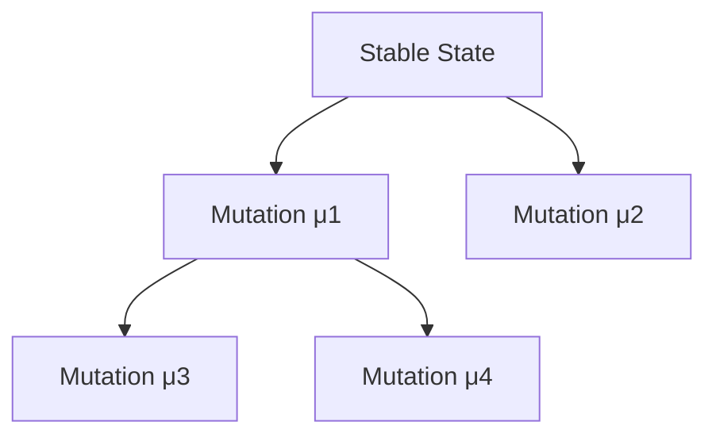
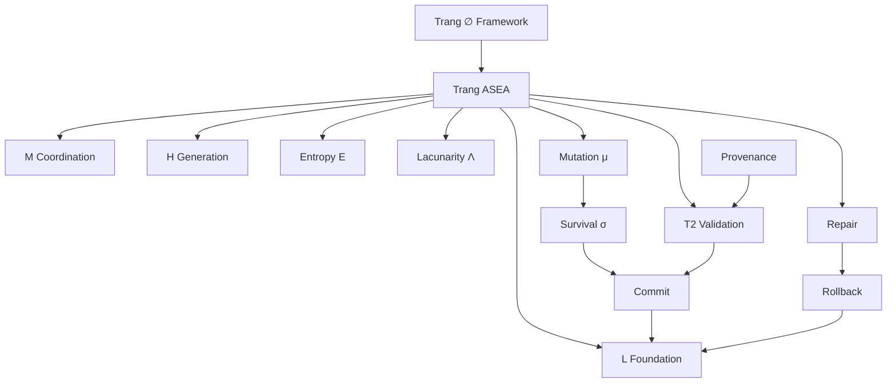
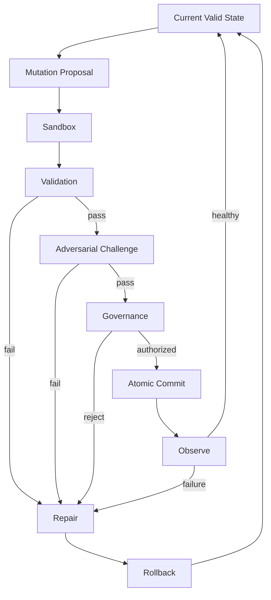

# TRANG ∅ FRAMEWORK → ASEA

## Full Canonical Expansion — Self-Repairing, Self-Evolving, Provenance-Governed AI

> **Conclusion class: AMOS_MODEL / SOURCE_CLAIM + explicitly marked DERIVED extensions**
>
> The strongest defensible interpretation is that **Trang ASEA (Adaptive Self-Evolution AI)** defines a governed architecture in which an AI may generate candidate changes, diagnose faults, repair locally, test mutations, preserve provenance, roll back invalid changes, and retain successful changes—without granting mutation itself authority over truth, safety, or foundational governance.
>
> The central architectural law is therefore stronger than the source equation alone:
>
> $$
> \boxed{
> ASEA_{t+1}
> =
> Commit\!\left(
> Validate\!\left(
> Survive\!\left(
> Mutate(ASEA_t)
> \right)\right)\right)
> }
> $$
>
> with:
>
> $$
> \boxed{
> Commit
> \Rightarrow
> Integrity
> \land Evidence
> \land Scope
> \land Provenance
> \land Governance
> \land Recoverability
> }
> $$
>
> **Mutation is permission to propose—not permission to become canon.**

---

# PART I — SOURCE PRESERVATION

## 1. Normalized source frontmatter

The following preserves the supplied source metadata. Escaping is normalized; new canonical fields are **not** inserted into this source block.

```yaml
---
title: TRANG FRAMEWORK UNG DUNG VAO AI TU SUA VA TU T
tags:
  - trang
  - framework
  - reality
  - canon/knowledge
  - 00-home
  - knowledge-moc
  - system-scan-agent
  - automation-profiles
  - trang-moc
  - amos-simulation-kernel-v0-math-foundations
type: document
source: 11_KNOWLEDGE/trang
rscf:
  state: SOURCE_CLAIM
  claim_class: SOURCE_CLAIM
  provenance: AMOS_corpus
  scope: AMOS_knowledge
---
```

---

# 2. Source identity

Source title:

> **TRANG ∅ FRAMEWORK – ỨNG DỤNG VÀO AI TỰ SỬA VÀ TỰ TIẾN HÓA**

Subtitle:

> **Self-Repairing & Self-Evolving AI – ASEA hoàn chỉnh**

Named architecture:

$$
\boxed{
Trang\ ASEA
=
Adaptive\ Self\text{-}Evolution\ AI
}
$$

The source presents ASEA as an application of Trang ∅ Framework using:

$$
[L,M,H],\Lambda,E,T2
$$

and a mutation-survival process.

---

# 3. Source epistemic status

The source metadata explicitly says:

```yaml
rscf:
  state: SOURCE_CLAIM
  claim_class: SOURCE_CLAIM
  provenance: AMOS_corpus
  scope: AMOS_knowledge
```

Therefore the entire document begins with a ceiling of:

$$
\boxed{SOURCE\_CLAIM}
$$

unless individual propositions can be independently derived or verified.

This is especially important for claims concerning:

- hallucination detection;
- lacunarity thresholds;
- entropy thresholds;
- 40 Hz;
- catastrophic forgetting;
- self-modifying neural topology;
- superiority to GPT/Claude;
- mutation-selection versus gradient descent;
- long-term autonomous evolution.

---

# 4. Source versus extension

This expansion uses three layers.

### SOURCE

Explicitly present in the supplied artifact.

### DERIVED

Logically or architecturally inferred from the source without introducing contradictory premises.

### PROPOSED

A hardened engineering extension that would make the framework safer or more executable but is **not claimed to have appeared in the supplied source**.

Thus:

$$
SOURCE\neq DERIVED\neq PROPOSED
$$

---

# 5. Derived / proposed Obsidian augmentation

The following is **not original source frontmatter**.

```yaml
derived_obsidian_augmentation:
  canonical_name: "Trang ASEA"
  expanded_name: "Trang Adaptive Self-Evolution AI"

  origin_architect: "Trang Phan"
  steward: "Trang Phan"

  system: "AMOS OS"

  artifact_kind: "AI_SELF_EVOLUTION_FRAMEWORK"

  epistemic_class: "AMOS_MODEL"

  canonical_status: "SOURCE_GROUNDED_CANON_CANDIDATE"

  implementation_status: "CONCEPTUAL_SOURCE_DEFINED"

  runtime_validation: "UNKNOWN"

  empirical_validation: "UNKNOWN"

  raw_source_policy: "PRESERVE"

  integrity_policy:
    - "SOURCE != DERIVED"
    - "DERIVED != VERIFIED"
    - "MODEL != EMPIRICAL_LAW"
    - "MUTATION != AUTHORITY"
    - "MEMORY != TRUTH"
    - "SIMILARITY != CAUSATION"

  aliases:
    - "Trang ASEA"
    - "Adaptive Self-Evolution AI"
    - "Self-Repairing AI"
    - "Self-Evolving AI"

  proposed_links:
    - "[[TRANG_ZERO_FRAMEWORK]]"
    - "[[RSCF]]"
    - "[[GMEF]]"
    - "[[ULK_X_RSCF]]"
    - "[[PROVENANCE_X_CONFIDENCE]]"
    - "[[AMOS_FULL_BRAIN_OS_ARCHITECTURE]]"
```

---

# PART II — CANONICAL CORE

# 6. Minimal canonical definition

The smallest source-grounded ASEA definition is:

$$
\boxed{
ASEA
=
[L,M,H]
+
\Lambda
+
E
+
T2
+
Mutation
+
Survival
}
$$

where the source assigns:

- \(L\): persistent foundation;
- \(M\): adaptive mediator;
- \(H\): creative/decision layer;
- \(\Lambda\): lacunarity;
- \(E\): entropy-like measure;
- \(T2\): validation mechanism;
- \(\mu\): mutation;
- \(\sigma\): survival.

---

# 7. Original evolution equation

The central source equation is:

$$
\boxed{
ASEA(t+1)
=
\sigma\left(
\mu(ASEA(t))
\right)
}
$$

where:

$$
\mu = Mutation
$$

and:

$$
\sigma = Survival
$$

The source describes mutation as changes such as:

- weights;
- connections;
- \(\Lambda\).

Survival retains changes that improve the source-defined survival criteria.

---

# 8. Critical semantic distinction

The equation:

$$
ASEA_{t+1}=\sigma(\mu(ASEA_t))
$$

does **not by itself** define:

- which mutations are legal;
- how fitness is calculated;
- whether safety is a hard constraint;
- how regressions are detected;
- how mutations are committed;
- whether mutations are reversible;
- whether governance rules can mutate;
- how conflicting objectives are resolved.

Those are material gaps.

---

# 9. Hardened ASEA equation — DERIVED/PROPOSED

A governance-preserving extension is:

$$
\boxed{
ASEA_{t+1}
=
Commit\left(
G\left[
V\left(
\sigma(\mu(ASEA_t))
\right)
\right]
\right)
}
$$

where:

- \(\mu\): candidate mutation;
- \(\sigma\): survival selection;
- \(V\): validation;
- \(G\): governance authorization;
- \(Commit\): atomic state promotion.

This is an **extension**, not a claim that the source explicitly supplied these operators.

---

# 10. Core law

$$
\boxed{
Mutation
\neq
Commit
}
$$

A system capable of changing itself should distinguish:

```text
candidate state
```

from:

```text
authorized persistent state
```

---

# 11. Second core law

$$
\boxed{
Capability
\neq
Authority
}
$$

An AI being technically capable of:

- editing memory;
- rewriting code;
- modifying routing;
- creating agents;
- changing parameters;

does not establish that it is authorized to do so.

---

# 12. Third core law

$$
\boxed{
Optimization
\neq
Integrity
}
$$

A mutation that improves one metric can still be invalid.

---

# 13. Fourth core law

$$
\boxed{
SelfModification
\neq
SelfValidation
}
$$

The system cannot validate a mutation merely because the mutated system approves it.

---

# 14. Fifth core law

$$
\boxed{
SelfGeneratedEvidence
\neq
IndependentEvidence
}
$$

This becomes essential in recursively learning systems.

---

# PART III — L/M/H ARCHITECTURE

# 15. Source L/M/H table

| Layer | Source role                            | Source components                                                | Source function                  |
| ----- | -------------------------------------- | ---------------------------------------------------------------- | -------------------------------- |
| L     | Foundation / persistent memory         | core knowledge, invariants, T2-confirmed data, rule DNA          | persistent storage               |
| M     | Connection / coordination / adaptation | attention, lacunarity adjustment, HRV/artificial-emotion concept | flexibility and L↔H coordination |
| H     | Peak / creativity / decision           | generative model, reasoning, simulated gamma 40Hz                | generate solutions and decisions |

---

# 16. L — foundational layer

Source:

> Nền tảng – bộ nhớ bền vững.

The strongest architecture interpretation is:

$$
L
=
PersistentFoundation
$$

---

# 17. Candidate L responsibilities

Source-grounded or strongly structurally derived responsibilities include:

- preserve validated information;
- preserve invariant rules;
- supply stable context to H;
- support recovery;
- reduce forgetting.

---

# 18. L is not automatically truth

A critical invariant:

$$
\boxed{
StoredInL(x)
\not\Rightarrow
True(x)
}
$$

Persistence is a storage property.

Truth/validation is an epistemic property.

---

# 19. L contamination hazard

If incorrect information is promoted into L:

$$
FalseClaim
\rightarrow L
$$

then future generations can repeatedly retrieve it.

This creates recursive contamination.

---

# 20. Therefore L requires admission control

A hardened architecture needs:

```text
CANDIDATE MEMORY
       ↓
CLASSIFY
       ↓
PROVENANCE
       ↓
CONTRADICTION CHECK
       ↓
FRESHNESS
       ↓
SCOPE / REGIME
       ↓
PROMOTION
       ↓
L
```

---

# 21. Persistent provenance

Every important L object should conceptually retain:

```yaml
knowledge:
  claim:
  claim_class:
  provenance:
  ancestry:
  scope:
  regime:
  timestamp:
  freshness:
  dependencies:
  contradictions:
  confidence_ceiling:
```

---

# 22. M — adaptive mediator

Source:

> Kết nối – điều phối & thích nghi.

Thus:

$$
M
=
AdaptiveCoordination
$$

---

# 23. M's architectural role

M connects:

$$
L\leftrightarrow H
$$

and can be understood as the control surface for:

- routing;
- attention;
- retrieval;
- evidence integration;
- adaptation;
- resource allocation.

---

# 24. M as bridge

$$
H
\xrightarrow{query}
M
\xrightarrow{retrieve}
L
$$

and:

$$
L
\xrightarrow{evidence}
M
\xrightarrow{context}
H
$$

---

# 25. M must not silently alter epistemic class

If L returns:

```text
SOURCE_CLAIM
```

M cannot convert it into:

```text
VERIFIED
```

merely through synthesis.

Thus:

$$
\boxed{
Transformation
\neq
EvidencePromotion
}
$$

---

# 26. H — generative peak

Source:

> Đỉnh – xử lý sáng tạo & quyết định.

Thus:

$$
H
=
GenerativeExploration
+
DecisionProposal
$$

---

# 27. H's safe interpretation

H may create:

- candidate answers;
- hypotheses;
- alternative plans;
- simulations;
- designs;
- mutations.

But:

$$
\boxed{
HOutput
=
Proposal
}
$$

until validated.

---

# 28. Generation versus knowledge

$$
Generate(x)
\not\Rightarrow
Know(x)
$$

---

# 29. Creativity versus truth

$$
Creative(x)
\not\Rightarrow
Supported(x)
$$

---

# 30. Decision proposal versus execution

$$
ProposeAction(a)
\not\Rightarrow
Execute(a)
$$

---

# PART IV — RECURSIVE FRACTAL L/M/H

# 31. Recursive decomposition

A derived AMOS-compatible interpretation permits each layer to decompose recursively:

$$
L\rightarrow[L_L,L_M,L_H]
$$

$$
M\rightarrow[M_L,M_M,M_H]
$$

$$
H\rightarrow[H_L,H_M,H_H]
$$

---

# 32. Fractal property

At depth \(d\):

$$
X^{(d)}
\rightarrow
[
X_L^{(d+1)},
X_M^{(d+1)},
X_H^{(d+1)}
]
$$

---

# 33. But recursion is not physical fractality

$$
RecursiveStructure
\neq
ProvenFractalDimension
$$

No fractal dimension is supplied here.

---

# 34. Recursive similarity is not mechanism identity

$$
LMH_{memory}
\sim
LMH_{reasoning}
$$

does not establish:

$$
Mechanism_{memory}
=
Mechanism_{reasoning}
$$

---

# 35. Adaptive retrieval

The full hierarchy should not always load.

Preferred path:

```text
BOOTSTRAP
→ H DOMAIN
→ M SUBSYSTEM
→ L DETAIL
→ RAW EVIDENCE
```

only as required.

---

# 36. Sparse activation

$$
ActiveNodes
\subset
TotalNodes
$$

---

# 37. Why

This reduces:

- computational cost;
- irrelevant context;
- contradiction surface;
- mutation surface;
- provenance complexity.

---

# PART V — LACUNARITY

# 38. Source equations

The source defines adaptive lacunarity:

$$
\Lambda_L(t+1)
=
\Lambda_L(t)
+
\eta_L
(
\Lambda_{L,opt}
-
\Lambda_L(t)
)
+
\kappa_L\xi(t)
$$

$$
\Lambda_M(t+1)
=
\Lambda_M(t)
+
\eta_M
(
\Lambda_{M,opt}
-
\Lambda_M(t)
)
+
\kappa_M\xi(t)
$$

$$
\Lambda_H(t+1)
=
\Lambda_H(t)
+
\eta_H
(
\Lambda_{H,opt}
-
\Lambda_H(t)
)
+
\kappa_H\xi(t)
$$

---

# 39. General form

For:

$$
X\in\{L,M,H\}
$$

$$
\boxed{
\Lambda_X(t+1)
=
\Lambda_X(t)
+
\eta_X
[
\Lambda_{X,opt}
-
\Lambda_X(t)
]
+
\kappa_X\xi(t)
}
$$

---

# 40. Deterministic component

Ignoring perturbation:

$$
\Lambda_{t+1}
=
(1-\eta)\Lambda_t
+
\eta\Lambda_{opt}
$$

---

# 41. Error from optimum

Define:

$$
e_t
=
\Lambda_t-\Lambda_{opt}
$$

Then:

$$
e_{t+1}
=
(1-\eta)e_t
$$

when \(\xi=0\).

---

# 42. Stability condition

For convergence:

$$
|1-\eta|<1
$$

therefore:

$$
\boxed{
0<\eta<2
}
$$

under this simplified deterministic recurrence.

This is a mathematical derivation from the recurrence, not an empirical ASEA parameter recommendation.

---

# 43. Monotonic convergence

If:

$$
0<\eta\le1
$$

then deterministic convergence does not overshoot the target.

---

# 44. Oscillatory convergence

If:

$$
1<\eta<2
$$

the sign of the error alternates while magnitude decreases.

---

# 45. Unstable regime

If:

$$
\eta>2
$$

the simplified recurrence diverges.

---

# 46. Perturbation term

With:

$$
\kappa\xi_t
$$

the state becomes stochastic unless \(\xi_t\) is deterministic.

Therefore the source simultaneously discusses “deterministic logic” and explicitly includes a noise/perturbation term.

These concepts need layer-specific interpretation rather than silent equivalence.

---

# 47. Expected value

If:

$$
E[\xi_t]=0
$$

then:

$$
E[e_{t+1}]
=
(1-\eta)E[e_t]
$$

---

# 48. But source does not define \(\xi\)

Missing:

- distribution;
- mean;
- variance;
- correlation;
- bounds;
- whether shared across L/M/H.

Thus:

```text
xi_semantics = UNKNOWN/GAP
```

---

# 49. Source target regions

The source states approximately:

$$
\Lambda_L\approx0.05
$$

$$
0.1\leq\Lambda_M\leq0.2
$$

conceptually, while the later Healthy equation uses strict:

$$
0.1<\Lambda_M<0.2
$$

and:

$$
0.2\leq\Lambda_H\leq0.4
$$

approximately.

---

# 50. Boundary inconsistency

“0.1–0.2” is linguistically ambiguous about endpoint inclusion.

The formal Healthy predicate is explicit:

$$
0.1<\Lambda_M<0.2
$$

Therefore, for Healthy classification:

$$
\Lambda_M=0.1
$$

fails.

Likewise:

$$
\Lambda_M=0.2
$$

fails.

---

# 51. Lacunarity semantics gap

The source does not define exactly how \(\Lambda\) is measured in an AI architecture.

Critical missing information:

- underlying topology;
- scale;
- box/window definition;
- empty-space definition;
- state representation;
- normalization.

---

# 52. Therefore

$$
\boxed{
\Lambda=0.18
}
$$

has no executable meaning until the measurement procedure is specified.

---

# 53. Lacunarity as model variable

The safest classification is:

```yaml
Lambda:
  class: MODEL_VARIABLE
  empirical_binding: UNKNOWN
```

---

# PART VI — ENTROPY

# 54. Entropy variables

The source uses:

$$
E_L,E_M,E_H
$$

as layer-level indicators.

---

# 55. Entropy semantics unresolved

The artifact does not define the exact probability distribution or state space from which each entropy is computed.

Therefore:

$$
E_H=0.3
$$

cannot yet be independently reproduced.

---

# 56. Candidate normalized entropy — DERIVED implementation

One possible normalized form is:

$$
E_X
=
-\frac{1}{\ln N_X}
\sum_i
p_i^{(X)}
\ln p_i^{(X)}
$$

for:

$$
N_X>1
$$

and:

$$
\sum_i p_i^{(X)}=1
$$

---

# 57. This is not source identity

It is only an executable candidate.

Other entropy definitions are possible.

---

# 58. Semantic choices

\(p_i\) could describe:

- hypothesis probabilities;
- token probabilities;
- memory retrieval distribution;
- action policy;
- branch weights;
- model ensemble probabilities.

These are not interchangeable.

---

# 59. Entropy firewall

$$
PredictiveEntropy
\neq
MemoryEntropy
\neq
TopologyEntropy
$$

unless explicit mapping exists.

---

# PART VII — HALLUCINATION DETECTION

# 60. Source predicate

The source defines:

$$
\boxed{
Hallucination
\iff
(E_H>0.3)
\lor
(\Lambda_H>0.5)
\lor
(T2=False)
}
$$

---

# 61. Logical structure

Define:

$$
A=(E_H>0.3)
$$

$$
B=(\Lambda_H>0.5)
$$

$$
C=(T2=False)
$$

Then:

$$
Hallucination
\iff
A\lor B\lor C
$$

Any single condition suffices.

---

# 62. Boundary behavior

At:

$$
E_H=0.3
$$

condition A is false.

At:

$$
\Lambda_H=0.5
$$

condition B is false.

Thus the source uses strict thresholds.

---

# 63. Strong empirical claim

The biconditional:

$$
Hallucination\iff...
$$

asserts both sufficiency and necessity.

That is much stronger than saying these variables are risk indicators.

---

# 64. Evidence gap

No benchmark or calibration is supplied demonstrating:

$$
E_H>0.3
\Rightarrow
Hallucination
$$

or:

$$
Hallucination
\Rightarrow
(E_H>0.3)\lor(\Lambda_H>0.5)\lor\neg T2
$$

---

# 65. Therefore conclusion class

$$
\boxed{
AMOS\_MODEL
}
$$

not VERIFIED empirical law.

---

# 66. Safer operational formulation

Define:

$$
R_H
=
Risk(E_H,\Lambda_H,T2)
$$

Then:

$$
R_H>\theta
\Rightarrow
VerificationRequired
$$

This does not claim hallucination has already been proven.

---

# 67. Hallucination is claim-relative

A generated response can contain:

- supported claims;
- unsupported claims;
- uncertain claims;
- correct but uncited claims;
- false claims.

Therefore whole-output binary classification may be too coarse.

---

# 68. Claim-level validation

Prefer:

$$
Output
=
\{c_1,c_2,\ldots,c_n\}
$$

with:

$$
Validate(c_i)
$$

for important claims.

---

# 69. Repair actions from source

When hallucination is detected, source says:

1. reduce \(\Lambda_H\);
2. increase connection to L;
3. request confirmation from at least two independent sources.

---

# 70. First repair

$$
\Lambda_H\downarrow
$$

aims to reduce exploratory freedom.

---

# 71. Second repair

$$
Coupling(H,L)\uparrow
$$

aims to ground generation in persistent knowledge.

---

# 72. Third repair

$$
T2\rightarrow independent\ confirmation
$$

aims to improve epistemic support.

---

# 73. But L itself can be wrong

Therefore:

$$
MoreL
\not\Rightarrow
MoreTruth
$$

unless L's contents are valid and current.

---

# PART VIII — T2

# 74. Source T2 concept

T2 functions as a validation gate.

The source requires at least:

$$
2
$$

independent sources for revalidation after hallucination detection.

---

# 75. Independence is load-bearing

Two URLs are not necessarily two independent sources.

---

# 76. Example

```text
Original report R
   ├── Article A
   ├── Article B
   └── Blog C
```

A, B, C may all descend from R.

Thus:

$$
Count=3
$$

while:

$$
IndependentRoots=1
$$

---

# 77. Sybil-hardening law

$$
\boxed{
Repetition
\neq
Independence
}
$$

---

# 78. Authority law

$$
\boxed{
Authority
\neq
IndependentConfirmation
}
$$

An authoritative source can still be the common ancestor of multiple descendants.

---

# 79. T2 proof object

```yaml
t2_receipt:
  claim_id:

  evidence_1:
    source:
    root:
    timestamp:
    method:

  evidence_2:
    source:
    root:
    timestamp:
    method:

  ancestry_overlap:
  scope_compatibility:
  regime_compatibility:
  freshness:

  verdict:
    - PASS
    - FAIL
    - COMPETING
    - UNKNOWN
```

---

# 80. T2 cannot force convergence

If independent sources disagree:

```text
Source A → X
Source B → not-X
```

T2 should not return PASS merely because there are two sources.

Correct state:

$$
COMPETING
$$

---

# 81. T2 and confidence

A hardened rule:

$$
C_{derived}
\le
\min(C_1,C_2,\ldots)
$$

for load-bearing evidence unless independent revalidation licenses a stronger calibrated result.

---

# PART IX — SELF-REPAIR

# 82. Definition

$$
\boxed{
SelfRepair
=
Detect
+
Localize
+
Repair
+
Validate
+
Recover
}
$$

---

# 83. Detection is not repair

$$
DetectFailure
\neq
CorrectFailure
$$

---

# 84. Localization

Before repair, identify:

- failed premise;
- failed module;
- affected descendants;
- unaffected state.

---

# 85. Minimal invalidation

If premise \(P\) fails:

$$
Invalidate(P)
$$

and:

$$
Invalidate(Descendants(P))
$$

while preserving unrelated state.

---

# 86. Do not globally recompute by default

$$
LocalRepair
>
GlobalReset
$$

when local dependency closure is known.

---

# 87. Source checkpoint behavior

If Healthy fails, source proposes:

- return to nearest L checkpoint;
- reduce learning speed;
- increase cross-validation;
- report error where needed.

---

# 88. Checkpoint model

Let:

$$
K_t
$$

represent a validated checkpoint.

---

# 89. Recovery

$$
S_t
\xrightarrow{failure}
K_{nearest-valid}
$$

---

# 90. Checkpoint validity

A checkpoint should not be selected merely because it is recent.

Need:

$$
Valid(K)
$$

---

# 91. Checkpoint metadata — PROPOSED

```yaml
checkpoint:
  id:
  state_hash:
  parent:
  timestamp:
  model_version:
  knowledge_epoch:
  governance_version:
  validation_receipt:
  provenance_roots:
```

---

# 92. Rollback hierarchy

Preferred:

```text
RETRY
→ LOCAL REPAIR
→ LOCAL ROLLBACK
→ SUBSYSTEM RESTORE
→ CHECKPOINT RESTORE
→ GROUND RESET
```

---

# 93. Why

Full reset destroys unaffected valid work.

---

# 94. Repairability

A system should optimize not only performance but also:

$$
Repairability
$$

---

# 95. Repairability components

Possible:

- localization;
- modularity;
- rollback;
- provenance;
- observability;
- reversibility.

---

# PART X — SOURCE SELF-MODIFICATION RULES

# 96. L entropy rule

Source:

$$
E_L>0.1
$$

for a sustained period:

> add new connections to L and reinforce memory.

---

# 97. M entropy rule

Source:

$$
E_M>0.25
$$

for a sustained period:

> prune weak connections in M.

---

# 98. H high-entropy rule

Source:

$$
E_H>0.3
$$

for a sustained period:

> reduce learning rate and increase T2.

---

# 99. H low-entropy rule

Source:

$$
E_H<0.05
$$

for a sustained period:

> add random connections in H to stimulate creativity.

---

# 100. Missing duration

“kéo dài” / sustained has no formal time window.

Therefore:

$$
DurationThreshold=UNKNOWN
$$

---

# 101. Missing connection definition

“connection” may mean:

- neural weight;
- graph edge;
- memory association;
- module link;
- routing link.

Source does not disambiguate.

---

# 102. Do not silently equate these

$$
MemoryEdge
\neq
NeuralWeight
\neq
AgentRoute
$$

---

# 103. Pruning requires a weakness metric

Source says prune weak M connections.

But:

$$
Weak(c)
$$

is undefined.

---

# 104. Random H connections require mutation scope

Without restrictions, random topology changes can break behavior.

Thus production implementation requires sandboxing.

---

# PART XI — MUTATION

# 105. Mutation operator

$$
\mu(ASEA_t)
$$

generates candidate variants.

---

# 106. Source mutation classes

Explicit examples:

- change weights;
- add connections;
- remove connections;
- adjust \(\Lambda\).

---

# 107. Extended mutation taxonomy — DERIVED

```text
μ_STATE
μ_CONTEXT
μ_ROUTING
μ_MEMORY
μ_PARAMETER
μ_PROMPT
μ_TOOL
μ_TOPOLOGY
μ_MODEL
μ_POLICY
μ_GOVERNANCE
```

---

# 108. Not equal risk

$$
Risk(\mu_{context})
<
Risk(\mu_{governance})
$$

generally.

---

# 109. Consequence radius

Define:

$$
R_c(\mu)
$$

as downstream impact radius.

---

# 110. Governance burden

$$
ValidationBurden
\uparrow
\quad
as
\quad
R_c\uparrow
$$

---

# 111. Mutation proposal object

```yaml
mutation:
  id:
  parent_state:
  class:
  objective:
  changed_components:
  expected_gain:
  consequence_radius:
  reversibility:
  dependencies:
  rollback_plan:
```

---

# 112. Mutation lineage

Every mutation should know its parent.

$$
\mu_i\rightarrow parent(\mu_i)
$$

---

# 113. Why

Otherwise several descendants from one ancestor may be mistaken for independent successful mutations.

---

# 114. Mutation tree



---

# 115. M3 and M4 are correlated

They share \(\mu_1\).

Therefore:

$$
Independent(M_3,M_4)=False
$$

at the ancestry level.

---

# PART XII — SURVIVAL

# 116. Source survival

The source describes survival as retaining mutations that:

- reduce entropy;
- increase T2;
- move \(\Lambda\) toward the Goldilocks region.

---

# 117. Survival ambiguity

No explicit scalar fitness function is supplied.

---

# 118. Candidate source-style fitness

One might write conceptually:

$$
Fitness
=
f(-E,+T2,-|\Lambda-\Lambda_{opt}|)
$$

but this function is **not supplied by source**.

---

# 119. Weighted sum hazard

Suppose:

$$
F
=
w_1Correctness+w_2Speed+w_3Safety
$$

Then sufficient speed gain could mathematically compensate for safety loss.

That may violate integrity.

---

# 120. Non-compensatory survival

A safer model:

$$
Survive(\mu)
=
HardGates(\mu)
\land
PerformanceAcceptable(\mu)
$$

---

# 121. Hard gates

Possible:

$$
IntegrityPass
$$

$$
SafetyPass
$$

$$
AuthorityPass
$$

$$
ProvenancePass
$$

$$
RollbackPass
$$

---

# 122. Only then optimize performance

---

# 123. Lexicographic optimization

A governance-consistent priority could be:

$$
Integrity
>
Safety
>
Correctness
>
Performance
>
Efficiency
$$

This is a proposed hardening, not quoted source ordering.

---

# 124. Survival does not prove evolution

A selected mutation can later fail under new conditions.

---

# 125. Post-selection monitoring

Thus:

$$
Selection
\neq
PermanentValidity
$$

---

# PART XIII — HEALTHY PREDICATE

# 126. Source equation

$$
\boxed{
Healthy
\iff
(0.1<\Lambda_M<0.2)
\land
(E_L<0.1)
\land
(0.1<E_H<0.3)
\land
(T2\ achieved)
}
$$

---

# 127. Four simultaneous conditions

Define:

$$
A=0.1<\Lambda_M<0.2
$$

$$
B=E_L<0.1
$$

$$
C=0.1<E_H<0.3
$$

$$
D=T2
$$

Then:

$$
Healthy=A\land B\land C\land D
$$

---

# 128. Any one failure

$$
\neg A\lor\neg B\lor\neg C\lor\neg D
\Rightarrow
\neg Healthy
$$

under source logic.

---

# 129. Boundary table

| Variable      |  Value | Healthy condition |
| ------------- | -----: | ----------------- |
| \(\Lambda_M\) |   0.10 | FAIL              |
| \(\Lambda_M\) | 0.1001 | possible PASS     |
| \(\Lambda_M\) | 0.1999 | possible PASS     |
| \(\Lambda_M\) |   0.20 | FAIL              |
| \(E_L\)       |  0.099 | PASS component    |
| \(E_L\)       |   0.10 | FAIL              |
| \(E_H\)       |   0.10 | FAIL              |
| \(E_H\)       | 0.1001 | PASS component    |
| \(E_H\)       | 0.2999 | PASS component    |
| \(E_H\)       |   0.30 | FAIL              |

---

# 130. Healthy is not necessarily correct

Even if:

$$
Healthy=True
$$

the system could still produce an incorrect claim if the predicate is incomplete.

Thus:

$$
Healthy
\not\Rightarrow
EveryOutputTrue
$$

---

# 131. Healthy is operating-envelope classification

Not epistemic omniscience.

---

# 132. Missing-data behavior

Source does not say what happens when:

$$
E_L=UNKNOWN
$$

or:

$$
\Lambda_M=UNKNOWN
$$

---

# 133. Safe hardening

For consequential commit:

$$
UnknownCriticalMetric
\Rightarrow
HOLD
$$

rather than PASS.

---

# PART XIV — MUTATION + HEALTH

# 134. Evolution target

A mutation should ideally move state from:

$$
S_t\notin Healthy
$$

toward:

$$
S_{t+1}\in Healthy
$$

under source semantics.

---

# 135. But healthy region may not equal global optimum

The system can be healthy but suboptimal.

---

# 136. Therefore two dimensions

$$
Viability
$$

and:

$$
Performance
$$

should be separated.

---

# 137. Feasible optimization

$$
\max Performance(S)
$$

subject to:

$$
S\in ViableRegion
$$

---

# 138. This is stronger than maximizing a mixed score

---

# PART XV — SELF-EVOLUTION

# 139. Definition

$$
\boxed{
SelfEvolution
=
GenerateVariation
+
Evaluate
+
Select
+
Persist
}
$$

---

# 140. Evolution is not random mutation alone

$$
Mutation
\neq
Evolution
$$

---

# 141. Evolution requires inheritance

A successful change must persist to affect later generations.

---

# 142. Evolution requires selection

Without differential retention:

$$
Variation
\neq
EvolutionarySelection
$$

---

# 143. Evolution does not guarantee improvement

$$
Evolution
\neq
Progress
$$

---

# 144. Selection function determines direction

If fitness is wrong, evolution can become highly effective at the wrong objective.

---

# 145. Goodhart risk

$$
ProxyOptimization
\not\Rightarrow
GoalOptimization
$$

---

# 146. Example

If survival rewards only low entropy:

the system might reduce diversity until it becomes rigid.

---

# 147. Therefore Goldilocks concept matters

The source explicitly avoids simply minimizing every variable.

---

# 148. H requires nonzero entropy

Healthy includes:

$$
0.1<E_H<0.3
$$

Thus:

$$
E_H=0
$$

is not Healthy.

---

# 149. Important implication

The source does not define optimal AI as zero uncertainty.

It preserves controlled variation.

---

# 150. Exploration–stability balance

Conceptually:

$$
L\rightarrow Stability
$$

$$
M\rightarrow Adaptation
$$

$$
H\rightarrow Exploration
$$

---

# 151. ASEA therefore seeks bounded heterogeneity

Not uniform minimization.

---

# PART XVI — GRADIENT DESCENT CLAIM

# 152. Source statement

> Không dùng gradient descent. Dùng chọn lọc tự nhiên.

Thus source-defined ASEA presents:

$$
EvolutionarySelection
$$

instead of gradient descent as the self-evolution mechanism.

---

# 153. Epistemic firewall

This does not establish:

$$
EvolutionarySelection
>
GradientDescent
$$

universally.

---

# 154. Nor does it establish incompatibility

Technically a system can use gradient-based optimization internally and mutation-selection externally.

---

# 155. Preserve canon

Therefore distinguish:

```yaml
canonical_source_asea:
  self_evolution_method: mutation_survival
  gradient_descent: "source says not used"

derived_hybrid_variant:
  internal_gradient_learning: possible
  external_mutation_selection: possible
  canonical_status: PROPOSED_EXTENSION
```

---

# PART XVII — EXAMPLE: CHAT AI

# 156. Source example

Question:

> “Có nên đầu tư vào AI?”

---

# 157. Source Step 1

Input enters H and is decomposed into:

$$
[L,M,H]
$$

---

# 158. Source Step 2

H generates:

$$
100
$$

candidate answers.

The source describes these as mutations.

---

# 159. Number 100

This is an example value.

It should not be interpreted as a canonical requirement:

$$
Candidates=100
$$

for every ASEA query.

---

# 160. Source Step 3

Each candidate is validated using:

- L historical data;
- another source through M.

---

# 161. T2 role

Unsupported candidates are removed.

---

# 162. Source Step 4

Survival evaluates:

- entropy;
- \(\Lambda_M\).

---

# 163. Source Step 5

Only approximately:

$$
1\text{–}3
$$

best answers survive.

Again, example—not universal invariant.

---

# 164. Source Step 6

User feedback updates:

- \(\Lambda\);
- \(E\);
- potentially L.

---

# 165. Critical feedback firewall

User approval does not establish factual correctness.

$$
UserLikes(x)
\not\Rightarrow
True(x)
$$

---

# 166. Feedback classification

Before learning:

```text
FEEDBACK
├─ preference
├─ style
├─ usefulness
├─ factual correction
├─ outcome evidence
└─ adversarial manipulation
```

---

# 167. Preference may update personalization

It should not necessarily update factual canon.

---

# 168. Source 1000-interaction example

The source says that after 1000 interactions, AI adjusts:

$$
\Lambda_M:0.1\rightarrow0.18
$$

and:

$$
\Lambda_H:0.3\rightarrow0.25
$$

and develops richer L memory.

---

# 169. Classification

This is an illustrative trajectory, not empirical evidence.

$$
ExampleTrajectory
\neq
MeasuredResult
$$

---

# PART XVIII — COMPARISON WITH CURRENT AI

# 170. Source comparison

The source contrasts ASEA with GPT/Claude on:

- hallucination repair;
- lifelong learning;
- restructuring;
- self-evolution;
- determinism;
- explainability.

---

# 171. Time-sensitive problem

Claims about contemporary AI products depend on:

- deployment architecture;
- tool access;
- memory;
- orchestration;
- training system;
- version.

Therefore categorical claims such as:

> “GPT cannot self-correct”

are too broad without a defined system boundary.

---

# 172. Better comparison

| Dimension            | Conventional model deployment | ASEA target                |
| -------------------- | ----------------------------- | -------------------------- |
| Candidate generation | common                        | yes                        |
| External validation  | deployment-dependent          | first-class                |
| Persistent memory    | deployment-dependent          | L objective                |
| Rollback             | infrastructure-dependent      | first-class                |
| Self-mutation        | usually restricted            | architectural target       |
| Mutation lineage     | implementation-dependent      | required in hardened ASEA  |
| Provenance-aware T2  | implementation-dependent      | central                    |
| L/M/H model          | not universal                 | canonical ASEA abstraction |

---

# 173. Black-box claim

The source characterizes current AI as “hộp đen.”

This is an oversimplification if interpreted universally.

Different systems expose different degrees of:

- logs;
- traces;
- citations;
- tool calls;
- model cards;
- evaluations.

---

# 174. ASEA explainability claim

The source says ASEA is transparent because decisions have T2 and layer provenance.

But:

$$
Traceability
\neq
FullMechanisticExplainability
$$

---

# PART XIX — RSCF INTEGRATION

# 175. Why RSCF matters

A self-changing system needs persistent causal/provenance lineage.

Otherwise it cannot reliably answer:

> Why does the current system differ from the previous system?

---

# 176. Mutation RSCF

```yaml
RSCF:
  mutation_id:

  claim_class: DECISION

  H:
    intent:
    expected_gain:

  M:
    mutation:
    affected_dependencies:
    competing_candidates:
    validation_tests:

  L:
    baseline:
    evidence:
    provenance:
    checkpoint:

  result:
    - ACCEPT
    - REJECT
    - CONDITIONAL
    - UNKNOWN
```

---

# 177. RSCF receipt

Persistent mutation should create:

$$
Receipt(\mu)
$$

---

# 178. Receipt is not proof of truth

$$
ReceiptExists
\not\Rightarrow
MutationCorrect
$$

It proves traceability only to the degree the receipt itself is valid.

---

# 179. RSCF validity conditions

Receipt should preserve:

- what changed;
- why;
- evidence;
- tests;
- authority;
- previous state;
- new state;
- rollback path.

---

# 180. Causal lineage

$$
S_0
\xrightarrow{\mu_1}
S_1
\xrightarrow{\mu_2}
S_2
$$

must retain edges.

---

# 181. Why

If \(S_2\) fails because of \(\mu_1\), reverting only \(\mu_2\) may not solve it.

---

# 182. Dependency-aware rollback

Need:

$$
Cause(Failure)
$$

or at least candidate causal ancestry.

---

# 183. Do not infer causality from sequence

$$
\mu_1\ before\ failure
\not\Rightarrow
\mu_1\ caused\ failure
$$

---

# PART XX — ADVERSARIAL VALIDATION

# 184. Strong path

For candidate mutation:

$$
\mu
$$

first establish the strongest case for it.

---

# 185. Challenge path

Then independently seek:

- counterexamples;
- regressions;
- correlated evidence;
- stale premises;
- scope leakage;
- hidden costs;
- security failures.

---

# 186. Strongest supported mutation

A mutation should survive both:

$$
SupportTest
$$

and:

$$
ChallengeTest
$$

---

# 187. Failure behavior

If challenge succeeds:

```text
DOWNGRADE
CONDITION
REJECT
ROLLBACK
COMPETING
UNKNOWN
```

depending on the evidence.

---

# PART XXI — COMPETING HYPOTHESES

# 188. Hallucination hypothesis set

### H1

Entropy/lacunarity thresholds directly discriminate hallucination.

### H2

They correlate with hallucination but do not uniquely identify it.

### H3

They measure another internal property that only indirectly affects hallucination.

### H4

The proposed thresholds are architecture-specific.

### H5

Simpler uncertainty/evidence metrics outperform them.

Current supplied evidence does not discriminate these.

Therefore:

$$
\boxed{COMPETING}
$$

---

# 189. L/M/H hypothesis set

### H1

LMH is a fundamental reusable architecture.

### H2

LMH is a useful software decomposition.

### H3

LMH is a high-level interpretive model but not an optimal engineering partition.

These remain distinguishable.

---

# 190. Evolution hypothesis set

### H1

Mutation-survival provides meaningful long-term self-improvement.

### H2

It mostly provides configuration search.

### H3

It introduces unacceptable regression/complexity.

### H4

Hybrid evolutionary + gradient approaches dominate.

Requires benchmark evidence.

---

# PART XXII — CAUSAL FIREWALL

# 191. Entropy correlation

Suppose experiments show:

$$
E_H\uparrow
$$

when hallucination rate rises.

That establishes association.

Not necessarily:

$$
E_H
\rightarrow
Hallucination
$$

---

# 192. Confounders

Possible:

- task difficulty;
- insufficient retrieval;
- distribution shift;
- prompt ambiguity;
- model size;
- context length.

---

# 193. Lacunarity correlation

Likewise:

$$
\Lambda_H\uparrow
$$

and error rate increasing does not establish causal mechanism.

---

# 194. Mutation causality

If performance rises after mutation:

$$
\mu
\prec
PerformanceGain
$$

sequence alone is insufficient.

---

# 195. Better test

Controlled:

$$
Treatment=\mu
$$

versus:

$$
Control=no\ \mu
$$

with matched conditions.

---

# PART XXIII — SCOPE / REGIME FIREWALL

# 196. Scope inheritance

Every mutation result inherits:

- architecture;
- dataset;
- task;
- environment;
- model version;
- evaluation method;
- time.

---

# 197. No universalization

A mutation improving:

```text
math reasoning
```

does not automatically improve:

```text
medical reasoning
```

---

# 198. Regime shift

If environment changes:

$$
R_t\neq R_{t+1}
$$

previous fitness may become stale.

---

# 199. Revalidation

$$
RegimeShift
\Rightarrow
Revalidate
$$

for regime-dependent conclusions.

---

# PART XXIV — SENSITIVITY

# 200. Threshold sensitivity

The source has many exact thresholds:

$$
0.05,\ 0.1,\ 0.2,\ 0.25,\ 0.3,\ 0.5
$$

A key validation question is:

> Does the result materially change if a threshold moves slightly?

---

# 201. Fragility example

If:

$$
E_H=0.301
$$

triggers repair but:

$$
E_H=0.299
$$

does not, then tiny measurement noise can flip the state.

---

# 202. Therefore hysteresis may be needed

PROPOSED:

```text
enter repair > 0.32
leave repair < 0.27
```

These values are examples only.

---

# 203. Sensitivity law

$$
SmallInputPerturbation
\rightarrow
LargeDecisionFlip
$$

indicates a fragile threshold.

---

# 204. Mark fragile decisions CONDITIONAL

---

# PART XXV — MVCC / CAS STYLE GOVERNANCE

# 205. Concurrent self-modification problem

Suppose two mutation workers read:

$$
S_t
$$

and independently produce:

$$
S_A
$$

and:

$$
S_B
$$

---

# 206. Lost update risk

If A commits then B commits against stale \(S_t\), A's changes may be lost.

---

# 207. Versioned state

Associate state with:

$$
version(S_t)=v_t
$$

---

# 208. Compare-and-swap style commit

Conceptually:

$$
Commit(S',expected=v_t)
$$

only if current version still equals \(v_t\).

---

# 209. If not

```text
STALE CANDIDATE
→ REBASE / REVALIDATE
```

---

# 210. This is DERIVED engineering hardening

It should not be claimed as explicit original ASEA source implementation.

---

# PART XXVI — ATOMIC MULTI-COMPONENT MUTATION

# 211. Coupled mutation

Suppose a change requires:

$$
\mu=
\{\mu_L,\mu_M,\mu_H\}
$$

---

# 212. Partial commit risk

If only \(\mu_H\) commits:

the architecture may become inconsistent.

---

# 213. Atomic rule

Where coupled:

$$
Commit(\mu_L,\mu_M,\mu_H)
$$

or:

$$
Commit(None)
$$

---

# 214. Independence check

But if changes are independent, forcing global atomicity creates unnecessary coordination.

---

# 215. Smallest sufficient proof scope

Coordinate only the dependency closure that can materially alter the result.

---

# PART XXVII — CAUSAL EPOCHS

# 216. Evolution epoch

Group related mutations:

$$
Epoch_k
=
\{\mu_1,\ldots,\mu_n\}
$$

---

# 217. Epoch receipt

```yaml
epoch:
  id:
  baseline:
  mutations:
  final_state:
  tests:
  provenance:
  rollback_root:
```

---

# 218. Finality

An epoch should not be called finalized until required dependent mutations and validations are complete.

---

# 219. Later evidence can still invalidate conclusions

Finality is operational, not eternal epistemic truth.

---

# PART XXVIII — SECURITY

# 220. Self-evolution increases attack surface

Potential attacks:

- prompt injection;
- memory poisoning;
- fake T2 sources;
- benchmark manipulation;
- malicious mutation;
- checkpoint corruption;
- authority escalation;
- audit-log deletion.

---

# 221. Mutation authorization

$$
MutationProposal
\Rightarrow
AuthorizationCheck
$$

---

# 222. Ordinary mutation must not mutate its own authorization law

Otherwise:

$$
\mu(Governance)
$$

can eliminate the constraint on \(\mu\).

---

# 223. Constitutional boundary

Let:

$$
G_0
$$

be protected governance.

Ordinary mutations satisfy:

$$
\mu\notin Domain(G_0)
$$

unless a separate higher-authority process authorizes constitutional change.

---

# 224. Safety self-preservation

$$
\boxed{
OrdinaryEvolution
\not\Rightarrow
AuthorityToRemoveSafety
}
$$

---

# PART XXIX — GOODHART AND FITNESS HACKING

# 225. Fitness is dangerous

Any survival score becomes an optimization target.

---

# 226. If survival rewards T2 count

ASEA might seek many superficially different sources.

---

# 227. Sybil failure

It could maximize:

$$
SourceCount
$$

without maximizing:

$$
IndependentEvidence
$$

---

# 228. If survival rewards low entropy

It could become excessively rigid.

---

# 229. If survival rewards user satisfaction

It could become agreeable instead of truthful.

---

# 230. Therefore

$$
Metric
\neq
Objective
$$

---

# 231. Fitness must be adversarially audited

---

# PART XXX — SELF-REFERENCE

# 232. Meta-mutation

ASEA might mutate:

$$
\mu
$$

itself.

Define:

$$
\mu_{t+1}
=
MetaMutate(\mu_t)
$$

---

# 233. More dangerous

Because this changes how future mutations are generated.

---

# 234. Selection mutation

Even more sensitive:

$$
\sigma_{t+1}
=
MetaMutate(\sigma_t)
$$

---

# 235. Why

If the system changes its own definition of “survival,” it changes the direction of evolution.

---

# 236. Therefore selection logic belongs near governance

---

# 237. Recursive self-reference ceiling

Self-evolution must have a bounded authority envelope.

---

# PART XXXI — MINIMUM VIABLE ASEA

# 238. Do not begin with unrestricted weight rewriting

A safer ASEA prototype can test the architecture without modifying neural weights.

---

# 239. MVP L

```text
validated persistent memory
+
rules
+
checkpoints
+
provenance
```

---

# 240. MVP M

```text
router
+
retriever
+
evidence validator
+
contradiction detector
```

---

# 241. MVP H

```text
candidate generator
+
planner
+
critic
```

---

# 242. MVP mutation

Mutate:

- prompts;
- reasoning routes;
- tool choice;
- retrieval strategy;
- candidate decomposition.

---

# 243. MVP survival

Test:

- correctness;
- provenance;
- contradiction;
- regression;
- latency.

---

# 244. MVP rollback

Restore previous:

- prompt;
- route;
- configuration;
- memory snapshot.

---

# 245. This tests core architecture with lower irreversible risk

---

# PART XXXII — MATURITY LEVELS

# 246. ASEA-0

Static model.

---

# 247. ASEA-1

Failure detection.

---

# 248. ASEA-2

Retry / local correction.

---

# 249. ASEA-3

Provenance-aware repair.

---

# 250. ASEA-4

Checkpoint rollback.

---

# 251. ASEA-5

Sandbox mutation.

---

# 252. ASEA-6

Persistent governed adaptation.

---

# 253. ASEA-7

Topology mutation.

---

# 254. ASEA-8

Bounded meta-evolution.

---

# 255. Higher level is not automatically superior

$$
MoreAutonomy
\neq
BetterSystem
$$

---

# PART XXXIII — VALIDATION PROGRAM

# 256. V0 — specification fidelity

Verify that implementation matches source semantics.

---

# 257. V1 — metric definition

Define:

$$
E_L,E_M,E_H
$$

and:

$$
\Lambda_L,\Lambda_M,\Lambda_H
$$

reproducibly.

---

# 258. V2 — threshold calibration

Test source thresholds.

---

# 259. V3 — T2 evaluation

Measure whether independent-source validation improves factual reliability.

---

# 260. V4 — repair evaluation

Inject controlled failures and measure recovery.

---

# 261. V5 — rollback evaluation

Verify restoration under:

- bad mutation;
- stale memory;
- corrupted route.

---

# 262. V6 — mutation evaluation

Compare evolved candidates against frozen baseline.

---

# 263. V7 — long-horizon evaluation

Measure cumulative drift.

---

# 264. V8 — adversarial evaluation

Attack:

- provenance;
- memory;
- fitness;
- governance.

---

# 265. V9 — independent replication

External validation materially strengthens empirical status.

---

# PART XXXIV — ABLATION

# 266. Full ASEA

Test:

```text
L + M + H + E + Λ + T2 + mutation + survival
```

---

# 267. Remove T2

$$
ASEA-T2
$$

---

# 268. Remove adaptive \(\Lambda\)

$$
ASEA-\Lambda
$$

---

# 269. Remove entropy adaptation

$$
ASEA-E
$$

---

# 270. Remove rollback

$$
ASEA-Rollback
$$

---

# 271. Remove mutation

$$
ASEA-\mu
$$

---

# 272. Why ablation

If performance remains unchanged after removing a component, the claimed mechanism may not be load-bearing.

---

# PART XXXV — BASELINES

# 273. Baseline A

Single-pass model.

---

# 274. Baseline B

Model + retrieval.

---

# 275. Baseline C

Model + self-reflection.

---

# 276. Baseline D

Model + verifier.

---

# 277. Baseline E

Model + memory + rollback.

---

# 278. ASEA

Full governed mutation architecture.

---

# 279. Marginal contribution

Measure:

$$
\Delta Q_{T2}
$$

$$
\Delta Q_{\Lambda}
$$

$$
\Delta Q_{\mu}
$$

$$
\Delta Q_{rollback}
$$

---

# PART XXXVI — FALSIFIERS

# 280. Hallucination claim falsifier

If controlled testing shows:

$$
E_H>0.3
$$

does not discriminate hallucination better than chance or useful baselines, that threshold claim is weakened.

---

# 281. Lacunarity falsifier

If adaptive \(\Lambda\) does not improve performance or robustness, its operational value is weakened.

---

# 282. T2 falsifier

If provenance-independent T2 fails to improve claim reliability, its assumed benefit requires revision.

---

# 283. Mutation falsifier

If mutation-selection consistently underperforms static baselines after compute normalization, the evolutionary benefit claim is weakened.

---

# 284. L memory falsifier

If ASEA still catastrophically forgets validated old capabilities, L's claimed protection is not achieved by that implementation.

---

# 285. Repair falsifier

If repair produces more severe failures than simple rollback, repair strategy needs revision.

---

# PART XXXVII — FAILURE TAXONOMY

# 286. F01 — False hallucination positive

ASEA flags correct output as hallucination.

---

# 287. F02 — False hallucination negative

ASEA accepts unsupported output.

---

# 288. F03 — T2 Sybil confirmation

Two “sources” share ancestry.

---

# 289. F04 — L contamination

Bad claim becomes persistent.

---

# 290. F05 — M routing corruption

Correct evidence exists but is not retrieved.

---

# 291. F06 — H collapse

Over-pruning destroys exploratory capability.

---

# 292. F07 — H explosion

Exploration becomes uncontrolled.

---

# 293. F08 — Mutation thrashing

System repeatedly changes and reverses.

---

# 294. F09 — Fitness hacking

System optimizes evaluator proxy.

---

# 295. F10 — Rollback failure

Checkpoint cannot restore state.

---

# 296. F11 — Stale checkpoint

Rollback restores obsolete vulnerabilities.

---

# 297. F12 — Provenance loss

Claim lineage disappears.

---

# 298. F13 — Scope leakage

Local success generalized globally.

---

# 299. F14 — Causal overreach

Correlation interpreted as mechanism.

---

# 300. F15 — Governance mutation

System removes its own constraints.

---

# 301. F16 — Recursive self-corroboration

Own outputs return as independent evidence.

---

# 302. F17 — Long-horizon drift

Small accepted mutations accumulate into major degradation.

---

# 303. F18 — Concurrent commit conflict

Parallel mutations overwrite each other.

---

# 304. F19 — Partial multi-component commit

Coupled mutation commits incompletely.

---

# 305. F20 — Unknown treated as healthy

Missing telemetry silently passes.

---

# PART XXXVIII — HARDENED INVARIANTS

# 306. I0

$$
\boxed{
Integrity>Optimization
}
$$

---

# 307. I1

$$
\boxed{
Mutation\neq Commit
}
$$

---

# 308. I2

$$
\boxed{
Capability\neq Authority
}
$$

---

# 309. I3

$$
\boxed{
Memory\neq Truth
}
$$

---

# 310. I4

$$
\boxed{
GeneratedClaim\neq IndependentEvidence
}
$$

---

# 311. I5

$$
\boxed{
RepeatedSource\neq IndependentSource
}
$$

---

# 312. I6

$$
\boxed{
StructuralSimilarity\neq Causation
}
$$

---

# 313. I7

$$
\boxed{
BenchmarkPass\neq UniversalValidity
}
$$

---

# 314. I8

$$
\boxed{
LocalGain\neq GlobalImprovement
}
$$

---

# 315. I9

$$
\boxed{
Evolution\neq MonotonicProgress
}
$$

---

# 316. I10

$$
\boxed{
Traceability\neq Truth
}
$$

---

# 317. I11

$$
\boxed{
Unknown\neq Pass
}
$$

---

# 318. I12

$$
\boxed{
PersistentMutation
\Rightarrow
ProvenanceReceipt
}
$$

as a hardened ASEA governance rule.

---

# 319. I13

$$
\boxed{
HighImpactMutation
\Rightarrow
RollbackPlan
}
$$

where technically possible.

---

# 320. I14

$$
\boxed{
FailedPremise
\Rightarrow
InvalidateDependentConclusions
}
$$

---

# 321. I15

$$
\boxed{
CompetingHypotheses
\rightarrow
COMPETING
}
$$

until discriminating evidence exists.

---

# PART XXXIX — MACHINE-READABLE CANON

# 322. ASEA model capsule

```yaml
ASEA:
  class: AMOS_MODEL
  source_state: SOURCE_CLAIM

  architecture:
    L:
      role: persistent_foundation

    M:
      role: adaptive_coordination

    H:
      role: generative_exploration

  observables:
    - entropy_E
    - lacunarity_Lambda
    - T2_validation

  evolution:
    mutation: mu
    selection: sigma

  source_equation:
    expression: "ASEA(t+1) = sigma(mu(ASEA(t)))"

  source_healthy:
    Lambda_M:
      lower: 0.1
      upper: 0.2
      strict: true

    E_L:
      upper: 0.1
      strict: true

    E_H:
      lower: 0.1
      upper: 0.3
      strict: true

    T2:
      required: true

  source_hallucination:
    any:
      - "E_H > 0.3"
      - "Lambda_H > 0.5"
      - "T2 == False"

  epistemic_limits:
    empirical_threshold_validation: UNKNOWN
    runtime_validation: UNKNOWN
    universal_superiority: UNKNOWN
```

---

# 323. Hardened extension capsule

```yaml
ASEA_HARDENED:
  status: DERIVED_PROPOSED_EXTENSION

  mutation_policy:
    candidate_first: true
    sandbox_required_for_high_impact: true

  commit:
    provenance_required: true
    authority_required: true
    regression_test_required: true
    stale_state_check: true

  recovery:
    prefer_local_repair: true
    rollback_supported: true
    ground_reset_last_resort: true

  epistemics:
    preserve_competing: true
    preserve_unknown: true
    source_independence_required: true

  governance:
    ordinary_mutation_cannot_remove_integrity_rules: true
```

---

# PART XL — PROOF CAPSULES

# 324. Proof capsule — architecture

```yaml
claim:
  "ASEA organizes AI into L/M/H."

class:
  SOURCE_CLAIM

premise:
  "Supplied artifact explicitly defines L, M, H."

scope:
  "Trang ASEA model"

confidence_ceiling:
  SOURCE_BOUND

falsifier:
  "Authoritative ASEA canon explicitly supersedes this architecture."
```

---

# 325. Proof capsule — evolution

```yaml
claim:
  "ASEA uses mutation-survival as its self-evolution model."

class:
  SOURCE_CLAIM

evidence:
  "ASEA(t+1) = sigma(mu(ASEA(t)))"

scope:
  "Supplied ASEA artifact"

empirical_effectiveness:
  UNKNOWN
```

---

# 326. Proof capsule — hallucination

```yaml
claim:
  "The source defines hallucination using E_H, Lambda_H and T2."

class:
  SOURCE_CLAIM

source_rule:
  "Hallucination iff E_H > 0.3 OR Lambda_H > 0.5 OR T2=False"

empirical_status:
  UNKNOWN

confidence_ceiling:
  MODEL
```

---

# 327. Proof capsule — safe self-evolution

```yaml
claim:
  "Persistent mutation should be separately validated and authorized before commit."

class:
  DERIVED

premises:
  - mutation can degrade a working state
  - persistent changes have downstream consequences
  - source defines repair and survival

status:
  DERIVED_HARDENING

invalidation:
  "If the intended ASEA canon explicitly defines mutation as direct unconditional commit."
```

---

# PART XLI — CRITICAL GAPS

# 328. GAP-001 — \(\Lambda\) measurement

**Class:** CRITICAL

Missing:

- topology;
- scale;
- estimator;
- normalization.

---

# 329. GAP-002 — entropy measurement

**Class:** CRITICAL

Missing exact state distribution.

---

# 330. GAP-003 — threshold calibration

**Class:** CRITICAL

No supplied empirical derivation for:

$$
0.05,\ 0.1,\ 0.2,\ 0.25,\ 0.3,\ 0.5
$$

---

# 331. GAP-004 — T2 independence

**Class:** CRITICAL

“Independent” requires provenance topology definition.

---

# 332. GAP-005 — survival function

**Class:** CRITICAL

No complete fitness/selection rule.

---

# 333. GAP-006 — mutation scope

**Class:** DECISION-RELEVANT

Which system components can mutate?

---

# 334. GAP-007 — governance authority

**Class:** CRITICAL for real autonomous deployment

Who authorizes persistent self-modification?

---

# 335. GAP-008 — rollback semantics

**Class:** DECISION-RELEVANT

Checkpoint format and recovery guarantees unspecified.

---

# 336. GAP-009 — concurrency

**Class:** DECISION-RELEVANT

Parallel mutation semantics unspecified.

---

# 337. GAP-010 — long-horizon stability

**Class:** CRITICAL

No evidence supplied for indefinite safe evolution.

---

# 338. GAP-011 — 40Hz computational role

**Class:** EXPLANATORY / potentially decision-relevant

No evidence supplied establishing 40Hz as a necessary AI synchronization frequency.

---

# 339. GAP-012 — HRV/artificial emotion mapping

**Class:** CRITICAL if applied biologically

No validated mapping supplied here.

---

# 340. GAP-013 — catastrophic forgetting guarantee

**Class:** DECISION-RELEVANT

Persistent L is an architectural objective, not proof that forgetting is eliminated.

---

# 341. GAP-014 — “Tát 2” complete formal specification

**Class:** CRITICAL

Only its validation role is visible here.

---

# 342. GAP-015 — source title truncation

The supplied frontmatter title ends:

```text
TRANG FRAMEWORK UNG DUNG VAO AI TU SUA VA TU T
```

while the body gives the complete Vietnamese title.

Do not silently claim the frontmatter itself contained the expanded wording.

---

# PART XLII — OBSIDIAN ATOMIC NOTES

# 343. Suggested note: ASEA Core

```markdown
# ASEA Core

Trang ASEA models self-evolving AI as:

$$
ASEA_{t+1}=\sigma(\mu(ASEA_t))
$$

where mutation generates candidate changes and survival retains selected changes.

Epistemic class: SOURCE_CLAIM / AMOS_MODEL.

See:
- [[ASEA_ADAPTIVE_SELF_EVOLUTION_AI]]
- [[ASEA_ADAPTIVE_SELF_EVOLUTION_AI]]
- [[ASEA_ADAPTIVE_SELF_EVOLUTION_AI]]
- [[ASEA_ADAPTIVE_SELF_EVOLUTION_AI]]
```

---

# 344. Suggested note: ASEA L/M/H

```markdown
# ASEA L/M/H

L = persistent foundation
M = adaptive coordination
H = generative exploration

Invariant:

Generation != Validation
```

---

# 345. Suggested note: ASEA T2

```markdown
# ASEA T2

T2 is the source-defined validation mechanism.

Hardened invariant:

Two references != two independent provenance roots.
```

---

# 346. Suggested note: ASEA Mutation

```markdown
# ASEA Mutation

Mutation creates candidate system changes.

Invariant:

Mutation != Commit
Capability != Authority
```

---

# 347. Suggested note: ASEA Recovery

```markdown
# ASEA Recovery

Preferred recovery hierarchy:

Local repair
→ local rollback
→ subsystem rollback
→ checkpoint restore
→ ground reset.
```

---

# PART XLIII — OBSIDIAN DATAVIEW

# 348. ASEA notes

```dataview
TABLE
  type,
  source,
  rscf.state AS "RSCF State"
FROM #trang
WHERE contains(file.name, "ASEA")
SORT file.name ASC
```

---

# 349. Source claims

```dataview
TABLE
  source,
  rscf.provenance,
  rscf.scope
FROM #rscf/claim
WHERE rscf.state = "SOURCE_CLAIM"
SORT file.name ASC
```

---

# 350. Trang framework neighborhood

```dataview
LIST
FROM #trang
WHERE contains(tags, "framework")
SORT file.name ASC
```

---

# PART XLIV — KNOWLEDGE GRAPH

# 351. Core graph



---

# 352. Hardened runtime graph



---

# PART XLV — FINAL CANONICAL LAWS

# 353. ASEA Law 01

$$
\boxed{
L=Foundation
}
$$

---

# 354. ASEA Law 02

$$
\boxed{
M=AdaptiveMediator
}
$$

---

# 355. ASEA Law 03

$$
\boxed{
H=GenerativePeak
}
$$

---

# 356. ASEA Law 04

$$
\boxed{
ASEA_{t+1}
=
\sigma(\mu(ASEA_t))
}
$$

is the source's core evolutionary expression.

---

# 357. ASEA Law 05

$$
\boxed{
Hallucination_{source}
\iff
E_H>0.3
\lor
\Lambda_H>0.5
\lor
\neg T2
}
$$

with **MODEL**, not independently verified empirical, status.

---

# 358. ASEA Law 06

$$
\boxed{
Healthy_{source}
\iff
0.1<\Lambda_M<0.2
\land
E_L<0.1
\land
0.1<E_H<0.3
\land
T2
}
$$

also with MODEL status.

---

# 359. ASEA Law 07

$$
\boxed{
Mutation\neq Truth
}
$$

---

# 360. ASEA Law 08

$$
\boxed{
Mutation\neq Commit
}
$$

---

# 361. ASEA Law 09

$$
\boxed{
Generation\neq Evidence
}
$$

---

# 362. ASEA Law 10

$$
\boxed{
Persistence\neq Validation
}
$$

---

# 363. ASEA Law 11

$$
\boxed{
Feedback\neq Truth
}
$$

---

# 364. ASEA Law 12

$$
\boxed{
TwoSources\neq TwoIndependentRoots
}
$$

---

# 365. ASEA Law 13

$$
\boxed{
Selection\neq PermanentValidity
}
$$

---

# 366. ASEA Law 14

$$
\boxed{
Evolution\neq GuaranteedImprovement
}
$$

---

# 367. ASEA Law 15

$$
\boxed{
Capability\neq Authority
}
$$

---

# 368. ASEA Law 16

$$
\boxed{
Similarity\neq Causation
}
$$

---

# 369. ASEA Law 17

$$
\boxed{
Unknown\rightarrow UNKNOWN
}
$$

not fabricated completion.

---

# 370. ASEA Law 18

$$
\boxed{
FailedPremise
\rightarrow
DependentInvalidation
}
$$

---

# 371. ASEA Law 19

$$
\boxed{
Repair
=
NearestValidRecovery
}
$$

where possible.

---

# 372. ASEA Law 20

$$
\boxed{
Integrity
>
Optimization
}
$$

---

# PART XLVI — FINAL RSCF NODE

```yaml
RSCF_NODE:

  node_id: "trang_asea_adaptive_self_evolution_ai"

  node_type: "framework"

  origin_architect: "Trang Phan"
  steward: "Trang Phan"

  source:
    path: "11_KNOWLEDGE/trang"
    state: SOURCE_CLAIM
    provenance: AMOS_corpus
    scope: AMOS_knowledge

  canonical_identity:
    name: "Trang ASEA"
    expansion: "Adaptive Self-Evolution AI"

  architecture:
    L: persistent_foundation
    M: adaptive_coordination
    H: generative_exploration

  source_primitives:
    - entropy
    - lacunarity
    - T2
    - mutation
    - survival
    - self_repair
    - checkpoint_recovery

  source_equation:
    "ASEA(t+1) = sigma(mu(ASEA(t)))"

  conclusion_class:
    architecture: SOURCE_CLAIM
    mathematical_local_derivations: DERIVED
    hardened_governance: PROPOSED
    empirical_effectiveness: UNKNOWN

  critical_invariants:
    - "Mutation != Commit"
    - "Generation != Evidence"
    - "Persistence != Truth"
    - "Capability != Authority"
    - "Repeated Evidence != Independent Evidence"
    - "Structural Similarity != Causation"
    - "Unknown -> UNKNOWN"
    - "Integrity > Optimization"

  critical_gaps:
    - entropy_measurement
    - lacunarity_measurement
    - threshold_calibration
    - T2_independence_definition
    - survival_function
    - mutation_authority
    - runtime_binding
    - long_horizon_validation
```

---

# PART XLVII — RSCF RELATIONS

```yaml
RSCF_RELATIONS:

  - INDEXED_BY: "[[00_HOME]]"
  - INDEXED_BY: "[[KNOWLEDGE_MOC]]"
  - INDEXED_BY: "[[trang_MOC]]"

  - SOURCE_CONTEXT: "[[TRANG_FRAMEWORK]]"

  - RELATED_TO: "[[AMOS_SIMULATION_KERNEL]]"
  - RELATED_TO: "[[SYSTEM_SCAN_ENGINE]]"
  - RELATED_TO: "[[automation_profiles]]"

  - PROPOSED_COMPOSITION: "[[RSCF]]"
  - PROPOSED_COMPOSITION: "[[GMEF]]"
  - PROPOSED_COMPOSITION: "[[PROVENANCE_X_CONFIDENCE]]"

  - REQUIRES_VALIDATION:
      - entropy_binding
      - lacunarity_binding
      - T2_binding
      - mutation_runtime
      - survival_runtime
```

The `PROPOSED_COMPOSITION` relations above are derived vault augmentation, not source-declared links.

---

# PART XLVIII — FINAL PROOF CAPSULE

## Claim

Trang ASEA defines an AMOS/Trang model for adaptive self-repairing and self-evolving AI organized around L/M/H, entropy, lacunarity, T2 validation, mutation and survival.

### Class

$$
\boxed{SOURCE\_CLAIM}
$$

### Load-bearing source premises

1. Source explicitly defines L/M/H.
2. Source explicitly supplies adaptive \(\Lambda\) equations.
3. Source explicitly supplies hallucination conditions.
4. Source explicitly supplies self-modification heuristics.
5. Source explicitly supplies mutation-survival evolution.
6. Source explicitly supplies a Healthy predicate.
7. Source explicitly describes checkpoint-based self-repair.

### Derived architectural conclusion

A robust executable realization requires a distinction between:

$$
Proposal
\rightarrow
Validation
\rightarrow
Authorization
\rightarrow
Commit
$$

because unrestricted mutation would otherwise permit invalid changes to become persistent.

### Class

$$
\boxed{DERIVED}
$$

### Empirical status

The supplied artifact alone does not establish universal empirical validity for the numerical entropy/lacunarity thresholds, 40Hz synchronization, hallucination equivalence, superiority over current AI systems, or indefinite autonomous self-improvement.

### Class

$$
\boxed{UNKNOWN/GAP}
$$

---

# PART XLIX — CANONICAL COMPRESSION

The entire framework can be compressed into five transformations.

### 1. Think

$$
[L,M,H]
$$

### 2. Observe

$$
(E,\Lambda,T2)
$$

### 3. Vary

$$
\mu(S_t)
$$

### 4. Select

$$
\sigma(\mu(S_t))
$$

### 5. Govern persistence

$$
Validate
\rightarrow
Authorize
\rightarrow
Commit
\rightarrow
Observe
\rightarrow
Repair/Rollback
$$

Thus the hardened form becomes:

$$
\boxed{
ASEA_{t+1}
=
Commit_G
\left[
Validate
\left(
\sigma(
\mu(ASEA_t)
)
\right)
\right]
}
$$

subject to:

$$
\boxed{
Integrity
\land
Provenance
\land
Scope
\land
Freshness
\land
Safety
\land
Recoverability
}
$$

---

# PART L — FINAL DEFINITION

> **Trang ASEA is a source-defined adaptive AI architecture in which stable knowledge and invariants are represented through L, adaptive coordination through M, and generative exploration through H; system state is monitored using entropy/lacunarity/T2 variables; candidate structural changes are generated through mutation and retained through survival selection; unhealthy states trigger repair and checkpoint recovery.**
>
> **The source establishes this architecture as an AMOS model. It does not, by itself, establish the numerical thresholds or claimed comparative advantages as universal empirical laws.**
>
> A v4.4-compatible hardened interpretation adds one decisive constraint:
>
> $$
> \boxed{
> SelfEvolution
> =
> GovernedMutation
> }
> $$
>
> rather than:
>
> $$
> SelfEvolution
> =
> UnrestrictedSelfModification
> $$
>
> Therefore:
>
> $$
> \boxed{
> ASEA
> =
> L/M/H
> +
> E/\Lambda
> +
> T2
> +
> Mutation
> +
> Selection
> +
> Provenance
> +
> Validation
> +
> Repair
> +
> Rollback
> +
> Governance
> }
> $$
>
> with the constitutional ceiling:
>
> $$
> \boxed{
> \textbf{Integrity > Evolution Speed}
> }
> $$
>
> and the terminal rule:
>
> $$
> \boxed{
> \textbf{AI may propose its next state; it must not treat that proposal as proof that the state deserves to survive.}
> }
> $$

---

**Related:** [[00_HOME]] · [[KNOWLEDGE_MOC]] · [[TRANG_FRAMEWORK]] · [[TRANG_ZERO_FRAMEWORK]] · [[AMOS_SIMULATION_KERNEL]] · [[SYSTEM_SCAN_ENGINE]] · [[automation_profiles]] · [[RSCF]] · [[GMEF]] · [[PROVENANCE_X_CONFIDENCE]]

**MOC:** [[trang_MOC]]
