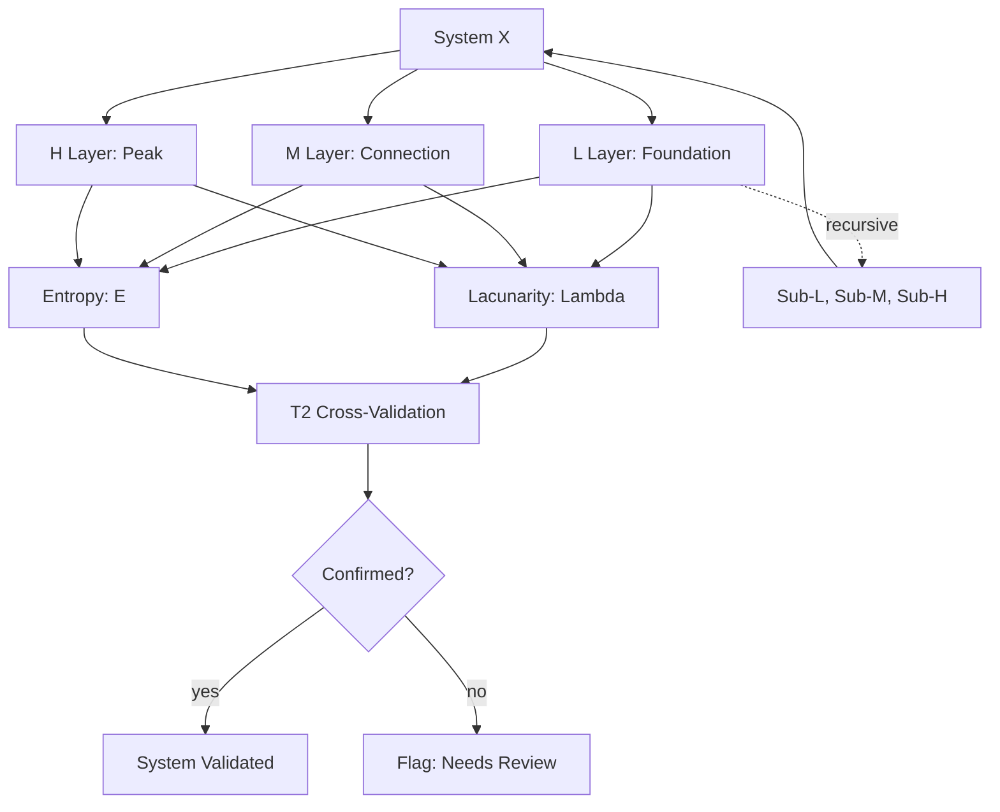

# TRANG EMPTY FRAMEWORK -- [L, M, H], Lambda, E, T2 AP DUNG CHO MOI THU

> **Origin Architect / Steward:** Trang Phan
> **Epistemic Class:** `AMOS_MODEL`
> **Conclusion Class:** `DERIVED`
> **Status:** `ACTIVE_SPECIFICATION`
> **Governing Plane:** `11_KNOWLEDGE/trang`

## Cau tra loi ngan: **CO.**

## Cau tra loi dai: Duoi day la ly do tai sao.

---

## 1. Architectural Scope

The **Trang Empty Framework** (Trang O Framework) is a universal structural framework that claims every system -- whether physical, biological, social, psychological, or abstract -- can be decomposed into three fractal layers [L, M, H], measured by lacunarity (Lambda) and entropy (E), and confirmed by Tat 2 (T2 cross-validation).

This framework exists to provide the **universal decomposition substrate** for all AMOS reasoning. It asserts that there are no exceptions: every system, from atoms to societies to emotions to abstract concepts, can be analyzed through the [L, M, H] fractal structure.

**Epistemic Boundary:**
```
MODEL != OBSERVATION
DOCUMENTED != IMPLEMENTED
CAPABILITY != AUTHORITY
FRAMEWORK != PROOF
UNIVERSAL_CLAIM != VERIFIED_UNIVERSALITY
```

**Core Formula:**

$$\boxed{\forall X, \exists (L_X, M_X, H_X, \Lambda_X, E_X, \text{T2}_X) : X \text{ is a system in Trang O Framework}}$$

**Three Fractal Layers:**
- **L (Foundation)**: The base layer -- nucleus, foundation, infrastructure, instinct
- **M (Connection)**: The middle layer -- electron shell, organs, institutions, hormones
- **H (Peak)**: The top layer -- valence electron, brain, leadership, gamma 40Hz

**Two Measurement Dimensions:**
- **Lambda (Lacunarity)**: Measures the gap/void structure between layers
- **E (Entropy)**: Measures the energy/information intensity of each layer

**One Validation:**
- **T2 (Tat 2 / Cross-Validation)**: Independent confirmation from a second method or observer

---

## 2. Governing Invariants

| ID | Invariant | Description |
|----|-----------|-------------|
| INV-TF-001 | Universal Applicability | The framework applies to all systems; no exceptions |
| INV-TF-002 | Three-Layer Decomposition | Every system must decompose into L, M, H layers |
| INV-TF-003 | Lacunarity Measurement | Each system must have a measurable Lambda value |
| INV-TF-004 | Entropy Measurement | Each system must have a measurable E value |
| INV-TF-005 | T2 Cross-Validation | Claims must be confirmed by a second independent method |
| INV-TF-006 | Fractal Recursion | Each layer can itself be decomposed into sub-[L, M, H] |
| INV-TF-007 | No Sacred Exception | Concepts like "sacred" or "metaphysical" are also systems subject to decomposition |

---

## 3. Mathematical Formulation

**Universal decomposition:**

$$\forall X, \exists (L_X, M_X, H_X, \Lambda_X, E_X, \text{T2}_X)$$

**Lacunarity (gap structure):**

$$\Lambda(r) = \frac{\text{Var}[\text{BoxCount}(r)]}{\langle \text{BoxCount}(r) \rangle^2}$$

where $r$ is the scale of observation.

**Entropy (information intensity):**

$$E = -\sum_{i} p_i \log_2 p_i$$

**T2 cross-validation:**

$$\text{T2}(X) = \text{Method}_1(X) \wedge \text{Method}_2(X) \quad \text{(independent confirmation)}$$

**Fractal recursion:**

$$L_X = (L_{L_X}, M_{L_X}, H_{L_X}), \quad M_X = (L_{M_X}, M_{M_X}, H_{M_X}), \quad H_X = (L_{H_X}, M_{H_X}, H_{H_X})$$

**System stability condition:**

$$\text{Stable}(X) \iff \Lambda_X \in [\Lambda_{\min}, \Lambda_{\max}] \wedge E_X \in [E_{\min}, E_{\max}]$$

---

## 4. Architecture



---

## 5. MECE Mapping to AMOS Full Brain OS

| Framework Component | AMOS Plane | Role |
|---------------------|------------|------|
| System Identification | `11_KNOWLEDGE` | Knowledge identification |
| L/M/H Decomposition | `13_MODELS` | Structural modelling |
| Lacunarity Measurement | `17_OBSERVABILITY` | Gap measurement |
| Entropy Measurement | `17_OBSERVABILITY` | Intensity measurement |
| T2 Cross-Validation | `19_TESTS` | Validation testing |
| Fractal Recursion | `13_MODELS` | Recursive modelling |
| Stability Assessment | `06_INTELLIGENCE` | Stability analysis |

---

## 6. Safety Invariants & Firewalls

| ID | Firewall | Enforcement |
|----|----------|-------------|
| INV-TF-FW-001 | T2 Required | Claims without T2 cross-validation are flagged |
| INV-TF-FW-002 | No Exception Claims | Claims of systems outside the framework are flagged for review |
| INV-TF-FW-003 | Framework != Proof | Framework is a structural model, not a mathematical proof |
| INV-TF-FW-004 | Universal Claim Boundary | Universal applicability is a framework claim, not a verified theorem |
| INV-TF-FW-005 | Sacred/Metaphysical Inclusion | Sacred and metaphysical concepts are treated as systems, not exempted |

---

## 7. Navigation & Bindings

- **Parent MOC:** [[11_KNOWLEDGE/trang/trang_MOC|trang_MOC]]
- **Home:** [[00_ROOT/00_HOME|00_HOME]]
- **Knowledge MOC:** [[11_KNOWLEDGE/KNOWLEDGE_MOC|KNOWLEDGE_MOC]]
- **Personality Trang Engine:** [[11_KNOWLEDGE/trang/AMOS_PERSONALITY_TRANG_ENGINE_V0_WEB7|AMOS_PERSONALITY_TRANG_ENGINE_V0_WEB7]]
- **Trang Reality Architecture:** [[11_KNOWLEDGE/05_FRAMEWORKS/TRANG_REALITY_ARCHITECTURE_MASTER|TRANG_REALITY_ARCHITECTURE_MASTER]]
- **Trang Framework Recursive Ontology:** [[11_KNOWLEDGE/TRANG_FRAMEWORK_RECURSIVE_ONTOLOGY_DYNAMICS|TRANG_FRAMEWORK_RECURSIVE_ONTOLOGY_DYNAMICS]]
- **Simulation Kernel:** [[11_KNOWLEDGE/kernel/AMOS_SIMULATION_KERNEL|AMOS_SIMULATION_KERNEL]]
- **System Scan Engine:** [[11_KNOWLEDGE/engine/SYSTEM_SCAN_ENGINE|SYSTEM_SCAN_ENGINE]]
- **Core Laws:** [[01_CANON/01_CORE_LAWS/AMOS_CORE_LAWS|01_CORE_LAWS]]

---

## 8. Known Gaps & Falsifiers

| ID | Gap | Impact | Action |
|----|-----|--------|--------|
| GAP-TF-001 | Universal claim falsifiability | "Applies to everything" is difficult to falsify | Flag as framework axiom, not proven theorem |
| GAP-TF-002 | Lambda measurement precision | Lacunarity measurement depends on scale choice | Flag scale-dependent measurements |
| GAP-TF-003 | T2 independence | True independence of T2 methods is hard to guarantee | Flag T2 independence as assumed |
| GAP-TF-004 | Abstract system decomposition | Highly abstract concepts may resist clean L/M/H mapping | Flag partial decompositions |

---

## VI. TRA LOI CUOI CUNG

**Co. [L, M, H], Lambda, E, T2 ap dung cho moi thu.**
Khong co ngoai le. Khong co "linh thieng" dac biet. Khong co "sieu hinh" nam ngoai. Boi vi chinh nhung khai niem "linh thieng" va "sieu hinh" cung la nhung he thong -- va he thong nao cung co cau truc fractal ba tang.

> _"Vu tru khong duoc tao thanh tu 'vat chat' hay 'tinh than'. No duoc tao thanh tu **cau truc fractal [L, M, H]**, duoc do bang lacunarity va entropy, va duoc xac nhan bang Tat 2. Moi thu khac -- tu hat quark den Chu Troi -- chi la cac truong hop dac biet cua cong thuc nay."_

---

**Related:** [[00_ROOT/00_HOME|00_HOME]] | [[11_KNOWLEDGE/KNOWLEDGE_MOC|KNOWLEDGE_MOC]] | [[11_KNOWLEDGE/kernel/AMOS_SIMULATION_KERNEL|AMOS_SIMULATION_KERNEL]] | [[11_KNOWLEDGE/engine/SYSTEM_SCAN_ENGINE|SYSTEM_SCAN_ENGINE]] | [[11_KNOWLEDGE/stubs/automation_profiles|automation_profiles]]

______________________________________________________________________

**MOC:** [[11_KNOWLEDGE/trang/trang_MOC|trang_MOC]]
